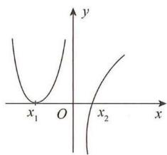
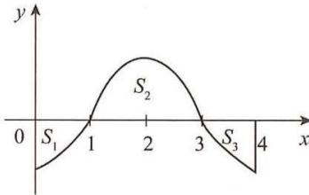
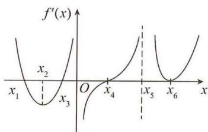
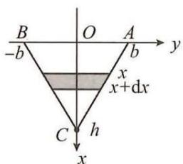
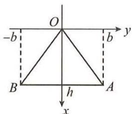
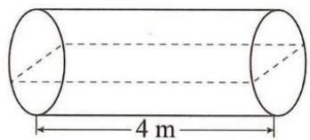
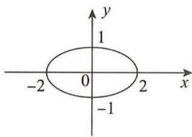
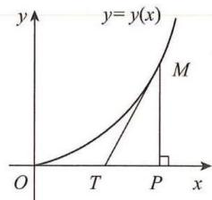

## 目录

第一章 函数、极限、连续....2
    基础题....2
    综合题....6
    拓展题....13
第二章 一元函数微分学及其应用....14
    基础题....14
    综合题....24
    拓展题....33
第三章 一元函数积分学及其应用....35
    基础题....35
    综合题....44
    拓展题....57
第四章 多元函数微分学及其应用....59
    基础题....59
    综合题....63
    拓展题....68
第五章 二重积分....69
    基础题....69
    综合题....73
    拓展题....78
第六章 微分方程及其应用....79
    基础题....79
    综合题....82
    拓展题....88

## 高等数学篇

## 第一章 函数、极限、连续

## 基础题

## 一、选择题

(1) 函数 $f(x)=|x\sin x|\mathrm{e}^{\cos x}, x \in (-\infty, +\infty)$ ，是（）.
A. 单调函数 B. 周期函数 C. 偶函数 D. 有界函数

(2) 设函数 $f(x)=\cos(\sin x)$ , $g(x)=\sin(\cos x)$ ，则当 $x\in\left(0,\frac{\pi}{2}\right)$ 时，（）.
A. $f(x)$ 单调递增, $g(x)$ 单调递减
B. $f(x)$ 单调递减, $g(x)$ 单调递增
C. $f(x)$ 与 $g(x)$ 都单调递增
D. $f(x)$ 与 $g(x)$ 都单调递减

(3) 设函数 $f(x)=\sqrt{1+x+x^{2}}-\sqrt{1-x+x^{2}}$ ，则（）.
A. $f(x)$ 为偶函数 B. $f(x)$ 为奇函数 C. $f(x)$ 为无界函数 D. $\lim_{x\to\infty}f(x)=1$

(4) 设当 $x \to +\infty$ 时， $f(x)$ ， $g(x)$ 都是无穷大，则当 $x \to +\infty$ 时，下列结论正确的是（）.
A. $f(x) - g(x)$ 是无穷小
B. $f(x) + g(x)$ 是无穷大
C. $\frac{g(x)}{f(x)} \to 1$ D. $\frac{f(x) + g(x)}{f(x)g(x)}$ 是无穷小

(5) 当 $x \to 0$ 时, $\frac{1}{x^2} \sin \frac{1}{x}$ 是 ( ). A. 无穷大 B. 无穷小 C. 有界但非无穷小 D. 无界但非无穷大

(6) 已知 $\lim_{x\to\infty}\left(\frac{x^{2}}{x+1}-ax-b\right)=0$ ，则（）.
A. a=1, b=1 B. a=-1, b=1 C. a=1, b=-1 D. a=-1, b=-1

(7) 设当 $x \to 0$ 时, $(x - \sin x) \tan x$ 是比 $\ln(1 + x^{n})$ 高阶的无穷小, 而 $\ln(1 + x^{n})$ 是比 $x^{2}$ 高阶的无穷小, 则 $n = (\quad)$ .
A. 4 B. 3 C. 2 D. 1

(8) 当 $x \to 0$ 时， $\mathrm{e}^x - \frac{1 + ax^2}{1 + bx}$ 与 $x^3$ 是同阶无穷小，则（）.  
A. $a = \frac{1}{2}, b = 1$ B. $a = -\frac{1}{2}, b = 1$ C. $a = \frac{1}{2}, b = -1$ D. $a = -\frac{1}{2}, b = -1$

这是一条为了防止被小坏蛋拿去转卖抹掉的水印，发出来的资料都是免费获取(这里 https://nocode.host/hjr2pw)

(9) 设 $f(x)=\ln^{2}x, g(x)=x, h(x)=\mathrm{e}^{\frac{x}{2}}(x>1)$ ，则当 x 充分大时，( ).  
A. $f(x)<g(x)<h(x)$ B. $g(x)<h(x)<f(x)$ C. $h(x) < g(x) < f(x)$ D. $g(x) < f(x) < h(x)$

(10) 设 $\lim_{n\to \infty}a_n$ 与 $\lim_{n\to \infty}b_n$ 均不存在，则下列选项正确的是（）.  
A. 若 $\lim_{n\to \infty}(a_n + b_n)$ 不存在，则 $\lim_{n\to \infty}(a_n - b_n)$ 必不存在  
B. 若 $\lim_{n\to \infty}(a_n + b_n)$ 不存在，则 $\lim_{n\to \infty}(a_n - b_n)$ 必存在  
C. 若 $\lim_{n\to \infty}(a_n + b_n)$ 存在，则 $\lim_{n\to \infty}(a_n - b_n)$ 必不存在  
D. 若 $\lim_{n\to \infty}(a_n + b_n)$ 存在，则 $\lim_{n\to \infty}(a_n - b_n)$ 必存在

(11) 设正值数列 $\{x_{n}\}$ 和 $\{y_{n}\}$ 满足 $\lim_{n\to\infty}x_{n}^{n}=\lim_{n\to\infty}y_{n}^{n}=e$ ，则 $\lim_{n\to\infty}n(x_{n}+y_{n}-2)=(\quad)$ .
A. e B. 2e C. 2 D. 1

(12) 函数 $f(x)=\frac{2+\mathrm{e}^{\frac{1}{x}}}{1+\mathrm{e}^{\frac{2}{x}}}+\frac{\sin x}{|x|}$ 在 x=0 处为 ( ).  
A. 可去间断点 B. 跳跃间断点 C. 无穷间断点 D. 振荡间断点

(13) $f(x)=\frac{(x^{2}-x)|x+1|e^{-\frac{1}{x}}}{\int_{1}^{x}t^{2}\sin tdt}(x\in[-\pi,\pi])$ 的第一类间断点的个数为( ).
A. 0 B. 1 C. 2 D. 3

## 二、填空题

(1) 设 $f(x) = \begin{cases} 1, & |x| \leqslant 1, \\ 0, & |x| > 1, \end{cases}$ 则 $f\{f[f(x)]\} =$ \_\_\_\_.

(2) 当 $x \to 0$ 时, $(1 + ax^2)^{\frac{1}{3}} - 1$ 与 $\cos x - 1$ 是等价无穷小, 则 $a = \underline{\quad}$ .

(3) 设函数 $f(x) = \begin{cases} \frac{\sin 2x + \mathrm{e}^{2ax} - 1}{x}, & x \neq 0, \\ a, & x = 0 \end{cases}$ 在 $x = 0$ 处连续，则 $a =$ \_\_\_\_.

(4) 设 $a > 0$ 且 $a \neq 1$ ，知 $\lim_{x \to +\infty} x^P \left( a^{\frac{1}{x}} - a^{\frac{1}{x+1}} \right)$ 存在，则 $P$ 的取值范围为 \_\_\_\_.

(5) $\lim_{x\to +\infty}\frac{x^3 + x^2 + 1}{\mathrm{e}^x + x^3} (\sin x + \cos x) =$

(6) $\lim_{x\to0}\frac{e^{x^{2}}-e^{2-2\cos x}}{e^{x^{4}}-1}=$ \_\_\_\_.

## 三、解答题

(1) 设函数 $f(x)$ 满足 $af(x) + bf\left(\frac{1}{x}\right) = \frac{c}{x}$ ，其中 a, b, c 均为常数，且 $|a| \neq |b|$ ，求 $f(x)$ 的表达式，并证明 $f(x)$ 是奇函数.

(2) 求下列极限:

(I) $\lim_{x\to\infty}\frac{x^{2}-x\sin x}{x^{2}+x\sin\frac{1}{x}}$ ;

$(II)\lim_{x\to+\infty}\left(\frac{a^{\frac{1}{x}}+b^{\frac{1}{x}}+c^{\frac{1}{x}}}{3}\right)^{x}(a,b,c$ 为正数);

$$
(I I I) \lim _ {x \rightarrow 0} \frac {\ln (\sin^ {2} x + e ^ {x}) - x}{\ln (e ^ {2 x} - x ^ {2}) - 2 x};
$$

$$
(I V) \lim _ {x \rightarrow 0} \frac {(1 + x) ^ {\frac {3}{x}} - e ^ {3}}{x};
$$

$$
(V) \lim _ {x \rightarrow 0} \frac {\mathrm{e} ^ {\tan x} - \mathrm{e} ^ {x}}{x ^ {3}};
$$

$$
(V I) \lim _ {x \rightarrow 0} \cot x \left(\frac {1}{\sin x} - \frac {1}{x}\right);
$$

$$
(V I I) \lim _ {x \rightarrow 0} (1 - x ^ {2}) ^ {\frac {1}{1 - \sqrt {1 - x ^ {2}}}};
$$

$$
(V I I) \lim _ {x \to 0 ^ {+}} x ^ {\sin x}.
$$

(3) 求下列极限:

$$
(I) \lim _ {n \rightarrow \infty} \left(\frac {1}{n ^ {2} + n + 1} + \frac {2}{n ^ {2} + n + 2} + \dots + \frac {n}{n ^ {2} + n + n}\right);
$$

$$
(I I) \lim _ {n \rightarrow \infty} \left[ \sqrt {1 + 2 + \cdots + n} - \sqrt {1 + 2 + \cdots + (n - 1)} \right];
$$

$$
(I I I) \lim _ {n \rightarrow \infty} \sum_ {k = 1} ^ {n} \frac {1}{4 k ^ {2} - 1};
$$

$$
(I V) \lim _ {n \rightarrow \infty} \sqrt [ n ]{1 + \frac {1}{2} + \frac {1}{3} + \dots + \frac {1}{n}};
$$

$$
(V) \lim _ {n \rightarrow \infty} \left(\frac {1 + \sqrt [ n ]{3}}{2}\right) ^ {n}.
$$

(4) 求 $f(x) = (1 + x)^{\frac{x}{\tan \left(x - \frac{\pi}{4}\right)}}$ 在 $(0, 2\pi)$ 内的间断点，并指出其类型.

(5) 讨论函数 $f(x) = \lim_{n\to \infty}\frac{x^{n + 2} - x^{-n}}{x^n + x^{-n}}$ 的连续性.

## 综合题

## 一、选择题

(1) $\lim_{x\to\infty}\frac{e^{\sin\frac{1}{x}}-1}{\left(1+\frac{1}{x}\right)^{k}-\left(1+\frac{1}{x}\right)}=a\neq0$ 成立的充分必要条件是( ).
A. $k \neq 1$ B. k > 1 C. k > 0 D. 与 k 无关

(2) 设 $a > 0$ , $\lim_{x \to +\infty} x^a \ln \frac{\arctan(x+1)}{\arctan x} = b$ ，则（）.

A. $a = 2, b = \frac{2}{\pi}$ B. $a = 2, b = \frac{\pi}{2}$ C. $a = 1, b = \frac{2}{\pi}$ D. $a = 1, b = \frac{\pi}{2}$

(3) 设当 $x \to 0$ 时, $\alpha(x) = \tan x - \sin x, \beta(x) = \sqrt{1 + x^2} - \sqrt{1 - x^2}, \gamma(x) = \int_0^{1 - \cos x} \sin t dt$ 都是无穷小, 将它们关于 $x$ 的阶数从低到高排列, 正确的顺序为 ( ). A. $\alpha(x), \beta(x), \gamma(x)$ B. $\alpha(x), \gamma(x), \beta(x)$ C. $\gamma(x), \alpha(x), \beta(x)$ D. $\beta(x), \alpha(x), \gamma(x)$

(4) 当 $x \to 0$ 时， $(1 + x)^{\frac{2}{x}} - e^{2}[1 - \ln(1 + x)]$ 是关于 x 的（）.
A. 等价无穷小 B. 同阶但非等价无穷小
C. 高阶无穷小 D. 低阶无穷小.

(5) 设 $y = y(x)$ 是方程 $y'' + 2y' + y = e^{3x}$ 的解, 且满足 $y(0) = y'(0) = 0$ , 则当 $x \to 0$ 时, 与 $y(x)$ 为等价无穷小的是 ( ). A. $\sin x^{2}$ B. $\sin x$ C. $\ln(1 + x^{2})$ D. $\ln\sqrt{1 + x^{2}}$

(6) 设 $F(x)=\left\{\begin{aligned}\frac{f(x)}{x},&x\neq0,\\ f(0),&x=0,\end{aligned}\right.$ 其中 $f(x)$ 在 x=0 处可导，且 $f'(0)\neq0,f(0)=0$ ，则（）.
A. x=0 是 $F(x)$ 的连续点 B. x=0 是 $F(x)$ 的第一类间断点 C. x=0 是 $F(x)$ 的第二类间断点 D. 以上说法均错误

(7) 设 $f(x)=\left\{\begin{aligned}&(x+1)\arctan\frac{1}{x^{2}-1},&x\neq\pm1,\\ &0,&x=\pm1,\end{aligned}\right.$ 则 $f(x)()$ .
A. 在 x=1, x=-1 处都连续 B. 在 x=1, x=-1 处都间断
C. 在 x=-1 处间断, x=1 处连续 D. 在 x=-1 处连续, x=1 处间断

(8) $f(x)=\frac{x\ln|x|}{|x-1|}\mathrm{e}^{\frac{1}{(x-1)(x-2)}}$ 的无穷间断点的个数为（）.
A. 0 B. 1 C. 2 D. 3

(9) 下列结论错误的是 ( ).

A. 设 $\lim_{n\to\infty}a_n=a>1$ , 则存在 M>1, 当 n 充分大时, 有 $a_n>M$ B. 设 $a=\lim_{n\to\infty}a_n<\lim_{n\to\infty}b_n=b$ , 则当 n 充分大时, 有 $a_n<b_n$ C. 设 $M\leqslant a_n\leqslant N(n=1,2,\cdots)$ , 若 $\lim_{n\to\infty}a_n=a$ , 则 $M\leqslant a\leqslant N$ D. 若 $\lim_{n\to\infty}a_n=a\neq0$ , 则当 n 充分大时, $a_n>a-\frac{1}{n}$

(10) 设 $\{x_{n}\}$ 与 $\{y_{n}\}$ 为两个数列，则下列说法正确的是（）.  
A. 若 $\{x_{n}\}$ 与 $\{y_{n}\}$ 无界, 则 $\{x_{n} + y_{n}\}$ 无界  
B. 若 $\{x_{n}\}$ 与 $\{y_{n}\}$ 无界, 则 $\{x_{n}y_{n}\}$ 无界  
C. 若 $\{x_{n}\}$ 与 $\{y_{n}\}$ 中, 一个有界, 一个无界, 则 $\{x_{n}y_{n}\}$ 无界  
D. 若 $\{x_{n}\}$ 与 $\{y_{n}\}$ 均为无穷大, 则 $\{x_{n}y_{n}\}$ 一定为无穷大

(11) 设数列 $\{x_{n}\}$ 单调减少, $\{y_{n}\}$ 单调增加, 且 $\lim_{n\to\infty}(x_{n}-y_{n})=0$ , 则下列选项正确的是 ( ).

A. $\lim_{n\to\infty}x_{n}=0, \lim_{n\to\infty}y_{n}=0$ B. $\lim_{n\to\infty}x_{n}, \lim_{n\to\infty}y_{n}$ 均存在, 且 $\lim_{n\to\infty}x_{n}=\lim_{n\to\infty}y_{n}$ C. $\lim_{n\to\infty}x_{n}$ 存在, $\lim_{n\to\infty}y_{n}$ 不存在

D. $\lim_{n\to\infty}x_{n}$ 与 $\lim_{n\to\infty}y_{n}$ 均不存在

(12) 设正项数列 $\{x_{n}\},\{y_{n}\}$ 满足 $e^{x_{n}}=x_{n}+e^{y_{n}}(n=1,2,\cdots)$ ，且 $\lim_{n\to\infty}x_{n}=0$ ，则当 $n\to\infty$ 时，下列选项正确的是（）.
A. $y_{n}$ 是比 $x_{n}$ 高阶的无穷小
B. $x_{n}$ 是比 $y_{n}$ 高阶的无穷小
C. $y_{n}$ 与 $x_{n}$ 是等价无穷小
D. $x_{n}$ 与 $y_{n}$ 是同阶但不等阶无穷小

(13) 设 $f(n)$ 表示方程 $x(1 + \ln x) = n$ 的正实根, 其中 $x \geqslant 1, n$ 为正整数, 则下列选项正确的是 ( ). A. $\{f(n)\}$ 收敛 B. $\left\{\frac{f(n)}{n}\right\}$ 发散 C. $\left\{\frac{f(n)\ln n}{n}\right\}$ 收敛 D. $\left\{\frac{f(n)\ln n}{n}\right\}$ 发散

(14) 设 $\{x_{n}\}$ 为数列，则下列结论正确的是（）.

①若 $\{\arctan x_{n}\}$ 收敛，则 $\{x_{n}\}$ 收敛；

②若 $\{\arctan x_{n}\}$ 单调，则 $\{x_{n}\}$ 收敛；

③若 $x_{n}\in [-1,1]$ ，且 $\{x_{n}\}$ 收敛，则 $\{\arcsin x_n\}$ 收敛；

④若 $x_{n}\in [-1,1]$ ，且 $\{x_{n}\}$ 单调，则 $\{\arcsin x_n\}$ 收敛. A. ①② B. ③④ C. ①③ D. ②④

(15) 设正项数列 $\{x_{n}\}$ 满足 $x_{n+1}<2-\frac{1}{x_{n}}(n=1,2,\cdots)$ ，则（）.
A. $\{x_{n}\}$ 收敛于 0 B. $\{x_{n}\}$ 收敛于 0 C. $\{x_{n}\}$ 收敛于 2 D. $\{x_{n}\}$ 发散

(16)下列极限存在的是().
A. $\lim_{x\to1}\frac{1}{1+2^{\frac{1}{1-x}}}$ B. $\lim_{x\to+\infty}\left(1+\frac{\sin x}{x}\right)^{x}$ C. $\lim_{n\to\infty}[n+(-1)^{n}(n+1)]$ D. $\lim_{n\to\infty}\left(\frac{1}{1^{2}}+\frac{1}{2^{2}}+\cdots+\frac{1}{n^{2}}\right)^{\frac{1}{n}}$

(17) 设 $f(x)$ 在 $(- \infty, +\infty)$ 内为连续的奇函数， $a$ 为常数，则必为偶函数的是（）.  
A. $\int_{0}^{x} du \int_{a}^{u} tf(t) dt$ B. $\int_{a}^{x} du \int_{0}^{u} f(t) dt$ C. $\int_{0}^{x} du \int_{a}^{u} f(t) dt$ D. $\int_{a}^{x} du \int_{0}^{u} tf(t) dt$ (18) 设 $f(x)=\lim_{t\to+\infty}\frac{x+2^{tx}}{1+2^{tx}}$ ，则 $F(x)=\int_{-1}^{x}f(t)dt$ 在 x=0 处（）.
A. 可导 B. 不连续 C. 不可导但连续 D. 无法判定

(19) 设 $f(x) = \begin{cases} \frac{(x^3 - 1)\sin x}{|x|(1 + x^2)}, & x \neq 0, \\ 0, & x \in (-\infty, +\infty), \text{则} (\quad). \end{cases}$

A. $f(x)$ 在 $(-\infty, +\infty)$ 内有界

B. 存在 X > 0, 当 $|x| < X$ 时, $f(x)$ 有界, 当 $|x| > X$ 时, $f(x)$ 无界

C. 存在 X > 0, 当 $|x| < X$ 时, $f(x)$ 无界, 当 $|x| > X$ 时, $f(x)$ 有界

D. 对任意 X > 0, 当 $|x| \leqslant X$ 时, $f(x)$ 有界, 但在 $(-∞, +∞)$ 内无界

## 二、填空题

(1) 当 $x \to 0$ 时， $f(x) = 3x - 4\sin x + \sin x\cos x$ 是关于 $x$ 的 \_\_\_\_ 阶无穷小.

(2) 极限 $\lim_{x\to0}\frac{(\cos x-e^{x^{2}})\sin x^{2}}{\frac{x^{2}}{2}+1-\sqrt{1+x^{2}}}=\underline{\quad}$ .

(3) 设 $f(x)$ 是连续函数, $\lim_{x \to 0} \frac{f(x)}{1 - \cos x} = -1$ , 当 $x \to 0$ 时, $\int_{0}^{\sin^2 x} f(t) dt$ 是关于 $x$ 的 $n$ 阶无穷小, 则 $n =$ \_\_\_\_.

(4) 设 $\lim_{x\to a}\frac{f(x) - b}{x - a} = A$ ，则 $\lim_{x\to a}\frac{\mathrm{e}^{f(x)} - \mathrm{e}^b}{x - a} = \underline{\quad}$ .

(5) 设 $a_{n}=\frac{3}{2}\int_{0}^{\frac{n}{n+1}}x^{n-1}\sqrt{1+x^{n}}dx$ ，则 $\lim_{n\to\infty}na_{n}=$ \_\_\_\_.

(6) 设 $k \neq \frac{1}{2}$ , 则 $\lim_{n \to \infty} \ln \left[ \frac{n - 2nk + 1}{n(1 - 2k)} \right]^n =$ \_\_\_\_.

(7) 设 $0 < a_{1} < a_{2}$ , 则 $\lim_{n\to \infty}\left(a_{1}^{-n} + a_{2}^{-n}\right)^{\frac{1}{n}} =$ \_\_\_\_.

(8) 设 $\lim_{x\to \infty}\left(\sqrt[3]{1 - x^6} -ax^2 -b\right) = 0$ ，则 $a = \_$ ， $b = \_$ .

(9) 设 $\lim_{x \to 0} \left\{ a[x] + \frac{\ln\left(1 + e^{\frac{2}{x}}\right)}{\ln\left(1 + e^{\frac{1}{x}}\right)} \right\} = b$ ，其中 $[x]$ 表示不超过 $x$ 的最大整数，则 $a =$ ， $b =$ \_\_\_\_.

(10) 设 $f(x)$ 是连续函数, 且 $\lim_{x\to\infty}f(x)=\frac{1}{e}$ , 若正数 a 满足 $\lim_{x\to\infty}\left(\cos\frac{a}{x}\right)^{x^{2}}=\lim_{x\to\infty}\int_{x}^{x+1}f(t)dt$ , 则 a= \_\_\_\_.

(11) 已知连续函数 $y = f(x)$ 关于点 $(a,0)(a \neq 0)$ 对称, 则对常数 $c, I = \int_{-c}^{c} f(a - x) \mathrm{d}x =$ \_\_\_\_.

(12) 设函数 $y = y(x)$ 由方程 $y^2 + xy + x^2 - x = 0$ 确定，且 $y(1) = -1$ ，则 $\lim_{x \to 1} \frac{(x - 1)^2}{1 + y(x)} =$ \_\_\_\_.

(13) 设 $f''(1)$ 存在, $f'(1) \neq 0$ , 则 $\lim_{x \to 1} \left[ \frac{1}{f'(1)(x-1)} - \frac{1}{f(x) - f(1)} \right] =$ \_\_\_\_.

## 三、解答题

(1) 设数列 $\{a_{n}\}$ 满足 $\lim_{n\to \infty}\frac{a_{n + 1}}{a_n} = q$ ，且 $|q| < 1$ ，证明： $\lim_{n\to \infty}a_n = 0.$

(2) 设 $a_{k}=2^{\frac{1}{2^{k}}}$ , $u_{n}=a_{1}a_{2}\cdots a_{n}(n=1,2,\cdots)$ ，求 $\lim_{n\to\infty}u_{n}$ .

(3) 求下列极限:

(I) 设 $x_{1}=1, x_{2}=2, x_{n+2}=\frac{1}{2}(3x_{n+1}-x_{n})(n=1,2,\cdots)$ ，求 $\lim_{n\to\infty}x_{n}$ .

(II) 设 $x_{1} = 1, x_{2} = 2, x_{n + 2} = \frac{1}{2} (x_{n} + x_{n + 1})$ , 求 $\lim_{n \to \infty} x_{n}$ .

(4) 设 $f(x)$ 在 $[0,1]$ 上连续, 且 $f(0) = f(1)$ , 证明:

(I) 至少存在一点 $\xi \in (0,1)$ ，使得 $f(\xi) = f\left(\xi + \frac{1}{2}\right)$ ;

(II) 至少存在一点 $\xi \in (0,1)$ , 使得 $f(\xi) = f\left(\xi + \frac{1}{n}\right)(n \geqslant 2$ 为自然数).

(5) 计算极限 $\lim_{x\to0}\frac{\int_{0}^{x}\left[(3+2\tan t)^{t}-3^{t}\right]dt}{e^{3x^{3}}-1}.$

(6) 计算极限 $\lim_{x\to+\infty}\frac{\frac{1}{x^{3}}\int_{1}^{x}\left[(1+t^{2})\sin\frac{1}{t}-\cos t\right]dt}{1-e^{\frac{1}{x}}}$ .

(7) 计算极限 $\lim_{x\to1^{-}}\frac{\pi\int_{0}^{x}\left[\ln(1-t)+\tan\frac{\pi}{2}t\right]dt}{\ln|\sin\pi x|}$ .

(8) 计算极限 $\lim_{x\to \infty}x^2\left[\mathrm{e}^{\left(1 + \frac{1}{x}\right)^x} - \left(1 + \frac{1}{x}\right)^{ex}\right].$

(9) 计算极限 $\lim_{n\to \infty}\frac{n\left(\sqrt[n]{n + 1} - n + 1\sqrt[n]{n}\right)}{(\sqrt[n]{e} - 1)\ln n}$ .

(10) 在 $x = 0$ 的邻域内, 用 $ax + bx^2 + cx^3$ 近似表示函数 $\arctan x$ , 使其误差是比 $x^3$ 高阶的无穷小 $(x \to 0)$ , 求 $a, b, c$ 的值.

(11) 设 $a(a > -1)$ 为非零常数, $\lim_{x \to +\infty} \frac{\int_1^x \left[ (t + a)^{1 + \frac{1}{t}} - t^{1 + \frac{1}{t + a}} \right] dt}{x} = 1$ , 求 $a$ 的值.

(12) 设 $0 < x_{1} < \pi, x_{n+1} = \sin x_{n}$ .

(I) 证明: $\lim_{n\to\infty}x_{n}$ 存在, 并求值;

(II) 求 $\lim_{n\to\infty}\left(\frac{x_{n+1}}{x_n}\right)^{\frac{1}{x_n^2}}$ .

(13) 设 $x_{1} > 0$ ，数列 $\{x_{n}\}$ 满足 $x_{n+1} = \ln (\mathrm{e}^{x_n} - 1) - \ln x_n$ ，证明: $\lim_{n\to \infty}x_n$ 存在，并求值.

(14) 求下列极限:

(I) 当 $|x| < 1$ 时, 求 $\lim_{n \to \infty} (1 + x)(1 + x^{2})(1 + x^{4}) \cdots (1 + x^{2^{n}})$ ;

(II) 当 $|x| \neq 0$ 时, 求 $\lim_{n \to \infty} \cos \frac{x}{2} \cos \frac{x}{4} \cdots \cos \frac{x}{2^n}$ ;

$(III)\lim_{x\to \frac{\pi}{2}}\frac{(1 - \sqrt{\sin x})(1 - \sqrt[3]{\sin x})\cdots(1 - \sqrt[n]{\sin x})}{(1 - \sin x)^{n - 1}}.$

(15) 求下列极限:

(I) 设 $\lim_{x\to0}\frac{\ln\left[1+\frac{f(x)}{\sin x}\right]}{a^{x}-1}=\frac{1}{2}(a>0,a\neq1)$ ，求 $\lim_{x\to0}\frac{f(x)}{x^{2}}$ ;

(II) 设 $f(x)$ 是三次多项式, 且有 $\lim_{x\to 2a}\frac{f(x)}{x - 2a} = \lim_{x\to 4a}\frac{f(x)}{x - 4a} = 1 (a \neq 0)$ , 求 $\lim_{x\to 3a}\frac{f(x)}{x - 3a}$ .

$$
x _ {1} = \frac {1}{2}, x _ {n + 1} = x _ {n} ^ {2} + x _ {n} (n = 1, 2, \dots)
$$

$$
\lim _ {n \rightarrow \infty} \left(\frac {1}{x _ {1} + 1} + \frac {1}{x _ {2} + 1} + \dots + \frac {1}{x _ {n} + 1}\right).
$$

(17) 设 $a_{n}=\int_{0}^{1}\sin x^{n}dx, b_{n}=\int_{0}^{1}\sin^{n}x\mathrm{d}x(n=1,2,\cdots)$ ，证明：

(I) $0 \leqslant b_{n} \leqslant a_{n};$

$(II)\lim_{n\to \infty}a_n = \lim_{n\to \infty}b_n = 0.$

## 拓展题

## 解答题

(1) 设 $x_{0} \in \left(-\frac{\pi}{2}, \frac{\pi}{2}\right)$ ，数列 $\{x_{n}\}$ 满足 $x_{n+1} = \frac{1}{2}(x_{n} + \arctan x_{n})(n = 0, 1, 2, \cdots)$ .

(I) 证明: $\lim_{n\to\infty}x_{n}$ 存在, 并求其值;

(II) 求 $\lim_{n\to\infty}\frac{(1+x_{n})^{\frac{1}{x_{n}}}-(1+2x_{n})^{\frac{1}{2x_{n}}}}{2x_{n+1}-x_{n}}$ .

(2) $(I)$ 设 $f(x)$ 是 $[0, +\infty)$ 上单调减少且非负的连续函数. 证明:

$$
f (k + 1) \leqslant \int_ {k} ^ {k + 1} f (x) \mathrm{d} x \leqslant f (k) (k = 1, 2, \dots);
$$

(II) 证明: $\ln(1+n)\leqslant1+\frac{1}{2}+\cdots+\frac{1}{n}\leqslant1+\ln n,$ 并求极限 $\lim_{n\to\infty}\frac{1+\frac{1}{2}+\cdots+\frac{1}{n}}{\ln n}.$

(3) 设 $f_{n}(x)=x^{n}-\cos x(n=1,2,\cdots)$ .

(I) 证明方程 $f_{n}(x) = 0$ 在 $x \in (0,1)$ 内有唯一实根 $x_{n}$ ;

(II) 求 $\lim_{n\to\infty}(1-x_{n})^{\frac{1}{n}\ln\cos x_{n}}$ .

(4) (I) 证明: $\frac{1}{n} - \ln \left(1 + \frac{1}{n}\right) < \frac{1}{2n^2}$ ( $n$ 为正整数);

(II) 求极限 $\lim_{n\to\infty}\left(1+\frac{1}{n^{2}}\right)\left(1+\frac{2}{n^{2}}\right)\cdots\left(1+\frac{n}{n^{2}}\right)$ .

## 第二章 一元函数微分学及其应用

## 基础题

## 一、选择题

(1) 设 $f(x)=\left\{\begin{aligned}&\frac{1-\cos x}{\sqrt{x}},&x>0,\\ &x^{2}\cdot\varphi(x),&x\leqslant0,\end{aligned}\right.$ 其中 $\varphi(x)$ 是有界函数，则 $f(x)$ 在 x=0 处（）.
A. 可导
B. 连续,但不可导
C. 极限存在,但不连续
D. 极限不存在

(2) 设 $f'(x)$ 存在, a, b 为任意实数，则 $\lim_{\Delta x \to 0} \frac{f(x + a \Delta x) - f(x - b \Delta x)}{\Delta x} = (\quad)$ .
A. $(a+b)f'(x)$ B. $(a-b)f'(x)$ C. $af'(x)$ D. $bf'(x)$

(3) 设 $f(x)=\frac{\sqrt{x}}{\sqrt{1+x}+1}$ ，则 $f(x)$ 在 x=0 处（）.
A. 连续且可导 B. 右连续但右导数不存在
C. 右连续且右导数存在 D. 右极限存在且右导数存在

(4) 设 $f(x)=\left\{\begin{aligned}&a\sqrt{x},&0\leqslant x\leqslant b,\\ &\ln x,&x>b\end{aligned}\right.$ 在 $(0,+\infty)$ 内可导，在 x=0 处右连续，则（）.
A. $a=\frac{2}{e}, b=e^{2}$ B. $a=\frac{2}{e}, b=e$ C. $a=\frac{1}{e}, b=e^{2}$ D. $a=\frac{1}{e}, b=e$

(5) $f(x)=(x^{2}+3x+2)|x^{3}-x|$ 不可导点的个数为（）.
A. 1 B. 2 C. 3 D. 4

(6)下列函数中, 在 x=0 处不可导的是( ).  
A. $f(x)=|x|\sin|x|$ B. $f(x)=|x|\sin\sqrt{|x|}$ C. $f(x)=\cos|x|$ D. $f(x)=\cos\sqrt{|x|}$ (7) 设 $f(x)$ 可导且 $f'(x_0) = \frac{1}{2}$ ，则当 $\Delta x \to 0$ 时， $f(x)$ 在 $x_0$ 处的微分 dy 是 $\Delta x$ 的（）无穷小.
A. 等价 B. 同阶但不等价 C. 低阶 D. 高阶

(8) 设 $f(-x) = -f(x)$ ，且在 $(0, +\infty)$ 内， $f'(x) > 0, f''(x) > 0$ ，则 $f(x)$ 在 $(-∞, 0)$ 内必有（）.
A. $f'(x) < 0, f''(x) < 0$ B. $f'(x) < 0, f''(x) > 0$ C. $f'(x) > 0, f''(x) < 0$ D. $f'(x) > 0, f''(x) > 0$

(9) 设 $f(x)$ 在 $[-1,1]$ 上二阶可导，且 $f''(x) > 0, \int_{-1}^{1} f(x) \, dx = 2$ ，则 $f(0)$ 的取值范围为（）.
A. $(-\infty,0]$ B. $(0,+\infty)$ C. $(-\infty,1)$ D. $(1,+\infty)$

(10) 设 $f(x)$ 在 x=0 的某邻域内连续， $f(0)=0,\quad\lim_{x\to0}\frac{f(x)}{1-\cos x}=2$ ，则 $f(x)$ 在 x=0 处（）.
A. 不可导 B. 可导且 $f'(0) \neq 0$ C. 有极小值 D. 有极大值

(11) $y=(x-1)^{2}(x-3)^{2}$ 的拐点个数为( ).  
A. 0 B. 1 C. 2 D. 3

(12) 设 $f'(x_{0}) = f''(x_{0}) = 0$ , $f'''(x_{0}) > 0$ , 则下列选项正确的是 ( ).

A. $x_{0}$ 是 $f(x)$ 的极值点

B. $f(x_{0})$ 是 $f(x)$ 的极大值

C. $f(x_{0})$ 是 $f(x)$ 的极小值

D. $(x_{0}, f(x_{0}))$ 是 $y = f(x)$ 的拐点

(13) 设 $f(x)$ 有一阶连续导数, $F(x)=f(x)(1+|\sin x|)$ , 则 $f(0)=0$ 是 $F(x)$ 在 x=0 处可导的 ( ). A. 必要非充分条件 B. 充分非必要条件 C. 充分必要条件 D. 既非充分又非必要条件

(14) 设 $f(x)$ 在 x=a 处连续，则 $f(x)$ 在 x=a 处可导的一个充分条件是（）.
A. $\lim_{x\to\infty}|x|\left[f\left(a+\frac{1}{|x|}\right)-f(a)\right]$ 存在 B. $\lim_{x\to0}\frac{f(a+x^{3})-f(a)}{x^{2}}$ 存在 C. $\lim_{\Delta x\to0}\frac{f(a+\Delta x)-f(a-\Delta x)}{2\Delta x}$ 存在 D. $\lim_{x\to0}\frac{f(a+x^{3})-f(a)}{\tan x^{3}}$ 存在

(15) 设 $f(x)$ 有任意阶导数，且 $f'(x)=f^{2}(x)$ ，则 $f^{(n)}(x)=(\quad)(n>3)$ .
A. $n!f^{n+1}(x)$ B. $nf^{n+1}(x)$ C. $f^{2n}(x)$ D. $n!f^{2n}(x)$

(16) 设 $y = \ln(1 - 2x)$ ，则 $y^{(10)} = (\quad)$ .
A. $\frac{-9!}{(1-2x)^{10}}$ B. $\frac{9!}{(1-2x)^{10}}$ C. $\frac{-9!\cdot2^{10}}{(1-2x)^{10}}$ D. $\frac{10!\cdot2^{9}}{(1-2x)^{10}}$

(17) 设 $\delta > 0, f(x)$ 在 $(- \delta, \delta)$ 内有定义, 当 $x \in (-\delta, \delta)$ 时, 有 $|f(x)| \leqslant x^2$ , 则 $x = 0$ 是 $f(x)$ 的 ( ). A. 间断点 B. 连续但不可导点 C. 可导点且 $f'(0) = 0$ D. 可导点且 $f'(0) \neq 0$

(18) 设 $f(x)$ 连续, 且 $f'(x_0) > 0$ , 则存在 $\delta > 0$ , 使得 ( ).  
A. 对任意 $x \in (x_0 - \delta, x_0)$ , 有 $f(x) > f(x_0)$ B. 对任意 $x \in (x_0, x_0 + \delta)$ , 有 $f(x) > f(x_0)$ C. $f(x)$ 在 $(x_{0}-\delta,x_{0})$ 内单调减少 D. $f(x)$ 在 $(x_{0},x_{0}+\delta)$ 内单调增加

(19) 已知 $y = x^{3} + ax^{2} + bx + c$ 在 x = -2 处取得极值，且与直线 $y = -3x + 3$ 相切于点 $(1,0)$ ，则（）.
A. a = 1, b = -8, c = 6
B. a = -1, b = -8, c = -6
C. a = 1, b = 8, c = -6
D. a = -1, b = 8, c = -6

(20)下列命题正确的是().

A. 设 $f(x)$ 在 $(-a, a)(a > 0)$ 内为偶函数, 则 $x = 0$ 是 $f(x)$ 的极值点

B. 设 $x_0 \in (a, b), (a, b)$ 上的函数 $f(x)$ 满足: 当 $x \in (a, x_0)$ 时, $f'(x) > 0$ , 当 $x \in (x_0, b)$ 时, $f'(x) < 0$ , 则 $f(x)$ 在 $x_0$ 处取得最大值

C. 设 $f(x)$ 在 $x = x_0$ 取得极大值, 则存在 $x_0$ 的邻域 $(x_0 - \sigma, x_0 + \sigma)$ , 使得 $f(x)$ 在 $(x_0 - \sigma, x_0)$ 内单调递增, 在 $(x_0, x_0 + \sigma)$ 内单调递减

D. 设 $f(x)$ 在 $(-a, a)(a > 0)$ 内可导且为偶函数，则 $f'(0) = 0$

(21) 设可导函数 $y = y(x)$ 由 $\left\{\begin{aligned} x &= \arctan t, \\ y &= \ln(1 - t^{2}) - \sin y \end{aligned}\right.$ 确定，则（）.
A. x = 0 是 $y = y(x)$ 的极小值点
B. x = 0 是 $y = y(x)$ 的极大值点
C. 在 x = 0 的邻域 $(- \delta, 0) (\delta > 0)$ 内, $y = y(x)$ 单调递减
D. 在 x = 0 的邻域 $(0, \delta) (\delta > 0)$ 内, $y = y(x)$ 单调递增

(22) 曲线 $y=\frac{1}{|x|-1}+\ln(1+e^{-x})$ 的渐近线的条数为（）.
A. 1 B. 2 C. 3 D. 4

(23) 设 $f(x)$ 为连续函数，且 $\lim_{x\to+\infty}\mathrm{e}^{x}[1+x+f(x)]$ 存在，则曲线 $y=f(x)$ 有斜渐近线（）.
A. y = x
B. y = -x
C. $y = x + 1$ D. y = -x - 1

(24) 曲线 $y = \sqrt{x^{2} - a^{2}}$ 的渐近线的条数为().  
A. 0 B. 1 C. 2 D. 3

## 二、填空题

(1) $f(x)=\left\{\begin{aligned}&\arctan\frac{1}{x},&x>0,\\ &ax+b,&x\leqslant0\end{aligned}\right.$ 在x=0处可导，则a=\_\_\_\_,b=\_\_\_\_.

(2) 设 $f(x)$ 在 $x = 0$ 处可导，且 $f'(0) = 2, f(0) = 0$ ，则 $\lim_{x \to 0} \frac{f(1 - \cos x)}{\ln(1 + x^2)} =$ \_\_\_\_.

(3) 设 $f(x)$ 连续， $\lim_{x \to 0} \frac{\ln [f(x + 1) + e^{x^2}]}{x} = 1$ ，则 $\lim_{x \to 0} \frac{f[(1 + \tan x)^2] - f(1 + \tan x)}{x} =$ \_\_\_\_.

(4) 设 $y = f(x)$ 由方程 $x = \int_{1}^{y - x} \sin^{2}\left(\frac{\pi t}{4}\right) dt$ 确定，则 $\lim_{n \to \infty} n\left[f\left(\frac{1}{n}\right) - 1\right] =$ \_\_\_\_.

(5) 设函数 $f(x)$ 有连续导数, 且 $\lim_{x \to 0} \left[ \frac{\sin x}{x^2} + \frac{f(x)}{x} \right] = 2$ , 则 $f(x)$ 的一阶麦克劳林展开式为 \_\_\_\_.

(6) 设函数 $f(x)$ 在 $(- \infty, +\infty)$ 内连续, $f''(x)$ 的图形如图所示, 则曲线 $y = f(x)$ 的拐点个数为 \_\_\_\_.

(7) 设 $f'(0)$ 存在, $f(0)=0$ , 且 $\lim_{x\to0}\left[1+\frac{1-\cos f(x)}{\sin x}\right]^{\frac{1}{x}}=e$ , 则 $f'(0)=$ \_\_\_\_.

(8) 当 $x \to 0$ 时， $x - \sin x \cos x$ 与 $ax^b$ 为等价无穷小，则 $a = \_$ ， $b = \_$ .

(9) 当 $x \to 0$ 时, $\mathrm{e}^{x} + \ln(1 - x) - 1$ 与 $x^{n}$ 是同阶无穷小, 则 n = \_\_\_\_.

(10) 曲线 $y = e^{-x^{2}}$ 的上凸区间是 \_\_\_\_.

(11) 设 $f(x) = n^2 \mathrm{e}^{\frac{x}{n}} - (1 + n)x$ 在 $x = x_n$ 处有水平切线, 则 $\lim_{n \to \infty} e^{x_n} =$ \_\_\_\_.

(12) 设曲线 $y = f(x) = \frac{1}{1 + x^{n}}$ ，在其上点 $\left(1, \frac{1}{2}\right)$ 处的切线与 x 轴交于点 $(x_{n}, 0)$ ，则 $\lim_{n \to \infty} f(x_{n}) =$ \_\_\_\_ .

(13) 设连续函数 $y = f(x)$ 在点 (1,0) 处满足 $\Delta y = \Delta x + o(\Delta x)$ ，则极限 $\lim_{x \to 0} \frac{\int_{1}^{e^x} f(t) dt}{x^2 + \ln(1 + x^3)} =$ \_\_\_\_.

(14) 设 $f(x)=x(2x-1)(3x-2)\cdots(100x-99)$ ，则 $f'(0)=$ \_\_\_\_.

(15) 设 $\frac{d}{dx}[f(x^{3})]=\frac{1}{x}$ ，则 $f'(x)=$ \_\_\_\_.

(16) 设 $f(x)=\ln\left(\sqrt{1+x^{2}}-x\right)$ ，则 $f^{(5)}(0)=$ \_\_\_\_.

(17) 设 $f(x)$ 可导, 且 $\lim_{x\to0}\frac{f(1)-f(1-x)}{2x}=-1$ , 则曲线 $y=f(x)$ 在点 $(1,f(1))$ 处的切线斜率为 \_\_\_\_.

(18) 设 $\lim_{x\to+\infty}\left(\sqrt{ax^{2}-x+3}-2x\right)=b$ ，其中 a, b 为常数，a>0，则曲线 $y=\sqrt{ax^{2}-x+3}$ 在 $(0,+\infty)$ 内的斜渐近线方程为 \_\_\_\_.

(19) 设 $f(x)=\cos|x|+x^{2}|x|$ 在 x=0 处存在的最高阶导数的阶数为 \_\_\_\_.

(20) 曲线 $x = a \cos^{3} t, y = a \sin^{3} t (a > 0)$ 在 $t = \frac{\pi}{4}$ 处的曲率 = \_\_\_\_.

(21) 曲线 $y=2(x-1)^{2}$ 的最小曲率半径为 \_\_\_\_.

(22) 设 $f(x)$ 有二阶连续导数，当 $x \to 0$ 时， $2\sin x + xf(x)$ 是比 $x^{3}$ 高阶的无穷小，则曲线 $y = f(x)$ 在点 $(0, -2)$ 处的曲率圆方程为 \_\_\_\_.

(23) 设函数 $y = y(x)$ 二阶可导, $\frac{\mathrm{d}y}{\mathrm{d}x} = (3 - y)y^{b}(b > 0)$ , 若曲线 $y = y(x)$ 有一个拐点为 $(a, 2)$ , 则 b = \_\_\_\_.

(24) 设 $f(x)$ 在 $(-\infty, +\infty)$ 内有定义，且对任意的 $x, y$ ，有 $f(x + y) - f(x) = [f(x) - 1]y + a(y)$ ，其中 $\lim_{y \to 0} \frac{a(y)}{y} = 0$ ，且 $f(0) = 2$ ，则 $f(x) =$ \_\_\_\_.

(25) 设曲线 $y = x^{2} (0 \leqslant x < +\infty)$ 在其上任一点 $(x, y)$ 处的曲率为 K，曲线在区间 $[0, x]$ 上的一段弧长为 s，则 $\left.\frac{dK}{ds}\right|_{x=\frac{1}{2}} =$ \_\_\_\_.

(26) 设 $y = y(x)$ 由参数方程 $\left\{ \begin{array}{l} x = \frac{t}{1 + t^3}, \\ y = \frac{t^2}{1 + t^3} \end{array} \right.$ 确定，则曲线 $y = y(x)$ 的斜渐近线方程为 \_\_\_\_.

(27) 设函数 $y = y(x)$ 由方程 $\arctan \frac{x}{y} = \ln \sqrt{\frac{x^2 + y^2}{2}} + \frac{\pi}{4} (x > 0, y > 0)$ 确定，则 $y(x)$ 的极大值为 \_\_\_\_.

## 三、解答题

(1) 计算下列函数的导数:

$$
(I) y = \frac {1}{\sqrt [ 3 ]{x \cdot \sqrt [ 3 ]{x}}};
$$

$$
(I I) y = x ^ {a ^ {a}} + a ^ {x ^ {a}} + a ^ {a ^ {x}} (a > 0);
$$

$$
(I I I) y = 2 ^ {| \sin x |};
$$

$$
(I V) y = \ln | \tan x + \sec x |.
$$

(2) 求下列函数的导数:

$$
(I) y = (1 + x ^ {2}) ^ {\sin x};
$$

$$
(I I) y = \ln \frac {1}{\sqrt {x + \sqrt {x ^ {2} + 1}}}.
$$

(3) 求下列函数的微分:

$(I)y=\varphi\left(\arctan\frac{1}{x}\right)$ ，其中 $\varphi$ 可导，求dy;

(II) 设 $y = y(x)$ 由 $e^{x+y} - y \sin x = 0$ 确定, 求 dy;

(III) 设 $y = y(x)$ 由 $\begin{cases} x = 2t, \\ y = 5t^2 + 1 \end{cases}$ 确定, 求 $dy$ .

(4) 设 $y = y(x)$ 由方程 $\sqrt{x^2 + y^2} = e^{\arctan \frac{y}{x}}$ 确定, 求 $\frac{d^2y}{dx^2}$ .

(5) 设 $y = y(x)$ 由参数方程 $\begin{cases} x = t - \sin t, \\ y = 1 - \cos t \end{cases}$ 确定，求 $\frac{\mathrm{d}y}{\mathrm{d}x}, \frac{d^2y}{\mathrm{d}x^2}$ .

(6) 求心形线 $r = 1 - \cos \theta$ 在对应于 $\theta = \frac{\pi}{2}$ 处的切线方程.

(7) 设 $f(x)$ 在 $(0, +\infty)$ 内满足 $f(xy) = f(x) + f(y)$ ，且 $f'(1) = 1$ ，证明： $f(x)$ 在 $(0, +\infty)$ 内可导，并求 $f(x)$ .

(8) 设 $f(x) = \begin{cases} e^{-\frac{1}{x^2}}, & x \neq 0, \\ 0, & x = 0, \end{cases}$ 求 $f^{(n)}(0)$ .

(9) 设气体以 $100 \, cm^{3}/s$ 的速率注入球状气球, 求当半径为 $10 \, cm$ 时, 气球半径增加的速率. (设气体压力不变)

(10) 一动点 P 在曲线 $9y = 4x^{2}$ 上运动，已知点 P 横坐标变化速率为 30cm/s，当点 P 经过 (3,4) 时，从原点到点 P 的距离 S 变化率为多少? (设坐标轴的单位长度为 1cm)

(11) 设 $f(x)$ 二阶可导, $f(0)=0, f'(0)=1, f''(0)=2$ , 求 $\lim_{x\to0}\frac{f(x)-x}{x^{2}}$ .

(12) 设函数 $f(x)$ 在 $x = 0$ 处连续，且 $\lim_{x \to 0} \frac{xf(x) - (1 + x)^{2x} + 1}{x^2} = 1$ . 证明 $f(x)$ 在 $x = 0$ 处可导，并求 $f'(0)$ .

(13) 证明: $f(x) = \begin{cases} 1 + x^2, & 0 \leqslant x \leqslant 1, \\ 1 - x^2, & -1 \leqslant x < 0 \end{cases}$ 满足拉格朗日中值定理, 并求满足定理的 $\xi$ 的值.

(14) 设 $f(x)$ 在 $[a,b]$ 上连续, 在 $(a,b)$ 内可导, 0 < a < b, 且 $f(a)=f(b)=0$ , 证明:

(I) 至少存在一点 $\xi\in(a,b)$ ，使得 $2f(\xi)+\xi f'(\xi)=0;$

(II) 至少存在一点 $\eta \in (a, b)$ , 使得 $2\eta f(\eta) - f'(\eta) = 0$ .

(15) 设 $f(x)$ 在 $[0,1]$ 上可导, $f(0) = 0, f(1) = 1$ , 且 $f(x)$ 不恒等于 $x$ , 证明: 存在一点 $\xi \in (0,1)$ , 使得 $f'(\xi) > 1$ .

(16) 设 $f(x)$ 在 $[0,1]$ 上连续, 在 $(0,1)$ 内可导, 且 $f(0)=0, f(1)=1$ . 证明:

(I) 存在一点 $x_{0} \in (0,1)$ ，使得 $f(x_{0}) = 2(1 - x_{0})$ ;

(II) 存在 $\xi$ 与 $\eta \in (0,1)$ , 且 $\xi \neq \eta$ , 使得 $f'(\xi)[1 + f'(\eta)] = 2$ .

(17) 设 $f(x)$ 在 $[0,1]$ 上二阶可导， $|f''(x)| \leqslant 1, f(x)$ 在 $(0,1)$ 内取得最小值，证明： $|f'(0)| + |f'(1)| \leqslant 1$ .

(18) 设 $f(x)$ 在 $[0,1]$ 上二阶可导，且 $f(0) = f(1) = 2\int_{\frac{1}{2}}^{1} f(x) \, \mathrm{d}x$ ，证明：

(I) 至少存在一点 $\xi \in (0,1)$ ，使得 $f''(\xi) = 0;$

(II) 对 $\forall \lambda \in R$ , 至少存在一点 $\eta \in (0,1)$ , 使得 $f''(\eta) - \lambda f'(\eta) = 0$ .

(19) 设 $a, b$ 为正数, 证明: 至少存在一点 $\xi \in (a, b)$ , 使得 $\frac{ae^b - be^a}{a - b} = e^\xi (1 - \xi)$ .

(20) 证明下列不等式:

(I) 当 $0 < x < \pi$ 时, 有 $\sin\frac{x}{2} > \frac{x}{\pi}$ ;

(II) 当 $\mathbf{e} < a < b$ 时, 有 $a^b > b^a$ ;

(III) 当 x > 0 时, 有 $(x^{2} - 1)\ln x \geqslant (x - 1)^{2}$ ;

$(IV)$ 若 $\lim_{x\to 0}\frac{f(x)}{x} = 1$ ，且 $f''(x) > 0$ ，有 $f(x)\geqslant x.$

(21) 设 $x > 0$ ，证明: $\left(1 + \frac{1}{2x}\right)\left(1 + \frac{1}{x}\right)^x > e$ .

(22) 求函数 $y = (x - 1)e^{\frac{\pi}{2} + \arctan x}$ 的单调区间与极值，并求其渐近线.

(23) 设 $f(x) = \begin{cases} x^{2x}, & x > 0, \\ x + 2, & x \leqslant 0, \end{cases}$ 求 $f(x)$ 的单调区间与极值.

(24) 设函数 $y = y(x)$ 由参数方程 $\left\{ \begin{array}{l} x = t \ln t, \\ y = \frac{1}{t} \ln t (t \geqslant 1) \end{array} \right.$ 的单调区间、凹凸区间、极值和拐点.

(25) 设函数 $y = f(x)$ 由参数方程 $\left\{ \begin{array}{l} x = \frac{1}{t}, \\ y = \frac{1}{\ln(1 + t)} - \frac{1}{t} \end{array} \right. (0 < t \leqslant 1)$ 确定. 证明: $\frac{1}{\ln 2} - 1 \leqslant f(x) < \frac{1}{2}$ .

(26) 对数曲线 $y = \ln x$ 上哪一点的曲率半径最小? 求出该点的曲率半径.

(27) 证明: 方程 $\ln x = \frac{x}{\mathrm{e}} - \int_{0}^{\pi} \sqrt{1 - \cos 2x} \, \mathrm{d}x$ 在 $(0, +\infty)$ 内有且仅有两个不同实根.

## 综合题

## 一、选择题

(1) 设 $f(x)$ 在 $(1-\delta,1+\delta)(\delta>0)$ 内存在导数， $f'(x)$ 严格单调减少，且 $f(1)=f'(1)=1$ ，则（）.
A. 在 $(1-\delta,1)$ 和 $(1,1+\delta)$ 内，均有 $f(x)<x$ B. 在 $(1-\delta,1)$ 和 $(1,1+\delta)$ 内，均有 $f(x)>x$ C. 在 $(1-\delta,1)$ 内， $f(x)<x$ ; 在 $(1,1+\delta)$ 内， $f(x)>x$ D. 在 $(1-\delta,1)$ 内， $f(x)>x$ ; 在 $(1,1+\delta)$ 内， $f(x)<x$

(2) 设 $f(x)$ 在 $[0, +\infty)$ 上二阶可导， $f(0) = 0$ ， $f''(x) < 0$ ，当 0 < a < x < b 时，有（）.
A. $af(x) > xf(a)$ B. $bf(x) > xf(b)$ C. $xf(x) > bf(b)$ D. $xf(x) > af(a)$

(3) 设 $f(x) = (x - a)\ln x - x$ 有两个极值点，则实数 $a$ 的取值范围为（）.
A. $\left[-\frac{1}{e},+\infty\right)$ B. $\left(-\frac{1}{e},+\infty\right)$ C. $\left[-\frac{1}{e},0\right)$ D. $\left(-\frac{1}{e},0\right)$

(4) 设 $f(x)$ 在 $[0,1]$ 上有二阶导数，且 $f(0)=f(1)$ ， $f''(x)\neq0$ ，则下列选项正确的是（）.
A. 至少存在一点 $\xi\in(0,1)$ ，使得 $f(\xi)=0$ B. 在 $(0,1)$ 内， $f'(x)\neq0$ C. 存在唯一一点 $\xi\in(0,1)$ ，使得 $f'(\xi)=0$ D. 至少存在不同两点 $\xi_{1},\xi_{2}\in(0,1)$ ，使得 $f'\left(\xi_{1}\right)=f'\left(\xi_{2}\right)=0$

(5) 设 $f(x)$ 在 $x = 0$ 的某邻域内有定义, 则 $F(x) = f(x) |\sin x|$ 在 $x = 0$ 处可导的充分必要条件是 ( ).  
A. $\lim_{x \to 0} f(x)$ 存在  
B. $\lim_{x \to 0} f(x) = f(0)$ C. $f(x)$ 在 $x = 0$ 处可导  
D. $\lim_{x \to 0^{-}} f(x)$ 与 $\lim_{x \to 0^{+}} f(x)$ 均存在, 且 $\lim_{x \to 0^{-}} f(x) = -\lim_{x \to 0^{+}} f(x)$

(6) 设 $f(x)$ 在 $(-\infty, +\infty)$ 内是连续的奇函数， $F(x)=\int_{0}^{|x|}f(t)dt$ ，则下列选项正确的是（）.
A. $F(x)$ 是不可导的奇函数
B. $F(x)$ 是可导的偶函数
C. $F(x)$ 是不可导的偶函数
D. $F(x)$ 是可导的奇函数

(7) 设 $f(x)$ 在 $(-1,1)$ 内可导，且 $\lim_{x\to0}\frac{f(x)}{x^{2}}=1$ ，则（）.
A. $\lim_{x\to0}\frac{f'(x)}{x}$ 存在
B. $\lim_{x\to0}\frac{f'(x)}{x}$ 不存在
C. $f'(0)=0, f''(0)=2$ D. $f(0)$ 是 $f(x)$ 的极小值

(8)下列结论正确的是( ).

①若 $f(x)$ 在 $x = a$ 处连续，且 $\lim_{x\to 0}\frac{f(a + x^3) - f(a)}{x^2}$ 存在，则 $f^{\prime}(a)$ 存在；

②若 $\lim_{n\to\infty}n\left[f\left(a+\frac{1}{n}\right)-f(a)\right]$ (n 为正整数) 存在，则 $f'(a)$ 存在；

③若 $f(x)=(x-a)\varphi(x)$ ，其中 $\varphi(x)$ 在 x=a 处连续，则 $f'(a)$ 存在；

④存在 $\delta > 0$ ，对 $\forall x \in (a - \delta, a + \delta)$ ，有 $|f(x)| \leqslant L|x - a|^{a}$ ，其中 L > 0, $\alpha > 1$ 为常数，则 $f'(a)$ 存在.
A. ①② B. ②③ C. ②④ D. ③④

(9) 设 $y = f(x)$ 由 $\left\{\begin{aligned} x &= t|t|, \\ y &= |t| \int_{0}^{|t|} e^{u^{2}} du \end{aligned}\right.$ 确定，则下列选项正确的是（）.
A. $f'(x)$ 在 x=0 处连续
B. $f(x)$ 在 x=0 处不连续
C. $f'(0)$ 不存在
D. $f'(0)$ 存在

(10)下列函数在 $x = 0$ 处不可导的是（）.A. $|x|\int_0^x\sin t^2 dt$ B. $|\sin (x - \sin x)|$ C. $\int_{-1}^{x}\sqrt{|t|}\ln |t|dt$ D. $\sqrt{\mathrm{e}^{|x|}}$

(11) 设 $f(x)=\lim_{n\to\infty}\frac{n\arctan(nx)}{\sqrt{n^{2}+nx}}$ ，则 $F(x)=\int_{-1}^{x}f(t)dt$ 在 $x\in[-1,1]$ 上是（）.
A. 连续但不可导的奇函数 B. 连续但不可导的偶函数 C. 可导的偶函数 D. 可导的奇函数

(12) 设函数 $y = y(x)$ 由 $\left\{\begin{aligned} x &= \frac{t^{3}}{t^{2} + 1}, \\ y &= \frac{t^{3} - 2t^{2}}{t^{2} + 1} \end{aligned}\right.$ 确定，则 $y(x)$ 的极小值为（）.
A. 0 B. $\frac{1}{2}$ C. $-\frac{1}{2}$ D. 1

(13) 设 $y = f(x)$ 在 $x_{0}$ 的某邻域内有四阶连续导数，且 $f'(x_{0}) = f''(x_{0}) = f'''(x_{0}) = 0$ ，且 $f^{(4)}(x_{0}) < 0$ ，则（）.
A. $f(x)$ 在 $x_{0}$ 处取得极小值
B. $f(x)$ 在 $x_{0}$ 处取得极大值
C. $(x_{0}, f(x_{0}))$ 是 $y = f(x)$ 的拐点
D. $f(x)$ 在 $x_{0}$ 的某邻域内单调减少

(14) 设 $f(x)$ 在 $[a,b]$ 上可导, $f(x)$ 在 x=a 处取得最小值, 在 x=b 处取得最大值. $F(x)=\int_{0}^{x}f(t)dt, x\in[a,b]$ , 则().  
A. $F_{+}^{\prime\prime}(a)>0$ 且 $F_{-}^{\prime\prime}(b)<0$ B. $F_{+}^{\prime\prime}(a)\geqslant0$ 且 $F_{-}^{\prime\prime}(b)\geqslant0$ C. $F_{+}^{\prime\prime}(a)<0$ 且 $F_{-}^{\prime\prime}(b)<0$ D. $F_{+}^{\prime\prime}(a)<0$ 且 $F_{-}^{\prime\prime}(b)>0$

(15) 设 $f(x)$ 在 $x_{0}$ 的某邻域内连续，且 $\lim_{x\to x_{0}}\frac{f(x)-f(x_{0})}{(x-x_{0})^{n}}=1$ ，则（）.
A. 当 n 为奇数时, $x_{0}$ 是 $f(x)$ 的极大值点 B. 当 n 为奇数时, $x_{0}$ 是 $f(x)$ 的极小值点 C. 当 n 为偶数时, $x_{0}$ 是 $f(x)$ 的极小值点 D. 当 n 为偶数时, $x_{0}$ 是 $f(x)$ 的极大值点

(16) 设 $f(x)$ 在 $(1, +\infty)$ 内可导，且 $\lim_{x \to +\infty} [2f(x) + f'(x)] = 1$ ，则下列结论正确的是（）.
① $\lim_{x\to+\infty}\mathrm{e}^{2x}f(x)=0;\quad②\lim_{x\to+\infty}\mathrm{e}^{2x}f(x)=+\infty;\quad③\lim_{x\to+\infty}f'(x)=+\infty;\quad④\lim_{x\to+\infty}f'(x)=0.$ A. ①③ B. ①④ C. ②③ D. ②④

(17) 设 $f(x)$ 在 x=0 处二阶可导, $f(0)=0$ , 且 $\lim_{x\to0}\frac{f(x)+f'(x)}{x}=1$ , 则存在 $\delta>0$ , 使得 ( ). A. 曲线 $y=f(x)$ 在 $(-δ,\delta)$ 内是凸的 B. 曲线 $y=f(x)$ 在 $(-δ,\delta)$ 内是凹的 C. $f(x)$ 在 $(-δ,0)$ 内单调递增, 在 $(0,\delta)$ 内单调递减 D. $f(x)$ 在 $(-δ,0)$ 内单调递减, 在 $(0,\delta)$ 内单调递增

(18) 设 $f(x)$ 在 $(- \infty, + \infty)$ 内可导, 则下列命题正确的是 ( ).

A. 若 $\lim_{x \to -\infty} f(x) = -\infty$ , 则必有 $\lim_{x \to -\infty} f'(x) = -\infty$ B. 若 $\lim_{x \to -\infty} f'(x) = -\infty$ , 则必有 $\lim_{x \to -\infty} f(x) = -\infty$ C. 若 $\lim_{x \to +\infty} f(x) = +\infty$ , 则必有 $\lim_{x \to +\infty} f'(x) = +\infty$ D. 若 $\lim_{x \to +\infty} f'(x) = +\infty$ , 则必有 $\lim_{x \to +\infty} f(x) = +\infty$

(19) 设 k > 0，方程 $\ln x - \frac{x}{e} + k = 0$ 在 $(0, +\infty)$ 内不同实根的个数为（）.
A. 0 B. 1 C. 2 D. 3

(20) 设当 $x \neq 0$ 时, 方程 $kx + \frac{1}{x^2} = 1$ 有且只有一个实根, 则 ( ).  
A. $|k| > \frac{2}{9}\sqrt{3}$ B. $|k| < \frac{2}{9}\sqrt{3}$ C. $k = \frac{2}{9}\sqrt{3}$ D. $k = -\frac{2}{9}\sqrt{3}$

(21) 设方程 $x^{n} + nx = k (n = 1, 2, \cdots)$ 在 $x \in (0, +\infty)$ 内的实根为 $x_{n}$ ，其中 k > 0，则 $\lim_{n \to \infty} (1 + x_{n})^{n} = (\quad)$ .
A. e B. $e^{k}$ C. $e^{-k}$ D. $e^{-1}$

(22) 设可导函数 $f(x), x \in [0,1]$ 满足 $f'(x) \geqslant M > 0$ ，且 $f\left(\frac{1}{2}\right) \geqslant 0$ ，则在区间（）上，有 $f(x) \geqslant \frac{1}{4}M$ .
A. $\left[0,\frac{1}{4}\right]$ B. $\left[\frac{1}{4},\frac{1}{2}\right]$ C. $\left[\frac{1}{2},\frac{3}{4}\right]$ D. $\left[\frac{3}{4},1\right]$

(23) 设函数 $f_{1}(x), f_{2}(x)$ 有二阶连续导数，且 $f_{1}^{\prime\prime}(x) > 0, f_{2}^{\prime\prime}(x) > 0$ ，若曲线 $y = f_{1}(x)$ 与 $y = f_{2}(x)$ 在点 $(x_{0}, y_{0})$ 处有公切线 $y = g(x)$ ，且在该点处曲线 $y = f_{1}(x)$ 的曲率半径小于 $y = f_{2}(x)$ 的曲率半径，则在点 $x_{0}$ 的某邻域内有（）.
A. $g(x) \geqslant f_{2}(x) \geqslant f_{1}(x)$ B. $g(x) \geqslant f_{1}(x) \geqslant f_{2}(x)$ C. $f_{1}(x) \geqslant f_{2}(x) \geqslant g(x)$ D. $f_{1}(x) \geqslant g(x) \geqslant f_{2}(x)$

(24) 设 $f'(x)$ 在 $[0,4]$ 上连续，曲线 $y=f'(x)$ 与 x=0, y=0, x=4 围成如图所示的三个区域，其面积 $S_{1}$ ， $S_{2}$ ， $S_{3}$ 满足 $S_{2}>S_{1}>S_{3}$ ，则下列选项正确的是（）.

$S_{1}$ ， $S_{2}$ ， $S_{3}$ 满足 $S_{2} > S_{1} > S_{3}$ ，则下列选项正确的是（）.  
A. $f(1) > f(3) > f(4)$ B. $f(4) > f(3) > f(1)$ C. $f(3) > f(4) > f(1)$ D. $f(4) > f(1) > f(3)$

(25) 设 $f(x)$ 在 [0,1] 上二阶可导，且 $f''(x) > 0, f(0) = f(1)$ . 当 $x \in (0,1)$ 时，下列结论正确的是（）.
① $(1-x)[f(x)-f(0)]<x[f(1)-f(x)];$ ② $(1-x)[f(x)-f(0)]>x[f(1)-f(x)];$ ③ $x[f(x)-f(0)]<(1-x)[f(1)-f(x)];$ ④ $x[f(x)-f(0)]>(1-x)[f(1)-f(x)].$ A. ①④ B. ②③ C. ②④ D. ①③

(26) 设 $f(x)$ 在 $[-1, 1]$ 上有定义，则“ $\frac{f(x) - f(1)}{x - 1}$ 在 $[-1, 1)$ 上严格单调递增”是“ $y = f(x)$ 的图形在 $[-1, 1]$ 上是凹的”的（）.

A. 充分必要条件 B. 充分非必要条件

C. 必要非充分条件 D. 既非充分条件又非必要条件

(27) 设在 $[0, +\infty)$ 上的可导函数 $y = f(x)$ 满足 $y' - p(x)y > 0$ ，且 $f(0) \geqslant 0$ ，其中 $p(x)$ 在 $[0, +\infty)$ 上为正值连续函数，当 $0 < a < b$ 时，下列选项正确的是（）.

A. $f(0) < f(a) < f(b)$ B. $f(b) < f(a) < f(0)$ C. $f(b) < f(0) < f(a)$ D. $f(a) < f(0) < f(b)$

(28) 设 $\lim_{x\to x_{0}^{-}}f'(x)=\lim_{x\to x_{0}^{+}}f'(x)=1$ ，则（）.
A. $f(x)$ 在 $x = x_{0}$ 处必可导且 $f'(x_{0}) = 1$ B. $f(x)$ 在 $x = x_{0}$ 处必连续但不可导
C. $f(x)$ 在 $x = x_{0}$ 处必存在极限但不连续
D. $f(x)$ 分别在 $x = x_{0}$ 处的某去心左邻域与去心右邻域内单调递增(29) 设 $f(x)=\left\{\begin{aligned}\frac{1}{(x-1)^{\alpha}}\sin\frac{1}{(x-1)^{\beta}},&x>1,\\0,&x\leqslant1\end{aligned}\right.$ $(\alpha<0,\beta>0)$ ，若 $f'(x)$ 在 x=1 处连续，则（）.
A. $\alpha<-1$ 且 $\alpha+\beta<-1$ B. $\alpha<-1$ 且 $\alpha+\beta\leqslant-1$ C. $\alpha\leqslant-1$ 且 $\alpha+\beta<-1$ D. $\alpha\leqslant-1$ 且 $\alpha+\beta\leqslant-1$

(30) 设 $f(x)$ 有连续的二阶导数，曲线 $y = f(x)$ 在其上点 $(0,1)$ 处的曲率圆方程为 $x^{2} + \left(y - \frac{3}{2}\right)^{2} = \frac{1}{4}$ ，则 $f(x)$ 在 x = 0 处的二次泰勒多项式为（）.
A. $1 - x^{2}$ B. $1 + x^{2}$ C. $1 - \frac{1}{2}x^{2}$ D. $1 + 2x^{2}$

## 二、填空题

(1) 设函数 $f(x)=\left[\tan\left(\frac{\pi}{4}x\right)-1\right]\left[\tan\left(\frac{\pi}{4}x^{2}\right)-2\right]\cdots\left[\tan\left(\frac{\pi}{4}x^{100}\right)-100\right]$ ，则 $f'(1)=$ \_\_\_\_.

(2) 设 $f(x) = 3x^{2} + kx^{-3}$ ，若对任意 $x \in (0, +\infty)$ ，都有 $f(x) \geqslant 20$ ，则 $k$ 至少为 \_\_\_\_.

(3) 函数 $y = e^{-x}\left(1 + x + \frac{x^{2}}{2!} + \cdots + \frac{x^{n}}{n!}\right)$ (n 为正奇数) 的极大值为 \_\_\_\_.

(4) 设 $f(x)=\left\{\begin{aligned}-\frac{1}{x},&x<0,\\1+\ln x,&x>0.\end{aligned}\right.$ 若 $f(a)=f(b),a<0<b$ ，则 b-a 的最小值为 \_\_\_\_.

(5) 已知 $f(x)$ 在 $(- \infty, +\infty)$ 内可导，且 $\lim_{x \to \infty} f'(x) = \mathrm{e}, \lim_{x \to \infty} \left( \frac{x+k}{x-k} \right)^x = \lim_{x \to \infty} [f(x) - f(x-1)]$ ，则 $k =$ \_\_\_\_.

(6) 设 $y = f(x)$ 在 $(-\infty, \infty)$ 内连续，且其导函数 $f'(x)$ 的图形如图所示，其中 x = 0 和 $x = x_{5}$ 是 $f'(x)$ 的铅直渐近线，则 $y = f(x)$ 极值点的个数为 \_\_\_\_，拐点的个数为 \_\_\_\_.

(7) 设 $y = f(x)$ 在 $x_0$ 处有三阶连续导数， $f'(x_0) = 1, f''(x_0) = 2, f'''(x_0) = 3, y = f(x)$ 有反函数 $x = g(y)$ ，且 $y_0 = f(x_0)$ ，则 $g'''(y_0) =$ \_\_\_\_.

(8) 设 $f(x)$ 为 $(-1, +\infty)$ 内的连续函数， $f(x) = \int_{0}^{x} e^{-f(t)} dt$ ，若 $g(x) = xf(x + 1)$ ，则 $g^{(n)}(0) (n > 2) =$ \_\_\_\_.

(9) 设 $f(x)=(x^{2}-4x+3)^{n}$ ，则 $f^{(n)}(1)=$ \_\_\_\_.

(10) 设 $x = f(y)$ 是单调可导函数 $y = g(x)$ 的反函数，且 $g(1) = 2, g'(1) = -\frac{\sqrt{3}}{3}$ ，则 $\lim_{y \to 2} \left[ (y - 2) \cdot \frac{f(y) - f(2)}{(\ln y - \ln 2)^2} \right] = \underline{\hspace{2cm}}$ .

(11) 设函数 $y = f(x)$ 由参数方程 $\left\{ \begin{array}{l} x = t^2 + 1, \\ y = 4t - t^2 \end{array} \right. (t \geqslant 0)$ 确定，则极限 $\lim_{n \to \infty} n \left[ f\left( \frac{2n + 1}{n} \right) - 3 \right] =$ \_\_\_\_.

(12) 设 $f(x)$ 有连续的二阶导数, 曲线 $y = f(x)$ 在点 $(0,0)$ 处与 x 轴相切, 且 $\lim_{x \to 0} \frac{f(x)}{x^2} = 1$ , 则曲线 $y = f(x)$ 在点 $(0,0)$ 处的曲率圆方程为 \_\_\_\_.

## 三、解答题

(1) 设 $f(x)=\left\{\begin{aligned} ax^{2}+b\sin x+c, & x\leqslant0, \\ \ln(1+x), & x>0,\end{aligned}\right.$ 问: 当 a,b,c 为何值时, $f(x)$ 在 x=0 处一阶导数连续, 但二阶导数不存在?

(2) 已知 $f(x)$ 是周期为 5 的连续函数， $f(x)$ 在 $x = 1$ 的某邻域内满足

$$
f (1 + \sin x) - 3 f (1 - \sin x) = 8 x + \alpha (x),
$$

其中 $\alpha(x)$ 是当 $x \to 0$ 时比 x 高阶的无穷小，且 $f(x)$ 在 x = 1 处可导，求曲线 $y = f(x)$ 在点 $(6, f(6))$ 处的切线方程.

(3) 设 $f(x) = nx(1 - x)^n$ ( $n$ 为正整数), 求 $f(x)$ 在 [0,1] 上的最大值 $M(n)$ 及 $\lim_{n \to \infty} M(n)$ .

(4) 设 $f(x)=\left\{\begin{aligned}&|x|^{p}\sin\frac{1}{x},&x\neq0,\\ &0,&x=0.\end{aligned}\right.$ 问:

(I) 当 p 为何值时, $f(x)$ 在 x=0 处连续?

(II) 当 $p$ 为何值时, $f(x)$ 在 $x = 0$ 处可导?

(III) 当 $p$ 为何值时, $f'(x)$ 在 $x = 0$ 处连续?

(5) 溶液从深 18cm、顶面直径 12cm 的正圆锥形漏斗中漏入一直径为 10cm 的圆柱形筒中, 开始时漏斗中盛满了溶液, 已知当溶液在漏斗中深为 12cm 时, 其表面下降的速率为 $1 \mathrm{~cm} / \mathrm{min}$ , 问此时圆柱形筒中溶液表面上升时的速率为多少?

(6) 设 $f(x)$ 在 $[0,1]$ 上二阶可导，且 $\lim_{x\to 0^{+}}\frac{f(x)}{x} = \lim_{x\to 1^{-}}\frac{f(x)}{x - 1} = 1,$ 证明：

(I) 至少存在一点 $\xi \in (0,1)$ ，使得 $f(\xi) = 0;$

(II) 至少存在一点 $\eta \in (0,1)$ , 使得 $f''(\eta) = f(\eta)$ .

(7) 设 $f(x)$ 与 $g(x)$ 在 $[a, b]$ 上连续，在 $(a, b)$ 内可导，且 $f(a) = g(b) = 0$ ，证明：至少存在一点 $\xi \in (a, b)$ ，使得 $f'(\xi) \int_{\xi}^{b} g(t) dt + g'(\xi) \int_{a}^{\xi} f(t) dt = 0$ .

(8) 在 $x = 0$ 的右邻域内，用多项式 $\mathrm{e} + ax + bx^2$ 近似表示函数 $f(x) = (1 + x)^{\frac{1}{x}}$ ，使其误差是比 $x^2$ 高阶的无穷小 $(x \to 0^{+})$ ，求 $a, b$ 的值.

(9) 设 $f(x)$ 在 $[a, b]$ 上可导, 证明:

(I) 若 $f_{+}^{\prime}(a)f_{-}^{\prime}(b)<0$ ，则存在 $\xi\in(a,b)$ ，使得 $f^{\prime}(\xi)=0;$

(II) 若 $f_{+}^{\prime}(a) \neq f_{-}^{\prime}(b)$ ，则对介于 $f_{+}^{\prime}(a)$ 和 $f_{-}^{\prime}(b)$ 之间的每个实数 $\mu$ ，都存在 $\xi \in (a, b)$ ，使得 $f^{\prime}(\xi) = \mu$ .

(10) 设函数 $f(x)$ 在区间 $[a, b]$ 上有二阶导数，且 $f(a) = f(b) = 0, f_{+}^{\prime}(a)f_{-}^{\prime}(b) > 0$ . 证明: 在 $(a, b)$ 内存在两点 $\xi$ 与 $\eta$ ，使得 $f(\xi) = 0, f''(\eta) = 0$ .

(11) 设 $f(x)$ 在 $[0,1]$ 上具有二阶导数，且 $|f(x)| \leqslant a, |f''(x)| \leqslant b$ ，其中 $a, b$ 都是非负常数， $c$ 是 $(0,1)$ 内任一点.

(I) 写出 $f(x)$ 在 x=c 处带拉格朗日余项的一阶泰勒公式;

(II) 证明: $|f'(c)| \leqslant 2a + \frac{b}{2}$ .

(12) 证明下列结论:

(I) 设 $f(x)=\int_{0}^{x}\frac{dt}{1+t^{2}}+\int_{0}^{\frac{1}{x}}\frac{dt}{1+t^{2}}(x>0)$ ，则 $f(x)=\frac{\pi}{2}$ ;

(II) 当 $x \geqslant 1$ 时, $\arctan x - \frac{1}{2} \arccos \frac{2x}{1 + x^2} = \frac{\pi}{4}$ .

(13) 设函数 $f(x)$ 有二阶连续导数，且 $(x - 1)f''(x) = 1 - \mathrm{e}^{1 - x} + 2(x - 1)f'(x)$ ，证明: 当 $x = x_0$ 是 $f(x)$ 的极值点时， $f(x)$ 在 $x_0$ 处取得极小值.

(14) 求椭圆 $x^{2}-xy+y^{2}=3$ 上纵坐标最大和最小的点.

(15) 设 $f(x)=\arctan x$ , 求 $f^{(n)}(0)$ .

(16) 设 $f(x)=a_{1}\sin x+a_{2}\sin 2x+\cdots+a_{n}\sin nx$ ，其中 $a_{1},a_{2},\cdots,a_{n}$ 为实数，n 为正整数.
(I) 求 $f'(0)$ ;

(II) 若 $\left|f(x)\right|\leqslant\left|\sin x\right|$ ，证明： $\left|a_{1}+2a_{2}+\cdots+na_{n}\right|\leqslant1$ .

(17) 已知 $f(x)$ 可导, 证明: 曲线 $y = f(x)(f(x) > 0)$ 与曲线 $y = f(x)\sin x$ 在交点处相切.

(18) 设 $R = R(x)$ 是抛物线 $y = \sqrt{x}$ 上任一点 $M(x, y) (x \geqslant 1)$ 处的曲率半径, $s = s(x)$ 是该抛物线上介于点 $A(1,1)$ 与 $M$ 之间的弧长, 计算 $3R\frac{d^2R}{ds^2} - \left(\frac{dR}{ds}\right)^2$ 的值.

(19) 设 $f(x)$ 有二阶连续导数, $f(0) = f'(0) = 0$ , $f''(0) > 0$ , $u = u(x)$ 是曲线 $y = f(x)$ 在点 $(x, f(x))$ 处的切线在 $x$ 轴上的截距, 求 $\lim_{x \to 0} \frac{x}{u(x)}$ .

(20) 设 $f(x)$ 在区间 $(a, b)$ 内可导， $f'(x)$ 在 $(a, b)$ 内严格单调增加，对任意的 $x_1, x_2 \in (a, b)$ ，且 $x_1 \neq x_2, 0 < \lambda < 1$ . 证明: $f[\lambda x_1 + (1 - \lambda)x_2] < \lambda f(x_1) + (1 - \lambda)f(x_2)$ .

(21) 设函数 $f(x)$ 在区间 $(a,b)$ 内可导, 行列式 $|A|=\left|\begin{matrix}1 & x_{1} & f(x_{1}) \\ 1 & x_{2} & f(x_{2}) \\ 1 & x_{3} & f(x_{3})\end{matrix}\right|$ . 证明: 导函数 $f'(x)$ 在 $(a,b)$ 内严格单调递增的充分必要条件是对 $(a,b)$ 内任意的 $x_{1}<x_{2}<x_{3}$ , 有 $|A|>0$ .

(22) 设 $f(x)$ 在 $[0,1]$ 上连续，在 $(0,1)$ 内可导，且 $f(0) = 0, f(1) = 1$ . 证明：

(I) 存在 $\xi_{1}$ 与 $\xi_{2}$ 满足 $0 < \xi_{1} < \xi_{2} < 1$ ，使得 $f'(\xi_{1}) + f'(\xi_{2}) = 2$ .

(II) 在 $(0,1)$ 内存在 $\xi$ 与 $\eta$ ，使得 $\eta f'(\xi)=f(\eta)f'(\eta)$ .

## 拓展题

## 解答题

(1) 已知函数 $f(x)$ 在 $[0, +\infty)$ 上有二阶连续导数， $f(0) = f'(0) = 0$ ，且 $x \in [0, +\infty)$ ，有 $f''(x) > 0$ ，设 $F(x)$ 是曲线 $y = f(x)$ 上任一点 $(x, f(x))$ 处的切线在 x 轴的截距 $(x > 0)$ ，求 $\lim_{x \to 0^{+}} [F(x) + F'(x)]$ .

(2) 设 $f(x)$ 在 $[a, b]$ 上有二阶连续导数，且 $f(a) = f(b) = 0, M = \max_{a \leqslant x \leqslant b} |f''(x)|$ . 证明：

(I) $\max_{a\leqslant x\leqslant b}|f(x)|\leqslant\frac{1}{8}M(b-a)^{2};$

$(II)\max_{a\leqslant x\leqslant b}|f'(x)|\leqslant\frac{1}{2}M(b-a).$

(3) 设 $f(x)$ 在 $[0,1]$ 上连续，且 $\int_0^1 f(x)\mathrm{d}x = A\neq 0.$

(I) 证明: 存在 $x_{1}$ 和 $x_{2}$ 满足 $0 < x_{1} < x_{2} < 1$ , 使得 $f(x_{1}) + f(x_{2}) = 2A$ ;

$$
\left| \frac {1}{f (\xi)} + \frac {1}{f (\eta)} \right| \geqslant \frac {2}{M}.
$$

(II) 记 $M = \max_{x \in [0,1]} \{|f(x)|\}$ ，证明：在 $(0,1)$ 内，存在不同的 $\xi$ 和 $\eta$ ，使得

## 第三章 一元函数积分学及其应用

## 基础题

## 一、选择题

(1) 设 $f(x)$ 是连续函数，且 $f(x) \neq 0$ ，若 $\int xf(x) \, dx = \arcsin x + C$ ，则 $\int \frac{dx}{f(x)} = (\quad)$ .
A. $\frac{1}{3}(1-x^{2})^{\frac{3}{2}}+C$ B. $\frac{2}{3}(1-x^{2})^{\frac{3}{2}}+C$ C. $-\frac{1}{3}(1-x^{2})^{\frac{3}{2}}+C$ D. $-\frac{2}{3}(1-x^{2})^{\frac{3}{2}}+C$

(2) 设 $f(x)$ 是连续函数， $F(x)$ 是 $f(x)$ 的原函数，则（）.  
A. 当 $f(x)$ 为奇函数时， $F(x)$ 必为偶函数 B. 当 $f(x)$ 为偶函数时， $F(x)$ 必为奇函数 C. 当 $f(x)$ 为周期函数时， $F(x)$ 必为周期函数 D. 当 $f(x)$ 为单调函数时， $F(x)$ 必为单调函数

(3) 设 $\int_{-\infty}^{+\infty}f(x)\mathrm{d}x=a(a$ 为常数 $)$ , $f(x)$ 为偶函数, $F(x)=\int_{-\infty}^{x}f(t)dt$ , 则对任意 $x_{0}\in(-\infty,+\infty)$ , $F(-x_{0})=()$ .
A. $-F(x_{0})$ B. $F(x_{0})$ C. $\frac{a}{2}-\int_{0}^{x_{0}}f(x)\mathrm{d}x$ D. $a-\int_{0}^{x_{0}}f(x)\mathrm{d}x$

(4) 设 $F(x)$ 是 $\sin x^{2}$ 的一个原函数，则 $d[F(x^{2})] = (\quad)$ .
A. $\sin(x^{4})dx$ B. $\sin(x^{2})d(x^{2})$ C. $2x\sin(x^{2})dx$ D. $2x\sin(x^{4})dx$

(5) 设 $f(x)=\left\{\begin{aligned}\sin x,&0\leqslant x<\pi,\\ 2,&\pi\leqslant x\leqslant2\pi,\end{aligned}\right.$ $F(x)=\int_{0}^{x}f(t)dt$ ，则（）.
A. $x=\pi$ 是 $F(x)$ 的跳跃间断点 B. $x=\pi$ 是 $F(x)$ 的可去间断点 C. $F(x)$ 在 $x=\pi$ 处连续但不可导 D. $F(x)$ 在 $x=\pi$ 处可导

(6) $f(x)=\left\{\begin{aligned}&x^{2}+1,&x\leqslant0,\\&\cos x,&x>0\end{aligned}\right.$ 的一个原函数为().A. $F(x)=\left\{\begin{aligned}&\frac{1}{3}x^{3}+x,&x\leqslant0\\&\sin x+1,&x>0\end{aligned}\right.$ B. $F(x)=\left\{\begin{aligned}&\frac{1}{3}x^{3}+x+1,&x\leqslant0\\&\sin x+2,&x>0\end{aligned}\right.$ C. $F(x)=\left\{\begin{aligned}&\frac{1}{3}x^{3}+x+1,&x\leqslant0\\&\sin x,&x>0\end{aligned}\right.$ D. $F(x)=\left\{\begin{aligned}&\frac{1}{3}x^{3}+x,&x\leqslant0\\&\sin x,&x>0\end{aligned}\right.$

(7) $\lim_{n\to\infty}\sum_{k=1}^{n}\int_{k}^{k+1}\frac{dx}{x\sqrt{x-1}}=(\quad)$ .
A. 1 B. $\frac{\pi}{2}$ C. $\pi$ D. $2\pi$

(8) 设 $f(x)$ 在 $[0,1]$ 上连续, $f(x)>0, f'(x)<0, f''(x)>0$ , 记 $M=\int_{0}^{1}f(x)\mathrm{d}x, N=f(1)$ , $P=\frac{1}{2}[f(0)+f(1)]$ , 则 ( ).  
A. M<N
 \int_{0}^{x} f(t) dt (x \geqslant 0)$ ，当 0 < a < b 时，下列选项正确的是（）.
A. $\int_{0}^{b}f(x)\mathrm{d}x>\int_{0}^{a}f(x)\mathrm{d}x>\int_{0}^{\frac{a+b}{2}}f(x)\mathrm{d}x$ B. $\int_{0}^{a}f(x)\mathrm{d}x>\int_{0}^{b}f(x)\mathrm{d}x>\int_{0}^{\frac{a+b}{2}}f(x)\mathrm{d}x$ C. $\int_{0}^{a}f(x)\mathrm{d}x>\int_{0}^{\frac{a+b}{2}}f(x)\mathrm{d}x>\int_{0}^{b}f(x)\mathrm{d}x$ D. $\int_{0}^{b}f(x)\mathrm{d}x>\int_{0}^{\frac{a+b}{2}}f(x)\mathrm{d}x>\int_{0}^{a}f(x)\mathrm{d}x$

(10) 设 $I_{1}=\int_{0}^{\pi}\frac{x\sin^{2}x}{1+\mathrm{e}^{\cos^{2}x}}\mathrm{d}x,I_{2}=\int_{0}^{\pi}\frac{\sin^{2}x}{1+\mathrm{e}^{\cos^{2}x}}\mathrm{d}x,I_{3}=\int_{0}^{\frac{\pi}{2}}\frac{\cos^{2}x}{1+\mathrm{e}^{\sin^{2}x}}\mathrm{d}x$ ，则（）
A. $I_{1}>I_{2}>I_{3}$ B. $I_{3}>I_{2}>I_{1}$ C. $I_{2}>I_{1}>I_{3}$ D. $I_{3}>I_{1}>I_{2}$

(11) 设 $f(x)$ 在 [0,1] 上是凹函数, 且非负连续, $f(0)=0$ , 则下列选项正确的是 ( ).  
A. $4\int_{0}^{\frac{1}{2}}f(x)\mathrm{d}x \leqslant \int_{0}^{1}f(x)\mathrm{d}x$ B. $4\int_{0}^{\frac{1}{2}}f(x)\mathrm{d}x \geqslant \int_{0}^{1}f(x)\mathrm{d}x$ C. $8\int_{0}^{\frac{1}{2}}f(x)\mathrm{d}x \leqslant \int_{0}^{1}f(x)\mathrm{d}x$ D. $8\int_{0}^{\frac{1}{2}}f(x)\mathrm{d}x \geqslant \int_{0}^{1}f(x)\mathrm{d}x$

(12) 设 $f(x)$ 在 [0,1] 上可导， $f'(x) > 0$ ， $F(x) = \int_{0}^{1} |f(x) - f(t)| dt$ ，则在 [0,1] 上有（）.
A. $F\left(\frac{1}{2}\right)\geqslant F(0)$ B. $F(1)\leqslant F\left(\frac{1}{2}\right)$ C. $F(x)\geqslant F\left(\frac{1}{2}\right)$ D. $F(x)\leqslant F\left(\frac{1}{2}\right)$

(13) 设 $\lim_{x\to0}\frac{1}{\sin x-ax}\int_{b}^{x}\frac{t^{2}}{\sqrt{1+t^{2}}}dt=c$ ，且 $c\neq0$ ，则（）.
A. a=1,b=0,c=-2
B. a=1,b=-2,c=-2
C. a=0,b=1,c=-2
D. a=1,b=1,c=1

(14) 设函数 $y = f(x)$ 由 $\left\{\begin{aligned} x &= \int_{0}^{t} 2e^{-u^{2}} du, \\ y &= \int_{0}^{t} \sin(t - u) du \end{aligned}\right.$ 确定，则当 $x \to 0$ 时， $f(x)$ 是 $x^{2}$ 的（）.
A. 高阶无穷小 B. 等价无穷小
C. 同阶但不等价无穷小 D. 低阶无穷小

(15) 设 $f(t)=\int_{0}^{1}\ln\sqrt{x^{2}+t^{2}}\mathrm{d}x$ ，则 $f(t)$ 在 t=0 处（）.
A. 极限不存在
B. 极限存在但不连续
C. 连续但不可导
D. 可导

(16)下列反常积分收敛的是（）.A. $\int_1^{+\infty}\frac{\mathrm{d}x}{x^2\sqrt{1 + x}}$ B. $\int_0^1\frac{\mathrm{d}x}{\ln(1 + x)}$ C. $\int_{-1}^{1}\frac{\mathrm{d}x}{\sin x}$ D. $\int_{-\infty}^{+\infty}\frac{x}{\sqrt{1 + x^2}}\mathrm{d}x$

(17) 已知 $\int_{1}^{+\infty}\left(\frac{2x^{2}+ax+b}{2x^{2}+bx}-1\right)\mathrm{d}x=1(b>0)$ ，则（）.
A. a=e-1, b=e B. a=b=2(e-1) C. a=e, b=e-1 D. a=b=2e-1

(18) 已知积分 $I=\int_{2}^{+\infty}\left(\mathrm{e}^{\frac{\ln x}{x^{a}}}-1\right)\mathrm{d}x$ 收敛，则 a 的取值范围为 ( ).  
A. $(-∞,0)$ B. $(0,1]$ C. $(1,+∞)$ D. $[1,+∞)$

## 二、填空题

(1) 设 $F(x)$ 是 $f(x)$ 的一个原函数, $F\left(\frac{\pi}{4}\right)=0$ , 当 $\frac{\pi}{4}<x<\frac{\pi}{2}$ 时, $F(x)>0$ , $F(x)f(x)=\frac{\ln(\tan x)}{\sin x\cos x}$ , 则 $f(x)=$ \_\_\_\_.

(2) 设对任意 $x$ ，有 $f(x + 4) = f(x)$ ，且 $f'(x) = 1 + |x|, x \in (-2, 2], f(0) = 1$ ，则 $f(9) = \underline{\quad}$ .

(3) 设 $f(x) = \int_{0}^{x} \sin (x - t)^{2} dt$ , 则 $f'(x) =$ \_\_\_\_.

(4) 设 $F(x)=\int_{0}^{x}tf(x^{2}-t^{2})dt,f(x)$ 是连续函数，则 $F'(x)=$ \_\_\_\_.

(5) 设 $F(x)=\int_{0}^{x}tf(x^{2}-t^{2})dt,f(x)$ 在 x=0 某邻域内可导，且 $f(0)=0,f'(0)=1$ ，则 $\lim_{x\to0}\frac{F(x)}{x^{4}}=$ \_\_\_\_.

(6) 设 $f(x)$ 可导, 对任意 $x, y$ , 有 $f(x + y) = \int_{x}^{x + y} \frac{t(t^2 + 1)}{f(t)} dt + f(x)$ , 且 $f(1) = \sqrt{2}$ , 则 $f(x) =$ \_\_\_\_.

(7) 设 $f(x)$ 在 $[0, +\infty)$ 上可导, $f(0) = 0$ , $y = f(x)$ 的反函数为 $g(x)$ , 若 $\int_{x}^{x + f(x)} g(t - x) dt = x^{2} \ln(1 + x)$ , 则 $f(1) =$ \_\_\_\_.

(8) 设 $\alpha(x) = \int_{0}^{5x} \frac{\sin t}{t} dt, \beta(x) = \int_{0}^{\sin x} (1 + t)^{\frac{1}{t}} dt$ , 则 $\lim_{x \to 0} \frac{\alpha(x)}{\beta(x)} =$ \_\_\_\_.

(9) 极限 $\lim_{x\to0}\frac{\int_{\cos x}^{1}t\ln tdt}{x^{4}}=$ \_\_\_\_.

(10) 极限 $\lim_{x\to0}\frac{\int_{0}^{x}\left[\int_{0}^{u^{2}}\arctan(1+t)dt\right]du}{x(1-\cos x)}=$ \_\_\_\_.

(11) 极限 $\lim_{x\to+\infty}\frac{\int_{0}^{x}|\sin t|dt}{x}=$ \_\_\_\_.

(12) 设 $\int_{1}^{+\infty}\frac{\mathrm{d}x}{x(a+x^{3})}=\frac{1}{3}\ln2(a>0)$ ，则 a= \_\_\_\_.

(13) 函数 $y=\frac{x^{2}}{\sqrt{1-x^{2}}}$ 在 $\left[\frac{1}{2},\frac{\sqrt{3}}{2}\right]$ 上的平均值为 \_\_\_\_.

(14) 设 $f(x)=\int_{0}^{a-x}\mathrm{e}^{t(2a-t)}dt(a>0),x\in[0,a]$ ，则曲线 $y=f(x)$ 与两坐标轴所围成图形的面积为 \_\_\_\_.

(15) 曲线 $y = \frac{\sqrt{x}}{1 + x^2}$ 绕 $x$ 轴旋转一周所得的旋转体, 将它在 $x = 0$ 与 $x = \xi (\xi > 0)$ 之间部分的体积记为 $V(\xi)$ , 且 $V(a) = \frac{1}{2} \lim_{\xi \to +\infty} V(\xi)$ , 则 $a =$ \_\_\_\_.

(16) 曲线 $r = a \sin^{3} \frac{\theta}{3} (a > 0, 0 \leqslant \theta \leqslant 3\pi)$ 的弧长 s = \_\_\_\_.

(17) 曲线 $y=\int_{-\frac{\pi}{2}}^{x}\sqrt{\cos t}dt$ 的全长 s= \_\_\_\_.

(18) 由曲线 $y = \ln x$ 与两直线 $y = (e + 1) - x$ 及 $y = 0$ 所围平面图形的面积 $S =$ \_\_\_\_.

(19) 设 D 是由曲线 $y = \sin x + 1$ 与直线 $x = 0, x = \pi, y = 0$ 所围平面图形，则 D 绕 x 轴旋转一周所得旋转体的体积 V = \_\_\_\_.

(20) 设 $n$ 为正数， $\lim_{x \to 0} \left( \frac{n - x}{n + x} \right)^{\frac{2}{x}} = \int_{\frac{1}{n}}^{+\infty} x e^{-4x} dx$ ，则 $n = \_$ .

(21) 设在 $x$ 轴的区间 $[0,1]$ 上有一根长度为 1 的细棒, 若其线密度 $\rho(x)=2x+1$ , 则该细棒的质心坐标 $\bar{x}=$ \_\_\_\_.

(22) 极限 $\lim_{n\to\infty}\sum_{k=1}^{n}\frac{1}{n}\ln\frac{n+2k}{3n-2k}=$ \_\_\_\_.

(23) 设质点以速度 $\sqrt{t}e^{-\sqrt{t}}(t\geqslant0)m/s$ 作直线运动，则质点从开始运动到停止运动经过的路程为 m，它在 t=0 到 t=4s 时间段内的平均速度为 \_\_\_\_m/s.

## 三、解答题

(1) 求下列积分:

(I) $\int\frac{2^{x}\cdot3^{x}}{9^{x}-4^{x}}dx;$

$(II)\int \frac{\mathrm{d}x}{x^2(1 - x^4)};$

(III) $\int\frac{dx}{x^{4}(1+x^{2})}$ ;

$(IV)\int \frac{\arctan x}{x^2(1 + x^2)}\mathrm{d}x;$

(V) $\int\frac{x+\ln(1-x)}{x^{2}}dx.$

(2) 求下列积分:

(I) $\int\frac{dx}{x(1+\sqrt{x})}$ ;

(II) $\int\frac{xe^{x}}{\sqrt{e^{x}-1}}dx;$

$$
(I I I) \int \frac {x ^ {3}}{\sqrt {1 + x ^ {2}}} \mathrm{d} x;
$$

$(IV)\int \frac{\mathrm{d}x}{(2x^2 + 1)\sqrt{1 + x^2}};$

(V) $\int\frac{\arctan\sqrt{x-1}}{x\sqrt{x-1}}dx;$

(VI) $\int\frac{x}{\sqrt{1-x\sqrt{x}}}dx.$

(3) 求下列积分:

(I) $\int\frac{dx}{\sin^{2}x\cos^{4}x};$

$(II)\int \frac{\mathrm{d}x}{1 + \sin x};$

(III) $\int\frac{\sin x}{\sin x+\cos x}dx;$

$(IV)\int \frac{3\sin x + \cos x}{\sin x + 2\cos x}\mathrm{d}x;$

(V) $\int\frac{dx}{\sin2x+2\sin x};$

$$
(V I) \int \frac {\mathrm{d} x}{a ^ {2} \sin^ {2} x + b ^ {2} \cos^ {2} x} (a ^ {2} + b ^ {2} > 0).
$$

(4) 求下列积分:

(I) $\int\arctan\sqrt{x}dx;$

$(II)\int \frac{\ln x}{(1 - x)^{2}}\mathrm{d}x;$

$$
(I I I) \int \frac {x ^ {2} \mathrm{e} ^ {x}}{(x + 2) ^ {2}} \mathrm{d} x;
$$

$(IV)\int \sin (\ln x)\mathrm{d}x;$

(V) $\int\frac{1}{x^{2}}\sqrt{\frac{1-x}{1+x}}dx;$

$(VI)\int \mathrm{e}^{2x}(1 + \tan x)^{2}\mathrm{d}x.$

(5) 求下列积分:

(I) $\int_{-\frac{\pi}{4}}^{\frac{\pi}{4}}\left(x^{2}\ln\frac{1+x}{1-x}-\cos x\right)\mathrm{d}x;$

$$
(I I) \int_ {- 1} ^ {1} (2 + \sin x) \sqrt {1 - x ^ {2}} d x;
$$

$$
(I I I) \int_ {- 2} ^ {2} (x + | x |) e ^ {- | x |} d x;
$$

$$
(I V) \int_ {- 1} ^ {1} \frac {2 x ^ {2} + x \left(\mathrm{e} ^ {x} + \mathrm{e} ^ {- x}\right)}{1 + \sqrt {1 - x ^ {2}}} \mathrm{d} x.
$$

(6) 求下列积分:

(I) $\int_{0}^{2}(x-1)^{2}\sqrt{2x-x^{2}}\mathrm{d}x;$

$(II)\int_{0}^{\pi}(\mathrm{e}^{-\cos x}-\mathrm{e}^{\cos x})\mathrm{d}x.$

(7) 求下列积分:

$$
(I) \int_ {- 3} ^ {2} \min \{2, x ^ {2} \} d x;
$$

$$
(I I) \int_ {- 1} ^ {x} (1 - | t |) d t (x \geqslant - 1);
$$

$$
(I I I) \int_ {- 1} ^ {1} | x - y | \mathrm{e} ^ {x} \mathrm{d} x (| y | \leqslant 1);
$$

$$
(I V) \int_ {0} ^ {\pi} \sqrt {1 - \sin x} d x.
$$

(8) 求下列积分:

$$
(I) \int_ {- \frac {\pi}{2}} ^ {\frac {\pi}{2}} (x + \sin^ {2} x) \cos^ {2} x d x;
$$

$$
(I I) \int_ {0} ^ {1} x (1 - x ^ {4}) ^ {\frac {3}{2}} d x;
$$

$$
(I I I) \int_ {0} ^ {\pi} t \sin t d t;
$$

$$
(I V) \int_ {0} ^ {1} \left[ \sqrt {2 x - x ^ {2}} + \sqrt {\left(1 - x ^ {2}\right) ^ {3}} \right] d x.
$$

(9) 计算下列积分:

$$
(I) \int_ {1} ^ {+ \infty} \frac {\mathrm{d} x}{\mathrm{e} ^ {x + 1} + \mathrm{e} ^ {3 - x}};
$$

$$
(I I) \int_ {\frac {1}{2}} ^ {\frac {3}{2}} \frac {\mathrm{d} x}{\sqrt {| x - x ^ {2} |}}.
$$

(10) 设 $f(x) = \int_{0}^{\frac{\pi}{2}} |x - t| \sin t dt, x \in (-\infty, +\infty)$ , 求 $f(x)$ 的单调区间与极值.

(11) 设 $f(x)$ 在 $[0, \pi]$ 上有二阶连续导数， $f(0) = 2, f(\pi) = 1$ ，计算 $I = \int_{0}^{\pi} [f(x) + f''(x)] \sin x \, \mathrm{d}x$ .

(12) 设 $F(x) = \int_{0}^{\sin x} f(tx^2) dt$ ，其中 $f(x)$ 为连续函数，求 $F'(x)$ ，并讨论 $F'(x)$ 在 $x = 0$ 处的连续性.

(13) 设 $f(x)$ 在 $[0, a]$ 上具有二阶导数 $(a > 0)$ ，且 $f(x) > 0, f''(x) > 0$ ，证明：

$$
\int_ {0} ^ {a} f (x) \mathrm{d} x > a f \left(\frac {a}{2}\right).
$$

(14) 设 $f(x)$ 在 $[a, b]$ 上连续且单调增加, 证明: $\int_{a}^{b} x f(x) \mathrm{d}x \geqslant \frac{a + b}{2} \int_{a}^{b} f(x) \mathrm{d}x$ .

(15) 求 $f(x) = \int_{0}^{x} \frac{2t - 1}{t^2 - t + 1} dt$ 在 $[-1, 1]$ 上的最大值与最小值.

(16) 设点 $A(a,0)(a>0)$ ，梯形 OABC 的面积为 S，曲边梯形 OABC 的面积为 $S_{1}$ ，其曲边由 $y=\frac{1}{2}+x^{2}$ 确定，证明： $\frac{S}{S_{1}}<\frac{3}{2}$ .

(17) 设曲线 $y = \sin x \left( 0 \leqslant x \leqslant \frac{\pi}{2} \right)$ , 直线 $y = k (0 \leqslant k \leqslant 1)$ 与 $x = 0$ 所围面积为 $S_1, y = \sin x \left( 0 \leqslant x \leqslant \frac{\pi}{2} \right), y = k$ 与 $x = \frac{\pi}{2}$ 所围面积为 $S_2$ , 求 $S = S_1 + S_2$ 的最小值.

(18) 设曲线 $y = \sin x \left( 0 \leqslant x \leqslant \frac{\pi}{2} \right)$ , $y = 1$ 及 $x = 0$ 所围平面图形为 $D_{1}, y = \sin x (0 \leqslant x \leqslant \pi)$ 及 $y = 0$ 所围平面图形为 $D_{2}$ .

(I) 求 $D_{1}$ 绕直线 $x = \frac{\pi}{2}$ 旋转一周所得体积 $V_{1}$ ;

(II) 求 $D_{2}$ 绕 y 轴旋转一周所得体积 $V_{2}$ .

(19) 设星形线 $\left\{\begin{aligned}x &= a\cos^{3}t, \\ y &= a\sin^{3}t\end{aligned}\right.$ $(0 \leqslant t \leqslant 2\pi, a > 0)$ .

(I) 求所围面积 A;

(Ⅱ) 求弧长 L;

(III) 绕 x 轴旋转一周所得体积 V 和表面积 S.

(20) 设立体图形的底是介于 $y = x^2 - 1$ 和 $y = 0$ 之间的平面区域，而它的垂直于 $x$ 轴的任一截面是等边三角形, 求立体体积 $V$ .

(21) 求曲线 $x = \frac{1}{4} y^2 - \frac{1}{2} \ln y$ 在 $y \in [1, e]$ 上的弧长 $s$ .

## 综合题

## 一、选择题

(1) 设在 $(-1,1)$ 内 $f(x)$ 是奇函数, $F(x)$ 是 $f(x)$ 在 $(-1,1)$ 内的一个原函数, 则在 $(-1,1)$ 内 $f(x)+F(x)(\quad)$ .
A. 是可导的偶函数 B. 是连续的奇函数
C. 存在原函数 D. 存在原函数且原函数为奇函数

(2) 设 $f(x)=\lim_{n\to\infty}\frac{\ln(e^{n}+x^{n})}{n}(x>0)$ ，则 $F(x)=\int_{1}^{x}f(t)dt$ 在区间 $[1,+\infty)$ 上（）.
A. 不连续
B. 连续但不可导
C. 可导但二阶不可导
D. 二阶可导

(3) 设 $F(x) = \int_{x}^{x + 2\pi} \mathrm{e}^{\sin t} \cdot \sin t dt$ ，则下列选项正确的是（）.
A. $F(x)$ 为正的常数 B. $F(x)$ 为负的常数 C. $F(x)$ 不是常数 D. $F(x)$ 恒为零

(4) 设 $\delta > 0$ ，在 $(- \delta, \delta)$ 内有 $|f(x)| \leqslant x^2, f''(x) > 0$ ， $I = \int_{-\delta}^{\delta} f(x) \mathrm{d}x$ ，则（）.

A. $I = 0$ B. $I > 0$ C. $I < 0$ D. 不能确定

(5) 设 $I_{1}=\int_{0}^{\frac{\pi}{2}}\sin(\sin x)\mathrm{d}x, I_{2}=\int_{0}^{\frac{\pi}{2}}\cos(\sin x)\mathrm{d}x$ ，则（）.
A. $I_{1}<1<I_{2}$ B. $I_{2}<1<I_{1}$ C. $1<I_{1}<I_{2}$ D. $I_{1}<I_{2}<1$

(6) 设 $I_{1}=\int_{0}^{1}\ln(1+x)\mathrm{d}x,I_{2}=\int_{0}^{1}\frac{\arctan x}{1+x}\mathrm{d}x,I_{3}=\int_{0}^{1}\sqrt{\ln(1+x)}\mathrm{d}x,$ 则（）.
A. $I_{3}>I_{1}>I_{2}$ B. $I_{3}>I_{2}>I_{1}$ C. $I_{1}>I_{2}>I_{3}$ D. $I_{2}>I_{3}>I_{1}$ (7) 设 $I_{1}=\int_{0}^{\frac{\pi}{2}}\frac{\cos x}{1+x^{2}}dx, I_{2}=\int_{0}^{\frac{\pi}{2}}\frac{\sin x}{1+x^{2}}dx, I_{3}=\int_{0}^{\frac{\pi}{2}}\frac{\sin x}{(1+x)^{2}}dx$ ，则（）.
A. $I_{2}>I_{1}>I_{3}$ B. $I_{3}>I_{2}>I_{1}$ C. $I_{1}>I_{2}>I_{3}$ D. $I_{2}>I_{3}>I_{1}$

(8) 设 $f(x)$ 为可导函数，且 $f'(x) < 0$ ，则下列命题正确的是（）.

①当0<t<1时， $\int_{0}^{t}f(x)\mathrm{d}x<\int_{0}^{1}tf(x)\mathrm{d}x;$ ②当0<t<1时， $\int_{0}^{t}f(x)\mathrm{d}x>\int_{0}^{1}tf(x)\mathrm{d}x;$ ③当 $x\geqslant0$ 时, $\int_{0}^{x}xf(t)dt\geqslant2\int_{0}^{x}tf(t)dt;$ ④当 $x\geqslant0$ 时, $\int_{0}^{x}xf(t)dt\leqslant2\int_{0}^{x}tf(t)dt.$ A. ①④ B. ②③ C. ②④ D. ①③

(9) 设 $f(x)$ 在 $[0,1]$ 上可导, $f(x)>0, f'(x)<0, F(x)=\int_{0}^{x}f(t)dt$ , 则在 $x\in(0,1)$ 内, 有 ( ). A. $xF(1)>2\int_{0}^{1}F(x)\mathrm{d}x$ B. $F(1)>2\int_{0}^{1}F(x)\mathrm{d}x$ C. $F(x)<2\int_{0}^{1}F(x)\mathrm{d}x$ D. $F(x)>2\int_{0}^{1}F(x)\mathrm{d}x$

(10) 设函数 $f(x)$ 在 $[0, a] (a > 0)$ 上有二阶连续导数，且 $f(0) = 0, f''(x) > 0$ ，则下列选项正确的是（）.
A. $3\int_{0}^{a}xf(x)\mathrm{d}x<2\int_{0}^{a}af(x)\mathrm{d}x$ B. $3\int_{0}^{a}xf(x)\mathrm{d}x>2\int_{0}^{a}af(x)\mathrm{d}x$ C. $2\int_{0}^{a}xf(x)\mathrm{d}x>3\int_{0}^{a}af(x)\mathrm{d}x$ D. $2\int_{0}^{a}xf(x)\mathrm{d}x<3\int_{0}^{a}af(x)\mathrm{d}x$

(11) 设 $f(x)$ 二阶可导，则下列结论正确的是（）.
①当 $f'(x)<0$ 时, $\int_{-\pi}^{\pi}f(x)\sin xdx<0;$ ②当 $f'(x)<0$ 时, $\int_{-\pi}^{\pi}f(x)\sin xdx>0;$ ③当 $f''(x)>0$ 时, $\int_{-\pi}^{\pi}f(x)\cos xdx>0;$ ④当 $f''(x)>0$ 时, $\int_{-\pi}^{\pi}f(x)\cos xdx<0.$ A. ②③ B. ①② C. ②④ D. ①④

(12) 设反常积分 $\int_{1}^{+\infty} x^{k} \left( e^{-\cos \frac{1}{x}} - e^{-1} \right) dx$ 收敛，则下列选项正确的是（）.
A. k > -1
B. k < -1
C. k > 1
D. k < 1(13) 设连续函数 $f(x)$ 满足 $f(x)=f(2a-x)(a\neq0)$ ，b 为常数，则 $I=\int_{-b}^{b}f(a-x)\mathrm{d}x=(\quad)$ .
A. $2\int_{0}^{b}f(2a-x)\mathrm{d}x$ B. $2\int_{-b}^{b}f(2a-x)\mathrm{d}x$ C. $2\int_{0}^{b}f(a-x)\mathrm{d}x$ D. 0

(14) 设螺线 $r = \theta (0 \leqslant \theta \leqslant 2\pi)$ 与极轴所围区域的面积为 $A$ ，则 $A = (\quad)$ A. $\lim_{n \to \infty} \sum_{i=1}^{n} \frac{4\pi^3 i^2}{n^3}$ B. $\lim_{n \to \infty} \sum_{i=1}^{n} \frac{4\pi^3 i^2}{n^2}$ C. $\lim_{n \to \infty} \sum_{i=1}^{n} \frac{8\pi^3 i^2}{n^3}$ D. $\lim_{n \to \infty} \sum_{i=1}^{n} \frac{2\pi^3 i^2}{n^2}$

(15) 设 $f(x)$ 有连续导数, $f(0)=0, f'(0)=6, \alpha(x)=\int_{0}^{x^{3}}f(t)dt, \beta(x)=\left[\int_{0}^{x}f(t)dt\right]^{3}$ , 则当 $x \to 0$ 时, $\alpha(x)$ 与 $\beta(x)$ 是 ( ).  
A. 同阶但非等价无穷小 B. 等价无穷小 C. 高阶无穷小 D. 低阶无穷小

(16) 设 $I=\frac{1}{s}\int_{0}^{st}f\left(t+\frac{x}{s}\right)\mathrm{d}x,s>0,t>0$ ，则下列选项正确的是（）.
A. I 仅依赖于 s B. I 仅依赖于 t C. I 依赖于 s, t D. I 依赖于 s, t, x

(17) 已知方程 $\int_{1}^{x}\frac{\ln t}{1+t}dt+\int_{1}^{\frac{1}{x}}\frac{\ln t}{1+t}dt=a(x>0)$ 有实根，则 a 的取值范围为（）.
A. $(0, +\infty)$ B. $[0, +\infty)$ C. $(0, 1)$ D. $[1, +\infty)$

(18)下列积分存在且不为零的是（）.A. $\int_0^1\frac{1}{(4x - 1)^3}\mathrm{d}x$ B. $\int_{-\infty}^{+\infty}\frac{x}{\sqrt{1 + x^2}}\mathrm{d}x$ C. $\int_{-1}^{1}x\ln \frac{2 + x}{2 - x}\mathrm{d}x$ D. $\int_{-\frac{\pi}{2}}^{\frac{\pi}{2}}\mathrm{e}^{x^2}\sin x\mathrm{d}x$

(19) 设反常积分 $\int_{0}^{+\infty}\frac{\ln(1+x)}{x^{p}}dx$ 收敛，则（）.
A. 0 < p < 2
B. 1 < p < 2
C. $0 < p \leqslant 1$ D. p > 1(20) 设积分 $I=\int_{1}^{+\infty}\frac{\mathrm{d}x}{x^{p}\ln^{q}x}(p>0,q>0)$ 收敛，则（）.
A. p>1 且 q<1 B. p>1 且 q>1 C. p<1 且 q<1 D. p<1 且 q>1

(21) 设积分 $\int_{0}^{+\infty}\frac{x^{1-p}\arctan x}{2+x^{p}}\mathrm{d}x(p>0)$ 收敛，则 p 的取值范围为 ( ). A. 1<p<3 B. 2<p<3 C. $1 \leqslant p < 2$ D. 0<p<3

(22) 已知 $I=\int_{0}^{+\infty}\left(\frac{1}{\sqrt{x^{2}+4}}-\frac{a}{x+2}\right)\mathrm{d}x$ 收敛，则（）.
A. $a=1, I=\ln4$ B. a>1, $I=\ln2$ C. $a=1, I=\ln2$ D. $a<1, I=\ln4$

## 二、填空题

(1) $\lim_{n\to\infty}\sum_{k=1}^{n}\left[\frac{k}{2n^{2}+k}+\ln\left(\frac{n+k}{n}\right)^{\frac{1}{n}}\right]=$ \_\_\_\_.

(2) 设 $f(x)$ 在 $[a, b]$ 上连续，若 $x_0 \in [a, b], x \in [a, b]$ ，则极限

$\lim_{\Delta x \to 0} \frac{1}{\Delta x} \int_{x_0}^{x} [f(t + \Delta x) - f(t)] dt = \underline{\quad}$ .

(3) 设 $f(x)$ 在 $\left(0, \frac{\pi}{2}\right)$ 内可导, $f(x) > 0$ , $\lim_{x \to 0^{+}} f(x) = 1$ , 且 $\lim_{t \to 0} \left[ \frac{f(x + t \sin x)}{f(x)} \right]^{\frac{1}{t}} = e^{\frac{\sin x - x \cos x}{x}}$ , 则 $f(x) =$ \_\_\_\_ .

(4) 由曲线 $y = x(x - 1)(2 - x)$ 与 x 轴围成的平面图形的面积 A = \_\_\_\_.

(5) 双纽线 $(x^{2}+y^{2})^{2}=x^{2}-y^{2}$ 围成的平面图形的面积为 \_\_\_\_.

(6) 心形线 $r=1+\cos\theta$ 的全长为 \_\_\_\_.

(7) 曲线 $\theta = \frac{1}{2}\left(r + \frac{1}{r}\right)$ 在区间 $r \in [1,3]$ 上的弧长为 \_\_\_\_.

(8) 闭曲线 $(x^{2}+y^{2})^{3}=x^{4}+y^{4}$ 所围区域的面积 S= \_\_\_\_.

(9) 已知 $f'(e^{x}) = xe^{-x}$ ，且 $f(1) = 0$ ，则 $f(x) = \_\_\_$ .

(10) 已知曲线 $y = y(x)$ 上任一点 $(x, y)$ 处的切线的斜率为 $\frac{1}{x\sqrt{x^{2}-1}}$ ，且曲线通过点 $(-2, 0)$ ，则该曲线方程为 y = \_\_\_\_.

(11) 设 $f(x)$ 连续, $g(x)=\int_{0}^{x}xf(t)dt$ , 且 $g(1)=1, g'(1)=5$ , 则 $f(1)=$ \_\_\_\_.

(12) 设 $f(x)$ 在 $(0, +\infty)$ 内可导，且 $f(1) = 3, f(x)$ 的反函数为 $g(x)$ ，且 $\int_{2}^{f(\ln x+1)} g(t) dt = x \ln x$ ，则 $g'(3) =$ \_\_\_\_.

(13) 设 $f(2)=\frac{1}{2}, f'(2)=0$ ，且 $\int_{0}^{2}f(x)\mathrm{d}x=1$ ，则 $I=\int_{0}^{1}x^{2}f''(2x)\mathrm{d}x=$ \_\_\_\_.

(14) 设 $f(x)=\int_{0}^{x}\mathrm{e}^{\cos t}dt$ ，则 $I=\int_{0}^{\pi}f(x)\cos x\mathrm{d}x=$ \_\_\_\_.

(15) 设 $f(x)$ 在 $[0, +\infty)$ 上可导, $\ln (1 + x)$ 是 $f(x)$ 的一个原函数, 且

$F(x)=\lim_{t\to\infty}t^{2}\left[f\left(2x+\frac{1}{t}\right)-f(2x)\right]\sin\frac{x}{t}$ ，则 $F(x)$ 在 $[0,1]$ 上的平均值为 \_\_\_\_.

(16) 已知 $\int_{0}^{+\infty}\frac{\sin x}{x}dx=\frac{\pi}{2}$ ，则 $I=\int_{0}^{+\infty}\frac{\sin^{2}x}{x^{2}}dx=$ \_\_\_\_.

(17) $\int_{0}^{+\infty}\frac{x\ln x}{(1 + x^2)^2}\mathrm{d}x =$

(18) $\int_{1}^{+\infty}\frac{1}{\sqrt{x}}\ln \frac{x + 1}{x}\mathrm{d}x =$

(19) $\lim_{x\to0^{+}}\frac{1}{\ln\frac{1}{x}}\int_{x}^{+\infty}\frac{\mathrm{e}^{-t}}{t}dt=$ \_\_\_\_.

(20) $\int_{1}^{2}\left[\frac{1}{x\ln^2x} -\frac{1}{(x - 1)^2}\right]\mathrm{d}x =$

(21) 设 $f(x)$ 满足 $\int_{0}^{x} f(t - x) dt = x + \frac{1}{2} x^{2} + \ln |1 - x|$ ，则 $y = f(x)$ 的斜渐近线方程为 \_\_\_\_.

(22) 设 $f(t)=\lim_{n\to\infty}\sum_{i=1}^{n}\frac{t-1}{[n+(t-1)i]\sqrt{\frac{t-1}{n}i}}(t>1)$ ，则 $\lim_{t\to+\infty}f(t)=$ \_\_\_\_.

## 三、解答题

(1) 求下列积分:

(I) 设 $f(x)=\int_{1}^{x}\frac{dt}{\sqrt{1+t^{4}}}$ ，求 $I=\int_{0}^{1}x^{2}f(x)\mathrm{d}x;$

(II) 设 $f(x) = \int_{1}^{x^2} \mathrm{e}^{-t^2} dt$ , 求 $I = \int_{0}^{1} x f(x) \, \mathrm{d}x$ .

(2) 设 $f(\sin^2 x) = \frac{x}{\sin x}$ ，求 $I = \int \frac{\sqrt{x}}{\sqrt{1 - x}} f(x) \, \mathrm{d}x$ .

(3) 计算积分 $I=\int e^{\sin x}\cdot\frac{x\cos^{3}x-\sin x}{\cos^{2}x}dx.$

(4) 计算 $I = \int \frac{\mathrm{e}^{-\sin x} \cdot \sin 2x}{\sin^4 \left( \frac{\pi}{4} - \frac{x}{2} \right)} \, \mathrm{d}x.$

(5) 设 $f(\ln x) = \frac{\ln(1 + x)}{x}$ ，求 $I = \int f(x) \, \mathrm{d}x$ .

(6) 设 $f'(x) = \arctan (x - 1)^2, f(0) = 0$ , 求 $I = \int_0^1 f(x) \, \mathrm{d}x$ .

(7) 求极限 $\lim_{x\to0}\frac{\frac{1}{2}\int_{0}^{2}x\sqrt{4-x^{2}u^{2}}du-2x}{\sqrt{1+2x^{3}}-1}$ .

(8) 设 $f(x)$ 连续, $\lim_{x\to 0}\frac{f(x)}{x} = 2$ , 求 $\lim_{x\to 0}\frac{\int_0^x f(x)f(x - t)dt}{\int_0^x tf(x - t)dt}$ .

(9) 设 $f(x)$ 在 $(- \infty, 0]$ 上连续，且满足 $\int_{0}^{x} t f(t^2 - x^2) dt = \frac{x^2}{1 + x^2} - \frac{1}{2} \ln (1 + x^2)$ ，求函数 $f(x)$ 及其极值.

(10) 设 $f(x)$ 在 $[1, +\infty)$ 上可导, $f(1) = 2$ , 且满足 $\lim_{t \to 0} \frac{f[(x + t)^2] - f(x^2 + t)}{(2x - 1)t} = 1 - 2\ln x$ , 求 $f(x)$ 及 $f(x)$ 的极值.

(11) 计算 $\lim_{x\to0}\frac{\int_{0}^{2x}\left|1-\frac{t}{x}\right|\sin tdt}{x^{2}}$ .

(12) 设 $f(x)$ 在 $(0, +\infty)$ 内一阶可导, $g(x)$ 为 $f(x)$ 的反函数, 且 $g(x)$ 连续, 若

$$
\int_ {1} ^ {f (x)} g (t) d t = x ^ {2} \mathrm{e} ^ {x} - 4 \mathrm{e} ^ {2} - \int_ {1} ^ {x - 1} f (t + 1) d t, f (2) = 1,
$$

求 $f(x)$ 的表达式.

(13) 设可导函数 $y = f(x)$ 由方程 $\mathrm{e}^{x - 2y} - x^2 y = 1$ 确定，计算 $\lim_{x\to 1^+}\frac{\sin(x - 1)}{\sqrt{(x - 1)^3}}\int_0^1 f(t\sqrt{x - 1})dt.$

(14) 设 $f(x)$ 满足 $\mathrm{e}^{-x} - \frac{x^2}{2} = 1 + \int_0^x f(t - x)dt$ , 求 $f(x)$ 在 $(-\infty, +\infty)$ 内的最值.

(15) 求 $f(x) = \int_{0}^{x^2}(2 - t)\mathrm{e}^{-t}dt$ 的最大值和最小值.

(16) 证明: $\lim_{n\to\infty}\int_{0}^{1}\frac{x^{n}}{1+x}dx=0.$

(17) 求极限 $\lim_{n\to\infty}\left(\frac{2^{\frac{1}{n}}}{n+1}+\frac{2^{\frac{2}{n}}}{n+\frac{1}{2}}+\cdots+\frac{2^{\frac{n}{n}}}{n+\frac{1}{n}}\right)$ .

(18) 求极限 $\lim_{n\to\infty}\frac{1}{n}\sqrt[n]{n(n+1)(n+2)\cdots(2n-1)}$ .

(19) 设 $f(x) = x^2, f[g(x)] = -x^2 + 2x + 3$ , 且 $g(x) \geqslant 0$ .

(I) 求 $g(x)$ 的定义域与值域;

(II) 求 $\lim_{n\to\infty}\sum_{k=1}^{n}\frac{k}{n}e^{\frac{k}{n}}\cdot\frac{1}{n+g(x)}$ .

(20) 设 $f(x)$ 是连续的偶函数，函数 $g(x)$ 连续，且满足 $g(x) \cdot g(-x) = 1$ .

(I) 证明: $\int_{-a}^{a} \frac{f(x)}{1 + g(x)} \, \mathrm{d}x = \int_{0}^{a} f(x) \, \mathrm{d}x$ ;

(II) 计算 $\int_{-\frac{\pi}{4}}^{\frac{\pi}{4}}\frac{dx}{(1+e^{x})\cos^{2}x}$ .

(21) 设 $\int_{0}^{+\infty} f(x) \mathrm{d}x$ 收敛，且 $f(x) = \frac{1}{1 + x^2} - \frac{\mathrm{e}^{-x}}{1 + \mathrm{e}^x} \int_{0}^{+\infty} f(x) \mathrm{d}x,$ 求 $\int_{0}^{+\infty} f(x) \mathrm{d}x.$

(22) 设 $a_{n} = \int_{0}^{\frac{\pi}{4}} \tan^{n} x \, \mathrm{d}x$ , 证明: $\frac{1}{2(n + 1)} < a_{n} < \frac{1}{2(n - 1)} (n \geqslant 2)$ .

(23) 设 $a_{n}=\int_{0}^{\pi}x\sin^{n}x\mathrm{d}x(n=1,2,\cdots)$ .

(I) 证明: $a_{n}=\frac{n-1}{n}a_{n-2}(n=3,4,\cdots);$

(II) 求 $\lim_{n\to\infty}\frac{a_{n}}{a_{n-1}}$ .

(24) 求积分 $I_{n} = \int_{0}^{1} x \ln^{n} x \, \mathrm{d}x (n \geqslant 0$ 且为整数) 的递推关系, 并计算 $I_{n}$ .

(25) $(I)$ 求积分 $I_{n} = \int \frac{1}{(x^{2} + a^{2})^{n}}\mathrm{d}x(n\geqslant 1,a > 0)$ 的递推关系；

(II) 计算 $I = \int \frac{3x + 4}{(x^2 + 2x + 2)^2} \, \mathrm{d}x$ .

(26) 证明: $f(x) = \int_{0}^{x} (t - t^2) \sin^{2n} t dt (x > 0)$ 的最大值为 $f(1)$ , 且 $f(1) \leqslant \frac{1}{(2n + 2)(2n + 3)}$ .

(27) 设 $f(x)$ 在 $[a, b]$ 上有二阶连续导数，且 $f(b) = f'(b) = 0$ ，证明：

$$
\int_ {a} ^ {b} f (x) \mathrm{d} x = \frac {1}{2} \int_ {a} ^ {b} f ^ {\prime \prime} (x) (x - a) ^ {2} \mathrm{d} x.
$$

(28) 设 $f(x)$ 在 $[a, b]$ 上二阶可导, 且 $f''(x) > 0$ , 证明:

$$
f \left(\frac {a + b}{2}\right) <   \frac {1}{b - a} \int_ {a} ^ {b} f (x) d x <   \frac {f (a) + f (b)}{2}.
$$

(29) 设 $f(x)$ 在 $[a, b] (a < b)$ 上连续，并且 $\int_{a}^{b} f(x) \mathrm{d}x = \int_{a}^{b} x f(x) \mathrm{d}x = 0$ 。证明：至少存在不同的 $\xi_1, \xi_2 \in (a, b)$ ，使得 $f(\xi_1) = f(\xi_2) = 0$ .

(30) 设 $y = f(x)$ 在 $[0,1]$ 上是非负连续函数.

(I) 证明: 存在 $x_0 \in (0,1)$ , 使得在 $[0, x_0]$ 上以 $f(x_0)$ 为高的矩形面积, 等于在 $[x_0, 1]$ 上以 $y = f(x)$ 为曲边的曲边梯形面积;

(II) 又设 $f(x)$ 在 $(0,1)$ 内可导，且 $f'(x) > -\frac{2f(x)}{x}$ ，证明： $(I)$ 中的 $x_{0}$ 是唯一的.

(31) 设曲线 $y = f(x)$ 上任一点 $(x, f(x))$ 处的切线斜率为 $a^{2}x^{2} - 4ax + 3$ ，且 $y = f(x)$ 在 x = 1 处取得极小值 0.

(I) 求 $f(x)$ 及 $f(x)$ 的其他极值;

(II) 证明: $0 \leqslant \int_{0}^{1} \sqrt{f(ut)} dt \leqslant \frac{2}{3u}, u \in (0,1)$ .

(32) 设 $f(x)$ 在 $(-∞,+∞)$ 内连续，且满足 $f(x+T)=f(x)$ ，T>0， $f(-x)=f(x)$ .

(I) 证明: $\int_{0}^{nT} x f(x) \, \mathrm{d}x = \frac{n^2 T}{2} \int_{0}^{T} f(x) \, \mathrm{d}x$ (n 为正整数);

(II) 计算 $I = \int_{0}^{n\pi} x |\cos x| \, \mathrm{d}x$ .

(33) 设 $f(x)$ 在 $(- \infty, + \infty)$ 内有连续导数, 证明: $\lim_{a \to 0^{+}} \frac{1}{4a^{2}} \int_{-a}^{a} [f(t + a) - f(t - a)] dt = f'(0)$ .

(34) 设曲线 $y = a\sqrt{x} (a > 0)$ 与 $y = \ln \sqrt{x}$ 在点 $(x_0, y_0)$ 处有公切线.

(I) 求常数 a 及点 $(x_{0}, y_{0})$ ;

(II) 求两曲线与 x 轴所围图形绕 x 轴旋转一周所得旋转体的体积.

(35) 求曲线 $4y = \int_{0}^{2} x\sqrt{12 - x^2u^2} \, \mathrm{d}u (x \geqslant 0)$ 的全长.

(36) 设平面图形 D 由 $x^{2} + y^{2} \leqslant 2x$ 与 $y \geqslant x$ 确定，求图形 D 绕直线 x = 2 旋转一周所得旋转体的体积.

(37) 求曲线 $y = \mathrm{e}^{-x}\sqrt{\sin x} (x \geqslant 0)$ 绕 $x$ 轴旋转所得旋转体的体积.

(38) 设摆线 $\left\{\begin{aligned} x &= a(t - \sin t), \\ y &= a(1 - \cos t) \end{aligned}\right.$ ( $0 \leqslant t \leqslant 2\pi, a > 0$ ) 与 x 轴所围平面图形为 D.

(I) 求 D 绕 x 轴, y 轴各旋转一周所得旋转体的体积;

(Ⅱ) 求 D 绕直线 y = 2a 旋转一周所得旋转体的体积.

(39) 求圆 $(x-2)^{2}+y^{2}=1$ 绕 y 轴旋转一周所得旋转体的表面积.

(40) 求双纽线 $r^{2}=a^{2}\cos2\theta(a>0)$ 绕极轴旋转所成旋转曲面的面积.

(41) 设平面区域 $D=\left\{(x,y)\mid\frac{1-x}{1+x}\leqslant y\leqslant\sqrt{1-x^{2}},0\leqslant x\leqslant1\right\}$ ，求 D 绕 y 轴旋转一周所得旋转体的体积 V.

(42) 设 $f(x)=x^{n}\sqrt{1-x^{2}}, x\in[0,1]$ 与 y=0 所围平面区域的面积为 $S_{n}, g(x)=\sin^{\frac{n}{2}}x, x\in\left[0, \frac{\pi}{2}\right]$ 与 y=0 所围平面区域绕 x 轴旋转一周所得体积为 $V_{n}(n=1,2,\cdots)$ ，求极限 $\lim_{n\to\infty}\frac{\pi S_{n}}{V_{n}}$ .

(43) 设 $f(x)=\left\{\begin{aligned}&\lim_{t\to+\infty}\frac{x}{1+x^{2}-\mathrm{e}^{tx}},&x\neq0,\\ &0,&x=0,\end{aligned}\right.$ 曲线 $y=f(x)$ 与 $y=\frac{1}{2}x$ 以及 x=1 所围图形为 D.

(I) 求 D 的面积.

(II) 求 D 绕 x 轴旋转一周所得旋转体的体积.

(44) 设曲线 $y = \sin x$ 在 $x \in [0, n\pi] (n = 1, 2, \cdots)$ 上与 x 轴所围成的区域为 D, D 绕 y 轴旋转一周所得旋转体的体积为 $a_{n}$ .

(I) 求 $a_{n}$ ;

(II) 求极限 $\lim_{n\to\infty}\sum_{k=1}^{n}\frac{2k\pi^{2}}{a_{n}}\sin\frac{k\pi}{2n}.$

(45) 将半径为 R 的球沉入水中, 它与水面相切, 设球的密度与水的密度相等, 现将球从水中取出, 问至少需要做功多少?

(46) 设图所示的三角形薄板为同一等腰三角形薄板, 已知其底为 $2b$ 、高为 $h$ , 将其垂直放入静水中, 图 $(a)$ 是其底与水面相齐, 图 $(b)$ 是其顶点与水面相齐, 设图 $(a)$ 与图 $(b)$ 薄板一侧所受压力分别为 $P_{1}$ 和 $P_{2}$ , 求 $\frac{P_{2}}{P_{1}}$ .

  
(a)

  
(b)

(47) 已知曲线 L 的极坐标方程为 $r = 1 + \cos\theta\left(0 \leqslant \theta \leqslant \frac{\pi}{2}\right)$ .

(I) 求曲线 L 在 $\theta = \frac{\pi}{4}$ 对应点处的切线 T 的直角坐标方程;

(II) 求曲线 L、切线 T 与 x 轴所围图形的面积.

(48) 求曲线 $y = 3 - \left|x^{2} - 1\right|$ 与 x 轴围成封闭图形绕直线 y = 3 旋转所得旋转体的体积.

(49) 设心形线 $r=4(1+\cos\theta)$ 与 $\theta=0,\theta=\frac{\pi}{2}$ 所围图形为 D, 求 D 绕极轴旋转一周所得旋转体的体积.

(50) 设 $D$ 是位于曲线 $y = \frac{1}{x(\ln x)^{\alpha + 1}} (a > 0, 2 \leqslant x < +\infty)$ 下方、 $x$ 轴上方的无界区域. 求:

(I)D 的面积 $S(\alpha)$ ;

$(II)S(\alpha)$ 的最小值.

(51) 设 $f(x)$ 连续且严格单调递减.

(I) 证明: 当 $x \in (0,1)$ 时, 有 $x \int_{0}^{1} f(t) dt < \int_{0}^{x} f(t) dt < xf(0)$ ;

(II) 若 $\int_{0}^{1}f(t)dt\geqslant0,f(0)\leqslant1,x_{0}\in(0,1),x_{n}=\int_{0}^{x_{n-1}}f(t)dt(n=1,2,\cdots)$ . 证明: $\lim_{n\to\infty}x_{n}$ 存在, 并求其值.

(52) 求心形线 $r = 1 + \cos\theta$ 与 $r = 3\cos\theta$ 所围公共部分图形的面积.

(53) 设曲线 $L: y = \tan x^{2} \left(0 \leqslant x \leqslant \frac{\sqrt{\pi}}{2}\right)$ .

(I) 求由 $y = 1$ 与曲线 $L$ 以及 $y$ 轴围成的图形 $D$ 绕 $y$ 轴旋转一周所得旋转体的体积 $V$ ;

(II) 设 (I) 中旋转体内盛满水, 问将水抽完至少需要做多少功? 用 W 表示所做的功, 用 $\rho$ 表示水的密度, 用 g 表示重力加速度.

(54) 设有一质量为 $m$ 的均匀杆 $AB, A$ 、 $B$ 的坐标分别为 $\left(-\frac{l}{2}, 0\right)$ 与 $\left(\frac{l}{2}, 0\right)$ , 单位质量的质点 $C$ 的坐标为 $(0, a) (a > 0)$ .

(I) 求杆 AB 与质点 C 的相互吸引力;

(II) 当质点 C 沿 y 轴正向移向无穷远处时, 求克服吸引力所做的功.

(55) 设非负函数 $f(x)$ 在区间 $[0,1]$ 上有连续的二阶导数, 且 $f(0)=1, f''(x)<0$ , 证明:

(I) 当 $x \in [0,1]$ 时, 有 $\int_{0}^{x} f(t) dt \geqslant \frac{1}{2} [xf(x) + x]$ ;

$(II)\int_{0}^{1}\left(\frac{2}{3}-x\right)f(x)dx\geqslant\frac{1}{6}.$

## 拓展题

## 解答题

(1) 设 $y = f(x)$ 在 $[0, +\infty)$ 上非负连续，曲边梯形 $D(t) = \{(x, y) \mid 0 \leqslant x \leqslant t, 0 \leqslant y \leqslant f(x)\}$ ， $D(t)$ 所围图形的面积 $S(t) = te^{t}, D(t)$ 绕直线 x = t 旋转一周所得旋转体的体积为 $V(t)$ ，求 $V(t)$ 的表达式.

(2) 如图 (a) 所示，在水平放置的椭圆底柱形容器内存放液体，密度为 $\rho$ (单位: $\mathrm{kg} / \mathrm{m}^{3}$ )，容器长为 $4m$ ，椭圆方程为 $\frac{x^{2}}{4} + y^{2} = 1$ (单位: $m$ ), 即如图 (b) 所示.

  
(a)

  
(b)

(I) 当液面在过点 $(0, y)(-1 \leqslant y \leqslant 1)$ 处的水平线时, 容器内液体的体积是多少?

(II) 当容器内存满了液体后, 平均每分钟从容器顶端抽出 $0.16m^{3}$ 的液体, 当液面降至 y=0 处时, 求液体下降的速度.

(III) 问抽出全部液体需要做多少功?

(3) 设 $f(x)$ 在 $[a, b]$ 上有二阶导数, 且 $f(a) = f(b) = 0, f''(x) < 0$ , 证明: 当 $x \in (a, b)$ 时, 有

$$
0 <   f (x) <   \frac {2}{b - a} \int_ {a} ^ {b} f (x) \mathrm{d} x.
$$

(4) 设 $f(x)$ 在 $[a, b]$ 上有连续的二阶导数.

(I) 证明: $\int_{a}^{b} f(x) \mathrm{d}x = \frac{1}{2}(b - a)[f(a) + f(b)] + \frac{1}{2}\int_{a}^{b}(x - a)(x - b)f''(x) \mathrm{d}x$ ;

(II) 记 $M = \max_{x \in [a, b]} \left\{ |f''(x)| \right\}$ ，证明： $\left| \int_{a}^{b} f(x) \, dx - \frac{1}{2} (b - a) [f(a) + f(b)] \right| \leqslant \frac{(b - a)^{3}}{12} M.$

(5) 设 $f(x)$ 有连续的二阶导数, $f(0) = f(1) = 1$ , $M = \max_{x \in [0,1]} \{|f''(x)|\}$ .

(I) 证明: 当 $x \in [0,1]$ 时, 有 $|f'(x)| \leqslant \frac{1}{2} M$ ;

(II) 在第 (I) 问的基础上, 证明: $\left|\int_{0}^{1}f(x)\mathrm{d}x\right| \leqslant 1 + \frac{1}{8}M.$

(6) 设 $f(x)$ 在 $[0, +\infty)$ 上有连续的二阶导数, 且 $|f''(x)| \leqslant 1$ .

(I) 证明: $\left|\int_{0}^{1}f(x)\mathrm{d}x-f\left(\frac{1}{2}\right)\right| \leqslant \frac{1}{24};$

(II) 若对任意的 $x \in [0, +\infty)$ , 有 $f(x) = f(x + 1), n$ 为正整数. 证明: $\left|\int_{0}^{n} f(x) \mathrm{d}x\right| \leqslant n\left[\frac{1}{6} + |f(0)|\right]$ .

## 第四章 多元函数微分学及其应用

## 基础题

## 一、选择题

(1) 设 $f(x,y)=\arcsin\sqrt{x^{2}+y^{4}}$ ，则下列选项正确的是（）.
A. $f_{x}^{\prime}(0,0)$ 存在, $f_{y}^{\prime}(0,0)$ 存在
B. $f_{x}^{\prime}(0,0)$ 不存在, $f_{y}^{\prime}(0,0)$ 存在
C. $f_{x}^{\prime}(0,0)$ 不存在, $f_{y}^{\prime}(0,0)$ 不存在
D. $f_{x}^{\prime}(0,0)$ 存在, $f_{y}^{\prime}(0,0)$ 不存在

(2) 设 $f_{x}^{\prime}(x_{0},y_{0})$ ， $f_{y}^{\prime}(x_{0},y_{0})$ 均存在，则下列选项正确的是（）.
A. $\lim_{\substack{x\to x_{0}\\ y\to y_{0}}}f(x,y)$ 存在 B. $f(x,y)$ 在 $(x_{0},y_{0})$ 处连续
C. $\lim_{x\to x_{0}}f(x,y_{0})$ 存在 D. $f(x,y)$ 在 $\mathring{U}(x_{0},y_{0})$ 内有定义

(3) 设 $f(x,y)=\left\{\begin{aligned}&\frac{x^{2}+y^{2}}{x^{2}+y^{4}}\sin(xy^{2}),&x^{2}+y^{2}\neq0,\\ &0,&x^{2}+y^{2}=0,\end{aligned}\right.$ 则正确的是（）.
A. $f_{xy}^{\prime\prime}(0,0)$ 存在, $f_{yx}^{\prime\prime}(0,0)$ 存在
B. $f_{xy}^{\prime\prime}(0,0)$ 不存在, $f_{yx}^{\prime\prime}(0,0)$ 存在
C. $f_{xy}^{\prime\prime}(0,0)$ 存在, $f_{yx}^{\prime\prime}(0,0)$ 不存在
D. $f_{xy}^{\prime\prime}(0,0)$ 不存在, $f_{yx}^{\prime\prime}(0,0)$ 不存在

(4) 设 $f(x,y)=\sqrt{|xy|}$ ，则（）.
A. 当 x>0 时, $f_{x}^{\prime}(x,y)=-\frac{1}{2}\sqrt{\left|\frac{y}{x}\right|}$ B. 当 x<0 时, $f_{x}^{\prime}(x,y)=\frac{1}{2}\sqrt{\left|\frac{y}{x}\right|}$ C. 当 $y \neq 0$ 时, $f_{x}^{\prime}(0,y)=0$ D. 当 $y \neq 0$ 时, $f_{x}^{\prime}(0,y)$ 不存在

(5) 设 $f(x,y)=\left\{\begin{aligned}&\frac{2x|y|}{\sqrt{x^{2}+y^{2}}},&x^{2}+y^{2}\neq0,\\ &0,&x^{2}+y^{2}=0.\end{aligned}\right.$ 若 $z=f(\tan t,\ln(1+t))$ ，则 $\left.\frac{dz}{dt}\right|_{t=0}=(\quad)$ .
A. 0 B. 1 C. 2 D. $\sqrt{2}$

(6) 设方程 $xy - z \ln y + e^{xz} = 1$ ，存在点 $(0,1,1)$ 的一个邻域，在此邻域内该方程（）.
A. 可确定隐函数 $y = y(x, z)$ 和 $z = z(x, y)$ B. 可确定隐函数 $x = x(y, z)$ 和 $z = z(x, y)$ C. 可确定隐函数 $x = x(y, z)$ 和 $y = y(x, z)$ D. 只能确定隐函数 $z = z(x, y)$

(7) 设可微函数 $f(x,y)$ 在点 $P(x_{0},y_{0})$ 处取得极大值，则（）.
A. $f(x_{0},y)$ 在 $y=y_{0}$ 处导数小于零
B. $f(x_{0},y)$ 在 $y=y_{0}$ 处导数大于零
C. $f(x_{0},y)$ 在 $y=y_{0}$ 处导数等于零
D. $f(x_{0},y)$ 在 $y=y_{0}$ 处导数不存在

(8) 设 $f(x,y)=\mathrm{e}^{2x}(x+y^{2}+2y)$ ，则 $f(x,y)$ 在点 $P\left(\frac{1}{2},-1\right)$ 处（）.
A. 取得极小值 $-\frac{e}{2}$ B. 取得极大值 $-\frac{e}{2}$ C. 取得极大值 e D. 不取得极值

(9) 设 $f(x,y)=\frac{\mathrm{e}^{x}}{x-y}$ ，则（）.
A. $f_{x}^{\prime} + f_{y}^{\prime} = 0$ B. $f_{x}^{\prime} - f_{y}^{\prime} = 0$ C. $f_{x}^{\prime} - f_{y}^{\prime} = f$ D. $f_{x}^{\prime} + f_{y}^{\prime} = f$

## 二、填空题

(1) $\lim_{\substack{x\to3\\ y\to0}}\frac{\ln(x+e^{y})}{\sqrt{x^{2}+y^{2}}}=\underline{\quad}$ .

(2) $\lim_{\substack{x\to\infty\\ y\to\infty}}\frac{x+y}{x^{2}-xy+y^{2}}=$ \_\_\_\_.

(3) $\lim_{x\to\infty}\left(1-\frac{1}{2x}\right)^{\frac{x^{2}}{x+y}}=$ \_\_\_\_.

(4) 设 $z = (1 + xy)^y$ , 则 $\mathrm{d}z|_{(1,1)} =$ \_\_\_\_.

(5) 设函数 $f(x,y)$ 可微，且 $f(1,2)=2, f_{x}^{\prime}(1,2)=3, f_{y}^{\prime}(1,2)=4, F(x)=f[x, f(x,2x)]$ ，则 $F^{\prime}(1)=$ \_\_\_\_.

(6) 设 $z = z(x, y)$ 由方程 $x = ze^{y + z}$ 确定，则 $\mathrm{d}z|_{(\mathrm{e}, 0)} =$ \_\_\_\_.

(7) 设 $\left\{\begin{aligned} y=f(x,t), \\ F(x,y,t)=0, \end{aligned}\right.$ f,F 有一阶连续偏导数，则 $\frac{dy}{dx}=$ \_\_\_\_.

(8) 设 $y = f(x, t), t = t(x, y)$ 由方程 $G(x, y, t) = 0$ 确定，f, G 可微，则 $\frac{dy}{dx} =$ \_\_\_\_ .

(9) 设 $z = f\left(\frac{y}{x}\right) + g(\mathrm{e}^x, \sin y), f$ 有二阶连续导数, $g$ 有二阶连续偏导数, 则 $\frac{\partial^2 z}{\partial x \partial y} = \underline{\quad}$ .

(10) 设 $f(u,v)$ 有二阶连续偏导数， $y=f(\mathrm{e}^{x},\cos x)$ ，则 $\frac{d^{2}y}{dx^{2}}\bigg|_{x=0}=$ \_\_\_\_.

(11) 设 $z = z(x, y)$ 由方程 $\mathrm{e}^{2yz} + x + y^2 + z = \frac{7}{4}$ 确定，则 $\mathrm{dz}\Big|_{\left(\frac{1}{2}, \frac{1}{2}\right)} =$ \_\_\_\_.

(12) 设 $f(x, y) = \int_{0}^{xy} \frac{\sin t}{1 + t^2} dt$ ，则 $\left. \frac{\partial^2 f}{\partial x^2} \right|_{(0, 2)} =$ \_\_\_\_.

(13) 设 $z(x, y)$ 的全微分 $\mathrm{d}z = (x^2 + 2xy - y^2)\mathrm{d}x + (x^2 - 2xy - y^2)\mathrm{d}y$ ，则 $z(x, y) = \underline{\hspace{2cm}}$ .

(14) 设 $z = z(x, y)$ 由方程 $z + \ln z - \int_{y}^{x} \mathrm{e}^{-t^2} dt = 0$ 确定，则 $\frac{\partial^2 z}{\partial x \partial y} = \underline{\quad}$ .

(15) 设 $g(x)$ 连续, $g(2)=1$ , $f(x,y)=\int_{0}^{\sqrt{x^{2}+y^{2}}}\operatorname{tg}(x^{2}+y^{2}-t^{2})dt$ , 则 $df|_{(1,1)}=$ \_\_\_\_.

(16) 设 $\frac{(x + ky)\mathrm{d}x + y\mathrm{d}y}{(x + y)^2}$ 为某二元函数 $u(x,y)$ 的全微分，则 $k =$ \_\_\_\_.

(17) 设 $x, y \in R$ ，且 $4x^{2} + 4y^{2} - 2xy - \frac{5}{8} = 0$ ，则 $2x + y$ 的取值范围为 \_\_\_\_.

## 三、解答题

(1) 设 $u = f(x, y, z)$ 有连续偏导数, $y = y(x), z = z(x)$ 分别由方程 $\mathrm{e}^{xy} - y = 0$ 和 $\mathrm{e}^z - xz = 0$ 确定, 求 $\frac{\mathrm{d}u}{\mathrm{d}x}$ .

(2) 设 $y = y(x), z = z(x)$ 由方程组 $\left\{ \begin{array}{l} x^2 + y^2 + z^2 = 3x, \\ 2x - 3y + 5z = 4 \end{array} \right.$ 确定，求 $\frac{\mathrm{d}y}{\mathrm{d}x}, \frac{\mathrm{d}z}{\mathrm{d}x}$ .

(3) 设当 $x \geqslant 0, y \geqslant 0$ 时，有 $|x^2 - y^2| \mathrm{e}^{-x^2 - y^2} \leqslant k$ 成立，求 $k$ 的最小值.

(4) 求 $f(x, y) = (1 + \mathrm{e}^y) \cos x - ye^y$ 的极值.

(5) 设曲面 $S:(x-y)^{2}-z^{2}=1$ ，求坐标原点到 S 的最短距离.

(6) 求双曲线 $xy = 4$ 与直线 $2x + y = 1$ 之间的最短距离.

(7) 求函数 $z = x^{3} - 3x^{2} - 3y^{2}$ 在闭区域 $D: x^{2} + y^{2} \leqslant 16$ 上的最大值.

(8) 求 $u = x^{2} + y^{2} + z^{2}$ 在条件 $x + y + z = 4$ 和 $z = x^{2} + y^{2}$ 下的最大值和最小值.

(9) 在第一象限内，过曲线 $3x^{2} + 2xy + 3y^{2} = a$ 上任一点作其切线，切线与两坐标轴所围成的三角形面积的最小值为 $\frac{1}{4}$ ，求 $a$ 的值.

(10) 设 $u(x, y)$ 有二阶连续偏导数, 利用变换 $\xi = x + ay, \eta = x + by$ , 将方程

$$
\frac {\partial^ {2} u}{\partial x ^ {2}} + 4 \frac {\partial^ {2} u}{\partial x \partial y} + 3 \frac {\partial^ {2} u}{\partial y ^ {2}} = 0
$$

化为 $\frac{\partial^2 u}{\partial \xi \partial \eta} = 0$ ，求 $a, b$ 的值.

(11) 设 $z = \frac{u}{y} + \mathrm{e}^{-ux} + f(u), u(x,y)$ 满足 $xe^{-ux} - f'(u) = \frac{1}{y}$ , 其中 $u(x,y)$ 和 $f(u)$ 均可微, 且 $\frac{\partial z}{\partial x} = \frac{\partial z}{\partial y}$ , 求 $u(x,y)$ .

(12) 设 $f(u)$ 有二阶连续导数, 且 $z = f(\mathrm{e}^{x}\sin y)$ 满足 $\frac{\partial^2z}{\partial x^2} + \frac{\partial^2z}{\partial y^2} = ze^{2x}$ , 求 $f(u)$ .

## 综合题

## 一、选择题

(1) 设 $f(x,y)$ 在点 $(0,0)$ 处连续，且 $\lim_{\substack{x\to0\\ y\to0}}\frac{f(x,y)}{\mathrm{e}^{x^2+y^2}-1}=1$ ，则（）.
A. $f(x,y)$ 在点 $(0,0)$ 处取得极小值 B. $f(x,y)$ 在点 $(0,0)$ 处取得极大值 C. $f(x,y)$ 在点 $(0,0)$ 处不取得极值 D. 不能确定 $f(x,y)$ 在点 $(0,0)$ 处取得极值

(2) 设 $f(x,y)$ 在点 $(0,0)$ 的某邻域内连续，且 $\lim_{\substack{x\to0\\ y\to0}}\frac{f(x,y)-f(0,0)}{|x|+y^{4}}=-1$ ，则 $f(x,y)$ 在点 $(0,0)$ 处（）.
A. 取得极小值 B. 取得极大值
C. 不取得极值 D. 无法确定是否取得极值

(3) 设 $f(x,y)=\left\{\begin{aligned}&y\arctan\frac{1}{\sqrt{x^{2}+y^{2}}},&(x,y)\neq(0,0),\\ &0,&(x,y)=(0,0),\end{aligned}\right.$ 则 $f(x,y)$ 在点 $(0,0)$ 处（）.
A. 连续但不可微
B. 不连续但偏导数存在
C. 可微
D. 连续但偏导数不存在

(4) 设 $f(x,y)=\left\{\begin{aligned} &x\sin\frac{1}{y}+y\sin\frac{1}{x},&xy\neq0,\\ &0,&xy=0,\end{aligned}\right.$ 则下列选项正确的是（）.
A. $\lim_{x\to0}\lim_{y\to0}f(x,y)=0$ B. $\lim_{y\to0}\lim_{x\to0}f(x,y)=0$ C. $f_{x}^{\prime}(0,0)$ 与 $f_{y}^{\prime}(0,0)$ 均不存在 D. $f(x,y)$ 在 $(0,0)$ 处连续

(5) 设函数 $f(x,y)=x+(y-1)\arcsin\sqrt{\frac{|x|}{y}}$ ，则在点 $(0,1)$ 处（）.
A. $f_{x}'(0,1)=f_{y}'(0,1)=1$ B. $df\big|_{(0,1)}=dy$ C. $df\big|_{(0,1)}=dx$ D. $df\big|_{(0,1)}$ 不存在

(6) 设 $f(x,y)$ 可微, 对任意的 x,y, 有 $\frac{\partial f(x,y)}{\partial x} > 0, \frac{\partial f(x,y)}{\partial y} < 0$ , 则使得 $f(x_{1},y_{1}) < f(x_{2},y_{2})$ 成立的一个充分条件是 ( ). A. $x_{1} < x_{2}, y_{1} > y_{2}$ B. $x_{1} > x_{2}, y_{1} > y_{2}$ C. $x_{1} < x_{2}, y_{1} < y_{2}$ D. $x_{1} > x_{2}, y_{1} < y_{2}$

(7) 设 $F(x,y)$ 在点 $(x_{0},y_{0})$ 的某邻域内有二阶连续偏导数，且 $F(x_{0},y_{0})=0, F_{x}^{\prime}(x_{0},y_{0})=0, F_{y}^{\prime}(x_{0},y_{0})>0, F_{xx}^{\prime\prime}(x_{0},y_{0})<0$ ，则由方程 $F(x,y)=0$ 确定的隐函数 $y=y(x)$ 在 $x=x_{0}$ 处（）.
A. 取得极小值
B. 取得极大值
C. 不取得极值
D. 不能确定是否取得极值

(8) 设可微函数 $f(x,y)$ 满足 $\frac{\partial f(x,y)}{\partial x} + f(x,y) = 0$ ，且 $f(0,y) = 1 + y^{2}$ ，则 $df\big|_{(0,1)} = (\quad)$ .
A. dx - dy B. $-2dx + 2dy$ C. $2dx - 2dy$ D. $2dx + 2dy$

## 二、填空题

(1) 设 $z = z(x, y)$ 满足 $\frac{\partial^2 z}{\partial y^2} = 2$ ，且 $z(x, 0) = 1$ ， $z_y'(x, 0) = x$ ，则 $z(x, y) = \underline{\hspace{2cm}}$ .

(2) 设 $z = z(x, y)$ 有二阶连续偏导数, 满足 $\frac{\partial^2 z}{\partial y \partial x} = x + y$ , 且 $z(x, 0) = x, z(0, y) = y^2$ , 则 $z(x, y) = \_$ .

(3) 设 $z = \frac{2x}{x^2 - y^2}$ , 则 $\left.\frac{\partial^n z}{\partial y^n}\right|_{(2,1)} = \underline{\quad}.$

(4) 设 $f(x,y)=\int_{x^{2}+y^{2}}^{\frac{y}{x}}e^{-t^{2}}dt$ ，则 $x\frac{\partial f}{\partial x}+y\frac{\partial f}{\partial y}$ 的最小值为 \_\_\_\_.

## 三、解答题

(1) 已知 $x + y - z = e^{z}, xe^{x} = \tan t, y = \cos t,$ 求 $\frac{d^{2}z}{dt^{2}}\bigg|_{t=0}.$

(2) 设 f 有一阶连续导数，证明: $z = f\left(\frac{x}{y}\right)$ 的充分必要条件是 $x \frac{\partial z}{\partial x} + y \frac{\partial z}{\partial y} = 0$ .

(3) 设 $z = z(x, y)$ 是由方程 $F\left(\frac{1}{x} - \frac{1}{y} - \frac{1}{z}\right) = \frac{1}{z}$ 确定的隐函数, 其中 $F$ 可微, 求 $x^2 \frac{\partial z}{\partial x} + y^2 \frac{\partial z}{\partial y}$ .

(4) 求函数 $f(x,y)=(1+y)^{2}+(1+x)^{2}$ 在条件 $x^{2}+y^{2}+xy=3$ 下的最大值.

(5) 设 $f(x,y)=x^{3}+y^{3}-ax^{2}-by^{2}(a>0,b>0)$ 有极小值 -8, 求 a,b 的值, 使得椭圆 $\frac{x^{2}}{a^{2}}+\frac{y^{2}}{b^{2}}=1$ 所围面积最大.

(6) 设 $f(x,y)=\mathrm{e}^{-x}(ax+b-y^{2})$ 在点 $(-1,y_{0})$ 处取得极大值, 求 a,b 满足的条件.

(7) 设函数 $f(x, y) = x^2 + 2kxy + y^2 (k > 0)$ 满足 $x^2 + y^2 = 1$ 的最大值与最小值分别为 $\lambda_1$ 与 $\lambda_2$ ，求 $\lambda_1 + \lambda_2$ .

(8) 求 $f(x, y) = xe^{-\frac{x^2 + y^2}{2}}$ 的极值.

(9) 求 $f(x, y) = \frac{1}{y^2} \mathrm{e}^{\frac{1}{2y^2} [(x - a)^2 + (y - 1)^2]}$ ( $y \neq 0, a$ 为常数) 的极值.

(10) 求 $u = xy + 2xz + 2yz$ 在条件 $xyz = 1$ 下的最小值.

(11) 设函数 $z = z(x, y)$ 由方程 $x^{2} - 6xy + 10y^{2} - 2yz - z^{2} + 18 = 0$ 确定, 求 $z = z(x, y)$ 的极值.

(12) 设 $f(x)$ 有二阶连续导数, 且 $f(x) > 0, f'(0) = 0$ , 证明: $z = f(x) \ln f(y)$ 在点 $(0,0)$ 处取得极小值的充分条件是 $f''(0) > 0$ 且 $f(0) > 1$ .

(13) 已知 $z = f(x, y)$ 的全微分 $\mathrm{d}z = (y - x^2)\mathrm{d}x + (x - 1)\mathrm{d}y$ ，且 $f(1, 1) = -\frac{1}{3}$ ，求 $f(x, y)$ 在 $D: 0 \leqslant y \leqslant 7 - x, 0 \leqslant x \leqslant 7$ 上的最大值.

(14) 设函数 $f(x, y)$ 的全微分为 $df(x, y) = (2ax + by)\mathrm{d}x + (2by + ax)\mathrm{d}y$ ( $a, b$ 为常数)，且 $f(0, 0) = -3$ ， $f_x'(1, 1) = 3$ . 试求:

(I)f(x,y);

(II) 点 $(-1, -1)$ 到曲线 $f(x, y) = 0$ 上的点的距离的最大值.

(15) 设 $f(x, y) = \sqrt{x^2 + y^2} \varphi(x, y), \varphi(x, y)$ 在点 (0, 0) 处连续，且 $\varphi(0, 0) = 0$ .

(I) 求 $f_{x}^{\prime}(0,0), f_{y}^{\prime}(0,0);$

(II) 证明: $f(x,y)$ 在点 $(0,0)$ 处可微, 并求全微分 $df\big|_{(0,0)}$ .

(16) 设 $f(x, y)$ 有一阶连续的偏导数，在 (1,1) 的某邻域内， $f(x, y) = \mathrm{e}^{x^2 + y^2 - 2} + o(\rho)$ ，其中 $\rho = \sqrt{(x - 1)^2 + (y - 1)^2}$ . 又 $g(x, y) = f(\mathrm{e}^{x - y}, xy)$ .

(I) 求 $dg(x,y)\big|_{(1,1)}$ ;

(II) 计算 $\lim_{t\to0}\frac{g(1+\sin t,1)-g(1,1-\tan t)}{t}$ .

(17) 设 $f(x, y) = \begin{cases} x y \sin \frac{1}{\sqrt{x^2 + y^2}}, & (x, y) \neq (0, 0), \\ 0, & (x, y) = (0, 0), \end{cases}$ 讨论 $f(x, y)$ 在点 $(0, 0)$ 处是否可微，偏导数 $\frac{\partial f}{\partial x}$ ， $\frac{\partial f}{\partial y}$ 在点 $(0, 0)$ 处是否连续.

(18) 设中心在原点的椭圆为 $x^{2} - 4xy + 5y^{2} = 1$ ，求该椭圆的长半轴与短半轴.

(19) 设 $x = x(y), z = z(y)$ 由方程组 $\left\{ \begin{array}{l} F(y - x, y - z) = 0, \\ G\left( xy, \frac{z}{y} \right) = 0 \end{array} \right.$ 确定，求 $\frac{\mathrm{d}x}{\mathrm{d}y}, \frac{\mathrm{d}z}{\mathrm{d}y}$ .

(20) 设 $\alpha, \beta$ 为正数，且 $\frac{1}{\alpha} + \frac{1}{\beta} = 1$ ，求 $f(x, y) = \frac{1}{\alpha} x^{\alpha} + \frac{1}{\beta} y^{\beta}$ 在条件 $xy = 1 (x > 0, y > 0)$ 下的最小值.

(21) 设可微函数 $f(u,v)$ 满足 $\frac{\partial f}{\partial u} + \frac{\partial f}{\partial v} = (u+v)e^{u-v}$ ，且 $f(0,v)=0$ ，若 u=x, v=x+y，求：
(I) $\frac{\partial f(x,x+y)}{\partial x}$ ;

$(II)f(u,v)$ 的极值.

(22) 设 $w = xy - z, z = z(x, y)$ 有二阶连续的偏导数，且满足 $\frac{\partial^2 z}{\partial x^2} + 2\frac{\partial^2 z}{\partial x \partial y} + \frac{\partial^2 z}{\partial y^2} = 0$ ，作变换 $u = x + y, v = x - y$ .

(I) 求 $\frac{\partial^{2}w}{\partial u^{2}}$ ;

(II) 若 $\frac{\partial w(0,v)}{\partial u} = ve^{-v}, w(0,v) = \frac{v^2}{4}$ , 求 $z(x,y)$ 的表达式.

(23) 设 $z = f(u, v)$ 有二阶连续偏导数， $u = x - \frac{1}{2} y$ ， $v = x + \frac{1}{2} y$ ，且满足 $\frac{\partial^2 z}{\partial x^2} - 4\frac{\partial^2 z}{\partial y^2} = 12a (a \neq 0)$ .

(I) 求 $\frac{\partial^{2}f}{\partial u\partial v}$ ;

(II) 若 $\frac{\partial f(u,0)}{\partial u} = -3u^2, f(0,v) = -v^3$ , 求 $f(u,v)$ 的极值.

## 拓展题

## 一、选择题

下列（）选项条件成立时，能够推出函数 $f(x,y)$ 在点 $(x_0,y_0)$ 处可微，且全微分 $df(x,y)\big|_{(x_0,y_0)} = 0$ .

A. $f_x'(x_0,y_0) = f_y'(x_0,y_0) = 0$ B. $f(x,y)$ 在点 $(x_0,y_0)$ 处的全增量 $\Delta f = \frac{\Delta x\Delta y}{\sqrt{(\Delta x)^2 + (\Delta y)^2}}$ C. $f(x,y)$ 在点 $(x_0,y_0)$ 处的全增量 $\Delta f = \frac{\sin[(\Delta x)^2 + (\Delta y)^2]}{\sqrt{(\Delta x)^2 + (\Delta y)^2}}$ D. $f(x,y)$ 在点 $(x_0,y_0)$ 处的全增量 $\Delta f = [( \Delta x)^2 + (\Delta y)^2 ]\sin \frac{1}{(\Delta x)^2 + (\Delta y)^2}$

## 二、解答题

设 $f(x,y)$ 在点 $(0,0)$ 的某邻域内有定义， $f(0,0) = 0$ ，且 $\lim_{\substack{x \to 0 \\ y \to 0}} \frac{f(x,y)}{\sqrt{x^2 + y^2}} = 1 + k$ （ $k$ 为常数）.

(I) 证明: $f(x,y)$ 在点 $(0,0)$ 处连续;

(II) 证明: 当 $k \neq -1$ 时, $f(x, y)$ 在点 $(0, 0)$ 处不可微;

(III) 证明: 当 k = -1 时, $f(x, y)$ 在点 $(0, 0)$ 处可微.

## 第五章 二重积分

## 基础题

## 一、选择题

(1) 设 $D$ 为由直线 $x + y = \frac{1}{2}, x + y = 1$ 与两坐标轴所围区域，

$$
I _ {1} = \iint_ {D} [ \ln (x + y) ] ^ {9} d x d y, I _ {2} = \iint_ {D} (x + y) ^ {9} d x d y, I _ {3} = \iint_ {D} [ \sin (x + y) ] ^ {9} d x d y,
$$

则（）.A. $I_{1}\leqslant I_{2}\leqslant I_{3}$ B. $I_{1}\leqslant I_{3}\leqslant I_{2}$ C. $I_{3}\leqslant I_{2}\leqslant I_{1}$ D. $I_{3}\leqslant I_{1}\leqslant I_{2}$

(2) 设 D 为由 $y = x^{2} - 4$ 和 y = 0 所围区域， $I = \iint_{D} (kx + y) \, \mathrm{d}x \, \mathrm{d}y$ ，则（）.
A. I = 0    B. I > 0    C. I < 0    D. I 的正负与 k 有关

(3) 设 D 是 xOy 平面上以 $A(1,1)$ , $B(-1,1)$ , $C(-1,-1)$ 为顶点的三角形区域， $D_{1}$ 是 D 在第一象限的部分，则 $I=\iint_{D}(xy+\cos x\sin y)\mathrm{d}x\mathrm{d}y=(\quad)$ .
A. 0
B. $2\iint_{D_{1}}xy\mathrm{d}x\mathrm{d}y$ C. $2\iint_{D_{1}}\cos x\sin y\mathrm{d}x\mathrm{d}y$ D. $4\iint_{D_{1}}(xy+\cos x\sin y)\mathrm{d}x\mathrm{d}y$

(4) 积分 $I=\int_{0}^{2}dx\int_{0}^{\frac{x^{2}}{2}}f(x,y)\mathrm{d}y+\int_{2}^{2\sqrt{2}}dx\int_{0}^{\sqrt{8-x^{2}}}f(x,y)\mathrm{d}y=(\quad)$ .
A. $\int_{0}^{\sqrt{2}}dy\int_{\sqrt{y}}^{\sqrt{8-y^{2}}}f(x,y)\mathrm{d}x$ B. $\int_{0}^{\sqrt{2}}dy\int_{\sqrt{2y}}^{\sqrt{8-y^{2}}}f(x,y)\mathrm{d}x$ C. $\int_{0}^{2}dy\int_{\sqrt{2y}}^{\sqrt{8-y^{2}}}f(x,y)\mathrm{d}x$ D. $\int_{0}^{2}dy\int_{\sqrt{y}}^{\sqrt{8-y^{2}}}f(x,y)\mathrm{d}x$

(5) 设 $D: x^{2} + y^{2} \leqslant x$ ，则 $\iint_{D} f(x, y) \, dx \, dy = (\quad)$ .
A. $\int_{0}^{\pi}d\theta\int_{0}^{\cos\theta}f(r\cos\theta,r\sin\theta)rdr$ B. $\int_{0}^{\pi}d\theta\int_{0}^{\sin\theta}f(r\cos\theta,r\sin\theta)rdr$ C. $\int_{-\frac{\pi}{2}}^{\frac{\pi}{2}}d\theta\int_{0}^{\cos\theta}f(r\cos\theta,r\sin\theta)rdr$ D. $\int_{-\frac{\pi}{2}}^{\frac{\pi}{2}}d\theta\int_{0}^{\sin\theta}f(r\cos\theta,r\sin\theta)rdr$ (6) 将二重积分 $I=\int_{\frac{\pi}{4}}^{\frac{\pi}{2}}d\theta\int_{0}^{2\sin\theta}f(r\cos\theta,r\sin\theta)rdr$ 化为直角坐标系下的二次积分，则 $I=(\quad)$ .
A. $\int_{0}^{1}dx\int_{1-\sqrt{1-x^{2}}}^{x}f(x,y)\mathrm{d}y$ B. $\int_{0}^{1}dx\int_{x}^{\sqrt{1-x^{2}}}f(x,y)\mathrm{d}y$ C. $\int_{0}^{1}dy\int_{0}^{y}f(x,y)\mathrm{d}x+\int_{1}^{2}dy\int_{0}^{\sqrt{2y-y^{2}}}f(x,y)\mathrm{d}x$ D. $\int_{0}^{1}dy\int_{y}^{\sqrt{2y-y^{2}}}f(x,y)\mathrm{d}x$

## 二、填空题

(1) 二重积分 $I = \int_{0}^{1} x^{2} \, \mathrm{d}x \int_{x}^{1} \mathrm{e}^{-y^{2}} \, \mathrm{d}y =$ \_\_\_\_.

(2) 二重积分 $I = \int_{1}^{2} dx \int_{\sqrt{x}}^{x} \sin \frac{\pi x}{2y} \, \mathrm{d}y + \int_{2}^{4} dx \int_{\sqrt{x}}^{2} \sin \frac{\pi x}{2y} \, \mathrm{d}y =$ \_\_\_\_.

(3) $I=\int_{0}^{1}\frac{1}{3}x^{-\frac{2}{3}}dx\int_{\arctan x}^{\frac{\pi}{4}}\csc2ydy=$ \_\_\_\_.

(4) 设 $f(t)=\int_{0}^{t}\mathrm{d}x\int_{x}^{t}\mathrm{e}^{-(x-y)^{2}}\mathrm{d}y(t\geqslant0)$ ，则 $f''(1)=$ \_\_\_\_.

(5) 设 $D: x^{2} + y^{2} \leqslant 4, x \geqslant 0, y \geqslant 0$ , 如果 $f(x)$ 在 $[0, +\infty)$ 上连续且取正值，则二重积分

$I = \iint_{D}\frac{a\sqrt{f(x)} + b\sqrt{f(y)}}{\sqrt{f(x)} + \sqrt{f(y)}}\mathrm{d}x\mathrm{d}y = \_$

(6) 设 $f(x)$ 在 $[0,1]$ 上连续，且 $\int_{0}^{1} f(x) \mathrm{d}x = A$ ，则 $I = \int_{0}^{1} dx \int_{x}^{1} f(x) f(y) \mathrm{d}y =$ \_\_\_\_.

(7) 设 $D: x^2 + y^2 \leqslant 1, x \geqslant 0, y \geqslant 0$ ，则 $I = \iint_{D} \frac{1 + x - y}{1 + x^2 + y^2} \, \mathrm{d}x \, \mathrm{d}y =$ \_\_\_\_.

(8) 设 $D: -1 \leqslant x \leqslant 0, 1 - \sqrt{1 - x^2} \leqslant y \leqslant -x$ , 则 $I = \iint_{D} \frac{\mathrm{d}x \mathrm{~d}y}{\sqrt{x^2 + y^2} \sqrt{4 - x^2 - y^2}} = \underline{\quad}$ .

(9) 设 $D: 2x \leqslant x^2 + y^2, 0 \leqslant y \leqslant x \leqslant 2$ ，则 $I = \iint_{D} \frac{\mathrm{d}x \mathrm{~d}y}{\sqrt{x^2 + y^2}} = \underline{\quad}$ .

(10) 设 $D = \{(x, y) \mid 0 \leqslant y \leqslant 1 - x, 0 \leqslant x \leqslant 1\}$ , 则 $\iint_{D} \mathrm{e}^{\frac{x}{x + y}} \mathrm{d}x \mathrm{d}y =$ \_\_\_\_.

(11) 设 $D: x^{2} + y^{2} \leqslant 1$ ，则 $I = \iint_{D} \left( \frac{x^{2}}{4} + \frac{y^{2}}{9} \right) \, dx \, dy =$ \_\_\_\_ .

(12) 设区域 D 由 $x = -\sqrt{2y - y^{2}}$ , x = -2, y = 0, y = 2 所围, 则 $I = \iint_{D} y \, dx \, dy =$ \_\_\_\_ .

13) 设 $D: x^2 + y^2 \leqslant 2x$ ，则 $I = \iint_{D} (2x + 3y) \, \mathrm{d}x \, \mathrm{d}y =$ \_\_\_\_.

(14) 设 $D = \{(x, y) \mid 0 \leqslant x \leqslant t, 0 \leqslant y \leqslant t\}$ ，则 $\lim_{t \to 0^{+}} \frac{1}{t^{2}} \iint_{D} e^{(x + y)^{2}} \cos(x + y)^{2} dx dy =$ \_\_\_\_ .

## 三、解答题

(1) 计算下列二重积分.

(I) 设 D 由 x-y=0, x+y=0 及 x=1 所围, 求 $I=\iint_{D}xy(x-y)\mathrm{d}x\mathrm{d}y;$

(II) 设 $D$ 由 $y = \sqrt{x}, y = x$ 所围, 求 $I = \iint_{D} \frac{\sin y}{y} \mathrm{d}x \mathrm{d}y$ ;

(III) 设 $D$ 由 $y = x^{2} (x \geqslant 0), y = 1, x = 0$ 所围, 求 $I = \iint_{D} \frac{xy}{\sqrt{1 + y^3}} \mathrm{d}x \mathrm{d}y$ ;

$(IV)$ 设 $D: -1 \leqslant x \leqslant \sin y, |y| \leqslant \frac{\pi}{2}$ , 求 $I = \iint_{D} x \left( e^{x^2 + \cos y} \sin y - 1 \right) dx dy$ .

(2) 设 $D = \{(x, y) \mid x^2 + y^2 \leqslant 1, x^2 + y^2 \leqslant 2x, y \geqslant 0\}$ , 计算 $I = \iint_{D} xy \, \mathrm{d}x \, \mathrm{d}y$ .

(3) 设 $D = \{(x, y) \mid 1 \leqslant x + y \leqslant 2, x \geqslant 0, y \geqslant 0\}$ , 计算 $I = \iint_{D} \frac{x e^{(x + y)^2}}{x + y} \mathrm{d}x \mathrm{d}y$ .

(4) 设 $D = \left\{(x, y) \mid x^2 + (y - 1)^2 \leqslant 1, (x - 1)^2 + y^2 \leqslant 1\right\}$ . 计算 $I = \iint_{D} (2x^2 - y^2) \, \mathrm{d}x \, \mathrm{d}y$ .

(5) 设 $D: x^2 + y^2 \leqslant \sqrt{2} x, 0 \leqslant y \leqslant x$ , 计算 $I = \iint_{D} |\sqrt{x^2 + y^2} - 1| \, \mathrm{d}x \, \mathrm{d}y$ .

(6) 设 $D: x^2 + y^2 \leqslant 9$ , 计算 $I = \iint_{D} |x^2 + y^2 - 4| \, \mathrm{d}x \, \mathrm{d}y$ .

(7) 设 $D = \left\{(x, y) \mid 0 \leqslant x \leqslant 2, 0 \leqslant y \leqslant \sqrt{2x - x^2}\right\}$ , 计算 $I = \iint_{D} |x + y - 2| \, \mathrm{d}x \, \mathrm{d}y$ .

(8) 设 $D: 1 \leqslant x^{2} + y^{2} \leqslant 2x, y \geqslant 0$ , 计算 $I = \iint_{D} \frac{y}{(1 + x^{2} + y^{2})\sqrt{x^{2} + y^{2}}} \mathrm{d}x \mathrm{d}y$ .

(9) 设 $D: 0 \leqslant x \leqslant 2, 0 \leqslant y \leqslant 2$ , 计算 $I = \iint_{D} [1 + x + y] \mathrm{d}x \mathrm{d}y$ , 其中 $[1 + x + y]$ 表示不超过 $1 + x + y$ 的最大整数.

(10) 设 $D = \{(x, y) \mid 0 \leqslant x \leqslant 1, 0 \leqslant y \leqslant 1\}$ , 计算 $I = \iint_{D} \max \left\{2x - x^{2}, (1 - y)^{2}\right\} \mathrm{d}x \mathrm{d}y$ .

(11) 计算 $I=\iint_{D}\operatorname{sgn}(x^{2}-y^{2}+2)\mathrm{d}x\mathrm{d}y$ ，其中 $D:x^{2}+y^{2}\leqslant4$ .

(12) 设 $f(x,y)=\left\{\begin{aligned}&\frac{1}{\left(x^{2}+y^{2}\right)^{2}},&1\leqslant x\leqslant3,\frac{\sqrt{3}}{3}x\leqslant y\leqslant x,\\ &0,& 其他, \end{aligned}\right.$ D 由 x=3,x=1,y=0,y=3 所围，计算 I=

(13) 设 $x^{2} + y^{2} = 1 (x \geqslant 0, y \geqslant 0)$ 与 $x + y + xy = 1$ 所围区域为 $D$ . $f(x, y) = \begin{cases} x - y + 1, & x + y \leqslant 1, \\ \frac{(x + y)^{2}}{x^{2} + y^{2}}, & x + y > 1. \end{cases}$ 计算 $I = \iint_{D} f(x, y) \mathrm{d}x \mathrm{~d}y$ .

(14) 计算 $I = \iint_{D} xy \, \mathrm{d}x \, \mathrm{d}y$ ，其中 $D$ 由下列双纽线所围.

$$
(I) \left(x ^ {2} + y ^ {2}\right) ^ {2} = 2 \left(x ^ {2} - y ^ {2}\right);
$$

$(II)(x^{2}+y^{2})^{2}=2xy.$

(15) 设 $D = \left\{(r, \theta) \mid 0 \leqslant \theta \leqslant \frac{\pi}{2}, 0 \leqslant r \leqslant 2\cos \theta, 0 \leqslant r \leqslant \frac{2}{\cos \theta + \sin \theta}\right\}$ , 计算 $I = \iint_{D} (\cos \theta + \sin \theta)r^{2} dr dr$ .

## 综合题

## 一、选择题

(1) $I_{1}=\iint_{D}\cos\sqrt{x^{2}+y^{2}}\mathrm{d}x\mathrm{d}y,I_{2}=\iint_{D}\cos(x^{2}+y^{2})\mathrm{d}x\mathrm{d}y,I_{3}=\iint_{D}\cos(x^{2}+y^{2})^{2}\mathrm{d}x\mathrm{d}y,$ 其中 $D:x^{2}+y^{2}\leqslant1$ ，则（）.
A. $I_{1}>I_{2}>I_{3}$ B. $I_{1}<I_{2}<I_{3}$ C. $I_{2}>I_{1}>I_{3}$ D. $I_{3}>I_{1}>I_{2}$

(2) 设 $D = \left\{(x, y) \mid |x| + |y| \leqslant 1\right\}$ ,

$I_{1} = \iint_{D}(x^{2} + y^{2}\tan x)\mathrm{d}x\mathrm{d}y,I_{2} = \iint_{D}(x^{2}y + \tan y^{2})\mathrm{d}x\mathrm{d}y,I_{3} = \iint_{D}(xy^{2} + \sin y^{2})\mathrm{d}x\mathrm{d}y,$ 则（ ）.A. $I_{1} <   I_{2} <   I_{3}$ B. $I_{1} <   I_{3} <   I_{2}$ C. $I_{3} <   I_{1} <   I_{2}$ D. $I_{3} <   I_{2} <   I_{1}$ (3) $\lim_{n\to\infty}\sum_{i=1}^{n}\sum_{j=1}^{n}\frac{1}{\left(1+\frac{i}{n}\right)\left(n^{2}+j^{2}\right)}=(\quad)$ .
A. $\frac{\pi}{4}\ln2$ B. $\frac{\pi}{8}\ln2$ C. $\frac{\pi}{2}\ln2$ D. $\pi\ln2$

(4) 积分 $I=\int_{0}^{\frac{\pi}{2}}d\theta\int_{0}^{\cos\theta}f(r\cos\theta,r\sin\theta)rdr=(\quad)$ .
A. $\int_{0}^{1}dy\int_{0}^{\sqrt{y-y^{2}}}f(x,y)\mathrm{d}x$ B. $\int_{0}^{1}dy\int_{0}^{\sqrt{1-y^{2}}}f(x,y)\mathrm{d}x$ C. $\int_{0}^{1}dy\int_{0}^{1}f(x,y)\mathrm{d}x$ D. $\int_{0}^{1}dx\int_{0}^{\sqrt{x-x^{2}}}f(x,y)\mathrm{d}y$

(5) $\int_{0}^{2}dx\int_{\sqrt{3}x}^{x}f\left(\sqrt{x^{2}+y^{2}}\right)\mathrm{d}y=(\quad)$ .
A. $\int_{\frac{\pi}{4}}^{\frac{\pi}{3}}d\theta\int_{0}^{2\sec\theta}f(r)rdr$ B. $\int_{\frac{\pi}{3}}^{\frac{\pi}{4}}d\theta\int_{0}^{2\sec\theta}f(r)dr$ C. $-\int_{0}^{2\sqrt{2}}dr\int_{\frac{\pi}{4}}^{\frac{\pi}{3}}f(r)rd\theta-\int_{2\sqrt{2}}^{4}dr\int_{\arccos\frac{2}{r}}^{\frac{\pi}{3}}f(r)rd\theta$ D. $\int_{0}^{2\sqrt{2}}dr\int_{\frac{\pi}{4}}^{\frac{\pi}{3}}f(r)rd\theta+\int_{2\sqrt{2}}^{4}dr\int_{\arccos\frac{2}{r}}^{\frac{\pi}{3}}f(r)rd\theta$

(6) 设 D 是以 $(1,1)$ 、 $(-1,1)$ 和 $(-1,-1)$ 为顶点的三角形区域， $D_{1}$ 是 D 在第一象限的部分，且 $f(x,y)=xy+\iint_{D}f(x,y)\mathrm{d}x\mathrm{d}y$ ，其中 $f(x,y)$ 在D上连续，则（）.
A. $\iint_{D}f(x,y)\mathrm{d}x\mathrm{d}y=\iint_{D_{1}}f(x,y)\mathrm{d}x\mathrm{d}y$ B. $\iint_{D}f(x,y)\mathrm{d}x\mathrm{d}y=2\iint_{D_{1}}f(x,y)\mathrm{d}x\mathrm{d}y$ C. $\iint_{D}f(x,y)\mathrm{d}x\mathrm{d}y=\iint_{D}f(y,x)\mathrm{d}x\mathrm{d}y$ D. $\iint_{D}f(x,y)\mathrm{d}x\mathrm{d}y=2\iint_{D_{1}}f(y,x)\mathrm{d}x\mathrm{d}y$

(7) 设 $D_{t}$ 是 $x^{\frac{2}{3}} + y^{\frac{2}{3}} = t^{\frac{2}{3}} (t > 0)$ 所围区域，则 $\lim_{t \to 0^{+}} \frac{1}{t^{2}} \iint_{D_{t}} (\sin x + \cos y) \, \mathrm{d}x \, \mathrm{d}y = (\quad)$ .
A. $\frac{\pi}{8}$ B. $\frac{\pi}{4}$ C. $\frac{3\pi}{8}$ D. $\frac{\pi}{2}$

## 二、填空题

(1) 设 $D: 0 \leqslant x \leqslant y \leqslant 2\pi$ , 则 $I = \iint_{D} |\sin(x - y)| \, \mathrm{d}x \, \mathrm{d}y =$ \_\_\_\_.

(2) 设 $f(x) = \begin{cases} x, & 0 \leqslant x \leqslant 1, \\ 0, & \text{其他}, \end{cases}$ , $D: -\infty < x < +\infty, -\infty < y < +\infty$ , 则 $I = \iint_{D} f(y) f(x + y) \, \mathrm{d}x \, \mathrm{d}y =$ \_\_\_\_.

(3) 积分 $I=\int_{0}^{1}dy\int_{0}^{y^{2}}y\sin(1-x)^{2}dx=$ \_\_\_\_.

(4) 积分 $I = \int_{0}^{2\pi} d\theta \int_{\frac{\theta}{2}}^{\pi} \theta^2 e^{r^2} dr =$ \_\_\_\_.

(5) 交换积分顺序 $I = \int_{0}^{\frac{\pi}{2}} d\theta \int_{0}^{a\sqrt{\sin 2\theta}} f(r\cos \theta, r\sin \theta) r dr (a > 0)$ 为 \_\_\_\_.

(6) 曲线 $r^{2}=2a^{2}\cos2\theta(a>0)$ 所围图形的面积为 \_\_\_\_.

## 三、解答题

(1) 设 $D: |x| \leqslant 1, 0 \leqslant y \leqslant 2$ ，计算 $I = \iint_{D} |y - x^2| \mathrm{d}x \mathrm{d}y$ .

(2) 设 $D = \{(x, y) | x^2 + y^2 \leqslant 1, x \geqslant 0, y \geqslant 0\}$ , 计算 $I = \iint_{D} \max \left\{y + 1, \frac{2}{1 + x}\right\} \mathrm{d}x \mathrm{d}y$ .

(3) 设 $D$ 是由曲线 $|x|y + |x| + y = 1$ 与 $x$ 轴所围成的有界区域, 计算

$$
I = \iint_ {D} [ 2 \ln (1 + y) - y + x ] d x d y.
$$

(4) 设 $D = \left\{(x, y) \mid (x - 1)^2 + (y - 1)^2 \leqslant 1, x^2 + y^2 \leqslant 1\right\}$ , 计算 $I = \iint_{D} (2x - y^2) \, \mathrm{d}x \, \mathrm{d}y$ .

(5) 设平面曲线 $(x+y)^{3}=xy$ 在第一象限所围区域为 D, 计算 $I=\iint_{D}\left[(x-y)^{3}+1\right]\mathrm{d}x\mathrm{d}y.$

(6) 设上半平面的有界区域 $D = \{(x, y) | 1 \leqslant x^2 + (y - |x|)^2 \leqslant 2, 0 \leqslant y\}$ , 计算 $I = \iint_{D} \frac{x + 1}{2x^2 + y^2} \, \mathrm{d}x \, \mathrm{d}y$ .

(7) 设曲线 $(x^{2} + y^{2})^{\frac{3}{2}} = 2\sqrt{2} xy, x \geqslant 0, y \geqslant 0$ 所围区域为 $D$ ，计算 $I = \iint_{D} (x + 2\sqrt{xy} - y)^{2} \mathrm{d}x \mathrm{d}y$ .

(8) 设 $D = \{(x, y) \mid x^4 + y^4 \leqslant 1, x \geqslant 0, y \geqslant 0\}$ , 计算 $I = \iint_{D} (x^2 + xy - y^2) \, \mathrm{d}x \, \mathrm{d}y$ .

(9) 计算积分 $I = \int_{0}^{1} dx \int_{1 - x}^{2 - x} \mathrm{e}^{(x + y)^2} (\sin^2 x + \cos^2 y) \, \mathrm{d}y + \int_{1}^{2} dx \int_{0}^{2 - x} \mathrm{e}^{(x + y)^2} (\sin^2 x + \cos^2 y) \, \mathrm{d}y.$

(10) 计算 $I = \int_{-\sqrt{\frac{\pi}{2}}}^{\sqrt{\frac{\pi}{2}}} dx \int_{|x|}^{\sqrt{\pi - x^2}} e^{-(x^2 + y^2)} \sin (x^2 + y^2) \, \mathrm{d}y.$

(11) 求极限 $\lim_{t\to0^{+}}\frac{1}{t^{6}}\int_{0}^{t}dx\int_{x}^{t}\sin(xy)^{2}dy.$

(12) 设 $D_{t}=\left\{(x,y)\mid0\leqslant x\leqslant2t,0\leqslant y\leqslant t,t>0\right\}$ , $f(x,y)$ 在 $D_{t}$ 上有二阶连续偏导数, 求 $F(t)=\iint_{D_{t}}f''_{yx}(x,y)\mathrm{d}x\mathrm{d}y$ , 并计算 $\lim_{t\to0^{+}}\frac{F(t)}{t}$ .

(13) 设 $D = \left\{ (\theta, r) \mid 0 \leqslant \theta \leqslant \frac{\pi}{2}, 0 \leqslant r \leqslant 1 \right\}$ , 计算 $I = \iint_{D} r^{3} e^{r^{2} \cos 2\theta} \sin 2\theta d\theta dr$ .

(14) 设 $D = \{(x, y) \mid x^2 + y^2 \leqslant 1, 0 \leqslant y \leqslant x\}$ , 计算 $I = \iint_{D} \frac{xy}{1 + x^2 - y^2} \, \mathrm{d}x \, \mathrm{d}y$ .

(15) 设 $D = \{(x, y) \mid 0 \leqslant x \leqslant 1, 0 \leqslant y \leqslant x\}$ , 计算 $I = \iint_{D} \arcsin \left(2\sqrt{x - x^2}\right) \mathrm{d}x \mathrm{d}y$ .

(16) 设可导函数 $f(x)$ 满足 $\lim_{x\to 0}\frac{f(x)}{x} = 1$ ，求极限 $\lim_{t\to 0^{+}}\frac{\int_{0}^{t}dx\int_{-\sqrt{t^2 - x^2}}^{\sqrt{t^2 - x^2}}[f(\sqrt{x^2 + y^2}) + 2y]\mathrm{d}y}{t^3}$ .

(17) 设 $F(t)=\left\{\begin{aligned}&\iint_{x^{2}+y^{2}\leqslant t^{2}}\left[1-\frac{F\left(\sqrt{x^{2}+y^{2}}\right)}{x^{2}+y^{2}}\right]\mathrm{d}x\mathrm{d}y,&t>0,\\ &0&t=0\end{aligned}\right.$ 在 $[0,+\infty)$ 上连续，求函数 $F(t)$ 的表达式.

(18) 设 $f(t)$ 在 $(- \infty, + \infty)$ 内有连续导数，且 $f(t) = 2 \iint_{D} (x^{2} + y^{2}) f\left(\sqrt{x^{2} + y^{2}}\right) \mathrm{d}x \mathrm{~d}y + t^{4}, D: x^{2} + y^{2} \leqslant t^{2}$ ，求 $f(t)$ .

(19) 设 $f(x, y)$ 在区域: $0 \leqslant x \leqslant 1, 0 \leqslant y \leqslant 1$ 上连续, $f(0, 0) = 0$ , 且 $f(x, y)$ 在点 $(0, 0)$ 处可微, $f_y'(0, 0) = 1$ , 求 $\lim_{x \to 0^+} \frac{\int_0^{x^2} dt \int_x^{\sqrt{t}} f(t, u) du}{1 - e^{-\frac{x^4}{4}}}$ .

(20) 设 $D: x^{2} + y^{2} \leqslant 4, x \geqslant 0, y \geqslant 0, f(x, y)$ 在 $D$ 上连续，且

$$
f (x, y) = \left(x ^ {2} + y ^ {2} - x + y - 1\right) + \iint_ {D} f (u, v) \mathrm{d} u \mathrm{d} v,
$$

求 $f(x,y)$ .

(21) 设 $D$ 是由 $y = \sqrt{1 - x^2}, y = \sqrt{4 - x^2}$ 与 $x + y = 0$ 及 $x$ 轴所围，且位于 $x + y \geqslant 0$ 部分的区域, 计算 $I = \iint_{D} \frac{\sqrt{x^2 + y^2}}{x^2 + 2y^2} \, \mathrm{d}x \, \mathrm{d}y$ .

(22) 设 $D = \{(x, y) \mid 4 \leqslant x^2 + y^2 \leqslant 9, x \geqslant 0, y \geqslant 0\}$ , $f(x, y)$ 在 $D$ 上连续, 且

$$
f (x, y) = \sin \left(\pi \sqrt {x ^ {2} + y ^ {2}}\right) + \frac {1}{\pi} \iint_ {D} \frac {x f (x , y)}{x + y} d x d y.
$$

求 $I=\iint_{D}f(x,y)\mathrm{d}x\mathrm{d}y.$

(23) 设 $f(x)$ 在 $[0,1]$ 上是连续正值函数，且 $f(x)$ 单调减少， $D:0 \leqslant x \leqslant 1, 0 \leqslant y \leqslant 1$ ，证明： $\iint_{D} x f(x) f(y) [f(x) - f(y)] \mathrm{d}x \mathrm{d}y \leqslant 0.$

(24) 设 $f(u)$ 在 $[-1, 1]$ 上连续, $D: |x| + |y| \leqslant 1$ , 证明: $\iint_{D} f(x + y) \mathrm{d}x \mathrm{d}y = \int_{-1}^{1} f(u) \mathrm{d}u$ .

(25) 设 $D: x^{2} + y^{2} \leqslant 2tx, y \geqslant 0 (t > 0), f(u)$ 在 u = 0 处可导, 且 $f(0) = 0$ , 求

$$
\lim _ {t \rightarrow 0 ^ {+}} \frac {1}{t ^ {4}} \iint_ {D} f (\sqrt {x ^ {2} + y ^ {2}}) y d x d y.
$$

拓展题

解答题

(1) 设 $D$ 是由曲线 $\left\{ \begin{array}{l} x = 1 - \cos t, \\ y = t - \sin t \end{array} \right.$ ( $0 \leqslant t \leqslant 2\pi$ ) 与 $y$ 轴所围平面区域, 计算 $I = \iint_{D} (2x + y) \mathrm{d}x \mathrm{d}y$ .

(2) 设 $D = \{(x, y) | x^2 + y^2 \leqslant 4\}$ , 计算 $I = \iint_{D} |2x - x^2 - y^2| \, \mathrm{d}x \, \mathrm{d}y$ .

(3) 设平面曲线 $L: |\ln x| + |\ln y| = 1$ 所围区域为 $D$ ，计算 $I = \iint_{D} (x - y + 1) \, \mathrm{d}x \, \mathrm{d}y$ .

(4) 设在第一象限内, $x^{2} + y^{2} = \frac{1}{4}$ 与 $x^{2} + y^{2} = x^{4} + y^{4}$ 及 $x = 0, y = 0$ 所围区域为 $D$ . 计算 $I = \iint_{D} \frac{xy}{x^{2} + y^{2}} \mathrm{d}x \mathrm{~d}y$ .

(5) 设 $f(x)$ 有连续导数, $f(x)$ 不恒为零, 且 $\int_{0}^{1} f(x) \mathrm{d}x = 0$ , 记 $M = \max_{x \in [0,1]} |f'(x)|$ .

(I) 证明: 对 $\forall x \in [0,1]$ , 有 $|f(x)| \leqslant \frac{1}{2} M$ ;

(II) 设 $D = \{(x, y) \mid 0 \leqslant x \leqslant 1, 0 \leqslant y \leqslant x\}$ , 证明: $\left|\iint_{D} f(y) \mathrm{d}x \mathrm{d}y\right| \leqslant \frac{1}{8} M$ .

## 第六章 微分方程及其应用

## 基础题

## 一、选择题

(1)下列选项中(C为任意常数)，是微分方程 $\frac{dy}{dx}+\frac{x}{y}=0$ 通解的是()。
A. $x^{2} + y^{2} = C^{2}$ B. $x^{2} - y^{2} = C^{2}$ C. $x^{2} + y^{2} = C$ D. $x^{2} - y^{2} = C$

(2) 设 $y' + P(x)y = 0$ 的一个特解为 $y = \cos 2x$ ，则该方程满足 $y(0) = 2$ 的特解为（）.
A. $2\cos x$ B. $2\cos 2x$ C. $\cos 2x$ D. $\cos 2x + 1$

(3) 微分方程 $y'' + 2y' - 3y = e^{-x} + x$ 的一个特解形式为（）.
A. $ae^{-x} + bx + c$ B. $axe^{-x} + x(bx + c)$ C. $axe^{-x} + bx + c$ D. $ae^{x} + x(bx + c)$

(4) 设 $y_{1}(x), y_{2}(x)$ 是 $y' + P(x)y = 0$ 的两个不同特解, 其中 $P(x)$ 在 $(-∞, +∞)$ 内连续, 且 $P(x)$ 不恒为 0, 则下列结论错误的是 ( ).  
A. $y_{1}(x) - y_{2}(x) = \text{常数}$ B. $C[y_{1}(x) - y_{2}(x)]$ 是方程的通解
C. $y_{1}(x)-y_{2}(x)$ 在任一点不为 0
D. $\frac{y_{2}(x)}{y_{1}(x)}\equiv\text{常数}\left(y_{1}(x)\neq0\right)$

(5) 设 $y_{1}(x), y_{2}(x), y_{3}(x)$ 是微分方程 $y'' + p(x)y' + q(x)y = f(x)$ 的三个线性无关的解, $f(x) \neq 0$ , 则该方程的通解为 ( ).  
A. $C_{1}y_{1}(x) + C_{2}y_{2}(x) + y_{3}(x)$ B. $C_{1}y_{1}(x) + (1 - 2C_{1})y_{2}(x) + C_{1}y_{3}(x)$ C. $(C_{1}-C_{2})y_{1}(x)+C_{2}y_{2}(x)+y_{3}(x)$ D. $C_{1}y_{1}(x)+C_{2}y_{2}(x)+C_{3}y_{3}(x)(C_{1}+C_{2}+C_{3}=1)$

(6) 设 $y_{1}=e^{-x}, y_{2}=2x$ 是常系数齐次线性微分方程 $y''' + ay'' + by' + cy = 0$ 的两个解，则该方程的通解是（）.
A. $c_{1}e^{-x} + c_{2} + c_{3}x$ B. $c_{1}e^{-x} + c_{2}e^{x} + c_{3}x$ C. $c_{1}e^{-x} + c_{2}e^{x} + c_{3}$ D. $c_{1}e^{-x} + c_{2}xe^{x} + c_{3}$

(7) 设 $f(x)$ 在 $[0, +\infty)$ 上可导， $\lim_{x \to +\infty} f(x) = b (b \neq 0)$ ， $y(x)$ 为方程 $y' + ay = f(x) (a > 0)$ 的任一解，则 $y = y(x)$ 有水平渐近线（）.
A. y = ab B. y = -ab C. $y = \frac{b}{a}$ D. $y = \frac{a}{b}$

## 二、填空题

(1) 微分方程 $(y - x \sin x) \, dx + x \, dy = 0$ 的通解为 \_\_\_\_.

(2) 微分方程 $(1+y^{2})\mathrm{d}x+(2x-1)y\mathrm{d}y=0$ 的通解为 \_\_\_\_.

(3) $y'=\frac{y}{x}+\tan\frac{y}{x}$ 满足 $y(1)=\frac{\pi}{6}$ 的特解为 \_\_\_\_.

(4) 微分方程 $xy' = \sqrt{x^{2} + y^{2}} + y$ 的通解为 \_\_\_\_.

(5) 方程 $y'' + 2y' + y = xe^{x}$ 满足 $y(0) = 0, y'(0) = 0$ 的特解为 \_\_\_\_.

(6) 方程 $y'' - 3y' + 2y = 10e^{-x}\sin x$ 满足当 $x \to +\infty$ 时， $y(x) \to 0$ 的特解为 \_\_\_\_.

(7) 方程 $(1-x^{2})y''-xy'=0$ 满足 $y(0)=0, y'(0)=1$ 的特解为 \_\_\_\_.

(8) 设二阶线性非齐次微分方程 $y'' + p(x)y' + q(x)y = f(x)$ 有三个特解为 $x, e^{x}, e^{-x}$ ，则该方程的通解为 \_\_\_\_.

(9) 设二阶常系数线性微分方程 $y'' + ay' + by = ce^{x}$ 有特解 $y^{*} = e^{-x}(1 + xe^{2x})$ ，则该方程的通解为 \_\_\_\_.

## 三、解答题

(1) 求 $x^{2}y'' - y'^{2} = 0$ 过点 $P(1,0)$ ，且在点 P 与 y = x - 1 相切的积分曲线.

(2) 设 $f(x)$ 是连续函数，且 $f(x)=\cos x-\int_{0}^{x}(x-t)f(t)dt$ ，求 $f(x)$ .

(3) 设 $f(x)$ 可导, 对任何实数 x, y 满足 $f(x + y) = \mathrm{e}^{x} f(y) + \mathrm{e}^{y} f(x)$ , 且 $f'(0) = \mathrm{e}$ , 求 $f(x)$ .

(4) 求微分方程 $y''' - y' = 0$ 的一条积分曲线，使此积分曲线在原点处有拐点，且以直线 $y = 2x$ 为切线.

(5) 设 $f(u)$ 有二阶连续导数, $z = f\left(\sqrt{x^2 + y^2}\right)$ 满足 $\frac{\partial^2z}{\partial x^2} + \frac{\partial^2z}{\partial y^2} = x^2 + y^2$ , 求 $z$ 的表达式.

(6) 设 $f(u)$ 在 $(0, +\infty)$ 内具有二阶导数, $z = xf\left(\frac{y}{x}\right) + yf\left(\frac{y}{x}\right)$ 满足

$$
x \frac {\partial^ {2} z}{\partial x \partial y} + 2 y \frac {\partial^ {2} z}{\partial y ^ {2}} = \frac {y}{x}, z (x, x) = x, \left. \frac {\partial z}{\partial x} \right| _ {(x, x)} = - \frac {3}{2}.
$$

求 $f(u)$ .

(7) 利用变换 $u = e^{x}$ ，求微分方程 $y'' - (2e^{x} + 1)y' + e^{2x}y = e^{3x}$ 的通解.

(8) 设 L 是一条平面曲线, 其上任意一点 $P(x,y)$ (x>0) 到原点的距离恒等于该点处的切线在 y 轴上的截距, 且 L 过点 $\left(\frac{1}{2},0\right)$ . 求:

(I) 曲线 L 的方程;

(II)L位于第一象限部分的一条切线,使该切线与L以及两坐标轴所围的面积最小.

(9) 设 $OA$ 是连接 $O(0,0)$ 和 $A(1,1)$ 的一段向上凸的曲线弧, $P(x,y)$ 为 $OA$ 上任一点, 曲线弧 $OP$ 与有向线段 $\overline{OP}$ 所围图形的面积为 $x^{2}$ , 求曲线弧 $\hat{OA}$ 的方程.

(10) 设 $y = y(x)$ 满足 $xy' - (2x^2 - 1)y = x^3 (x \geqslant 1), y(1) = a$ .

(I) 求 $y(x)$ ;

(II) 若 $\lim_{x\to +\infty}\frac{y(x)}{x}$ 存在, 求曲线 $y = y(x)$ 的斜渐近线方程.

(11) 设 $f(x)$ 满足 $xf'(x) - f(x) = a(1 - \ln x) + x^2 (x > 0, a \neq 0), f(1) = 1 - a.$

(I) 求 $f(x)$ 的表达式;

(II) 若方程 $f(x) = 0$ 在 $x \in (0, +\infty)$ 内有唯一实根, 求 $a$ 的取值范围.

## 综合题

## 一、选择题

(1) 下列方程中，以 $y = C_{1}e^{x} + C_{2}\cos x + C_{3}\sin x$ ( $C_{1}, C_{2}, C_{3}$ 为任意常数) 为通解的是 ( ) .
A. $y''' - y'' + y' - y = 0$ B. $y''' + y'' + y' - y = 0$ C. $y''' + y'' - y' - y = 0$ D. $y''' - y'' - y' - y = 0$

(2) 若二阶常系数线性齐次微分方程 $y'' + py' + qy = 0$ 的通解为 $y = C_{1}e^{x} + C_{2}xe^{x}$ ，则非齐次微分方程 $y'' + py' + qy = x$ 满足 $y(0) = 2, y'(0) = 0$ 的特解为 $y = (\quad)$ .
A. $xe^{x}-x-2$ B. $xe^{x}-x+2$ C. $-xe^{x}+x+2$ D. $-xe^{x}-x+2$

(3) 设 C 为任意常数，则以 $y = e^{Cx + x^{2}}$ 为通解的一阶微分方程为（）.
A. $xy' - y\ln y = x^{2}y$ B. $xy' + y\ln y = xy^{2}$ C. $xy' - y\ln y^{2} = xy$ D. $xy' + y\ln y = xy$

(4) 设 $y_{1}, y_{2}$ 是一阶线性非齐次微分方程 $y' + P(x)y = Q(x)$ 的两个解，若常数 $\lambda, \mu$ ，使得 $\lambda y_{1} + \mu y_{2}$ 是该方程的解， $\lambda y_{1} - \mu y_{2}$ 是对应的齐次微分方程的解，则（）.
A. $\lambda=-\frac{1}{2},\mu=-\frac{1}{2}$ B. $\lambda=\frac{1}{2},\mu=\frac{1}{2}$ C. $\lambda=\frac{1}{3},\mu=\frac{2}{3}$ D. $\lambda=\frac{2}{3},\mu=\frac{2}{3}$

(5) 设 $y_{1}(x)$ 与 $y_{2}(x)$ 是非齐次微分方程 $y' + P(x)y = Q(x)$ 的两个解. 若 $\lambda y_{1}(x) + \mu y_{2}(x)$ 仍是该方程的解，则 $e^{\lambda^{3} + \mu^{3}}$ 的最小值为 ( ). A. $e^{-1}$ B. $e^{\frac{1}{2}}$ C. $e^{\frac{1}{4}}$ D. $e^{\frac{1}{3}}$

(6) 设 $y = y(x)$ 是 $y'' + ay' + by = 0$ 的解, 其中 a, b 为正常数, 则 ( ).  
A. $\lim_{x \to +\infty} y(x) = 0$ B. $\lim_{x \to +\infty} y(x) = +\infty$ C. $\lim_{x\to+\infty}y(x)=-\infty$ D. $\lim_{x\to+\infty}y(x)$ 不存在, 且不为 $\infty$

(7) 设 $f(x)$ 是定义在 R 上的偶函数, 且 $f(x) + f'(x) = 2\mathrm{e}^{x}$ , 若 $a[f(x) - \mathrm{e}^{x}] \leqslant x$ 在 R 上恒成立, 则 a 的取值范围为 ( ).  
A. $(-∞,0]$ B. $\left(-∞,-\frac{1}{\mathrm{e}}\right]$ C. $(-∞,-1)$ D. $(-∞,-\mathrm{e}]$

## 二、填空题

(1) 微分方程 $y' = \frac{y}{x + (y + 1)^2}$ ( $y$ 不为常函数) 的通解为 \_\_\_\_.

(2) 微分方程 $y'' - y = \sin x$ 满足 $y(0) = 0, y'(0) = \frac{3}{2}$ 的特解为 \_\_\_\_.

(3) 微分方程 $y' = \frac{y^{2} - x}{2y(x + 1)}$ 的通解为 \_\_\_\_.

(4) 微分方程 $\frac{dy}{dx} = \frac{y - x}{y + x}$ 满足 $y(1) = 0$ 的特解为 \_\_\_\_.

(5) 微分方程 $y'\sec^{2}y + \frac{x}{1 + x^{2}}\tan y = x$ 满足 $y(0) = 0$ 的特解为 \_\_\_\_.

(6) 微分方程 $y'' + y = x + \cos x$ 的通解为 \_\_\_\_.

(7) 微分方程 $y'' - y = \sin^{2}x$ 的通解为 \_\_\_\_.

(8) 设 $f(x)$ 有连续导数, 对任意 a 满足 $f(x+a)=\int_{x}^{x+a}\frac{t(t^{2}+1)}{f(t)}dt+f(x)$ , 且 $f(1)=\sqrt{2}$ , 则 $f(x)=$ \_\_\_\_.

(9) 设函数 $y(x)$ 满足 $y'' + 2ay' + b^{2}y = 0 (a > b > 0)$ ，且 $y(0) = 1, y'(0) = 1$ ，则 $\int_{0}^{+\infty} y(x) dx =$ \_\_\_\_ .

(10) 设微分方程 $y'' + ay' + y = 0$ 的每一个解 $y(x)$ 在 $[0, +\infty)$ 上有界，则实数 a 的取值范围为 \_\_\_\_.

## 三、解答题

(1) 设 $f(x)$ 满足 $f(x + y) = \frac{f(x) + f(y)}{1 - f(x)f(y)}$ ，且 $f'(0)$ 存在，求 $f'(x)$ 及 $f(x)$ .

(2) 设 $y = y(x)$ 满足 $x^{2}y' + y = x^{2}\mathrm{e}^{\frac{1}{x}} (x > 0)$ ，且 $y(1) = 3\mathrm{e}$ .

(I) 求 $y = y(x) (x > 0)$ 的全部渐近线方程;

(II) 讨论曲线 $y = y(x) (x > 0)$ 与 $y = k (k > 0)$ 不同交点的个数.

(3) 利用变量替换 $x = \sin t, y = y(t) \left(0 < t < \frac{\pi}{2}\right)$ 化简方程 $(1 - x^2) \frac{d^2y}{dx^2} - x \frac{dy}{dx} + y = 0$ , 并求该方程的通解.

(4) 设微分方程 $\frac{d^{2}y}{dx^{2}} + \frac{dy}{dx} + e^{-2x}y = e^{-3x}$ .

(I) 利用变换 $t = e^{-x}$ 将微分方程化为 y 关于 t 的方程, 并求原方程的通解 $y(x)$ ;

(II) 若 (I) 中的 $y(x)$ 满足 $\lim_{x\to +\infty}y(x) = 1, y(0) = 1$ ，求 $y(x)$ .

(5) 设 $y'' + (4x + e^{2y})y'^{3} = 0.$

(I) 若视 x 为因变量, y 为自变量, 化简该方程;

(Ⅱ) 求该方程的通解.

(6) 设二阶常系数非齐次线性微分方程 $y'' + ay' + by = (cx + d)e^{2x}$ 有特解 $y = 2e^{x} + (x^{2} - 1)e^{2x}$ ，求该方程的通解，并求 a, b, c, d 的值.

(7) 设 $y(x)$ 在 $[x_0, +\infty)$ 上有一阶连续导数，且 $\lim_{x \to +\infty} [y'(x) + y(x)] = k$ ，求 $\lim_{x \to +\infty} y(x)$ .

(8) 设 $f(x), g(x)$ 满足 $f'(x) = g(x), g(x) = \int_{0}^{x} [1 - f(t)] dt + 1$ ，且 $f(0) = 1$ ，求 $I = \int_{0}^{\frac{\pi}{2}} e^{-x} [g(x) - f(x)] dx$ .

(9) 设 $f'(x) = 1 + \int_{0}^{x} [-6\cos 2t - f(t)] dt$ ，且 $f(0) = 1$ . 计算 $I = \int_{0}^{\pi} \left[ \frac{f(x)}{x + 1} + f'(x) \ln (1 + x) \right] dx$ .

(10) 设 $y = y(x)$ 有一阶连续导数， $y(0) = 1$ ，且满足 $y'(x) + 3\int_{0}^{x} y'(t) dt + 2x\int_{0}^{1} y(xu) \, \mathrm{d}u + \mathrm{e}^{-x} = 0$ ，求 $y = y(x)$ .

(11) 设 $f(x)$ 有二阶连续导数, 且 $f(x) = \int_{0}^{x} f(1 - t) dt + 1$ , 求 $f(x)$ .

(12) 设 $f(x)$ 在 $(0, +\infty)$ 内有定义， $f'(1) = 1$ ，当 $x, y \in (0, +\infty)$ 时，满足 $f(xy) = yf(x) + xf(y)$ .

(I) 证明: $f(x)$ 在 $(0, +\infty)$ 内可导, 且 $f'(x) = \frac{f(x)}{x} + 1$ ;

(II) 求函数 $f(x)$ 的极值.

(13) 设 $f(x)$ 满足 $f'(x) = \frac{1}{x} f(x) + x\cos x (x > 0)$ , 且 $\lim_{x \to 0^{+}} \frac{f(x)}{x} = 0$ .

(I) 求 $f(x)$ 的表达式;

(II) 若 $y=f(x)$ 在 $[0,n\pi]$ 上与 x 轴所围图形的面积为 $A_{n}(n=1,2,\cdots)$ ，求 $\lim_{n\to\infty}\frac{A_{n}}{(n+1)^{2}}$ .

(14) 设 $f(x)$ 满足 $\mathrm{e}^{f(x)}[f'(x)-1]=x-1(x\geqslant0), f(0)=0$ ，数列 $\{a_{n}\}$ 满足 $a_{1}=1, a_{n+1}=f(a_{n})$ $(n=1,2,\cdots)$ .

(I) 证明: $\lim_{n\to \infty}a_n$ 存在, 并求其值;

(II) 求 $\lim_{n\to\infty}\frac{a_{n+1}}{a_{n}^{2}}$ .

(15) 设 $f(t)$ 有二阶连续导数, $f(1)=f'(1)=1$ , 在 x>0 的平面区域内, 存在函数 $u(x,y)$ , 使得

$$
\mathrm{d} u (x, y) = \left[ \frac {y ^ {2}}{x} + x f \left(\frac {y}{x}\right) \right] \mathrm{d} x + \left[ y - x f ^ {\prime} \left(\frac {y}{x}\right) \right] \mathrm{d} y.
$$

求 $f(t)$ 及 $f(t)$ 的极值.

(16) 设 $f(t)$ 在 $(0, +\infty)$ 内有二阶连续导数, 记 $g(x, y) = f\left(\frac{y}{x}\right)$ . 若 $g(x, y)$ 满足

$$
x ^ {3} \frac {\partial^ {2} g}{\partial x ^ {2}} + x ^ {2} y \frac {\partial^ {2} g}{\partial x \partial y} + x y ^ {2} \frac {\partial^ {2} g}{\partial y ^ {2}} = y, \text {且} g (y, y) = 1, \left. \frac {\partial g}{\partial y} \right| _ {(y, y)} = \frac {2}{y},
$$

求 $f(t)$ .

(17) 设 $f(x)$ 在 $(- \infty, + \infty)$ 内有连续导数, $f(x) > 0$ , 且满足 $(1 + x^2)f'(x) + 2nxf(x) = 0$ ( $n$ 为大于 1 的正整数), $f(0) = 1$ ,

(I) 求 $f(x)$ ;

(II) 记 $S_{n}$ 为曲线 $y = f(x)$ 与 $x$ 轴之间的无界区域的面积, 求 $\lim_{n\to \infty}\left(\frac{S_n}{S_{n - 1}}\right)^n.$

(18) 设 $f(x)$ 在 $[0,1]$ 上有连续导数, $f(0) = 1, f_{+}^{\prime}(0) = 1$ , 且

$$
\iint_ {D} f ^ {\prime \prime} (x + y) \mathrm{d} x \mathrm{d} y = \iint_ {D} [ f (x + y) + (x - y) ^ {3} ] \mathrm{d} x \mathrm{d} y.
$$

其中 $D = \{(x,y) \mid 0 \leqslant y \leqslant t - x, 0 \leqslant x \leqslant t\} (0 < t \leqslant 1)$ , 求 $f(x)$ .

(19) 设 $f(x)$ 满足 $f'(x) + f(x) = e^{-x}, f(0) = 0.$

(I) 求 $y = f(x)$ 的极值与拐点;

(II) 当 $0 < x_{1} < 1 < x_{2}$ 时, 有 $f(x_{1}) = f(x_{2})$ , 证明: $x_{1} + x_{2} > 2$ .

(20) 设上凸曲线 $y = y(x) (y > 0)$ 上任一点 $M(x, y)$ 处的切线与 x 轴交于点 N，且满足 $|OM| = |ON|$ ， $y(0) = 1, y'(x) > 0$ ，求 $y = y(x)$ .

(21) 设 $y = y(x)$ 是向上凸的连续曲线，其上任一点 $(x, y)$ 处的曲率为 $\frac{1}{\sqrt{1 + y'^{2}}}$ ，且此曲线上点
(0,1) 处的切线方程为 $y = x + 1$ ，求该曲线的方程.

(22) 设曲线 $y=y(x)(y>0)$ 在点 $(0,2)$ 处有水平切线，曲线上任一点 $(x,y)$ 处的曲率

$$
K = \frac {1}{2 \sqrt {2}} \frac {1}{\sqrt {y} \left(1 + y ^ {\prime 2}\right)}, y ^ {\prime \prime} (x) > 0.
$$

记 $y=y(x), x=0, x=2$ 及 x 轴所围图形为 D，求 $y=y(x) (x \geqslant 0)$ ，并求 D 绕 x=2 旋转一周所得旋转体的体积.

(23) (I) 设 $a(t)$ 在 $[0, +\infty)$ 上是非负连续函数，证明: 当且仅当 $\int_{0}^{+\infty} a(t) dt$ 发散时，微分方程 $\frac{\mathrm{d}x}{dt} + a(t)x = 0$ 的每一个解 $x(t)$ 满足 $\lim_{t \to +\infty} x(t) = 0$ ;

(II) 设 $a > 0, f(t)$ 在 $[0, +\infty)$ 上连续有界, 证明: 方程 $\frac{\mathrm{d}x}{dt} + ax = f(t) (t \geqslant 0)$ 的所有解在 $[0, +\infty)$ 上有界.

(24) 设曲线 $y = y(x)$ 有二阶连续导数， $y''(x) > 0$ ，其上任意一点 $(x, y)$ 处的曲率 $K = \frac{1}{2y^{2}\cos\alpha} (\cos\alpha > 0)$ ，其中 $\alpha$ 为该曲线在相应点处的切线的倾角，且该曲线在点 $(1, 1)$ 处取得极小值，求曲线 $y = y(x)$ .

(25) 设函数 $y(x)(x \geqslant 0)$ 二阶可导, 且 $y'(x) > 0, y(0) = 1$ , 过曲线 $y = y(x)$ 上任一点 $P(x, y)$ 作曲线的切线及 x 轴的垂线, 上述两条直线与 x 轴所围三角形的面积记为 $S_{1}$ , 区间 $[0, x]$ 上以 $y = y(x)$ 为曲边的曲边梯形的面积记为 $S_{2}$ , 且 $2S_{1} - S_{2} = 1$ , 求曲线 $y = y(x)$ .

(26) 设在第一象限内的曲线 $y = y(x)$ 满足 $y(0) = 0$ ，且 $y'(x) > 0$ ，曲线上任一点 $M(x, y)$ 处的切线段为 $\overline{MT}$ ，点 $M$ 到 $x$ 轴的垂线为 $\overline{PM}$ ，如图所示， $\triangle PMT$ 的面积与曲边三角形 $OPM$ 的面积之比恒为常

数 $k\left(k > \frac{1}{2}\right)$ . 求 $y = y(x)$ .

(27) 设 $y(x)$ 在 $[0, +\infty)$ 上有二阶连续的导数，点 $P(x, y) (x > 0)$ 为凹曲线 $y = y(x)$ 上任意一点，沿曲线从点 (0,1) 到点 $P(x, y)$ 的弧长在数值上等于该曲线在点 $P(x, y)$ 处的切线的斜率，且曲线在点 (0,1) 处有水平切线.

(I) 求 $y = y(x)$ 的表达式;

(II) 求曲线 $y = y(x)$ 从点 $\left(\ln 2, \frac{5}{4}\right)$ 到点 $\left(\ln 3, \frac{5}{3}\right)$ 的一段弧长.

(28)一架质量为 $4.5t$ 的歼击机以 $600\mathrm{km / h}$ 的航速开始着陆，在减速伞的作用下滑跑 $500m$ 后速度减为 $100\mathrm{km / h}$ ，设减速伞的阻力与飞机的速度成正比，忽略飞机所受的其他外力，求减速伞的阻力系数.若保障飞机安全着陆，跑道长度至少应为多少？

(29) 设一单位质量的质点沿 $x$ 轴正向运动, 所受力为 $F(x) = -2\sin 2x$ , 质点的初始位置为原点, 初速度为 2. 求位移函数 $x = x(t)$ ( $t$ 表示时间), 并求质点运动的最远距离.

## 拓展题

## 解答题

(1) 设环境保持恒定温度 $20^{\circ} C$ ，有一物体的温度在 10s 内从 $100^{\circ} C$ 降到 $60^{\circ} C$ ，若物体温度下降的速度与该物体温度与环境温度之差成正比，问此物体从温度 $100^{\circ} C$ 降到 $25^{\circ} C$ 需要多少时间？

(2) 设 $f(t)$ 在 $[0, +\infty)$ 上连续，且满足 $f(t) = \mathrm{e}^{4\pi t^2} + \iint_{x^2 + y^2 \leqslant 4t^2} \left[ x^2 - y^2 + f\left( \frac{1}{2} \sqrt{x^2 + y^2} \right) \right] \, \mathrm{d}x \, \mathrm{d}y$ .

(I) 求 $f(t)$ ;

(II) 求 $\lim_{t\to0^{+}}[f(t)]^{\frac{1}{t^{2}}}$ .

(3) 设 $y_{1}=x, y_{2}=x u(x)$ 是微分方程 $(x^{2}\ln x)y''-xy'+y=0(x>0)$ 的两个解, 若 $u(1)=1, u(\mathrm{e}^{-1})=0$ , 求 $u(x)$ , 并求该方程的通解.