# 高等数学

# 第一章 函数、极限、连续

# 基础题

## 一、选择题

(1)C.

解 对函数 $f(x)$ 取绝对值得 $\left|f(x)\right|=\left|x\right|\left|\sin x\right|\mathrm{e}^{\cos x}$ ，其中 $\left|\sin x\right|$ 不恒等于 $0, e^{\cos x}>0$ ，故根据 $\left|x\right|$ 可断定 $f(x)$ 不是有界函数，也不是周期函数.

再由 $f(0) = 0, f\left(\frac{\pi}{2}\right) = \frac{\pi}{2}, f(\pi) = 0$ ，可知 $f(x)$ 不是单调函数。对 $\forall x \in (-\infty, +\infty)$ ，有

$$
f (- x) = | (- x) \sin (- x) | e ^ {\cos (- x)} = | x \sin x | e ^ {\cos x} = f (x),
$$

故 $f(x)$ 是偶函数. 选项 C 正确.

(2)D.

解 在区间 $\left(0, \frac{\pi}{2}\right)$ 内， $\sin x$ 单调递增， $\cos x$ 单调递减，任取 $x_1, x_2 \in \left(0, \frac{\pi}{2}\right)$ ，且 $x_1 < x_2$ ，则 $\sin x_1 < \sin x_2$ ，故 $\cos (\sin x_1) > \cos (\sin x_2)$ ，所以函数 $f(x)$ 单调递减.

又 $\cos x_{1}>\cos x_{2}$ ，则 $\sin(\cos x_{1})>\sin(\cos x_{2})$ ，故函数 $g(x)$ 单调递减。选项D正确。

【注】① 复合函数的单调性.

设函数 $f(x)$ 单调递增, $g(x)$ 单调递减, 则:

$f[f(x)], g[g(x)]$ 都单调递增(假设复合有意义);

$f[g(x)], g[f(x)]$ 都单调递减.

② 复合函数的奇偶性.

设 $f(x)$ 是偶函数, $g(x)$ 是奇函数, 则:

$f[f(x)],f[g(x)],g[f(x)]$ 都是偶函数；

$g[g(x)]$ 是奇函数(假设复合有意义,可利用奇偶性定义证明).

(3)B.

解 由 $f(-x) = \sqrt{1 - x + x^2} - \sqrt{1 + x + x^2} = -f(x)$ ，知 $f(x)$ 是奇函数，且

$$
\begin{array}{r l}\lim _ {x \rightarrow + \infty} f (x)&= \lim _ {x \rightarrow + \infty} \left(\sqrt {1 + x + x ^ {2}} - \sqrt {1 - x + x ^ {2}}\right)\\&= \lim _ {x \rightarrow + \infty} \frac {2 x}{\sqrt {1 + x + x ^ {2}} + \sqrt {1 - x + x ^ {2}}}\\&= \lim _ {x \rightarrow + \infty} \frac {2}{\sqrt {\frac {1}{x ^ {2}} + \frac {1}{x} + 1} + \sqrt {\frac {1}{x ^ {2}} - \frac {1}{x} + 1}} = 1.\end{array}
$$

选项 B 正确. 同理, 可得 $\lim_{x\to-\infty}f(x)=-1$ . 选项 D 错误. 根据极限的有界性, 可知选项 C 错误.
(4)D.

解 由题可得 $\lim_{x\to +\infty}\frac{f(x) + g(x)}{f(x)g(x)} = \lim_{x\to +\infty}\frac{1}{g(x)} +\lim_{x\to +\infty}\frac{1}{f(x)} = 0$ ，选项D正确.

(5)D.

解 当 $x \to 0$ 时, $\frac{1}{x^{2}} \to +\infty$ , $\sin \frac{1}{x}$ 在 $-1 \sim 1$ 之间振荡, 且重复函数值为零, 故可排除选项 A 和 B.

令 $x_{n} = \frac{1}{2n\pi + \frac{\pi}{2}} (n = 1, 2, \cdots)$ , 则当 $x_{n} \to 0$ 时,

$$
f (x _ {n}) = \left(2 n + \frac {1}{2}\right) ^ {2} \cdot \pi^ {2} \rightarrow \infty ,
$$

故 $\frac{1}{x^{2}}\sin\frac{1}{x}(x\rightarrow0)$ 不是无穷小，也不是有界量.再令 $y_{n}=\frac{1}{n\pi}(n=1,2,\cdots)$ ，则当 $y_{n}\rightarrow0$ 时， $f(y_{n})=0$ .
因此当 $x\to0$ 时， $\frac{1}{x^{2}}\sin\frac{1}{x}$ 不是无穷大，可排除选项C.综上可知，选项D正确.

解 由已知,可得

$$
\lim _ {x \to \infty} {\frac {(1 - a) x ^ {2} - (a + b) x - b}{x + 1}} = 0, {\text {有}}   1 - a = 0, a + b = 0,
$$

解得 a = 1, b = -1. 选项 C 正确.

【注】由 $\lim_{x\to \infty}\left[\frac{x^2}{x + 1} -(ax + b)\right] = 0$ 及渐近线的定义，知 $y = ax + b$ 是 $y = \frac{x^2}{x + 1}$ 的斜渐近线.

(7) B.

解 当 $x \to 0$ 时, $\ln (1 + x^n) \sim x^n$ . 由 $\sin x = x - \frac{x^3}{3!} + o(x^3)$ , 知

$$
(x - \sin x) \tan x \sim \frac {x ^ {4}}{6}.
$$

由已知,4>n 且 n>2, 故 n=3. 选项 B 正确.

(8)D.

解 依题设,有

故

$$
\begin{array}{l}\lim _ {x \rightarrow 0} \frac {\mathrm{e} ^ {x} - \frac {1 + a x ^ {2}}{1 + b x}}{x ^ {3}} = \lim _ {x \rightarrow 0} \frac {\mathrm{e} ^ {x} (1 + b x) - (1 + a x ^ {2})}{(1 + b x) x ^ {3}} = \lim _ {x \rightarrow 0} \frac {\mathrm{e} ^ {x} (1 + b x) - (1 + a x ^ {2})}{x ^ {3}} \neq 0,\\\lim _ {x \rightarrow 0} \frac {\left[ 1 + x + \frac {1}{2} x ^ {2} + \frac {1}{6} x ^ {3} + o (x ^ {3}) \right] (1 + b x) - (1 + a x ^ {2})}{x ^ {3}}\\= \lim _ {x \rightarrow 0} \frac {(1 + b) x + \left(\frac {1}{2} + b - a\right) x ^ {2} + \left(\frac {1}{6} + \frac {1}{2} b\right) x ^ {3} + \frac {1}{6} b x ^ {4}}{x ^ {3}} \neq 0.\end{array}
$$

所以， $1 + b = 0,\frac{1}{2} +b - a = 0,\frac{1}{6} +\frac{1}{2} b\neq 0$ ，解得 $a = -\frac{1}{2},b = -1.$ 选项D正确

(9) A.

解 由于

$$
\lim _ {x \to + \infty} \frac {f (x)}{g (x)} = \lim _ {x \to + \infty} \frac {\ln^ {2} x}{x} = 2 \lim _ {x \to + \infty} \frac {\ln x}{x} = 2 \lim _ {x \to + \infty} \frac {1}{x} = 0 <   1,
$$

故当 $x$ 充分大时， $g(x) = x > 0, \frac{f(x)}{g(x)} < 1$ ，即 $f(x) < g(x)$ . 又

$$
\lim _ {x \rightarrow + \infty} \frac {h (x)}{g (x)} = \lim _ {x \rightarrow + \infty} \frac {\mathrm{e} ^ {\frac {x}{2}}}{x} = \lim _ {x \rightarrow + \infty} \frac {1}{2} \cdot \mathrm{e} ^ {\frac {x}{2}} = + \infty > 1,
$$

故当 $x$ 充分大时， $g(x) = x > 0, \frac{h(x)}{g(x)} > 1$ ，即 $h(x) > g(x)$ . 选项A正确.

【注】此题本质是无穷大量阶的比较:从低阶到高阶有

$$
\ln^ {\lambda} n, n ^ {\alpha}, a ^ {n}, n!, n ^ {n} (n \rightarrow \infty),
$$

其中 $\lambda \geqslant 1, \alpha > 0, a > 1.$

(10)C.

解 对于选项 C: 用反证法证明.

若 $\lim_{n\to \infty}(a_n - b_n)$ 存在，则

$$
\lim _ {n \to \infty} [ (a _ {n} - b _ {n}) + (a _ {n} + b _ {n}) ] = \lim _ {n \to \infty} 2 a _ {n},
$$

极限存在,与已知“ $\lim_{n\to\infty}a_{n}$ 不存在”相矛盾.选项C正确.

(11)C.

解 由于 $\lim_{n\to \infty}x_n^n = \mathrm{e}$ ，根据极限与无穷小的关系，得

$$
x _ {n} = \sqrt [ n ]{\mathrm{e} + a _ {n}},
$$

当 $n\to \infty$ 时， $a_{n}\rightarrow 0$ ，则

$$
x _ {n} - 1 = \sqrt [ n ]{\mathrm{e} + a _ {n}} - 1 \sim \frac {1}{n} \ln (\mathrm{e} + a _ {n}) \sim \frac {1}{n} \ln \mathrm{e} (n \rightarrow \infty).
$$

同理, $y_{n}-1\sim\frac{1}{n}\ln e(n\to\infty)$ ,故

$$
\lim _ {n \rightarrow \infty} n \left(x _ {n} + y _ {n} - 2\right) = \lim _ {n \rightarrow \infty} \left[ n \left(x _ {n} - 1\right) + n \left(y _ {n} - 1\right)\right] = \ln e + \ln e = 2.
$$

选项 C 正确.

(12) A.

解 $f(x)$ 在 x = 0 处间断, 考虑间断点处的左、右极限.

$$
\lim _ {x \rightarrow 0 ^ {-}} \left(\frac {2 + \mathrm{e} ^ {\frac {1}{x}}}{1 + \mathrm{e} ^ {\frac {2}{x}}} + \frac {\sin x}{| x |}\right) = \lim _ {x \rightarrow 0 ^ {-}} \left(\frac {2 + \mathrm{e} ^ {\frac {1}{x}}}{1 + \mathrm{e} ^ {\frac {2}{x}}} - \frac {\sin x}{x}\right) = 2 - 1 = 1,
$$

$$
\lim _ {x \to 0 ^ {+}} \left(\frac {2 + \mathrm{e} ^ {\frac {1}{x}}}{1 + \mathrm{e} ^ {\frac {2}{x}}} + \frac {\sin x}{| x |}\right) = \lim _ {x \to 0 ^ {+}} \left(\frac {2 + \mathrm{e} ^ {\frac {1}{x}}}{1 + \mathrm{e} ^ {\frac {2}{x}}} + \frac {\sin x}{x}\right) = \lim _ {x \to 0 ^ {+}} \left(\frac {2 \mathrm{e} ^ {- \frac {2}{x}} + \mathrm{e} ^ {- \frac {1}{x}}}{\mathrm{e} ^ {- \frac {2}{x}} + 1} + \frac {\sin x}{x}\right) = 1,
$$

故 x = 0 是 $f(x)$ 的可去间断点. 选项 A 正确.

(13)C.

解 由 $t^{2}\sin t$ 是奇函数, 知 $f(x)$ 有 3 个间断点 x=0, x=1, x=-1.

$$
\begin{array}{r l} \lim _ {x \to 0 ^ {-}} f (x) & = \lim _ {x \to 0 ^ {-}} \frac {x (x - 1) | x + 1 | e ^ {\frac {1}{x}}}{\int_ {1} ^ {x} t ^ {2} \sin t d t} = \frac {1}{\int_ {0} ^ {1} t ^ {2} \sin t d t ^ {x \to 0 ^ {-}}} \lim _ {x \to 0 ^ {-}} e ^ {- \frac {1}{x}} \\ & \quad - \frac {1}{x} = t \\ & \quad \frac {- \frac {1}{x} = t}{\int_ {0} ^ {1} t ^ {2} \sin t d t} \frac {1}{t ^ {2} \sin t d t} \lim _ {t \to + \infty} (- \frac {e ^ {t}}{t}) = \infty , \end{array}
$$

故 x = 0 是第二类间断点.

$$
\begin{array}{r l} & {\underset {x \to 1} {\lim} f (x) = \underset {x \to 1} {\lim} \frac {x (x - 1)   | x + 1 |   \mathrm{e} ^ {- \frac {1}{x}}}{\int_ {1} ^ {x} t ^ {2} \sin t   \mathrm{d} t} = \frac {2}{\mathrm{e}} \underset {x \to 1} {\lim} \frac {x - 1}{\int_ {1} ^ {x} t ^ {2} \sin t   \mathrm{d} t}} \\ & {\quad \frac {\text {洛必达}}{\text {法则}} \frac {2}{\mathrm{e}} \underset {x \to 1} {\lim} \frac {1}{x ^ {2} \sin x} = \frac {2}{\mathrm{e} \sin 1},} \end{array}
$$

故 $x = 1$ 是第一类间断点.

$$
\begin{array}{r l} \lim _ {x \to - 1 ^ {+}} f (x) & = \lim _ {x \to - 1 ^ {+}} \frac {x (x - 1) | x + 1 | e ^ {- \frac {1}{x}}}{\int_ {1} ^ {x} t ^ {2} \sin t d t} = 2 e \lim _ {x \to - 1 ^ {+}} \frac {x + 1}{\int_ {1} ^ {x} t ^ {2} \sin t d t} \\ & = 2 e \lim _ {x \to - 1 ^ {+}} \frac {1}{x ^ {2} \sin x} = - \frac {2 e}{\sin 1}, \end{array}
$$

同理可得

$$
\lim _ {x \to - 1 ^ {-}} f (x) = \frac {2 \mathrm{e}}{\sin 1},
$$

故 x = -1 是第一类间断点. 选项 C 正确.

## 二、填空题

(1)1.

解 由已知可得

$$
f [ f (x) ] = \left\{ \begin{array}{l l} 1, & | f (x) | \leqslant 1, \\ 0, & | f (x) | > 1. \end{array} \right.
$$

由 $|f(x)| \leqslant 1$ ，知 $f[f(x)] = 1$ ，故 $f\{f[f(x)]\} = 1.$

(2) $-\frac{3}{2}.$

解 当 $x \to 0$ 时， $(1 + ax^2)^{\frac{1}{3}} - 1 \sim \frac{1}{3} ax^2, \cos x - 1 \sim -\frac{1}{2} x^2$ ，故 $a = -\frac{3}{2}$ .

(3)-2.

解 因为

$$
\lim _ {x \to 0} \frac {\sin 2 x + \mathrm{e} ^ {2 a x} - 1}{x} = \lim _ {x \to 0} \frac {\sin 2 x}{x} + \lim _ {x \to 0} \frac {\mathrm{e} ^ {2 a x} - 1}{x} = 2 + \lim _ {x \to 0} \frac {2 a x}{x} = 2 + 2 a,
$$

又由函数连续的定义,可得 $2+2a=a$ , 解得 a=-2.

(4) $P \leqslant 2.$

解 因为

$$
\lim _ {x \rightarrow + \infty} x ^ {P} \left(a ^ {\frac {1}{x}} - a ^ {\frac {1}{x + 1}}\right) = \lim _ {x \rightarrow + \infty} x ^ {P} \cdot a ^ {\frac {1}{x + 1}} \left[ a ^ {\frac {1}{x (x + 1)}} - 1 \right] = \lim _ {x \rightarrow + \infty} x ^ {P} \cdot a ^ {\frac {1}{x + 1}} \cdot \frac {\ln a}{x (x + 1)}
$$

所以有 $P \leqslant 2$ . 当 P < 2 时, 极限为 0; 当 P = 2 时, 极限为 $\ln a$ . 因此 P 的取值范围是 $P \leqslant 2$ .

(5)0.

解 因为

$$
\lim _ {x \to + \infty} \frac {x ^ {3} + x ^ {2} + 1}{\mathrm{e} ^ {x} + x ^ {3}} = \lim _ {x \to + \infty} \frac {3 x ^ {2} + 2 x}{\mathrm{e} ^ {x} + 3 x ^ {2}} = \lim _ {x \to + \infty} \frac {6 x + 2}{\mathrm{e} ^ {x} + 6 x} = \lim _ {x \to + \infty} \frac {6}{\mathrm{e} ^ {x} + 6} = 0,
$$

而 $|\sin x + \cos x| \leqslant 2$ ，即有界，故原式 $= 0$ .

【注】当 $x \to +\infty$ 时， $\mathrm{e}^x$ 是比 $x^3$ 高阶的无穷大，则 $\lim_{x \to +\infty} \frac{x^3 + x^2 + 1}{\mathrm{e}^x + x^3} = 0.$

(6) $\frac{1}{12}$ .

解当 $x\to 0$ 时， $\mathrm{e}^{x^4} - 1\sim x^4.$ 故

$$
\begin{array}{r l} \text {原式} & = \lim _ {x \to 0} \frac {\mathrm{e} ^ {x ^ {2}} - \mathrm{e} ^ {2 - 2 \cos x}}{x ^ {4}} = \lim _ {x \to 0} \mathrm{e} ^ {2 - 2 \cos x} \cdot \frac {\mathrm{e} ^ {x ^ {2} - 2 + 2 \cos x} - 1}{x ^ {4}} \\ & = \lim _ {x \to 0} \frac {x ^ {2} - 2 + 2 \cos x}{x ^ {4}} = \lim _ {x \to 0} \frac {2 x - 2 \sin x}{4 x ^ {3}} \\ & = \frac {1}{2} \lim _ {x \to 0} \frac {1 - \cos x}{3 x ^ {2}} = \frac {1}{6} \lim _ {x \to 0} \frac {\frac {1}{2} x ^ {2}}{x ^ {2}} = \frac {1}{1 2}. \end{array}
$$

【注】解答中 $\lim_{x\to0}\frac{e^{x^{2}}-e^{2-2\cos x}}{x^{4}}=\lim_{x\to0}e^{2-2\cos x}\cdot\frac{e^{x^{2}-2+2\cos x}-1}{x^{4}}$ ，这一步采取的方法是分子提取公因式 $e^{2-2\cos x}$ ，提取公因式是考研试题中常用的技巧.

一般有三种情形常可考虑提取公因式:① $\infty-\infty$ ; ②指数函数; ③幂函数.

## 三、解答题

(1) 证 首先解 $f(x)$ . 已知

$$
a f (x) + b f \left(\frac {1}{x}\right) = \frac {c}{x},\tag{①}
$$

在 ① 式中用 $\frac{1}{x}$ 代替 $x$ ，可得

$$
a f \left(\frac {1}{x}\right) + b f (x) = c x.\tag{②}
$$

再由 ① × a - ② × b，可得到 $(a^{2}-b^{2})f(x)=\frac{ac}{x}-bcx$ ，并且由 $|a|\neq|b|$ ，知

$$
f (x) = \frac {c}{a ^ {2} - b ^ {2}} \left(\frac {a}{x} - b x\right),
$$

而

$$
f (- x) = \frac {c}{a ^ {2} - b ^ {2}} \left(- \frac {a}{x} + b x\right) = - f (x),
$$

所以 $f(x)$ 是奇函数.

$$
\text {   (2)   解   (  I  )   } \lim _ {x \to \infty} \frac {x ^ {2} - x \sin x}{x ^ {2} + x \sin \frac {1}{x}} = \lim _ {x \to \infty} \frac {1 - \frac {1}{x} \sin x}{1 + \frac {1}{x} \sin \frac {1}{x}} = 1.
$$

$$
(\text {II}) \lim _ {x \to + \infty} \left(\frac {a ^ {\frac {1}{x}} + b ^ {\frac {1}{x}} + c ^ {\frac {1}{x}}}{3}\right) ^ {x} = \lim _ {x \to + \infty} \left(\frac {3 + a ^ {\frac {1}{x}} + b ^ {\frac {1}{x}} + c ^ {\frac {1}{x}} - 3}{3}\right) ^ {\frac {3}{a ^ {\frac {1}{x}} + b ^ {\frac {1}{x}} + c ^ {\frac {1}{x}} - 3} \cdot \frac {a ^ {\frac {1}{x}} + b ^ {\frac {1}{x}} + c ^ {\frac {1}{x}} - 3}{3 \cdot \frac {1}{x}}} \text {, 而}
$$

$$
\begin{array}{r l}\lim _ {x \rightarrow + \infty} \frac {a ^ {\frac {1}{x}} + b ^ {\frac {1}{x}} + c ^ {\frac {1}{x}} - 3}{3 \cdot \frac {1}{x}}&= \lim _ {x \rightarrow + \infty} \frac {(a ^ {\frac {1}{x}} - 1) + (b ^ {\frac {1}{x}} - 1) + (c ^ {\frac {1}{x}} - 1)}{3 \cdot \frac {1}{x}}\\&= \frac {1}{3} (\ln a + \ln b + \ln c) = \ln (a b c) ^ {\frac {1}{3}},\end{array}
$$

故原式 $= \mathrm{e}^{\ln (abc)^{\frac{1}{3}}} = (abc)^{\frac{1}{3}}.$

$$
\begin{array}{r l} \text {III)} & \lim _ {x \to 0} \frac {\ln (\sin^ {2} x + \mathrm{e} ^ {x}) - x}{\ln (\mathrm{e} ^ {2 x} - x ^ {2}) - 2 x} = \lim _ {x \to 0} \frac {\ln (\sin^ {2} x + \mathrm{e} ^ {x}) - \ln \mathrm{e} ^ {x}}{\ln (\mathrm{e} ^ {2 x} - x ^ {2}) - \ln \mathrm{e} ^ {2 x}} \\ & = \lim _ {x \to 0} \frac {\ln \left(1 + \frac {\sin^ {2} x}{\mathrm{e} ^ {x}}\right)}{\ln \left(1 - \frac {x ^ {2}}{\mathrm{e} ^ {2 x}}\right)} = \lim _ {x \to 0} \frac {\frac {\sin^ {2} x}{\mathrm{e} ^ {x}}}{- \frac {x ^ {2}}{\mathrm{e} ^ {2 x}}} \\ & = \lim _ {x \to 0} (- \mathrm{e} ^ {x}) \frac {\sin^ {2} x}{x ^ {2}} = - 1. \end{array}
$$

$$
\begin{array}{r l} \text {(IV)} \lim _ {x \to 0} \frac {(1 + x) ^ {\frac {3}{x}} - \mathrm{e} ^ {3}}{x} & = \lim _ {x \to 0} \frac {\mathrm{e} ^ {\frac {3 \ln (1 + x)}{x}} - \mathrm{e} ^ {3}}{x} = \mathrm{e} ^ {3} \lim _ {x \to 0} \frac {\mathrm{e} ^ {\frac {3 \ln (1 + x)}{x} - 3} - 1}{x} \\ & = \mathrm{e} ^ {3} \lim _ {x \to 0} \frac {\frac {3 \ln (1 + x)}{x} - 3}{x} = 3 \mathrm{e} ^ {3} \lim _ {x \to 0} \frac {\ln (1 + x) - x}{x ^ {2}} \\ & = 3 \mathrm{e} ^ {3} \lim _ {x \to 0} \frac {\frac {1}{1 + x} - 1}{2 x} = - \frac {3}{2} \mathrm{e} ^ {3}. \end{array}
$$

$$
(\mathrm{V}) \lim _ {x \to 0} \frac {\mathrm{e} ^ {\tan x} - \mathrm{e} ^ {x}}{x ^ {3}} = \lim _ {x \to 0} \frac {\mathrm{e} ^ {x} (\mathrm{e} ^ {\tan x - x} - 1)}{x ^ {3}} = \lim _ {x \to 0} \mathrm{e} ^ {x} \cdot \frac {\tan x - x}{x ^ {3}} = \lim _ {x \to 0} \frac {\frac {1}{3} x ^ {3}}{x ^ {3}} = \frac {1}{3}.
$$

$$
\lim _ {x \to 0} \cot x \left(\frac {1}{\sin x} - \frac {1}{x}\right) = \lim _ {x \to 0} \frac {x - \sin x}{\tan x \cdot \sin x \cdot x} = \lim _ {x \to 0} \frac {x - \sin x}{x ^ {3}}
$$

$$
= \lim _ {x \to 0} \frac {1 - \cos x}{3 x ^ {2}} = \lim _ {x \to 0} \frac {\frac {1}{2} x ^ {2}}{3 x ^ {2}} = \frac {1}{6}.
$$

$$
(\mathrm{VII}) \lim _ {x \to 0} (1 - x ^ {2}) ^ {\frac {1}{1 - \sqrt {1 - x ^ {2}}}} = \lim _ {x \to 0} \left[ (1 - x ^ {2}) ^ {- \frac {1}{x ^ {2}}} \right] ^ {\frac {- x ^ {2}}{1 - \sqrt {1 - x ^ {2}}}}, \text {而}
$$

$$
\lim _ {x \to 0} \frac {- x ^ {2}}{1 - \sqrt {1 - x ^ {2}}} = \lim _ {x \to 0} \frac {- x ^ {2} (1 + \sqrt {1 - x ^ {2}})}{x ^ {2}} = - 2,
$$

故原式 $= \mathrm{e}^{-2}$

$$
\lim _ {x \rightarrow 0 ^ {+}} x ^ {\sin x} = \lim _ {x \rightarrow 0 ^ {+}} \mathrm{e} ^ {\sin x \ln x} = \mathrm{e} ^ {\lim _ {x \rightarrow 0 ^ {+}} \sin x \cdot \ln x} = \mathrm{e} ^ {\lim _ {x \rightarrow 0 ^ {+}} x \cdot \ln x} = \mathrm{e} ^ {\lim _ {x \rightarrow 0 ^ {+}} \frac {\ln x}{1}} = \mathrm{e} ^ {\lim _ {x \rightarrow 0 ^ {+}} \frac {\frac {1}{x}}{1}} = \mathrm{e} ^ {0} = 1. \tag {VIII}
$$

(3) 解（Ⅰ）依题意，可得

$$
\frac {\frac {1}{2} n (n + 1)}{n ^ {2} + n + n} \leqslant \frac {1}{n ^ {2} + n + 1} + \frac {2}{n ^ {2} + n + 2} + \dots + \frac {n}{n ^ {2} + n + n} \leqslant \frac {\frac {1}{2} n (n + 1)}{n ^ {2} + n + 1},
$$

而

$$
\lim _ {n \rightarrow \infty} \frac {\frac {1}{2} n (n + 1)}{n ^ {2} + n + n} = \frac {1}{2}, \lim _ {n \rightarrow \infty} \frac {\frac {1}{2} n (n + 1)}{n ^ {2} + n + 1} = \frac {1}{2},
$$

根据夹逼准则,原式= $\frac{1}{2}$ .

$$
\begin{array}{r l} (\text {II}) \lim _ {n \to \infty} & \left[ \sqrt {1 + 2 + \cdots + n} - \sqrt {1 + 2 + \cdots + (n - 1)} \right] = \lim _ {n \to \infty} \left[ \sqrt {\frac {n (n + 1)}{2}} - \sqrt {\frac {n (n - 1)}{2}} \right] \\ & = \lim _ {n \to \infty} \frac {1}{\sqrt {2}} \frac {2 n}{\sqrt {n (n + 1)} + \sqrt {n (n - 1)}} = \frac {\sqrt {2}}{2}. \end{array}
$$

（Ⅲ）由 $\frac{1}{4n^2 - 1} = \frac{1}{2}\left(\frac{1}{2n - 1} -\frac{1}{2n + 1}\right)$ ，知

$$
\begin{array}{r l} \sum_ {k = 1} ^ {n} \frac {1}{4 k ^ {2} - 1} & = \frac {1}{2} \left[ \left(1 - \frac {1}{3}\right) + \left(\frac {1}{3} - \frac {1}{5}\right) + \dots + \left(\frac {1}{2 n - 1} - \frac {1}{2 n + 1}\right) \right] \\ & = \frac {1}{2} \left(1 - \frac {1}{2 n + 1}\right), \end{array}
$$

故原式 $= \lim_{n\to \infty}\frac{1}{2}\left(1 - \frac{1}{2n + 1}\right) = \frac{1}{2}.$

（IV）由 $1 \leqslant \sqrt[n]{1 + \frac{1}{2} + \cdots + \frac{1}{n}} \leqslant \sqrt[n]{n}$ ，而 $\lim_{n \to \infty} \sqrt[n]{n} = 1$ ，故由夹逼准则，原式 $= 1$ .

$$
(\mathrm{V}) \lim _ {n \to \infty} \left(\frac {1 + \sqrt [ n ]{3}}{2}\right) ^ {n} = \lim _ {n \to \infty} \left[ 1 + \left(\frac {1 + \sqrt [ n ]{3}}{2} - 1\right) \right] ^ {\frac {1}{\frac {1 + \sqrt [ n ]{3}}{2} - 1} \cdot n \left(\frac {1 + \sqrt [ n ]{3}}{2} - 1\right)}, \text {而}
$$

$$
\lim _ {n \to \infty} n \left(\frac {1 + \sqrt [ n ]{3}}{2} - 1\right) = \lim _ {n \to \infty} n \cdot \frac {\sqrt [ n ]{3} - 1}{2} = \frac {1}{2} \lim _ {n \to \infty} n \left(\sqrt [ n ]{3} - 1\right) = \frac {1}{2} \ln 3,
$$

故原式 $= \mathrm{e}^{\frac{1}{2}\ln 3} = \sqrt{3}.$

【注】 常用结论： $\lim_{n\to\infty}\sqrt[n]{n}=1,\lim_{n\to\infty}\sqrt[n]{a}=1(a>0)$ .

(4) 解 $f(x)$ 在 $(0,2\pi)$ 内的间断点为 $x=\frac{\pi}{4},\frac{3\pi}{4},\frac{5\pi}{4},\frac{7\pi}{4}$ .

由 $\lim_{x\to \left(\frac{\pi}{4}\right)^{+}}f(x) = +\infty ,\lim_{x\to \left(\frac{5\pi}{4}\right)^{+}}f(x) = +\infty$ ，可知 $x = \frac{\pi}{4},x = \frac{5\pi}{4}$ 为第二类间断点.

由 $\lim_{x\to \frac{3\pi}{4}}f(x) = 1,\lim_{x\to \frac{7\pi}{4}}f(x) = 1$ ，可知 $x = \frac{3\pi}{4},x = \frac{7\pi}{4}$ 为第一类(可去）间断点.

(5) 解 先求极限得到 $f(x)$ 的表达式, 再讨论 $f(x)$ 的连续性.

当 $x \neq 0$ 时，有

$$
f (x) = \lim _ {n \rightarrow \infty} \frac {x ^ {2 n + 2} - 1}{x ^ {2 n} + 1} = \left\{\begin{array}{l l}- 1,&0 <   | x | <   1,\\0,&| x | = 1,\\x ^ {2},&| x | > 1,\end{array}\right.
$$

故在 $(- \infty, -1), (-1, 0), (0, 1), (1, +\infty)$ 内 $f(x)$ 连续. 又

$$
\begin{array}{l} \lim _ {x \to - 1 ^ {-}} f (x) = 1, \quad \lim _ {x \to - 1 ^ {+}} f (x) = - 1, \\ \lim _ {x \to 0 ^ {-}} f (x) = - 1, \\ \lim _ {x \to 1 ^ {-}} f (x) = - 1, \quad \lim _ {x \to 1 ^ {+}} f (x) = 1, \end{array}
$$

所以 $f(x)$ 在 x = 0, ±1 处间断, 都是第一类间断点, 其中 x = 0 是可去间断点.

## 综合题

## 一、选择题

(1) A.

解 令 $\frac{1}{x}=t$ ，则

$$
\begin{array}{r l} \text {原式} & = \lim _ {t \to 0} \frac {\mathrm{e} ^ {\sin t} - 1}{(1 + t) ^ {k} - (1 + t)} = \lim _ {t \to 0} \frac {\sin t}{(1 + t) [ (1 + t) ^ {k - 1} - 1 ]} \\ & = \lim _ {t \to 0} \frac {t}{(k - 1) t (1 + t)} = \frac {1}{k - 1} = a \neq 0, \end{array}
$$

故 $k \neq 1$ . 选项 A 正确.

(2) A.

解

$$
\begin{array}{r l} \lim _ {x \to + \infty} x ^ {a} \ln \frac {\arctan (x + 1)}{\arctan x} & = \lim _ {x \to + \infty} x ^ {a} \ln \left[ \frac {\arctan (x + 1)}{\arctan x} + 1 - 1 \right] \\ & = \lim _ {x \to + \infty} x ^ {a} \frac {\arctan (x + 1) - \arctan x}{\arctan x}. \end{array}
$$

由拉格朗日中值定理,有

$$
\arctan (x + 1) - \arctan x = \frac {1}{1 + \xi^ {2}} (x <   \xi <   x + 1).
$$

故

$$
\text {原极限} = \lim _ {x \to + \infty} {\frac {x ^ {a}}{(1 + \xi^ {2}) \arctan x}} = {\frac {2}{\pi}} \lim _ {x \to + \infty} {\frac {x ^ {a}}{1 + \xi^ {2}}} = b.
$$

所以 $a = 2, b = \frac{2}{\pi}$ . 选项A正确.

(3)D.

解当 $x\to 0$ 时，

$$
\beta (x) = \sqrt {1 + x ^ {2}} - \sqrt {1 - x ^ {2}} = \frac {2 x ^ {2}}{\sqrt {1 + x ^ {2}} + \sqrt {1 - x ^ {2}}} \sim x ^ {2},
$$

$$
\alpha (x) = \tan x - \sin x = (1 - \cos x) \tan x \sim \frac {x ^ {3}}{2},
$$

$$
\begin{array}{r l} \gamma (x) & = \int_ {0} ^ {1 - \cos x} \sin t \mathrm{d} t = - \cos t \Big | _ {0} ^ {1 - \cos x} \\ & = 1 - \cos (1 - \cos x) \sim \frac {(1 - \cos x) ^ {2}}{2} \sim \frac {x ^ {4}}{8}, \end{array}
$$

选项D正确.

(4)C.

解

$$
\begin{array}{r l} & \lim _ {x \to 0} \frac {(1 + x) ^ {\frac {2}{x}} - \mathrm{e} ^ {2} [ 1 - \ln (1 + x) ]}{x} \\ & = \lim _ {x \to 0} \frac {\mathrm{e} ^ {\frac {2}{x} \ln (1 + x)} - \mathrm{e} ^ {2} [ 1 - \ln (1 + x) ]}{x} \\ & = \lim _ {x \to 0} \frac {\mathrm{e} ^ {\frac {2}{x} \ln (1 + x)} - \mathrm{e} ^ {2} + \mathrm{e} ^ {2} \ln (1 + x)}{x} \\ & = \lim _ {x \to 0} \frac {\mathrm{e} ^ {\frac {2}{x} \ln (1 + x)} - \mathrm{e} ^ {2}}{x} + \mathrm{e} ^ {2} = \mathrm{e} ^ {2} \lim _ {x \to 0} \frac {\mathrm{e} ^ {\frac {2}{x} \ln (1 + x) - 2} - 1}{x} + \mathrm{e} ^ {2} \\ & = \mathrm{e} ^ {2} \lim _ {x \to 0} \frac {\frac {2}{x} \ln (1 + x) - 2}{x} + \mathrm{e} ^ {2} = 2 \mathrm{e} ^ {2} \lim _ {x \to 0} \frac {\ln (1 + x) - x}{x ^ {2}} + \mathrm{e} ^ {2} \\ & = 2 \mathrm{e} ^ {2} \lim _ {x \to 0} \frac {\frac {1}{1 + x} - 1}{2 x} + \mathrm{e} ^ {2} = - \mathrm{e} ^ {2} + \mathrm{e} ^ {2} = 0. \end{array}
$$

选项 C 正确.

(5)D.

解 依题设,有

$$
\lim _ {x \to 0} y (x) = y (0) = 0,
$$

$$
\lim _ {x \to 0} y ^ {\prime} (x) = y ^ {\prime} (0) = 0,
$$

$$
\lim _ {x \to 0} y ^ {\prime \prime} (x) = \lim _ {x \to 0} [ \mathrm{e} ^ {3 x} - 2 y ^ {\prime} (x) - y (x) ] = 1,
$$

故

$$
\begin{array}{r l} \lim _ {x \to 0} \frac {\ln \sqrt {1 + x ^ {2}}}{y (x)} & = \lim _ {x \to 0} \frac {\frac {1}{2} \ln (1 + x ^ {2})}{y (x)} = \frac {1}{2} \lim _ {x \to 0} \frac {x ^ {2}}{y (x)} \\ & = \frac {1}{2} \lim _ {x \to 0} \frac {2 x}{y ^ {\prime} (x)} = \frac {1}{2} \lim _ {x \to 0} \frac {2}{y ^ {\prime \prime} (x)} = \frac {1}{2} \times 2 = 1. \end{array}
$$

选项D正确.

(6)B.

解 因为

$$
\lim _ {x \to 0} F (x) = \lim _ {x \to 0} {\frac {f (x)}{x}} = \lim _ {x \to 0} {\frac {f (x) - f (0)}{x - 0}} = f ^ {\prime} (0) \neq 0 = F (0),
$$

所以 x = 0 是 $F(x)$ 的第一类间断点. 选项 B 正确.

(7)D.

解 当 $x \to -1$ 时, $\arctan \frac{1}{x^2 - 1}$ 有界, $x + 1 \to 0$ , 故 $\lim_{x \to -1} f(x) = 0 = f(-1)$ , 即 $f(x)$ 在 $x = -1$ 处连续. 又 $\lim_{x \to 1^-} f(x) = -\pi$ , $\lim_{x \to 1^+} f(x) = \pi$ , 所以 $f(x)$ 在 $x = 1$ 处间断. 选项 D 正确.

(8)C.

解 $f(x)$ 有 3 个间断点: x = 0, x = 1, x = 2.

当 $x \to 0$ 时, $\frac{1}{|x - 1|} \mathrm{e}^{\frac{1}{(x - 1)(x - 2)}} \to \mathrm{e}^{\frac{1}{2}}$ ,

$$
\lim _ {x \to 0} x \ln | x | = \lim _ {x \to 0} \frac {\ln | x |}{\frac {1}{x}} = \lim _ {x \to 0} \frac {\frac {1}{x}}{- \frac {1}{x ^ {2}}} = \lim _ {x \to 0} (- x) = 0,
$$

故 $\lim_{x\to0}f(x)=0$ ，即x=0为可去间断点。又

$$
\lim _ {x \to 1 ^ {-}} \mathrm{e} ^ {\frac {1}{(x - 1) (x - 2)}} = + \infty , \quad \lim _ {x \to 1 ^ {-}} \frac {x \ln | x |}{| x - 1 |} = \lim _ {x \to 1 ^ {-}} \frac {\ln | x |}{1 - x} = \lim _ {x \to 1 ^ {-}} \frac {\frac {1}{x}}{- 1} = - 1,
$$

故 $\lim_{x\to 1^{-}}f(x) = \infty$ ，即 $x = 1$ 为无穷间断点.

当 $x \to 2^{+}$ 时，有

$$
\frac {x \ln | x |}{| x - 1 |} \rightarrow 2 \ln 2, \quad \lim _ {x \rightarrow 2 ^ {+}} \mathrm{e} ^ {\frac {1}{(x - 1) (x - 2)}} = + \infty ,
$$

故 $\lim_{x\to 2^{+}}f(x) = \infty$ ，即 $x = 2$ 为无穷间断点.选项C正确

(9)D.

解 对于选项 A: 取 $M = \frac{a + 1}{2}$ ，则 M > 1，令 $x_{n} = a_{n} - \frac{a + 1}{2}$ ，则

$$
\lim _ {n \to \infty} x _ {n} = \lim _ {n \to \infty} \left(a _ {n} - \frac {a + 1}{2}\right) = a - \frac {a + 1}{2} = \frac {a - 1}{2} > 0.
$$

由极限的保号性, 可知当 n 充分大时, 有 $x_{n}=a_{n}-\frac{a+1}{2}>0$ , 即 $a_{n}>\frac{a+1}{2}=M>1$ .

对于选项 B: 令 $x_{n}=b_{n}-a_{n}$ ，则 $\lim_{n\to\infty}x_{n}=\lim_{n\to\infty}(b_{n}-a_{n})=b-a>0$ ，由保号性可知，当 n 充分大时， $x_{n}>0$ ，即 $a_{n}<b_{n}$ .

对于选项C:令 $x_{n}=N-a_{n}$ ，则 $x_{n}\geqslant0(n=1,2,\cdots)$ ，由极限保号性，得 $N-a=\lim_{n\to\infty}x_{n}\geqslant0$ ，即 $a\leqslant N$ ，同理可得 $M\leqslant a$ .

对于选项D:取 $a_{n}=2-\frac{2}{n}$ ，则 $\lim_{n\to\infty}\left(2-\frac{2}{n}\right)=2\neq0$ 。显然， $a_{n}=2-\frac{2}{n}\leqslant2-\frac{1}{n}$ ，故选D.

(10)D.

解 若取 $x_{n} = n, y_{n} = -n$ ，则 $\{x_{n}\}$ 与 $\{y_{n}\}$ 均无界，但 $\{x_{n} + y_{n}\}$ 有界，故排除选项 A.

若取 $x_{n} = n[1 + (-1)^{n}],y_{n} = n[1 - (-1)^{n}]$ ，则 $\{x_{n}\}$ 与 $\{y_n\}$ 均无界，但 $x_{n}y_{n} = 0$ ，即 $\{x_{n}y_{n}\}$ 有界，故排除选项B.

若取 $x_{n} = n, y_{n} = 0$ ，则 $\{x_{n}\}$ 无界， $\{y_{n}\}$ 有界，但 $\{x_{n}y_{n}\}$ 有界，故排除选项 C.

综上可知,选项 D 正确.

(11)B.

解 用反证法. 假设 $\lim_{n\to \infty}y_n$ 不存在, 由 $\{y_n\}$ 单调递增, 知 $\lim_{n\to \infty}y_n = +\infty$ .

又 $\lim_{n\to \infty}(x_n - y_n) = 0$ ，故 $\lim_{n\to \infty}x_n = +\infty$ ，这与 $\{x_{n}\}$ 单调递减矛盾，故 $\lim_{n\to \infty}y_n$ 存在.

同理可证 $\lim x_{n}$ 存在.

由 $\lim_{n\to\infty}(x_n-y_n)=0$ ，知 $\lim_{n\to\infty}x_n=\lim_{n\to\infty}y_n$ ，故选项B正确，选项C，D不正确.

由 $\lim_{n\to \infty}x_n$ 与 $\lim_{n\to \infty}y_n$ 均存在，但不一定是无穷小，选项A不正确.

(12) A.

解由 $\mathrm{e}^{x_n} = x_n + \mathrm{e}^{y_n}$ ，有 $y_{n} = \ln \left(\mathrm{e}^{x_{n}} - x_{n}\right)$

$$
\begin{array}{r l} & {\underset {n \to \infty} {\lim} \frac {y _ {n}}{x _ {n}} = \underset {n \to \infty} {\lim} \frac {\ln \left(\mathrm{e} ^ {x _ {n}} - x _ {n}\right)}{x _ {n}} = \underset {n \to \infty} {\lim} \frac {\ln \left(\mathrm{e} ^ {x _ {n}} - x _ {n} + 1 - 1\right)}{x _ {n}} = \underset {n \to \infty} {\lim} \frac {\mathrm{e} ^ {x _ {n}} - x _ {n} - 1}{x _ {n}}} \\ & {\quad \overset {x _ {n} = t} {=} \underset {t \to 0 ^ {+}} {\lim} \frac {\mathrm{e} ^ {t} - t - 1}{t} = \underset {t \to 0 ^ {+}} {\lim} \frac {\mathrm{e} ^ {t} - 1}{1} = 0,} \end{array}
$$

故 $y_{n}$ 是比 $x_{n}$ 高阶的无穷小. 选项 A 正确.

(13)C.

解 令 $g(x) = x(1 + \ln x)$ , 由已知 $f(t)$ 是 $g(x) = t, t \in [1, +\infty)$ 的反函数, $g(1) = 1$ .

当 $x \geqslant 1$ 时， $g'(x) = 2 + \ln x > 0$ ，且 $\lim_{x \to +\infty} g(x) = +\infty$ 。故 $f(t)$ 在 $[1, +\infty)$ 上严格单调递增，从而 $\lim_{t \to +\infty} f(t) = +\infty$ ，故 $\lim_{n \to \infty} f(n) = +\infty, \{f(n)\}$ 发散，可排除选项 A.

由已知，有 $\frac{f(n)}{n} = \frac{1}{1 + \ln f(n)}$ ，当 $n\to \infty$ 时， $\frac{f(n)}{n}\rightarrow 0$ ，故 $\left\{\frac{f(n)}{n}\right\}$ 收敛，可排除选项B.

由反函数的求导法则,有

故

$$
\begin{array}{r l} & {f ^ {\prime} (t) = \frac {1}{g ^ {\prime} (x)} \Big | _ {x = f (t)} = \frac {1}{2 + \ln x} \Big | _ {x = f (t)} = \frac {1}{2 + \ln f (t)},} \\ & {\underset {n \to \infty} {\lim} \frac {f (n) \ln n}{n} \Big (\frac {\infty}{\infty} \Big) = \underset {t \to + \infty} {\lim} \frac {f (t) \ln t}{t} = \underset {t \to + \infty} {\lim} \frac {\ln t}{1 + \ln f (t)}} \\ & {\quad \frac {\text {洛必达}}{\text {法则}} \underset {t \to + \infty} {\lim} \frac {\frac {1}{t}}{\frac {f ^ {\prime} (t)}{f (t)}} = \underset {t \to + \infty} {\lim} \frac {2 + \ln f (t)}{1 + \ln f (t)}} \\ & {\quad = \underset {t \to + \infty} {\lim} \frac {\frac {2}{\ln f (t)} + 1}{\frac {1}{\ln f (t)} + 1} = 1.} \end{array}
$$

所以 $\left\{\frac{f(n)\ln n}{n}\right\}$ 收敛. 选项C正确.

(14)B.

解 取 $x_{n}=n,\arctan x_{n}=\arctan n$ ，则 $\{\arctan n\}$ 收敛且单调，但 $\{x_{n}\}$ 发散，故①、②不正确。由于 $\arcsin x$ 是连续函数，当 $\{x_{n}\}$ 收敛时， $\lim_{n\to\infty}\arcsin x_{n}=\arcsin(\lim_{n\to\infty}x_{n})$ 存在，故③正确。

又 $\arcsin x$ 单调递增且有界，当 $\{x_{n}\}$ 单调时， $\{\arcsin x_{n}\}$ 单调有界，所以 $\{\arcsin x_{n}\}$ 收敛，④正确.综上可知，选项B正确.

(15)B.

解 由已知, $x_{n}>0$ ,则

$$
\sqrt {\frac {x _ {n + 1}}{x _ {n}}} \leqslant \frac {1}{2} \left(x _ {n + 1} + \frac {1}{x _ {n}}\right) <   1 (n = 1, 2, \dots),\tag{①}
$$

故 $\{x_{n}\}$ 单调递减有下界0, $\lim_{n\to\infty}x_{n}$ 存在.

记 $\lim_{n\to\infty}x_{n}=A$ ，则A>0（见注），①式取极限 $(n\to\infty)$ ，有

$$
\lim _ {n \rightarrow \infty} \sqrt {\frac {x _ {n + 1}}{x _ {n}}} = \sqrt {\frac {A}{A}} = 1.
$$

由夹逼准则,有

$$
\lim _ {n \to \infty} {\frac {1}{2}} \left(x _ {n + 1} + {\frac {1}{x _ {n}}}\right) = {\frac {1}{2}} \left(A + {\frac {1}{A}}\right) = 1,   \text {解得}   A = 1.
$$

选项 B 正确.

【注】若 $A = 0, x_{n+1} + \frac{1}{x_n} < 2$ ，两边取极限 $(n \to \infty)$ ，有 $+\infty \leqslant 2$ ，矛盾，故 $A > 0$ .

(16)D.

解 对于选项 D: 由于

$$
\frac {1}{n ^ {2}} \cdot n <   \frac {1}{1 ^ {2}} + \frac {1}{2 ^ {2}} + \dots + \frac {1}{n ^ {2}} <   \frac {1}{1 ^ {2}} \cdot n,
$$

$$
\sqrt [ n ]{\frac {1}{n}} <   \left(\frac {1}{1 ^ {2}} + \frac {1}{2 ^ {2}} + \dots + \frac {1}{n ^ {2}}\right) ^ {\frac {1}{n}} <   \sqrt [ n ]{n},
$$

且

$$
\lim _ {n \rightarrow \infty} \sqrt [ n ]{n} = 1, \lim _ {n \rightarrow \infty} \sqrt [ n ]{\frac {1}{n}} = \lim _ {n \rightarrow \infty} \frac {1}{\sqrt [ n ]{n}} = 1,
$$

故由夹逼准则可知原极限等于 1. 选项 D 正确.

对于选项 A: 当 $x \to 1^{-}$ 时, 有 $\frac{1}{1 - x} \to +\infty$ , $2^{\frac{1}{1 - x}} \to +\infty$ , 故 $\lim_{x \to 1^{-}} \frac{1}{1 + 2^{\frac{1}{1 - x}}} = 0$ ; 当 $x \to 1^{+}$ 时, 有 $\frac{1}{1 - x} \to -\infty$ , $2^{\frac{1}{1 - x}} \to 0$ , 故 $\lim_{x \to 1^{+}} \frac{1}{1 + 2^{\frac{1}{1 - x}}} = 1$ , 由此可知原极限不存在.

对于选项B:令 $f(x)=\left(1+\frac{\sin x}{x}\right)^{x}$ ，若取 $x_{n}=n\pi,y_{n}=\left(2n+\frac{1}{2}\right)\pi(n=1,2,\cdots)$ ，则当 $n\to\infty$ 时，有 $x_{n}\to+\infty,y_{n}\to+\infty$ 。由于

$$
\lim _ {n \to \infty} f (x _ {n}) = \lim _ {n \to \infty} \left(1 + \frac {0}{n \pi}\right) ^ {n \pi} = 1,
$$

$$
\lim _ {n \to \infty} f (y _ {n}) = \lim _ {n \to \infty} \left[ 1 + \frac {1}{\left(2 n + \frac {1}{2}\right) \pi} \right] ^ {\left(2 n + \frac {1}{2}\right) \pi} = \mathrm{e},
$$

故由海涅定理可知 $\lim_{x\to +\infty}\left(1 + \frac{\sin x}{x}\right)^x$ 不存在.

对于选项 C: 由于数列 $\{n+(-1)^{n}(n+1)\}$ 无界, 故 $\lim_{n\to\infty}[n+(-1)^{n}(n+1)]$ 不存在.
(17)D.

解 由已知, 可得 $tf(t)$ 是偶函数, 故 $\int_{0}^{u} tf(t) \, dt$ 是关于 u 的奇函数, 则 $\int_{a}^{x} \left[ \int_{0}^{u} tf(t) \, dt \right] du$ 是关于 x 的偶

函数.选项D正确.

【注】结论:设 $f(x)$ 连续, $a \neq 0$ 为常数, 则当 $f(x)$ 是奇函数时, $\int_{a}^{x} f(t) dt$ 为偶函数; 当 $f(x)$ 是偶函数时, $\int_{a}^{x} f(t) dt$ 不一定为奇函数.

(18)C.

解当 $x > 0$ 时， $f(x) = \lim_{t\to +\infty}\frac{x + 2^{tx}}{1 + 2^{tx}} = \lim_{t\to +\infty}\frac{x2^{-tx} + 1}{2^{-tx} + 1} = 1.$

当 $x = 0$ 时， $f(x) = \lim_{t \to +\infty} \frac{x + 2^{tx}}{1 + 2^{tx}} = \frac{1}{2}$ .

当 $x < 0$ 时， $f(x) = \lim_{t \to +\infty} \frac{x + 2^{tx}}{1 + 2^{tx}} = x.$ 由此可得

$$
f (x) = \left\{ \begin{array}{l l} 1, & x > 0, \\ \frac {1}{2}, & x = 0, \\ x, & x <   0. \end{array} \right.
$$

x = 0 是 $f(x)$ 的第一类间断点, 所以 $F(x)$ 在 x = 0 处连续, 但不可导. 选项 C 正确.

【注】这里利用了结论: 设 $F(x)=\int_{a}^{x}f(t)\mathrm{d}t$ ，若 $f(x)$ 可积，则 $F(x)$ 连续；若 $f(x)$ 连续，则 $F(x)$ 可导.
题中 $f(x)$ 只有一个第一类间断点 x=0，故 $f(x)$ 可积.

(19)A.

解 由 $\lim_{x\to 0^{-}}\frac{(x^3 - 1)\sin x}{|x|(1 + x^2)} = 1$ 和极限的有界性，可知存在 $\delta_1 > 0$ ，并且当 $-\delta_{1} < x < 0$ 时， $f(x)$ 有界.由 $\lim_{x\to 0^{+}}\frac{(x^3 - 1)\sin x}{|x|(1 + x^2)} = -1$ ，可知存在 $\delta_{2} > 0$ ，并且当 $0 < x < \delta_{2}$ 时， $f(x)$ 有界.

取 $\delta = \min \{\delta_1, \delta_2\}$ ，则当 $|x| < \delta$ 时， $f(x)$ 有界。又

$$
\lim _ {x \rightarrow + \infty} \frac {x ^ {3} - 1}{| x | (1 + x ^ {2})} = 1, \quad \lim _ {x \rightarrow - \infty} \frac {x ^ {3} - 1}{| x | (1 + x ^ {2})} = - 1,
$$

且 $|\sin x| \leqslant 1$ ，可知存在充分大的 $X > 0$ ，当 $|x| > X$ 时， $f(x)$ 有界.

又 $f(x)$ 在 $[\delta, X], [-X, -\delta]$ 上连续，故有界，从而 $f(x)$ 在 $(- \infty, + \infty)$ 内有界。选项A正确。

【注】 判别 $f(x)$ 在区间上有界的常用方法：

① 利用定理: 若 $f(x)$ 在闭区间 $[a, b]$ 上连续, 则 $f(x)$ 在 $[a, b]$ 上有界.

② 若 $f(x)$ 在开区间 $(a, b)$ 内连续，且 $\lim_{x \to a^{+}} f(x), \lim_{x \to b^{-}} f(x)$ 都存在，则 $f(x)$ 在 $(a, b)$ 内有界， $(a, b)$ 为无穷区间也成立.

③ 结论: 若 $f'(x)$ 在有限区间 $(a, b)$ 内有界, 则 $f(x)$ 在 $(a, b)$ 内有界.

证 任取 $x \in (a, b)$ , 取定点 $x_0 \in (a, b) (x \neq x_0)$ , 由拉格朗日中值定理, 知存在 $\xi \in (a, b)$ , 使得 $f(x) = f(x_0) + f'(\xi)(x - x_0)$ , 则

$$
\mid f (x) \mid = \mid f \left(x _ {0}\right) + f ^ {\prime} (\xi) \left(x - x _ {0}\right) \mid \leqslant \mid f \left(x _ {0}\right) \mid + \mid f ^ {\prime} (\xi) \mid \mid x - x _ {0} \mid .
$$

由 $f'(\xi)$ 有界及 $\left|x-x_{0}\right|<\left|b-a\right|$ ，可知存在 $M\geqslant0$ ，使得 $\left|f(x)\right|\leqslant M$ .

此结论对 $(-∞,+∞)$ 区间不成立.

## 二、填空题

(1)5.

解

$$
\begin{array}{r l} f (x) & = 3 x - 4 \sin x + \sin x \cos x = 3 x - 4 \sin x + \frac {1}{2} \sin 2 x \\ & = 3 x - 4 \left[ x - \frac {x ^ {3}}{3 !} + \frac {x ^ {5}}{5 !} + o (x ^ {6}) \right] + \frac {1}{2} \left[ 2 x - \frac {(2 x) ^ {3}}{3 !} + \frac {(2 x) ^ {5}}{5 !} + o (x ^ {6}) \right] \\ & = \frac {1}{1 0} x ^ {5} + o (x ^ {6}), \end{array}
$$

故 $f(x)$ 是关于 x 的 5 阶无穷小 $(x \to 0)$ .

(2) - 12.

解 利用泰勒公式,分母中有 $\frac{x^{2}}{2}$ 项,将 $\sqrt{1+x^{2}}$ 展开到比 $x^{2}$ 高次幂的项:

$$
\sqrt {1 + x ^ {2}} = (1 + x ^ {2}) ^ {\frac {1}{2}} = 1 + \frac {1}{2} x ^ {2} + \frac {1}{2 !} \cdot \frac {1}{2} \cdot \left(\frac {1}{2} - 1\right) x ^ {4} + o (x ^ {4}),
$$

故

$$
\frac {x ^ {2}}{2} + 1 - \sqrt {1 + x ^ {2}} = \frac {x ^ {4}}{8} + o (x ^ {4}).
$$

又 $\sin x^2\sim x^2$ ，将 $\cos x,\mathrm{e}^{x^2}$ 分别展开到 $x^{2}$ 项，得

$$
\cos x = 1 - \frac {x ^ {2}}{2} + o (x ^ {2}), \mathrm{e} ^ {x ^ {2}} = 1 + x ^ {2} + o (x ^ {2}),
$$

故

$$
(\cos x - \mathrm{e} ^ {x ^ {2}}) \sin x ^ {2} = \frac {- 3 x ^ {4}}{2} + o (x ^ {4}).
$$

综上可知，原式 $= \lim_{x\to 0}\frac{-\frac{3}{2}x^4 + o(x^4)}{\frac{x^4}{8} + o(x^4)} = -12.$

(3)6.

解 由 $\lim_{x\to0}\frac{f(x)}{1-\cos x}=-1$ ，可知当 $x\to0$ 时，有 $f(x)\sim-(1-\cos x)\sim-\frac{x^{2}}{2}$ .

又

$$
\begin{array}{r l} \lim _ {x \to 0} \frac {\int_ {0} ^ {\sin^ {2} x} f (t) \mathrm{d} t}{x ^ {n}} & = \lim _ {x \to 0} \frac {f (\sin^ {2} x) \cdot 2 \sin x \cos x}{n x ^ {n - 1}} = \frac {2}{n} \lim _ {x \to 0} \frac {x f (x ^ {2})}{x ^ {n - 1}} \\ & = \frac {2}{n} \lim _ {x \to 0} \frac {x \cdot \frac {- (x ^ {2}) ^ {2}}{2}}{x ^ {n - 1}} = \frac {1}{n} \lim _ {x \to 0} \frac {- x ^ {5}}{x ^ {n - 1}}, \end{array}
$$

故 $n - 1 = 5$ ，即 $n = 6$

(4) $A e^{b}$ .

解 由 $\lim_{x\to a}\frac{f(x) - b}{x - a} = A$ ，知 $\lim_{x\to a}f(x) = b.$

对 $e^{u}$ 在 $[b, f(x)]$ 或 $[f(x), b]$ 上应用拉格朗日中值定理，有

$\mathrm{e}^{f(x)}-\mathrm{e}^{b}=\mathrm{e}^{\xi_{x}}\left[f(x)-b\right],\quad\xi_{x}$ 介于 b 与 $f(x)$ 之间.

由 $\lim_{x\to a}f(x) = b$ ，知 $\lim_{x\to a}\xi_x = b$ ，故

$$
\lim _ {x \to a} \frac {\mathrm{e} ^ {f (x)} - \mathrm{e} ^ {b}}{x - a} = \lim _ {x \to a} \frac {\mathrm{e} ^ {\xi_ {x}} [ f (x) - b ]}{x - a} = A \mathrm{e} ^ {b}.
$$

(5) $(1+e^{-1})^{\frac{3}{2}}-1.$

解

$$
\begin{array}{r l} a _ {n} & = \frac {3}{2} \int_ {0} ^ {\frac {n}{n + 1}} x ^ {n - 1} \sqrt {1 + x ^ {n}} \mathrm{d} x \\ & = \frac {3}{2} \cdot \frac {1}{n} \int_ {0} ^ {\frac {n}{n + 1}} (1 + x ^ {n}) ^ {\frac {1}{2}} \mathrm{d} (1 + x ^ {n}) \\ & = \frac {3}{2} \cdot \frac {1}{n} \cdot \frac {2}{3} (1 + x ^ {n}) ^ {\frac {3}{2}} \Big | _ {0} ^ {\frac {n}{n + 1}} \\ & = \frac {1}{n} \left\{\left[ 1 + \left(\frac {n}{n + 1}\right) ^ {n} \right] ^ {- \frac {3}{2}} - 1 \right\}. \end{array}
$$

由 $\lim_{n\to \infty}\left(\frac{n + 1}{n}\right)^n = \mathrm{e},$ 知 $\lim_{n\to \infty}\left(\frac{n}{n + 1}\right)^n = \frac{1}{\mathrm{e}}$ ，故

$$
\lim _ {n \to \infty} n a _ {n} = \lim _ {n \to \infty} \left\{\left[ 1 + \left(\frac {n}{n + 1}\right) ^ {n} \right] ^ {\frac {3}{2}} - 1 \right\} = (1 + \mathrm{e} ^ {- 1}) ^ {\frac {3}{2}} - 1.
$$

(6) $\frac{1}{1-2k}.$

解

$$
\begin{array}{l}\lim _ {n \rightarrow \infty} \ln \left[ \frac {n - 2 n k + 1}{n (1 - 2 k)} \right] ^ {n} = \ln \lim _ {n \rightarrow \infty} \left[ \frac {n - 2 n k + 1}{n (1 - 2 k)} \right] ^ {n}\\= \ln \lim _ {n \rightarrow \infty} \left\{\left[ 1 + \frac {1}{n (1 - 2 k)} \right] ^ {n (1 - 2 k)} \right\} ^ {\frac {1}{1 - 2 k}} = \ln e ^ {\frac {1}{1 - 2 k}} = \frac {1}{1 - 2 k}.\end{array}
$$

(7) $a_{1}^{-1}$

解 由 $0 < a_{1} < a_{2}$ , 有

$\lim_{n\to \infty}(a_1^{-n} + a_2^{-n})^{\frac{1}{n}} = \lim_{n\to \infty}a_1^{-1}\left[1 + \left(\frac{a_1}{a_2}\right)^n\right]^{\frac{1}{n}} = a_1^{-1}$ ，其中 $\lim_{n\to \infty}\left(\frac{a_1}{a_2}\right)^n = 0.$

【注】①这类问题也可利用以下结论：

$$
\lim _ {n \rightarrow \infty} \sqrt [ n ]{a _ {1} ^ {n} + a _ {2} ^ {n} + \cdots + a _ {k} ^ {n}} = \max _ {1 \leqslant i \leqslant k} \left\{a _ {i} \right\} (a _ {i} > 0, i = 1, 2, \dots , k).
$$

由 $0 < a_{1} < a_{2}$ , 可知 $\frac{1}{a_{1}} > \frac{1}{a_{2}}$ , 故

$$
\lim _ {n \rightarrow \infty} (a _ {1} ^ {- n} + a _ {2} ^ {- n}) ^ {\frac {1}{n}} = \lim _ {n \rightarrow \infty} \sqrt [ n ]{\left(\frac {1}{a _ {1}}\right) ^ {n} + \left(\frac {1}{a _ {2}}\right) ^ {n}} = \frac {1}{a _ {1}}.
$$

② 本题也可利用夹逼准则求解. 由 $0 < a_{1} < a_{2}$ , 可知 $\frac{1}{a_{1}} > \frac{1}{a_{2}}$ , 故

$$
\frac {1}{a _ {1}} = \sqrt [ n ]{\left(\frac {1}{a _ {1}}\right) ^ {n}} <   \sqrt [ n ]{\left(\frac {1}{a _ {1}}\right) ^ {n} + \left(\frac {1}{a _ {2}}\right) ^ {n}} <   \sqrt [ n ]{2 \left(\frac {1}{a _ {1}}\right) ^ {n}} = \frac {\sqrt [ n ]{2}}{a _ {1}}.
$$

由于 $\lim_{n\to \infty}\sqrt[n]{2} = 1$ ，故 $\lim_{n\to \infty}(a_1^{-n} + a_2^{-n})^{\frac{1}{n}} = \frac{1}{a_1}$

(8) - 1,0.

解

$$
\lim _ {x \to \infty} \left(\sqrt [ 3 ]{1 - x ^ {6}} - a x ^ {2} - b\right) = \lim _ {x \to \infty} \frac {\sqrt [ 3 ]{x ^ {- 6} - 1} - a - b x ^ {- 2}}{\frac {1}{x ^ {2}}},
$$

而 $\lim_{x\to \infty}\frac{1}{x^2} = 0$ ，由已知有 $\lim_{x\to \infty}\left(\sqrt[3]{x^{-6} - 1} -a - bx^{-2}\right) = 0$ ，易知 $a = -1$ ，代回原式得

$$
\lim _ {x \to \infty} \left(\sqrt [ 3 ]{1 - x ^ {6}} + x ^ {2} - b\right) = 0,
$$

所以

$$
b = \lim _ {x \to \infty} (\sqrt [ 3 ]{1 - x ^ {6}} + x ^ {2}) = \lim _ {x \to \infty} \frac {1}{\sqrt [ 3 ]{(1 - x ^ {6}) ^ {2}} - x ^ {2} \sqrt [ 3 ]{1 - x ^ {6}} + x ^ {4}} = 0.
$$

故 $a = -1, b = 0$ .

(9) - 2, 2.

解 由 $\lim_{x\to 0^{+}}[x] = 0,\lim_{x\to 0^{-}}[x] = -1$ ，有

$$
\begin{array}{r l} \lim _ {x \to 0 ^ {+}} \left\{a [ x ] + \frac {\ln \left(1 + \mathrm{e} ^ {\frac {2}{x}}\right)}{\ln \left(1 + \mathrm{e} ^ {\frac {1}{x}}\right)} \right\} & = \lim _ {x \to 0 ^ {+}} \frac {\ln \left(1 + \mathrm{e} ^ {\frac {2}{x}}\right)}{\ln \left(1 + \mathrm{e} ^ {\frac {1}{x}}\right)} = \lim _ {x \to 0 ^ {+}} \frac {\ln \left[ \mathrm{e} ^ {\frac {2}{x}} \left(1 + \mathrm{e} ^ {- \frac {2}{x}}\right) \right]}{\ln \left[ \mathrm{e} ^ {\frac {1}{x}} \left(1 + \mathrm{e} ^ {- \frac {1}{x}}\right) \right]} \\ & = \lim _ {x \to 0 ^ {+}} \frac {2 + x \ln \left(1 + \mathrm{e} ^ {- \frac {2}{x}}\right)}{1 + x \ln \left(1 + \mathrm{e} ^ {- \frac {1}{x}}\right)} = 2 = b, \end{array}
$$

$$
\lim _ {x \to 0 ^ {-}} \left\{a [ x ] + \frac {\ln \left(1 + \mathrm{e} ^ {\frac {2}{x}}\right)}{\ln \left(1 + \mathrm{e} ^ {\frac {1}{x}}\right)} \right\} = - a + \lim _ {x \to 0 ^ {-}} \frac {\mathrm{e} ^ {\frac {2}{x}}}{\mathrm{e} ^ {\frac {1}{x}}} = - a + \lim _ {x \to 0 ^ {-}} \mathrm{e} ^ {\frac {1}{x}} = - a + 0 = 2.
$$

故 $a = -2, b = 2$ .

(10) $\sqrt{2}$ .

解

$$
\lim _ {x \rightarrow \infty} \left(\cos \frac {a}{x}\right) ^ {x ^ {2}} = \lim _ {x \rightarrow \infty} \left[ 1 - \left(\sin \frac {a}{x}\right) ^ {2} \right] ^ {\frac {x ^ {2}}{2}} = \mathrm{e} ^ {\lim _ {x \rightarrow \infty} \frac {x ^ {2}}{2} \ln \left[ 1 - \left(\sin \frac {a}{x}\right) ^ {2} \right]},
$$

而

$$
\lim _ {x \rightarrow \infty} \frac {x ^ {2}}{2} \ln \left[ 1 - \left(\sin \frac {a}{x}\right) ^ {2} \right] = \lim _ {x \rightarrow \infty} \left[ - \frac {x ^ {2}}{2} \left(\sin \frac {a}{x}\right) ^ {2} \right] = - \frac {a ^ {2}}{2},
$$

故

$$
\lim _ {x \rightarrow \infty} \left(\cos \frac {a}{x}\right) ^ {x ^ {2}} = \mathrm{e} ^ {- \frac {a ^ {2}}{2}}.
$$

由积分中值定理,知

$$
\int_ {x} ^ {x + 1} f (t) \mathrm{d} t = f (\xi), \xi \in (x, x + 1),
$$

故

$$
\lim _ {x \to \infty} \int_ {x} ^ {x + 1} f (t) \mathrm{d} t = \lim _ {x \to \infty} f (\xi) = \mathrm{e} ^ {- 1}.
$$

所以有 $e^{-\frac{a^{2}}{2}} = e^{-1}, a = \sqrt{2}.$

(11)0.

解 由 $y = f(x)$ 关于点 $(a,0)(a \neq 0)$ 对称，知 $f(a + x) = -f(a - x)$ ，即 $f(a + x)$ 和 $f(a - x)$ 关于 $x$ 是奇函数，故对称区间上积分为 0，即 $I = 0$ .

【注】 结论：

① $y = f(x)$ 关于直线 $x = a (a \neq 0)$ 对称 $\Leftrightarrow f(a + x) = f(a - x) \Rightarrow f(a - x), f(a + x)$ 关于 $x$ 是偶函数；

② $y = f(x)$ 关于点 $(a,0)(a \neq 0)$ 对称 $\Leftrightarrow f(a+x) = -f(a-x) \Rightarrow f(a-x), f(a+x)$ 关于x是奇函数.

(12)1.

解 $y^{2}+xy+x^{2}-x=0$ 两边同时对 x 求导, 得

$$
2 y y ^ {\prime} + y + x y ^ {\prime} + 2 x - 1 = 0,
$$

解得 $y'(x) = -\frac{y + 2x - 1}{2y + x}$ . 由 $y(1) = -1$ , 知 $y'(1) = 0$ , 故

$$
\begin{array}{r l} & {\underset {x \to 1} {\lim} \frac {(x - 1) ^ {2}}{1 + y (x)} \underset {\text {法则}} {\overset {\text {洛必达}} {=}} \underset {x \to 1} {\lim} \frac {2 (x - 1)}{y ^ {\prime} (x)}} \\ & {\qquad = - \underset {x \to 1} {\lim} \frac {2 (x - 1) (2 y + x)}{y + 2 x - 1}} \\ & {\qquad = - 2 \underset {x \to 1} {\lim} \frac {2 x y - 2 y + x ^ {2} - x}{y + 2 x - 1}} \\ & {\qquad \underset {\text {法则}} {\overset {\text {洛必达}} {=}} - 2 \underset {x \to 1} {\lim} \frac {2 x y ^ {\prime} + 2 y - 2 y ^ {\prime} + 2 x - 1}{y ^ {\prime} + 2}} \\ & {\qquad = - 2 \times \left(- \frac {1}{2}\right) = 1.} \end{array}
$$

(13) $\frac{f''(1)}{2[f'(1)]^2}$ .

解 $\lim_{x\to1}\left[\frac{1}{f'(1)(x-1)}-\frac{1}{f(x)-f(1)}\right]$ 为 $\infty-\infty$ 型. 计算时须先通分, 再利用泰勒公式.

$$
\begin{array}{r l} \text {原式} & = \lim _ {x \to 1} \frac {f (x) - f (1) - f ^ {\prime} (1) (x - 1)}{f ^ {\prime} (1) (x - 1) [ f (x) - f (1) ]} \\ & = \lim _ {x \to 1} \frac {\frac {1}{2} f ^ {\prime \prime} (1) (x - 1) ^ {2} + o [ (x - 1) ^ {2} ]}{f ^ {\prime} (1) (x - 1) [ f (x) - f (1) ]} \\ & = \lim _ {x \to 1} \frac {\frac {1}{2} f ^ {\prime \prime} (1) + \frac {o [ (x - 1) ^ {2} ]}{(x - 1) ^ {2}}}{f ^ {\prime} (1) \cdot \frac {f (x) - f (1)}{x - 1}} = \frac {f ^ {\prime \prime} (1)}{2 [ f ^ {\prime} (1) ] ^ {2}}. \end{array}
$$

## 三、解答题

(1) 证 考虑数列 $\{|a_n|\}$ , 有 $\lim_{n\to \infty}\frac{|a_{n + 1}|}{|a_n|} = |q| < 1$ . 由极限保号性, 知存在充分大的正整数 $N$ , 使得当 $n > N$ 时, 有 $\frac{|a_{n + 1}|}{|a_n|} < 1$ , 即 $|a_{n + 1}| < |a_n|$ , 于是 $\{|a_n|\}$ 单调递减; 又 $|a_n| \geqslant 0$ , 由单调有界准则可知 $\lim_{n\to \infty}|a_n|$ 存在, 记 $\lim_{n\to \infty}|a_n| = a$ . 下证 $a = 0$ 用反证法.

若 $a \neq 0$ ，则

$\lim_{n\to \infty}\frac{|a_{n + 1}|}{|a_n|} = \frac{\lim_{n\to\infty}|a_{n + 1}|}{\lim_{n\to\infty}|a_n|} = \frac{a}{a} = 1$ ，与 $\lim_{n\to \infty}\frac{|a_{n + 1}|}{|a_n|} = |q| <   1$ 矛盾.

故 $\lim_{n\to\infty}|a_{n}|=0$ ，从而有 $\lim_{n\to\infty}a_{n}=0$ 。

(2) 解 由题设可得 $u_{n} = 2^{\frac{1}{2}} \cdot 2^{\frac{1}{4}} \cdot \cdots \cdot 2^{\frac{1}{2^{n}}} = 2^{\frac{1}{2} + \frac{1}{4} + \cdots + \frac{1}{2^{n}}}$ , 而

$$
\lim _ {n \rightarrow \infty} \left(\frac {1}{2} + \frac {1}{4} + \dots + \frac {1}{2 ^ {n}}\right) = \frac {\frac {1}{2}}{1 - \frac {1}{2}} = 1,
$$

故 $\lim_{n\to\infty}u_n=2^1=2.$

## 【注】此题相乘的因子不是有限项,不能用极限的四则运算法则.

(3) 解 (I) 由 $x_{n+2} = \frac{1}{2}(3x_{n+1} - x_n)$ , 有 $\frac{x_{n+2} - x_{n+1}}{x_{n+1} - x_n} = \frac{1}{2}$ .

令 $y_{n}=x_{n+1}-x_{n}(n=1,2,\cdots)$ ，则 $\{y_{n}\}$ 是以 $\frac{1}{2}$ 为公比的等比数列。当 $n\geqslant2$ 时，

$$
x _ {n} = x _ {1} + y _ {1} + y _ {2} + \dots + y _ {n - 1} = 1 + 1 + \frac {1}{2} + \frac {1}{2 ^ {2}} + \dots + \frac {1}{2 ^ {n - 2}} = 1 + 2 \left(1 - \frac {1}{2 ^ {n - 1}}\right),
$$

故 $\lim_{n\to\infty}x_{n}=3.$

(Ⅱ) 由 $x_{n+2} = \frac{1}{2}(x_n + x_{n+1})$ , 得

$$
x _ {n + 2} - x _ {n + 1} = - \frac {1}{2} (x _ {n + 1} - x _ {n}) (n = 1, 2, \dots).
$$

当 $n > 3$ 时，

$$
\begin{array}{r l} x _ {n} - x _ {n - 1} & = - \frac {1}{2} (x _ {n - 1} - x _ {n - 2}) = \left(- \frac {1}{2}\right) ^ {2} (x _ {n - 2} - x _ {n - 3}) = \dots \\ & = \left(- \frac {1}{2}\right) ^ {n - 2} (x _ {2} - x _ {1}) = \left(- \frac {1}{2}\right) ^ {n - 2}. \end{array}
$$

故

$$
\begin{array}{r l} x _ {n} & = x _ {1} + (x _ {2} - x _ {1}) + (x _ {3} - x _ {2}) + \dots + (x _ {n} - x _ {n - 1}) = 1 + \sum_ {k = 0} ^ {n - 2} \left(- \frac {1}{2}\right) ^ {k} \\ & = 1 + \frac {2}{3} \left[ 1 - \left(- \frac {1}{2}\right) ^ {n - 1} \right]. \end{array}
$$

所以 $\lim_{n\to \infty}x_n = \frac{5}{3}$

(4) 证 (I) 令 $g(x) = f(x) - f\left(x + \frac{1}{2}\right), x \in \left[0, \frac{1}{2}\right]$ , 则

$$
g (0) = f (0) - f \left(\frac {1}{2}\right), g \left(\frac {1}{2}\right) = f \left(\frac {1}{2}\right) - f (1).
$$

若 $g\left(\frac{1}{2}\right) = 0$ ，取 $\xi = \frac{1}{2}$ 即可；若 $g\left(\frac{1}{2}\right)\neq 0$ ，则由 $f(0) = f(1)$ ，知 $g(0)g\left(\frac{1}{2}\right) <   0.$

由零点定理,知至少存在一点 $\xi\in\left(0,\frac{1}{2}\right)\subset(0,1)$ , 使得

$g(\xi)=f(\xi)-f\left(\xi+\frac{1}{2}\right)=0$ , 即 $f(\xi)=f\left(\xi+\frac{1}{2}\right)$ .

(Ⅱ) 令 $F(x) = f\left(x + \frac{1}{n}\right) - f(x), x \in \left[0, \frac{n-1}{n}\right]$ ，则

$$
F (0) + F \Big (\frac {1}{n} \Big) + \dots + F \Big (\frac {n - 1}{n} \Big) = f (1) - f (0) = 0.
$$

若 $F(0) = F\left(\frac{1}{n}\right) = \dots = F\left(\frac{n - 1}{n}\right) = 0$ ，则

$$
f \Big (0 + \frac {1}{n} \Big) - f (0) = f \Big (\frac {2}{n} \Big) - f \Big (\frac {1}{n} \Big) = \dots = f (1) - f \Big (\frac {n - 1}{n} \Big) = 0.
$$

所证结论显然成立；

若 $F(0), F\left(\frac{1}{n}\right), \cdots, F\left(\frac{n-1}{n}\right)$ 不全为零，则其中必有正值和负值。由零点定理，知至少存在一点 $\xi \in (0,1)$ ，使得 $F(\xi) = 0$ ，即 $f(\xi) = f\left(\xi + \frac{1}{n}\right)$ 。

【注】本例可以推广为: 设 $f(x)$ 在 $[a, b]$ 上连续, 且 $f(a) = f(b)$ , 证明: 至少存在一点 $\xi \in (a, b)$ , 使得

$$
f (\xi) = f \left(\xi + \frac {b - a}{n}\right).
$$

(5) 解 $\mathrm{e}^{3x^3} - 1 \sim 3x^3 (x \to 0)$ , 所求极限为 $\frac{0}{0}$ 型. 由洛必达法则, 有

$$
\begin{array}{r l} \text {原式} & = \lim _ {x \to 0} \frac {(3 + 2 \tan x) ^ {x} - 3 ^ {x}}{9 x ^ {2}} \\ & = \lim _ {x \to 0} \frac {3 ^ {x} \left[ \left(1 + \frac {2}{3} \tan x\right) ^ {x} - 1 \right]}{9 x ^ {2}} = \lim _ {x \to 0} \frac {\mathrm{e} ^ {x \ln \left(1 + \frac {2}{3} \tan x\right)} - 1}{9 x ^ {2}} \\ & = \lim _ {x \to 0} \frac {x \ln \left(1 + \frac {2}{3} \tan x\right)}{9 x ^ {2}} = \lim _ {x \to 0} \frac {\frac {2}{3} \tan x}{9 x} = \frac {2}{2 7}. \end{array}
$$

(6) 解 当 $x \to +\infty$ 时, $1 - e^{\frac{1}{x}} \sim -\frac{1}{x}$ , 故

$$
\lim _ {x \to + \infty} \frac {\frac {1}{x ^ {3}} \int_ {1} ^ {x} \left[ (1 + t ^ {2}) \sin \frac {1}{t} - \cos t \right] \mathrm{d} t}{1 - \mathrm{e} ^ {\frac {1}{x}}} = \lim _ {x \to + \infty} \frac {\int_ {1} ^ {x} \left[ (1 + t ^ {2}) \sin \frac {1}{t} - \cos t \right] \mathrm{d} t}{- x ^ {2}}
$$

$$
\frac {\text {洛必达}}{\text {法则}} \lim _ {x \to + \infty} \frac {(1 + x ^ {2}) \sin \frac {1}{x} - \cos x}{- 2 x} = \lim _ {x \to + \infty} \frac {x ^ {2} \sin \frac {1}{x}}{- 2 x} + \lim _ {x \to + \infty} \frac {\sin \frac {1}{x} - \cos x}{- 2 x}.
$$

当 $x \to +\infty$ 时， $\sin \frac{1}{x} \to 0, |\cos x| \leqslant 1$ ，即 $\sin \frac{1}{x} - \cos x$ 有界，且分母 $-2x$ 趋于无穷大，故

$$
\lim _ {x \to + \infty} \frac {\sin \frac {1}{x} - \cos x}{- 2 x} = 0.
$$

又

$$
\lim _ {x \to + \infty} \frac {x ^ {2} \sin \frac {1}{x}}{- 2 x} = - \frac {1}{2} \lim _ {x \to + \infty} \frac {\sin \frac {1}{x}}{\frac {1}{x}} = - \frac {1}{2},
$$

故

$$
\text { 原式 } = - \frac {1}{2} + 0 = - \frac {1}{2}.
$$

【注】求 $\lim_{x\to +\infty}\frac{(1 + x^2)\sin\frac{1}{x} - \cos x}{-2x}$ 时，不能用洛必达法则.因为分子

$$
\left[ (1 + x ^ {2}) \sin \frac {1}{x} - \cos x \right] ^ {\prime} = 2 x \sin \frac {1}{x} - \frac {1 + x ^ {2}}{x ^ {2}} \cos \frac {1}{x} + \sin x,
$$

$\lim_{x\to +\infty}\sin x$ 不存在， $\lim_{x\to +\infty}\left(2x\sin \frac{1}{x} -\frac{1 + x^2}{x^2}\cos \frac{1}{x}\right) = 2 - 1\neq 0.$

分母

$$
(- 2 x) ^ {\prime} = - 2, \lim _ {x \to + \infty} (- 2) = - 2 \neq 0.
$$

故 $\lim_{x\to+\infty}\frac{2x\sin\frac{1}{x}-\frac{1+x^{2}}{x^{2}}\cos\frac{1}{x}+\sin x}{-2}$ 不存在，且不是无穷大量，洛必达法则失效.

(7) 解 由洛必达法则,有

$$
\begin{array}{r l} \lim _ {x \to 1 ^ {-}} \frac {\pi \int_ {0} ^ {x} \left[ \ln (1 - t) + \tan \frac {\pi}{2} t \right] \mathrm{d} t}{\ln | \sin \pi x |} & = \lim _ {x \to 1 ^ {-}} \frac {\ln (1 - x) + \tan \frac {\pi}{2} x}{\cot \pi x} \\ & = \lim _ {x \to 1 ^ {-}} \frac {\ln (1 - x)}{\cot \pi x} + \lim _ {x \to 1 ^ {-}} \frac {\tan \frac {\pi}{2} x}{\cot \pi x} \stackrel {\text {记}} {=} I _ {1} + I _ {2}. \end{array}
$$

$$
I _ {1} = \lim _ {x \to 1 ^ {-}} \frac {\ln (1 - x)}{\cot \pi x} \xlongequal [ \text {法则} ] {\text {洛必达}} \lim _ {x \to 1 ^ {-}} \frac {1}{\pi} \frac {\sin^ {2} \pi x}{1 - x} = \frac {1}{\pi} \lim _ {x \to 1 ^ {-}} \frac {2 \pi \sin \pi x \cos \pi x}{- 1} = 0,
$$

$$
I _ {2} = \lim _ {x \rightarrow 1 ^ {-}} \frac {\sin \frac {\pi}{2} x}{\cos \pi x} \cdot \frac {\sin \pi x}{\cos \frac {\pi}{2} x} = (- 1) \lim _ {x \rightarrow 1 ^ {-}} \frac {\pi \cos \pi x}{- \frac {\pi}{2} \sin \frac {\pi}{2} x} = - 2.
$$

故

$$
\text { 原式 } = I _ {1} + I _ {2} = 0 + (- 2) = - 2.
$$

(8) 解 令 $\frac{1}{x} = t$ ，则

$$
\lim _ {x \rightarrow \infty} x ^ {2} \left[ \mathrm{e} ^ {(1 + \frac {1}{x}) ^ {x}} - (1 + \frac {1}{x}) ^ {\mathrm{e} x} \right] = \lim _ {t \rightarrow 0} \frac {\mathrm{e} ^ {(1 + t) ^ {\frac {1}{t}}} - (1 + t) ^ {\frac {\mathrm{e}}{t}}}{t ^ {2}} = \lim _ {t \rightarrow 0} \frac {\mathrm{e} ^ {(1 + t) ^ {\frac {1}{t}}} - \mathrm{e} ^ {\frac {\mathrm{e} \ln (1 + t)}{t}}}{t ^ {2}}.
$$

由拉格朗日中值定理,有

$$
\mathrm{e} ^ {(1 + t) ^ {\frac {1}{t}}} - \mathrm{e} ^ {\frac {\mathrm{e} \ln (1 + t)}{t}} = \mathrm{e} ^ {\xi} \left[ (1 + t) ^ {\frac {1}{t}} - \frac {\mathrm{e} \ln (1 + t)}{t} \right],
$$

其中 $\xi$ 介于 $(1 + t)^{\frac{1}{t}}$ 与 $\frac{\mathrm{e}\ln(1 + t)}{t}$ 之间. 又

$$
\lim _ {t \to 0} (1 + t) ^ {\frac {1}{t}} = \mathrm{e}, \lim _ {t \to 0} \frac {\mathrm{e} \ln (1 + t)}{t} = \mathrm{e},
$$

故当 $t \to 0$ 时， $\xi \to \mathrm{e}$ ，所以有

$$
\text {原式} = \lim _ {t \to 0} \frac {\mathrm{e} ^ {\xi} \left[ (1 + t) ^ {\frac {1}{t}} - \frac {\mathrm{e} \ln (1 + t)}{t} \right]}{t ^ {2}} = \mathrm{e} ^ {\mathrm{e}} \lim _ {t \to 0} \frac {\mathrm{e} ^ {\frac {\ln (1 + t)}{t}} - \frac {\mathrm{e} \ln (1 + t)}{t}}{t ^ {2}}.
$$

令 $\frac{\ln(1+t)}{t}=u$ ，由泰勒公式，有

$$
\frac {\ln (1 + t)}{t} - 1 = - \frac {t}{2} + \frac {t ^ {2}}{3} + o (t ^ {2}),
$$

故

$$
\left[ \frac {\ln (1 + t)}{t} - 1 \right] ^ {2} \sim \left(- \frac {t}{2}\right) ^ {2} = \frac {t ^ {2}}{4}.
$$

$$
\text {原式} = \mathrm{e} ^ {\mathrm{e}} \lim _ {u \to 1} \frac {\mathrm{e} ^ {u} - \mathrm{e} u}{4 (u - 1) ^ {2}} = \mathrm{e} ^ {\mathrm{e}} \lim _ {u \to 1} \frac {\mathrm{e} ^ {u} - \mathrm{e}}{8 (u - 1)} = \frac {1}{8} \mathrm{e} ^ {\mathrm{e} + 1}.
$$

(9) 解 由拉格朗日中值定理,有

$$
\sqrt [ n ]{n + 1} - \sqrt [ n + 1 ]{n} = \mathrm{e} ^ {\frac {\ln (1 + n)}{n}} - \mathrm{e} ^ {\frac {\ln n}{n + 1}} = \mathrm{e} ^ {\xi_ {n}} \left[ \frac {\ln (1 + n)}{n} - \frac {\ln n}{n + 1} \right].
$$

又

$$
\begin{array}{r l} \frac {\ln (1 + n)}{n} - \frac {\ln n}{n + 1} & = \frac {(n + 1) \ln (n + 1) - n \ln n}{n (n + 1)} \\ & = \frac {1}{n (n + 1)} \ln \frac {(1 + n) ^ {1 + n}}{n ^ {n}} \\ & = \frac {1}{n (n + 1)} \left[ \ln \left(1 + \frac {1}{n}\right) ^ {n} + \ln (1 + n) \right], \end{array}
$$

故

$$
\sqrt [ n ]{n + 1} - \sqrt [ n + 1 ]{n} = \frac {\mathrm{e} ^ {\xi_ {n}}}{n (n + 1)} \left[ \ln \left(1 + \frac {1}{n}\right) ^ {n} + \ln (1 + n) \right],   \xi_ {n}   \text {介于} \frac {\ln n}{n + 1}   \text {与} \frac {\ln (n + 1)}{n}   \text {之间},
$$

且由 $\lim_{n\to \infty}\frac{\ln n}{n + 1} = 0,\lim_{n\to \infty}\frac{\ln(n + 1)}{n} = 0$ ，知 $\lim_{n\to \infty}\xi_n = 0.$

又当 $n \to \infty$ 时, $\sqrt[n]{\mathrm{e}} - 1 \sim \frac{1}{n}$ , 故

$$
\text {原极限} = \lim _ {n \to \infty} {\frac {n \mathrm{e} ^ {\xi_ {n}}}{n + 1}} \left[ {\frac {1}{\ln n}} \ln \left(1 + {\frac {1}{n}}\right) ^ {n} + {\frac {\ln (n + 1)}{\ln n}} \right] = 1 \cdot (0 + 1) = 1.
$$

(10) 解 依题意,有

$$
\arctan x - (a x + b x ^ {2} + c x ^ {3}) = o \left(x ^ {3}\right).
$$

又 $\arctan x = x - \frac{x^3}{3} + o(x^3)$ ，则

$$
x - \frac {x ^ {3}}{3} + o (x ^ {3}) - (a x + b x ^ {2} + c x ^ {3}) = (1 - a) x - b x ^ {2} - \left(\frac {1}{3} + c\right) x ^ {3} + o (x ^ {3}),
$$

即 $1 - a = 0, -b = 0, \frac{1}{3} + c = 0$ ，故 $a = 1, b = 0, c = -\frac{1}{3}$ .

(11) 解（Ⅰ）由洛必达法则，有

$$
\begin{array}{r l}\lim _ {x \rightarrow + \infty} \frac {\int_ {1} ^ {x} \left[ (t + a) ^ {1 + \frac {1}{t}} - t ^ {1 + \frac {1}{t + a}} \right] \mathrm{d} t}{x}&= \lim _ {x \rightarrow + \infty} \left[ (x + a) ^ {1 + \frac {1}{x}} - x ^ {1 + \frac {1}{x + a}} \right]\\&= \lim _ {x \rightarrow + \infty} \left\{\left[ x \left(\frac {a}{x} + 1\right)\right] ^ {1 + \frac {1}{x}} - x \cdot x ^ {\frac {1}{x + a}} \right\}\\&= \lim _ {x \rightarrow + \infty} x \left[ x ^ {\frac {1}{x}} \left(\frac {a}{x} + 1\right) ^ {1 + \frac {1}{x}} - x ^ {\frac {1}{x + a}} \right]\\&= \lim _ {x \rightarrow + \infty} x \left[ x ^ {\frac {1}{x}} \left(\frac {a}{x} + 1\right) ^ {1 + \frac {1}{x}} - x ^ {\frac {1}{x}} \cdot x ^ {\frac {1}{x + a} - \frac {1}{x}} \right]\\&= \lim _ {x \rightarrow + \infty} x ^ {\frac {1}{x}} \cdot x \left[\left(\frac {a}{x} + 1\right) ^ {1 + \frac {1}{x}} - \frac {1}{x ^ {\frac {a}{x (x + a)}}} \right]\\&= \lim _ {x \rightarrow + \infty} x \left[\left(\frac {a}{x} + 1\right) ^ {1 + \frac {1}{x}} - \frac {1}{x ^ {\frac {a}{x (x + a)}}} \right] (\lim _ {x \rightarrow + \infty} x ^ {\frac {1}{x}} = 1).\end{array}
$$

令 $\frac{1}{x} = t$ ，则

又

$$
\begin{array}{r l} \text {原式} & = \lim _ {t \to 0 ^ {+}} \frac {(1 + a t) ^ {t + 1} - t ^ {\frac {a t ^ {2}}{1 + a t}}}{t} = \lim _ {t \to 0 ^ {+}} \Big [ \frac {(1 + a t) ^ {t + 1} - 1}{t} - \frac {t ^ {\frac {a t ^ {2}}{1 + a t}} - 1}{t} \Big ]. \\ & \quad \lim _ {t \to 0 ^ {+}} \frac {(1 + a t) ^ {t + 1} - 1}{t} = \lim _ {t \to 0 ^ {+}} \frac {\mathrm{e} ^ {(1 + t) \ln (1 + a t)} - 1}{t} \\ & \quad = \lim _ {t \to 0 ^ {+}} \frac {(1 + t) \ln (1 + a t)}{t} \\ & \quad = \lim _ {t \to 0 ^ {+}} \frac {\ln (1 + a t)}{t} = a, \end{array}
$$

故

$$
\begin{array}{r l} & {\underset {t \to 0 ^ {+}} {\lim} \frac {t ^ {\frac {a t ^ {2}}{1 + a t}} - 1}{t} = \underset {t \to 0 ^ {+}} {\lim} \frac {\mathrm{e} ^ {\frac {a t ^ {2}}{1 + a t} \ln t} - 1}{t} = \underset {t \to 0 ^ {+}} {\lim} \frac {a t ^ {2}}{1 + a t} \frac {\ln t}{t}} \\ & {\qquad = \underset {t \to 0 ^ {+}} {\lim} \frac {\ln t}{1 + \frac {1}{a t}} \xlongequal [ \text {法则} ] {\text {洛必达}} \underset {t \to 0 ^ {+}} {\lim} \frac {1}{t} \bullet \left[ - \frac {(a t) ^ {2}}{a} \right]} \\ & {\qquad = \underset {t \to 0 ^ {+}} {\lim} (- a t) = 0,} \\ & {\qquad \text {原式} = a - 0 = a = 1.} \end{array}
$$

(12) 证（I）显然， $x_{n}>0$ 有下界。又 $\sin x<x(x>0)$ ，故 $x_{n+1}=\sin x_{n}<x_{n}$ ，即 $\{x_{n}\}$ 单调递减，且 $\lim_{n\to\infty}x_{n}$ 存在，记为 A。对 $x_{n+1}=\sin x_{n}$ 两边同时求极限，得 $A=\sin A$ ，解得 A=0。

$$
\text {解} (\mathrm{II}) \lim _ {n \to \infty} \left(\frac {x _ {n + 1}}{x _ {n}}\right) ^ {\frac {1}{x _ {n} ^ {2}}} = \lim _ {n \to \infty} \left(\frac {\sin x _ {n}}{x _ {n}}\right) ^ {\frac {1}{x _ {n} ^ {2}}} = \lim _ {t \to 0} \left(\frac {\sin t}{t}\right) ^ {\frac {1}{t ^ {2}}} \xlongequal {(1 ^ {\infty} \text {型})} \lim _ {t \to 0} \left[ \left(1 + \frac {\sin t - t}{t}\right) ^ {\frac {t}{\sin t - t}} \right] ^ {\frac {\sin t - t}{t ^ {3}}},
$$

而

$$
\lim _ {t \rightarrow 0} \frac {\sin t - t}{t ^ {3}} = \lim _ {t \rightarrow 0} \frac {\cos t - 1}{3 t ^ {2}} = \lim _ {t \rightarrow 0} \frac {- \frac {1}{2} t ^ {2}}{3 t ^ {2}} = - \frac {1}{6},
$$

所以

$$
\text { 原式 } = \mathrm{e} ^ {- \frac {1}{6}}.
$$

(13) 证 由 $x_{n+1} = \ln(\mathrm{e}^{x_n} - 1) - \ln x_n = \ln \frac{\mathrm{e}^{x_n} - 1}{x_n}$ , 知 $\mathrm{e}^{x_{n+1}} = \frac{\mathrm{e}^{x_n} - 1}{x_n}$ .

由 $x_{1} > 0$ ，知

$e^{x_{2}}=\frac{e^{x_{1}}-1}{x_{1}}>1$ （利用当x>0时， $e^{x}-1>x$ ），

故 $x_{2} > 0$ .由归纳法知 $x_{n} > 0$ ，即 $\{x_{n}\}$ 有下界.

又由拉格朗日中值定理,得

$$
\mathrm{e} ^ {x _ {n + 1}} = \frac {\mathrm{e} ^ {x _ {n}} - 1}{x _ {n}} = \frac {\mathrm{e} ^ {x _ {n}} - \mathrm{e} ^ {0}}{x _ {n} - 0} = \mathrm{e} ^ {\xi_ {n}} <   \mathrm{e} ^ {x _ {n}}, 0 <   \xi_ {n} <   x _ {n},
$$

而 $\mathrm{e}^x$ 是单调递增函数，故 $x_{n + 1} < x_n$ ，即 $\{x_{n}\}$ 单调递减.由单调有界准则，知 $\lim_{n\to \infty}x_n$ 存在

记 $\lim_{n\to\infty}x_{n}=a$ ，由 $e^{x_{n+1}}=\frac{e^{x_{n}}-1}{x_{n}}$ 变形为 $x_{n}e^{x_{n+1}}=e^{x_{n}}-1$ ，两边取极限 $(n\to\infty)$ ，得

$$
a \mathrm{e} ^ {a} = \mathrm{e} ^ {a} - 1,
$$

解得 a = 0.

$$
\begin{array}{r l} (1 4) \text {解（I）原极限} & = \lim _ {n \to \infty} \frac {(1 - x) (1 + x) (1 + x ^ {2}) (1 + x ^ {4}) \cdots (1 + x ^ {2 ^ {n}})}{1 - x} \\ & = \lim _ {n \to \infty} \frac {(1 - x ^ {2}) (1 + x ^ {2}) (1 + x ^ {4}) \cdots (1 + x ^ {2 ^ {n}})}{1 - x} \\ & = \lim _ {n \to \infty} \frac {(1 - x ^ {4}) (1 + x ^ {4}) \cdots (1 + x ^ {2 ^ {n}})}{1 - x} = \dots \\ & = \lim _ {n \to \infty} \frac {(1 - x ^ {2 ^ {n}}) (1 + x ^ {2 ^ {n}})}{1 - x} = \lim _ {n \to \infty} \frac {1 - x ^ {2 ^ {n + 1}}}{1 - x}. \end{array}
$$

当 $|x| < 1$ 时， $\lim_{n \to \infty} x^{2^{n+1}} = 0$ ，故原极限 $= \frac{1}{1 - x}$ .

$$
\begin{array}{r l} \text {原极限} & = \lim _ {n \to \infty} \frac {2 ^ {n} \sin \frac {x}{2 ^ {n}} \cos \frac {x}{2} \cos \frac {x}{4} \cdots \cos \frac {x}{2 ^ {n}}}{2 ^ {n} \sin \frac {x}{2 ^ {n}}} \\ & = \lim _ {n \to \infty} \frac {2 ^ {n - 1} \cos \frac {x}{2} \cos \frac {x}{4} \cdots (2 \cos \frac {x}{2 ^ {n}} \sin \frac {x}{2 ^ {n}})}{2 ^ {n} \sin \frac {x}{2 ^ {n}}} \\ & = \lim _ {n \to \infty} \frac {2 ^ {n - 2} \cos \frac {x}{2} \cos \frac {x}{4} \cdots (2 \cos \frac {x}{2 ^ {n - 1}} \sin \frac {x}{2 ^ {n - 1}})}{2 ^ {n} \sin \frac {x}{2 ^ {n}}} = \dots \end{array}
$$

$$
= \lim _ {n \rightarrow \infty} \frac {\sin x}{2 ^ {n} \sin \frac {x}{2 ^ {n}}} = \lim _ {n \rightarrow \infty} \frac {\sin x}{2 ^ {n} \cdot \frac {x}{2 ^ {n}}} = \frac {\sin x}{x}.
$$

$$
\begin{array}{r l} (\text {Ⅲ}) \text {原极限} & = \lim _ {x \to \frac {\pi}{2}} \frac {1 - \sqrt {\sin x}}{1 - \sin x} \cdot \frac {1 - \sqrt [ 3 ]{\sin x}}{1 - \sin x} \cdot \dots \cdot \frac {1 - \sqrt [ n ]{\sin x}}{1 - \sin x} \\ & = \lim _ {x \to \frac {\pi}{2}} \frac {1 - \sqrt {(\sin x - 1) + 1}}{1 - \sin x} \cdot \frac {1 - \sqrt [ 3 ]{(\sin x - 1) + 1}}{1 - \sin x} \cdot \dots \cdot \frac {1 - \sqrt [ n ]{(\sin x - 1) + 1}}{1 - \sin x} \\ & = \frac {1}{2} \cdot \frac {1}{3} \cdot \dots \cdot \frac {1}{n} = \frac {1}{n !}. \end{array}
$$

(15) 解（I）由已知 $\lim_{x\to0}\frac{\ln\left[1+\frac{f(x)}{\sin x}\right]}{a^{x}-1}=\frac{1}{2}$ ，利用极限和无穷小的关系，有

$$
\frac {\ln \left[ 1 + \frac {f (x)}{\sin x} \right]}{a ^ {x} - 1} = \frac {1}{2} + \alpha , \lim _ {x \rightarrow 0} \alpha = 0.
$$

又当 $x \to 0$ 时， $a^x - 1 \sim x \ln a$ ，所以

$$
\ln \left[ 1 + \frac {f (x)}{\sin x} \right] \sim \frac {1}{2} x \ln a + \alpha x \ln a.
$$

从而 $\frac{f(x)}{\sin x} \sim \frac{1}{2} x \ln a$ （这里 $\alpha x \ln a$ 是比 $x$ 高阶的无穷小），即有 $\frac{f(x)}{x} \sim \frac{1}{2} \sin x \ln a$ ，故

[NO TEXT]

$$
\lim _ {x \to 0} \frac {f (x)}{x ^ {2}} = \lim _ {x \to 0} \frac {\frac {1}{2} \sin x \ln a}{x} = \frac {1}{2} \ln a.
$$

(Ⅱ) 由

$$
\lim _ {x \to 2 a} {\frac {f (x)}{x - 2 a}} = \lim _ {x \to 4 a} {\frac {f (x)}{x - 4 a}} = 1 (a \neq 0),
$$

可知

$$
f (2 a) = f (4 a) = 0 (\text {否则极限为} \infty).
$$

因 $x - 2a, x - 4a$ 均为 $f(x)$ 的因式，又 $f(x)$ 是三次多项式，故可令

$$
f (x) = A (x - 2 a) (x - 4 a) (x - B) (A, B \text {为待定常数}).
$$

由

知

$$
\begin{array}{r l} \lim _ {x \to 2 a} \frac {f (x)}{x - 2 a} & = \lim _ {x \to 2 a} \frac {A (x - 2 a) (x - 4 a) (x - B)}{x - 2 a} = - 2 A a (2 a - B), \\ & \quad - 2 A a (2 a - B) = 1. \end{array}\tag{①}
$$

由

知

$$
\begin{array}{c} {{ \lim _ {x \to 4 a} \frac {f (x)}{x - 4 a} = \lim _ {x \to 4 a} \frac {A (x - 2 a) (x - 4 a) (x - B)}{x - 4 a} = 2 A a (4 a - B),}} \\ {{2 A a (4 a - B) = 1.}} \end{array}\tag{②}
$$

联立 ①、② 式，解得 $A = \frac{1}{2a^2}, B = 3a$ ，从而 $f(x) = \frac{1}{2a^2}(x - 2a)(x - 4a)(x - 3a)$ ，故

$$
\lim _ {x \to 3 a} \frac {f (x)}{x - 3 a} = \lim _ {x \to 3 a} \frac {\frac {1}{2 a ^ {2}} (x - 2 a) (x - 4 a) (x - 3 a)}{x - 3 a} = - \frac {1}{2}.
$$

(16) 解 依题意, $\{x_{n}\}$ 是正项数列, 由已知

$$
x _ {n + 1} = x _ {n} ^ {2} + x _ {n} = x _ {n} (1 + x _ {n}) > x _ {n},
$$

所以 $\{x_{n}\}$ 单调递增. 由此 $x_{n} \geqslant x_{1} = \frac{1}{2} \neq 0$ , 故 $\left\{\frac{1}{x_{n}}\right\}$ 单调递减, 且 $\left\{\frac{1}{x_{n}}\right\}$ 有下界 0 , 故 $\lim_{n \to \infty} \frac{1}{x_{n}}$ 存在, 可以令 $\lim_{n \to \infty} \frac{1}{x_{n}} = A$ . 又由 $x_{n+1} = x_{n}(x_{n} + 1)$ , 知

①

故

$$
\begin{array}{r l} & {\frac {1}{x _ {n} + 1} = \frac {x _ {n}}{x _ {n + 1}} = \frac {x _ {n} ^ {2}}{x _ {n} x _ {n + 1}} = \frac {x _ {n + 1} - x _ {n}}{x _ {n} x _ {n + 1}} = \frac {1}{x _ {n}} - \frac {1}{x _ {n + 1}},} \\ & {S _ {n} \stackrel {\text {记}} {=} \frac {1}{x _ {1} + 1} + \frac {1}{x _ {2} + 1} + \dots + \frac {1}{x _ {n} + 1}} \\ & {\qquad = \left(\frac {1}{x _ {1}} - \frac {1}{x _ {2}}\right) + \left(\frac {1}{x _ {2}} - \frac {1}{x _ {3}}\right) + \dots + \left(\frac {1}{x _ {n}} - \frac {1}{x _ {n + 1}}\right)} \\ & {\qquad = \frac {1}{x _ {1}} - \frac {1}{x _ {n + 1}} = 2 - \frac {1}{x _ {n + 1}}.} \end{array}\tag{②}
$$

在 ① 式两边同时取极限,有 $\lim_{n\to\infty}\frac{1}{x_n+1}=A-A$ ,则 $\lim_{n\to\infty}x_n=\infty$ ,故 $A=\lim_{n\to\infty}\frac{1}{x_n}=0$ .

$$
\lim _ {n \to \infty} S _ {n} = \lim _ {n \to \infty} \left(2 - \frac {1}{x _ {n + 1}}\right) = 2 - A = 2.
$$

(17) 证（I）在 $[0,1]$ 上， $\sin x \geqslant 0, \sin^n x \geqslant 0$ ，故 $b_n = \int_0^1 \sin^n x \, \mathrm{d}x \geqslant 0.$ 令

则

$$
\begin{array}{r l} & {f (x) = \sin x ^ {n} - \sin^ {n} x (0 \leqslant x \leqslant 1, n = 1, 2, \dots),} \\ & {\quad f ^ {\prime} (x) = n x ^ {n - 1} \cos x ^ {n} - n \sin^ {n - 1} x \bullet \cos x.} \end{array}
$$

而 $x \in [0,1]$ , 就会有 $x \geqslant \sin x \geqslant 0$ , 所以 $x^{n-1} \geqslant \sin^{n-1} x \geqslant 0$ .

又 $0 \leqslant x^n \leqslant x \leqslant 1 < \frac{\pi}{2}$ , 就会有 $\cos x^n \geqslant \cos x > 0$ , 所以 $f'(x) \geqslant 0, f(x)$ 在 $[0,1]$ 上单调递增.

又 $f(0) = 0$ ，会有 $f(x)\geqslant 0$ ，所以 $\sin x^n\geqslant \sin^n x$ （ $0\leqslant x\leqslant 1$ )，于是

$$
a _ {n} = \int_ {0} ^ {1} \sin x ^ {n} \mathrm{d} x \geqslant \int_ {0} ^ {1} \sin^ {n} x \mathrm{d} x = b _ {n} \geqslant 0,
$$

即 $0 \leqslant b_{n} \leqslant a_{n}$ .

(Ⅱ) 由 $0 \leqslant \sin x^n \leqslant x^n (0 \leqslant x \leqslant 1)$ , 得

$$
0 \leqslant \int_ {0} ^ {1} \sin x ^ {n} \mathrm{d} x \leqslant \int_ {0} ^ {1} x ^ {n} \mathrm{d} x = \frac {1}{n + 1}.
$$

又 $\lim_{n\to \infty}\frac{1}{n + 1} = 0$ ，故由夹逼准则，有

$$
\lim _ {n \to \infty} a _ {n} = \lim _ {n \to \infty} \int_ {0} ^ {1} \sin x ^ {n} \mathrm{d} x = 0.
$$

又由（I）知， $0 \leqslant b_{n} \leqslant a_{n}$ ，则 $\lim_{n \to \infty} b_{n} = 0$ ，即 $\lim_{n \to \infty} a_{n} = \lim_{n \to \infty} b_{n} = 0$ .

## 拓展题

## 解答题

(1) 证（I）由 $x_0 \in \left(-\frac{\pi}{2}, \frac{\pi}{2}\right)$ , $\arctan x_0 \in \left(-\frac{\pi}{2}, \frac{\pi}{2}\right)$ , 知

$$
x _ {1} = \frac {1}{2} (x _ {0} + \arctan x _ {0}) \in \left(- \frac {\pi}{2}, \frac {\pi}{2}\right).
$$

假设 $x_{n}\in \left(-\frac{\pi}{2},\frac{\pi}{2}\right)$ ，则

$$
x _ {n + 1} = \frac {1}{2} (x _ {n} + \arctan x _ {n}) \in \left(- \frac {\pi}{2}, \frac {\pi}{2}\right).
$$

由数学归纳法,知 $\{x_{n}\}$ 有界.

记 $f(x) = \frac{1}{2} (x + \arctan x)$ ，则

$$
x _ {n + 1} = f (x _ {n}), f ^ {\prime} (x) = \frac {1}{2} \Big (1 + \frac {1}{1 + x ^ {2}} \Big) > 0.
$$

由拉格朗日中值定理,有

$$
x _ {n + 1} - x _ {n} = f (x _ {n}) - f (x _ {n - 1}) = f ^ {\prime} (\xi_ {n}) (x _ {n} - x _ {n - 1}),
$$

故 $x_{n + 1} - x_n$ 与 $x_{n} - x_{n - 1}$ 同号.

当 $x_{1} > x_{0}$ 时， $\{x_{n}\}$ 单调递增；当 $x_{1} < x_{0}$ 时， $\{x_{n}\}$ 单调递减

由单调有界准则，知 $\lim_{n\to \infty}x_n$ 存在，记 $\lim_{n\to \infty}x_n = a$ ，则在 $x_{n + 1} = \frac{1}{2} (x_n + \arctan x_n)$ 两边同时取极限 $(n\to$ $\infty)$ ，有

$a=\frac{1}{2}(a+\arctan a)$ ，即 $a=\arctan a$ ，

得 a = 0，从而 $\lim_{n \to \infty} x_n = 0$ .

解（Ⅱ）由已知，有 $2x_{n + 1} - x_n = \arctan x_n$ ，则

$$
\begin{array}{r l}&\lim _ {n \rightarrow \infty} \frac {(1 + x _ {n}) ^ {\frac {1}{x _ {n}}} - (1 + 2 x _ {n}) ^ {\frac {1}{2 x _ {n}}}}{\arctan x _ {n}}\\&= \lim _ {x \rightarrow 0} \frac {(1 + x) ^ {\frac {1}{x}} - (1 + 2 x) ^ {\frac {1}{2 x}}}{\arctan x}\\&= \lim _ {x \rightarrow 0} \frac {\mathrm{e} ^ {\frac {\ln (1 + x)}{x}} - \mathrm{e} ^ {\frac {\ln (1 + 2 x)}{2 x}}}{x}.\end{array}
$$

由拉格朗日中值定理,有

$$
\begin{array}{r l} & {\mathrm{e} ^ {\frac {\ln (1 + x)}{x}} - \mathrm{e} ^ {\frac {\ln (1 + 2 x)}{2 x}} = \mathrm{e} ^ {\xi} \Big [ \frac {\ln (1 + x)}{x} - \frac {\ln (1 + 2 x)}{2 x} \Big ],} \\ & {\quad \xi \text {介于} \frac {\ln (1 + x)}{x} \text {与} \frac {\ln (1 + 2 x)}{2 x} \text {之间}.} \end{array}
$$

又 $\lim_{x\to0}\frac{\ln(1+x)}{x}=\lim_{x\to0}\frac{\ln(1+2x)}{2x}=1$ ，故 $\lim_{x\to0}e^{\xi}=e$ .

$$
\begin{array}{r l} \text {原式} & = \lim _ {x \to 0} \frac {\mathrm{e} \left[ \frac {\ln (1 + x)}{x} - \frac {\ln (1 + 2 x)}{2 x} \right]}{x} = \frac {\mathrm{e}}{2} \lim _ {x \to 0} \frac {2 \ln (1 + x) - \ln (1 + 2 x)}{x ^ {2}} \\ & = \frac {\mathrm{e}}{2} \lim _ {x \to 0} \frac {2 \left[ x - \frac {x ^ {2}}{2} + o (x ^ {2}) \right] - \left[ 2 x - \frac {(2 x) ^ {2}}{2} + o (x ^ {2}) \right]}{x ^ {2}} = \frac {\mathrm{e}}{2}. \end{array}
$$

(2) 证（Ⅰ）由 $f(x)$ 单调递减且非负连续，可知当 $x \in [k, k+1]$ 时，有

故

即

$$
\begin{array}{c} {f (k + 1) \leqslant f (x) \leqslant f (k),} \\ {\int_ {k} ^ {k + 1} f (k + 1) \mathrm{d} x \leqslant \int_ {k} ^ {k + 1} f (x) \mathrm{d} x \leqslant \int_ {k} ^ {k + 1} f (k) \mathrm{d} x,} \\ {f (k + 1) \leqslant \int_ {k} ^ {k + 1} f (x) \mathrm{d} x \leqslant f (k).} \end{array}
$$

（Ⅱ）若取 $f(x) = \frac{1}{x} (x > 0)$ ，显然 $f(x)$ 单调递减且非负，则由（I），知

$$
\frac {1}{n + 1} \leqslant \int_ {n} ^ {n + 1} \frac {1}{x} \mathrm{d} x \leqslant \frac {1}{n},
$$

故

$$
\int_ {1} ^ {n + 1} \frac {1}{x} \mathrm{d} x = \int_ {1} ^ {2} \frac {1}{x} \mathrm{d} x + \int_ {2} ^ {3} \frac {1}{x} \mathrm{d} x + \dots + \int_ {n} ^ {n + 1} \frac {1}{x} \mathrm{d} x \leqslant 1 + \frac {1}{2} + \dots + \frac {1}{n},
$$

$$
1 + \int_ {1} ^ {n} \frac {1}{x} \mathrm{d} x = 1 + \int_ {1} ^ {2} \frac {1}{x} \mathrm{d} x + \int_ {2} ^ {3} \frac {1}{x} \mathrm{d} x + \dots + \int_ {n - 1} ^ {n} \frac {1}{x} \mathrm{d} x \geqslant 1 + \frac {1}{2} + \dots + \frac {1}{n}.
$$

又

$$
\int_ {1} ^ {n + 1} \frac {1}{x} \mathrm{d} x = \ln x \Big | _ {1} ^ {n + 1} = \ln (1 + n), \int_ {1} ^ {n} \frac {1}{x} \mathrm{d} x = \ln x \Big | _ {1} ^ {n} = \ln n,
$$

所以

$$
\ln (1 + n) \leqslant 1 + \frac {1}{2} + \dots + \frac {1}{n} \leqslant 1 + \ln n.\tag{①}
$$

由 ① 式可知

$$
\frac {\ln (1 + n)}{\ln n} \leqslant \frac {1 + \frac {1}{2} + \cdots + \frac {1}{n}}{\ln n} \leqslant \frac {1 + \ln n}{\ln n},
$$

又

$$
\lim _ {n \rightarrow \infty} \frac {1 + \ln n}{\ln n} = \lim _ {n \rightarrow \infty} \frac {1}{\ln n} + 1 = 1,
$$

$$
\lim _ {n \to \infty} {\frac {\ln (1 + n)}{\ln n}} = \lim _ {x \to + \infty} {\frac {\ln (1 + x)}{\ln x}} {\frac {\text {洛必达}}{\text {法则}}} \lim _ {x \to + \infty} {\frac {\frac {1}{1 + x}}{\frac {1}{x}}} = 1,
$$

故由夹逼准则, 可知

$$
\lim _ {n \rightarrow \infty} \frac {1 + \frac {1}{2} + \cdots + \frac {1}{n}}{\ln n} = 1.
$$

(3) 证 (I) 由 $f_{n}(x)=x^{n}-\cos x$ ，有

$$
f _ {n} (0) = - 1 <   0, f _ {n} (1) = 1 - \cos 1 > 0.
$$

由零点定理，知 $f_{n}(x) = x^{n} - \cos x = 0$ 在(0,1)内至少有一个实根 $x_{n}$ . 又由

$f_{n}^{\prime}(x)=nx^{n-1}+\sin x>0$ （因 $0<\sin x<1,x\in(0,1)$ ），

知 $f_{n}(x)$ 关于 x 严格单调递增，故方程 $f_{n}(x)=0$ 在 $(0,1)$ 内有唯一实根 $x_{n}$ .

解（Ⅱ）先证明 $\lim_{n\to \infty}x_n$ 存在.

由（I）知， $0 < x_{n} < 1$ ，即 $\{x_{n}\}$ 有界.

由 $f_{n}(x_{n}) = x_{n}^{n} - \cos x_{n} = 0, f_{n + 1}(x_{n + 1}) = x_{n + 1}^{n + 1} - \cos x_{n + 1} = 0$ ，知 $\cos x_{n + 1} = x_{n + 1}^{n + 1}$ ，从而

$$
\begin{array}{r l} f _ {n} (x _ {n + 1}) & = x _ {n + 1} ^ {n} - \cos x _ {n + 1} = x _ {n + 1} ^ {n} - x _ {n + 1} ^ {n + 1} \\ & = x _ {n + 1} ^ {n} (1 - x _ {n + 1}) > 0 (\text {因} 0 <   x _ {n + 1} <   1). \end{array}
$$

故 $f_{n}(x_{n+1})>f_{n}(x_{n})$ .

又 $f_{n}(x)$ 关于 $x$ 单调递增，故 $x_{n + 1} > x_n$ ，即数列 $\{x_{n}\}$ 单调递增.由单调有界准则，知 $\lim_{n\to \infty}x_n$ 存在

由 $x_{n}^{n} = \cos x_{n}$ ，知 $\ln x_{n} = \frac{1}{n}\ln \cos x_{n}$ ，故

$$
\lim _ {n \to \infty} \ln x _ {n} = \lim _ {n \to \infty} \frac {1}{n} \ln \cos x _ {n} = 0.
$$

所以

$$
\lim _ {n \rightarrow \infty} x _ {n} = 1, \quad \lim _ {n \rightarrow \infty} (1 - x _ {n}) ^ {\frac {1}{n} \ln \cos x _ {n}} = \lim _ {n \rightarrow \infty} (1 - x _ {n}) ^ {\ln x _ {n}} = \mathrm{e} ^ {\lim _ {n \rightarrow \infty} \ln x _ {n} \ln (1 - x _ {n})}.
$$

而

$$
\begin{array}{r l} & {\underset {n \to \infty} {\lim} \ln x _ {n} \ln (1 - x _ {n}) \xlongequal {x _ {n} = t} \underset {t \to 1 ^ {-}} {\lim} \ln t \ln (1 - t)} \\ & {\quad \frac {1 - t = u}{t = 1 - u} \underset {u \to 0 ^ {+}} {\lim} \ln (1 - u) \ln u = - \underset {u \to 0 ^ {+}} {\lim} u \ln u} \\ & {\quad = - \underset {u \to 0 ^ {+}} {\lim} \frac {\ln u}{\frac {1}{u}} = - \underset {u \to 0 ^ {+}} {\lim} \frac {\frac {1}{u}}{- \frac {1}{u ^ {2}}} = \underset {u \to 0 ^ {+}} {\lim} u = 0.} \end{array}
$$

故

$$
\text { 原式 } = \mathrm{e} ^ {0} = 1.
$$

(4) 证 (I) 令 $f(x) = x - \ln (1 + x) - \frac{1}{2} x^2, x > 0$ ，则

$$
f ^ {\prime} (x) = 1 - \frac {1}{1 + x} - x = \frac {- x ^ {2}}{1 + x} <   0, x > 0,
$$

即 $f(x)$ 单调递减，故 $n$ 为正整数时

$$
f \Big (\frac {1}{n} \Big) = \frac {1}{n} - \ln \Big (1 + \frac {1}{n} \Big) - \frac {1}{2 n ^ {2}} <   f (0) = 0.
$$

解（Ⅱ）显然， $\ln(1+x)<x,x>0$ ，故

$$
0 <   \frac {1}{n} - \ln \left(1 + \frac {1}{n}\right) <   \frac {1}{2 n ^ {2}}.
$$

记 $a_{n} = \left(1 + \frac{1}{n^{2}}\right)\left(1 + \frac{2}{n^{2}}\right)\dots \left(1 + \frac{n}{n^{2}}\right)$ ，则

$$
\ln a _ {n} = \sum_ {i = 1} ^ {n} \ln \left(1 + \frac {i}{n ^ {2}}\right).
$$

由（I）知

而

$$
\begin{array}{r l} \sum_ {i = 1} ^ {n} \ln \left(1 + \frac {i}{n ^ {2}}\right) & = \sum_ {i = 1} ^ {n} \left[ \ln \left(1 + \frac {i}{n ^ {2}}\right) - \frac {i}{n ^ {2}} + \frac {i}{n ^ {2}} \right] = \sum_ {i = 1} ^ {n} \left[ \ln \left(1 + \frac {i}{n ^ {2}}\right) - \frac {i}{n ^ {2}} \right] + \sum_ {i = 1} ^ {n} \frac {i}{n ^ {2}}, \\ & \quad \lim _ {n \to \infty} \sum_ {i = 1} ^ {n} \frac {i}{n ^ {2}} = \lim _ {n \to \infty} \sum_ {i = 1} ^ {n} \frac {i}{n} \cdot \frac {1}{n} = \int_ {0} ^ {1} x   d x = \frac {1}{2}, \\ & - \frac {1}{2} \sum_ {i = 1} ^ {n} \left(\frac {i}{n ^ {2}}\right) ^ {2} <   \sum_ {i = 1} ^ {n} \left[ \ln \left(1 + \frac {i}{n ^ {2}}\right) - \frac {i}{n ^ {2}} \right] <   0. \end{array}
$$

又

$$
\lim _ {n \to \infty} \left[ - \frac {1}{2} \sum_ {i = 1} ^ {n} \left(\frac {i}{n ^ {2}}\right) ^ {2} \right] = - \frac {1}{2} \lim _ {n \to \infty} \frac {1}{n} \sum_ {i = 1} ^ {n} \frac {i ^ {2}}{n ^ {2}} \cdot \frac {1}{n},
$$

而

$\lim_{n\to\infty}\sum_{i=1}^{n}\frac{i^{2}}{n^{2}}\cdot\frac{1}{n}=\int_{0}^{1}x^{2}dx=\frac{1}{3}$ 为一常数，

所以

$$
\lim _ {n \rightarrow \infty} \left[ - \frac {1}{2} \sum_ {i = 1} ^ {n} \left(\frac {i}{n ^ {2}}\right) ^ {2} \right] = 0.
$$

由夹逼准则，有

$$
\lim _ {n \to \infty} \sum_ {i = 1} ^ {n} \left[ \ln \left(1 + \frac {i}{n ^ {2}}\right) - \frac {i}{n ^ {2}} \right] = 0,
$$

从而

$$
\lim _ {n \rightarrow \infty} \sum_ {i = 1} ^ {n} \ln \left(1 + \frac {i}{n ^ {2}}\right) = \frac {1}{2}.
$$

故 $\lim_{n\to\infty}a_n=e^{\frac{1}{2}}$ .

## 第二章 一元函数微分学及其应用

## 基础题

## 一、选择题

(1)A.

解 由题设可得

$$
\lim _ {x \to 0 ^ {+}} f (x) = \lim _ {x \to 0 ^ {+}} \frac {1 - \cos x}{\sqrt {x}} = \lim _ {x \to 0 ^ {+}} \frac {\frac {1}{2} x ^ {2}}{\sqrt {x}} = 0,
$$

$$
\lim _ {x \to 0 ^ {-}} f (x) = \lim _ {x \to 0 ^ {-}} x ^ {2} \cdot \varphi (x) = 0,
$$

而 $f(0) = 0$ ，故 $f(x)$ 在 $x = 0$ 处连续.又

$$
f _ {+} ^ {\prime} (0) = \lim _ {x \to 0 ^ {+}} \frac {f (x) - f (0)}{x - 0} = \lim _ {x \to 0 ^ {+}} \frac {1 - \cos x}{x \sqrt {x}} = \lim _ {x \to 0 ^ {+}} \frac {\frac {1}{2} x ^ {2}}{x \sqrt {x}} = 0,
$$

$$
f _ {-} ^ {\prime} (0) = \lim _ {x \rightarrow 0 ^ {-}} \frac {f (x) - f (0)}{x - 0} = \lim _ {x \rightarrow 0 ^ {-}} \frac {x ^ {2} \varphi (x)}{x} = 0,
$$

即 $f_{+}^{\prime}(0)=f_{-}^{\prime}(0)=0$ ，所以 $f^{\prime}(0)=0$ 。选项 A 正确。

(2) A.

解

$$
\begin{array}{r l} \lim _ {\Delta x \to 0} \frac {f (x + a \Delta x) - f (x - b \Delta x)}{\Delta x} & = \lim _ {\Delta x \to 0} a \cdot \frac {f (x + a \Delta x) - f (x)}{a \Delta x} + \\ & \quad \lim _ {\Delta x \to 0} b \cdot \frac {f (x - b \Delta x) - f (x)}{- b \Delta x} \\ & = a f ^ {\prime} (x) + b f ^ {\prime} (x) = (a + b) f ^ {\prime} (x). \end{array}
$$

选项A正确.

(3)B.

解 由 $\lim_{x\to 0^{+}}f(x) = \lim_{x\to 0^{+}}\frac{\sqrt{x}}{\sqrt{1 + x} + 1} = 0 = f(0)$ ，知函数 $f(x)$ 右连续.又

$$
\lim _ {x \to 0 ^ {+}} \frac {f (x) - f (0)}{x - 0} = \lim _ {x \to 0 ^ {+}} \frac {\frac {\sqrt {x}}{\sqrt {1 + x} + 1} - 0}{x - 0} = \infty ,
$$

所以 $f_{+}^{\prime}(0)$ 不存在. 选项 B 正确.

(4)A.

解 若 b = 0, 则

$$
f (x) = \left\{ \begin{array}{l l} 0, & x = 0, \\ \ln x, & x > 0. \end{array} \right.
$$

由于 $f(x)$ 在 x = 0 处不是右连续，故 b = 0 不满足条件，从而 b > 0.

由 $f(x)$ 在 $x = b$ 处可导，知 $f(x)$ 在 $x = b$ 处连续，故

$$
\lim _ {x \to b ^ {+}} f (x) = \lim _ {x \to b ^ {-}} f (x) = f (b),
$$

即

$$
\ln b = a \sqrt {b}.\tag{①}
$$

又

$$
\begin{array}{r l} f _ {-} ^ {\prime} (b) & = \lim _ {\Delta x \to 0 ^ {-}} \frac {f (b + \Delta x) - f (b)}{\Delta x} = \lim _ {\Delta x \to 0 ^ {-}} \frac {a \sqrt {b + \Delta x} - a \sqrt {b}}{\Delta x} \\ & = a \lim _ {\Delta x \to 0 ^ {-}} \frac {\Delta x}{\Delta x (\sqrt {b + \Delta x} + \sqrt {b})} = \frac {a}{2 \sqrt {b}}, \\ f _ {+} ^ {\prime} (b) & = \lim _ {\Delta x \to 0 ^ {+}} \frac {f (b + \Delta x) - f (b)}{\Delta x} = \lim _ {\Delta x \to 0 ^ {+}} \frac {\ln (b + \Delta x) - a \sqrt {b}}{\Delta x} \\ & = \lim _ {\Delta x \to 0 ^ {+}} \frac {\ln (\Delta x + b) - \ln b}{\Delta x} = \lim _ {\Delta x \to 0 ^ {+}} \frac {1}{b + \Delta x} = \frac {1}{b}, \end{array}
$$

且由 $f_{-}^{\prime}(b) = f_{+}^{\prime}(b)$ ，得

$$
\frac {a}{2 \sqrt {b}} = \frac {1}{b}.\tag{②}
$$

解 ①、② 式，得 $a = \frac{2}{\mathrm{e}}, b = \mathrm{e}^2$ 。选项 A 正确。

(5)B.

解 由题设可得

$$
f (x) = (x + 2) (x + 1) \mid x + 1 \mid \mid x \mid \mid x - 1 \mid ,
$$

根据上式(参见《2027考研数学高等数学辅导讲义》), $f(x)$ 有x=0,x=1两个不可导点.

(6)D.

解 因为

$$
f _ {+} ^ {\prime} (0) = \lim _ {x \to 0 ^ {+}} \frac {\cos \sqrt {| x |} - 1}{x} = \lim _ {x \to 0 ^ {+}} \frac {- \frac {1}{2} | x |}{x} = - \frac {1}{2},
$$

$$
f _ {-} ^ {\prime} (0) = \lim _ {x \rightarrow 0 ^ {-}} \frac {\cos \sqrt {| x |} - 1}{x} = \lim _ {x \rightarrow 0 ^ {-}} \frac {- \frac {1}{2} | x |}{x} = \frac {1}{2},
$$

所以 $f(x)=\cos\sqrt{|x|}$ 在 x=0 处不可导. 选项 D 正确.

(7)B.

解 由微分的定义, 知 $\mathrm{dy}=f'(x_{0})\Delta x$ , 故 $\lim_{\Delta x\to0}\frac{\mathrm{dy}}{\Delta x}=\lim_{\Delta x\to0}\frac{\frac{1}{2}\Delta x}{\Delta x}=\frac{1}{2}$ . 选项 B 正确.
(8) C.

解 由已知, 得 $f(x)$ 是奇函数, 故 $f'(x)$ 是偶函数, $f''(x)$ 是奇函数. 从而由 $f'(x) > 0, x \in (0, +\infty)$ , 可知当 $x \in (-\infty, 0)$ 时, $f'(x) > 0$ ; 由 $f''(x) > 0, x \in (0, +\infty)$ , 可知当 $x \in (-\infty, 0)$ 时, $f''(x) < 0$ . 选项 C 正确.

(9)C.

解 应用泰勒公式, $f(x)$ 在 x=0 处展开为

$$
f (x) = f (0) + f ^ {\prime} (0) (x - 0) + \frac {f ^ {\prime \prime} (\xi)}{2 !} (x - 0) ^ {2} \geqslant f (0) + f ^ {\prime} (0) x
$$

(ξ介于0与x之间)，

故

$$
\int_ {- 1} ^ {1} f (x) \mathrm{d} x > \int_ {- 1} ^ {1} [ f (0) + f ^ {\prime} (0) x ] \mathrm{d} x = 2 f (0).
$$

所以 $f(0) < \frac{1}{2}\int_{-1}^{1} f(x)\mathrm{d}x = 1$ . 选项C正确.

(10)C.

解 依题设,有

$$
\begin{array}{r l}f ^ {\prime} (0)&= \lim _ {x \rightarrow 0} \frac {f (x) - f (0)}{x - 0} = \lim _ {x \rightarrow 0} \frac {f (x)}{x} = \lim _ {x \rightarrow 0} \frac {f (x)}{1 - \cos x} \cdot \frac {1 - \cos x}{x}\\&= 2 \lim _ {x \rightarrow 0} \frac {1 - \cos x}{x} = 2 \lim _ {x \rightarrow 0} \frac {\frac {1}{2} x ^ {2}}{x} = 0,\end{array}
$$

故可排除选项 A 和 B. 再由 $\lim_{x\to0}\frac{f(x)}{1-\cos x}=2>0$ 、保号性以及 $1-\cos x>0$ ，可知在 x=0 的某邻域内有 $f(x)>0=f(0)$ ，故 $f(0)$ 为极小值。选项 C 正确。

(11)C.

解 依题设,有

$$
y ^ {\prime} = \left[ (x - 1) ^ {2} (x - 3) ^ {2} \right] ^ {\prime} = 4 (x - 1) (x - 2) (x - 3),
$$

则 $y''$ 是二次函数, 故 $y''$ 最多只有两个零点. 由罗尔定理知, $y''$ 在 $(1,2)$ 和 $(2,3)$ 内各有一个零点, 且 $y''$ 在其零点两侧变号, 故有 2 个拐点. 选项 C 正确.

(12)D.

解 由 $f''(x_{0})=0$ 及已知条件,有

$$
f ^ {\prime \prime \prime} (x _ {0}) = \lim _ {x \to x _ {0}} \frac {f ^ {\prime \prime} (x) - f ^ {\prime \prime} (x _ {0})}{x - x _ {0}} = \lim _ {x \to x _ {0}} \frac {f ^ {\prime \prime} (x)}{x - x _ {0}} > 0.
$$

由极限的保号性, 可知当 $x > x_{0}$ 时, $f''(x) > 0$ ; 当 $x < x_{0}$ 时, $f''(x) < 0$ , 即在 $x_{0}$ 两侧 $f''(x)$ 变号, 故 $(x_{0}, f(x_{0}))$ 是 $y = f(x)$ 的拐点. 选项 D 正确.

【注】选项 A 不正确, 例如 $f(x)=x^{3}$ , 有 $f'(0)=f''(0)=0, f'''(0)=6\neq0$ , 但 x=0 不是 $f(x)=x^{3}$ 的极值点.

(13)C.

解 利用导数的定义,有

同理，

$$
\begin{array}{r l} F _ {+} ^ {\prime} (0) & = \lim _ {x \to 0 ^ {+}} \frac {F (x) - F (0)}{x - 0} = \lim _ {x \to 0 ^ {+}} \frac {f (x) (1 + | \sin x |) - f (0)}{x} \\ & = \lim _ {x \to 0 ^ {+}} \frac {f (x) - f (0)}{x} + \lim _ {x \to 0 ^ {+}} \frac {f (x) \sin x}{x} = f _ {+} ^ {\prime} (0) + f (0). \\ & F _ {-} ^ {\prime} (0) = f _ {-} ^ {\prime} (0) - f (0). \end{array}
$$

故 $F(x)$ 在 x=0 处可导 $\Leftrightarrow F_{+}^{\prime}(0)=F_{-}^{\prime}(0)\Leftrightarrow f(0)=0.$ 选项 C 正确.

(14)D.

解

$$
\lim _ {x \to 0} \frac {f (a + x ^ {3}) - f (a)}{\tan x ^ {3}} = \lim _ {x \to 0} \frac {f (a + x ^ {3}) - f (a)}{x ^ {3}} = f ^ {\prime} (a).
$$

对于选项 A:

$$
\begin{array}{r l} & {\underset {x \to \infty} {\lim} | x | \left[ f \left(a + \frac {1}{| x |}\right) - f (a) \right]} \\ & {= \underset {x \to \infty} {\lim} \frac {f \left(a + \frac {1}{| x |}\right) - f (a)}{\frac {1}{| x |}} \underset {\Delta x \to 0 ^ {+}} {\overset {\frac {1}{| x |} = \Delta x} {=}} \underset {\Delta x \to 0 ^ {+}} {\lim} \frac {f (a + \Delta x) - f (a)}{\Delta x} = f _ {+} ^ {\prime} (a),} \end{array}
$$

排除选项 A.

对于选项 B:

$$
\lim _ {x \to 0} {\frac {f (a + x ^ {3}) - f (a)}{x ^ {2}}} = \lim _ {x \to 0} {\frac {f (a + x ^ {3}) - f (a)}{x ^ {3}}} \cdot x   \text {存在},
$$

有可能

$$
\lim _ {x \to 0} {\frac {f (a + x ^ {3}) - f (a)}{x ^ {3}}}   \text {为}   \infty    (\text {因} 0 \cdot \infty   \text {型极限可能存在}),
$$

排除选项B.

对于选项 C:

$$
\begin{array}{r l}&{\underset {\Delta x \rightarrow 0} {\lim} \frac {f (a + \Delta x) - f (a - \Delta x)}{2 \Delta x}}\\&{\quad = \underset {\Delta x \rightarrow 0} {\lim} \left[ \frac {f (a + \Delta x) - f (a)}{\Delta x} \cdot \frac {1}{2} + \frac {f (a - \Delta x) - f (a)}{- \Delta x} \cdot \frac {1}{2} \right].}\end{array}
$$

不能确定

$$
\lim _ {\Delta x \to 0} \frac {f (a + \Delta x) - f (a)}{\Delta x}   \text {与} \lim _ {\Delta x \to 0} \frac {f (a - \Delta x) - f (a)}{- \Delta x}   \text {均存在},
$$

排除选项 C. 选项 D 正确.

(15) A.

解 由题设, $f(x)$ 有任意阶导数且 $f'(x)=f^{2}(x)$ ,所以

$$
f ^ {\prime \prime} (x) = [ f ^ {2} (x) ] ^ {\prime} = 2 f (x) f ^ {\prime} (x) = 2 f (x) f ^ {2} (x) = 2 f ^ {3} (x),
$$

$$
f ^ {\prime \prime \prime} (x) = [ 2 f ^ {3} (x) ] ^ {\prime} = 3 \cdot 2 f ^ {2} (x) f ^ {\prime} (x) = 3! f ^ {4} (x),
$$

由此归纳可知

$$
f ^ {(n)} (x) = n! f ^ {n + 1} (x).
$$

选项A正确.

(16)C.

解 依题设,有

$$
y ^ {\prime} = (1 - 2 x) ^ {- 1} \cdot (- 2),
$$

$$
y ^ {\prime \prime} = (- 1) \cdot (1 - 2 x) ^ {- 2} \cdot (- 2) ^ {2},
$$

$$
y ^ {\prime \prime \prime} = (- 1) \bullet (- 2) \bullet (1 - 2 x) ^ {- 3} \bullet (- 2) ^ {3},
$$

由此归纳可知

$$
y ^ {(1 0)} = (- 1) \cdot (- 2) \cdot \dots \cdot (- 9) \cdot (1 - 2 x) ^ {- 1 0} (- 2) ^ {1 0} = \frac {- 9 ! \cdot 2 ^ {1 0}}{(1 - 2 x) ^ {1 0}}.
$$

选项 C 正确.

(17)C.

解 由已知有 $|f(0)| \leqslant 0$ ，知 $f(0) = 0$ . 又

$$
0 \leqslant \left| \frac {f (x) - f (0)}{x - 0} \right| = \left| \frac {f (x)}{x} \right| \leqslant \frac {x ^ {2}}{| x |} = | x |,
$$

由夹逼准则，有

$$
\lim _ {x \to 0} \left| {\frac {f (x) - f (0)}{x - 0}} \right| = \lim _ {x \to 0} \left| {\frac {f (x)}{x}} \right| = 0, \text {即} | f ^ {\prime} (0) | = 0, \text {故} f ^ {\prime} (0) = 0.
$$

选项 C 正确.

(18)B.

解 依题设,有

$$
f _ {+} ^ {\prime} (x _ {0}) = \lim _ {x \to x _ {0} ^ {+}} \frac {f (x) - f (x _ {0})}{x - x _ {0}} > 0.
$$

故由极限的保号性知，对于 $x \in (x_0, x_0 + \delta)$ ，有 $f(x) > f(x_0)$ . 选项B正确.

同理，

$$
f _ {-} ^ {\prime} (x _ {0}) = \lim _ {x \to x _ {0} ^ {-}} \frac {f (x) - f (x _ {0})}{x - x _ {0}} > 0,   x \in (x _ {0} - \delta , x _ {0}),
$$

有 $f(x) < f(x_{0})$ . 选项 A 错误.

对于选项 C, D: 由 $f'(x_{0}) > 0$ 不能推出 $f(x)$ 在 $(x_{0} - \delta, x_{0})$ 与 $(x_{0}, x_{0} + \delta)$ 内的单调性.

(19) A.

解 由已知可得 $y'(-2)=0, y'(1)=-3, y(1)=0$ ，即

$$
\left\{ \begin{array}{l} (x ^ {3} + a x ^ {2} + b x + c) ^ {\prime} \Big | _ {x = - 2} = 0, \\ (x ^ {3} + a x ^ {2} + b x + c) ^ {\prime} \Big | _ {x = 1} = - 3, \Rightarrow \left\{ \begin{array}{l} 1 2 - 4 a + b = 0, \\ 3 + 2 a + b = - 3, \\ 1 + a + b + c = 0, \end{array} \right. \\ (x ^ {3} + a x ^ {2} + b x + c) \Big | _ {x = 1} = 0, \end{array} \right.
$$

解得 a = 1, b = -8, c = 6. 选项 A 正确.

(20) D.

解 若 $f(x)$ 在 $(-a, a)$ 内可导且为偶函数，则 $f'(x)$ 在 $(-a, a)$ 内为奇函数，从而 $\forall x \in (-a, a)$ ，有 $f'(-x) = -f'(x)$ .

令 x = 0 ，得 $f'(0) = -f'(0)$ ，故 $f'(0) = 0$ 。选项 D 正确。

对于选项 B: $y = f(x)$ 的图形如图 2-1 所示, 但 $f(x)$ 在 $(a, b)$ 内无最大值.

对于选项 A: 例如 $f(x)=\left\{\begin{aligned}x^{3}\sin\frac{1}{x},&x\neq0,\\ 0,&x=0\end{aligned}\right.$ 是偶函数，但 x=0 不是极值点.

对于选项 C: 例如 $f(x)=\left\{\begin{aligned}&1-x^{2}\left(1+\sin\frac{1}{x}\right),&x\neq0,\\ &1,&x=0.\end{aligned}\right.$ 是

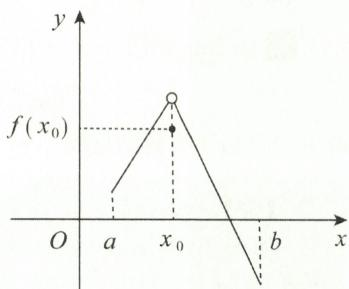  
图2-1

$f(x)$ 的极值点，

$$
f ^ {\prime} (x) = \left\{ \begin{array}{l l} - 2 x \left(1 + \sin \frac {1}{x}\right) + \cos \frac {1}{x}, & x \neq 0, \\ 0, & x = 0. \end{array} \right.
$$

令 $x_{n} = \frac{1}{n\pi}$ ，当 $n\to \pm \infty$ 时， $x_{n}\rightarrow 0,f^{\prime}(x_{n}) = \frac{-2}{n\pi} +(-1)^{n}.$

无论 $\sigma$ 取多么小, $f(x)$ 在 $(0,\sigma)$ 内不单调递减, 在 $(- \sigma,0)$ 内不单调递增.

(21) B.

解 由 $x = \arctan t$ ，得 $\frac{\mathrm{d}x}{\mathrm{d}t} = \frac{1}{1 + t^2}$ . $y = \ln (1 - t^2) - \sin y$ 两边同时对 $t$ 求导，得

$$
\frac {\mathrm{d} y}{\mathrm{d} t} = \frac {- 2 t}{1 - t ^ {2}} - \cos y \frac {\mathrm{d} y}{\mathrm{d} t},
$$

解得

$$
\frac {\mathrm{d} y}{\mathrm{d} t} = \frac {- 2 t}{(1 - t ^ {2}) (1 + \cos y)}.
$$

当 x = 0 时，由 $x = \arctan t$ ，知 t = 0，且当 $x > 0 (< 0)$ 时，有 $t > 0 (< 0)$ .

由 $y = \ln(1 - t^{2}) - \sin y$ 知，当 x = 0，即 t = 0 时，有 y = 0。故在 x = 0 的邻域 $(- \delta, \delta)(\delta > 0)$ 内，有

$$
\frac {\mathrm{d} y}{\mathrm{d} x} = \frac {\mathrm{d} y}{\mathrm{d} t} \cdot \frac {\mathrm{d} t}{\mathrm{d} x} = \frac {- 2 t (1 + t ^ {2})}{(1 - t ^ {2}) (1 + \cos y)} \left\{ \begin{array}{l l} > 0, & - \delta <   x <   0, \\ = 0, & x = 0, \\ <   0, & 0 <   x <   \delta . \end{array} \right.
$$

(22) D.

综上所述，x = 0 是 $y = y(x)$ 的极大值点。选项 B 正确。

解 当 $x = \pm 1$ 时, 函数没有定义, 且当 $x \to 1$ 时, $y \to \infty$ , 故 x = 1 为铅直渐近线. 同理, x = -1 为铅直渐近线.

由 $\lim_{x\to +\infty}y = \lim_{x\to +\infty}\left[\frac{1}{|x| - 1} +\ln (1 + \mathrm{e}^{-x})\right] = 0$ ，知有水平渐近线 $y = 0$

又

$$
\lim _ {x \rightarrow - \infty} \frac {y}{x} = \lim _ {x \rightarrow - \infty} \left[ \frac {1}{x (| x | - 1)} + \frac {\ln (1 + \mathrm{e} ^ {- x})}{x} \right] = 0 + \lim _ {x \rightarrow - \infty} \frac {- \mathrm{e} ^ {- x}}{1 + \mathrm{e} ^ {- x}} = - 1.
$$

$$
\begin{array}{r l} \lim _ {x \to - \infty} (y + x) & = \lim _ {x \to - \infty} \left[ \frac {1}{| x | - 1} + \ln (1 + e ^ {- x}) + x \right] \\ & = \lim _ {x \to - \infty} [ \ln (1 + e ^ {- x}) + \ln e ^ {x} ] \\ & = \lim _ {x \to - \infty} \ln [ (1 + e ^ {- x}) \cdot e ^ {x} ] \\ & = \lim _ {x \to - \infty} \ln (e ^ {x} + 1) = 0, \end{array}
$$

故 y = -x 为斜渐近线. 选项 D 正确.

(23)D.

解 由 $\lim_{x\to +\infty}\mathrm{e}^{x}[1 + x + f(x)] = \lim_{x\to +\infty}\frac{1 + x + f(x)}{\mathrm{e}^{-x}}$ 存在，知

$$
\lim _ {x \to + \infty} [ f (x) + x + 1 ] = \lim _ {x \to + \infty} [ f (x) - (- x - 1) ] = 0,
$$

故 $y = f(x)$ 有斜渐近线 $y = -x - 1$ . 选项D正确.

【注】设曲线 $y = f(x)$ 有斜渐近线 $y = kx + b$ .

如图2-2所示， $P(x,y)$ 为 $y = f(x)$ 上任意一点，由斜渐近线的定义， $P(x,y)$ 到直线 $y = kx + b$ 的距离 $|PM|$ 趋于 $0(x\to \infty)$ ，从而 $|PN|\rightarrow 0(x\rightarrow \infty)$ . 故有

$$
\lim _ {x \rightarrow \infty} [ f (x) - (k x + b) ] = 0.
$$

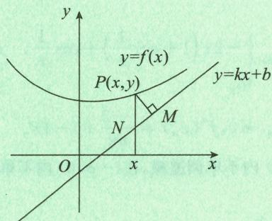  
图2-2

(24)C.

解 显然曲线只存在斜渐近线. 由于

$$
\lim _ {x \to + \infty} \frac {y}{x} = \lim _ {x \to + \infty} \frac {\sqrt {x ^ {2} - a ^ {2}}}{x} = 1,
$$

$$
\lim _ {x \to + \infty} (y - x) = \lim _ {x \to + \infty} (\sqrt {x ^ {2} - a ^ {2}} - x) = \lim _ {x \to + \infty} \frac {- a ^ {2}}{\sqrt {x ^ {2} - a ^ {2}} + x} = 0,
$$

故 y = x 是曲线的斜渐近线. 又

$$
\lim _ {x \to - \infty} \frac {y}{x} = \lim _ {x \to - \infty} \frac {\sqrt {x ^ {2} - a ^ {2}}}{x} = - 1,
$$

$$
\lim _ {x \to - \infty} (y + x) = \lim _ {x \to - \infty} (\sqrt {x ^ {2} - a ^ {2}} + x) = \lim _ {x \to - \infty} \frac {- a ^ {2}}{\sqrt {x ^ {2} - a ^ {2}} - x} = 0,
$$

故 $y = -x$ 也是曲线的斜渐近线. 渐近线共有两条. 选项 C 正确.

## 二、填空题

(1) $-1,\frac{\pi}{2}.$

解 由已知, 可得 $f(x)$ 在 x = 0 处可导, 故 $f(x)$ 在 x = 0 处连续,

$$
\lim _ {x \rightarrow 0 ^ {-}} f (x) = \lim _ {x \rightarrow 0 ^ {-}} (a x + b) = b, \lim _ {x \rightarrow 0 ^ {+}} f (x) = \lim _ {x \rightarrow 0 ^ {+}} \arctan \frac {1}{x} = \frac {\pi}{2},
$$

故 $b=\frac{\pi}{2}$ ，即有 $f(0)=\frac{\pi}{2}$ .

又

$$
f _ {-} ^ {\prime} (0) = a,
$$

$$
\begin{array}{r l} & {f _ {+} ^ {\prime} (0) = \lim _ {x \to 0 ^ {+}} \frac {f (x) - f (0)}{x} = \lim _ {x \to 0 ^ {+}} \frac {\arctan \frac {1}{x} - \frac {\pi}{2}}{x}} \\ & {\quad \frac {\text {洛必达}}{\text {法则}} \lim _ {x \to 0 ^ {+}} \frac {- 1}{1 + x ^ {2}} = - 1,} \end{array}
$$

并且 $f_{-}^{\prime}(0)=f_{+}^{\prime}(0)$ ，所以可得 a=-1。

(2)1.

解

$$
\lim _ {x \to 0} \frac {f (1 - \cos x)}{\ln (1 + x ^ {2})} = \lim _ {x \to 0} \frac {x ^ {2}}{\ln (1 + x ^ {2})} \cdot \frac {1 - \cos x}{x ^ {2}} \cdot \frac {f (1 - \cos x) - f (0)}{1 - \cos x}.
$$

由于当 $x \to 0$ 时， $\ln (1 + x^2) \sim x^2, 1 - \cos x \sim \frac{1}{2} x^2$ ，故

$$
\text { 原式 } = 1 \cdot {\frac {1}{2}} \cdot f ^ {\prime} (0) = {\frac {1}{2}} \times 2 = 1.
$$

(3)1.

解由

$$
\begin{array}{r l} \lim _ {x \to 0} \frac {\ln [ f (x + 1) + \mathrm{e} ^ {x ^ {2}} ]}{x} & = \lim _ {x \to 0} \frac {\ln [ f (x + 1) + \mathrm{e} ^ {x ^ {2}} + 1 - 1 ]}{x} \\ & = \lim _ {x \to 0} \frac {f (x + 1) + \mathrm{e} ^ {x ^ {2}} - 1}{x} = \lim _ {x \to 0} \frac {f (x + 1)}{x} + 0 = 1, \end{array}
$$

知 $\lim_{x\to 0}\frac{f(x + 1)}{x} = 1.$ 由 $f(x)$ 连续，知 $f(1) = 0$ ，故

$$
\begin{array}{r l} & f ^ {\prime} (1) = \lim _ {x \to 0} \frac {f (x + 1) - f (1)}{x} = 1. \\ & \lim _ {x \to 0} \frac {f [ (1 + \tan x) ^ {2} ] - f (1 + \tan x)}{x} \\ & = \lim _ {x \to 0} \frac {f [ (1 + \tan x) ^ {2} ] - f (1)}{x} - \lim _ {x \to 0} \frac {f (1 + \tan x) - f (1)}{x} \\ & = \lim _ {x \to 0} \frac {f (1 + 2 \tan x + \tan^ {2} x) - f (1)}{2 \tan x + \tan^ {2} x} \cdot \frac {2 \tan x + \tan^ {2} x}{x} - \\ & \lim _ {x \to 0} \frac {f (1 + \tan x) - f (1)}{\tan x} \cdot \frac {\tan x}{x} \\ & = 2 f ^ {\prime} (1) - f ^ {\prime} (1) \\ & = f ^ {\prime} (1) = 1. \end{array}
$$

(4)3.

解 $x = \int_{1}^{y - x}\sin^2\left(\frac{\pi t}{4}\right)\mathrm{d}t$ 两边同时对 $x$ 求导，得

$$
1 = (y ^ {\prime} - 1) \cdot \sin^ {2} \left[ \frac {\pi}{4} (y - x) \right],
$$

解得

$$
y ^ {\prime} = \csc^ {2} \left[ \frac {\pi}{4} (y - x) \right] + 1.
$$

又由已知可得，当 $x = 0$ 时， $y = 1$ ，即 $f(0) = 1$ ，故 $y'\bigg|_{x=0} = 3$ . 于是

$$
\lim _ {n \to \infty} n \left[ f \Big (\frac {1}{n} \Big) - 1 \right] = \lim _ {n \to \infty} \frac {f \Big (\frac {1}{n} \Big) - f (0)}{\frac {1}{n}} = f ^ {\prime} (0) = 3.
$$

(5) $f(x)=-1+2x+o(x).$

解 依题设,有

$$
\lim _ {x \to 0} \left[ \frac {\sin x}{x ^ {2}} + \frac {f (x)}{x} \right] = \lim _ {x \to 0} \frac {\sin x + x f (x)}{x ^ {2}} = 2,
$$

知 $\sin x + xf(x)$ 与 $2x^{2}$ 是等价无穷小. 又

$$
\begin{array}{r l} \sin x + x f (x) & = [ x + o (x ^ {2}) ] + x [ f (0) + f ^ {\prime} (0) x + o (x) ] \\ & = [ 1 + f (0) ] x + f ^ {\prime} (0) x ^ {2} + o (x ^ {2}), \end{array}
$$

故 $f(0) = -1, f'(0) = 2$ , 所以

$$
f (x) = f (0) + f ^ {\prime} (0) x + o (x) = - 1 + 2 x + o (x).
$$

(6)2.

解 由题目所给的 $f''(x)$ 图形可知， $f''(x_1) = f''(x_2) = 0, f''(0)$ 不存在，在 $x = x_1$ 的两侧二阶导数不变号，故其不是拐点。在 $x = 0, x = x_2$ 两侧二阶导数变号，所以 $y = f(x)$ 有两个拐点。

(7) $\pm\sqrt{2}.$

解 依题设,有

故

$$
\begin{array}{r l} \lim _ {x \to 0} \left[ 1 + \frac {1 - \cos f (x)}{\sin x} \right] ^ {\frac {1}{x}} & = \lim _ {x \to 0} \left\{\left[ 1 + \frac {1 - \cos f (x)}{\sin x} \right] ^ {\frac {\sin x}{1 - \cos f (x)}} \right\} ^ {\frac {1 - \cos f (x)}{x \sin x}} = e, \\ \lim _ {x \to 0} \frac {1 - \cos f (x)}{x \sin x} & = 1. \end{array}
$$

又当 $x \to 0$ 时， $\sin x \sim x, 1 - \cos f(x) \sim \frac{1}{2} f^2(x)$ ，且 $f'(0)$ 存在，故

$$
1 = \lim _ {x \rightarrow 0} \frac {1 - \cos f (x)}{x \sin x} = \frac {1}{2} \lim _ {x \rightarrow 0} \frac {f ^ {2} (x)}{x ^ {2}} = \frac {1}{2} \lim _ {x \rightarrow 0} \frac {f (x)}{x} \cdot \lim _ {x \rightarrow 0} \frac {f (x)}{x} = \frac {1}{2} f ^ {\prime} (0) \cdot f ^ {\prime} (0),
$$

解得 $f'(0)=\pm\sqrt{2}$ .

(8) $\frac{2}{3}$ , 3.

解 利用麦克劳林公式,有

$$
\begin{array}{r l} x - \sin x \cos x & = x - \frac {1}{2} \sin 2 x = x - \frac {1}{2} \left[ 2 x - \frac {1}{3 !} (2 x) ^ {3} + o (x ^ {3}) \right] \\ & = \frac {2}{3} x ^ {3} + o (x ^ {3}) \sim \frac {2}{3} x ^ {3}, \end{array}
$$

故 $a=\frac{2}{3},b=3.$

(9)3.

解 依题设,有

$$
\mathrm{e} ^ {x} = 1 + x + \frac {1}{2} x ^ {2} + \frac {1}{6} x ^ {3} + o (x ^ {3}),
$$

$$
\ln (1 - x) = - x - \frac {1}{2} x ^ {2} - \frac {1}{3} x ^ {3} + o (x ^ {3}),
$$

故

$$
\begin{array}{r l} \mathrm{e} ^ {x} + \ln (1 - x) - 1 & = 1 + x + \frac {1}{2} x ^ {2} + \frac {1}{6} x ^ {3} - x - \frac {1}{2} x ^ {2} - \frac {1}{3} x ^ {3} - 1 + o (x ^ {3}) \\ & = - \frac {1}{6} x ^ {3} + o (x ^ {3}), \end{array}
$$

所以 $n = 3$

(10) $\left(-\frac{\sqrt{2}}{2},\frac{\sqrt{2}}{2}\right)$ .

解由 $y'' = 2(2x^2 - 1)\mathrm{e}^{-x^2} = 0$ ，得 $2x^{2} - 1 = 0$ ，解得 $x = \pm \frac{\sqrt{2}}{2}$

当 $x \in \left(-\frac{\sqrt{2}}{2}, \frac{\sqrt{2}}{2}\right)$ 时， $y'' < 0$ ，可知上凸区间为 $\left(-\frac{\sqrt{2}}{2}, \frac{\sqrt{2}}{2}\right)$ .

解 对 $f(x)$ 求导, 得 $f'(x) = n \mathrm{e}^{\frac{x}{n}} - (1 + n)$ . 依题意, 有

$f'(x_{n}) = n \mathrm{e}^{\frac{x}{n}} - (1 + n) = 0$ , 解得 $x_{n} = n \ln \left(1 + \frac{1}{n}\right)$ ,

故

$$
\lim _ {n \to \infty} \mathrm{e} ^ {x _ {n}} = \lim _ {n \to \infty} \mathrm{e} ^ {n \ln \left(1 + \frac {1}{n}\right)} = \mathrm{e}.
$$

(12) $\frac{1}{1+e^{2}}.$

解由 $f(x) = \frac{1}{1 + x^n}$ ，知 $f^{\prime}(1) = \frac{-nx^{n - 1}}{(1 + x^{n})^{2}}\Bigg|_{x = 1} = -\frac{n}{4}.$

在点 $\left(1,\frac{1}{2}\right)$ 处的切线方程为

$$
y - \frac {1}{2} = - \frac {n}{4} (x - 1).
$$

令 $y = 0$ ，得 $x_{n} = x = 1 + \frac{2}{n}$ 故

$$
\lim _ {n \to \infty} f (x _ {n}) = \lim _ {n \to \infty} \frac {1}{1 + \left(1 + \frac {2}{n}\right) ^ {n}} = \frac {1}{1 + \mathrm{e} ^ {2}}.
$$

(13) $\frac{1}{2}.$

解 由 $\Delta y = \Delta x + o(\Delta x)$ , 有 $\frac{\Delta y}{\Delta x} = 1 + \frac{o(\Delta x)}{\Delta x}$ , 等式两边同时取极限, 得

$\lim_{\Delta x\to0}\frac{\Delta y}{\Delta x}=\lim_{\Delta x\to0}\left[1+\frac{o(\Delta x)}{\Delta x}\right]=1$ ，即 $f'(1)=1$ .

又由已知，有 $f(1) = 0$ ， $x^{2} + \ln (1 + x^{3})\sim x^{2}(x\to 0)$ ，故

$$
\begin{array}{r l} \text {原式} & = \lim _ {x \to 0} \frac {\int_ {1} ^ {\mathrm{e} ^ {x}} f (t) \mathrm{d} t}{x ^ {2}} = \lim _ {x \to 0} \frac {\mathrm{e} ^ {x} f (\mathrm{e} ^ {x})}{2 x} \\ & = \lim _ {x \to 0} \frac {\mathrm{e} ^ {x}}{2} \cdot \frac {f (\mathrm{e} ^ {x}) - f (1)}{\mathrm{e} ^ {x} - 1} \cdot \frac {\mathrm{e} ^ {x} - 1}{x} = \frac {1}{2} f ^ {\prime} (1) = \frac {1}{2}. \end{array}
$$

(14) - 99!.

解 记 $u(x)=x$ , $v(x)=(2x-1)(3x-2)\cdots(100x-99)$ , 则 $f(x)=u(x)v(x)$ .
又 $u'(0)=1,\ u(0)=0,\ v(0)=-99!$

故

$$
f ^ {\prime} (0) = u ^ {\prime} (0) v (0) + u (0) v ^ {\prime} (0) = - 9 9!.
$$

【注】此题也可利用导数定义计算.

$$
f ^ {\prime} (0) = \lim _ {x \to 0} \frac {f (x) - f (0)}{x - 0} = \lim _ {x \to 0} (2 x - 1) (3 x - 2) \dots (1 0 0 x - 9 9) = - 9 9!.
$$

(15) $\frac{1}{3x}.$

解 由 $\frac{\mathrm{d}}{\mathrm{d}x}\left[f(x^3)\right] = 3x^2\cdot f'(x^3) = \frac{1}{x}$ , 得 $f'(x^3) = \frac{1}{3x^3}$ , 所以 $f'(x) = \frac{1}{3x}$ .

解 由 $f(x) = \ln (\sqrt{1 + x^2} - x)$ ，可求得 $f'(x) = -\frac{1}{\sqrt{1 + x^2}}$ .

令 $g(x) = -\frac{1}{\sqrt{1 + x^2}} = -(1 + x^2)^{-\frac{1}{2}}, g(x)$ 在 $x = 0$ 处的麦克劳林展开式为

$$
\begin{array}{r l} g (x) & = - (1 + x ^ {2}) ^ {- \frac {1}{2}} = - \left[ 1 - \frac {1}{2} x ^ {2} + \frac {- \frac {1}{2} (- \frac {1}{2} - 1) x ^ {4}}{2 !} + o (x ^ {4}) \right] \\ & = - 1 + \frac {1}{2} x ^ {2} - \frac {3}{8} x ^ {4} - o (x ^ {4}), \end{array}
$$

则 $g^{(4)}(0) = 4!\times \left(-\frac{3}{8}\right) = -9.$ 故 $f^{(5)}(0) = -9.$

(17) - 2.

解 依题设,有

$$
\lim _ {x \rightarrow 0} \frac {f (1) - f (1 - x)}{2 x} \stackrel {- x = \Delta t} {=} \lim _ {\Delta t \rightarrow 0} \frac {1}{2} \cdot \frac {f (1 + \Delta t) - f (1)}{\Delta t} = \frac {1}{2} f ^ {\prime} (1) = - 1,
$$

故 $f'(1) = -2$ ，即曲线 $y = f(x)$ 在点 $(1, f(1))$ 处的切线斜率为 -2.

$$
y = 2 x - \frac {1}{4}. \tag {18}
$$

解 由已知,有

$$
\lim _ {x \to + \infty} (\sqrt {a x ^ {2} - x + 3} - 2 x) = \lim _ {x \to + \infty} x \left(\sqrt {a - \frac {1}{x} + \frac {3}{x ^ {2}}} - 2\right) = b,
$$

故

$\lim_{x\to+\infty}\left(\sqrt{a-\frac{1}{x}+\frac{3}{x^{2}}}-2\right)=0$ , 即有 $\sqrt{a}=2, a=4$ .

将 a = 4 代入原式, 并有理化, 得

$$
\begin{array}{r l} b & = \lim _ {x \to + \infty} (\sqrt {4 x ^ {2} - x + 3} - 2 x) = \lim _ {x \to + \infty} \frac {- x + 3}{\sqrt {4 x ^ {2} - x + 3} + 2 x} \\ & = \lim _ {x \to + \infty} \frac {- 1 + \frac {3}{x}}{\sqrt {4 - \frac {1}{x ^ {\prime}} + \frac {3}{x ^ {2}}} + 2} = - \frac {1}{4}, \end{array}
$$

所以

$$
\lim _ {x \rightarrow + \infty} \left(\sqrt {4 x ^ {2} - x + 3} - 2 x + \frac {1}{4}\right) = \lim _ {x \rightarrow + \infty} \left[ \sqrt {4 x ^ {2} - x + 3} - \left(2 x - \frac {1}{4}\right)\right] = 0.
$$

$y = \sqrt{4x^{2} - x + 3}$ 在 $(0, +\infty)$ 内有斜渐近线，为 $y = 2x - \frac{1}{4}$ .

【注】求出 a = 4 后, 也可以用求斜渐近线方程的公式求解.

(19)2.

解 在 x = 0 的邻域内， $\cos |x| = \cos x, x^{2} |x|$ 在 x = 0 处二阶可导，三阶不可导，故阶数为 2.
(20) $\frac{2}{3a}.$

解 依题设,有

$$
y ^ {\prime} = \frac {\mathrm{d} y}{\mathrm{d} t} \cdot \frac {\mathrm{d} t}{\mathrm{d} x} = \frac {3 a \sin^ {2} t \cdot \cos t}{- 3 a \cos^ {2} t \cdot \sin t} = - \tan t,
$$

$$
\begin{array}{r l} y ^ {\prime \prime} & = \frac {\mathrm{d}}{\mathrm{d} x} (- \tan t) = \frac {\mathrm{d}}{\mathrm{d} t} (- \tan t) \cdot \frac {\mathrm{d} t}{\mathrm{d} x} \\ & = \frac {- \sec^ {2} t}{- 3 a \cos^ {2} t \cdot \sin t} = \frac {1}{3 a} \sec^ {4} t \cdot \csc t, \end{array}
$$

故 $t = \frac{\pi}{4}$ 处的曲率为

$$
K = \frac {\mid y ^ {\prime \prime} \mid}{(1 + y ^ {\prime 2}) ^ {\frac {3}{2}}} \Bigg | _ {t = \frac {\pi}{4}} = \left| \frac {2}{3 a \sin 2 t} \right| \Bigg | _ {t = \frac {\pi}{4}} = \frac {2}{3 a}.
$$

(21) $\frac{1}{4}$ .

解 由于曲率半径 $R = \frac{(1 + y'^2)^{\frac{3}{2}}}{|y''|}$ ，且 $y' = 4(x - 1), y'' = 4$ ，故

$$
R = \frac {\left[ 1 + 1 6 (x - 1) ^ {2} \right] ^ {\frac {3}{2}}}{4}.
$$

由此可知, 当 x = 1 时, R 取最小值, 此时最小曲率半径为 $\frac{1}{4}$ .

(22) $x^{2}+\left(y+\frac{1}{2}\right)^{2}=\frac{9}{4}.$

解 由已知,有 $\lim_{x\to0}\frac{2\sin x+xf(x)}{x^{3}}=0$ ,故

$$
\frac {2 \sin x + x f (x)}{x ^ {3}} = \alpha (\text {当} x \to 0 \text {时}, \alpha \to 0),
$$

即 $xf(x) = x^3\alpha -2\sin x.$ 又 $\sin x = x - \frac{1}{6} x^3 +o(x^3)$ ，故

$$
f (x) = - 2 \frac {\sin x}{x} + o (x ^ {2}) = - 2 \left(1 - \frac {1}{6} x ^ {2}\right) + o (x ^ {2}) = - 2 + \frac {1}{3} x ^ {2} + o (x ^ {2}).
$$

由泰勒公式的唯一性,得

$$
f (0) = - 2, f ^ {\prime} (0) = 0, f ^ {\prime \prime} (0) = \frac {2}{3}.
$$

$y = f(x)$ 在点 $(0, -2)$ 处的曲率半径为

$$
R = \frac {\left[ 1 + f ^ {\prime 2} (0) \right] ^ {\frac {3}{2}}}{\mid f ^ {\prime \prime} (0) \mid} = \frac {3}{2}.
$$

由 $f''(0) = \frac{2}{3} > 0$ 及 $f''(x)$ 连续，知在 $x = 0$ 的邻域内有 $f''(x) > 0$ .

由曲率圆在点 $(0,-2)$ 处与 $y=f(x)$ 有相同的凹向，知 $y=f(x)$ 在点 $(0,-2)$ 处的曲率圆方程为

$$
x ^ {2} + \left(y + \frac {1}{2}\right) ^ {2} = \frac {9}{4}.
$$

(23)2.

解 由 $y(x)$ 二阶可导， $(a,2)$ 是 $y=y(x)$ 的拐点，知 $y(a)=2,y''(a)=0$ .

由 $\frac{\mathrm{dy}}{\mathrm{dx}} = (3 - y)y^b$ ，有

$$
\frac {\mathrm{d} ^ {2} y}{\mathrm{d} x ^ {2}} = (3 - y) b y ^ {b - 1} \frac {\mathrm{d} y}{\mathrm{d} x} - y ^ {b} \frac {\mathrm{d} y}{\mathrm{d} x} = \frac {\mathrm{d} y}{\mathrm{d} x} y ^ {b - 1} [ (3 - y) b - y ].\tag{①}
$$

$$
\left. \frac {\mathrm{d} ^ {2} y}{\mathrm{d} x ^ {2}} \right| _ {x = a} = 0,
$$

$$
\left. \frac {\mathrm{d} y}{\mathrm{d} x} \right| _ {x = a} = [ 3 - y (a) ] [ y (a) ] ^ {b} = [ y (a) ] ^ {b} = 2 ^ {b} \neq 0.
$$

将上两式代入 ① 式, 得

$$
[ 3 - y (a) ] b - y (a) = (3 - 2) b - 2 = b - 2 = 0,
$$

故 b = 2.

(24) $e^{x}+1.$

解 由已知条件, 视 y 为 $\Delta x$ , 知 $f(x)$ 在点 x 处可微, 且 $\mathrm{d}[f(x)] = [f(x) - 1] \mathrm{d}x$ , 故

$$
\mathrm{d} x = \frac {1}{f (x) - 1} \mathrm{d} [ f (x) ].
$$

对上式两边积分,得

$$
x = \ln | f (x) - 1 | + C.
$$

由 $f(0)=2$ , 得 C=0 , 故 $f(x)=\mathrm{e}^{x}+1$

(25) $-\frac{3}{2}.$

解由 $y = x^{2}$ ，知 $y' = 2x, y'' = 2$ .

$$
\begin{array}{r l} & {\kappa = \frac {| y ^ {\prime \prime} |}{(1 + {y ^ {\prime}} ^ {2}) ^ {\frac {3}{2}}} = \frac {2}{\sqrt {(1 + 4 x ^ {2}) ^ {3}}},} \\ & {s = \int_ {0} ^ {x} \sqrt {1 + {y ^ {\prime}} ^ {2} (t)} \mathrm{d} t = \int_ {0} ^ {x} \sqrt {1 + 4 t ^ {2}} \mathrm{d} t,} \end{array}
$$

故

$$
\mathrm{d} \kappa = - \frac {2 4 x}{\sqrt {(1 + 4 x ^ {2}) ^ {5}}} \mathrm{d} x, \mathrm{d} s = \sqrt {1 + 4 x ^ {2}} \mathrm{d} x.
$$

所以

$$
\frac {\mathrm{d} \kappa}{\mathrm{d} s} \Big | _ {x = \frac {1}{2}} = - \frac {2 4 x}{(1 + 4 x ^ {2}) ^ {3}} \Big | _ {x = \frac {1}{2}} = - \frac {3}{2}.
$$

(26) $x + y + \frac{1}{3} = 0.$

解 由已知, 当且仅当 $t \rightarrow -1$ 时, $x \rightarrow \infty$ . 故

$$
\begin{array}{r l} & k = \lim _ {x \to \infty} \frac {y}{x} = \lim _ {t \to - 1} \frac {t ^ {2}}{1 + t ^ {3}} \cdot \frac {1 + t ^ {3}}{t} = \lim _ {t \to - 1} t = - 1, \\ & b = \lim _ {x \to \infty} (y - k x) = \lim _ {t \to - 1} \left(\frac {t ^ {2}}{1 + t ^ {3}} + \frac {t}{1 + t ^ {3}}\right) \\ & = \lim _ {t \to - 1} \frac {t (t + 1)}{(t + 1) (t ^ {2} - t + 1)} = \lim _ {t \to - 1} \frac {t}{t ^ {2} - t + 1} = - \frac {1}{3}. \end{array}
$$

故所求斜渐近线方程为

$$
y = - x - \frac {1}{3}, \text {即} x + y + \frac {1}{3} = 0.
$$

(27)1.

解 已知方程化为

$$
\arctan \frac {x}{y} = \frac {1}{2} \ln (x ^ {2} + y ^ {2}) - \frac {1}{2} \ln 2 + \frac {\pi}{4}.
$$

上式两边同时对 $x$ 求导，得

$$
\frac {1}{1 + \left(\frac {x}{y}\right) ^ {2}} \cdot \frac {y - x y ^ {\prime}}{y ^ {2}} = \frac {1}{2}   \frac {2 x + 2 y y ^ {\prime}}{x ^ {2} + y ^ {2}},   \text { 即 }   y ^ {\prime} = \frac {- x + y}{x + y}.
$$

令 $y' = 0$ ，得 x = y，代入原方程可求得 x = 1, y = 1，故 $y'(1) = 0$ .

方程 $y' = \frac{-x + y}{x + y}$ ，即 $(x + y)y' = -x + y$ ，两边同时对 $x$ 求导，得

$$
(1 + y ^ {\prime}) y ^ {\prime} + (x + y) y ^ {\prime \prime} = - 1 + y ^ {\prime}.
$$

将 $x = 1, y = 1, y'(1) = 0$ 代入上式，得 $y''(1) = -\frac{1}{2} < 0.$ 故 $y(x)$ 的极大值为 $y(1) = 1$ .

## 三、解答题

(1) 解 (I) 因为 $y = \frac{1}{\sqrt[3]{x \cdot \sqrt[3]{x}}} = x^{-\frac{4}{9}}$ , 所以 $y' = -\frac{4}{9} x^{-\frac{13}{9}}$ .

$$
\begin{array}{r l} (\text {   II   }) y ^ {\prime} & = a ^ {a} x ^ {a ^ {a - 1}} + a ^ {x ^ {a}} (\ln a) \cdot (x ^ {a}) ^ {\prime} + a ^ {a ^ {x}} \cdot (\ln a) \cdot (a ^ {x}) ^ {\prime} \\ & = a ^ {a} x ^ {a ^ {a - 1}} + a (\ln a) x ^ {a - 1} \cdot a ^ {x ^ {a}} + (\ln a) ^ {2} \cdot a ^ {x} \cdot a ^ {a ^ {x}}. \end{array}
$$

【注】 $x^{a^{a}}$ 视为幂函数.

（Ⅲ）由 $|\sin x| = \sqrt{\sin^2 x}$ ，有 $y = 2^{|\sin x|} = 2^{\sqrt{\sin^2 x}}$ ，则

$$
\begin{array}{r l} y ^ {\prime} & = 2 ^ {\sqrt {\sin^ {2} x}} \cdot (\ln 2) \cdot (\sqrt {\sin^ {2} x}) ^ {\prime} = 2 ^ {\sqrt {\sin^ {2} x}} \cdot (\ln 2) \cdot \frac {2 \sin x \cos x}{2 \sqrt {\sin^ {2} x}} \\ & = 2 ^ {| \sin x |} \cdot (\ln 2) \cdot \sin 2 x \cdot \frac {1}{2 | \sin x |} (\sin x \neq 0). \end{array}
$$

【注】当 $\sin x = 0$ 时， $y = 2^{\left|\sin x\right|}$ 的左、右导数值分别存在，且异号.

$$
\begin{array}{r l} (\mathrm{IV}) y ^ {\prime} & = \frac {1}{\tan x + \sec x} \cdot (\tan x + \sec x) ^ {\prime} \\ & = \frac {1}{\tan x + \sec x} \cdot (\sec^ {2} x + \sec x \tan x) = \sec x. \end{array}
$$

【注】 $(\ln\mid x\mid)^{\prime}=\frac{1}{x}\quad(x\neq0)$ .

(2) 解 (I) 取对数, 有 $\ln |y| = \ln (1 + x^2)\sin x$ . 两边同时对 $x$ 求导, 得

$$
\frac {1}{y} \cdot y ^ {\prime} = \ln (1 + x ^ {2}) \cos x + \frac {2 x \sin x}{1 + x ^ {2}},
$$

故

$$
y ^ {\prime} = (1 + x ^ {2}) ^ {\sin x} \left[ \ln (1 + x ^ {2}) \cos x + \frac {2 x \sin x}{1 + x ^ {2}} \right].
$$

（Ⅱ）利用对数的性质，化简后再求导.

$$
\begin{array}{r l} & y = \ln \frac {1}{\sqrt {x + \sqrt {x ^ {2} + 1}}} = - \frac {1}{2} \ln (x + \sqrt {x ^ {2} + 1}), \\ & y ^ {\prime} = - \frac {1}{2} \cdot \frac {1}{x + \sqrt {x ^ {2} + 1}} \cdot (x + \sqrt {x ^ {2} + 1}) ^ {\prime} \\ & \quad = - \frac {1}{2} \cdot \frac {1}{x + \sqrt {x ^ {2} + 1}} \cdot \left(1 + \frac {2 x}{2 \sqrt {x ^ {2} + 1}}\right) = - \frac {1}{2 \sqrt {x ^ {2} + 1}}. \end{array}
$$

$$
\begin{array}{r l} \text {(I)} \mathrm{d} y & = \varphi^ {\prime} \left(\arctan \frac {1}{x}\right) \cdot \mathrm{d} \left(\arctan \frac {1}{x}\right) = \varphi^ {\prime} \left(\arctan \frac {1}{x}\right) \cdot \frac {1}{1 + \left(\frac {1}{x}\right) ^ {2}} \mathrm{d} \left(\frac {1}{x}\right) \\ & = \varphi^ {\prime} \left(\arctan \frac {1}{x}\right) \cdot \frac {1}{1 + \left(\frac {1}{x}\right) ^ {2}} \cdot \left(- \frac {1}{x ^ {2}}\right) \mathrm{d} x = - \varphi^ {\prime} \left(\arctan \frac {1}{x}\right) \cdot \frac {1}{1 + x ^ {2}} \mathrm{d} x. \end{array}
$$

(Ⅱ) $\mathrm{d}(\mathrm{e}^{x+y}-y\sin x)=0$ ,即

故

$$
\begin{array}{r l} & \mathrm{e} ^ {x + y} \mathrm{d} (x + y) - [ \sin x \mathrm{d} y + y \mathrm{d} (\sin x) ] = 0, \\ & \mathrm{e} ^ {x + y} (\mathrm{d} x + \mathrm{d} y) - (\sin x \mathrm{d} y + y \cos x \mathrm{d} x) = 0, \\ & \mathrm{d} y = \frac {y \cos x - \mathrm{e} ^ {x + y}}{\mathrm{e} ^ {x + y} - \sin x} \mathrm{d} x = \frac {y (\cos x - \sin x)}{(y - 1) \sin x} \mathrm{d} x. \end{array}
$$

（Ⅲ）由题设可得 $t = \frac{x}{2}$ ，则 $y = 5\left(\frac{x}{2}\right)^{2} + 1 = \frac{5x^{2}}{4} + 1$ ，故 $\mathrm{d}y = \mathrm{d}\left(\frac{5x^{2}}{4} + 1\right) = \frac{5}{2}x \, \mathrm{d}x$ .

(4) 解 已知方程两边同时取对数, 得 $\frac{1}{2}\ln(x^{2}+y^{2})=\arctan\frac{y}{x}$ . 再对 x 求导, 得

$$
\frac {1}{2} \cdot \frac {2 x + 2 y \cdot y ^ {\prime}}{x ^ {2} + y ^ {2}} = \frac {1}{1 + \left(\frac {y}{x}\right) ^ {2}} \cdot \frac {y ^ {\prime} x - y \cdot 1}{x ^ {2}},   \text {解得}   y ^ {\prime} = \frac {x + y}{x - y},
$$

并且可得

$$
y ^ {\prime \prime} = \frac {(1 + y ^ {\prime}) (x - y) - (x + y) (1 - y ^ {\prime})}{(x - y) ^ {2}} = \frac {2 x y ^ {\prime} - 2 y}{(x - y) ^ {2}}.
$$

将 $y'=\frac{x+y}{x-y}$ 代入上式, 得 $y''=\frac{2(x^{2}+y^{2})}{(x-y)^{3}}$ .

(5) 解 由题设可得

$$
\begin{array}{l} {\frac {\mathrm{d} y}{\mathrm{d} x} = \frac {\mathrm{d} y}{\mathrm{d} t} \cdot \frac {\mathrm{d} t}{\mathrm{d} x} = \frac {\sin t}{1 - \cos t},} \\ {\frac {\mathrm{d} ^ {2} y}{\mathrm{d} x ^ {2}} = \frac {\mathrm{d}}{\mathrm{d} x} \left(\frac {\sin t}{1 - \cos t}\right) = \frac {\mathrm{d}}{\mathrm{d} t} \left(\frac {\sin t}{1 - \cos t}\right) \cdot \frac {\mathrm{d} t}{\mathrm{d} x} = - \frac {1}{(1 - \cos t) ^ {2}}.} \end{array}
$$

(6) 解为求 $\frac{dy}{dx}$ ，先将极坐标化为参数方程

$$
\left\{ \begin{array}{l} x = r (\theta) \cos \theta = (1 - \cos \theta) \cos \theta , \\ y = r (\theta) \sin \theta = (1 - \cos \theta) \sin \theta , \end{array} \right.
$$

其中 $\theta$ 为参数, 则

$$
\begin{array}{r l} \frac {\mathrm{d} y}{\mathrm{d} x} \Big | _ {\theta = \frac {\pi}{2}} & = \frac {y ^ {\prime} (\theta)}{x ^ {\prime} (\theta)} = \frac {\cos \theta (1 - \cos \theta) + \sin^ {2} \theta}{- \sin \theta (1 - \cos \theta) + \cos \theta \sin \theta} \Big | _ {\theta = \frac {\pi}{2}} = - 1, \\ & x \left(\frac {\pi}{2}\right) = 0, y \left(\frac {\pi}{2}\right) = 1. \end{array}
$$

故切线方程为 $y-1=(-1)(x-0)$ ，即 $x+y=1$ .

(7) 证令 x = y = 1，由 $f(xy) = f(x) + f(y)$ ，知 $f(1) = 0$ .

$$
\begin{array}{r l}f ^ {\prime} (x)&= \lim _ {\Delta x \rightarrow 0} \frac {f (x + \Delta x) - f (x)}{\Delta x} = \lim _ {\Delta x \rightarrow 0} \frac {f \left[ x \left(1 + \frac {\Delta x}{x}\right)\right] - f (x)}{\Delta x}\\&= \lim _ {\Delta x \rightarrow 0} \frac {f (x) + f \left(1 + \frac {\Delta x}{x}\right) - f (x)}{\Delta x}\\&= \lim _ {\Delta x \rightarrow 0} \frac {f \left(1 + \frac {\Delta x}{x}\right) - f (1)}{\frac {\Delta x}{x}} \cdot \frac {1}{x} = \frac {f ^ {\prime} (1)}{x} = \frac {1}{x},\end{array}
$$

故 $f(x)$ 在 $(0, +\infty)$ 内可导.

对于 $f'(x) = \frac{1}{x}$ ，积分后得 $f(x) = \ln x + C$ . 因 $f(1) = 0$ ，可得 $C = 0$ ，所以 $f(x) = \ln x$ .

(8) 解 依题设,有

$$
f ^ {\prime} (0) = \lim _ {x \rightarrow 0} \frac {f (x) - f (0)}{x} = \lim _ {x \rightarrow 0} \frac {\mathrm{e} ^ {- \frac {1}{x ^ {2}}}}{x} = 0.
$$

当 $x \neq 0$ 时， $f'(x) = \frac{2}{x^3} \mathrm{e}^{-\frac{1}{x^2}}$ ，则

$$
f ^ {\prime \prime} (0) = \lim _ {x \rightarrow 0} \frac {f ^ {\prime} (x) - f ^ {\prime} (0)}{x} = \lim _ {x \rightarrow 0} \frac {1}{x} \cdot \frac {2}{x ^ {3}} \cdot \mathrm{e} ^ {- \frac {1}{x ^ {2}}} = \lim _ {x \rightarrow 0} \frac {2}{x ^ {4}} \mathrm{e} ^ {- \frac {1}{x ^ {2}}} = 0.
$$

同理,可得

$$
f ^ {(k)} (0) = 0 (k = 3, 4, \dots).
$$

所以 $f^{(n)}(0)=0.$

【注】利用洛必达法则,对任意正整数 k,有 $\lim_{x\to0}\frac{e^{\frac{1}{x^{2}}}}{x^{k}}=0.$

(9) 解 设开始充气以来的时间为 t，并且 t 时刻气球体积为 $V = V(t)$ ，半径为 $r = r(t)$ 。由题设知，气球体积 $V = \frac{4}{3} \pi r^{3}$ ，两边同时对 t 求导，有

$$
\frac {\mathrm{d} V}{\mathrm{d} t} = 4 \pi r ^ {2} \cdot \frac {\mathrm{d} r}{\mathrm{d} t}.
$$

由题设知, $\frac{dV}{dt}=100,r=10$ ,代入上式得

$$
1 0 0 = 4 \pi \cdot 1 0 ^ {2} \cdot {\frac {\mathrm{d} r}{\mathrm{d} t}}, \text {解得} {\frac {\mathrm{d} r}{\mathrm{d} t}} = {\frac {1}{4 \pi}},
$$

即气球半径增加的速率为 $\frac{1}{4\pi}$ cm/s.

(10) 解 由题设知, 若设点 P 的坐标为 $(x, y)$ , 则 $\frac{dx}{dt} = 30$ .

在方程 $9y = 4x^{2}$ 两边同时对 $t$ 求导，有 $9\frac{\mathrm{dy}}{\mathrm{dt}} = 8x\frac{\mathrm{dx}}{\mathrm{dt}}$ ，即 $\frac{\mathrm{dy}}{\mathrm{dt}} = \frac{8}{9} x\cdot \frac{\mathrm{dx}}{\mathrm{dt}} = \frac{80x}{3}.$

又 $S = \sqrt{x^2 + y^2}$ ，两边同时对 $t$ 求导，有

$$
\frac {\mathrm{d} S}{\mathrm{d} t} = \frac {1}{\sqrt {x ^ {2} + y ^ {2}}} \Big (x \frac {\mathrm{d} x}{\mathrm{d} t} + y \frac {\mathrm{d} y}{\mathrm{d} t} \Big) = \frac {1}{\sqrt {x ^ {2} + y ^ {2}}} \Big (3 0 x + \frac {8 0}{3} x y \Big),
$$

将 $x = 3, y = 4$ 代入上式，则有 $\frac{\mathrm{d}S}{\mathrm{d}t} = 82$ ，即 $S$ 的变化率为 $82~\mathrm{cm / s}$ .

(11) 解 依题设,有

$$
\lim _ {x \to 0} \frac {f (x) - x}{x ^ {2}} = \lim _ {x \to 0} \frac {f ^ {\prime} (x) - 1}{2 x} = \lim _ {x \to 0} \frac {f ^ {\prime} (x) - f ^ {\prime} (0)}{2 x} = \frac {1}{2} f ^ {\prime \prime} (0) = 1.
$$

【注】① 下列解法是错误的：

$$
\lim _ {x \to 0} \frac {f (x) - x}{x ^ {2}} = \lim _ {x \to 0} \frac {f ^ {\prime} (x) - 1}{2 x} = \lim _ {x \to 0} \frac {f ^ {\prime \prime} (x)}{2} = \frac {1}{2} f ^ {\prime \prime} (0) = 1.
$$

题中条件是 $f(x)$ 二阶可导, 不能保证 $f''(x)$ 连续, 故 $\lim_{x\to0}\frac{f''(x)}{2}=\frac{1}{2}f''(0)$ 错误.

② 此题也可以用泰勒公式求解：

$$
\begin{array}{r l} f (x) & = f (0) + f ^ {\prime} (0) x + \frac {f ^ {\prime \prime} (0)}{2 !} x ^ {2} + o (x ^ {2}) = x + x ^ {2} + o (x ^ {2}), \\ & \lim _ {x \to 0} \frac {f (x) - x}{x ^ {2}} = \lim _ {x \to 0} \frac {x + x ^ {2} + o (x ^ {2}) - x}{x ^ {2}} = 1. \end{array}
$$

故

(12) 证 由 $\lim_{x\to0}\frac{xf(x)-(1+x)^{2x}+1}{x^{2}}=1$ ，根据极限与无穷小的关系，有

$$
\begin{array}{c} {{ \frac {x f (x) - (1 + x) ^ {2 x} + 1}{x ^ {2}} = 1 + \alpha    (\text {当}   x \to 0   \text {时}, \alpha \to 0)  ,}} \\ {{x f (x) - \mathrm{e} ^ {2 x \ln (1 + x)} + 1 = x ^ {2} + x ^ {2} \alpha .}} \end{array}
$$

即

①

由 ① 式, 可得

$$
\begin{array}{r l} f (x) & = \frac {1}{x} [ x ^ {2} + x ^ {2} \alpha + \mathrm{e} ^ {2 x \ln (1 + x)} - 1 ] \\ & = x + x \alpha + \frac {1}{x} [ \mathrm{e} ^ {2 x \ln (1 + x)} - 1 ]. \end{array}
$$

由 $f(x)$ 在 $x = 0$ 处连续，知 $\lim_{x\to 0}f(x) = f(0)$ ，即有

$$
\begin{array}{r l} f (0) & = \lim _ {x \to 0} f (x) = \lim _ {x \to 0} \frac {1}{x} [ \mathrm{e} ^ {2 x \ln (1 + x)} - 1 ] \\ & = \lim _ {x \to 0} \frac {2 x \ln (1 + x)}{x} = 0, \end{array}
$$

故

$$
\begin{array}{r l} f ^ {\prime} (0) & = \lim _ {x \to 0} \frac {f (x) - f (0)}{x} = \lim _ {x \to 0} \frac {x + x \alpha + \frac {1}{x} [ \mathrm{e} ^ {2 x \ln (1 + x)} - 1 ]}{x} \\ & = 1 + \lim _ {x \to 0} \frac {\mathrm{e} ^ {2 x \ln (1 + x)} - 1}{x ^ {2}} = 1 + \lim _ {x \to 0} \frac {2 x \ln (1 + x)}{x ^ {2}} \\ & = 1 + \lim _ {x \to 0} \frac {2 x ^ {2}}{x ^ {2}} = 1 + 2 = 3. \end{array}
$$

(13) 证 由 $\lim_{x\to0^{+}}f(x)=\lim_{x\to0^{-}}f(x)=1=f(0)$ ，知 $f(x)$ 在 x=0 处连续，故 $f(x)$ 在 $[-1,1]$ 上连续。又由

$$
f _ {+} ^ {\prime} (0) = \lim _ {x \to 0 ^ {+}} \frac {f (x) - f (0)}{x} = \lim _ {x \to 0 ^ {+}} \frac {(1 + x ^ {2}) - 1}{x} = 0,
$$

$$
f _ {-} ^ {\prime} (0) = \lim _ {x \to 0 ^ {-}} \frac {f (x) - f (0)}{x} = \lim _ {x \to 0 ^ {-}} \frac {(1 - x ^ {2}) - 1}{x} = 0,
$$

知 $f(x)$ 在 $x = 0$ 处可导，故 $f(x)$ 在 $(-1,1)$ 内可导. 所以 $f(x)$ 在 $[-1,1]$ 上满足拉格朗日中值定理

由 $f^{\prime}(\xi) = \frac{f(1) - f(-1)}{1 - (-1)} = \frac{2 - 0}{2} = 1$ ，而

$$
f ^ {\prime} (x) = \left\{ \begin{array}{l l} 2 x, & 0 \leqslant x \leqslant 1, \\ - 2 x, & - 1 \leqslant x <   0, \end{array} \right.
$$

由 $f'(x)=1$ , 得 $\left\{\begin{aligned}&2x=1,\\ &-2x=1,\end{aligned}\right.$ 故解得 $\xi_{1}=\frac{1}{2},\xi_{2}=-\frac{1}{2}.$

(14) 证 (Ⅰ) 令 $F(x) = x^{2}f(x)$ , 则有 $F(a) = F(b) = 0$ . 由罗尔定理, 知至少存在一点 $\xi \in (a, b)$ , 使得 $F'(\xi) = 0$ , 即 $2\xi f(\xi) + \xi^{2}f'(\xi) = 0$ , 故 $2f(\xi) + \xi f'(\xi) = 0$ .

（Ⅱ）令 $G(x)=\mathrm{e}^{-x^{2}}f(x)$ ，则有 $G(a)=G(b)=0$ 。由罗尔定理，知至少存在一点 $\eta\in(a,b)$ ，使得 $G'(\eta)=0$ ，即 $-2\eta\mathrm{e}^{-\eta^{2}}f(\eta)+\mathrm{e}^{-\eta^{2}}f'(\eta)=0$ ，故 $2\eta f(\eta)-f'(\eta)=0$ 。

(15) 证 由于 $f(x)$ 不恒等于 x，可知存在 $x_{0} \in (0,1)$ ，使得 $f(x_{0}) \neq x_{0}$ .

若 $f(x_0) > x_0$ ，则根据拉格朗日中值定理，知存在一点 $\xi_{1}\in (0,x_{0})$ ，使得

$$
f ^ {\prime} (\xi_ {1}) = \frac {f (x _ {0}) - f (0)}{x _ {0} - 0} > \frac {x _ {0}}{x _ {0}} = 1;
$$

若 $f(x_0) < x_0$ ，则根据拉格朗日中值定理，知存在一点 $\xi_2 \in (x_0, 1)$ ，使得

$$
f ^ {\prime} (\xi_ {2}) = \frac {f (1) - f (x _ {0})}{1 - x _ {0}} > \frac {1 - x _ {0}}{1 - x _ {0}} = 1.
$$

综上可知,存在一点 $\xi\in(0,1)$ , 使得 $f'(\xi)>1$ .

(16) 证（Ⅰ）令 $F(x)=f(x)-2(1-x)$ ，则 $F(x)$ 在 $[0,1]$ 上连续，且 $F(0)=-2<0, F(1)=1>0$ 。由零点定理，知至少存在一点 $x_{0}\in(0,1)$ ，使得 $F(x_{0})=0$ ，即 $f(x_{0})=2(1-x_{0})$ 。

(Ⅱ) $f(x)$ 在 $[0,x_{0}]$ 与 $[x_{0},1]$ 上分别应用拉格朗日中值定理，知存在 $\xi\in(0,x_{0}),\eta\in(x_{0},1)$ ，使得

$$
f ^ {\prime} (\xi) = \frac {f (x _ {0}) - f (0)}{x _ {0} - 0} = \frac {f (x _ {0})}{x _ {0}} = \frac {2 (1 - x _ {0})}{x _ {0}},
$$

$$
f ^ {\prime} (\eta) = \frac {f (1) - f (x _ {0})}{1 - x _ {0}} = \frac {1 - f (x _ {0})}{1 - x _ {0}} = \frac {2 x _ {0} - 1}{1 - x _ {0}}.
$$

所以

$$
f ^ {\prime} (\xi) [ 1 + f ^ {\prime} (\eta) ] = \frac {2 (1 - x _ {0})}{x _ {0}} \Big (1 + \frac {2 x _ {0} - 1}{1 - x _ {0}} \Big) = 2.
$$

（17）证 由 $f(x)$ 在 $(0,1)$ 内取得最小值，知存在一点 $x_0 \in (0,1)$ ，使得 $f(x_0)$ 为 $f(x)$ 在 $(0,1)$ 上的最小值，于是 $f'(x_0) = 0$ 。由拉格朗日中值定理，有

$$
\begin{array}{l} {f ^ {\prime} (x _ {0}) - f ^ {\prime} (0) = f ^ {\prime \prime} (\xi_ {1}) (x _ {0} - 0), 0 <   \xi_ {1} <   x _ {0},} \\ {f ^ {\prime} (1) - f ^ {\prime} (x _ {0}) = f ^ {\prime \prime} (\xi_ {2}) (1 - x _ {0}), x _ {0} <   \xi_ {2} <   1,} \end{array}
$$

于是有

两式相加, 得

$$
\begin{array}{r l} & {\mid f ^ {\prime} (0) \mid = \mid f ^ {\prime \prime} (\xi_ {1}) \mid (x _ {0} - 0) \leqslant x _ {0},} \\ & {\mid f ^ {\prime} (1) \mid = \mid f ^ {\prime \prime} (\xi_ {2}) \mid (1 - x _ {0}) \leqslant 1 - x _ {0},} \\ & {\quad \mid f ^ {\prime} (0) \mid + \mid f ^ {\prime} (1) \mid \leqslant 1.} \end{array}
$$

(18) 证（Ⅰ）由推广的积分中值定理，知存在一点 $c \in \left(\frac{1}{2}, 1\right)$ ，使得

$$
2 \int_ {\frac {1}{2}} ^ {1} f (x) \mathrm{d} x = 2 f (c) \left(1 - \frac {1}{2}\right) = f (c),
$$

于是 $f(0) = f(c) = f(1)$ . 在 $[0, c]$ 与 $[c, 1]$ 上分别应用罗尔定理，有

$$
f ^ {\prime} \left(\xi_ {1}\right) = 0 (0 <   \xi_ {1} <   c), f ^ {\prime} \left(\xi_ {2}\right) = 0 (c <   \xi_ {2} <   1).
$$

在 $\left[\xi_{1},\xi_{2}\right]$ 上再应用罗尔定理，有 $f^{\prime\prime}(\xi)=0$ ，至少存在一点 $\xi\in(\xi_{1},\xi_{2})\subset(0,1)$ .

(Ⅱ) 令 $F(x) = \mathrm{e}^{-\lambda x} f'(x)$ ，则 $F(\xi_1) = F(\xi_2) = 0$ . 由罗尔定理，知至少存在一点 $\eta \in (\xi_1, \xi_2) \subset$

(0,1)，使得 $F'(\eta)=0$ ，即 $e^{-\lambda\eta}[f''(\eta)-\lambda f'(\eta)]=0$ ，故 $f''(\eta)-\lambda f'(\eta)=0$ .

(19) 证 $\frac{a\mathrm{e}^b - b\mathrm{e}^a}{a - b} = \mathrm{e}^\xi (1 - \xi)$ 等式左边分子、分母同时除以 $ab$ ，有

$$
\frac {\frac {\mathrm{e} ^ {b}}{b} - \frac {\mathrm{e} ^ {a}}{a}}{\frac {1}{b} - \frac {1}{a}} = \mathrm{e} ^ {\xi} (1 - \xi).
$$

对 $F(x) = \frac{\mathrm{e}^x}{x}, G(x) = \frac{1}{x}$ 在 $[a, b]$ 上应用柯西中值定理，有

$$
\frac {\frac {\mathrm{e} ^ {b}}{b} - \frac {\mathrm{e} ^ {a}}{a}}{\frac {1}{b} - \frac {1}{a}} = \frac {\frac {\xi \mathrm{e} ^ {\xi} - \mathrm{e} ^ {\xi}}{\xi^ {2}}}{- \frac {1}{\xi^ {2}}} = \mathrm{e} ^ {\xi} (1 - \xi), a <   \xi <   b.
$$

故原等式成立.

(20) 证（I）只需证 $\frac{\sin \frac{x}{2}}{x} > \frac{1}{\pi}, 0 < x < \pi$ 即可. 令 $f(x) = \frac{\sin \frac{x}{2}}{x} - \frac{1}{\pi}$ , 则

$$
f ^ {\prime} (x) = \frac {\frac {x}{2} \cos \frac {x}{2} - \sin \frac {x}{2}}{x ^ {2}} = \frac {\left(\frac {x}{2} - \tan \frac {x}{2}\right) \cos \frac {x}{2}}{x ^ {2}}.
$$

当 $0 < x < \pi$ 时， $\cos \frac{x}{2} > 0, \tan \frac{x}{2} > \frac{x}{2}$ ，故 $f'(x) < 0$ ，从而 $f(x)$ 单调递减，于是

$f(x) > f(\pi) = 0$ ，即 $f(x) = \frac{\sin\frac{x}{2}}{x} -\frac{1}{\pi} >0.$

（Ⅱ）要证 $a^{b} > b^{a}$ ，只需证 $e^{b\ln a} > e^{a\ln b}$ ，即证 $b\ln a > a\ln b$ .

令 $f(x) = x\ln a - a\ln x$ ，且 $x\geqslant a$ ，则 $f^{\prime}(x) = \ln a - \frac{a}{x}$ .由 $\mathrm{e} <   a <   b$ ，得

$$
\ln b > \ln a > \ln e = 1,
$$

故 $f'(x) > 1 - \frac{a}{x} \geqslant 0$ . 从而当 $x \geqslant a$ 时, $f(x)$ 严格单调递增, 于是

$$
f (b) > f (a), \text {即} b \ln a > a \ln b,
$$

所以原不等式成立.

(Ⅲ) 令 $f(x) = (x^2 - 1)\ln x - (x - 1)^2$ ，则

$$
f ^ {\prime} (x) = 2 x \ln x - x + 2 - \frac {1}{x}, f ^ {\prime} (1) = 0,
$$

$$
f ^ {\prime \prime} (x) = 2 \ln x + 1 + \frac {1}{x ^ {2}}, f ^ {\prime \prime} (1) > 0,
$$

$$
f ^ {\prime \prime \prime} (x) = \frac {2 (x ^ {2} - 1)}{x ^ {3}}.
$$

当 $0 < x < 1$ 时， $f'''(x) < 0$ ；当 $1 < x < +\infty$ 时， $f'''(x) > 0$ 。因此， $f''(x)$ 在 $(0,1)$ 内单调递减，在 $(1,+\infty)$ 内单调递增， $f''(x)$ 在 $x = 1$ 处取到最小值。又 $f''(1) > 0$ ，所以当 $0 < x < +\infty$ 时， $f''(x) > 0$ ，即 $f'(x)$ 在 $(0,+\infty)$ 内单调递增。又 $f'(1) = 0$ ，所以当 $0 < x < 1$ 时， $f'(x) < 0$ ；当 $1 < x < +\infty$ 时， $f'(x) > 0$ 。同理，可知 $f(x)$ 在 $x = 1$ 处取到最小值。又 $f(1) = 0$ ，所以 $f(x) > 0$ 。故原不等式成立。

$$
f (0) = \lim _ {x \to 0} f (x) = \lim _ {x \to 0} x \cdot \frac {f (x)}{x} = 0,
$$

(Ⅳ) 由已知,有

$$
f ^ {\prime} (0) = \lim _ {x \to 0} \frac {f (x) - f (0)}{x - 0} = \lim _ {x \to 0} \frac {f (x)}{x} = 1.
$$

由泰勒公式,有

$$
\begin{array}{r l} & {f (x) = f (0) + f ^ {\prime} (0) x + \frac {f ^ {\prime \prime} (\xi)}{2 !} x ^ {2}} \\ & {\qquad = x + \frac {f ^ {\prime \prime} (\xi)}{2} x ^ {2} (\xi \text {介于} x \text {与} 0 \text {之间}).} \end{array}
$$

由 $f''(x)>0$ , 知 $f(x)\geqslant x$ , 故原不等式成立.

(21) 证 所证不等式 $\left(1+\frac{1}{2x}\right)\left(1+\frac{1}{x}\right)^{x}>e$ 两边同时取对数,得

$$
\ln \frac {2 x + 1}{2 x} + \ln \left(1 + \frac {1}{x}\right) ^ {x} > 1.
$$

令 $f(x) = \ln \frac{2x + 1}{2x} +\ln \left(1 + \frac{1}{x}\right)^x -1,x > 0$ ，则

$$
\begin{array}{l} \lim _ {x \to + \infty} f (x) = \ln 1 + \ln e - 1 = 0. \\ f ^ {\prime} (x) = - \frac {1}{(2 x + 1) x} + \ln \frac {x + 1}{x} - \frac {1}{x + 1}, \\ \lim _ {x \to + \infty} f ^ {\prime} (x) = 0. \end{array}
$$

$$
f ^ {\prime \prime} (x) = \frac {4 x + 1}{(2 x ^ {2} + x) ^ {2}} - \frac {1}{x ^ {2} + x} + \frac {1}{(x + 1) ^ {2}} = \frac {5 x ^ {2} + 5 x + 1}{(2 x ^ {2} + x) ^ {2} (x + 1) ^ {2}} > 0,
$$

即 $f'(x)$ 单调递增且 $\lim_{x\to+\infty}f'(x)=0$ . 当 x>0 时，有 $f'(x)<0$ ，即 $f(x)$ 单调递减且 $\lim_{x\to+\infty}f(x)=0$ . 故当 x>0 时， $f(x)>0$ ，所证不等式成立.

(22) 解 $y' = \frac{x^{2} + x}{1 + x^{2}} e^{\frac{\pi}{2} + \arctan x}$ ，令 $y' = 0$ ，得 x = 0, x = -1.

列表如下：

<table><tr><td> $x$ </td><td> $(-\infty,-1)$ </td><td> $-1$ </td><td> $(-1,0)$ </td><td> $0$ </td><td> $(0,+\infty)$ </td></tr><tr><td> $y'$ </td><td> $+$ </td><td> $0$ </td><td> $-$ </td><td> $0$ </td><td> $+$ </td></tr><tr><td> $y$ </td><td> $\nearrow$ </td><td> $-2e^{\frac{\pi}{4}}$ </td><td> $\searrow$ </td><td> $-e^{\frac{\pi}{2}}$ </td><td> $\nearrow$ </td></tr></table>

由列表可知，单调递减的区间为 $(-1,0)$ ，单调递增的区间为 $(- \infty, -1)$ 和 $(0, +\infty)$ . 极小值为 $f(0) = -\mathrm{e}^{\frac{\pi}{2}}$ ，极大值为 $f(-1) = -2\mathrm{e}^{\frac{\pi}{4}}$ . 当 $x \to +\infty$ 时，有

$$
\begin{array}{l}k _ {1} = \lim _ {x \rightarrow + \infty} \frac {y}{x} = \lim _ {x \rightarrow + \infty} \frac {(x - 1) \mathrm{e} ^ {\frac {\pi}{2} + \arctan x}}{x} = \mathrm{e} ^ {\pi},\\b _ {1} = \lim _ {x \rightarrow + \infty} (y - k _ {1} x) = \lim _ {x \rightarrow + \infty} \frac {\mathrm{e} ^ {\frac {\pi}{2} + \arctan x} - \mathrm{e} ^ {\pi}}{\frac {1}{x}} - \lim _ {x \rightarrow + \infty} \mathrm{e} ^ {\frac {\pi}{2} + \arctan x}\\= \lim _ {x \rightarrow + \infty} \frac {\mathrm{e} ^ {\pi} \left(\mathrm{e} ^ {\arctan x - \frac {\pi}{2}} - 1\right)}{\frac {1}{x}} - \mathrm{e} ^ {\pi} = \lim _ {x \rightarrow + \infty} \mathrm{e} ^ {\pi} \cdot \frac {\arctan x - \frac {\pi}{2}}{\frac {1}{x}} - \mathrm{e} ^ {\pi}\\= \mathrm{e} ^ {\pi} \lim _ {x \rightarrow + \infty} \frac {- x ^ {2}}{1 + x ^ {2}} - \mathrm{e} ^ {\pi} = - \mathrm{e} ^ {\pi} - \mathrm{e} ^ {\pi} = - 2 \mathrm{e} ^ {\pi}.\end{array}
$$

同理，当 $x \to -\infty$ 时，有 $k_{2} = 1, b_{2} = -2$ ，故有两条斜渐近线，分别为

$$
y = \mathrm{e} ^ {\pi} (x - 2), y = x - 2.
$$

该函数 y 没有水平渐近线和铅直渐近线.

(23) 解 依题设,有

$$
\begin{array}{l} \lim _ {x \to 0 ^ {+}} f (x) = \lim _ {x \to 0 ^ {+}} x ^ {2 x} = \lim _ {x \to 0 ^ {+}} \mathrm{e} ^ {2 x \ln x} = \mathrm{e} ^ {\lim _ {x \to 0 ^ {+}} 2 x \ln x} = \mathrm{e} ^ {0} = 1, \\ \lim _ {x \to 0 ^ {-}} f (x) = \lim _ {x \to 0 ^ {-}} (x + 2) = 2, \end{array}
$$

故 $f(x)$ 在 x = 0 处不连续, 所以不可导, 于是有

$$
f ^ {\prime} (x) = \left\{ \begin{array}{l l} 2 x ^ {2 x} (\ln x + 1), & x > 0, \\ 1, & x <   0. \end{array} \right.
$$

令 $f^{\prime}(x) = 0$ ，得驻点 $x = \frac{1}{\mathrm{e}}$ ，故 $x = 0$ 与 $x = \frac{1}{\mathrm{e}}$ 是可能的极值点.  
当 $x < 0$ 时， $f^{\prime}(x) = 1 > 0$ ；当 $0 < x < \frac{1}{\mathrm{e}}$ 时， $f^{\prime}(x) < 0.$ 因此， $f(0) = 2$ 是 $f(x)$ 的极大值.  
当 $0 < x < \frac{1}{\mathrm{e}}$ 时， $f^{\prime}(x) < 0$ ；当 $x > \frac{1}{\mathrm{e}}$ 时， $f^{\prime}(x) > 0.$ 因此， $f\left(\frac{1}{\mathrm{e}}\right) = \mathrm{e}^{-\frac{2}{\mathrm{e}}}$ 是 $f(x)$ 的极小值.  
综上可知， $f(x)$ 在 $(- \infty, 0)$ 与 $\left(\frac{1}{\mathrm{e}}, + \infty\right)$ 内单调递增，在 $\left(0, \frac{1}{\mathrm{e}}\right)$ 内单调递减.

(24) 解 依题设,有

$$
\frac {\mathrm{d} y}{\mathrm{d} x} = \frac {y ^ {\prime} (t)}{x ^ {\prime} (t)} = \frac {1 - \ln t}{t ^ {2} (1 + \ln t)},
$$

$$
\frac {\mathrm{d} ^ {2} y}{\mathrm{d} x ^ {2}} = \frac {\mathrm{d}}{\mathrm{d} x} \left[ \frac {1 - \ln t}{t ^ {2} (1 + \ln t)} \right] = \frac {\mathrm{d}}{\mathrm{d} t} \left[ \frac {1 - \ln t}{t ^ {2} (1 + \ln t)} \right] \cdot \frac {\mathrm{d} t}{\mathrm{d} x} = \frac {2 (\ln^ {2} t - 2)}{t ^ {3} (1 + \ln t) ^ {3}}.
$$

令 $\frac{dy}{dx}=0$ ，得t=e；令 $\frac{d^{2}y}{dx^{2}}=0$ ，得 $t=e^{\sqrt{2}}$ .

列表如下：

<table><tr><td> $t$ </td><td>1</td><td>(1,e)</td><td>e</td><td> $(e, e^{\sqrt{2}})$ </td><td> $e^{\sqrt{2}}$ </td><td> $(e^{\sqrt{2}}, +\infty)$ </td></tr><tr><td> $x$ </td><td>0</td><td>(0,e)</td><td>e</td><td> $(e, \sqrt{2} e^{\sqrt{2}})$ </td><td> $\sqrt{2} e^{\sqrt{2}}$ </td><td> $(\sqrt{2} e^{\sqrt{2}}, +\infty)$ </td></tr><tr><td> $\frac{dy}{dx}$ </td><td>1</td><td>+</td><td>0</td><td>—</td><td>—</td><td>—</td></tr><tr><td> $\frac{d^{2}y}{dx^{2}}$ </td><td>-4</td><td>—</td><td>—</td><td>—</td><td>0</td><td>+</td></tr><tr><td> $y$ </td><td>0</td><td>↗</td><td> $\frac{1}{e}$ </td><td>↘</td><td> $\frac{\sqrt{2}}{e^{\sqrt{2}}}$ </td><td>↘</td></tr></table>

由列表可知， $y = y(x)$ 在 $(0, e)$ 内单调递增，在 $(e, +\infty)$ 内单调递减。 $y(e) = \frac{1}{e}$ 为极大值，向上凹区间为 $\left(\sqrt{2}e^{\sqrt{2}}, +\infty\right)$ ，向上凸区间为 $\left(0, \sqrt{2}e^{\sqrt{2}}\right)$ ，拐点为 $\left(\sqrt{2}e^{\sqrt{2}}, \frac{\sqrt{2}}{e^{\sqrt{2}}}\right)$ .

(25) 证 由参数方程求导法,有

$$
\frac {\mathrm{d} y}{\mathrm{d} x} = \frac {\mathrm{d} y}{\mathrm{d} t} \bullet \frac {\mathrm{d} t}{\mathrm{d} x} = \frac {t ^ {2} - (1 + t) \ln^ {2} (1 + t)}{(1 + t) \ln^ {2} (1 + t)} (0 <   t \leqslant 1),
$$

且 $(1+t)\ln^{2}(1+t)>0.$

令 $g(t) = t^2 - (1 + t)\ln^2(1 + t)$ ，则

$$
\begin{array}{l} g ^ {\prime} (t) = 2 t - 2 \ln (1 + t) - \ln^ {2} (1 + t), \\ g ^ {\prime \prime} (t) = \frac {2}{1 + t} [ t - \ln (1 + t) ]. \end{array}
$$

当 $t > 0$ 时， $t - \ln (1 + t) > 0$ ，故当 $0 < t \leqslant 1$ 时， $g''(t) > 0$ ，即 $g'(t)$ 单调递增且 $g_{+}'(0) = 0$ . 从而

$g'(t) > g_{+}'(0) = 0$ , 即 $g(t)$ 单调递增.

$g(t)>g(0)=0$ ,所以 $f'(x)>0$ ,即 $f(x)$ 单调递增.

当 $0 < t \leqslant 1$ 时， $1 \leqslant x < +\infty, f(1) = \frac{1}{\ln 2} - 1,$

$$
\begin{array}{r l} \lim _ {x \to + \infty} f (x) & = \lim _ {x \to + \infty} \left[ \frac {1}{\ln \left(1 + \frac {1}{x}\right)} - x \right] \overset {\frac {1}{x} = t} {=} \lim _ {t \to 0 ^ {+}} \left[ \frac {1}{\ln (1 + t)} - \frac {1}{t} \right] \\ & = \lim _ {t \to 0 ^ {+}} \frac {t - \ln (1 + t)}{t \ln (1 + t)} = \lim _ {t \to 0 ^ {+}} \frac {t - \ln (1 + t)}{t ^ {2}} \\ & = \lim _ {t \to 0 ^ {+}} \frac {t - \left[ t - \frac {t ^ {2}}{2} + o (t ^ {2}) \right]}{t ^ {2}} = \frac {1}{2}, \end{array}
$$

故 $\frac{1}{\ln 2} - 1 \leqslant f(x) < \frac{1}{2}$ .

(26) 解 由题设 $y = \ln x$ ，知 $y' = \frac{1}{x}$ ， $y'' = -\frac{1}{x^{2}}$ ，故曲率半径为

$$
R = \frac {1}{K} = \frac {(1 + y ^ {\prime 2}) ^ {\frac {3}{2}}}{| y ^ {\prime \prime} |} = \frac {(1 + x ^ {2}) ^ {\frac {3}{2}}}{x}.
$$

令 $R^{\prime} = \frac{(1 + x^{2})^{\frac{1}{2}}}{x^{2}}\cdot (2x^{2} - 1) = 0$ ，得 $x = \frac{\sqrt{2}}{2}$

$$
R ^ {\prime \prime} = \frac {2 x ^ {4} + x ^ {2} + 2}{x ^ {3} \sqrt {1 + x ^ {2}}} > 0,
$$

当 $x = \frac{\sqrt{2}}{2}$ 时，曲率半径最小，故 $y = \ln x$ 在点 $\left(\frac{\sqrt{2}}{2}, -\frac{1}{2} \ln 2\right)$ 处的曲率半径最小，最小曲率半径为 $\frac{3\sqrt{3}}{2}$ .

(27) 证 首先计算出 $\int_{0}^{\pi} \sqrt{1 - \cos 2x} \, \mathrm{d}x = \int_{0}^{\pi} \sqrt{2} \sin x \, \mathrm{d}x = 2\sqrt{2}$ .

令 $f(x) = \frac{x}{\mathrm{e}} -\ln x - 2\sqrt{2}$ ，由 $f^{\prime}(x) = 0$ ，得唯一驻点 $x = \mathrm{e}$

当 0 < x < e 时，由 $f'(x) < 0$ ，知 $f(x)$ 单调递减；当 $e < x < +\infty$ 时，由 $f'(x) > 0$ ，知 $f(x)$ 单调递增。因此， $f(e) = -2\sqrt{2} < 0$ 是 $f(x)$ 的极小值。又 $\lim_{x \to 0^{+}} f(x) = +\infty$ ， $\lim_{x \to +\infty} f(x) = +\infty$ ，所以方程仅有两个不同实根。

## 综合题

## 一、选择题

(1)A.

解 比较 $f(x)$ 与 x 的大小, 考虑作差构造新函数, 利用单调性求解.

令 $F(x)=f(x)-x$ , 则 $F'(x)=f'(x)-1$ , $F(1)=f(1)-1=0$ .

因 $f'(x)$ 严格单调递减，所以当 $x \in (1 - \delta, 1)$ 时， $f'(x) > f'(1) = 1$ ，且 $F'(x) = f'(x) - 1 > 0$ ，即 $F(x)$ 在 $(1 - \delta, 1)$ 内单调递增。所以， $F(x) < F(1) = 0$ ，即 $f(x) < x$ 。

同理, 当 $x \in (1,1+\delta)$ 时,

$$
f ^ {\prime} (1) > f ^ {\prime} (x), F ^ {\prime} (x) = f ^ {\prime} (x) - 1 <   0,
$$

即 $F(x)$ 在 $x \in (1, 1 + \delta)$ 内单调递减. 所以 $F(1) > F(x)$ , 即 $f(x) < x$ . 选项 A 正确.

(2)B.

解 讨论 $\frac{f(x)}{x}$ 的单调性. 令 $F(x) = \frac{f(x)}{x}$ , 则

$$
\begin{array}{r l} F ^ {\prime} (x) & = \frac {x f ^ {\prime} (x) - f (x)}{x ^ {2}} = \frac {x f ^ {\prime} (x) - [ f (x) - f (0) ]}{x ^ {2}} \\ & = \frac {x f ^ {\prime} (x) - f ^ {\prime} (\xi) x}{x ^ {2}} \quad (0 <   \xi <   x <   b). \end{array}
$$

由 $f''(x)<0$ , 得 $f'(x)<f'(\xi)$ , 故 $F'(x)<0$ , 即 $F(x)$ 单调递减. 所以 $\frac{f(x)}{x}>\frac{f(b)}{b}$ . 选项 B 正确.
(3)D.

解 令 $f(x) = (x - a)\ln x - x$ ，则 $f'(x) = \ln x + \frac{x - a}{x} - 1 = \ln x - \frac{a}{x}$ .

因 $f(x)$ 有两个极值点，所以 $f'(x) = \ln x - \frac{a}{x}$ 有两个不等正根，即 $a = x \ln x$ 有两个不等正根。令 $g(x) = x \ln x (x > 0)$ ，则

$$
g ^ {\prime} (x) = \ln x + 1 (x > 0).
$$

当 $0 < x < \frac{1}{e}$ 时, $g'(x) < 0$ ; 当 $x > \frac{1}{e}$ 时, $g'(x) > 0$ .

所以 $g(x)$ 在 $\left(0, \frac{1}{\mathrm{e}}\right)$ 内递减，在 $\left(\frac{1}{\mathrm{e}}, +\infty\right)$ 内递增.

故 $g(x)_{\min} = g\left(\frac{1}{\mathrm{e}}\right) = \frac{1}{\mathrm{e}}\ln \frac{1}{\mathrm{e}} = -\frac{1}{\mathrm{e}}.$

当 $x \to 0$ 时, $g(x) \to 0$ ; 当 $x \to +\infty$ 时, $g(x) \to +\infty$ .
如图 2-3 所示：

当 $-\frac{1}{e}<a<0$ 时，y=a与 $g(x)$ 有两个不同交点，
即当 $-\frac{1}{e}<a<0$ 时， $f(x)$ 有两个极值点.

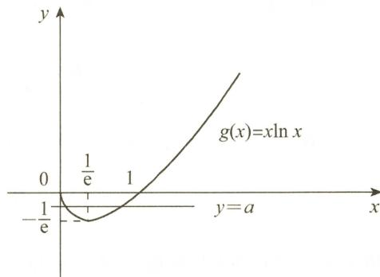

选项 D 正确.

图2-3

(4)C.

解 由 $f''(x) \neq 0$ ，知 $f(x)$ 在 $[0,1]$ 上不恒为常数。又 $f(0) = f(1)$ ，故 $f(x)$ 在 $[0,1]$ 上最大值 $M$ 和最小值 $m$ 至少有一个是在 $(a,b)$ 内取得。不妨设最大值 $M = f(\xi), \xi \in (a,b)$ ，则 $f(\xi)$ 是 $f(x)$ 的极大值，从而 $f'(\xi) = 0$ 。

用反证法证明 $\xi$ 的唯一性. 假设有两个点 $\xi, \eta \in (a, b)$ ，使得 $f'(\xi) = f'(\eta) = 0$ ，则由罗尔定理，知存在介于 $\xi$ 和 $\eta$ 之间的点 $x_{0}$ ，使得 $f''(x_{0}) = 0$ 。这与 $f''(x) \neq 0$ 矛盾，故 $\xi$ 是唯一的. 选项 C 正确.

(5)D.

解 利用导数定义,有

$$
F _ {-} ^ {\prime} (0) = \lim _ {x \to 0 ^ {-}} \frac {F (x) - F (0)}{x - 0} = \lim _ {x \to 0 ^ {-}} \frac {- f (x) \sin x}{x} = - \lim _ {x \to 0 ^ {-}} f (x),
$$

$$
F _ {+} ^ {\prime} (0) = \lim _ {x \to 0 ^ {+}} \frac {F (x) - F (0)}{x - 0} = \lim _ {x \to 0 ^ {+}} \frac {f (x) \sin x}{x} = \lim _ {x \to 0 ^ {+}} f (x),
$$

$$
F (x) \text {在} x = 0 \text {处可导} \Leftrightarrow F _ {-} ^ {\prime} (0) = F _ {+} ^ {\prime} (0) \Leftrightarrow - \lim _ {x \to 0 ^ {-}} f (x) = \lim _ {x \to 0 ^ {+}} f (x).
$$

故选项 D 正确.

(6)B.

解 由已知,有 $f(0)=0,F(0)=0.$

$$
F _ {+} ^ {\prime} (0) = \lim _ {x \to 0 ^ {+}} \frac {F (x) - F (0)}{x} = \lim _ {x \to 0 ^ {+}} \frac {\int_ {0} ^ {x} f (t) \mathrm{d} t}{x} = \lim _ {x \to 0 ^ {+}} f (x) = f (0) = 0,
$$

$$
F _ {-} ^ {\prime} (0) = \lim _ {x \to 0 ^ {-}} \frac {F (x) - F (0)}{x} = \lim _ {x \to 0 ^ {-}} \frac {\int_ {0} ^ {- x} f (t) \mathrm{d} t}{x} = \lim _ {x \to 0 ^ {-}} [ - f (- x) ] = - f (0) = 0,
$$

故 $F(x)$ 在 x = 0 处可导，且 $F'(0) = 0$ 。所以，

$$
F ^ {\prime} (x) = \left\{ \begin{array}{l l} f (x), & x > 0, \\ 0, & x = 0, \\ - f (- x), & x <   0, \end{array} \right.
$$

即 $F(x)$ 在 $(-\infty, +\infty)$ 内可导.

记 $h(x) = \int_{0}^{x}f(t)\mathrm{d}t$ ，由 $f(t)$ 是奇函数，知 $h(x)$ 是偶函数，从而 $F(x) = h(|x|)$ 是偶函数.选项B正确.

(7)D.

解 由 $f(x)$ 在 $(-1,1)$ 内可导，且 $\lim_{x\to 0}\frac{f(x)}{x^2} = 1$ ，知 $f(0) = 0$

又由 $\lim_{x\to 0}\frac{f(x)}{x^2} = \lim_{x\to 0}\frac{f(x) - f(0)}{x}\cdot \frac{1}{x} = 1$ ，知

$$
\lim _ {x \to 0} \frac {f (x) - f (0)}{x} = f ^ {\prime} (0) = 0.
$$

故 x = 0 是 $f(x)$ 的驻点.

由 $\lim_{x\to0}\frac{f(x)}{x^{2}}=1>0$ ，且根据极限的保号性，知在x=0的去心邻域内，有 $f(x)>0=f(0)$ ，故 $f(0)$ 是 $f(x)$ 的极小值。选项D正确。

对于选项 A, B: $\lim_{x\to0}\frac{f'(x)}{x}$ 不一定存在. 例如

$$
f (x) = \left\{ \begin{array}{l l} x ^ {3} \sin \frac {1}{x} + x ^ {2}, & x \neq 0, \\ 0, & x = 0. \end{array} \right.
$$

$$
\lim _ {x \to 0} \frac {f (x)}{x ^ {2}} = \lim _ {x \to 0} \frac {x ^ {3} \sin \frac {1}{x} + x ^ {2}}{x ^ {2}} = 1,
$$

$f(x)$ 是可导函数,且

$$
f ^ {\prime} (x) = \left\{ \begin{array}{l l} 3 x ^ {2} \sin \frac {1}{x} - x \cos \frac {1}{x} + 2 x, & x \neq 0, \\ 0, & x = 0, \end{array} \right.
$$

但

$$
\lim _ {x \to 0} {\frac {f ^ {\prime} (x)}{x}} = \lim _ {x \to 0} \Bigl (3 x \sin {\frac {1}{x}} - \cos {\frac {1}{x}} + 2 \Bigr)   \text {不存在}.
$$

对于选项 C: 由 $\lim_{x\to0}\frac{f'(x)}{x}$ 不一定存在, 知 $f''(0)=2$ 不一定成立. 排除选项 C.
(8) D.

解 ① 不能推出 $f'(a)$ 存在. 因为

$$
\lim _ {x \to 0} {\frac {f (a + x ^ {3}) - f (a)}{x ^ {2}}} = \lim _ {x \to 0} {\frac {f (a + x ^ {3}) - f (a)}{x ^ {3}}} \cdot x   \text {存在},
$$

有可能 $\lim_{x\to0}\frac{f(a+x^{3})-f(a)}{x^{3}}$ 为 $\infty$ （因 $\infty\cdot0$ 型极限可能存在）.

② 不能推出 $f'(a)$ 存在.例如

$$
f (x) = \left\{ \begin{array}{l l} x \sin \frac {\pi}{x}, & x \neq 0, \\ 0, & x = 0, \end{array} \right.
$$

则

$$
\lim _ {\Delta x \to 0} \frac {f (0 + \Delta x) - f (0)}{\Delta x} = \lim _ {\Delta x \to 0} \sin \frac {\pi}{\Delta x}   \text {不存在,}
$$

即 $f'(0)$ 不存在,但

$$
\lim _ {n \rightarrow \infty} \frac {f \left(\frac {1}{n}\right) - f (0)}{\frac {1}{n}} = \lim _ {n \rightarrow \infty} \sin n \pi = 0.
$$

③ 可推出 $f(x)$ 在 x = a 处可导.

$$
f ^ {\prime} (a) = \lim _ {x \to a} \frac {f (x) - f (a)}{x - a} = \lim _ {x \to a} \frac {(x - a) \varphi (x) - 0}{x - a} = \varphi (a).
$$

④ 可推出 $f^{\prime}(a)$ 存在. 由 $|f(x)| \leqslant L|x - a|^{\alpha}$ , 知 $f(a) = 0$ , 且

$$
0 \leqslant \left| \frac {f (x) - f (a)}{x - a} \right| \leqslant L | x - a | ^ {\alpha - 1}, x \in (a - \delta , a + \delta).
$$

由 $a > 1$ ，知 $\lim_{x\to a}L|x - a|^{\alpha -1} = 0.$ 故由夹逼准则，知

$$
\lim _ {x \to a} \left| \frac {f (x) - f (a)}{x - a} \right| = 0,
$$

从而

$$
f ^ {\prime} (a) = \lim _ {x \to a} \frac {f (x) - f (a)}{x - a} = 0.
$$

综上所述,选项 D 正确.

(9)C.

解 当 t > 0 时, 有

$$
\left\{ \begin{array}{l} x = t ^ {2}, \\ y = t \int_ {0} ^ {t} \mathrm{e} ^ {u ^ {2}} \mathrm{d} u, \end{array} \right. \quad \frac {\mathrm{d} y}{\mathrm{d} x} = \frac {\int_ {0} ^ {t} \mathrm{e} ^ {u ^ {2}} \mathrm{d} u + t \mathrm{e} ^ {t ^ {2}}}{2 t}.
$$

当 $t < 0$ 时，有

$$
\left\{ \begin{array}{l} x = - t ^ {2}, \\ y = - t \int_ {0} ^ {- t} \mathrm{e} ^ {u ^ {2}} \mathrm{d} u, \end{array} \right. \quad \frac {\mathrm{d} y}{\mathrm{d} x} = \frac {\int_ {0} ^ {- t} \mathrm{e} ^ {u ^ {2}} \mathrm{d} u - t \mathrm{e} ^ {t ^ {2}}}{2 t}.
$$

当 t = 0 时, x = 0. 由导数定义, 有

$$
\begin{array}{r l} f _ {+} ^ {\prime} (0) & = \lim _ {x \to 0 ^ {+}} \frac {f (x) - f (0)}{x} = \lim _ {t \to 0 ^ {+}} \frac {t \int_ {0} ^ {t} \mathrm{e} ^ {u ^ {2}} \mathrm{d} u}{t ^ {2}} \\ & = \lim _ {t \to 0 ^ {+}} \mathrm{e} ^ {t ^ {2}} = 1, \\ f _ {-} ^ {\prime} (0) & = \lim _ {x \to 0 ^ {-}} \frac {f (x) - f (0)}{x} = \lim _ {t \to 0 ^ {-}} \frac {- t \int_ {0} ^ {- t} \mathrm{e} ^ {u ^ {2}} \mathrm{d} u}{- t ^ {2}} \\ & = \lim _ {t \to 0 ^ {-}} (- \mathrm{e} ^ {t ^ {2}}) = - 1, \end{array}
$$

故 $f'(0)$ 不存在. 选项 C 正确而选项 A, D 不正确. 由于左右导数存在但不相等, 故 $f(x)$ 在 x = 0 处左连续, 也右连续, 从而 $f(x)$ 在 x = 0 处连续. 选项 B 不正确.

(10)D.

解 记 $f(x)=\sqrt{\mathrm{e}^{|x|}}$ ，则 $f(0)=1$ .

$$
f _ {+} ^ {\prime} (0) = \lim _ {x \rightarrow 0 ^ {+}} \frac {f (x) - f (0)}{x} = \lim _ {x \rightarrow 0 ^ {+}} \frac {\mathrm{e} ^ {\frac {1}{2} | x |} - 1}{x} = \lim _ {x \rightarrow 0 ^ {+}} \frac {\frac {1}{2} | x |}{x} = \frac {1}{2},
$$

$$
f _ {-} ^ {\prime} (0) = \lim _ {x \rightarrow 0 ^ {-}} \frac {f (x) - f (0)}{x} = \lim _ {x \rightarrow 0 ^ {-}} \frac {\mathrm{e} ^ {\frac {1}{2} | x |} - 1}{x} = \lim _ {x \rightarrow 0 ^ {-}} \frac {\frac {1}{2} | x |}{x} = - \frac {1}{2},
$$

故 $f(x) = \sqrt{\mathrm{e}^{|x|}}$ 在 $x = 0$ 处不可导.选项D正确.

对于选项 A: $\int_{0}^{x}\sin t^{2}dt$ 在 x=0 处可导且为 0, $|x|$ 在 x=0 处连续但不可导, 故

$|x|\int_{0}^{x}\sin t^{2}dt$ 在 x=0 处可导.

对于选项 B: 记 $f(x) = \sin(x - \sin x)$ ，则

$$
f (0) = 0,
$$

$$
f ^ {\prime} (0) = \cos (x - \sin x) (1 - \cos x) \mid_ {x = 0} = 0,
$$

故

$|f(x)|=|\sin(x-\sin x)|$ 在 x=0 处可导.

对于选项 C: 由

知

$$
\begin{array}{r l} \lim _ {x \to 0 ^ {+}} \sqrt {x} \ln x & = \lim _ {x \to 0 ^ {+}} \frac {\ln x}{\frac {1}{\sqrt {x}}} = \lim _ {x \to 0 ^ {+}} \frac {\frac {1}{x}}{\frac {1}{- 2 \sqrt {x}} \cdot \frac {1}{x}} = \lim _ {x \to 0 ^ {+}} (- 2 \sqrt {x}) = 0, \\ \lim _ {x \to 0 ^ {-}} \sqrt {- x} \ln (- x) & \stackrel {- x = u} {=} \lim _ {u \to 0 ^ {+}} \sqrt {u} \ln u = 0, \\ \lim _ {x \to 0} \sqrt {| x |} \ln | x | & = 0, \end{array}
$$

故 $x = 0$ 是 $\sqrt{|x|}\ln |x|$ 的可去间断点.

所以 $\int_{-1}^{x}\sqrt{|t|}\ln |t|\mathrm{d}t$ 在 $x = 0$ 处可导.

【注】结论:设 $F(x)=\int_{a}^{x}f(t)\mathrm{d}t,f(x)$ 在 $[a,b]$ 上除点 $x_{0}\in(a,b)$ 外连续,若 $x_{0}$ 是 $f(x)$ 的可去间断点,则 $F(x)$ 在 $x_{0}$ 处可导,且 $F'(x_{0})=\lim_{x\to x_{0}}f(x)$ .

(11)B.

解 由已知,有

$$
f (x) = \lim _ {n \rightarrow \infty} \frac {n \arctan (n x)}{n \sqrt {1 + \frac {x}{n}}} = \left\{\begin{array}{l l}\frac {\pi}{2},&x > 0,\\0,&x = 0,\\- \frac {\pi}{2},&x <   0.\end{array}\right.
$$

故 $x = 0$ 是 $f(x)$ 在 $[-1, 1]$ 上的跳跃间断点，从而 $f(x)$ 可积。所以 $F(x) = \int_{-1}^{x} f(t) \, \mathrm{d}t$ 连续，但在 $x = 0$ 处不可导。又 $f(x)$ 为奇函数，知 $F(x)$ 是连续的偶函数。选项 B 正确。

【注】结论：设 $F(x) = \int_{a}^{x}f(t)\mathrm{d}t,f(x)$ 在 $[a,b]$ 上除了 $x_0\in (a,b)$ 处以外连续.

① 若 $x_{0}$ 是 $f(x)$ 的可去间断点，则 $F(x)$ 在 $x_{0}$ 处可导，且 $F'(x_{0}) = \lim_{x \to x_{0}} f(x)$ .

② 若 $x_{0}$ 是 $f(x)$ 的跳跃间断点，则 $F(x)$ 在 $x_{0}$ 处连续，但不可导，且

$$
F _ {-} ^ {\prime} (x _ {0}) = \lim _ {x \rightarrow x _ {0} ^ {-}} f (x), F _ {+} ^ {\prime} (x _ {0}) = \lim _ {x \rightarrow x _ {0} ^ {+}} f (x).
$$

(12)C.

解 由已知,有

$$
x ^ {\prime} (t) = \frac {t ^ {2} (t ^ {2} + 3)}{(t ^ {2} + 1) ^ {2}}, y ^ {\prime} (t) = \frac {t (t - 1) (t ^ {2} + t + 4)}{(t ^ {2} + 1) ^ {2}},
$$

故

$$
y ^ {\prime} (x) = \frac {y ^ {\prime} (t)}{x ^ {\prime} (t)} = \frac {(t - 1) (t ^ {2} + t + 4)}{t (t ^ {2} + 3)} (t \neq 0).
$$

令 $y'(x)=0$ ，由 $t^{2}+t+4>0$ ，得 t=1，此时 $x=\frac{1}{2}$ .

当 t = 0 时，即 $x = 0, y'(x)$ 不存在.

当 $x < 0$ ，即 $t < 0$ 时， $y'(x) > 0$ ；当 $0 < x < \frac{1}{2}$ ，即 $0 < t < 1$ 时， $y'(x) < 0$ ，故 $y(0) = 0$ 为 $y(x)$ 的极大值.

当 $0 < t < 1$ 时， $y'(x) < 0$ ；当 $t > 1$ 时， $y'(x) > 0$ ，故 $y\left(\frac{1}{2}\right) = -\frac{1}{2}$ 为 $y(x)$ 的极小值.

选项 C 正确.

(13)B.

解 由已知 $f'(x_0) = f''(x_0) = f'''(x_0) = 0$ 及泰勒公式，有

$$
\begin{array}{r l} & {f (x) = f (x _ {0}) + f ^ {\prime} (x _ {0}) (x - x _ {0}) + \frac {f ^ {\prime \prime} (x _ {0})}{2 !} (x - x _ {0}) ^ {2} + \frac {f ^ {\prime \prime \prime} (x _ {0})}{3 !} (x - x _ {0}) ^ {3} +} \\ & {\qquad \frac {f ^ {(4)} (\xi)}{4 !} (x - x _ {0}) ^ {4} (\xi \text {介于} x _ {0} \text {与} x \text {之间})} \\ & {\qquad = f (x _ {0}) + \frac {f ^ {(4)} (\xi)}{4 !} (x - x _ {0}) ^ {4},   x \in (x _ {0} - \delta ,   x _ {0} + \delta),} \\ & {\qquad \qquad f (x) - f (x _ {0}) = \frac {f ^ {(4)} (\xi)}{4 !} (x - x _ {0}) ^ {4} <   0,} \end{array}
$$

故

于是 $f(x)$ 在 $x_{0}$ 处取得极大值. 选项 B 正确.

(14)B.

解 由已知, $F'(x)=f(x)$ 在 x=a 处取得最小值,在 x=b 处取得最大值.

用反证法. 若 $F_{+}^{\prime \prime}(a) < 0$ , 则

$$
F _ {+} ^ {\prime \prime} (a) = \lim _ {x \to a ^ {+}} \frac {F ^ {\prime} (x) - F _ {+} ^ {\prime} (a)}{x - a} = \lim _ {x \to a ^ {+}} \frac {f (x) - f (a)}{x - a} <   0.
$$

由极限的保号性, 知在 x = a 的某去心右邻域内 $f(x) < f(a)$ . 这与 $f(x)$ 在 x = a 处取得最小值矛盾, 故 $F_{+}^{\prime\prime}(a) \geqslant 0$ . 同理, 若 $F_{-}^{\prime\prime}(b) < 0$ , 则 $f(x)$ 在 x = b 处不可能取得最大值, 所以 $F_{-}^{\prime\prime}(b) \geqslant 0$ . 选项 B 正确. (15) C.

解 利用极值的定义判别.

由 $\lim_{x\to x_0}\frac{f(x) - f(x_0)}{(x - x_0)^n} = 1 > 0$ ，知在 $x_0$ 的去心邻域内 $\frac{f(x) - f(x_0)}{(x - x_0)^n} > 0$ ，即 $f(x) - f(x_0)$ 的正负由 $(x - x_0)^n$ 确定.

当 n 为奇数时，若 $x > x_{0}$ ，则 $f(x) - f(x_{0}) > 0$ ；若 $x < x_{0}$ ，则 $f(x) - f(x_{0}) < 0$ 。故 $x_{0}$ 不是 $f(x)$ 的极值点，排除选项 A 和 B。

当 n 为偶数时，若 $x > x_{0}$ 或 $x < x_{0}$ ，则 $f(x) - f(x_{0}) > 0$ 。故 $x_{0}$ 是 $f(x)$ 的极小值点，选项 C 正确。(16)D.

解由

$$
\left[ \mathrm{e} ^ {2 x} f (x) \right] ^ {\prime} = \mathrm{e} ^ {2 x} \left[ 2 f (x) + f ^ {\prime} (x) \right], \lim _ {x \rightarrow + \infty} \left[ 2 f (x) + f ^ {\prime} (x) \right] = 1,
$$

知

$$
\lim _ {x \to + \infty} \left[ \mathrm{e} ^ {2 x} f (x) \right] ^ {\prime} = + \infty .
$$

令 $h(x) = \mathrm{e}^{2x}f(x)$ ，由极限性质，知存在 $x_0 > 1$ 。当 $x > x_0$ 时， $h'(x) > 1$ ，应用拉格朗日中值定理，知存在 $\xi \in (x_0, x)$ ，使得

从而有

$$
\begin{array}{c} {h (x) - h (x _ {0}) = h ^ {\prime} (\xi) (x - x _ {0}) > x - x _ {0},} \\ {h (x) > h (x _ {0}) + x - x _ {0}.} \end{array}
$$

上式两端取极限,得

$\lim_{x\to+\infty}h(x)=+\infty$ , 即 $\lim_{x\to+\infty}\mathrm{e}^{2x}f(x)=+\infty$ . （结论②正确）

由洛必达法则,有

故

$$
\begin{array}{r l} \lim _ {x \to + \infty} f (x) & = \lim _ {x \to + \infty} \frac {h (x)}{\mathrm{e} ^ {2 x}} = \lim _ {x \to + \infty} \frac {h ^ {\prime} (x)}{2 \mathrm{e} ^ {2 x}} = \lim _ {x \to + \infty} \frac {2 f (x) + f ^ {\prime} (x)}{2} = \frac {1}{2}, \\ \lim _ {x \to + \infty} f ^ {\prime} (x) & = \lim _ {x \to + \infty} [ 2 f (x) + f ^ {\prime} (x) ] - 2 \lim _ {x \to + \infty} f (x) \\ & = 1 - 2 \lim _ {x \to + \infty} f (x) = 1 - 2 \times \frac {1}{2} = 0. (\text {结论} ④ 正 确) \end{array}
$$

选项 D 正确.

(17)D.

解 由 $\lim_{x\to0}\frac{f(x)+f'(x)}{x}=1$ ，知 $\lim_{x\to0}[f(x)+f'(x)]=0.$

又 $f(0)=0$ ，可得 $f'(0)=0$ 。

即

$$
\begin{array}{r l}\lim _ {x \rightarrow 0} \frac {f (x) + f ^ {\prime} (x)}{x}&= \lim _ {x \rightarrow 0} \frac {f (x) - f (0) + f ^ {\prime} (x) - f ^ {\prime} (0)}{x}\\&= f ^ {\prime} (0) + f ^ {\prime \prime} (0) = f ^ {\prime \prime} (0) = 1 > 0,\\f ^ {\prime \prime} (0)&= \lim _ {x \rightarrow 0} \frac {f ^ {\prime} (x)}{x} > 0,\end{array}
$$

故存在 $\delta > 0$ ，使得在 $(- \delta, 0)$ 内， $f'(x) < 0, f(x)$ 单调递减；在 $(0, \delta)$ 内， $f'(x) > 0, f(x)$ 单调递增。选项 D 正确。

(18)D.

解 涉及 $f(x)$ 与 $f'(x)$ 的极限, 考虑用拉格朗日中值定理.

由 $\lim_{x\to+\infty}f'(x)=+\infty$ ，知存在充分大的 $x_{0}$ 和 M. 当 $x>x_{0}$ 时，有 $f'(x)>M>1$ ，故当 $x\to+\infty$ 时， $f(x)=f(x_{0})+f'(\xi)(x-x_{0})>f(x_{0})+(x-x_{0})\to+\infty$ ， $\xi$ 介于 $x_{0}$ 与 x 之间.
选项 D 正确.

(19)C.

解令 $f(x) = \ln x - \frac{x}{\mathrm{e}} + k$ ，则 $f'(x) = \frac{1}{x} - \frac{1}{\mathrm{e}} = \frac{\mathrm{e} - x}{\mathrm{e}x}$ .

令 $f'(x)=0$ , 得 x=e , 可知 x=e 是 $f(x)$ 的最大值点, 且最大值为 $f(e)=k$ .

由 k > 0，知当 $x \in (0, e)$ 时， $f(x)$ 单调递增；当 $x \in (\mathrm{e}, +\infty)$ 时， $f(x)$ 单调递减。因此函数 $f(x)$ 的图形与 x 轴有两个不同交点，即方程有两个不同实根。选项 C 正确。

(20) A.

解 依题意, $k\neq0$ ,否则方程有两个实根.当 $x\neq0$ 时,原方程与 $kx^{3}-x^{2}+1=0$ 同解.

令 $f(x) = kx^{3} - x^{2} + 1$ ，则

$$
f ^ {\prime} (x) = 3 k x ^ {2} - 2 x = x (3 k x - 2) = 0,
$$

得驻点 $x_{1} = 0, x_{2} = \frac{2}{3k}$ . 又 $f''(x) = 2(3kx - 1)$ , 有

$$
f ^ {\prime \prime} (0) <   0, f ^ {\prime \prime} \Big (\frac {2}{3 k} \Big) = 2 > 0.
$$

由 $f''(0)<0$ , 可知 $f(0)=1>0$ 是极大值点.

要使方程有唯一实根, 必须有 $f\left(\frac{2}{3k}\right) > 0$ . 故 $\frac{8k}{27k^{3}} - \frac{4}{9k^{2}} + 1 > 0$ , 解得 $|k| > \frac{2}{9}\sqrt{3}$ . 选项 A 正确. (21) B.

解记

$$
f _ {n} (x) = x ^ {n} + n x - k, f _ {n} (0) = - k <   0, f _ {n} \left(\frac {k}{n}\right) = \left(\frac {k}{n}\right) ^ {n} > 0.
$$

由零点定理，知 $f_{n}(x_{n}) = 0, x_{n} \in \left(0, \frac{k}{n}\right)$ . 又由 $f_{n}^{\prime}(x) = nx^{n - 1} + n > 0$ ，知 $f_{n}(x)$ 严格单调递增，故 $x_{n}$ 是方程唯一实根.

当 $n > k$ ，且 $n > 1$ 时，

$$
\frac {k}{n} <   1, \frac {k}{n ^ {2}} <   \frac {k}{n}, f _ {n} \left(\frac {k}{n} - \frac {k}{n ^ {2}}\right) = \left(\frac {k}{n} - \frac {k}{n ^ {2}}\right) ^ {n} - \frac {k}{n} <   \left(\frac {k}{n} - \frac {k}{n ^ {2}}\right) - \frac {k}{n} = - \frac {k}{n ^ {2}} <   0.
$$

由 $f_{n}(x)$ 严格单调递增, $f_{n}(x_{n})=0$ , 知

$$
\frac {k}{n} - \frac {k}{n ^ {2}} <   x _ {n} <   \frac {k}{n},
$$

$$
\left(1 + \frac {k}{n} - \frac {k}{n ^ {2}}\right) ^ {n} <   (1 + x _ {n}) ^ {n} <   \left(1 + \frac {k}{n}\right) ^ {n}.
$$

故

又 $\lim_{n\to \infty}\left(1 + \frac{k}{n}\right)^n = \mathrm{e}^k,\lim_{n\to \infty}\left(1 + \frac{k}{n} -\frac{k}{n^2}\right)^n = \lim_{n\to \infty}\left(1 + \frac{k}{n} -\frac{k}{n^2}\right)^{\frac{1}{n} -\frac{k}{n^2}\cdot \left(\frac{k}{n} -\frac{k}{n^2}\right)\cdot n} = \mathrm{e}^k,$ $\lim_{n\to \infty}(1 + x_n)^n = \mathrm{e}^k.$

选项B正确.

(22)D.

解 根据拉格朗日中值定理,有

即

$$
\begin{array}{c} {f \Big (\frac {3}{4} \Big) - f \Big (\frac {1}{2} \Big) = f ^ {\prime} (\xi) \Big (\frac {3}{4} - \frac {1}{2} \Big) = \frac {1}{4} f ^ {\prime} (\xi) \geqslant \frac {1}{4} M,   \xi \in \Big (\frac {1}{2}, \frac {3}{4} \Big),} \\ {f \Big (\frac {3}{4} \Big) \geqslant \frac {1}{4} M + f \Big (\frac {1}{2} \Big).} \end{array}
$$

又由 $f^{\prime}(x)\geqslant M > 0$ ，知 $f(x)$ 单调递增，且 $f\left(\frac{1}{2}\right)\geqslant 0$ ，故 $f\left(\frac{3}{4}\right)\geqslant \frac{1}{4} M > 0.$

所以，在 $\left[\frac{3}{4}, 1\right]$ 上有 $f(x) \geqslant \frac{1}{4} M$ . 选项 D 正确.

(23)C.

解 由已知条件, 知 $y = f_{1}(x)$ 与 $y = f_{2}(x)$ 是凹函数, 且 $y = f_{1}(x)$ 在该点处曲率大于 $y = f_{2}(x)$ 的曲率.

如图 2-4 所示, 在点 $x_{0}$ 的某邻域内有

$$
f _ {1} (x) \geqslant f _ {2} (x) \geqslant g (x).
$$

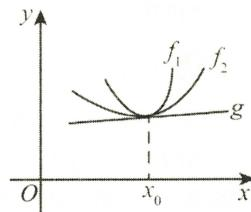

选项 C 正确.

(24)C.

图2-4

解 由已知, 当 $x \in (0,1)$ 时, $f'(x) < 0$ ; 当 $x \in (1,3)$ 时, $f'(x) > 0$ ; 当 $x \in (3,4)$ 时, $f'(x) < 0$ .

由拉格朗日中值定理,有

$$
f (3) - f (1) = f ^ {\prime} (\xi_ {1}) (3 - 1) = 2 f ^ {\prime} (\xi_ {1}) > 0, \xi_ {1} \in (1, 3),
$$

$$
f (4) - f (3) = f ^ {\prime} (\xi_ {2}) (4 - 3) = f ^ {\prime} (\xi_ {2}) <   0, \xi_ {2} \in (3, 4),
$$

且由牛顿-莱布尼茨公式,有

$$
f (4) - f (1) = \int_ {1} ^ {4} f ^ {\prime} (x) \mathrm{d} x = \int_ {1} ^ {3} f ^ {\prime} (x) \mathrm{d} x + \int_ {3} ^ {4} f ^ {\prime} (x) \mathrm{d} x = S _ {2} - S _ {3} > 0,
$$

故 $f(3)>f(4)>f(1)$ . 选项 C 正确.

(25) D.

解 依题设, $y=f(x)$ 如图 2-5 所示.

题中 ① 式可变形为

$$
\frac {f (x) - f (0)}{x} <   \frac {f (1) - f (x)}{1 - x}.
$$

由拉格朗日中值定理,有

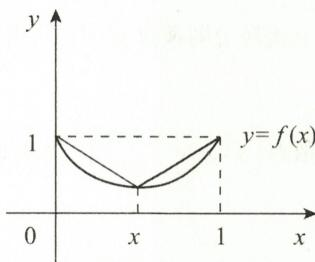

$$
f ^ {\prime} (\xi_ {1}) = \frac {f (x) - f (0)}{x}, \xi_ {1} \in (0, x),
$$

$$
f ^ {\prime} (\xi_ {2}) = \frac {f (1) - f (x)}{1 - x}, \xi_ {2} \in (x, 1).
$$

图2-5

由 $f''(x)>0$ ，知 $f'(x)$ 单调递增，故 $f'(\xi_{1})<f'(\xi_{2})$ 。①式正确。

题中 ③ 式可变形为

$$
x f (x) - x f (0) <   f (1) - f (x) - x f (1) + x f (x).
$$

由 $f(0)=f(1)$ ，知③式可变形为 $f(x)<f(1)$ 。由①式正确，知 $f(x)<f(0)=f(1)$ 。故③式正确。选项 D 正确。

(26)C.

解 若 $y = f(x)$ 的图形在 $[-1,1]$ 上是凹的，则由定义，对 $[-1,1]$ 上的任意 $x_{1} \neq x_{2}$ ，当 $0 < \lambda < 1$ 时，有 $f(\lambda x_{1}+(1-\lambda)x_{2})<\lambda f(x_{1})+(1-\lambda)f(x_{2}).$ ①

在 $[-1,1)$ 上任取 $x_{1} < x_{2}$ ，则存在 $\lambda \in (0,1)$ ，使得 $\lambda x_{1} + (1 - \lambda) \cdot 1 = x_{2}$ . 由 ① 式，得

$$
f (x _ {2}) = f (\lambda x _ {1} + (1 - \lambda) \cdot 1) <   \lambda f (x _ {1}) + (1 - \lambda) f (1)
$$

即 $f(x_{2}) - f(1) < \lambda [f(x_{1}) - f(1)]$ 由于 $x_{1} - 1 < 0, \lambda > 0$ ，故

$$
\frac {f (x _ {2}) - f (1)}{\lambda (x _ {1} - 1)} > \frac {f (x _ {1}) - f (1)}{x _ {1} - 1}.\tag{②}
$$

又 $x_{2} - 1 = \lambda x_{1} + 1 - \lambda -1 = \lambda (x_{1} - 1)$ ，由 $②$ 式得

$$
\frac {f (x _ {1}) - f (1)}{x _ {1} - 1} <   \frac {f (x _ {2}) - f (1)}{x _ {2} - 1}.
$$

故 $\frac{f(x)-f(1)}{x-1}$ 在 $[-1,1)$ 上严格单调递增.

反之，当 $\frac{f(x) - f(1)}{x - 1}$ 在 $[-1,1)$ 上严格单调递增时， $y = f(x)$ 的图形在 $[-1,1]$ 上不一定是凹的，例如， $f(x) = \begin{cases} x^2, & -1 \leqslant x < 0, \\ x^2 - 1, & 0 \leqslant x \leqslant 1, \end{cases}$ 则有

$$
g (x) \stackrel {\text {记}} {=} \frac {f (x) - f (1)}{x - 1} = \left\{ \begin{array}{l l} x + 1 + \frac {1}{x - 1}, & - 1 \leqslant x <   0, \\ x + 1, & 0 \leqslant x <   1. \end{array} \right.
$$

易知 $g(x)$ 在 $[-1,0)$ 与 $[0,1)$ 上分别严格单调递增，且

$$
\lim _ {x \rightarrow 0 ^ {-}} g (x) = 0 <   g (0) = 1,
$$

即 $g(x)$ 在 $[-1,1)$ 上严格单调递增，但 $f(x)$ 不连续，在 $[-1,1]$ 上不是凹函数。选项 C 正确。

【注】凹函数的定义: 设 $f(x)$ 在区间 I 上连续, 对任意 $x_{1} \neq x_{2}, x_{1}, x_{2} \in I, 0 < \lambda < 1$ , 若 $f(\lambda x_{1} + (1 - \lambda)x_{2}) < \lambda f(x_{1}) + (1 - \lambda)f(x_{2})$ , 则称 $y = f(x)$ 在 I 上是凹的.

(27) A.

解 依题设, 当 x > 0 时, 有

$$
y ^ {\prime} - p (x) y > 0.
$$

上式两边同乘以 $\mathrm{e}^{-\int_{0}^{x}p(t)\mathrm{d}t}$ ，得

$$
\mathrm{e} ^ {- \int_ {0} ^ {x} p (t) \mathrm{d} t} [ y ^ {\prime} - p (x) y ] > 0.
$$

故有 $\left[f(x)\mathrm{e}^{-\int_0^x p(t)\mathrm{d}t}\right]' > 0$ ，即 $f(x)\mathrm{e}^{-\int_0^x p(t)\mathrm{d}t}$ 在 $(0, + \infty)$ 内单调递增.所以

$$
f (x) \mathrm{e} ^ {- \int_ {0} ^ {x} p (t) \mathrm{d} t} > f (x) \mathrm{e} ^ {- \int_ {0} ^ {x} p (t) \mathrm{d} t} \Bigg | _ {x = 0} = f (0) \geqslant 0.
$$

而由 $\mathrm{e}^{-\int_0^x p(t)\mathrm{d}t} > 0$ ，可知 $f(x) > 0, x \in (0, +\infty)$ .

由已知, 可得 $y' = f'(x) > p(x)f(x) > 0$ , 于是 $y = f(x)$ 在 $(0, +\infty)$ 内单调递增. 当 0 < a < b 时, 有

$$
f (0) <   f (a) <   f (b).
$$

选项 A 正确.

(28)D.

解 由 $\lim_{x\to x_{0}^{-}}f'(x)=\lim_{x\to x_{0}^{+}}f'(x)=1$ , 知 $\lim_{x\to x_{0}}f'(x)=1>0$

由极限的保号性,知 $f(x)$ 分别在 $x_{0}$ 的去心左邻域与去心右邻域内单调递增.选项 D 正确.
由 $\lim_{x\to x_{0}}f'(x)=1$ ，不能保证 $f(x)$ 在 $x_{0}$ 处可导，也不能保证 $f(x)$ 在 $x_{0}$ 处连续和极限存在.

例如： $f(x) = \left\{ \begin{array}{ll}x + 1, & x > 0,\\ x, & x\leqslant 0, \end{array} \right.$ 则当 $x\neq 0$ 时， $f^{\prime}(x) = 1$ ，且

$$
\lim _ {x \to 0 ^ {-}} f ^ {\prime} (x) = \lim _ {x \to 0 ^ {+}} f ^ {\prime} (x) = 1.
$$

但 $\lim_{x\to 0^{-}}f(x) = 0\neq \lim_{x\to 0^{+}}f(x) = 1$ ，所以 $\lim_{x\to 0}f(x)$ 不存在， $f(x)$ 在 $x = 0$ 处不连续，不可导.排除选项A,B,C.

【注】注意区别 $f_{-}^{\prime}(x_{0}), f_{+}^{\prime}(x_{0})$ 均存在和 $\lim_{x\to x_{0}^{-}}f^{\prime}(x)=\lim_{x\to x_{0}^{+}}f^{\prime}(x)$ .

(29) A.

解

$$
f _ {+} ^ {\prime} (1) = \lim _ {x \to 1 ^ {+}} \frac {f (x) - f (1)}{x - 1} = \lim _ {x \to 1 ^ {+}} \frac {1}{(x - 1) ^ {\alpha + 1}} \sin \frac {1}{(x - 1) ^ {\beta}}.
$$

当 $\alpha + 1 < 0$ 时， $f_{+}^{\prime}(1) = 0$ ; 当 $\alpha + 1 \geqslant 0$ 时， $f_{+}^{\prime}(1)$ 不存在，而

$$
f _ {-} ^ {\prime} (1) = \lim _ {x \to 1 ^ {-}} \frac {f (x) - f (1)}{x - 1} = \lim _ {x \to 1 ^ {-}} \frac {0 - 0}{x - 1} = 0.
$$

故当 $\alpha < -1$ 时, 有

$$
f ^ {\prime} (x) = \left\{ \begin{array}{l l} \frac {- \alpha}{(x - 1) ^ {\alpha + 1}} \sin \frac {1}{(x - 1) ^ {\beta}} + \frac {- \beta}{(x - 1) ^ {\alpha + \beta + 1}} \cos \frac {1}{(x - 1) ^ {\beta}}, & x > 1, \\ 0, & x \leqslant 1. \end{array} \right.
$$

$$
\lim _ {x \to 1 ^ {+}} f ^ {\prime} (x) = \lim _ {x \to 1 ^ {+}} \left[ \frac {- \alpha}{(x - 1) ^ {\alpha + 1}} \sin \frac {1}{(x - 1) ^ {\beta}} + \frac {- \beta}{(x - 1) ^ {\alpha + \beta + 1}} \cos \frac {1}{(x - 1) ^ {\beta}} \right].
$$

当 $\alpha + 1 < 0$ 且 $\alpha + \beta + 1 < 0$ 时，有

$\lim_{x\to1^{+}}f'(x)=0$ ，而 $\lim_{x\to1^{-}}f'(x)=0$ .

即当 $\alpha < -1$ 且 $\alpha + \beta < -1$ 时， $\lim_{x \to 1} f'(x) = 0 = f'(1)$ ，从而 $f'(x)$ 在 x = 1 处连续。选项 A 正确。
(30) B.

解 依题设, 知 $f(0)=1$ , $y=f(x)$ 在点 $(0,1)$ 处与 $x^{2}+\left(y-\frac{3}{2}\right)^{2}=\frac{1}{4}$ 相切, 且曲率半径为 $\frac{1}{2}$ . 方

程 $x^{2} + \left(y - \frac{3}{2}\right)^{2} = \frac{1}{4}$ 两边同时对 $x$ 求导，得

$$
2 x + 2 \left(y - \frac {3}{2}\right) y ^ {\prime} = 0.
$$

将 x = 0, y = 1 代入上式，得 $y' \mid_{x=0} = 0$ ，故 $f'(0) = 0$ .

又 $\frac{1}{2}=\frac{(1+y^{\prime2})^{\frac{3}{2}}}{|y''|}\bigg|_{(0,1)}=\frac{1}{|y''|}\bigg|_{(0,1)}$ ，解得 $y''|_{x=0}=2$ ，故

$f''(0)=2$ （由曲率圆在点 $(0,1)$ 处的凹向，知 $y''|_{x=0}>0$ ）.

由泰勒公式,有

$$
f (x) = f (0) + f ^ {\prime} (0) x + \frac {f ^ {\prime \prime} (0)}{2 !} x ^ {2} + o (x ^ {2}) = 1 + x ^ {2} + o (x ^ {2}),
$$

故 $f(x)$ 在 x = 0 处的二次泰勒多项式为 $1 + x^{2}$ . 选项 B 正确.

## 二、填空题

(1) $-\frac{99!}{2}\pi.$

解 因为 $\left[\tan \left(\frac{\pi}{4} x\right) - 1\right] \Big|_{x=1} = 0$ ，令 $f(x) = \left[\tan \left(\frac{\pi}{4} x\right) - 1\right] \cdot g(x)$ ，则

$$
\begin{array}{r l} f ^ {\prime} (1) & = \left[ \tan \left(\frac {\pi}{4} x\right) - 1 \right] ^ {\prime} \Big | _ {x = 1} \cdot g (1) + 0 \cdot g ^ {\prime} (1) \\ & = \left[ \tan \left(\frac {\pi}{4} x\right) - 1 \right] ^ {\prime} \Big | _ {x = 1} \left[ \tan \left(\frac {\pi}{4} x ^ {2}\right) - 2 \right] \dots \left[ \tan \left(\frac {\pi}{4} x ^ {1 0 0}\right) - 1 0 0 \right] \Big | _ {x = 1} \\ & = \frac {\pi}{4} \cdot \frac {1}{\cos^ {2} \left(\frac {\pi}{4}\right)} \cdot (- 9 9!) = - \frac {9 9 !}{2} \pi . \end{array}
$$

(2)64.

解 由 $f(x) = 3x^{2} + kx^{-3}$ ，有 $f'(x) = 6x - 3kx^{-4} = 0$ ，得唯一驻点 $x = \sqrt[5]{\frac{k}{2}}$ . 又

$$
f ^ {\prime \prime} (x) = 6 + 1 2 k x ^ {- 5}, f ^ {\prime \prime} \Big (\sqrt [ 5 ]{\frac {k}{2}} \Big) > 0,
$$

故 $f\left(\sqrt[5]{\frac{k}{2}}\right) = 5\left(\frac{k}{2}\right)^{\frac{2}{5}}$ 为 $f(x)$ 在 $(0, + \infty)$ 内的最小值.

由 $5\left(\frac{k}{2}\right)^{\frac{2}{5}} \geqslant 20$ ，解得 $k \geqslant 64$ ，即 $k$ 至少为64.

(3)1.

解由

$$
y ^ {\prime} = \left[ 1 + x + \frac {x ^ {2}}{2 !} + \dots + \frac {x ^ {n - 1}}{(n - 1) !} \right] \mathrm{e} ^ {- x} - \left(1 + x + \frac {x ^ {2}}{2 !} + \dots + \frac {x ^ {n}}{n !}\right) \mathrm{e} ^ {- x} = - \frac {x ^ {n}}{n !} \mathrm{e} ^ {- x} = 0,
$$

解得 x = 0 。由于 n 为奇数，当 x < 0 时， $y' > 0$ ；当 x > 0 时， $y' < 0$ ，故 $f(0) = 1$ 是极大值。

(4) 2.

解 由 $f(a) = f(b)$ ，知 $\ln b + 1 = -\frac{1}{a}$ ，即 $b = \mathrm{e}^{-\frac{1}{a} - 1}$ . 故 $b - a = \mathrm{e}^{-\frac{1}{a} - 1} - a$ .

令 $g(t) = \mathrm{e}^{-\frac{1}{t} - 1} - t(t < 0)$ ，则由

$$
g ^ {\prime} (t) = \frac {1}{t ^ {2}} \mathrm{e} ^ {- \frac {1}{t} - 1} - 1 = \frac {\mathrm{e} ^ {- \frac {1}{t} - 1} - t ^ {2}}{t ^ {2}} = 0
$$

得 t = -1 为唯一驻点.

当 t<-1 时， $g'(t)<0$ ，知 $g(t)$ 单调递减；当 t>-1 时， $g'(t)>0$ ，知 $g(t)$ 单调递增。所以当 t=-1 时， $g(-1)=2$ 为极小值，也是最小值。故 b-a 的最小值为 2。

【注】由 $e^{-\frac{1}{t}-1}-t^{2}(t<0)$ 的单调性, 可知 t=-1 为 $g(t)$ 的唯一驻点.

(5) $\frac{1}{2}.$

解 易知 $k \neq 0, \lim_{x \to \infty} \left( \frac{x + k}{x - k} \right)^{x} = \lim_{x \to \infty} \left[ \left( 1 + \frac{2k}{x - k} \right)^{\frac{x - k}{2k}} \right]^{\frac{2kx}{x - k}} = e^{2k}.$

根据拉格朗日中值定理,有

$f(x)-f(x-1)=f'(\xi)\cdot1$ ( $\xi$ 介于 x-1 与 x 之间),

故

$$
\lim _ {x \to \infty} [ f (x) - f (x - 1) ] = \lim _ {x \to \infty} f ^ {\prime} (\xi) = \mathrm{e},
$$

于是 $e^{2k}=e.$ 所以, $k=\frac{1}{2}.$

(6)4,3.

解 由图 2-6 可知，

$$
f ^ {\prime} (x _ {1}) = f ^ {\prime} (x _ {3}) = f ^ {\prime} (x _ {4}) = f ^ {\prime} (x _ {6}) = 0,
$$

故 $x_{1}, x_{3}, x_{4}, x_{6}$ 是驻点. $f'(0)$ 与 $f'(x_{5})$ 不存在, 所以可能的极值点为: $x = x_{1}, x = x_{3}, x = 0, x = x_{4}, x = x_{6}, x = x_{5}$ .

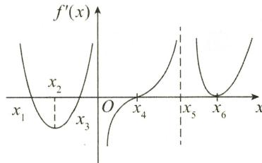

在 $x = x_{1}, x = x_{3}, x = 0, x = x_{4}$ 两侧， $f'(x)$ 均异号，故有 4 个极值点.

图2-6

$f''(x_{2})=0,f''(x_{6})=0,f''(0)$ 与 $f''(x_{5})$ 不存在.

在 $x = x_{2}$ ， $x = x_{6}$ 两侧， $f''(x)$ 变号；在 $x = x_{5}$ 两侧， $f''(x)$ 变号，故拐点有 3 个.

(7)9.

解 由反函数求导法则, 可知 $g'(y) = \frac{1}{f'(x)}$ .

由复合函数求导法则, 可知

$$
\begin{array}{r l} g ^ {\prime \prime} (y) & = \frac {\mathrm{d}}{\mathrm{d} y} \left[ \frac {1}{f ^ {\prime} (x)} \right] = \frac {\mathrm{d}}{\mathrm{d} x} \left[ \frac {1}{f ^ {\prime} (x)} \right] \cdot \frac {\mathrm{d} x}{\mathrm{d} y} = - \frac {f ^ {\prime \prime} (x)}{\left[ f ^ {\prime} (x) \right] ^ {2}} \cdot \frac {1}{f ^ {\prime} (x)} = - \frac {f ^ {\prime \prime} (x)}{\left[ f ^ {\prime} (x) \right] ^ {3}}, \\ g ^ {\prime \prime \prime} (y) & = \frac {\mathrm{d}}{\mathrm{d} y} [ g ^ {\prime \prime} (y) ] = - \frac {\mathrm{d}}{\mathrm{d} y} \left\{\frac {f ^ {\prime \prime} (x)}{\left[ f ^ {\prime} (x) \right] ^ {3}} \right\} = - \frac {\mathrm{d}}{\mathrm{d} x} \left\{\frac {f ^ {\prime \prime} (x)}{\left[ f ^ {\prime} (x) \right] ^ {3}} \right\} \cdot \frac {\mathrm{d} x}{\mathrm{d} y} \\ & = - \frac {f ^ {\prime \prime \prime} (x) [ f ^ {\prime} (x) ] ^ {3} - 3 [ f ^ {\prime} (x) ] ^ {2} \cdot [ f ^ {\prime \prime} (x) ] ^ {2}}{\left[ f ^ {\prime} (x) \right] ^ {6}} \cdot \frac {1}{f ^ {\prime} (x)} \\ & = - \frac {f ^ {\prime \prime \prime} (x) [ f ^ {\prime} (x) ] ^ {3} - 3 [ f ^ {\prime} (x) ] ^ {2} [ f ^ {\prime \prime} (x) ] ^ {2}}{\left[ f ^ {\prime} (x) \right] ^ {7}}, \\ g ^ {\prime \prime \prime} (y _ {0}) & = - \frac {f ^ {\prime \prime \prime} (x _ {0}) [ f ^ {\prime} (x _ {0}) ] ^ {3} - 3 [ f ^ {\prime} (x _ {0}) ] ^ {2} [ f ^ {\prime \prime} (x _ {0}) ] ^ {2}}{\left[ f ^ {\prime} (x _ {0}) \right] ^ {7}} = 9. \end{array}
$$

故

(8) $n!\frac{(-1)^{n - 2}}{(n - 1)2^{n - 1}}.$

解 $f(x) = \int_{0}^{x}\mathrm{e}^{-f(t)}\mathrm{d}t$ 两边同时对 $x$ 求导，得 $f^{\prime}(x) = \mathrm{e}^{-f(x)}$ ，即

$$
\mathrm{e} ^ {f (x)} \cdot f ^ {\prime} (x) = 1.
$$

上式两边同时积分, 得 $\mathrm{e}^{f(x)} = x + C$ , 即 $f(x) = \ln(x + C)$ .

由已知， $f(0)=0$ ，得C=1，故 $f(x)=\ln(x+1)$ .

$$
\begin{array}{r l} g (x) & = x f (x + 1) = x \ln (x + 2) = x \ln \left[ 2 \left(1 + \frac {x}{2}\right) \right] \\ & = x \left[ \ln 2 + \ln \left(1 + \frac {x}{2}\right) \right] \\ & = x \left[ \ln 2 + \frac {x}{2} - \frac {1}{2} \left(\frac {x}{2}\right) ^ {2} + \dots + (- 1) ^ {n - 1} \frac {1}{n} \left(\frac {x}{2}\right) ^ {n} + o (x ^ {n}) \right] \\ & = x \ln 2 + \frac {x ^ {2}}{2} - \frac {1}{2 \cdot 2 ^ {2}} x ^ {3} + \dots + \frac {(- 1) ^ {n - 1}}{n \cdot 2 ^ {n}} x ^ {n + 1} + o (x ^ {n + 1}), \end{array}
$$

故

$$
g ^ {(n)} (0) = n! a _ {n} = n! \frac {(- 1) ^ {n - 2}}{(n - 1) 2 ^ {n - 1}}.
$$

(9) $(-2)^{n}n!$ .

解 由 $f(x) = (x^2 - 4x + 3)^n = (x - 1)^n (x - 3)^n$ ，知

$$
\lim _ {x \to 1} \frac {f (x)}{(x - 1) ^ {n}} = \lim _ {x \to 1} (x - 3) ^ {n} = (- 2) ^ {n},
$$

故当 $x \to 1$ 时，

$$
f (x) \sim (- 2) ^ {n} (x - 1) ^ {n} \text {或} f (x) = (- 2) ^ {n} (x - 1) ^ {n} + o [ (x - 1) ^ {n} ].
$$

又由泰勒公式，

$$
f (x) = f (1) + f ^ {\prime} (1) (x - 1) + \dots + \frac {f ^ {(n)} (1)}{n !} (x - 1) ^ {n} + o [ (x - 1) ^ {n} ],
$$

得 $\frac{f^{(n)}(1)}{n!}=(-2)^{n}$ ，故 $f^{(n)}(1)=(-2)^{n}n!$ .

(10) $-4\sqrt{3}.$

解 由 $f'(y) = \frac{1}{g'(x)}$ ，且当 $x = 1$ 时， $y = g(1) = 2$ ，知

$$
f ^ {\prime} (2) = \frac {1}{g ^ {\prime} (1)} = - \sqrt {3},
$$

故

$$
\begin{array}{r l} \lim _ {y \to 2} \left[ (y - 2) \frac {f (y) - f (2)}{(\ln y - \ln 2) ^ {2}} \right] & = \lim _ {y \to 2} \left[ \frac {f (y) - f (2)}{y - 2} \cdot \frac {(y - 2) ^ {2}}{(\ln y - \ln 2) ^ {2}} \right] \\ & = f ^ {\prime} (2) \lim _ {y \to 2} \frac {(y - 2) ^ {2}}{\left[ \ln \left(1 + \frac {y}{2} - 1\right) \right] ^ {2}} = 4 f ^ {\prime} (2) = - 4 \sqrt {3}. \end{array}
$$

(11)1.

解

$$
\lim _ {n \rightarrow \infty} n \left[ f \left(\frac {2 n + 1}{n}\right) - 3 \right] = \lim _ {n \rightarrow \infty} \frac {f \left(2 + \frac {1}{n}\right) - 3}{\frac {1}{n}}.
$$

由已知可得, 当 x = 2 时, t = 1, y = 3, 故

$$
\text {原式} = \lim _ {n \to \infty} \frac {f \left(2 + \frac {1}{n}\right) - f (2)}{\frac {1}{n}} = f _ {+} ^ {\prime} (2) = \frac {\mathrm{d} y}{\mathrm{d} x} \Big | _ {x = 2} = \frac {4 - 2 t}{2 t} \Big | _ {t = 1} = 1.
$$

(12) $x^{2}+\left(y-\frac{1}{2}\right)^{2}=\frac{1}{4}.$

解 由 $y = f(x)$ 在点(0,0)处与 $x$ 轴相切，知 $f(0) = 0, f'(0) = 0$ .

又由 $\lim_{x\to 0}\frac{f(x)}{x^2} = \lim_{x\to 0}\frac{f'(x)}{2x} = \lim_{x\to 0}\frac{f''(x)}{2} = \frac{1}{2} f''(0) = 1$ ，知 $f''(0) = 2$ ，故 $y = f(x)$ 在点 $(0,0)$ 处的

曲率半径为

$$
R = \frac {\left[ 1 + f ^ {\prime 2} (0) \right] ^ {\frac {3}{2}}}{\mid f ^ {\prime \prime} (0) \mid} = \frac {1}{2}.
$$

由 $f''(0)=2>0$ 及 $f''(x)$ 连续，知在 x=0 的邻域内有 $f''(x)>0$ .

由于曲率圆在点 $(0,0)$ 处与 $y=f(x)$ 有相同的凹向，知 $y=f(x)$ 在点 $(0,0)$ 处的曲率圆方程为

$$
x ^ {2} + \left(y - \frac {1}{2}\right) ^ {2} = \frac {1}{4}.
$$

## 三、解答题

(1) 解

$$
\lim _ {x \to 0 ^ {-}} f (x) = c, \lim _ {x \to 0 ^ {+}} f (x) = 0, f (0) = c,
$$

由 $f(x)$ 在 x = 0 处连续，故 c = 0.

$$
f _ {+} ^ {\prime} (0) = \lim _ {x \to 0 ^ {+}} \frac {f (x) - f (0)}{x - 0} = \lim _ {x \to 0 ^ {+}} \frac {\ln (1 + x) - 0}{x} = 1,
$$

$$
f _ {-} ^ {\prime} (0) = \lim _ {x \to 0 ^ {-}} \frac {f (x) - f (0)}{x - 0} = \lim _ {x \to 0 ^ {-}} \frac {a x ^ {2} + b \sin x - 0}{x} = b,
$$

由 $f^{\prime}(x)$ 在 $x = 0$ 处连续，知 $b = 1.$ 故当 $b = 1, c = 0$ 时， $f^{\prime}(x)$ 在 $x = 0$ 处连续，且

$$
f ^ {\prime} (x) = \left\{ \begin{array}{l l} 2 a x + \cos x, & x <   0, \\ 1, & x = 0, \\ \frac {1}{1 + x}, & x > 0, \end{array} \right.
$$

$$
f _ {+} ^ {\prime \prime} (0) = \lim _ {x \to 0 ^ {+}} \frac {f ^ {\prime} (x) - f ^ {\prime} (0)}{x - 0} = \lim _ {x \to 0 ^ {+}} \frac {\frac {1}{1 + x} - 1}{x} = - 1,
$$

$$
f _ {-} ^ {\prime \prime} (0) = \lim _ {x \to 0 ^ {-}} \frac {f ^ {\prime} (x) - f ^ {\prime} (0)}{x - 0} = \lim _ {x \to 0 ^ {-}} \frac {2 a x + \cos x - 1}{x} = 2 a.
$$

所以，当 $a \neq -\frac{1}{2}$ 时， $f''(0)$ 不存在.

(2) 解 考虑到 $f(x)$ 的周期性及 $f(x)$ 在 x = 1 处可导, 所以解本题的关键是求 $f(1)$ 和 $f'(1)$ .

由

得

$$
\begin{array}{r l} & {\underset {x \to 0} {\lim} [ f (1 + \sin x) - 3 f (1 - \sin x) ] = \underset {x \to 0} {\lim} [ 8 x + \alpha (x) ],} \\ & {\qquad f (1) - 3 f (1) = 0, \text {即} f (1) = 0.} \end{array}
$$

又

$$
\lim _ {x \to 0} \frac {f (1 + \sin x) - 3 f (1 - \sin x)}{\sin x} = \lim _ {x \to 0} \left[ \frac {8 x}{\sin x} + \frac {\alpha (x)}{x} \cdot \frac {x}{\sin x} \right] = 8,
$$

即

$$
\lim _ {x \to 0} \left[ \frac {f (1 + \sin x) - f (1)}{\sin x} + 3 \frac {f (1 - \sin x) - f (1)}{- \sin x} \right] = 8,
$$

故

$$
f ^ {\prime} (1) + 3 f ^ {\prime} (1) = 8, \text {即} f ^ {\prime} (1) = 2.
$$

又 $f(x + 5) = f(x)$ ，有 $f(6) = f(1) = 0, f'(6) = f'(1) = 2.$ 故切线方程为 $y - 0 = 2(x - 6)$ ，即 $2x - y - 12 = 0.$

(3) 解 对 $f(x)$ 求导, 得

$$
\begin{array}{r l} f ^ {\prime} (x) & = n (1 - x) ^ {n} + n ^ {2} x (1 - x) ^ {n - 1} \cdot (- 1) \\ & = n (1 - x) ^ {n - 1} [ 1 - (n + 1) x ] (0 <   x <   1). \end{array}
$$

令 $f'(x_{0})=0$ , 解得 $x_{0}=\frac{1}{n+1}$ .

当 $0 < x < \frac{1}{n + 1}$ 时， $f'(x) > 0$ ；当 $\frac{1}{n + 1} < x < 1$ 时， $f'(x) < 0$ 。故 $f(x)$ 在点 $x_0$ 处取得极大值。

又 $f(0) = 0, f(1) = 0$ ，所以

$$
M (n) = f \left(x _ {0}\right) = \frac {n}{n + 1} \left(1 - \frac {1}{n + 1}\right) ^ {n} = \left(\frac {n}{n + 1}\right) ^ {n + 1}
$$

为 $f(x)$ 在 $[0,1]$ 上的最大值，且 $\lim_{n\to \infty}M(n) = \lim_{n\to \infty}\left(\frac{n}{n + 1}\right)^{n + 1} = \mathrm{e}^{-1}.$

(4) 解（I）当 $p \leqslant 0$ 时， $\lim_{x \to 0} f(x) = \lim_{x \to 0} |x|^{p} \sin \frac{1}{x}$ ，极限不存在，故 x = 0 是 $f(x)$ 的间断点；

当 $p > 0$ 时， $\lim_{x\to 0}f(x) = \lim_{x\to 0}|x|^p\sin \frac{1}{x} = 0 = f(0)$ ，故 $f(x)$ 在 $x = 0$ 处连续

(Ⅱ) 当 p > 1 时，

$$
\lim _ {x \to 0 ^ {-}} \frac {f (x) - f (0)}{x - 0} = - \lim _ {x \to 0 ^ {-}} | x | ^ {p - 1} \sin \frac {1}{x} = 0,
$$

$$
\lim _ {x \to 0 ^ {+}} \frac {f (x) - f (0)}{x - 0} = \lim _ {x \to 0 ^ {+}} | x | ^ {p - 1} \sin \frac {1}{x} = 0,
$$

故 $f(x)$ 在 x = 0 处可导.

（Ⅲ）当 p > 2 时，由（Ⅱ）知 $f'(0) = 0$ 。若 x > 0，则

$$
f ^ {\prime} (x) = \left(x ^ {p} \sin \frac {1}{x}\right) ^ {\prime} = p x ^ {p - 1} \sin \frac {1}{x} - x ^ {p - 2} \cos \frac {1}{x} \rightarrow 0 (x \rightarrow 0 ^ {+}),
$$

故 $\lim_{x\to 0^{+}}f^{\prime}(x) = 0$ ；若 $x < 0$ ，则

$$
f ^ {\prime} (x) = \left[ (- x) ^ {p} \sin \frac {1}{x} \right] ^ {\prime} = - p (- x) ^ {p - 1} \sin \frac {1}{x} - (- x) ^ {p - 2} \cos \frac {1}{x} \rightarrow 0 (x \rightarrow 0 ^ {-}),
$$

故 $\lim_{x\to0^{-}}f'(x)=0.$

由此可知，当 p > 2 时， $f'(x)$ 在 x = 0 处连续.

(5) 解 这是相关变化率问题, 先建立漏斗中液面高度与圆柱形筒中液面高度的关系. 如图 2-7 所示, 设 t 时刻圆柱形筒中溶液的高度为 $h_{1}$ , 漏斗中的溶液的高度为 $h_{2}$ , 其液面半径为 r, 则有

$\frac{r}{6}=\frac{h_{2}}{18}$ ，即 $r=\frac{1}{3}h_{2}$ .

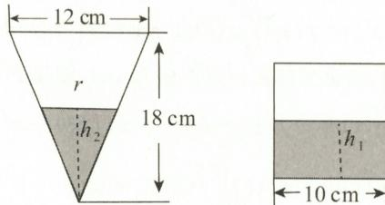  
图2-7

依题设，

$$
\frac {1}{3} \pi \times 6 ^ {2} \times 1 8 - \frac {1}{3} \pi r ^ {2} h _ {2} = \pi \cdot 5 ^ {2} \cdot h _ {1},
$$

即

$$
\frac {1}{3} \times 6 ^ {2} \times 1 8 - \frac {1}{3} \cdot \frac {1}{9} h _ {2} ^ {3} = 5 ^ {2} \cdot h _ {1}.
$$

上式两边同时对 t 求导, 得

$$
- \frac {1}{3} \cdot \frac {1}{9} \cdot 3 h _ {2} ^ {2} \cdot \frac {\mathrm{d} h _ {2}}{\mathrm{d} t} = 5 ^ {2} \cdot \frac {\mathrm{d} h _ {1}}{\mathrm{d} t}.
$$

所以

当 $h_2 = 12$ 时， $\frac{\mathrm{d}h_2}{\mathrm{d}t} = -1$ （由于漏斗中液面下降，故取负值）.

$$
\frac {1}{9} \times 1 2 ^ {2} \times 1 = 5 ^ {2} \cdot \frac {\mathrm{d} h _ {1}}{\mathrm{d} t}, \text {解得} \frac {\mathrm{d} h _ {1}}{\mathrm{d} t} = 0. 6 4 \mathrm{cm/min}.
$$

(6) 证 (I) 由

$$
\lim _ {x \to 0 ^ {+}} \frac {f (x)}{x} = 1 \Rightarrow \left\{ \begin{array}{l l} f (0) = 0, \\ f _ {+} ^ {\prime} (0) = \lim _ {x \to 0 ^ {+}} \frac {f (x) - f (0)}{x - 0} = 1, \end{array} \right.
$$

$$
\lim _ {x \to 1 ^ {-}} {\frac {f (x)}{x - 1}} = 1 \Rightarrow {\left\{ \begin{array}{l l} {f (1) = 0,} \\ {f _ {-} ^ {\prime} (1) = \lim _ {x \to 1 ^ {-}} {\frac {f (x) - f (1)}{x - 1}} = 1,} \end{array} \right.}
$$

知 $f(0)=f(1)=0.$

由保号性， $f_{+}^{\prime}(0) = \lim_{x\to 0^{+}}\frac{f(x)}{x} = 1 > 0$ ，知日 $x_{1}\in (0,\delta_{1})(\delta_{1} > 0)$ ，使得 $f(x_{1}) > 0$

由保号性, $f_{-}^{\prime}(1)=\lim_{x\to1^{-}}\frac{f(x)}{x-1}=1>0$ ,知 $x_{2}\in(1-\delta_{2},1)(\delta_{2}>0)$ ,使得 $f(x_{2})<0$ .

由零点定理, 知 $\exists\xi\in(x_{1},x_{2})\subset(0,1)$ , 使得 $f(\xi)=0$ .

(Ⅱ) 令 $g(x)=f(x)e^{-x}$ ，在 $[0,\xi]$ ， $[\xi,1]$ 上分别应用罗尔定理.

由 $g(0) = g(\xi) = 0$ ，知 $\exists \xi_1\in (0,\xi)$ ，使得 $g^{\prime}(\xi_{1}) = 0$ ，即

$$
\mathrm{e} ^ {- \xi_ {1}} \left[ f ^ {\prime} (\xi_ {1}) - f (\xi_ {1}) \right] = 0,
$$

可得 $f'(\xi_{1}) - f(\xi_{1}) = 0.$

又由 $g(\xi) = g(1) = 0$ ，知 $\exists \xi_2\in (\xi ,1)$ ，使得 $g^{\prime}(\xi_{2}) = 0$ ，即

$$
\mathrm{e} ^ {- \xi_ {2}} \left[ f ^ {\prime} (\xi_ {2}) - f (\xi_ {2}) \right] = 0,
$$

可得 $f'(\xi_{2}) - f(\xi_{2}) = 0$ 。综上可知， $f'(x) - f(x) = 0$ 有两个根 $\xi_{1}$ 和 $\xi_{2}$ 。

再令 $F(x)=\mathrm{e}^{x}\left[f'(x)-f(x)\right]$ ，在 $\left[\xi_{1},\xi_{2}\right]$ 上应用罗尔定理.

$F(\xi_{1})=F(\xi_{2})=0$ ,所以 $\exists\eta\in(\xi_{1},\xi_{2})\subset(0,1)$ ,使得 $F'(\eta)=0$ ,即

$$
\mathrm{e} ^ {\eta} \big [ f ^ {\prime \prime} (\eta) - f ^ {\prime} (\eta) + f ^ {\prime} (\eta) - f (\eta) \big ] = 0.
$$

故 $f''(\eta) = f(\eta)$ .

(7) 证令

$$
F (x) = f (x) \int_ {x} ^ {b} g (t) \mathrm{d} t + g (x) \int_ {a} ^ {x} f (t) \mathrm{d} t,
$$

则 $F(a) = F(b) = 0$ 。由罗尔定理，知至少存在一点 $\xi \in (a, b)$ ，使得 $F'(\xi) = 0$ ，即

$$
\begin{array}{r l} F ^ {\prime} (\xi) & = f ^ {\prime} (\xi) \int_ {\xi} ^ {b} g (t) \mathrm{d} t - f (\xi) g (\xi) + g (\xi) f (\xi) + g ^ {\prime} (\xi) \int_ {a} ^ {\xi} f (t) \mathrm{d} t \\ & = f ^ {\prime} (\xi) \int_ {\xi} ^ {b} g (t) \mathrm{d} t + g ^ {\prime} (\xi) \int_ {a} ^ {\xi} f (t) \mathrm{d} t = 0. \end{array}
$$

(8) 解 将函数 $f(x)$ 进行恒等变换, 有 $f(x)=(1+x)^{\frac{1}{x}}=\mathrm{e}^{\frac{1}{x}\ln(1+x)}$ .

$$
\ln (1 + x) = x - \frac {1}{2} x ^ {2} + \frac {1}{3} x ^ {3} + o (x ^ {3}),
$$

$$
\mathrm{e} ^ {x} = 1 + x + \frac {x ^ {2}}{2 !} + o (x ^ {2}),
$$

故

$$
\begin{array}{r l} \mathrm{e} ^ {\frac {1}{x} \ln (1 + x)} & = \mathrm{e} ^ {\frac {1}{x} \left[ x - \frac {1}{2} x ^ {2} + \frac {1}{3} x ^ {3} + o (x ^ {3}) \right]} = \mathrm{e} \cdot \mathrm{e} ^ {- \frac {1}{2} x + \frac {1}{3} x ^ {2} + o (x ^ {2})} \\ & = \mathrm{e} \cdot \left[ 1 + \left(- \frac {1}{2} x + \frac {1}{3} x ^ {2}\right) + \frac {1}{2 !} \left(- \frac {1}{2} x + \frac {1}{3} x ^ {3}\right) ^ {2} + o (x ^ {2}) \right] \\ & = \mathrm{e} - \frac {1}{2} \mathrm{e} x + \frac {1 1}{2 4} \mathrm{e} x ^ {2} + o (x ^ {2}). \end{array}
$$

所以, $a=-\frac{1}{2}e,b=\frac{11}{24}e.$

(9) 证（I）由已知， $f_{+}^{\prime}(a)f_{-}^{\prime}(b)<0$ ，不妨设 $f_{+}^{\prime}(a)<0,f_{-}^{\prime}(b)>0$ 。由

$$
f _ {+} ^ {\prime} (a) = \lim _ {x \to a ^ {+}} \frac {f (x) - f (a)}{x - a} <   0,
$$

知存在 $x_{1} \in (a, a + \delta_{1})(\delta_{1} > 0)$ ，使得 $f(x_{1}) < f(a)$ ，故 $f(a)$ 不是 $f(x)$ 在 $[a, b]$ 上的最小值.

同理，由 $f_{-}^{\prime}(b) > 0$ 可推得 $f(b)$ 不是 $f(x)$ 在 $[a,b]$ 上最小值，于是 $f(x)$ 在 $[a,b]$ 上的最小值只能在区间 $(a,b)$ 内取得.令 $x = \xi \in (a,b),f(x)$ 取得最小值，从而知 $f^{\prime}(\xi) = 0$

(Ⅱ) 令 $g(x) = f(x) - \mu x$ ，则 $g'(x) = f'(x) - \mu$ ，于是有 $g_{+}'(a) \cdot g_{-}'(b) < 0$ .

由（I）知，存在 $\xi \in (a,b)$ ，使得 $g^{\prime}(\xi) = 0$ ，即 $f^{\prime}(\xi) = \mu .$

【注】本题(Ⅱ)是导函数的介值定理.本题(Ⅰ)说明导函数 $f'(x)$ 具有连续函数的零点定理性质,结论(Ⅱ)说明 $f'(x)$ 具有介值定理性质,不需要 $f'(x)$ 连续的条件.

(10) 证 先证存在 $\xi \in (a, b)$ ，使得 $f(\xi) = 0$ 。用反证法。

假设不存在 $\xi\in(a,b)$ ，使得 $f(\xi)=0$ ，则在 $(a,b)$ 内，总有 $f(x)>0$ 或 $f(x)<0$ 。

若 $f(x) > 0$ ，且 $f(a) = f(b) = 0$ ，则

$$
f _ {+} ^ {\prime} (a) = \lim _ {x \to a ^ {+}} \frac {f (x) - f (a)}{x - a} = \lim _ {x \to a ^ {+}} \frac {f (x)}{x - a} \geqslant 0,
$$

$$
f _ {-} ^ {\prime} (b) = \lim _ {x \to b ^ {-}} \frac {f (x) - f (b)}{x - b} = \lim _ {x \to b ^ {-}} \frac {f (x)}{x - b} \leqslant 0.
$$

故有 $f_{+}^{\prime}(a) \cdot f_{-}^{\prime}(b) \leqslant 0$ ，与条件 $f_{+}^{\prime}(a)f_{-}^{\prime}(b) > 0$ 矛盾.

若 $f(x) < 0$ ，则

$$
f _ {+} ^ {\prime} (a) = \lim _ {x \to a ^ {+}} \frac {f (x)}{x - a} \leqslant 0, f _ {-} ^ {\prime} (b) = \lim _ {x \to b ^ {-}} \frac {f (x)}{x - b} \geqslant 0.
$$

故有 $f_{+}^{\prime}(a)f_{-}^{\prime}(b)\leqslant 0$ ，与条件 $f_{+}^{\prime}(a)f_{-}^{\prime}(b) > 0$ 矛盾.

综上可知,存在 $\xi\in(a,b)$ , 使得 $f(\xi)=0$ .

再证存在 $\eta\in(a,b)$ ，使得 $f''(\eta)=0$ 。

$f(a) = f(\xi) = f(b)$ , 在 $[a, \xi]$ 与 $[\xi, b]$ 上对 $f(x)$ 分别应用罗尔定理, $\exists \eta_1 \in (a, \xi), \eta_2 \in (\xi, b)$ , 使得 $f'(\eta_1) = 0, f'(\eta_2) = 0$ . 对 $f'(x)$ 在 $[\eta_1, \eta_2]$ 上再用罗尔定理, $\exists \eta \in (\eta_1, \eta_2) \subset (a, b)$ , 使得 $f''(\eta) = 0$ .

(11) 解 (I) $f(x) = f(c) + f'(c)(x - c) + \frac{f''(\xi)}{2!} (x - c)^2, \xi$ 介于 $x$ 与 $c$ 之间.

证（Ⅱ）在上式中，分别令 x = 0, x = 1，则有

$$
f (0) = f (c) + f ^ {\prime} (c) (0 - c) + \frac {f ^ {\prime \prime} (\xi_ {1})}{2 !} (0 - c) ^ {2}, 0 <   \xi_ {1} <   c <   1,
$$

$$
f (1) = f (c) + f ^ {\prime} (c) (1 - c) + \frac {f ^ {\prime \prime} (\xi_ {2})}{2 !} (1 - c) ^ {2}, 0 <   c <   \xi_ {2} <   1.
$$

两式相减, 得

$$
f (1) - f (0) = f ^ {\prime} (c) + \frac {1}{2 !} \big [ f ^ {\prime \prime} (\xi_ {2}) (1 - c) ^ {2} - f ^ {\prime \prime} (\xi_ {1}) c ^ {2} \big ],
$$

故

$$
\mid f ^ {\prime} (c) \mid \leqslant \mid f (1) \mid + \mid f (0) \mid + \frac {1}{2 !} \mid f ^ {\prime \prime} (\xi_ {2}) \mid (1 - c) ^ {2} + \frac {1}{2 !} \mid f ^ {\prime \prime} (\xi_ {1}) \mid c ^ {2}
$$

$$
\leqslant a + a + \frac {b}{2} [ (1 - c) ^ {2} + c ^ {2} ].
$$

又 $c \in (0,1), (1 - c)^2 + c^2 \leqslant 1$ ，所以 $|f'(c)| \leqslant 2a + \frac{b}{2}$ .

(12) 证 (I)

$$
f ^ {\prime} (x) = \frac {1}{1 + x ^ {2}} + \frac {1}{1 + \left(\frac {1}{x}\right) ^ {2}} \cdot \left(- \frac {1}{x ^ {2}}\right) = 0,
$$

故 $f(x)\equiv c(c$ 为常数).又

$$
f (1) = 2 \int_ {0} ^ {1} \frac {\mathrm{d} t}{1 + t ^ {2}} = 2 \arctan t \Big | _ {0} ^ {1} = 2 \times \frac {\pi}{4} = \frac {\pi}{2},
$$

故 $f(x)=\frac{\pi}{2}$ .

(Ⅱ) 当 x = 1 时, $\arctan 1 - \frac{1}{2} \arccos \frac{2}{1 + 1^{2}} = \frac{\pi}{4}$ ;

当 $x > 1$ 时，令 $f(x) = \arctan x - \frac{1}{2}\arccos \frac{2x}{1 + x^2} -\frac{\pi}{4}$ ，则

$$
\begin{array}{r l} f ^ {\prime} (x) & = \frac {1}{1 + x ^ {2}} + \frac {1}{2} \cdot \frac {1}{\sqrt {1 - \frac {4 x ^ {2}}{(1 + x ^ {2}) ^ {2}}}} \cdot \frac {2 (1 + x ^ {2}) - 4 x ^ {2}}{(1 + x ^ {2}) ^ {2}} \\ & = \frac {1}{1 + x ^ {2}} + \frac {1 + x ^ {2}}{x ^ {2} - 1} \cdot \frac {1 - x ^ {2}}{(1 + x ^ {2}) ^ {2}} \equiv 0, \end{array}
$$

故 $f(x) \equiv c$ (c 为常数).

又 $f(x)$ 在 $[1, +\infty)$ 内连续，故 $f(1) = \lim_{x\to 1^{+}}f(x) = 0.$ 所以 $f(x) = 0$ ，即

$$
\arctan x - \frac {1}{2} \arccos \frac {2 x}{1 + x ^ {2}} = \frac {\pi}{4}.
$$

(13) 证 当 $x_0$ 是 $f(x)$ 的极值点时, 有 $f'(x_0) = 0$ . 将 $x_0$ 代入已知条件, 得

$$
f ^ {\prime \prime} (x _ {0}) = \frac {1 - \mathrm{e} ^ {1 - x _ {0}}}{x _ {0} - 1}.
$$

当 $x_0 \neq 1$ 时，若 $x_0 > 1$ ，则 $f''(x_0) > 0$ ，若 $x_0 < 1$ ，则 $f''(x_0) > 0$ ，故 $x = x_0$ 为 $f(x)$ 极小值点；当 $x_0 = 1$ 时，由 $f'(1) = 0, f''(1) = \lim_{x \to 1} f''(x) = \lim_{x \to 1} \frac{1 - e^{1 - x}}{x - 1} = 1 > 0$ ，知 $f(x)$ 在 $x_0 = 1$ 处取得极小值.

综上可知， $f(x)$ 在 $x = x_{0}$ 处取得极小值.

## (14) 解 本题是隐函数求最值问题.

椭圆方程 $x^{2} - xy + y^{2} = 3$ ，两边同时对 $x$ 求导，得

$$
2 x - y - x y ^ {\prime} + 2 y y ^ {\prime} = 0, \text {解得} y ^ {\prime} = \frac {2 x - y}{x - 2 y}.
$$

令 $y' = 0$ ，有 y = 2x. x = 2y 是 $y'$ 不存在的点.

将 y = 2x 代入原方程, 得 x = 1, y = 2 或 x = -1, y = -2;

将 x = 2y 代入原方程, 得 x = 2, y = 1 或 x = -2, y = -1.

比较可得 x = 1 和 x = -1 分别是 $y = y(x)$ 的最大值点和最小值点，且椭圆上纵坐标最大的点为 $(1, 2)$ ，最小的点为 $(-1, -2)$ .

(15) 解由 $f(x)=\arctan x$ ，有 $f'(x)=\frac{1}{1+x^{2}}$ ，故

$$
(1 + x ^ {2}) f ^ {\prime} (x) = 1.
$$

上式两边同时对 x 求 $(n-1)$ 阶导数, 得

①

$$
[ (1 + x ^ {2}) f ^ {\prime} (x) ] ^ {(n - 1)} = 0.
$$

利用莱布尼茨公式,令 $u = f'(x)$ , $v = 1 + x^{2}$ , 则

$$
f ^ {(n)} (x) (1 + x ^ {2}) + (n - 1) f ^ {(n - 1)} (x) \cdot 2 x + \frac {(n - 1) (n - 2)}{2} f ^ {(n - 2)} (x) \cdot 2 = 0,
$$

将 $x = 0$ 代入上式，得

$$
f ^ {(n)} (0) (1 + 0) + (n - 1) f ^ {(n - 1)} (0) \bullet 0 + \frac {(n - 1) (n - 2)}{2} f ^ {(n - 2)} (0) \bullet 2 = 0,
$$

即

$$
f ^ {(n)} (0) = - (n - 1) (n - 2) f ^ {(n - 2)} (0).
$$

又 $f(0)=0$ ，由①式得 $f''(0)=0$ ，故 $f^{(2k)}(0)=0$ 。

又 $f'(0) = 1$ ，由①式可得

$$
f ^ {\prime \prime \prime} (0) = - 2!, f ^ {(5)} = - 4 \cdot 3 \cdot f ^ {\prime \prime \prime} (0) = 4!.
$$

故

$$
f ^ {(2 k + 1)} (0) = (- 1) ^ {k} (2 k)! (k = 0, 1, 2, \dots).
$$

【注】也可利用泰勒公式.

$$
\text {由} f (x) = \arctan x = x - {\frac {x ^ {3}}{3}} + {\frac {x ^ {5}}{5}} - \dots + (- 1) ^ {k} \cdot {\frac {x ^ {2 k + 1}}{2 k + 1}} + \dots , \text {得}
$$

$$
f ^ {(n)} (0) = \left\{ \begin{array}{l l} 0, & n = 2 k, \\ (- 1) ^ {k} (2 k)!, & n = 2 k + 1. \end{array} \right.
$$

(16) 解 (I) $f'(x) = a_{1} \cos x + 2a_{2} \cdot \cos 2x + \cdots + na_{n} \cos nx$ ，故

$$
f ^ {\prime} (0) = a _ {1} + 2 a _ {2} + \dots + n a _ {n}.
$$

证（Ⅱ） $|f^{\prime}(0)| = \left|\lim_{x\to 0}\frac{f(x) - f(0)}{x - 0}\right| = \lim_{x\to 0}\left|\frac{f(x)}{x}\right|\leqslant \lim_{x\to 0}\left|\frac{\sin x}{x}\right| = 1,$ 故

$$
\mid a _ {1} + 2 a _ {2} + \dots + n a _ {n} \mid \leqslant 1.
$$

## (17) 证 只要证明两曲线在交点处导数相等.

设交点为 $(x_{0},y_{0})$ ，则 $f(x_{0})=f(x_{0})\sin x_{0}$ 。又 $f(x_{0})>0$ ，故 $\sin x_{0}=1$ ，解得 $x_{0}=\frac{\pi}{2}+2n\pi(n$ 为整数 $)$ 。

曲线 $y = f(x)$ 在点 $(x_{0}, y_{0})$ 处的切线斜率为 $f'(x_{0})$ ;

曲线 $y = f(x)\sin x$ 在点 $(x_0,y_0)$ 处的切线斜率为

$$
\left[ f (x) \sin x \right] ^ {\prime} \Big | _ {x = x _ {0}} = f ^ {\prime} (x _ {0}) \sin x _ {0} + f (x _ {0}) \cos x _ {0}.
$$

由于在 $x_0 = \frac{\pi}{2} + 2n\pi$ 处， $\cos x_0 = 0, \sin x_0 = 1$ ，故

$$
\left[ f (x) \sin x \right] ^ {\prime} \Big | _ {x = x _ {0}} = f ^ {\prime} (x _ {0}).
$$

因此它们在交点处相切.

(18) 解 由 $y = \sqrt{x}$ ，有 $y' = \frac{1}{2\sqrt{x}}$ ， $y'' = \frac{-1}{4\sqrt{x^3}}$ ，则曲率半径为

$$
R = R (x) = \frac {(1 + y ^ {\prime 2}) ^ {\frac {3}{2}}}{| y ^ {\prime \prime} |} = \frac {1}{2} (4 x + 1) ^ {\frac {3}{2}}.
$$

抛物线上 $\widehat{AM}$ 的弧长为 $s = s(x) = \int_{1}^{x}\sqrt{1 + y'^2}\mathrm{d}x = \int_{1}^{x}\sqrt{1 + \frac{1}{4t}}\mathrm{d}t$ ，故

$$
\frac {\mathrm{d} R}{\mathrm{d} s} = \frac {\mathrm{d} R}{\mathrm{d} x} \cdot \frac {\mathrm{d} x}{\mathrm{d} s} = \frac {\frac {1}{2} \cdot \frac {3}{2} (4 x + 1) ^ {\frac {1}{2}} \cdot 4}{\sqrt {1 + \frac {1}{4 x}}} = 6 \sqrt {x},
$$

$$
\frac {\mathrm{d} ^ {2} R}{\mathrm{d} s ^ {2}} = \frac {\mathrm{d}}{\mathrm{d} x} \Big (\frac {\mathrm{d} R}{\mathrm{d} s} \Big) \cdot \frac {\mathrm{d} x}{\mathrm{d} s} = \frac {6}{2 \sqrt {x}} \cdot \frac {1}{\sqrt {1 + \frac {1}{4 x}}} = \frac {6}{\sqrt {4 x + 1}}.
$$

因此

$$
3 R \frac {\mathrm{d} ^ {2} R}{\mathrm{d} s ^ {2}} - \left(\frac {\mathrm{d} R}{\mathrm{d} s}\right) ^ {2} = 3 \cdot \frac {1}{2} (4 x + 1) ^ {\frac {3}{2}} \cdot \frac {6}{\sqrt {4 x + 1}} - 3 6 x = 9.
$$

(19) 解 $y = f(x)$ 在点 $(x, f(x))$ 处的切线方程为

$$
Y = f (x) + f ^ {\prime} (x) (X - x).
$$

令 $Y = 0$ ，可得切线在 $x$ 轴上的截距为 $X = x - \frac{f(x)}{f'(x)} = u(x)$ ，故

$$
\begin{array}{r l} & {\underset {x \to 0} {\lim} \frac {x}{u (x)} = \underset {x \to 0} {\lim} \frac {x}{x - \frac {f (x)}{f ^ {\prime} (x)}} = \underset {x \to 0} {\lim} \frac {x f ^ {\prime} (x)}{x f ^ {\prime} (x) - f (x)}} \\ & {\quad \frac {\text {洛必达}}{\text {法则}} \underset {x \to 0} {\lim} \frac {f ^ {\prime} (x) + x f ^ {\prime \prime} (x)}{x f ^ {\prime \prime} (x)} = 1 + \underset {x \to 0} {\lim} \frac {f ^ {\prime} (x)}{x f ^ {\prime \prime} (x)}} \\ & {\quad = 1 + \underset {x \to 0} {\lim} \frac {f ^ {\prime} (x) - f ^ {\prime} (0)}{x - 0} \cdot \frac {1}{f ^ {\prime \prime} (x)}} \\ & {\quad = 1 + \frac {f ^ {\prime \prime} (0)}{f ^ {\prime \prime} (0)} = 1 + 1 = 2.} \end{array}
$$

(20) 证 由已知, 不妨设 $x_{1}<x_{2}$ , 令 $x=\lambda x_{1}+(1-\lambda)x_{2}$ , 则 $x_{1}<x<x_{2}$ .

由拉格朗日中值定理，有

$$
\begin{array}{l} {f (x) - f (x _ {1}) = f ^ {\prime} (\xi_ {1}) (x - x _ {1}) = f ^ {\prime} (\xi_ {1}) (1 - \lambda) (x _ {2} - x _ {1}) (x _ {1} <   \xi_ {1} <   x),} \\ {f (x _ {2}) - f (x) = f ^ {\prime} (\xi_ {2}) (x _ {2} - x) = f ^ {\prime} (\xi_ {2}) \lambda (x _ {2} - x _ {1}) (x <   \xi_ {2} <   x _ {2}).} \end{array}\tag{①}
$$

②

①×λ-②×(1-λ)，得

$$
f (x) - \lambda f \left(x _ {1}\right) - (1 - \lambda) f \left(x _ {2}\right) = \lambda (1 - \lambda) \left(x _ {2} - x _ {1}\right) \left[ f ^ {\prime} \left(\xi_ {1}\right) - f ^ {\prime} \left(\xi_ {2}\right) \right].
$$

由 $f'(x)$ 严格单调递增，知 $f'(\xi_{1}) < f'(\xi_{2})$ ，即 $f(x) - \lambda f(x_{1}) - (1 - \lambda)f(x_{2}) < 0$ ，故

$$
f \left[ \lambda x _ {1} + (1 - \lambda) x _ {2} \right] <   \lambda f \left(x _ {1}\right) + (1 - \lambda) f \left(x _ {2}\right).
$$

【注】①对任意 $x_{1},x_{2}\in(a,b)$ ，且 $x_{1}\neq x_{2},0<\lambda<1$ ，有

$$
f \left[ \lambda x _ {1} + (1 - \lambda) x _ {2} \right] <   \lambda f \left(x _ {1}\right) + (1 - \lambda) f \left(x _ {2}\right).
$$

这是 $f(x)$ 在 $(a,b)$ 内为凹函数的定义.

② 若 $f(x)$ 在 $(a,b)$ 内二阶可导，且 $f''(x)>0$ ，对任意 $x_{1},x_{2}\in(a,b),x_{1}\neq x_{2}$ ，则

$$
f \left[ \lambda x _ {1} + (1 - \lambda) x _ {2} \right] <   \lambda f \left(x _ {1}\right) + (1 - \lambda) f \left(x _ {2}\right).
$$

可用泰勒公式证明：

令 $x = \lambda x_{1} + (1 - \lambda)x_{2},f(u)$ 在点 $x$ 处展开，有

$$
f (u) = f (x) + f ^ {\prime} (x) (u - x) + \frac {f ^ {\prime \prime} (\xi)}{2 !} (u - x) ^ {2} (\xi \text {介于} u \text {与} x \text {之间}).
$$

将 $u = x_{1}, u = x_{2}$ 代入上式，得

$$
\begin{array}{r l} f (x _ {1}) & = f (x) + f ^ {\prime} (x) (x _ {1} - x) + \frac {f ^ {\prime \prime} (\xi_ {1})}{2 !} (x _ {1} - x) ^ {2} \\ & = f (x) + f ^ {\prime} (x) (1 - \lambda) (x _ {1} - x _ {2}) + \frac {f ^ {\prime \prime} (\xi_ {1})}{2 !} (x _ {1} - x) ^ {2}, \end{array}\tag{①}
$$

$$
\begin{array}{r l} f (x _ {2}) & = f (x) + f ^ {\prime} (x) (x _ {2} - x) + \frac {f ^ {\prime \prime} (\xi_ {2})}{2 !} (x _ {2} - x) ^ {2} \\ & = f (x) + f ^ {\prime} (x) \lambda (x _ {2} - x _ {1}) + \frac {f ^ {\prime \prime} (\xi_ {2})}{2 !} (x _ {2} - x) ^ {2} \end{array}\tag{②}
$$

$(\xi_{1}$ 介于 $x_{1}$ 与x之间， $\xi_{2}$ 介于 $x_{2}$ 与x之间），

则 ①×λ+②×(1-λ)，得

$$
\lambda f (x _ {1}) + (1 - \lambda) f (x _ {2}) = f (x) + \lambda \frac {f ^ {\prime \prime} (\xi_ {1})}{2} (x _ {1} - x) ^ {2} + (1 - \lambda) \frac {f ^ {\prime \prime} (\xi_ {2})}{2} (x _ {2} - x) ^ {2}.
$$

由 $f''(x) > 0$ ，知

$$
\lambda f \left(x _ {1}\right) + (1 - \lambda) f \left(x _ {2}\right) > f (x) = f \left[ \lambda x _ {1} + (1 - \lambda) x _ {2} \right].
$$

(21) 证 将 $|\mathbf{A}|$ 的第二行 $\times (-1)$ 加到第三行, 再将第一行 $\times (-1)$ 加到第二行, 按 $|\mathbf{A}|$ 的第一列展开, 有

$$
\begin{array}{r l} \mid \boldsymbol {A} \mid & = \left| \begin{array}{c c c} 1 & x _ {1} & f (x _ {1}) \\ 1 & x _ {2} & f (x _ {2}) \\ 1 & x _ {3} & f (x _ {3}) \end{array} \right| = \left| \begin{array}{c c c} 1 & x _ {1} & f (x _ {1}) \\ 0 & x _ {2} - x _ {1} & f (x _ {2}) - f (x _ {1}) \\ 0 & x _ {3} - x _ {2} & f (x _ {3}) - f (x _ {2}) \end{array} \right| \\ & = \left| \begin{array}{c c} x _ {2} - x _ {1} & f (x _ {2}) - f (x _ {1}) \\ x _ {3} - x _ {2} & f (x _ {3}) - f (x _ {2}) \end{array} \right| \\ & = (x _ {2} - x _ {1}) [ f (x _ {3}) - f (x _ {2}) ] - (x _ {3} - x _ {2}) [ f (x _ {2}) - f (x _ {1}) ], \end{array}
$$

故

$$
| \textbf {A} | > 0 \text {等价于} \frac {f (x _ {3}) - f (x _ {2})}{x _ {3} - x _ {2}} > \frac {f (x _ {2}) - f (x _ {1})}{x _ {2} - x _ {1}}.
$$

先证必要性. 由拉格朗日中值定理, 知存在 $\xi_{1} \in (x_{1}, x_{2}), \xi_{2} \in (x_{2}, x_{3})$ , 使得

$$
f ^ {\prime} (\xi_ {1}) = \frac {f (x _ {2}) - f (x _ {1})}{x _ {2} - x _ {1}}, f ^ {\prime} (\xi_ {2}) = \frac {f (x _ {3}) - f (x _ {2})}{x _ {3} - x _ {2}}.
$$

由 $f^{\prime}(x)$ 在 $(a,b)$ 内严格单调递增以及 $\xi_1 < \xi_2$ ，可得 $f^{\prime}(\xi_{1}) < f^{\prime}(\xi_{2})$ ，即

$$
\frac {f (x _ {3}) - f (x _ {2})}{x _ {3} - x _ {2}} > \frac {f (x _ {2}) - f (x _ {1})}{x _ {2} - x _ {1}}.
$$

再证充分性. 任取 $x_0, x_1, x_2 \in (a, b)$ , 满足 $x_1 < x_0 < x_2$ . 取 $s, t$ 满足 $x_1 < s < x_0 < t < x_2$ . 由已知, 有

$$
\frac {f (s) - f (x _ {1})}{s - x _ {1}} <   \frac {f (x _ {0}) - f (s)}{x _ {0} - s}, \frac {f (t) - f (x _ {0})}{t - x _ {0}} <   \frac {f (x _ {2}) - f (t)}{x _ {2} - t},
$$

则

$$
f ^ {\prime} (x _ {1}) = \lim _ {s \to x _ {1} ^ {+}} \frac {f (s) - f (x _ {1})}{s - x _ {1}} \leqslant \lim _ {s \to x _ {1} ^ {+}} \frac {f (x _ {0}) - f (s)}{x _ {0} - s} = \frac {f (x _ {0}) - f (x _ {1})}{x _ {0} - x _ {1}},\tag{①}
$$

$$
f ^ {\prime} (x _ {2}) = \lim _ {t \rightarrow x _ {2} ^ {-}} \frac {f (x _ {2}) - f (t)}{x _ {2} - t} \geqslant \lim _ {t \rightarrow x _ {2} ^ {-}} \frac {f (t) - f (x _ {0})}{t - x _ {0}} = \frac {f (x _ {2}) - f (x _ {0})}{x _ {2} - x _ {0}}.\tag{②}
$$

由 ①、② 式以及 $\frac{f(x_0) - f(x_1)}{x_0 - x_1} < \frac{f(x_2) - f(x_0)}{x_2 - x_0}$ ，知 $f'(x_1) < f'(x_2)$ .

由 $x_{1}, x_{2}$ 的任意性, 知 $f'(x)$ 在 $(a, b)$ 内严格单调递增.

(22) 证（Ⅰ）由拉格朗日中值定理，知存在一点 $\xi_{1} \in \left(0, \frac{1}{2}\right)$ ，使得

$$
f ^ {\prime} (\xi_ {1}) = \frac {f \left(\frac {1}{2}\right) - f (0)}{\frac {1}{2} - 0} = 2 f \left(\frac {1}{2}\right);
$$

①

存在一点 $\xi_2\in \left(\frac{1}{2},1\right)$ ，使得

$$
f ^ {\prime} (\xi_ {2}) = \frac {f (1) - f \left(\frac {1}{2}\right)}{1 - \frac {1}{2}} = 2 \left[ 1 - f \left(\frac {1}{2}\right) \right].\tag{②}
$$

① + ②, 得

$$
f ^ {\prime} (\xi_ {1}) + f ^ {\prime} (\xi_ {2}) = 2.
$$

(Ⅱ) 所证不等式变形为

$$
f ^ {\prime} (\xi) = \frac {f (\eta) f ^ {\prime} (\eta)}{\eta}.
$$

由拉格朗日中值定理,知存在一点 $\xi\in(0,1)$ ,使得

$$
f ^ {\prime} (\xi) = \frac {f (1) - f (0)}{1 - 0} = 1.\tag{③}
$$

令 $F(x)=f^{2}(x)$ , $G(x)=x^{2}$ ，则 $F(0)=0$ , $F(1)=1$ , $G(0)=0$ , $G(1)=1$ .

由柯西中值定理,知存在一点 $\eta \in (0,1)$ ,使得

即

$$
\begin{array}{c} {{ \frac {F ^ {\prime} (\eta)}{G ^ {\prime} (\eta)} =  \frac {F (1) - F (0)}{G (1) - G (0)} = 1,}} \\ {{ \frac {f (\eta) f ^ {\prime} (\eta)}{\eta} = 1.}} \end{array}\tag{④}
$$

由 ③ 式与 ④ 式, 知

$$
f ^ {\prime} (\xi) = \frac {f (\eta) f ^ {\prime} (\eta)}{\eta}, \text {即} \eta f ^ {\prime} (\xi) = f (\eta) f ^ {\prime} (\eta).
$$

## 拓展题

解答题

(1) 解 由已知, 点 $(x, f(x))$ 处的切线方程为

$$
Y - f (x) = f ^ {\prime} (x) (X - x),
$$

令 Y = 0，可得切线在 x 轴上的截距为

$$
F (x) = x - \frac {f (x)}{f ^ {\prime} (x)} (x > 0).
$$

由 $f''(x)>0$ , 知 $f'(x)>f'(0)=0$ .

$$
\lim _ {x \to 0 ^ {+}} F (x) = \lim _ {x \to 0 ^ {+}} \left[ x - \frac {f (x)}{f ^ {\prime} (x)} \right] = - \lim _ {x \to 0 ^ {+}} \frac {f (x)}{f ^ {\prime} (x)} = 0,
$$

$$
\begin{array}{r l} \lim _ {x \to 0 ^ {+}} F ^ {\prime} (x) & = \lim _ {x \to 0 ^ {+}} \left[ 1 - \frac {f ^ {\prime 2} (x) - f (x) f ^ {\prime \prime} (x)}{f ^ {\prime 2} (x)} \right] = \lim _ {x \to 0 ^ {+}} \frac {f (x) f ^ {\prime \prime} (x)}{f ^ {\prime 2} (x)} \\ & = f ^ {\prime \prime} (0) \lim _ {x \to 0 ^ {+}} \frac {f (x)}{f ^ {\prime 2} (x)} = f ^ {\prime \prime} (0) \lim _ {x \to 0 ^ {+}} \frac {f ^ {\prime} (x)}{2 f ^ {\prime} (x) f ^ {\prime \prime} (x)} = \frac {1}{2}, \\ & \quad \lim _ {x \to 0 ^ {+}} [ F (x) + F ^ {\prime} (x) ] = 0 + \frac {1}{2} = \frac {1}{2}. \end{array}
$$

故

(2) 证（Ⅰ）当 $f(x) \equiv 0$ 时，显然原不等式恒成立。不妨设 $f(x) \neq 0$ ，且 $\left|f(x_{0})\right| = \max_{a \leqslant x \leqslant b} |f(x)|$ ，则 $x_{0}$ 是 $f(x)$ 的极值点，从而 $f'(x_{0}) = 0$ ，故利用泰勒公式，可知存在 $\xi$ ，使得

$$
f (x) = f \left(x _ {0}\right) + f ^ {\prime} \left(x _ {0}\right) \left(x - x _ {0}\right) + \frac {1}{2} f ^ {\prime \prime} (\xi) \left(x - x _ {0}\right) ^ {2} = f \left(x _ {0}\right) + \frac {1}{2} f ^ {\prime \prime} (\xi) \left(x - x _ {0}\right) ^ {2}
$$

成立. 将 x = a, x = b 代入上式, 可得

$$
0 = f (a) = f (x _ {0}) + \frac {1}{2} f ^ {\prime \prime} (\xi_ {1}) (a - x _ {0}) ^ {2},\tag{①}
$$

$$
0 = f (b) = f (x _ {0}) + \frac {1}{2} f ^ {\prime \prime} (\xi_ {2}) (b - x _ {0}) ^ {2},\tag{②}
$$

$$
\xi_ {1} \in (a, x _ {0}), \xi_ {2} \in (x _ {0}, b).
$$

若 $x_0 \in \left(a, \frac{a + b}{2}\right]$ ，则由 ① 式可得

$$
\mid f (x _ {0}) \mid = \frac {1}{2} \mid f ^ {\prime \prime} (\xi_ {1}) \mid (a - x _ {0}) ^ {2} \leqslant \frac {1}{2} \max _ {a \leqslant x \leqslant b} \mid f ^ {\prime \prime} (x) \mid \cdot \frac {(b - a) ^ {2}}{4} = \frac {1}{8} M (b - a) ^ {2}.
$$

若 $x_0 \in \left(\frac{a + b}{2}, b\right)$ , 则由 ② 式可得

$$
\mid f (x _ {0}) \mid = \frac {1}{2} \mid f ^ {\prime \prime} (\xi_ {2}) \mid (b - x _ {0}) ^ {2} \leqslant \frac {1}{2} \max _ {a \leqslant x \leqslant b} \mid f ^ {\prime \prime} (x) \mid \cdot \frac {(b - a) ^ {2}}{4} = \frac {1}{8} M (b - a) ^ {2}.
$$

综上所述,原不等式得证.

（Ⅱ）不妨设 $|f'(x_1)| = \max_{a\leqslant x\leqslant b}|f'(x)|$ ，则由泰勒公式，可知

$$
0 = f (a) = f \left(x _ {1}\right) + f ^ {\prime} \left(x _ {1}\right) \left(a - x _ {1}\right) + \frac {1}{2} f ^ {\prime \prime} \left(\eta_ {1}\right) \left(a - x _ {1}\right) ^ {2},\tag{③}
$$

$$
0 = f (b) = f \left(x _ {1}\right) + f ^ {\prime} \left(x _ {1}\right) \left(b - x _ {1}\right) + \frac {1}{2} f ^ {\prime \prime} \left(\eta_ {2}\right) \left(b - x _ {1}\right) ^ {2},\tag{④}
$$

$$
\eta_ {1} \in (a, x _ {1}), \eta_ {2} \in (x _ {1}, b).
$$

由 ③-④, 得

$$
\begin{array}{r l} | f ^ {\prime} (x _ {1}) (b - a) | & = \frac {1}{2} | f ^ {\prime \prime} (\eta_ {2}) (b - x _ {1}) ^ {2} - f ^ {\prime \prime} (\eta_ {1}) (a - x _ {1}) ^ {2} | \\ & \leqslant \frac {1}{2} | f ^ {\prime \prime} (\eta_ {2}) (b - x _ {1}) ^ {2} | + \frac {1}{2} | f ^ {\prime \prime} (\eta_ {1}) (a - x _ {1}) ^ {2} | \\ & \leqslant \frac {1}{2} \max _ {a \leqslant x \leqslant b} | f ^ {\prime \prime} (x) | \cdot [ (b - x _ {1}) ^ {2} + (a - x _ {1}) ^ {2} ]. \end{array}
$$

又 $(a - x_{1})^{2} + (b - x_{1})^{2}$ 在 $a\leqslant x_1\leqslant b$ 上的最大值为 $(b - a)^{2}$ ，故

$$
\max _ {a \leqslant x \leqslant b} | f ^ {\prime} (x) | \leqslant \frac {1}{2} M (b - a).
$$

(3) 证（Ⅰ）令 $F(x) = \frac{1}{A} \int_{0}^{x} f(t) \, \mathrm{d}t$ ，则 $F(0) = 0, F(1) = 1$ ，且 $F'(x) = \frac{1}{A} f(x)$ . 由拉格朗日中值定理，知存在 $x_1 \in \left(0, \frac{1}{2}\right)$ ，使得

$$
F ^ {\prime} (x _ {1}) = \frac {1}{A} f (x _ {1}) = \frac {F \left(\frac {1}{2}\right) - F (0)}{\frac {1}{2} - 0} = 2 F \left(\frac {1}{2}\right);\tag{①}
$$

存在 $x_{2} \in \left(\frac{1}{2}, 1\right)$ ，使得

$$
F ^ {\prime} (x _ {2}) = \frac {1}{A} f (x _ {2}) = \frac {F (1) - F \left(\frac {1}{2}\right)}{1 - \frac {1}{2}} = 2 \left[ 1 - F \left(\frac {1}{2}\right) \right].\tag{②}
$$

① + ② 得

$$
f (x _ {1}) + f (x _ {2}) = 2 A.
$$

(Ⅱ) 由(Ⅰ)知, $F(0)<\frac{1}{2}<F(1)$ .

由介值定理,知存在 $C \in (0,1)$ , 使得 $F(C) = \frac{1}{2}$ .

对 $F(x)$ 在 $[0,C]$ 与 $[C,1]$ 上分别利用拉格朗日中值定理，有

$$
F ^ {\prime} (\xi) = \frac {F (C) - F (0)}{C - 0} = \frac {1}{2 C}, \xi \in (0, C),\tag{③}
$$

$$
F ^ {\prime} (\eta) = \frac {F (1) - F (C)}{1 - C} = \frac {1}{2 (1 - C)}, \eta \in (C, 1).\tag{④}
$$

由 ③ 式与 ④ 式, 得

$$
f (\xi) = \frac {A}{2 C}, f (\eta) = \frac {A}{2 (1 - C)}.
$$

又

$$
\mid A \mid = \mid \int_ {0} ^ {1} f (x) \mathrm{d} x \mid \leqslant \int_ {0} ^ {1} \mid f (x) \mid \mathrm{d} x \leqslant \int_ {0} ^ {1} M \mathrm{d} x = M,
$$

故

$$
\left| \frac {1}{f (\xi)} + \frac {1}{f (\eta)} \right| = \left| \frac {2 C}{A} + \frac {2 (1 - C)}{A} \right| = \frac {2}{| A |} \geqslant \frac {2}{M}.
$$

# 第三章 一元函数积分学及其应用

## 基础题

## 一、选择题

(1)C.

解 已知等式 $\int xf(x)\mathrm{d}x = \arcsin x + C$ ，两边同时对 $x$ 求导，得

$$
x f (x) = \frac {1}{\sqrt {1 - x ^ {2}}}, \text {或} \frac {1}{f (x)} = x \sqrt {1 - x ^ {2}},
$$

所以

$$
\int \frac {\mathrm{d} x}{f (x)} = \int x \sqrt {1 - x ^ {2}} \mathrm{d} x = - \frac {1}{2} \int \sqrt {1 - x ^ {2}} \mathrm{d} (1 - x ^ {2}) = - \frac {1}{3} (1 - x ^ {2}) ^ {\frac {3}{2}} + C.
$$

选项 C 正确.

(2) A.

解 令 $F(x) = \int_{a}^{x} f(t) \, \mathrm{d}t$ ，当 $f(t)$ 是连续的奇函数时， $F(x)$ 是偶函数。选项 A 正确。

(3)C.

解 由 $f(x)$ 为偶函数，且 $\int_{-\infty}^{+\infty} f(x) \mathrm{d}x = a$ ，知 $a = 2\int_{-\infty}^{0} f(x) \mathrm{d}x$ ，即 $\int_{-\infty}^{0} f(x) \mathrm{d}x = \frac{a}{2}$ .

$$
F (- x _ {0}) = \int_ {- \infty} ^ {- x _ {0}} f (x) \mathrm{d} x = \int_ {- \infty} ^ {0} f (x) \mathrm{d} x + \int_ {0} ^ {- x _ {0}} f (x) \mathrm{d} x = \frac {a}{2} + \int_ {0} ^ {- x _ {0}} f (x) \mathrm{d} x.
$$

又 $\int_{0}^{-x_0}f(x)\mathrm{d}x\xlongequal{x = -u}\int_{0}^{x_0}f(-u)(- \mathrm{d}u) = -\int_{0}^{x_0}f(x)\mathrm{d}x,$

故

$$
F (- x _ {0}) = \frac {a}{2} - \int_ {0} ^ {x _ {0}} f (x) \mathrm{d} x.
$$

选项 C 正确.

(4)D.

解 由原函数的定义, 知 $F'(t) = \sin t^{2}$ , $\mathrm{d}[F(t)] = F'(t)\mathrm{d}t = \sin t^{2}\mathrm{d}t$ . 令 $t = x^{2}$ , 得

$$
\mathrm{d} \left[ F (x ^ {2}) \right] = \sin x ^ {4} \mathrm{d} (x ^ {2}) = 2 x \sin x ^ {4} \mathrm{d} x.
$$

选项D正确.

(5)C.

解 $x = \pi$ 是 $f(x)$ 的跳跃间断点，故 $f(x)$ 可积，则

$$
F (x) = \int_ {0} ^ {x} f (t) \mathrm{d} t   \text {在} x = \pi   \text {处连续但不可导}.
$$

选项 C 正确.

【注】① 此题利用了以下结论: 设 $F(x)=\int_{0}^{x}f(t)\mathrm{d}t,x\in[a,b]$ ，则

(i) $f(x)$ 在 $[a,b]$ 上可积 $\Rightarrow F(x)$ 在 $[a,b]$ 上连续；

(ii) $f(x)$ 在 $[a,b]$ 上连续 $\Rightarrow F(x)$ 在 $[a,b]$ 上可导.

② 若 $f(x)$ 在 $[a, b]$ 上只有有限个第一类间断点，则 $f(x)$ 在 $[a, b]$ 上可积.

③ 若 $f(x)$ 在 $[a, b]$ 上存在第一类间断点，则 $f(x)$ 没有原函数.

(6)D.

解当 $x \leqslant 0$ 时， $F(x) = \int (x^2 + 1) \, \mathrm{d}x = \frac{1}{3} x^3 + x + C_1$ ;

当 $x > 0$ 时， $F(x) = \int \cos x \, \mathrm{d}x = \sin x + C_2$ .

由原函数 $F(x)$ 的连续性, 知

$$
\lim _ {x \to 0 ^ {-}} F (x) = C _ {1}, \lim _ {x \to 0 ^ {+}} F (x) = C _ {2},
$$

故 $C_1 = C_2$ .令 $C_1 = C_2 = C$ ，则

$$
F (x) = \left\{ \begin{array}{l l} \frac {1}{3} x ^ {3} + x + C, & x \leqslant 0, \\ \sin x + C, & x > 0. \end{array} \right.
$$

取 C = 0, 知选项 D 正确.

【注】作为选择题，可以利用 $F(x)$ 的连续性，检查选项中 $F(x)$ 在x=0的左、右极限，当 $\lim_{x\to0^{-}}F(x)=\lim_{x\to0^{+}}F(x)$ 时，可得正确答案.

(7)C.

解 记 $a_{n} = \sum_{k=1}^{n}\int_{k}^{k+1}\frac{\mathrm{d}x}{x\sqrt{x-1}}$ ，则 $a_{n} = \int_{1}^{n+1}\frac{\mathrm{d}x}{x\sqrt{x-1}}$ . 故

$$
\lim _ {n \to \infty} a _ {n} = \int_ {1} ^ {+ \infty} {\frac {\mathrm{d} x}{x {\sqrt {x - 1}}}} = \int_ {1} ^ {2} {\frac {\mathrm{d} x}{x {\sqrt {x - 1}}}} + \int_ {2} ^ {+ \infty} {\frac {\mathrm{d} x}{x {\sqrt {x - 1}}}} {\overset {\text {记}} {=}} I _ {1} + I _ {2}.
$$

$$
I _ {1} = \int_ {1} ^ {2} \frac {\mathrm{d} x}{x \sqrt {x - 1}} \frac {\sqrt {x - 1} = t}{x = t ^ {2} + 1} \int_ {0} ^ {1} \frac {2 t}{t (t ^ {2} + 1)} \mathrm{d} t = 2 \arctan t \Big | _ {0} ^ {1} = \frac {\pi}{2},
$$

$$
I _ {2} = \int_ {2} ^ {+ \infty} \frac {\mathrm{d} x}{x \sqrt {x - 1}} \frac {\sqrt {x - 1} = t}{x = t ^ {2} + 1} \int_ {1} ^ {+ \infty} \frac {2 t}{t (t ^ {2} + 1)} \mathrm{d} t = 2 \arctan t \Big | _ {1} ^ {+ \infty} = \frac {\pi}{2}.
$$

因此 $\lim_{n\to \infty}a_n = I_1 + I_2 = \frac{\pi}{2} +\frac{\pi}{2} = \pi .$ 选项C正确.

(8)B.

解 由已知条件,画出示意图,如图 3-1 所示.

由 $f'(x) < 0$ ，知当 $x \in [0,1)$ 时， $f(x) > f(1)$ ，故

$$
N = (1 - 0) f (1) <   M = \int_ {0} ^ {1} f (x) \mathrm{d} x.
$$

由 $f''(x)>0$ , 知

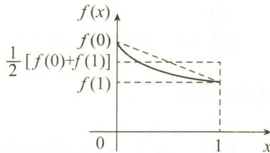

$$
P = \frac {1}{2} (1 - 0) [ f (0) + f (1) ] > \int_ {0} ^ {1} f (x) \mathrm{d} x = M.
$$

选项 B 正确.

图3-1

(9)D.

解 令 $F(x) = \int_{0}^{x} f(t) \, \mathrm{d}t$ ，由 $f(x)$ 连续，知 $F(x)$ 可导，且

$$
F ^ {\prime} (x) = f (x), F (0) = 0.
$$

由 $f(x) > \int_{0}^{x} f(t) \mathrm{d}t$ ，即 $F'(x) - F(x) > 0$ ，有

$$
\mathrm{e} ^ {- x} \left[ F ^ {\prime} (x) - F (x) \right] > 0, \text {即} \left[ \mathrm{e} ^ {- x} F (x) \right] ^ {\prime} > 0,
$$

故 $\mathrm{e}^{-x}F(x)$ 单调递增，从而有

$$
\mathrm{e} ^ {- x} F (x) > \mathrm{e} ^ {- x} F (x) \mid_ {x = 0} = F (0) = 0.
$$

故 $F(x)>0$ ，于是 $F'(x)>F(x)>0$ ，知 $F(x)$ 单调递增.

故当 0 < a < b 时, 有

$$
\int_ {0} ^ {b} f (x) \mathrm{d} x > \int_ {0} ^ {\frac {a + b}{2}} f (x) \mathrm{d} x > \int_ {0} ^ {a} f (x) \mathrm{d} x.
$$

选项 D 正确.

(10) A.

解

$$
\begin{array}{r l} I _ {1} & = \int_ {0} ^ {\pi} \frac {x \sin^ {2} x}{1 + \mathrm{e} ^ {\cos^ {2} x}} \mathrm{d} x \xlongequal {x = \frac {\pi}{2} - t} \int_ {- \frac {\pi}{2}} ^ {\frac {\pi}{2}} \frac {\left(\frac {\pi}{2} - t\right) \cos^ {2} t}{1 + \mathrm{e} ^ {\sin^ {2} t}} \mathrm{d} t \\ & = - \frac {\pi}{2} \int_ {\frac {\pi}{2}} ^ {- \frac {\pi}{2}} \frac {\cos^ {2} t}{1 + \mathrm{e} ^ {\sin^ {2} t}} \mathrm{d} t + \int_ {\frac {\pi}{2}} ^ {- \frac {\pi}{2}} \frac {t \cos^ {2} t}{1 + \mathrm{e} ^ {\sin^ {2} t}} \mathrm{d} t \\ & = \pi \int_ {0} ^ {\frac {\pi}{2}} \frac {\cos^ {2} t}{1 + \mathrm{e} ^ {\sin^ {2} t}} \mathrm{d} t (\text {利用被积函数的奇偶性}), \end{array}
$$

$$
I _ {2} = \int_ {0} ^ {\pi} \frac {\sin^ {2} x}{1 + \mathrm{e} ^ {\cos^ {2} x}} \mathrm{d} x \xlongequal {x = \frac {\pi}{2} - t} \int_ {\frac {\pi}{2}} ^ {- \frac {\pi}{2}} \frac {\cos^ {2} t}{1 + \mathrm{e} ^ {\sin^ {2} t}} \mathrm{d} t = 2 \int_ {0} ^ {\frac {\pi}{2}} \frac {\cos^ {2} t}{1 + \mathrm{e} ^ {\sin^ {2} t}} \mathrm{d} t,
$$

即 $I_{1}=\pi I_{3},I_{2}=2I_{3},I_{3}>0$ ，故 $I_{1}>I_{2}>I_{3}$ .选项A正确.

(11) A.

解 由 $f(x)$ 在 $[0,1]$ 上是凹函数，知对任意 $x_{1}, x_{2} \in [0,1]$ ，有

$$
f \left(\frac {x _ {1} + x _ {2}}{2}\right) \leqslant \frac {1}{2} \left[ f (x _ {1}) + f (x _ {2}) \right],
$$

于是

$$
\begin{array}{r l} \int_ {0} ^ {\frac {1}{2}} f (x) \mathrm{d} x & = \frac {x = \frac {u}{2}}{2} \int_ {0} ^ {1} f \left(\frac {u}{2}\right) \mathrm{d} u \\ & = \frac {1}{2} \int_ {0} ^ {1} f \left(\frac {u + 0}{2}\right) \mathrm{d} u \\ & \leqslant \frac {1}{2} \int_ {0} ^ {1} \frac {1}{2} [ f (u) + f (0) ] \mathrm{d} u \\ & = \frac {1}{4} \int_ {0} ^ {1} f (u) \mathrm{d} u = \frac {1}{4} \int_ {0} ^ {1} f (x) \mathrm{d} x. \end{array}
$$

选项 A 正确.

(12)C.

$$
\begin{array}{r l} \text {解} F (x) & = \int_ {0} ^ {1} | f (x) - f (t) |   \mathrm{d} t = \int_ {0} ^ {x} [ f (x) - f (t) ] \mathrm{d} t + \int_ {x} ^ {1} [ f (t) - f (x) ] \mathrm{d} t \\ & = x f (x) - \int_ {0} ^ {x} f (t) \mathrm{d} t + \int_ {x} ^ {1} f (t) \mathrm{d} t - f (x) (1 - x), \\ F ^ {\prime} (x) & = f (x) + x f ^ {\prime} (x) - f (x) - f (x) + f (x) - (1 - x) f ^ {\prime} (x) = (2 x - 1) f ^ {\prime} (x). \end{array}
$$

令 $F^{\prime}(x) = 0$ ，因为 $f^{\prime}(x) > 0$ ，所以 $x = \frac{1}{2}$ 为唯一驻点，

当 $0 < x < \frac{1}{2}$ 时， $F'(x) < 0$ ；当 $\frac{1}{2} < x < 1$ 时， $F'(x) > 0$ ，故 $x = \frac{1}{2}$ 是 $F(x)$ 的极小值点，也是 $F(x)$ 的最小值点。故 $F(x) \geqslant F\left(\frac{1}{2}\right)$ 。选项C正确。

(13)A.

解 当 $x \to 0$ 时, $\sin x - ax \to 0$ , 故 $\int_{b}^{x} \frac{t^2}{\sqrt{1 + t^2}} \mathrm{d}t \to 0$ , 于是必有 $b = 0$ .

若 $a \neq 1$ ，则当 $x \to 0$ 时， $\sin x - ax$ 与 $x$ 是同阶无穷小， $\int_{b}^{x} \frac{t^2}{\sqrt{1 + t^2}} \mathrm{d}t$ 是关于 $x$ 的高阶无穷小，故必有 $c = 0$ ，与题设矛盾，所以 $a = 1$ 。由洛必达法则，有

$$
\lim _ {x \to 0} {\frac {\int_ {0} ^ {x} {\frac {t ^ {2}}{\sqrt {1 + t ^ {2}}}} \mathrm{d} t}{\sin x - x}} = \lim _ {x \to 0} {\frac {{\frac {x ^ {2}}{\sqrt {1 + x ^ {2}}}}}{{\cos x - 1}}} = \lim _ {x \to 0} {\frac {{\frac {x ^ {2}}{\sqrt {1 + x ^ {2}}}}}{{- {\frac {1}{2}} x ^ {2}}}} = - 2,   \text {即}   c = - 2.
$$

选项 A 正确.

(14)C.

解

$$
y = \int_ {0} ^ {t} \sin (t - u) \mathrm{d} u \xlongequal {t - u = s} \int_ {0} ^ {t} \sin s \mathrm{d} s,
$$

$$
\frac {\mathrm{d} y}{\mathrm{d} x} = \frac {y _ {t} ^ {\prime}}{x _ {t} ^ {\prime}} = \frac {\sin t}{2 \mathrm{e} ^ {- t ^ {2}}} = \frac {1}{2} \mathrm{e} ^ {t ^ {2}} \sin t,
$$

$$
\frac {\mathrm{d} ^ {2} y}{\mathrm{d} x ^ {2}} = \frac {\left(\frac {1}{2} \mathrm{e} ^ {t ^ {2}} \sin t\right) _ {t} ^ {\prime}}{x _ {t} ^ {\prime}} = \frac {1}{4} \mathrm{e} ^ {2 t ^ {2}} (2 t \sin t + \cos t).
$$

由 $x = \int_0^t 2\mathrm{e}^{-u^2}\mathrm{d}u = 0$ 及 $2\mathrm{e}^{-u^2} > 0$ ，知 $t = 0,y = 0$ ，即 $f(0) = 0$ ，故

$$
\frac {\mathrm{d} y}{\mathrm{d} x} \Big | _ {x = 0} = \frac {\mathrm{d} y}{\mathrm{d} x} \Big | _ {t = 0} = 0, \quad \frac {\mathrm{d} ^ {2} y}{\mathrm{d} x ^ {2}} \Big | _ {x = 0} = \frac {\mathrm{d} ^ {2} y}{\mathrm{d} x ^ {2}} \Big | _ {t = 0} = \frac {1}{4}.
$$

则由泰勒公式,有

$$
\begin{array}{r l} f (x) & = f (0) + f ^ {\prime} (0) x + \frac {f ^ {\prime \prime} (0)}{2 !} x ^ {2} + o (x ^ {2}) \\ & = 0 + 0 + \frac {\frac {1}{4}}{2} x ^ {2} + o (x ^ {2}). \end{array}
$$

故当 $x \to 0$ 时， $f(x)$ 与 $x^2$ 是同阶但不等价的无穷小。选项C正确。

(15)C.

解 当 t = 0 时, 有

$$
\begin{array}{r l} f (0) & = \int_ {0} ^ {1} \ln x \mathrm{d} x = \lim _ {\xi \to 0 ^ {+}} \int_ {\xi} ^ {1} \ln x \mathrm{d} x = \lim _ {\xi \to 0 ^ {+}} (x \ln x - x) \Big | _ {\xi} ^ {1} \\ & = - 1 - \lim _ {\xi \to 0 ^ {+}} (\xi \ln \xi - \xi) = - 1 - \lim _ {\xi \to 0 ^ {+}} \frac {\ln \xi}{\frac {1}{\xi}} = - 1; \end{array}
$$

当 $t \neq 0$ 时，有

$$
\begin{array}{r l} f (t) & = \int_ {0} ^ {1} \ln \sqrt {x ^ {2} + t ^ {2}} \mathrm{d} x = x \ln \sqrt {x ^ {2} + t ^ {2}} \Big | _ {0} ^ {1} - \int_ {0} ^ {1} \frac {x ^ {2}}{x ^ {2} + t ^ {2}} \mathrm{d} x \\ & = \ln \sqrt {1 + t ^ {2}} - \int_ {0} ^ {1} \frac {x ^ {2} + t ^ {2} - t ^ {2}}{x ^ {2} + t ^ {2}} \mathrm{d} x \\ & = \ln \sqrt {1 + t ^ {2}} - 1 + \int_ {0} ^ {1} \frac {t ^ {2}}{x ^ {2} + t ^ {2}} \mathrm{d} x \\ & = \ln \sqrt {1 + t ^ {2}} - 1 + t \arctan \frac {1}{t}. \end{array}
$$

由 $\lim_{t\to0}f(t)=-1=f(0)$ ，知 $f(t)$ 在t=0处连续.

又 $f_{-}^{\prime}(0) = \lim_{t\to 0^{-}}\frac{f(t) - f(0)}{t} = -\frac{\pi}{2},f_{+}^{\prime}(0) = \lim_{t\to 0^{+}}\frac{f(t) - f(0)}{t} = \frac{\pi}{2},$

故 $f(t)$ 在 t = 0 处不可导. 选项 C 正确.

(16) A.

解 对于选项 A: 利用极限审敛法. 由于

$$
\lim _ {x \rightarrow + \infty} x ^ {\frac {5}{2}} \frac {1}{x ^ {2} \sqrt {1 + x}} = \lim _ {x \rightarrow + \infty} \frac {1}{\sqrt {1 + \frac {1}{x}}} = 1 (\lambda = \frac {5}{2} > 1, 0 <   l = 1 <   + \infty),
$$

故积分收敛.

对于选项 B: x = 0 是 $\frac{1}{\ln(1 + x)}$ 的瑕点. 由

$$
\lim _ {x \to 0 ^ {+}} (x - 0) \frac {1}{\ln (1 + x)} = 1 (\lambda = 1, 0 <   l <   1 <   + \infty),
$$

知积分发散.

对于选项 C: x = 0 是 $\frac{1}{\sin x}$ 的瑕点. 由

$$
\lim _ {x \to 0 ^ {+}} (x - 0)   {\frac {1}{\sin x}} = 1   (\lambda = 1, 0 <   l = 1 <   + \infty),
$$

知积分发散.

对于选项D:

$$
\int_ {- \infty} ^ {+ \infty} \frac {x}{\sqrt {1 + x ^ {2}}} \mathrm{d} x = \int_ {- \infty} ^ {1} \frac {x}{\sqrt {1 + x ^ {2}}} \mathrm{d} x + \int_ {1} ^ {+ \infty} \frac {x}{\sqrt {1 + x ^ {2}}} \mathrm{d} x,
$$

用定义法，

$$
\lim _ {a \rightarrow - \infty} \int_ {a} ^ {1} \frac {x \mathrm{d} x}{\sqrt {1 + x ^ {2}}} = \frac {1}{2} \lim _ {a \rightarrow - \infty} \int_ {a} ^ {1} \frac {\mathrm{d} (1 + x ^ {2})}{\sqrt {1 + x ^ {2}}} = \frac {1}{2} \cdot 2 \lim _ {a \rightarrow - \infty} \sqrt {1 + x ^ {2}} \Big | _ {a} ^ {1} = - \infty ,
$$

故积分发散. 综上可知, 选项 A 正确.

【注】① 判别反常积分敛散性有两种方法：

(i) 定义法, 当积分计算较容易时, 选择定义法判别.

（ii）反常积分的审敛法：

(a) 设 $I = \int_{a}^{+\infty} f(x) \, \mathrm{d}x, f(x)$ 非负连续，则

$\lim_{x\to+\infty}x^{\lambda}f(x)=l,\left\{\begin{aligned}&0\leqslant l<+\infty 且 \lambda>1,\\ &0<l\leqslant+\infty 且 \lambda\leqslant1,\\ \end{aligned}\right.$ 则收敛；

(b) 设 $I = \int_{a}^{b} f(x) \, \mathrm{d}x, x = a$ 是 $f(x)$ 的瑕点， $f(x)$ 非负连续，则

$\lim_{x\to a^{+}}(x-a)^{\lambda}f(x)=l,\left\{\begin{aligned}&0\leqslant l<+\infty 且 0<\lambda<1,\\ &0<l\leqslant+\infty 且 \lambda\geqslant1,\\ \end{aligned}\right.$ 则收敛；

② 两个常用结果：

(i) $\int_{1}^{+\infty} \frac{\mathrm{d}x}{x^p}, \left\{ \begin{array}{l} p > 1, \text{收敛;} \\ p \leqslant 1, \text{发散.} \end{array} \right.$ (ii) $\int_{a}^{b} \frac{\mathrm{d}x}{(x - a)^p}, \left\{ \begin{array}{l} p < 1, \text{收敛;} \\ p \geqslant 1, \text{发散.} \end{array} \right.$

(17)B.

解 依题设,有

$$
\int_ {1} ^ {+ \infty} \left(\frac {2 x ^ {2} + a x + b}{2 x ^ {2} + b x} - 1\right) \mathrm{d} x = \int_ {1} ^ {+ \infty} \frac {(a - b) x + b}{2 x ^ {2} + b x} \mathrm{d} x.
$$

当 $a - b \neq 0$ 时，

$$
\lim _ {x \to + \infty} x \cdot \frac {(a - b) x + b}{2 x ^ {2} + b x} = \frac {a - b}{2} \neq 0.
$$

由比较判别法,知原反常积分发散,而已知积分收敛,故 a-b=0,于是有

$$
1 = \int_ {1} ^ {+ \infty} \frac {b}{2 x ^ {2} + b x} \mathrm{d} x = \int_ {1} ^ {+ \infty} \left(\frac {1}{x} - \frac {2}{2 x + b}\right) \mathrm{d} x = \ln \frac {x}{2 x + b} \Big | _ {1} ^ {+ \infty} = \ln \frac {2 + b}{2}.
$$

故 $a = b = 2(\mathrm{e} - 1)$ . 选项 B 正确.

(18)C.

解 当 $a \leqslant 0$ 时, $\lim_{x \to +\infty} \left( e^{\frac{\ln x}{x^a}} - 1 \right) = +\infty$ , 积分 $I$ 发散.

当 $a > 0$ 时， $\mathrm{e}^{\frac{\ln x}{x^a}} - 1\sim \frac{\ln x}{x^a} (x\to +\infty).$

当 $0 < a \leqslant 1$ 时， $\frac{\ln x}{x^a} > \frac{1}{x^a} (x \geqslant 3)$ .

而 $\int_{3}^{+\infty}\frac{1}{x^a}\mathrm{d}x(a\leqslant 1)$ 发散，由反常积分的比较审敛法知，积分 $I$ 发散.

当 $a > 1$ 时，取 $\xi > 0$ ，使得 $a - \xi > 1$ ，则 $\lim_{x\to +\infty}x^{a - \xi}\cdot \frac{\ln x}{x^a} = \lim_{x\to +\infty}\frac{\ln x}{x^\xi} = 0.$

而 $\int_{2}^{+\infty}\frac{1}{x^{a - \xi}}\mathrm{d}x(a - \xi >1)$ 收敛，故积分 $I$ 收敛.

综上所述，a 的取值范围为 $(1, +\infty)$ . 选项 C 正确.

## 二、填空题

(1) $\frac{1}{\sin x \cos x}$ .

解 由已知, $F'(x)=f(x)$ ,故 $2F(x)F'(x)=\frac{2\ln(\tan x)}{\sin x\cos x}$ ,两边同时积分,得

$$
\int 2 F (x) F ^ {\prime} (x) \mathrm{d} x = \int \frac {2 \ln (\tan x)}{\sin x \cos x} \mathrm{d} x,
$$

故

$$
F ^ {2} (x) = \int \frac {2 \ln (\tan x)}{\sin x \cos x} \mathrm{d} x = [ \ln (\tan x) ] ^ {2} + C.
$$

将 $F\left(\frac{\pi}{4}\right) = 0$ 代入上式，得 $C = 0$ ，故 $F(x) = \sqrt{[\ln(\tan x)]^2} = \ln (\tan x)$ ，所以

$$
f (x) = F ^ {\prime} (x) = \left[ \ln (\tan x) \right] ^ {\prime} = \frac {1}{\sin x \cos x}.
$$

(2) $\frac{5}{2}.$

解由 $f(x + 4) = f(x)$ ，知 $f(9) = f(1)$ ，而

$$
f ^ {\prime} (x) = 1 + | x | = \left\{ \begin{array}{l l} 1 - x, & - 2 <   x <   0, \\ 1 + x, & 0 \leqslant x \leqslant 2, \end{array} \right.
$$

积分得

$$
f (x) = \left\{ \begin{array}{l l} - \frac {x ^ {2}}{2} + x + C _ {1}, & - 2 <   x <   0, \\ 1, & x = 0, \\ \frac {x ^ {2}}{2} + x + C _ {2}, & 0 <   x <   2. \end{array} \right.
$$

因 $f(x)$ 可导，所以 $f(x)$ 在 $x = 0$ 处连续，可得 $C_1 = C_2 = 1$ ，故 $f(9) = f(1) = \frac{5}{2}$

(3) $\sin x^{2}$ .

解 因为

$$
\int_ {0} ^ {x} \sin (x - t) ^ {2} \mathrm{d} t \stackrel {x - t = u} {=} - \int_ {x} ^ {0} \sin u ^ {2} \mathrm{d} u = \int_ {0} ^ {x} \sin u ^ {2} \mathrm{d} u,
$$

故

$$
f ^ {\prime} (x) = \frac {\mathrm{d}}{\mathrm{d} x} \int_ {0} ^ {x} \sin u ^ {2} \mathrm{d} u = \sin x ^ {2}.
$$

(4) $xf(x^{2})$ .

解 依题设,有

$$
\int_ {0} ^ {x} t f (x ^ {2} - t ^ {2}) \mathrm{d} t = - \frac {1}{2} \int_ {0} ^ {x} f (x ^ {2} - t ^ {2}) \mathrm{d} (x ^ {2} - t ^ {2})
$$

$$
\frac {x ^ {2} - t ^ {2} = u}{- \frac {1}{2} \int_ {x ^ {2}} ^ {0} f (u) \mathrm{d} u} = \frac {1}{2} \int_ {0} ^ {x ^ {2}} f (u) \mathrm{d} u,
$$

故

$$
F ^ {\prime} (x) = \frac {\mathrm{d}}{\mathrm{d} x} \left[ \frac {1}{2} \int_ {0} ^ {x ^ {2}} f (u) \mathrm{d} u \right] = x f (x ^ {2}).
$$

(5) $\frac{1}{4}.$

解 利用第(4)题解,有

$$
\begin{array}{r l} \lim _ {x \to 0} \frac {F (x)}{x ^ {4}} & = \lim _ {x \to 0} \frac {x f (x ^ {2})}{4 x ^ {3}} = \lim _ {x \to 0} \frac {f (x ^ {2})}{4 x ^ {2}} \\ & = \frac {1}{4} \lim _ {x \to 0} \frac {f (x ^ {2}) - f (0)}{x ^ {2} - 0} = \frac {1}{4} f ^ {\prime} (0) = \frac {1}{4}. \end{array}
$$

【注】 错误做法：

$$
\lim _ {x \to 0} \frac {f (x ^ {2})}{4 x ^ {2}} \xlongequal [ \text {法则} ] {\text {洛必达}} \lim _ {x \to 0} \frac {2 x f ^ {\prime} (x ^ {2})}{8 x} = \frac {1}{4}.
$$

由于没有 $f'(x)$ 连续的条件, 故 $\lim_{x\to0}f'(x)$ 未必存在.

(6) $\frac{\sqrt{2}}{2}(x^{2}+1).$

解 已知等式 $f(x + y) = \int_{x}^{x + y} \frac{t(t^2 + 1)}{f(t)} \, \mathrm{d}t + f(x)$ .

令 $x = 0$ ，得 $f(y) = \int_0^y\frac{t(t^2 + 1)}{f(t)}\mathrm{d}t + f(0)$ ，则

即

$$
\begin{array}{c} {f ^ {\prime} (y) = \frac {y (y ^ {2} + 1)}{f (y)},} \\ {f ^ {\prime} (y) f (y) = y (y ^ {2} + 1).} \end{array}
$$

上式两边积分,有

$$
\frac {1}{2} \int_ {1} ^ {x} \mathrm{d} [ f ^ {2} (y) ] = \frac {1}{2} \int_ {1} ^ {x} (y ^ {2} + 1) \mathrm{d} (y ^ {2} + 1),
$$

解得

$$
\frac {1}{2} f ^ {2} (x) - \frac {1}{2} (\sqrt {2}) ^ {2} = \frac {1}{4} (x ^ {2} + 1) ^ {2} - 1,
$$

即

$$
f (x) = \pm \frac {\sqrt {2}}{2} (x ^ {2} + 1).
$$

由 $f(1) = \sqrt{2}$ , 知 $f(x) = \frac{\sqrt{2}}{2} (x^2 + 1)$ .

(7) $3\ln2-1.$

解 由 $\int_{x}^{x + f(x)} g(t - x) \, \mathrm{d}t \stackrel{t - x = u}{=} \int_{0}^{f(x)} g(u) \, \mathrm{d}u$ ，得

$$
\int_ {0} ^ {f (x)} g (u) \mathrm{d} u = x ^ {2} \ln (1 + x).
$$

上式两边同时对 x 求导, 得

$g[f(x)]f'(x) = 2x\ln (1 + x) + \frac{x^2}{1 + x}$ , 即 $xf'(x) = 2x\ln (1 + x) + \frac{x^2}{1 + x}$ .

当 $x \neq 0$ 时， $f'(x) = 2\ln (1 + x) + \frac{x}{1 + x}$ ，故

$$
\begin{array}{r l} f (x) & = \int 2 \ln (1 + x) \mathrm{d} x + \int \frac {x}{1 + x} \mathrm{d} x \\ & = 2 x \ln (1 + x) - x + \ln (1 + x) + C. \end{array}
$$

由 $\lim_{x\to 0^{+}}f(x) = f(0)$ ，知 $C = 0$ .故 $f(1) = 3\ln 2 - 1$

(8) $\frac{5}{e}.$

解

$$
\lim _ {x \to 0} \frac {\alpha (x)}{\beta (x)} = \lim _ {x \to 0} \frac {\int_ {0} ^ {5 x} \frac {\sin t}{t} \mathrm{d} t}{\int_ {0} ^ {\sin x} (1 + t) ^ {\frac {1}{t}} \mathrm{d} t} = \lim _ {x \to 0} \frac {5 \cdot \frac {\sin 5 x}{5 x}}{\cos x \cdot (1 + \sin x) ^ {\frac {1}{\sin x}}} = \frac {5}{\mathrm{e}}.
$$

(9) $-\frac{1}{8}.$

解

$$
\begin{array}{r l} \lim _ {x \to 0} \frac {\int_ {\cos x} ^ {1} t \ln t \mathrm{d} t}{x ^ {4}} & = \lim _ {x \to 0} \frac {- \int_ {1} ^ {\cos x} t \ln t \mathrm{d} t}{x ^ {4}} = \lim _ {x \to 0} \frac {- \cos x \cdot \ln (\cos x) \cdot (- \sin x)}{4 x ^ {3}} \\ & = \frac {1}{4} \lim _ {x \to 0} \cos x \cdot \lim _ {x \to 0} \frac {\sin x}{x} \cdot \lim _ {x \to 0} \frac {\ln (\cos x)}{x ^ {2}} \\ & = \frac {1}{4} \lim _ {x \to 0} \frac {- \sin x}{2 x \cdot \cos x} = - \frac {1}{8}. \end{array}
$$

(10) $\frac{\pi}{6}.$

解 依题设,有

$$
\begin{array}{r l} \lim _ {x \to 0} \frac {\int_ {0} ^ {x} \left[ \int_ {0} ^ {u ^ {2}} \arctan (1 + t) \mathrm{d} t \right] \mathrm{d} u}{x (1 - \cos x)} & = \lim _ {x \to 0} \frac {\int_ {0} ^ {x ^ {2}} \arctan (1 + t) \mathrm{d} t}{\frac {3}{2} x ^ {2}} \\ & = \lim _ {x \to 0} \frac {2 x \cdot \arctan (1 + x ^ {2})}{3 x} = \frac {\pi}{6}. \end{array}
$$

(11) $\frac{2}{\pi}.$

解 $|\sin t|$ 以 $\pi$ 为周期，它在每个周期上的积分相等，且 $\int_0^\pi |\sin t| \, \mathrm{d}t = 2.$

故当 $n\pi \leqslant x \leqslant (n + 1)\pi$ 时，有

$$
2 n = \int_ {0} ^ {n \pi} | \sin t | \mathrm{d} t \leqslant \int_ {0} ^ {x} | \sin t | \mathrm{d} t \leqslant \int_ {0} ^ {(n + 1) \pi} | \sin t | \mathrm{d} t \leqslant 2 (n + 1),
$$

从而

$$
\frac {2 n}{(n + 1) \pi} \leqslant \frac {\int_ {0} ^ {x} | \sin t | \mathrm{d} t}{x} \leqslant \frac {2 (n + 1)}{n \pi}.
$$

令上式 $n\to \infty$ ，有

$$
\lim _ {x \rightarrow + \infty} \frac {\int_ {0} ^ {x} | \sin t | \mathrm{d} t}{x} = \frac {2}{\pi}.
$$

(12)1.

解

$$
\begin{array}{r l}\int_ {1} ^ {+ \infty} \frac {\mathrm{d} x}{x (a + x ^ {3})}&= \frac {1}{a} \int_ {1} ^ {+ \infty} \left(\frac {1}{x} - \frac {x ^ {2}}{a + x ^ {3}}\right) \mathrm{d} x\\&= \frac {1}{a} \left[ \int_ {1} ^ {+ \infty} \frac {1}{x} \mathrm{d} x - \frac {1}{3} \int_ {1} ^ {+ \infty} \frac {\mathrm{d} (a + x ^ {3})}{a + x ^ {3}} \right]\\&= \frac {1}{a} \left[ \ln x - \frac {1}{3} \ln (a + x ^ {3}) \right] \Bigg | _ {1} ^ {+ \infty}\\&= \frac {1}{a} \ln \frac {x}{(a + x ^ {3}) ^ {\frac {1}{3}}} \Bigg | _ {1} ^ {+ \infty} = \frac {1}{3 a} \ln \frac {x ^ {3}}{a + x ^ {3}} \Bigg | _ {1} ^ {+ \infty}\\&= \frac {1}{3 a} \left(\lim _ {x \rightarrow + \infty} \ln \frac {x ^ {3}}{a + x ^ {3}} - \ln \frac {1}{a + 1}\right)\\&= \frac {1}{3 a} \ln (a + 1) = \frac {1}{3} \ln 2,\end{array}
$$

故 $a = 1$

(13) $\frac{(\sqrt{3}+1)\pi}{12}.$

解 依题设,有

$$
\int_ {\frac {1}{2}} ^ {\frac {\sqrt {3}}{2}} \frac {x ^ {2}}{\sqrt {1 - x ^ {2}}} \mathrm{d} x \stackrel {x = \sin t} {=} \int_ {\frac {\pi}{6}} ^ {\frac {\pi}{3}} \sin^ {2} t \mathrm{d} t = \frac {1}{2} \int_ {\frac {\pi}{6}} ^ {\frac {\pi}{3}} (1 - \cos 2 t) \mathrm{d} t = \frac {\pi}{1 2},
$$

故平均值为

$$
\frac {\frac {\pi}{1 2}}{\frac {\sqrt {3}}{2} - \frac {1}{2}} = \frac {(\sqrt {3} + 1) \pi}{1 2}.
$$

(14) $\frac{1}{2}(e^{a^{2}}-1).$

解 由 $f(x) = \int_{0}^{a - x}\mathrm{e}^{t(2a - t)}\mathrm{d}t (a > 0)$ ，知当 $x \in [0, a]$ 时，

$$
f (x) \geqslant 0, f (a) = 0, f (0) > 0.
$$

故所求面积为

$$
\begin{array}{r l} S & = \int_ {0} ^ {a} f (x) \mathrm{d} x = \int_ {0} ^ {a} \left[ \int_ {0} ^ {a - x} \mathrm{e} ^ {t (2 a - t)} \mathrm{d} t \right] \mathrm{d} x \\ & = x \int_ {0} ^ {a - x} \mathrm{e} ^ {t (2 a - t)} \mathrm{d} t \Big | _ {0} ^ {a} - \int_ {0} ^ {a} x \left[ \int_ {0} ^ {a - x} \mathrm{e} ^ {t (2 a - t)} \mathrm{d} t \right] ^ {\prime} \mathrm{d} x \\ & = \int_ {0} ^ {a} x \mathrm{e} ^ {a ^ {2} - x ^ {2}} \mathrm{d} x = - \frac {1}{2} \int_ {0} ^ {a} \mathrm{e} ^ {a ^ {2} - x ^ {2}} \mathrm{d} (a ^ {2} - x ^ {2}) = - \frac {1}{2} \mathrm{e} ^ {a ^ {2} - x ^ {2}} \Big | _ {0} ^ {a} = \frac {1}{2} (\mathrm{e} ^ {a ^ {2}} - 1). \end{array}
$$

(15)1.

解 依题设,有

又

$$
\begin{array}{r l}&V (\xi) = \pi \int_ {0} ^ {\xi} y ^ {2} \mathrm{d} x = \pi \int_ {0} ^ {\xi} \frac {x}{(1 + x ^ {2}) ^ {2}} \mathrm{d} x = \frac {\pi}{2} \left(- \frac {1}{1 + x ^ {2}}\right) \Big | _ {0} ^ {\xi} = \frac {\pi}{2} \left(1 - \frac {1}{1 + \xi^ {2}}\right).\\&\quad \lim _ {\xi \rightarrow + \infty} V (\xi) = \frac {\pi}{2}, V (a) = \frac {\pi}{2} \left(1 - \frac {1}{1 + a ^ {2}}\right),\end{array}
$$

由 $V(a) = \frac{1}{2}\lim_{\xi \to +\infty}V(\xi)$ ，得

$\frac{\pi}{2}\left(1-\frac{1}{1+a^{2}}\right)=\frac{\pi}{4}$ ，解得 $a=\pm1$ .

又 a > 0, 故 a = 1.

(16) $\frac{3\pi a}{2}.$

解

$$
\begin{array}{r l} s & = \int_ {0} ^ {3 \pi} \sqrt {r ^ {2} + r ^ {\prime 2}}   \mathrm{d} \theta = \int_ {0} ^ {3 \pi} \sqrt {a ^ {2} \sin^ {6} \frac {\theta}{3} + a ^ {2} \sin^ {4} \frac {\theta}{3} \cos^ {2} \frac {\theta}{3}}   \mathrm{d} \theta \\ & = a \int_ {0} ^ {3 \pi} \sin^ {2} \frac {\theta}{3}   \mathrm{d} \theta \stackrel {t = \frac {\theta}{3}} {=} 3 a \int_ {0} ^ {\pi} \sin^ {2} t   \mathrm{d} t = \frac {3 \pi a}{2}. \end{array}
$$

(17)4.

解 函数 $y = \int_{-\frac{\pi}{2}}^{x} \sqrt{\cos t} \, \mathrm{d}t$ 的定义域为 $\left[-\frac{\pi}{2}, \frac{\pi}{2}\right]$ ，全长

$$
s = \int_ {- \frac {\pi}{2}} ^ {\frac {\pi}{2}} \sqrt {1 + y ^ {\prime 2}} \mathrm{d} x = \int_ {- \frac {\pi}{2}} ^ {\frac {\pi}{2}} \sqrt {1 + \cos x} \mathrm{d} x = \int_ {- \frac {\pi}{2}} ^ {\frac {\pi}{2}} \sqrt {2} \cos \frac {x}{2} \mathrm{d} x = 4.
$$

(18) $\frac{3}{2}.$

解 如图 3-2 所示, 所围平面图形的面积为

$$
S = \int_ {0} ^ {1} [ (e + 1) - y - e ^ {y} ] d y = \frac {3}{2},
$$

或

$$
S = \int_ {1} ^ {\mathrm{e}} \ln x \mathrm{d} x + \int_ {\mathrm{e}} ^ {\mathrm{e} + 1} (\mathrm{e} + 1 - x) \mathrm{d} x = \frac {3}{2}.
$$

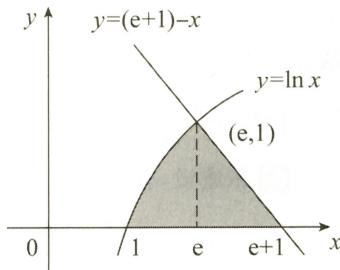

(19) $\frac{3}{2}\pi^{2}+4\pi.$

图3-2

解 如图 3-3 所示,所得旋转体的体积为

$$
\begin{array}{r l} V & = \int_ {0} ^ {\pi} \pi (\sin x + 1) ^ {2} \mathrm{d} x \\ & = \pi \int_ {0} ^ {\pi} \left(1 + 2 \sin x + \frac {1 - \cos 2 x}{2}\right) \mathrm{d} x \\ & = \pi \left(\frac {3}{2} x - 2 \cos x - \frac {1}{4} \sin 2 x\right) \Big | _ {0} ^ {\pi} \\ & = \frac {3}{2} \pi^ {2} + 4 \pi . \end{array}
$$

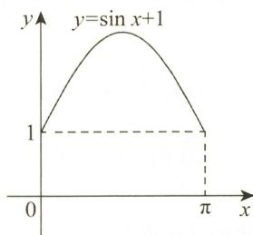  
图3-3

(20) $\frac{4}{15}.$

解 依题设,有

$$
\lim _ {x \to 0} \left(\frac {n - x}{n + x}\right) ^ {\frac {2}{x}} = \lim _ {x \to 0} \left[ \left(1 - \frac {2 x}{n + x}\right) ^ {\frac {- (n + x)}{2 x}} \right] ^ {\frac {- 4}{n + x}} = \mathrm{e} ^ {- \frac {4}{n}},
$$

$$
\begin{array}{r l} \int_ {\frac {1}{n}} ^ {+ \infty} x \mathrm{e} ^ {- 4 x} \mathrm{d} x & = - \frac {1}{4} x \mathrm{e} ^ {- 4 x} \Big | _ {\frac {1}{n}} ^ {+ \infty} + \frac {1}{4} \int_ {\frac {1}{n}} ^ {+ \infty} \mathrm{e} ^ {- 4 x} \mathrm{d} x \\ & = \frac {1}{4 n} \mathrm{e} ^ {- \frac {4}{n}} - \frac {1}{1 6} \mathrm{e} ^ {- 4 x} \Big | _ {\frac {1}{n}} ^ {+ \infty} = \frac {1}{4 n} \mathrm{e} ^ {- \frac {4}{n}} + \frac {1}{1 6} \mathrm{e} ^ {- \frac {4}{n}}, \end{array}
$$

故

$\left(\frac{1}{4n} + \frac{1}{16}\right)\mathrm{e}^{-\frac{4}{n}} = \mathrm{e}^{-\frac{4}{n}}$ ，解得 $n = \frac{4}{15}$

(21) $\frac{7}{12}.$

解 由细棒的质心坐标公式, 得

$$
\overline {{x}} = \frac {\int_ {0} ^ {1} x \rho (x) \mathrm{d} x}{\int_ {0} ^ {1} \rho (x) \mathrm{d} x} = \frac {\int_ {0} ^ {1} x (2 x + 1) \mathrm{d} x}{\int_ {0} ^ {1} (2 x + 1) \mathrm{d} x} = \frac {7}{1 2}.
$$

(22)0.

解

$$
\begin{array}{r l} & {\underset {n \to \infty} {\lim} \sum_ {k = 1} ^ {n} \frac {1}{n} \ln \frac {n + 2 k}{3 n - 2 k} = \underset {n \to \infty} {\lim} \frac {1}{2} \sum_ {k = 1} ^ {n} \frac {2 - 0}{n} \ln \frac {1 + \frac {2 k}{n}}{3 - \frac {2 k}{n}} = \frac {1}{2} \int_ {0} ^ {2} \ln \frac {1 + x}{3 - x} \mathrm{d} x} \\ & \qquad \underline {{{{\underline {{{{x = 1 + t}}}}}}} \frac {1}{2} \int_ {- 1} ^ {1} \ln \frac {2 + t}{2 - t} \mathrm{d} t.} \end{array}
$$

因 $\ln\frac{2+t}{2-t}$ 为奇函数, 故原式 =0.

【注】

$$
\frac {1}{2} \int_ {0} ^ {2} \ln \frac {1 + x}{3 - x} \mathrm{d} x = \frac {1}{2} \left[ \int_ {0} ^ {2} \ln (1 + x) \mathrm{d} x - \int_ {0} ^ {2} \ln (3 - x) \mathrm{d} x \right],
$$

利用分部积分法分别计算两个积分亦可.

(23)4; $1-5e^{-2}$ .

解 依题设,所求路程为

$$
\begin{array}{r l} s & = \int_ {0} ^ {+ \infty} \sqrt {t} \mathrm{e} ^ {- \sqrt {t}} \mathrm{d} t \xlongequal {\sqrt {t} = u} \int_ {0} ^ {+ \infty} u \mathrm{e} ^ {- u} \cdot 2 u \mathrm{d} u = - 2 \int_ {0} ^ {+ \infty} u ^ {2} \mathrm{d} (\mathrm{e} ^ {- u}) \\ & = - 2 \left(u ^ {2} \mathrm{e} ^ {- u} \Big | _ {0} ^ {+ \infty} - \int_ {0} ^ {+ \infty} 2 u \mathrm{e} ^ {- u} \mathrm{d} u\right) = - 4 \int_ {0} ^ {+ \infty} u \mathrm{d} (\mathrm{e} ^ {- u}) \\ & = - 4 \left(u \mathrm{e} ^ {- u} \Big | _ {0} ^ {+ \infty} - \int_ {0} ^ {+ \infty} \mathrm{e} ^ {- u} \mathrm{d} u\right) = - 4 \mathrm{e} ^ {- u} \Big | _ {0} ^ {+ \infty} = 4 (\mathrm{m}), \end{array}
$$

所求平均速度为

$$
\begin{array}{r l} \overline {{v}} & = \frac {1}{4 - 0} \int_ {0} ^ {4} \sqrt {t} \mathrm{e} ^ {- \sqrt {t}} \mathrm{d} t \xlongequal {- \sqrt {t} = u} - \frac {1}{2} \int_ {0} ^ {- 2} u ^ {2} \mathrm{e} ^ {u} \mathrm{d} u = \frac {1}{2} \int_ {- 2} ^ {0} u ^ {2} \mathrm{d} (\mathrm{e} ^ {u}) \\ & = \frac {1}{2} \left(u ^ {2} \mathrm{e} ^ {u} \Big | _ {- 2} ^ {0} - 2 \int_ {- 2} ^ {0} u \mathrm{e} ^ {u} \mathrm{d} u\right) \\ & = \frac {1}{2} \left[ - 4 \mathrm{e} ^ {- 2} - 2 \int_ {- 2} ^ {0} u \mathrm{d} (\mathrm{e} ^ {u}) \right] \\ & = - 2 \mathrm{e} ^ {- 2} - \left(u \mathrm{e} ^ {u} \Big | _ {- 2} ^ {0} - \int_ {- 2} ^ {0} \mathrm{e} ^ {u} \mathrm{d} u\right) \\ & = - 2 \mathrm{e} ^ {- 2} - 2 \mathrm{e} ^ {- 2} + \mathrm{e} ^ {u} \Big | _ {- 2} ^ {0} \\ & = 1 - 5 \mathrm{e} ^ {- 2} (\mathrm{m/s}). \end{array}
$$

## 三、解答题

$$
\begin{array}{r l} \text {(1) 解 (I)} & \int \frac {2 ^ {x} \cdot 3 ^ {x}}{9 ^ {x} - 4 ^ {x}} \mathrm{d} x = \int \frac {6 ^ {x} \mathrm{d} x}{4 ^ {x} \left[ \left(\frac {9}{4}\right) ^ {x} - 1 \right]} = \int \frac {\left(\frac {3}{2}\right) ^ {x} \mathrm{d} x}{\left[ \left(\frac {3}{2}\right) ^ {x} \right] ^ {2} - 1} \\ & = \frac {1}{\ln \frac {3}{2}} \int \frac {\mathrm{d} \left[ \left(\frac {3}{2}\right) ^ {x} \right]}{\left[ \left(\frac {3}{2}\right) ^ {x} \right] ^ {2} - 1} = \frac {1}{2 \ln \frac {3}{2}} \ln \left| \frac {3 ^ {x} - 2 ^ {x}}{3 ^ {x} + 2 ^ {x}} \right| + C. \end{array}
$$

【注】 $\int \frac{\mathrm{d}x}{x^2 - 1} = \frac{1}{2}\ln \left|\frac{x - 1}{x + 1}\right| + C.$

$$
\begin{array}{r l} \text {(II)} & \int \frac {\mathrm{d} x}{x ^ {2} (1 - x ^ {4})} = \int \frac {x ^ {2}}{x ^ {4} (1 - x ^ {4})} \mathrm{d} x = \int x ^ {2} \left(\frac {1}{x ^ {4}} + \frac {1}{1 - x ^ {4}}\right) \mathrm{d} x \\ & = \int \frac {1}{x ^ {2}} \mathrm{d} x + \int \frac {1 + x ^ {2} - 1}{1 - x ^ {4}} \mathrm{d} x = - \frac {1}{x} + \int \frac {\mathrm{d} x}{1 - x ^ {2}} - \int \frac {\mathrm{d} x}{1 - x ^ {4}} \\ & = - \frac {1}{x} + \int \frac {\mathrm{d} x}{1 - x ^ {2}} - \frac {1}{2} \int \left(\frac {1}{1 - x ^ {2}} + \frac {1}{1 + x ^ {2}}\right) \mathrm{d} x \\ & = - \frac {1}{x} + \frac {1}{2} \int \frac {\mathrm{d} x}{1 - x ^ {2}} - \frac {1}{2} \int \frac {\mathrm{d} x}{1 + x ^ {2}} \\ & = - \frac {1}{x} + \frac {1}{4} \ln \left| \frac {1 + x}{1 - x} \right| - \frac {1}{2} \arctan x + C. \end{array}
$$

（Ⅲ）利用倒代换，令 $x = \frac{1}{t}$ ，则

$$
\begin{array}{r l} \int \frac {\mathrm{d} x}{x ^ {4} (1 + x ^ {2})} & = - \int \frac {t ^ {4}}{1 + t ^ {2}} \mathrm{d} t = - \int \frac {t ^ {4} - 1 + 1}{1 + t ^ {2}} \mathrm{d} t = - \int (t ^ {2} - 1) \mathrm{d} t - \int \frac {\mathrm{d} t}{1 + t ^ {2}} \\ & = - \frac {1}{3} t ^ {3} + t - \arctan t + C = - \frac {1}{3 x ^ {3}} + \frac {1}{x} - \arctan \frac {1}{x} + C. \end{array}
$$

(Ⅳ) 考虑到 $\frac{1}{x^2(1 + x^2)} = \frac{1}{x^2} - \frac{1}{1 + x^2}$ , 故

$$
\begin{array}{r l} \int \frac {\arctan x}{x ^ {2} (1 + x ^ {2})} \mathrm{d} x & = \int \frac {\arctan x}{x ^ {2}} \mathrm{d} x - \int \frac {\arctan x}{1 + x ^ {2}} \mathrm{d} x \\ & = - \int \arctan x \mathrm{d} \left(\frac {1}{x}\right) - \int \arctan x \mathrm{d} (\arctan x) \\ & = - \frac {\arctan x}{x} + \int \frac {\mathrm{d} x}{x (1 + x ^ {2})} - \frac {1}{2} (\arctan x) ^ {2} \\ & = - \frac {\arctan x}{x} + \frac {1}{2} \int \left(\frac {1}{x ^ {2}} - \frac {1}{1 + x ^ {2}}\right) \mathrm{d} (x ^ {2}) - \frac {1}{2} (\arctan x) ^ {2} \\ & = - \frac {\arctan x}{x} - \frac {1}{2} (\arctan x) ^ {2} + \frac {1}{2} \ln \frac {x ^ {2}}{1 + x ^ {2}} + C. \end{array}
$$

$$
\begin{array}{r l} \int \frac {x + \ln (1 - x)}{x ^ {2}} \mathrm{d} x & = \int \frac {\mathrm{d} x}{x} + \int \frac {\ln (1 - x)}{x ^ {2}} \mathrm{d} x = \ln | x | - \int \ln (1 - x) \mathrm{d} \left(\frac {1}{x}\right) \\ & = \ln | x | - \frac {\ln (1 - x)}{x} - \int \frac {\mathrm{d} x}{x (1 - x)} \\ & = \ln | x | - \frac {\ln (1 - x)}{x} - \int \left(\frac {1}{x} + \frac {1}{1 - x}\right) \mathrm{d} x \\ & = \left(1 - \frac {1}{x}\right) \ln (1 - x) + C. \end{array} \tag {V}
$$

(2) 解 (Ⅰ) 令 $\sqrt{x} = t$ , 则 $x = t^2$ , 故

$$
\begin{array}{r l} \int \frac {\mathrm{d} x}{x (1 + \sqrt {x})} & = \int \frac {2 t \mathrm{d} t}{t ^ {2} (1 + t)} = 2 \int \frac {\mathrm{d} t}{t (1 + t)} = 2 \int \left(\frac {1}{t} - \frac {1}{1 + t}\right) \mathrm{d} t \\ & = 2 [ \ln t - \ln (1 + t) ] + C \\ & = 2 [ \ln \sqrt {x} - \ln (1 + \sqrt {x}) ] + C = 2 \ln \frac {\sqrt {x}}{1 + \sqrt {x}} + C. \end{array}
$$

$$
\begin{array}{r l} \int \frac {x \mathrm{e} ^ {x}}{\sqrt {\mathrm{e} ^ {x} - 1}} \mathrm{d} x & = 2 \int x \mathrm{d} (\sqrt {\mathrm{e} ^ {x} - 1}) = 2 \left(x \sqrt {\mathrm{e} ^ {x} - 1} - \int \sqrt {\mathrm{e} ^ {x} - 1} \mathrm{d} x\right) \\ & = 2 x \sqrt {\mathrm{e} ^ {x} - 1} - 2 \int \sqrt {\mathrm{e} ^ {x} - 1} \mathrm{d} x. \end{array}
$$

令 $\sqrt{\mathrm{e}^x - 1} = t$ ，则 $x = \ln (1 + t^2),\mathrm{d}x = \frac{2t}{1 + t^2}\mathrm{d}t$ ，故

$$
\begin{array}{r l} \int \sqrt {\mathrm{e} ^ {x} - 1} \mathrm{d} x & = \int \frac {2 t ^ {2}}{1 + t ^ {2}} \mathrm{d} t = 2 \int \frac {t ^ {2} + 1 - 1}{1 + t ^ {2}} \mathrm{d} t \\ & = 2 t - 2 \int \frac {\mathrm{d} t}{1 + t ^ {2}} = 2 t - 2 \arctan t + C. \end{array}
$$

所以

原式 $= 2x\sqrt{\mathrm{e}^x - 1} -4\sqrt{\mathrm{e}^x - 1} +4\arctan \sqrt{\mathrm{e}^x - 1} +C.$

（Ⅲ）令 $x = \tan t, t \in \left(-\frac{\pi}{2}, \frac{\pi}{2}\right)$ ，则 $\mathrm{d}x = \sec^2 t \mathrm{d}t$ ，故

$$
\begin{array}{r l} \int \frac {x ^ {3}}{\sqrt {1 + x ^ {2}}} \mathrm{d} x & = \int \frac {\tan^ {3} t \cdot \sec^ {2} t}{\sec t} \mathrm{d} t = \int \tan^ {2} t \mathrm{d} (\sec t) \\ & = \int (\sec^ {2} t - 1) \mathrm{d} (\sec t) = \frac {1}{3} \sec^ {3} t - \sec t + C. \end{array}
$$

如图3-4所示， $\sec t = \sqrt{1 + x^2}$ ，于是原式

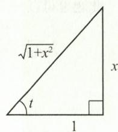

$$
\int \frac {x ^ {3}}{\sqrt {1 + x ^ {2}}} \mathrm{d} x = \frac {1}{3} (1 + x ^ {2}) ^ {\frac {3}{2}} - (1 + x ^ {2}) ^ {\frac {1}{2}} + C.
$$

图3-4

【注】此题也可凑微分.

$$
\begin{array}{r l} \int \frac {x ^ {3}}{\sqrt {1 + x ^ {2}}} \mathrm{d} x & = \int \frac {x ^ {2} \cdot \mathrm{d} (1 + x ^ {2})}{2 \sqrt {1 + x ^ {2}}} = \int (x ^ {2} + 1 - 1) \mathrm{d} (\sqrt {1 + x ^ {2}}) \\ & = \int (\sqrt {x ^ {2} + 1}) ^ {2} \mathrm{d} (\sqrt {1 + x ^ {2}}) - \int \mathrm{d} (\sqrt {1 + x ^ {2}}) \\ & = \frac {1}{3} (1 + x ^ {2}) ^ {\frac {3}{2}} - (1 + x ^ {2}) ^ {\frac {1}{2}} + C. \end{array}
$$

(Ⅳ) 令 $\tan t = x$ ，则 $\mathrm{d}x = \sec^2 t\mathrm{d}t$ ，故

$$
\begin{array}{r l} \int \frac {\mathrm{d} x}{(2 x ^ {2} + 1) \sqrt {1 + x ^ {2}}} & = \int \frac {\mathrm{d} t}{(2 \tan^ {2} t + 1) \cos t} = \int \frac {\cos t \mathrm{d} t}{2 \sin^ {2} t + \cos^ {2} t} \\ & = \int \frac {\mathrm{d} (\sin t)}{1 + \sin^ {2} t} = \arctan (\sin t) + C. \end{array}
$$

又 $\sin t = \frac{x}{\sqrt{1 + x^2}}$ ，故

$$
\text { 原式 } = \arctan {\frac {x}{\sqrt {1 + x ^ {2}}}} + C.
$$

$$
\begin{array}{r l} \int \frac {\arctan \sqrt {x - 1}}{x \sqrt {x - 1}} \mathrm{d} x & = 2 \int \frac {\arctan \sqrt {x - 1}}{x} \mathrm{d} (\sqrt {x - 1}) \\ & = 2 \int \frac {\arctan \sqrt {x - 1}}{1 + (\sqrt {x - 1}) ^ {2}} \mathrm{d} (\sqrt {x - 1}) \\ & = 2 \int \arctan \sqrt {x - 1} \mathrm{d} (\arctan \sqrt {x - 1}) \\ & = (\arctan \sqrt {x - 1}) ^ {2} + C. \end{array} \tag {V}
$$

(VI)

$$
\begin{array}{r l} \int \sqrt {\frac {x}{1 - x \sqrt {x}}} \mathrm{d} x & = \int \frac {\sqrt {x}}{\sqrt {1 - x \sqrt {x}}} \mathrm{d} x = \frac {2}{3} \int \frac {\mathrm{d} \left(x ^ {\frac {3}{2}}\right)}{\sqrt {1 - x ^ {\frac {3}{2}}}} = - \frac {2}{3} \int \frac {\mathrm{d} \left(1 - x ^ {\frac {3}{2}}\right)}{\sqrt {1 - x ^ {\frac {3}{2}}}} \\ & = - \frac {2}{3} \cdot 2 \int \mathrm{d} \left(\sqrt {1 - x ^ {\frac {3}{2}}}\right) = - \frac {4}{3} \sqrt {1 - x \sqrt {x}} + C. \end{array}
$$

$$
\begin{array}{r l} (3) \text {解(I)} & = \int \frac {1}{\sin^ {2} x \cos^ {4} x} \mathrm{d} x = \int \frac {(\sin^ {2} x + \cos^ {2} x) ^ {2}}{\sin^ {2} x \cos^ {4} x} \mathrm{d} x = \int \left(\frac {\sin^ {2} x}{\cos^ {4} x} + \frac {2}{\cos^ {2} x} + \frac {1}{\sin^ {2} x}\right) \mathrm{d} x \\ & = \int \tan^ {2} x   \mathrm{d} (\tan x) + 2 \tan x - \cot x \\ & = \frac {1}{3} \tan^ {3} x + 2 \tan x - \cot x + C. \end{array}
$$

【注】求解三角有理式积分首先考虑利用恒等变形、三角公式,一般的方法是利用万能代换.此题也可以分子、分母同乘以 $\cos^{2}x$ , 得

$$
\begin{array}{r l} \int \frac {1}{\sin^ {2} x \cos^ {4} x} \mathrm{d} x & = \int \frac {1}{\tan^ {2} x \cos^ {6} x} \mathrm{d} x = \int \frac {\sec^ {4} x}{\tan^ {2} x} \mathrm{d} (\tan x) \\ & = \int \frac {\tan^ {4} x + 2 \tan^ {2} x + 1}{\tan^ {2} x} \mathrm{d} (\tan x) = \frac {1}{3} \tan^ {3} x + 2 \tan x - \cot x + C. \end{array}
$$

（Ⅱ）分子、分母同时乘以 $(1-\sin x)$ ，再凑微分.

$$
\int \frac {1}{1 + \sin x} \mathrm{d} x = \int \frac {1 - \sin x}{\cos^ {2} x} \mathrm{d} x = \int \frac {1}{\cos^ {2} x} \mathrm{d} x + \int \frac {1}{\cos^ {2} x} \mathrm{d} (\cos x) = \tan x - \frac {1}{\cos x} + C.
$$

【注】 利用三角公式.

$$
\begin{array}{r l} \int \frac {1}{1 + \sin x} \mathrm{d} x & = \int \frac {1}{1 + 2 \sin \frac {x}{2} \cos \frac {x}{2}} \mathrm{d} x = \int \frac {\mathrm{d} x}{\left(\sin \frac {x}{2} + \cos \frac {x}{2}\right) ^ {2}} \\ & = \int \frac {\sec^ {2} \frac {x}{2}}{\left(1 + \tan \frac {x}{2}\right) ^ {2}} \mathrm{d} x = 2 \int \frac {\mathrm{d} \left(\tan \frac {x}{2}\right)}{\left(1 + \tan \frac {x}{2}\right) ^ {2}} = - \frac {2}{1 + \tan \frac {x}{2}} + C. \end{array}
$$

$$
\begin{array}{r l} (\text {Ⅲ}) \int \frac {\sin x}{\sin x + \cos x} \mathrm{d} x & = \frac {1}{2} \int \frac {(\sin x + \cos x) + (\sin x - \cos x)}{\sin x + \cos x} \mathrm{d} x \\ & = \frac {1}{2} \int \mathrm{d} x - \frac {1}{2} \int \frac {\mathrm{d} (\sin x + \cos x)}{\sin x + \cos x} \\ & = \frac {1}{2} x - \frac {1}{2} \ln | \sin x + \cos x | + C. \end{array}
$$

【注】 这里利用了

$$
f (x) = \frac {f (x) + f (- x)}{2} + \frac {f (x) - f (- x)}{2},
$$

即 $f(x)$ 可以表示成一个偶函数与一个奇函数之和.

(Ⅳ) 考虑拆项凑微分. 令

$$
3 \sin x + \cos x = A (\sin x + 2 \cos x) + B (\cos x - 2 \sin x),
$$

比较两边系数,可得 A = 1, B = -1, 故

$$
\begin{array}{r l} \int \frac {3 \sin x + \cos x}{\sin x + 2 \cos x} \mathrm{d} x & = \int \frac {(\sin x + 2 \cos x) - (\cos x - 2 \sin x)}{\sin x + 2 \cos x} \mathrm{d} x \\ & = \int \mathrm{d} x - \int \frac {\mathrm{d} (\sin x + 2 \cos x)}{\sin x + 2 \cos x} \\ & = x - \ln | \sin x + 2 \cos x | + C. \end{array}
$$

（V）用万能代换，令 $\tan \frac{x}{2} = t$ ，则 $\sin x = \frac{2t}{1 + t^2},\cos x = \frac{1 - t^2}{1 + t^2},\mathrm{d}x = \frac{2\mathrm{d}t}{1 + t^2}$ 故

$$
\begin{array}{r l} \int \frac {\mathrm{d} x}{\sin 2 x + 2 \sin x} & = \int \frac {\mathrm{d} x}{2 \sin x \cos x + 2 \sin x} = \int \frac {\frac {2 \mathrm{d} t}{1 + t ^ {2}}}{2 \cdot \frac {2 t}{1 + t ^ {2}} \cdot \frac {1 - t ^ {2}}{1 + t ^ {2}} + 2 \cdot \frac {2 t}{1 + t ^ {2}}} \\ & = \frac {1}{4} \int \frac {1 + t ^ {2}}{t} \mathrm{d} t = \frac {1}{4} \int \frac {1}{t} \mathrm{d} t + \frac {1}{4} \int t \mathrm{d} t \\ & = \frac {1}{4} \ln | t | + \frac {1}{8} t ^ {2} + C \\ & = \frac {1}{4} \ln \left| \tan \frac {x}{2} \right| + \frac {1}{8} \tan^ {2} \frac {x}{2} + C. \end{array}
$$

(VI) 当 $a = 0, b \neq 0$ 时， $\int \frac{\mathrm{d}x}{a^2 \sin^2 x + b^2 \cos^2 x} = \int \frac{\mathrm{d}x}{b^2 \cos^2 x} = \frac{1}{b^2} \tan x + C;$

当 $a \neq 0, b = 0$ 时， $\int \frac{\mathrm{d}x}{a^2 \sin^2 x + b^2 \cos^2 x} = \int \frac{\mathrm{d}x}{a^2 \sin^2 x} = -\frac{1}{a^2} \cot x + C;$

当 $a \neq 0$ 且 $b \neq 0$ 时，

$$
\begin{array}{r l} \int \frac {\mathrm{d} x}{a ^ {2} \sin^ {2} x + b ^ {2} \cos^ {2} x} & = \int \frac {\mathrm{d} x}{b ^ {2} \cos^ {2} x \left(1 + \frac {a ^ {2}}{b ^ {2}} \tan^ {2} x\right)} \\ & = \int \frac {1}{a b} \frac {1}{1 + \left(\frac {a}{b} \tan x\right) ^ {2}} \mathrm{d} \left(\frac {a}{b} \tan x\right) \\ & = \frac {1}{a b} \arctan \left(\frac {a}{b} \tan x\right) + C. \end{array}
$$

(4) 解（I）用分部积分法.

$$
\begin{array}{r l} \int \arctan \sqrt {x} \mathrm{d} x & = x \arctan \sqrt {x} - \int x \cdot \frac {1}{1 + x} \cdot \frac {1}{2 \sqrt {x}} \mathrm{d} x \\ & = x \arctan \sqrt {x} - \frac {1}{2} \int \frac {x + 1 - 1}{\sqrt {x} (1 + x)} \mathrm{d} x \\ & = x \arctan \sqrt {x} - \int \frac {1}{2 \sqrt {x}} \mathrm{d} x + \int \frac {\mathrm{d} (\sqrt {x})}{1 + (\sqrt {x}) ^ {2}} \\ & = x \arctan \sqrt {x} - \sqrt {x} + \arctan \sqrt {x} + C. \end{array}
$$

$$
\begin{array}{r l} \int \frac {\ln x}{(1 - x) ^ {2}} \mathrm{d} x & = - \int \ln x \mathrm{d} \left(\frac {1}{x - 1}\right) = - \frac {\ln x}{x - 1} + \int \frac {1}{x - 1} \cdot \frac {1}{x} \mathrm{d} x \\ & = - \frac {\ln x}{x - 1} + \int \left(\frac {1}{x - 1} - \frac {1}{x}\right) \mathrm{d} x \\ & = - \frac {\ln x}{x - 1} + \ln | x - 1 | - \ln x + C. \end{array}
$$

(Ⅲ) $\int \frac{x^2\mathrm{e}^x}{(x + 2)^2}\mathrm{d}x = -\int x^2\mathrm{e}^xd\left(\frac{1}{x + 2}\right) = -x^2\mathrm{e}^x\cdot \frac{1}{x + 2} +\int \frac{1}{x + 2}\mathrm{d}(x^2\mathrm{e}^x)$

$$
\begin{array}{l} = - \frac {x ^ {2} \mathrm{e} ^ {x}}{x + 2} + \int \frac {x ^ {2} \mathrm{e} ^ {x} + 2 x \mathrm{e} ^ {x}}{x + 2} \mathrm{d} x = - \frac {x ^ {2} \mathrm{e} ^ {x}}{x + 2} + \int x \mathrm{e} ^ {x} \mathrm{d} x \\ = - \frac {x ^ {2} \mathrm{e} ^ {x}}{x + 2} + x \mathrm{e} ^ {x} - \int \mathrm{e} ^ {x} \mathrm{d} x = - \frac {x ^ {2} \mathrm{e} ^ {x}}{x + 2} + x \mathrm{e} ^ {x} - \mathrm{e} ^ {x} + C. \end{array}
$$

(Ⅳ) 令 $\ln x = t$ ，则 $x = e^{t}$ ， $dx = e^{t}dt$ .

$$
\begin{array}{r l} \int \sin (\ln x) \mathrm{d} x & = \int \sin t \cdot \mathrm{e} ^ {t} \mathrm{d} t = \int \sin t \mathrm{d} (\mathrm{e} ^ {t}) = \mathrm{e} ^ {t} \sin t - \int \mathrm{e} ^ {t} \cos t \mathrm{d} t \\ & = \mathrm{e} ^ {t} \sin t - \int \cos t \mathrm{d} (\mathrm{e} ^ {t}) = \mathrm{e} ^ {t} \sin t - \left(\mathrm{e} ^ {t} \cos t + \int \mathrm{e} ^ {t} \sin t \mathrm{d} t\right), \end{array}
$$

设 $I = \int \mathrm{e}^{t}\sin t\mathrm{d}t$ ，则 $I = \mathrm{e}^t\sin t - \mathrm{e}^t\cos t - I$ ，即

$$
I = \frac {1}{2} (\mathrm{e} ^ {t} \sin t - \mathrm{e} ^ {t} \cos t) + C = \frac {1}{2} x [ \sin (\ln x) - \cos (\ln x) ] + C.
$$

(V) 令 $\sqrt{\frac{1 - x}{1 + x}} = t$ ，则 $x = \frac{1 - t^2}{1 + t^2}, \mathrm{d}x = -\frac{4t}{(1 + t^2)^2} \mathrm{d}t$ ，故

$$
\begin{array}{r l} \int \frac {1}{x ^ {2}} \sqrt {\frac {1 - x}{1 + x}} \mathrm{d} x & = - \int \frac {4 t ^ {2}}{(1 - t ^ {2}) ^ {2}} \mathrm{d} t = - 2 \int \frac {t \mathrm{d} (t ^ {2})}{(1 - t ^ {2}) ^ {2}} = - 2 \int t \mathrm{d} \left(\frac {1}{1 - t ^ {2}}\right) \\ & = - \frac {2 t}{1 - t ^ {2}} + 2 \int \frac {1}{1 - t ^ {2}} \mathrm{d} t = - \frac {2 t}{1 - t ^ {2}} + \ln \left| \frac {1 + t}{1 - t} \right| + C \\ & = - \frac {\sqrt {1 - x ^ {2}}}{x} + \ln \left| \frac {\sqrt {1 + x} + \sqrt {1 - x}}{\sqrt {1 + x} - \sqrt {1 - x}} \right| + C. \end{array}
$$

【注】此题也可利用倒代换. 令 $x = \frac{1}{t}$ , 则 $\mathrm{d} x = -\frac{1}{t^2} \mathrm{d} t$ , 故

$$
\int \frac {1}{x ^ {2}} \sqrt {\frac {1 - x}{1 + x}} \mathrm{d} x = - \int \sqrt {\frac {t - 1}{t + 1}} \mathrm{d} t.
$$

再令 $\sqrt{\frac{t - 1}{t + 1}} = u$ ，去根号继续求解即可.

$$
\begin{array}{r l} \text {(VI)} & \int \mathrm{e} ^ {2 x} (1 + \tan x) ^ {2} \mathrm{d} x = \int \mathrm{e} ^ {2 x} (1 + 2 \tan x + \tan^ {2} x) \mathrm{d} x = \int \mathrm{e} ^ {2 x} \sec^ {2} x \mathrm{d} x + 2 \int \mathrm{e} ^ {2 x} \tan x \mathrm{d} x \\ & = \int \mathrm{e} ^ {2 x} \mathrm{d} (\tan x) + 2 \int \mathrm{e} ^ {2 x} \tan x \mathrm{d} x \\ & = \mathrm{e} ^ {2 x} \tan x - 2 \int \mathrm{e} ^ {2 x} \tan x \mathrm{d} x + 2 \int \mathrm{e} ^ {2 x} \tan x \mathrm{d} x \\ & = \mathrm{e} ^ {2 x} \tan x + C. \end{array}
$$

【注】此题通过分部积分法消去 $2 \int \mathrm{e}^{2x} \tan x \, \mathrm{d}x$ ，这类问题一般也可凑微分.

$$
\begin{array}{r l} \int \mathrm{e} ^ {2 x} \sec^ {2} x \mathrm{d} x + 2 \int \mathrm{e} ^ {2 x} \tan x \mathrm{d} x & = \int (\mathrm{e} ^ {2 x} \sec^ {2} x + 2 \mathrm{e} ^ {2 x} \tan x) \mathrm{d} x \\ & = \int \mathrm{d} (\mathrm{e} ^ {2 x} \tan x) = \mathrm{e} ^ {2 x} \tan x + C. \end{array}
$$

(5) 解（Ⅰ）在对称区间上积分,考查被积函数的奇偶性.

$\ln\frac{1+x}{1-x}=\ln(1+x)-\ln(1-x)$ 是奇函数, $\cos x$ 是偶函数,故

$$
\int_ {- \frac {\pi}{4}} ^ {\frac {\pi}{4}} \left(x ^ {2} \ln \frac {1 + x}{1 - x} - \cos x\right) \mathrm{d} x = 0 - 2 \int_ {0} ^ {\frac {\pi}{4}} \cos x \mathrm{d} x = - \sqrt {2}.
$$

$$
\int_ {- 1} ^ {1} (2 + \sin x) \sqrt {1 - x ^ {2}} \mathrm{d} x = 4 \int_ {0} ^ {1} \sqrt {1 - x ^ {2}} \mathrm{d} x + 0 = 4 \cdot \frac {1}{4} \pi = \pi .
$$

$$
\begin{array}{r l} \int_ {- 2} ^ {2} (x + | x |) \mathrm{e} ^ {- | x |} \mathrm{d} x & = 0 + 2 \int_ {0} ^ {2} | x | \mathrm{e} ^ {- | x |} \mathrm{d} x = 2 \int_ {0} ^ {2} x \mathrm{e} ^ {- x} \mathrm{d} x \\ & = - 2 x \mathrm{e} ^ {- x} \Big | _ {0} ^ {2} + 2 \int_ {0} ^ {2} \mathrm{e} ^ {- x} \mathrm{d} x = 2 - 6 \mathrm{e} ^ {- 2}. \end{array}
$$

（Ⅳ）由题可知， $\frac{2x^{2}}{1+\sqrt{1-x^{2}}}$ 是偶函数， $\frac{x(\mathrm{e}^{x}+\mathrm{e}^{-x})}{1+\sqrt{1-x^{2}}}$ 是奇函数，故

$$
\begin{array}{r l} \int_ {- 1} ^ {1} \frac {2 x ^ {2} + x (\mathrm{e} ^ {x} + \mathrm{e} ^ {- x})}{1 + \sqrt {1 - x ^ {2}}} \mathrm{d} x & = 4 \int_ {0} ^ {1} \frac {x ^ {2}}{1 + \sqrt {1 - x ^ {2}}} \mathrm{d} x + 0 \\ & = 4 \int_ {0} ^ {1} \mathrm{d} x - 4 \int_ {0} ^ {1} \sqrt {1 - x ^ {2}} \mathrm{d} x = 4 - \pi . \end{array}
$$

$$
\begin{array}{r l} & {(6) \text {解} (\mathrm{I}) \int_ {0} ^ {2} (x - 1) ^ {2} \sqrt {2 x - x ^ {2}} \mathrm{d} x = \int_ {0} ^ {2} (x - 1) ^ {2} \sqrt {1 - (x - 1) ^ {2}} \mathrm{d} x} \\ & {\qquad \frac {x - 1 = t}{- 1} \int_ {- 1} ^ {1} t ^ {2} \sqrt {1 - t ^ {2}} \mathrm{d} t} \\ & {\qquad = 2 \int_ {0} ^ {1} t ^ {2} \sqrt {1 - t ^ {2}} \mathrm{d} t} \\ & {\qquad \frac {t = \sin u}{- 1} 2 \int_ {0} ^ {\frac {\pi}{2}} \cos^ {2} u \sin^ {2} u \mathrm{d} u} \\ & {\qquad = 2 \int_ {0} ^ {\frac {\pi}{2}} (1 - \sin^ {2} u) \sin^ {2} u \mathrm{d} u} \\ & {\qquad = 2 \times \frac {1}{2} \times \frac {\pi}{2} - 2 \int_ {0} ^ {\frac {\pi}{2}} \sin^ {4} u \mathrm{d} u} \\ & {\qquad = \frac {\pi}{2} - 2 \times \frac {3}{4} \times \frac {1}{2} \times \frac {\pi}{2} = \frac {\pi}{8}.} \end{array}
$$

$$
(\mathrm{II}) \int_ {0} ^ {\pi} (\mathrm{e} ^ {- \cos x} - \mathrm{e} ^ {\cos x}) \mathrm{d} x \xlongequal {x = \frac {\pi}{2} + t} \int_ {- \frac {\pi}{2}} ^ {\frac {\pi}{2}} (\mathrm{e} ^ {\sin t} - \mathrm{e} ^ {- \sin t}) \mathrm{d} t = 0.
$$

【注】 $e^{\sin t}-e^{-\sin t}$ 是奇函数.

(7) 解（I）由于 $\min\{2,x^{2}\}=\begin{cases}2,&-3\leqslant x\leqslant-\sqrt{2},\\x^{2},&-\sqrt{2}<x<\sqrt{2},\end{cases}$ 故
2, $\sqrt{2} \leqslant x \leqslant 2,$

$$
\begin{array}{r l} \int_ {- 3} ^ {2} \min \{2, x ^ {2} \} \mathrm{d} x & = \int_ {- 3} ^ {- \sqrt {2}} \min \{2, x ^ {2} \} \mathrm{d} x + \int_ {- \sqrt {2}} ^ {\sqrt {2}} \min \{2, x ^ {2} \} \mathrm{d} x + \int_ {\sqrt {2}} ^ {2} \min \{2, x ^ {2} \} \mathrm{d} x \\ & = \int_ {- 3} ^ {- \sqrt {2}} 2 \mathrm{d} x + \int_ {- \sqrt {2}} ^ {\sqrt {2}} x ^ {2} \mathrm{d} x + \int_ {\sqrt {2}} ^ {2} 2 \mathrm{d} x = 1 0 - \frac {8}{3} \sqrt {2}. \end{array}
$$

(Ⅱ) 当 $-1 \leqslant x < 0$ 时，

$$
\int_ {- 1} ^ {x} (1 - | t |) \mathrm{d} t = \int_ {- 1} ^ {x} (1 + t) \mathrm{d} t = \frac {(1 + t) ^ {2}}{2} \Big | _ {- 1} ^ {x} = \frac {(1 + x) ^ {2}}{2};
$$

当 $x \geqslant 0$ 时，

$$
\begin{array}{r l} \int_ {- 1} ^ {x} (1 - | t |) \mathrm{d} t & = \int_ {- 1} ^ {0} (1 + t) \mathrm{d} t + \int_ {0} ^ {x} (1 - t) \mathrm{d} t \\ & = 1 - \frac {1}{2} (1 - x) ^ {2}. \end{array}
$$

【注】 注意当 $x \geqslant 0$ 时，

$$
\int_ {- 1} ^ {x} (1 - | t |) \mathrm{d} t \neq \int_ {- 1} ^ {x} (1 - t) \mathrm{d} t.
$$

（Ⅲ）分段积分，去绝对值符号.

$$
\begin{array}{r l} \int_ {- 1} ^ {1} | x - y | \mathrm{e} ^ {x} \mathrm{d} x & = \int_ {- 1} ^ {y} (y - x) \mathrm{e} ^ {x} \mathrm{d} x + \int_ {y} ^ {1} (x - y) \mathrm{e} ^ {x} \mathrm{d} x \\ & = (y - x) \mathrm{e} ^ {x} \Big | _ {- 1} ^ {y} + \int_ {- 1} ^ {y} \mathrm{e} ^ {x} \mathrm{d} x + (x - y) \mathrm{e} ^ {x} \Big | _ {y} ^ {1} - \int_ {y} ^ {1} \mathrm{e} ^ {x} \mathrm{d} x \\ & = 2 \mathrm{e} ^ {y} - (y + 2) \mathrm{e} ^ {- 1} - y \mathrm{e}. \end{array}
$$

$$
\begin{array}{r l} (\mathrm{IV}) \int_ {0} ^ {\pi} \sqrt {1 - \sin x} \mathrm{d} x & = \int_ {0} ^ {\pi} \left| \sin \frac {x}{2} - \cos \frac {x}{2} \right| \mathrm{d} x = \int_ {0} ^ {\frac {\pi}{2}} \left(\cos \frac {x}{2} - \sin \frac {x}{2}\right) \mathrm{d} x + \\ & \quad \int_ {\frac {\pi}{2}} ^ {\pi} \left(\sin \frac {x}{2} - \cos \frac {x}{2}\right) \mathrm{d} x = 4 (\sqrt {2} - 1). \end{array}
$$

【注】因为 $\sqrt{1-\sin x}$ 在 $[0,\pi]$ 上关于直线 $x=\frac{\pi}{2}$ 对称，所以

$$
\begin{array}{r l} \int_ {0} ^ {\pi} \sqrt {1 - \sin x} \mathrm{d} x & = 2 \int_ {0} ^ {\frac {\pi}{2}} \sqrt {1 - \sin x} \mathrm{d} x = 2 \int_ {0} ^ {\frac {\pi}{2}} \left(\cos \frac {x}{2} - \sin \frac {x}{2}\right) \mathrm{d} x \\ & = 2 \left(2 \sin \frac {x}{2} \Big | _ {0} ^ {\frac {\pi}{2}} + 2 \cos \frac {x}{2} \Big | _ {0} ^ {\frac {\pi}{2}}\right) = 4 (\sqrt {2} - 1). \end{array}
$$

(8) 解（Ⅰ）由题可知， $x \cos^{2} x$ 是奇函数， $\sin^{2} x \cos^{2} x$ 为偶函数，故

$$
\begin{array}{r l} \int_ {- \frac {\pi}{2}} ^ {\frac {\pi}{2}} (x + \sin^ {2} x) \cos^ {2} x \mathrm{d} x & = 0 + 2 \int_ {0} ^ {\frac {\pi}{2}} \sin^ {2} x \cos^ {2} x \mathrm{d} x = 2 \int_ {0} ^ {\frac {\pi}{2}} \sin^ {2} x (1 - \sin^ {2} x) \mathrm{d} x \\ & = 2 \int_ {0} ^ {\frac {\pi}{2}} \sin^ {2} x \mathrm{d} x - 2 \int_ {0} ^ {\frac {\pi}{2}} \sin^ {4} x \mathrm{d} x \\ & = 2 \times \frac {1}{2} \times \frac {\pi}{2} - 2 \times \frac {3}{4} \times \frac {1}{2} \times \frac {\pi}{2} = \frac {\pi}{8}. \end{array}
$$

(Ⅱ) 令 $x^{2} = \sin t$ ，则 $2x\mathrm{d}x = \cos t\mathrm{d}t$ ，故

$$
\int_ {0} ^ {1} x \left(1 - x ^ {4}\right) ^ {\frac {3}{2}} \mathrm{d} x = \frac {1}{2} \int_ {0} ^ {\frac {\pi}{2}} \cos t \cdot \cos^ {3} t \mathrm{d} t = \frac {1}{2} \times \frac {3}{4} \times \frac {1}{2} \times \frac {\pi}{2} = \frac {3 \pi}{3 2}.
$$

$$
(\mathrm{III}) \int_ {0} ^ {\pi} t \sin t \mathrm{d} t = - \int_ {0} ^ {\pi} t \mathrm{d} (\cos t) = (- t \cos t) \Big | _ {0} ^ {\pi} + \int_ {0} ^ {\pi} \cos t \mathrm{d} t = \pi .
$$

【注】利用结论 $\int_{0}^{\pi}xf(\sin x)\mathrm{d}x=\frac{\pi}{2}\int_{0}^{\pi}f(\sin x)\mathrm{d}x$ ，有

$\int_{0}^{\pi} x \sin^{n} x \, \mathrm{d}x = \frac{\pi}{2} \int_{0}^{\pi} \sin^{n} x \, \mathrm{d}x = \pi \int_{0}^{\frac{\pi}{2}} \sin^{n} x \, \mathrm{d}x = \left\{ \begin{array}{l} \frac{(n-1)!!}{n!!} \cdot \frac{\pi^{2}}{2}, \\ \frac{(n-1)!!}{n!!} \cdot \pi, \end{array} \right.$ 为正偶数， $n$ 为正奇数，

故(Ⅲ)可利用结论求解,即 $\int_{0}^{\pi}t\sin tdt=\frac{\pi}{2}\int_{0}^{\pi}\sin tdt=\pi.$

(Ⅳ) 分别积分计算：

$$
\int_ {0} ^ {1} \sqrt {2 x - x ^ {2}}   \mathrm{d} x = \int_ {0} ^ {1} \sqrt {1 - (x - 1) ^ {2}}   \mathrm{d} x \stackrel {x - 1 = t} {=} \int_ {- 1} ^ {0} \sqrt {1 - t ^ {2}}   \mathrm{d} t = \frac {1}{4} \pi ,
$$

$$
\int_ {0} ^ {1} \sqrt {(1 - x ^ {2}) ^ {3}}   \mathrm{d} x \xlongequal {x = \sin t} \int_ {0} ^ {\frac {\pi}{2}} \cos^ {4} t   \mathrm{d} t = \frac {3}{4} \times \frac {1}{2} \times \frac {\pi}{2} = \frac {3 \pi}{1 6},
$$

故

$$
\text {   原积分   } = \frac {\pi}{4} + \frac {3 \pi}{1 6} = \frac {7 \pi}{1 6}.
$$

(9) 解 (Ⅰ) 令 x - 1 = t，则

$$
\begin{array}{r l} \int_ {1} ^ {+ \infty} \frac {\mathrm{d} x}{\mathrm{e} ^ {x + 1} + \mathrm{e} ^ {3 - x}} & = \int_ {1} ^ {+ \infty} \frac {\mathrm{d} x}{\mathrm{e} ^ {2} (\mathrm{e} ^ {x - 1} + \mathrm{e} ^ {1 - x})} = \frac {1}{\mathrm{e} ^ {2}} \int_ {0} ^ {+ \infty} \frac {\mathrm{d} t}{\mathrm{e} ^ {t} + \mathrm{e} ^ {- t}} \\ & = \frac {1}{\mathrm{e} ^ {2}} \int_ {0} ^ {+ \infty} \frac {\mathrm{e} ^ {t}}{1 + \mathrm{e} ^ {2 t}} \mathrm{d} t = \frac {1}{\mathrm{e} ^ {2}} \arctan \left. \mathrm{e} ^ {t} \right| _ {0} ^ {+ \infty} = \frac {1}{\mathrm{e} ^ {2}} \left(\frac {\pi}{2} - \frac {\pi}{4}\right) = \frac {\pi}{4 \mathrm{e} ^ {2}}. \end{array}
$$

（Ⅱ）积分区间内 x = 1 是瑕点，在区间 $\left[\frac{1}{2}, 1\right)$ 和 $\left(1, \frac{3}{2}\right]$ 上分别计算积分.

$$
\begin{array}{r l} \int_ {\frac {1}{2}} ^ {\frac {3}{2}} \frac {\mathrm{d} x}{\sqrt {| x - x ^ {2} |}} & = \int_ {\frac {1}{2}} ^ {1} \frac {\mathrm{d} x}{\sqrt {x - x ^ {2}}} + \int_ {1} ^ {\frac {3}{2}} \frac {\mathrm{d} x}{\sqrt {x ^ {2} - x}} \\ & = \int_ {\frac {1}{2}} ^ {1} \frac {\mathrm{d} x}{\sqrt {\frac {1}{4} - \left(x - \frac {1}{2}\right) ^ {2}}} + \int_ {1} ^ {\frac {3}{2}} \frac {\mathrm{d} x}{\sqrt {\left(x - \frac {1}{2}\right) ^ {2} - \frac {1}{4}}} \\ & = \arcsin (2 x - 1) \Big | _ {\frac {1}{2}} ^ {1} + \ln \left[ \left(x - \frac {1}{2}\right) + \sqrt {\left(x - \frac {1}{2}\right) ^ {2} - \frac {1}{4}} \right] \Big | _ {1} ^ {\frac {3}{2}} \\ & = \frac {\pi}{2} + \ln (2 + \sqrt {3}). \end{array}
$$

【注】 积分公式：

$$
\int \frac {\mathrm{d} x}{\sqrt {a ^ {2} - x ^ {2}}} = \arcsin \frac {x}{a} + C, \int \frac {\mathrm{d} x}{\sqrt {x ^ {2} - a ^ {2}}} = \ln | x + \sqrt {x ^ {2} - a ^ {2}} | + C.
$$

(10) 解 当 x < 0 时, 有

$$
\begin{array}{r l} f (x) & = \int_ {0} ^ {\frac {\pi}{2}} (t - x) \sin t \mathrm{d} t = \int_ {0} ^ {\frac {\pi}{2}} t \sin t \mathrm{d} t - x \int_ {0} ^ {\frac {\pi}{2}} \sin t \mathrm{d} t \\ & = - \left(t \cos t \Big | _ {0} ^ {\frac {\pi}{2}} - \int_ {0} ^ {\frac {\pi}{2}} \cos t \mathrm{d} t\right) - x (- \cos t) \Big | _ {0} ^ {\frac {\pi}{2}} = 1 - x. \end{array}
$$

同理，当 $x > \frac{\pi}{2}$ 时， $f(x) = x - 1$ 。当 $0 \leqslant x \leqslant \frac{\pi}{2}$ 时，

$$
f (x) = \int_ {0} ^ {x} (x - t) \sin t \mathrm{d} t + \int_ {x} ^ {\frac {\pi}{2}} (t - x) \sin t \mathrm{d} t = x - 2 \sin x + 1.
$$

故

$$
f (x) = \left\{ \begin{array}{l l} 1 - x, & x <   0, \\ x - 2 \sin x + 1, & 0 \leqslant x \leqslant \frac {\pi}{2}, \\ x - 1, & x > \frac {\pi}{2}. \end{array} \right.
$$

计算可知：

$$
f _ {-} ^ {\prime} (0) = f _ {+} ^ {\prime} (0) = - 1, f _ {-} ^ {\prime} \left(\frac {\pi}{2}\right) = f _ {+} ^ {\prime} \left(\frac {\pi}{2}\right) = 1.
$$

当 $x < 0$ 时， $f'(x) = -1$ ；当 $x > \frac{\pi}{2}$ 时， $f'(x) = 1$ ；当 $0 \leqslant x \leqslant \frac{\pi}{2}$ 时，由 $f'(x) = 1 - 2\cos x = 0$ 得 $x = \frac{\pi}{3}$ .

由 $f''\left(\frac{\pi}{3}\right) = \sqrt{3} > 0$ ，知 $f\left(\frac{\pi}{3}\right) = \frac{\pi}{3} + 1 - \sqrt{3}$ 为极小值，无极大值.

单调递减区间为 $\left(-\infty,\frac{\pi}{3}\right)$ ，单调递增区间为 $\left(\frac{\pi}{3},+\infty\right)$ .

(11) 解 $I=\int_{0}^{\pi}[f(x)+f''(x)]\sin x\,dx=\int_{0}^{\pi}f(x)\sin x\,dx+\int_{0}^{\pi}f''(x)\sin x\,dx.$

①

又

$$
\begin{array}{r l} \int_ {0} ^ {\pi} f ^ {\prime \prime} (x) \sin x \mathrm{d} x & = \int_ {0} ^ {\pi} \sin x \mathrm{d} [ f ^ {\prime} (x) ] = f ^ {\prime} (x) \sin x \Big | _ {0} ^ {\pi} - \int_ {0} ^ {\pi} f ^ {\prime} (x) \cos x \mathrm{d} x \\ & = - \int_ {0} ^ {\pi} f ^ {\prime} (x) \cos x \mathrm{d} x \\ & = - \int_ {0} ^ {\pi} \cos x \mathrm{d} [ f (x) ] \\ & = - f (x) \cos x \Big | _ {0} ^ {\pi} + \int_ {0} ^ {\pi} f (x) (- \sin x) \mathrm{d} x \\ & = f (\pi) + f (0) - \int_ {0} ^ {\pi} f (x) \sin x \mathrm{d} x \\ & = 3 - \int_ {0} ^ {\pi} f (x) \sin x \mathrm{d} x, \end{array}
$$

将结果代入 ① 式, 得 I = 3.

(12) 解 当 $x \neq 0$ 时，

$$
F (x) = \frac {1}{x ^ {2}} \int_ {0} ^ {\sin x} f (t x ^ {2}) \mathrm{d} (t x ^ {2}) \stackrel {t x ^ {2} = s} {=} \frac {1}{x ^ {2}} \int_ {0} ^ {x ^ {2} \sin x} f (s) \mathrm{d} s,
$$

$$
F ^ {\prime} (x) = - \frac {2}{x ^ {3}} \int_ {0} ^ {x ^ {2} \sin x} f (s) \mathrm{d} s + \frac {1}{x ^ {2}} f (x ^ {2} \sin x) (2 x \sin x + x ^ {2} \cos x),
$$

$$
F ^ {\prime} (0) = \lim _ {x \to 0} \frac {F (x)}{x} = \lim _ {x \to 0} \frac {\int_ {0} ^ {x ^ {2} \sin x} f (s) \mathrm{d} s}{x ^ {3}} \frac {\text {洛必达}}{\text {法则}} \lim _ {x \to 0} \frac {f (x ^ {2} \sin x) (2 x \sin x + x ^ {2} \cos x)}{3 x ^ {2}} = f (0),
$$

即 $F(x)$ 在 x = 0 处可导. 故

$$
\begin{array}{r l} F ^ {\prime} (x) & = \left\{ \begin{array}{l l} - \frac {2}{x ^ {3}} \int_ {0} ^ {x ^ {2} \sin x} f (s) \mathrm{d} s + \frac {1}{x ^ {2}} f (x ^ {2} \sin x) (2 x \sin x + x ^ {2} \cos x), & x \neq 0, \\ f (0), & x = 0. \end{array} \right. \\ & \lim _ {x \to 0} F ^ {\prime} (x) = \lim _ {x \to 0} \frac {- 2}{x ^ {3}} \int_ {0} ^ {x ^ {2} \sin x} f (s) \mathrm{d} s + 3 f (0) \\ & = \lim _ {x \to 0} \frac {- 2}{3 x ^ {2}} f (x ^ {2} \sin x) (2 x \sin x + x ^ {2} \cos x) + 3 f (0) \\ & = - 2 \lim _ {x \to 0} f (x ^ {2} \sin x) \cdot \lim _ {x \to 0} \frac {2 x \sin x + x ^ {2} \cos x}{3 x ^ {2}} + 3 f (0) \\ & = f (0). \end{array}
$$

由 $\lim_{x\to0}F'(x)=f(0)=F'(0)$ ，知 $F'(x)$ 在x=0处连续.

(13) 证 利用泰勒公式, 将 $f(x)$ 在 $x = \frac{a}{2}$ 处展开为

$$
f (x) = f \left(\frac {a}{2}\right) + f ^ {\prime} \left(\frac {a}{2}\right) \left(x - \frac {a}{2}\right) + \frac {f ^ {\prime \prime} (\xi)}{2 !} \left(x - \frac {a}{2}\right) ^ {2}
$$

$\geqslant f\left(\frac{a}{2}\right)+f'\left(\frac{a}{2}\right)\left(x-\frac{a}{2}\right)$ ( $\xi$ 介于 $\frac{a}{2}$ 与 x 之间),

对上式积分,得

$$
\begin{array}{r l} & {\int_ {0} ^ {a} f (x) \mathrm{d} x > \int_ {0} ^ {a} \left[ f \left(\frac {a}{2}\right) + f ^ {\prime} \left(\frac {a}{2}\right) \left(x - \frac {a}{2}\right) \right] \mathrm{d} x} \\ & {\qquad = \left[ f \left(\frac {a}{2}\right) \bullet x + \frac {1}{2} f ^ {\prime} \left(\frac {a}{2}\right) \left(x - \frac {a}{2}\right) ^ {2} \right] \Big | _ {0} ^ {a} = a f \left(\frac {a}{2}\right).} \end{array}
$$

(14) 利用单调性证明. 令 $F(x) = \int_{a}^{x} t f(t) \, \mathrm{d}t - \frac{a + x}{2} \int_{a}^{x} f(t) \, \mathrm{d}t, a \leqslant x \leqslant b$ ，则

$$
\begin{array}{r l} F ^ {\prime} (x) & = x f (x) - \frac {1}{2} \int_ {a} ^ {x} f (t) \mathrm{d} t - \frac {a + x}{2} f (x) \\ & = \frac {x - a}{2} f (x) - \frac {1}{2} \int_ {a} ^ {x} f (t) \mathrm{d} t \\ & = \frac {x - a}{2} f (x) - \frac {1}{2} f (\xi) (x - a) (\text {这里利用积分中值定理}) \\ & = \frac {x - a}{2} [ f (x) - f (\xi) ] \geqslant 0 (\text {因} f (x) \text {单调递增}), \end{array}
$$

即 $F(x)$ 单调递增，故 $F(b) \geqslant F(a) = 0$ ，即

$$
\int_ {a} ^ {b} x f (x) \mathrm{d} x \geqslant \frac {a + b}{2} \int_ {a} ^ {b} f (x) \mathrm{d} x.
$$

所证不等式成立.

(15) 解 对 $f(x)$ 求导有 $f'(x)=\frac{2x-1}{x^{2}-x+1}$ ，令 $f'(x)=0$ ，解得 $x=\frac{1}{2}$ .

当 $-1 < x < \frac{1}{2}$ 时， $f'(x) < 0$ ；当 $\frac{1}{2} < x < 1$ 时， $f'(x) > 0$ .

$$
f (1) = \int_ {0} ^ {1} {\frac {2 t - 1}{t ^ {2} - t + 1}} \mathrm{d} t = \ln (t ^ {2} - t + 1) \Big | _ {0} ^ {1} = 0,
$$

$$
f (- 1) = \int_ {0} ^ {- 1} \frac {2 t - 1}{t ^ {2} - t + 1} \mathrm{d} t = \ln (t ^ {2} - t + 1) \Big | _ {0} ^ {- 1} = \ln 3,
$$

$$
f \left(\frac {1}{2}\right) = \int_ {0} ^ {\frac {1}{2}} \frac {2 t - 1}{t ^ {2} - t + 1} \mathrm{d} t = \ln (t ^ {2} - t + 1) \Big | _ {0} ^ {\frac {1}{2}} = \ln \frac {3}{4},
$$

故最小值为 $\ln \frac{3}{4}$ , 最大值为 $\ln 3$ .

(16) 证 依题设, 如图 3-5 所示, 由 $y = \frac{1}{2} + x^{2}$ , 有 $y(0) = \frac{1}{2}$ , $y(a) = a^{2} + \frac{1}{2}$ , 故梯形 OABC 的面积为

$$
\begin{array}{r l} S & = \frac {1}{2} (| O C | + | A B |) \cdot | O A | \\ & = \frac {1}{2} \left(\frac {1}{2} + a ^ {2} + \frac {1}{2}\right) \cdot a = \frac {1}{2} a (a ^ {2} + 1). \end{array}
$$

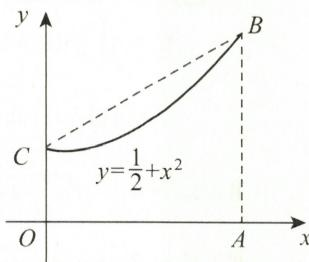  
图3-5

曲边梯形 OABC 的面积为

$$
S _ {1} = \int_ {0} ^ {a} \left(x ^ {2} + \frac {1}{2}\right) \mathrm{d} x = \left(\frac {1}{3} x ^ {3} + \frac {1}{2} x\right) \Big | _ {0} ^ {a} = \frac {1}{3} a \left(a ^ {2} + \frac {3}{2}\right),
$$

故

$$
\frac {S}{S _ {1}} = \frac {\frac {1}{2} a (a ^ {2} + 1)}{\frac {1}{3} a (a ^ {2} + \frac {3}{2})} <   \frac {3}{2}.
$$

(17) 解 由已知, 如图 3-6 所示.

设 $\sin x = k\left(0 \leqslant x \leqslant \frac{\pi}{2}\right)$ , 依题意知, 两个函数图形的交点是唯一的, 则

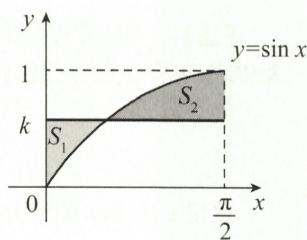  
图3-6

$$
S _ {1} = \int_ {0} ^ {x} (k - \sin t) \mathrm{d} t = k x + \cos x - 1,
$$

$$
S _ {2} = \int_ {x} ^ {\frac {\pi}{2}} (\sin t - k) \mathrm{d} t = \cos x + k x - \frac {1}{2} \pi k.
$$

将 $k = \sin x$ 代入上两式, 得

$$
S _ {1} = x \sin x + \cos x - 1, S _ {2} = \cos x + x \sin x - \frac {1}{2} \pi \sin x,
$$

故

$$
S = S _ {1} + S _ {2} = 2 (x \sin x + \cos x) - \left(1 + \frac {\pi}{2} \sin x\right), 0 <   x <   \frac {\pi}{2},
$$

则 $S^{\prime} = 2x\cos x - \frac{\pi}{2}\cos x = 0$ ，得唯一驻点 $x = \frac{\pi}{4}$ 又

$$
S (0) = 1, S \left(\frac {\pi}{4}\right) = \sqrt {2} - 1, S \left(\frac {\pi}{2}\right) = \frac {\pi}{2} - 1,
$$

所以 $S$ 的最小值为 $S\left(\frac{\pi}{4}\right) = \sqrt{2} - 1$ .

(18) 解（Ⅰ）如图 3-7 所示，用微元法.

任取 $[y, y + dy] \subset [0, 1]$ , 则微元

$$
\begin{array}{r l} \mathrm{d} V _ {1} & = \left[ \pi \left(\frac {\pi}{2}\right) ^ {2} - \pi \left(\frac {\pi}{2} - x\right) ^ {2} \right] \mathrm{d} y \\ & = \left[ \pi^ {2} \arcsin y - \pi (\arcsin y) ^ {2} \right] \mathrm{d} y, \end{array}
$$

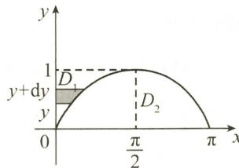

故

$$
\begin{array}{r l} V _ {1} & = \int_ {0} ^ {1} \mathrm{d} V _ {1} = \pi^ {2} \int_ {0} ^ {1} \arcsin y \mathrm{d} y - \pi \int_ {0} ^ {1} (\arcsin y) ^ {2} \mathrm{d} y \\ & = \pi^ {2} \left(y \arcsin y + \sqrt {1 - y ^ {2}}\right) \Big | _ {0} ^ {1} - \pi \Big [ y (\arcsin y) ^ {2} + 2 \sqrt {1 - y ^ {2}} \arcsin y - 2 y \Big ] \Big | _ {0} ^ {1} \\ & = \pi^ {2} \left(\frac {\pi}{2} - 1\right) - \pi \left(\frac {\pi^ {2}}{4} - 2\right) = \frac {\pi^ {3}}{4} - \pi^ {2} + 2 \pi . \end{array}
$$

（Ⅱ）任取 $[x, x + \mathrm{d}x] \subset [0, \pi]$ 则微元 $\mathrm{d}V_2 = 2\pi x \cdot \sin x \mathrm{d}x$ ，故 $V_2 = \int_0^\pi 2\pi x \sin x \mathrm{d}x = 2\pi^2$ .

(19) 解（Ⅰ）星形线如图 3-8 所示. 所围面积

$$
\begin{array}{r l} A & = 4 \int_ {0} ^ {a} y \mathrm{d} x = 4 \int_ {\frac {\pi}{2}} ^ {0} a \sin^ {3} t \bullet (- 3 a \cos^ {2} t \bullet \sin t) \mathrm{d} t \\ & = 1 2 \int_ {0} ^ {\frac {\pi}{2}} a ^ {2} (\sin^ {4} t - \sin^ {6} t) \mathrm{d} t = \frac {3 \pi a ^ {2}}{8}. \end{array}
$$

$$
L = 4 \int_ {0} ^ {\frac {\pi}{2}} \sqrt {x ^ {' 2} (t) + y ^ {' 2} (t)}   \mathrm{d} t = 4 \int_ {0} ^ {\frac {\pi}{2}} 3 a \sin t \cos t   \mathrm{d} t = 6 a.
$$

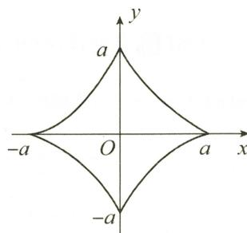

(Ⅲ)

$$
V = 2 \int_ {0} ^ {a} \pi y ^ {2} \mathrm{d} x = 6 \pi a ^ {3} \int_ {0} ^ {\frac {\pi}{2}} \sin^ {7} t (1 - \sin^ {2} t) \mathrm{d} t = \frac {3 2}{1 0 5} \pi a ^ {3},
$$

$$
\begin{array}{r l} S & = 2 \int_ {0} ^ {\frac {\pi}{2}} 2 \pi y \sqrt {x ^ {' 2} (t) + y ^ {' 2} (t)} \mathrm{d} t \\ & = 1 2 \pi a ^ {2} \int_ {0} ^ {\frac {\pi}{2}} \sin^ {4} t \cdot \cos t \mathrm{d} t = \frac {1 2}{5} \pi a ^ {2}. \end{array}
$$

图3-8

【注】 参数方程所围区域图形,求其旋转体面积或体积,关键是在直角坐标系中写出面积或体积表达式,再将参数方程代入,相当于定积分的换元.

如参数方程 $x = x(t)$ , $y = y(t)$ ，设 $x = x(t)$ 的反函数为 $t = t(x)$ ，则面积为

$$
A = \int_ {a} ^ {b} y (t (x)) \mathrm{d} x \stackrel {x = x (t)} {=} \int_ {a} ^ {\beta} y (t) \mathrm{d} [ x (t) ].
$$

这里 $\alpha, \beta$ 是 t 的积分限.

(20) 解 依题意,立体图形如图 3-9 所示,先求垂直于 x 轴截面的面积

故所求体积为

$$
A (x) = \frac {1}{2} (x ^ {2} - 1) ^ {2} \sin \frac {\pi}{3} = \frac {\sqrt {3}}{4} (x ^ {2} - 1) ^ {2},
$$

$$
\begin{array}{r l} V & = \int_ {- 1} ^ {1} A (x) \mathrm{d} x = \frac {\sqrt {3}}{4} \int_ {- 1} ^ {1} (x ^ {2} - 1) ^ {2} \mathrm{d} x \\ & = \frac {\sqrt {3}}{2} \int_ {0} ^ {1} (x ^ {2} - 1) ^ {2} \mathrm{d} x = \frac {\sqrt {3}}{2} \left(\frac {x ^ {5}}{5} - \frac {2}{3} x ^ {3} + x\right) \Bigg | _ {0} ^ {1} \\ & = \frac {4}{1 5} \sqrt {3}. \end{array}
$$

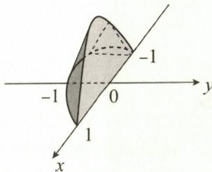  
图3-9

(21) 解 弧微分为

故

$$
\begin{array}{r l} \mathrm{d} s & = \sqrt {1 + \left(\frac {\mathrm{d} x}{\mathrm{d} y}\right) ^ {2}} \mathrm{d} y = \sqrt {1 + \left(\frac {y}{2} - \frac {1}{2 y}\right) ^ {2}} \mathrm{d} y = \frac {1}{2} \left(y + \frac {1}{y}\right) \mathrm{d} y, \\ s & = \int_ {1} ^ {\mathrm{e}} \frac {1}{2} \left(y + \frac {1}{y}\right) \mathrm{d} y = \frac {1}{4} (\mathrm{e} ^ {2} + 1). \end{array}
$$

## 综合题

## 一、选择题

(1)C.

解 由 $F(x)$ 是 $f(x)$ 在 $(-1,1)$ 内的一个原函数，知 $F'(x) = f(x)$ . 因为 $F(x)$ 在 $(-1,1)$ 内连续，从而 $F(x)$ 在 $(-1,1)$ 内存在原函数，所以 $f(x) + F(x)$ 在 $(-1,1)$ 内存在原函数. 选项 C 正确.

由 $F'(x) = f(x)$ 是奇函数, 知 $F(x)$ 是连续的偶函数, 但 $f(x) + F(x)$ 没有奇偶性. 排除选项 D. $f(x)$ 在 $(-1, 1)$ 内存在原函数, 但 $f(x)$ 在 $(-1, 1)$ 内不一定连续.

例如：

$$
\begin{array}{r l} F (x) & = \left\{ \begin{array}{l l} x ^ {2} \cos \frac {1}{x}, & x \neq 0, \\ 0, & x = 0. \end{array} \right. \\ F ^ {\prime} (x) & = f (x) = \left\{ \begin{array}{l l} 2 x \cos \frac {1}{x} + \sin \frac {1}{x}, & x \neq 0, \\ 0, & x = 0. \end{array} \right. \end{array}
$$

$f(x)$ 在 x = 0 处不连续，而 $F(x)$ 在 $(-1, 1)$ 内连续.

因此 $f(x)+F(x)$ 在 $(-1,1)$ 内不连续. 排除选项 A, B.

(2)C.

解 当 $0 < x \leqslant e$ 时, 有

$$
\begin{array}{r l} f (x) & = \lim _ {n \to \infty} \frac {\ln (\mathrm{e} ^ {n} + x ^ {n})}{n} = \lim _ {n \to \infty} \frac {\ln \left\{\mathrm{e} ^ {n} \left[ 1 + \left(\frac {x}{\mathrm{e}}\right) ^ {n} \right] \right\}}{n} \\ & = \lim _ {n \to \infty} \frac {n + \ln \left[ 1 + \left(\frac {x}{\mathrm{e}}\right) ^ {n} \right]}{n} = 1; \end{array}
$$

当 $x > \mathrm{e}$ 时，有

$$
f (x) = \lim _ {n \rightarrow \infty} \frac {\ln (\mathrm{e} ^ {n} + x ^ {n})}{n} = \lim _ {n \rightarrow \infty} \frac {\ln \left\{x ^ {n} \left[ 1 + \left(\frac {\mathrm{e}}{x}\right) ^ {n} \right]\right\}}{n}
$$

故

$$
\begin{array}{r l} & = \lim _ {n \to \infty} \frac {n \ln x + \ln \left[ 1 + \left(\frac {\mathrm{e}}{x}\right) ^ {n} \right]}{n} = \ln x. \\ & f (x) = \left\{ \begin{array}{l l} 1, & 0 <   x \leqslant \mathrm{e}, \\ \ln x, & x > \mathrm{e}. \end{array} \right. \end{array}
$$

由于 $f(x)$ 在 $[1, +\infty)$ 上连续，所以 $F(x) = \int_{1}^{x} f(t) \mathrm{d}t$ 可导. 由

$$
f _ {-} ^ {\prime} (\mathrm{e}) = \lim _ {x \to \mathrm{e} ^ {-}} \frac {f (x) - f (\mathrm{e})}{x - \mathrm{e}} = 0,
$$

$$
f _ {+} ^ {\prime} (\mathrm{e}) = \lim _ {x \to \mathrm{e} ^ {+}} \frac {f (x) - f (\mathrm{e})}{x - \mathrm{e}} = \lim _ {x \to \mathrm{e} ^ {+}} \frac {\ln x - 1}{x - \mathrm{e}} = \frac {1}{\mathrm{e}},
$$

知 $f(x)$ 在 $x = \mathrm{e}$ 处不可导，故 $F(x) = \int_{1}^{x}f(t)\mathrm{d}t$ 在区间 $[1, + \infty)$ 上二阶导数不存在.选项C正确

(3) A.

解 由于 $e^{\sin t}\sin t$ 是以 $2\pi$ 为周期的周期函数, 所以

$$
\begin{array}{r l} F (x) & = \int_ {x} ^ {x + 2 \pi} \mathrm{e} ^ {\sin t} \sin t \mathrm{d} t = \int_ {0} ^ {2 \pi} \mathrm{e} ^ {\sin t} \sin t \mathrm{d} t = - \int_ {0} ^ {2 \pi} \mathrm{e} ^ {\sin t} \mathrm{d} (\cos t) \\ & = - \mathrm{e} ^ {\sin t} \cos t \Big | _ {0} ^ {2 \pi} + \int_ {0} ^ {2 \pi} \cos t \cdot \mathrm{e} ^ {\sin t} \cdot \cos t \mathrm{d} t \\ & = - (1 - 1) + \int_ {0} ^ {2 \pi} \cos^ {2} t \mathrm{e} ^ {\sin t} \mathrm{d} t, \end{array}
$$

又因为 $\cos^{2}t \geqslant 0, e^{\sin t} > 0$ ，所以 $\cos^{2}t e^{\sin t} \geqslant 0$ ，故 $F(x) > 0$ 。选项 A 正确。

【注】设 $f(x+T)=f(x)$ ，且 $f(x)$ 连续，则对任意 $a \in R$ ，有

$$
\int_ {a} ^ {a + T} f (x) \mathrm{d} x = \int_ {0} ^ {T} f (x) \mathrm{d} x.
$$

(4) B.

解 确定 $f(x)$ 在 $(- \delta, \delta)$ 内的符号.

由 $|f(x)| \leqslant x^2$ ，知 $f(0) = 0$ ，且

$$
0 \leqslant | f ^ {\prime} (0) | = \lim _ {x \rightarrow 0} \left| \frac {f (x)}{x} \right| \leqslant \lim _ {x \rightarrow 0} \frac {x ^ {2}}{| x |} = 0,
$$

故 $f'(0)=0$ . 由 $f''(x)>0$ , 知 $f'(x)$ 单调递增, 故在区间 $(-δ,0)$ 和 $(0,δ)$ 内分别有 $f'(x)<0$ 和 $f'(x)>0$ . 因而 $f(x)$ 在 $(-δ,0)$ 内单调递减, 在 $(0,δ)$ 内单调递增, 又 $f(0)=0$ , 知 $f(x)$ 在 $(-δ,δ)$ 内非负, 且仅在 x=0 处 $f(x)=0$ , 所以 $I=\int_{-\delta}^{\delta}f(x)\mathrm{d}x>0$ . 选项 B 正确.

(5) A.

解 因为 $x \in \left[0, \frac{\pi}{2}\right]$ , 所以在该区间上 $\sin x$ 单调递增, $\cos x$ 单调递减. 而 $\sin x \leqslant x$ , 当 $x \in \left(0, \frac{\pi}{2}\right)$ 时, 有 $\sin (\sin x) < \sin x, \cos (\sin x) > \cos x$ , 所以

$$
I _ {1} = \int_ {0} ^ {\frac {\pi}{2}} \sin (\sin x) \mathrm{d} x <   \int_ {0} ^ {\frac {\pi}{2}} \sin x \mathrm{d} x = - \cos x \Big | _ {0} ^ {\frac {\pi}{2}} = 1,
$$

$$
I _ {2} = \int_ {0} ^ {\frac {\pi}{2}} \cos (\sin x) \mathrm{d} x > \int_ {0} ^ {\frac {\pi}{2}} \cos x \mathrm{d} x = \sin x \Big | _ {0} ^ {\frac {\pi}{2}} = 1.
$$

综上可知， $I_{1}<1<I_{2}$ . 选项 A 正确.

(6) A.

解 在 $[0,1]$ 上， $0 \leqslant \ln (1 + x) \leqslant \ln 2 < 1$ ，故

$$
\ln (1 + x) \leqslant \sqrt {\ln (1 + x)},
$$

从而 $I_{1} < I_{3}$ .令

$$
f (x) = \ln (1 + x) - \frac {\arctan x}{1 + x},
$$

则

$$
\begin{array}{r l} f ^ {\prime} (x) & = \frac {1}{1 + x} - \frac {1}{(1 + x) ^ {2}} \left(\frac {1 + x}{1 + x ^ {2}} - \arctan x\right) \\ & = \frac {(1 + x) x ^ {2} + (1 + x ^ {2}) \arctan x}{(1 + x) ^ {2} (1 + x ^ {2})}. \end{array}
$$

当 $x \in [0,1]$ 时， $f'(x) \geqslant 0$ ，故 $f(x)$ 单调递增；又 $f(0) = 0$ ，所以 $f(x) \geqslant f(0) = 0$ ，即

$$
\ln (1 + x) \geqslant {\frac {\arctan x}{1 + x}},   x \in [ 0, 1 ].
$$

从而 $I_{1} > I_{2}$ 综上所述， $I_{3} > I_{1} > I_{2}$ 选项A正确.

(7)C.

解 当 $x \in \left[0, \frac{\pi}{2}\right]$ 时， $(1 + x)^2 = 1 + x^2 + 2x \geqslant 1 + x^2$ ，故

$$
I _ {2} = \int_ {0} ^ {\frac {\pi}{2}} \frac {\sin x}{1 + x ^ {2}} \mathrm{d} x > \int_ {0} ^ {\frac {\pi}{2}} \frac {\sin x}{(1 + x) ^ {2}} \mathrm{d} x = I _ {3}.
$$

为比较 $I_{1}$ 与 $I_{2}$ 的大小,作差:

$$
\begin{array}{r l} I _ {1} - I _ {2} & = \int_ {0} ^ {\frac {\pi}{2}} \frac {\cos x - \sin x}{1 + x ^ {2}} \mathrm{d} x \\ & = \int_ {0} ^ {\frac {\pi}{4}} \frac {\cos x - \sin x}{1 + x ^ {2}} \mathrm{d} x + \int_ {\frac {\pi}{4}} ^ {\frac {\pi}{2}} \frac {\cos x - \sin x}{1 + x ^ {2}} \mathrm{d} x. \end{array}
$$

又

$$
\int_ {\frac {\pi}{4}} ^ {\frac {\pi}{2}} \frac {\cos x - \sin x}{1 + x ^ {2}} \mathrm{d} x \xlongequal {x = \frac {\pi}{2} - t} \int_ {\frac {\pi}{4}} ^ {0} \frac {\sin t - \cos t}{1 + \left(\frac {\pi}{2} - t\right) ^ {2}} (- \mathrm{d} t) = \int_ {0} ^ {\frac {\pi}{4}} \frac {\sin t - \cos t}{1 + \left(\frac {\pi}{2} - t\right) ^ {2}} \mathrm{d} t,
$$

故

$$
\begin{array}{r l} I _ {1} - I _ {2} & = \int_ {0} ^ {\frac {\pi}{4}} (\cos x - \sin x) \left[ \frac {1}{1 + x ^ {2}} - \frac {1}{1 + \left(\frac {\pi}{2} - x\right) ^ {2}} \right] \mathrm{d} x \\ & = \int_ {0} ^ {\frac {\pi}{4}} (\cos x - \sin x) \frac {\left(\frac {\pi}{2} - x\right) ^ {2} - x ^ {2}}{(1 + x ^ {2}) \left[ 1 + \left(\frac {\pi}{2} - x\right) ^ {2} \right]} \mathrm{d} x. \end{array}
$$

当 $0 < x < \frac{\pi}{4}$ 时， $\cos x > \sin x, 0 < x < \frac{\pi}{2} - x$ ，故 $I_1 - I_2 > 0$ .

综上所述， $I_{1}>I_{2}>I_{3}$ .选项C正确.

(8)B.

解 对于 ①、② 两项: 因为是选择题, 所以 $f(x)$ 可以取特殊值. 例如取 $f(x) = -x$ , 则

$$
f ^ {\prime} (x) = - 1 <   0.
$$

$$
\int_ {0} ^ {t} f (x) \mathrm{d} x = \int_ {0} ^ {t} (- x) \mathrm{d} x = - \frac {1}{2} t ^ {2},
$$

$$
\int_ {0} ^ {1} t f (x) \mathrm{d} x = \int_ {0} ^ {1} t (- x) \mathrm{d} x = t \int_ {0} ^ {1} (- x) \mathrm{d} x = - \frac {1}{2} t,
$$

只要比较 $-\frac{1}{2}t^{2}$ 与 $-\frac{1}{2}t$ 的大小即可.

当 $0 < t < 1$ 时， $0 < t^2 < t$ ，故 $-\frac{1}{2} t^2 > -\frac{1}{2} t.$ 第②项正确.

对于 ③、④ 两项: 令 $F(x) = \int_{0}^{x} x f(t) \mathrm{d} t - 2 \int_{0}^{x} t f(t) \mathrm{d} t$ , 则

$$
\begin{array}{r l} F ^ {\prime} (x) & = \left(x \int_ {0} ^ {x} f (t) \mathrm{d} t - 2 \int_ {0} ^ {x} t f (t) \mathrm{d} t\right) ^ {\prime} \\ & = \int_ {0} ^ {x} f (t) \mathrm{d} t + x f (x) - 2 x f (x) \\ & = \int_ {0} ^ {x} f (t) \mathrm{d} t - x f (x) \\ & \frac {\text {积分中值}}{\text {定理}} x [ f (\xi) - f (x) ] (0 <   \xi <   x). \end{array}
$$

当 x > 0 时，由 $f'(x) < 0$ ，知 $f(x)$ 单调递减，故 $f(\xi) - f(x) > 0$ .

当 x = 0 时， $F'(x) = 0$ ，从而 $F'(x) \geqslant 0$ ，所以 $F(x) \geqslant F(0) = 0$ 。第③项正确。

综上所述,选项 B 正确.

(9)C.

解 由已知,有

$F'(x) = f(x) > 0, \; F''(x) = f'(x) < 0, \; \text{且} \; F(0) = 0,$

故 $y = F(x)$ 在[0,1]上单调递增，且是凸曲线，如图3-10所示.

$\overline{OA}$ 的方程为

故

$$
\begin{array}{r l} y & = x F (1), F (x) > x F (1), x \in (0, 1), \\ & \int_ {0} ^ {1} F (x) \mathrm{d} x > \int_ {0} ^ {1} x F (1) \mathrm{d} x = \frac {1}{2} F (1), \end{array}
$$

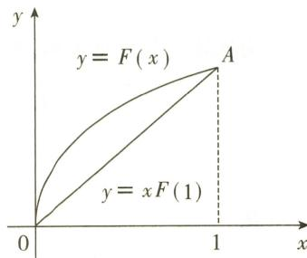

即 $F(1) < 2\int_{0}^{1} F(x) \, dx$ ，可排除选项 B.

图3-10

又 $F(x)$ 在 $[0,1]$ 上单调递增，知 $F(1) > F(x), x \in (0,1)$ ，故 $2\int_{0}^{1} F(x) \mathrm{d}x > F(1) > F(x)$ . 选项 C 正确.

由 $xF(1) < F(x) < F(1) < 2\int_{0}^{1} F(x) \, \mathrm{d}x$ ，知选项 A 不正确.

(10)B.

解 令 $F(t) = \int_{0}^{t} xf(x) \, \mathrm{d}x - \frac{2}{3} t \int_{0}^{t} f(x) \, \mathrm{d}x$ ，则

$$
\begin{array}{r l} F ^ {\prime} (t) & = \frac {1}{3} t f (t) - \frac {2}{3} \int_ {0} ^ {t} f (x) \mathrm{d} x, F ^ {\prime} (0) = 0; \\ F ^ {\prime \prime} (t) & = \frac {1}{3} t f ^ {\prime} (t) - \frac {1}{3} f (t) = \frac {1}{3} t f ^ {\prime} (t) - \frac {1}{3} [ f (t) - f (0) ] \\ & = \frac {1}{3} t f ^ {\prime} (t) - \frac {1}{3} t f ^ {\prime} (\xi) (0 <   \xi <   t \leqslant a). \end{array}
$$

由 $f''(x)>0$ , 知 $f'(t)>f'(\xi)$ , 故 $F''(t)>0$

所以当 t > 0 时， $F'(t) > F'(0) = 0, F(t)$ 单调递增.

又由 $F(0) = 0$ ，知 $F(t) > F(0) = 0.$ 令 $t = a$ ，则 $F(a) > F(0) = 0$ ，即

$$
\int_ {0} ^ {a} x f (x) \mathrm{d} x > \frac {2}{3} a \int_ {0} ^ {a} f (x) \mathrm{d} x.
$$

选项 B 正确.

(11)D.

解 依题意,只需判别被积函数的正、负即可,考虑到 $\sin x$ 在 $[0,\pi]$ 与 $[-\pi,0]$ 上分别非负和非正,有

$$
\int_ {- \pi} ^ {\pi} f (x) \sin x \mathrm{d} x = \int_ {- \pi} ^ {0} f (x) \sin x \mathrm{d} x + \int_ {0} ^ {\pi} f (x) \sin x \mathrm{d} x.
$$

而

$$
\begin{array}{r l} & {\int_ {- \pi} ^ {0} f (x) \sin x \mathrm{d} x \frac {x = - u}{\pi} \int_ {\pi} ^ {0} f (- u) \sin (- u) (- \mathrm{d} u)} \\ & {\qquad = - \int_ {0} ^ {\pi} f (- u) \sin u \mathrm{d} u = - \int_ {0} ^ {\pi} f (- x) \sin x \mathrm{d} x,} \end{array}
$$

故

$$
\int_ {- \pi} ^ {\pi} f (x) \sin x \mathrm{d} x = \int_ {0} ^ {\pi} [ f (x) - f (- x) ] \sin x \mathrm{d} x.
$$

由 $f^{\prime}(x) < 0$ ，知 $f(x)$ 单调递减，故当 $x\in [0,\pi ]$ 时，有 $f(x)\leqslant f(-x)$ ，于是

$$
\int_ {- \pi} ^ {\pi} f (x) \sin x \mathrm{d} x = \int_ {0} ^ {\pi} [ f (x) - f (- x) ] \sin x \mathrm{d} x <   0,
$$

故第 ① 项正确. 又

$$
\begin{array}{r l} \int_ {- \pi} ^ {\pi} f (x) \cos x \mathrm{d} x & = \int_ {- \pi} ^ {\pi} f (x) \mathrm{d} (\sin x) = f (x) \sin x \Big | _ {- \pi} ^ {\pi} - \int_ {- \pi} ^ {\pi} f ^ {\prime} (x) \sin x \mathrm{d} x \\ & = - \int_ {- \pi} ^ {\pi} f ^ {\prime} (x) \sin x \mathrm{d} x, \end{array}
$$

且由 $f''(x) > 0$ ，知 $f'(x)$ 单调递增，从而 $-f'(x)$ 单调递减.由第①项正确，知

$$
\int_ {- \pi} ^ {\pi} f (x) \cos x \mathrm{d} x = - \int_ {- \pi} ^ {\pi} f ^ {\prime} (x) \sin x \mathrm{d} x <   0,
$$

故第④项也正确.综上可知,选项D正确.

【注】作为选择题,可用取特殊值法.例如,对于第①、②项,取 $f(x)=-x$ ;对于第①、④项,取 $f(x)=\mathrm{e}^{x}$ .

(12)D.

解

$$
\mathrm{e} ^ {- \cos \frac {1}{x}} - \mathrm{e} ^ {- 1} = \mathrm{e} ^ {- 1} \left(\mathrm{e} ^ {- \cos \frac {1}{x} + 1} - 1\right).
$$

当 $x \to +\infty$ 时， $\mathrm{e}^{-1}\left(\mathrm{e}^{-\cos \frac{1}{x} + 1} - 1\right)$ 与 $\mathrm{e}^{-1}\left(1 - \cos \frac{1}{x}\right)$ 是等价无穷小。又 $1 - \cos \frac{1}{x}$ 与 $\frac{1}{2x^2}$ 是等价无穷小，故 $x^k\left(\mathrm{e}^{-\cos \frac{1}{x}} - \mathrm{e}^{-1}\right)$ 与 $\frac{1}{2\mathrm{e}x^{2 - k}}$ 是等价无穷小。

当 $k < 1$ 时， $2 - k > 1$ ，故 $\int_{1}^{+\infty} x^k \left( e^{-\cos \frac{1}{x}} - e^{-1} \right) dx$ 收敛。选项D正确。

当 $k \geqslant 1$ 时， $2 - k \leqslant 1, \frac{1}{2\mathrm{e}x^{2 - k}}$ 是阶数不高于 $\frac{1}{x}$ 的无穷小，故 $\int_{1}^{+\infty} x^k \left( \mathrm{e}^{-\cos \frac{1}{x}} - \mathrm{e}^{-1} \right) \mathrm{d}x$ 发散.

【注】结论： $\int_{a}^{+\infty}\frac{1}{x^p}\mathrm{d}x(a > 0,p$ 为任意实数），当 $p\leqslant 1$ 时，发散；当 $p > 1$ 时，收敛于 $\frac{a^{1 - p}}{p - 1}$ (13)C.

解

$$
\int_ {- b} ^ {b} f (a - x) \mathrm{d} x = \int_ {- b} ^ {0} f (a - x) \mathrm{d} x + \int_ {0} ^ {b} f (a - x) \mathrm{d} x.
$$

由 $f(x) = f(2a - x)$ ，得 $f(a + x) = f(a - x)$ ，则

$$
\int_ {- b} ^ {0} f (a - x) \mathrm{d} x \xlongequal {x = - t} - \int_ {b} ^ {0} f (a + t) \mathrm{d} t = \int_ {0} ^ {b} f (a - t) \mathrm{d} t = \int_ {0} ^ {b} f (a - x) \mathrm{d} x,
$$

故

$$
\int_ {- b} ^ {b} f (a - x) \mathrm{d} x = 2 \int_ {0} ^ {b} f (a - x) \mathrm{d} x.
$$

选项 C 正确.

(14)A.

解 由已知, $r=\theta(0\leqslant\theta\leqslant2\pi)$ 与极轴所围区域如图 3-11 所示.

将区间 $[0,2\pi ]n$ 等分，则所围区域的面积

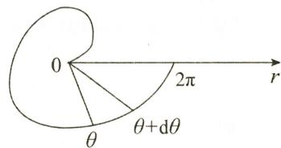

$$
\begin{array}{r l} A & = \int_ {0} ^ {2 \pi} \frac {1}{2} r ^ {2} (\theta) \mathrm{d} \theta \\ & = \lim _ {n \to \infty} \sum_ {i = 1} ^ {n} \frac {1}{2} r ^ {2} \left(0 + \frac {2 \pi - 0}{n} i\right) \frac {2 \pi - 0}{n} \\ & = \lim _ {n \to \infty} \sum_ {i = 1} ^ {n} \frac {1}{2} \cdot \left(\frac {2 \pi i}{n}\right) ^ {2} \frac {2 \pi}{n} = \lim _ {n \to \infty} \sum_ {i = 1} ^ {n} \frac {4 \pi^ {3} i ^ {2}}{n ^ {3}}. \end{array}
$$

图3-11

选项 A 正确.

(15) A.

解 令 $g(x) = \int_{0}^{x} f(t) \, \mathrm{d}t$ ，则 $g(x^3) = \int_{0}^{x^3} f(t) \, \mathrm{d}t$ . $g'(x) = f(x), g''(x) = f'(x)$ ，故

$$
\lim _ {x \to 0} \frac {g (x)}{x ^ {2}} = \lim _ {x \to 0} \frac {g ^ {\prime} (x)}{2 x} = \lim _ {x \to 0} \frac {g ^ {\prime \prime} (x)}{2} = \lim _ {x \to 0} \frac {f ^ {\prime} (x)}{2} = \frac {f ^ {\prime} (0)}{2} = 3,
$$

即有 $\lim_{x\to 0}\frac{g(x)}{3x^2} = 1.$ 所以 $g(x)\sim 3x^{2},g(x^{3})\sim 3(x^{3})^{2} = 3x^{6}$ ，故

$$
\lim _ {x \to 0} \frac {\alpha (x)}{\beta (x)} = \lim _ {x \to 0} \frac {3 x ^ {6}}{(3 x ^ {2}) ^ {3}} = \frac {1}{9},
$$

即 $\alpha(x)$ 与 $\beta(x)$ 是同阶无穷小. 选项 A 正确.

(16)B.

解 令 $t + \frac{x}{s} = u$ ，则 $\mathrm{d}u = \frac{1}{s}\mathrm{d}x$ ，故

$$
I = \frac {1}{s} \int_ {0} ^ {s t} f \left(t + \frac {x}{s}\right) \mathrm{d} x = \frac {1}{s} \int_ {t} ^ {2 t} f (u) s \mathrm{d} u = \int_ {t} ^ {2 t} f (u) \mathrm{d} u.
$$

由此可知，I 仅依赖于 t. 选项 B 正确.

(17)B.

解由

$$
\int_ {1} ^ {\frac {1}{x}} \frac {\ln t}{1 + t} \mathrm{d} t \stackrel {\frac {1}{t} = u} {=} \int_ {1} ^ {x} \frac {\ln u}{u (1 + u)} \mathrm{d} u = \int_ {1} ^ {x} \frac {\ln t}{t} \mathrm{d} t - \int_ {1} ^ {x} \frac {\ln t}{1 + t} \mathrm{d} t,
$$

知

$$
\int_ {1} ^ {x} \frac {\ln t}{1 + t} \mathrm{d} t + \int_ {1} ^ {\frac {1}{x}} \frac {\ln t}{1 + t} \mathrm{d} t = \int_ {1} ^ {x} \frac {\ln t}{t} \mathrm{d} t = \int_ {1} ^ {x} \ln t \mathrm{d} (\ln t) = \left. \frac {1}{2} \ln^ {2} t \right| _ {1} ^ {x} = \frac {1}{2} \ln^ {2} x (x > 0).
$$

记 $g(x) = \frac{1}{2}\ln^2 x$ ，则由 $g'(x) = \frac{\ln x}{x} = 0$ ，得 $x = 1$

且当 0 < x < 1 时， $g'(x) < 0$ ; 当 x > 1 时， $g'(x) > 0$ . 故 $g(1) = 0$ 为 $g(x)$ 的极小值.

又

$$
\lim _ {x \rightarrow 0 ^ {+}} g (x) = \lim _ {x \rightarrow 0 ^ {+}} \frac {1}{2} \ln^ {2} x = + \infty , \quad \lim _ {x \rightarrow + \infty} g (x) = \lim _ {x \rightarrow + \infty} \frac {1}{2} \ln^ {2} x = + \infty ,
$$

故由原方程有实根,知 $a \geqslant 0$ . 选项 B 正确.

(18)C.

解 由 $\ln \frac{2 + x}{2 - x}$ 是关于 $x$ 的奇函数, 知 $x \ln \frac{2 + x}{2 - x}$ 是偶函数, 故

$$
\int_ {- 1} ^ {1} x \ln {\frac {2 + x}{2 - x}} \mathrm{d} x = 2 \int_ {0} ^ {1} x \ln {\frac {2 + x}{2 - x}} \mathrm{d} x.
$$

又 $x\ln \frac{2 + x}{2 - x}$ 在[0,1]上大于或等于零，故 $\int_{-1}^{1}x\ln \frac{2 + x}{2 - x}\mathrm{d}x > 0.$ 选项C正确.

对于选项 A: 由于

$$
\int_ {0} ^ {1} \frac {\mathrm{d} x}{(4 x - 1) ^ {3}} = \int_ {0} ^ {\frac {1}{4}} \frac {\mathrm{d} x}{(4 x - 1) ^ {3}} + \int_ {\frac {1}{4}} ^ {1} \frac {\mathrm{d} x}{(4 x - 1) ^ {3}}
$$

且

$$
\begin{array}{r l} & {\int_ {0} ^ {\frac {1}{4}} \frac {\mathrm{d} x}{(4 x - 1) ^ {3}} = \lim _ {\xi \to 0 ^ {+}} \int_ {0} ^ {\frac {1}{4} - \xi} \frac {1}{4} (4 x - 1) ^ {- 3} \mathrm{d} (4 x - 1)} \\ & {\qquad = \frac {1}{4} \lim _ {\xi \to 0 ^ {+}} \frac {- 1}{2 (4 x - 1) ^ {2}} \Big | _ {0} ^ {\frac {1}{4} - \xi} = - \frac {1}{8} \lim _ {\xi \to 0 ^ {+}} \left[ \frac {1}{(- 4 \xi) ^ {2}} - 1 \right] = \infty ,} \end{array}
$$

故 $\int_0^1\frac{\mathrm{d}x}{(4x - 1)^3}$ 发散.

对于选项 B: 由于

$$
\int_ {- \infty} ^ {+ \infty} {\frac {x}{\sqrt {1 + x ^ {2}}}} \mathrm{d} x = \int_ {- \infty} ^ {0} {\frac {x}{\sqrt {1 + x ^ {2}}}} \mathrm{d} x + \int_ {0} ^ {+ \infty} {\frac {x}{\sqrt {1 + x ^ {2}}}} \mathrm{d} x,
$$

且

$$
\lim _ {x \to + \infty} x ^ {\frac {1}{2}} \cdot \frac {x}{\sqrt {1 + x ^ {2}}} = + \infty ,
$$

根据反常积分的比较审敛法,知 $\int_{-\infty}^{+\infty}\frac{x}{\sqrt{1+x^{2}}}\mathrm{d}x$ 发散.

对于选项 D: 由于 $e^{x^{2}}\sin x$ 是奇函数, 故 $\int_{-\frac{\pi}{2}}^{\frac{\pi}{2}}e^{x^{2}}\sin x dx = 0$ .

(19)B.

解 当 $p \leqslant 0$ 时, $\lim_{x \to +\infty} \frac{\ln(1+x)}{x^p} = +\infty$ , 故 $\int_{0}^{+\infty} \frac{\ln(1+x)}{x^p} \mathrm{d}x$ 发散.

当 $p > 0$ 时，

$$
\int_ {0} ^ {+ \infty} {\frac {\ln (1 + x)}{x ^ {p}}} \mathrm{d} x = \int_ {0} ^ {1} {\frac {\ln (1 + x)}{x ^ {p}}} \mathrm{d} x + \int_ {1} ^ {+ \infty} {\frac {\ln (1 + x)}{x ^ {p}}} \mathrm{d} x {\stackrel {\text {记}} {=}} I _ {1} + I _ {2}.
$$

对于 $I_{1}$ : 当 $x \to 0$ 时, $\frac{\ln(1+x)}{x^{p}}$ 与 $\frac{1}{x^{p-1}}$ 是等价无穷小. 故当 $p - 1 \geqslant 1$ 时, $I_{1}$ 发散; 当 p - 1 < 1 时, $I_{1}$ 收敛. 所以当 0 < p < 2 时, $I_{1}$ 收敛.

对于 $I_{2}$ : 当 p > 1 时, 总存在 $\delta > 0$ , 使得 $p - \delta > 1$ . 由于

$$
\lim _ {x \to + \infty} x ^ {p - \delta} \cdot \frac {\ln (1 + x)}{x ^ {p}} = \lim _ {x \to + \infty} \frac {\ln (1 + x)}{x ^ {\delta}} = 0,
$$

故 $I_{2}$ 收敛.

当 $0 < p \leqslant 1$ 时，由 $\lim_{x \to +\infty} x^p \cdot \frac{\ln(1 + x)}{x^p} = +\infty$ ，知 $I_2$ 发散.

综上所述, 当 1 < p < 2 时, 原积分收敛. 选项 B 正确.

【注】 $\int_{a}^{b}\frac{\mathrm{d}x}{(x - a)^{q}} (a < b)\left\{ \begin{array}{ll}q < 1, & \text{收敛},\\ q\geqslant 1, & \text{发散}. \end{array} \right.$ $\int_{a}^{+\infty}\frac{\mathrm{d}x}{x^p} (a > 0)\left\{ \begin{array}{ll}p > 1, & \text{收敛},\\ p\leqslant 1, & \text{发散}. \end{array} \right.$

(20) A.

解

$$
I = \int_ {1} ^ {+ \infty} \frac {\mathrm{d} x}{x ^ {p} \ln^ {q} x} = \int_ {1} ^ {\mathrm{e}} \frac {\mathrm{d} x}{x ^ {p} \ln^ {q} x} + \int_ {\mathrm{e}} ^ {+ \infty} \frac {\mathrm{d} x}{x ^ {p} \ln^ {q} x}.
$$

因为 $\ln x = \ln [1 + (x - 1)]\sim x - 1(x\to 1)$ ，由

$$
\lim _ {x \rightarrow 1 ^ {+}} \frac {\frac {1}{x ^ {p} \ln^ {q} x}}{\frac {1}{(x - 1) ^ {q}}} = 1,
$$

可知 $\int_{1}^{e}\frac{\mathrm{d}x}{x^p\ln^q x}$ 与 $\int_{1}^{e}\frac{\mathrm{d}x}{(x - 1)^q}$ 敛散性相同，故当 $q < 1$ 时， $\int_{1}^{e}\frac{\mathrm{d}x}{x^p\ln^q x}$ 收敛.排除选项B和D.

当 $q < 1, p = 1$ 时， $\int_{\mathrm{e}}^{+\infty} \frac{\mathrm{d}x}{x \ln^q x} = \frac{1}{1 - q} \ln^{1 - q} x \bigg|_{\mathrm{e}}^{+\infty} = \infty$ ，故发散；

当 $q < 1, p < 1$ 时，对 $\forall p < a < 1, \lim_{x \to +\infty} \frac{\frac{1}{x^p \ln^q x}}{\frac{1}{x^a}} = +\infty$ ，且 $\int_{e}^{+\infty} \frac{dx}{x^a}$ 发散，故 $\int_{e}^{+\infty} \frac{dx}{x^p \ln^q x}$ 发散；

当 $q < 1, p > 1$ 时， $\int_{\mathrm{e}}^{+\infty} \frac{\mathrm{d}x}{x^p \ln^q x} < \int_{\mathrm{e}}^{+\infty} \frac{\mathrm{d}x}{x^p}$ ，故 $\int_{\mathrm{e}}^{+\infty} \frac{\mathrm{d}x}{x^p \ln^q x}$ 收敛.

综上所述, 当 p > 1, q < 1 时, 积分收敛. 选项 A 正确.

(21) A.

解

$$
\int_ {0} ^ {+ \infty} {\frac {x ^ {1 - p} \arctan x}{2 + x ^ {p}}} \mathrm{d} x = \int_ {0} ^ {1} {\frac {x ^ {1 - p} \arctan x}{2 + x ^ {p}}} \mathrm{d} x + \int_ {1} ^ {+ \infty} {\frac {x ^ {1 - p} \arctan x}{2 + x ^ {p}}} \mathrm{d} x {\stackrel {\text {记}} {=}} I _ {1} + I _ {2}.
$$

对于 $I_{1}$ ，

$$
\lim _ {x \rightarrow 0 ^ {+}} x ^ {- (1 - p) - 1} \cdot \frac {x ^ {1 - p} \arctan x}{2 + x ^ {p}} = \lim _ {x \rightarrow 0 ^ {+}} \frac {1}{2 + x ^ {p}} = \frac {1}{2}.
$$

由比较审敛法,知当 $-(1-p)-1<1$ ,即p<3时, $I_{1}$ 收敛.

对于 $I_{2}$ ， $\lim_{x\to+\infty}x^{p-(1-p)}\cdot\frac{x^{1-p}\arctan x}{2+x^{p}}=\lim_{x\to+\infty}\frac{x^{p}\arctan x}{2+x^{p}}=\frac{\pi}{2}.$

由比较审敛法,知当 $p-(1-p)>1$ , 即 p>1 时, $I_{2}$ 收敛.

故当 1 < p < 3 时, 原积分收敛. 选项 A 正确.

(22)C.

解

$$
\begin{array}{r l} I & = \int_ {0} ^ {+ \infty} \left(\frac {1}{\sqrt {x ^ {2} + 4}} - \frac {a}{x + 2}\right) \mathrm{d} x = \left[ \ln \left(x + \sqrt {x ^ {2} + 4}\right) - a \ln (x + 2) \right] \Bigg | _ {0} ^ {+ \infty} \\ & = \lim _ {x \to + \infty} \ln \frac {x + \sqrt {x ^ {2} + 4}}{(x + 2) ^ {a}} - \ln 2 + a \ln 2. \end{array}
$$

当 $a > 1$ 时， $\lim_{x\to +\infty}\ln \frac{x + \sqrt{x^2 + 4}}{(x + 2)^a} = \infty$ ，积分发散；

当 $a < 1$ 时， $\lim_{x\to +\infty}\ln \frac{x + \sqrt{x^2 + 4}}{(x + 2)^a} = \infty$ ，积分发散；

当 $a = 1$ 时，

$$
I = \ln \left[ \lim _ {x \rightarrow + \infty} \frac {x + \sqrt {x ^ {2} + 4}}{(x + 2) ^ {a}} \right] - 0 = \ln \left(\lim _ {x \rightarrow + \infty} \frac {1 + \sqrt {1 + \frac {4}{x ^ {2}}}}{1 + \frac {2}{x}}\right) = \ln 2.
$$

选项 C 正确.

## 二、填空题

(1) $2\ln2-\frac{3}{4}.$

解记

$$
a _ {n} = \sum_ {k = 1} ^ {n} \frac {k}{2 n ^ {2} + k}, b _ {n} = \sum_ {k = 1} ^ {n} \ln \left(\frac {n + k}{n}\right) ^ {\frac {1}{n}}.
$$

$$
\frac {1}{2 n ^ {2} + n} \cdot \frac {n (n + 1)}{2} \leqslant a _ {n} \leqslant \frac {1}{2 n ^ {2} + 1} \cdot \frac {n (n + 1)}{2}.
$$

因

$$
\lim _ {n \to \infty} {\frac {1}{2 n ^ {2} + n}} \cdot {\frac {n (n + 1)}{2}} = {\frac {1}{4}}, \quad \lim _ {n \to \infty} {\frac {1}{2 n ^ {2} + 1}} \cdot {\frac {n (n + 1)}{2}} = {\frac {1}{4}},
$$

故由夹逼准则,知 $\lim_{n\to\infty}a_{n}=\frac{1}{4}$ .

又

$$
\begin{array}{r l} {\underset {n \to \infty} {\lim} b _ {n}} & {= \underset {n \to \infty} {\lim}  \frac {1}{n} \sum_ {k = 1} ^ {n} \ln \Big (1 + \frac {k}{n} \Big) = \int_ {0} ^ {1} \ln (1 + x) \mathrm{d} x} \\ & {= x \ln (1 + x)   \Big | _ {0} ^ {1} - \int_ {0} ^ {1}  \frac {x}{1 + x} \mathrm{d} x} \\ & {= 2 \ln 2 - 1.} \\ & {\text {原式} =  \frac {1}{4} + 2 \ln 2 - 1 = 2 \ln 2 -  \frac {3}{4}.} \end{array}
$$

故

(2) $f(x)-f(x_{0})$ .

解 由于 $\int_{x_0}^{x} f(t + \Delta x) \, \mathrm{d}t \stackrel{t + \Delta x = u}{=} \int_{x_0 + \Delta x}^{x + \Delta x} f(u) \, \mathrm{d}u$ ，所以

$$
\begin{array}{r l} & {\underset {\Delta x \to 0} {\lim} \frac {1}{\Delta x} \int_ {x _ {0}} ^ {x} [ f (t + \Delta x) - f (t) ] \mathrm{d} t = \underset {\Delta x \to 0} {\lim} \frac {\int_ {x _ {0} + \Delta x} ^ {x + \Delta x} f (u) \mathrm{d} u - \int_ {x _ {0}} ^ {x} f (t) \mathrm{d} t}{\Delta x}} \\ & {\qquad \qquad \qquad \qquad \qquad \qquad \qquad \qquad \qquad \qquad \qquad \qquad \text {洛必达}} \\ & {\qquad \qquad \qquad \text {法则} \underset {\Delta x \to 0} {\lim} [ f (x + \Delta x) - f (x _ {0} + \Delta x) ] = f (x) - f (x _ {0}).} \end{array}
$$

【注】① $\int_{x_0}^{x}f(t)\mathrm{d}t$ 不含 $\Delta x$ ，对 $\Delta x\to 0$ 的极限而言为常数.

$$
\begin{array}{r l} & {\text {②} \lim _ {\Delta x \to 0} \frac {1}{\Delta x} \int_ {x _ {0}} ^ {x} [ f (t + \Delta x) - f (t) ] \mathrm{d} t = \lim _ {\Delta x \to 0} \int_ {x _ {0}} ^ {x} \frac {f (t + \Delta x) - f (t)}{\Delta x} \mathrm{d} t = \int_ {x _ {0}} ^ {x} \lim _ {\Delta x \to 0} \frac {f (t + \Delta x) - f (t)}{\Delta x} \mathrm{d} t} \\ & {\qquad = \int_ {x _ {0}} ^ {x} f ^ {\prime} (t) \mathrm{d} t = f (x) - f (x _ {0}),} \end{array}
$$

以上解法是错误的,一般情况下,积分号与极限号不能任意交换.

(3) $\frac{x}{\sin x}.$

解

$$
\lim _ {t \to 0} \left[ \frac {f (x + t \sin x)}{f (x)} \right] ^ {\frac {1}{t}} = \mathrm{e} ^ {\lim _ {t \to 0} \frac {1}{t} \ln \frac {f (x + t \sin x)}{f (x)}},
$$

又 $\lim_{t\to 0}\frac{1}{t}\ln \frac{f(x + t\sin x)}{f(x)} = \lim_{t\to 0}\frac{\ln f(x + t\sin x) - \ln f(x)}{t\sin x}\cdot \sin x = [\ln f(x)]'\sin x,$

由已知，有

$$
\mathrm{e} ^ {\left[ \ln f (x) \right] ^ {\prime} \sin x} = \mathrm{e} ^ {\frac {\sin x - x \cos x}{x}},
$$

即

$$
\left[ \ln f (x) \right] ^ {\prime} = \frac {\sin x - x \cos x}{x \sin x}.
$$

上式两边积分,得

$$
\ln f (x) = \int \left(\frac {1}{x} - \frac {\cos x}{\sin x}\right) \mathrm{d} x = \ln x - \ln (\sin x) + c _ {1},
$$

解得 $f(x) = \frac{cx}{\sin x}$ . 由 $\lim_{x \to 0^{+}} f(x) = 1$ , 得 $c = 1$ . 故 $f(x) = \frac{x}{\sin x}$ .

(4) $\frac{1}{2}.$

解 曲线与 x 轴的交点为 $(0,0)$ ， $(1,0)$ ， $(2,0)$ ，在区间 $[0,1]$ 上，y < 0；在区间 $[1,2]$ 上，y > 0，故所求面积为

$$
A = - \int_ {0} ^ {1} x (x - 1) (2 - x) \mathrm{d} x + \int_ {1} ^ {2} x (x - 1) (2 - x) \mathrm{d} x = \frac {1}{4} + \frac {1}{4} = \frac {1}{2}.
$$

(5)1.

解 双纽线的极坐标方程为

$$
r ^ {2} = \cos 2 \theta \left(- \frac {\pi}{4} \leqslant \theta \leqslant \frac {\pi}{4}, \frac {3 \pi}{4} \leqslant \theta \leqslant \frac {5 \pi}{4}\right).
$$

如图 3-12 所示,由对称性,知所围成的图形面积为

$$
A = 4 \times \frac {1}{2} \int_ {0} ^ {\frac {\pi}{4}} r ^ {2} \mathrm{d} \theta = 2 \int_ {0} ^ {\frac {\pi}{4}} \cos 2 \theta \mathrm{d} \theta = 1.
$$

(6)8.

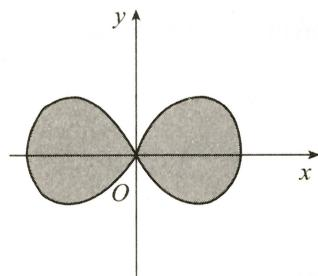  
图3-12

解 由 $r = 1 + \cos \theta$ ，有

$$
\begin{array}{r l} \mathrm{d} s & = \sqrt {r ^ {2} (\theta) + r ^ {\prime 2} (\theta)} \mathrm{d} \theta \\ & = \sqrt {(1 + \cos \theta) ^ {2} + (- \sin \theta) ^ {2}} \mathrm{d} \theta \\ & = 2 \left| \cos \frac {\theta}{2} \right| \mathrm{d} \theta , \end{array}
$$

故全长为

$$
s = 2 \int_ {0} ^ {\pi} \sqrt {r ^ {2} (\theta) + r ^ {\prime 2} (\theta)} \mathrm{d} \theta = 2 \int_ {0} ^ {\pi} 2 \left| \cos \frac {\theta}{2} \right| \mathrm{d} \theta = 8 \int_ {0} ^ {\pi} \cos \frac {\theta}{2} \mathrm{d} \left(\frac {\theta}{2}\right) = 8.
$$

(7) $2+\frac{1}{2}\ln3.$

解 曲线 $\theta = \frac{1}{2}\left(r + \frac{1}{r}\right)$ 的参数方程为

$$
\left\{ \begin{array}{l} x = r \cos \left[ \frac {1}{2} \left(r + \frac {1}{r}\right) \right], \\ y = r \sin \left[ \frac {1}{2} \left(r + \frac {1}{r}\right) \right], \end{array} \right.
$$

故所求弧长为

$$
\begin{array}{r l} s & = \int_ {1} ^ {3} \sqrt {x ^ {\prime 2} (r) + y ^ {\prime 2} (r)} \mathrm{d} r = \int_ {1} ^ {3} \sqrt {1 + \frac {1}{4} r ^ {2} \left(1 - \frac {1}{r ^ {2}}\right) ^ {2}} \mathrm{d} r \\ & = \int_ {1} ^ {3} \sqrt {\frac {1}{4} r ^ {2} + \frac {1}{2} + \frac {1}{4 r ^ {2}}} \mathrm{d} r = \int_ {1} ^ {3} \sqrt {\left(\frac {r}{2} + \frac {1}{2 r}\right) ^ {2}} \mathrm{d} r \\ & = \int_ {1} ^ {3} \left(\frac {r}{2} + \frac {1}{2 r}\right) \mathrm{d} r = 2 + \frac {1}{2} \ln 3. \end{array}
$$

(8) $\frac{3}{4}\pi$ .

解 由已知,闭曲线 $(x^{2}+y^{2})^{3}=x^{4}+y^{4}$ 关于x轴、y轴均对称,其极坐标方程为

$$
r = \sqrt {\cos^ {4} \theta + \sin^ {4} \theta}, 0 \leqslant \theta \leqslant 2 \pi ,
$$

故所求面积为

$$
\begin{array}{r l} S & = \frac {1}{2} \int_ {0} ^ {2 \pi} r ^ {2} (\theta) \mathrm{d} \theta = \frac {1}{2} \int_ {0} ^ {2 \pi} (\cos^ {4} \theta + \sin^ {4} \theta) \mathrm{d} \theta \\ & = 2 \cdot \frac {1}{2} \int_ {0} ^ {\pi} (\cos^ {4} \theta + \sin^ {4} \theta) \mathrm{d} \theta \\ & = \int_ {- \frac {\pi}{2}} ^ {\frac {\pi}{2}} (\cos^ {4} \theta + \sin^ {4} \theta) \mathrm{d} \theta \\ & = 2 \int_ {0} ^ {\frac {\pi}{2}} (\cos^ {4} \theta + \sin^ {4} \theta) \mathrm{d} \theta = 4 \int_ {0} ^ {\frac {\pi}{2}} \sin^ {4} \theta \mathrm{d} \theta \end{array}
$$

$$
= 4 \times \frac {3}{4} \times \frac {1}{2} \times \frac {\pi}{2} = \frac {3}{4} \pi .
$$

(9) $\frac{(\ln x)^{2}}{2}.$

解 令 $e^{x}=t$ ，则 $x=\ln t, f'(t)=\frac{\ln t}{t}$ ，故

$$
f (t) = \int f ^ {\prime} (t) \mathrm{d} t = \int \frac {\ln t}{t} \mathrm{d} t = \frac {1}{2} (\ln t) ^ {2} + C.
$$

由 $f(1) = 0$ ，得 $C = 0$ ，故 $f(x) = \frac{(\ln x)^2}{2}$

(10) $\arcsin\frac{1}{x}+\frac{\pi}{6}\quad(x<-1).$

解 依题设, 知 $\frac{dy}{dx} = \frac{1}{x\sqrt{x^{2}-1}}$ , 故

$$
\begin{array}{r l} y & = \int \frac {\mathrm{d} x}{x \sqrt {x ^ {2} - 1}} = - \int \frac {\mathrm{d} x}{x ^ {2} \sqrt {1 - \frac {1}{x ^ {2}}}} = \int \frac {\mathrm{d} \left(\frac {1}{x}\right)}{\sqrt {1 - \left(\frac {1}{x}\right) ^ {2}}} \\ & = \arcsin \frac {1}{x} + C (x <   - 1). \end{array}
$$

由 $y(-2) = 0$ ，得 $C = \frac{\pi}{6}$ 故所求曲线方程为

$$
y = \arcsin \frac {1}{x} + \frac {\pi}{6} (x <   - 1).
$$

【注】 $\frac{1}{x\sqrt{x^2 - 1}}$ 的定义域为 $(- \infty, -1) \cup (1, +\infty)$ ，由于曲线通过 $(-2,0)$ 点，表明 $x \in (-\infty, -1)$ ，所以如下解法是错误的：

$$
y = \int \frac {\mathrm{d} x}{x \sqrt {x ^ {2} - 1}} = - \int \frac {\mathrm{d} \left(\frac {1}{x}\right)}{\sqrt {1 - \left(\frac {1}{x}\right) ^ {2}}} = \arccos \frac {1}{x} + C.
$$

由 $y(-2) = 0$ ，得 $C = -\frac{2}{3}\pi$ ，故 $y = \arccos \frac{1}{x} -\frac{2}{3}\pi .$

事实上，

$$
y = \left\{ \begin{array}{l l} \arcsin \frac {1}{x} + \frac {\pi}{6}, & x <   - 1, \\ \arccos \frac {1}{x} + C, & x > 1. \end{array} \right.
$$

(11)2.

解 $g(x) = \int_{0}^{x^2} x f(t) \, \mathrm{d}t = x \int_{0}^{x^2} f(t) \, \mathrm{d}t$ ，由 $g(1) = 1$ ，知 $\int_{0}^{1} f(t) \, \mathrm{d}t = 1$ .

又 $g^{\prime}(x) = \int_{0}^{x^{2}}f(t)\mathrm{d}t + 2x^{2}f(x^{2})$ ，由 $g^{\prime}(1) = 5$ ，知

$$
5 = \int_ {0} ^ {1} f (t) \mathrm{d} t + 2 f (1) = 1 + 2 f (1),
$$

故 $f(1)=2$ .

(12)1.

解 $\int_{2}^{f(\ln x + 1)}g(t)\mathrm{d}t = x\ln x$ 两边同时对 $x$ 求导，得

即

$$
\begin{array}{r l} & g \big [ f (\ln x + 1) \big ] f ^ {\prime} (\ln x + 1) \bullet \frac {1}{x} = \ln x + 1, \\ & (\ln x + 1) f ^ {\prime} (\ln x + 1) \bullet \frac {1}{x} = \ln x + 1, \\ & f ^ {\prime} (\ln x + 1) = x. \end{array}
$$

故

令 $\ln x + 1 = u$ ，则 $x = e^{u-1}, f'(u) = e^{u-1}$ .

积分得 $f(u) = \mathrm{e}^{u - 1} + C$ ，由 $f(1) = 3$ ，得 $C = 2$ ，从而 $f(x) = \mathrm{e}^{x - 1} + 2$ .

由 $f(1)=3$ ，知 $g(3)=1$ ，且 $g'(3)=\frac{1}{f'(1)}=1$ 。

(13)0.

解

$$
\begin{array}{r l} I & = \int_ {0} ^ {1} x ^ {2} f ^ {\prime \prime} (2 x) \mathrm{d} x = \frac {1}{2} \int_ {0} ^ {1} x ^ {2} \mathrm{d} [ f ^ {\prime} (2 x) ] = \frac {1}{2} \left[ x ^ {2} f ^ {\prime} (2 x) \Big | _ {0} ^ {1} - \int_ {0} ^ {1} 2 x f ^ {\prime} (2 x) \mathrm{d} x \right] \\ & = - \frac {1}{2} \int_ {0} ^ {1} x \mathrm{d} [ f (2 x) ] = - \frac {1}{2} \left[ x f (2 x) \Big | _ {0} ^ {1} - \int_ {0} ^ {1} f (2 x) \mathrm{d} x \right] \\ & = \frac {1}{2} \int_ {0} ^ {1} f (2 x) \mathrm{d} x - \frac {1}{2} f (2) \xlongequal {2 x = t} \frac {1}{4} \int_ {0} ^ {2} f (t) \mathrm{d} t - \frac {1}{4} = 0. \end{array}
$$

(14) $e^{-1}-e.$

解

$$
\begin{array}{r l} I & = \int_ {0} ^ {\pi} f (x) \cos x   \mathrm{d} x = \int_ {0} ^ {\pi} f (x) \mathrm{d} (\sin x) = f (x) \sin x \Big | _ {0} ^ {\pi} - \int_ {0} ^ {\pi} f ^ {\prime} (x) \sin x   \mathrm{d} x \\ & = 0 - \int_ {0} ^ {\pi} \mathrm{e} ^ {\cos x} \sin x   \mathrm{d} x = \int_ {0} ^ {\pi} \mathrm{e} ^ {\cos x} \mathrm{d} (\cos x) = \mathrm{e} ^ {\cos x} \Big | _ {0} ^ {\pi} = \mathrm{e} ^ {- 1} - \mathrm{e}. \end{array}
$$

(15) $\frac{1}{6} - \frac{1}{4} \ln 3$ .

解

$$
\begin{array}{r l} F (x) & = \lim _ {t \to \infty} t ^ {2} \left[ f \left(2 x + \frac {1}{t}\right) - f (2 x) \right] \sin \frac {x}{t} \\ & = \lim _ {t \to \infty} \frac {x \sin \frac {x}{t}}{\frac {x}{t}} \cdot \frac {f \left(2 x + \frac {1}{t}\right) - f (2 x)}{\frac {1}{t}} = x f ^ {\prime} (2 x). \\ & \int f (x) \mathrm{d} x = \ln (1 + x) + C, \end{array}
$$

由已知，

故

$$
f (x) = \frac {1}{1 + x}.
$$

所求平均值为

$$
\begin{array}{r l} \frac {1}{1 - 0} \int_ {0} ^ {1} F (x) \mathrm{d} x & = \int_ {0} ^ {1} x f ^ {\prime} (2 x) \mathrm{d} x = \frac {x}{2} f (2 x) \Big | _ {0} ^ {1} - \frac {1}{2} \int_ {0} ^ {1} f (2 x) \mathrm{d} x \\ & = \frac {1}{2} f (2) - \frac {1}{4} \int_ {0} ^ {2} f (t) \mathrm{d} t \\ & = \frac {1}{6} - \frac {1}{4} \ln (1 + t) \Big | _ {0} ^ {2} = \frac {1}{6} - \frac {1}{4} \ln 3. \end{array}
$$

(16) $\frac{\pi}{2}.$

解

$$
I = \int_ {0} ^ {+ \infty} \frac {\sin^ {2} x}{x ^ {2}} \mathrm{d} x = - \int_ {0} ^ {+ \infty} \sin^ {2} x \mathrm{d} \left(\frac {1}{x}\right) = - \frac {\sin^ {2} x}{x} \Big | _ {0} ^ {+ \infty} + \int_ {0} ^ {+ \infty} \frac {2 \sin x \cos x}{x} \mathrm{d} x
$$

$$
= \int_ {0} ^ {+ \infty} \frac {\sin 2 x}{x} \mathrm{d} x \stackrel {2 x = t} {=} \int_ {0} ^ {+ \infty} \frac {\sin t}{t} \mathrm{d} t = \frac {\pi}{2}
$$

(17)0.

解 先求不定积分, 得原函数

故

$$
\begin{aligned} \int \frac{x \ln x}{(1 + x^2)^2} \mathrm{d}x & = -\frac{1}{2}\int \ln x \mathrm{d}\left(\frac{1}{1 + x^2}\right) = -\frac{\ln x}{2(1 + x^2)} + \frac{1}{2}\int \frac{\mathrm{d}x}{x(1 + x^2)} \\ & = -\frac{\ln x}{2(1 + x^2)} + \frac{1}{2}\int \left(\frac{1}{x} -\frac{x}{1 + x^2}\right)\mathrm{d}x = -\frac{\ln x}{2(1 + x^2)} + \frac{1}{4}\ln \frac{x^2}{1 + x^2} + C, \\ \int_{0}^{+\infty}\frac{x \ln x}{(1 + x^2)^2} \mathrm{d}x & = \lim_{\substack{\varepsilon \to 0^+ \\ b\to +\infty}}\left[-\frac{\ln x}{2(1 + x^2)} + \frac{1}{4}\ln \frac{x^2}{1 + x^2}\right]\Big|_{\varepsilon}^{b}\\ & = \lim_{\substack{\varepsilon \to 0^+ \\ b\to +\infty}}\left[-\frac{\ln b}{2(1 + b^2)} + \frac{\ln\varepsilon}{2(1 + \varepsilon^2)} + \frac{1}{4}\ln \frac{b^2}{1 + b^2} - \frac{1}{4}\ln \frac{\varepsilon^2}{1 + \varepsilon^2}\right]\\ & = \lim_{\varepsilon \to 0^+}\left[-\frac{\varepsilon^2\ln\varepsilon}{2(1 + \varepsilon^2)} + \frac{1}{4}\ln (1 + \varepsilon^2)\right] = 0. \end{aligned}
$$

【注】这里 $\varepsilon \rightarrow 0^{+}, b \rightarrow +\infty$ 的取极限过程是独立的，分别求极限.

(18) $\pi - 2\ln 2.$

解 因为

$$
\begin{array}{r l} \int_ {1} ^ {+ \infty} \frac {1}{\sqrt {x}} \ln \frac {x + 1}{x} \mathrm{d} x & = \lim _ {b \to + \infty} \int_ {1} ^ {b} \frac {1}{\sqrt {x}} \ln \frac {x + 1}{x} \mathrm{d} x \\ & = \lim _ {b \to + \infty} \left[ \int_ {1} ^ {b} \frac {1}{\sqrt {x}} \ln (x + 1) \mathrm{d} x - \int_ {1} ^ {b} \frac {1}{\sqrt {x}} \ln x \mathrm{d} x \right], \end{array}
$$

其中

$$
\begin{array}{r l} \int_ {1} ^ {b} \frac {1}{\sqrt {x}} \ln (x + 1) \mathrm{d} x & = 2 \sqrt {x} \ln (x + 1) \Big | _ {1} ^ {b} - 2 \int_ {1} ^ {b} \frac {\sqrt {x}}{x + 1} \mathrm{d} x \\ & = 2 \sqrt {b} \ln (b + 1) - 2 \ln 2 - (4 \sqrt {b} - 4 \arctan \sqrt {b} - 4 + \pi), \end{array}
$$

$$
\int_ {1} ^ {b} \frac {1}{\sqrt {x}} \ln x \mathrm{d} x = 2 \sqrt {x} \ln x \Big | _ {1} ^ {b} - 2 \int_ {1} ^ {b} \frac {\sqrt {x}}{x} \mathrm{d} x = 2 \sqrt {b} \ln b - 4 \sqrt {b} + 4,
$$

故

$$
\int_ {1} ^ {+ \infty} \frac {1}{\sqrt {x}} \ln \frac {x + 1}{x} \mathrm{d} x = \lim _ {b \rightarrow + \infty} \left(2 \sqrt {b} \ln \frac {b + 1}{b} + 4 \arctan \sqrt {b} - 2 \ln 2 - \pi\right) = \pi - 2 \ln 2.
$$

(19)1.

解 由 $\lim_{x\to +\infty}x^2\cdot \frac{\mathrm{e}^{-x}}{x} = \lim_{x\to +\infty}\frac{x}{\mathrm{e}^x} = 0$ ，知 $\int_{a}^{+\infty}\frac{\mathrm{e}^{-t}}{t}\mathrm{d}t$ 收敛 $(a > 0)$ .从而

$\int_{a}^{+\infty}\frac{e^{-t}}{t}dt=C(常数),\quad 故\lim_{x\to0^{+}}\frac{\int_{a}^{+\infty}\frac{e^{-t}}{t}dt}{\ln\frac{1}{x}}=0.$

$$
\begin{array}{r l} & {\underset {x \to 0 ^ {+}} {\lim} \frac {1}{\ln \frac {1}{x}} \int_ {x} ^ {+ \infty} \frac {\mathrm{e} ^ {- t}}{t} \mathrm{d} t = \underset {x \to 0 ^ {+}} {\lim} \frac {\int_ {x} ^ {a} \frac {\mathrm{e} ^ {- t}}{t} \mathrm{d} t + \int_ {a} ^ {+ \infty} \frac {\mathrm{e} ^ {- t}}{t} \mathrm{d} t}{\ln \frac {1}{x}}} \\ & {\qquad = \underset {x \to 0 ^ {+}} {\lim} \frac {\int_ {x} ^ {a} \frac {\mathrm{e} ^ {- t}}{t} \mathrm{d} t}{\ln \frac {1}{x}} \frac {\text {洛必达}}{\text {法则}} \underset {x \to 0 ^ {+}} {\lim} \frac {- \frac {\mathrm{e} ^ {- x}}{x}}{- \frac {1}{x}} = 1.} \end{array}
$$

(20) $\frac{3}{2} - \frac{1}{\ln 2}$ .

解 x = 1 是奇点.

$$
\begin{array}{r l} \int_ {1} ^ {2} \left[ \frac {1}{x \ln^ {2} x} - \frac {1}{(x - 1) ^ {2}} \right] \mathrm{d} x & = \left(- \frac {1}{\ln x} + \frac {1}{x - 1}\right) \Bigg | _ {1} ^ {2} \\ & = \left(- \frac {1}{\ln 2} + 1\right) - \lim _ {x \to 1 ^ {+}} \left(- \frac {1}{\ln x} + \frac {1}{x - 1}\right) \\ & = 1 - \frac {1}{\ln 2} - \lim _ {x \to 1 ^ {+}} \frac {\ln x - (x - 1)}{(x - 1) \ln x}, \end{array}
$$

而

$$
\lim _ {x \to 1 ^ {+}} \frac {\ln x - (x - 1)}{(x - 1) \ln x} = \lim _ {x \to 1 ^ {+}} \frac {\frac {1}{x} - 1}{\ln x + \frac {x - 1}{x}} = \lim _ {x \to 1 ^ {+}} \frac {- \frac {1}{x ^ {2}}}{\frac {1}{x} + \frac {1}{x ^ {2}}} = - \frac {1}{2},
$$

故

$$
\mathrm{原积分} = 1 - \frac {1}{\ln 2} + \frac {1}{2} = \frac {3}{2} - \frac {1}{\ln 2}.
$$

(21) $y = -x + 1.$

解 由 $\int_{0}^{x} f(t - x) \, \mathrm{d}t \stackrel{t - x = u}{=} \int_{-x}^{0} f(u) \, \mathrm{d}u$ ，得

$$
\int_ {- x} ^ {0} f (u) \mathrm{d} u = x + \frac {1}{2} x ^ {2} + \ln | 1 - x |.
$$

上式两边对 x 求导, 得

$$
f (- x) = 1 + x + \frac {- 1}{1 - x} = \frac {- x ^ {2}}{1 - x},
$$

故

$$
f (x) = \frac {- x ^ {2}}{1 + x}.
$$

由 $\lim_{x\to \infty}\frac{f(x)}{x} = -1,\lim_{x\to \infty}[f(x) + x] = 1$ ，知 $y = f(x)$ 的斜渐近线方程为 $y = -x + 1.$ (22）π.

解

$$
\begin{array}{r l} f (t) & = \lim _ {n \to \infty} \sum_ {i = 1} ^ {n} \frac {t - 1}{[ n + (t - 1) i ] \sqrt {\frac {t - 1}{n} i}} \\ & = \lim _ {n \to \infty} \sum_ {i = 1} ^ {n} \frac {t - 1}{n \left(1 + \frac {t - 1}{n} i\right) \sqrt {1 + \frac {t - 1}{n} i - 1}} \\ & = \lim _ {n \to \infty} \sum_ {i = 1} ^ {n} \frac {\frac {t - 1}{n}}{\left(1 + \frac {t - 1}{n} i\right) \sqrt {1 + \frac {t - 1}{n} i - 1}} = \int_ {1} ^ {t} \frac {\mathrm{d} x}{x \sqrt {x - 1}}, \end{array}
$$

故

$$
\begin{array}{r l} \lim _ {t \to + \infty} f (t) & = \lim _ {t \to + \infty} \int_ {1} ^ {t} \frac {\mathrm{d} x}{x \sqrt {x - 1}} \\ & = \int_ {1} ^ {+ \infty} \frac {\mathrm{d} x}{x \sqrt {x - 1}} = \int_ {1} ^ {2} \frac {\mathrm{d} x}{x \sqrt {x - 1}} + \int_ {2} ^ {+ \infty} \frac {\mathrm{d} x}{x \sqrt {x - 1}} \\ & = \lim _ {\xi \to 0 ^ {+}} \int_ {1 + \xi} ^ {2} \frac {2 \mathrm{d} (\sqrt {x - 1})}{1 + (\sqrt {x - 1}) ^ {2}} + \lim _ {b \to + \infty} \int_ {2} ^ {b} \frac {2 \mathrm{d} (\sqrt {x - 1})}{1 + (\sqrt {x - 1}) ^ {2}} \\ & = \lim _ {\xi \to 0 ^ {+}} 2 \arctan \sqrt {x - 1} \left| _ {1 + \xi} ^ {2} + \lim _ {b \to + \infty} 2 \arctan \sqrt {x - 1} \right| _ {2} ^ {b} \end{array}
$$

$$
\begin{array}{l}= \lim _ {\xi \rightarrow 0 ^ {+}} \left(\frac {\pi}{2} - 2 \arctan \sqrt {\xi}\right) + \lim _ {b \rightarrow + \infty} 2 \arctan \sqrt {b - 1} - \frac {\pi}{2}\\= \frac {\pi}{2} - 0 + \pi - \frac {\pi}{2} = \pi .\end{array}
$$

## 三、解答题

(1) 解

$$
\begin{array}{r l} I & = \int_ {0} ^ {1} x ^ {2} f (x) \mathrm{d} x = \int_ {0} ^ {1} f (x) \mathrm{d} \left(\frac {x ^ {3}}{3}\right) = \frac {1}{3} x ^ {3} f (x) \Big | _ {0} ^ {1} - \frac {1}{3} \int_ {0} ^ {1} \frac {x ^ {3} \mathrm{d} x}{\sqrt {1 + x ^ {4}}} \\ & = - \frac {1}{6} (1 + x ^ {4}) ^ {\frac {1}{2}} \Big | _ {0} ^ {1} = \frac {1}{6} (1 - \sqrt {2}). \end{array}
$$

$$
\begin{array}{r l} (\text {   II   }) I & = \int_ {0} ^ {1} x f (x) \mathrm{d} x = \frac {1}{2} \int_ {0} ^ {1} f (x) \mathrm{d} (x ^ {2}) = \frac {1}{2} x ^ {2} f (x) \Big | _ {0} ^ {1} - \frac {1}{2} \int_ {0} ^ {1} x ^ {2} f ^ {\prime} (x) \mathrm{d} x \\ & = - \int_ {0} ^ {1} x ^ {3} \mathrm{e} ^ {- x ^ {4}} \mathrm{d} x = \frac {1}{4} \mathrm{e} ^ {- x ^ {4}} \Big | _ {0} ^ {1} = \frac {1}{4} (\mathrm{e} ^ {- 1} - 1), \end{array}
$$

这里 $f(1)=0$ .

【注】积分 $\int \frac{\mathrm{d}x}{\sqrt{1 + x^4}},\int \mathrm{e}^{\pm x^2}\mathrm{d}x,\int \frac{\sin x}{x}\mathrm{d}x,\int \frac{\cos x}{x}\mathrm{d}x$ 俗称“积不出来”，即原函数不能用初等函数表达.

(2) 解 令 $\sin^2 x = t$ ，则 $\sin x = \pm \sqrt{t}$ . 由 $\sqrt{x} \geqslant 0, \sqrt{1 - x} \geqslant 0$ ，知 $x \geqslant 0, 1 - x \geqslant 0$ ，故 $0 \leqslant x \leqslant 1$ ，所以 $\sin x \geqslant 0$ .

取 $\sin x = \sqrt{t}$ ，则 $x = \arcsin \sqrt{t}, f(t) = \frac{\arcsin\sqrt{t}}{\sqrt{t}}$ ，故

$$
\begin{array}{r l} I & = \int \frac {\sqrt {x}}{\sqrt {1 - x}} f (x) \mathrm{d} x = \int \frac {\sqrt {x}}{\sqrt {1 - x}} \cdot \frac {\arcsin \sqrt {x}}{\sqrt {x}} \mathrm{d} x \\ & = - \int \frac {\arcsin \sqrt {x}}{\sqrt {1 - x}} \mathrm{d} (1 - x) \\ & = - 2 \int \arcsin \sqrt {x} \mathrm{d} (\sqrt {1 - x}) \\ & = - 2 \sqrt {1 - x} \arcsin \sqrt {x} + 2 \int \sqrt {1 - x} \mathrm{d} (\arcsin \sqrt {x}) \\ & = - 2 \sqrt {1 - x} \arcsin \sqrt {x} + 2 \sqrt {x} + C. \end{array}
$$

(3) 解

$$
\begin{array}{r l} I & = \int \mathrm{e} ^ {\sin x} \left(x \cos x - \frac {\sin x}{\cos^ {2} x}\right) \mathrm{d} x \\ & = \int x \cos x \mathrm{e} ^ {\sin x} \mathrm{d} x - \int \mathrm{e} ^ {\sin x} \cdot \frac {\sin x}{\cos^ {2} x} \mathrm{d} x \\ & = \int x \mathrm{d} (\mathrm{e} ^ {\sin x}) + \int \mathrm{e} ^ {\sin x} \mathrm{d} \left(- \frac {1}{\cos x}\right) \\ & = x \mathrm{e} ^ {\sin x} - \int \mathrm{e} ^ {\sin x} \mathrm{d} x - \frac {\mathrm{e} ^ {\sin x}}{\cos x} + \int \mathrm{e} ^ {\sin x} \cos x \cdot \frac {1}{\cos x} \mathrm{d} x \\ & = x \mathrm{e} ^ {\sin x} - \frac {\mathrm{e} ^ {\sin x}}{\cos x} + C. \end{array}
$$

(4) 解

$$
\begin{array}{r l} I & = \int \frac {\mathrm{e} ^ {- \sin x} \cdot 2 \sin x \cos x}{\left[ \sin^ {2} \left(\frac {\pi}{4} - \frac {x}{2}\right) \right] ^ {2}} \mathrm{d} x = \int \frac {\mathrm{e} ^ {- \sin x} \cdot 2 \sin x \cos x}{\left[ \frac {1 - \cos \left(\frac {\pi}{2} - x\right)}{2} \right] ^ {2}} \mathrm{d} x \\ & = 8 \int \frac {\mathrm{e} ^ {- \sin x} (- \sin x) \mathrm{d} (- \sin x)}{(1 - \sin x) ^ {2}} \\ & = \frac {- \sin x = u}{8} \int \mathrm{e} ^ {u} \cdot \frac {u}{(1 + u) ^ {2}} \mathrm{d} u = 8 \int \mathrm{e} ^ {u} \left[ \frac {1}{1 + u} - \frac {1}{(1 + u) ^ {2}} \right] \mathrm{d} u \\ & = 8 \left[ \int \frac {\mathrm{e} ^ {u}}{1 + u} \mathrm{d} u - \int \frac {\mathrm{e} ^ {u}}{(1 + u) ^ {2}} \mathrm{d} u \right] \\ & = 8 \left(\int \frac {\mathrm{e} ^ {u}}{1 + u} \mathrm{d} u + \frac {\mathrm{e} ^ {u}}{1 + u} - \int \frac {\mathrm{e} ^ {u}}{1 + u} \mathrm{d} u\right) + C \\ & = \frac {8 \mathrm{e} ^ {u}}{1 + u} + C = \frac {8 \mathrm{e} ^ {- \sin x}}{1 - \sin x} + C. \end{array}
$$

(5) 解 令 $\ln x = t$ ，则 $x = \mathrm{e}^t$ . 故 $f(t) = f(\ln x) = \frac{\ln(1 + \mathrm{e}^t)}{\mathrm{e}^t}$ ，于是

$$
\begin{array}{r l} I & = \int f (x) \mathrm{d} x = \int \frac {\ln (1 + \mathrm{e} ^ {x})}{\mathrm{e} ^ {x}} \mathrm{d} x = - \int \ln (1 + \mathrm{e} ^ {x}) \mathrm{d} (\mathrm{e} ^ {- x}) \\ & = - \mathrm{e} ^ {- x} \ln (1 + \mathrm{e} ^ {x}) + \int \left(1 - \frac {\mathrm{e} ^ {x}}{1 + \mathrm{e} ^ {x}}\right) \mathrm{d} x \\ & = x - (1 + \mathrm{e} ^ {- x}) \ln (1 + \mathrm{e} ^ {x}) + C. \end{array}
$$

(6) 解

$$
\begin{array}{r l} I & = \int_ {0} ^ {1} f (x) \mathrm{d} x = x f (x) \Big | _ {0} ^ {1} - \int_ {0} ^ {1} x f ^ {\prime} (x) \mathrm{d} x \\ & = f (1) - \int_ {0} ^ {1} x \arctan (x - 1) ^ {2} \mathrm{d} x \\ & = f (1) - \int_ {0} ^ {1} (x - 1 + 1) \arctan (x - 1) ^ {2} \mathrm{d} (x - 1) \\ & = f (1) - \int_ {0} ^ {1} (x - 1) \arctan (x - 1) ^ {2} \mathrm{d} (x - 1) - \int_ {0} ^ {1} \arctan (x - 1) ^ {2} \mathrm{d} x \\ & = f (1) - \int_ {0} ^ {1} (x - 1) \arctan (x - 1) ^ {2} \mathrm{d} (x - 1) - \int_ {0} ^ {1} f ^ {\prime} (x) \mathrm{d} x \\ & = f (1) - \frac {1}{2} \int_ {0} ^ {1} \arctan (x - 1) ^ {2} \mathrm{d} [ (x - 1) ^ {2} ] - [ f (1) - f (0) ] \\ & = - \frac {1}{2} (x - 1) ^ {2} \arctan (x - 1) ^ {2} \Big | _ {0} ^ {1} + \frac {1}{2} \int_ {0} ^ {1} \frac {(x - 1) ^ {2} \cdot 2 (x - 1)}{1 + (x - 1) ^ {4}} \mathrm{d} x \\ & = \frac {\pi}{8} + \frac {1}{4} \int_ {0} ^ {1} \frac {1}{1 + (x - 1) ^ {4}} \mathrm{d} [ (x - 1) ^ {4} ] \\ & = \frac {\pi}{8} + \frac {1}{4} \ln [ 1 + (x - 1) ^ {4} ] \Big | _ {0} ^ {1} = \frac {\pi}{8} - \frac {1}{4} \ln 2. \end{array}
$$

(7) 解当 $x \to 0$ 时, $\sqrt{1 + 2x^3} - 1 \sim \frac{1}{2} \cdot 2x^3 = x^3$ . 又

$$
\frac {1}{2} \int_ {0} ^ {2} x \sqrt {4 - x ^ {2} u ^ {2}} \mathrm{d} u \xlongequal {x u = t} \frac {1}{2} \int_ {0} ^ {2 x} \sqrt {4 - t ^ {2}} \mathrm{d} t,
$$

所以

$$
\begin{array}{r l} \text {原式} & = \lim _ {x \to 0} \frac {\frac {1}{2} \int_ {0} ^ {2 x} \sqrt {4 - t ^ {2}}   \mathrm{d} t - 2 x}{x ^ {3}} = \lim _ {x \to 0} \frac {\frac {1}{2} \sqrt {4 - 4 x ^ {2}} \cdot 2 - 2}{3 x ^ {2}} \\ & = \lim _ {x \to 0} \frac {2 (\sqrt {1 - x ^ {2}} - 1)}{3 x ^ {2}} = \lim _ {x \to 0} \frac {2 \cdot \frac {1}{2} (- x ^ {2})}{3 x ^ {2}} = - \frac {1}{3}. \end{array}
$$

(8) 解 由于

$$
\int_ {0} ^ {x} f (x - t) \mathrm{d} t \stackrel {x - t = u} {=} \int_ {x} ^ {0} f (u) (- \mathrm{d} u) = \int_ {0} ^ {x} f (u) \mathrm{d} u,
$$

$$
\int_ {0} ^ {x} t f (x - t) \mathrm{d} t \stackrel {x - t = u} {=} \int_ {x} ^ {0} f (u) \bullet (x - u) (- \mathrm{d} u) = x \int_ {0} ^ {x} f (u) \mathrm{d} u - \int_ {0} ^ {x} u f (u) \mathrm{d} u,
$$

故

$$
\begin{array}{r l} \lim _ {x \to 0} \frac {\int_ {0} ^ {x} f (x) f (x - t) \mathrm{d} t}{\int_ {0} ^ {x} t f (x - t) \mathrm{d} t} & = \lim _ {x \to 0} \frac {f (x) \int_ {0} ^ {x} f (x - t) \mathrm{d} t}{\int_ {0} ^ {x} t f (x - t) \mathrm{d} t} = \lim _ {x \to 0} \frac {f (x)}{x} \cdot \frac {x \int_ {0} ^ {x} f (x - t) \mathrm{d} t}{\int_ {0} ^ {x} t f (x - t) \mathrm{d} t} \\ & = 2 \lim _ {x \to 0} \frac {x \int_ {0} ^ {x} f (x - t) \mathrm{d} t}{\int_ {0} ^ {x} t f (x - t) \mathrm{d} t} \stackrel {{x - t = u}} {{=}} 2 \lim _ {x \to 0} \frac {x \int_ {0} ^ {x} f (u) \mathrm{d} u}{x \int_ {0} ^ {x} f (u) \mathrm{d} u - \int_ {0} ^ {x} u f (u) \mathrm{d} u} \\ & = 2 \lim _ {x \to 0} \frac {\int_ {0} ^ {x} f (u) \mathrm{d} u + x f (x)}{\int_ {0} ^ {x} f (u) \mathrm{d} u} = 2 + 2 \lim _ {x \to 0} \frac {\frac {f (x)}{x}}{\frac {\int_ {0} ^ {x} f (u) \mathrm{d} u}{x ^ {2}}}. \end{array}
$$

又

$$
\lim _ {x \to 0} \frac {\int_ {0} ^ {x} f (u) \mathrm{d} u}{x ^ {2}} = \lim _ {x \to 0} \frac {f (x)}{2 x} = \frac {1}{2} \times 2 = 1,
$$

故

$$
\text { 原式 } = 2 + 2 \times \frac {2}{1} = 6.
$$

(9) 解 因为

所以

$$
\begin{array}{r l} \int_ {0} ^ {x} t f (t ^ {2} - x ^ {2}) \mathrm{d} t & = \frac {1}{2} \int_ {0} ^ {x} f (t ^ {2} - x ^ {2}) \mathrm{d} (t ^ {2} - x ^ {2}) \frac {u = t ^ {2} - x ^ {2}}{2} \frac {1}{2} \int_ {- x ^ {2}} ^ {0} f (u) \mathrm{d} u, \\ & - \frac {1}{2} \int_ {0} ^ {- x ^ {2}} f (u) \mathrm{d} u = \frac {x ^ {2}}{1 + x ^ {2}} - \frac {1}{2} \ln (1 + x ^ {2}). \end{array}
$$

令 $t = -x^2$ ，得

$$
- \frac {1}{2} \int_ {0} ^ {t} f (u) \mathrm{d} u = \frac {- t}{1 - t} - \frac {1}{2} \ln (1 - t).
$$

上式两边同时对 t 求导, 得

即

$$
\begin{array}{r l} f (t) & = \frac {2}{(1 - t) ^ {2}} - \frac {1}{1 - t} = \frac {1 + t}{(1 - t) ^ {2}}, t \leqslant 0, \\ f (x) & = \frac {1 + x}{(1 - x) ^ {2}}, x \leqslant 0. \end{array}
$$

由 $f^{\prime}(x) = \frac{x + 3}{(1 - x)^{3}}$ ，知 $x = -3$ 为 $(- \infty, 0]$ 上的唯一驻点，且可判别当 $x = -3$ 时， $f(x)$ 取得极小值 $f(-3) = -\frac{1}{8}$ .

$$
\begin{array}{r l} & {\text {解 由} \lim _ {t \to 0} \frac {f [ (x + t) ^ {2} ] - f (x ^ {2} + t)}{(2 x - 1) t} = 1 - 2 \ln x, \text {有}} \\ & {\qquad \qquad \qquad \qquad \qquad \qquad \lim _ {t \to 0} \frac {f [ (x + t) ^ {2} ] - f (x ^ {2} + t)}{t} = (2 x - 1) (1 - 2 \ln x).} \\ & {\qquad \qquad \qquad \lim _ {t \to 0} \frac {f [ (x + t) ^ {2} ] - f (x ^ {2} + t)}{t} = \lim _ {t \to 0} \frac {f [ (x + t) ^ {2} ] - f (x ^ {2})}{t} - \lim _ {t \to 0} \frac {f (x ^ {2} + t) - f (x ^ {2})}{t}} \\ & {\qquad \qquad \qquad \qquad \qquad \qquad = f ^ {\prime} (x ^ {2}) \bullet 2 x - f ^ {\prime} (x ^ {2}) = f ^ {\prime} (x ^ {2}) (2 x - 1),} \\ & {\qquad \qquad \qquad f ^ {\prime} (x ^ {2}) (2 x - 1) = (2 x - 1) (1 - 2 \ln x).} \end{array}
$$

而

故

从而 $f'(x^{2})=1-\ln x^{2}$ ，于是 $f'(x)=1-\ln x$ .

$$
f (x) = \int (1 - \ln x) \mathrm{d} x = x - \int \ln x \mathrm{d} x = 2 x - x \ln x + c.
$$

由 $f(1) = 2$ ，得 $c = 0$ ，故 $f(x) = 2x - x\ln x$

令 $f'(x)=1-\ln x=0$ , 得 x=e ，又 $f''(e)=-\frac{1}{e}<0$ ，知 $f(e)=e$ 为 $f(x)$ 的极大值，无极小值.

【注】 $\lim_{t\to 0}\frac{f[(x + t)^2] - f(x^2)}{t} = \lim_{t\to 0}\frac{f(x^2 + 2xt + t^2) - f(x^2)}{2xt + t^2}\cdot \frac{2xt + t^2}{t} = f'(x^2)\cdot 2x.$

(11) 解

$$
\begin{array}{r l} & {\int_ {0} ^ {2 x} \Bigg | 1 - \frac {t}{x} \Bigg | \sin t   \mathrm{d} t \stackrel {\frac {t}{x} = u} {=} x \int_ {0} ^ {2} | 1 - u | \sin (x u) \mathrm{d} u.} \\ & {\text {原式} = \lim _ {x \to 0} \frac {x \int_ {0} ^ {2} | 1 - u | \sin (x u) \mathrm{d} u}{x ^ {2}}} \\ & {\qquad = \lim _ {x \to 0} \frac {1}{x} \left[ \int_ {0} ^ {1} (1 - u) \sin (x u) \mathrm{d} u + \int_ {1} ^ {2} (u - 1) \sin (x u) \mathrm{d} u \right].} \end{array}
$$

再利用分部积分法,可得

$$
\begin{array}{r l} \text {原式} & = \lim _ {x \to 0} \frac {1}{x} \Big (\frac {1 - \cos 2 x}{x} + \frac {\sin 2 x - 2 \sin x}{x ^ {2}} \Big) \\ & = \lim _ {x \to 0} \Big (\frac {1 - \cos 2 x}{x ^ {2}} + \frac {\sin 2 x - 2 \sin x}{x ^ {3}} \Big) \\ & = \lim _ {x \to 0} \frac {\frac {1}{2} \bullet (2 x) ^ {2}}{x ^ {2}} + \lim _ {x \to 0} \frac {2 (\cos x - 1) \sin x}{x ^ {3}} = 2 - 1 = 1. \end{array}
$$

(12) 解 在已知等式两端同时对 x 求导, 得

$$
g [ f (x) ] f ^ {\prime} (x) = 2 x \mathrm{e} ^ {x} + x ^ {2} \mathrm{e} ^ {x} - f (x),
$$

故

$xf'(x)=2xe^{x}+x^{2}e^{x}-f(x)$ ，即 $f'(x)+\frac{1}{x}f(x)=(2+x)e^{x}$ .

解一阶线性微分方程,得

$$
f (x) = \mathrm{e} ^ {- \int \frac {1}{x} \mathrm{d} x} \left[ \int (2 + x) \mathrm{e} ^ {x} \cdot \mathrm{e} ^ {\int \frac {1}{x} \mathrm{d} x} \mathrm{d} x + C \right] = \frac {1}{x} (x ^ {2} \mathrm{e} ^ {x} + C).
$$

又由 $f(2) = 1$ ，知 $\frac{1}{2} (4\mathrm{e}^2 +C) = 1$ ，解得 $C = 2 - 4\mathrm{e}^2$ ，故

$$
f (x) = x \mathrm{e} ^ {x} + \frac {2 - 4 \mathrm{e} ^ {2}}{x} (x > 0).
$$

(13) 解 由 $e^{x-2y}-x^{2}y=1$ 知, 当 x=0 时, y=0, 即 $f(0)=0$ .

等式两边对 x 求导, 有 $\mathrm{e}^{x-2y}(1-2y')-2xy-x^{2}y'=0$ .

将 $x = 0, y = 0$ 代入上式，得 $f'(0) = y'(0) = \frac{1}{2}$ .

又 $\int_0^1 f(t\sqrt{x - 1})\mathrm{d}t\xlongequal {t\sqrt{x - 1} = u}\frac{1}{\sqrt{x - 1}}\int_0^{\sqrt{x - 1}}f(u)\mathrm{d}u$ ，故

$$
\begin{array}{r l} \lim _ {x \to 1 ^ {+}} \frac {\sin (x - 1)}{\sqrt {(x - 1) ^ {3}}} \int_ {0} ^ {1} f (t \sqrt {x - 1}) \mathrm{d} t & = \lim _ {x \to 1 ^ {+}} \frac {\sin (x - 1)}{(x - 1) ^ {2}} \int_ {0} ^ {\sqrt {x - 1}} f (u) \mathrm{d} u \\ & = \lim _ {x \to 1 ^ {+}} \frac {\sin (x - 1)}{x - 1} \cdot \frac {\int_ {0} ^ {\sqrt {x - 1}} f (u) \mathrm{d} u}{x - 1} \end{array}
$$

$$
\begin{array}{r l} & = \lim _ {x \to 1 ^ {+}} \frac {\int_ {0} ^ {\sqrt {x - 1}} f (u) \mathrm{d} u}{x - 1} = \lim _ {x \to 1 ^ {+}} \frac {f (\sqrt {x - 1})}{2 \sqrt {x - 1}} \\ & = \frac {1}{2} \lim _ {x \to 1 ^ {+}} \frac {f (\sqrt {x - 1}) - f (0)}{\sqrt {x - 1} - 0} = \frac {1}{2} f ^ {\prime} (0) = \frac {1}{4}. \end{array}
$$

(14) 解

$$
\int_ {0} ^ {x} f (t - x) \mathrm{d} t \stackrel {t - x = u} {=} \int_ {- x} ^ {0} f (u) \mathrm{d} u.
$$

由已知，有 $\mathrm{e}^{-x} - \frac{x^2}{2} = 1 + \int_{-x}^{0}f(u)\mathrm{d}u$ ，等式两边同时对 $x$ 求导，得 $-\mathrm{e}^{-x} - x = f(-x)$ ，故

$$
f (x) = x - \mathrm{e} ^ {x}, x \in (- \infty , + \infty).
$$

由 $f'(x)=1-\mathrm{e}^{x}=0$ ，解得 x=0 。当 x>0 时， $f'(x)<0$ ；当 x<0 时， $f'(x)>0$ ， $f(0)=-1$ 为极大值。又因为

$$
\lim _ {x \to - \infty} f (x) = - \infty , \quad \lim _ {x \to + \infty} f (x) = - \infty ,
$$

所以在 $(-∞,+∞)$ 内 $f(x)$ 的最大值为 $f(0)=-1$ ，没有最小值.

(15) 解 因为 $f(x)$ 是偶函数, 所以只需求 $f(x)$ 在 $[0, +\infty)$ 上的最值即可.

由 $f'(x)=2x(2-x^{2})\mathrm{e}^{-x^{2}}=0$ , 得驻点 $x_{1}=0, x_{2}=\sqrt{2}$

当 $0 < x < \sqrt{2}$ 时， $f'(x) > 0$ ；当 $x > \sqrt{2}$ 时， $f'(x) < 0$ 。又

$$
\lim _ {x \to + \infty} f (x) = \int_ {0} ^ {+ \infty} (2 - t) \mathrm{e} ^ {- t} \mathrm{d} t = - 2 \mathrm{e} ^ {- t} \left| _ {0} ^ {+ \infty} + t \mathrm{e} ^ {- t} \right| _ {0} ^ {+ \infty} + \mathrm{e} ^ {- t} \left| _ {0} ^ {+ \infty} \right. = 1,
$$

比较 $f(0)=0, f(\sqrt{2})=1+e^{-2}$ ，得最小值为 0，最大值为 $1+e^{-2}$ .

(16) 证 方法一: 利用夹逼准则. 当 $x \in [0,1]$ 时, 有 $0 \leqslant \frac{x^{n}}{1+x} \leqslant x^{n}$ .

根据定积分的性质, 得 $0 \leqslant \int_{0}^{1} \frac{x^{n}}{1 + x} dx \leqslant \int_{0}^{1} x^{n} dx = \frac{1}{n + 1}$ , 故 $\lim_{n \to \infty} \int_{0}^{1} \frac{x^{n}}{1 + x} dx = 0$ .

方法二: 利用推广的积分第一中值定理, 有

故

$$
\begin{array}{r l} & {\int_ {0} ^ {1} \frac {x ^ {n}}{1 + x} \mathrm{d} x = \frac {1}{1 + \xi} \int_ {0} ^ {1} x ^ {n} \mathrm{d} x = \frac {1}{(1 + \xi) (1 + n)} (0 <   \xi <   1),} \\ & {\quad \lim _ {n \to \infty} \int_ {0} ^ {1} \frac {x ^ {n}}{1 + x} \mathrm{d} x = \lim _ {n \to \infty} \frac {1}{(1 + \xi) (1 + n)} = 0.} \end{array}
$$

【注】推广的积分第一中值定理:设 $f(x)$ 在 $[a,b]$ 上连续, $g(x)$ 在 $[a,b]$ 上可积且不变号, 则至少存在一点 $\xi\in(a,b)$ , 使得 $\int_{a}^{b}f(x)g(x)\mathrm{d}x=f(\xi)\int_{a}^{b}g(x)\mathrm{d}x$ .

(17) 解 令 $x_{n} = \frac{2^{\frac{1}{n}}}{n + 1} + \frac{2^{\frac{2}{n}}}{n + \frac{1}{2}} + \cdots + \frac{2^{\frac{n}{n}}}{n + \frac{1}{n}}$ ，则

$$
\frac {n}{n + 1} \left(2 ^ {\frac {1}{n}} + 2 ^ {\frac {2}{n}} + \dots + 2 ^ {\frac {n}{n}}\right) \frac {1}{n} \leqslant x _ {n} \leqslant \frac {1}{n} \left(2 ^ {\frac {1}{n}} + 2 ^ {\frac {2}{n}} + \dots + 2 ^ {\frac {n}{n}}\right).
$$

由定积分定义,有

$$
\lim _ {n \rightarrow \infty} \left(2 ^ {\frac {1}{n}} + 2 ^ {\frac {2}{n}} + \dots + 2 ^ {\frac {n}{n}}\right) \frac {1}{n} = \int_ {0} ^ {1} 2 ^ {x} \mathrm{d} x = \frac {2 ^ {x}}{\ln 2} \Big | _ {0} ^ {1} = \frac {1}{\ln 2},
$$

而 $\lim_{n\to \infty}\frac{n}{n + 1} = 1.$ 故由夹逼准则，知 $\lim_{n\to \infty}x_n = \frac{1}{\ln 2}.$

(18) 解 令 $x_{n} = \frac{1}{n}\sqrt[n]{n(n + 1)(n + 2)\cdots(2n - 1)}$ ，则

$$
x _ {n} = \sqrt [ n ]{\frac {n}{n} \cdot \frac {n + 1}{n} \cdot \frac {n + 2}{n} \cdot \dots \cdot \frac {n + (n - 1)}{n}} , \text {即} \ln x _ {n} = \frac {1}{n} \sum_ {k = 0} ^ {n - 1} \ln \left(1 + \frac {k}{n}\right),
$$

故

$$
\lim _ {n \to \infty} \ln x _ {n} = \lim _ {n \to \infty} {\frac {1}{n}} \sum_ {k = 0} ^ {n - 1} \ln \left(1 + {\frac {k}{n}}\right) = \int_ {0} ^ {1} \ln (1 + x)   d x = 2 \ln 2 - 1 = \ln {\frac {4}{e}}.
$$

综上可知,原极限= $\frac{4}{e}$ .

(19) 解（Ⅰ）由已知， $g^{2}(x) = -x^{2} + 2x + 3$ ，故

$$
g (x) = \sqrt {- x ^ {2} + 2 x + 3}.
$$

而

$$
- x ^ {2} + 2 x + 3 \geqslant 0, \text {即} (x - 3) (x + 1) \leqslant 0,
$$

所以 $g(x)$ 的定义域为 $[-1,3]$ .

令 $(-x^{2}+2x+3)^{\prime}=-2x+2=0$ ，得x=1，故 $g(1)=2$ 为 $g(x)$ 的最大值， $g(-1)=g(3)=0$ 为 $g(x)$ 的最小值，所以 $g(x)$ 的值域为[0,2].

(Ⅱ) 由(Ⅰ)知, $0 \leqslant g(x) \leqslant 2$ , 故

$$
\sum_ {k = 1} ^ {n} \frac {k}{n} \mathrm{e} ^ {\frac {k}{n}} \cdot \frac {1}{n + 2} \leqslant \sum_ {k = 1} ^ {n} \frac {k}{n} \mathrm{e} ^ {\frac {k}{n}} \cdot \frac {1}{n + g (x)} \leqslant \sum_ {k = 1} ^ {n} \frac {k}{n} \mathrm{e} ^ {\frac {k}{n}} \cdot \frac {1}{n}.
$$

而

$$
\begin{array}{r l} & {\underset {n \to \infty} {\lim} \sum_ {k = 1} ^ {n} \frac {k}{n} \mathrm{e} ^ {\frac {k}{n}} \cdot \frac {1}{n} \cdot \frac {n}{n + 2} = \underset {n \to \infty} {\lim} \frac {n}{n + 2} \sum_ {k = 1} ^ {n} \frac {k}{n} \mathrm{e} ^ {\frac {k}{n}} \cdot \frac {1}{n}} \\ & {\qquad \qquad \qquad \qquad = \int_ {0} ^ {1} x \mathrm{e} ^ {x} \mathrm{d} x = (x \mathrm{e} ^ {x} - \mathrm{e} ^ {x}) \Big | _ {0} ^ {1} = 1,} \end{array}
$$

$$
\lim _ {n \rightarrow \infty} \sum_ {k = 1} ^ {n} \frac {k}{n} \mathrm{e} ^ {\frac {k}{n}} \cdot \frac {1}{n} = \int_ {0} ^ {1} x \mathrm{e} ^ {x} \mathrm{d} x = 1.
$$

由夹逼准则,知原极限 = 1.

(20) 证 (I) $\int_{-a}^{a} \frac{f(x)}{1 + g(x)} \mathrm{d}x = \int_{-a}^{0} \frac{f(x)}{1 + g(x)} \mathrm{d}x + \int_{0}^{a} \frac{f(x)}{1 + g(x)} \mathrm{d}x.$

又 $\int_{-a}^{0}\frac{f(x)}{1 + g(x)}\mathrm{d}x\xlongequal {x = -t}\int_{a}^{0}\frac{f(-t)}{1 + g(-t)}\mathrm{d}(-t) = \int_{0}^{a}\frac{f(-x)}{1 + g(-x)}\mathrm{d}x,$

且由 $g(x)\cdot g(-x) = 1,f(-x) = f(x)$ ，有

$$
\begin{array}{r l} \int_ {- a} ^ {a} \frac {f (x)}{1 + g (x)} \mathrm{d} x & = \int_ {0} ^ {a} \left[ \frac {f (- x)}{1 + g (- x)} + \frac {f (x)}{1 + g (x)} \right] \mathrm{d} x \\ & = \int_ {0} ^ {a} \frac {f (x) [ 1 + g (x) ] + f (x) [ 1 + g (- x) ]}{[ 1 + g (- x) ] [ 1 + g (x) ]} \mathrm{d} x \\ & = \int_ {0} ^ {a} \frac {f (x) [ 2 + g (x) + g (- x) ]}{2 + g (x) + g (- x)} \mathrm{d} x \\ & = \int_ {0} ^ {a} f (x) \mathrm{d} x. \end{array}
$$

解（Ⅱ）取 $g(x) = \mathrm{e}^{x}, f(x) = \frac{1}{\cos^2 x}$ ，则

$$
g (x) \cdot g (- x) = \mathrm{e} ^ {x} \cdot \mathrm{e} ^ {- x} = 1, f (- x) = f (x),
$$

故

$$
\int_ {- \frac {\pi}{4}} ^ {\frac {\pi}{4}} \frac {\mathrm{d} x}{(1 + \mathrm{e} ^ {x}) \cos^ {2} x} = \int_ {0} ^ {\frac {\pi}{4}} \frac {\mathrm{d} x}{\cos^ {2} x} = \tan x \Big | _ {0} ^ {\frac {\pi}{4}} = 1.
$$

(21) 解 由于 $\int_{0}^{+\infty} f(x) \mathrm{d}x$ 收敛, 记 $\int_{0}^{+\infty} f(x) = A(A$ 为常数).

对已知等式两边分别积分,得

$$
A = \int_ {0} ^ {+ \infty} f (x) \mathrm{d} x = \int_ {0} ^ {+ \infty} {\frac {1}{1 + x ^ {2}}} \mathrm{d} x - A \int_ {0} ^ {+ \infty} {\frac {\mathrm{e} ^ {- x}}{1 + \mathrm{e} ^ {x}}} \mathrm{d} x,
$$

$$
\int_ {0} ^ {+ \infty} \frac {\mathrm{d} x}{1 + x ^ {2}} = \arctan x \Big | _ {0} ^ {+ \infty} = \frac {\pi}{2}.
$$

又

$$
\begin{array}{r l} \int_ {0} ^ {+ \infty} \frac {\mathrm{e} ^ {- x}}{1 + \mathrm{e} ^ {x}} \mathrm{d} x & = \int_ {0} ^ {+ \infty} \frac {\mathrm{d} x}{\mathrm{e} ^ {x} (1 + \mathrm{e} ^ {x})} = \int_ {0} ^ {+ \infty} \left(\frac {1}{\mathrm{e} ^ {x}} - \frac {1}{\mathrm{e} ^ {x} + 1}\right) \mathrm{d} x \\ & = - \mathrm{e} ^ {- x} \Big | _ {0} ^ {+ \infty} - \int_ {0} ^ {+ \infty} \frac {\mathrm{e} ^ {- x}}{1 + \mathrm{e} ^ {- x}} \mathrm{d} x = 1 + \ln (1 + \mathrm{e} ^ {- x}) \Big | _ {0} ^ {+ \infty} = 1 - \ln 2, \end{array}
$$

故

$A = \frac{\pi}{2} -(1 - \ln 2)A$ ，解得 $A = \int_{0}^{+\infty}f(x)\mathrm{d}x = \frac{\pi}{2(2 - \ln 2)}.$

(22) 证令 $\tan x = t$ ，则 $x = \arctan t$ ，故

$$
a _ {n} = \int_ {0} ^ {\frac {\pi}{4}} \tan^ {n} x \mathrm{d} x = \int_ {0} ^ {1} \frac {t ^ {n}}{1 + t ^ {2}} \mathrm{d} t <   \int_ {0} ^ {1} \frac {t ^ {n}}{2 t} \mathrm{d} t = \left. \frac {t ^ {n}}{2 n} \right| _ {0} ^ {1} = \frac {1}{2 n} <   \frac {1}{2 n - 2} (n \geqslant 2).
$$

又

$$
a _ {n} = \int_ {0} ^ {1} \frac {t ^ {n}}{1 + t ^ {2}} \mathrm{d} t > \int_ {0} ^ {1} \frac {t ^ {n}}{1 + 1 ^ {2}} \mathrm{d} t = \frac {1}{2} \cdot \frac {t ^ {n + 1}}{n + 1} \Big | _ {0} ^ {1} = \frac {1}{2 (n + 1)},
$$

故

$$
\frac {1}{2 (n + 1)} <   a _ {n} <   \frac {1}{2 n - 2}.
$$

(23) 解

$$
\begin{array}{r l} \text {(I)} a _ {n} & = \int_ {0} ^ {\pi} x \sin^ {n} x \mathrm{d} x = - \int_ {0} ^ {\pi} x \sin^ {n - 1} x \mathrm{d} (\cos x) \\ & = \left(- x \sin^ {n - 1} x \cos x\right) \Big | _ {0} ^ {\pi} + \int_ {0} ^ {\pi} [ \sin^ {n - 1} x + x (n - 1) \sin^ {n - 2} x \cos x ] \cos x \mathrm{d} x \\ & = \int_ {0} ^ {\pi} \sin^ {n - 1} x \mathrm{d} (\sin x) + (n - 1) \int_ {0} ^ {\pi} x \sin^ {n - 2} x (1 - \sin^ {2} x) \mathrm{d} x \\ & = \frac {1}{n} \sin^ {n} x \Big | _ {0} ^ {\pi} + (n - 1) \int_ {0} ^ {\pi} x \sin^ {n - 2} x \mathrm{d} x - (n - 1) \int_ {0} ^ {\pi} x \sin^ {n} x \mathrm{d} x \\ & = (n - 1) a _ {n - 2} - (n - 1) a _ {n}, \end{array}
$$

移项得 $a_{n} = \frac{n - 1}{n} a_{n - 2}$

（Ⅱ）先证数列 $\{a_{n}\}$ 单调递减.

$$
a _ {n + 1} - a _ {n} = \int_ {0} ^ {\pi} x \sin^ {n} x (\sin x - 1) \mathrm{d} x <   0
$$

(因在 $(0,\pi)$ 内, $x\sin^{n}x>0,\sin x-1<0$ ),

故 $\{a_{n}\}$ 单调递减，从而 $a_{n} < a_{n - 1} < a_{n - 2}$ . 又由 $a_{n}$ 表达式知 $a_{n} > 0$ ，故有

$$
\frac {n - 1}{n} = \frac {a _ {n}}{a _ {n - 2}} <   \frac {a _ {n}}{a _ {n - 1}} <   \frac {a _ {n}}{a _ {n}} = 1.
$$

而 $\lim_{n\to \infty}\frac{n - 1}{n} = 1$ ，所以由夹逼准则，可得 $\lim_{n\to \infty}\frac{a_n}{a_{n - 1}} = 1.$

(24) 解 利用分部积分法, 得

$$
\begin{array}{r l} & {I _ {n} = \frac {1}{2} \int_ {0} ^ {1} \ln^ {n} x   \mathrm{d} (x ^ {2}) = \frac {1}{2} x ^ {2} \ln^ {n} x   \Big | _ {0} ^ {1} - \frac {1}{2} \int_ {0} ^ {1} n \ln^ {n - 1} x \cdot \frac {1}{x} \cdot x ^ {2} \mathrm{d} x} \\ & {\qquad = - \frac {n}{2} \int_ {0} ^ {1} x \ln^ {n - 1} x   \mathrm{d} x = - \frac {n}{2} I _ {n - 1} (\text {这里利用了} \lim _ {x \to 0 ^ {+}} x ^ {2} \ln^ {n} x = 0).} \end{array}
$$

由递推公式有

$$
\begin{array}{r l} I _ {n} & = - \frac {n}{2} \left(- \frac {n - 1}{2}\right) I _ {n - 2} = \left(- \frac {n}{2}\right) \left(- \frac {n - 1}{2}\right) \left(- \frac {n - 2}{2}\right) I _ {n - 3} = \dots \\ & = \left(- \frac {n}{2}\right) \left(- \frac {n - 1}{2}\right) \left(- \frac {n - 2}{2}\right) \dots \left(- \frac {1}{2}\right) I _ {0}, \end{array}
$$

而 $I_0 = \int_0^1 x\mathrm{d}x = \frac{1}{2}$ ，故

$$
I _ {n} = \frac {(- 1) ^ {n}}{2 ^ {n}} n! \cdot \frac {1}{2} = \frac {(- 1) ^ {n} n !}{2 ^ {n + 1}}.
$$

(25) 解 (Ⅰ) 当 $n \geqslant 1$ 时,

$$
\begin{array}{r l} I _ {n} & = \int \frac {1}{(x ^ {2} + a ^ {2}) ^ {n}} \mathrm{d} x = \frac {x}{(x ^ {2} + a ^ {2}) ^ {n}} + \int \frac {2 n x ^ {2}}{(x ^ {2} + a ^ {2}) ^ {n + 1}} \mathrm{d} x \\ & = \frac {x}{(x ^ {2} + a ^ {2}) ^ {n}} + 2 n \int \frac {(x ^ {2} + a ^ {2}) - a ^ {2}}{(x ^ {2} + a ^ {2}) ^ {n + 1}} \mathrm{d} x \\ & = \frac {x}{(x ^ {2} + a ^ {2}) ^ {n}} + 2 n I _ {n} - 2 n a ^ {2} I _ {n + 1}, \end{array}
$$

故

$$
I _ {n + 1} = \frac {1}{2 n a ^ {2}} \left[ (2 n - 1) I _ {n} + \frac {x}{(x ^ {2} + a ^ {2}) ^ {n}} \right],
$$

其中

$$
I _ {1} = \int \frac {1}{x ^ {2} + a ^ {2}} \mathrm{d} x = \frac {1}{a} \arctan \frac {x}{a} + C.
$$

$$
\begin{array}{r l} (\text {II}) I & = \int \frac {3 x + 4}{(x ^ {2} + 2 x + 2) ^ {2}} \mathrm{d} x = \int \frac {\frac {3}{2} (2 x + 2)}{(x ^ {2} + 2 x + 2) ^ {2}} \mathrm{d} x + \int \frac {1}{(x ^ {2} + 2 x + 2) ^ {2}} \mathrm{d} x \\ & = - \frac {3}{2} \frac {1}{x ^ {2} + 2 x + 2} + \int \frac {1}{[ (x + 1) ^ {2} + 1 ] ^ {2}} \mathrm{d} (x + 1) \\ & = - \frac {3}{2} \frac {1}{(x + 1) ^ {2} + 1} + \int \left\{\frac {1}{(x + 1) ^ {2} + 1} - \frac {(x + 1) ^ {2}}{[ (x + 1) ^ {2} + 1 ] ^ {2}} \right\} \mathrm{d} (x + 1) \\ & = - \frac {3}{2} \frac {1}{(x + 1) ^ {2} + 1} + \int \frac {1}{1 + (x + 1) ^ {2}} \mathrm{d} (x + 1) + \frac {1}{2} \int (x + 1) \mathrm{d} \left[ \frac {1}{(x + 1) ^ {2} + 1} \right] \\ & = - \frac {3}{2} \frac {1}{(x + 1) ^ {2} + 1} + \arctan (x + 1) + \frac {x + 1}{2 [ (x + 1) ^ {2} + 1 ]} - \frac {1}{2} \arctan (x + 1) + C \\ & = \frac {x - 2}{2 (x ^ {2} + 2 x + 2)} + \frac {1}{2} \arctan (x + 1) + C. \end{array}
$$

(26) 证 由 $f'(x) = (x - x^{2})\sin^{2n}x = 0$ ，得驻点 $x_{1} = 1, x_{2} = k\pi (k = 1, 2, \cdots)$ .

在 $x = k\pi$ 两侧， $f'(x) > 0$ ，可知 $x = k\pi$ 不是极值点；

在 $x = 1$ 两侧， $f'(x)$ 由正变为负，故 $x = 1$ 是唯一极大值点，从而有 $f(x)$ 在 $(0,1]$ 上单调递增，在 $[1, +\infty)$ 上单调递减，即在 $x = 1$ 处取得最大值，即 $f(1) = \int_{0}^{1}(t - t^2)\sin^{2n}t\mathrm{d}t$ 是 $f(x)$ 在 $(0, +\infty)$ 内的最大值. 又

$$
\begin{array}{r l} f (1) & = \int_ {0} ^ {1} (t - t ^ {2}) \sin^ {2 n} t \mathrm{d} t \leqslant \int_ {0} ^ {1} (t - t ^ {2}) t ^ {2 n} \mathrm{d} t \\ & = \frac {1}{2 n + 2} - \frac {1}{2 n + 3} = \frac {1}{(2 n + 2) (2 n + 3)}, \end{array}
$$

即 $f(1) \leqslant \frac{1}{(2n + 2)(2n + 3)}$ ，故不等式成立.

(27) 证

$$
\begin{array}{r l} \int_ {a} ^ {b} f ^ {\prime \prime} (x) (x - a) ^ {2} \mathrm{d} x & = \int_ {a} ^ {b} (x - a) ^ {2} \mathrm{d} [ f ^ {\prime} (x) ] \\ & = (x - a) ^ {2} f ^ {\prime} (x) \Big | _ {a} ^ {b} - \int_ {a} ^ {b} 2 (x - a) f ^ {\prime} (x) \mathrm{d} x \\ & = - 2 \int_ {a} ^ {b} (x - a) \mathrm{d} [ f (x) ] \\ & = - 2 [ (x - a) f (x) \Big | _ {a} ^ {b} - \int_ {a} ^ {b} f (x) \mathrm{d} x ] \\ & = 2 \int_ {a} ^ {b} f (x) \mathrm{d} x, \end{array}
$$

所以

$$
\int_ {a} ^ {b} f (x) \mathrm{d} x = \frac {1}{2} \int_ {a} ^ {b} f ^ {\prime \prime} (x) (x - a) ^ {2} \mathrm{d} x.
$$

【注】此题也可以如下证明：

$$
\begin{array}{r l} \int_ {a} ^ {b} f (x) \mathrm{d} x & = \int_ {a} ^ {b} f (x) \mathrm{d} (x - a) = (x - a) f (x) \Big | _ {a} ^ {b} - \int_ {a} ^ {b} (x - a) f ^ {\prime} (x) \mathrm{d} x \\ & = - \int_ {a} ^ {b} (x - a) f ^ {\prime} (x) \mathrm{d} x = - \frac {1}{2} \int_ {a} ^ {b} f ^ {\prime} (x) \mathrm{d} [ (x - a) ^ {2} ] \\ & = - \frac {1}{2} \left[ (x - a) ^ {2} f ^ {\prime} (x) \Big | _ {a} ^ {b} - \int_ {a} ^ {b} (x - a) ^ {2} f ^ {\prime \prime} (x) \mathrm{d} x \right] \\ & = \frac {1}{2} \int_ {a} ^ {b} (x - a) ^ {2} f ^ {\prime \prime} (x) \mathrm{d} x. \end{array}
$$

这里将 $\int_{a}^{b}f(x)\mathrm{d}x$ 写成 $\int_{a}^{b}f(x)\mathrm{d}(x - a)$ 的技巧值得注意.又如下例：

设 $f(x)$ 在 $[0,1]$ 上有连续导数，且 $f(0) = f(1) = 0$ ，证明：

$$
\left| \int_ {0} ^ {1} f (x) \mathrm{d} x \right| \leqslant \frac {M}{4}, M = \max _ {0 \leqslant x \leqslant 1} \{| f ^ {\prime} (x) | \}.
$$

证

$$
\begin{array}{r l} \int_ {0} ^ {1} f (x) \mathrm{d} x & = \int_ {0} ^ {1} f (x) \mathrm{d} \left(x - \frac {1}{2}\right) = f (x) \left(x - \frac {1}{2}\right) \Big | _ {0} ^ {1} - \int_ {0} ^ {1} \left(x - \frac {1}{2}\right) f ^ {\prime} (x) \mathrm{d} x \\ & = 0 - \int_ {0} ^ {1} \left(x - \frac {1}{2}\right) f ^ {\prime} (x) \mathrm{d} x, \end{array}
$$

故

$$
\begin{array}{r l} \left| \int_ {0} ^ {1} f (x) \mathrm{d} x \right| & = \left| \int_ {0} ^ {1} \left(x - \frac {1}{2}\right) f ^ {\prime} (x) \mathrm{d} x \right| \leqslant \int_ {0} ^ {1} \left| x - \frac {1}{2} \right| | f ^ {\prime} (x) | \mathrm{d} x \\ & \leqslant \int_ {0} ^ {1} \left| x - \frac {1}{2} \right| \cdot M \mathrm{d} x = M \int_ {0} ^ {1} \left| x - \frac {1}{2} \right| \mathrm{d} x \\ & = M \left[ \int_ {0} ^ {\frac {1}{2}} \left(\frac {1}{2} - x\right) \mathrm{d} x + \int_ {\frac {1}{2}} ^ {1} \left(x - \frac {1}{2}\right) \mathrm{d} x \right] = \frac {M}{4}. \end{array}
$$

(28) 证 由已知, 得 $y = f(x)$ 的图形如图 3-13 所示.

在点 $\left(\frac{a + b}{2}, f\left(\frac{a + b}{2}\right)\right)$ 处的切线方程为

$$
y = f \left(\frac {a + b}{2}\right) + f ^ {\prime} \left(\frac {a + b}{2}\right) \left(x - \frac {a + b}{2}\right),
$$

该切线在曲线的下方,故

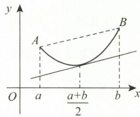

$$
f (x) \geqslant f \left(\frac {a + b}{2}\right) + f ^ {\prime} \left(\frac {a + b}{2}\right) \left(x - \frac {a + b}{2}\right).
$$

图3-13

对上式两边分别积分,得

$$
\int_ {a} ^ {b} f (x) \mathrm{d} x > f \left(\frac {a + b}{2}\right) (b - a) + f ^ {\prime} \left(\frac {a + b}{2}\right) \cdot \int_ {a} ^ {b} \left(x - \frac {a + b}{2}\right) \mathrm{d} x = f \left(\frac {a + b}{2}\right) (b - a) + 0,
$$

即

$$
f \left(\frac {a + b}{2}\right) <   \frac {1}{b - a} \int_ {a} ^ {b} f (x) \mathrm{d} x.
$$

又 AB 直线段在曲线 $y = f(x)$ 上方, 故

$$
f (x) \leqslant f (a) + \frac {f (b) - f (a)}{b - a} \cdot (x - a).
$$

对上式两边分别积分,得

$$
\int_ {a} ^ {b} f (x) \mathrm{d} x <   f (a) (b - a) + \frac {f (b) - f (a)}{b - a} \int_ {a} ^ {b} (x - a) \mathrm{d} x = \frac {f (a) + f (b)}{2} \cdot (b - a),
$$

即

$$
\frac {1}{b - a} \int_ {a} ^ {b} f (x) \mathrm{d} x <   \frac {f (a) + f (b)}{2}.
$$

综上所述,所证不等式成立.

(29) 证令 $F(x) = \int_{a}^{x} f(t) \, \mathrm{d}t$ ，则 $F(a) = 0, F(b) = 0$ . 又

$$
\int_ {a} ^ {b} x f (x) \mathrm{d} x = \int_ {a} ^ {b} x \mathrm{d} [ F (x) ] = x F (x) \Big | _ {a} ^ {b} - \int_ {a} ^ {b} F (x) \mathrm{d} x = - \int_ {a} ^ {b} F (x) \mathrm{d} x = 0,
$$

由推广的积分中值定理,得

$$
- \int_ {a} ^ {b} F (x) \mathrm{d} x = - F (\xi) (b - a) = 0 (a <   \xi <   b),
$$

故 $F(\xi)=0.$

$F(x)$ 在 $[a,\xi],[\xi,b]$ 上应用罗尔定理，有

即

$$
\begin{array}{c} {F ^ {\prime} (\xi_ {1}) = 0, F ^ {\prime} (\xi_ {2}) = 0 (a <   \xi_ {1} <   \xi , \xi <   \xi_ {2} <   b),} \\ {f (\xi_ {1}) = 0, f (\xi_ {2}) = 0.} \end{array}
$$

【注】此题也可采用反证法证明.

由已知条件存在 $\xi_{1}\in(a,b)$ ，使得 $f(\xi_{1})=0$ ，否则对 $\forall x\in(a,b),f(x)\neq0$ ，则 $f(x)$ 在 $[a,b]$ 上恒正或恒负，与 $\int_{a}^{b}f(x)\mathrm{d}x=0$ 矛盾.

又存在 $\xi_{2} \in (a, b), \xi_{2} \neq \xi_{1}$ , 使得 $f(\xi_{2}) = 0$ , 否则 $(x - \xi_{1})f(x)$ 在 $[a, \xi_{1}]$ 和 $[\xi_{1}, b]$ 上恒正或恒负, 则 $\int_{a}^{b}(x - \xi_{1})f(x)\mathrm{d}x \neq 0$ 与 $\int_{a}^{b}xf(x)\mathrm{d}x - \xi_{1}\int_{a}^{b}f(x)\mathrm{d}x = 0$ 矛盾, 故存在不同的 $\xi_{1}, \xi_{2} \in (a, b)$ , 使得 $f(\xi_{1}) = f(\xi_{2}) = 0$ .

(30) 证 (I) 依题设, 需证存在 $x_0 \in (0,1)$ , 使得 $x_0 f(x_0) = \int_{x_0}^{1} f(t) \mathrm{d}t$ .

注意到 $\left[x\int_{x}^{1}f(t)\mathrm{d}t\right]' = \int_{x}^{1}f(t)\mathrm{d}t - xf(x)$ ，令辅助函数 $F(x) = x\int_{x}^{1}f(t)\mathrm{d}t$ ，则 $F(0) = F(1) = 0.$ 由罗尔定理，知存在一点 $x_0\in (0,1)$ ，使得 $F^{\prime}(x_0) = 0$ ，即 $x_0f(x_0) = \int_{x_0}^{1}f(t)\mathrm{d}t.$

(Ⅱ) 令 $\varphi(x) = \int_{x}^{1} f(t) \, \mathrm{d}t - x f(x), x \in (0,1)$ , 则

$$
\varphi^ {\prime} (x) = - f (x) - f (x) - x f ^ {\prime} (x) = - 2 f (x) - x f ^ {\prime} (x).
$$

由已知条件 $f'(x) > -\frac{2f(x)}{x}$ ，知 $\varphi'(x) < 0$ ，即 $f(x)$ 在(0,1)内严格单调递减，故(I)中的 $x_0$ 是 $\varphi(x)$ 的唯一零点.

(31) 解（Ⅰ）由已知 $f'(1)=0$ ，即 $(a^{2}x^{2}-4ax+3)\bigg|_{x=1}=a^{2}-4a+3=0$ ，解得 a=3, a=1。又

$$
f ^ {\prime \prime} (x) = 2 a ^ {2} x - 4 a, f ^ {\prime \prime} (1) = 2 a ^ {2} - 4 a,
$$

当 $a = 3$ 时， $f''(1) = 6 > 0$ ；当 $a = 1$ 时， $f''(1) = -2 < 0$ .

由已知 $f(1)=0$ 为极小值，故 a=3 ，所以 $f'(x)=9x^{2}-12x+3$ ，于是

$$
f (x) = f (1) + \int_ {1} ^ {x} f ^ {\prime} (t) \mathrm{d} t = 0 + \int_ {1} ^ {x} (9 t ^ {2} - 1 2 t + 3) \mathrm{d} t = 3 x ^ {3} - 6 x ^ {2} + 3 x.
$$

令 $f'(x)=0$ ，得 $f(x)$ 的另一个驻点为 $x=\frac{1}{3}$ ，且 $f''\left(\frac{1}{3}\right)=-6<0$ ，所以 $f(x)$ 的极大值为 $f\left(\frac{1}{3}\right)=\frac{4}{9}$ .

证（Ⅱ）利用换元法证明.

$$
\begin{array}{r l} & {\int_ {0} ^ {1} \sqrt {f (u t)} \mathrm{d} t \xlongequal {u t = x} \int_ {0} ^ {u} \sqrt {f (x)} \bullet \frac {1}{u} \mathrm{d} x = \frac {1}{u} \int_ {0} ^ {u} \sqrt {f (x)} \mathrm{d} x} \\ & {\qquad \leqslant \frac {1}{u} \int_ {0} ^ {1} \sqrt {f (x)} \mathrm{d} x \leqslant \frac {1}{u} \int_ {0} ^ {1} \sqrt {\frac {4}{9}} \mathrm{d} x = \frac {2}{3 u}, u \in (0, 1),} \end{array}
$$

显然有 $\int_0^1\sqrt{f(ut)}\mathrm{d}t\geqslant 0$ ，故原不等式成立.

(32) 证（I）利用换元法证明.

移项得

$$
\begin{array}{r l} & {\int_ {0} ^ {n T} x f (x) \mathrm{d} x \frac {x = n T - t}{n T} n T \int_ {0} ^ {n T} f (t) \mathrm{d} t - \int_ {0} ^ {n T} t f (t) \mathrm{d} t,} \\ & {\qquad \int_ {0} ^ {n T} x f (x) \mathrm{d} x = \frac {n T}{2} \int_ {0} ^ {n T} f (x) \mathrm{d} x.} \end{array}
$$

又 $f(x + T) = f(x)$ ，且 $\int_0^{nT}f(x)\mathrm{d}x = n\int_0^T f(x)\mathrm{d}x$ ，所以

$$
\int_ {0} ^ {n T} x f (x) \mathrm{d} x = \frac {n ^ {2} T}{2} \int_ {0} ^ {T} f (x) \mathrm{d} x.
$$

解（Ⅱ）| $\cos x$ | 是以 $\pi$ 为周期的偶函数，由（Ⅰ）知

$$
\begin{array}{r l} I & = \int_ {0} ^ {n \pi} x | \cos x | \mathrm{d} x = \frac {n ^ {2} \pi}{2} \int_ {0} ^ {\pi} | \cos x | \mathrm{d} x \\ & = \frac {n ^ {2} \pi}{2} \left[ \int_ {0} ^ {\frac {\pi}{2}} \cos x \mathrm{d} x + \int_ {\frac {\pi}{2}} ^ {\pi} (- \cos x) \mathrm{d} x \right] = n ^ {2} \pi . \end{array}
$$

【注】结论:设 $f(x+T)=f(x)$ ，则

$$
\int_ {0} ^ {n T} f (x) \mathrm{d} x = n \int_ {0} ^ {T} f (x) \mathrm{d} x.
$$

证明见《2027考研数学高等数学辅导讲义》.

(33) 证 由积分中值定理,有

$$
\lim _ {a \rightarrow 0 ^ {+}} \frac {1}{4 a ^ {2}} \int_ {- a} ^ {a} [ f (t + a) - f (t - a) ] \mathrm{d} t = \lim _ {a \rightarrow 0 ^ {+}} \frac {1}{2 a} [ f (\xi + a) - f (\xi - a) ], - a \leqslant \xi \leqslant a.
$$

$f(x)$ 在 $[\xi - a, \xi + a]$ 上使用拉格朗日中值定理，

$$
f (\xi + a) - f (\xi - a) = 2 a f ^ {\prime} (\eta), \xi - a <   \eta <   \xi + a.
$$

而 $f^{\prime}(x)$ 在 $(-\infty, +\infty)$ 内连续，故

$$
\text { 原式 } = \lim _ {a \to 0 ^ {+}} f ^ {\prime} (\eta) = \lim _ {a \to 0 ^ {+}} f ^ {\prime} (\xi) = f ^ {\prime} (0).
$$

【注】此题也可利用积分换元法及洛必达法则证明,证明如下:

故

$$
\begin{array}{r l} & {\int_ {- a} ^ {a} f (t + a) \mathrm{d} t \xlongequal {t + a = u} \int_ {0} ^ {2 a} f (u) \mathrm{d} u, \int_ {- a} ^ {a} f (t - a) \mathrm{d} t \xlongequal {t - a = u} - \int_ {0} ^ {- 2 a} f (u) \mathrm{d} u,} \\ & {\qquad \text {原式} = \lim _ {a \to 0 ^ {+}} \frac {\int_ {0} ^ {2 a} f (u) \mathrm{d} u + \int_ {0} ^ {- 2 a} f (u) \mathrm{d} u}{4 a ^ {2}} = \lim _ {a \to 0 ^ {+}} \frac {2 f (2 a) - 2 f (- 2 a)}{8 a}} \\ & {\qquad = \lim _ {a \to 0 ^ {+}} \frac {2 f ^ {\prime} (2 a) + 2 f ^ {\prime} (- 2 a)}{4} = f ^ {\prime} (0).} \end{array}
$$

(34) 解 (I) $y = a\sqrt{x}, y = \ln \sqrt{x}$ 的导数分别为

$$
y ^ {\prime} = \frac {a}{2 \sqrt {x}}, y ^ {\prime} = \frac {1}{\sqrt {x}} \cdot \frac {1}{2 \sqrt {x}} = \frac {1}{2 x}.
$$

如图 3-14 所示, 由于两曲线在 $(x_{0}, y_{0})$ 处有公切线, 则

$$
\left\{ \begin{array}{l} a \sqrt {x _ {0}} = \ln \sqrt {x _ {0}}, \\ \frac {a}{2 \sqrt {x _ {0}}} = \frac {1}{2 x _ {0}}, \end{array} \right.
$$

解得 $x_{0}=e^{2}, a=e^{-1}$ ，切点为 $(e^{2},1)$ .

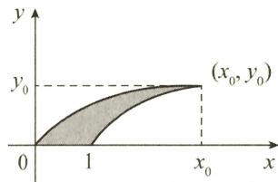

(Ⅱ)

$$
\begin{array}{r l} V & = \int_ {0} ^ {\mathrm{e} ^ {2}} \pi \left(\frac {\sqrt {x}}{\mathrm{e}}\right) ^ {2} \mathrm{d} x - \int_ {1} ^ {\mathrm{e} ^ {2}} \pi (\ln \sqrt {x}) ^ {2} \mathrm{d} x \\ & = \frac {\pi}{\mathrm{e} ^ {2}} \int_ {0} ^ {\mathrm{e} ^ {2}} x \mathrm{d} x - \frac {\pi}{4} \int_ {1} ^ {\mathrm{e} ^ {2}} (\ln x) ^ {2} \mathrm{d} x \\ & = \frac {\pi}{2} \mathrm{e} ^ {2} - \frac {\pi}{4} [ x (\ln x) ^ {2} - 2 x \ln x + 2 x ] \Bigg | _ {1} ^ {\mathrm{e} ^ {2}} \\ & = \frac {\pi}{2} \mathrm{e} ^ {2} - \frac {\pi}{2} (\mathrm{e} ^ {2} - 1) = \frac {\pi}{2}. \end{array}
$$

图3-14

(35) 解

$$
\int_ {0} ^ {2} x \sqrt {1 2 - x ^ {2} u ^ {2}} \mathrm{d} u \xlongequal {x u = t} \int_ {0} ^ {2 x} \sqrt {1 2 - t ^ {2}} \mathrm{d} t,
$$

故 $4y = \int_{0}^{2x}\sqrt{12 - t^2}\mathrm{d}t.$ 两边同时对 $x$ 求导，得

$$
y ^ {\prime} = \frac {1}{4} \sqrt {1 2 - 4 x ^ {2}} \cdot 2 = \sqrt {3 - x ^ {2}}.
$$

曲线的全长为

$$
\begin{array}{r l} s & = \int_ {0} ^ {\sqrt {3}} \sqrt {1 + y ^ {\prime 2}} \mathrm{d} x = \int_ {0} ^ {\sqrt {3}} \sqrt {4 - x ^ {2}} \mathrm{d} x \xlongequal {x = 2 \sin t} \int_ {0} ^ {\frac {\pi}{3}} \sqrt {4 - 4 \sin^ {2} t} \cdot 2 \cos t \mathrm{d} t \\ & = 4 \int_ {0} ^ {\frac {\pi}{3}} \cos^ {2} t \mathrm{d} t = 2 \left(t + \frac {1}{2} \sin 2 t\right) \Big | _ {0} ^ {\frac {\pi}{3}} = 2 \times \left(\frac {\pi}{3} + \frac {1}{2} \times \frac {\sqrt {3}}{2}\right) = \frac {2 \pi}{3} + \frac {\sqrt {3}}{2}. \end{array}
$$

(36) 解 如图 3-15 所示, D 的边界方程分别为

$$
x = 1 - \sqrt {1 - y ^ {2}}, x = y (0 \leqslant y \leqslant 1).
$$

任取 $[y, y + \mathrm{d}y] \subset [0, 1]$ ，则

故

$$
\begin{array}{r l} \mathrm{d} V & = \{\pi [ 2 - (1 - \sqrt {1 - y ^ {2}}) ] ^ {2} - \pi (2 - y) ^ {2} \} \mathrm{d} y \\ & = 2 \pi [ \sqrt {1 - y ^ {2}} - (1 - y) ^ {2} ] \mathrm{d} y, \\ V & = \int_ {0} ^ {1} 2 \pi [ \sqrt {1 - y ^ {2}} - (1 - y) ^ {2} ] \mathrm{d} y \\ & = 2 \pi \left[ \frac {y}{2} \sqrt {1 - y ^ {2}} + \frac {1}{2} \arcsin y + \frac {1}{3} (1 - y) ^ {3} \right] \Bigg | _ {0} ^ {1} \\ & = 2 \pi \left(\frac {\pi}{4} - \frac {1}{3}\right). \end{array}
$$

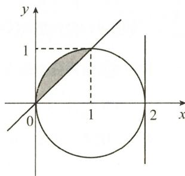  
图3-15

【注】此题也可以如下计算：

$$
V = 2 \pi \int_ {0} ^ {1} \sqrt {1 - y ^ {2}} \mathrm{d} y + 2 \pi \int_ {0} ^ {1} (1 - y) ^ {2} \mathrm{d} (1 - y) = 2 \pi \left(\frac {\pi}{4} - \frac {1}{3}\right).
$$

(37) 解 先求 $f(x)=\mathrm{e}^{-x}\sqrt{\sin x}(x\geqslant0)$ 的定义域.

由 $\sin x \geqslant 0$ ，知 $x \in [2k\pi, (2k+1)\pi] (k = 0, 1, 2, \cdots)$ ，如图 3-16 所示.

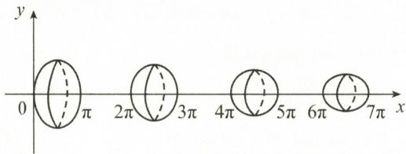  
图3-16

则所求体积为

$$
\begin{array}{r l} V & = \sum_ {k = 0} ^ {\infty} \pi \int_ {2 k \pi} ^ {(2 k + 1) \pi} \mathrm{e} ^ {- 2 x} \sin x   \mathrm{d} x \xlongequal {x = t + 2 k \pi} \sum_ {k = 0} ^ {\infty} \pi \int_ {0} ^ {\pi} \mathrm{e} ^ {- 2 (2 k \pi + t)} \sin t   \mathrm{d} t \\ & = \sum_ {k = 0} ^ {\infty} \pi \mathrm{e} ^ {- 4 k \pi} \int_ {0} ^ {\pi} \mathrm{e} ^ {- 2 t} \sin t   \mathrm{d} t = \frac {\pi (1 + \mathrm{e} ^ {- 2 \pi})}{5} \cdot \sum_ {k = 0} ^ {\infty} \mathrm{e} ^ {- 4 k \pi} (\text {等比级数求和}) \\ & = \frac {\pi (1 + \mathrm{e} ^ {- 2 \pi})}{5} \cdot \frac {1}{1 - \mathrm{e} ^ {- 4 \pi}} = \frac {\pi}{5 (1 - \mathrm{e} ^ {- 2 \pi})}. \end{array}
$$

(38) 解（I）如图 3-17 所示，

$$
\begin{array}{r l} V _ {x} & = \pi \int_ {0} ^ {2 \pi a} y ^ {2} \mathrm{d} x = \pi \int_ {0} ^ {2 \pi} a ^ {2} (1 - \cos t) ^ {2} \cdot a (1 - \cos t) \mathrm{d} t \\ & = \pi a ^ {3} \int_ {0} ^ {2 \pi} (1 - \cos t) ^ {3} \mathrm{d} t = 8 \pi a ^ {3} \int_ {0} ^ {2 \pi} \sin^ {6} \frac {t}{2} \mathrm{d} t \\ & = 3 2 \pi a ^ {3} \int_ {0} ^ {\frac {\pi}{2}} \sin^ {6} u \mathrm{d} u = 5 \pi^ {2} a ^ {3}, \end{array}
$$

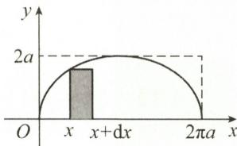  
图3-17

$$
\begin{array}{r l} V _ {y} & = 2 \pi \int_ {0} ^ {2 \pi a} x y \mathrm{d} x = 2 \pi \int_ {0} ^ {2 \pi} a ^ {3} (t - \sin t) (1 - \cos t) ^ {2} \mathrm{d} t \\ & = 2 \pi a ^ {3} \int_ {0} ^ {2 \pi} (t - 2 t \cos t + t \cos^ {2} t - \sin t + 2 \sin t \cos t - \sin t \cos^ {2} t) \mathrm{d} t = 6 \pi^ {3} a ^ {3}. \end{array}
$$

(Ⅱ)

$$
\begin{array}{r l} V _ {y = 2 a} & = \pi (2 a) ^ {2} \cdot 2 \pi a - \int_ {0} ^ {2 \pi a} \pi (2 a - y) ^ {2} \mathrm{d} x = 8 \pi^ {2} a ^ {3} - \pi \int_ {0} ^ {2 \pi} [ 2 a - a (1 - \cos t) ] ^ {2} \cdot a (1 - \cos t) \mathrm{d} t \\ & = 8 \pi^ {2} a ^ {3} - \pi a ^ {3} \int_ {0} ^ {2 \pi} (1 + \cos t) ^ {2} (1 - \cos t) \mathrm{d} t \\ & = 8 \pi^ {2} a ^ {3} - \pi a ^ {3} \int_ {0} ^ {2 \pi} \sin^ {2} t (1 + \cos t) \mathrm{d} t = 7 \pi^ {2} a ^ {3}. \end{array}
$$

(39) 解 $(x - 2)^{2} + y^{2} = 1$ 的参数方程为

$$
\left\{ \begin{array}{l l} x = 2 + \cos t, \\ y = \sin t, \end{array} \right. 0 \leqslant t \leqslant 2 \pi ,
$$

所求表面积为

$$
\begin{array}{r l} S & = 2 \pi \int_ {0} ^ {2 \pi} x (t) \sqrt {x ^ {\prime 2} (t) + y ^ {\prime 2} (t)} \mathrm{d} t \\ & = 2 \pi \int_ {0} ^ {2 \pi} (2 + \cos t) \sqrt {(- \sin t) ^ {2} + \cos^ {2} t} \mathrm{d} t \\ & = 2 \pi \int_ {0} ^ {2 \pi} (2 + \cos t) \mathrm{d} t = 8 \pi^ {2}. \end{array}
$$

【注】此题不宜用直角坐标下的公式求解. 公式如下：

$$
S _ {\text {侧}} = \int_ {c} ^ {d} 2 \pi \varphi (y) \sqrt {1 + \varphi^ {\prime 2} (y)} \mathrm{d} y.
$$

(40) 解 双纽线如图 3-18 所示, 由对称性, 考虑 $\theta \in \left[0, \frac{\pi}{4}\right]$ , 则

$$
S _ {\text {侧}} = 2 \times 2 \pi \times \int_ {0} ^ {\frac {\pi}{4}} r (\theta) \sin \theta \sqrt {r ^ {2} (\theta) + r ^ {' 2} (\theta)}   \mathrm{d} \theta .
$$

由 $r^{2}=a^{2}\cos2\theta$ ，得 $2r\cdot r^{\prime}=-2a^{2}\sin2\theta$ ，故

$$
r ^ {\prime} = - \frac {a ^ {2} \sin 2 \theta}{r},
$$

$$
\begin{array}{r l} r ^ {2} + r ^ {\prime 2} & = \frac {r ^ {2} \bullet a ^ {2} \cos 2 \theta}{r ^ {2}} + \frac {a ^ {4} \sin^ {2} 2 \theta}{r ^ {2}} \\ & = \frac {a ^ {4} \cos^ {2} 2 \theta}{r ^ {2}} + \frac {a ^ {4} \sin^ {2} 2 \theta}{r ^ {2}} = \frac {a ^ {4}}{r ^ {2}}, \end{array}
$$

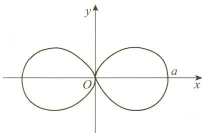

故

$$
\begin{array}{r l} S _ {\text {侧}} & = 4 \pi \int_ {0} ^ {\frac {\pi}{4}} r \sin \theta \bullet \frac {a ^ {2}}{r} \mathrm{d} \theta \\ & = 4 \pi a ^ {2} (- \cos \theta) \Big | _ {0} ^ {\frac {\pi}{4}} \\ & = 4 \pi a ^ {2} \Big (1 - \frac {\sqrt {2}}{2} \Big). \\ & = 2 \pi a ^ {2} (2 - \sqrt {2}). \end{array}
$$

图3-18

【注】 $S_{侧}=2\pi\int_{a}^{b}y\cdot\sqrt{1+y^{\prime2}}dx.$

(41) 解 平面区域 D 如图 3-19 所示.

$$
\begin{array}{r l} V & = 2 \pi \int_ {0} ^ {1} x \left(\sqrt {1 - x ^ {2}} - \frac {1 - x}{1 + x}\right) \mathrm{d} x \\ & = 2 \pi \left(\int_ {0} ^ {1} x \sqrt {1 - x ^ {2}}   \mathrm{d} x - \int_ {0} ^ {1} \frac {x - x ^ {2}}{1 + x} \mathrm{d} x\right) \\ & = 2 \pi \left[ - \frac {1}{2} \int_ {0} ^ {1} (1 - x ^ {2}) ^ {\frac {1}{2}} \mathrm{d} (1 - x ^ {2}) - \int_ {0} ^ {1} \left(- x + \frac {2 x}{1 + x}\right) \mathrm{d} x \right] \\ & = 2 \pi \left[ - \frac {1}{2} \cdot \frac {2}{3} (1 - x ^ {2}) ^ {\frac {3}{2}} \bigg | _ {0} ^ {1} + \int_ {0} ^ {1} x   \mathrm{d} x - \int_ {0} ^ {1} \frac {2 x}{1 + x} \mathrm{d} x \right] \\ & = 2 \pi \left[ \frac {1}{3} + \frac {1}{2} - 2 (1 - \ln 2) \right] \\ & = 2 \pi \left(2 \ln 2 - \frac {7}{6}\right). \end{array}
$$

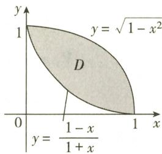  
图3-19

(42) 解 由已知得

$$
\begin{array}{r l} & {V _ {n} = \pi \int_ {0} ^ {\frac {\pi}{2}} \left(\sin^ {\frac {n}{2}} x\right) ^ {2} \mathrm{d} x = \pi \int_ {0} ^ {\frac {\pi}{2}} \sin^ {n} x \mathrm{d} x,} \\ & {\pi S _ {n} = \pi \int_ {0} ^ {1} x ^ {n} \sqrt {1 - x ^ {2}} \mathrm{d} x \xlongequal {x = \sin t} \pi \int_ {0} ^ {\frac {\pi}{2}} \sin^ {n} t \cdot \cos^ {2} t \mathrm{d} t} \\ & {\qquad = \pi \int_ {0} ^ {\frac {\pi}{2}} \sin^ {n} t \mathrm{d} t - \pi \int_ {0} ^ {\frac {\pi}{2}} \sin^ {n + 2} t \mathrm{d} t = V _ {n} - V _ {n + 2},} \end{array}
$$

而

$$
\begin{array}{r l} V _ {n + 2} & = \pi \int_ {0} ^ {\frac {\pi}{2}} \sin^ {n + 2} t \mathrm{d} t = - \pi \int_ {0} ^ {\frac {\pi}{2}} \sin^ {n + 1} t \mathrm{d} (\cos t) \\ & = - \pi \left[ \cos t \cdot \sin^ {n + 1} t \Big | _ {0} ^ {\frac {\pi}{2}} - \int_ {0} ^ {\frac {\pi}{2}} \cos t \cdot (n + 1) \sin^ {n} t \cdot \cos t \mathrm{d} t \right] \\ & = \pi (n + 1) \int_ {0} ^ {\frac {\pi}{2}} \sin^ {n} t \cdot (1 - \sin^ {2} t) \mathrm{d} t = (n + 1) V _ {n} - (n + 1) V _ {n + 2}, \end{array}
$$

整理得 $V_{n+2}=\frac{n+1}{n+2}V_{n}$ ，所以

故

$$
\begin{array}{r l}\pi S _ {n}&= V _ {n} - V _ {n + 2} = V _ {n} - \frac {n + 1}{n + 2} V _ {n} = \frac {1}{n + 2} V _ {n}.\\&\lim _ {n \rightarrow \infty} \frac {\pi S _ {n}}{V _ {n}} = \lim _ {n \rightarrow \infty} \frac {1}{n + 2} = 0.\end{array}
$$

(43) 解 (I) 当 $x \geqslant 0$ 时, $f(x) = \lim_{t \to +\infty} \frac{x}{1 + x^2 - e^{tx}} = 0$ .

当 $x < 0$ 时，

$f(x) = \lim_{t\to +\infty}\frac{x}{1 + x^2 - \mathrm{e}^{tx}} = \frac{x}{1 + x^2},$ 即 $f(x) = \left\{ \begin{array}{ll}0, & x\geqslant 0,\\ \frac{x}{1 + x^2}, & x <   0. \end{array} \right.$

可求得 $y = f(x)$ 与 $y = \frac{1}{2}x$ 的交点为 $\left(-1, -\frac{1}{2}\right), (0, 0)$ .

如图 3-20 所示, 则 D 的面积为

$$
\begin{array}{r l} A & = \int_ {- 1} ^ {0} \left(\frac {1}{2} x - \frac {x}{1 + x ^ {2}}\right) \mathrm{d} x + \frac {1}{2} \times \frac {1}{2} \times 1 \\ & = \frac {1}{4} + \left[ \frac {1}{4} x ^ {2} - \frac {1}{2} \ln (1 + x ^ {2}) \right] \Bigg | _ {- 1} ^ {0} = \frac {1}{2} \ln 2. \end{array}
$$

（Ⅱ）图中 $x \geqslant 0$ 部分绕 x 轴旋转为圆锥体，其体积为

$$
V _ {1} = \frac {1}{3} \pi \left(\frac {1}{2}\right) ^ {2} \cdot 1 = \frac {\pi}{1 2}.
$$

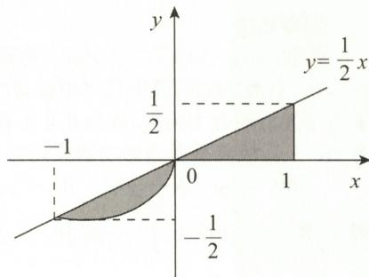

图中 $x \leqslant 0$ 部分绕 x 轴旋转所得体积为

$$
V _ {2} = \int_ {- 1} ^ {0} \pi y ^ {2} \mathrm{d} x - \frac {1}{3} \pi \left(\frac {1}{2}\right) ^ {2} \cdot 1 = \pi \int_ {- 1} ^ {0} \frac {x ^ {2}}{(1 + x ^ {2}) ^ {2}} \mathrm{d} x - \frac {\pi}{1 2}.
$$

图3-20

故所求体积为

$$
\begin{array}{r l} & {V = V _ {1} + V _ {2} = \frac {\pi}{1 2} + \pi \int_ {- 1} ^ {0} \frac {x ^ {2}}{(1 + x ^ {2}) ^ {2}} \mathrm{d} x - \frac {\pi}{1 2} = \pi \int_ {- 1} ^ {0} \frac {x ^ {2}}{(1 + x ^ {2}) ^ {2}} \mathrm{d} x} \\ & {\quad = \pi \left[ \int_ {- 1} ^ {0} \frac {1}{1 + x ^ {2}} \mathrm{d} x - \int_ {- 1} ^ {0} \frac {1}{(1 + x ^ {2}) ^ {2}} \mathrm{d} x \right]} \\ & {\quad = \pi \left[ \arctan x \Big | _ {- 1} ^ {0} - \int_ {- 1} ^ {0} \frac {1}{(1 + x ^ {2}) ^ {2}} \mathrm{d} x \right]} \\ & {\quad = \pi \left[ 0 - \left(- \frac {\pi}{4}\right) - \int_ {- 1} ^ {0} \frac {1}{(1 + x ^ {2}) ^ {2}} \mathrm{d} x \right].} \end{array}
$$

又

$$
\begin{array}{r l} & \int_ {- 1} ^ {0} \frac {\mathrm{d} x}{(1 + x ^ {2}) ^ {2}} \xlongequal {x = \tan u} \int_ {- \frac {\pi}{4}} ^ {0} \frac {\sec^ {2} u}{(1 + \tan^ {2} u) ^ {2}} \mathrm{d} u = \int_ {- \frac {\pi}{4}} ^ {0} \frac {1}{\sec^ {2} u} \mathrm{d} u \\ & \qquad = \int_ {- \frac {\pi}{4}} ^ {0} \cos^ {2} u \mathrm{d} u = \frac {1}{2} \int_ {- \frac {\pi}{4}} ^ {0} (1 + \cos 2 u) \mathrm{d} u \\ & \qquad = \frac {1}{2} \Big (u + \frac {1}{2} \sin 2 u \Big) \Big | _ {- \frac {\pi}{4}} ^ {0} = \frac {1}{2} \Big (\frac {\pi}{4} + \frac {1}{2} \Big), \end{array}
$$

故 $V = \frac{\pi^{2}}{8} - \frac{\pi}{4}.$

(44) 解 (I)

$$
\begin{array}{r l} a _ {n} & = 2 \pi \int_ {0} ^ {n \pi} x | \sin x | \mathrm{d} x \\ & \xlongequal {x = n \pi - t} 2 \pi \int_ {0} ^ {n \pi} (n \pi - t) | \sin (n \pi - t) | \mathrm{d} t \\ & = 2 n \pi^ {2} \int_ {0} ^ {n \pi} | \sin t | \mathrm{d} t - a _ {n}, \end{array}
$$

移项可得

(Ⅱ) 由(Ⅰ)知

$$
a _ {n} = n \pi^ {2} \int_ {0} ^ {n \pi} | \sin t | \mathrm{d} t = n ^ {2} \pi^ {2} \int_ {0} ^ {\pi} \sin t \mathrm{d} t = 2 n ^ {2} \pi^ {2}.
$$

$$
\begin{array}{r l} \lim _ {n \to \infty} \sum_ {k = 1} ^ {n} \frac {2 k \pi^ {2}}{a _ {n}} \sin \frac {k \pi}{2 n} & = \lim _ {n \to \infty} \sum_ {k = 1} ^ {n} \frac {k}{n ^ {2}} \sin \frac {k \pi}{2 n} \\ & = \frac {4}{\pi^ {2}} \lim _ {n \to \infty} \sum_ {k = 1} ^ {n} \left[ \frac {k \left(\frac {\pi}{2} - 0\right)}{n} \sin \frac {k \left(\frac {\pi}{2} - 0\right)}{n} \right] \cdot \frac {\frac {\pi}{2} - 0}{n} \\ & = \frac {4}{\pi^ {2}} \int_ {0} ^ {\frac {\pi}{2}} x \sin x   d x \\ & = - \frac {4}{\pi^ {2}} \left(x \cos x \Big | _ {0} ^ {\frac {\pi}{2}} - \int_ {0} ^ {\frac {\pi}{2}} \cos x   d x\right) = \frac {4}{\pi^ {2}}. \end{array}
$$

(45) 解 建立如图 3-21 所示的坐标系, 圆的方程为

$$
x ^ {2} + (y - R) ^ {2} = R ^ {2}.
$$

用微元法.

任取 $[y,y+dy]\subset[0,2R]$ ，将球从水中取出恰好离开水面时，薄片 $[y,y+dy]$ 行程为2R，其中在水中移动的距离为y，由于球与水的密度相等，所以重力与浮力的合力为零，故球在水中移动所做功为零；在水面以上移动的距离为2R-y，故克服重力做功的微元为

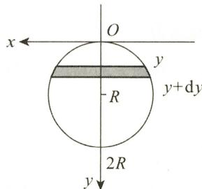

$$
\mathrm{d} W = \rho g (2 R - y) \pi x ^ {2} \mathrm{d} y = \rho g \pi (2 R - y) [ R ^ {2} - (y - R) ^ {2} ] \mathrm{d} y,
$$

图3-21

则 $W = \int_{0}^{2R}\mathrm{d}W = \int_{0}^{2R}\rho g\pi (2R - y)[R^2 -(y - R)^2 ]\mathrm{d}y = \frac{4}{3}\pi \rho gR^4.$

(46) 解 如图 3-22(a) 所示, 直线 AC 的方程为 $y = \frac{b(h - x)}{h}$ .

用微元法. 任取 $[x, x + \mathrm{d}x] \subset [0, h]$ , 则 $\mathrm{d}P_{1} = 2\rho gxy\mathrm{d}x = \frac{2\rho gb}{h}(h - x)x\mathrm{d}x$ , 故

$$
P _ {1} = \int_ {0} ^ {h} \mathrm{d} P _ {1} = \int_ {0} ^ {h} {\frac {2 \rho g b}{h}} (h - x) x   \mathrm{d} x = {\frac {1}{3}} \rho g b h ^ {2}.
$$

如图3-22(b)所示，直线 $OA$ 方程为 $y = \frac{bx}{h}$ ，则 $\mathrm{d}P_{2} = 2\rho gxy\mathrm{d}x = \frac{2\rho gb}{h} x^{2}\mathrm{d}x$ ，故

$$
P _ {2} = \int_ {0} ^ {h} \mathrm{d} P _ {2} = \int_ {0} ^ {h} \rho g \frac {2 b}{h} x ^ {2} \mathrm{d} x = \frac {2}{3} \rho g b h ^ {2}.
$$

所以 $\frac{P_{2}}{P_{1}}=2$ ，即 $P_{2}=2P_{1}$ .

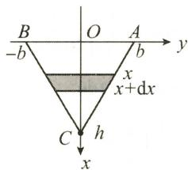  
(a)

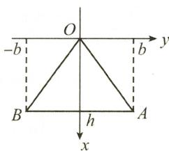  
(b)  
图3-22

(47) 解（I）曲线 L 的参数方程为

$$
\left\{ \begin{array}{l} x = r \cos \theta = (1 + \cos \theta) \cos \theta , \\ y = r \sin \theta = (1 + \cos \theta) \sin \theta , \end{array} \right.
$$

则

$$
\frac {\mathrm{d} y}{\mathrm{d} x} = \frac {y ^ {\prime} (\theta)}{x ^ {\prime} (\theta)} = \frac {\cos \theta + \cos 2 \theta}{- \sin \theta - \sin 2 \theta}, \left. \frac {\mathrm{d} y}{\mathrm{d} x} \right| _ {\theta = \frac {\pi}{4}} = 1 - \sqrt {2}.
$$

当 $\theta = \frac{\pi}{4}$ 时，有 $x = \frac{1}{2} (1 + \sqrt{2}), y = \frac{1}{2} (1 + \sqrt{2})$ ，故切线 $T$ 的方程为

$$
y - \frac {1}{2} (1 + \sqrt {2}) = (1 - \sqrt {2}) \left[ x - \frac {1}{2} (1 + \sqrt {2}) \right],
$$

即

$$
y = (1 - \sqrt {2}) x + 1 + \frac {\sqrt {2}}{2}.
$$

（Ⅱ）所围图形为如图 3-23 所示的阴影部分. 曲边三角形 AOP 的面积为

$$
\begin{array}{r l} A _ {1} & = \frac {1}{2} \int_ {0} ^ {\frac {\pi}{4}} r ^ {2} (\theta) \mathrm{d} \theta = \frac {1}{2} \int_ {0} ^ {\frac {\pi}{4}} (1 + \cos \theta) ^ {2} \mathrm{d} \theta \\ & = \frac {1}{2} \int_ {0} ^ {\frac {\pi}{4}} \left(\frac {3}{2} + 2 \cos \theta + \frac {1}{2} \cos 2 \theta\right) \mathrm{d} \theta \\ & = \frac {1}{2} \left(\frac {3}{2} \theta + 2 \sin \theta + \frac {1}{4} \sin 2 \theta\right) \Big | _ {0} ^ {\frac {\pi}{4}} \\ & = \frac {3}{1 6} \pi + \frac {1}{8} + \frac {\sqrt {2}}{2}. \end{array}
$$

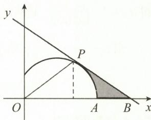  
图3-23

由（I）知，切线的方程为 $y = (1 - \sqrt{2})x + 1 + \frac{\sqrt{2}}{2}$ . 令 $y = 0$ ，得 $x$ 轴上截距为 $x = 2 + \frac{3}{2}\sqrt{2}$ ，故所求面积为

$$
\begin{array}{r l} S & = \frac {1}{2} \times \left(2 + \frac {3}{2} \sqrt {2}\right) \times \frac {1 + \sqrt {2}}{2} - \left(\frac {3 \pi}{1 6} + \frac {1}{8} + \frac {\sqrt {2}}{2}\right) \\ & = \frac {9}{8} - \frac {3 \pi}{1 6} + \frac {3 \sqrt {2}}{8}. \end{array}
$$

(48) 解 曲线的图形如图 3-24 所示.

由已知及对称性,只需考虑 $x \in [0,2]$ 的情况,

$$
y = 3 - \left| x ^ {2} - 1 \right| = \left\{ \begin{array}{l l} x ^ {2} + 2, & 0 \leqslant x \leqslant 1, \\ 4 - x ^ {2}, & 1 <   x \leqslant 2. \end{array} \right.
$$

则

用微元法.任取 $[x,x + \mathrm{d}x]\subset [0,1],[0,1]$ 上体积记为 $V_{1},[1,2]$ 上体积记为 $V_{2}$

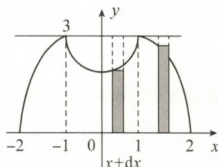

$$
\mathrm{d} V _ {1} = \pi \left\{3 ^ {2} - \left[ 3 - (x ^ {2} + 2) \right] ^ {2} \right\} \mathrm{d} x.
$$

图3-24

同理， $\mathrm{d}V_{2} = \pi \{3^{2} - [3 - (4 - x^{2})]^{2}\} \mathrm{d}x$ ，故

$$
V = 2 (V _ {1} + V _ {2}) = 2 \pi \int_ {0} ^ {1} (8 + 2 x ^ {2} - x ^ {4}) \mathrm{d} x + 2 \pi \int_ {1} ^ {2} (8 + 2 x ^ {2} - x ^ {4}) \mathrm{d} x = \frac {4 4 8 \pi}{1 5}.
$$

(49) 解 心形线 $r = 4(1 + \cos \theta)$ 的参数方程为

$$
\left\{ \begin{array}{l} x = 4 (1 + \cos \theta) \cos \theta , \\ y = 4 (1 + \cos \theta) \sin \theta . \end{array} \right.
$$

心形线的图形如图 3-25 所示, 则

$$
\begin{array}{r l} V & = \int_ {0} ^ {8} \pi y ^ {2} \mathrm{d} x \\ & = \int_ {\frac {\pi}{2}} ^ {0} \pi \cdot 1 6 (1 + \cos \theta) ^ {2} \sin^ {2} \theta \cdot 4 (- \sin \theta - 2 \sin \theta \cos \theta) \mathrm{d} \theta \\ & = 6 4 \pi \int_ {0} ^ {\frac {\pi}{2}} (1 + \cos \theta) ^ {2} \sin^ {3} \theta (1 + 2 \cos \theta) \mathrm{d} \theta = 1 6 0 \pi . \end{array}
$$

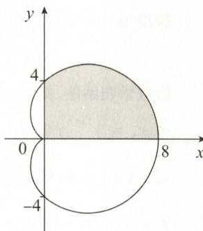  
图3-25

【注】极坐标下计算旋转体体积:先将极坐标方程化为参数方程,再用直角坐标下公式计算.

(50) 解（Ⅰ）依题设，有

$$
\begin{array}{r l} S (\alpha) & = \int_ {2} ^ {+ \infty} \frac {\mathrm{d} x}{x (\ln x) ^ {\alpha + 1}} = \int_ {2} ^ {+ \infty} (\ln x) ^ {- \alpha - 1} \mathrm{d} (\ln x) \\ & = - \frac {1}{\alpha} (\ln x) ^ {- \alpha} \Big | _ {2} ^ {+ \infty} = \frac {1}{\alpha (\ln 2) ^ {\alpha}}. \end{array}
$$

(Ⅱ) 令 $f(\alpha) = \alpha (\ln 2)^{\alpha}$ , 则由

$$
f ^ {\prime} (\alpha) = (\ln 2) ^ {\alpha} + \alpha \cdot (\ln 2) ^ {\alpha} \cdot \ln (\ln 2) = (\ln 2) ^ {\alpha} [ 1 + \alpha \ln (\ln 2) ] = 0,
$$

得 $\alpha_0 = -\frac{1}{\ln(\ln 2)}$ 是唯一驻点.

当 $\alpha < -\frac{1}{\ln(\ln 2)}$ 时， $f'(\alpha) > 0$ ；当 $\alpha > -\frac{1}{\ln(\ln 2)}$ 时， $f'(\alpha) < 0$ 。故

$$
f (\alpha_ {0}) = - \frac {1}{\ln (\ln 2)} (\ln 2) ^ {- \frac {1}{\ln (\ln 2)}} = - \frac {1}{\ln (\ln 2)} \cdot \frac {1}{(\ln 2) ^ {\frac {1}{\ln (\ln 2)}}} \text {为最大值，}
$$

$S(\alpha)$ 的最小值为

$$
\frac {1}{f (\alpha_ {0})} = - \ln (\ln 2) \cdot (\ln 2) ^ {\frac {1}{\ln (\ln 2)}}.
$$

(51) 证（Ⅰ）当 $x \in (0,1)$ 时，由 $f(x)$ 单调递减，有

$$
\int_ {0} ^ {x} f (t) \mathrm{d} t <   \int_ {0} ^ {x} f (0) \mathrm{d} t = x f (0).
$$

令 $g(x) = \frac{\int_{0}^{x}f(t)\mathrm{d}t}{x}$ ，则有

$$
\begin{array}{r l} g ^ {\prime} (x) & = \frac {x f (x) - \int_ {0} ^ {x} f (t) \mathrm{d} t}{x ^ {2}} = \frac {x f (x) - x f (\xi)}{x ^ {2}} \\ & = \frac {x [ f (x) - f (\xi) ]}{x ^ {2}} <   0, 0 <   \xi <   x. \end{array}
$$

故 $g(x)$ 单调递减,从而有

$$
g (x) = \frac {\int_ {0} ^ {x} f (t) \mathrm{d} t}{x} > g (1) = \frac {\int_ {0} ^ {1} f (t) \mathrm{d} t}{1}, \text {即} x \int_ {0} ^ {1} f (t) \mathrm{d} t <   \int_ {0} ^ {x} f (t) \mathrm{d} t.
$$

(Ⅱ) 先证明 $x_{n} \in (0,1)$ .

当 n = 1 时, 由(Ⅰ)知

$$
0 \leqslant x _ {0} \int_ {0} ^ {1} f (t) \mathrm{d} t <   x _ {1} = \int_ {0} ^ {x _ {0}} f (t) \mathrm{d} t <   x _ {0} f (0) \leqslant x _ {0} <   1.
$$

假设当 $n = k$ 时，有 $x_{k}\in (0,1)$ ，则当 $n = k + 1$ 时，

$$
0 \leqslant x _ {k} \int_ {0} ^ {1} f (t) \mathrm{d} t <   x _ {k + 1} = \int_ {0} ^ {x _ {k}} f (t) \mathrm{d} t <   x _ {k} f (0) \leqslant x _ {k} <   1.
$$

由数学归纳法,知 $x_{n} \in (0,1)$ .

由 $x_{n} = \int_{0}^{x_{n - 1}}f(t)\mathrm{d}t <   x_{n - 1}f(0)\leqslant x_{n - 1}$ ，知 $\{x_{n}\}$ 单调递减，故 $\lim_{n\to \infty}x_n$ 存在

记 $\lim_{n\to \infty}x_n = a$ ，则 $a\geqslant 0.$ 由 $x_{n} = \int_{0}^{x_{n - 1}}f(t)\mathrm{d}t$ ，有 $a = \int_0^a f(t)\mathrm{d}t.$

若 $a \in (0,1)$ , 则 $a = \int_{0}^{a} f(t) \mathrm{d}t < af(0) \leqslant a$ (矛盾), 故 $a = 0$ , 即 $\lim_{n \to \infty} x_n = 0$ .

(52) 解 由 $r = 3 \cos \theta$ ，知 $r^{2} = 3r \cos \theta$ ，其在直角坐标下为 $x^{2} + y^{2} = 3x$ .
此图形为一个圆周，如图 3-26 所示.

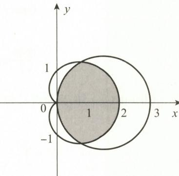

解方程组 $\left\{ \begin{array}{l} r = 1 + \cos \theta, \\ r = 3\cos \theta, \end{array} \right.$ 得 $\theta = \frac{\pi}{3}$ , 故所围公共部分图形的面积为 $A = 2\left[\frac{1}{2}\int_{0}^{\frac{\pi}{3}}(1 + \cos \theta)^{2}\mathrm{d}\theta +\frac{1}{2}\int_{\frac{\pi}{3}}^{\frac{\pi}{2}}9\cos^{2}\theta \mathrm{d}\theta \right]$ $= \int_0^{\frac{\pi}{3}}(1 + \cos \theta)^2\mathrm{d}\theta +\int_{\frac{\pi}{3}}^{\frac{\pi}{2}}9\cos^2\theta \mathrm{d}\theta$ $= \int_0^{\frac{\pi}{3}}\left(\frac{3}{2} +2\cos \theta +\frac{1}{2}\cos 2\theta\right)\mathrm{d}\theta +\frac{9}{2}\int_{\frac{\pi}{3}}^{\frac{\pi}{2}}(1 + \cos 2\theta)\mathrm{d}\theta$ $= \left(\frac{3}{2}\theta +2\sin \theta +\frac{1}{4}\sin 2\theta\right)\Big|_{0}^{\frac{\pi}{3}} + \frac{9}{2}\Big(\theta +\frac{1}{2}\sin 2\theta \Big)\Big|_{\frac{\pi}{3}}^{\frac{\pi}{2}} = \frac{5}{4}\pi .$

图3-26

(53) 解（I）曲线 L 如图 3-27 所示. 由 $y = \tan x^{2} \left(0 \leqslant x \leqslant \frac{\sqrt{\pi}}{2}\right)$ ，得

故

$$
\begin{array}{r l} x & = \sqrt {\arctan y}, 0 \leqslant y \leqslant 1, \\ V & = \pi \int_ {0} ^ {1} x ^ {2} (y) \mathrm{d} y = \pi \int_ {0} ^ {1} \arctan y \mathrm{d} y \\ & = \pi y \arctan y \Big | _ {0} ^ {1} - \pi \int_ {0} ^ {1} \frac {y}{1 + y ^ {2}} \mathrm{d} y \\ & = \frac {\pi^ {2}}{4} - \frac {\pi}{2} \ln (1 + y ^ {2}) \Big | _ {0} ^ {1} \\ & = \frac {\pi^ {2}}{4} - \frac {\pi}{2} \ln 2. \end{array}
$$

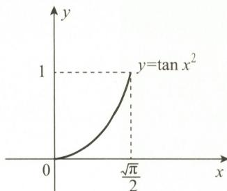  
图3-27

证（Ⅱ）由于

且

$$
\begin{array}{r l} W & = \rho g \pi \int_ {0} ^ {1} (1 - y) \arctan y \mathrm{d} y = \pi \rho g \left(\frac {\pi}{4} - \frac {\ln 2}{2} - \int_ {0} ^ {1} y \arctan y \mathrm{d} y\right), \\ & \int_ {0} ^ {1} y \arctan y \mathrm{d} y = \frac {y ^ {2}}{2} \arctan y \Big | _ {0} ^ {1} - \frac {1}{2} \int_ {0} ^ {1} \frac {y ^ {2}}{1 + y ^ {2}} \mathrm{d} y \\ & = \frac {\pi}{8} - \frac {1}{2} \int_ {0} ^ {1} \left(1 - \frac {1}{1 + y ^ {2}}\right) \mathrm{d} y \\ & = \frac {\pi}{8} - \frac {1}{2} (y - \arctan y) \Big | _ {0} ^ {1} = \frac {\pi}{4} - \frac {1}{2}, \end{array}
$$

故 $W = \frac{\pi \rho g}{2} (1 - \ln 2)$ .

(54) 解（I）依题设，杆 AB 与质点如图 3-28 所示.

根据对称性,引力 F 是沿 y 轴负向的.杆 AB 的线密度为 $\frac{m}{l}$ ,位于 $[x,x+\mathrm{d}x]$ 上微元的质量为 $\frac{m}{l}\mathrm{d}x$ .它与质点 C 的引力在 y 轴方向的分力为

$$
\mathrm{d} F = G \frac {1 \cdot m \mathrm{d} x}{l (x ^ {2} + a ^ {2})} \cdot \frac {a}{\sqrt {x ^ {2} + a ^ {2}}},
$$

故引力为

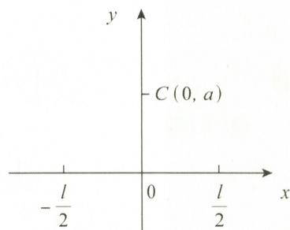  
图3-28

$$
\begin{array}{r l} F & = \frac {G m a}{l} \int_ {- \frac {l}{2}} ^ {\frac {l}{2}} \frac {\mathrm{d} x}{(x ^ {2} + a ^ {2}) ^ {\frac {3}{2}}} \frac {x = a \tan t}{\text {   }} \frac {2 G m a}{l} \int_ {0} ^ {\arctan \frac {l}{2 a}} \frac {a \sec^ {2} t}{a ^ {3} \sec^ {3} t} \mathrm{d} t \\ & = \frac {2 G m}{a l} \sin \Big (\arctan \frac {l}{2 a} \Big) = \frac {2 G m}{a \sqrt {4 a ^ {2} + l ^ {2}}} (G \text {为引力常数}). \end{array}
$$

（Ⅱ）由（Ⅰ）知，当质点 C 位于 $(0, y)$ 处时，引力的大小为 $\frac{2Gm}{y\sqrt{4y^{2}+l^{2}}}$ ，故

$$
\begin{array}{r l} W & = \int_ {a} ^ {+ \infty} \frac {2 G m}{y \sqrt {4 y ^ {2} + l ^ {2}}} \mathrm{d} y \xlongequal {\frac {l}{y} = x} \frac {2 G m}{l} \int_ {0} ^ {\frac {l}{a}} \frac {\mathrm{d} x}{\sqrt {4 + x ^ {2}}} \\ & = \frac {2 G m}{l} \ln (x + \sqrt {4 + x ^ {2}}) \Big | _ {0} ^ {\frac {l}{a}} = \frac {2 G m}{l} \ln \frac {\sqrt {4 a ^ {2} + l ^ {2}} + l}{2 a}. \end{array}
$$

(55) 解 (Ⅰ) 令 $F(x) = \int_{0}^{x} f(t) \, \mathrm{d}t - \frac{1}{2} [xf(x) + x]$ ，则有 $F(0) = 0$ .

只要证明 $F(x)\geqslant 0(x\in [0,1])$ 即可.利用单调性证明.当 $x\in (0,1)$ 时，有

$$
\begin{array}{r l} F ^ {\prime} (x) & = f (x) - \frac {1}{2} [ f (x) + x f ^ {\prime} (x) + 1 ] \\ & = \frac {1}{2} [ f (x) - 1 ] - \frac {1}{2} x f ^ {\prime} (x) \\ & = \frac {1}{2} [ f (x) - f (0) ] - \frac {1}{2} x f ^ {\prime} (x) \\ & = \frac {1}{2} x f ^ {\prime} (\xi) - \frac {1}{2} x f ^ {\prime} (x) \\ & = \frac {1}{2} x [ f ^ {\prime} (\xi) - f ^ {\prime} (x) ] (0 <   \xi <   x). \end{array}
$$

由 $f''(x)<0$ ，知 $f'(x)$ 单调递减，故 $f'(\xi)>f'(x)$ ，从而 $F'(x)>0$ ，所以 $F(x)$ 单调递增。又 $F(0)=0$ ，故 $F(x)\geqslant F(0)=0$ ，所以不等式成立。

（Ⅱ）所证不等式 $\int_0^1\left(\frac{2}{3} -x\right)f(x)\mathrm{d}x\geqslant \frac{1}{6}$ 变形为

$$
\int_ {0} ^ {1} f (x) \mathrm{d} x - \frac {3}{2} \int_ {0} ^ {1} x f (x) \mathrm{d} x \geqslant \frac {1}{4},
$$

应用分部积分法,有

$$
\begin{array}{r l} \int_ {0} ^ {1} x f (x) \mathrm{d} x & = \int_ {0} ^ {1} x \mathrm{d} \left[ \int_ {0} ^ {x} f (t) \mathrm{d} t \right] \\ & = x \int_ {0} ^ {x} f (t) \mathrm{d} t \Big | _ {0} ^ {1} - \int_ {0} ^ {1} \left[ \int_ {0} ^ {x} f (t) \mathrm{d} t \right] \mathrm{d} x \\ & = \int_ {0} ^ {1} f (x) \mathrm{d} x - \int_ {0} ^ {1} \left[ \int_ {0} ^ {x} f (t) \mathrm{d} t \right] \mathrm{d} x, \end{array}
$$

即

$$
\int_ {0} ^ {1} f (x) \mathrm{d} x - \int_ {0} ^ {1} x f (x) \mathrm{d} x = \int_ {0} ^ {1} \left[ \int_ {0} ^ {x} f (t) \mathrm{d} t \right] \mathrm{d} x.
$$

由（I）知

$$
\begin{array}{r l} \int_ {0} ^ {1} \left[ \int_ {0} ^ {x} f (t) \mathrm{d} t \right] \mathrm{d} x & \geqslant \int_ {0} ^ {1} \frac {1}{2} \Big [ x f (x) + x \Big ] \mathrm{d} x \\ & = \frac {1}{2} \int_ {0} ^ {1} x f (x) \mathrm{d} x + \frac {1}{2} \int_ {0} ^ {1} x \mathrm{d} x \\ & = \frac {1}{2} \int_ {0} ^ {1} x f (x) \mathrm{d} x + \frac {1}{4}, \end{array}
$$

故

即

所以

$$
\begin{array}{r l} & {\int_ {0} ^ {1} f (x) \mathrm{d} x - \int_ {0} ^ {1} x f (x) \mathrm{d} x \geqslant \frac {1}{2} \int_ {0} ^ {1} x f (x) \mathrm{d} x + \frac {1}{4},} \\ & {\qquad \int_ {0} ^ {1} f (x) \mathrm{d} x - \frac {3}{2} \int_ {0} ^ {1} x f (x) \mathrm{d} x \geqslant \frac {1}{4},} \\ & {\qquad \int_ {0} ^ {1} \left(\frac {2}{3} - x\right) f (x) \mathrm{d} x \geqslant \frac {1}{6}.} \end{array}
$$

## 拓展题

解答题

(1) 解 用微元法求 $V(t)$ .

任取 $[x,x+\mathrm{d}x]\subset[0,t]$ ，如图3-29所示，则 $\mathrm{d}V=2\pi(t-x)f(x)\mathrm{d}x$ .

由于 $V(t)=\int_{0}^{t}2\pi(t-x)f(x)\mathrm{d}x$ ,

$$
\begin{array}{r l} V ^ {\prime} (t) & = 2 \pi \left[ t \int_ {0} ^ {t} f (x) \mathrm{d} x - \int_ {0} ^ {t} x f (x) \mathrm{d} x \right] ^ {\prime} \\ & = 2 \pi \left[ \int_ {0} ^ {t} f (x) \mathrm{d} x + t f (t) - t f (t) \right] \\ & = 2 \pi \int_ {0} ^ {t} f (x) \mathrm{d} x = 2 \pi S (t) = 2 \pi t \mathrm{e} ^ {t}, \\ V (t) & = 2 \pi \int t \mathrm{e} ^ {t} \mathrm{d} t = 2 \pi (t - 1) \mathrm{e} ^ {t} + C. \end{array}
$$

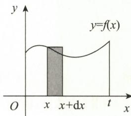  
图3-29

故

又由 $V(0)=0$ ，得 $C=2\pi$ ，由此可知 $V(t)=2\pi(t-1)\mathrm{e}^{t}+2\pi.$

$$
\begin{array}{r l} (I) V & = 4 \cdot 2 \int_ {- 1} ^ {y} 2 \sqrt {1 - y ^ {2}} \mathrm{d} y \xlongequal {y = \sin t} 1 6 \int_ {- \frac {\pi}{2}} ^ {\arcsin y} \cos^ {2} t \mathrm{d} t \\ & = 8 \arcsin y + 8 y \sqrt {1 - y ^ {2}} + 4 \pi (\mathrm{m} ^ {3}). \end{array}
$$

（Ⅱ）由于 $\frac{\mathrm{d}V}{\mathrm{d}t} = \frac{\mathrm{d}V}{\mathrm{d}y}\cdot \frac{\mathrm{d}y}{\mathrm{d}t} = 16\sqrt{1 - y^2}\cdot \frac{\mathrm{d}y}{\mathrm{d}t}$ 故

$$
\left. \frac {\mathrm{d} y}{\mathrm{d} t} \right| _ {y = 0} = \frac {1}{1 6 \sqrt {1 - y ^ {2}}} \cdot \left. \frac {\mathrm{d} V}{\mathrm{d} t} \right| _ {y = 0} = \frac {1}{1 6} \times 0. 1 6 = 0. 0 1 (\mathrm{m/min}).
$$

$$
\begin{array}{r l} W & = 4 \rho g \int_ {- 1} ^ {1} 4 \sqrt {1 - y ^ {2}} \cdot (1 - y) \mathrm{d} y = 4 \rho g \left(\int_ {- 1} ^ {1} 4 \sqrt {1 - y ^ {2}} \mathrm{d} y - \int_ {- 1} ^ {1} 4 \sqrt {1 - y ^ {2}} \cdot y \mathrm{d} y\right) \\ & = 4 \rho g \int_ {- 1} ^ {1} 4 \sqrt {1 - y ^ {2}} \mathrm{d} y - 0 = 8 \rho g \pi (\mathrm{J}). \end{array}
$$

(3) 证 先证 $f(x) > 0$ .

由 $f(a)=f(b)=0$ 及罗尔定理，知存在 $x_{0}\in(a,b)$ ，使得 $f'(x_{0})=0$ 。由 $f''(x)<0$ ，知 $f'(x)$ 单调递减，则当 $x\in(a,x_{0})$ 时， $f'(x)>f'(x_{0})=0$ ，即 $f(x)$ 单调递增，故 $f(x)>f(a)=0$ ；当 $x\in(x_{0},b)$ 时， $f'(x)<f'(x_{0})=0$ ，即 $f(x)$ 单调递减，故 $f(x)>f(b)=0$ 。

综上所述，当 $x\in(a,b)$ 时， $f(x)>0$ .

再证 $f(x) < \frac{2}{b - a}\int_{a}^{b}f(x)\mathrm{d}x.$

应用泰勒公式, 将 $f(x)$ 在 $x = t \in (a, b)$ 处展开, 有

$f(x) = f(t) + f'(t)(x - t) + \frac{f''(\xi)}{2!} (x - t)^2,\xi$ 介于 $x$ 与 $t$ 之间.

由 $f''(x) < 0$ ，知 $f''(\xi) < 0$ ，故

$$
f (x) <   f (t) + f ^ {\prime} (t) (x - t).
$$

在 $[a,b]$ 上，上式两边同时对t积分，得

$$
\int_ {a} ^ {b} f (x) \mathrm{d} t <   \int_ {a} ^ {b} f (t) \mathrm{d} t + \int_ {a} ^ {b} f ^ {\prime} (t) (x - t) \mathrm{d} t,
$$

即

$$
(b - a) f (x) <   \int_ {a} ^ {b} f (t) \mathrm{d} t + (x - t) f (t) \Big | _ {a} ^ {b} + \int_ {a} ^ {b} f (t) \mathrm{d} t, = 2 \int_ {a} ^ {b} f (t) \mathrm{d} t,
$$

故 $f(x) < \frac{2}{b - a}\int_{a}^{b}f(x)\mathrm{d}x.$ 所证不等式成立.

$$
\begin{array}{r l} \text {证(I)} \int_ {a} ^ {b} (x - a) (x - b) f ^ {\prime \prime} (x) \mathrm{d} x & = \int_ {a} ^ {b} (x - a) (x - b) \mathrm{d} f ^ {\prime} (x) \\ & = (x - a) (x - b) f ^ {\prime} (x) \Big | _ {a} ^ {b} - \int_ {a} ^ {b} (2 x - a - b) f ^ {\prime} (x) \mathrm{d} x \\ & = \int_ {a} ^ {b} (a + b - 2 x) f ^ {\prime} (x) \mathrm{d} x = \int_ {a} ^ {b} (a + b - 2 x) \mathrm{d} f (x) \\ & = (a + b - 2 x) f (x) \Big | _ {a} ^ {b} + 2 \int_ {a} ^ {b} f (x) \mathrm{d} x \\ & = (a - b) [ f (a) + f (b) ] + 2 \int_ {a} ^ {b} f (x) \mathrm{d} x, \end{array}
$$

故

$$
\int_ {a} ^ {b} f (x) \mathrm{d} x = \frac {1}{2} (b - a) [ f (a) + f (b) ] + \frac {1}{2} \int_ {a} ^ {b} (x - a) (x - b) f ^ {\prime \prime} (x) \mathrm{d} x.
$$

(Ⅱ) 方法一: 由(Ⅰ)有

$$
\begin{array}{r l} \left| \int_ {a} ^ {b} f (x) \mathrm{d} x - \frac {1}{2} (b - a) [ f (a) + f (b) ] \right| & = \left| \frac {1}{2} \int_ {a} ^ {b} (x - a) (x - b) f ^ {\prime \prime} (x) \mathrm{d} x \right| \\ & \leqslant \frac {1}{2} \int_ {a} ^ {b} | x - a | | x - b | | f ^ {\prime \prime} (x) | \mathrm{d} x \\ & \leqslant \frac {M}{2} \int_ {a} ^ {b} (x - a) (b - x) \mathrm{d} x = \frac {M}{4} \int_ {a} ^ {b} (b - x) \mathrm{d} (x - a) ^ {2} \\ & = \frac {M}{4} \left[ (b - x) (x - a) ^ {2} \Big | _ {a} ^ {b} + \int_ {a} ^ {b} (x - a) ^ {2} \mathrm{d} x \right] \\ & = \frac {M}{4} \cdot \frac {1}{3} (x - a) ^ {3} \Big | _ {a} ^ {b} = \frac {M}{4} \cdot \frac {1}{3} (b - a) ^ {3} = \frac {(b - a) ^ {3}}{1 2} M. \end{array}
$$

方法二: 应用泰勒公式证明.

将 $f(u)$ 在 $x \in (a, b)$ 处展开，再代入端点 $u = a$ 和 $u = b$ ，有

$$
f (a) = f (x) + f ^ {\prime} (x) (a - x) + \frac {f ^ {\prime \prime} (\xi_ {1})}{2 !} (a - x) ^ {2}, \xi_ {1} \in (a, x);\tag{①}
$$

$$
f (b) = f (x) + f ^ {\prime} (x) (b - x) + \frac {f ^ {\prime \prime} (\xi_ {2})}{2 !} (b - x) ^ {2}, \xi_ {2} \in (x, b).\tag{②}
$$

由 ① + ②, 得

$$
f (a) + f (b) = 2 f (x) + f ^ {\prime} (x) (a + b - 2 x) + \frac {1}{2} f ^ {\prime \prime} (\xi_ {1}) (a - x) ^ {2} + \frac {1}{2} f ^ {\prime \prime} (\xi_ {2}) (b - x) ^ {2}.
$$

上式两边从 a 到 b 积分, 得

$$
\begin{array}{r l} \int_ {a} ^ {b} [ f (a) + f (b) ] \mathrm{d} x & = 2 \int_ {a} ^ {b} f (x) \mathrm{d} x + \int_ {a} ^ {b} (a + b - 2 x) f ^ {\prime} (x) \mathrm{d} x + \\ & \frac {1}{2} \int_ {a} ^ {b} [ f ^ {\prime \prime} (\xi_ {1}) (a - x) ^ {2} + f ^ {\prime \prime} (\xi_ {2}) (b - x) ^ {2} ] \mathrm{d} x \end{array}\tag{③}
$$

而

$$
\int_ {a} ^ {b} [ f (a) + f (b) ] \mathrm{d} x = (b - a) [ f (a) + f (b) ],
$$

$$
\begin{array}{r l} \int_ {a} ^ {b} (a + b - 2 x) f ^ {\prime} (x) \mathrm{d} x & = \int_ {a} ^ {b} (a + b - 2 x) \mathrm{d} f (x) \\ & = (a + b - 2 x) f (x) \Big | _ {a} ^ {b} + 2 \int_ {a} ^ {b} f (x) \mathrm{d} x \end{array}
$$

$$
= (a - b) [ f (a) + f (b) ] + 2 \int_ {a} ^ {b} f (x) \mathrm{d} x,
$$

将其代入 ③ 式, 整理可得

$$
\begin{array}{r l} \left| \int_ {a} ^ {b} f (x) \mathrm{d} x - \frac {1}{2} (b - a) [ f (a) + f (b) ] \right| & = \frac {1}{8} \left| \int_ {a} ^ {b} [ f ^ {\prime \prime} (\xi_ {1}) (a - x) ^ {2} + f ^ {\prime \prime} (\xi_ {2}) (b - x) ^ {2} ] \mathrm{d} x \right| \\ & \leqslant \frac {1}{8} \left[ \int_ {a} ^ {b} | f ^ {\prime \prime} (\xi_ {1}) | (a - x) ^ {2} \mathrm{d} x + \int_ {a} ^ {b} | f ^ {\prime \prime} (\xi_ {2}) | (b - x) ^ {2} \mathrm{d} x \right] \\ & \leqslant \frac {M}{8} \left[ \int_ {a} ^ {b} (a - x) ^ {2} \mathrm{d} x + \int_ {a} ^ {b} (b - x) ^ {2} \mathrm{d} x \right] \\ & = \frac {M}{8} \cdot \frac {2}{3} (b - a) ^ {3} = \frac {(b - a) ^ {3}}{1 2} M. \end{array}
$$

【注】若 $f(x)\geqslant 0$ ，则

$$
\left| \int_ {a} ^ {b} f (x) \mathrm{d} x - \frac {1}{2} (b - a) [ f (a) + f (b) ] \right| \leqslant \frac {(b - a) ^ {3}}{1 2} M,
$$

可看作用梯形的面积 $\frac{1}{2} (b - a)[f(a) + f(b)]$ 作为 $\int_{a}^{b}f(x)\mathrm{d}x$ 的近似值，其绝对误差不超过 $\frac{(b - a)^3}{12} M.$

(5) 解 (I) 对 $\forall x \in [0,1], f(u)$ 在点 $x$ 处的泰勒展开式为

$f(u) = f(x) + f'(x)(u - x) + \frac{f''(\xi)}{2!} (u - x)^2,\xi$ 介于 $x$ 与 $u$ 之间.

代入端点 u = 1, u = 0, 有

$$
1 = f (1) = f (x) + f ^ {\prime} (x) (1 - x) + \frac {1}{2} f ^ {\prime \prime} (\xi_ {1}) (1 - x) ^ {2}, \xi_ {1}
$$

$$
1 = f (0) = f (x) + f ^ {\prime} (x) (0 - x) + \frac {1}{2} f ^ {\prime \prime} (\xi_ {2}) (0 - x) ^ {2},   \xi_ {2}   \text {介于}   0   \text {与}   x   \text {之间}.
$$

①—②，得

$$
f ^ {\prime} (x) = - \frac {1}{2} \Big [ f ^ {\prime \prime} (\xi_ {1}) (1 - x) ^ {2} - f ^ {\prime \prime} (\xi_ {2}) x ^ {2} \Big ].
$$

当 $x = 0$ 或 $x = 1$ 时，有

$$
\mid f ^ {\prime} (0) \mid = \frac {1}{2} \mid f ^ {\prime \prime} (\xi_ {1}) \mid \leqslant \frac {1}{2} M,
$$

$$
\mid f ^ {\prime} (1) \mid = \frac {1}{2} \mid f ^ {\prime \prime} (\xi_ {2}) \mid \leqslant \frac {1}{2} M.
$$

当 $x \in (0,1)$ 时，有

$$
\mid f ^ {\prime} (x) \mid \leqslant \frac {1}{2} \Big [ \mid f ^ {\prime \prime} (\xi_ {1}) \mid (1 - x) ^ {2} + \mid f ^ {\prime \prime} (\xi_ {2}) \mid x ^ {2} \Big ].
$$

令 $|f''(\xi)| = \max \left\{ |f''(\xi_1)|, |f''(\xi_2)| \right\}, \xi \in (0,1)$ ，则

$$
\mid f ^ {\prime} (x) \mid \leqslant \frac {1}{2} \mid f ^ {\prime \prime} (\xi) \mid \left[ (1 - x) ^ {2} + x ^ {2} \right] \leqslant \frac {1}{2} \mid f ^ {\prime \prime} (\xi) \mid \leqslant \frac {1}{2} M.
$$

综上所述，当 $x \in [0,1]$ 时，所证不等式成立.

(Ⅱ) $f(x)$ 在 $\left[0,\frac{1}{2}\right]$ 与 $\left[\frac{1}{2},1\right]$ 上分别应用拉格朗日中值定理，有

$$
f (x) = f (0) + f ^ {\prime} (\xi_ {1}) x = 1 + x f ^ {\prime} (\xi_ {1}), 0 <   \xi_ {1} <   x \leqslant \frac {1}{2};
$$

$$
f (x) = f (1) + (x - 1) f ^ {\prime} (\xi_ {2}) = 1 + (x - 1) f ^ {\prime} (\xi_ {2}), \frac {1}{2} \leqslant x <   \xi_ {2} <   1.
$$

由（I）知， $|f'(x)| \leqslant \frac{1}{2} M$ ，故

$$
\mid f (x) \mid = \mid 1 + x f ^ {\prime} (\xi_ {1}) \mid \leqslant 1 + \frac {1}{2} M x, x \in \left[ 0, \frac {1}{2} \right];
$$

$$
\mid f (x) \mid = \mid 1 + (x - 1) f ^ {\prime} (\xi_ {2}) \mid \leqslant 1 + \frac {1}{2} M (1 - x), x \in \left[ \frac {1}{2}, 1 \right].
$$

则

$$
\begin{array}{r l} & {\left| \int_ {0} ^ {1} f (x) \mathrm{d} x \right| \leqslant \int_ {0} ^ {\frac {1}{2}} | f (x) | \mathrm{d} x + \int_ {\frac {1}{2}} ^ {1} | f (x) | \mathrm{d} x} \\ & {\quad \leqslant \int_ {0} ^ {\frac {1}{2}} \left(1 + \frac {1}{2} M x\right) \mathrm{d} x + \int_ {\frac {1}{2}} ^ {1} \left[ 1 + \frac {1}{2} M (1 - x) \right] \mathrm{d} x} \\ & {\quad = \frac {1}{2} + \frac {1}{2} M \cdot \frac {1}{2} x ^ {2} \bigg | _ {0} ^ {\frac {1}{2}} + \frac {1}{2} - \frac {1}{2} M \cdot \frac {1}{2} (x - 1) ^ {2} \bigg | _ {\frac {1}{2}} ^ {1}} \\ & {\quad = 1 + \frac {1}{8} M.} \end{array}
$$

(6) 解 (I) $f(x)$ 在 $x = \frac{1}{2}$ 处的泰勒展开式为

$f(x)=f\left(\frac{1}{2}\right)+f'\left(\frac{1}{2}\right)\left(x-\frac{1}{2}\right)+\frac{f''(\xi)}{2!}\left(x-\frac{1}{2}\right)^{2},\xi$ 介于 $\frac{1}{2}$ 与 x 之间.

①

①式两边积分,有

$$
\begin{array}{r l} \int_ {0} ^ {1} f (x) \mathrm{d} x & = \int_ {0} ^ {1} f \left(\frac {1}{2}\right) \mathrm{d} x + \int_ {0} ^ {1} f ^ {\prime} \left(\frac {1}{2}\right) \left(x - \frac {1}{2}\right) \mathrm{d} x + \int_ {0} ^ {1} \frac {f ^ {\prime \prime} (\xi)}{2} \left(x - \frac {1}{2}\right) ^ {2} \mathrm{d} x \\ & = f \left(\frac {1}{2}\right) + 0 + \int_ {0} ^ {1} \frac {f ^ {\prime \prime} (\xi)}{2} \left(x - \frac {1}{2}\right) ^ {2} \mathrm{d} x, \end{array}
$$

其中

$$
\int_ {0} ^ {1} f ^ {\prime} \left(\frac {1}{2}\right) \left(x - \frac {1}{2}\right) \mathrm{d} x = \frac {1}{2} f ^ {\prime} \left(\frac {1}{2}\right) \left(x - \frac {1}{2}\right) ^ {2} \Bigg | _ {0} ^ {1} = 0.
$$

故

$$
\left| \int_ {0} ^ {1} f (x) \mathrm{d} x - f \left(\frac {1}{2}\right) \right| = \left| \int_ {0} ^ {1} \frac {f ^ {\prime \prime} (\xi)}{2} \left(x - \frac {1}{2}\right) ^ {2} \mathrm{d} x \right| \leqslant \frac {1}{2} \int_ {0} ^ {1} \left(x - \frac {1}{2}\right) ^ {2} \mathrm{d} x = \frac {1}{2 4}.
$$

(Ⅱ) 由 $f(x)=f(x+1)$ ，知 $f'(x)=f'(x+1)$ .

当 $x = 0$ 时，有 $f(0) = f(1), f'(0) = f'(1)$ ，且 $\int_0^n f(x) \, \mathrm{d}x = n\int_0^1 f(x) \, \mathrm{d}x$ .

利用泰勒公式, 将 $f(x)$ 在 x = 0 与 x = 1 处分别展开, 得

$$
f (x) = f (0) + f ^ {\prime} (0) x + \frac {f ^ {\prime \prime} (\xi_ {1})}{2 !} x ^ {2},   \xi_ {1}   \text {介于}   0   \text {与}   x   \text {之间};
$$

$$
f (x) = f (1) + f ^ {\prime} (1) (x - 1) + \frac {f ^ {\prime \prime} (\xi_ {2})}{2 !} (x - 1) ^ {2},   \xi_ {2}   \text {介于}   1   \text {与}   x   \text {之间}.
$$

上边两式积分,得

$$
\int_ {0} ^ {1} f (x) \mathrm{d} x = f (0) + \frac {1}{2} f ^ {\prime} (0) + \frac {1}{2} \int_ {0} ^ {1} f ^ {\prime \prime} (\xi_ {1}) x ^ {2} \mathrm{d} x,\tag{①}
$$

$$
\int_ {0} ^ {1} f (x) \mathrm{d} x = f (1) - \frac {1}{2} f ^ {\prime} (1) + \frac {1}{2} \int_ {0} ^ {1} f ^ {\prime \prime} (\xi_ {2}) (x - 1) ^ {2} \mathrm{d} x.\tag{②}
$$

①+②,得

$$
\begin{array}{r l} 2 \int_ {0} ^ {1} f (x) \mathrm{d} x & = f (0) + f (1) + \frac {1}{2} \left[ \int_ {0} ^ {1} f ^ {\prime \prime} (\xi_ {1}) x ^ {2} \mathrm{d} x + \int_ {0} ^ {1} f ^ {\prime \prime} (\xi_ {2}) (x - 1) ^ {2} \mathrm{d} x \right], \\ \left| \int_ {0} ^ {1} f (x) \mathrm{d} x \right| & \leqslant \frac {1}{2} (| f (0) | + | f (1) |) + \frac {1}{4} \left[ \int_ {0} ^ {1} | f ^ {\prime \prime} (\xi_ {1}) | x ^ {2} \mathrm{d} x + \int_ {0} ^ {1} | f ^ {\prime \prime} (\xi_ {2}) | (x - 1) ^ {2} \mathrm{d} x \right] \\ & \leqslant | f (0) | + \frac {1}{4} \left[ \int_ {0} ^ {1} x ^ {2} \mathrm{d} x + \int_ {0} ^ {1} (x - 1) ^ {2} \mathrm{d} x \right] \\ & = | f (0) | + \frac {1}{4} \left[ \frac {1}{3} x ^ {3} \Big | _ {0} ^ {1} + \frac {1}{3} (x - 1) ^ {3} \Big | _ {0} ^ {1} \right] \\ & = | f (0) | + \frac {1}{4} \left(\frac {1}{3} + \frac {1}{3}\right) = | f (0) | + \frac {1}{6}. \\ & \left| \int_ {0} ^ {n} f (x) \mathrm{d} x \right| = n \left| \int_ {0} ^ {1} f (x) \mathrm{d} x \right| \leqslant n \left[ \frac {1}{6} + | f (0) | \right]. \end{array}
$$

所以

## 第四章 多元函数微分学及其应用

## 基础题

## 一、选择题

(1)B.

解

$f_{x}^{\prime}(0,0) = \lim_{x\to 0}\frac{f(x,0) - f(0,0)}{x} = \lim_{x\to 0}\frac{\arcsin|x|}{x} = \lim_{x\to 0}\frac{|x|}{x},$ 不存在.

$f_{y}^{\prime}(0,0) = \lim_{y\to 0}\frac{f(0,y) - f(0,0)}{y} = \lim_{y\to 0}\frac{\arcsin y^{2}}{y} = \lim_{y\to 0}\frac{y^{2}}{y} = 0,$ 存在.

选项 B 正确.

(2)C.

解 $f(x,y)$ 在某点偏导数存在不一定在该点连续(排除选项B)，也不能推得 $\lim_{\substack{x\to x_0\\ y\to y_0}}f(x,y)$ 存在.

例如:设

$$
f (x, y) = \left\{ \begin{array}{l l} \frac {x y}{x ^ {2} + y ^ {2}}, & (x, y) \neq (0, 0), \\ 0, & (x, y) = (0, 0), \end{array} \right.
$$

可知 $f_{x}^{\prime}(0,0), f_{y}^{\prime}(0,0)$ 都存在，但 $\lim_{x \to 0} f(x, y)$ 不存在。排除选项A.

由 $f_{x}^{\prime}(x_0,y_0) = \lim_{x\to x_0}\frac{f(x,y_0) - f(x_0,y_0)}{x - x_0}$ 存在，只能推得当固定 $y = y_0$ 时， $f(x,y)$ 在 $x_0$ 的邻域内有定义.而 $\mathring{U}(x_0,y_0) = \{(x,y)\mid 0 <   \sqrt{(x - x_0)^2 + (y - y_0)^2} <  \delta \}$ 是圆域，故选项D不正确.

由 $f_{x}^{\prime}(x_0,y_0) = \lim_{x\to x_0}\frac{f(x,y_0) - f(x_0,y_0)}{x - x_0}$ 存在，知 $\lim_{x\to x_0}f(x,y_0) = f(x_0,y_0)$ . 选项C正确.

(3) B.

解 依题设,有

$$
f _ {x} ^ {\prime} (0, 0) = \lim _ {x \to 0} \frac {f (x , 0) - f (0 , 0)}{x} = \lim _ {x \to 0} \frac {0 - 0}{x} = 0.
$$

同理, $f_{y}^{\prime}(0,0)=0.$

当 $x^{2} + y^{2}\neq 0$ 时，有

$$
f _ {x} ^ {\prime} (x, y) = \frac {2 x (y ^ {4} - y ^ {2})}{(x ^ {2} + y ^ {4}) ^ {2}} \sin (x y ^ {2}) + \frac {(x ^ {2} + y ^ {2}) y ^ {2}}{x ^ {2} + y ^ {4}} \cos (x y ^ {2}).
$$

故

$$
f _ {x y} ^ {\prime \prime} (0, 0) = \lim _ {y \to 0} \frac {f _ {x} ^ {\prime} (0 , y) - f _ {x} ^ {\prime} (0 , 0)}{y} = \lim _ {y \to 0} \frac {1}{y}   \text {不存在}.
$$

当 $x^{2} + y^{2}\neq 0$ 时，有

$$
f _ {y} ^ {\prime} (x, y) = \frac {2 y \left(x ^ {2} + y ^ {4}\right) - \left(x ^ {2} + y ^ {2}\right) 4 y ^ {3}}{\left(x ^ {2} + y ^ {4}\right) ^ {2}} \sin \left(x y ^ {2}\right) + \frac {\left(x ^ {2} + y ^ {2}\right) 2 x y}{x ^ {2} + y ^ {4}} \cos \left(x y ^ {2}\right).
$$

故

$$
f _ {y x} ^ {\prime \prime} (0, 0) = \lim _ {x \to 0} \frac {f _ {y} ^ {\prime} (x , 0) - f _ {y} ^ {\prime} (0 , 0)}{x} = \lim _ {x \to 0} \frac {0}{x} = 0.
$$

选项 B 正确.

(4)D.

解 当 $y \neq 0$ 时，

$$
f _ {x} ^ {\prime} (0, y) = \lim _ {\Delta x \to 0} \frac {f (0 + \Delta x , y) - f (0 , y)}{\Delta x} = \lim _ {\Delta x \to 0} \frac {\sqrt {| y \cdot \Delta x |}}{\Delta x}   \text {不存在}.
$$

选项 D 正确.

由已知，有

$$
f (x, y) = \left\{ \begin{array}{l l} \sqrt {x | y |}, & (x, y) \in D _ {1} = \{(x, y) | x > 0, y \in \mathbf {R} \}, \\ \sqrt {- x | y |}, & (x, y) \in D _ {2} = \{(x, y) | x <   0, y \in \mathbf {R} \}, \\ 0, & (x, y) \in D _ {3} = \{(x, y) | x = 0, y \in \mathbf {R} \}. \end{array} \right.
$$

当 $(x,y)\in D_1$ ，即 $x > 0,y\in \mathbf{R}$ 时，

$$
f _ {x} ^ {\prime} (x, y) = \frac {\partial}{\partial x} (\sqrt {x | y |}) = \frac {1}{2} \sqrt {\left| \frac {y}{x} \right|};
$$

同理，当 $x < 0, y \in \mathbf{R}$ 时，

$$
f _ {x} ^ {\prime} (x, y) = \frac {\partial}{\partial x} (\sqrt {- x | y |}) = - \frac {1}{2} \sqrt {\left| \frac {y}{x} \right|}.
$$

可排除选项 A, B.

(5)D.

解

$$
\begin{array}{r l}\frac {\mathrm{d} z}{\mathrm{d} t} \Big | _ {t = 0}&= \lim _ {t \rightarrow 0} \frac {2 \tan t | \ln (1 + t) |}{\sqrt {\tan^ {2} t + [ \ln (1 + t) ] ^ {2}}} \cdot \frac {1}{t} = \lim _ {t \rightarrow 0} \frac {2 | \ln (1 + t) |}{\sqrt {\tan^ {2} t + [ \ln (1 + t) ] ^ {2}}}\\&= \lim _ {t \rightarrow 0} \frac {2}{\sqrt {\left[ \frac {\tan t}{\ln (1 + t)} \right] ^ {2} + 1}} = \frac {2}{\sqrt {2}} = \sqrt {2}.\end{array}
$$

选项D正确.

【注】 $f(x,y)$ 在点(0,0)处不可微，以下计算是错误的，由于 $f_{x}^{\prime}(0,0)=f_{y}^{\prime}(0,0)=0$ ，所以

$$
\left. \frac {\mathrm{d} z}{\mathrm{d} t} \right| _ {t = 0} = \left[ f _ {x} ^ {\prime} (0, 0) (\tan t) ^ {\prime} + f _ {y} ^ {\prime} (0, 0) \frac {1}{1 + t} \right] \Bigg | _ {t = 0} = 0 + 0 = 0.
$$

(6)C.

解 令 $F(x,y,z)=xy-z\ln y+e^{xz}-1$ ，则 $F(0,1,1)=0$ .

$F(x,y,z)$ 对 x,y,z 分别求偏导, 得

$$
F _ {x} ^ {\prime} = y + \mathrm{e} ^ {x z} \cdot z, F _ {y} ^ {\prime} = x - \frac {z}{y}, F _ {z} ^ {\prime} = - \ln y + \mathrm{e} ^ {x z} \cdot x,
$$

故

$$
F _ {x} ^ {\prime} (0, 1, 1) = 2 \neq 0, F _ {y} ^ {\prime} (0, 1, 1) = - 1 \neq 0, F _ {z} ^ {\prime} (0, 1, 1) = 0.
$$

根据隐函数存在定理, 知 $F(x,y,z)=0$ 在点 $(0,1,1)$ 的某个邻域内能确定隐函数 $x=x(y,z)$ 和 $y=y(x,z)$ , 故选项 C 正确.

(7)C.

解 由已知, $f(x,y)$ 在点 $P(x_{0},y_{0})$ 处取得极大值,由极值的必要条件,知

$$
f _ {x} ^ {\prime} (x _ {0}, y _ {0}) = f _ {y} ^ {\prime} (x _ {0}, y _ {0}) = 0.
$$

选项 C 正确.

(8)A.

解由

$$
\left\{ \begin{array}{l} f _ {x} ^ {\prime} = \mathrm{e} ^ {2 x} (2 x + 2 y ^ {2} + 4 y + 1) = 0, \\ f _ {y} ^ {\prime} = \mathrm{e} ^ {2 x} (2 y + 2) = 0, \end{array} \right.
$$

得驻点 $P\left(\frac{1}{2}, - 1\right)$ .由于 $A = f_{xx}^{\prime \prime}(P) = 2\mathrm{e},B = f_{xy}^{\prime \prime}(P) = 0,C = f_{yy}^{\prime \prime}(P) = 2\mathrm{e}$ ，故

$$
A C - B ^ {2} = 2 \mathrm{e} \cdot 2 \mathrm{e} - 0 > 0, A = 2 \mathrm{e} > 0.
$$

所以 $f\left(\frac{1}{2}, - 1\right) = -\frac{\mathrm{e}}{2}$ 为极小值.选项A正确

(9)D.

解 $f_{x}^{\prime} = \frac{\mathrm{e}^{x}(x - y) - \mathrm{e}^{x}}{(x - y)^{2}}, f_{y}^{\prime} = \frac{\mathrm{e}^{x}}{(x - y)^{2}}$ ，故 $f_{x}^{\prime} + f_{y}^{\prime} = \frac{\mathrm{e}^{x}}{x - y} = f$ . 选项 D 正确.

## 二、填空题

(1) $\frac{2}{3}\ln2.$

解 由于函数在点(3,0)处连续,故极限存在,且

$$
\lim_{\substack{x\to 3\\ y\to 0}}\frac{\ln(x + \mathrm{e}^{y})}{\sqrt{x^{2} + y^{2}}} = \frac{\ln(3 + \mathrm{e}^{0})}{\sqrt{3^{2} + 0^{2}}} = \frac{2}{3}\ln 2.
$$

(2)0.

解 利用不等式 $x^{2}+y^{2}\geqslant2\mid xy$ 求解.

由于当 $x \to \infty, y \to \infty$ 时，有

$$
0 \leqslant \left| \frac {x + y}{x ^ {2} - x y + y ^ {2}} \right| \leqslant \frac {| x | + | y |}{| x y |} = \frac {1}{| x |} + \frac {1}{| y |} \rightarrow 0,
$$

故

$\lim_{\substack{x\to\infty\\ y\to\infty}}\left|\frac{x+y}{x^{2}-xy+y^{2}}\right|=0$ ，原极限=0.

(3) $e^{-\frac{1}{2}}$ .

解

$$
\lim_{\substack{x\to \infty \\ y\to 0}}\left(1 - \frac{1}{2x}\right)^{\frac{x^{2}}{x + y}} = \lim_{\substack{x\to \infty \\ y\to 0}}\left[\left(1 - \frac{1}{2x}\right)^{-2x}\right]^{\frac{x}{x + y}\cdot \left(-\frac{1}{2}\right)} = \mathrm{e}^{-\frac{1}{2}}.
$$

(4) $dx + (1 + 2\ln 2)dy.$

解 依题设,有

$$
\frac {\partial z}{\partial x} = y (1 + x y) ^ {y - 1} \cdot y,
$$

$$
\frac {\partial z}{\partial y} = (1 + x y) ^ {y} \cdot \left[ \ln (1 + x y) + \frac {x y}{1 + x y} \right],
$$

故

$$
\left. \frac {\partial z}{\partial x} \right| _ {(1, 1)} = 1, \left. \frac {\partial z}{\partial y} \right| _ {(1, 1)} = 1 + 2 \ln 2,
$$

于是

$$
\mathrm{d} z \Big | _ {(1, 1)} = \mathrm{d} x + (1 + 2 \ln 2) \mathrm{d} y.
$$

(5)47.

解 $F'(x) = f_{1}' + f_{2}'(f_{1}' + 2f_{2}')$ . 由

$$
f [ 1, f (1, 2) ] = f (1, 2), f _ {1} ^ {\prime} (1, 2) = f _ {x} ^ {\prime} (1, 2) = 3, f _ {2} ^ {\prime} (1, 2) = f _ {y} ^ {\prime} (1, 2) = 4,
$$

可知 $F^{\prime}(1) = f_{1}^{\prime}(1,2) + f_{2}^{\prime}(1,2)[f_{1}^{\prime}(1,2) + 2f_{2}^{\prime}(1,2)] = 3 + 4\times (3 + 8) = 47.$

(6) $\frac{1}{2e}dx-\frac{1}{2}dy.$

解由 $x = \mathrm{e},y = 0$ ，知 $z = 1.$ 令 $F(x,y,z) = ze^{y + z} - x$ ，则

$$
\frac {\partial z}{\partial x} = - \frac {F _ {x} ^ {\prime}}{F _ {z} ^ {\prime}} = - \frac {- 1}{\mathrm{e} ^ {y + z} (1 + z)} = \frac {1}{\mathrm{e} ^ {y + z} (1 + z)} = \frac {z}{x (1 + z)},
$$

$$
\frac {\partial z}{\partial y} = - \frac {F _ {y} ^ {\prime}}{F _ {z} ^ {\prime}} = - \frac {z e ^ {y + z}}{e ^ {y + z} (1 + z)} = - \frac {z}{1 + z},
$$

故

$\left.\frac{\partial z}{\partial x}\right|_{(e,0)}=\frac{1}{2e},\left.\frac{\partial z}{\partial y}\right|_{(e,0)}=-\frac{1}{2}$ ，所以 $\left.dz\right|_{(e,0)}=\frac{1}{2e}dx-\frac{1}{2}dy.$

(7) $\frac{f_{x}^{\prime}F_{t}^{\prime}-f_{t}^{\prime}F_{x}^{\prime}}{F_{t}^{\prime}+f_{t}^{\prime}F_{y}^{\prime}}.$

解 由已知方程组确定 $y = y(x)$ , $t = t(x)$ ，方程两边同时对 x 求导，得

$$
\frac {\mathrm{d} y}{\mathrm{d} x} = f _ {x} ^ {\prime} + f _ {t} ^ {\prime} \frac {\mathrm{d} t}{\mathrm{d} x}, F _ {x} ^ {\prime} + F _ {y} ^ {\prime} \cdot \frac {\mathrm{d} y}{\mathrm{d} x} + F _ {t} ^ {\prime} \frac {\mathrm{d} t}{\mathrm{d} x} = 0,
$$

两式消去 $\frac{\mathrm{d}t}{\mathrm{d}x}$ ，得 $\frac{\mathrm{dy}}{\mathrm{dx}} = \frac{f_x'F_t' - f_t'F_x'}{F_t' + f_t'F_y'}.$

(8) $\frac{G_{t}^{\prime}f_{x}^{\prime}-G_{x}^{\prime}f_{t}^{\prime}}{G_{y}^{\prime}f_{t}^{\prime}+G_{t}^{\prime}}.$

解 令 $F(x, y, t) = f(x, t) - y = 0$ ，则由 $\left\{ \begin{array}{l} F(x, y, t) = 0, \\ G(x, y, t) = 0 \end{array} \right.$ 确定 $y = y(x), t = t(x)$ .

方程组两边同时对 x 求导, 得

$$
\left\{ \begin{array}{l} F _ {x} ^ {\prime} + F _ {y} ^ {\prime} \frac {\mathrm{d} y}{\mathrm{d} x} + F _ {t} ^ {\prime} \frac {\mathrm{d} t}{\mathrm{d} x} = f _ {x} ^ {\prime} + f _ {t} ^ {\prime} \frac {\mathrm{d} t}{\mathrm{d} x} - \frac {\mathrm{d} y}{\mathrm{d} x} = 0, \\ G _ {x} ^ {\prime} + G _ {y} ^ {\prime} \frac {\mathrm{d} y}{\mathrm{d} x} + G _ {t} ^ {\prime} \frac {\mathrm{d} t}{\mathrm{d} x} = 0, \end{array} \right.
$$

解得

$$
\frac {\mathrm{d} y}{\mathrm{d} x} = \frac {G _ {t} ^ {\prime} f _ {x} ^ {\prime} - G _ {x} ^ {\prime} f _ {t} ^ {\prime}}{G _ {y} ^ {\prime} f _ {t} ^ {\prime} + G _ {t} ^ {\prime}}.
$$

(9) $-\frac{1}{x^{2}}f'-\frac{y}{x^{3}}f''+\mathrm{e}^{x}g_{12}''\cos y.$

解 依题设,有

$$
\frac {\partial z}{\partial x} = - \frac {y}{x ^ {2}} f ^ {\prime} + \mathrm{e} ^ {x} g _ {1} ^ {\prime},
$$

故

$$
\frac {\partial^ {2} z}{\partial x \partial y} = - \frac {1}{x ^ {2}} f ^ {\prime} - \frac {y}{x ^ {3}} f ^ {\prime \prime} + \mathrm{e} ^ {x} g _ {1 2} ^ {\prime \prime} \cos y.
$$

(10) $f_{11}^{\prime\prime}(1,1)+f_{1}^{\prime}(1,1)-f_{2}^{\prime}(1,1).$

解 依题设,有

$$
\frac {\mathrm{d} y}{\mathrm{d} x} = f _ {1} ^ {\prime} \mathrm{e} ^ {x} - f _ {2} ^ {\prime} \sin x,
$$

$$
\frac {\mathrm{d} ^ {2} y}{\mathrm{d} x ^ {2}} = (f _ {1 1} ^ {\prime \prime} \mathrm{e} ^ {x} - f _ {1 2} ^ {\prime \prime} \sin x) \mathrm{e} ^ {x} + f _ {1} ^ {\prime} \mathrm{e} ^ {x} - (f _ {2 1} ^ {\prime \prime} \mathrm{e} ^ {x} - f _ {2 2} ^ {\prime \prime} \sin x) \sin x - f _ {2} ^ {\prime} \cos x,
$$

故

$$
\left. \frac {\mathrm{d} ^ {2} y}{\mathrm{d} x ^ {2}} \right| _ {x = 0} = f _ {1 1} ^ {\prime \prime} (1, 1) + f _ {1} ^ {\prime} (1, 1) - f _ {2} ^ {\prime} (1, 1).
$$

(11) $-\frac{1}{2}(dx+dy).$

解 等式两边同时对 x, y 求偏导, 得

$$
\left\{ \begin{array}{l} \mathrm{e} ^ {2 y z} \cdot 2 y \frac {\partial z}{\partial x} + 1 + \frac {\partial z}{\partial x} = 0, \\ \mathrm{e} ^ {2 y z} \left(2 z + 2 y \frac {\partial z}{\partial y}\right) + 2 y + \frac {\partial z}{\partial y} = 0. \end{array} \right.
$$

当 $x = y = \frac{1}{2}$ 时， $z = 0$ ，代入方程组，解得

$$
\left. \frac {\partial z}{\partial x} \right| _ {(\frac {1}{2}, \frac {1}{2})} = - \frac {1}{2}, \left. \frac {\partial z}{\partial y} \right| _ {(\frac {1}{2}, \frac {1}{2})} = - \frac {1}{2},
$$

故

$$
\mathrm{d} z \Big | _ {(\frac {1}{2}, \frac {1}{2})} = - \frac {1}{2} (\mathrm{d} x + \mathrm{d} y).
$$

(12)4.

解 依题设,有

$$
\frac {\partial f}{\partial x} = \frac {y \sin x y}{1 + (x y) ^ {2}},
$$

$$
\left. \frac {\partial^ {2} f}{\partial x ^ {2}} \right| _ {(0, 2)} = \left(\frac {2 \sin 2 x}{1 + 4 x ^ {2}}\right) ^ {\prime} \Big | _ {x = 0} = \frac {4 (1 + 4 x ^ {2}) \cos 2 x - 1 6 x \sin 2 x}{(1 + 4 x ^ {2}) ^ {2}} \Big | _ {x = 0} = 4.
$$

【注】这里先将 y = 2 代入再对 x 求导.

(13) $\frac{1}{3} x^3 + x^2 y - xy^2 - \frac{1}{3} y^3 + C$ (C 为任意常数).

解 由已知可得 $\frac{\partial z}{\partial x} = x^2 + 2xy - y^2, \frac{\partial z}{\partial y} = x^2 - 2xy - y^2$ ，故

$$
z = \int (x ^ {2} + 2 x y - y ^ {2}) \mathrm{d} x + \varphi (y) = \frac {1}{3} x ^ {3} + x ^ {2} y - x y ^ {2} + \varphi (y).
$$

又 $\frac{\partial z}{\partial y} = x^2 - 2xy + \varphi'(y) = x^2 - 2xy - y^2$ ，得 $\varphi'(y) = -y^2$ ，积分得

$\varphi(y)=-\frac{1}{3}y^{3}+C$ (C为任意常数).

故

$$
z (x, y) = \frac {1}{3} x ^ {3} + x ^ {2} y - x y ^ {2} - \frac {1}{3} y ^ {3} + C.
$$

(14) $\frac{-ze^{-(x^{2}+y^{2})}}{(1+z)^{3}}.$

解 已知方程两边同时对 x, y 求偏导数, 得

$$
\left\{ \begin{array}{l l} { \frac {\partial z}{\partial x} + \frac {1}{z}   \frac {\partial z}{\partial x} - \mathrm{e} ^ {- x ^ {2}} = 0,} \\ { \frac {\partial z}{\partial y} + \frac {1}{z}   \frac {\partial z}{\partial y} + \mathrm{e} ^ {- y ^ {2}} = 0,} \end{array} \right. \text {解得} \left\{ \begin{array}{l l} { \frac {\partial z}{\partial x} = \frac {z \mathrm{e} ^ {- x ^ {2}}}{1 + z},} \\ { \frac {\partial z}{\partial y} = \frac {- z \mathrm{e} ^ {- y ^ {2}}}{1 + z},} \end{array} \right.
$$

故

$$
\begin{array}{r l} \frac {\partial^ {2} z}{\partial x \partial y} & = \frac {\mathrm{e} ^ {- x ^ {2}} \cdot \frac {\partial z}{\partial y} \cdot (1 + z) - z \mathrm{e} ^ {- x ^ {2}} \cdot \frac {\partial z}{\partial y}}{(1 + z) ^ {2}} \\ & = \frac {\mathrm{e} ^ {- x ^ {2}}}{(1 + z) ^ {2}} \cdot \left(\frac {- z \mathrm{e} ^ {- y ^ {2}}}{1 + z}\right) = \frac {- z \mathrm{e} ^ {- (x ^ {2} + y ^ {2})}}{(1 + z) ^ {3}}. \end{array}
$$

(15) $\mathrm{dx} + \mathrm{dy}$ .

解

$$
\begin{array}{r l} f (x, y) & = \int_ {0} ^ {\sqrt {x ^ {2} + y ^ {2}}} t g (x ^ {2} + y ^ {2} - t ^ {2}) \mathrm{d} t \\ & = - \frac {1}{2} \int_ {0} ^ {\sqrt {x ^ {2} + y ^ {2}}} g (x ^ {2} + y ^ {2} - t ^ {2}) \mathrm{d} (x ^ {2} + y ^ {2} - t ^ {2}). \end{array}
$$

令 $x^{2} + y^{2} - t^{2} = u$ ，则

$$
f (x, y) = \frac {1}{2} \int_ {0} ^ {x ^ {2} + y ^ {2}} g (u) \mathrm{d} u,
$$

故

$$
\frac {\partial f}{\partial x} = x g (x ^ {2} + y ^ {2}), \frac {\partial f}{\partial y} = y g (x ^ {2} + y ^ {2}),
$$

$$
\left. \frac {\partial f}{\partial x} \right| _ {(1, 1)} = g (2) = 1, \left. \frac {\partial f}{\partial y} \right| _ {(1, 1)} = g (2) = 1,
$$

$\left.\mathrm{d}f\right|_{(1,1)}=\mathrm{d}x+\mathrm{d}y.$

(16)2.

解 令 $P = \frac{x + ky}{(x + y)^2}, Q = \frac{y}{(x + y)^2}$ , 依题意有

$$
\frac {\partial u}{\partial x} = P, \frac {\partial u}{\partial y} = Q, \frac {\partial^ {2} u}{\partial x \partial y} = \frac {\partial P}{\partial y}, \frac {\partial^ {2} u}{\partial y \partial x} = \frac {\partial Q}{\partial x},
$$

故 $\frac{\partial Q}{\partial x}=\frac{\partial P}{\partial y}$ ，则有

$$
\frac {0 - y \cdot 2 (x + y)}{(x + y) ^ {4}} = \frac {k (x + y) ^ {2} - (x + k y) \cdot 2 (x + y)}{(x + y) ^ {4}}.
$$

比较两边分子, 得 $-2y = (k - 2)x - ky$ , 解得 k = 2.

(17) $[-1,1]$ .

解 令 $L = 2x + y + \lambda \left(4x^{2} + 4y^{2} - 2xy - \frac{5}{8}\right)$ , 则

$$
\left[ \frac {\partial L}{\partial x} = 2 + \lambda (8 x - 2 y) = 0, \right.\tag{①}
$$

$$
\left\{\frac {\partial L}{\partial y} = 1 + \lambda (8 y - 2 x) = 0, \right.\tag{②}
$$

$$
\left[ \frac {\partial L}{\partial \lambda} = 4 x ^ {2} + 4 y ^ {2} - 2 x y - \frac {5}{8} = 0. \right.\tag{③}
$$

由 ① 式与 ② 式解得 $3y = 2x$ ，即 $x = \frac{3}{2} y$ . 代入 ③ 式，解得 $y = \pm \frac{1}{4}$ .

故由 $2x + y = 4y = 4 \times \left(\pm \frac{1}{4}\right) = \pm 1$ ，知 $2x + y$ 的最大值与最小值为1与-1.

$2x + y$ 的取值范围为 $[-1,1]$ .

## 三、解答题

(1) 解 依题设,有

$$
\frac {\mathrm{d} u}{\mathrm{d} x} = f _ {1} ^ {\prime} + f _ {2} ^ {\prime} \frac {\mathrm{d} y}{\mathrm{d} x} + f _ {3} ^ {\prime} \frac {\mathrm{d} z}{\mathrm{d} x}.\tag{①}
$$

方程 $e^{xy}-y=0$ 两边同时对 x 求导，得 $\mathrm{e}^{xy}\left(y+x\frac{\mathrm{dy}}{\mathrm{dx}}\right)-\frac{\mathrm{dy}}{\mathrm{dx}}=0$ ，解得

$$
\frac {\mathrm{d} y}{\mathrm{d} x} = \frac {y ^ {2}}{1 - x y}.\tag{②}
$$

方程 $\mathrm{e}^z - xz = 0$ 两边同时对 $x$ 求导，得 $\mathrm{e}^z\frac{\mathrm{d}z}{\mathrm{d}x} - z - x\frac{\mathrm{d}z}{\mathrm{d}x} = 0$ ，解得

$$
\frac {\mathrm{d} z}{\mathrm{d} x} = \frac {z}{x z - x}.\tag{③}
$$

将 ②、③ 式代入 ① 式, 得

$$
\frac {\mathrm{d} u}{\mathrm{d} x} = f _ {1} ^ {\prime} + \frac {y ^ {2}}{1 - x y} f _ {2} ^ {\prime} + \frac {z}{x z - x} f _ {3} ^ {\prime}.
$$

(2) 解 方程组两边同时对 x 求导, 得

$$
\left\{ \begin{array}{l} 2 x + 2 y \frac {\mathrm{d} y}{\mathrm{d} x} + 2 z \frac {\mathrm{d} z}{\mathrm{d} x} = 3, \\ 2 - 3 \frac {\mathrm{d} y}{\mathrm{d} x} + 5 \frac {\mathrm{d} z}{\mathrm{d} x} = 0, \end{array} \right.
$$

解得

$$
\frac {\mathrm{d} y}{\mathrm{d} x} = \frac {\left| \begin{array}{c c} 3 - 2 x & 2 z \\ - 2 & 5 \end{array} \right|}{\left| \begin{array}{c c} 2 y & 2 z \\ - 3 & 5 \end{array} \right|} = - \frac {1 0 x - 4 z - 1 5}{2 (5 y + 3 z)},
$$

$$
\frac {\mathrm{d} z}{\mathrm{d} x} = \frac {\left| \begin{array}{c c} 2 y & 3 - 2 x \\ - 3 & - 2 \end{array} \right|}{\left| \begin{array}{c c} 2 y & 2 z \\ - 3 & 5 \end{array} \right|} = - \frac {6 x + 4 y - 9}{2 (5 y + 3 z)}.
$$

(3) 解 $|x^{2} - y^{2}| \mathrm{e}^{-x^{2} - y^{2}} \leqslant k$ 等价于 $-k \leqslant (x^{2} - y^{2})\mathrm{e}^{-x^{2} - y^{2}} \leqslant k$ .

令 $f(x,y) = (x^{2} - y^{2})\mathrm{e}^{-x^{2} - y^{2}}$ ，求 $f(x,y)$ 在 $D = \{(x,y)\mid x\geqslant 0,y\geqslant 0\}$ 上的最大值与最小值.

由 $\left\{\begin{aligned}f_{x}^{\prime}&=-2\mathrm{e}^{-x^{2}-y^{2}}(x^{2}-y^{2}-1)x=0,\\ f_{y}^{\prime}&=-2\mathrm{e}^{-x^{2}-y^{2}}(x^{2}-y^{2}+1)y=0,\end{aligned}\right.$ 得

$$
x = 0, y = 0; x = 0, y = \pm 1; x = \pm 1, y = 0.
$$

故在 D 内(即 x > 0, y > 0 范围内) $f(x, y)$ 没有驻点.

当 $x = 0$ 时， $f(0, y) = -y^2 \mathrm{e}^{-y^2}$ ，由 $f_y'(0, y) = -2\mathrm{e}^{-y^2}(y - y^3) = 0$ ，得 $y = 0, y = \pm 1$ .

由 $y \geqslant 0$ ，取 $(0,0)$ ， $(0,1)$ .

当 $y = 0$ 时， $f(x,0) = x^2\mathrm{e}^{-x^2}$ ，由 $f_x'(x,0) = 2\mathrm{e}^{-x^2}(x - x^3) = 0$ ，得 $x = 0, x = \pm 1$ .

由 $x \geqslant 0$ ，取 $(0,0)$ ， $(1,0)$ .

比较大小: $f(0,0)=0,f(0,1)=-\mathrm{e}^{-1},f(1,0)=\mathrm{e}^{-1}$ .

故 $f(x,y)$ 在 $x\geqslant 0,y\geqslant 0$ 上的最大值为 $\mathrm{e}^{-1}$ ，最小值为一 $\mathrm{e}^{-1}$ ，所以 $k$ 的最小值为 $\mathrm{e}^{-1}$

(4) 解 由下式

$$
\left\{ \begin{array}{l} f _ {x} ^ {\prime} = - (1 + \mathrm{e} ^ {y}) \sin x = 0, \\ f _ {y} ^ {\prime} = \mathrm{e} ^ {y} (\cos x - 1 - y) = 0, \end{array} \right.
$$

可得驻点: $(x,y)=(2n\pi,0),(x,y)=((2n+1)\pi,-2)(n=0,\pm1,\pm2,\cdots)$ ，且

$$
f _ {x x} ^ {\prime \prime} = - (1 + \mathrm{e} ^ {y}) \cos x, f _ {x y} ^ {\prime \prime} = - \mathrm{e} ^ {y} \sin x, f _ {y y} ^ {\prime \prime} = \mathrm{e} ^ {y} (\cos x - 2 - y).
$$

在点 $(2n\pi,0)$ 处，

$$
A = f _ {x x} ^ {\prime \prime} = - 2, B = f _ {x y} ^ {\prime \prime} = 0, C = f _ {y y} ^ {\prime \prime} = - 1,
$$

$$
A C - B ^ {2} = (- 2) \times (- 1) - 0 = 2 > 0, \text {且} A = - 2 <   0,
$$

故 $(2n\pi,0)$ 为 $f(x,y)$ 的极大值点，极大值为 $f(2n\pi,0)=2$ .

在点 $((2n+1)\pi,-2)$ 处，

$$
A = f _ {x x} ^ {\prime \prime} = 1 + \mathrm{e} ^ {- 2}, B = f _ {x y} ^ {\prime \prime} = 0, C = f _ {y y} ^ {\prime \prime} = - \mathrm{e} ^ {- 2},
$$

$$
A C - B ^ {2} = (1 + \mathrm{e} ^ {- 2}) (- \mathrm{e} ^ {- 2}) - 0 = - \frac {\mathrm{e} ^ {2} + 1}{\mathrm{e} ^ {4}} <   0.
$$

故 $((2n+1)\pi,-2)$ 不是极值点, $f(x,y)$ 没有极小值.

(5) 解设 S 上任一点为 $(x, y, z)$ ，则 $(0, 0, 0)$ 到 $(x, y, z)$ 的距离的平方为 $d^{2} = x^{2} + y^{2} + z^{2}$ .

$$
\text { 令 } L = x ^ {2} + y ^ {2} + z ^ {2} + \lambda [ (x - y) ^ {2} - z ^ {2} - 1 ], \text { 则 }
$$

$$
L _ {x} ^ {\prime} = 2 x + 2 \lambda (x - y) = 0,\tag{①}
$$

$$
\left| L _ {y} ^ {\prime} = 2 y - 2 \lambda (x - y) = 0, \right.\tag{②}
$$

$$
L _ {z} ^ {\prime} = 2 z - 2 \lambda z = 0,\tag{③}
$$

$$
\left| L _ {\lambda} ^ {\prime} = (x - y) ^ {2} - z ^ {2} - 1 \right. = 0.\tag{④}
$$

由 ①、② 式得 x = -y，由 ③ 式得 z = 0 或 $\lambda = 1$ .

若 $\lambda = 1$ ，由 $①,②$ 式知 $x = y = 0$ ，与 $④$ 式矛盾，舍去，故 $z = 0.$ 由 $④$ 式可得 $x^{2} = \frac{1}{4}$ 解得驻点 $\left(\frac{1}{2}, - \frac{1}{2},0\right),\left(-\frac{1}{2},\frac{1}{2},0\right)$ ，故所求最短距离为

$$
d = \sqrt {\left(\frac {1}{2}\right) ^ {2} + \left(- \frac {1}{2}\right) ^ {2} + 0 ^ {2}} = \frac {\sqrt {2}}{2}.
$$

(6) 解 在 xy = 4 上任取一点 $P(x, y)$ ，则点 P 到直线 $2x + y = 1$ 的距离为

$$
d = \frac {\mid 2 x + y - 1 \mid}{\sqrt {5}},
$$

只需求 $d^2 = \frac{(2x + y - 1)^2}{5}$ 的最小值.

利用拉格朗日乘数法. 令 $L = \frac{1}{5} (2x + y - 1)^2 + \lambda (xy - 4)$ , 则

$$
\left\{ \begin{array}{l} L _ {x} ^ {\prime} = \frac {4}{5} (2 x + y - 1) + \lambda y = 0, \\ L _ {y} ^ {\prime} = \frac {2}{5} (2 x + y - 1) + \lambda x = 0, \\ L _ {\lambda} ^ {\prime} = x y - 4 = 0. \end{array} \right.
$$

解方程组，得驻点 $(\sqrt{2}, 2\sqrt{2})$ ， $(- \sqrt{2}, -2\sqrt{2})$ . 比较

$$
d (\sqrt {2}, 2 \sqrt {2}) = \frac {1}{\sqrt {5}} (4 \sqrt {2} - 1), d (- \sqrt {2}, - 2 \sqrt {2}) = \frac {1}{\sqrt {5}} (1 + 4 \sqrt {2}),
$$

得最短距离为 $\frac{1}{\sqrt{5}}(4\sqrt{2}-1)$ .

(7) 解 (1) 在 $D: x^{2} + y^{2} < 16$ 内. 由

$$
\left\{ \begin{array}{l} z _ {x} ^ {\prime} = 3 x ^ {2} - 6 x = 0, \\ z _ {y} ^ {\prime} = - 6 y = 0, \end{array} \right.
$$

得驻点 $(0,0)$ ， $(2,0)$ .

(2) 在 $D: x^{2} + y^{2} = 16$ 上. 利用拉格朗日乘数法, 令 $L = x^{3} - 3x^{2} - 3y^{2} + \lambda (x^{2} + y^{2} - 16)$ , 则

$$
\left\{ \begin{array}{l} L _ {x} ^ {\prime} = 3 x ^ {2} - 6 x + 2 \lambda x = 0, \\ L _ {y} ^ {\prime} = - 6 y + 2 \lambda y = 0, \\ L _ {\lambda} ^ {\prime} = x ^ {2} + y ^ {2} - 1 6 = 0, \end{array} \right.
$$

解得 $(0,\pm4)$ ， $(\pm4,0)$ .

(3) 比较大小.

$$
\begin{array}{r l} & z (0, 0) = 0,   z (2, 0) = - 4,   z (0, 4) = - 4 8, \\ & z (0, - 4) = - 4 8,   z (4, 0) = 1 6,   z (- 4, 0) = - 1 1 2, \end{array}
$$

得最大值为 $z(4,0)=16$ .

【注】① 在 $D: x^{2} + y^{2} = 16$ 上，考虑到 $z = x^{3} - 3x^{2} - 3y^{2}$ 中含 $x^{2} + y^{2}$ ，可以化为一元函数极值问题.

将 $y^{2}=16-x^{2}$ 代入 $z=x^{3}-3x^{2}-3y^{2}$ ，得 $z=x^{3}-48(-4\leqslant x\leqslant4)$ .

又由 $\frac{\mathrm{d}z}{\mathrm{d}x} = 3x^2 = 0$ ，解得 $x = 0$ ，则可得 $y = \pm 4.$ 又因为当 $x = \pm 4$ 时， $y = 0$ ，所以在 $D$ 边界上可能的最值点有 $(0,4),(0, - 4),(4,0),(-4,0)$

比较大小: $z(0,0)=0$ , $z(2,0)=-4$ , $z(0,4)=-48$ , $z(0,-4)=-48$ , $z(4,0)=16$ , $z(-4,0)=-112$ , 得最大值为 $z(4,0)=16$ .

② 求一元函数 $f(x)$ 在闭区间 $[a, b]$ 上的最值时，若可导函数 $f(x)$ 在 $(a, b)$ 内有唯一极值点 P，则 $f(x)$ 在 $[a, b]$ 上，在点 P 处取得最值，但对二元函数 $f(x, y)$ 在有界闭区域 D 上，此结论不一定成立.

此例，在 D 内有两个驻点 $(0,0)$ ， $(2,0)$ ，则有 $z_{xx}^{\prime\prime}=6x-6, z_{xy}^{\prime\prime}=0, z_{yy}^{\prime\prime}=-6.$

对点 $(0,0)$ ，有A=-6,B=0,C=-6，则 $AC-B^{2}=36>0,A=-6<0$ ，故 $(0,0)$ 是 $z=f(x,y)$ 的极大值点；

对点 $(2,0)$ ，有A=12,B=0,C=-6，则 $AC-B^{2}=12\times(-6)-0<0$ ，故 $(2,0)$ 不是 $f(x,y)$ 的极值点.

综上可知，点 $(0,0)$ 是 $z = x^{3} - 3x^{2} - 3y^{2}$ 在 $x^{2} + y^{2} < 16$ 内的唯一极大值点，但不是 $D: x^{2} + y^{2} \leqslant 16$ 上的最大值点，最大值 $z(4,0) = 16$ 在边界 $x^{2} + y^{2} = 16$ 上取得.

(8) 解求 $u = x^{2} + y^{2} + z^{2}$ 在条件 $z = x^{2} + y^{2}$ 和 $x + y + z = 4$ 下的最值，利用拉格朗日乘数法. 令 $L = x^{2} + y^{2} + z^{2} + \lambda_{1}(z - x^{2} - y^{2}) + \lambda_{2}(x + y + z - 4)$ ，则

$$
L _ {x} ^ {\prime} = 2 x - 2 \lambda_ {1} x + \lambda_ {2} = 0,\tag{①}
$$

$$
L _ {y} ^ {\prime} = 2 y - 2 \lambda_ {1} y + \lambda_ {2} = 0,\tag{②}
$$

$$
\left\{L _ {z} ^ {\prime} = 2 z + \lambda_ {1} + \lambda_ {2} = 0, \right.\tag{③}
$$

$$
L _ {\lambda_ {1}} ^ {\prime} = z - x ^ {2} - y ^ {2} = 0,\tag{④}
$$

$$
\left| L _ {\lambda_ {2}} ^ {\prime} = x + y + z - 4 = 0. \right.\tag{⑤}
$$

显然方程组有 x = y 解，将 x = y 代入④、⑤式可得到点 $(-2, -2, 8)$ 和点 $(1, 1, 2)$ . 这两个点是函数 u 在已知条件下的极值点，故最大值为 $(-2)^{2} + (-2)^{2} + 8^{2} = 72$ ，最小值为 $1^{2} + 1^{2} + 2^{2} = 6$ .

(9) 解 设第一象限内, 曲线上任一点为 $P(x, y)$ . 方程 $3x^{2} + 2xy + 3y^{2} = a$ 两边同时对 x 求导, 解得

$$
y ^ {\prime} = - \frac {3 x + y}{x + 3 y},
$$

则过点 P 的切线方程为

$$
Y - y = - \frac {3 x + y}{x + 3 y} (X - x).
$$

切线与两个坐标轴的截距分别为

$$
x + \frac {x + 3 y}{3 x + y} y \text {和} y + \frac {3 x + y}{x + 3 y} x.
$$

三角形的面积为

$$
\begin{array}{r l} & {S = \frac {1}{2} \Big (x + \frac {x + 3 y}{3 x + y} y \Big) \Big (y + \frac {3 x + y}{x + 3 y} x \Big)} \\ & {\qquad = \frac {1}{2} \bullet \frac {a ^ {2}}{a + 8 x y} \quad (\text {这里利用了} 3 x ^ {2} + 2 x y + 3 y ^ {2} = a).} \end{array}
$$

由已知 a > 0，只需求 xy 在条件 $3x^{2} + 2xy + 3y^{2} = a$ 下的最大值.

令 $L = xy + \lambda (3x^{2} + 2xy + 3y^{2} - a)$ ，则

$$
\left\{ \begin{array}{l l} L _ {x} ^ {\prime} = y + 6 \lambda x + 2 \lambda y = 0, \\ L _ {y} ^ {\prime} = x + 2 \lambda x + 6 \lambda y = 0, \\ L _ {\lambda} ^ {\prime} = 3 x ^ {2} + 2 x y + 3 y ^ {2} - a = 0, \end{array} \right. \text {解得} x = y = \frac {\sqrt {2 a}}{4}.
$$

故

$$
S _ {\min} = \frac {1}{2} \cdot \frac {a ^ {2}}{a + 8 \cdot \frac {\sqrt {2 a}}{4} \cdot \frac {\sqrt {2 a}}{4}} = \frac {1}{4}, \text {解得} a = 1.
$$

(10) 解 视 $\xi$ 、 $\eta$ 为中间变量, x、y 为自变量. 由已知, 得

$$
\int \frac {\partial u}{\partial x} = \frac {\partial u}{\partial \xi} \cdot 1 + \frac {\partial u}{\partial \eta} \cdot 1,
$$

$$
\left\lfloor \frac {\partial u}{\partial y} = \frac {\partial u}{\partial \xi} \cdot a + \frac {\partial u}{\partial \eta} \cdot b. \right.
$$

这里 $\frac{\partial u}{\partial\xi},\frac{\partial u}{\partial\eta}$ 是以 $\xi ,\eta$ 为中间变量， $x,y$ 为自变量的二元函数，故

$$
\left\{ \begin{array}{l} \frac {\partial^ {2} u}{\partial x ^ {2}} = \frac {\partial^ {2} u}{\partial \xi^ {2}} + 2 \frac {\partial^ {2} u}{\partial \xi \partial \eta} + \frac {\partial^ {2} u}{\partial \eta^ {2}}, \\ \frac {\partial^ {2} u}{\partial y ^ {2}} = a ^ {2} \frac {\partial^ {2} u}{\partial \xi^ {2}} + 2 a b \frac {\partial^ {2} u}{\partial \xi \partial \eta} + b ^ {2} \frac {\partial^ {2} u}{\partial \eta^ {2}}, \\ \frac {\partial^ {2} u}{\partial x \partial y} = a \frac {\partial^ {2} u}{\partial \xi^ {2}} + (a + b) \frac {\partial^ {2} u}{\partial \xi \partial \eta} + b \frac {\partial^ {2} u}{\partial \eta^ {2}}. \end{array} \right.
$$

代入已知方程,得

$$
\frac {\partial^ {2} u}{\partial x ^ {2}} + 4 \frac {\partial^ {2} u}{\partial x \partial y} + 3 \frac {\partial^ {2} u}{\partial y ^ {2}} = (1 + 4 a + 3 a ^ {2}) \frac {\partial^ {2} u}{\partial \xi^ {2}} + [ 2 + 4 (a + b) + 6 a b ] \frac {\partial^ {2} u}{\partial \xi \partial \eta} + (1 + 4 b + 3 b ^ {2}) \frac {\partial^ {2} u}{\partial \eta^ {2}}.
$$

由已知，得

$$
\left\{ \begin{array}{l} 1 + 4 a + 3 a ^ {2} = 0, \\ 1 + 4 b + 3 b ^ {2} = 0, \\ 2 + 4 (a + b) + 6 a b \neq 0. \end{array} \right.\tag{①}
$$

②

③

联立 ①、② 式，解得 $\left\{\begin{aligned}a&=-1,\\ b&=-\frac{1}{3}\end{aligned}\right.$ 或 $\left\{\begin{aligned}a&=-\frac{1}{3},\\ b&=-1,\end{aligned}\right.$ 且都满足 ③ 式，故为所求.

(11) 解 由 $z = \frac{u}{y} + \mathrm{e}^{-ux} + f(u)$ , 得

$$
\begin{array}{r l} \frac {\partial z}{\partial x} & = \frac {1}{y} \cdot \frac {\partial u}{\partial x} - \mathrm{e} ^ {- u x} \left(u + x \frac {\partial u}{\partial x}\right) + f ^ {\prime} (u) \frac {\partial u}{\partial x} \\ & = - u \mathrm{e} ^ {- u x} + \left[ \frac {1}{y} - x \mathrm{e} ^ {- u x} + f ^ {\prime} (u) \right] \frac {\partial u}{\partial x} \\ & = - u \mathrm{e} ^ {- u x}, \\ \frac {\partial z}{\partial y} & = - \frac {u}{y ^ {2}} + \frac {1}{y} \frac {\partial u}{\partial y} - \mathrm{e} ^ {- u x} x \frac {\partial u}{\partial y} + f ^ {\prime} (u) \frac {\partial u}{\partial y} \\ & = - \frac {u}{y ^ {2}} + \left[ \frac {1}{y} - x \mathrm{e} ^ {- u x} + f ^ {\prime} (u) \right] \frac {\partial u}{\partial y} \\ & = - \frac {u}{y ^ {2}}. \end{array}
$$

由 $\frac{\partial z}{\partial x}=\frac{\partial z}{\partial y}$ ，即 $u\mathrm{e}^{-ux}=\frac{u}{y^{2}}$ ，解得 $u(x,y)=\frac{\ln y^{2}}{x}$ .

(12) 解 令 $e^{x}\sin y = u$ ，则

$$
\frac {\partial z}{\partial x} = f ^ {\prime} (u) \mathrm{e} ^ {x} \sin y, \frac {\partial z}{\partial y} = f ^ {\prime} (u) \mathrm{e} ^ {x} \cos y,
$$

$$
\frac {\partial^ {2} z}{\partial x ^ {2}} = f ^ {\prime} (u) \mathrm{e} ^ {x} \sin y + f ^ {\prime \prime} (u) \mathrm{e} ^ {2 x} \sin^ {2} y,
$$

$$
\frac {\partial^ {2} z}{\partial y ^ {2}} = - f ^ {\prime} (u) \mathrm{e} ^ {x} \sin y + f ^ {\prime \prime} (u) \mathrm{e} ^ {2 x} \cos^ {2} y.
$$

代入原方程, 得 $f''(u) - f(u) = 0$ , 此为二阶线性齐次微分方程, 解得

$f(u)=C_{1}e^{u}+C_{2}e^{-u}\quad(C_{1},C_{2}$ 为任意常数 $)$ .

## 综合题

## 一、选择题

(1) A.

解 利用保号性和极值的定义.

由 $\lim_{x\to0}\frac{f(x,y)}{\mathrm{e}^{x^{2}+y^{2}}-1}=1$ ，知 $\lim_{x\to0}\frac{f(x,y)=0=f(0,0)}{y\to0}$ 。又由保号性，知在点 $(0,0)$ 的去心邻域内有 $f(x,y)>0=f(0,0)$ 。由极值的定义，可知 $f(x,y)$ 在点 $(0,0)$ 处取得极小值。选项A正确。

(2) B.

解 在点 $(0,0)$ 的去心邻域内有 $|x|+y^{4}>0$ ，则由保号性可知 $f(x,y)-f(0,0)<0$ ；再由极值的定义可知， $f(x,y)$ 在点 $(0,0)$ 处取得极大值。选项 B 正确。

(3)C.

解 由 $\arctan \frac{1}{\sqrt{x^2 + y^2}}$ 有界, 知

$$
\lim_{\substack{x\to 0\\ y\to 0}}f(x,y) = \lim_{\substack{x\to 0\\ y\to 0}}y\arctan {\frac{1}{\sqrt{x^{2} + y^{2}}}} = 0 = f(0,0),
$$

故 $f(x,y)$ 在点 $(0,0)$ 处连续.

$$
f _ {x} ^ {\prime} (0, 0) = \lim _ {x \to 0} \frac {f (x , 0) - f (0 , 0)}{x} = \lim _ {x \to 0} \frac {0}{x} = 0,
$$

$$
f _ {y} ^ {\prime} (0, 0) = \lim _ {y \to 0} \frac {f (0 , y) - f (0 , 0)}{y} = \lim _ {y \to 0} \arctan \frac {1}{| y |} = \frac {\pi}{2},
$$

$$
\begin{array}{r l} \frac {\Delta f - \mathrm{d} f}{\rho} & = \frac {f (x , y) - f (0 , 0) - [ f _ {x} ^ {\prime} (0 , 0) x + f _ {y} ^ {\prime} (0 , 0) y ]}{\rho} \\ & = \frac {y \arctan \frac {1}{\sqrt {x ^ {2} + y ^ {2}}} - (0 \cdot x + \frac {\pi}{2} \cdot y)}{\sqrt {x ^ {2} + y ^ {2}}}, \end{array}
$$

由于 $\left|\frac{y}{\sqrt{x^2 + y^2}}\right| \leqslant 1$ ，故

$$
\lim_{\substack{x\to 0\\ y\to 0}}\frac{\Delta f - \mathrm{d}f}{\rho} = \lim_{\substack{x\to 0\\ y\to 0}}\frac{y}{\sqrt{x^{2} + y^{2}}}\Bigl (\arctan \frac{1}{\sqrt{x^{2} + y^{2}}} -\frac{\pi}{2}\Bigr) = 0.
$$

所以 $f(x,y)$ 在点 $(0,0)$ 处可微. 选项 C 正确.

(4)D.

解 由 $\sin\frac{1}{y}$ 与 $\sin\frac{1}{x}$ 在 y=0 与 x=0 处的函数极限均不存在, 知两个累次极限

$\lim_{x\to0}\lim_{y\to0}f(x,y)$ 和 $\lim_{y\to0}\lim_{x\to0}f(x,y)$ 均不存在.

$$
f _ {x} ^ {\prime} (0, 0) = \lim _ {x \to 0} \frac {f (x , 0) - f (0 , 0)}{x} = \lim _ {x \to 0} \frac {0 - 0}{x} = 0,
$$

$$
f _ {y} ^ {\prime} (0, 0) = \lim _ {y \to 0} \frac {f (0 , y) - f (0 , 0)}{y} = \lim _ {y \to 0} \frac {0 - 0}{y} = 0.
$$

又

$$
0 \leqslant | f (x, y) | = \left| x \sin \frac {1}{y} + y \sin \frac {1}{x} \right| \leqslant | x | \left| \sin \frac {1}{y} \right| + | y | \left| \sin \frac {1}{x} \right| \leqslant | x | + | y |,
$$

$$
\lim_{\substack{x\to 0\\ y\to 0}}\big(\mid x \mid +\mid y \mid \big) = 0,
$$

且由夹逼准则，知

$$
\lim_{\substack{x\to 0\\ y\to 0}}f(x,y) = 0 = f(0,0).
$$

选项D正确.

(5)C.

$$
\begin{array}{l} {f (x, y) = x + (y - 1) \arcsin \sqrt {\frac {| x |}{y}}, \text {知} \underset { \begin{array}{c} {x \to 0} \\ {y \to 1} \end{array} } {\lim} f (x, y) = 0 = f (0, 1).} \\ {\underset {\Delta x \to 0 ^ {+}} {\lim} \frac {f (0 + \Delta x , 1) - f (0 , 1)}{\Delta x} = \underset {\Delta x \to 0 ^ {+}} {\lim} \frac {0 + \Delta x + (1 - 1) \arcsin \sqrt {\frac {\Delta x}{1}} - 0}{\Delta x} = 1,} \\ {\underset {\Delta x \to 0 ^ {-}} {\lim} \frac {f (0 + \Delta x , 1) - f (0 , 1)}{\Delta x} = \underset {\Delta x \to 0 ^ {-}} {\lim} \frac {0 + \Delta x + (1 - 1) \arcsin \sqrt {\frac {- \Delta x}{1}} - 0}{\Delta x} = 1,} \end{array}
$$

故 $f_{x}^{\prime}(0,1)=1$ .

$$
f _ {y} ^ {\prime} (0, 1) = \lim _ {\Delta y \rightarrow 0} \frac {0 + (1 + \Delta y - 1) \arcsin \sqrt {\frac {0}{1 + \Delta y}} - 0}{\Delta y} = 0,
$$

由于

$$
\begin{aligned}&\lim_{\substack{\Delta x\to 0\\\Delta y\to 0}}\frac{f(0 + \Delta x,1 + \Delta y) - f(0,1) - [f_{x}^{\prime}(0,1)\Delta x + f_{y}^{\prime}(0,1)\Delta y]}{\sqrt{(\Delta x)^{2} + (\Delta y)^{2}}}\\&= \lim_{\substack{\Delta x\to 0\\\Delta y\to 0}}\frac{\Delta x + (1 + \Delta y - 1)\arcsin\sqrt{\frac{|\Delta x|}{1 + \Delta y}} - (1\cdot\Delta x + 0\cdot\Delta y)}{\sqrt{(\Delta x)^{2} + (\Delta y)^{2}}}\\&= \lim_{\substack{\Delta x\to 0\\\Delta y\to 0}}\frac{\left(\arcsin\sqrt{\frac{|\Delta x|}{1 + \Delta y}}\right)\Delta y}{\sqrt{(\Delta x)^{2} + (\Delta y)^{2}}} = 0 \left(\text{因为}\left|\frac{\Delta y}{\sqrt{(\Delta x)^{2} + (\Delta y)^{2}}}\right| \leqslant 1,\arcsin \sqrt{\frac{|\Delta x|}{1 + \Delta y}}\rightarrow 0\right), \end{aligned}
$$

故 $f(x,y)$ 在点 $(0,1)$ 处可微，且 $\mathrm{df}|_{(0,1)} = 1\cdot \mathrm{dx} + 0\cdot \mathrm{dy} = \mathrm{dx}$ .选项C正确.

解 由 $\frac{\partial f(x,y)}{\partial x} > 0$ ，知 $f(x,y)$ 关于 $x$ 单调递增；由 $\frac{\partial f(x,y)}{\partial y} < 0$ ，知 $f(x,y)$ 关于 $y$ 单调递减。故当 $x_1 < x_2, y_1 > y_2$ 时，有 $f(x_1, y_1) < f(x_2, y_1), f(x_2, y_1) < f(x_2, y_2)$ ，即 $f(x_1, y_1) < f(x_2, y_1) < f(x_2, y_2)$ 。

选项 A 正确.

(7) A.

解 由 $F_{x}^{\prime}(x_{0},y_{0}) = 0$ ，得 $\frac{\mathrm{dy}}{\mathrm{dx}}\Big|_{x = x_0} = -\frac{F_x'(x_0,y_0)}{F_y'(x_0,y_0)} = 0$ ，故 $x = x_0$ 是 $y = y(x)$ 的驻点.

方程 $F(x,y) = 0$ 两边同时对 $x$ 求导，得 $F_{x}^{\prime}(x,y) + F_{y}^{\prime}(x,y)\cdot \frac{\mathrm{dy}}{\mathrm{dx}} = 0$ ，再对 $x$ 求导，得

$$
F _ {x x} ^ {\prime \prime} (x, y) + F _ {x y} ^ {\prime \prime} (x, y) \cdot \frac {\mathrm{d} y}{\mathrm{d} x} + \left[ F _ {y x} ^ {\prime \prime} (x, y) + F _ {y y} ^ {\prime \prime} (x, y) \frac {\mathrm{d} y}{\mathrm{d} x} \right] \frac {\mathrm{d} y}{\mathrm{d} x} + F _ {y} ^ {\prime} (x, y) \frac {\mathrm{d} ^ {2} y}{\mathrm{d} x ^ {2}} = 0.
$$

将 $(x_{0},y_{0})$ 代入上式,解得

$$
\left. \frac {\mathrm{d} ^ {2} y}{\mathrm{d} x ^ {2}} \right| _ {x = x _ {0}} = - \frac {F _ {x x} ^ {\prime \prime} (x _ {0} , y _ {0})}{F _ {y} ^ {\prime} (x _ {0} , y _ {0})} > 0,
$$

故 $y = y(x)$ 在 $x = x_{0}$ 处取得极小值. 选项 A 正确.

(8)B.

解 由已知,有

$$
\frac {\frac {\partial f (x , y)}{\partial x}}{f (x , y)} = - 1.
$$

上式两边对 x 积分, 得

$$
\ln | f (x, y) | = - x + c _ {1} (y),
$$

解得

$$
f (x, y) = \pm \mathrm{e} ^ {c _ {1} (y)} \cdot \mathrm{e} ^ {- x} = c (y) \cdot \mathrm{e} ^ {- x}.
$$

由 $f(0,y) = 1 + y^2$ ，得 $c(y) = 1 + y^2.$ 故 $f(x,y) = \mathrm{e}^{-x}(1 + y^2).$

由

$$
\frac {\partial f}{\partial x} \Big | _ {(0, 1)} = - \mathrm{e} ^ {- x} (1 + y ^ {2}) \big | _ {(0, 1)} = - 2,
$$

$$
\left. \frac {\partial f}{\partial y} \right| _ {(0, 1)} = \mathrm{e} ^ {- x} \cdot 2 y | _ {(0, 1)} = 2,
$$

知

$$
\mathrm{d} f \mid_ {(0, 1)} = - 2 \mathrm{d} x + 2 \mathrm{d} y.
$$

选项 B 正确.

## 二、填空题

(1) $y^{2}+xy+1.$

解 $\frac{\partial^2z}{\partial y^2} = 2$ ，两边同时对 $y$ 积分，得 $\frac{\partial z}{\partial y} = \int 2\mathrm{d}y + \varphi (x) = 2y + \varphi (x).$

由 $z_{y}^{\prime}(x,0) = x$ ，得 $\varphi (x) = x$ ，故 $\frac{\partial z}{\partial y} = 2y + x.$ 再两边同时对 $y$ 积分，得

$$
z = \int (2 y + x) \mathrm{d} y + \varphi_ {1} (x) = y ^ {2} + x y + \varphi_ {1} (x).
$$

又由 $z(x,0) = 1$ ，得 $\varphi_{1}(x) = 1$ ，于是

$$
z (x, y) = y ^ {2} + x y + 1.
$$

(2) $\frac{1}{2} x^{2}y + \frac{1}{2} xy^{2} + x + y^{2}$ .

解 $\frac{\partial^2z}{\partial y\partial x} = x + y$ ，两边同时对 $x$ 积分，得

$$
\frac {\partial z}{\partial y} = \int (x + y) \mathrm{d} x + \varphi (y) = \frac {1}{2} x ^ {2} + x y + \varphi (y).
$$

由 $z(0,y) = y^2$ ，有 $\frac{\mathrm{d}(y^2)}{\mathrm{dy}} = \varphi (y)$ ，故 $\varphi (y) = 2y.$

又由 $\frac{\partial z}{\partial y} = \frac{1}{2} x^2 + xy + 2y$ ，两端同时对 $y$ 积分，得

$$
z = \frac {1}{2} x ^ {2} y + \frac {1}{2} x y ^ {2} + y ^ {2} + \varphi_ {1} (x).
$$

由 $z(x,0) = x$ ，有 $\varphi_{1}(x) = x$ ，所以

$$
z (x, y) = \frac {1}{2} x ^ {2} y + \frac {1}{2} x y ^ {2} + x + y ^ {2}.
$$

(3) $n!\left[1 + \frac{(-1)^n}{3^{n + 1}}\right].$

解 $z = \frac{2x}{x^2 - y^2} = \frac{1}{x + y} - \frac{1}{y - x}$ , 利用 $\left(\frac{1}{x}\right)^{(n)} = (-1)^n \frac{n!}{x^{n+1}}$ , 有

$$
\frac {\partial^ {n} z}{\partial y ^ {n}} = (- 1) ^ {n} \frac {n !}{(x + y) ^ {n + 1}} - (- 1) ^ {n} \frac {n !}{(y - x) ^ {n + 1}},
$$

故

$$
\left. \frac {\partial^ {n} z}{\partial y ^ {n}} \right| _ {(2, 1)} = (- 1) ^ {n} \frac {n !}{3 ^ {n + 1}} - (- 1) ^ {n} \frac {n !}{(- 1) ^ {n + 1}} = n! \left[ 1 + \frac {(- 1) ^ {n}}{3 ^ {n + 1}} \right].
$$

(4) $-\sqrt{2}e^{-\frac{1}{2}}.$

解 由 $f(x, y) = \int_{x^2 + y^2}^{\frac{y}{x}} \mathrm{e}^{-t^2} \mathrm{d}t$ ，有

$$
\frac {\partial f}{\partial x} = \mathrm{e} ^ {- \left(\frac {y}{x}\right) ^ {2}} \cdot \left(- \frac {y}{x ^ {2}}\right) - \mathrm{e} ^ {- (x ^ {2} + y ^ {2}) ^ {2}} \cdot 2 x,
$$

$$
\frac {\partial f}{\partial y} = \mathrm{e} ^ {- \left(\frac {y}{x}\right) ^ {2}} \cdot \frac {1}{x} - \mathrm{e} ^ {- (x ^ {2} + y ^ {2}) ^ {2}} \cdot 2 y,
$$

故

$$
x \frac {\partial f}{\partial x} + y \frac {\partial f}{\partial y} = - 2 (x ^ {2} + y ^ {2}) \mathrm{e} ^ {- (x ^ {2} + y ^ {2}) ^ {2}}.
$$

令 $x^{2} + y^{2} = u(u > 0)$ ，则 $g(u)\stackrel {\text{记}}{=} - 2u\mathrm{e}^{-u^2}$

由 $g'(u) = -2\mathrm{e}^{-u^{2}}(1 - 2u^{2}) = 0$ ，得 $g(u)$ 有唯一驻点 $u = \frac{1}{\sqrt{2}}$ .

因当 $0 < u < \frac{1}{\sqrt{2}}$ 时， $g'(u) < 0$ ；当 $u > \frac{1}{\sqrt{2}}$ 时， $g'(u) > 0$ .

故 $g\left(\frac{1}{\sqrt{2}}\right) = -2 \cdot \frac{1}{\sqrt{2}} \mathrm{e}^{-\left(\frac{1}{\sqrt{2}}\right)^2} = -\sqrt{2} \mathrm{e}^{-\frac{1}{2}}$ 为最小值.

## 三、解答题

(1) 解 此题是隐函数与复合函数求导的综合题.

由 $x\mathrm{e}^x = \tan t$ ，可知 $x$ 是 $t$ 的函数，同理 $y = \cos t, y$ 也是 $t$ 的函数，再由 $x + y - z = \mathrm{e}^z$ ，可知 $z$ 是 $t$ 的一元函数.

方程 $x + y - z = e^{z}$ 两边同时对 t 求导, 得

$$
\frac {\mathrm{d} x}{\mathrm{d} t} + \frac {\mathrm{d} y}{\mathrm{d} t} - \frac {\mathrm{d} z}{\mathrm{d} t} = \mathrm{e} ^ {z} \cdot \frac {\mathrm{d} z}{\mathrm{d} t},
$$

故 $\frac{\mathrm{d}z}{\mathrm{d}t} = \frac{1}{1 + \mathrm{e}^z}\left(\frac{\mathrm{d}x}{\mathrm{d}t} +\frac{\mathrm{d}y}{\mathrm{d}t}\right)$ .再求导，得

$$
\frac {\mathrm{d} ^ {2} x}{\mathrm{d} t ^ {2}} + \frac {\mathrm{d} ^ {2} y}{\mathrm{d} t ^ {2}} - \frac {\mathrm{d} ^ {2} z}{\mathrm{d} t ^ {2}} = \mathrm{e} ^ {z} \left(\frac {\mathrm{d} z}{\mathrm{d} t}\right) ^ {2} + \mathrm{e} ^ {z} \frac {\mathrm{d} ^ {2} z}{\mathrm{d} t ^ {2}},
$$

$$
\begin{array}{r l} \frac {\mathrm{d} ^ {2} z}{\mathrm{d} t ^ {2}} & = \frac {1}{1 + \mathrm{e} ^ {z}} \left[ \frac {\mathrm{d} ^ {2} x}{\mathrm{d} t ^ {2}} + \frac {\mathrm{d} ^ {2} y}{\mathrm{d} t ^ {2}} - \mathrm{e} ^ {z} \left(\frac {\mathrm{d} z}{\mathrm{d} t}\right) ^ {2} \right] \\ & = \frac {1}{1 + \mathrm{e} ^ {z}} \left[ \frac {\mathrm{d} ^ {2} x}{\mathrm{d} t ^ {2}} + \frac {\mathrm{d} ^ {2} y}{\mathrm{d} t ^ {2}} - \mathrm{e} ^ {z} \cdot \frac {1}{(1 + \mathrm{e} ^ {z}) ^ {2}} \left(\frac {\mathrm{d} x}{\mathrm{d} t} + \frac {\mathrm{d} y}{\mathrm{d} t}\right) ^ {2} \right]. \end{array}\tag{①}
$$

而 $\frac{\mathrm{dy}}{\mathrm{dt}} = -\sin t, \frac{\mathrm{d}^2y}{\mathrm{dt}^2} = -\cos t$ ，又由 $x\mathrm{e}^x = \tan t$ ，得 $\mathrm{e}^x\frac{\mathrm{dx}}{\mathrm{dt}} + x\mathrm{e}^x\frac{\mathrm{dx}}{\mathrm{dt}} = \sec^2 t.$ 再对 $t$ 求导，得

$$
\mathrm{e} ^ {x} \left(\frac {\mathrm{d} x}{\mathrm{d} t}\right) ^ {2} + \mathrm{e} ^ {x} \frac {\mathrm{d} ^ {2} x}{\mathrm{d} t ^ {2}} + \mathrm{e} ^ {x} \left(\frac {\mathrm{d} x}{\mathrm{d} t}\right) ^ {2} + x \mathrm{e} ^ {x} \left(\frac {\mathrm{d} x}{\mathrm{d} t}\right) ^ {2} + x \mathrm{e} ^ {x} \frac {\mathrm{d} ^ {2} x}{\mathrm{d} t ^ {2}} = 2 \sec^ {2} t \cdot \tan t,
$$

故

$$
\frac {\mathrm{d} x}{\mathrm{d} t} = \frac {\sec^ {2} t}{(1 + x) \mathrm{e} ^ {x}},
$$

$$
\frac {\mathrm{d} ^ {2} x}{\mathrm{d} t ^ {2}} = \frac {\sec^ {2} t \left[ 2 \mathrm{e} ^ {x} (1 + x) ^ {2} \tan t - (2 + x) \sec^ {2} t \right]}{(1 + x) ^ {3} \mathrm{e} ^ {2 x}}.
$$

当 $t = 0$ 时，由 $x\mathrm{e}^x = 0$ ，得 $x = 0$ ，而 $y = \cos 0 = 1.$ 将 $x = 0,y = 1$ 代入 $x + y - z = \mathrm{e}^z$ ，得 $z = 0$ ，故

$$
\left. \frac {\mathrm{d} x}{\mathrm{d} t} \right| _ {t = 0} = 1, \left. \frac {\mathrm{d} y}{\mathrm{d} t} \right| _ {t = 0} = 0, \left. \frac {\mathrm{d} ^ {2} x}{\mathrm{d} t ^ {2}} \right| _ {t = 0} = - 2, \left. \frac {\mathrm{d} ^ {2} y}{\mathrm{d} t ^ {2}} \right| _ {t = 0} = - 1,
$$

代入 ① 式, 得 $\frac{\mathrm{d}^2 z}{\mathrm{d}t^2}\bigg|_{t=0} = -\frac{13}{8}$ .

(2) 证（必要性）设 $z = f\left(\frac{x}{y}\right)$ . 令 $\frac{x}{y} = u$ , 则

$$
\left[ \frac {\partial z}{\partial x} = f ^ {\prime} (u) \cdot \frac {1}{y}, \right.\tag{①}
$$

$$
\left\lfloor \frac {\partial z}{\partial y} = f ^ {\prime} (u) \cdot \left(- \frac {x}{y ^ {2}}\right), \right.
$$

②

令 ① × x + ② × y，可得 $x \frac{\partial z}{\partial x} + y \frac{\partial z}{\partial y} = 0.$

(充分性) 设 $x \frac{\partial z}{\partial x} + y \frac{\partial z}{\partial y} = 0$ . 令 $u = \frac{x}{y}, v = y$ , 则 $z = z(x, y)$ 为

$$
z = z (y u, v) = f (u, v).
$$

根据复合函数微分法,有

$$
\int \frac {\partial z}{\partial x} = f _ {u} ^ {\prime} \cdot \frac {1}{y} + f _ {v} ^ {\prime} \cdot 0,
$$

$$
\left[ \frac {\partial z}{\partial y} = f _ {u} ^ {\prime} \cdot \left(- \frac {x}{y ^ {2}}\right) + f _ {v} ^ {\prime} \cdot 1. \right.
$$

由条件

$$
x \frac {\partial z}{\partial x} + y \frac {\partial z}{\partial y} = \frac {x}{y} f _ {u} ^ {\prime} - \frac {x}{y} f _ {u} ^ {\prime} + y f _ {v} ^ {\prime} = 0,
$$

知 $f'_{v}=0$ ，故 f 只是 u 的函数，即 $z=f(u)=f\left(\frac{x}{y}\right)$ .

(3) 解 方法一: 方程 $F\left(\frac{1}{x}-\frac{1}{y}-\frac{1}{z}\right)=\frac{1}{z}$ ，两边分别对 x, y 求导，得

$$
\left(F ^ {\prime} \bullet \left(- \frac {1}{x ^ {2}} + \frac {1}{z ^ {2}} \frac {\partial z}{\partial x}\right) = - \frac {1}{z ^ {2}} \frac {\partial z}{\partial x}, \right.\tag{①}
$$

$$
\left\{F ^ {\prime} \cdot \left(\frac {1}{y ^ {2}} + \frac {1}{z ^ {2}} \frac {\partial z}{\partial y}\right) = - \frac {1}{z ^ {2}} \frac {\partial z}{\partial y}, \right.\tag{②}
$$

解得

$$
\frac {\partial z}{\partial x} = \frac {z ^ {2} F ^ {\prime}}{(F ^ {\prime} + 1) x ^ {2}}, \frac {\partial z}{\partial y} = - \frac {z ^ {2} F ^ {\prime}}{(F ^ {\prime} + 1) y ^ {2}},
$$

故

$$
x ^ {2} \frac {\partial z}{\partial x} + y ^ {2} \frac {\partial z}{\partial y} = 0.
$$

方法二:用公式求.令 $G = F\left(\frac{1}{x} - \frac{1}{y} - \frac{1}{z}\right) - \frac{1}{z}$ ，则

$$
G _ {x} ^ {\prime} = F ^ {\prime} \cdot \left(- \frac {1}{x ^ {2}}\right), G _ {y} ^ {\prime} = F ^ {\prime} \cdot \frac {1}{y ^ {2}}, G _ {z} ^ {\prime} = F ^ {\prime} \cdot \frac {1}{z ^ {2}} + \frac {1}{z ^ {2}},
$$

故

$$
\frac {\partial z}{\partial x} = - \frac {G _ {x} ^ {\prime}}{G _ {z} ^ {\prime}} = \frac {z ^ {2} F ^ {\prime}}{x ^ {2} (F ^ {\prime} + 1)},
$$

$$
\frac {\partial z}{\partial y} = - \frac {G _ {y} ^ {\prime}}{G _ {z} ^ {\prime}} = - \frac {z ^ {2} F ^ {\prime}}{y ^ {2} (F ^ {\prime} + 1)},
$$

从而

$$
x ^ {2} \frac {\partial z}{\partial x} + y ^ {2} \frac {\partial z}{\partial y} = 0.
$$

(4) 解 利用拉格朗日乘数法.

令 $L(x,y,\lambda) = (1 + y)^2 +(1 + x)^2 +\lambda (x^2 +y^2 +xy - 3)$ ，则

$$
| L _ {x} ^ {\prime} = 2 (1 + x) + \lambda (2 x + y) = 0,\tag{①}
$$

$$
\left\{L _ {y} ^ {\prime} = 2 (1 + y) + \lambda (2 y + x) = 0, \right.\tag{②}
$$

$$
L _ {\lambda} ^ {\prime} = x ^ {2} + y ^ {2} + x y - 3 = 0.\tag{③}
$$

消去 ①、② 式中的 $\lambda$ ，可得 $(x - y)(x + y - 1) = 0$ ，故 x = y 或 $x + y - 1 = 0$ .

当 x = y 时, 代入③式, 解得 $x = y = \pm 1$ ;

当 $x + y = 1$ 时，代入③式，解得 $x = 2, y = -1$ 或 $x = -1, y = 2$ .

比较大小：

$$
f (1, 1) = 8, f (- 1, - 1) = 0, f (2, - 1) = f (- 1, 2) = 9,
$$

故 $f(x,y)$ 的最大值为 9.

【注】若 $L(x,y,\lambda)$ 关于 x,y 具有轮换性（即 x,y 互换位置， $L(x,y,\lambda)$ 不变），那么一般方程组 $\left\{\begin{aligned}L_{x}^{\prime}&=0,\\ L_{y}^{\prime}&=0,\\ L_{\lambda}^{\prime}&=0\end{aligned}\right.$ 有解 x=y. $L_{x}^{\prime}=0,$ $L_{y}^{\prime}=0$ , 有解 x=y. $L_{\lambda}^{\prime}=0$

但应注意,方程组的全部解不一定都满足 x = y. 此题最大值不是在满足 x = y 的点取得,应引起重视,否则容易漏解.

(5) 解 先求 $f(x, y)$ 的驻点. 由

$$
\left\{ \begin{array}{l} f _ {x} ^ {\prime} = 3 x ^ {2} - 2 a x = 0, \\ f _ {y} ^ {\prime} = 3 y ^ {2} - 2 b y = 0, \end{array} \right.
$$

得
且

$$
(0, 0), \left(0, \frac {2}{3} b\right), \left(\frac {2}{3} a, 0\right), \left(\frac {2}{3} a, \frac {2}{3} b\right),
$$

$$
f _ {x x} ^ {\prime \prime} = 6 x - 2 a, f _ {x y} ^ {\prime \prime} = 0, f _ {y y} ^ {\prime \prime} = 6 y - 2 b.
$$

对于点 $(0,0)$ ，由A=-2a<0，B=0，C=-2b，可知 $AC-B^{2}=4ab>0$ ，故 $f(0,0)=0$ 为极大值。对于点 $\left(0,\frac{2}{3}b\right)$ ，由A=-2a，B=0，C=2b，知 $AC-B^{2}=-4ab<0$ ，故 $f(x,y)$ 不取得极值。同理，在点 $\left(\frac{2}{3}a,0\right)$ 处， $f(x,y)$ 也不取得极值。

对于点 $\left(\frac{2}{3} a, \frac{2}{3} b\right)$ ，由 $A = 2a > 0$ ， $B = 0$ ， $C = 2b$ ，知 $AC - B^2 = 4ab > 0$ ，取得极小值，由已知，有

$$
f \left(\frac {2}{3} a, \frac {2}{3} b\right) = - \frac {4}{2 7} (a ^ {3} + b ^ {3}) = - 8.
$$

$$
a ^ {3} + b ^ {3} = 5 4
$$

显然，当 $a = b$ 时， $\frac{x^2}{a^2} +\frac{y^2}{b^2} = 1$ 所围面积最大，故 $2a^{3} = 54$ ，即 $a^3 = 27$ ，解得 $a = b = 3.$

【注】 $\frac{x^2}{a^2} +\frac{y^2}{b^2} = 1$ 所围面积为 $\pi ab$ ，相当于求 $ab$ 在条件 $a^3 +b^3 = 54$ 下的最大值.令 $L = ab+$ $\lambda (a^3 +b^3 -54)$ ，则

$$
| L _ {a} ^ {\prime} = b + 3 a ^ {2} \lambda = 0,\tag{①}
$$

$$
\left| L _ {b} ^ {\prime} = a + 3 b ^ {2} \lambda = 0, \right.\tag{②}
$$

$$
L _ {\lambda} ^ {\prime} = a ^ {3} + b ^ {3} - 5 4 = 0.\tag{③}
$$

由 ① 式得 $\lambda = -\frac{b}{3a^2}$ , 代入 ② 式得 $a = b$ , 代入 ③ 式得 $2a^3 = 54$ , 即 $a^3 = 27$ , 故 $a = b = 3$ .

(6) 解 依题意,有

$$
\left. f _ {x} ^ {\prime} (- 1, y _ {0}) = \mathrm{e} ^ {- x} (- a x - b + y ^ {2} + a) \right| _ {(- 1, y _ {0})} = \mathrm{e} (2 a - b + y _ {0} ^ {2}) = 0,\tag{①}
$$

$$
\left| f _ {y} ^ {\prime} (- 1, y _ {0}) = - 2 y \mathrm{e} ^ {- x} \right| _ {(- 1, y _ {0})} = 0.\tag{②}
$$

此处由 ② 式知 $y_0 = 0$ ，故 $f(x, y)$ 在点 $(-1, 0)$ 处取得极大值。解 ① 式得 $b = 2a$ 。又

$$
A = f _ {x x} ^ {\prime \prime} (- 1, 0) = \mathrm{e} ^ {- x} (a x + b - y ^ {2} - 2 a) \Big | _ {(- 1, 0)} = \mathrm{e} (- 3 a + b),
$$

$$
B = f _ {x y} ^ {\prime \prime} (- 1, 0) = 2 y \mathrm{e} ^ {- x} \Big | _ {(- 1, 0)} = 0,
$$

$$
C = f _ {y y} ^ {\prime \prime} (- 1, 0) = - 2 \mathrm{e} ^ {- x} \Big | _ {(- 1, 0)} = - 2 \mathrm{e},
$$

且由已知， $AC-B^{2}=-2e^{2}(-3a+b)>0$ ，A<0，故a>0，b=2a.

当 $a = 0, b = 0$ 时， $AC - B^2 = 0$ ，此时

$$
f (x, y) = - y ^ {2} \mathrm{e} ^ {- x} \leqslant f (- 1, 0) = 0,
$$

不满足极值的定义,故 $f(-1,0)$ 不是极大值.

综上所述，a, b 满足的条件为 a > 0, b = 2a.

(7) 解 令 $L = x^{2} + 2kxy + y^{2} + \lambda (1 - x^{2} - y^{2})$ ，则由

$$
\left\{ \begin{array}{l} L _ {x} ^ {\prime} = 2 x + 2 k y - 2 \lambda x = 0, \\ L _ {y} ^ {\prime} = 2 k x + 2 y - 2 \lambda y = 0, \\ L _ {\lambda} ^ {\prime} = 1 - x ^ {2} - y ^ {2} = 0 \end{array} \right.
$$

得

$$
\left\{ \begin{array}{l} (1 - \lambda) x + k y = 0, \\ k x + (1 - \lambda) y = 0, \\ x ^ {2} + y ^ {2} = 1. \end{array} \right.\tag{①}
$$

②

③

因 ① 式和 ② 式构成的方程组的零解不满足 ③ 式, 故 ① 式和 ② 式构成的方程组有非零解, 则

$$
\left| \begin{array}{c c} 1 - \lambda & k \\ k & 1 - \lambda \end{array} \right| = (1 - \lambda) ^ {2} - k ^ {2} = 0,
$$

即

$$
\lambda^ {2} - 2 \lambda + 1 - k ^ {2} = 0, \text { 解得 } \lambda = 1 + k, \lambda = 1 - k.
$$

当 $\lambda = 1 + k$ 时，由①式，知 x = y，再联立③式，可得

$$
x ^ {2} + y ^ {2} + 2 k x y = 1 + 2 k x ^ {2} = 1 + k.
$$

当 $\lambda = 1 - k$ 时，由 $①$ 式，知 $x = -y$ ，再联立 $③$ 式，可得

$$
x ^ {2} + y ^ {2} + 2 k x y = 1 - 2 k x ^ {2} = 1 - k.
$$

综上所述，最大值为 $\lambda_{1}=1+k$ ，最小值为 $\lambda_{2}=1-k$ 。故 $\lambda_{1}+\lambda_{2}=2$ 。

(8) 解 由 $\left\{\begin{aligned}f_{x}^{\prime}&=(1-x^{2})\mathrm{e}^{-\frac{x^{2}+y^{2}}{2}}=0,\\ f_{y}^{\prime}&=-xy\mathrm{e}^{-\frac{x^{2}+y^{2}}{2}}=0\end{aligned}\right.$ 解得驻点为 $(1,0),(-1,0)$ . 又由

$$
\begin{array}{l} A = f _ {x x} ^ {\prime \prime} = x (x ^ {2} - 3) \mathrm{e} ^ {- \frac {x ^ {2} + y ^ {2}}{2}}, \\ B = f _ {x y} ^ {\prime \prime} = y (x ^ {2} - 1) \mathrm{e} ^ {- \frac {x ^ {2} + y ^ {2}}{2}}, \\ C = f _ {y y} ^ {\prime \prime} = x (y ^ {2} - 1) \mathrm{e} ^ {- \frac {x ^ {2} + y ^ {2}}{2}}, \end{array}
$$

可知在点(1,0)处，有 $AC-B^{2}=2e^{-1}>0$ ， $A=-2e^{-\frac{1}{2}}<0$ ，故 $f(1,0)=e^{-\frac{1}{2}}$ 为极大值.

在点 $(-1,0)$ 处，有 $AC-B^{2}=2e^{-1}>0$ ， $A=2e^{-\frac{1}{2}}>0$ ，故 $f(-1,0)=-e^{-\frac{1}{2}}$ 为极小值.

综上所述， $f(x,y)$ 在点 $(-1,0)$ 处取得极小值 $-\mathrm{e}^{-\frac{1}{2}}$ ，在点(1,0)处取得极大值 $\mathrm{e}^{-\frac{1}{2}}$

(9) 解 原方程两边取对数：

$$
\ln f (x, y) = - 2 \ln | y | - \frac {1}{2 y ^ {2}} \Big [ (x - a) ^ {2} + (y - 1) ^ {2} \Big ].
$$

由

$$
\left\{ \begin{array}{l} \frac {\partial \ln f}{\partial x} = - \frac {1}{y ^ {2}} (x - a) = 0, \\ \frac {\partial \ln f}{\partial y} = - \frac {2}{y} + \frac {1}{y ^ {3}} \Big [ (x - a) ^ {2} + (y - 1) ^ {2} \Big ] - \frac {1}{y ^ {2}} (y - 1) = 0 \end{array} \right.
$$

解得驻点为 $\left(a,\frac{1}{2}\right),(a,-1)$ .

$$
\frac {\partial^ {2} \ln f}{\partial x ^ {2}} = - \frac {1}{y ^ {2}},
$$

$$
\frac {\partial^ {2} \ln f}{\partial x \partial y} = \frac {2}{y ^ {3}} (x - a),
$$

$$
\left. \frac {\partial^ {2} \ln f}{\partial y ^ {2}} \right| _ {x = a} = \frac {1}{y ^ {4}} \Big [ y ^ {2} - 3 (y - 1) ^ {2} + 4 y (y - 1) \Big ].
$$

对于点 $\left(a,\frac{1}{2}\right)$ ,

$$
A = \frac {\partial^ {2} \ln f}{\partial x ^ {2}} \Big | _ {(a, \frac {1}{2})} = - 4 <   0, B = \frac {\partial^ {2} \ln f}{\partial x \partial y} \Big | _ {(a, \frac {1}{2})} = 0, C = \frac {\partial^ {2} \ln f}{\partial y ^ {2}} \Big | _ {(a, \frac {1}{2})} = - 2 4,
$$

$$
A C - B ^ {2} = 9 6 > 0,
$$

故 $f\left(a, \frac{1}{2}\right) = 4\mathrm{e}^{-\frac{1}{2}}$ 为极大值.

对于点 $(a,-1)$ ，

$$
A = \frac {\partial^ {2} \ln f}{\partial x ^ {2}} \Bigg | _ {(a, - 1)} = - 1 <   0, B = \frac {\partial^ {2} \ln f}{\partial x \partial y} \Bigg | _ {(a, - 1)} = 0, C = \frac {\partial^ {2} \ln f}{\partial y ^ {2}} \Bigg | _ {(a, - 1)} = - 3,
$$

$$
A C - B ^ {2} = (- 1) \times (- 3) - 0 = 3 > 0,
$$

故 $f(a,-1)=\mathrm{e}^{-2}$ 为极大值, $f(x,y)$ 无极小值.

(10) 解 用拉格朗日乘数法. 令 $L = xy + 2xz + 2yz + \lambda (xyz - 1)$ ，则

$$
\left| L _ {x} ^ {\prime} = y + 2 z + \lambda y z = 0, \right.\tag{①}
$$

$$
\int L _ {y} ^ {\prime} = x + 2 z + \lambda x z = 0,\tag{②}
$$

$$
\left. L _ {z} ^ {\prime} = 2 x + 2 y + \lambda x y = 0, \right.\tag{③}
$$

$$
L _ {\lambda} ^ {\prime} = x y z - 1 = 0.\tag{④}
$$

由 ①×x，②×y，③×z，得

$$
| x y + 2 x z = - \lambda x y z,\tag{⑤}
$$

$$
\left\{x y + 2 y z = - \lambda x y z, \right.\tag{⑥}
$$

$$
2 x z + 2 y z = - \lambda x y z.\tag{⑦}
$$

由 ⑤、⑥ 式得 $xz = yz$ ，又 $z \neq 0$ ，故 $x = y$ .

由 ⑥、⑦ 式得 $xy = 2xz$ ，又 $x \neq 0$ ，故 $y = 2z$ .

将 $x = y, y = 2z$ 代入式④，解得 $x = y = \sqrt[3]{2}, z = \frac{\sqrt[3]{2}}{2}$ ，故 $u$ 在条件 $xyz = 1$ 下的最小值与极小值相等，其值为

$$
u = \sqrt [ 3 ]{2} \times \sqrt [ 3 ]{2} + 2 \times \sqrt [ 3 ]{2} \times \frac {\sqrt [ 3 ]{2}}{2} + 2 \times \sqrt [ 3 ]{2} \times \frac {\sqrt [ 3 ]{2}}{2} = 3 \sqrt [ 3 ]{4}.
$$

(11) 解 在已知方程两边同时对 x, y 求偏导数, 得

$$
\left\{2 x - 6 y - 2 y \frac {\partial z}{\partial x} - 2 z \frac {\partial z}{\partial x} = 0, \right.\tag{①}
$$

$$
- 6 x + 2 0 y - 2 z - 2 y \frac {\partial z}{\partial y} - 2 z \frac {\partial z}{\partial y} = 0.\tag{②}
$$

令 $\frac{\partial z}{\partial x}=0,\quad\frac{\partial z}{\partial y}=0,$ 得 $\left\{\begin{aligned}x-3y&=0,\\ -3x+10y-z&=0,\end{aligned}\right.$ 解得x=3y,z=y，代入原方程解得

$$
x = 9,   y = 3,   z = 3 \text {或} x = - 9,   y = - 3,   z = - 3.
$$

①、②式两边同时对 x, y 求偏导数，得

$$
\left(2 - 2 y \frac {\partial^ {2} z}{\partial x ^ {2}} - 2 \Big (\frac {\partial z}{\partial x} \Big) ^ {2} - 2 z \frac {\partial^ {2} z}{\partial x ^ {2}} = 0, \right.
$$

$$
- 6 - 2 \frac {\partial z}{\partial x} - 2 y \frac {\partial^ {2} z}{\partial x \partial y} - 2 \frac {\partial z}{\partial y} \cdot \frac {\partial z}{\partial x} - 2 z \frac {\partial^ {2} z}{\partial x \partial y} = 0,
$$

$$
2 0 - 2 \frac {\partial z}{\partial y} - 2 \frac {\partial z}{\partial y} - 2 y \frac {\partial^ {2} z}{\partial y ^ {2}} - 2 \left(\frac {\partial z}{\partial y}\right) ^ {2} - 2 z \frac {\partial^ {2} z}{\partial y ^ {2}} = 0.
$$

将 $\frac{\partial z}{\partial x} = 0, \frac{\partial z}{\partial y} = 0, x = 9, y = 3, z = 3$ 代入上方程组，得

$$
A = \frac {\partial^ {2} z}{\partial x ^ {2}} \Big | _ {(9, 3, 3)} = \frac {1}{6}, B = \frac {\partial^ {2} z}{\partial x \partial y} \Big | _ {(9, 3, 3)} = - \frac {1}{2}, C = \frac {\partial^ {2} z}{\partial y ^ {2}} \Big | _ {(9, 3, 3)} = \frac {5}{3},
$$

$$
A C - B ^ {2} = \frac {1}{3 6} > 0, A = \frac {1}{6} > 0,
$$

所以 $z(9,3)=3$ 为极小值.

同理，得

$$
A = \frac {\partial^ {2} z}{\partial x ^ {2}} \Big | _ {(- 9, - 3, - 3)} = - \frac {1}{6}, B = \frac {\partial^ {2} z}{\partial x \partial y} \Big | _ {(- 9, - 3, - 3)} = \frac {1}{2}, C = \frac {\partial^ {2} z}{\partial y ^ {2}} \Big | _ {(- 9, - 3, - 3)} = - \frac {5}{3},
$$

$$
A C - B ^ {2} = \frac {1}{3 6} > 0, A = - \frac {1}{6} <   0,
$$

所以 $z(-9,-3)=-3$ 为极大值.

(12) 证 由 $z = f(x)\ln f(y)$ , 得

$$
z _ {x} ^ {\prime} = f ^ {\prime} (x) \ln f (y), z _ {y} ^ {\prime} = f (x) \cdot \frac {f ^ {\prime} (y)}{f (y)}.
$$

由已知, $f'(0)=0$ ,故

$$
z _ {x} ^ {\prime} (0, 0) = f ^ {\prime} (0) \ln f (0) = 0, z _ {y} ^ {\prime} (0, 0) = f (0) \cdot \frac {f ^ {\prime} (0)}{f (0)} = 0.
$$

又

$$
z _ {x x} ^ {\prime \prime} (x, y) = f ^ {\prime \prime} (x) \ln f (y),
$$

$$
z _ {x y} ^ {\prime \prime} (x, y) = f ^ {\prime} (x) \frac {f ^ {\prime} (y)}{f (y)},
$$

$$
z _ {y y} ^ {\prime \prime} (x, y) = f (x) \frac {f ^ {\prime \prime} (y) f (y) - [ f ^ {\prime} (y) ] ^ {2}}{f ^ {2} (y)},
$$

所以

$$
A = z _ {x x} ^ {\prime \prime} (0, 0) = f ^ {\prime \prime} (0) \ln f (0), B = z _ {x y} ^ {\prime \prime} (0, 0) = 0, C = z _ {y y} ^ {\prime \prime} (0, 0) = f ^ {\prime \prime} (0).
$$

又 $f''(0) > 0, f(0) > 1$ ，故

$$
\begin{array}{l} {A C - B ^ {2} = f ^ {\prime \prime} (0) \ln f (0) \bullet f ^ {\prime \prime} (0) - 0 ^ {2} = [ f ^ {\prime \prime} (0) ] ^ {2} \ln f (0) > 0,} \\ {A = f ^ {\prime \prime} (0) \ln f (0) > 0.} \end{array}
$$

所以 $z = f(x) \ln f(y)$ 在点 $(0,0)$ 处取得极小值.

(13) 解 依题意, 有 $\frac{\partial z}{\partial x} = y - x^2$ , $\frac{\partial z}{\partial y} = x - 1$ , 故

$$
z = \int {\frac {\partial z}{\partial x}} \mathrm{d} x = \int (y - x ^ {2}) \mathrm{d} x + \varphi (y) = x y - {\frac {1}{3}} x ^ {3} + \varphi (y).
$$

又由 $\frac{\partial z}{\partial y} = x + \varphi'(y) = x - 1$ ，得 $\varphi'(y) = -1$ ，积分得 $\varphi(y) = -y + C$ ，所以

$$
z = x y - \frac {1}{3} x ^ {3} - y + C.
$$

由 $f(1,1) = -\frac{1}{3}$ , 得 $C = 0$ , 于是 $z = f(x,y) = xy - \frac{1}{3} x^3 - y$ .

(1) 在 D 内, 如图 4-1 所示, 由

$$
\frac {\partial z}{\partial x} = y - x ^ {2} = 0, \frac {\partial z}{\partial y} = x - 1 = 0
$$

解得唯一驻点 $(1,1)$ .

(2) 在 D 的边界上，

$$
y = 0 (0 \leqslant x \leqslant 7), f (x, 0) = - \frac {1}{3} x ^ {3},
$$

显然在[0,7]上最大值为0;

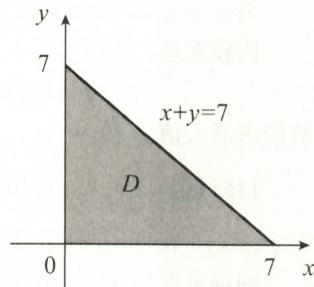

$$
x = 0 (0 \leqslant y \leqslant 7), f (0, y) = - y,
$$

图4-1

显然最大值为0.

$$
x + y = 7, f (x, 7 - x) = - \frac {x ^ {3}}{3} - x ^ {2} + 8 x - 7 (0 \leqslant x \leqslant 7),
$$

由 $\frac{\mathrm{d}}{\mathrm{d}x}[f(x,7 - x)] = -x^2 - 2x + 8 = 0$ ，得 $x = 2, x = -4$ （舍）.

比较大小：

$$
f (1, 1) = - \frac {1}{3}, f (0, 0) = 0, f (2, 5) = \frac {7}{3}, f (0, 7) = - 7, f (7, 0) = - \frac {7 ^ {3}}{3},
$$

故 $f(x,y)$ 在 $D$ 上的最大值为 $f(2,5) = \frac{7}{3}$ .

【注】此题已知全微分,求 $f(x,y)$ 也可利用凑微分法:

$$
\begin{array}{r l} \mathrm{d} z & = (y - x ^ {2}) \mathrm{d} x + (x - 1) \mathrm{d} y = y \mathrm{d} x + x \mathrm{d} y - x ^ {2} \mathrm{d} x - \mathrm{d} y \\ & = \mathrm{d} (x y) - \mathrm{d} \left(\frac {x ^ {3}}{3}\right) - \mathrm{d} y = \mathrm{d} \left(x y - \frac {x ^ {3}}{3} - y\right), \end{array}
$$

故

$$
z = x y - \frac {x ^ {3}}{3} - y + C.
$$

(14) 解（Ⅰ）由已知，有 $f_{x}^{\prime}=2ax+by, f_{y}^{\prime}=2by+ax$ ，则

$f_{xy}^{\prime\prime}=b=f_{yx}^{\prime\prime}=a$ ，即a=b.

由 $f_{x}^{\prime}(1,1) = 3$ ，得 $2a + b = 3$ ，故 $a = b = 1.$ 从而

$$
\begin{array}{r l} \mathrm{d} f (x, y) & = (2 x + y) \mathrm{d} x + (2 y + x) \mathrm{d} y \\ & = 2 x \mathrm{d} x + y \mathrm{d} x + 2 y \mathrm{d} y + x \mathrm{d} y \\ & = \mathrm{d} (x ^ {2} + y ^ {2}) + \mathrm{d} (x y) \\ & = \mathrm{d} (x ^ {2} + y ^ {2} + x y + c), \end{array}
$$

故 $f(x,y) = x^{2} + y^{2} + xy + c.$ 由 $f(0,0) = -3$ ，得 $c = -3$ ，即

$$
f (x, y) = x ^ {2} + y ^ {2} + x y - 3.
$$

（Ⅱ）设 $f(x,y) = 0$ 上任一点为 $(x,y)$ ，则点 $(-1, -1)$ 到点 $(x,y)$ 的距离

$$
d = \sqrt {(x + 1) ^ {2} + (y + 1) ^ {2}},
$$

下求 $(x + 1)^2 +(y + 1)^2$ 在条件 $x^{2} + y^{2} + xy - 3 = 0$ 下的最大值.用拉格朗日乘数法

令 $L=(1+x)^{2}+(1+y)^{2}+\lambda(x^{2}+y^{2}+xy-3)$ ，则

$$
L _ {x} ^ {\prime} = 2 (1 + x) + \lambda (2 x + y) = 0,\tag{①}
$$

$$
\left\{L _ {y} ^ {\prime} = 2 (1 + y) + \lambda (2 y + x) = 0, \right.\tag{②}
$$

$$
L _ {\lambda} ^ {\prime} = x ^ {2} + y ^ {2} + x y - 3 = 0.\tag{③}
$$

由 ①、② 式消去 $\lambda$ ，得 $(x - y)(x + y - 1) = 0$ ，从而 $x = y$ 或者 $x + y = 1$ .

当 x = y 时, 代入 ③ 式, 解得 $x = y = \pm 1$ ;

当 $x + y = 1$ 时，代入③式，解得 $x = 2, y = -1$ 或者 $x = -1, y = 2$ .

比较大小：

$$
d ^ {2} (1, 1) = 8, d ^ {2} (- 1, - 1) = 0, d ^ {2} (2, - 1) = d ^ {2} (- 1, 2) = 9.
$$

故所求最大值为 $\sqrt{9}=3$ .

(15) 解 (I)

$$
f _ {x} ^ {\prime} (0, 0) = \lim _ {x \rightarrow 0} \frac {f (x , 0) - f (0 , 0)}{x} = \lim _ {x \rightarrow 0} \frac {| x |}{x} \cdot \varphi (x, 0),
$$

由 $\varphi(x,y)$ 在点 $(0,0)$ 处连续，及 $\varphi(0,0)=0$ ，得 $\lim_{x\to0}\varphi(x,0)=\varphi(0,0)=0$ ，故 $f_{x}^{\prime}(0,0)=0$ 。

同理可求得 $f_{y}^{\prime}(0,0)=0$ .

证（Ⅱ）由于

$$
\lim_{\substack{x\to 0\\ y\to 0}}\frac{\Delta f - f_{x}^{\prime}(0,0)x - f_{y}^{\prime}(0,0)y}{\sqrt{x^{2} + y^{2}}} = \lim_{\substack{x\to 0\\ y\to 0}}\frac{\sqrt{x^{2} + y^{2}}\varphi(x,y) - 0}{\sqrt{x^{2} + y^{2}}} \\ = \lim_{\substack{x\to 0\\ y\to 0}}\varphi (x,y) = \varphi (0,0) = 0,
$$

故由可微的定义,知 $f(x,y)$ 在点 $(0,0)$ 处可微,且全微分

$$
\mathrm{d} f \Big | _ {(0, 0)} = f _ {x} ^ {\prime} (0, 0) \mathrm{d} x + f _ {y} ^ {\prime} (0, 0) \mathrm{d} y = 0.
$$

(16) 解（Ⅰ）由已知， $\lim_{(x,y)\to(1,1)}f(x,y)=f(1,1)=1.$

记 $h(x,y) = \mathrm{e}^{x^2 + y^2 - 2}$ ，则 $h(x,y)$ 可微，故

$$
h (1 + \Delta x, 1 + \Delta y) - h (1, 1) = h _ {x} ^ {\prime} (1, 1) \Delta x + h _ {y} ^ {\prime} (1, 1) \Delta y + o (\rho),
$$

其中

$$
\rho = \sqrt {(\Delta x) ^ {2} + (\Delta y) ^ {2}}.
$$

又

$$
h _ {x} ^ {\prime} (1, 1) = \mathrm{e} ^ {x ^ {2} + y ^ {2} - 2} \cdot 2 x \mid_ {(1, 1)} = 2,
$$

$$
h _ {y} ^ {\prime} (1, 1) = \mathrm{e} ^ {x ^ {2} + y ^ {2} - 2} \cdot 2 y | _ {(1, 1)} = 2,
$$

则

$$
f (1 + \Delta x, 1 + \Delta y) - f (1, 1) = h (1 + \Delta x, 1 + \Delta y) - h (1, 1) + o (\rho)
$$

$$
= 2 \Delta x + 2 \Delta y + o (\rho),
$$

故

$$
\left. \mathrm{d} f (x, y) \right| _ {(1, 1)} = 2 \Delta x + 2 \Delta y, \text {即} f _ {x} ^ {\prime} (1, 1) = 2, f _ {y} ^ {\prime} (1, 1) = 2.
$$

又

$$
g _ {x} ^ {\prime} (x, y) = f _ {1} ^ {\prime} \left(\mathrm{e} ^ {x - y}, x y\right) \mathrm{e} ^ {x - y} \cdot 1 + f _ {2} ^ {\prime} \left(\mathrm{e} ^ {x - y}, x y\right) \cdot y,
$$

$$
g _ {y} ^ {\prime} (x, y) = f _ {1} ^ {\prime} \left(\mathrm{e} ^ {x - y}, x y\right) \mathrm{e} ^ {x - y} \cdot (- 1) + f _ {2} ^ {\prime} \left(\mathrm{e} ^ {x - y}, x y\right) \cdot x,
$$

故

$$
g _ {x} ^ {\prime} (1, 1) = f _ {1} ^ {\prime} (1, 1) + f _ {2} ^ {\prime} (1, 1) = 2 + 2 = 4,
$$

$$
g _ {y} ^ {\prime} (1, 1) = f _ {1} ^ {\prime} (1, 1) \cdot (- 1) + f _ {2} ^ {\prime} (1, 1) = - 2 + 2 = 0,
$$

所以

$$
\mathrm{d} g (x, y) \mid_ {(1, 1)} = g _ {x} ^ {\prime} (1, 1) \mathrm{d} x + g _ {y} ^ {\prime} (1, 1) \mathrm{d} y = 4 \mathrm{d} x.
$$

(Ⅱ)

$$
\begin{array}{r l} & {\underset {t \to 0} {\lim} \frac {g (1 + \sin t , 1) - g (1 , 1 - \tan t)}{t}} \\ & {= \underset {t \to 0} {\lim} \left[ \frac {g (1 + \sin t , 1) - g (1 , 1)}{\sin t} \cdot \frac {\sin t}{t} + \frac {g (1 , 1 - \tan t) - g (1 , 1)}{- \tan t} \cdot \frac {\tan t}{t} \right]} \\ & {= g _ {x} ^ {\prime} (1, 1) + g _ {y} ^ {\prime} (1, 1) = 4 + 0 = 4.} \end{array}
$$

(17) 解 分段函数,用偏导数的定义进行求解.

$$
f _ {x} ^ {\prime} (0, 0) = \lim _ {x \rightarrow 0} \frac {f (0 + x , 0) - f (0 , 0)}{x} = \lim _ {x \rightarrow 0} \frac {0 - 0}{x} = 0.
$$

同理, $f_{y}^{\prime}(0,0)=0$ .由于

$$
\begin{aligned} & \lim_{\substack{x\to 0\\ y\to 0}}\frac{f(0 + x,0 + y) - f(0,0) - [f_{x}^{\prime}(0,0)x + f_{y}^{\prime}(0,0)y]}{\sqrt{x^{2} + y^{2}}}\\ & = \lim_{\substack{x\to 0\\ y\to 0}}\frac{xy\sin\frac{1}{\sqrt{x^{2} + y^{2}}}}{\sqrt{x^{2} + y^{2}}} = \lim_{\substack{x\to 0\\ y\to 0}}x\cdot \frac{y}{\sqrt{x^{2} + y^{2}}}\cdot \sin \frac{1}{\sqrt{x^{2} + y^{2}}} = 0, \end{aligned}
$$

其中当 $x \to 0$ 时， $\frac{y}{\sqrt{x^2 + y^2}}$ 有界， $\sin \frac{1}{\sqrt{x^2 + y^2}}$ 有界，故 $f(x, y)$ 在点 $(0, 0)$ 处可微.

$$
f _ {x} ^ {\prime} (x, y) = y \sin \frac {1}{\sqrt {x ^ {2} + y ^ {2}}} - \frac {y x ^ {2}}{(x ^ {2} + y ^ {2}) ^ {\frac {3}{2}}} \cdot \cos \frac {1}{\sqrt {x ^ {2} + y ^ {2}}},
$$

取 $y = x$ ，则

$$
\lim _ {y = x \to 0} f _ {x} ^ {\prime} (x, y) = \lim _ {x \to 0} \Bigl (x \sin \frac {1}{\sqrt {2} | x |} - \frac {1}{2 \sqrt {2}} \cdot \frac {x}{| x |} \cos \frac {1}{\sqrt {2} x} \Bigr) \text {不存在},
$$

故 $f_{x}^{\prime}(x,y)$ 在点 $(0,0)$ 处不连续.

同理, $f_{y}^{\prime}(x,y)$ 在点 $(0,0)$ 处不连续.

(18) 解 依题意, 相当于求原点 $(0,0)$ 到椭圆上的点的距离 d 的最大值和最小值, 如图 4-2 所示.

设 $P(x,y)$ 为椭圆上任一点，则 $d=\sqrt{x^{2}+y^{2}}$ ， $d^{2}=x^{2}+y^{2}$ .

利用拉格朗日乘数法. 令 $L = x^{2} + y^{2} + \lambda (x^{2} - 4xy + 5y^{2} - 1)$ ，则

$$
L _ {x} ^ {\prime} = 2 x + 2 \lambda x - 4 \lambda y = 0,\tag{①}
$$

$$
\left\{L _ {y} ^ {\prime} = 2 y - 4 \lambda x + 1 0 \lambda y = 0, \right.
$$

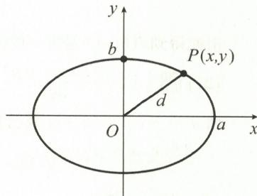

②

$$
L _ {\lambda} ^ {\prime} = x ^ {2} - 4 x y + 5 y ^ {2} - 1 = 0.\tag{③}
$$

图4-2

令 ① × $\frac{x}{2}$ + ② × $\frac{y}{2}$ , 可得

$$
x ^ {2} + y ^ {2} + \lambda (x ^ {2} - 4 x y + 5 y ^ {2}) = 0.
$$

又 $x^{2} - 4xy + 5y^{2} = 1$ ，故 $x^{2} + y^{2} = -\lambda$ ，于是只需求 $\lambda$ ，可得 $d = \sqrt{-\lambda}$ ①式与②式变形为

$$
\left\{ \begin{array}{l} (1 + \lambda) x - 2 \lambda y = 0, \\ - 2 \lambda x + (1 + 5 \lambda) y = 0. \end{array} \right.
$$

该方程组为关于 x, y 的二元一次齐次方程组，有非零解 x, y 的充分必要条件是

$$
\left| \begin{array}{c c} {1 + \lambda} & {- 2 \lambda} \\ {- 2 \lambda} & {1 + 5 \lambda} \end{array} \right| = \lambda^ {2} + 6 \lambda + 1 = 0, \text {解得}   \lambda_ {1} = - 3 + 2 \sqrt {2}  ,   \lambda_ {2} = - 3 - 2 \sqrt {2}  ,
$$

故 $-\lambda = 3 \pm 2\sqrt{2} = (\sqrt{2} \pm 1)^{2}$ . 所以 $d_{1} = \sqrt{2} + 1, d_{2} = \sqrt{2} - 1$ 分别为长半轴和短半轴.

(19) 解 方程组等号两边同时对 y 求导, 得

$$
\left\{ \begin{array}{l} F _ {1} ^ {\prime} \bullet \left(1 - \frac {\mathrm{d} x}{\mathrm{d} y}\right) + F _ {2} ^ {\prime} \bullet \left(1 - \frac {\mathrm{d} z}{\mathrm{d} y}\right) = 0, \\ G _ {1} ^ {\prime} \bullet \left(x + y \frac {\mathrm{d} x}{\mathrm{d} y}\right) + G _ {2} ^ {\prime} \bullet \left(- \frac {z}{y ^ {2}} + \frac {1}{y} \frac {\mathrm{d} z}{\mathrm{d} y}\right) = 0. \end{array} \right.
$$

整理得

$$
\left\{ \begin{array}{l} F _ {1} ^ {\prime} \frac {\mathrm{d} x}{\mathrm{d} y} + F _ {2} ^ {\prime} \frac {\mathrm{d} z}{\mathrm{d} y} = F _ {1} ^ {\prime} + F _ {2} ^ {\prime}, \\ y G _ {1} ^ {\prime} \frac {\mathrm{d} x}{\mathrm{d} y} + \frac {1}{y} G _ {2} ^ {\prime} \frac {\mathrm{d} z}{\mathrm{d} y} = \frac {z}{y ^ {2}} G _ {2} ^ {\prime} - x G _ {1} ^ {\prime}. \end{array} \right.
$$

解得

$$
\frac {\mathrm{d} x}{\mathrm{d} y} = \frac {\left| \begin{array}{c c} F _ {1} ^ {\prime} + F _ {2} ^ {\prime} & F _ {2} ^ {\prime} \\ \frac {z}{y ^ {2}} G _ {2} ^ {\prime} - x G _ {1} ^ {\prime} & \frac {1}{y} G _ {2} ^ {\prime} \end{array} \right|}{\left| \begin{array}{c c} F _ {1} ^ {\prime} & F _ {2} ^ {\prime} \\ y G _ {1} ^ {\prime} & \frac {1}{y} G _ {2} ^ {\prime} \end{array} \right|} = \frac {\frac {1}{y} F _ {1} ^ {\prime} G _ {2} ^ {\prime} + x F _ {2} ^ {\prime} G _ {1} ^ {\prime} + \left(\frac {1}{y} - \frac {z}{y ^ {2}}\right) F _ {2} ^ {\prime} G _ {2} ^ {\prime}}{\frac {1}{y} F _ {1} ^ {\prime} G _ {2} ^ {\prime} - y F _ {2} ^ {\prime} G _ {1} ^ {\prime}}.
$$

同理,可得

$$
\frac {\mathrm{d} z}{\mathrm{d} y} = - \frac {(x + y) F _ {1} ^ {\prime} G _ {1} ^ {\prime} + y F _ {2} ^ {\prime} G _ {1} ^ {\prime} - \frac {z}{y ^ {2}} F _ {1} ^ {\prime} G _ {2} ^ {\prime}}{\frac {1}{y} F _ {1} ^ {\prime} G _ {2} ^ {\prime} - y F _ {2} ^ {\prime} G _ {1} ^ {\prime}}.
$$

(20) 解 利用拉格朗日乘数法. 令 $L = \frac{1}{\alpha} x^{\alpha} + \frac{1}{\beta} y^{\beta} + \lambda (xy - 1)$ , 则

$\left\{ \begin{array}{l} L_{x}^{\prime} = x^{\alpha - 1} + \lambda y = 0, \\ L_{y}^{\prime} = y^{\beta - 1} + \lambda x = 0, \\ L_{\lambda}^{\prime} = xy - 1 = 0, \end{array} \right.$ 解得 $x = y = 1$

由此得到点(1,1)是唯一的极值点,故点(1,1)即为最小值点,最小值为 $f_{\min}=f(1,1)=1$ .

(21) 解 (I) $\frac{\partial f(x,x+y)}{\partial x}=f_{1}^{\prime}(x,x+y)+f_{2}^{\prime}(x,x+y).$

由 $u = x, v = x + y$ 及已知等式，有

$$
\frac {\partial f (x , x + y)}{\partial x} = f _ {1} ^ {\prime} (x, x + y) + f _ {2} ^ {\prime} (x, x + y) = (x + x + y) \mathrm{e} ^ {x - (x + y)} = (2 x + y) \mathrm{e} ^ {- y}.
$$

(Ⅱ) 由(Ⅰ)知，

$$
\begin{array}{r l} f (x, x + y) & = \int (2 x + y) \mathrm{e} ^ {- y} \mathrm{d} x + \varphi (y) \\ & = (x ^ {2} + x y) \mathrm{e} ^ {- y} + \varphi (y) \\ & = x (x + y) \mathrm{e} ^ {- y} + \varphi (y). \end{array}
$$

故 $f(u,v)=uv\mathrm{e}^{u-v}+\varphi(v-u)$ .

由 $f(0,v) = 0$ ，知 $\varphi (v) = 0$ ，且 $\varphi (v - u) = 0$ ，所以 $f(u,v) = uv\mathrm{e}^{u - v}$ 下面求 $f(u,v) = uv\mathrm{e}^{u - v}$ 的极值.

由

得

解得

又有

$$
\begin{array}{r l} & \left\{f _ {u} ^ {\prime} = v \mathrm{e} ^ {u - v} + u v \mathrm{e} ^ {u - v} = \mathrm{e} ^ {u - v} (v + u v) = 0, \right. \\ & \left. f _ {v} ^ {\prime} = u \mathrm{e} ^ {u - v} + u v \mathrm{e} ^ {u - v} (- 1) = \mathrm{e} ^ {u - v} (u - u v) = 0, \right. \\ & \left\{ \begin{array}{l l} v + u v = 0, \\ u - u v = 0, \end{array} \right. \\ & \quad u = 0, v = 0; u = - 1, v = 1. \\ & \quad f _ {u u} ^ {\prime \prime} = \mathrm{e} ^ {u - v} (2 v + u v), \\ & \quad f _ {u v} ^ {\prime \prime} = \mathrm{e} ^ {u - v} (- v - u v + 1 + u), \\ & \quad f _ {v v} ^ {\prime \prime} = \mathrm{e} ^ {u - v} (u v - 2 u), \end{array}
$$

对于点 $(0,0)$ ，A=0，B=1，C=0， $AC-B^{2}=-1<0$ ，故 $f(u,v)$ 不在 $(0,0)$ 处取得极值.

对于点 $(-1,1)$ ， $A=e^{-2}>0$ ，B=0， $C=e^{-2}$ ， $AC-B^{2}=e^{-4}>0$ ，故 $f(u,v)$ 在点 $(-1,1)$ 处取得极小值，且极小值为 $f(-1,1)=-e^{-2}$ .

(22) 解 (I) 由 z = xy - w, 有

$$
\frac {\partial z}{\partial x} = y - \frac {\partial w}{\partial u} \cdot \frac {\partial u}{\partial x} - \frac {\partial w}{\partial v} \cdot \frac {\partial v}{\partial x} = y - \frac {\partial w}{\partial u} - \frac {\partial w}{\partial v},
$$

$$
\frac {\partial z}{\partial y} = x - \frac {\partial w}{\partial u} \cdot \frac {\partial u}{\partial y} - \frac {\partial w}{\partial v} \cdot \frac {\partial v}{\partial y} = x - \frac {\partial w}{\partial u} + \frac {\partial w}{\partial v},
$$

$$
\begin{array}{r l} \frac {\partial^ {2} z}{\partial x ^ {2}} & = - \frac {\partial^ {2} w}{\partial u ^ {2}} \cdot \frac {\partial u}{\partial x} - \frac {\partial^ {2} w}{\partial u \partial v} \cdot \frac {\partial v}{\partial x} - \frac {\partial^ {2} w}{\partial v \partial u} \cdot \frac {\partial u}{\partial x} - \frac {\partial^ {2} w}{\partial v ^ {2}} \cdot \frac {\partial v}{\partial x} \\ & = - \frac {\partial^ {2} w}{\partial u ^ {2}} - 2 \frac {\partial^ {2} w}{\partial u \partial v} - \frac {\partial^ {2} w}{\partial v ^ {2}}, \end{array}
$$

$$
\begin{array}{r l} \frac {\partial^ {2} z}{\partial x \partial y} & = 1 - \frac {\partial^ {2} w}{\partial u ^ {2}} \cdot \frac {\partial u}{\partial y} - \frac {\partial^ {2} w}{\partial u \partial v} \cdot \frac {\partial v}{\partial y} - \frac {\partial^ {2} w}{\partial v \partial u} \cdot \frac {\partial u}{\partial y} - \frac {\partial^ {2} w}{\partial v ^ {2}} \cdot \frac {\partial v}{\partial y} \\ & = 1 - \frac {\partial^ {2} w}{\partial u ^ {2}} + \frac {\partial^ {2} w}{\partial v ^ {2}}, \end{array}
$$

$$
\begin{array}{r l} \frac {\partial^ {2} z}{\partial y ^ {2}} & = - \frac {\partial^ {2} w}{\partial u ^ {2}} \cdot \frac {\partial u}{\partial y} - \frac {\partial^ {2} w}{\partial u \partial v} \cdot \frac {\partial v}{\partial y} + \frac {\partial^ {2} w}{\partial v \partial u} \cdot \frac {\partial u}{\partial y} + \frac {\partial^ {2} w}{\partial v ^ {2}} \cdot \frac {\partial v}{\partial y} \\ & = - \frac {\partial^ {2} w}{\partial u ^ {2}} + 2 \frac {\partial^ {2} w}{\partial u \partial v} - \frac {\partial^ {2} w}{\partial v ^ {2}}, \end{array}
$$

代入原方程,得

$$
\frac {\partial^ {2} z}{\partial x ^ {2}} + 2 \frac {\partial^ {2} z}{\partial x \partial y} + \frac {\partial^ {2} z}{\partial y ^ {2}} = 2 - 4 \frac {\partial^ {2} w}{\partial u ^ {2}} = 0,
$$

故 $\frac{\partial^{2}w}{\partial u^{2}}=\frac{1}{2}.$

(Ⅱ)

$$
\frac {\partial w}{\partial u} = \int \frac {1}{2} \mathrm{d} u + \varphi_ {1} (v) = \frac {1}{2} u + \varphi_ {1} (v),
$$

由 $\frac{\partial w(0,v)}{\partial u} = v\mathrm{e}^{-v}$ ，得 $\varphi_1(v) = v\mathrm{e}^{-v}$ ，故 $\frac{\partial w}{\partial u} = \frac{1}{2} u + v\mathrm{e}^{-v}$

$$
w = \int \left(\frac {1}{2} u + v \mathrm{e} ^ {- v}\right) \mathrm{d} u + \varphi_ {2} (v) = \frac {u ^ {2}}{4} + u v \mathrm{e} ^ {- v} + \varphi_ {2} (v),
$$

由 $w(0,v) = \frac{v^2}{4}$ , 得 $\varphi_2(v) = \frac{v^2}{4}$ , 故

从而

$$
\begin{array}{r l} & w = \frac {u ^ {2}}{4} + u v \mathrm{e} ^ {- v} + \frac {v ^ {2}}{4}. \\ z = x y - w = x y - \left[ \frac {(x + y) ^ {2}}{4} + (x + y) (x - y) \mathrm{e} ^ {- (x - y)} + \frac {(x - y) ^ {2}}{4} \right] \\ = x y - \frac {1}{2} (x ^ {2} + y ^ {2}) - (x ^ {2} - y ^ {2}) \mathrm{e} ^ {- (x - y)}. \end{array}
$$

(23) 解 (I) 由已知, 有

$$
\frac {\partial z}{\partial x} = \frac {\partial f}{\partial u} + \frac {\partial f}{\partial v}, \frac {\partial z}{\partial y} = \frac {1}{2} \left(\frac {\partial f}{\partial v} - \frac {\partial f}{\partial u}\right),
$$

$$
\frac {\partial^ {2} z}{\partial x ^ {2}} = \frac {\partial^ {2} f}{\partial u ^ {2}} + 2 \frac {\partial^ {2} f}{\partial u \partial v} + \frac {\partial^ {2} f}{\partial v ^ {2}},
$$

$$
\begin{array}{r l} \frac {\partial^ {2} z}{\partial y ^ {2}} & = \frac {1}{2} \left(\frac {1}{2} \frac {\partial^ {2} f}{\partial u ^ {2}} - \frac {1}{2} \frac {\partial^ {2} f}{\partial u \partial v} - \frac {1}{2} \frac {\partial^ {2} f}{\partial v \partial u} + \frac {1}{2} \frac {\partial^ {2} f}{\partial v ^ {2}}\right) \\ & = \frac {1}{4} \left(\frac {\partial^ {2} f}{\partial u ^ {2}} - 2 \frac {\partial^ {2} f}{\partial u \partial v} + \frac {\partial^ {2} f}{\partial v ^ {2}}\right), \end{array}
$$

故

$$
\frac {\partial^ {2} z}{\partial x ^ {2}} - 4 \frac {\partial^ {2} z}{\partial y ^ {2}} = 4 \frac {\partial^ {2} f}{\partial u \partial v} = 1 2 a, \text {可得} \frac {\partial^ {2} f}{\partial u \partial v} = 3 a.
$$

(Ⅱ) 由(Ⅰ) $\frac{\partial^{2}f}{\partial u\partial v}=3a$ ，有

$$
\frac {\partial f}{\partial u} = \int 3 a \mathrm{d} v + \varphi_ {1} (u) = 3 a v + \varphi_ {1} (u).
$$

由 $\frac{\partial f(u,0)}{\partial u} = -3u^2$ ，得 $\varphi_{1}(u) = -3u^{2}$ ，故 $\frac{\partial f}{\partial u} = 3av - 3u^2.$

$$
f (u, v) = \int (3 a v - 3 u ^ {2}) \mathrm{d} u + \varphi_ {2} (v) = 3 a u v - u ^ {3} + \varphi_ {2} (v).
$$

由 $f(0,v) = -v^3$ ，得 $\varphi_{2}(v) = -v^{3}$ ，故 $f(u,v) = 3auv - u^3 -v^3.$

由

$$
\int \frac {\partial f}{\partial u} = 3 a v - 3 u ^ {2} = 0,
$$

$$
\left\{\frac {\partial f}{\partial v} = 3 a u - 3 v ^ {2} = 0, \right.
$$

得驻点 $P_{1}(0,0)$ , $P_{2}(a,a)$ ，且

$$
\frac {\partial^ {2} f}{\partial u ^ {2}} = - 6 u, \frac {\partial^ {2} f}{\partial u \partial v} = 3 a, \frac {\partial^ {2} f}{\partial v ^ {2}} = - 6 v.
$$

对于 $P_{1}(0,0)$ ，有

$$
A = 0, B = 3 a, C = 0.
$$

由 $AC - B^{2} = -9a^{2} < 0$ ，知 $f(u, v)$ 不在点 $P_{1}(0, 0)$ 处取得极值.

对于 $P_{2}(a,a)$ ，有

$$
A = - 6 a, B = 3 a, C = - 6 a.
$$

由 $AC - B^{2} = (-6a)(-6a) - 9a^{2} = 27a^{2} > 0$ ，知：

当 a > 0 时, A = -6a < 0, $f(a, a) = a^{3}$ 为极大值;

当 a<0 时， $A=-6a>0, f(a,a)=a^{3}$ 为极小值.

## 拓展题

## 一、选择题

D.

解 对于选项 D: 当选项 D 中条件成立时, 有

$$
f _ {x} ^ {\prime} (x _ {0}, y _ {0}) = \lim _ {\Delta x \to 0} \frac {\Delta f}{\Delta x} = \lim _ {\Delta x \to 0} \left[ \frac {1}{\Delta x} \bullet (\Delta x) ^ {2} \sin \frac {1}{(\Delta x) ^ {2}} \right] = 0,
$$

$$
f _ {y} ^ {\prime} (x _ {0}, y _ {0}) = \lim _ {\Delta y \to 0} \frac {\Delta f}{\Delta y} = \lim _ {\Delta y \to 0} \left[ \frac {1}{\Delta y} \cdot (\Delta y) ^ {2} \sin \frac {1}{(\Delta y) ^ {2}} \right] = 0,
$$

$$
\begin{aligned} \lim_{\substack{\Delta x\to 0\\ \Delta y\to 0}}\frac{\Delta f - \mathrm{d}f}{\rho} & = \lim_{\substack{\Delta x\to 0\\ \Delta y\to 0}}\frac{\left[(\Delta x)^{2} + (\Delta y)^{2}\right]\sin\frac{1}{(\Delta x)^{2} + (\Delta y)^{2}}}{\sqrt{(\Delta x)^{2} + (\Delta y)^{2}}} \\ & = \lim_{\substack{\Delta x\to 0\\ \Delta y\to 0}}\left[(\Delta x)^{2} + (\Delta y)^{2}\right]^{\frac{1}{2}}\cdot \sin \frac{1}{(\Delta x)^{2} + (\Delta y)^{2}} = 0. \end{aligned}
$$

由可微的定义, 知 $f(x, y)$ 在点 $(x_{0}, y_{0})$ 处可微, 且 df = 0. 选项 D 正确.

对于选项 A: 由 $f_{x}^{\prime}(x_{0},y_{0})=f_{y}^{\prime}(x_{0},y_{0})=0$ ，知偏导数存在，但不能推出 $f(x,y)$ 在点 $(x_{0},y_{0})$ 处可微.

对于选项 B: $\Delta f = \frac{\Delta x \Delta y}{\sqrt{(\Delta x)^{2} + (\Delta y)^{2}}}$ . 当 $\Delta y = 0$ 时, $\Delta f = 0$ ; 当 $\Delta x = 0$ 时, $\Delta f = 0$ , 故

$$
f _ {x} ^ {\prime} (x _ {0}, y _ {0}) = \lim _ {\Delta x \to 0} \frac {\Delta f}{\Delta x} = 0, f _ {y} ^ {\prime} (x _ {0}, y _ {0}) = \lim _ {\Delta y \to 0} \frac {\Delta f}{\Delta y} = 0.
$$

由此可知

$$
\lim _ {\Delta x \to 0 \atop \Delta y \to 0} \frac {\Delta f - \mathrm{d} f}{\rho} = \lim _ {\Delta x \to 0 \atop \Delta y \to 0} \frac {\Delta x   \Delta y}{\sqrt {(\Delta x) ^ {2} + (\Delta y) ^ {2}}} \cdot \frac {1}{\sqrt {(\Delta x) ^ {2} + (\Delta y) ^ {2}}} = \lim _ {\Delta x \to 0 \atop \Delta y \to 0} \frac {\Delta x   \Delta y}{(\Delta x) ^ {2} + (\Delta y) ^ {2}}   \text {不存在，}
$$

即 $f(x,y)$ 在点 $(x_{0},y_{0})$ 处不可微.

对于选项 C: 由于

$$
\Delta f = \frac {\sin [ (\Delta x) ^ {2} + (\Delta y) ^ {2} ]}{\sqrt {(\Delta x) ^ {2} + (\Delta y) ^ {2}}}, \text {且} f _ {x} ^ {\prime} (x _ {0}, y _ {0}) = \lim _ {\Delta x \to 0} \frac {\sin (\Delta x) ^ {2}}{| \Delta x | \cdot \Delta x} = \lim _ {\Delta x \to 0} \frac {\Delta x}{| \Delta x |},
$$

故

$$
\lim _ {\Delta x \to 0 ^ {+}} \frac {\Delta x}{| \Delta x |} = 1, \quad \lim _ {\Delta x \to 0 ^ {-}} \frac {\Delta x}{| \Delta x |} = - 1,
$$

从而 $f_{x}^{\prime}(x_{0},y_{0})$ 不存在.同理， $f_{y}^{\prime}(x_0,y_0)$ 不存在，故 $f(x,y)$ 在点 $(x_0,y_0)$ 处不可微

## 二、解答题

证 令 $\rho = \sqrt{x^{2} + y^{2}}$ ，由已知条件及极限与无穷小的关系，有

$$
\frac {f (x , y)}{\sqrt {x ^ {2} + y ^ {2}}} = (1 + k) + \alpha (\alpha \text {为无穷小}),
$$

即

$$
f (x, y) = (1 + k) \sqrt {x ^ {2} + y ^ {2}} + o (\rho).\tag{①}
$$

(I)①式两边同时取极限,有

$$
\lim_{\substack{x\to 0\\ y\to 0}}f(x,y) = \lim_{\substack{x\to 0\\ y\to 0}}(1 + k)\sqrt{x^{2} + y^{2}} +\lim_{\substack{x\to 0\\ y\to 0}}o(\rho) = 0 = f(0,0),
$$

故 $f(x,y)$ 在点 $(0,0)$ 处连续.

(Ⅱ) 当 $k \neq -1$ 时，

$$
\begin{array}{r l}f _ {x} ^ {\prime} (0, 0)&= \lim _ {x \rightarrow 0} \frac {f (x , 0) - f (0 , 0)}{x} = \lim _ {x \rightarrow 0} \frac {(1 + k) \sqrt {x ^ {2}} + o (x)}{x}\\&= \lim _ {x \rightarrow 0} \left[ (1 + k) \frac {| x |}{x} + \frac {o (x)}{x} \right].\end{array}
$$

因 $\lim_{x\to0}(1+k)\frac{|x|}{x}$ 不存在，故 $f_{x}^{\prime}(0,0)$ 不存在.同理， $f_{y}^{\prime}(0,0)$ 不存在.

因此 $f(x,y)$ 在点 $(0,0)$ 处不可微（偏导数存在是可微的必要条件）.

(Ⅲ) 当 k = -1 时, $f(x, y) = o(\rho)$ , 故

$$
f _ {x} ^ {\prime} (0, 0) = \lim _ {x \to 0} \frac {f (x , 0) - f (0 , 0)}{x} = \lim _ {x \to 0} \frac {o (x)}{x} = 0.
$$

同理, $f_{y}^{\prime}(0,0)=0$ .故 $\left.\mathrm{d}f\right|_{(0,0)}=0\cdot x+0\cdot y$ ,则

$$
\lim_{\substack{x\to 0\\ y\to 0}}\frac{\Delta f - \mathrm{d}f}{\rho} = \lim_{\substack{x\to 0\\ y\to 0}}\frac{f(x,y) - f(0,0) - 0}{\sqrt{x^{2} + y^{2}}} = \lim_{\substack{x\to 0\\ y\to 0}}\frac{f(x,y)}{\sqrt{x^{2} + y^{2}}} = 0,
$$

故 $f(x,y)$ 在点 $(0,0)$ 处可微.

## 第五章 二重积分

## 基础题

## 一、选择题

(1)B.

解 D 区域如图 5-1 所示, 在 D 区域上有

$$
[ \ln (x + y) ] ^ {9} \leqslant [ \sin (x + y) ] ^ {9} \leqslant (x + y) ^ {9}.
$$

选项B正确.

(2) C.

解 D 关于 y 轴对称, kx 关于 x 为奇函数, 故

$$
\iint_ {D} k x \mathrm{d} x \mathrm{d} y = 0.
$$

又在 D 内, y < 0, 故 I < 0. 选项 C 正确.

(3) C.

解 依题意, D 区域如图 5-2 所示,

$$
\begin{array}{r l} I & = \iint_ {D} (x y + \cos x \sin y) \mathrm{d} x \mathrm{d} y \\ & = \iint_ {D} x y \mathrm{d} x \mathrm{d} y + \iint_ {D} \cos x \sin y \mathrm{d} x \mathrm{d} y = I _ {1} + I _ {2}. \end{array}
$$

对于 $I_{1}, D_{1} \cup D_{2}$ 关于 $y$ 轴对称， $xy$ 关于 $x$ 为奇函数，故

$$
\iint_ {D _ {1} \cup D _ {2}} x y \mathrm{d} x \mathrm{d} y = 0.
$$

同理， $\iint_{D_3\cup D_4}xy\mathrm{d}x\mathrm{d}y = 0.$ 于是 $I_{1} = 0$

对于 $I_{2}, D_{3} \cup D_{4}$ 关于 x 轴对称, $\cos x \sin y$ 关于 y 是奇函数, 故

$$
\iint_ {D _ {3} \cup D _ {4}} \cos x \sin y \mathrm{d} x \mathrm{d} y = 0.
$$

$D_{1} \cup D_{2}$ 关于 $y$ 轴对称， $\cos x \sin y$ 关于 $x$ 是偶函数，故

$$
\iint_ {D _ {1} \cup D _ {2}} \cos x \sin y \mathrm{d} x \mathrm{d} y = 2 \iint_ {D _ {1}} \cos x \sin y \mathrm{d} x \mathrm{d} y.
$$

选项C正确.

(4)C.

解 原积分 I 的积分区域如图 5-3 所示，

$$
D _ {1} = \left\{ \begin{array}{l l} 0 \leqslant x \leqslant 2, \\ 0 \leqslant y \leqslant \frac {x ^ {2}}{2}, \end{array} \right. D _ {2} = \left\{ \begin{array}{l l} 2 \leqslant x \leqslant 2 \sqrt {2}, \\ 0 \leqslant y \leqslant \sqrt {8 - x ^ {2}}, \end{array} \right.
$$

$$
I = \int_ {0} ^ {2} \mathrm{d} y \int_ {\sqrt {2 y}} ^ {\sqrt {8 - y ^ {2}}} f (x, y) \mathrm{d} x.
$$

故

图5-1  
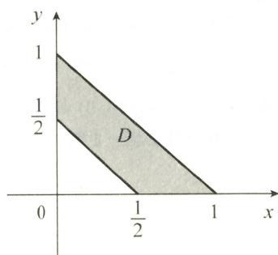

选项C正确.

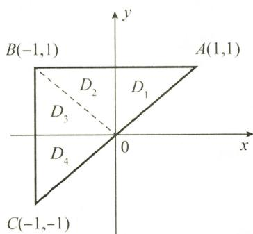  
图5-2

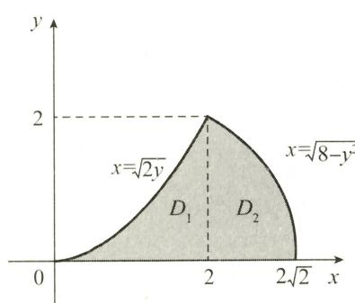  
图5-3

(5) C.

解 $x^{2} + y^{2}\leqslant x$ 化为极坐标方程为

$$
0 \leqslant r \leqslant \cos \theta , - \frac {\pi}{2} \leqslant \theta \leqslant \frac {\pi}{2},
$$

故选项 C 正确.

(6)C.

解 由 $r = 2\sin \theta$ ，得 $r^{2} = 2r\sin \theta$ ，即 $x^{2} + y^{2} = 2y$ ，积分区域 D 如图 5-4 所示。选项 C 正确。

## 二、填空题

(1) $\frac{1}{6}-\frac{1}{3e}.$

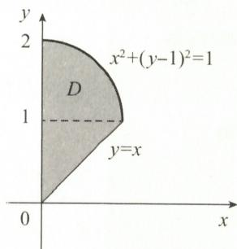  
图5-4

解 由于 $e^{-y^{2}}$ 的原函数不能用初等函数表达, 故交换积分顺序才能计算.

原积分区域 D 如图 5-5 所示，

$$
I = \int_ {0} ^ {1} x ^ {2}   \mathrm{d} x \int_ {x} ^ {1} \mathrm{e} ^ {- y ^ {2}}   \mathrm{d} y = \int_ {0} ^ {1} \mathrm{e} ^ {- y ^ {2}}   \mathrm{d} y \int_ {0} ^ {y} x ^ {2}   \mathrm{d} x = \frac {1}{3} \int_ {0} ^ {1} \mathrm{e} ^ {- y ^ {2}} \cdot y ^ {3}   \mathrm{d} y \stackrel {\text {分部积分}} {=} \frac {1}{6} - \frac {1}{3 \mathrm{e}}.
$$

(2) $\frac{4}{\pi^{3}}(2+\pi).$

解 由已知,作出积分区域 D,交换积分顺序,如图 5-6 所示,

$$
\begin{array}{r l} I & = \int_ {1} ^ {2} \mathrm{d} y \int_ {y} ^ {y ^ {2}} \sin \frac {\pi x}{2 y} \mathrm{d} x = \int_ {1} ^ {2} \frac {2 y}{\pi} \Big (\cos \frac {\pi}{2} - \cos \frac {\pi}{2} y \Big) \mathrm{d} y \\ & = - \frac {2}{\pi} \int_ {1} ^ {2} y \cos \frac {\pi}{2} y \mathrm{d} y \xlongequal {\text {分部积分}} \frac {4}{\pi^ {3}} (2 + \pi). \end{array}
$$

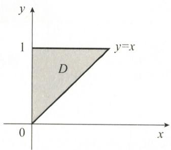  
图5-5

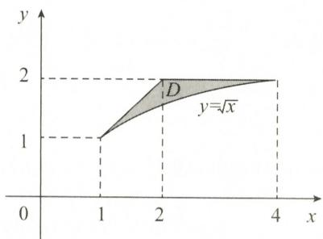  
图5-6

(3) $\frac{3}{2}.$

解 积分区域如图 5-7 所示,交换积分顺序.

$$
\begin{array}{r l} I & = \int_ {0} ^ {\frac {\pi}{4}} \csc 2 y \mathrm{d} y \int_ {0} ^ {\tan y} \frac {1}{3} x ^ {- \frac {2}{3}} \mathrm{d} x \\ & = \int_ {0} ^ {\frac {\pi}{4}} \csc 2 y \cdot x ^ {\frac {1}{3}} \Big | _ {0} ^ {\tan y} \mathrm{d} y \\ & = \int_ {0} ^ {\frac {\pi}{4}} \frac {\tan^ {\frac {1}{3}} y}{\sin 2 y} \mathrm{d} y \\ & = \int_ {0} ^ {\frac {\pi}{4}} \frac {\tan^ {\frac {1}{3}} y}{2 \tan y \cdot \cos^ {2} y} \mathrm{d} y \\ & = \frac {1}{2} \int_ {0} ^ {\frac {\pi}{4}} \tan^ {- \frac {2}{3}} y \mathrm{d} (\tan y) = \frac {3}{2} \tan^ {\frac {1}{3}} y \Big | _ {0} ^ {\frac {\pi}{4}} = \frac {3}{2}. \end{array}
$$

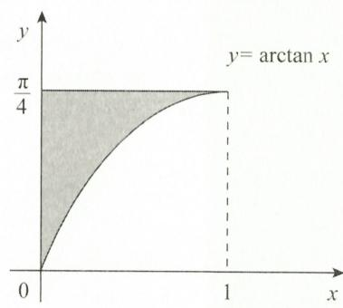  
图5-7

(4) $\mathrm{e}^{-1}$

解 依题设 $\int_{0}^{t}\mathrm{d}x\int_{x}^{t}\mathrm{e}^{-(x - y)^2}\mathrm{d}y$ ，知积分区域如图5-8所示，交换积分顺序，得

$$
f (t) = \int_ {0} ^ {t} \mathrm{d} y \int_ {0} ^ {y} \mathrm{e} ^ {- (x - y) ^ {2}} \mathrm{d} x,
$$

则

$$
f ^ {\prime} (t) = \int_ {0} ^ {t} \mathrm{e} ^ {- (x - t) ^ {2}} \mathrm{d} x \frac {x - t = u}{\text {一}} \int_ {- t} ^ {0} \mathrm{e} ^ {- u ^ {2}} \mathrm{d} u = - \int_ {0} ^ {- t} \mathrm{e} ^ {- u ^ {2}} \mathrm{d} u,
$$

$$
f ^ {\prime \prime} (t) = - \mathrm{e} ^ {- (- t) ^ {2}} \cdot (- 1) = \mathrm{e} ^ {- t ^ {2}},
$$

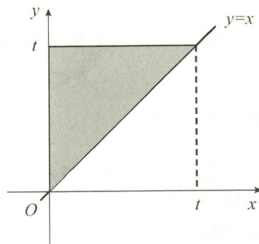  
图5-8

故 $f''(1) = \mathrm{e}^{-1}$ .

【注】

$$
f (t) = \int_ {0} ^ {t} \mathrm{d} y \int_ {0} ^ {y} \mathrm{e} ^ {- (x - y) ^ {2}} \mathrm{d} x = \int_ {0} ^ {t} \left[ \int_ {0} ^ {y} \mathrm{e} ^ {- (x - y) ^ {2}} \mathrm{d} x \right] \mathrm{d} y.
$$

记 $g(y) = \int_{0}^{y}\mathrm{e}^{-(x - y)^{2}}\mathrm{d}x$ ，则 $f(t) = \int_0^t g(y)\mathrm{d}y$ ，故 $f^{\prime}(t) = g(t) = \int_0^t\mathrm{e}^{-(x - t)^{2}}\mathrm{d}x.$

(5) $\frac{a+b}{2}\pi.$

解 如图 5-9 所示, D 关于直线 y = x 对称, 故

$$
\begin{array}{r l} I & = \frac {1}{2} \iint_ {D} \left[ \frac {a \sqrt {f (x)} + b \sqrt {f (y)}}{\sqrt {f (x)} + \sqrt {f (y)}} + \frac {a \sqrt {f (y)} + b \sqrt {f (x)}}{\sqrt {f (y)} + \sqrt {f (x)}} \right] \mathrm{d} x \mathrm{d} y \\ & = \frac {a + b}{2} \iint_ {D} \mathrm{d} x \mathrm{d} y = \frac {a + b}{2} \cdot \frac {1}{4} \pi \cdot 2 ^ {2} = \frac {a + b}{2} \pi . \end{array}
$$

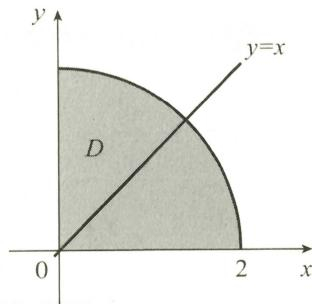

(6) $\frac{A^{2}}{2}.$

图5-9

解 令 $F(x) = \int_{x}^{1} f(y) \, \mathrm{d}y$ ，则 $F'(x) = -f(x)$ ，故

$$
\begin{array}{r l} I & = \int_ {0} ^ {1} \mathrm{d} x \int_ {x} ^ {1} f (x) f (y) \mathrm{d} y = \int_ {0} ^ {1} f (x) \mathrm{d} x \int_ {x} ^ {1} f (y) \mathrm{d} y \\ & = - \int_ {0} ^ {1} F (x) \mathrm{d} [ F (x) ] = - \frac {1}{2} F ^ {2} (x) \Big | _ {0} ^ {1} = \frac {A ^ {2}}{2}. \end{array}
$$

【注】也可利用交换积分顺序及积分与积分变量无关求解.

$$
\int_ {0} ^ {1} \mathrm{d} x \int_ {x} ^ {1} f (x) f (y) \mathrm{d} y = \int_ {0} ^ {1} \mathrm{d} y \int_ {0} ^ {y} f (x) f (y) \mathrm{d} x = \int_ {0} ^ {1} \mathrm{d} x \int_ {0} ^ {x} f (x) f (y) \mathrm{d} y,
$$

故

$$
\begin{array}{r l} 2 \int_ {0} ^ {1} \mathrm{d} x \int_ {x} ^ {1} f (x) f (y) \mathrm{d} y & = \int_ {0} ^ {1} \mathrm{d} x \int_ {0} ^ {x} f (x) f (y) \mathrm{d} y + \int_ {0} ^ {1} \mathrm{d} x \int_ {x} ^ {1} f (x) f (y) \mathrm{d} y \\ & = \int_ {0} ^ {1} \mathrm{d} x \left\{f (x) \left[ \int_ {0} ^ {x} f (y) \mathrm{d} y + \int_ {x} ^ {1} f (y) \mathrm{d} y \right] \right\} \\ & = \int_ {0} ^ {1} \mathrm{d} x \int_ {0} ^ {1} f (x) f (y) \mathrm{d} y = \left[ \int_ {0} ^ {1} f (x) \mathrm{d} x \right] \left[ \int_ {0} ^ {1} f (y) \mathrm{d} y \right] = A ^ {2}, \end{array}
$$

故 $I=\frac{A^{2}}{2}$ .

(7) $\frac{\pi}{4}\ln2.$

解 如图 5-10 所示,由于 D 关于直线 y = x 对称,所以

$$
\begin{array}{r l} I & = \iint_ {D} \frac {1 + x - y}{1 + x ^ {2} + y ^ {2}} \mathrm{d} x \mathrm{d} y \\ & = \frac {1}{2} \iint_ {D} \left(\frac {1 + x - y}{1 + x ^ {2} + y ^ {2}} + \frac {1 + y - x}{1 + y ^ {2} + x ^ {2}}\right) \mathrm{d} x \mathrm{d} y \\ & = \frac {1}{2} \iint_ {D} \frac {2}{1 + x ^ {2} + y ^ {2}} \mathrm{d} x \mathrm{d} y = \int_ {0} ^ {\frac {\pi}{2}} \mathrm{d} \theta \int_ {0} ^ {1} \frac {r}{1 + r ^ {2}} \mathrm{d} r \\ & = \frac {\pi}{2} \cdot \frac {1}{2} \int_ {0} ^ {1} \frac {\mathrm{d} (1 + r ^ {2})}{1 + r ^ {2}} = \frac {\pi}{4} \ln (1 + r ^ {2}) \Big | _ {0} ^ {1} = \frac {\pi}{4} \ln 2. \end{array}
$$

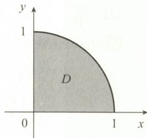  
图5-10

(8) $\frac{\pi^{2}}{32}.$

解 $D$ 区域如图5-11所示，用极坐标有 $\frac{3\pi}{4} \leqslant \theta \leqslant \pi, 0 \leqslant r \leqslant 2\sin \theta$ ，故

$$
\begin{array}{r l} I & = \int_ {\frac {3 \pi}{4}} ^ {\pi} \mathrm{d} \theta \int_ {0} ^ {2 \sin \theta} \frac {r}{r \sqrt {4 - r ^ {2}}} \mathrm{d} r \\ & = \int_ {\frac {3 \pi}{4}} ^ {\pi} \arcsin \frac {r}{2} \Big | _ {0} ^ {2 \sin \theta} \mathrm{d} \theta \\ & = \int_ {\frac {3 \pi}{4}} ^ {\pi} (\pi - \theta) \mathrm{d} \theta = \frac {\pi^ {2}}{3 2}. \end{array}
$$

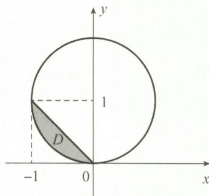  
图5-11

(9) $2\ln(1+\sqrt{2})-\sqrt{2}$ .

解 D 区域如图 5-12 所示,采用极坐标.

$x^{2} + y^{2} = 2x$ 的极坐标方程为 $r = 2\cos \theta, x = 2$ 的极坐标方程为 $r = 2\sec \theta, y = x$ 的极坐标方程为 $\theta = \frac{\pi}{4}$ , 故

$$
\begin{array}{r l} I & = \iint_ {D} \frac {\mathrm{d} x \mathrm{d} y}{\sqrt {x ^ {2} + y ^ {2}}} = \int_ {0} ^ {\frac {\pi}{4}} \mathrm{d} \theta \int_ {2 \cos \theta} ^ {2 \sec \theta} \frac {1}{r} \cdot r \mathrm{d} r \\ & = 2 \int_ {0} ^ {\frac {\pi}{4}} (\sec \theta - \cos \theta) \mathrm{d} \theta \\ & = 2 (\ln | \sec \theta + \tan \theta | - \sin \theta) \Bigg | _ {0} ^ {\frac {\pi}{4}} \\ & = 2 \ln (1 + \sqrt {2}) - \sqrt {2}. \end{array}
$$

  
图5-12

(10) $\frac{1}{2}(e-1)$ .

解 积分区域 D 如图 5-13 所示,采用极坐标.

$$
\begin{array}{r l} \iint_ {D} \mathrm{e} ^ {\frac {x}{x + y}} \mathrm{d} x \mathrm{d} y & = \int_ {0} ^ {\frac {\pi}{2}} \mathrm{d} \theta \int_ {0} ^ {\frac {1}{\cos \theta + \sin \theta}} \mathrm{e} ^ {\frac {\cos \theta}{\cos \theta + \sin \theta}} r \mathrm{d} r \\ & = \int_ {0} ^ {\frac {\pi}{2}} \mathrm{e} ^ {\frac {\cos \theta}{\cos \theta + \sin \theta}} \cdot \left. \frac {1}{2} r ^ {2} \right| _ {0} ^ {\frac {1}{\cos \theta + \sin \theta}} \mathrm{d} \theta \\ & = \frac {1}{2} \int_ {0} ^ {\frac {\pi}{2}} \mathrm{e} ^ {\frac {\cos \theta}{\cos \theta + \sin \theta}} \cdot \frac {1}{(\cos \theta + \sin \theta) ^ {2}} \mathrm{d} \theta \\ & = - \frac {1}{2} \int_ {0} ^ {\frac {\pi}{2}} \mathrm{e} ^ {\frac {\cos \theta}{\cos \theta + \sin \theta}} \mathrm{d} \left(\frac {\cos \theta}{\cos \theta + \sin \theta}\right) \\ & = - \frac {1}{2} \mathrm{e} ^ {\frac {- \cos \theta}{\cos \theta + \sin \theta}} \Big | _ {0} ^ {\frac {\pi}{2}} = \frac {1}{2} (\mathrm{e} - 1). \end{array}
$$

  
图5-13

(11) $\frac{13\pi}{144}.$

解 D 关于直线 y = x 对称, 由轮换对称性, 有

$$
\begin{array}{r l} I & = \iint_ {D} \left(\frac {x ^ {2}}{4} + \frac {y ^ {2}}{9}\right) \mathrm{d} x \mathrm{d} y = \frac {1}{2} \iint_ {D} \left(\frac {x ^ {2}}{4} + \frac {y ^ {2}}{9} + \frac {y ^ {2}}{4} + \frac {x ^ {2}}{9}\right) \mathrm{d} x \mathrm{d} y \\ & = \frac {1}{2} \left(\frac {1}{4} + \frac {1}{9}\right) \iint_ {D} (x ^ {2} + y ^ {2}) \mathrm{d} x \mathrm{d} y = \frac {1}{2} \left(\frac {1}{4} + \frac {1}{9}\right) \int_ {0} ^ {2 \pi} \mathrm{d} \theta \int_ {0} ^ {1} r ^ {3} \mathrm{d} r = \frac {1 3 \pi}{1 4 4}. \end{array}
$$

(12) $4-\frac{\pi}{2}.$

解 如图 5-14 所示, 设

则

$$
\begin{array}{r l} & {D _ {\text {大}} = \left\{(x, y)   \Big | - 2 \leqslant x \leqslant 0,   0 \leqslant y \leqslant 2 \right\},} \\ & {D _ {\text {小}} = \left\{(x, y)   \Big | - \sqrt {2 y - y ^ {2}} \leqslant x \leqslant 0 \right\},} \\ & {\qquad I = \iint_ {D} y   \mathrm{d} x   \mathrm{d} y = \iint_ {D _ {\text {大}}} y   \mathrm{d} x   \mathrm{d} y - \iint_ {D _ {\text {小}}} y   \mathrm{d} x   \mathrm{d} y} \\ & {\qquad = \int_ {- 2} ^ {0} \mathrm{d} x \int_ {0} ^ {2} y   \mathrm{d} y - \int_ {\frac {\pi}{2}} ^ {\pi} \mathrm{d} \theta \int_ {0} ^ {2 \sin \theta} r ^ {2} \sin \theta   \mathrm{d} r} \\ & {\qquad = 4 - \frac {8}{3} \int_ {\frac {\pi}{2}} ^ {\pi} \sin^ {4} \theta   \mathrm{d} \theta = 4 - \frac {8}{3} \int_ {0} ^ {\frac {\pi}{2}} \cos^ {4} t   \mathrm{d} t = 4 - \frac {\pi}{2}.} \end{array}
$$

  
图5-14

【注】因 D 关于 y = 1 对称, 故

$$
I = \iint_ {D} y \mathrm{d} x \mathrm{d} y = \iint_ {D} [ (y - 1) + 1 ] \mathrm{d} x \mathrm{d} y = \iint_ {D} (y - 1) \mathrm{d} x \mathrm{d} y + \iint_ {D} \mathrm{d} x \mathrm{d} y = 4 - \frac {\pi}{2},
$$

或利用形心纵坐标为 $\overline{y}=1$ ，有

$$
I = \iint_ {D} y \mathrm{d} x \mathrm{d} y = \overline {{{y}}} \cdot \left(4 - \frac {\pi}{2}\right) = 4 - \frac {\pi}{2}.
$$

(13) $2\pi.$

解 D 如图 5-15 所示, 利用极坐标,

$$
\begin{array}{r l} I & = \int_ {- \frac {\pi}{2}} ^ {\frac {\pi}{2}} \mathrm{d} \theta \int_ {0} ^ {2 \cos \theta} (2 r \cos \theta + 3 r \sin \theta) r \mathrm{d} r \\ & = \int_ {- \frac {\pi}{2}} ^ {\frac {\pi}{2}} \left(\frac {1 6}{3} \cos^ {4} \theta + 8 \cos^ {3} \theta \cdot \sin \theta\right) \mathrm{d} \theta \\ & = \frac {3 2}{3} \int_ {0} ^ {\frac {\pi}{2}} \cos^ {4} \theta \mathrm{d} \theta + 0 = \frac {3 2}{3} \times \frac {3}{4} \times \frac {1}{2} \times \frac {\pi}{2} = 2 \pi . \end{array}
$$

  
图5-15

【注】①考虑到被积函数关于 x, y 都是一次函数, 可利用形心坐标 $(\overline{x}, \overline{y}) = (1, 0)$ . 由

$$
\overline {{{x}}} = \frac {\iint_ {D} x \rho \mathrm{d} x \mathrm{d} y}{\iint_ {D} \rho \mathrm{d} x \mathrm{d} y} = \frac {\iint_ {D} x \mathrm{d} x \mathrm{d} y}{\iint_ {D} \mathrm{d} x \mathrm{d} y},
$$

有

$\iint_{D}x\,dx\,dy=\overline{x}\cdot\iint_{D}dx\,dy,\quad\iint_{D}dx\,dy$ 表示 D 的面积.

同理， $\iint_{D}y\mathrm{d}x\mathrm{d}y = \overline{y}\cdot \iint_{D}\mathrm{d}x\mathrm{d}y.$ 所以 $I = \iint_{D}(2x + 3y)\mathrm{d}x\mathrm{d}y = (2\overline{x} +3\overline{y})\pi \cdot 1^{2} = 2\pi .$

② 考虑到 D 关于直线 x = 1 对称, 则

$$
I = \iint_ {D} (2 x + 3 y) \mathrm{d} x \mathrm{d} y = \iint_ {D} [ 2 (x - 1) + 2 + 3 y ] \mathrm{d} x \mathrm{d} y.
$$

将 x-1 视为整体, 它为奇函数, 故 $\iint_{D}2(x-1)\mathrm{d}x\mathrm{d}y=0$ , 所以 $I=2\iint_{D}\mathrm{d}x\mathrm{d}y+3\iint_{D}y\mathrm{d}x\mathrm{d}y$ .

又 D 关于 x 轴对称，故 $3\iint_{D}y\,dx\,dy=0$ ，于是 $I=2\iint_{D}dx\,dy=2\times\pi\times1^{2}=2\pi.$

(14)1.

解 由于 $\mathrm{e}^{(x + y)^2}\cos (x + y)^2$ 在 $D$ 上连续，故由二重积分的中值定理，可知

$$
\iint_ {D} \mathrm{e} ^ {(x + y) ^ {2}} \cos (x + y) ^ {2} \mathrm{d} x \mathrm{d} y = \mathrm{e} ^ {(\xi + \eta) ^ {2}} [ \cos (\xi + \eta) ^ {2} ] \cdot t ^ {2}, (\xi , \eta) \in D.
$$

当 $t \to 0^{+}$ 时，有 $(\xi, \eta) \to (0, 0)$ ，故

$$
\text {原式} = \lim _ {t \to 0 ^ {+}} \frac {1}{t ^ {2}} \cdot \mathrm{e} ^ {(\xi + \eta) ^ {2}} \big [ \cos (\xi + \eta) ^ {2} \big ] \cdot t ^ {2} = 1.
$$

## 三、解答题

(1) 解 (I) D 如图 5-16 阴影所示, 先对 y 积分较简便.

$$
\begin{array}{r l} I & = \iint_ {D} x y (x - y) \mathrm{d} x \mathrm{d} y \\ & = \int_ {0} ^ {1} \mathrm{d} x \int_ {- x} ^ {x} x y (x - y) \mathrm{d} y \\ & = \int_ {0} ^ {1} \left(\frac {x ^ {2} y ^ {2}}{2} - \frac {x y ^ {3}}{3}\right) \Big | _ {- x} ^ {x} \mathrm{d} x \\ & = - \frac {2}{3} \int_ {0} ^ {1} x ^ {4} \mathrm{d} x = - \frac {2}{1 5}. \end{array}
$$

  
图5-16

(Ⅱ)D 如图 5-17 阴影所示, 若先对 y 积分, 则 $\int \frac{\sin y}{y} dy$ 不能表示为初等函数, 故只能先对 x 积分.

$$
\begin{array}{r l} I & = \iint_ {D} \frac {\sin y}{y} \mathrm{d} x \mathrm{d} y = \int_ {0} ^ {1} \mathrm{d} y \int_ {y ^ {2}} ^ {y} \frac {\sin y}{y} \mathrm{d} x \\ & = \int_ {0} ^ {1} \frac {\sin y}{y} (y - y ^ {2}) \mathrm{d} y \\ & = \int_ {0} ^ {1} (1 - y) \sin y \mathrm{d} y \\ & = [ - (1 - y) \cos y - \sin y ] \Big | _ {0} ^ {1} \\ & = 1 - \sin 1. \end{array}
$$

  
图5-17

(Ⅲ)D 如图 5-18 阴影所示, 先对 x 积分.

$$
\begin{array}{r l} I & = \iint_ {D} \frac {x y}{\sqrt {1 + y ^ {3}}} \mathrm{d} x \mathrm{d} y \\ & = \int_ {0} ^ {1} \frac {y}{\sqrt {1 + y ^ {3}}} \mathrm{d} y \int_ {0} ^ {\sqrt {y}} x \mathrm{d} x \\ & = \frac {1}{2} \int_ {0} ^ {1} \frac {y ^ {2}}{\sqrt {1 + y ^ {3}}} \mathrm{d} y \\ & = \frac {1}{2} \cdot \frac {2}{3} (1 + y ^ {3}) ^ {\frac {1}{2}} \Big | _ {0} ^ {1} = \frac {1}{3} (\sqrt {2} - 1). \end{array}
$$

  
图5-18

(Ⅳ)D 如图 5-19 阴影所示,作辅助线 $y = -\arcsin x (-1 \leqslant x \leqslant 0)$ , 将 D 划分为 $D_{1}$ 与 $D_{2}$ .

$$
\begin{array}{r l} & {I = \iint_ {D} x (\mathrm{e} ^ {x ^ {2} + \cos y} \sin y - 1) \mathrm{d} x \mathrm{d} y = \iint_ {D} x \mathrm{e} ^ {x ^ {2} + \cos y} \sin y \mathrm{d} x \mathrm{d} y - \iint_ {D} x \mathrm{d} x \mathrm{d} y \stackrel {\text {记}} {=} I _ {1} - I _ {2}.} \\ & {I _ {1} = \iint_ {D} x \mathrm{e} ^ {x ^ {2} + \cos y} \sin y \mathrm{d} x \mathrm{d} y = \iint_ {D _ {1}} x \mathrm{e} ^ {x ^ {2} + \cos y} \sin y \mathrm{d} x \mathrm{d} y + \iint_ {D _ {2}} x \mathrm{e} ^ {x ^ {2} + \cos y} \sin y \mathrm{d} x \mathrm{d} y.} \end{array}
$$

由 $D_{1}$ 关于 y 轴对称， $x \mathrm{e}^{x^{2} + \cos y} \sin y$ 关于 x 是奇函数，故

$$
\iint_ {D _ {1}} x \mathrm{e} ^ {x ^ {2} + \cos y} \sin y \mathrm{d} x \mathrm{d} y = 0.
$$

同理, $\iint_{D_{2}}x\mathrm{e}^{x^{2}+\cos y}\sin y\mathrm{d}x\mathrm{d}y=0$ ,故 $I_{1}=0$ .

$$
I _ {2} = \iint_ {D} x \mathrm{d} x \mathrm{d} y = \iint_ {D _ {1}} x \mathrm{d} x \mathrm{d} y + \iint_ {D _ {2}} x \mathrm{d} x \mathrm{d} y,
$$

根据对称性, $\iint_{D_{1}}x\,dx\,dy=0.$ 又

  
图5-19

$$
\iint_ {D _ {2}} x \mathrm{d} x \mathrm{d} y = 2 \int_ {0} ^ {\frac {\pi}{2}} \mathrm{d} y \int_ {- 1} ^ {- \sin y} x \mathrm{d} x = - \frac {\pi}{4},
$$

故

$$
I = 0 - \left(- \frac {\pi}{4}\right) = \frac {\pi}{4}.
$$

(2) 解 由 $\left\{\begin{aligned} x^{2} + y^{2} &= 1, \\ x^{2} + y^{2} &= 2x \end{aligned}\right.$ 解得交点 $A\left(\frac{1}{2}, \frac{\sqrt{3}}{2}\right)$ ，积分区域 D 如图 5-20 所示，故

$$
\begin{array}{r l} I & = \iint_ {D} x y \mathrm{d} x \mathrm{d} y = \int_ {0} ^ {\frac {\sqrt {3}}{2}} \mathrm{d} y \int_ {1 - \sqrt {1 - y ^ {2}}} ^ {\sqrt {1 - y ^ {2}}} x y \mathrm{d} x \\ & = \frac {1}{2} \int_ {0} ^ {\frac {\sqrt {3}}{2}} y x ^ {2} \Big | _ {1 - \sqrt {1 - y ^ {2}}} ^ {\sqrt {1 - y ^ {2}}} \mathrm{d} y \\ & = \frac {1}{2} \int_ {0} ^ {\frac {\sqrt {3}}{2}} y \left[ 1 - y ^ {2} - (1 - \sqrt {1 - y ^ {2}}) ^ {2} \right] \mathrm{d} y \\ & = \int_ {0} ^ {\frac {\sqrt {3}}{2}} \left(y \sqrt {1 - y ^ {2}} - \frac {1}{2} y\right) \mathrm{d} y \\ & = \left[ - \frac {1}{3} (1 - y ^ {2}) ^ {\frac {3}{2}} - \frac {1}{4} y ^ {2} \right] \Big | _ {0} ^ {\frac {\sqrt {3}}{2}} = \frac {5}{4 8}. \end{array}
$$

  
图5-20

(3) 解 由已知, D 如图 5-21 所示, D 关于直线 y = x 对称, 则

$$
\begin{array}{r l} I & = \iint_ {D} \frac {x \mathrm{e} ^ {(x + y) ^ {2}}}{x + y} \mathrm{d} x \mathrm{d} y = \frac {1}{2} \iint_ {D} \left[ \frac {x \mathrm{e} ^ {(x + y) ^ {2}}}{x + y} + \frac {y \mathrm{e} ^ {(y + x) ^ {2}}}{y + x} \right] \mathrm{d} x \mathrm{d} y \\ & = \frac {1}{2} \iint_ {D} \mathrm{e} ^ {(x + y) ^ {2}} \mathrm{d} x \mathrm{d} y \\ & = \frac {1}{2} \int_ {0} ^ {\frac {\pi}{2}} \mathrm{d} \theta \int_ {\frac {1}{\cos \theta + \sin \theta}} ^ {\frac {2}{\cos \theta + \sin \theta}} \mathrm{e} ^ {r ^ {2} (\cos \theta + \sin \theta) ^ {2}} \cdot r \mathrm{d} r \\ & = \frac {1}{4} \int_ {0} ^ {\frac {\pi}{2}} \left[ \frac {1}{(\cos \theta + \sin \theta) ^ {2}} \mathrm{e} ^ {r ^ {2} (\cos \theta + \sin \theta) ^ {2}} \left| \frac {\frac {2}{\cos \theta + \sin \theta}}{\frac {1}{\cos \theta + \sin \theta}} \right] \mathrm{d} \theta \right. \\ & = \frac {1}{4} (\mathrm{e} ^ {4} - \mathrm{e}) \int_ {0} ^ {\frac {\pi}{2}} \frac {\mathrm{d} \theta}{(\cos \theta + \sin \theta) ^ {2}} \\ & = \frac {1}{4} (\mathrm{e} ^ {4} - \mathrm{e}) \int_ {0} ^ {\frac {\pi}{2}} \frac {\mathrm{d} (\tan \theta)}{(1 + \tan \theta) ^ {2}} = \frac {1}{4} (\mathrm{e} ^ {4} - \mathrm{e}) \cdot \left. \frac {- 1}{1 + \tan \theta} \right| _ {0} ^ {\frac {\pi}{2}} = \frac {\mathrm{e} ^ {4} - \mathrm{e}}{4}. \end{array}
$$

  
图5-21

(4) 解 D 如图 5-22 阴影部分所示, D 关于直线 y = x 对称.

$$
\begin{array}{r l} & I = \iint_ {D} (2 x ^ {2} - y ^ {2}) \mathrm{d} x   \mathrm{d} y = \iint_ {D} x ^ {2} \mathrm{d} x   \mathrm{d} y + \iint_ {D} (x ^ {2} - y ^ {2}) \mathrm{d} x   \mathrm{d} y \\ & \stackrel {\text {记}} {=} I _ {1} + I _ {2}. \end{array}
$$

$$
I _ {2} = \iint_ {D} (x ^ {2} - y ^ {2}) \mathrm{d} x \mathrm{d} y = \frac {1}{2} \iint_ {D} (x ^ {2} - y ^ {2} + y ^ {2} - x ^ {2}) \mathrm{d} x \mathrm{d} y = 0,
$$

$$
I _ {1} = \iint_ {D} x ^ {2} \mathrm{d} x \mathrm{d} y = \frac {1}{2} \iint_ {D} (x ^ {2} + y ^ {2}) \mathrm{d} x \mathrm{d} y = \frac {1}{2} \cdot 2 \iint_ {D _ {1}} (x ^ {2} + y ^ {2}) \mathrm{d} x \mathrm{d} y,
$$

其中

$$
D _ {1} = \left\{(x, y) \mid x ^ {2} + (y - 1) ^ {2} \leqslant 1, 0 \leqslant y \leqslant x \right\}.
$$

图5-22

故

$$
\begin{array}{r l} I & = I _ {1} = \int_ {0} ^ {\frac {\pi}{4}} \mathrm{d} \theta \int_ {0} ^ {2 \sin \theta} r ^ {2} \cdot r \mathrm{d} r \\ & = \int_ {0} ^ {\frac {\pi}{4}} \frac {1}{4} r ^ {4} \Big | _ {0} ^ {2 \sin \theta} \mathrm{d} \theta \\ & = 4 \int_ {0} ^ {\frac {\pi}{4}} \sin^ {4} \theta \mathrm{d} \theta = \int_ {0} ^ {\frac {\pi}{4}} (1 - \cos 2 \theta) ^ {2} \mathrm{d} \theta \\ & \xlongequal {2 \theta = t} \int_ {0} ^ {\frac {\pi}{2}} (1 - \cos t) ^ {2} \cdot \frac {1}{2} \mathrm{d} t \\ & = \frac {1}{2} \int_ {0} ^ {\frac {\pi}{2}} (1 - 2 \cos t + \cos^ {2} t) \mathrm{d} t \\ & = \frac {1}{2} \left(\frac {\pi}{2} - 2 + \frac {1}{2} \cdot \frac {\pi}{2}\right) = \frac {3}{8} \pi - 1. \end{array}
$$

(5) 解 用 $x^{2} + y^{2} = 1$ (即 r = 1) 将 D 划分为 $D_{1}$ 与 $D_{2}$ ，如图 5-23 所示，则

$$
\begin{array}{r l} I & = \iint_ {D _ {1}} (1 - r) r \mathrm{d} r \mathrm{d} \theta + \iint_ {D _ {2}} (r - 1) r \mathrm{d} r \mathrm{d} \theta \\ & = \iint_ {D _ {1}} (1 - r) r \mathrm{d} r \mathrm{d} \theta - \iint_ {D _ {2}} (1 - r) r \mathrm{d} r \mathrm{d} \theta \\ & = 2 \iint_ {D _ {1}} (1 - r) r \mathrm{d} r \mathrm{d} \theta - \iint_ {D} (1 - r) r \mathrm{d} r \mathrm{d} \theta \\ & = 2 \int_ {0} ^ {\frac {\pi}{4}} \mathrm{d} \theta \int_ {0} ^ {1} (1 - r) r \mathrm{d} r - \int_ {0} ^ {\frac {\pi}{4}} \mathrm{d} \theta \int_ {0} ^ {\sqrt {2} \cos \theta} (1 - r) r \mathrm{d} r \\ & = \frac {\pi}{1 2} - \int_ {0} ^ {\frac {\pi}{4}} \left(\cos^ {2} \theta - \frac {2 \sqrt {2}}{3} \cos^ {3} \theta\right) \mathrm{d} \theta \\ & = \frac {\pi}{1 2} + \frac {5}{9} - \frac {1}{4} - \frac {\pi}{8} = \frac {1 1}{3 6} - \frac {\pi}{2 4}. \end{array}
$$

  
图5-23

(6) 解 用 $x^{2} + y^{2} = 4$ 将 D 划分为 $D_{1}$ 与 $D_{2}$ ，如图 5-24 所示，则

$$
\begin{array}{r l} I & = \iint_ {D} | x ^ {2} + y ^ {2} - 4 |   \mathrm{d} x   \mathrm{d} y \\ & = - \iint_ {D _ {1}} (x ^ {2} + y ^ {2} - 4)   \mathrm{d} x   \mathrm{d} y + \iint_ {D _ {2}} (x ^ {2} + y ^ {2} - 4)   \mathrm{d} x   \mathrm{d} y \\ & = - \iint_ {D _ {1}} (x ^ {2} + y ^ {2} - 4)   \mathrm{d} x   \mathrm{d} y + \iint_ {D - D _ {1}} (x ^ {2} + y ^ {2} - 4)   \mathrm{d} x   \mathrm{d} y \\ & = \iint_ {D} (x ^ {2} + y ^ {2} - 4)   \mathrm{d} x   \mathrm{d} y - 2 \iint_ {D _ {1}} (x ^ {2} + y ^ {2} - 4)   \mathrm{d} x   \mathrm{d} y \\ & = \int_ {0} ^ {2 \pi} \mathrm{d} \theta \int_ {0} ^ {3} (r ^ {2} - 4) r   \mathrm{d} r - 2 \int_ {0} ^ {2 \pi} \mathrm{d} \theta \int_ {0} ^ {2} (r ^ {2} - 4) r   \mathrm{d} r \end{array}
$$

  
图5-24

$$
\begin{array}{l} = 2 \pi \left(\frac {r ^ {4}}{4} - 2 r ^ {2}\right) \Big | _ {0} ^ {3} - 4 \pi \left(\frac {r ^ {4}}{4} - 2 r ^ {2}\right) \Big | _ {0} ^ {2} \\ = \frac {9}{2} \pi + 1 6 \pi = \frac {4 1}{2} \pi . \end{array}
$$

(7) 解 积分区域 D 如图 5-25 中半圆区域, $x + y - 2 = 0$ 将 D 分成 $D_{1}$ 与 $D_{2}$ 两部分.

$$
\begin{array}{r l} I & = \iint_ {D _ {1}} | x + y - 2 |   \mathrm{d} x   \mathrm{d} y \\ & = \iint_ {D _ {1}} (x + y - 2)   \mathrm{d} x   \mathrm{d} y - \iint_ {D _ {2}} (x + y - 2)   \mathrm{d} x   \mathrm{d} y \\ & = 2 \iint_ {D _ {1}} (x + y - 2)   \mathrm{d} x   \mathrm{d} y - \iint_ {D _ {1} + D _ {2}} (x + y - 2)   \mathrm{d} x   \mathrm{d} y \\ & \stackrel {\text {记}} {=} I _ {1} - I _ {2}. \end{array}
$$

  
图5-25

$$
\begin{array}{r l} & {I _ {1} = 2 \iint_ {D _ {1}} (x + y - 2) \mathrm{d} x \mathrm{d} y (\text {先对} x \text {积分后对} y \text {积分})} \\ & {\qquad = 2 \int_ {0} ^ {1} \mathrm{d} y \int_ {2 - y} ^ {1 + \sqrt {1 - y ^ {2}}} (x + y) \mathrm{d} x - 4 \iint_ {D _ {1}} \mathrm{d} x \mathrm{d} y} \\ & {\qquad = 2 \int_ {0} ^ {1} \left[ \frac {(1 + \sqrt {1 - y ^ {2}}) ^ {2} - (2 - y) ^ {2}}{2} + y (1 + \sqrt {1 - y ^ {2}} - 2 + y) \right] \mathrm{d} y - 4 \left(\frac {1}{4} \pi \times 1 ^ {2} - \frac {1}{2}\right)} \\ & {\qquad = 2 \int_ {0} ^ {1} (y \sqrt {1 - y ^ {2}} + \sqrt {1 - y ^ {2}} + y - 1) \mathrm{d} y - (\pi - 2)} \\ & {\qquad = 2 \left(\frac {1}{3} + \frac {\pi}{4} - \frac {1}{2}\right) - (\pi - 2) = \frac {5}{3} - \frac {\pi}{2},} \\ & {I _ {2} = \iint_ {D} (x + y - 2) \mathrm{d} x \mathrm{d} y = \iint_ {D} (x + y) \mathrm{d} x \mathrm{d} y - \iint_ {D} 2 \mathrm{d} x \mathrm{d} y} \\ & {\qquad = \int_ {0} ^ {\frac {\pi}{2}} \mathrm{d} \theta \int_ {0} ^ {2 \cos \theta} r ^ {2} (\cos \theta + \sin \theta) \mathrm{d} r - 2 \times \frac {\pi}{2} \times 1 ^ {2}} \\ & {\qquad = \frac {1}{3} \int_ {0} ^ {\frac {\pi}{2}} \left[ (\cos \theta + \sin \theta) r ^ {3} \Big | _ {0} ^ {2 \cos \theta} \right] \mathrm{d} \theta - \pi} \\ & {\qquad = \frac {8}{3} \int_ {0} ^ {\frac {\pi}{2}} \cos^ {4}   \theta   \mathrm{d} \theta + \frac {8}{3}   \int_ {0} ^ {\frac {\pi}{2}}   \cos^ {3}   \theta   \sin   \theta   \mathrm{d} \theta - \pi} \\ & {\qquad = \frac {8}{3} \times \frac {3}{4} \times \frac {1}{2} \times \frac {\pi}{2} - \frac {8}{3} \times \frac {1}{4}   \cos^ {4}   \theta   \Big | _ {0} ^ {\frac {\pi}{2}} - \pi} \\ & {\qquad = \frac {\pi}{2} + \frac {2}{3} - \pi = \frac {2}{3} - \frac {\pi}{2},} \\ & {\qquad I = I _ {1} - I _ {2} = \frac {5}{3} - \frac {\pi}{2} - (\frac {2}{3} - \frac {\pi}{2}) = 1.} \end{array}
$$

故

(8) 解 D 如图 5-26 所示, 由 $\left\{\begin{aligned} x^{2} + y^{2} &= 1, \\ x^{2} + y^{2} &= 2x, \end{aligned}\right.$ 解得交点 $A\left(\frac{1}{2}, \frac{\sqrt{3}}{2}\right)$ .

$$
\begin{array}{r l} I & = \iint_ {D} \frac {y}{(1 + x ^ {2} + y ^ {2}) \sqrt {x ^ {2} + y ^ {2}}} \mathrm{d} x \mathrm{d} y \\ & = \int_ {0} ^ {\frac {\pi}{3}} \mathrm{d} \theta \int_ {1} ^ {2 \cos \theta} \frac {\sin \theta}{1 + r ^ {2}} \cdot r \mathrm{d} r \\ & = \frac {1}{2} \int_ {0} ^ {\frac {\pi}{3}} \sin \theta \left[ \ln (1 + r ^ {2}) \Big | _ {1} ^ {2 \cos \theta} \right] \mathrm{d} \theta \\ & = \frac {1}{2} \int_ {0} ^ {\frac {\pi}{3}} [ \ln (1 + 4 \cos^ {2} \theta) - \ln 2 ] \sin \theta \mathrm{d} \theta \end{array}
$$

  
图5-26

$$
\begin{array}{r l} & {\underline {{{{\underline {{{{u = \cos \theta}}}}}}}} \frac {1}{2} \int_ {\frac {1}{2}} ^ {1} \left[ \ln (1 + 4 u ^ {2}) - \ln 2 \right] \mathrm{d} u} \\ & {= \frac {1}{2} \left[ u \ln (1 + 4 u ^ {2}) - 2 u + \arctan 2 u \right] \Bigg | _ {\frac {1}{2}} ^ {1} - \frac {1}{4} \ln 2} \\ & {= \frac {1}{2} \Big (\ln \frac {5}{2} - 1 + \arctan 2 - \frac {\pi}{4} \Big).} \end{array}
$$

(9) 解 如图 5-27 所示, 直线 $x + y = i (i = 1, 2, 3, 4)$ 将 D 分为 4 个区域 $D_{k} (k = 1, 2, 3, 4)$ , 则

故

$$
\begin{array}{r l} & {\quad [ 1 + x + y ] = k (k = 1, 2, 3, 4),} \\ {I} & {= \iint_ {D} [ 1 + x + y ] \mathrm{d} x \mathrm{d} y} \\ & {= \iint_ {D _ {1}} 1 \mathrm{d} x \mathrm{d} y + \iint_ {D _ {2}} 2 \mathrm{d} x \mathrm{d} y + \iint_ {D _ {3}} 3 \mathrm{d} x \mathrm{d} y + \iint_ {D _ {4}} 4 \mathrm{d} x \mathrm{d} y = 1 0.} \end{array}
$$

  
图5-27

【注】 $\iint_{D}dx dy$ 表示 D 的面积.

(10) 解 当 $2x - x^{2} = (1 - y)^{2}$ 时，有 $(x - 1)^{2} + (y - 1)^{2} = 1$ .
圆周 $(x-1)^{2}+(y-1)^{2}=1$ 将D分为 $D_{1}$ 与 $D_{2}$ 两个区域，
如图 5-28 所示.于是

$$
\begin{array}{r l} & {\max \{2 x - x ^ {2}, (1 - y) ^ {2} \} = \left\{ \begin{array}{l l} {(1 - y) ^ {2},} & {(x, y) \in D _ {1},} \\ {2 x - x ^ {2},} & {(x, y) \in D _ {2}.} \end{array} \right.} \\ & {I =  \iint_ {D _ {1}} (1 - y) ^ {2} \mathrm{d} x   \mathrm{d} y +  \iint_ {D _ {2}} (2 x - x ^ {2}) \mathrm{d} x   \mathrm{d} y} \\ & {\quad =  \int_ {0} ^ {1} \mathrm{d} y \int_ {0} ^ {1 - \sqrt {2 y - y ^ {2}}} (1 - y) ^ {2} \mathrm{d} x +  \int_ {0} ^ {1} \mathrm{d} x \int_ {1 - \sqrt {2 x - x ^ {2}}} ^ {1} (2 x - x ^ {2}) \mathrm{d} y} \\ & {\quad =  \int_ {0} ^ {1} (1 - y) ^ {2} (1 - \sqrt {2 y - y ^ {2}})   \mathrm{d} y +  \int_ {0} ^ {1} (2 x - x ^ {2}) [ 1 - (1 - \sqrt {2 x - x ^ {2}}) ]   \mathrm{d} x} \\ & {\quad =  \int_ {0} ^ {1} (1 - y) ^ {2} \mathrm{d} y -  \int_ {0} ^ {1} (1 - y) ^ {2}   \sqrt {1 - (y - 1) ^ {2}}   \mathrm{d} y +  \int_ {0} ^ {1} (2 x - x ^ {2})   \sqrt {2 x - x ^ {2}}   \mathrm{d} x} \\ & {\quad = -  \frac {1}{3} (1 - y) ^ {3}   \Big | _ {0} ^ {1} -  \int_ {0} ^ {1} (y - 1) ^ {2}   \sqrt {1 - (y - 1) ^ {2}}   \mathrm{d} (y - 1) +  \int_ {0} ^ {1} [ 1 - (x - 1) ^ {2} ]   \sqrt {1 - (x - 1) ^ {2}}   \mathrm{d} (x - 1)} \\ & {\quad =  \frac {1}{3} +  \int_ {0} ^ {1} \sqrt {1 - (x - 1) ^ {2}}   \mathrm{d} (x - 1) - 2  \int_ {0} ^ {1} (x - 1) ^ {2}   \sqrt {1 - (x - 1) ^ {2}}   \mathrm{d} (x - 1),} \end{array}
$$

而

$$
\begin{array}{r l} & {\int_ {0} ^ {1} \sqrt {1 - (x - 1) ^ {2}}   \mathrm{d} (x - 1) \frac {x - 1 = t}{\int_ {- 1} ^ {0}} \sqrt {1 - t ^ {2}}   \mathrm{d} t \frac {t = - u}{\int_ {1} ^ {0}} \sqrt {1 - u ^ {2}} (- \mathrm{d} u)} \\ & {\qquad = \int_ {0} ^ {1} \sqrt {1 - u ^ {2}}   \mathrm{d} u = \frac {1}{4} \pi \bullet 1 ^ {2} = \frac {\pi}{4} \left(\int_ {0} ^ {1} \sqrt {1 - u ^ {2}}   \mathrm{d} u   \text {表示} 1 / 4   \text {圆的面积}\right),} \\ & {\qquad \int_ {0} ^ {1} (x - 1) ^ {2}   \sqrt {1 - (x - 1) ^ {2}}   \mathrm{d} (x - 1) \frac {x - 1 = \sin t}{\int_ {- \frac {\pi}{2}} ^ {0}} \sin^ {2} t \cos t \cos t   \mathrm{d} t} \\ & {\qquad \qquad \qquad \qquad \qquad \qquad \qquad \qquad \qquad \qquad \qquad \qquad \qquad \qquad \qquad \qquad \qquad \qquad \qquad \qquad \qquad \qquad \qquad \qquad \qquad \qquad \qquad \qquad \qquad \qquad \qquad \qquad \qquad \qquad \pmb {\mathcal {I}} _ {\mathrm{eff}} = 0,} \\ & {\qquad = \int_ {0} ^ {\frac {\pi}{2}} \sin^ {2} u (1 - \sin^ {2} u)   \mathrm{d} u} \\ & {\qquad = \int_ {0} ^ {\frac {\pi}{2}} \sin^ {2} u   \mathrm{d} u - \int_ {0} ^ {\frac {\pi}{2}} \sin^ {4} u   \mathrm{d} u} \end{array}
$$

故

$$
\begin{array}{r l} & = \frac {1}{2} \cdot \frac {\pi}{2} - \frac {3}{4} \cdot \frac {1}{2} \cdot \frac {\pi}{2} \\ & = \frac {\pi}{4} - \frac {3 \pi}{1 6}, \\ I = \frac {1}{3} + \frac {\pi}{4} - 2 \left(\frac {\pi}{4} - \frac {3 \pi}{1 6}\right) = \frac {1}{3} + \frac {\pi}{8}. \end{array}
$$

(11) 解 由符号函数的定义, 知

$$
\operatorname{sgn} (x ^ {2} - y ^ {2} + 2) = \left\{ \begin{array}{l l} 1, & x ^ {2} - y ^ {2} + 2 > 0, \\ 0, & x ^ {2} - y ^ {2} + 2 = 0, \\ - 1, & x ^ {2} - y ^ {2} + 2 <   0, \end{array} \right.
$$

故 $x^{2} - y^{2} + 2 = 0$ ，即双曲线 $\frac{y^2}{2} -\frac{x^2}{2} = 1$ 将 $D$ 划分为三个区域 $D_{1}$ $D_{2},D_{3}$ ，如图5-29所示，

$$
\operatorname{sgn} (x ^ {2} - y ^ {2} + 2) = \left\{ \begin{array}{l l} 1, & (x, y) \in D _ {2}, \\ - 1, & (x, y) \in D _ {1} \cup D _ {3}, \end{array} \right.
$$

$$
\begin{array}{r l} {\text {故} I =  \iint_ {D} \mathrm{sgn} (x ^ {2} - y ^ {2} + 2) \mathrm{d} x   \mathrm{d} y} \\ & {\quad =  \iint_ {D _ {2}} 1 \mathrm{d} x   \mathrm{d} y -  \iint_ {D _ {1}} 1 \mathrm{d} x   \mathrm{d} y -  \iint_ {D _ {3}} 1 \mathrm{d} x   \mathrm{d} y =  \iint_ {D _ {2}} \mathrm{d} x   \mathrm{d} y - 2  \iint_ {D _ {1}} \mathrm{d} x   \mathrm{d} y.} \\ {\text {而}} & {\quad  \iint_ {D _ {2}} \mathrm{d} x   \mathrm{d} y =  \iint_ {D} \mathrm{d} x   \mathrm{d} y -  \iint_ {D _ {1} \cup D _ {3}} \mathrm{d} x   \mathrm{d} y =  \iint_ {D} \mathrm{d} x   \mathrm{d} y - 2  \iint_ {D _ {1}} \mathrm{d} x   \mathrm{d} y,} \end{array}
$$

图5-29

故

$$
\begin{array}{r l} I & = \iint_ {D} \mathrm{d} x \mathrm{d} y - 4 \iint_ {D _ {1}} \mathrm{d} x \mathrm{d} y = \pi \cdot 2 ^ {2} - 4 \int_ {- 1} ^ {1} \mathrm{d} x \int_ {\sqrt {2 + x ^ {2}}} ^ {\sqrt {4 - x ^ {2}}} \mathrm{d} y \\ & = 4 \pi - 4 \left[ \frac {x}{2} \sqrt {4 - x ^ {2}} + 2 \arcsin \frac {x}{2} - \frac {x}{2} \sqrt {2 + x ^ {2}} - \ln (x + \sqrt {2 + x ^ {2}}) \right] \Bigg | _ {- 1} ^ {1} \\ & = 4 \pi - 4 \left[ \frac {2 \pi}{3} - \ln (2 + \sqrt {3}) \right] = \frac {4 \pi}{3} + 4 \ln (2 + \sqrt {3}). \end{array}
$$

(12) 解 将 D 分成 $D = D_{1} + D_{2} + D_{3}$ ，如图 5-30 所示，则

$$
\begin{array}{r l} I & = \iint_ {D} f (x, y) \mathrm{d} x \mathrm{d} y \\ & = \iint_ {D _ {1}} 0 \mathrm{d} x \mathrm{d} y + \iint_ {D _ {2}} \frac {\mathrm{d} x \mathrm{d} y}{(x ^ {2} + y ^ {2}) ^ {2}} + \iint_ {D _ {3}} 0 \mathrm{d} x \mathrm{d} y \\ & = \int_ {\frac {\pi}{6}} ^ {\frac {\pi}{4}} \mathrm{d} \theta \int_ {\sec \theta} ^ {3 \sec \theta} \frac {r}{r ^ {4}} \mathrm{d} r = \frac {4}{9} \int_ {\frac {\pi}{6}} ^ {\frac {\pi}{4}} \cos^ {2} \theta \mathrm{d} \theta \\ & = \frac {2}{9} \int_ {\frac {\pi}{6}} ^ {\frac {\pi}{4}} (1 + \cos 2 \theta) \mathrm{d} \theta = \frac {\pi + 6 - 3 \sqrt {3}}{5 4}. \end{array}
$$

  
图5-30

(13) 解 由 $x + y + xy = 1$ ，得 $y = \frac{1 - x}{1 + x}$ ，即 $y + 1 = \frac{2}{1 + x}$ 。该曲线是以 x = -1, y = -1 为渐近线的双曲线，如图 5-31 所示。

$x + y = 1$ 将 $D$ 分为 $D_{1}$ 与 $D_{2}$ ，故

$$
\begin{array}{r l} & I = \iint_ {D _ {1}} (x - y + 1) \mathrm{d} x   \mathrm{d} y + \iint_ {D _ {2}} \frac {(x + y) ^ {2}}{x ^ {2} + y ^ {2}} \mathrm{d} x   \mathrm{d} y \\ & \underline {{\underline {{\text {记}}}}} I _ {1} + I _ {2}. \end{array}
$$

  
图5-31

由于 $D_{1}$ 关于直线 $y = x$ 对称，故

$$
\begin{array}{r l} & \iint_ {D _ {1}} (x - y) \mathrm{d} x \mathrm{d} y = \frac {1}{2} \iint_ {D _ {1}} (x - y + y - x) \mathrm{d} x \mathrm{d} y = 0. \\ & I _ {1} = 0 + \iint_ {D _ {1}} \mathrm{d} x \mathrm{d} y = \int_ {0} ^ {1} \mathrm{d} x \int_ {\frac {1 - x}{1 + x}} ^ {1 - x} \mathrm{d} y \\ & \quad = \int_ {0} ^ {1} \left(1 - x - \frac {1 - x}{1 + x}\right) \mathrm{d} x = \frac {3}{2} - 2 \ln 2, \\ & I _ {2} = \int_ {0} ^ {\frac {\pi}{2}} \mathrm{d} \theta \int_ {\frac {1}{\cos \theta + \sin \theta}} ^ {1} \frac {r ^ {2} (\cos \theta + \sin \theta) ^ {2}}{r ^ {2}} \cdot r \mathrm{d} r \\ & \quad = \int_ {0} ^ {\frac {\pi}{2}} (\cos \theta + \sin \theta) ^ {2} \cdot \frac {1}{2} r ^ {2} \Bigg | _ {\frac {1}{\cos \theta + \sin \theta}} ^ {1} \mathrm{d} \theta \\ & \quad = \frac {1}{2} \int_ {0} ^ {\frac {\pi}{2}} (\cos \theta + \sin \theta) ^ {2} \left[ 1 - \frac {1}{(\cos \theta + \sin \theta) ^ {2}} \right] \mathrm{d} \theta \\ & \quad = \frac {1}{2} \int_ {0} ^ {\frac {\pi}{2}} (1 + \sin 2 \theta) \mathrm{d} \theta - \frac {1}{2} \int_ {0} ^ {\frac {\pi}{2}} \mathrm{d} \theta = \frac {1}{2} \int_ {0} ^ {\frac {\pi}{2}} \sin 2 \theta   \mathrm{d} \theta = \frac {1}{2}, \end{array}
$$

故

$$
I = I _ {1} + I _ {2} = \frac {3}{2} - 2 \ln 2 + \frac {1}{2} = 2 - 2 \ln 2.
$$

(14) 解 (Ⅰ) 双纽线 $(x^{2} + y^{2})^{2} = 2(x^{2} - y^{2})$ 如图 5-32 所示.

由于 D 关于 x 轴对称, xy 关于 y 是奇函数, 故 $I = \iint_{D} xy \, dx \, dy = 0$ .

（Ⅱ）双纽线 $(x^{2}+y^{2})^{2}=2xy$ 如图5-33所示.由于D关于原点对称，而 $xy=(-x)(-y)$ ，故

$$
\begin{array}{r l} I & = \iint_ {D} x y \mathrm{d} x \mathrm{d} y = 2 \iint_ {D _ {1}} x y \mathrm{d} x \mathrm{d} y (D _ {1} \text {是} D \text {在第一象限的部分}) \\ & = 2 \int_ {0} ^ {\frac {\pi}{2}} \mathrm{d} \theta \int_ {0} ^ {\sqrt {\sin 2 \theta}} r ^ {3} \cos \theta \sin \theta \mathrm{d} r = \frac {1}{6}. \end{array}
$$

  
图5-32

  
图5-33

【注】设 D 关于原点对称, 则

$$
\iint_ {D} f (x, y) \mathrm{d} x \mathrm{d} y = \left\{ \begin{array}{l l} 2 \iint_ {D _ {1}} f (x, y) \mathrm{d} x \mathrm{d} y, & f (x, y) \text {关于} x, y \text {是偶函数}, \\ 0, & f (x, y) \text {关于} x, y \text {是奇函数}, \end{array} \right.
$$

其中 $D_{1}=D\cap\{(x,y)\mid x\geqslant0\}$ .

(15) 解 将极坐标转化为直角坐标.

D 如图 5-34 所示, 先对 x 积分后对 y 积分.

$$
\begin{array}{l} I = \iint_ {D} (\cos \theta + \sin \theta) r ^ {2} \mathrm{d} \theta \mathrm{d} r \\ = \iint_ {D} (x + y) \mathrm{d} x \mathrm{d} y \\ = \int_ {0} ^ {1} \mathrm{d} y \int_ {1 - \sqrt {1 - y ^ {2}}} ^ {2 - y} (x + y) \mathrm{d} x \\ = \int_ {0} ^ {1} \left(\frac {1}{2} x ^ {2} + y x\right) \Big | _ {1 - \sqrt {1 - y ^ {2}}} ^ {2 - y} \mathrm{d} y \\ = \int_ {0} ^ {1} \left[ \frac {(2 - y) ^ {2}}{2} + y (2 - y) - \frac {\left(1 - \sqrt {1 - y ^ {2}}\right) ^ {2}}{2} - y \left(1 - \sqrt {1 - y ^ {2}}\right) \right] \mathrm{d} y \\ = \int_ {0} ^ {1} (y \sqrt {1 - y ^ {2}} + \sqrt {1 - y ^ {2}} + 1 - y) \mathrm{d} y \\ = - \frac {1}{2} \cdot \frac {2}{3} (1 - y ^ {2}) ^ {\frac {3}{2}} \Big | _ {0} ^ {1} + \frac {1}{4} \pi \cdot 1 ^ {2} + 1 - \frac {1}{2} y ^ {2} \Big | _ {0} ^ {1} \\ = \frac {1}{3} + \frac {1}{4} \pi + \frac {1}{2} = \frac {5}{6} + \frac {\pi}{4}. \end{array}
$$

  
图5-34

【注】此题若选择先对 y 积分后对 x 积分,或用极坐标解,计算量都较大.

## 综合题

## 一、选择题

(1)B.

解 在 $D:0 \leqslant x^{2} + y^{2} \leqslant 1$ 上有

$$
\frac {\pi}{2} > 1 \geqslant \sqrt {x ^ {2} + y ^ {2}} \geqslant x ^ {2} + y ^ {2} \geqslant (x ^ {2} + y ^ {2}) ^ {2} \geqslant 0,
$$

且 $\cos x$ 在 $\left[0, \frac{\pi}{2}\right)$ 上为单调递减函数，故

$$
0 \leqslant \cos \sqrt {x ^ {2} + y ^ {2}} \leqslant \cos (x ^ {2} + y ^ {2}) \leqslant \cos (x ^ {2} + y ^ {2}) ^ {2},
$$

所以 $I_{1}<I_{2}<I_{3}$ . 选项 B 正确.

(2)C.

解 D 如图 5-35 所示, D 的第一象限部分记为 $D_{1}$ . 根据被积函数的奇偶性, 以及 $D_{1}$ 关于直线 y = x 对称, 有

$$
I _ {1} = \iint_ {D} (x ^ {2} + y ^ {2} \tan x) \mathrm{d} x \mathrm{d} y = \iint_ {D} x ^ {2} \mathrm{d} x \mathrm{d} y = 4 \iint_ {D _ {1}} x ^ {2} \mathrm{d} x \mathrm{d} y,
$$

$$
\begin{array}{r l} I _ {2} & = \iint_ {D} (x ^ {2} y + \tan y ^ {2}) \mathrm{d} x \mathrm{d} y = \iint_ {D} \tan y ^ {2} \mathrm{d} x \mathrm{d} y = 4 \iint_ {D _ {1}} \tan y ^ {2} \mathrm{d} x \mathrm{d} y \\ & = 4 \iint_ {D _ {1}} \tan x ^ {2} \mathrm{d} x \mathrm{d} y, \end{array}
$$

  
图5-35

$$
I _ {3} = \iint_ {D} (x y ^ {2} + \sin y ^ {2}) \mathrm{d} x \mathrm{d} y = \iint_ {D} \sin y ^ {2} \mathrm{d} x \mathrm{d} y = 4 \iint_ {D _ {1}} \sin y ^ {2} \mathrm{d} x \mathrm{d} y = 4 \iint_ {D _ {1}} \sin x ^ {2} \mathrm{d} x \mathrm{d} y.
$$

当 $x \in (0,1)$ 时，由 $\sin x < x < \tan x$ ，知 $\sin x^2 < x^2 < \tan x^2$ ，故 $I_3 < I_1 < I_2$ 选项C正确.

(3) A.

解 利用二重积分的定义,有 $\lim_{n\to\infty}\frac{1}{n^{2}}\sum_{i=1}^{n}\sum_{j=1}^{n}f\left(\frac{i}{n},\frac{j}{n}\right)=\int_{0}^{1}\mathrm{d}x\int_{0}^{1}f(x,y)\mathrm{d}y$ ,故

$$
\begin{array}{r l} \text {原极限} & = \lim _ {n \to \infty} \frac {1}{n ^ {2}} \sum_ {i = 1} ^ {n} \sum_ {j = 1} ^ {n} \frac {1}{\left(1 + \frac {i}{n}\right) \left[ 1 + \left(\frac {j}{n}\right) ^ {2} \right]} \\ & = \int_ {0} ^ {1} \frac {\mathrm{d} x}{1 + x} \int_ {0} ^ {1} \frac {\mathrm{d} y}{1 + y ^ {2}} = \int_ {0} ^ {1} \frac {1}{1 + x} \bullet \arctan y \Big | _ {0} ^ {1} \mathrm{d} x \\ & = \frac {\pi}{4} \int_ {0} ^ {1} \frac {\mathrm{d} x}{1 + x} = \frac {\pi}{4} \ln (1 + x) \Big | _ {0} ^ {1} = \frac {\pi}{4} \ln 2. \end{array}
$$

选项 A 正确.

(4) D.

解 此题是极坐标下的二次积分化为直角坐标下的二次积分,关键是正确画图,如图 5-36 所示.

由 $0 \leqslant \theta \leqslant \frac{\pi}{2}$ , 知 $0 \leqslant x \leqslant 1$ .

即

$$
\begin{array}{r l} r = \cos \theta \Rightarrow r ^ {2} & = r \cos \theta \Rightarrow x ^ {2} + y ^ {2} = x, \\ y & = \sqrt {x - x ^ {2}}, \end{array}
$$

故 $I = \int_{0}^{1}\mathrm{d}x\int_{0}^{\sqrt{x - x^2}}f(x,y)\mathrm{d}y.$ 选项D正确.

图5-36

【注】一般二次积分的极坐标与直角坐标的相互转化,利用

$$
\left\{ \begin{array}{l l} {x = r \cos \theta ,} \\ {y = r \sin \theta} \end{array} \right. \text {或} x ^ {2} + y ^ {2} = r ^ {2}, \tan \theta = \frac {y}{x}.
$$

(5) C.

解 由极坐标, 可知

$$
\int_ {0} ^ {2} \mathrm{d} x \int_ {\sqrt {3} x} ^ {x} f \left(\sqrt {x ^ {2} + y ^ {2}}\right) \mathrm{d} y = - \int_ {\frac {\pi}{4}} ^ {\frac {\pi}{3}} \mathrm{d} \theta \int_ {0} ^ {2 \sec \theta} f (r) r \mathrm{d} r.
$$

可排除选项 A, B. 对极坐标交换顺序, 有

$$
- \int_ {\frac {\pi}{4}} ^ {\frac {\pi}{3}} \mathrm{d} \theta \int_ {0} ^ {2 \sec \theta} f (r) r \mathrm{d} r = - \int_ {0} ^ {2 \sqrt {2}} \mathrm{d} r \int_ {\frac {\pi}{4}} ^ {\frac {\pi}{3}} f (r) r \mathrm{d} \theta - \int_ {2 \sqrt {2}} ^ {4} \mathrm{d} r \int_ {\arccos \frac {2}{r}} ^ {\frac {\pi}{3}} f (r) r \mathrm{d} \theta .
$$

选项 C 正确.

(6)C.

解 由已知,三角形区域 D 如图 5-37 所示.

记 $A = \iint_{D} f(x, y) \, \mathrm{d}x \, \mathrm{d}y$ ，则 $f(x, y) = xy + A$ . 等式两边同时在 $D$ 上积分，得

故

$$
\begin{array}{r l} & {\iint_ {D} f (x, y) \mathrm{d} x \mathrm{d} y = \iint_ {D} x y \mathrm{d} x \mathrm{d} y + \iint_ {D} A \mathrm{d} x \mathrm{d} y,} \\ & {\qquad A = \iint_ {D} x y \mathrm{d} x \mathrm{d} y + 2 A.} \end{array}
$$

作辅助线 $y = -x$ ，将 $D$ 分成 $D_{1}$ 与 $D_{2}, D_{3}$ 与 $D_{4}$ ，则

$$
\iint_ {D} x y \mathrm{d} x \mathrm{d} y = \iint_ {D _ {1} \cup D _ {2}} x y \mathrm{d} x \mathrm{d} y + \iint_ {D _ {3} \cup D _ {4}} x y \mathrm{d} x \mathrm{d} y.
$$

  
图5-37

$D_{1} \cup D_{2}$ 关于 y 轴对称, xy 关于 x 是奇函数, $D_{3} \cup D_{4}$ 关于 x 轴对称, xy 关于 y 是奇函数, 故

$$
\iint_ {D} x y \mathrm{d} x \mathrm{d} y = 0, \text {从而} A = 0 + 2 A,
$$

即 A = 0. 故 $f(x, y) = xy = yx$ . 选项 C 正确.

选项 A, B, D 中等号左端均为零, 但右端不为零, 排除选项 A, B, D.

(7)C.

解 由二重积分中值定理,有

$$
\iint_ {D _ {t}} (\sin x + \cos y) \mathrm{d} x \mathrm{d} y = (\sin \xi + \cos \eta) \iint_ {D _ {t}} \mathrm{d} x \mathrm{d} y, (\xi , \eta) \in D _ {t}.
$$

当 $t \rightarrow 0^{+}$ 时， $\sin \xi + \cos \eta \rightarrow 1$ .

故

$$
\begin{array}{r l} & {\underset {t \to 0 ^ {+}} {\lim} \frac {1}{t ^ {2}} \iint_ {D _ {t}} (\sin x + \cos y) \mathrm{d} x \mathrm{d} y} \\ & {= \underset {t \to 0 ^ {+}} {\lim} \frac {1}{t ^ {2}} \iint_ {D _ {t}} \mathrm{d} x \mathrm{d} y} \\ & {= \underset {t \to 0 ^ {+}} {\lim} \frac {1}{t ^ {2}} \cdot 4 \int_ {0} ^ {t} y (x) \mathrm{d} x} \\ & {= 4 \underset {t \to 0 ^ {+}} {\lim} \frac {1}{t ^ {2}} \int_ {\frac {\pi}{2}} ^ {0} t \sin^ {3} \theta \cdot 3 t \cos^ {2} \theta (- \sin \theta) \mathrm{d} \theta} \\ & {= 1 2 \underset {t \to 0 ^ {+}} {\lim} \frac {t ^ {2}}{t ^ {2}} \int_ {0} ^ {\frac {\pi}{2}} (\sin^ {4} \theta - \sin^ {6} \theta) \mathrm{d} \theta} \\ & {= 1 2 \cdot \left[ \frac {3}{4} \cdot \frac {1}{2} \cdot \frac {\pi}{2} \cdot \left(1 - \frac {5}{6}\right) \right] = \frac {3}{8} \pi .} \end{array}
$$

选项 C 正确.

## 二、填空题

(1) $4\pi.$

解 积分区域 D 如图 5-38 所示, 为去掉绝对值符号, 用 $y = x + \pi$ , 将 D 划分为 $D_{1}$ 与 $D_{2}$ ,

$$
\begin{array}{r l} & D _ {1}: - \pi \leqslant x - y \leqslant 0, \\ & D _ {2}: - 2 \pi \leqslant x - y \leqslant - \pi , \end{array}
$$

故

$$
\begin{array}{r l} I & = \iint_ {D} | \sin (x - y) |   \mathrm{d} x   \mathrm{d} y \\ & = \iint_ {D _ {1}} [ - \sin (x - y) ]   \mathrm{d} x   \mathrm{d} y + \iint_ {D _ {2}} \sin (x - y)   \mathrm{d} x   \mathrm{d} y \\ & = \int_ {0} ^ {\pi} \mathrm{d} y \int_ {0} ^ {y} [ - \sin (x - y) ]   \mathrm{d} x + \int_ {\pi} ^ {2 \pi} \mathrm{d} y \int_ {y - \pi} ^ {y} [ - \sin (x - y) ]   \mathrm{d} x + \int_ {\pi} ^ {2 \pi} \mathrm{d} y \int_ {0} ^ {y - \pi} \sin (x - y)   \mathrm{d} x = 4 \pi . \end{array}
$$

(2) $\frac{1}{4}.$

解 由已知,有

$$
f (y) = \left\{ \begin{array}{l l} y, & 0 \leqslant y \leqslant 1, \\ 0, & \text {其他}, \end{array} \right.
$$

$$
f (x + y) = \left\{ \begin{array}{l l} x + y, & 0 \leqslant x + y \leqslant 1, \\ 0, & \text {其他}. \end{array} \right.
$$

故 $D_{1} = \{(x,y)\mid -y\leqslant x\leqslant 1 - y,0\leqslant y\leqslant 1\}$ ，如图5-39所示.

在 $D_{1}$ 上， $f(y)=y,f(x+y)=x+y.$

在 $D_{1}$ 以外部分， $f(y) = 0$ 或 $f(x + y) = 0$ . 故

  
图5-39

$$
\begin{array}{r l} I & = \iint_ {D} f (y) f (x + y) \mathrm{d} x \mathrm{d} y = \iint_ {D _ {1}} y (x + y) \mathrm{d} x \mathrm{d} y = \int_ {0} ^ {1} \mathrm{d} y \int_ {- y} ^ {1 - y} y (x + y) \mathrm{d} x \\ & = \int_ {0} ^ {1} y \cdot \frac {1}{2} (x + y) ^ {2} \Big | _ {- y} ^ {1 - y} \mathrm{d} y = \int_ {0} ^ {1} \frac {1}{2} y \mathrm{d} y = \frac {1}{4}. \end{array}
$$

(3) $\frac{1}{4}(1-\cos1)$ .

解 交换积分顺序, 得

$$
\begin{array}{r l} I & = \int_ {0} ^ {1} \mathrm{d} x \int_ {\sqrt {x}} ^ {1} y \sin (1 - x) ^ {2} \mathrm{d} y = \int_ {0} ^ {1} \frac {y ^ {2}}{2} \sin (1 - x) ^ {2} \Big | _ {\sqrt {x}} ^ {1} \mathrm{d} x \\ & = \frac {1}{2} \int_ {0} ^ {1} (1 - x) \sin (1 - x) ^ {2} \mathrm{d} x = - \frac {1}{4} \int_ {0} ^ {1} \sin (1 - x) ^ {2} \mathrm{d} [ (1 - x) ^ {2} ] \\ & = \frac {1}{4} \cos (1 - x) ^ {2} \Big | _ {0} ^ {1} = \frac {1}{4} (1 - \cos 1). \end{array}
$$

(4) $\frac{4}{3}e^{\pi^{2}}(\pi^{2}-1)+\frac{4}{3}.$

解 积分区域 D 如图 5-40 所示, 交换极坐标顺序, 则

$$
\begin{array}{r l} I & = \int_ {0} ^ {\pi} \mathrm{d} r \int_ {0} ^ {2 r} \theta^ {2} \mathrm{e} ^ {r ^ {2}} \mathrm{d} \theta = \int_ {0} ^ {\pi} \mathrm{e} ^ {r ^ {2}} \cdot \frac {1}{3} \theta^ {3} \Big | _ {0} ^ {2 r} \mathrm{d} r = \int_ {0} ^ {\pi} \mathrm{e} ^ {r ^ {2}} \cdot \frac {8}{3} r ^ {3} \mathrm{d} r \\ & = \frac {r ^ {2} = t}{3} \frac {8}{3} \int_ {0} ^ {\pi^ {2}} \frac {1}{2} t \mathrm{e} ^ {t} \mathrm{d} t = \frac {4}{3} \int_ {0} ^ {\pi^ {2}} t \mathrm{e} ^ {t} \mathrm{d} t = \frac {4}{3} \mathrm{e} ^ {t} (t - 1) \Big | _ {0} ^ {\pi^ {2}} \\ & = \frac {4}{3} \mathrm{e} ^ {\pi^ {2}} (\pi^ {2} - 1) + \frac {4}{3}. \end{array}
$$

  
图5-40

$$
\int_ {0} ^ {a} \mathrm{d} r \int_ {\frac {1}{2} \arcsin \frac {r ^ {2}}{a ^ {2}}} ^ {\frac {\pi}{2} - \frac {1}{2} \arcsin \frac {r ^ {2}}{a ^ {2}}} f (r \cos \theta , r \sin \theta) r \mathrm{d} \theta . \tag {5}
$$

解 极坐标下交换积分顺序可视 $\theta$ 为 x 轴, r 为 y 轴, 用直角坐标处理(包括画图和确定积分限).

依题意,已知积分区域如图 5-41 所示.

当 $0 \leqslant \theta \leqslant \frac{\pi}{4}$ 时， $r = a\sqrt{\sin 2\theta}$ 的反函数为

$$
\theta = \frac {1}{2} \arcsin \frac {r ^ {2}}{a ^ {2}};
$$

当 $\frac{\pi}{4} < \theta \leqslant \frac{\pi}{2}$ 时， $r = a\sqrt{\sin 2\theta}$ 的反函数为

$$
\theta = \frac {\pi}{2} - \frac {1}{2} \arcsin \frac {r ^ {2}}{a ^ {2}}.
$$

图5-41

故

$$
I = \int_ {0} ^ {a} \mathrm{d} r \int_ {\frac {1}{2} \arcsin \frac {r ^ {2}}{a ^ {2}}} ^ {\frac {\pi}{2} - \frac {1}{2} \arcsin \frac {r ^ {2}}{a ^ {2}}} f (r \cos \theta , r \sin \theta) r \mathrm{d} \theta .
$$

(6) $2a^{2}$ .

解 由 $r^2 = 2a^2\cos 2\theta$ ，知 $\cos 2\theta \geqslant 0$ ，故 $-\frac{\pi}{4} \leqslant \theta \leqslant \frac{\pi}{4}, \frac{3\pi}{4} \leqslant \theta \leqslant \frac{5\pi}{4}$ .

由对称性, 可知所求面积为

$$
A = \iint_ {D} \mathrm{d} x \mathrm{d} y = 4 \int_ {0} ^ {\frac {\pi}{4}} \mathrm{d} \theta \int_ {0} ^ {a \sqrt {2 \cos 2 \theta}} r \mathrm{d} r = 4 a ^ {2} \int_ {0} ^ {\frac {\pi}{4}} \cos 2 \theta \mathrm{d} \theta = 2 a ^ {2}.
$$

## 三、解答题

(1) 解 由 $y = x^{2}$ 将 D 划分为 $D_{1}$ 与 $D_{2}$ ，如图 5-42 所示，则

$$
\begin{array}{r l} I & = \iint_ {D} | y - x ^ {2} | \mathrm{d} x \mathrm{d} y = \iint_ {D _ {1}} (y - x ^ {2}) \mathrm{d} x \mathrm{d} y + \iint_ {D _ {2}} (x ^ {2} - y) \mathrm{d} x \mathrm{d} y \\ & = \int_ {- 1} ^ {1} \mathrm{d} x \int_ {x ^ {2}} ^ {2} (y - x ^ {2}) \mathrm{d} y + \int_ {- 1} ^ {1} \mathrm{d} x \int_ {0} ^ {x ^ {2}} (x ^ {2} - y) \mathrm{d} y \\ & = \int_ {- 1} ^ {1} \frac {1}{2} (y - x ^ {2}) ^ {2} \Big | _ {x ^ {2}} ^ {2} \mathrm{d} x - \int_ {- 1} ^ {1} \frac {1}{2} (y - x ^ {2}) ^ {2} \Big | _ {0} ^ {x ^ {2}} \mathrm{d} x \\ & = \frac {1}{2} \int_ {- 1} ^ {1} (4 - 4 x ^ {2} + x ^ {4}) \mathrm{d} x + \frac {1}{2} \int_ {- 1} ^ {1} x ^ {4} \mathrm{d} x \\ & = 2 \int_ {0} ^ {1} (2 - 2 x ^ {2} + x ^ {4}) \mathrm{d} x = 2 \times \left(2 - \frac {2}{3} + \frac {1}{5}\right) = \frac {4 6}{1 5}. \end{array}
$$

  
图5-42

(2) 解 当 $y+1=\frac{2}{1+x}$ 时，双曲线 $y+1=\frac{2}{1+x}$ 将 D 分成 $D_{1}$ 与 $D_{2}$ ，如图 5-43 所示.

故

$$
\begin{array}{r l} & {\max \left\{y + 1, \frac {2}{1 + x} \right\} = \left\{ \begin{array}{l l} { \frac {2}{1 + x},} & {(x, y) \in D _ {1},} \\ {1 + y,} & {(x, y) \in D _ {2},} \end{array} \right.} \\ & {\qquad I = \iint_ {D _ {1}} \frac {2}{1 + x} \mathrm{d} x   \mathrm{d} y + \iint_ {D _ {2}} (1 + y) \mathrm{d} x   \mathrm{d} y} \\ & {\qquad \underline {{{{\text {记}}}}} I _ {1} + I _ {2}.} \end{array}
$$

  
图5-43

$$
\begin{array}{r l} I _ {1} & = \iint_ {D _ {1}} \frac {2}{1 + x} \mathrm{d} x \mathrm{d} y = \int_ {0} ^ {1} \mathrm{d} x \int_ {0} ^ {\frac {1 - x}{1 + x}} \frac {2}{1 + x} \mathrm{d} y \\ & = \int_ {0} ^ {1} \left(\frac {2}{1 + x} \cdot \frac {1 - x}{1 + x}\right) \mathrm{d} x = 2 \int_ {0} ^ {1} \frac {1 - x}{(1 + x) ^ {2}} \mathrm{d} x \\ & = 2 \int_ {0} ^ {1} \left[ \frac {- 1}{1 + x} + \frac {2}{(1 + x) ^ {2}} \right] \mathrm{d} x = - 2 \ln (1 + x) \Big | _ {0} ^ {1} + 4 \int_ {0} ^ {1} \frac {\mathrm{d} (1 + x)}{(1 + x) ^ {2}} \\ & = - 2 (\ln 2 - 0) - 4 \frac {1}{1 + x} \Big | _ {0} ^ {1} = - 2 \ln 2 - 4 \left(\frac {1}{2} - 1\right) \\ & = 2 - 2 \ln 2, \end{array}
$$

$$
\begin{array}{r l} I _ {2} & = \iint_ {D _ {2}} (1 + y) \mathrm{d} x \mathrm{d} y = \int_ {0} ^ {1} \mathrm{d} y \int_ {\frac {1 - y}{1 + y}} ^ {\sqrt {1 - y ^ {2}}} (1 + y) \mathrm{d} x \\ & = \int_ {0} ^ {1} (1 + y) \left(\sqrt {1 - y ^ {2}} - \frac {1 - y}{1 + y}\right) \mathrm{d} y \\ & = \int_ {0} ^ {1} \sqrt {1 - y ^ {2}} \mathrm{d} y + \int_ {0} ^ {1} y \sqrt {1 - y ^ {2}} \mathrm{d} y - \int_ {0} ^ {1} (1 - y) \mathrm{d} y \\ & = \frac {\pi}{4} - \frac {1}{2} \int_ {0} ^ {1} \sqrt {1 - y ^ {2}} \mathrm{d} (1 - y ^ {2}) - \left(y - \frac {1}{2} y ^ {2}\right) \Bigg | _ {0} ^ {1} \\ & = \frac {\pi}{4} - \frac {1}{2} \cdot \frac {2}{3} (1 - y ^ {2}) ^ {\frac {3}{2}} \Bigg | _ {0} ^ {1} - \frac {1}{2} = \frac {\pi}{4} - \frac {1}{6}, \end{array}
$$

故

$$
I = I _ {1} + I _ {2} = 2 - 2 \ln 2 + \frac {\pi}{4} - \frac {1}{6} = \frac {\pi}{4} - 2 \ln 2 + \frac {1 1}{6}.
$$

(3) 解 以 -x 代替 x，方程 $\left|x\right|y+\left|x\right|+y=1$ 不变，可知曲线关于 y 轴对称.

当 $x \geqslant 0$ 时，由 $xy + x + y = 1$ ，得 $y = \frac{1 - x}{1 + x}$ 即 $y + 1 = \frac{2}{1 + x}$ 它是以 $x = -1, y = -1$ 为渐近

线的双曲线.有界区域 D 如图 5-44 阴影所示.

$$
\begin{array}{r l} I & = \iint_ {D} [ 2 \ln (1 + y) - y + x ]   \mathrm{d} x   \mathrm{d} y \\ & = \iint_ {D} [ 2 \ln (1 + y) - y ]   \mathrm{d} x   \mathrm{d} y + \iint_ {D} x   \mathrm{d} x   \mathrm{d} y \\ & \stackrel {\text {记}} {=} I _ {1} + I _ {2}. \end{array}
$$

对于 $I_{2},x$ 是奇函数,于是 $I_{2}=0$ .

图5-44

对于 $I_{1}, 2\ln (1 + y) - y = [2\ln (1 + y) - y]x^{0}$ , 它是关于 $x$ 的偶函数, 故

$I_{1}=2\iint_{D_{1}}\left[2\ln(1+y)-y\right]\mathrm{d}x\mathrm{d}y$ ( $D_{1}$ 是D在第一象限的部分).

考虑到被积函数的特性,先对 x 积分,后对 y 积分,由 $xy + x + y = 1$ , 知 $x = \frac{1 - y}{1 + y}$ , 则

$$
\begin{array}{r l} I _ {1} & = 2 \int_ {0} ^ {1} [ 2 \ln (1 + y) - y ] \mathrm{d} y \int_ {0} ^ {\frac {1 - y}{1 + y}} \mathrm{d} x \\ & = 2 \int_ {0} ^ {1} [ 2 \ln (1 + y) - y ] \cdot \frac {1 - y}{1 + y} \mathrm{d} y. \end{array}
$$

注意到， $[2\ln (1 + y) - y]^{\prime} = \frac{2}{1 + y} -1 = \frac{1 - y}{1 + y}$ 故

$$
\begin{array}{r l} I _ {1} & = 2 \int_ {0} ^ {1} [ 2 \ln (1 + y) - y ] \mathrm{d} [ 2 \ln (1 + y) - y ] \\ & = 2 \times \frac {1}{2} [ 2 \ln (1 + y) - y ] ^ {2} \Big | _ {0} ^ {1} = (2 \ln 2 - 1) ^ {2}. \end{array}
$$

综上所述， $I = I_{1} + I_{2} = (2\ln 2 - 1)^{2}$

(4) 解 积分区域 D 如图 5-45 所示.

由 D 关于直线 y = x 对称, 知

$$
\begin{array}{r l} I & = \iint_ {D} (2 x - y ^ {2})   \mathrm{d} x   \mathrm{d} y = \iint_ {D} (2 y - x ^ {2})   \mathrm{d} x   \mathrm{d} y \\ & = \iint_ {D} 2 y   \mathrm{d} x   \mathrm{d} y - \iint_ {D} x ^ {2}   \mathrm{d} x   \mathrm{d} y \stackrel {\text {记}} {=} I _ {1} - I _ {2}. \end{array}
$$

  
图5-45

其中

而

$$
\begin{array}{r l} I _ {1} & = \iint_ {D} 2 y \mathrm{d} x \mathrm{d} y = \int_ {0} ^ {1} \mathrm{d} x \int_ {1 - \sqrt {2 x - x ^ {2}}} ^ {\sqrt {1 - x ^ {2}}} 2 y \mathrm{d} y = \int_ {0} ^ {1} \left[ (1 - x ^ {2}) - \left(1 - \sqrt {2 x - x ^ {2}}\right) ^ {2} \right] \mathrm{d} x \\ & = \int_ {0} ^ {1} (2 \sqrt {2 x - x ^ {2}} - 2 x) \mathrm{d} x = - 1 + 2 \int_ {0} ^ {1} \sqrt {2 x - x ^ {2}} \mathrm{d} x, \\ & 2 \int_ {0} ^ {1} \sqrt {2 x - x ^ {2}} \mathrm{d} x = 2 \int_ {0} ^ {1} \sqrt {1 - (x - 1) ^ {2}} \mathrm{d} (x - 1) \frac {x - 1 = t}{2} 2 \int_ {- 1} ^ {0} \sqrt {1 - t ^ {2}} \mathrm{d} t \\ & = 2 \cdot \frac {\pi}{4} \cdot 1 ^ {2} = \frac {\pi}{2}, \end{array}
$$

故

$$
I _ {1} = - 1 + \frac {\pi}{2}.
$$

$$
\begin{array}{r l} I _ {2} & = \iint_ {D} x ^ {2} \mathrm{d} x \mathrm{d} y = \int_ {0} ^ {1} \mathrm{d} x \int_ {1 - \sqrt {2 x - x ^ {2}}} ^ {\sqrt {1 - x ^ {2}}} x ^ {2} \mathrm{d} y \\ & = \int_ {0} ^ {1} x ^ {2} \left[ \sqrt {1 - x ^ {2}} - \left(1 - \sqrt {2 x - x ^ {2}}\right) \right] \mathrm{d} x \end{array}
$$

$$
= \int_ {0} ^ {1} x ^ {2} \sqrt {1 - x ^ {2}} \mathrm{d} x - \int_ {0} ^ {1} x ^ {2} \mathrm{d} x + \int_ {0} ^ {1} x ^ {2} \sqrt {2 x - x ^ {2}} \mathrm{d} x,
$$

而

$$
\begin{array}{r l} \int_ {0} ^ {1} x ^ {2} \sqrt {1 - x ^ {2}} \mathrm{d} x & = \frac {x = \sin t}{\pi} \int_ {0} ^ {\frac {\pi}{2}} \sin^ {2} t \cos^ {2} t \mathrm{d} t \\ & = \int_ {0} ^ {\frac {\pi}{2}} \sin^ {2} t (1 - \sin^ {2} t) \mathrm{d} t \\ & = \int_ {0} ^ {\frac {\pi}{2}} \sin^ {2} t \mathrm{d} t - \int_ {0} ^ {\frac {\pi}{2}} \sin^ {4} t \mathrm{d} t \\ & = \frac {1}{2} \cdot \frac {\pi}{2} - \frac {3}{4} \cdot \frac {1}{2} \cdot \frac {\pi}{2} = \frac {\pi}{1 6}, \end{array}
$$

$$
\int_ {0} ^ {1} x ^ {2} \mathrm{d} x = \frac {1}{3},
$$

$$
\begin{array}{r l} & {\int_ {0} ^ {1} x ^ {2} \sqrt {2 x - x ^ {2}} \mathrm{d} x = \int_ {0} ^ {1} x ^ {2} \sqrt {1 - (x - 1) ^ {2}} \mathrm{d} x} \\ & {\qquad \frac {x - 1 = \sin t}{- \frac {\pi}{2}} \int_ {- \frac {\pi}{2}} ^ {0} (1 + \sin t) ^ {2} \cos^ {2} t \mathrm{d} t} \\ & {\qquad \frac {t = - u}{- \pi} \int_ {0} ^ {\frac {\pi}{2}} (1 - \sin u) ^ {2} \cos^ {2} u \mathrm{d} u} \\ & {\qquad = \int_ {0} ^ {\frac {\pi}{2}} (1 - 2 \sin u + \sin^ {2} u) \cos^ {2} u \mathrm{d} u} \\ & {\qquad = \int_ {0} ^ {\frac {\pi}{2}} \cos^ {2} u \mathrm{d} u - 2 \int_ {0} ^ {\frac {\pi}{2}} \sin u \cos^ {2} u \mathrm{d} u + \int_ {0} ^ {\frac {\pi}{2}} \sin^ {2} u \cos^ {2} u \mathrm{d} u} \\ & {\qquad = \frac {1}{2} \cdot \frac {\pi}{2} + 2 \int_ {0} ^ {\frac {\pi}{2}} \cos^ {2} u \mathrm{d} (\cos u) + \frac {\pi}{1 6}} \\ & {\qquad = \frac {\pi}{4} + 2 \cdot \frac {1}{3} \cos^ {3} u \Big | _ {0} ^ {\frac {\pi}{2}} + \frac {\pi}{1 6} = - \frac {2}{3} + \frac {5 \pi}{1 6}.} \\ & {\qquad I = - 1 + \frac {\pi}{2} - \left(\frac {\pi}{1 6} - \frac {1}{3} - \frac {2}{3} + \frac {5 \pi}{1 6}\right) = \frac {\pi}{8}.} \end{array}
$$

故

(5) 解 已知曲线 $(x+y)^{3}=xy$ 过原点 $(0,0)$ ，其在极坐标下化为

$$
r (\theta) = \frac {\sin \theta \cos \theta}{(\sin \theta + \cos \theta) ^ {3}} = \frac {1}{2} \frac {\sin 2 \theta}{(\sin \theta + \cos \theta) ^ {3}}.
$$

当 $r(\theta) = 0$ 时， $\sin 2\theta = 0$ ，得 $\theta = 0, \theta = \frac{\pi}{2}$ .

又 $(x+y)^{3}=xy$ 中x与y轮换后,方程不变,知该曲线关于直线y=x对称,如图5-46所示,则

$$
\iint_ {D} (x - y) ^ {3} \mathrm{d} x \mathrm{d} y = \frac {1}{2} \iint_ {D} [ (x - y) ^ {3} + (y - x) ^ {3} ] \mathrm{d} x \mathrm{d} y = 0.
$$

故

$$
\begin{array}{r l} I & = \iint_ {D} [ (x - y) ^ {3} + 1 ] \mathrm{d} x \mathrm{d} y \\ & = \iint_ {D} \mathrm{d} x \mathrm{d} y = \int_ {0} ^ {\frac {\pi}{2}} \mathrm{d} \theta \int_ {0} ^ {r (\theta)} r \mathrm{d} r \\ & = \int_ {0} ^ {\frac {\pi}{2}} \frac {1}{2} r ^ {2} \Big | _ {0} ^ {r (\theta)} \mathrm{d} \theta = \frac {1}{2} \int_ {0} ^ {\frac {\pi}{2}} \frac {\sin^ {2} \theta \cos^ {2} \theta}{(\sin \theta + \cos \theta) ^ {6}} \mathrm{d} \theta \\ & = \frac {1}{2} \int_ {0} ^ {\frac {\pi}{2}} \frac {\sin^ {2} \theta \cos^ {2} \theta}{\cos^ {6} \theta (1 + \tan \theta) ^ {6}} \mathrm{d} \theta = \frac {1}{2} \int_ {0} ^ {\frac {\pi}{2}} \frac {\tan^ {2} \theta}{(1 + \tan \theta) ^ {6}} \mathrm{d} (\tan \theta) \end{array}
$$

图5-46

$$
\frac {1 + \tan \theta = t}{2} \int_ {1} ^ {+ \infty} \frac {(t - 1) ^ {2}}{t ^ {6}} \mathrm{d} t = \frac {1}{2} \left(- \frac {1}{3 t ^ {3}} + \frac {1}{2 t ^ {4}} - \frac {1}{5 t ^ {5}}\right) \Bigg | _ {1} ^ {+ \infty} = \frac {1}{6 0}.
$$

(6) 解 在方程 $x^{2}+(y-|x|)^{2}=1$ 与 $x^{2}+(y-|x|)^{2}=2$ 中，以 -x 代替 x，方程不变，知两条曲线均关于 y 轴对称，故

$$
\begin{array}{r l} & I = \iint_ {D} {\frac {x + 1}{2 x ^ {2} + y ^ {2}}} \mathrm{d} x \mathrm{d} y = \iint_ {D} {\frac {x}{2 x ^ {2} + y ^ {2}}} \mathrm{d} x \mathrm{d} y + \iint_ {D} {\frac {1}{2 x ^ {2} + y ^ {2}}} \mathrm{d} x \mathrm{d} y \\ & \underline {{\underline {{\text {记}}}}}   I _ {1} + I _ {2}. \end{array}
$$

对于 $I_{1}$ ，由 $\frac{x}{2x^2 + y^2}$ 关于 $x$ 是奇函数， $D$ 关于 $y$ 轴对称，知

$$
I _ {1} = \iint_ {D} \frac {x}{2 x ^ {2} + y ^ {2}} \mathrm{d} x \mathrm{d} y = 0.
$$

对于 $I_{2}$ ，由 $\frac{1}{2x^{2}+y^{2}}$ 关于 x 是偶函数，D 关于 y 轴对称，知

$$
I _ {2} = \iint_ {D} \frac {1}{2 x ^ {2} + y ^ {2}} \mathrm{d} x \mathrm{d} y = 2 \iint_ {D _ {1}} \frac {1}{2 x ^ {2} + y ^ {2}} \mathrm{d} x \mathrm{d} y.
$$

其中， $D_{1}$ 是D在第一象限内的部分， $D_{1}$ 为阴影部分，如图5-47所示.

当 $x \geqslant 0$ 时， $x^{2} + (y - x)^{2} = 1$ ，即 $2x^{2} + y^{2} - 2xy = 1$ ，其在极坐标下化为

$$
r = \frac {1}{\sqrt {1 + \cos^ {2} \theta - \sin 2 \theta}}.
$$

同样，当 $x \geqslant 0$ 时， $x^2 + (y - x)^2 = 2$ 在极坐标下可化为

$$
r = \frac {\sqrt {2}}{\sqrt {1 + \cos^ {2} \theta - \sin 2 \theta}},
$$

则

$$
\begin{array}{r l} I & = 2 \int_ {0} ^ {\frac {\pi}{2}} \mathrm{d} \theta \int_ {\frac {1}{\sqrt {1 + \cos^ {2} \theta - \sin 2 \theta}}} ^ {\frac {\sqrt {2}}{\sqrt {1 + \cos^ {2} \theta - \sin 2 \theta}}} \frac {r \mathrm{d} r}{2 r ^ {2} \cos^ {2} \theta + r ^ {2} \sin^ {2} \theta} \\ & = 2 \cdot \frac {1}{2} \int_ {0} ^ {\frac {\pi}{2}} \frac {1}{2 \cos^ {2} \theta + \sin^ {2} \theta} \cdot \ln r ^ {2} \left| \frac {\frac {\sqrt {2}}{\sqrt {1 + \cos^ {2} \theta - \sin 2 \theta}}}{\frac {1}{\sqrt {1 + \cos^ {2} \theta - \sin 2 \theta}}} \mathrm{d} \theta \right. \\ & = \ln 2 \int_ {0} ^ {\frac {\pi}{2}} \frac {\mathrm{d} \theta}{2 \cos^ {2} \theta + \sin^ {2} \theta} = \ln 2 \int_ {0} ^ {\frac {\pi}{2}} \frac {\mathrm{d} \theta}{\cos^ {2} \theta (2 + \tan^ {2} \theta)} = \ln 2 \int_ {0} ^ {\frac {\pi}{2}} \frac {\mathrm{d} (\tan \theta)}{2 + \tan^ {2} \theta} \\ & = \frac {\tan \theta = t}{\sqrt {2}} \ln 2 \int_ {0} ^ {+ \infty} \frac {\mathrm{d} t}{2 + t ^ {2}} = \frac {1}{\sqrt {2}} \ln 2   \arctan \frac {t}{\sqrt {2}}   | _ {0} ^ {+ \infty} \\ & = \frac {\ln 2}{\sqrt {2}}   (\frac {\pi}{2} - 0) = \frac {\sqrt {2}   \pi \ln 2}{4}. \end{array}
$$

(7) 曲线 $(x^{2}+y^{2})^{\frac{3}{2}}=2\sqrt{2}xy$ 过点 $(0,0)$ 与点 $(1,1)$ .

由 x 与 y 互换后方程不变, 知 D 关于直线 y = x 对称.

曲线的极坐标方程为 $r = \sqrt{2} \sin 2\theta$ .

令 $r = \sqrt{2}\sin 2\theta = 0$ ，得 $\theta = 0,\theta = \frac{\pi}{2}.$

$$
\begin{array}{r l} I & = \iint_ {D} \left[ (x - y) + 2   \sqrt {x y} \right] ^ {2} \mathrm{d} x   \mathrm{d} y \\ & = \iint_ {D} \left[ (x - y) ^ {2} + 4 x y \right] \mathrm{d} x   \mathrm{d} y + \iint_ {D} 4   \sqrt {x y}   (x - y) \mathrm{d} x   \mathrm{d} y \\ & = \iint_ {D} (x + y) ^ {2} \mathrm{d} x   \mathrm{d} y + 4 \iint_ {D} \sqrt {x y}   (x - y) \mathrm{d} x   \mathrm{d} y \stackrel {\text {记}} {=} I _ {1} + I _ {2}. \end{array}
$$

由轮换对称性,可得

$$
\begin{array}{r l} I _ {2} & = \frac {1}{2} \iint_ {D} \left[ 4 \sqrt {x y} (x - y) + 4 \sqrt {y x} (y - x) \right] \mathrm{d} x \mathrm{d} y = 0, \\ I _ {1} & = \int_ {0} ^ {\frac {\pi}{2}} \mathrm{d} \theta \int_ {0} ^ {\sqrt {2} \sin 2 \theta} (r \cos \theta + r \sin \theta) ^ {2} \cdot r \mathrm{d} r \\ & = \int_ {0} ^ {\frac {\pi}{2}} (\cos \theta + \sin \theta) ^ {2} \cdot \frac {1}{4} r ^ {4} \Bigg | _ {0} ^ {\sqrt {2} \sin 2 \theta} \mathrm{d} \theta \\ & = \frac {1}{4} \int_ {0} ^ {\frac {\pi}{2}} (1 + \sin 2 \theta) (\sqrt {2}) ^ {4} \sin^ {4} 2 \theta \mathrm{d} \theta \\ & = \int_ {0} ^ {\frac {\pi}{2}} \sin^ {4} 2 \theta \mathrm{d} \theta + \int_ {0} ^ {\frac {\pi}{2}} \sin^ {5} 2 \theta \mathrm{d} \theta \\ & = \frac {2 \theta = t}{t} \int_ {0} ^ {\pi} \sin^ {4} t \cdot \frac {1}{2} \mathrm{d} t + \int_ {0} ^ {\pi} \sin^ {5} t \cdot \frac {1}{2} \mathrm{d} t \\ & = \frac {3}{4} \cdot \frac {1}{2} \cdot \frac {\pi}{2} + \frac {4}{5} \cdot \frac {2}{3} = \frac {3 \pi}{1 6} + \frac {8}{1 5}. \end{array}
$$

故

$$
I = \frac {3 \pi}{1 6} + \frac {8}{1 5}.
$$

(8) 解

$$
I = \iint_ {D} (x ^ {2} + x y - y ^ {2}) \mathrm{d} x \mathrm{d} y = \iint_ {D} x y \mathrm{d} x \mathrm{d} y + \iint_ {D} (x ^ {2} - y ^ {2}) \mathrm{d} x \mathrm{d} y.
$$

依题设，D 关于直线 y = x 对称，由轮换对称性，有

故

$$
\begin{array}{r l} \iint_ {D} (x ^ {2} - y ^ {2}) \mathrm{d} x \mathrm{d} y & = \frac {1}{2} \iint_ {D} (x ^ {2} - y ^ {2} + y ^ {2} - x ^ {2}) \mathrm{d} x \mathrm{d} y = 0, \\ I & = \iint_ {D} x y \mathrm{d} x \mathrm{d} y = \int_ {0} ^ {\frac {\pi}{2}} \mathrm{d} \theta \int_ {0} ^ {\frac {1}{\sqrt [ 4 ]{\sin^ {4} \theta + \cos^ {4} \theta}}} r \cos \theta r \sin \theta r \mathrm{d} r \\ & = \int_ {0} ^ {\frac {\pi}{2}} \cos \theta \sin \theta \cdot \left. \frac {1}{4} r ^ {4} \right| _ {0} ^ {\frac {1}{\sqrt [ 4 ]{\sin^ {4} \theta + \cos^ {4} \theta}}} \mathrm{d} \theta \\ & = \frac {1}{4} \int_ {0} ^ {\frac {\pi}{2}} \frac {\cos \theta \sin \theta}{\sin^ {4} \theta + \cos^ {4} \theta} \mathrm{d} \theta \\ & = \frac {\sin \theta = t}{4} \frac {1}{4} \int_ {0} ^ {1} \frac {t   \mathrm{d} t}{t ^ {4} + (1 - t ^ {2}) ^ {2}} = \frac {1}{4} \cdot \frac {1}{2} \int_ {0} ^ {1} \frac {\mathrm{d} (t ^ {2})}{2 t ^ {4} - 2 t ^ {2} + 1} \\ & = \frac {t ^ {2} = u}{8} \frac {1}{8} \int_ {0} ^ {1} \frac {\mathrm{d} u}{2 u ^ {2} - 2 u + 1} = \frac {1}{1 6} \int_ {0} ^ {1} \frac {\mathrm{d} u}{u ^ {2} - u + \frac {1}{2}} \\ & = \frac {1}{1 6} \int_ {0} ^ {1} \frac {\mathrm{d} (u - \frac {1}{2})}{(u - \frac {1}{2}) ^ {2} + (\frac {1}{2}) ^ {2}} = \frac {1}{1 6} \times 2 \arctan \left. \frac {u - \frac {1}{2}}{\frac {1}{2}} \right| _ {0} ^ {1} \\ & = \frac {1}{8} \cdot [ \arctan 1 - \arctan (- 1) ] = \frac {\pi}{1 6}. \end{array}
$$

(9) 解 积分区域 D 如图 5-48 阴影部分所示, 显然 D 关于直线 x = y 对称, 则

$$
\begin{array}{l} I = \iint_ {D} \mathrm{e} ^ {(x + y) ^ {2}} (\sin^ {2} x + \cos^ {2} y) \mathrm{d} x \mathrm{d} y \\ = \frac {1}{2} \iint_ {D} [ \mathrm{e} ^ {(x + y) ^ {2}} (\sin^ {2} x + \cos^ {2} y) + \mathrm{e} ^ {(y + x) ^ {2}} (\sin^ {2} y + \cos^ {2} x) ] \mathrm{d} x \mathrm{d} y \\ = \iint_ {D} \mathrm{e} ^ {(x + y) ^ {2}} \mathrm{d} x \mathrm{d} y = \int_ {0} ^ {\frac {\pi}{2}} \mathrm{d} \theta \int_ {\frac {1}{\cos \theta + \sin \theta}} ^ {\frac {2}{\cos \theta + \sin \theta}} \mathrm{e} ^ {r ^ {2} (\cos \theta + \sin \theta) ^ {2}} \cdot r \mathrm{d} r \\ = \frac {1}{2} \int_ {0} ^ {\frac {\pi}{2}} \frac {1}{(\cos \theta + \sin \theta) ^ {2}} \cdot \mathrm{e} ^ {r ^ {2} (\cos \theta + \sin \theta) ^ {2}} \left| _ {\frac {1}{\cos \theta + \sin \theta}} ^ {\frac {2}{\cos \theta + \sin \theta}} \mathrm{d} \theta \right. \\ = \frac {1}{2} (\mathrm{e} ^ {4} - \mathrm{e}) \int_ {0} ^ {\frac {\pi}{2}} \frac {\mathrm{d} \theta}{(\cos \theta + \sin \theta) ^ {2}} = \frac {1}{2} (\mathrm{e} ^ {4} - \mathrm{e}) \int_ {0} ^ {\frac {\pi}{2}} \frac {\mathrm{d} (\tan \theta)}{(1 + \tan \theta) ^ {2}} \\ = \frac {1}{2} (\mathrm{e} ^ {4} - \mathrm{e}) (- \frac {1}{1 + \tan \theta}) | _ {0} ^ {\frac {\pi}{2}} = \frac {1}{2} \mathrm{e} (\mathrm{e} ^ {3} - 1). \end{array}
$$

  
图5-48

（10）解积分区域 $D$ 如图5-49阴影部分所示， $D$ 关于 $y$ 轴对称，被积函数关于 $x$ 是偶函数， $D_{1}$ 为 $D$ 位于 $y$ 轴右侧的部分，下面过程中采用极坐标：

$$
\begin{array}{r l} I & = 2 \iint_ {D _ {1}} \mathrm{e} ^ {- (x ^ {2} + y ^ {2})} \sin (x ^ {2} + y ^ {2}) \mathrm{d} x \mathrm{d} y \\ & = 2 \int_ {\frac {\pi}{4}} ^ {\frac {\pi}{2}} \mathrm{d} \theta \int_ {0} ^ {\sqrt {\pi}} r \mathrm{e} ^ {- r ^ {2}} \sin r ^ {2} \mathrm{d} r \\ & = 2 \left(\frac {\pi}{2} - \frac {\pi}{4}\right) \cdot \frac {1}{2} \int_ {0} ^ {\sqrt {\pi}} \mathrm{e} ^ {- r ^ {2}} \sin r ^ {2} \mathrm{d} (r ^ {2}) \\ & \xlongequal {r ^ {2} = t} \frac {\pi}{4} \int_ {0} ^ {\pi} \mathrm{e} ^ {- t} \sin t \mathrm{d} t. \end{array}
$$

  
图5-49

记 $A = \int_{0}^{\pi}\mathrm{e}^{-t}\sin t\mathrm{d}t$ ，则

$$
\begin{array}{r l} A & = - \int_ {0} ^ {\pi} \sin t \mathrm{d} (\mathrm{e} ^ {- t}) = - \left(\mathrm{e} ^ {- t} \sin t \Big | _ {0} ^ {\pi} - \int_ {0} ^ {\pi} \mathrm{e} ^ {- t} \cos t \mathrm{d} t\right) \\ & = - \int_ {0} ^ {\pi} \cos t \mathrm{d} (\mathrm{e} ^ {- t}) = - \left(\mathrm{e} ^ {- t} \cos t \Big | _ {0} ^ {\pi} + \int_ {0} ^ {\pi} \mathrm{e} ^ {- t} \sin t \mathrm{d} t\right) \\ & = \mathrm{e} ^ {- \pi} + 1 - A, \end{array}
$$

故 $A = \frac{1}{2} (1 + \mathrm{e}^{-\pi})$ 所以 $I = \frac{\pi}{4}\cdot \frac{1}{2} (1 + \mathrm{e}^{-\pi}) = \frac{\pi}{8} (1 + \mathrm{e}^{-\pi}).$

(11) 解 $\frac{0}{0}$ 型, 利用洛必达法则, 需交换积分顺序, 二次积分表示的积分区域 D 如图 5-50 所示.

$$
\int_ {0} ^ {t} \mathrm{d} x \int_ {x} ^ {t} \sin (x y) ^ {2} \mathrm{d} y = \int_ {0} ^ {t} \mathrm{d} y \int_ {0} ^ {y} \sin (x y) ^ {2} \mathrm{d} x,
$$

故

$$
\begin{array}{r l} \text {原式} & = \lim _ {t \to 0 ^ {+}} \frac {\int_ {0} ^ {t} \mathrm{d} y \int_ {0} ^ {y} \sin (x y) ^ {2} \mathrm{d} x}{t ^ {6}} \\ & = \lim _ {t \to 0 ^ {+}} \frac {\int_ {0} ^ {t} \sin (t x) ^ {2} \mathrm{d} x}{6 t ^ {5}} \xlongequal {t x = u} \lim _ {t \to 0 ^ {+}} \frac {\int_ {0} ^ {t ^ {2}} \sin u ^ {2} \cdot \frac {1}{t} \mathrm{d} u}{6 t ^ {5}} \\ & = \lim _ {t \to 0 ^ {+}} \frac {\int_ {0} ^ {t ^ {2}} \sin u ^ {2} \mathrm{d} u}{6 t ^ {6}} = \lim _ {t \to 0 ^ {+}} \frac {2 t \sin t ^ {4}}{3 6 t ^ {5}} = \frac {1}{1 8}. \end{array}
$$

  
图5-50

(12) 解 积分区间 $D_{t}$ 如图 5-51 所示, 故

$$
\begin{array}{r l} F (t) & = \iint_ {D _ {t}} f _ {y x} ^ {\prime \prime} (x, y) \mathrm{d} x \mathrm{d} y \\ & = \int_ {0} ^ {2 t} \mathrm{d} x \int_ {0} ^ {t} f _ {y x} ^ {\prime \prime} (x, y) \mathrm{d} y \\ & = \int_ {0} ^ {2 t} \mathrm{d} x \int_ {0} ^ {t} \mathrm{d} [ f _ {x} ^ {\prime} (x, y) ] \\ & = \int_ {0} ^ {2 t} f _ {x} ^ {\prime} (x, y) \Big | _ {0} ^ {t} \mathrm{d} x \\ & = \int_ {0} ^ {2 t} [ f _ {x} ^ {\prime} (x, t) - f _ {x} ^ {\prime} (x, 0) ] \mathrm{d} x \\ & = \int_ {0} ^ {2 t} \mathrm{d} [ f (x, t) ] - \int_ {0} ^ {2 t} \mathrm{d} [ f (x, 0) ] \\ & = f (x, t) \Big | _ {0} ^ {2 t} - f (x, 0) \Big | _ {0} ^ {2 t} \\ & = f (2 t, t) - f (0, t) - [ f (2 t, 0) - f (0, 0) ], \end{array}
$$

  
图5-51

$$
\begin{array}{r l} & {\underset {t \to 0 ^ {+}} {\lim} \frac {F (t)}{t} = \underset {t \to 0 ^ {+}} {\lim} \frac {f (2 t , t) - f (2 t , 0) - [ f (0 , t) - f (0 , 0) ]}{t}} \\ & {\quad \frac {\text {洛必达}}{\text {法则}} \underset {t \to 0 ^ {+}} {\lim} \frac {f _ {1} ^ {\prime} (2 t , t) \bullet 2 + f _ {2} ^ {\prime} (2 t , t) \bullet 1 - f _ {1} ^ {\prime} (2 t , 0) \bullet 2}{1} - \underset {t \to 0 ^ {+}} {\lim} \frac {f (0 , t) - f (0 , 0)}{t}} \\ & {\quad = 2 f _ {1} ^ {\prime} (0, 0) + f _ {2} ^ {\prime} (0, 0) - 2 f _ {1} ^ {\prime} (0, 0) - f _ {2} ^ {\prime} (0, 0) = 0.} \end{array}
$$

(13) 解 方法一: 转化为直角坐标, 积分区域 D 如图 5-52 所示.

$$
\begin{array}{r l} I & = \iint_ {D} 2 \cdot r \cos \theta \cdot r \sin \theta \mathrm{e} ^ {r ^ {2} (\cos^ {2} \theta - \sin^ {2} \theta)} r \mathrm{d} \theta \mathrm{d} r \\ & = 2 \iint_ {D} x y \mathrm{e} ^ {x ^ {2} - y ^ {2}} \mathrm{d} x \mathrm{d} y \\ & = 2 \int_ {0} ^ {1} x \mathrm{d} x \int_ {0} ^ {\sqrt {1 - x ^ {2}}} y \mathrm{e} ^ {x ^ {2} - y ^ {2}} \mathrm{d} y \\ & = 2 \cdot \frac {- 1}{2} \int_ {0} ^ {1} x \mathrm{d} x \int_ {0} ^ {\sqrt {1 - x ^ {2}}} \mathrm{e} ^ {x ^ {2} - y ^ {2}} \mathrm{d} (x ^ {2} - y ^ {2}) \\ & = - \int_ {0} ^ {1} x \mathrm{e} ^ {x ^ {2} - y ^ {2}} \Big | _ {0} ^ {\sqrt {1 - x ^ {2}}} \mathrm{d} x = - \int_ {0} ^ {1} x \left(\mathrm{e} ^ {2 x ^ {2} - 1} - \mathrm{e} ^ {x ^ {2}}\right) \mathrm{d} x \\ & = - \frac {1}{4} \int_ {0} ^ {1} \mathrm{e} ^ {2 x ^ {2} - 1} \mathrm{d} (2 x ^ {2} - 1) + \frac {1}{2} \int_ {0} ^ {1} \mathrm{e} ^ {x ^ {2}} \mathrm{d} (x ^ {2}) \\ & = - \frac {1}{4} \mathrm{e} ^ {2 x ^ {2} - 1} \Big | _ {0} ^ {1} + \frac {1}{2} \mathrm{e} ^ {x ^ {2}} \Big | _ {0} ^ {1} = \frac {1}{4} (\mathrm{e} + \mathrm{e} ^ {- 1}) - \frac {1}{2}. \end{array}
$$

  
图5-52

方法二: 在极坐标下, 选择先对 $\theta$ 积分后对 r 积分.

$$
\begin{array}{r l} I & = \int_ {0} ^ {1} \mathrm{d} r \int_ {0} ^ {\frac {\pi}{2}} r ^ {3} \mathrm{e} ^ {r ^ {2} \cos 2 \theta} \sin 2 \theta \mathrm{d} \theta \\ & = - \frac {1}{2} \int_ {0} ^ {1} r \mathrm{d} r \int_ {0} ^ {\frac {\pi}{2}} \mathrm{d} (\mathrm{e} ^ {r ^ {2} \cos 2 \theta}) = - \frac {1}{2} \int_ {0} ^ {1} r (\mathrm{e} ^ {r ^ {2} \cos 2 \theta}) \Big | _ {0} ^ {\frac {\pi}{2}} \mathrm{d} r \\ & = - \frac {1}{2} \int_ {0} ^ {1} r (\mathrm{e} ^ {- r ^ {2}} - \mathrm{e} ^ {r ^ {2}}) \mathrm{d} r = - \frac {1}{4} \int_ {0} ^ {1} (\mathrm{e} ^ {- r ^ {2}} - \mathrm{e} ^ {r ^ {2}}) \mathrm{d} r ^ {2} \\ & = \frac {r ^ {2} = t}{4} - \frac {1}{4} \int_ {0} ^ {1} (\mathrm{e} ^ {- t} - \mathrm{e} ^ {t}) \mathrm{d} t = - \frac {1}{4} (- \mathrm{e} ^ {- t} \Big | _ {0} ^ {1} - \mathrm{e} ^ {t} \Big | _ {0} ^ {1}) \\ & = \frac {1}{4} (\mathrm{e} ^ {- 1} + \mathrm{e}) - \frac {1}{2}. \end{array}
$$

(14) 解 积分区域 D 如图 5-53 所示, 采用极坐标. 先对 $\theta$ 积分后对 r 积分, 则

$$
\begin{array}{r l} & D = \left\{(r, \theta) \mid 0 \leqslant r \leqslant 1, 0 \leqslant \theta \leqslant \frac {\pi}{4} \right\}. \\ & I = \int_ {0} ^ {1} r \mathrm{d} r \int_ {0} ^ {\frac {\pi}{4}} \frac {r \cos \theta \cdot r \sin \theta}{1 + r ^ {2} \cos^ {2} \theta - r ^ {2} \sin^ {2} \theta} \mathrm{d} \theta \\ & \quad = \frac {1}{2} \int_ {0} ^ {1} r \mathrm{d} r \int_ {0} ^ {\frac {\pi}{4}} \frac {r ^ {2} \sin 2 \theta}{1 + r ^ {2} \cos 2 \theta} \mathrm{d} \theta \\ & \quad = - \frac {1}{4} \int_ {0} ^ {1} r \mathrm{d} r \int_ {0} ^ {\frac {\pi}{4}} \frac {\mathrm{d} (1 + r ^ {2} \cos 2 \theta)}{1 + r ^ {2} \cos 2 \theta} \\ & \quad = - \frac {1}{4} \int_ {0} ^ {1} r \mathrm{d} r \int_ {0} ^ {\frac {\pi}{4}} \mathrm{d} [ \ln (1 + r ^ {2} \cos 2 \theta) ] \\ & \quad = - \frac {1}{4} \int_ {0} ^ {1} r \ln (1 + r ^ {2} \cos 2 \theta) \Big | _ {0} ^ {\frac {\pi}{4}} \mathrm{d} r \\ & \quad = - \frac {1}{4} \int_ {0} ^ {1} r [ 0 - \ln (1 + r ^ {2}) ] \mathrm{d} r \\ & \quad = \frac {1}{8} \int_ {0} ^ {1} \ln (1 + r ^ {2}) \mathrm{d} (1 + r ^ {2}) \\ & \quad = \frac {1}{8} \left[ (1 + r ^ {2}) \ln (1 + r ^ {2}) \Big | _ {0} ^ {1} - \int_ {0} ^ {1} \frac {1 + r ^ {2}}{1 + r ^ {2}} \cdot 2 r   \mathrm{d} r \right] \\ & = \frac {1}{8} (2 \ln 2 - 1). \end{array}
$$

  
图5-53

【注】若先对 r 积分后对 $\theta$ 积分, 计算较烦琐.

(15) 解

$$
\begin{array}{r l} I & = \int_ {0} ^ {1} \arcsin (2 \sqrt {x - x ^ {2}}) \mathrm{d} x \int_ {0} ^ {x} \mathrm{d} y = \int_ {0} ^ {1} x \arcsin (2 \sqrt {x - x ^ {2}}) \mathrm{d} x \\ & = \int_ {0} ^ {1} x \arcsin \left[ 2 \sqrt {\frac {1}{4} - \left(\frac {1}{2} - x\right) ^ {2}} \right] \mathrm{d} x \\ & \frac {\frac {1}{2} - x = \frac {1}{2} \cos t}{4} \frac {1}{4} \int_ {0} ^ {\pi} (1 - \cos t) \sin t \cdot \arcsin (\sin t) \mathrm{d} t \\ & = \frac {1}{4} \int_ {0} ^ {\frac {\pi}{2}} t (1 - \cos t) \sin t \mathrm{d} t + \frac {1}{4} \int_ {\frac {\pi}{2}} ^ {\pi} (\pi - t) (1 - \cos t) \sin t \mathrm{d} t. \end{array}
$$

又

$$
\int_ {\frac {\pi}{2}} ^ {\pi} (\pi - t) (1 - \cos t) \sin t \mathrm{d} t \stackrel {\pi - t = u} {=} \int_ {0} ^ {\frac {\pi}{2}} u (1 + \cos u) \sin u \mathrm{d} u,
$$

故

$$
\begin{array}{r l} I & = \frac {1}{4} \int_ {0} ^ {\frac {\pi}{2}} t (1 - \cos t) \sin t \mathrm{d} t + \frac {1}{4} \int_ {0} ^ {\frac {\pi}{2}} t (1 + \cos t) \sin t \mathrm{d} t \\ & = \frac {1}{2} \int_ {0} ^ {\frac {\pi}{2}} t \sin t \mathrm{d} t = - \frac {1}{2} t \cos t \Big | _ {0} ^ {\frac {\pi}{2}} + \frac {1}{2} \int_ {0} ^ {\frac {\pi}{2}} \cos t \mathrm{d} t \\ & = \frac {1}{2} \sin t \Big | _ {0} ^ {\frac {\pi}{2}} = \frac {1}{2}. \end{array}
$$

【注】在 $\left[\frac{\pi}{2},\pi\right]$ 上， $\arcsin(\sin t)=\pi-t.$

$$
\begin{array}{r l} & {\int_ {- \sqrt {t ^ {2} - x ^ {2}}} ^ {\sqrt {t ^ {2} - x ^ {2}}} \left[ f (\sqrt {x ^ {2} + y ^ {2}}) + 2 y \right] \mathrm{d} y = 2 \int_ {0} ^ {\sqrt {t ^ {2} - x ^ {2}}} f (\sqrt {x ^ {2} + y ^ {2}}) \mathrm{d} y} \\ & {\qquad \frac {\sqrt {x ^ {2} + y ^ {2}} = u}{x} 2 \int_ {x} ^ {t} \frac {u f (u)}{\sqrt {u ^ {2} - x ^ {2}}} \mathrm{d} u,} \end{array}\tag{16) 解}
$$

故

$$
\begin{array}{r l} \lim _ {t \to 0 ^ {+}} \frac {\int_ {0} ^ {t} \mathrm{d} x \int_ {- \sqrt {t ^ {2} - x ^ {2}}} ^ {\sqrt {t ^ {2} - x ^ {2}}} \left[ f (\sqrt {x ^ {2} + y ^ {2}}) + 2 y \right] \mathrm{d} y}{t ^ {3}} & = \lim _ {t \to 0 ^ {+}} \frac {2 \int_ {0} ^ {t} \mathrm{d} x \int_ {x} ^ {t} \frac {u f (u)}{\sqrt {u ^ {2} - x ^ {2}}} \mathrm{d} u}{t ^ {3}} \\ & = 2 \lim _ {t \to 0 ^ {+}} \frac {\int_ {0} ^ {t} u f (u) \mathrm{d} u \int_ {0} ^ {u} \frac {1}{\sqrt {u ^ {2} - x ^ {2}}} \mathrm{d} x}{t ^ {3}} \\ & = \pi \lim _ {t \to 0 ^ {+}} \frac {\int_ {0} ^ {t} u f (u) \mathrm{d} u}{t ^ {3}} = \pi \lim _ {t \to 0 ^ {+}} \frac {t f (t)}{3 t ^ {2}} = \frac {\pi}{3}. \end{array}
$$

(17) 解 积分区域 D 如图 5-54 所示, 用极坐标. 当 t > 0 时,

$$
\begin{aligned} F(t) & = \iint_{\substack{x^{2} + y^{2}\leqslant t^{2}\\ x\geqslant 0,y\geqslant 0}}x\left[1 - \frac{F(\sqrt{x^{2} + y^{2}})}{x^{2} + y^{2}}\right]\mathrm{d}x\mathrm{d}y\\ & = \int_{0}^{\frac{\pi}{2}}\mathrm{d}\theta \int_{0}^{t}r\cos \theta \left[1 - \frac{F(r)}{r^{2}}\right]\bullet r\mathrm{d}r\\ & = \int_{0}^{\frac{\pi}{2}}\cos \theta \mathrm{d}\theta \int_{0}^{t}r^{2}\left[1 - \frac{F(r)}{r^{2}}\right]\bullet \mathrm{d}r\\ & = \sin \theta \Big|_{0}^{\frac{\pi}{2}}\bullet \int_{0}^{t}[r^{2} - F(r)]\mathrm{d}r\\ & = \int_{0}^{t}r^{2}\mathrm{d}r - \int_{0}^{t}F(r)\mathrm{d}r = \frac{1}{3} t^{3} - \int_{0}^{t}F(r)\mathrm{d}r, \end{aligned}
$$

  
图5-54

即

$$
F (t) = \frac {1}{3} t ^ {3} - \int_ {0} ^ {t} F (r) \mathrm{d} r.\tag{①}
$$

① 式两边同时对 t 求导, 得

$$
F ^ {\prime} (t) = t ^ {2} - F (t), \text {即} F ^ {\prime} (t) + F (t) = t ^ {2}.
$$

该式为一阶线性微分方程,解得

$$
F (t) = \mathrm{e} ^ {- \int \mathrm{d} t} \left(\int t ^ {2} \mathrm{e} ^ {\int \mathrm{d} t} \mathrm{d} t + C\right) = t ^ {2} - 2 t + 2 + C \mathrm{e} ^ {- t}.
$$

由已知 $F(0)=0$ ，得 C=-2，故

$$
F (t) = t ^ {2} - 2 t + 2 - 2 \mathrm{e} ^ {- t} \quad (t \geqslant 0).
$$

(18) 解 由已知, $f(0)=0,f(t)$ 是偶函数,只需讨论t>0的情况.用极坐标,有

$$
f (t) = 2 \int_ {0} ^ {2 \pi} \mathrm{d} \theta \int_ {0} ^ {t} r ^ {3} f (r) \mathrm{d} r + t ^ {4} = 4 \pi \int_ {0} ^ {t} r ^ {3} f (r) \mathrm{d} r + t ^ {4}.
$$

上式两边同时对 t 求导, 得

$$
f ^ {\prime} (t) = 4 \pi t ^ {3} f (t) + 4 t ^ {3}, \text {且} f (0) = 0.
$$

解此一阶线性微分方程, 得

$$
f (t) = \frac {1}{\pi} \big (\mathrm{e} ^ {\pi t ^ {4}} - 1 \big), t \geqslant 0.
$$

而 $f(t)$ 是偶函数，故在 $(- \infty, + \infty)$ 内有 $f(t) = \frac{1}{\pi}\left(\mathrm{e}^{\pi t^4} - 1\right)$ .

(19) 解 交换积分顺序, 如图 5-55 所示,

$$
\int_ {0} ^ {x ^ {2}} \mathrm{d} t \int_ {x} ^ {\sqrt {t}} f (t, u) \mathrm{d} u = - \int_ {0} ^ {x} \mathrm{d} u \int_ {0} ^ {u ^ {2}} f (t, u) \mathrm{d} t,
$$

故原式 $= \lim_{x\to 0^{+}}\frac{-\int_{0}^{x}\mathrm{d}u\int_{0}^{u^{2}}f(t,u)\mathrm{d}t}{\frac{1}{4}x^{4}}\frac{\text{洛必达}}{\text{法则}}\lim_{x\to 0^{+}}\frac{-\int_{0}^{x^{2}}f(t,x)\mathrm{d}t}{x^{3}}.$

由积分中值定理,得

$$
\int_ {0} ^ {x ^ {2}} f (t, x) \mathrm{d} t = f (\xi , x) x ^ {2} (0 \leqslant \xi \leqslant x ^ {2}),
$$

  
图5-55

故原式 $= \lim_{x\to 0^{+}}\frac{-f(\xi,x)x^{2}}{x^{3}}.$

因 $f(x,y)$ 在点 $(0,0)$ 处可微，由可微的定义，有

又

$$
\begin{array}{r l} f (\xi , x) & = f (0, 0) + f _ {x} ^ {\prime} (0, 0) \xi + f _ {y} ^ {\prime} (0, 0) x + o \left(\sqrt {x ^ {2} + \xi^ {2}}\right). \\ & \left| \frac {f _ {x} ^ {\prime} (0 , 0) \xi}{x} \right| \leqslant \left| \frac {f _ {x} ^ {\prime} (0 , 0) x ^ {2}}{x} \right| = | f _ {x} ^ {\prime} (0, 0) x |, \end{array}
$$

则有

$$
\lim _ {x \rightarrow 0 ^ {+}} \frac {f _ {x} ^ {\prime} (0 , 0) \xi}{x} = 0, \lim _ {x \rightarrow 0 ^ {+}} \frac {o (\sqrt {x ^ {2} + \xi^ {2}})}{x} = \lim _ {x \rightarrow 0 ^ {+}} \frac {o (x)}{x} = 0,
$$

故 $\lim_{x\to 0^{+}}\frac{-f(\xi,x)x^{2}}{x^{3}} = \lim_{x\to 0^{+}}\frac{f(0,0) + f_x'(0,0)\xi + f_y'(0,0)x + o(\sqrt{x^2 + \xi^2})}{-x} = -f_y'(0,0) = -1.$

(20) 解 设 $\iint_{D} f(u,v) \, du \, dv = A$ (A 为一个数). 在已知等式两边同时取二重积分, 得

$$
A = \iint_ {D} f (x, y) \mathrm{d} x \mathrm{d} y = \iint_ {D} (x ^ {2} + y ^ {2} - x + y - 1) \mathrm{d} x \mathrm{d} y + A \iint_ {D} \mathrm{d} x \mathrm{d} y.
$$

如图 5-56 所示, D 关于直线 x = y 对称, 则

$$
\begin{array}{r l} A & = \frac {1}{2} \iint_ {D} (x ^ {2} + y ^ {2} - x + y - 1 + y ^ {2} + x ^ {2} - y + x - 1) \mathrm{d} x \mathrm{d} y + A \cdot \frac {\pi}{4} \cdot 2 ^ {2} \\ & = \iint_ {D} (x ^ {2} + y ^ {2} - 1) \mathrm{d} x \mathrm{d} y + \pi A = \int_ {0} ^ {\frac {\pi}{2}} \mathrm{d} \theta \int_ {0} ^ {2} (r ^ {2} - 1) r \mathrm{d} r + \pi A = \pi + \pi A, \end{array}
$$

  
图 5-56

故 $A = \frac{\pi}{1 - \pi}$ . 所求函数为

$$
f (x, y) = x ^ {2} + y ^ {2} - x + y - 1 + \frac {\pi}{1 - \pi}.
$$

(21) 解 由已知, 积分区域 D 如图 5-57 所示, 采用极坐标.

而

$$
\begin{array}{r l} I & = \int_ {0} ^ {\frac {3}{4} \pi} \mathrm{d} \theta \int_ {1} ^ {2} \frac {r}{r ^ {2} (1 + \sin^ {2} \theta)} \cdot r \mathrm{d} r \\ & = \int_ {0} ^ {\frac {3 \pi}{4}} \mathrm{d} \theta \int_ {1} ^ {2} \frac {\mathrm{d} r}{1 + \sin^ {2} \theta} = \int_ {0} ^ {\frac {3 \pi}{4}} \frac {\mathrm{d} \theta}{1 + \sin^ {2} \theta}. \end{array}
$$

$$
\int \frac {\mathrm{d} \theta}{1 + \sin^ {2} \theta} = \int \frac {\frac {1}{\cos^ {2} \theta}}{\frac {1}{\cos^ {2} \theta} + \tan^ {2} \theta} \mathrm{d} \theta = \int \frac {\mathrm{d} (\tan \theta)}{1 + 2 \tan^ {2} \theta}
$$

  
图5-57

故

$$
\begin{array}{r l} & = \frac {1}{\sqrt {2}} \int \frac {\mathrm{d} (\sqrt {2} \tan \theta)}{1 + (\sqrt {2} \tan \theta) ^ {2}} \\ & = \frac {1}{\sqrt {2}} \arctan (\sqrt {2} \tan \theta) + C, \\ I = & \int_ {0} ^ {\frac {3 \pi}{4}} \frac {\mathrm{d} \theta}{1 + \sin^ {2} \theta} = \int_ {0} ^ {\frac {\pi}{2}} \frac {\mathrm{d} \theta}{1 + \sin^ {2} \theta} + \int_ {\frac {\pi}{2}} ^ {\frac {3 \pi}{4}} \frac {\mathrm{d} \theta}{1 + \sin^ {2} \theta} \\ & = \frac {1}{\sqrt {2}} \arctan (\sqrt {2} \tan \theta) \bigg | _ {0} ^ {\frac {\pi}{2} - 0} + \frac {1}{\sqrt {2}} \arctan (\sqrt {2} \tan \theta) \bigg | _ {\frac {\pi}{2} + 0} ^ {\frac {3 \pi}{4}} \\ & = \frac {1}{\sqrt {2}} \cdot \frac {\pi}{2} + (- \frac {1}{\sqrt {2}} \arctan \sqrt {2}) - \frac {1}{\sqrt {2}} \cdot (- \frac {\pi}{2}) \\ & = \frac {\sqrt {2}}{2} \pi - \frac {1}{\sqrt {2}} \arctan \sqrt {2}. \end{array}
$$

【注】① 如果用 $\int_{0}^{\frac{3\pi}{4}}\frac{\mathrm{d}\theta}{1 + \sin^2\theta} = \frac{1}{\sqrt{2}}\arctan (\sqrt{2}\tan \theta)\bigg|_{0}^{\frac{3\pi}{4}} = -\frac{1}{\sqrt{2}}\arctan \sqrt{2}$ ，则是错误的.

其原因是 $\frac{1}{\sqrt{2}}\arctan (\sqrt{2}\tan \theta)$ 在 $\theta = \frac{\pi}{2} \in \left[0, \frac{3}{4}\pi\right]$ 处无意义，在 $\left[0, \frac{3\pi}{4}\right]$ 上不连续.

也就是说， $\frac{1}{\sqrt{2}} \arctan (\sqrt{2} \tan \theta)$ 不是被积函数在 $\left[0, \frac{3}{4}\pi\right]$ 上的原函数，不能直接用牛顿-莱布尼茨公式，要进行分段处理.

② 用换元法: 如果令 $\tan\theta=u$ , 有

$$
\int_ {0} ^ {\frac {3 \pi}{4}} \frac {\mathrm{d} \theta}{1 + \sin^ {2} \theta} = \int_ {0} ^ {- 1} \frac {\mathrm{d} u}{1 + 2 u ^ {2}} = \frac {1}{\sqrt {2}} \arctan (\sqrt {2} u) \Bigg | _ {0} ^ {- 1} = - \frac {1}{\sqrt {2}} \arctan \sqrt {2},
$$

也是错误的. 其原因是, 当 $t \in [-1, 0]$ 时, $\theta = \arctan u$ 的值不落在原积分区间 $\left[0, \frac{3}{4}\pi\right]$ 上, 不符合第二换元法条件要求.

(22) 解 令 $A = \iint_{D} \frac{xf(x, y)}{x + y} \mathrm{d}x \mathrm{~d}y$ ，则

$$
\begin{array}{r l} & {\frac {x f (x , y)}{x + y} = \frac {x}{x + y} \mathrm{sin} \Big (\pi \sqrt {x ^ {2} + y ^ {2}} \Big) + \frac {A}{\pi} \bullet \frac {x}{x + y}.} \\ & {A = \iint_ {D} \frac {x f (x , y)}{x + y} \mathrm{d} x   \mathrm{d} y = \iint_ {D} \frac {x}{x + y} \mathrm{sin} \Big (\pi \sqrt {x ^ {2} + y ^ {2}} \Big)   \mathrm{d} x   \mathrm{d} y + \frac {A}{\pi} \iint_ {D} \frac {x}{x + y} \mathrm{d} x   \mathrm{d} y} \\ & {\quad = \iint_ {D} \frac {y}{x + y} \mathrm{sin} \Big (\pi \sqrt {x ^ {2} + y ^ {2}} \Big)   \mathrm{d} x   \mathrm{d} y + \frac {A}{\pi} \iint_ {D} \frac {y}{x + y} \mathrm{d} x   \mathrm{d} y} \\ & {\quad = \frac {1}{2} \iint_ {D} \mathrm{sin} \Big (\pi \sqrt {x ^ {2} + y ^ {2}} \Big)   \mathrm{d} x   \mathrm{d} y + \frac {A}{2 \pi} \iint_ {D} \mathrm{d} x   \mathrm{d} y} \\ & {\quad = \frac {1}{2} \int_ {0} ^ {\frac {\pi}{2}} \mathrm{d} \theta \int_ {2} ^ {3} \mathrm{sin} (\pi r)   r   \mathrm{d} r + \frac {A}{2 \pi} \bullet \frac {5 \pi}{4}} \\ & {\quad = \frac {5}{4} + \frac {5 A}{8},    \text {解得} A = \frac {1 0}{3}.} \\ & {\iint_ {D} f (x, y)   \mathrm{d} x   \mathrm{d} y = \iint_ {D} \mathrm{sin} \Big (\pi   \sqrt {x ^ {2} + y ^ {2}} \Big)   \mathrm{d} x   \mathrm{d} y + \frac {A}{\pi} \iint_ {D} \mathrm{d} x   \mathrm{d} y = \frac {5}{2} + \frac {1 0}{3 \pi} \bullet \frac {5 \pi}{4} = \frac {2 0}{3}.} \end{array}
$$

故

(23) 证 积分区域 D 如图 5-58 所示, D 关于直线 y = x 对称. 由轮换对称性, 得

$$
\begin{array}{r l} & \iint_ {D} x f (x) f (y) [ f (x) - f (y) ] \mathrm{d} x \mathrm{d} y \\ & = \iint_ {D} y f (y) f (x) [ f (y) - f (x) ] \mathrm{d} x \mathrm{d} y \\ & = \frac {1}{2} \iint_ {D} \{x f (x) f (y) [ f (x) - f (y) ] + y f (y) f (x) [ f (y) - f (x) ] \} \mathrm{d} x \mathrm{d} y \\ & = \frac {1}{2} \iint_ {D} f (x) f (y) (x - y) [ f (x) - f (y) ] \mathrm{d} x \mathrm{d} y. \end{array}
$$

  
图5-58

由已知， $f(x)f(y)>0$ . 考虑到 $f(x)$ 单调递减，故 $(x-y)[f(x)-f(y)]<0$ . 于是

$$
\iint_ {D} x f (x) f (y) [ f (x) - f (y) ] \mathrm{d} x \mathrm{d} y \leqslant 0.
$$

(24) 证 积分区域如图 5-59(a) 所示，

$$
\begin{array}{r l} \iint_ {D} f (x + y) \mathrm{d} x \mathrm{d} y & = \int_ {- 1} ^ {0} \mathrm{d} x \int_ {- 1 - x} ^ {x + 1} f (x + y) \mathrm{d} y + \int_ {0} ^ {1} \mathrm{d} x \int_ {x - 1} ^ {1 - x} f (x + y) \mathrm{d} y \\ & \quad \underline {{\underline {{x + y = u}}}} \int_ {- 1} ^ {0} \mathrm{d} x \int_ {- 1} ^ {1 + 2 x} f (u) \mathrm{d} u + \int_ {0} ^ {1} \mathrm{d} x \int_ {2 x - 1} ^ {1} f (u) \mathrm{d} u. \end{array}
$$

如图 5-59(b) 所示, 在 xOu 坐标下, 交换积分顺序, 则

$$
\iint_ {D} f (x + y) \mathrm{d} x \mathrm{d} y = \int_ {- 1} ^ {1} \mathrm{d} u \int_ {\frac {u - 1}{2}} ^ {\frac {u + 1}{2}} f (u) \mathrm{d} x = \int_ {- 1} ^ {1} f (u) \mathrm{d} u.
$$

  
(a)

  
(b)  
图5-59

(25) 解 积分区域如图 5-60(a) 所示, 用极坐标, 有

$$
\iint_ {D} f (\sqrt {x ^ {2} + y ^ {2}}) y \mathrm{d} x \mathrm{d} y = \int_ {0} ^ {\frac {\pi}{2}} \mathrm{d} \theta \int_ {0} ^ {2 t \cos \theta} f (r) \cdot r \sin \theta \cdot r \mathrm{d} r = \int_ {0} ^ {\frac {\pi}{2}} \sin \theta \mathrm{d} \theta \int_ {0} ^ {2 t \cos \theta} f (r) r ^ {2} \mathrm{d} r.
$$

  
(a)  
图5-60

  
(b)

交换积分顺序,可视在直角坐标下处理,如图 5-60(b) 所示,则

故

$$
\begin{array}{r l} & \int_ {0} ^ {\frac {\pi}{2}} \sin \theta \mathrm{d} \theta \int_ {0} ^ {2 t \cos \theta} f (r) r ^ {2} \mathrm{d} r = \int_ {0} ^ {2 t} r ^ {2} f (r) \mathrm{d} r \int_ {0} ^ {\arccos \frac {r}{2 t}} \sin \theta \mathrm{d} \theta \\ & \qquad = \int_ {0} ^ {2 t} r ^ {2} f (r) (- \cos \theta) \Big | _ {0} ^ {\arccos \frac {r}{2 t}} \mathrm{d} r = \int_ {0} ^ {2 t} r ^ {2} f (r) \left(1 - \frac {r}{2 t}\right) \mathrm{d} r, \\ & \lim _ {t \to 0 ^ {+}} \frac {1}{t ^ {4}} \iint_ {D} f (\sqrt {x ^ {2} + y ^ {2}}) y \mathrm{d} x \mathrm{d} y \\ & = \lim _ {t \to 0 ^ {+}} \frac {t \int_ {0} ^ {2 t} r ^ {2} f (r) \mathrm{d} r - \frac {1}{2} \int_ {0} ^ {2 t} r ^ {3} f (r) \mathrm{d} r}{t ^ {5}} = \lim _ {t \to 0 ^ {+}} \frac {\int_ {0} ^ {2 t} r ^ {2} f (r) \mathrm{d} r}{5 t ^ {4}} \\ & = \lim _ {t \to 0 ^ {+}} \frac {2 (2 t) ^ {2} f (2 t)}{2 0 t ^ {3}} = \lim _ {t \to 0 ^ {+}} \frac {4}{5} \frac {f (2 t) - f (0)}{2 t} = \frac {4}{5} f ^ {\prime} (0). \end{array}
$$

【注】① 此题考虑极坐标下交换积分顺序, 主要是由于 $\int_{0}^{\frac{\pi}{2}}\sin\theta\mathrm{d}\theta\int_{0}^{2t\cos\theta}f(r)r^{2}\mathrm{d}r$ 中对 r 积分的结果会有 $\theta$ , 故不能先计算 $\int_{0}^{\frac{\pi}{2}}\sin\theta\mathrm{d}\theta$ , 即不能将其化为一元积分.

② 极坐标下交换积分顺序, 可视 $\theta$ 为 x 轴, r 为 y 轴, 在直角坐标 $\theta Or$ 中画出积分区域, 按直角坐标确定其积分限.

## 拓展题

(1) 解 积分区域 D 如图 5-61 所示, 在直角坐标下,

$$
D = \{(x, y) \mid 0 \leqslant y \leqslant 2 \pi , 0 \leqslant x \leqslant x (y) \}.
$$

这里 $x = x(y)$ 由参数方程 $\left\{ \begin{array}{l}x = 1 - \cos t,\\ y = t - \sin t \end{array} \right.$ 确定.

$$
I = \iint_ {D} (2 x + y) \mathrm{d} x \mathrm{d} y = \iint_ {D} 2 x \mathrm{d} x \mathrm{d} y + \iint_ {D} y \mathrm{d} x \mathrm{d} y.
$$

而

$$
\begin{array}{r l} \iint_ {D} 2 x \mathrm{d} x \mathrm{d} y & = \int_ {0} ^ {2 \pi} \mathrm{d} y \int_ {0} ^ {x (y)} 2 x \mathrm{d} x = \int_ {0} ^ {2 \pi} x ^ {2} (y) \mathrm{d} y \\ & = \int_ {0} ^ {2 \pi} \left\{x [ y (t) ] \right\} ^ {2} \cdot y ^ {\prime} (t) \mathrm{d} t = \int_ {0} ^ {2 \pi} [ x (t) ] ^ {2} \cdot y ^ {\prime} (t) \mathrm{d} t \\ & \frac {x = 1 - \cos t}{y = t - \sin t} \int_ {0} ^ {2 \pi} (1 - \cos t) ^ {2} \cdot (1 - \cos t) \mathrm{d} t \\ & = \int_ {0} ^ {2 \pi} (1 - \cos t) ^ {3} \mathrm{d} t = \int_ {0} ^ {2 \pi} \left(2 \sin^ {2} \frac {t}{2}\right) ^ {3} \mathrm{d} t \\ & = 8 \int_ {0} ^ {2 \pi} \sin^ {6} \frac {t}{2} \mathrm{d} t \stackrel {\frac {t}{2}} {=} 1 6 \int_ {0} ^ {\pi} \sin^ {6} u \mathrm{d} u \\ & = 1 6 \cdot 2 \int_ {0} ^ {\frac {\pi}{2}} \sin^ {6} u \mathrm{d} u = 3 2 \times \frac {5}{6} \times \frac {3}{4} \times \frac {1}{2} \times \frac {\pi}{2} = 5 \pi , \end{array}
$$

图5-61

$$
\begin{array}{r l} \iint_ {D} y \mathrm{d} x \mathrm{d} y & = \int_ {0} ^ {2 \pi} y \mathrm{d} y \int_ {0} ^ {x (y)} \mathrm{d} x = \int_ {0} ^ {2 \pi} y \cdot x (y) \mathrm{d} y = \int_ {0} ^ {2 \pi} y (t) \cdot x (t) \cdot y ^ {\prime} (t) \mathrm{d} t \\ & \frac {x = 1 - \cos t}{y = t - \sin t} \int_ {0} ^ {2 \pi} (t - \sin t) (1 - \cos t) ^ {2} \mathrm{d} t \\ & \frac {t = u + \pi}{- \pi} \int_ {- \pi} ^ {\pi} (u + \pi + \sin u) (1 + \cos u) ^ {2} \mathrm{d} u \end{array}
$$

$$
\begin{array}{r l} & {= \int_ {- \pi} ^ {\pi} (u + \sin u) (1 + \cos u) ^ {2} \mathrm{d} u + \pi \int_ {- \pi} ^ {\pi} (1 + \cos u) ^ {2} \mathrm{d} u} \\ & {= 0 + \pi \int_ {- \pi} ^ {\pi} (1 + \cos u) ^ {2} \mathrm{d} u (\text {利用奇函数})} \\ & {= 2 \pi \int_ {0} ^ {\pi} (1 + \cos u) ^ {2} \mathrm{d} u = 8 \pi \int_ {0} ^ {\pi} \cos^ {4} \frac {u}{2} \mathrm{d} u} \\ & \underline {{{{\underline {{{{u = 2 s}}}}}}} 1 6 \pi \int_ {0} ^ {\frac {\pi}{2}} \cos^ {4} s \mathrm{d} s = 1 6 \pi \times \frac {3}{4} \times \frac {1}{2} \times \frac {\pi}{2} = 3 \pi^ {2},} \end{array}
$$

故 $I = 5\pi + 3\pi^{2}$ .

(2) 解 记 $f(x,y)=2x-x^{2}-y^{2}=1-(x-1)^{2}-y^{2}$ . $(x-1)^{2}+y^{2}=1$ , 将 D 分成 $D_{1}$ 与 $D_{2}$ 两部分, 如图 5-62 所示. 其中

$$
D _ {1} = \{(x, y) \mid (x - 1) ^ {2} + y ^ {2} \leqslant 1 \}, D _ {2} = D - D _ {1}.
$$

则

$$
\begin{array}{r l} I & = \iint_ {D} | f (x, y) |   \mathrm{d} x   \mathrm{d} y \\ & = \iint_ {D _ {1}} f (x, y)   \mathrm{d} x   \mathrm{d} y - \iint_ {D _ {2}} f (x, y)   \mathrm{d} x   \mathrm{d} y \\ & = 2 \iint_ {D _ {1}} f (x, y)   \mathrm{d} x   \mathrm{d} y - \iint_ {D _ {1} + D _ {2}} f (x, y)   \mathrm{d} x   \mathrm{d} y \\ & = 2 \iint_ {D _ {1}} f (x, y)   \mathrm{d} x   \mathrm{d} y - \iint_ {D} f (x, y)   \mathrm{d} x   \mathrm{d} y \stackrel {\text {记}} {=} I _ {1} - I _ {2}. \end{array}
$$

  
图5-62

而

$$
\begin{array}{r l} I _ {1} & = 2 \iint_ {D _ {1}} [ 1 - (x - 1) ^ {2} - y ^ {2} ] \mathrm{d} x \mathrm{d} y \frac {x - 1 = r \cos \theta}{y = r \sin \theta} 2 \int_ {0} ^ {2 \pi} \mathrm{d} \theta \int_ {0} ^ {1} (1 - r ^ {2}) r \mathrm{d} r \\ & = 4 \pi \int_ {0} ^ {1} (r - r ^ {3}) \mathrm{d} r = \pi . \\ I _ {2} & = \iint_ {D} [ 1 - (x - 1) ^ {2} - y ^ {2} ] \mathrm{d} x \mathrm{d} y = \iint_ {D} (2 x - x ^ {2} - y ^ {2}) \mathrm{d} x \mathrm{d} y. \end{array}
$$

$D$ 关于 $y$ 轴对称， $2x$ 是奇函数，故 $\iint_{D} 2x \, \mathrm{d}x \, \mathrm{d}y = 0$ . 所以，

于是

$$
\begin{array}{r l} I _ {2} & = 0 - \iint_ {D} (x ^ {2} + y ^ {2}) \mathrm{d} x \mathrm{d} y = - \int_ {0} ^ {2 \pi} \mathrm{d} \theta \int_ {0} ^ {2} r ^ {2} \cdot r \mathrm{d} r = - 8 \pi , \\ I & = I _ {1} - I _ {2} = \pi - (- 8 \pi) = 9 \pi . \end{array}
$$

【注】① 推广的极坐标： $x - x_{0} = r \cos \theta, y - y_{0} = r \sin \theta$ ，则

$$
J = \left| \begin{array}{l l} \frac {\partial x}{\partial r} & \frac {\partial x}{\partial \theta} \\ \frac {\partial y}{\partial r} & \frac {\partial y}{\partial Q} \end{array} \right| = \left| \begin{array}{l l} \cos \theta & - r \sin \theta \\ \sin \theta & r \cos \theta \end{array} \right| = r.
$$

根据二重积分的一般换元法,有

$$
\iint_ {D} f (x, y) \mathrm{d} x \mathrm{d} y = \iint_ {D} f (x _ {0} + r \cos \theta , y _ {0} + r \sin \theta) r \mathrm{d} \theta \mathrm{d} r.
$$

②广义极坐标： $x = \arccos \theta, y = br \sin \theta, (a > 0, b > 0)$ ，则

$$
\iint_ {D} f (x, y) \mathrm{d} x \mathrm{d} y = \iint_ {D} f (\arccos \theta , b r \sin \theta) a b r \mathrm{d} \theta \mathrm{d} r.
$$

③ 推广的极坐标与广义极坐标, 在现行考研大纲中未作要求, 掌握其方法对考试有益. 此题也可以直接利用极坐标 $x = r \cos \theta, y = r \sin \theta$ 计算 $I_{1}$ .

(3) 解 当 $x \geqslant 1$ 且 $y \geqslant 1$ 时, L 为 $\ln x + \ln y = 1$ , 即 xy = e;

当 $x \geqslant 1$ 且 $0 < y < 1$ 时， $L$ 为 $\ln x - \ln y = 1$ ，即 $y = \frac{1}{\mathrm{e}} x$ ；

当 0 < x < 1 且 $y \geqslant 1$ 时，L 为 $-\ln x + \ln y = 1$ ，即 y = ex.

当 0 < x < 1 且 0 < y < 1 时，L 为 $-\ln x - \ln y = 1$ ，即 $xy = \frac{1}{e}$ .

积分区域 D 如图 5-63 所示, D 关于直线 y = x 对称, 故

$$
\iint_ {D} (x - y) \mathrm{d} x \mathrm{d} y = \frac {1}{2} \iint_ {D} (x - y + y - x) \mathrm{d} x \mathrm{d} y = 0,
$$

$$
\begin{array}{r l} & \iint_ {D} (x - y) \mathrm{d} x \mathrm{d} y = \frac {1}{2} \iint_ {D} (x - y + y - \\ I & = 0 + \iint_ {D} \mathrm{d} x \mathrm{d} y \\ & = \int_ {\arctan \frac {1}{\mathrm{e}}} ^ {\arctan \mathrm{e}} \mathrm{d} \theta \int_ {\sqrt {\frac {1}{\mathrm{e} \sin \theta \cos \theta}}} ^ {\sqrt {\frac {\mathrm{e}}{\sin \theta \cos \theta}}} r \mathrm{d} r \\ & = \frac {1}{2} \int_ {\arctan \frac {1}{\mathrm{e}}} ^ {\arctan \mathrm{e}} r ^ {2} \left| \frac {\sqrt {\frac {\mathrm{e}}{\sin \theta \cos \theta}}}{\sqrt {\frac {1}{\mathrm{e} \sin \theta \cos \theta}}} \mathrm{d} \theta \right. \\ & = \frac {1}{2} \left(\mathrm{e} - \frac {1}{\mathrm{e}}\right) \int_ {\arctan \frac {1}{\mathrm{e}}} ^ {\arctan \mathrm{e}} \frac {\mathrm{d} \theta}{\sin \theta \cos \theta} \\ & = \frac {1}{2} \left(\mathrm{e} - \frac {1}{\mathrm{e}}\right) \int_ {\arctan \frac {1}{\mathrm{e}}} ^ {\arctan \mathrm{e}} \frac {\mathrm{d} (\tan \theta)}{\tan \theta} \\ & = \frac {1}{2} \left(\mathrm{e} - \frac {1}{\mathrm{e}}\right) \ln (\tan \theta) \Big | _ {\arctan \frac {1}{\mathrm{e}}} ^ {\arctan \mathrm{e}} = \mathrm{e} - \frac {1}{\mathrm{e}}. \end{array}
$$

  
图5-63

(4) 解 D 如图 5-64 所示, 采用极坐标.

$x^{2} + y^{2} = \frac{1}{4}$ 的极坐标方程为 $r = \frac{1}{2}$ .

$x^{2} + y^{2} = x^{4} + y^{4}$ 的极坐标方程为 $r = \sqrt{\frac{1}{\sin^4\theta + \cos^4\theta}}$

$$
\begin{array}{r l} I & = \iint_ {D} \frac {x y}{x ^ {2} + y ^ {2}} \mathrm{d} x \mathrm{d} y \\ & = \int_ {0} ^ {\frac {\pi}{2}} \mathrm{d} \theta \int_ {\frac {1}{2}} ^ {\sqrt {\frac {1}{\sin^ {4} \theta + \cos^ {4} \theta}}} \frac {r ^ {2} \sin \theta \cos \theta}{r ^ {2}} \cdot r \mathrm{d} r \\ & = \int_ {0} ^ {\frac {\pi}{2}} \sin \theta \cos \theta \cdot \frac {1}{2} r ^ {2} \left| \sqrt {\frac {1}{\sin^ {4} \theta + \cos^ {4} \theta}} \right. \mathrm{d} \theta \\ & = \frac {1}{2} \int_ {0} ^ {\frac {\pi}{2}} \frac {\sin \theta \cos \theta}{\sin^ {4} \theta + \cos^ {4} \theta} \mathrm{d} \theta - \frac {1}{8} \int_ {0} ^ {\frac {\pi}{2}} \sin \theta \cos \theta \mathrm{d} \theta . \end{array}
$$

  
图5-64

而

$$
\int_ {0} ^ {\frac {\pi}{2}} \sin \theta \cos \theta \mathrm{d} \theta = \int_ {0} ^ {\frac {\pi}{2}} \sin \theta \mathrm{d} (\sin \theta) = \frac {1}{2} \sin^ {2} \theta \Big | _ {0} ^ {\frac {\pi}{2}} = \frac {1}{2},
$$

$$
\begin{array}{r l} \int_ {0} ^ {\frac {\pi}{2}} \frac {\sin \theta \cos \theta}{\sin^ {4} \theta + \cos^ {4} \theta} \mathrm{d} \theta & = \int_ {0} ^ {\frac {\pi}{2}} \frac {2 \sin \theta \cos \theta}{2 (\sin^ {4} \theta + \cos^ {4} \theta)} \mathrm{d} \theta \\ & = \int_ {0} ^ {\frac {\pi}{2}} \frac {\sin 2 \theta \mathrm{d} \theta}{2 (\sin^ {4} \theta + \cos^ {4} \theta) + 2 \cos^ {2} \theta \sin^ {2} \theta - 2 \cos^ {2} \theta \sin^ {2} \theta} \end{array}
$$

$$
\begin{array}{r l} & = \int_ {0} ^ {\frac {\pi}{2}} \frac {- \frac {1}{2} \mathrm{d} (\cos 2 \theta)}{(\sin^ {2} \theta + \cos^ {2} \theta) ^ {2} + (\cos^ {2} \theta - \sin^ {2} \theta) ^ {2}} \\ & = - \frac {1}{2} \int_ {0} ^ {\frac {\pi}{2}} \frac {\mathrm{d} (\cos 2 \theta)}{1 + (\cos 2 \theta) ^ {2}} = - \frac {1}{2} \arctan (\cos 2 \theta) \Bigg | _ {0} ^ {\frac {\pi}{2}} \\ & = - \frac {1}{2} [ \arctan (- 1) - \arctan 1 ] = - \frac {1}{2} \left(- \frac {\pi}{4} - \frac {\pi}{4}\right) = \frac {\pi}{4}, \\ I & = \frac {1}{2} \times \frac {\pi}{4} - \frac {1}{8} \times \frac {1}{2} = \frac {1}{1 6} (2 \pi - 1). \end{array}
$$

故

【注】 计算 $\int_{0}^{\frac{\pi}{2}}\frac{\sin\theta\cos\theta}{\sin^{4}\theta+\cos^{4}\theta}d\theta$ 也可以用以下方法：

$$
\begin{array}{r l} \int_ {0} ^ {\frac {\pi}{2}} \frac {\sin \theta \cos \theta}{\sin^ {4} \theta + \cos^ {4} \theta} \mathrm{d} \theta & = \frac {\sin \theta = t}{t ^ {4} + (1 - t ^ {2}) ^ {2}} = \frac {1}{2} \int_ {0} ^ {1} \frac {\mathrm{d} (t ^ {2})}{2 t ^ {4} - 2 t ^ {2} + 1} \\ & = \frac {t ^ {2} = u}{2} \int_ {0} ^ {1} \frac {\mathrm{d} u}{2 u ^ {2} - 2 u + 1} = \frac {1}{4} \int_ {0} ^ {1} \frac {\mathrm{d} u}{u ^ {2} - u + \frac {1}{2}} \\ & = \frac {1}{4} \int_ {0} ^ {1} \frac {\mathrm{d} (u - \frac {1}{2})}{(u - \frac {1}{2}) ^ {2} + (\frac {1}{2}) ^ {2}} = \frac {1}{4} \times 2 \arctan \left. \frac {u - \frac {1}{2}}{\frac {1}{2}} \right| _ {0} ^ {1} \\ & = \frac {1}{2} [ \arctan 1 - \arctan (- 1) ] = \frac {\pi}{4}. \end{array}
$$

(5) 证 (Ⅰ) 令 $F(x) = \int_{0}^{x} f(t) \, \mathrm{d}t$ ，则

$$
F ^ {\prime} (x) = f (x), F ^ {\prime \prime} (x) = f ^ {\prime} (x), F (0) = 0, F (1) = 0.
$$

对 $F(x)$ 应用泰勒公式，对于 $\forall a\in [0,1]$ ，有

$$
F (x) = F (a) + F ^ {\prime} (a) (x - a) + \frac {F ^ {\prime \prime} (\xi)}{2} (x - a) ^ {2},\tag{①}
$$

其中 $\xi$ 介于 a 与 x 之间. 将 x = 1, x = 0 分别代入 ① 式, 有

$$
0 = F (1) = F (a) + F ^ {\prime} (a) (1 - a) + \frac {1}{2} F ^ {\prime \prime} (\xi_ {1}) (1 - a) ^ {2},\tag{②}
$$

$$
0 = F (0) = F (a) + F ^ {\prime} (a) (0 - a) + \frac {1}{2} F ^ {\prime \prime} (\xi_ {2}) (0 - a) ^ {2},\tag{③}
$$

其中， $\xi_{1}$ 介于 1 与 a 之间， $\xi_{2}$ 介于 0 与 a 之间.

②—③，得

故

$$
\begin{array}{r l} & {f (a) = F ^ {\prime} (a) = - \frac {1}{2} \Big [ F ^ {\prime \prime} (\xi_ {1}) (1 - a) ^ {2} - F ^ {\prime \prime} (\xi_ {2}) a ^ {2} \Big ].} \\ & {| f (a) | = | F ^ {\prime} (a) | \leqslant \frac {1}{2} \Big [ | F ^ {\prime \prime} (\xi_ {1}) | (1 - a) ^ {2} + | F ^ {\prime \prime} (\xi_ {2}) | a ^ {2} \Big ]} \\ & {\quad = \frac {1}{2} \big [ | f ^ {\prime} (\xi_ {1}) | (1 - a) ^ {2} + | f ^ {\prime} (\xi_ {2}) | a ^ {2} \big ].} \end{array}
$$

令

$$
\mid f ^ {\prime} (\xi) \mid = \max \{\mid f ^ {\prime} (\xi_ {1}) \mid , \mid f ^ {\prime} (\xi_ {2}) \mid \}, \xi \in (0, 1),
$$

则

$$
\mid f (a) \mid = \mid F ^ {\prime} (a) \mid \leqslant \frac {1}{2} \mid f ^ {\prime} (\xi) \mid [ (1 - a) ^ {2} + a ^ {2} ] \leqslant \frac {1}{2} \mid f ^ {\prime} (\xi) \mid \leqslant \frac {1}{2} M.
$$

由 $a$ 是 $[0,1]$ 上任一点，知 $|f(x)| \leqslant \frac{1}{2} M, x \in [0,1]$ .

(Ⅱ) 由于

$$
\begin{array}{r l} \iint_ {D} f (y) \mathrm{d} x \mathrm{d} y & = \int_ {0} ^ {1} \mathrm{d} y \int_ {y} ^ {1} f (y) \mathrm{d} x = \int_ {0} ^ {1} (1 - y) f (y) \mathrm{d} y \\ & = \int_ {0} ^ {1} \left(\frac {1}{2} - y\right) f (y) \mathrm{d} y + \frac {1}{2} \int_ {0} ^ {1} f (y) \mathrm{d} y \\ & = \int_ {0} ^ {1} \left(\frac {1}{2} - y\right) f (y) \mathrm{d} y, \end{array}
$$

故

$$
\left| \iint_ {D} f (y) \mathrm{d} x \mathrm{d} y \right| \leqslant \frac {M}{2} \int_ {0} ^ {1} \left| \frac {1}{2} - y \right| \mathrm{d} y \xlongequal {t = y - \frac {1}{2}} \frac {M}{2} \int_ {- \frac {1}{2}} ^ {\frac {1}{2}} | t | \mathrm{d} t = M \int_ {0} ^ {\frac {1}{2}} t \mathrm{d} t = \frac {M}{8}.
$$