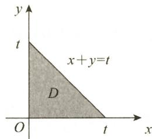
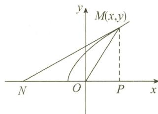

# 第六章 微分方程及其应用

# 基础题

## 一、选择题

(1) A.

解 $\frac{dy}{dx}+\frac{x}{y}=0$ 为可分离变量方程，故 $ydy+xdx=0$ ，积分得 $x^{2}+y^{2}=C_{1}, C_{1}\geqslant0$ ，即 $x^{2}+y^{2}=C^{2}$ 。选项 A 正确。

(2)B.

解 将 $y = \cos 2x$ 代入 $y' + P(x)y = 0$ ，解得 $P(x) = 2\tan 2x$ ，故

$$
y ^ {\prime} + (2 \tan 2 x) y = 0.
$$

解此一阶线性齐次微分方程,得

$$
y = C \mathrm{e} ^ {- \int P (x) \mathrm{d} x} = C \mathrm{e} ^ {- \int 2 \tan 2 x \mathrm{d} x} = C \cos 2 x.
$$

由 $y(0)=2$ , 得 C=2 ，故 $y=2\cos2x$ 。选项 B 正确。

(3) A.

解 $y'' + 2y' - 3y = \mathrm{e}^{-x} + x$ 的特解为两个微分方程 $y'' + 2y' - 3y = \mathrm{e}^{-x}$ 与 $y'' + 2y' - 3y = x \cdot \mathrm{e}^{0 \cdot x}$ 的两个特解之和. 齐次线性微分方程特征方程为 $r^2 + 2r - 3 = 0$ , 得 $r_1 = 1, r_2 = -3$ . 由于 $\lambda = -1$ 与 $\lambda = 0$ 均不是特征根, 故 $y'' + 2y' - 3y = \mathrm{e}^{-x}$ 有形如 $a\mathrm{e}^{-x}$ 的特解, $y'' + 2y' - 3y = x$ 有形如 $bx + c$ 的特解, 所以原方程的特解形式为 $a\mathrm{e}^{-x} + bx + c$ . 选项 A 正确.

(4) A.

解 依题意, $y_{1}(x)-y_{2}(x)$ 是 $y'+P(x)y=0$ 的解.

当 $P(x)$ 不恒为 0 时，非零常数不可能是 $y' + P(x)y = 0$ 的解，故选择 A.

选项 D 正确, 因为 $y' + P(x)y = 0$ 的通解为 $y = C e^{-\int P(x) dx}$ , 所以任意两个解相差一个常数因子.

选项 C 正确, 因 $y' + P(x)y = 0$ 两个不同的解不能满足相同的初始条件.

事实上，假设存在 $x_0$ ，使得 $y_{1}(x_{0}) = y_{2}(x_{0})$ ，令 $y_{0} = y_{1}(x) - y_{2}(x)$ ，则 $y_0(x)$ 是该方程的解，且满足初始条件 $y_0(x_0) = 0$ ，根据微分方程解的存在唯一性定理，知 $y_0(x)$ 恒为零，故 $y_{1}(x) = y_{2}(x)$ ，与已知条件矛盾.

(5)D.

解 由线性微分方程解的性质和结构,知该方程的通解为

即

$$
\begin{array}{r l} & C _ {1} [ y _ {1} (x) - y _ {3} (x) ] + C _ {2} [ y _ {2} (x) - y _ {3} (x) ] + y _ {3} (x), \\ & \qquad C _ {1} y _ {1} (x) + C _ {2} y _ {2} (x) + (1 - C _ {1} - C _ {2}) y _ {3} (x). \end{array}
$$

令 $C_3 = 1 - C_1 - C_2$ ，则 $C_1 + C_2 + C_3 = 1.$ 选项D正确

(6) A.

解 由 $y_{1}=e^{-x}$ 为方程的解, 知 $r_{1}=-1$ 是该方程的一个特征根.

又 $y_{2}=2x$ 为方程的解,代入方程,有

$$
0 + 0 + b \cdot 2 + c \cdot 2 x = 0, \text {   即   } b + c x = 0. \text {   故   } c = 0, b = 0.
$$

由特征方程 $r^3 + ar^2 + br + c = r^3 + ar^2 = 0$ 有特征根-1，得 $a = 1$ ，即 $r^3 + r^2 = 0$ ，可解得 $r_2 = r_3 = 0.$

故通解为 $c_{1}\mathrm{e}^{-x} + c_{2}\mathrm{e}^{0x} + c_{3}x\mathrm{e}^{0x} = c_{1}\mathrm{e}^{-x} + c_{2} + c_{3}x.$

选项 A 正确.

(7)C.

解 $y' + ay = f(x)$ 的通解为 $y = \mathrm{e}^{-ax}\left[\int_{0}^{x}f(t)\mathrm{e}^{at}\mathrm{d}t + C\right]$ ，故

$$
\begin{array}{r l} \lim _ {x \to + \infty} y (x) & = \lim _ {x \to + \infty} \left[ C \mathrm{e} ^ {- a x} + \mathrm{e} ^ {- a x} \int_ {0} ^ {x} f (t) \mathrm{e} ^ {a t} \mathrm{d} t \right] \\ & = 0 + \lim _ {x \to + \infty} \frac {\int_ {0} ^ {x} f (t) \mathrm{e} ^ {a t} \mathrm{d} t}{\mathrm{e} ^ {a x}} \\ & = \lim _ {x \to + \infty} \frac {f (x) \mathrm{e} ^ {a x}}{a \mathrm{e} ^ {a x}} = \frac {b}{a}, \end{array}
$$

故 $y = y(x)$ 有水平渐近线 $y = \frac{b}{a}$ . 选项C正确.

## 二、填空题

(1) $y=\frac{1}{x}(\sin x-x\cos x+C)$ (C为任意常数).

解 原方程变形为 $\frac{dy}{dx}+\frac{1}{x}y=\sin x$ ，为一阶线性微分方程，故通解为

$$
\begin{array}{r l} y & = \mathrm{e} ^ {- \int P (x) \mathrm{d} x} \left[ \int Q (x) \mathrm{e} ^ {\int P (x) \mathrm{d} x} \mathrm{d} x + C \right] = \mathrm{e} ^ {- \int \frac {1}{x} \mathrm{d} x} \left(\int \sin x \cdot \mathrm{e} ^ {\int \frac {1}{x} \mathrm{d} x} \mathrm{d} x + C\right) \\ & = \mathrm{e} ^ {- \ln | x |} \left(\int \mathrm{e} ^ {\ln | x |} \sin x   \mathrm{d} x + C\right) \\ & = \frac {1}{x} \left(\int x \sin x   \mathrm{d} x + C\right) = \frac {1}{x} (\sin x - x \cos x + C) (C \text {为任意常数}). \end{array}
$$

【注】① 若令 $P = y - x \sin x, Q = x$ ，则 $\frac{\partial Q}{\partial x} = \frac{\partial P}{\partial y} = 1$ ，所以该方程为全微分方程，故通解为 $\int_{0}^{x} P(x, 0) \, dx + \int_{0}^{y} Q(x, y) \, dy = C$ ，即 $\int_{0}^{x} (0 - x \sin x) \, dx + \int_{0}^{y} x \, dy = C$ .

故 $x \cos x - \sin x + xy = C$ 为通解.

② $P(x,y)\mathrm{d}x+Q(x,y)\mathrm{d}y=0$ ，当 $\frac{\partial Q}{\partial x}=\frac{\partial P}{\partial y}$ 时，该方程为全微分方程，有通解公式

$$
\int_ {x _ {0}} ^ {x} P (x, y _ {0}) \mathrm{d} x + \int_ {y _ {0}} ^ {y} Q (x, y) \mathrm{d} y = C.
$$

(2) $(2x-1)(1+y^{2})=C$ (C为任意常数).

解 原方程可化为可分离变量方程 $\frac{\mathrm{d}x}{2x - 1} +\frac{y\mathrm{dy}}{1 + y^2} = 0$ ，积分可得

$$
\frac {1}{2} \ln | 2 x - 1 | + \frac {1}{2} \ln (1 + y ^ {2}) = \frac {1}{2} \ln C.
$$

故通解为

$(2x-1)(1+y^{2})=C$ (C为任意常数).

(3) $\sin\frac{y}{x}=\frac{1}{2}x.$

解 原方程为齐次微分方程, 令 $u = \frac{y}{x}$ , 即 y = ux, 则

$$
\frac {\mathrm{d} y}{\mathrm{d} x} = u + x \cdot \frac {\mathrm{d} u}{\mathrm{d} x} = u + \tan u.
$$

分离变量得 $\cot u\mathrm{d}u = \frac{\mathrm{d}x}{x}$ 积分得 $\ln |\sin u| = \ln |x| + C_1$ ，故

$\sin u = \pm e^{C_{1}} \cdot x = Cx (C \neq 0)$ , 即 $\sin \frac{y}{x} = Cx (C \neq 0)$ .

又 y=0 也是原方程的解 (y=0 在分离变量过程中漏掉了)，故上面常数也可以为零，则原方程的通解为 $\sin\frac{y}{x}=Cx$ (C 为任意常数).

由 $y(1) = \frac{\pi}{6}$ , 得 $C = \frac{1}{2}$ , 故所求特解为 $\sin \frac{y}{x} = \frac{1}{2} x$ .

(4) $y + \sqrt{x^{2} + y^{2}} = Cx^{2}(x > 0)$ 和 $-y + \sqrt{x^{2} + y^{2}} = C(x < 0)$ ，其中 $C$ 为大于零的常数.

解 方程变形为 $y' = \frac{\sqrt{x^{2} + y^{2}}}{x} + \frac{y}{x}$ .

当 $x > 0$ 时，方程化为 $y' = \sqrt{1 + \left(\frac{y}{x}\right)^2} + \frac{y}{x}$

当 $x < 0$ 时，方程化为 $y' = -\sqrt{1 + \left(\frac{y}{x}\right)^2} + \frac{y}{x}$ .

令 $\frac{y}{x} = u$ ，则 $\frac{\mathrm{dy}}{\mathrm{dx}} = u + x\frac{\mathrm{du}}{\mathrm{dx}}$ ，方程变为 $\frac{\mathrm{du}}{\sqrt{1 + u^2}} = \pm \frac{\mathrm{dx}}{x}$ 两种情形，积分可得 $y + \sqrt{x^2 + y^2} = Cx^2 (x > 0)$ 和 $-y + \sqrt{x^2 + y^2} = C(x < 0)$ ，为原方程通解，其中 $C$ 为大于零的常数.

(5) $y = \frac{1}{4} [(x + 1)e^{-x} + (x - 1)e^{x}]$ .

解 特征方程为 $r^{2}+2r+1=0$ , $r_{1}=r_{2}=-1$ , 故对应齐次微分方程的通解为

$$
y = C _ {1} \mathrm{e} ^ {- x} + C _ {2} x \mathrm{e} ^ {- x}.
$$

由非齐次项 $x\mathrm{e}^x$ ，知 $\lambda = 1$ 不是特征根，故令特解为 $y^{*} = (ax + b)\mathrm{e}^{x}$ ，将 $y^{*}$ 代入原方程，比较系数得 $a = \frac{1}{4},b = -\frac{1}{4}$ ，故通解为

$$
y = C _ {1} \mathrm{e} ^ {- x} + C _ {2} x \mathrm{e} ^ {- x} + \frac {1}{4} (x - 1) \mathrm{e} ^ {x}.
$$

由 $y(0) = 0, y'(0) = 0$ ，得 $C_1 = \frac{1}{4}, C_2 = \frac{1}{4}$ ，故所求特解为

$$
y = \frac {1}{4} [ (x + 1) \mathrm{e} ^ {- x} + (x - 1) \mathrm{e} ^ {x} ].
$$

(6) $y = e^{-x} (\sin x + \cos x)$ .

解 特征方程 $r^{2}-3r+2=0$ 的特征根为 $r_{1}=1, r_{2}=2$ ，故对应的齐次微分方程的通解为

$$
y = C _ {1} \mathrm{e} ^ {x} + C _ {2} \mathrm{e} ^ {2 x}.
$$

由非齐次项 $10e^{-x}\sin x$ ，知 $-1\pm i$ 不是特征根，故令原方程的特解为 $y^{*}=e^{-x}(A\sin x+B\cos x)$ ，将其代入原方程，可解得 A=B=1，所以原方程的通解为

$$
y = C _ {1} \mathrm{e} ^ {x} + C _ {2} \mathrm{e} ^ {2 x} + \mathrm{e} ^ {- x} (\sin x + \cos x).
$$

当 $x \to +\infty$ 时， $y(x) \to 0$ ，而 $\mathrm{e}^x \to +\infty$ ， $\mathrm{e}^{2x} \to +\infty$ ，因此有 $C_1 = C_2 = 0$ ，故所求特解为

$$
y = \mathrm{e} ^ {- x} (\sin x + \cos x).
$$

(7) $y = \arcsin x (-1 < x < 1).$

解 已知方程为不显含 y 的可降阶方程，令 $y' = p$ ，则 $y'' = p'$ ，原方程变为 $(1 - x^{2})p' - xp = 0$ ，即

$p^{\prime} - \frac{x}{1 - x^{2}} p = 0 (x \neq \pm 1)$ , 为一阶线性微分方程, 有 $p = C_{1}\mathrm{e}^{\int \frac{x}{1 - x^{2}}\mathrm{d}x}$ , 即

$$
p = C _ {1} \mathrm{e} ^ {- \frac {1}{2} \ln (1 - x ^ {2})} = \frac {C _ {1}}{\sqrt {1 - x ^ {2}}}.
$$

由 $p(0)=y'(0)=1$ , 得 $C_{1}=1$ , 故

$$
y = \int p (x) \mathrm{d} x = \int \frac {\mathrm{d} x}{\sqrt {1 - x ^ {2}}} = \arcsin x + C _ {2}.
$$

又由 $y(0) = 0$ ，得 $C_2 = 0$ ，所以

$$
y = \arcsin x (- 1 <   x <   1).
$$

【注】 $\int \frac{x}{1 - x^2}\mathrm{d}x = -\frac{1}{2}\ln |1 - x^2| + C$ ，由已知 $y(0) = 0, y'(0) = 1$ ，意味着在 $(-1, 1)$ 内求解，故

$$
\int \frac {x}{1 - x ^ {2}} \mathrm{d} x = - \frac {1}{2} \ln (1 - x ^ {2}) + C.
$$

(8) $y = C_{1}(e^{x} - x) + C_{2}(e^{-x} - x) + x$ ( $C_{1}, C_{2}$ 为任意常数).

解 由线性微分方程解的性质及通解结构, 知 $y_{1} = e^{x} - x$ , $y_{2} = e^{-x} - x$ 是对应齐次微分方程的两个线性无关的解, 故通解为

$y = C_{1}(e^{x} - x) + C_{2}(e^{-x} - x) + x \quad (C_{1}, C_{2} \text{为任意常数}).$

(9) $y = C_{1}e^{-x} + C_{2}e^{x} + xe^{x}$ ( $C_{1}, C_{2}$ 为任意常数).

解 由特解 $y^{*} = \mathrm{e}^{-x}(1 + x\mathrm{e}^{2x}) = \mathrm{e}^{-x} + x\mathrm{e}^{x}$ ，知该方程对应的齐次微分方程有特征根 $r_1 = -1, r_2 = 1$ ，且 $x\mathrm{e}^x$ 是其特解，故该方程的通解为

$$
y = C _ {1} \mathrm{e} ^ {- x} + C _ {2} \mathrm{e} ^ {x} + x \mathrm{e} ^ {x} (C _ {1}, C _ {2} \text {为任意常数}).
$$

## 三、解答题

(1) 解 依题设, 有 $y(1)=0, y'(1)=1$ .

方程 $x^{2}y''-y'^{2}=0$ 不显含 y，令 $y'=p, y''=p'$ ，代入原方程，得 $x^{2}p'-p^{2}=0$ ，分离变量并积分，得 $\frac{1}{p}=\frac{1}{x}+C_{1}$ 。由 $y'(1)=1$ ，得 $C_{1}=0$ ，故 $p=\frac{dy}{dx}=x$ ，积分得， $y=\frac{1}{2}x^{2}+C_{2}$ 。

又由 $y(1) = 0$ ，得 $C_2 = -\frac{1}{2}$ 故所求积分曲线为 $y = \frac{1}{2} (x^2 - 1)$ .

(2) 解 已知等式变形为 $f(x)=\cos x-x\int_{0}^{x}f(t)\mathrm{d}t+\int_{0}^{x}tf(t)\mathrm{d}t$ ，两边同时对 x 求导，得

$$
f ^ {\prime} (x) = - \sin x - \int_ {0} ^ {x} f (t) \mathrm{d} t - x f (x) + x f (x) = - \sin x - \int_ {0} ^ {x} f (t) \mathrm{d} t.\tag{①}
$$

再对 x 求导, 得

$$
f ^ {\prime \prime} (x) + f (x) = - \cos x.\tag{②}
$$

对应齐次方程的特征方程为 $r^{2}+1=0$ ，得 $r=\pm i$ ，故齐次方程的通解为

$$
f (x) = C _ {1} \cos x + C _ {2} \sin x.
$$

由非齐次项 $-\cos x$ ，知 $0 \pm i$ 是特征根，故令特解为 $f^{*} = x (A \cos x + B \sin x)$ ，将其代入 ② 式可得 $A = 0, B = -\frac{1}{2}$ ，所以其通解为

$$
f (x) = C _ {1} \cos x + C _ {2} \sin x - \frac {1}{2} x \sin x.
$$

又由已知等式及 ① 式, 知 $f(0) = 1, f'(0) = 0$ , 故得 $C_1 = 1, C_2 = 0$ , 所以

$$
f (x) = \cos x - \frac {1}{2} x \sin x.
$$

(3) 解 由已知条件 $f(0)=0$ ，且由导数定义，有

$$
\begin{array}{r l}f ^ {\prime} (x)&= \lim _ {\Delta x \rightarrow 0} \frac {f (x + \Delta x) - f (x)}{\Delta x} = \lim _ {\Delta x \rightarrow 0} \frac {\mathrm{e} ^ {x} f (\Delta x) + f (x) (\mathrm{e} ^ {\Delta x} - 1)}{\Delta x}\\&= \lim _ {\Delta x \rightarrow 0} \mathrm{e} ^ {x} \cdot \frac {f (\Delta x) - f (0)}{\Delta x} + \lim _ {\Delta x \rightarrow 0} f (x) \cdot \frac {\mathrm{e} ^ {\Delta x} - 1}{\Delta x}\\&= \mathrm{e} ^ {x} f ^ {\prime} (0) + f (x) = \mathrm{e} ^ {x + 1} + f (x),\end{array}
$$

即 $f'(x) - f(x) = \mathrm{e}^{x+1}$ ，为一阶线性微分方程，故

$$
f (x) = \mathrm{e} ^ {\int \mathrm{d} x} \left(\int \mathrm{e} ^ {x + 1} \mathrm{e} ^ {- \int \mathrm{d} x} \mathrm{d} x + C\right) = x \mathrm{e} ^ {x + 1} + C \mathrm{e} ^ {x}.
$$

又由 $f(0)=0$ , 得 C=0 , 所以 $f(x)=xe^{x+1}$

(4) 解 依题意, $y(0)=0$ , $y'(0)=2$ , $y''(0)=0$ .

$y'''-y'=0$ 的特征方程为 $r^{3}-r=0$ ，特征根为 $r_{1}=0, r_{2}=1, r_{3}=-1$ ，微分方程的通解为

$$
y = C _ {1} + C _ {2} \mathrm{e} ^ {x} + C _ {3} \mathrm{e} ^ {- x},
$$

故

$$
y ^ {\prime} = C _ {2} \mathrm{e} ^ {x} - C _ {3} \mathrm{e} ^ {- x}, y ^ {\prime \prime} = C _ {2} \mathrm{e} ^ {x} + C _ {3} \mathrm{e} ^ {- x}.
$$

代入初始条件 $y(0)=0$ , $y'(0)=2$ , $y''(0)=0$ , 得

$$
C _ {1} + C _ {2} + C _ {3} = 0, C _ {2} - C _ {3} = 2, C _ {2} + C _ {3} = 0,
$$

解得 $C_{1}=0, C_{2}=1, C_{3}=-1$ . 故所求积分曲线为 $y=e^{x}-e^{-x}$ .

(5) 解令 $\sqrt{x^{2}+y^{2}}=u$ ，则

$$
\frac {\partial z}{\partial x} = \frac {x}{u} f ^ {\prime} (u), \frac {\partial^ {2} z}{\partial x ^ {2}} = \frac {u - \frac {x ^ {2}}{u}}{u ^ {2}} f ^ {\prime} (u) + \frac {x ^ {2}}{u ^ {2}} f ^ {\prime \prime} (u) = \frac {y ^ {2}}{u ^ {3}} f ^ {\prime} (u) + \frac {x ^ {2}}{u ^ {2}} f ^ {\prime \prime} (u).
$$

由 $z = f(\sqrt{x^2 + y^2})$ 关于 $x, y$ 具有轮换对称性，知 $\frac{\partial^2 z}{\partial y^2} = \frac{x^2}{u^3} f'(u) + \frac{y^2}{u^2} f''(u)$ . 将其代入 $\frac{\partial^2 z}{\partial x^2} + \frac{\partial^2 z}{\partial y^2} = x^2 + y^2$ ，得 $f''(u) + \frac{1}{u} f'(u) = u^2$ ，即

$$
u f ^ {\prime \prime} (u) + f ^ {\prime} (u) = u ^ {3}, [ u f ^ {\prime} (u) ] ^ {\prime} = u ^ {3}.
$$

积分得 $uf^{\prime}(u) = \frac{1}{4} u^{4} + C_{1}$ ，故 $f^{\prime}(u) = \frac{1}{4} u^{3} + \frac{C_{1}}{u}$ 积分得 $f(u) = \frac{1}{16} u^4 + C_1\ln u + C_2$ ，故

$$
z = \frac {1}{1 6} (x ^ {2} + y ^ {2}) ^ {2} + C _ {1} \ln \sqrt {x ^ {2} + y ^ {2}} + C _ {2} (C _ {1}, C _ {2} \text {为任意常数}).
$$

(6) 解 由 $z = xf\left(\frac{y}{x}\right) + yf\left(\frac{y}{x}\right)$ , 可求得

$$
\frac {\partial z}{\partial x} = f \left(\frac {y}{x}\right) - \frac {y}{x} f ^ {\prime} \left(\frac {y}{x}\right) - \frac {y ^ {2}}{x ^ {2}} f ^ {\prime} \left(\frac {y}{x}\right),
$$

$$
\frac {\partial z}{\partial y} = f ^ {\prime} \left(\frac {y}{x}\right) + f \left(\frac {y}{x}\right) + \frac {y}{x} f ^ {\prime} \left(\frac {y}{x}\right),
$$

$$
\frac {\partial^ {2} z}{\partial x \partial y} = - \frac {y}{x ^ {2}} f ^ {\prime \prime} \left(\frac {y}{x}\right) - \frac {2 y}{x ^ {2}} f ^ {\prime} \left(\frac {y}{x}\right) - \frac {y ^ {2}}{x ^ {3}} f ^ {\prime \prime} \left(\frac {y}{x}\right),
$$

$$
\frac {\partial^ {2} z}{\partial y ^ {2}} = \frac {1}{x} f ^ {\prime \prime} \left(\frac {y}{x}\right) + \frac {2}{x} f ^ {\prime} \left(\frac {y}{x}\right) + \frac {y}{x ^ {2}} f ^ {\prime \prime} \left(\frac {y}{x}\right).
$$

令 $\frac{y}{x} = u$ ，则 $x\frac{\partial^2z}{\partial x\partial y} + 2y\frac{\partial^2z}{\partial y^2} = \frac{y}{x}$ 可化为

$$
f ^ {\prime \prime} (u) (u + u ^ {2}) + 2 u f ^ {\prime} (u) = u,
$$

即 $f''(u)+\frac{2}{1+u}f'(u)=\frac{1}{1+u}$ ，为可降阶的高阶微分方程.

令 $f'(u) = p$ ，则 $f''(u) = p'$ ，有

$$
\begin{array}{r l} & p ^ {\prime} + \frac {2}{1 + u} p = \frac {1}{1 + u}. \\ & p = \mathrm{e} ^ {- \int \frac {2}{1 + u} \mathrm{d} u} \left(\int \frac {1}{1 + u} \mathrm{e} ^ {\int \frac {2}{1 + u} \mathrm{d} u} \mathrm{d} u + c _ {1}\right) \\ & = \frac {1}{2} + c _ {1} (1 + u) ^ {- 2}. \end{array}
$$

由 $z(x,x) = xf\left(\frac{x}{x}\right) + xf\left(\frac{x}{x}\right) = 2xf(1) = x$ ，知 $f(1) = \frac{1}{2}$

$$
\left. \frac {\partial z}{\partial x} \right| _ {(x, x)} = f (1) - 1 \cdot f ^ {\prime} (1) - f ^ {\prime} (1) = f (1) - 2 f ^ {\prime} (1) = - \frac {3}{2},
$$

得 $f'(1)=1$ . 故 $1=\frac{1}{2}+c_{1}(1+1)^{-2}$ , 得 $c_{1}=2$ .

$$
p = f ^ {\prime} (u) = \frac {1}{2} + 2 (1 + u) ^ {- 2},
$$

积分得

$$
f (u) = \frac {1}{2} u - \frac {2}{1 + u} + c _ {2}.
$$

由 $f(1) = \frac{1}{2}$ , 得 $c_{2} = 1$ .

故 $f(u)=\frac{1}{2}u-\frac{2}{1+u}+1.$

(7) 解由 $u = e^{x}$ ，知 $x = \ln u$ ，则

$$
\frac {\mathrm{d} y}{\mathrm{d} x} = \frac {\mathrm{d} y}{\mathrm{d} u} \cdot \frac {\mathrm{d} u}{\mathrm{d} x} = u \frac {\mathrm{d} y}{\mathrm{d} u},
$$

$$
\frac {\mathrm{d} ^ {2} y}{\mathrm{d} x ^ {2}} = \frac {\mathrm{d}}{\mathrm{d} x} \left(u \frac {\mathrm{d} y}{\mathrm{d} u}\right) = \frac {\mathrm{d}}{\mathrm{d} u} \left(u \frac {\mathrm{d} y}{\mathrm{d} u}\right) \cdot \frac {\mathrm{d} u}{\mathrm{d} x} = u \frac {\mathrm{d} y}{\mathrm{d} u} + u ^ {2} \frac {\mathrm{d} ^ {2} y}{\mathrm{d} u ^ {2}}.
$$

将其代入原方程,得

$$
\frac {\mathrm{d} ^ {2} y}{\mathrm{d} u ^ {2}} - 2 \frac {\mathrm{d} y}{\mathrm{d} u} + y = u.\tag{①}
$$

其对应齐次微分方程的特征方程为 $r^{2}-2r+1=0$ ，得 $r_{1}=r_{2}=1$ 。

令特解 $y^{*}=au+b$ ，代入方程①可解得 $y^{*}=u+2$ 。故方程①的通解为

$$
y = C _ {1} \mathrm{e} ^ {u} + C _ {2} u \mathrm{e} ^ {u} + u + 2.
$$

将 $u = e^{x}$ 代入得原微分方程的通解为

$$
y = (C _ {1} + C _ {2} \mathrm{e} ^ {x}) \mathrm{e} ^ {\mathrm{e} ^ {x}} + \mathrm{e} ^ {x} + 2 (C _ {1}, C _ {2} \text {为任意常数}).
$$

(8) 解（I）依题设，曲线 L 过点 $P(x, y)$ 的切线为 $Y - y = y'(X - x)$ . 令 X = 0，则切线在 y 轴上的截距为 $y - xy'$ .

由已知， $\sqrt{x^{2}+y^{2}}=y-xy'$ ，即 $y'=\frac{y-\sqrt{x^{2}+y^{2}}}{x}$ .

由 $x > 0$ ，得 $y' = \frac{y}{x} -\sqrt{1 + \left(\frac{y}{x}\right)^2}$ ，为齐次微分方程.令 $\frac{y}{x} = u$ ，则 $y^{\prime} = u + xu^{\prime}$ ，则 $u + xu^{\prime} = u-$ $\sqrt{1 + u^2}$ ，为可分离变量的微分方程，

$$
\frac {\mathrm{d} u}{\sqrt {1 + u ^ {2}}} = - \frac {\mathrm{d} x}{x},
$$

积分并代回 $\frac{y}{x} = u$ ，得 $y + \sqrt{x^2 + y^2} = C.$ 又 $L$ 过 $\left(\frac{1}{2},0\right)$ ，得 $C = \frac{1}{2}$ ，于是曲线 $L$ 的方程为

$y + \sqrt{x^{2} + y^{2}} = \frac{1}{2}$ , 即 $y = \frac{1}{4} - x^{2}$ .

（Ⅱ）在第一象限内， $y=\frac{1}{4}-x^{2}$ 在点 $P(x,y)$ 处的切线方程为

$Y-\left(\frac{1}{4}-x^{2}\right)=-2x(X-x)$ ，即 $Y=-2x\cdot X+x^{2}+\frac{1}{4}\quad(0<x\leqslant\frac{1}{2})$ .

它与 $x$ 轴、 $y$ 轴的交点分别为 $\left(\frac{x^2 + \frac{1}{4}}{2x}, 0\right)$ 与 $\left(0, x^2 + \frac{1}{4}\right)$ ，故所求面积为

$$
A (x) = \frac {1}{2} \cdot \frac {\left(x ^ {2} + \frac {1}{4}\right) ^ {2}}{2 x} - \int_ {0} ^ {\frac {1}{2}} \left(\frac {1}{4} - x ^ {2}\right) \mathrm{d} x,
$$

则

$$
A ^ {\prime} (x) = \frac {1}{4 x ^ {2}} \Bigl (x ^ {2} + \frac {1}{4} \Bigr) \left(3 x ^ {2} - \frac {1}{4}\right) = 0, \text {   得   } x = \frac {\sqrt {3}}{6}.
$$

当 $0 < x < \frac{\sqrt{3}}{6}$ 时， $A'(x) < 0$ ；当 $x > \frac{\sqrt{3}}{6}$ 时， $A'(x) > 0$ .

故 $x = \frac{\sqrt{3}}{6}$ 是 $A(x)$ 在 $\left(0, \frac{1}{2}\right]$ 上唯一的极小值点，也是最小值点，所求切线为

$Y = -2 \cdot \frac{\sqrt{3}}{6} X + \frac{3}{36} + \frac{1}{4}$ ，即 $Y = -\frac{\sqrt{3}}{3} X + \frac{1}{3}$ .

(9) 解 设曲线弧 $\widehat{OA}$ 的方程为 $y = y(x)$ ，则 $\widehat{OP}$ 与 $\overline{OP}$ 所围面积为

$$
\int_ {0} ^ {x} \left[ y (t) - \frac {y}{x} t \right] \mathrm{d} t = \int_ {0} ^ {x} y (t) \mathrm{d} t - \frac {1}{2} x y.
$$

依题意， $\int_0^x y(t)\mathrm{d}t - \frac{1}{2} xy = x^2 (x > 0)$ ，两边同时对 $x$ 求导，得

$$
y - \frac {1}{2} y - \frac {1}{2} x y ^ {\prime} = 2 x,
$$

即 $y' - \frac{1}{x} y = -4$ ，为一阶线性微分方程，其通解为

$$
y = x (\ln x ^ {- 4} + C) = x (C - 4 \ln x).
$$

又由已知，有 $y(1) = 1$ ，可得 $C = 1$ ，故所求方程为

$$
y = \left\{ \begin{array}{l l} x - 4 x \ln x, & 0 <   x \leqslant 1, \\ 0, & x = 0. \end{array} \right.
$$

【注】① $y = x - 4x \ln x$ 在 $x = 0$ 处无定义，但由于当 $x \to 0^{+}$ 时， $x - 4x \ln x \to 0$ ，故 $x = 0$ 是函数的可去间断点，若令 $y(0) = 0$ ，则积分曲线过原点.

②依题设，曲线过 $O(0,0)$ 和 $A(1,1)$ ，若将 $y(0)=0$ 作为初始条件，则从通解中不能确定常数C.

(10) 解（I）已知方程变形为 $y' - \left(2x - \frac{1}{x}\right)y = x^{2}$ ，其通解为

$$
\begin{array}{r l} y & = \mathrm{e} ^ {\int (2 x - \frac {1}{x}) \mathrm{d} x} \left[ \int x ^ {2} \mathrm{e} ^ {\int (\frac {1}{x} - 2 x) \mathrm{d} x} \mathrm{d} x + C \right] \\ & = \frac {1}{x} \mathrm{e} ^ {x ^ {2}} \left(\int x ^ {3} \mathrm{e} ^ {- x ^ {2}} \mathrm{d} x + C\right) \end{array}
$$

$$
\begin{array}{l} = \frac {1}{x} \mathrm{e} ^ {x ^ {2}} \left(- \frac {1}{2} x ^ {2} \mathrm{e} ^ {- x ^ {2}} - \frac {1}{2} \mathrm{e} ^ {- x ^ {2}} + C\right) \\ = - \frac {x}{2} - \frac {1}{2 x} + \frac {C \mathrm{e} ^ {x ^ {2}}}{x}. \end{array}
$$

由 $y(1) = a$ ，得 $C = (1 + a)\mathrm{e}^{-1}$ ，故

$$
y (x) = - \frac {x}{2} - \frac {1}{2 x} + (1 + a) \mathrm{e} ^ {- 1} \cdot \frac {\mathrm{e} ^ {x ^ {2}}}{x}.
$$

(Ⅱ) 由(Ⅰ)知

$$
\frac {y (x)}{x} = - \frac {1}{2} - \frac {1}{2 x ^ {2}} + (1 + a) \mathrm{e} ^ {- 1} \frac {\mathrm{e} ^ {x ^ {2}}}{x ^ {2}}.
$$

由 $\lim_{x\to +\infty}\frac{y(x)}{x} = \lim_{x\to +\infty}\left[-\frac{1}{2} -\frac{1}{2x^2} +(1 + a)\mathrm{e}^{-1}\frac{\mathrm{e}^{x^2}}{x^2}\right] = -\frac{1}{2} +\lim_{x\to +\infty}(1 + a)\mathrm{e}^{-1}\frac{\mathrm{e}^{x^2}}{x^2}$ 存在且 $\lim_{x\to +\infty}\frac{\mathrm{e}^{x^2}}{x^2} = +\infty$ 知仅当 $a = -1$ 时， $\lim_{x\to +\infty}\frac{y(x)}{x} = -\frac{1}{2}$ ，即极限存在.故

$$
\lim _ {x \to + \infty} \left[ y (x) - \left(- \frac {1}{2} x\right) \right] = \lim _ {x \to + \infty} \left(- \frac {1}{2 x}\right) = 0,
$$

所求斜渐近线方程为

$$
y = - \frac {1}{2} x.
$$

(11) 解（Ⅰ）已知方程变形为 $f'(x) - \frac{1}{x} f(x) = a \left( \frac{1}{x} - \frac{\ln x}{x} \right) + x$ ，则该方程的通解为

$$
\begin{array}{r l} f (x) & = \mathrm{e} ^ {\int \frac {1}{x} \mathrm{d} x} \left\{\int \left[ a \left(\frac {1}{x} - \frac {\ln x}{x}\right) + x \right] \mathrm{e} ^ {- \int \frac {1}{x} \mathrm{d} x} \mathrm{d} x + C \right\} \\ & = x \left\{\int \left[ a \left(\frac {1}{x} - \frac {\ln x}{x}\right) + x \right] \frac {1}{x} \mathrm{d} x + C \right\} \\ & = x \left[ \int a \left(\frac {1}{x ^ {2}} - \frac {\ln x}{x ^ {2}}\right) \mathrm{d} x + \int \mathrm{d} x + C \right] \\ & = x \left[ - \frac {a}{x} + a \left(\frac {\ln x}{x} + \frac {1}{x}\right) + x + C \right] \\ & = - a + a (\ln x + 1) + x ^ {2} + C x \\ & = a \ln x + x ^ {2} + C x. \end{array}
$$

由 $f(1)=1-a$ , 得 C=-a , 故 $f(x)=a\ln x+x^{2}-ax$

(Ⅱ) 由(Ⅰ)知 $f(x)=0$ ，即 $\frac{1}{a}=\frac{x-\ln x}{x^{2}}$ .

令 $g(x) = \frac{x - \ln x}{x^2}$ , 则 $g'(x) = \frac{2\ln x - x - 1}{x^3}$ .

令 $h(x) = 2\ln x - x - 1$ ，则 $h^{\prime}(x) = \frac{2}{x} -1 = \frac{2 - x}{x}$

当 $x \in (0,2)$ 时， $h'(x) > 0$ ；当 $x \in (2, +\infty)$ 时， $h'(x) < 0$ .

故 x = 2 为 $h(x)$ 的极大值点，也是最大值点，最大值为 $h(2) = 2 \ln 2 - 3 < 0$ .

从而 $g'(x) < 0, g(x)$ 在 $(0, +\infty)$ 内单调递减.

又 $\lim_{x\to 0^{+}}g(x) = +\infty ,\lim_{x\to +\infty}g(x) = 0$ ，知 $g(x)$ 的值域为 $(0, + \infty)$

故 $\frac{1}{a}>0$ ，即a的取值范围为 $(0,+\infty)$ .

## 综合题

## 一、选择题

(1) A.

解 由通解 $y = C_1 \mathrm{e}^x + C_2 \cos x + C_3 \sin x$ ，知其特征根为 $r_1 = 1, r_2 = \mathrm{i}, r_3 = -\mathrm{i}$ ，故对应的特征方程为 $(r-1)(r^2+1) = 0$ ，即 $r^3 - r^2 + r - 1 = 0$ ，对应的微分方程为 $y''' - y'' + y' - y = 0$ . 选项 A 正确. (2) C.

解 由齐次微分方程通解 $y = C_1\mathrm{e}^x + C_2x\mathrm{e}^x$ ，知对应特征方程的根为 $r_1 = r_2 = 1$ ，其特征方程为 $(r - 1)^2 = 0$ ，即 $r^2 - 2r + 1 = 0$ ，故 $p = -2, q = 1$ . 所以非齐次微分方程为

$$
y ^ {\prime \prime} - 2 y ^ {\prime} + y = x.\tag{①}
$$

令特解 $y^{*}=ax+b$ ，代入上式，得 $-2a+ax+b=x$ ，解得 a=1, b=2，故方程①的通解为

$$
y = C _ {1} \mathrm{e} ^ {x} + C _ {2} x \mathrm{e} ^ {x} + x + 2.
$$

由 $y(0)=2, y'(0)=0$ ，得 $C_{1}=0, C_{2}=-1$ ，故 $y=-xe^{x}+x+2$ 。选项 C 正确。
(3) A.

解 由 $y = \mathrm{e}^{Cx + x^2}$ ，有 $\ln y = x^2 + Cx$ ，即 $\frac{\ln y}{x} - x = C$ ，两边同时对 $x$ 求导，得

$$
\frac {\frac {x}{y} \cdot y ^ {\prime} - \ln y}{x ^ {2}} - 1 = 0, \text {化简得} x y ^ {\prime} - y \ln y = x ^ {2} y.
$$

选项 A 正确.

(4) B.

解 由 $\lambda y_{1} + \mu y_{2}$ 是 $y^{\prime} + P(x)y = Q(x)$ 的解，知 $(\lambda y_{1} + \mu y_{2})^{\prime} + P(x)(\lambda y_{1} + \mu y_{2}) = Q(x)$ ，即

即故

$$
\begin{array}{r l} & {\lambda \left[ y _ {1} ^ {\prime} + P (x) y _ {1} \right] + \mu \left[ y _ {2} ^ {\prime} + P (x) y _ {2} \right] = Q (x),} \\ & {\quad (\lambda + \mu) Q (x) = Q (x) (Q (x) \neq 0),} \end{array}
$$

$$
\lambda + \mu = 1.\tag{①}
$$

由 $\lambda y_{1} - \mu y_{2}$ 是 $y^{\prime} + P(x)y = 0$ 的解，知 $(\lambda y_{1} - \mu y_{2})^{\prime} + P(x)(\lambda y_{1} - \mu y_{2}) = 0$ ，即

$$
\lambda \left[ y _ {1} ^ {\prime} + P (x) y _ {1} \right] - \mu \left[ y _ {2} ^ {\prime} + P (x) y _ {2} \right] = 0,
$$

即故

$$
(\lambda - \mu) Q (x) = 0 (Q (x) \neq 0),
$$

$$
\lambda - \mu = 0.\tag{②}
$$

解方程 ①、②，得 $\lambda = \frac{1}{2}, \mu = \frac{1}{2}$ . 选项 B 正确.

【注】设 $y_{1}, y_{2}$ 是 $y' + P(x)y = Q(x)$ 的解，则

① $k_{1}y_{1} + k_{2}y_{2}$ 是非齐次微分方程 $y' + P(x)y = Q(x)$ 的解 $\Leftrightarrow k_{1} + k_{2} = 1$ ;

② $k_{1}y_{1} + k_{2}y_{2}$ 是对应齐次微分方程 $y' + P(x)y = 0$ 的解 $\Leftrightarrow k_{1} + k_{2} = 0$ .

对于 n 阶线性微分方程,有类似结果.

(5)C.

解 依题设 $\lambda y_{1}(x) + \mu y_{2}(x)$ 仍是非齐次微分方程 $y' + P(x)y = Q(x)$ 的解的充分必要条件是 $\lambda + \mu = 1$ ，求 $\mathrm{e}^{\lambda^3 + \mu^3}$ 的最小值，只要求 $\lambda^3 + \mu^3$ 在条件 $\lambda + \mu = 1$ 下的最小值.

由 $\mu = 1 - \lambda$ ，有 $\lambda^3 +\mu^3 = \lambda^3 +(1 - \lambda)^3\stackrel {\text{记}}{=}f(\lambda)$ ，则

$$
\begin{array}{r l} f ^ {\prime} (\lambda) & = 3 \lambda^ {2} + 3 (1 - \lambda) ^ {2} \cdot (- 1) = 3 [ \lambda^ {2} - (1 - \lambda) ^ {2} ] \\ & = 3 (2 \lambda - 1). \end{array}
$$

由 $f^{\prime}(\lambda) = 0$ ，得 $\lambda = \frac{1}{2}$ 又 $f''(\lambda) = 6 > 0$ ，知$f\left(\frac{1}{2}\right) = \left(\frac{1}{2}\right)^3 +\left(\frac{1}{2}\right)^3 = \frac{1}{4}$ 为 $\lambda^3 +\mu^3$ 最小值.

选项 C 正确.

(6)A.

解 $y'' + ay' + by = 0$ 的特征方程为 $r^{2} + ar + b = 0$ .

特征根为 $r = \frac{-a \pm \sqrt{a^{2} - 4b}}{2}$ .

它或为相异实根或重实根,或为共轭复根.无论哪种情形,均有特征根的实部为负的.

而

$$
\lim _ {x \to + \infty} \mathrm{e} ^ {- a x} = 0, \quad \lim _ {x \to + \infty} x \mathrm{e} ^ {- a x} = 0,
$$

$$
\lim _ {x \rightarrow + \infty} \mathrm{e} ^ {- \alpha x} \cos \beta x = 0, \quad \lim _ {x \rightarrow + \infty} \mathrm{e} ^ {- \alpha x} \sin \beta x = 0,
$$

其中 $\alpha > 0$ 为常数. 故对 $y'' + ay' + by = 0$ 的任一解 $y = y(x)$ ，有 $\lim_{x \to +\infty} y(x) = 0$ .

选项 A 正确.

(7) B.

解 由已知,有 $f(0)+f'(0)=2$ .

又由 $f(x)$ 在 R 上是偶函数, 知 $f'(x)$ 为奇函数, 故 $f'(0)=0$ , 从而 $f(0)=2$ .

解微分方程 $f(x) + f'(x) = 2e^{x}$ ，有

$$
\begin{array}{r l} f (x) & = \mathrm{e} ^ {- \int \mathrm{d} x} \left(\int 2 \mathrm{e} ^ {x} \cdot \mathrm{e} ^ {\int \mathrm{d} x} \mathrm{d} x + c\right) \\ & = \mathrm{e} ^ {x} + c \mathrm{e} ^ {- x}. \end{array}
$$

由 $f(0)=2$ , 得 c=1 , 故 $f(x)=\mathrm{e}^{x}+\mathrm{e}^{-x}$

由 $a[f(x) - \mathrm{e}^x ]\leqslant x$ ，得 $a\mathrm{e}^{-x}\leqslant x,a\leqslant x\mathrm{e}^{x}$

令 $g(x)=xe^{x}$ ，则 $g'(x)=\mathrm{e}^{x}(x+1)=0$ ，得 x=-1。

当 $x \in (-\infty, -1)$ 时， $g'(x) < 0$ ；当 $x \in (-1, +\infty)$ 时， $g'(x) > 0$ .

故 $g(x)$ 的极小值为 $g(-1) = -\frac{1}{\mathrm{e}}$ 即 $a \in \left(-\infty, -\frac{1}{\mathrm{e}}\right]$ .

选项 B 正确.

## 二、填空题

(1) $x = y(y + 2\ln |y| - \frac{1}{y} + C)$ (C为任意常数).

解 原方程不是可分离变量方程, 不是线性微分方程, 也不是齐次微分方程, 需要变形为 $\frac{dx}{dy} - \frac{1}{y}x = \frac{(y+1)^{2}}{y}$ , 为一阶线性微分方程, 通解为

$$
\begin{array}{r l} x & = \mathrm{e} ^ {- \int - \frac {1}{y} \mathrm{dy}} \left[ \int \frac {(y + 1) ^ {2}}{y} \bullet \mathrm{e} ^ {- \int \frac {1}{y} \mathrm{dy}} \mathrm{dy} + C \right] \\ & = y \Big (y + 2 \ln | y | - \frac {1}{y} + C \Big) (C \text {为任意常数}). \end{array}
$$

(2) $y = e^{x} - e^{-x} - \frac{1}{2}\sin x.$

解 特征方程为 $r^2 - 1 = 0, r = \pm 1$ . 又 $\sin x = \mathrm{e}^{0x} \cdot \sin x, 0 \pm \mathrm{i}$ 不是特征根，故令原方程的特解为 $y^* = a \sin x + b \cos x$ ，则

$$
(y ^ {*}) ^ {\prime} = a \cos x - b \sin x, (y ^ {*}) ^ {\prime \prime} = - a \sin x - b \cos x.
$$

代入原方程,得

$$
- a \sin x - b \cos x - (a \sin x + b \cos x) = \sin x,
$$

即 $-2a\sin x - 2b\cos x = \sin x$ . 比较 $\sin x$ 与 $\cos x$ 的两边系数, 得 $-2a = 1, -2b = 0$ , 即 $a = -\frac{1}{2}, b = 0$ . 所以原方程的通解为

$$
y = C _ {1} \mathrm{e} ^ {x} + C _ {2} \mathrm{e} ^ {- x} - \frac {1}{2} \sin x.
$$

由 $y(0) = 0, y'(0) = \frac{3}{2}$ , 得 $C_1 + C_2 = 0, C_1 - C_2 = 2$ , 解得 $C_1 = 1, C_2 = -1$ , 所以特解为

$$
y = \mathrm{e} ^ {x} - \mathrm{e} ^ {- x} - \frac {1}{2} \sin x.
$$

(3) $y^{2}=C(x+1)-(x+1)\ln|x+1|-1$ (C为任意常数).

解 原方程变形为 $2yy' - \frac{1}{1 + x}y^{2} = -\frac{x}{1 + x}$ . 由 $2yy' = (y^{2})'$ , 令 $u = y^{2}$ , 则方程变为 $u' - \frac{1}{1 + x}u = -\frac{x}{1 + x}$ , 为一阶线性微分方程, 其通解为

$$
\begin{array}{r l} y ^ {2} & = u = \mathrm{e} ^ {\int \frac {1}{1 + x} \mathrm{d} x} \left[ \int \left(- \frac {x}{1 + x}\right) \bullet \mathrm{e} ^ {- \int \frac {1}{1 + x} \mathrm{d} x} \mathrm{d} x + C \right] \\ & = (1 + x) \left[ - \int \frac {x}{(1 + x) ^ {2}} \mathrm{d} x + C \right] \\ & = C (x + 1) - (x + 1) \ln | x + 1 | - 1 (C \text {为任意常数}). \end{array}
$$

(4) $\frac{1}{2} \ln \left[ \left( \frac{y}{x} \right)^2 + 1 \right] + \arctan \frac{y}{x} + \ln x = 0.$

解 已知方程变形为 $\frac{dy}{dx} = \frac{\frac{y}{x} - 1}{\frac{y}{x} + 1}$ ，为一阶齐次微分方程.

令 $\frac{y}{x} = u$ ，则 $y = ux,\frac{\mathrm{dy}}{\mathrm{dx}} = x\frac{\mathrm{du}}{\mathrm{dx}} +u$ ，故 $u + x\frac{\mathrm{du}}{\mathrm{dx}} = \frac{u - 1}{u + 1}$ 分离变量得 $\frac{u + 1}{u^2 + 1}\mathrm{du} = -\frac{\mathrm{dx}}{x}$ 积分得

$$
\frac {1}{2} \ln (u ^ {2} + 1) + \arctan u = - \ln | x | + C.
$$

由 $y(1)=0$ ，得 C=0，故所求特解为

$$
\frac {1}{2} \ln \left[ \left(\frac {y}{x}\right) ^ {2} + 1 \right] + \arctan \frac {y}{x} + \ln x = 0.
$$

(5) $\tan y = \frac{1}{3}\left(1 + x^2 - \frac{1}{\sqrt{1 + x^2}}\right)$ .

解 因为 $(\tan y)' = y'\sec^{2}y$ ，令 $u = \tan y$ ，则原方程为 $u' + \frac{x}{1 + x^{2}}u = x$ ，为一阶线性微分方程，故通解为

$$
\tan y = u = \mathrm{e} ^ {- \int \frac {x}{1 + x ^ {2}} \mathrm{d} x} \left(\int x \mathrm{e} ^ {\int \frac {x}{1 + x ^ {2}} \mathrm{d} x} \mathrm{d} x + C\right) = \frac {C}{\sqrt {1 + x ^ {2}}} + \frac {1}{3} (1 + x ^ {2}).
$$

由 $y(0) = 0$ ，得 $C = -\frac{1}{3}$ 故所求特解为

$$
\tan y = \frac {1}{3} \left(1 + x ^ {2} - \frac {1}{\sqrt {1 + x ^ {2}}}\right).
$$

【注】这类利用导数去“找变量替换”的方法,值得注意.

(6) $y = C_{1}\cos x + C_{2}\sin x + x + \frac{1}{2} x\sin x$ ( $C_{1}, C_{2}$ 为任意常数).

解 特征方程为 $r^{2}+1=0$ ，得 $r=\pm i$ ，故对应齐次微分方程的通解为

$$
y = C _ {1} \cos x + C _ {2} \sin x.
$$

令 $y'' + y = x$ 的特解为 $y_1^* = Ax$ ，则 $(y_1^*)' = A, (y_1^*)'' = 0$ ，故

$$
0 + A x = x, A = 1.
$$

令 $y'' + y = \cos x$ 的特解为 $y_2^* = x (B\cos x + C\sin x)$ ，代入方程解得 $B = 0, C = \frac{1}{2}$ ，故其特解为 $y_2^* = \frac{1}{2} x \sin x$ ，所以原方程的通解为

$$
y = C _ {1} \cos x + C _ {2} \sin x + x + {\frac {1}{2}} x \sin x (C _ {1}, C _ {2}   \text {为任意常数}).
$$

(7) $y = C_{1}e^{x} + C_{2}e^{-x} - \frac{1}{2} + \frac{\cos 2x}{10}$ ( $C_{1}, C_{2}$ 为任意常数).

解 特征方程为 $r^{2}-1=0, r=\pm1$ ，故对应齐次微分方程的通解为 $y=C_{1}e^{x}+C_{2}e^{-x}$ 。又非齐次项为

$$
\sin^ {2} x = \frac {1 - \cos 2 x}{2} = \frac {1}{2} + \frac {- \cos 2 x}{2},
$$

方程 $y'' - y = \frac{1}{2}$ 和 $y'' - y = -\frac{\cos 2x}{2}$ 的特解分别令为

$$
y _ {1} ^ {*} = A, y _ {2} ^ {*} = B \cos 2 x + C \sin 2 x.
$$

将其分别代入上两个方程,可求得 $A = -\frac{1}{2}$ , $B = \frac{1}{10}$ , C = 0, 所以 $y_{1}^{*} = -\frac{1}{2}$ 和 $y_{2}^{*} = \frac{\cos 2x}{10}$ . 故原方程的通解为

$$
y = C _ {1} \mathrm{e} ^ {x} + C _ {2} \mathrm{e} ^ {- x} - {\frac {1}{2}} + {\frac {\cos 2 x}{1 0}} (C _ {1}, C _ {2}   \text {为任意常数}).
$$

(8) $\frac{\sqrt{2}}{2}(x^{2}+1).$

解 将 x = 0 代入已知等式, 有

$$
f (a) = \int_ {0} ^ {a} {\frac {t (t ^ {2} + 1)}{f (t)}} \mathrm{d} t + f (0).
$$

上式两边同时对 $a$ 求导，得 $f^{\prime}(a) = \frac{a(a^{2} + 1)}{f(a)}$ 故 $2f(a)f^{\prime}(a) = 2a + 2a^{3}$ . 又因

$$
\int 2 f (a) f ^ {\prime} (a) \mathrm{d} a = \int (2 a + 2 a ^ {3}) \mathrm{d} a,
$$

故

$$
[ f (a) ] ^ {2} = a ^ {2} + \frac {1}{2} a ^ {4} + C.
$$

由 $f(1) = \sqrt{2}$ , 得 $C = \frac{1}{2}$ , 故

$$
f (x) = \frac {\sqrt {2}}{2} (x ^ {2} + 1) (\text {由} f (1) = \sqrt {2}, \text {知开方取正}).
$$

(9) $\frac{2a+1}{b^{2}}.$

解 $y'' + 2ay' + b^2y = 0$ 的特征方程为 $r^2 + 2ar + b^2 = 0$ ，解得

$$
r _ {1, 2} = - a \pm \sqrt {a ^ {2} - b ^ {2}},
$$

故方程的通解为

$$
y = C _ {1} \mathrm{e} ^ {r _ {1} x} + C _ {2} \mathrm{e} ^ {r _ {2} x} (C _ {1}, C _ {2} \text {为任意常数}).
$$

由 $a > b > 0$ ，知 $r_1, r_2$ 均小于零，故

$$
\begin{array}{r l} & {\underset {x \to + \infty} {\lim} y (x) = \underset {x \to + \infty} {\lim} \left(C _ {1} \mathrm{e} ^ {r _ {1} x} + C _ {2} \mathrm{e} ^ {r _ {2} x}\right) = 0} \\ & {\underset {x \to + \infty} {\lim} y ^ {\prime} (x) = \underset {x \to + \infty} {\lim} \left(C _ {1} r _ {1} \mathrm{e} ^ {r _ {1} x} + C _ {2} r _ {2} \mathrm{e} ^ {r _ {2} x}\right) = 0} \end{array}
$$

于是

$$
\begin{array}{r l} \int_ {0} ^ {+ \infty} y (x) \mathrm{d} x & = \int_ {0} ^ {+ \infty} \left[ - \frac {1}{b ^ {2}} y ^ {\prime \prime} (x) - \frac {2 a}{b ^ {2}} y ^ {\prime} (x) \right] \mathrm{d} x \\ & = - \frac {1}{b ^ {2}} y ^ {\prime} (x) \Big | _ {0} ^ {+ \infty} - \frac {2 a}{b ^ {2}} y (x) \Big | _ {0} ^ {+ \infty} \\ & = - \frac {1}{b ^ {2}} (0 - 1) - \frac {2 a}{b ^ {2}} (0 - 1) = \frac {2 a + 1}{b ^ {2}}. \end{array}
$$

(10) $[0,+\infty)$ .

解 $y'' + ay' + y = 0$ 的特征方程为 $r^{2} + ar + 1 = 0$ .

当 $a \neq \pm 2$ 时, 微分方程的通解为

$$
y (x) = c _ {1} \mathrm{e} ^ {\frac {- a + \sqrt {a ^ {2} - 4}}{2}} + c _ {2} \mathrm{e} ^ {\frac {- a - \sqrt {a ^ {2} - 4}}{2}}.
$$

当 $a^2 - 4 > 0$ ，即 $a > 2$ 或 $a < -2$ 时，要使 $y(x)$ 在 $[0, +\infty)$ 上有界，应有 $-a \pm \sqrt{a^2 - 4} < 0$ ，即 $a > 2$ .

当 $a^2 - 4 < 0$ ，即 $-2 < a < 2$ 时，要使 $y(x)$ 在 $[0, +\infty)$ 上有界，应有 $-a \pm \sqrt{a^2 - 4}$ 的实部小于或等于零，即 $-a \leqslant 0$ ，故 $0 \leqslant a < 2$ .

当 $a = 2$ 时， $y(x) = (c_1 + c_2x)\mathrm{e}^{-x}$ 在 $[0, +\infty)$ 上有界.

当 $a = -2$ 时， $y(x) = (c_1 + c_2x)\mathrm{e}^x$ 在 $[0, +\infty)$ 上无界.

综上所述，当且仅当 $a \geqslant 0$ 时， $y(x)$ 在 $[0, +\infty)$ 上有界。 $a$ 的取值范围为 $[0, +\infty)$ 。

## 三、解答题

(1) 解 已知等式中, 令 x = y = 0, 得 $f(0) = 0$ . 由导数的定义, 有

$$
\begin{array}{r l} f ^ {\prime} (x) & = \lim _ {\Delta x \to 0} \frac {f (x + \Delta x) - f (x)}{\Delta x} = \lim _ {\Delta x \to 0} \frac {\frac {f (x) + f (\Delta x)}{1 - f (x) f (\Delta x)} - f (x)}{\Delta x} \\ & = \lim _ {\Delta x \to 0} \frac {f (\Delta x) [ 1 + f ^ {2} (x) ]}{\Delta x [ 1 - f (x) f (\Delta x) ]} = \lim _ {\Delta x \to 0} \frac {\frac {f (\Delta x) [ 1 + f ^ {2} (x) ]}{\Delta x}}{1 - f (x) f (\Delta x)} \\ & = \lim _ {\Delta x \to 0} [ 1 + f ^ {2} (x) ] \frac {f (\Delta x) - f (0)}{\Delta x} \cdot \lim _ {\Delta x \to 0} \frac {1}{1 - f (x) f (\Delta x)} \\ & = [ 1 + f ^ {2} (x) ] f ^ {\prime} (0), \\ & f ^ {\prime} (x) = [ 1 + f ^ {2} (x) ] f ^ {\prime} (0). \end{array}
$$

即

①

① 式变形为 $\frac{f'(x)}{1 + f^2(x)} = f'(0)$ ，两边同时积分，得

$$
\arctan f (x) = f ^ {\prime} (0) x + C.
$$

由 $f(0)=0$ , 得 C=0 , 故

$$
\arctan f (x) = f ^ {\prime} (0) x,
$$

即

$$
f (x) = \tan [ f ^ {\prime} (0) x ], f ^ {\prime} (0) x \neq \frac {\pi}{2} + k \pi (k \in \mathbf {Z}).
$$

(2) 解（Ⅰ）已知方程化为 $y' + \frac{1}{x^{2}}y = e^{\frac{1}{x}}$ ，为一阶线性微分方程，其通解为

$$
y = \mathrm{e} ^ {- \int \frac {1}{x ^ {2}} \mathrm{d} x} \left(\int \mathrm{e} ^ {\frac {1}{x}} \cdot \mathrm{e} ^ {\int \frac {1}{x ^ {2}} \mathrm{d} x} \mathrm{d} x + c\right) = \mathrm{e} ^ {\frac {1}{x}} (x + c).
$$

由 $y(1) = 3\mathrm{e}$ ，得 $c = 2$ ，故 $y = y(x) = (x + 2)\mathrm{e}^{\frac{1}{x}}$

由 $\lim_{x\to0^{+}}(x+2)e^{\frac{1}{x}}=+\infty,\lim_{x\to+\infty}(x+2)e^{\frac{1}{x}}=+\infty,$ 知 x=0 为铅直渐近线，无水平渐近线.

又

$$
\lim _ {x \to + \infty} \frac {y (x)}{x} = \lim _ {x \to + \infty} \frac {(x + 2) \mathrm{e} ^ {\frac {1}{x}}}{x} = 1,
$$

$$
\begin{array}{r l}\lim _ {x \rightarrow + \infty} [ y (x) - x ]&= \lim _ {x \rightarrow + \infty} [ (x + 2) \mathrm{e} ^ {\frac {1}{x}} - x ]\\&= \lim _ {x \rightarrow + \infty} [ x (\mathrm{e} ^ {\frac {1}{x}} - 1) + 2 \mathrm{e} ^ {\frac {1}{x}} ] = \lim _ {x \rightarrow + \infty} x \cdot \frac {1}{x} + 2 = 3,\end{array}
$$

故 $y = x + 3$ 为斜渐近线.

（Ⅱ）依题设，讨论方程 $(x+2)\mathrm{e}^{\frac{1}{x}}=k$ 不同实根的个数，先求 $y(x)=(x+2)\mathrm{e}^{\frac{1}{x}}$ 的极值.由 $y'(x)=\frac{(x-2)(x+1)}{x^{2}}\mathrm{e}^{\frac{1}{x}}=0$ ，得 $x_{1}=-1$ （舍去）， $x_{2}=2$ ，且

$$
y ^ {\prime \prime} (x) = \frac {5 x + 2}{x ^ {4}} \mathrm{e} ^ {\frac {1}{x}}, y ^ {\prime \prime} (2) = \frac {3}{4} \mathrm{e} ^ {\frac {1}{2}} > 0,
$$

于是 $y(2) = 4\mathrm{e}^{\frac{1}{2}}$ 为极小值.

又

$$
\lim _ {x \to 0 ^ {+}} (x + 2) \mathrm{e} ^ {\frac {1}{x}} = + \infty , \quad \lim _ {x \to + \infty} (x + 2) \mathrm{e} ^ {\frac {1}{x}} = + \infty ,
$$

所以:① 当 $k > 4e^{\frac{1}{2}}$ 时, 方程仅有两个不同的实根, 交点个数为 2.

② 当 $k = 4e^{\frac{1}{2}}$ 时, 方程仅有一个实根, 交点个数为 1.

③ 当 $k < 4e^{\frac{1}{2}}$ 时, 方程没有实根, 交点个数为 0.

(3) 解 由 $x = \sin t, y = y(t)$ 及复合函数求导法则, 有

$$
\frac {\mathrm{d} y}{\mathrm{d} x} = \frac {\mathrm{d} y}{\mathrm{d} t} \cdot \frac {\mathrm{d} t}{\mathrm{d} x} = \frac {1}{\cos t} \frac {\mathrm{d} y}{\mathrm{d} t},
$$

$$
\begin{array}{r l} \frac {\mathrm{d} ^ {2} y}{\mathrm{d} x ^ {2}} & = \frac {\mathrm{d}}{\mathrm{d} x} \left(\frac {\mathrm{d} y}{\mathrm{d} x}\right) = \frac {\mathrm{d}}{\mathrm{d} t} \left(\frac {1}{\cos t} \frac {\mathrm{d} y}{\mathrm{d} t}\right) \cdot \frac {\mathrm{d} t}{\mathrm{d} x} \\ & = \left(\frac {\sin t}{\cos^ {2} t} \cdot \frac {\mathrm{d} y}{\mathrm{d} t} + \frac {1}{\cos t} \frac {\mathrm{d} ^ {2} y}{\mathrm{d} t ^ {2}}\right) \frac {1}{\cos t} \\ & = \frac {1}{\cos^ {2} t} \frac {\mathrm{d} ^ {2} y}{\mathrm{d} t ^ {2}} + \frac {\sin t}{\cos^ {3} t} \frac {\mathrm{d} y}{\mathrm{d} t}. \end{array}
$$

将 $\frac{\mathrm{dy}}{\mathrm{dx}},\frac{\mathrm{d}^2y}{\mathrm{dx}^2}$ 代入原方程，化简为

$$
\frac {\mathrm{d} ^ {2} y}{\mathrm{d} t ^ {2}} + y = 0,\tag{①}
$$

特征方程为 $r^2 + 1 = 0, r = \pm \mathrm{i}$ , 故方程 ① 的通解为 $y = C_1 \cos t + C_2 \sin t$ . 由 $x = \sin t \left(0 < t < \frac{\pi}{2}\right)$ , 知 $\cos t = \sqrt{1 - x^2}$ , 所以原方程的通解为

$y = C_{1} \sqrt{1 - x^{2}} + C_{2}x$ ( $C_{1}, C_{2}$ 为任意常数).

(4) 解 (Ⅰ) 由 $t = \mathrm{e}^{-x}$ , 有

$$
\frac {\mathrm{d} y}{\mathrm{d} x} = \frac {\mathrm{d} y}{\mathrm{d} t} \cdot \frac {\mathrm{d} t}{\mathrm{d} x} = - \mathrm{e} ^ {- x} \frac {\mathrm{d} y}{\mathrm{d} t} = - t \frac {\mathrm{d} y}{\mathrm{d} t},
$$

$$
\frac {\mathrm{d} ^ {2} y}{\mathrm{d} x ^ {2}} = - \frac {\mathrm{d}}{\mathrm{d} t} \Big (t \frac {\mathrm{d} y}{\mathrm{d} t} \Big) \bullet \frac {\mathrm{d} t}{\mathrm{d} x} = t \frac {\mathrm{d} y}{\mathrm{d} t} + t ^ {2} \frac {\mathrm{d} ^ {2} y}{\mathrm{d} t ^ {2}}.
$$

代入原微分方程,化简得

$$
\frac {\mathrm{d} ^ {2} y}{\mathrm{d} t ^ {2}} + y = t.\tag{①}
$$

由 ① 式为二阶常系数线性非齐次微分方程， $\frac{d^{2}y}{dt^{2}}+y=0$ 的特征方程为 $r^{2}+1=0$ ，得 $r_{1}=i, r_{2}=-i$ 。

令 ① 式的特解为 $y^{*} = at + b$ ，代入方程 ①，得 $a = 1, b = 0$ ，故方程 ① 的通解为

$$
y = C _ {1} \cos t + C _ {2} \sin t + t.
$$

原方程的通解为

$y = C_{1} \cos e^{-x} + C_{2} \sin e^{-x} + e^{-x}$ ( $C_{1}, C_{2}$ 为任意常数).

(Ⅱ) 由于

$$
\lim _ {x \rightarrow + \infty} y (x) = \lim _ {x \rightarrow + \infty} (C _ {1} \cos \mathrm{e} ^ {- x} + C _ {2} \sin \mathrm{e} ^ {- x} + \mathrm{e} ^ {- x}) = C _ {1} = 1,
$$

且 $y(0) = \cos 1 + C_2\sin 1 + 1 = 1$ ，得 $C_2 = -\frac{\cos 1}{\sin 1} = -\cot 1$ ，故

$$
y (x) = \cos \mathrm{e} ^ {- x} - \cot 1 \cdot \sin \mathrm{e} ^ {- x} + \mathrm{e} ^ {- x}.
$$

(5) 解（Ⅰ）由互为反函数的导数关系式，有 $y'(x)=\frac{1}{x'(y)}$ . 两边同时对 x 求导，得

$$
y ^ {\prime \prime} (x) = \left[ \frac {1}{x ^ {\prime} (y)} \right] ^ {\prime} \cdot \frac {1}{x ^ {\prime} (y)} = - \frac {x ^ {\prime \prime} (y)}{\left[ x ^ {\prime} (y) \right] ^ {3}} (x ^ {\prime} (y) \neq 0),
$$

故原方程为 $-\frac{x''(y)}{[x'(y)]^3} + (4x + \mathrm{e}^{2y})\frac{1}{[x'(y)]^3} = 0$ ，即

$$
x ^ {\prime \prime} (y) - 4 x (y) = \mathrm{e} ^ {2 y}.\tag{①}
$$

（Ⅱ）方程 ① 为二阶常系数非齐次线性微分方程，特征方程为 $r^{2}-4=0$ ，解得

$$
r _ {1} = - 2, r _ {2} = 2.
$$

又由 $e^{2y}$ 知 $\lambda = 2$ 是单特征根，令特解为 $x^{*} = y \cdot A \cdot e^{2y}$ ，代入方程①，可求得 $A = \frac{1}{4}$ ，故方程①的通解为

$$
x \left(y\right) = C _ {1} \mathrm{e} ^ {- 2 y} + C _ {2} \mathrm{e} ^ {2 y} + {\frac {1}{4}} y \mathrm{e} ^ {2 y} \quad (C _ {1}, C _ {2}   \text {为任意常数}).
$$

(6) 解 方程的通解为

$$
y = C _ {1} y _ {1} (x) + C _ {2} y _ {2} (x) + y ^ {*} (x),\tag{①}
$$

其中 $y_{1}(x), y_{2}(x)$ 是对应齐次微分方程的两个线性无关的解， $y^{*}(x)$ 是非齐次微分方程的特解.

若 $y^{*}(x)=(Ax+B)\mathrm{e}^{2x}$ ，则 $\lambda=2$ 不是特征根；

若 $y^{*}(x)=x(Ax+B)\mathrm{e}^{2x}$ ，则 $\lambda=2$ 是单特征根.

由已知特解 $y = 2e^{x} + (x^{2} - 1)e^{2x} = 2e^{x} - e^{2x} + x^{2}e^{2x}$ ，应为①式中取定常数所得，从而可知

$$
y _ {1} (x) = \mathrm{e} ^ {x}, y _ {2} (x) = \mathrm{e} ^ {2 x}, y ^ {*} (x) = x ^ {2} \mathrm{e} ^ {2 x}.
$$

因此， $r = 1, r = 2$ 为特征根.由根与系数的关系，知 $a = -(1 + 2) = -3, b = 1 \times 2 = 2$ ，所以原方程的通解为

$$
y = C _ {1} \mathrm{e} ^ {x} + C _ {2} \mathrm{e} ^ {2 x} + x ^ {2} \mathrm{e} ^ {2 x} (C _ {1}, C _ {2} \text {为任意常数}).
$$

将 $y^{*}=x^{2}e^{2x}$ 代入原方程, 可得

$$
\mathrm{e} ^ {2 x} \left(4 x ^ {2} + 8 x + 2\right) - 3 \mathrm{e} ^ {2 x} \left(2 x ^ {2} + 2 x\right) + 2 x ^ {2} \mathrm{e} ^ {2 x} = (c x + d) \mathrm{e} ^ {2 x},
$$

即

$$
2 x + 2 = c x + d, \text {   得   } c = 2, d = 2.
$$

综上可得，a = -3, b = 2, c = 2, d = 2.

(7) 解 令 $y'(x) + y(x) = f(x)$ ，则由一阶线性微分方程的通解公式，得

$$
y (x) = \mathrm{e} ^ {- x} \left[ \int_ {x _ {0}} ^ {x} \mathrm{e} ^ {t} f (t) \mathrm{d} t + C \right], \lim _ {x \rightarrow + \infty} y (x) = \lim _ {x \rightarrow + \infty} \frac {\int_ {x _ {0}} ^ {x} \mathrm{e} ^ {t} f (t) \mathrm{d} t + C}{\mathrm{e} ^ {x}}.
$$

当 $x \to +\infty$ 时，若 $\int_{x_0}^{x} \mathrm{e}^t f(t) \mathrm{d}t \to \infty$ ，则由洛必达法则，知

$$
\lim _ {x \rightarrow + \infty} y (x) = \lim _ {x \rightarrow + \infty} \frac {\mathrm{e} ^ {x} f (x)}{\mathrm{e} ^ {x}} = \lim _ {x \rightarrow + \infty} f (x) = k;
$$

当 $x \to +\infty$ 时，若 $\int_{x_0}^{x} \mathrm{e}^t f(t) \, \mathrm{d}t$ 不趋于 $\infty$ ，则必有 $k = 0$ ，故

$$
\lim _ {x \rightarrow + \infty} y (x) = \lim _ {x \rightarrow + \infty} \mathrm{e} ^ {- x} \left[ \int_ {x _ {0}} ^ {x} \mathrm{e} ^ {t} f (t) \mathrm{d} t + C \right] = 0 = k.
$$

(8) 解 由已知, 有 $f''(x) = g'(x) = 1 - f(x)$ , $f'(0) = g(0) = 1$ , 故

$$
\left\{ \begin{array}{l} f ^ {\prime \prime} (x) + f (x) = 1, \\ f (0) = f ^ {\prime} (0) = 1, \end{array} \right.
$$

解方程得

$$
f (x) = C _ {1} \cos x + C _ {2} \sin x + 1.
$$

由 $f(0) = f'(0) = 1$ ，得 $C_1 = 0, C_2 = 1$ ，故 $f(x) = \sin x + 1$ ，所以

$$
\begin{array}{r l} I & = \int_ {0} ^ {\frac {\pi}{2}} \mathrm{e} ^ {- x} [ g (x) - f (x) ] \mathrm{d} x = \int_ {0} ^ {\frac {\pi}{2}} \mathrm{e} ^ {- x} [ f ^ {\prime} (x) - f (x) ] \mathrm{d} x \\ & = \int_ {0} ^ {\frac {\pi}{2}} \mathrm{d} [ \mathrm{e} ^ {- x} f (x) ] = \mathrm{e} ^ {- x} f (x) \Big | _ {0} ^ {\frac {\pi}{2}} = 2 \mathrm{e} ^ {- \frac {\pi}{2}} - 1. \end{array}
$$

(9) 解 已知等式 $f'(x)=1+\int_{0}^{x}\left[-6\cos2t-f(t)\right]\mathrm{d}t$ ，两边对 x 求导，得

$f''(x) = -6\cos 2x - f(x)$ ，且 $f'(0) = 1$ .

解微分方程：

$$
\left\{ \begin{array}{l} f ^ {\prime \prime} (x) + f (x) = - 6 \cos 2 x, \\ f (0) = 1, f ^ {\prime} (0) = 1, \end{array} \right.\tag{①}
$$

由特征方程 $r^{2}+1=0$ ，得 $r=\pm i$ 。

令特解 $f^{*}=a\cos2x+b\sin2x$ ，代入方程①，得

$$
(- 4 a + a) \cos 2 x + (- 4 b + b) \sin 2 x = - 6 \cos 2 x,
$$

解得 a = 2, b = 0, 故方程①的通解为

$$
f (x) = C _ {1} \cos x + C _ {2} \sin x + 2 \cos 2 x.
$$

由 $f(0) = 1, f'(0) = 1$ ，得 $C_1 = -1, C_2 = 1$ ，故

$$
f (x) = - \cos x + \sin x + 2 \cos 2 x.
$$

于是

(10) 解

$$
\begin{array}{r l} I & = \int_ {0} ^ {\pi} \left[ \frac {f (x)}{x + 1} + f ^ {\prime} (x) \ln (1 + x) \right] \mathrm{d} x \\ & = \int_ {0} ^ {\pi} \mathrm{d} [ f (x) \ln (1 + x) ] = f (x) \ln (1 + x) \Big | _ {0} ^ {\pi} = 3 \ln (1 + \pi). \\ & \int_ {0} ^ {1} y (x u) \mathrm{d} u \stackrel {x u = t} {=} \int_ {0} ^ {x} y (t) \frac {1}{x} \mathrm{d} t = \frac {1}{x} \int_ {0} ^ {x} y (t) \mathrm{d} t, \end{array}
$$

故原方程化为

$$
y ^ {\prime} (x) + 3 \int_ {0} ^ {x} y ^ {\prime} (t) \mathrm{d} t + 2 \int_ {0} ^ {x} y (t) \mathrm{d} t + \mathrm{e} ^ {- x} = 0.\tag{①}
$$

方程 ① 两边同时对 x 求导, 得

$$
y ^ {\prime \prime} (x) + 3 y ^ {\prime} (x) + 2 y (x) = \mathrm{e} ^ {- x},\tag{②}
$$

且 $y(0) = 1, y'(0) = -1$ . 特征方程为 $r^2 + 3r + 2 = 0$ ，得 $r_1 = -1, r_2 = -2$ . 令特解 $y^* = Ax\mathrm{e}^{-x}$ ，代入方程②可得 $A = 1$ ，故方程②的通解为

$$
y = C _ {1} \mathrm{e} ^ {- x} + C _ {2} \mathrm{e} ^ {- 2 x} + x \mathrm{e} ^ {- x}.
$$

又由 $y(0)=1, y'(0)=-1$ ，得 $C_{1}=0, C_{2}=1$ ，故 $y=y(x)=\mathrm{e}^{-2x}+xe^{-x}$ .

(11) 解 已知方程两边同时对 x 求导, 得

$$
f ^ {\prime} (x) = f (1 - x),\tag{①}
$$

两边再同时对 x 求导, 得

$$
f ^ {\prime \prime} (x) = - f ^ {\prime} (1 - x).\tag{②}
$$

由方程 ① 得 $f'(1 - x) = f[1 - (1 - x)] = f(x)$ ，代入方程 ② 得 $f''(x) = -f(x)$ .

由原方程,有 $f(0)=1$ , 在方程①中令 x=0, 得 $f'(0)=f(1)$ . 解初值问题:

$$
\left\{ \begin{array}{l} f ^ {\prime \prime} (x) + f (x) = 0, \\ f (0) = 1, f ^ {\prime} (0) = f (1), \end{array} \right.
$$

可得通解为

$$
f (x) = C _ {1} \cos x + C _ {2} \sin x.
$$

由 $f(0)=1$ , 得 $C_{1}=1$ , 即 $f(x)=\cos x+C_{2}\sin x$ , 故

$$
f ^ {\prime} (x) = - \sin x + C _ {2} \cos x.
$$

再由 $f'(0)=f(1)$ ，得 $C_{2}=\frac{\cos1}{1-\sin1}$ ，故

$$
f (x) = \cos x + \frac {\cos 1}{1 - \sin 1} \sin x.
$$

(12) 证 (I) 由 $f(xy) = yf(x) + xf(y)$ ，令 $y = 1$ ，得 $f(1) = 0$ ，当 $x \in (0, +\infty)$ 时，有

$$
\begin{array}{r l} f ^ {\prime} (x) & = \lim _ {\Delta x \to 0} \frac {f (x + \Delta x) - f (x)}{\Delta x} = \lim _ {\Delta x \to 0} \frac {f \left[ x \left(1 + \frac {\Delta x}{x}\right) \right] - f (x)}{\Delta x} \\ & = \lim _ {\Delta x \to 0} \frac {\left(1 + \frac {\Delta x}{x}\right) f (x) + x f \left(1 + \frac {\Delta x}{x}\right) - f (x)}{\Delta x} \\ & = \lim _ {\Delta x \to 0} \left[ \frac {f (x)}{x} + \frac {f \left(1 + \frac {\Delta x}{x}\right) - f (1)}{\frac {\Delta x}{x}} \right] \\ & = \frac {f (x)}{x} + f ^ {\prime} (1) = \frac {f (x)}{x} + 1, \end{array}
$$

从而 $f(x)$ 在 $(0, +\infty)$ 内可导，且 $f'(x) = \frac{f(x)}{x} + 1$ .

解（Ⅱ）由（Ⅰ）可知，解初值问题： $\left\{\begin{aligned}f'(x)-\frac{1}{x}f(x)=1,\\ f(1)=0,f'(1)=1,\end{aligned}\right.$ 解得 $f(x)=x\ln x$ .

由 $f'(x_{0})=\ln x_{0}+1=0$ , 得唯一驻点 $x_{0}=\frac{1}{e}$ , 故 $f(x)$ 在 $(0,+\infty)$ 内只取极大值或极小值，且仅在 $x_{0}$ 处取得. 又因为 $f''\left(\frac{1}{e}\right)=e>0$ , 所以在点 $x_{0}=\frac{1}{e}$ 处 $f(x)$ 取极小值，且极小值为 $f\left(\frac{1}{e}\right)=-\frac{1}{e}$ , 无极大值.

(13) 解（Ⅰ）由已知， $f'(x)-\frac{1}{x}f(x)=x\cos x(x>0)$ ，解一阶线性微分方程，有

$$
\begin{array}{r l} f (x) & = \mathrm{e} ^ {\int \frac {1}{x} \mathrm{d} x} \left(\int x \cos x \cdot \mathrm{e} ^ {- \int \frac {1}{x} \mathrm{d} x} \mathrm{d} x + C\right) \\ & = x \left(\int x \cos x \cdot x ^ {- 1} \mathrm{d} x + C\right) \\ & = x (\sin x + C). \end{array}
$$

由 $\lim_{x\to 0^{+}}\frac{f(x)}{x} = \lim_{x\to 0^{+}}\frac{x(\sin x + C)}{x} = C = 0$ ，知 $f(x) = x\sin x$

(Ⅱ) 依题设,有

$$
\begin{array}{r l} & A _ {n} = \int_ {0} ^ {n \pi} | f (x) | \mathrm{d} x = \int_ {0} ^ {n \pi} x | \sin x | \mathrm{d} x, \\ & \int_ {0} ^ {n \pi} x | \sin x | \mathrm{d} x \frac {x = n \pi - t}{\text {一}} \int_ {0} ^ {n \pi} (n \pi - t) | \sin t | \mathrm{d} t \\ & = n \pi \int_ {0} ^ {n \pi} | \sin t | \mathrm{d} t - \int_ {0} ^ {n \pi} t | \sin t | \mathrm{d} t \\ & = n \pi \int_ {0} ^ {n \pi} | \sin x | \mathrm{d} x - \int_ {0} ^ {n \pi} x | \sin x | \mathrm{d} x, \\ & \int_ {0} ^ {n \pi} x | \sin x | \mathrm{d} x = \frac {n \pi}{2} \int_ {0} ^ {n \pi} | \sin x | \mathrm{d} x. \end{array}
$$

移项，得

因 $|\sin x|$ 以 $\pi$ 为周期，所以

$$
\int_ {0} ^ {n \pi} x \mid \sin x \mid \mathrm{d} x = \frac {n \pi}{2} \cdot n \int_ {0} ^ {\pi} \sin x \mathrm{d} x = n ^ {2} \pi ,
$$

故

$$
\lim _ {n \to \infty} \frac {A _ {n}}{(n + 1) ^ {2}} = \lim _ {n \to \infty} \frac {n ^ {2} \pi}{(n + 1) ^ {2}} = \pi .
$$

(14) 证 (I) 由 $\mathrm{e}^{f(x)}[f'(x) - 1] = x - 1$ ，得 $\mathrm{e}^{f(x)}f'(x) - \mathrm{e}^{f(x)} = x - 1$ .

令 $\mathrm{e}^{f(x)} = u(x)$ ，则

$$
\begin{array}{r l} u ^ {\prime} (x) - u (x) & = x - 1, \\ u (x) & = \mathrm{e} ^ {\int_ {\mathrm{d} x}} \left[ \int (x - 1) \mathrm{e} ^ {- \int_ {\mathrm{d} x}} \mathrm{d} x + c \right] \\ & = \mathrm{e} ^ {x} \left[ (1 - x) \mathrm{e} ^ {- x} - \mathrm{e} ^ {- x} + c \right] \\ & = c \mathrm{e} ^ {x} - x. \end{array}
$$

由 $f(0)=0$ 及 $\mathrm{e}^{f(x)}=u(x)$ ，知 $u(0)=1$ ，可得 c=1。

从而 $\mathrm{e}^{f(x)} = u(x) = \mathrm{e}^x - x$ ，即 $f(x) = \ln (\mathrm{e}^x - x)$ .

故 $a_{n+1}=\ln(\mathrm{e}^{a_{n}}-a_{n})$ .

由已知 $a_1 = 1 > 0$ ，假设 $a_k > 0$ ，则

$$
a _ {k + 1} = \ln (\mathrm{e} ^ {a _ {k}} - a _ {k}) > \ln 1 = 0
$$

(这里利用了当 x > 0 时, $e^{x} - x > 1$ ).

由数学归纳法,知 $a_{n}>0$ .

又由 $a_{n + 1} = \ln (\mathrm{e}^{a_n} - a_n)$ ，得 $\mathrm{e}^{a_n} - \mathrm{e}^{a_{n + 1}} = a_n > 0.$

所以 $a_{n} > a_{n + 1} > 0, \{a_{n}\}$ 单调递减.

由单调有界准则,知 $\lim_{n\to\infty}a_{n}$ 存在,记 $\lim_{n\to\infty}a_{n}=A$ .

$e^{a_{n}}-e^{a_{n+1}}=a_{n}$ 两边取极限 $(n\rightarrow\infty)$ ，得 $e^{A}-e^{A}=A$ .

故 $\lim_{n\to\infty}a_n=A=0.$

解（Ⅱ）

$$
\begin{array}{r l} & {\underset {n \to \infty} {\lim} \frac {a _ {n + 1}}{a _ {n} ^ {2}} = \underset {n \to \infty} {\lim} \frac {\ln (\mathrm{e} ^ {a _ {n}} - a _ {n})}{a _ {n} ^ {2}} = \underset {n \to \infty} {\lim} \frac {\ln (\mathrm{e} ^ {a _ {n}} - a _ {n} - 1 + 1)}{a _ {n} ^ {2}}} \\ & {\qquad = \underset {n \to \infty} {\lim} \frac {\mathrm{e} ^ {a _ {n}} - a _ {n} - 1}{a _ {n} ^ {2}} \xlongequal {a _ {n} = t} \underset {t \to 0 ^ {+}} {\lim} \frac {\mathrm{e} ^ {t} - t - 1}{t ^ {2}} = \underset {t \to 0 ^ {+}} {\lim} \frac {\mathrm{e} ^ {t} - 1}{2 t} = \frac {1}{2}.} \end{array}
$$

(15) 解 由已知, 有 $\frac{\partial u}{\partial x} = \frac{y^2}{x} + xf\left(\frac{y}{x}\right), \frac{\partial u}{\partial y} = y - xf'\left(\frac{y}{x}\right)$ , 故

$$
\frac {\partial^ {2} u}{\partial x \partial y} = \frac {2 y}{x} + f ^ {\prime} \left(\frac {y}{x}\right), \frac {\partial^ {2} u}{\partial y \partial x} = \frac {y}{x} f ^ {\prime \prime} \left(\frac {y}{x}\right) - f ^ {\prime} \left(\frac {y}{x}\right).
$$

由已知， $u(x,y)$ 有二阶连续偏导数，故

$$
\frac {2 y}{x} + f ^ {\prime} \left(\frac {y}{x}\right) = \frac {y}{x} f ^ {\prime \prime} \left(\frac {y}{x}\right) - f ^ {\prime} \left(\frac {y}{x}\right).
$$

令 $\frac{y}{x}=t$ ，当t=0时， $f'(t)=0$ ；当 $t\neq0$ 时， $f''(t)-\frac{2}{t}f'(t)=2$ ，为可降阶微分方程.

令 $f^{\prime}(t) = p$ ，则 $p^{\prime} - \frac{2}{t} p = 2$ ，解得

$$
p = \mathrm{e} ^ {\int \frac {2}{t} \mathrm{d} t} \left(\int 2 \mathrm{e} ^ {- \int \frac {2}{t} \mathrm{d} t} \mathrm{d} t + C _ {1}\right) = C _ {1} t ^ {2} - 2 t.
$$

由 $f^{\prime}(1) = p(1) = 1$ ，得 $C_1 = 3$ ，故

$$
f (t) = \int (3 t ^ {2} - 2 t) \mathrm{d} t = t ^ {3} - t ^ {2} + C _ {2}.
$$

由 $f(1) = 1$ ，得 $C_2 = 1$ ，所以 $f(t) = t^3 - t^2 + 1 (t \neq 0)$ .

综上所述，有 $f(t)=t^{3}-t^{2}+1$ .

令 $f^{\prime}(t) = 3t^{2} - 2t = 0$ ，得 $t = 0,t = \frac{2}{3}$ .由 $f''(t) = 6t - 2$ ，知

$$
f ^ {\prime \prime} (0) = - 2 <   0, f ^ {\prime \prime} \left(\frac {2}{3}\right) = 2 > 0,
$$

故 $f(0)=1$ 为极大值, $f\left(\frac{2}{3}\right)=\frac{23}{27}$ 为极小值.

(16) 解 由 $g(x, y) = f\left(\frac{y}{x}\right)$ , 有

$$
\frac {\partial g}{\partial x} = f ^ {\prime} \left(\frac {y}{x}\right) \left(- \frac {y}{x ^ {2}}\right), \frac {\partial g}{\partial y} = f ^ {\prime} \left(\frac {y}{x}\right) \frac {1}{x},
$$

$$
\frac {\partial^ {2} g}{\partial x ^ {2}} = f ^ {\prime \prime} \left(\frac {y}{x}\right) \cdot \frac {y ^ {2}}{x ^ {4}} + \frac {2 y}{x ^ {3}} f ^ {\prime} \left(\frac {y}{x}\right),
$$

$$
\frac {\partial^ {2} g}{\partial x \partial y} = f ^ {\prime \prime} \left(\frac {y}{x}\right) \cdot \frac {1}{x} \cdot \left(- \frac {y}{x ^ {2}}\right) + f ^ {\prime} \left(\frac {y}{x}\right) \cdot \left(- \frac {1}{x ^ {2}}\right),
$$

$$
\frac {\partial^ {2} g}{\partial y ^ {2}} = f ^ {\prime \prime} \left(\frac {y}{x}\right) \frac {1}{x ^ {2}}.
$$

$$
x ^ {3} \frac {\partial^ {2} g}{\partial x ^ {2}} + x ^ {2} y \frac {\partial^ {2} g}{\partial x \partial y} + x y ^ {2} \frac {\partial^ {2} g}{\partial y ^ {2}} = y
$$

变形为

$$
x ^ {2} \frac {\partial^ {2} g}{\partial x ^ {2}} + x y \frac {\partial^ {2} g}{\partial x \partial y} + y ^ {2} \frac {\partial^ {2} g}{\partial y ^ {2}} = \frac {y}{x}.\tag{①}
$$

将 $\frac{\partial^2g}{\partial x^2}, \frac{\partial^2g}{\partial x\partial y}, \frac{\partial^2g}{\partial y^2}$ 代入 ① 式化简得

$$
\frac {y ^ {2}}{x ^ {2}} f ^ {\prime \prime} \left(\frac {y}{x}\right) + \frac {y}{x} f ^ {\prime} \left(\frac {y}{x}\right) = \frac {y}{x}.
$$

令 $\frac{y}{x} = t$ ，得 $t^2 f''(t) + tf'(t) = t.$ 即 $f''(t) + \frac{1}{t} f'(t) = \frac{1}{t}$ 为可降阶微分方程

令 $p = f'(t)$ ，有 $p' + \frac{1}{t} p = \frac{1}{t}$ ，解一阶线性微分方程，得

$$
p = \mathrm{e} ^ {- \int \frac {1}{t} \mathrm{d} t} \left(\int \frac {1}{t} \mathrm{e} ^ {\int \frac {1}{t} \mathrm{d} t} \mathrm{d} t + C _ {1}\right) = \frac {1}{t} (t + C _ {1}) = 1 + \frac {C _ {1}}{t}.
$$

由 $\frac{\partial g}{\partial y} = f'\left(\frac{y}{x}\right)\frac{1}{x},\frac{\partial g}{\partial y}\Big|_{(y,y)} = f'(1)\frac{1}{y} = \frac{2}{y}$ 得 $f^{\prime}(1) = 2$ ，故 $C_1 = 1,p = 1 + \frac{1}{t}$ 即 $f^{\prime}(t) = 1 + \frac{1}{t},$

积分得

$$
f (t) = t + \ln t + C _ {2}.
$$

由 $g(y,y) = 1$ ，得 $f(1) = 1,C_2 = 0$ ，故

$$
f (t) = t + \ln t.
$$

(17) 解（I）由题意可知 $f'(x)+\frac{2nx}{1+x^{2}}f(x)=0$ ，将其变形为

$$
\frac {f ^ {\prime} (x)}{f (x)} = - \frac {2 n x}{1 + x ^ {2}}.
$$

上式两边同时积分,得

$$
\int \frac {f ^ {\prime} (x)}{f (x)} \mathrm{d} x = - n \int \frac {2 x}{1 + x ^ {2}} \mathrm{d} x,
$$

故 $\ln f(x) = -n\ln (1 + x^2) + \ln \mathrm{e}^{C_1}$ ，即 $f(x) = C(1 + x^2)^{-n}$ （ $C = \mathrm{e}^{C_1}$ ）.

由 $f(0) = 1$ ，得 $C = 1$ ，故

$$
f (x) = \frac {1}{(1 + x ^ {2}) ^ {n}}.
$$

(Ⅱ) 依题意,有

$$
\begin{array}{r l} S _ {n} & = \int_ {- \infty} ^ {+ \infty} f (x) \mathrm{d} x = \int_ {- \infty} ^ {+ \infty} \frac {\mathrm{d} x}{(1 + x ^ {2}) ^ {n}} = 2 \int_ {0} ^ {+ \infty} \frac {\mathrm{d} x}{(1 + x ^ {2}) ^ {n}} \\ & = 2 \int_ {0} ^ {+ \infty} \frac {x ^ {2} + 1 - x ^ {2}}{(1 + x ^ {2}) ^ {n}} \mathrm{d} x = S _ {n - 1} - \int_ {0} ^ {+ \infty} \frac {x \mathrm{d} (x ^ {2} + 1)}{(1 + x ^ {2}) ^ {n}} \\ & = S _ {n - 1} - \left\{\frac {x}{(1 + x ^ {2}) ^ {n}} (x ^ {2} + 1) \Big | _ {0} ^ {+ \infty} - \int_ {0} ^ {+ \infty} (x ^ {2} + 1) \left[ \frac {x}{(1 + x ^ {2}) ^ {n}} \right] ^ {\prime} \mathrm{d} x \right\} \\ & = S _ {n - 1} + \int_ {0} ^ {+ \infty} (x ^ {2} + 1) \frac {1 \cdot (1 + x ^ {2}) ^ {n} - x \cdot n (1 + x ^ {2}) ^ {n - 1} \cdot 2 x}{(1 + x ^ {2}) ^ {2 n}} \mathrm{d} x \\ & = S _ {n - 1} + \int_ {0} ^ {+ \infty} \frac {\mathrm{d} x}{(1 + x ^ {2}) ^ {n - 1}} - 2 n \int_ {0} ^ {+ \infty} \frac {x ^ {2}}{(1 + x ^ {2}) ^ {n}} \mathrm{d} x \\ & = S _ {n - 1} + \int_ {0} ^ {+ \infty} \frac {\mathrm{d} x}{(1 + x ^ {2}) ^ {n - 1}} - 2 n \int_ {0} ^ {+ \infty} \frac {x ^ {2} + 1 - 1}{(1 + x ^ {2}) ^ {n}} \mathrm{d} x \\ & = S _ {n - 1} + \frac {1}{2} S _ {n - 1} - n S _ {n - 1} + n S _ {n}, \end{array}
$$

即 $S_{n}=S_{n-1}+\frac{1}{2}S_{n-1}-nS_{n-1}+nS_{n}$ ，所以有

$$
\frac {S _ {n}}{S _ {n - 1}} = \frac {\frac {3}{2} - n}{1 - n} = \frac {2 n - 3}{2 n - 2}.
$$

故

$$
\lim _ {n \to \infty} \left(\frac {S _ {n}}{S _ {n - 1}}\right) ^ {n} = \lim _ {n \to \infty} \left(\frac {2 n - 3}{2 n - 2}\right) ^ {n} = \lim _ {n \to \infty} \left[ \left(1 + \frac {- 1}{2 n - 2}\right) ^ {- (2 n - 2)} \right] ^ {\frac {n}{- (2 n - 2)}} = e ^ {- \frac {1}{2}}.
$$

(18) 解 如图 6-1 所示, D 关于直线 y = x 对称, 则

$$
\begin{array}{r l} & {\iint_ {D} \left[ f (x + y) + (x - y) ^ {3} \right] \mathrm{d} x \mathrm{d} y} \\ & {= \iint_ {D} f (x + y) \mathrm{d} x \mathrm{d} y + \iint_ {D} (x - y) ^ {3} \mathrm{d} x \mathrm{d} y.} \end{array}
$$

  
图6-1

其中，

$$
\iint_ {D} (x - y) ^ {3} \mathrm{d} x \mathrm{d} y = \frac {1}{2} \iint_ {D} [ (x - y) ^ {3} + (y - x) ^ {3} ] \mathrm{d} x \mathrm{d} y = 0,
$$

$$
\iint_ {D} f (x + y) \mathrm{d} x \mathrm{d} y = \int_ {0} ^ {t} \mathrm{d} x \int_ {0} ^ {t - x} f (x + y) \mathrm{d} y \stackrel {x + y = u} {=} \int_ {0} ^ {t} \mathrm{d} x \int_ {x} ^ {t} f (u) \mathrm{d} u
$$

$$
\frac {\text {交换积分}}{\text {顺序}} \int_ {0} ^ {t} \mathrm{d} u \int_ {0} ^ {u} f (u) \mathrm{d} x = \int_ {0} ^ {t} u f (u) \mathrm{d} u,
$$

$$
\begin{array}{r l} \iint_ {D} f ^ {\prime \prime} (x + y) \mathrm{d} x \mathrm{d} y & = \int_ {0} ^ {t} \mathrm{d} x \int_ {0} ^ {t - x} f ^ {\prime \prime} (x + y) \mathrm{d} y \frac {x + y = u}{\int_ {0} ^ {t}} \mathrm{d} x \int_ {x} ^ {t} f ^ {\prime \prime} (u) \mathrm{d} u \\ & = \int_ {0} ^ {t} [ f ^ {\prime} (t) - f ^ {\prime} (x) ] \mathrm{d} x = t f ^ {\prime} (t) - \int_ {0} ^ {t} f ^ {\prime} (x) \mathrm{d} x \\ & = t f ^ {\prime} (t) - [ f (t) - f (0) ], \end{array}
$$

故

$$
t f ^ {\prime} (t) - [ f (t) - f (0) ] = \int_ {0} ^ {t} u f (u) \mathrm{d} u.
$$

上式两边同时对 t 求导, 得 $f''(t) - f(t) = 0$ , 解微分方程, 得 $f(t) = C_{1}e^{-t} + C_{2}e^{t}$ .

由 $f(x)$ 在 $[0,1]$ 上有连续导数, 知

$$
\lim _ {x \to 0 ^ {+}} (C _ {1} \mathrm{e} ^ {- x} + C _ {2} \mathrm{e} ^ {x}) = C _ {1} + C _ {2} = 1,
$$

$$
\lim _ {x \to 0 ^ {+}} f ^ {\prime} (x) = \lim _ {x \to 0 ^ {+}} (- C _ {1} \mathrm{e} ^ {- x} + C _ {2} \mathrm{e} ^ {x}) = - C _ {1} + C _ {2} = 1.
$$

故

$$
C _ {1} = 0, C _ {2} = 1, f (x) = \mathrm{e} ^ {x}.
$$

(19) 解 (I) $f'(x) + f(x) = \mathrm{e}^{-x}$ 的通解为

$$
f (x) = \mathrm{e} ^ {- \int \mathrm{d} x} \left(\int \mathrm{e} ^ {- x} \cdot \mathrm{e} ^ {\int \mathrm{d} x} \mathrm{d} x + C\right) = \mathrm{e} ^ {- x} (x + C).
$$

由 $f(0)=0$ , 得 C=0 , 故 $f(x)=xe^{-x}$ .

由 $f^{\prime}(x) = \mathrm{e}^{-x}(1 - x), f^{\prime \prime}(x) = -\mathrm{e}^{-x}(2 - x)$ ，得 $x = 1$ 为 $f(x)$ 的唯一驻点，且

$$
f ^ {\prime \prime} (1) = - \mathrm{e} ^ {- 1} <   0, f (1) = \frac {1}{\mathrm{e}} \text {为极大值}.
$$

由 $f''(x)=0$ ，得 x=2 。当 x<2 时， $f''(x)<0$ ；当 x>2 时， $f''(x)>0$ ，故 $(2,2\mathrm{e}^{-2})$ 为拐点。
（Ⅱ）由 $f(x_{1})=f(x_{2})$ ，知 $x_{1}e^{-x_{1}}=x_{2}e^{-x_{2}}$ ，即有

$$
\frac {x _ {2}}{x _ {1}} = \mathrm{e} ^ {x _ {2} - x _ {1}}, x _ {2} - x _ {1} = \ln \frac {x _ {2}}{x _ {1}}, \frac {x _ {2} - x _ {1}}{\ln \frac {x _ {2}}{x _ {1}}} = 1.
$$

要证 $x_{1} + x_{2} > 2$ ，只需证 $x_{1} + x_{2} > \frac{2(x_{2} - x_{1})}{\ln\frac{x_{2}}{x_{1}}}$ 即证

$$
\ln \frac {x _ {2}}{x _ {1}} > \frac {2 (x _ {2} - x _ {1})}{x _ {1} + x _ {2}} = \frac {2 \left(\frac {x _ {2}}{x _ {1}} - 1\right)}{1 + \frac {x _ {2}}{x _ {1}}}.
$$

令 $\frac{x_{2}}{x_{1}}=t$ ，则t>1。

令 $g(t) = \ln t - \frac{2(t - 1)}{t + 1}$ ，则

$$
g ^ {\prime} (t) = \frac {1}{t} - \frac {4}{(t + 1) ^ {2}} = \frac {(t - 1) ^ {2}}{t (t + 1) ^ {2}} > 0,
$$

即 $g(t)$ 单调递增, 从而 $g(t) > g(1) = 0$ , 故 $x_{1} + x_{2} > 2$ .

(20) 解 依题设, 凸曲线 $y = y(x)$ , $y'(x) > 0$ , 过 M 作 x 轴的垂线 MP, 如图 6-2 所示, 则

$$
\frac {\mathrm{d} y}{\mathrm{d} x} = \frac {| M P |}{| N P |}, | M P | = y, | N P | = \sqrt {x ^ {2} + y ^ {2}} + x.
$$

故 $y(x)$ 满足微分方程

$$
\left\{ \begin{array}{l} \frac {\mathrm{d} y}{\mathrm{d} x} = \frac {y}{x + \sqrt {x ^ {2} + y ^ {2}}}, \\ y (0) = 1, \end{array} \right.
$$

  
图6-2

变形为

$$
\frac {\mathrm{d} x}{\mathrm{d} y} = \frac {x + \sqrt {x ^ {2} + y ^ {2}}}{y} = \frac {x}{y} + \sqrt {1 + \left(\frac {x}{y}\right) ^ {2}}.
$$

令 $\frac{x}{y} = u$ ，代入上式，得 $u + y\frac{\mathrm{d}u}{\mathrm{d}y} = u + \sqrt{1 + u^2}$ 即 $\frac{\mathrm{d}u}{\sqrt{1 + u^2}} = \frac{\mathrm{dy}}{y}$ . 两边积分，得

$$
\ln (u + \sqrt {1 + u ^ {2}}) = \ln y + C _ {1},
$$

故

$$
u + \sqrt {1 + u ^ {2}} = C _ {2} y \left(C _ {2} = \mathrm{e} ^ {C _ {1}} > 0\right).
$$

将 $u = \frac{x}{y}$ 代入并化简，得 $1 = C_{2}^{2} y^{2} - 2C_{2} x$ . 由 $y(0) = 1$ ，得 $C_{2} = 1$ .
所求

$$
y (x) = \sqrt {1 + 2 x} \left(x > - \frac {1}{2}\right).
$$

(21) 解 由已知, $y''<0$ ,于是曲率为

化简得

$$
\begin{array}{r l} K & = \frac {| y ^ {\prime \prime} |}{(1 + y ^ {\prime 2}) ^ {\frac {3}{2}}} = \frac {- y ^ {\prime \prime}}{(1 + y ^ {\prime 2}) ^ {\frac {3}{2}}} = \frac {1}{\sqrt {1 + y ^ {\prime 2}}}, \\ & y ^ {\prime \prime} = - (1 + y ^ {\prime 2}). \end{array}
$$

由已知， $y(0)=1,y'(0)=1$ 。令 $y'=p,y''=\frac{dp}{dx}$ ，代入上方程，得 $\frac{dp}{1+p^{2}}=-dx$ 。对该式两边积分，解得 $p=\tan(C_{1}-x)$ 。由 $y'(0)=1$ ，得 $C_{1}=\frac{\pi}{4}$ 。故

$$
\frac {\mathrm{d} y}{\mathrm{d} x} = \tan \left(\frac {\pi}{4} - x\right) \left(- \frac {\pi}{4} <   x <   \frac {3 \pi}{4}\right),
$$

积分得 $y = \ln \left| \cos \left( \frac{\pi}{4} - x \right) \right| + C_2$ . 再由 $y(0) = 1$ ，得 $C_2 = 1 + \frac{1}{2} \ln 2$ . 故所求曲线为

$$
y = \ln \left[ \cos \left(\frac {\pi}{4} - x\right) \right] + 1 + \frac {1}{2} \ln 2, - \frac {\pi}{4} <   x <   \frac {3 \pi}{4}.
$$

(22) 解 依题设, 知 $y(x) > 0$ , $y''(x) > 0$ , $y(0) = 2$ , $y'(0) = 0$ , 且

$$
K = \frac {\left| y ^ {\prime \prime} \right|}{\left(1 + y ^ {\prime 2}\right) ^ {\frac {3}{2}}} = \frac {y ^ {\prime \prime}}{\left(1 + y ^ {\prime 2}\right) ^ {\frac {3}{2}}} = \frac {1}{2 \sqrt {2}} \frac {1}{\sqrt {y} \left(1 + y ^ {\prime 2}\right)}.
$$

上式化简为

$$
\frac {y ^ {\prime \prime}}{\sqrt {1 + y ^ {\prime 2}}} = \frac {1}{2 \sqrt {2 y}}.\tag{①}
$$

该式为可降阶微分方程. 令 $y' = p$ ，则 $y'' = p \frac{\mathrm{d}p}{\mathrm{d}y}$ ，代入①式，得

$$
\frac {p \mathrm{d} p}{\sqrt {1 + p ^ {2}}} = \frac {\mathrm{d} y}{2 \sqrt {2 y}}.\tag{②}
$$

②式两边同时积分，得 $\sqrt{1 + p^2} = \sqrt{\frac{y}{2}} + C_1$ 。由 $y(0) = 2, y'(0) = 0$ ，得 $C_1 = 0$ ，故

$$
\sqrt {1 + p ^ {2}} = \sqrt {\frac {y}{2}}, \text {解得} y ^ {\prime} = p = \pm \sqrt {\frac {y - 2}{2}}.
$$

由 $y''(x)>0$ 知，当 x>0 时， $y'(x)>y'(0)=0$ ，故 $y'=\sqrt{\frac{y-2}{2}}$ 。对其变形后的表达式 $\frac{dy}{\sqrt{\frac{y-2}{2}}} = dx$

两边积分,得

$$
2 \sqrt {y - 2} = \frac {x}{\sqrt {2}} + C _ {2}.
$$

由 $y(0)=2$ , 得 $C_{2}=0$ , 故

$$
2 \sqrt {y - 2} = \frac {x}{\sqrt {2}}, \text { 即 } y = 2 + \frac {x ^ {2}}{8}.
$$

所求旋转体的体积为

$$
V = 2 \pi \int_ {0} ^ {2} (2 - x) \cdot y (x) \mathrm{d} x = 2 \pi \int_ {0} ^ {2} (2 - x) \left(2 + \frac {x ^ {2}}{8}\right) \mathrm{d} x = \frac {2 5}{3} \pi .
$$

(23) 证（I） $\frac{dx}{dt}+a(t)x=0$ 的通解可表示为 $x(t)=C\mathrm{e}^{-\int_{0}^{t}a(s)\mathrm{d}s}$ ，当且仅当 $\int_{0}^{+\infty}a(t)\mathrm{d}t$ 发散时，

$$
- \int_ {0} ^ {t} a (s) \mathrm{d} s \rightarrow - \infty (t \rightarrow + \infty),
$$

故有 $\lim_{t\to+\infty}x(t)=0.$

（Ⅱ）该方程的通解为

$$
x (t) = \mathrm{e} ^ {- a t} \left[ C + \int_ {0} ^ {t} \mathrm{e} ^ {a s} f (s) \mathrm{d} s \right] (t > 0),
$$

满足 $x(0) = x_0$ 的解为

$$
x _ {0} (t) = \mathrm{e} ^ {- a t} \left[ x _ {0} + \int_ {0} ^ {t} \mathrm{e} ^ {a s} f (s) \mathrm{d} s \right] (t > 0).
$$

当 $t \in [0, +\infty)$ 时，由已知，设 $|f(t)| \leqslant M(M > 0)$ ，则可得

$$
\mid x _ {0} (t) \mid \leqslant \mid x _ {0} \mid + \left| \int_ {0} ^ {t} \mathrm{e} ^ {- a (t - s)} f (s) \mathrm{d} s \right| \leqslant \mid x _ {0} \mid + M \left| \int_ {0} ^ {t} \mathrm{e} ^ {- a (t - s)} \mathrm{d} s \right| \leqslant \mid x _ {0} \mid + \frac {M}{a}.
$$

(24) 解 由曲率公式及 $y''(x) > 0$ ，知 $K = \frac{y''}{(1 + y'^2)^{\frac{3}{2}}}$ 。又 $\alpha$ 为切线的倾角，所以

$$
\cos \alpha = \frac {1}{\sqrt {1 + \tan^ {2} \alpha}} = \frac {1}{\sqrt {1 + y ^ {\prime 2}}} (\cos \alpha > 0).
$$

由已知条件,得

$$
\frac {y ^ {\prime \prime}}{(1 + y ^ {\prime 2}) ^ {\frac {3}{2}}} = \frac {1}{2 y ^ {2} \cdot \frac {1}{\sqrt {1 + y ^ {\prime 2}}}} = \frac {\sqrt {1 + y ^ {\prime 2}}}{2 y ^ {2}},
$$

化简得

$$
2 y ^ {2} y ^ {\prime \prime} = (1 + y ^ {\prime 2}) ^ {2}.\tag{①}
$$

又 $y = y(x)$ 在点(1,1)处取得极小值，知 $y(1) = 1, y'(1) = 0.$ 方程①为不显含 $x$ 的可降阶方程，令 $y' = p$ ，则 $y'' = p \cdot \frac{\mathrm{d}p}{\mathrm{d}y}$ . 代入方程①，得 $2y^{2}p \cdot \frac{\mathrm{d}p}{\mathrm{d}y} = (1 + p^{2})^{2}$ . 分离变量，得 $\frac{2p\mathrm{d}p}{(1 + p^2)^2} = \frac{\mathrm{d}y}{y^2}$ . 积分，得

$$
y = (p ^ {2} + 1) (1 + y C _ {1}).
$$

由 $y(1) = 1, y'(1) = 0$ ，得 $C_1 = 0$ ，故 $y = p^2 + 1$ ，即 $\frac{\mathrm{dy}}{\mathrm{dx}} = \pm \sqrt{y - 1}$ . 分离变量，得 $\frac{\mathrm{dy}}{\pm \sqrt{y - 1}} = \mathrm{dx}$ . 积分，得 $\pm 2\sqrt{y - 1} = x + C_2$ . 由 $y(1) = 1$ ，得 $C_2 = -1$ ，故 $\pm 2\sqrt{y - 1} = x - 1$ ，即 $y = 1 + \frac{1}{4}(x - 1)^2$ .

(25) 解 $y = y(x)$ 在点 $P(x, y)$ 处的切线方程为 $Y - y = y'(X - x)$ ，它与 $x$ 轴的交点为 $(x - \frac{y}{y'}, 0)$ . 由 $y(0) = 1, y'(x) > 0$ ，知 $y(x) > y(0) = 1 > 0 (x > 0)$ ，于是

$$
S _ {1} = \frac {1}{2} | y | \left| x - \left(x - \frac {y}{y ^ {\prime}}\right) \right| = \frac {y ^ {2}}{2 y ^ {\prime}}, S _ {2} = \int_ {0} ^ {x} y (t) \mathrm{d} t.
$$

由 $2S_{1} - S_{2} = 1$ ，得 $\frac{y^2}{y'} -\int_0^x y(t)\mathrm{d}t = 1.$ 由此知， $y^{\prime}(0) = 1$ ，上式两边同时对 $x$ 求导并化简，得 $yy'' = y'^2$ 令 $y^\prime = p,y'' = p\frac{\mathrm{d}p}{\mathrm{d}y}$ 则方程为 $py\frac{\mathrm{d}p}{\mathrm{d}y} = p^2.$

由 $y' > 0$ ，即 p > 0，故 $\frac{dp}{p} = \frac{dy}{y}$ 。积分得 $p = C_{1}y$ 。由 y = 1, p = 1，得 $C_{1} = 1$ ，即 $\frac{dy}{dx} = y$ 。于是 $y = C_{2}e^{x}$ ，再由 $y(0) = 1$ ，得 $C_{2} = 1$ 。所求曲线为 $y = e^{x}$ 。

(26) 解 依题设,有

$$
\mid P M \mid = y (x), \frac {\mid P M \mid}{\mid T P \mid} = y ^ {\prime} (x) (x > 0, y > 0),
$$

故 $|TP|=\frac{y(x)}{y'(x)}$ . 由已知,有

$$
k = \frac {S _ {\triangle P M T}}{S _ {\text {曲边三角形} O P M}} = \frac {\frac {1}{2} | P M | \bullet | T P |}{\int_ {0} ^ {x} y (t) \mathrm{d} t},
$$

即 $\frac{y^2}{y'} = 2k\int_0^x y(t)\mathrm{d}t.$ 该式两边对 $x$ 求导，得

$$
\frac {y ^ {\prime} \cdot 2 y y ^ {\prime} - y ^ {2} y ^ {\prime \prime}}{y ^ {\prime 2}} = 2 k y,
$$

即

$$
y y ^ {\prime \prime} + 2 (k - 1) y ^ {2} = 0.\tag{①}
$$

方程 ① 为可降阶的微分方程. 令 $y' = p, y'' = \frac{\mathrm{d}p}{\mathrm{d}y} \cdot \frac{\mathrm{d}y}{\mathrm{d}x} = p \frac{\mathrm{d}p}{\mathrm{d}y}$ , 代入方程 ①, 得

$$
y \frac {\mathrm{d} p}{\mathrm{d} y} = 2 (1 - k) p.
$$

分离变量得

$$
\frac {\mathrm{d} p}{p} = 2 (1 - k) \frac {\mathrm{d} y}{y},
$$

积分得

$$
p = \frac {\mathrm{d} y}{\mathrm{d} x} = C _ {1} y ^ {2 (1 - k)} (C _ {1} > 0),
$$

变形为

$$
\frac {\mathrm{d} y}{y ^ {2 (1 - k)}} = C _ {1} \mathrm{d} x,
$$

积分得

$\frac{1}{2k-1}y^{2k-1}=C_{1}x+C_{2}\quad(C_{1}>0,C_{2}$ 为任意常数 $)$ .

由 $y(0) = 0$ ，得 $C_2 = 0$ ，则 $y^{2k - 1} = (2k - 1)C_1x$ ，即

$$
y = \left[ (2 k - 1) C _ {1} \right] ^ {\frac {1}{2 k - 1}} \cdot x ^ {\frac {1}{2 k - 1}}.
$$

令 $C = [(2k - 1)C_1]^{\frac{1}{2k - 1}}$ ，因 $k > \frac{1}{2}, C_1 > 0$ ，所以 $C > 0$ .

故所求曲线方程为

$$
y = y (x) = C \cdot x ^ {\frac {1}{2 k - 1}} (C \text {为任意正常数}).
$$

(27) 解 (I) 由 $y = y(x)$ 在点(0,1)处有水平切线, 知 $y(0) = 1, y'(0) = 0$ .

由已知, $y''(x)>0$ ,从而当x>0时, $y'(x)>y'(0)=0$ .依题设,

$$
\int_ {0} ^ {x} \sqrt {1 + y ^ {\prime 2} (t)} \mathrm{d} t = y ^ {\prime} (x).\tag{①}
$$

①式两边同时对 x 求导, 得

$$
\sqrt {1 + y ^ {\prime 2} (x)} = y ^ {\prime \prime} (x), \text {即} 1 + y ^ {\prime 2} = (y ^ {\prime \prime}) ^ {2}.
$$

其为不显含 y 的可降阶方程.

令 $y' = p, y'' = p' = \frac{dp}{dx}$ ，则

$$
1 + p ^ {2} = \left({\frac {\mathrm{d} p}{\mathrm{d} x}}\right) ^ {2}, \text {即} {\frac {\mathrm{d} p}{\mathrm{d} x}} = {\sqrt {1 + p ^ {2}}}.
$$

该式分离变量后两边积分,有 $\int dx=\int\frac{1}{\sqrt{1+p^{2}}}\mathrm{d}p$ ,可解得

$$
\begin{array}{r l} x & = \ln \left(p + \sqrt {1 + p ^ {2}}\right) + \ln \mathrm{e} ^ {C _ {1} ^ {\prime}} = \ln \mathrm{e} ^ {C _ {1} ^ {\prime}} \left(p + \sqrt {1 + p ^ {2}}\right) \\ & = \ln C _ {1} \left(p + \sqrt {1 + p ^ {2}}\right) \left(C _ {1} = \mathrm{e} ^ {C _ {1} ^ {\prime}} > 0\right). \end{array}
$$

解得

$$
p + \sqrt {1 + p ^ {2}} = C _ {2} \mathrm{e} ^ {x} \left(C _ {2} = \frac {1}{C _ {1}}\right).\tag{②}
$$

②式变形,得

$$
\sqrt {1 + p ^ {2}} - p = \frac {1}{C _ {2}} \mathrm{e} ^ {- x}.\tag{③}
$$

②—③,得

$$
y ^ {\prime} = p = \frac {1}{2} \left(C _ {2} \mathrm{e} ^ {x} - \frac {1}{C _ {2}} \mathrm{e} ^ {- x}\right).
$$

由 $y'(0)=0$ , 得 $C_{2}=1,-1$ (负根舍去), 故

$$
y ^ {\prime} = \frac {1}{2} \left(\mathrm{e} ^ {x} - \mathrm{e} ^ {- x}\right).
$$

上式两边积分,可得

$$
y = \frac {1}{2} \left(\mathrm{e} ^ {x} + \mathrm{e} ^ {- x}\right) + C _ {3}.
$$

由 $y(0)=1$ ，得 $C_{3}=0$ ，所求函数为 $y=\frac{1}{2}\left(\mathrm{e}^{x}+\mathrm{e}^{-x}\right)$ .

(Ⅱ) 由(Ⅰ)中的①式知,所求弧长为

$$
\begin{array}{r l} s & = \int_ {\ln 2} ^ {\ln 3} \sqrt {1 + y ^ {\prime 2}} \mathrm{d} x = y ^ {\prime} (x) \Big | _ {x = \ln 3} - y ^ {\prime} (x) \Big | _ {x = \ln 2} \\ & = \frac {1}{2} \left(\mathrm{e} ^ {\ln 3} - \mathrm{e} ^ {- \ln 3}\right) - \frac {1}{2} \left(\mathrm{e} ^ {\ln 2} - \mathrm{e} ^ {- \ln 2}\right) \end{array}
$$

$$
= \frac {1}{2} \times \left(3 - \frac {1}{3}\right) - \frac {1}{2} \times \left(2 - \frac {1}{2}\right) = \frac {7}{1 2}.
$$

(28) 解 由牛顿第二定律, $F_{阻}=ma$ , 故由已知条件, 有 -kv=m $\frac{dv}{dt}$ . 又

$$
\frac {\mathrm{d} v}{\mathrm{d} t} = \frac {\mathrm{d} v}{\mathrm{d} x} \cdot \frac {\mathrm{d} x}{\mathrm{d} t} = v \cdot \frac {\mathrm{d} v}{\mathrm{d} x} (x \text {表示位移}),
$$

故 $-kv = m \cdot v \frac{\mathrm{d}v}{\mathrm{d}x}$ , 即 $\mathrm{d}v = -\frac{k}{m} \mathrm{d}x$ . 积分, 得

$$
v = v _ {0} - \frac {k}{m} x,\tag{①}
$$

故

$$
k = \frac {m (v _ {0} - v)}{x}.\tag{②}
$$

将 $m = 4500 \, kg, v_{0} = 600 \, km/h, v = 100 \, km/h, x = 0.5 \, km$ 代入②式，可得 $k = 4.5 \times 10^{6} \, kg/h$ .
将数值代入①式有 $v = 600 - \frac{4.5 \times 10^{6}}{4500}x$ ，令 v = 0，解得 $x = 0.6 \, km$ ，即跑道至少应为 $600 \, m$ .

(29) 解 $v = \frac{dx}{dt}, \frac{dv}{dt} = \frac{d^{2}x}{dt^{2}} = a$ （加速度）. 由牛顿第二定律，知 F = ma，故

$$
1 \cdot \frac {\mathrm{d} v}{\mathrm{d} t} = - 2 \sin 2 x.
$$

又 $\frac{dv}{dt}=\frac{dv}{dx}\cdot\frac{dx}{dt}=v\frac{dv}{dx}$ ，故

$$
v   {\frac {\mathrm{d} v}{\mathrm{d} x}} = - 2 \sin   2 x  ,    \text { 即 }   v \mathrm{d} v = - 2 \sin   2 x   \mathrm{d} x.
$$

两边同时对 x 积分, 得

$$
\frac {1}{2} v ^ {2} = \cos 2 x + C _ {1}.
$$

由 $v(0)=2$ ，即当 t=0 时，x=0, v=2，得 $C_{1}=1$ 。于是

$v^{2}=2(\cos 2x+1)$ ，解得 $v=2\cos x$ .

故 $\frac{\mathrm{d}x}{\mathrm{d}t} = 2\cos x$ ，即 $\frac{1}{2}\int \frac{\mathrm{d}x}{\cos x} = \int \mathrm{d}t$ ，解得

$$
\frac {1}{2} \ln | \sec x + \tan x | = t + C _ {2}.
$$

由已知 $x(0) = 0$ ，解得 $C_2 = 0$ ，故 $\ln |\sec x + \tan x| = 2t$ ，即位移 $x = x(t)$ 满足 $\ln |\sec x + \tan x| = 2t.$

质点运动的最远距离即速度 v = 0 时 x 的值.

在 $v^{2}=2(\cos 2x+1)$ 中，令v=0，解得 $\cos 2x=-1$ ，故 $x=\frac{1}{2}\arccos(-1)=\frac{\pi}{2}$ .

【注】 计算 $\int\frac{dx}{2\cos x}$ 也可以用以下方法.

$$
\begin{array}{r l} \int \frac {\mathrm{d} x}{2 \cos x} & = \frac {1}{2} \int \frac {\mathrm{d} x}{\sin \left(\frac {\pi}{2} + x\right)} \\ & = \frac {1}{2} \int \frac {\mathrm{d} x}{2 \sin \left(\frac {\pi}{4} + \frac {x}{2}\right) \cos \left(\frac {\pi}{4} + \frac {x}{2}\right)} \end{array}
$$

$$
\begin{array}{l} = \frac {1}{4} \int \frac {\cos \left(\frac {\pi}{4} + \frac {x}{2}\right) \mathrm{d} x}{\sin \left(\frac {\pi}{4} + \frac {x}{2}\right) \cos^ {2} \left(\frac {\pi}{4} + \frac {x}{2}\right)} \\ = \frac {1}{2} \int \frac {1}{\tan \left(\frac {\pi}{4} + \frac {x}{2}\right)} \mathrm{d} \left[ \tan \left(\frac {\pi}{4} + \frac {x}{2}\right) \right] \\ = \frac {1}{2} \ln \left[ \tan \left(\frac {\pi}{4} + \frac {x}{2}\right) \right] + C, \end{array}
$$

故 $\frac{1}{2}\ln \left[\tan \left(\frac{\pi}{4} +\frac{x}{2}\right)\right] = t + C_2.$ 由 $x(0) = 0$ ，得 $C_2 = 0$ ，故

$\ln\left[\tan\left(\frac{\pi}{4}+\frac{x}{2}\right)\right]=2t$ ，解得 $x=2\left(\arctan\mathrm{e}^{2t}-\frac{\pi}{4}\right)$ .

质点运动的最远距离为

$$
\lim _ {t \rightarrow + \infty} x (t) = \lim _ {t \rightarrow + \infty} 2 \left(\arctan \mathrm{e} ^ {2 t} - \frac {\pi}{4}\right) = \frac {\pi}{2}.
$$

## 拓展题

## 解答题

(1) 解 依题意, 设该物体温度为 $T(t)$ , 则

$$
\frac {\mathrm{d} T (t)}{\mathrm{d} t} = - k \big [ T (t) - 2 0 \big ] (k > 0), \text {即} \frac {\mathrm{d} T (t)}{\mathrm{d} t} + k T (t) = 2 0 k.
$$

解一阶线性微分方程,得通解为 $T(t)=20+Ce^{-kt}$ .

由初始条件 $T(0)=100$ ，得 C=80，故 $T(t)=20+80e^{-kt}$ .

又由 $T(10) = 20 + 80\mathrm{e}^{-10k} = 60$ ，解得 $k = \frac{1}{10}\ln 2$ ，故 $T(t) = 20 + 80\cdot 2^{-0.1t}$

由 $T(t)=25$ ，即 $2^{-0.1t}=\frac{1}{16}$ ，解得 t=40，故物体从 $100^{\circ}C$ 降到 $25^{\circ}C$ 需要 40 s.

(2) 解（Ⅰ）由于积分区域 $x^{2} + y^{2} \leqslant 4t^{2}$ 关于直线 y = x 对称，故

$$
\iint_ {x ^ {2} + y ^ {2} \leqslant 4 t ^ {2}} (x ^ {2} - y ^ {2}) \mathrm{d} x \mathrm{d} y = \frac {1}{2} \iint_ {x ^ {2} + y ^ {2} \leqslant 4 t ^ {2}} (x ^ {2} - y ^ {2} + y ^ {2} - x ^ {2}) \mathrm{d} x \mathrm{d} y = 0,
$$

从而

$$
f (t) = \mathrm{e} ^ {4 \pi t ^ {2}} + \int_ {0} ^ {2 \pi} \mathrm{d} \theta \int_ {0} ^ {2 t} f \left(\frac {1}{2} r\right) r \mathrm{d} r = \mathrm{e} ^ {4 \pi t ^ {2}} + 2 \pi \int_ {0} ^ {2 t} f \left(\frac {1}{2} r\right) r \mathrm{d} r.\tag{①}
$$

① 式两边同时对 t 求导, 得

$$
f ^ {\prime} (t) = 8 \pi t \mathrm{e} ^ {4 \pi t ^ {2}} + 8 \pi t f (t),\tag{②}
$$

且由 ① 式知 $f(0) = 1$ . 又解 ② 式, 得 $f(t) = \mathrm{e}^{4\pi t^2}(4\pi t^2 + C)$ , 由 $f(0) = 1$ , 得 $C = 1$ , 故

$$
f (t) = \mathrm{e} ^ {4 \pi t ^ {2}} (4 \pi t ^ {2} + 1), t \in [ 0, + \infty).
$$

(Ⅱ) 由(Ⅰ)有，

$$
\begin{array}{r l}\lim _ {t \rightarrow 0 ^ {+}} [ f (t) ] ^ {\frac {1}{t ^ {2}}}&= \lim _ {t \rightarrow 0 ^ {+}} \left[ e ^ {4 \pi t ^ {2}} (4 \pi t ^ {2} + 1) \right] ^ {\frac {1}{t ^ {2}}}\\&= e ^ {\lim _ {t \rightarrow 0 ^ {+}} \frac {1}{t ^ {2}} \ln \left[ e ^ {4 \pi t ^ {2}} \cdot (4 \pi t ^ {2} + 1) \right]} = e ^ {\lim _ {t \rightarrow 0 ^ {+}} \frac {4 \pi t ^ {2} + \ln (4 \pi t ^ {2} + 1)}{t ^ {2}}},\end{array}
$$

而

$$
\lim _ {t \to 0 ^ {+}} {\frac {4 \pi t ^ {2} + \ln (4 \pi t ^ {2} + 1)}{t ^ {2}}} = 4 \pi + \lim _ {t \to 0 ^ {+}} {\frac {4 \pi t ^ {2}}{t ^ {2}}} = 4 \pi + 4 \pi = 8 \pi ,   \text {故}   \lim _ {t \to 0 ^ {+}} [ f (t) ] ^ {\frac {1}{t ^ {2}}} = \mathrm{e} ^ {8 \pi}.
$$

(3) 解 将 $y_{2}=xu(x)$ 代入原方程, 得

$$
x u - x \left(u + x u ^ {\prime}\right) + \left(u ^ {\prime} + u ^ {\prime} + x u ^ {\prime \prime}\right) x ^ {2} \ln x = 0,
$$

即 $x^{3}u^{\prime \prime}\ln x + x^{2}(2\ln x - 1)u^{\prime} = 0$ ，故 $xu^{\prime \prime}\ln x + (2\ln x - 1)u^{\prime} = 0$ 为可降阶方程.令 $u^{\prime} = p$ ，则 $xp'\ln x + (2\ln x - 1)p = 0.$

分离变量,得

$$
\int \frac {\mathrm{d} p}{p} = \int \frac {1 - 2 \ln x}{x \ln x} \mathrm{d} x, \ln | p | = \int \frac {1 - 2 \ln x}{\ln x} \mathrm{d} (\ln x).
$$

令 $\ln x = t$ ,

$$
\int \frac {1 - 2 \ln x}{\ln x} \mathrm{d} (\ln x) = \int \frac {1 - 2 t}{t} \mathrm{d} t = \ln | t | - 2 t + C _ {1} ^ {\prime},
$$

故 $\ln |p| = \ln |t| - 2t + C_{1}^{\prime}$ ，解得

$$
p = C _ {1} t \mathrm{e} ^ {- 2 t} \Big (C _ {1} = \pm \mathrm{e} ^ {C _ {1} ^ {\prime}} \Big), \text {即} p = C _ {1}   \frac {\ln x}{x ^ {2}}.
$$

又 $u^{\prime} = p = C_{1}\frac{\ln x}{x^{2}}$ ，故

$$
u = \int C _ {1} \frac {\ln x}{x ^ {2}} \mathrm{d} x = - C _ {1} \int \ln x \mathrm{d} \left(\frac {1}{x}\right) = - C \left(\frac {\ln x}{x} - \int \frac {1}{x ^ {2}} \mathrm{d} x\right),
$$

即

$$
u = - C \left(\frac {\ln x}{x} + \frac {1}{x} + C _ {2}\right).
$$

由 $u(1) = 1, u(\mathrm{e}^{-1}) = 0$ ，得 $\left\{ \begin{array}{l} -C_1(1 + C_2) = 1, \\ -C_1C_2 = 0, \end{array} \right.$ 解得 $C_1 = -1, C_2 = 0$ . 所以

$$
u (x) = \frac {\ln x}{x} + \frac {1}{x},
$$

故 $y_{1} = x, y_{2} = xu(x) = \ln x + 1$ 为原方程两个线性无关的解. 该方程的通解为 $y = k_{1}x + k_{2}(\ln x + 1)(k_{1}, k_{2}$ 为任意常数).