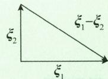

# 线性代数

## 第七章 行列式

## 基础题

## 一、选择题

(1) A.

解 设元素 $a_{ij}$ 的代数余子式为 $A_{ij}=(-1)^{i+j}M_{ij}$ ，则

$$
\begin{array}{r l} & M _ {4 1} + M _ {4 2} + M _ {4 3} + M _ {4 4} \\ & = - (- 1) ^ {4 + 1} M _ {4 1} + (- 1) ^ {4 + 2} M _ {4 2} + [ - (- 1) ^ {4 + 3} ] M _ {4 3} + (- 1) ^ {4 + 4} M _ {4 4} \\ & = - A _ {4 1} + A _ {4 2} - A _ {4 3} + A _ {4 4} \\ & = \left| \begin{array}{c c c c} 3 & 0 & 4 & 0 \\ 2 & 2 & 2 & 2 \\ 0 & - 7 & 0 & 0 \\ - 1 & 1 & - 1 & 1 \end{array} \right| = 7 \left| \begin{array}{c c c} 3 & 4 & 0 \\ 2 & 2 & 2 \\ - 1 & - 1 & 1 \end{array} \right| = - 2 8, \end{array}
$$

故原式 = -28. 选项 A 正确.

【注】 $D = \left| a_{ij} \right|_{n \times n}$ 中， $a_{ij}$ 的代数余子式 $A_{ij}$ 仅与 $a_{ij}$ 的位置有关，而与 $a_{ij}$ 的取值无关，即改变 $D$ 中 $a_{ij}$ 的值， $A_{ij}$ 不改变.

(2)C.

解 利用行列式的性质,有

$$
\begin{array}{r l} | \alpha_ {3}, \alpha_ {2}, \alpha_ {1}, \beta_ {1} + \beta_ {2} | & = | \alpha_ {3}, \alpha_ {2}, \alpha_ {1}, \beta_ {1} | + | \alpha_ {3}, \alpha_ {2}, \alpha_ {1}, \beta_ {2} | \\ & = - | \alpha_ {1}, \alpha_ {2}, \alpha_ {3}, \beta_ {1} | - | \alpha_ {1}, \alpha_ {2}, \alpha_ {3}, \beta_ {2} | \\ & = - a + | \alpha_ {1}, \alpha_ {2}, \beta_ {2}, \alpha_ {3} | = - a + b = b - a, \end{array}
$$

故选项 C 正确.

(3)D.

解 矩阵 $A + B = (\beta_{1} + \beta_{2}, 2\alpha_{1}, 4\alpha_{2}, 2\alpha_{3})$ ，故

$$
\begin{array}{r l} | \mathbf {A} + \mathbf {B} | & = | \pmb {\beta} _ {1} + \pmb {\beta} _ {2}, 2 \pmb {\alpha} _ {1}, 4 \pmb {\alpha} _ {2}, 2 \pmb {\alpha} _ {3} | \\ & = 1 6 \Big (| \pmb {\beta} _ {1}, \pmb {\alpha} _ {1}, \pmb {\alpha} _ {2}, \pmb {\alpha} _ {3} | + | \pmb {\beta} _ {2}, \pmb {\alpha} _ {1}, \pmb {\alpha} _ {2}, \pmb {\alpha} _ {3} | \Big) \\ & = 1 6 \Big (| \pmb {\beta} _ {1}, \pmb {\alpha} _ {1}, \pmb {\alpha} _ {2}, \pmb {\alpha} _ {3} | + \frac {1}{3} | \pmb {\beta} _ {2}, \pmb {\alpha} _ {1}, 3 \pmb {\alpha} _ {2}, \pmb {\alpha} _ {3} | \Big) \\ & = 1 6 \times \left(1 + \frac {1}{3} \times 3\right) = 1 6 \times 2 = 3 2, \end{array}
$$

故选项 D 正确.

(4) A.

$$
\mid \boldsymbol {A} ^ {*} \mid = \mid \boldsymbol {A} \mid^ {3 - 1} = \mid \boldsymbol {A} \mid^ {2}, \mid \boldsymbol {A} ^ {\mathrm{T}} \mid = \mid k \boldsymbol {A} ^ {*} \mid = k ^ {3} \mid \boldsymbol {A} ^ {*} \mid , \mid \boldsymbol {A} ^ {\mathrm{T}} \mid = \mid \boldsymbol {A} \mid ,
$$

可知 $|\mathbf{A}| = k^3 |\mathbf{A}|^2$ ，故 $|\mathbf{A}|(k^3 |\mathbf{A}| - 1) = 0$ ，于是有 $|\mathbf{A}| = 0$ 或 $|\mathbf{A}| = \frac{1}{k^3}$ 又 $\mathbf{A}^{\mathrm{T}} = k\mathbf{A}^{*}$ ，即 $a_{ji} = kA_{ji}$ ，故

$$
| \textbf {A} | = a _ {1 1} A _ {1 1} + a _ {1 2} A _ {1 2} + a _ {1 3} A _ {1 3} = \frac {1}{k} (a _ {1 1} ^ {2} + a _ {1 2} ^ {2} + a _ {1 3} ^ {2}) = \frac {3 c ^ {2}}{k} \neq 0,
$$

于是

$$
\frac {3 c ^ {2}}{k} = \frac {1}{k ^ {3}}, c = \sqrt {\frac {1}{3 k ^ {2}}} = \frac {\sqrt {3}}{3 k}.
$$

选项 A 正确.

【注】设 $\mathbf{A}$ 是 $n$ 阶方阵，则 $|\mathbf{A}^{*}| = |\mathbf{A}|^{n - 1}$

## 二、填空题

(1) $k^{2}(k^{2}-4)$ .

解 将第 2,3,4 行加到第 1 行, 提取 k, 再利用行列式的性质, 有

$$
\begin{array}{r l} & {\left| \begin{array}{c c c c} k & 0 & - 1 & 1 \\ 0 & k & 1 & - 1 \\ - 1 & 1 & k & 0 \\ 1 & - 1 & 0 & k \end{array} \right| = k \left| \begin{array}{c c c c} 1 & 1 & 1 & 1 \\ 0 & k & 1 & - 1 \\ - 1 & 1 & k & 0 \\ 1 & - 1 & 0 & k \end{array} \right| = k \left| \begin{array}{c c c c} 1 & 1 & 1 & 1 \\ 0 & k & 1 & - 1 \\ 0 & 2 & k + 1 & 1 \\ 0 & 0 & k & k \end{array} \right|} \\ & {\qquad = k ^ {2} \left| \begin{array}{c c c} k & 1 & - 1 \\ 2 & k + 1 & 1 \\ 0 & 1 & 1 \end{array} \right| = k ^ {2} \left| \begin{array}{c c c} k & 2 & - 1 \\ 2 & k & 1 \\ 0 & 0 & 1 \end{array} \right| = k ^ {2} (k ^ {2} - 4).} \end{array}
$$

(2) $a+1$ 或a-2.

解 原式

$$
\begin{array}{r l} \text {原式} & = \left| \begin{array}{c c c} \lambda - a - 1 & \lambda - a - 1 & 0 \\ - 1 & \lambda - a & 1 \\ - 1 & 1 & \lambda - a \end{array} \right| = \left| \begin{array}{c c c} \lambda - a - 1 & 0 & 0 \\ - 1 & \lambda - a + 1 & 1 \\ - 1 & 2 & \lambda - a \end{array} \right| \\ & = (\lambda - a - 1) [ (\lambda - a) ^ {2} + (\lambda - a) - 2 ] = 0, \end{array}
$$

得 $\lambda = a + 1$ 或 $\lambda = a - 2$ .

(3)13.

解 箭形(爪形)行列式,利用主对角线元素将第4行前3个元素化为零.

$$
\begin{array}{r l} D _ {4} & = \left| \begin{array}{c c c c} 1 & 0 & 0 & 1 \\ 0 & 2 & 0 & 1 \\ 0 & 0 & 3 & 1 \\ 1 & 1 & 1 & 4 \end{array} \right| = \left| \begin{array}{c c c c} 1 & 0 & 0 & 1 \\ 0 & 2 & 0 & 1 \\ 0 & 0 & 3 & 1 \\ 0 & 0 & 0 & 4 - 1 - \frac {1}{2} - \frac {1}{3} \end{array} \right| \\ & = 1 \times 2 \times 3 \times \left(4 - 1 - \frac {1}{2} - \frac {1}{3}\right) = 1 3. \end{array}
$$

(4) - 4.

解 数字型行列式,每行(列)有2个元素为0,可以直接按一行(一列)展开计算,考虑到元素有规律,可以利用行列式的性质,交换第1,4行,再交换第2,4列,得

$$
D _ {4} = - \left| \begin{array}{c c c c} 3 & 0 & 0 & 4 \\ 1 & 0 & 0 & 2 \\ 0 & 3 & 4 & 0 \\ 0 & 1 & 2 & 0 \end{array} \right| = \left| \begin{array}{c c c c} 3 & 4 & 0 & 0 \\ 1 & 2 & 0 & 0 \\ 0 & 0 & 4 & 3 \\ 0 & 0 & 2 & 1 \end{array} \right| = \left| \begin{array}{c c} 3 & 4 \\ 1 & 2 \end{array} \right| \left| \begin{array}{c c} 4 & 3 \\ 2 & 1 \end{array} \right| = - 4.
$$

(5) $a^{4}+a^{3}+2a^{2}+3a+4.$

解 按第 1 列展开.

$$
D _ {4} = a \left| \begin{array}{c c c} a & - 1 & 0 \\ 0 & a & - 1 \\ 3 & 2 & a + 1 \end{array} \right| + 4 \cdot (- 1) ^ {4 + 1} \left| \begin{array}{c c c} - 1 & 0 & 0 \\ a & - 1 & 0 \\ 0 & a & - 1 \end{array} \right|
$$

$$
\begin{array}{l} = a \left[ a \left| \begin{array}{c c} a & - 1 \\ 2 & a + 1 \end{array} \right| + 3 \cdot (- 1) ^ {3 + 1} \left| \begin{array}{c c} - 1 & 0 \\ a & - 1 \end{array} \right| \right] + 4 \\ = a ^ {4} + a ^ {3} + 2 a ^ {2} + 3 a + 4. \end{array}
$$

(6)6.

解 若按第 1 行展开, 只有 -2x 乘以其代数余子式会出现 $x^{3}$ 项, 故只要求出这一项即可.

$$
(- 2 x) \cdot (- 1) ^ {1 + 2} \left| \begin{array}{c c c} 1 & 1 & - 1 \\ 3 & 3 x & 1 \\ 1 & 1 & x \end{array} \right| = 2 x \left| \begin{array}{c c c} 1 & 0 & - 1 \\ 3 & 3 x - 3 & 1 \\ 1 & 0 & x \end{array} \right| = 2 x (3 x - 3) (x + 1) = 6 x ^ {3} - 6 x,
$$

故 $x^3$ 的系数为6.

(7)0.

解 将 $A + E$ 变成矩阵乘积的形式.

$$
\begin{array}{r l} \mid \boldsymbol {A} + \boldsymbol {E} \mid & = \mid \boldsymbol {A} + \boldsymbol {A} \boldsymbol {A} ^ {\mathrm{T}} \mid = \mid \boldsymbol {A} (\boldsymbol {E} + \boldsymbol {A} ^ {\mathrm{T}}) \mid = \mid \boldsymbol {A} \mid \mid \boldsymbol {E} + \boldsymbol {A} ^ {\mathrm{T}} \mid \\ & = \mid \boldsymbol {A} \mid \mid \boldsymbol {E} ^ {\mathrm{T}} + \boldsymbol {A} ^ {\mathrm{T}} \mid = \mid \boldsymbol {A} \mid \mid (\boldsymbol {E} + \boldsymbol {A}) ^ {\mathrm{T}} \mid = \mid \boldsymbol {A} \mid \mid \boldsymbol {E} + \boldsymbol {A} \mid , \end{array}
$$

故 $(1-|A|)|A+E|=0$ . 由 $|A|<0$ , 知 $1-|A|>0$ , 所以 $|A+E|=0$ .

解 方法一: 利用矩阵的秩.

由 $A^{2}=A$ ，可知 $\boldsymbol{A}(\boldsymbol{A}-\boldsymbol{E})=\boldsymbol{O}$ ，故 $\mathrm{r}(\boldsymbol{A})+\mathrm{r}(\boldsymbol{A}-\boldsymbol{E})\leqslant n.$

又由 $A - E \neq O$ ，知 $r(A - E) \geqslant 1$ ，故 $r(A) < n$ ，于是 $|A| = 0$ 。

方法二: 利用齐次线性方程组.

由 $A(A-E)=O$ ，知 A-E 的列向量组是 Ax=0 的解。又 $A-E\neq O$ ，知 Ax=0 有非零解，故 $|A|=0$ 。

【注】结论:设 A,B 均为 n 阶方阵,且 AB = O,则

① $r(A)+r(B)\leqslant n$ ;②B的列向量组是Ax=0的解.

(9)2.

解

$$
\begin{array}{r l} \mid \boldsymbol {A} + \boldsymbol {B} ^ {- 1} \mid & = \mid \boldsymbol {E A} + \boldsymbol {B} ^ {- 1} \mid = \mid \boldsymbol {B} ^ {- 1} \boldsymbol {B A} + \boldsymbol {B} ^ {- 1} \mid \\ & = \mid \boldsymbol {B} ^ {- 1} \mid \mid \boldsymbol {B A} + \boldsymbol {E} \mid = \mid \boldsymbol {B} ^ {- 1} \mid \mid \boldsymbol {B A} + \boldsymbol {A} ^ {- 1} \boldsymbol {A} \mid \\ & = \mid \boldsymbol {B} ^ {- 1} \mid \mid \boldsymbol {B} + \boldsymbol {A} ^ {- 1} \mid \mid \boldsymbol {A} \mid = \frac {1}{2} \times 2 \times 2 = 2. \end{array}
$$

【注】求行列式 $\left|A \pm B\right|$ ，利用 E 作恒等变形化为矩阵积的行列式.

$$
(1 0) (- 4) ^ {n - 1}
$$

解 因为 $A^{*} = |A| A^{-1} = 2A^{-1}, B^{*} = |B| B^{-1} = -2B^{-1}$ ，所以

$$
\begin{array}{r l} \mid \boldsymbol {A} ^ {- 1} \boldsymbol {B} ^ {*} - \boldsymbol {A} ^ {*} \boldsymbol {B} ^ {- 1} \mid & = \mid \boldsymbol {A} ^ {- 1} \cdot (- 2 \boldsymbol {B} ^ {- 1}) - 2 \boldsymbol {A} ^ {- 1} \boldsymbol {B} ^ {- 1} \mid \\ & = \mid - 4 \boldsymbol {A} ^ {- 1} \boldsymbol {B} ^ {- 1} \mid = (- 4) ^ {n} \mid \boldsymbol {A} \mid^ {- 1} \cdot \mid \boldsymbol {B} \mid^ {- 1} \\ & = (- 4) ^ {n} \cdot \frac {1}{2} \cdot \left(- \frac {1}{2}\right) = (- 4) ^ {n - 1}. \end{array}
$$

(11)1.

解 由 $\boldsymbol{B} = (\boldsymbol{\alpha}_{1}, \boldsymbol{\alpha}_{2}, \boldsymbol{\alpha}_{3}) \begin{pmatrix} 3 & -2 & -1 \\ -1 & 3 & -2 \\ 0 & 0 & 2 \end{pmatrix}$ ，知

$$
| \textbf {B} | = | (\alpha_ {1}, \alpha_ {2}, \alpha_ {3}) | \left| \begin{array}{r r r} 3 & - 2 & - 1 \\ - 1 & 3 & - 2 \\ 0 & 0 & 2 \end{array} \right| = | \textbf {A} | \cdot 1 4 = 1 4,
$$

故 $|\mathbf{A}| = 1$

(12) $\frac{1}{k}.$

解 依题意,由 $AA^{*}=|A|E$ , 得

$$
\begin{array}{r l} {\mid \textbf {A} \mid = \left| \begin{array}{c c c c} {k} & {k} & {\dots} & {k} \\ {a _ {2 1}} & {a _ {2 2}} & {\dots} & {a _ {2 n}} \\ {\vdots} & {\vdots} & & {\vdots} \\ {a _ {n 1}} & {a _ {n 2}} & {\dots} & {a _ {n n}} \end{array} \right| = k \left| \begin{array}{c c c c} {1} & {1} & {\dots} & {1} \\ {a _ {2 1}} & {a _ {2 2}} & {\dots} & {a _ {2 n}} \\ {\vdots} & {\vdots} & & {\vdots} \\ {a _ {n 1}} & {a _ {n 2}} & {\dots} & {a _ {n n}} \end{array} \right|} \\ {\underline {{{\underline {{{\text {按第一行展开}}}}}}} k (A _ {1 1} + A _ {1 2} + \dots + A _ {1 n}) = 1,} \end{array}
$$

故 $A_{11} + A_{12} + \cdots + A_{1n} = \frac{1}{k}.$

## 三、解答题

(1) 解 方法一: $D_{n}$ 的各列元素之和相等, 用行加法.

$$
\begin{array}{l} D _ {n} = \left| \begin{array}{c c c c c c} b + (n - 1) a & b + (n - 1) a & b + (n - 1) a & \dots & b + (n - 1) a \\ a & b & a & \dots & a \\ \vdots & \vdots & \vdots & & \vdots \\ a & a & a & \dots & b \end{array} \right| \\ = [ b + (n - 1) a ] \left| \begin{array}{c c c c c} 1 & 1 & 1 & \dots & 1 \\ a & b & a & \dots & a \\ \vdots & \vdots & \vdots & & \vdots \\ a & a & a & \dots & b \end{array} \right| \\ = [ b + (n - 1) a ] \left| \begin{array}{c c c c c} 1 & 1 & 1 & \dots & 1 \\ 0 & b - a & 0 & \dots & 0 \\ \vdots & \vdots & \vdots & & \vdots \\ 0 & 0 & 0 & \dots & b - a \end{array} \right| \\ = [ b + (n - 1) a ] (b - a) ^ {n - 1}. \end{array}
$$

方法二: $D_{n}$ 除主对角线上元素以外,其余列元素均相同,可用加边法.

$$
D _ {n} = D _ {n + 1} = \left| \begin{array}{c c c c c} 1 & a & a & \dots & a \\ 0 & b & a & \dots & a \\ 0 & a & b & \dots & a \\ \vdots & \vdots & \vdots & & \vdots \\ 0 & a & a & \dots & b \end{array} \right| = \left| \begin{array}{c c c c c} 1 & a & a & \dots & a \\ - 1 & b - a & 0 & \dots & 0 \\ - 1 & 0 & b - a & \dots & 0 \\ \vdots & \vdots & \vdots & & \vdots \\ - 1 & 0 & 0 & \dots & b - a \end{array} \right|,
$$

为箭形行列式, 故 $D_{n}=(b-a)^{n-1}\cdot\left[b+(n-1)a\right]$ .

【注】当 $\lambda_{1},\lambda_{2},\cdots,\lambda_{n}$ 均不为零时，箭形行列式

$$
D _ {n + 1} = \left| \begin{array}{c c c c c} \lambda_ {0} & a _ {1} & a _ {2} & \dots & a _ {n} \\ b _ {1} & \lambda_ {1} & 0 & \dots & 0 \\ b _ {2} & 0 & \lambda_ {2} & \dots & 0 \\ \vdots & \vdots & \vdots & & \vdots \\ b _ {n} & 0 & 0 & \dots & \lambda_ {n} \end{array} \right| = \left(\lambda_ {0} - \sum_ {i = 1} ^ {n} \frac {b _ {i} a _ {i}}{\lambda_ {i}}\right) \lambda_ {1} \lambda_ {2} \dots \lambda_ {n}.
$$

本结论见《2027考研数学线性代数辅导讲义》.

(2) 证 方法一: 用数学归纳法.

当 $n = 1$ 时， $D_{1} = x + a_{1}$ ；当 $n = 2$ 时， $D_{2} = \left| \begin{array}{cc}x & -1\\ a_{2} & a_{1} + x \end{array} \right| = x^{2} + a_{1}x + a_{2}$ ，结论成立。

假设当 n = k - 1 时, 结论成立, 有

$$
D _ {k - 1} = x ^ {k - 1} + a _ {1} x ^ {(k - 1) - 1} + a _ {2} x ^ {(k - 1) - 2} + \dots + a _ {k - 2} x + a _ {k - 1},
$$

则当 n = k 时, 将 $D_{k}$ 按第 1 列展开, 得

$$
D _ {k} = x D _ {k - 1} + a _ {k} = x ^ {k} + a _ {1} x ^ {k - 1} + \dots + a _ {k - 2} x ^ {2} + a _ {k - 1} x + a _ {k},
$$

故对任意正整数 n，有 $D_{n}=x^{n}+a_{1}x^{n-1}+\cdots+a_{n-1}x+a_{n}$ ，结论成立.

方法二:用递推法,将 $D_{n}$ 按第 1 列展开,得

$$
D _ {n} = x D _ {n - 1} + (- 1) ^ {n + 1} a _ {n} \cdot (- 1) ^ {n - 1} = x D _ {n - 1} + a _ {n},\tag{①}
$$

故

$$
D _ {n - 1} = x D _ {n - 2} + a _ {n - 1}, \dots , D _ {3} = x D _ {2} + a _ {3}, D _ {2} = x D _ {1} + a _ {2} = x ^ {2} + a _ {1} x + a _ {2},
$$

将其依次代入 ① 式, 得 $D_{n} = x^{n} + a_{1}x^{n-1} + \cdots + a_{n-1}x + a_{n}$ .

【注】此题也可对第 n 行展开进行计算.

(3) 解 $D_{n}$ 为三对角行列式, 用递推法, 将 $D_{n}$ 按第 1 行展开.

$$
D _ {n} = 2 D _ {n - 1} + (- 1) \times (- 1) ^ {1 + 2} \left| \begin{array}{c c c c c c} - 1 & - 1 & 0 & \dots & 0 & 0 \\ 0 & 2 & - 1 & \dots & 0 & 0 \\ 0 & - 1 & 2 & \dots & 0 & 0 \\ \vdots & \vdots & \vdots & & \vdots & \vdots \\ 0 & 0 & 0 & \dots & 2 & - 1 \\ 0 & 0 & 0 & \dots & - 1 & 2 \end{array} \right| = 2 D _ {n - 1} - D _ {n - 2},
$$

即

$$
D _ {n} - D _ {n - 1} = D _ {n - 1} - D _ {n - 2} = D _ {n - 2} - D _ {n - 3} = \dots = D _ {2} - D _ {1} = \left| \begin{array}{c c} 2 & - 1 \\ - 1 & 2 \end{array} \right| - 2 = 1,
$$

故

$$
\begin{array}{r l} D _ {n} & = D _ {n - 1} + 1 = (D _ {n - 2} + 1) + 1 = D _ {n - 2} + 2 = \dots = D _ {1} + (n - 1) \\ & = 2 + (n - 1) = n + 1. \end{array}
$$

(4) 解 记 $D_{n}=D_{1}+D_{2}.D_{1}$ 按第 1 列展开, 得

$$
\begin{array}{r l} D _ {1} & = a _ {1} \left| \begin{array}{c c c c c c} a _ {2} & b _ {2} & 0 & \dots & 0 & 0 \\ 0 & a _ {3} & b _ {3} & \dots & 0 & 0 \\ \vdots & \vdots & \vdots & & \vdots & \vdots \\ 0 & 0 & 0 & \dots & a _ {n - 1} & b _ {n - 1} \\ 0 & 0 & 0 & \dots & 0 & a _ {n} \end{array} \right| + (- 1) ^ {n + 1} b _ {n} \left| \begin{array}{c c c c c c} b _ {1} & 0 & 0 & \dots & 0 & 0 \\ a _ {2} & b _ {2} & 0 & \dots & 0 & 0 \\ \vdots & \vdots & \vdots & & \vdots & \vdots \\ 0 & 0 & 0 & \dots & b _ {n - 2} & 0 \\ 0 & 0 & 0 & \dots & a _ {n - 1} & b _ {n - 1} \end{array} \right| \\ & = a _ {1} a _ {2} \dots a _ {n} + (- 1) ^ {n + 1} b _ {1} b _ {2} \dots b _ {n}. \end{array}
$$

$D_{2}$ 是 $D_{1}$ 的转置行列式，故 $D_{2} = D_{1}$ ，并且 $D_{n} = D_{1} + D_{2}$ ，所以

$$
D _ {n} = 2 a _ {1} a _ {2} \dots a _ {n} + 2 (- 1) ^ {n + 1} b _ {1} b _ {2} \dots b _ {n}.
$$

## 综合题

## 一、选择题

(1)D.

解 因为伴随矩阵 $A^{*}$ 的主对角线元素为 $A_{11}, A_{22}, A_{33}$ ，所以 $A_{11} + A_{22} + A_{33}$ 的值等于 $A^{*}$ 的 3 个特征值之和，故只需求 $A^{*}$ 的 3 个特征值.

由 $A^{-1}$ 的特征值为 3,2,1, 可知 A 的特征值为 $\frac{1}{3}, \frac{1}{2}, 1$ , 则有

$$
| \textbf {A} | = \lambda_ {1} \lambda_ {2} \lambda_ {3} = \frac {1}{3} \times \frac {1}{2} \times 1 = \frac {1}{6},
$$

故 $A^{*}$ 的 3 个特征值分别为

$$
\frac {| \textbf {A} |}{\lambda_ {1}} = \frac {1}{2}, \frac {| \textbf {A} |}{\lambda_ {2}} = \frac {1}{3}, \frac {| \textbf {A} |}{\lambda_ {3}} = \frac {1}{6},
$$

所以 $A_{11} + A_{22} + A_{33} = \frac{1}{2} +\frac{1}{3} +\frac{1}{6} = 1.$ 选项D正确.

【注】结论:设 $\lambda_{1},\lambda_{2},\cdots,\lambda_{n}$ 为矩阵 A 的特征值,则

① $\left|A\right|=\lambda_{1}\lambda_{2}\cdots\lambda_{n};$

② $a_{11} + a_{22} + \cdots + a_{mn} = \lambda_{1} + \lambda_{2} + \cdots + \lambda_{n};$

③ $A^{-1}$ 的特征值为 $\frac{1}{\lambda_{1}}, \frac{1}{\lambda_{2}}, \cdots, \frac{1}{\lambda_{n}} (\lambda_{i} \neq 0; i = 1, 2, \cdots, n)$ ;

④ $A^{*}$ 的特征值为 $\frac{|A|}{\lambda_{1}}, \frac{|A|}{\lambda_{2}}, \cdots, \frac{|A|}{\lambda_{n}} (\lambda_{i} \neq 0; i = 1, 2, \cdots, n)$ .

本结论见《2027考研数学线性代数辅导讲义》.

(2) B.

解 求 $\sum_{i=1}^{4}\sum_{j=1}^{4}A_{ij}$ ，只要求 $A^{*}=(A_{ji})_{4\times4}$ ，由 $A^{*}=|A|A^{-1}$ ，可知先求 $|A|$ 和 $A^{-1}$ .
由分块矩阵求逆，得

$$
\mathbf {A} ^ {- 1} = \left( \begin{array}{c c c c} 0 & 0 & 0 & 1 \\ \hdashline 1 & 0 & 0 & 0 \\ 0 & 1 & 0 & 0 \\ 0 & 0 & 1 & 0 \end{array} \right) ^ {- 1} = \left( \begin{array}{c c c c} 0 & 1 & 0 & 0 \\ 0 & 0 & 1 & 0 \\ 0 & 0 & 0 & 1 \\ 1 & 0 & 0 & 0 \end{array} \right).
$$

又 $|\mathbf{A}| = (-1)^{4 + 1} = -1$ （按第1行展开），故

$$
\boldsymbol {A} ^ {*} = | \boldsymbol {A} | \boldsymbol {A} ^ {- 1} = - \boldsymbol {A} ^ {- 1} = \left( \begin{array}{c c c c} 0 & - 1 & 0 & 0 \\ 0 & 0 & - 1 & 0 \\ 0 & 0 & 0 & - 1 \\ - 1 & 0 & 0 & 0 \end{array} \right) = \left( \begin{array}{c c c c} A _ {1 1} & A _ {2 1} & A _ {3 1} & A _ {4 1} \\ A _ {1 2} & A _ {2 2} & A _ {3 2} & A _ {4 2} \\ A _ {1 3} & A _ {2 3} & A _ {3 3} & A _ {4 3} \\ A _ {1 4} & A _ {2 4} & A _ {3 4} & A _ {4 4} \end{array} \right),
$$

所以 $\sum_{i=1}^{4}\sum_{j=1}^{4}A_{ij}=(-1)+(-1)+(-1)+(-1)=-4.$ 选项 B 正确.
(3) C.

解 方法一:由 $A^{*}=|A|A^{-1}=\frac{1}{2}A^{-1}$ ，则有

$$
\begin{array}{r l} \mid (2 A) ^ {- 1} - 2 A ^ {*} \mid & = \left| \frac {1}{2} A ^ {- 1} - 2 \cdot \frac {1}{2} A ^ {- 1} \right| = \left| \frac {1}{2} A ^ {- 1} - A ^ {- 1} \right| \\ & = \left| - \frac {1}{2} A ^ {- 1} \right| = \left(- \frac {1}{2}\right) ^ {3} \mid A ^ {- 1} \mid \\ & = - \frac {1}{8} \mid A \mid^ {- 1} = - \frac {1}{8} \times \left(\frac {1}{2}\right) ^ {- 1} = - \frac {1}{4}. \end{array}
$$

方法二:由 $A^{-1}=|A|^{-1}A^{*}=2A^{*}$ ，则有

$$
\begin{array}{r l} | (2 \mathbf {A}) ^ {- 1} - 2 \mathbf {A} ^ {*} | & = \left| \frac {1}{2} \cdot 2 \mathbf {A} ^ {*} - 2 \mathbf {A} ^ {*} \right| = | \mathbf {A} ^ {*} - 2 \mathbf {A} ^ {*} | \\ & = | - \mathbf {A} ^ {*} | = (- 1) ^ {3} | \mathbf {A} ^ {*} | = - | \mathbf {A} | ^ {3 - 1} = - \left(\frac {1}{2}\right) ^ {2} = - \frac {1}{4}. \end{array}
$$

故选项 C 正确.

(4)B.

解

$$
\begin{array}{r l} f (x) & = \left| \begin{array}{c c c c} 1 & x & x ^ {2} & x ^ {3} \\ 1 & 2 & 4 & 8 \\ 1 & - 1 & 1 & - 1 \\ 1 & 1 & 1 & 1 \end{array} \right| = \left| \begin{array}{c c c c} 1 & 1 & 1 & 1 \\ x & 2 & - 1 & 1 \\ x ^ {2} & 4 & 1 & 1 \\ x ^ {3} & 8 & - 1 & 1 \end{array} \right| \\ & = (2 - x) (- 1 - x) (1 - x) (- 1 - 2) (1 - 2) (1 + 1) \\ & = 6 (x ^ {2} - 1) (2 - x). \\ & f (- 1) = f (1) = f (2) = 0, \end{array}
$$

由罗尔定理, 至少存在 $x_{1} \in (-1,1)$ , $x_{2} \in (1,2)$ , 使得 $f'(x_{1}) = f'(x_{2}) = 0$ , 故 $y = f(x)$ 在 $(-1,2)$ 内至少有两条水平切线.

又因为 $f(x)$ 为三次多项式, 所以 $y = f(x)$ 至多有两条水平切线. 选项 B 正确.

## 【注】题目所给行列式的转置为范德蒙行列式.

## 二、填空题

(1) $(-1)^{n}\cdot6^{2n-1}.$

解

$$
| \boldsymbol {C} | = \left| \begin{array}{c c} \boldsymbol {A} & 3 \boldsymbol {A} ^ {*} \\ \left(\frac {\boldsymbol {B}}{2}\right) ^ {- 1} & \boldsymbol {O} \end{array} \right| = (- 1) ^ {n \times n} \left| \left(\frac {\boldsymbol {B}}{2}\right) ^ {- 1} \right| | 3 \boldsymbol {A} ^ {*} |,
$$

而

$$
\left| \left(\frac {\pmb {B}}{2}\right) ^ {- 1} \right| = | 2 \pmb {B} ^ {- 1} | = 2 ^ {n} | \pmb {B} | ^ {- 1} = 2 ^ {n},
$$

$$
\mid 3 \mathbf {A} ^ {*} \mid = 3 ^ {n} \mid \mathbf {A} ^ {*} \mid = 3 ^ {n} \cdot \mid \mathbf {A} \mid^ {n - 1} = 3 ^ {n} \cdot 6 ^ {n - 1},
$$

故

$$
| \textbf {C} | = (- 1) ^ {n ^ {2}} 2 ^ {n} \cdot 3 ^ {n} \cdot 6 ^ {n - 1} = (- 1) ^ {n ^ {2}} \cdot 6 ^ {2 n - 1} = (- 1) ^ {n} \cdot 6 ^ {2 n - 1}.
$$

(2)0.

解 由已知, AB 是 m 阶方阵. 由于 $r(AB) \leqslant r(B) \leqslant \min\{m, n\}$ , 故当 m > n 时, 有 $r(AB) \leqslant n < m$ , 故 $|AB| = 0$ .

(3) $\frac{1}{2}.$

解 由已知 $A^{2}B-A-B=E$ ，得 $(A^{2}-E)B=A+E$ ，即

$$
(\mathbf {A} + \mathbf {E}) (\mathbf {A} - \mathbf {E}) \mathbf {B} = \mathbf {A} + \mathbf {E},
$$

而 $A + E = \begin{pmatrix} 2 & 0 & 1 \\ 0 & 3 & 0 \\ -2 & 0 & 2 \end{pmatrix}$ ，可知 $A + E$ 可逆，故 $(A - E)B = E$ ，两边取行列式，得

$$
\mid \boldsymbol {A} - \boldsymbol {E} \mid \mid \boldsymbol {B} \mid = 1.
$$

而 $|\mathbf{A} - \mathbf{E}| = \left| \begin{array}{ccc}0 & 0 & 1\\ 0 & 1 & 0\\ -2 & 0 & 0 \end{array} \right| = 2$ ，故 $|\mathbf{B}| = \frac{1}{2}$

(4)126.

解 先求出 A 的特征值, 再求 $2A^{*}-3E$ 的特征值.

由 $\left|A-E\right|=\left|(-1)(E-A)\right|=(-1)^{3}\left|E-A\right|=0$ , 得 $\left|1\cdot E-A\right|=0$ , 可知 $\lambda_{1}=1$ 是 A 的一个特征值.

同理，由 $|\mathbf{A} + 2\mathbf{E}| = |2\mathbf{A} + 3\mathbf{E}| = 0$ ，得 $\mathbf{A}$ 的特征值 $\lambda_{2} = -2,\lambda_{3} = -\frac{3}{2}$ 故

$$
| \textbf {A} | = \lambda_ {1} \lambda_ {2} \lambda_ {3} = 3 \neq 0 (\textbf {A} \text {可逆}),
$$

所以 $A^{*}$ 的特征值分别为

$$
\frac {| \textbf {A} |}{\lambda_ {1}} = \frac {3}{1} = 3,
$$

$$
\frac {| \textbf {A} |}{\lambda_ {2}} = \frac {3}{- 2} = - \frac {3}{2},
$$

$$
\frac {| \textbf {A} |}{\lambda_ {3}} = - 2,
$$

于是 $2A^{*}-3E$ 的特征值分别为

$$
2 \times 3 - 3 = 3,   2 \times \left(- \frac {3}{2}\right) - 3 = - 6,   2 \times (- 2) - 3 = - 7,
$$

所以 $\left|2A^{*}-3E\right|=3\times(-6)\times(-7)=126.$

【注】设 A 的特征值为 $\lambda$ ，则 $f(A)$ 的特征值为 $f(\lambda)$ ，其中 $f(x)$ 为多项式.

(5)2.

解 方法一: 利用行列式的性质, 由 $A(\alpha_{1}, \alpha_{2}, \alpha_{3}) = (\alpha_{1} + \alpha_{2}, \alpha_{2} + \alpha_{3}, \alpha_{3} + \alpha_{1})$ , 则有

$$
\begin{array}{r l} \mid A \mid \mid \alpha_ {1}, \alpha_ {2}, \alpha_ {3} \mid & = \mid \alpha_ {1} + \alpha_ {2}, \alpha_ {2} + \alpha_ {3}, \alpha_ {3} + \alpha_ {1} \mid \\ & = 2 \mid \alpha_ {1} + \alpha_ {2} + \alpha_ {3}, \alpha_ {2} + \alpha_ {3}, \alpha_ {3} + \alpha_ {1} \mid \\ & = 2 \mid \alpha_ {1} + \alpha_ {2} + \alpha_ {3}, - \alpha_ {1}, - \alpha_ {2} \mid \\ & = 2 \mid \alpha_ {3}, - \alpha_ {1}, - \alpha_ {2} \mid = 2 \mid \alpha_ {1}, \alpha_ {2}, \alpha_ {3} \mid . \end{array}
$$

由于 $\alpha_{1},\alpha_{2},\alpha_{3}$ 线性无关，所以 $\left|\alpha_{1},\alpha_{2},\alpha_{3}\right|\neq0$ ，故 $\left|A\right|=2$

方法二: 利用矩阵的乘法及相似矩阵的性质.

$$
\mathbf {A} (\boldsymbol {\alpha} _ {1}, \boldsymbol {\alpha} _ {2}, \boldsymbol {\alpha} _ {3}) = (\boldsymbol {\alpha} _ {1} + \boldsymbol {\alpha} _ {2}, \boldsymbol {\alpha} _ {2} + \boldsymbol {\alpha} _ {3}, \boldsymbol {\alpha} _ {3} + \boldsymbol {\alpha} _ {1}) = (\boldsymbol {\alpha} _ {1}, \boldsymbol {\alpha} _ {2}, \boldsymbol {\alpha} _ {3}) \left( \begin{array}{c c c} 1 & 0 & 1 \\ 1 & 1 & 0 \\ 0 & 1 & 1 \end{array} \right).
$$

记 $P = (\alpha_{1}, \alpha_{2}, \alpha_{3})$ ，由已知， $P$ 可逆， $B = \begin{pmatrix} 1 & 0 & 1 \\ 1 & 1 & 0 \\ 0 & 1 & 1 \end{pmatrix}$ ，故 $AP = PB$ ，即 $P^{-1}AP = B$ ，故

$$
| \textbf {A} | = | \textbf {B} | = \left| \begin{array}{c c c} 1 & 0 & 1 \\ 1 & 1 & 0 \\ 0 & 1 & 1 \end{array} \right| = 2.
$$

(6)12.

解 先找出 $\left|A^{-1}+B^{-1}\right|$ 与 $\left|A+B\right|$ 的关系.

由 $|\mathbf{A}| = 2, |\mathbf{B}| = 1$ ，知 $\mathbf{A}$ 与 $\mathbf{B}$ 均可逆，并且

$$
\mid \boldsymbol {A} ^ {- 1} + \boldsymbol {B} ^ {- 1} \mid = \mid (\boldsymbol {E} + \boldsymbol {B} ^ {- 1} \boldsymbol {A}) \boldsymbol {A} ^ {- 1} \mid = \mid \boldsymbol {B} ^ {- 1} (\boldsymbol {B} + \boldsymbol {A}) \boldsymbol {A} ^ {- 1} \mid = \mid \boldsymbol {B} ^ {- 1} \mid \mid \boldsymbol {A} + \boldsymbol {B} \mid \mid \boldsymbol {A} ^ {- 1} \mid
$$

又因为 $A + B = (\alpha + \beta, 2\alpha_{1}, 2\alpha_{2}, 2\alpha_{3})$ ，所以

$$
\begin{array}{r l} \mid A + B \mid & = \mid \alpha + \beta , 2 \alpha_ {1}, 2 \alpha_ {2}, 2 \alpha_ {3} \mid \\ & = 2 ^ {3} \mid \alpha + \beta , \alpha_ {1}, \alpha_ {2}, \alpha_ {3} \mid \\ & = 8 (\mid \alpha , \alpha_ {1}, \alpha_ {2}, \alpha_ {3} \mid + \mid \beta , \alpha_ {1}, \alpha_ {2}, \alpha_ {3} \mid) \\ & = 8 \times (2 + 1) = 2 4. \end{array}
$$

故 $|\mathbf{A}^{-1} + \mathbf{B}^{-1}| = 1\times 24\times \frac{1}{2} = 12.$

【注】 $\left|A^{-1}+B^{-1}\right|$ 没有公式直接计算,可通过恒等变形化为矩阵积的行列式解.

(7) $\frac{(-1)^{n+1}n!}{k}.$

解 对矩阵 A 分块, $A = \begin{pmatrix} O & B \\ C & O \end{pmatrix}$ , $C = (n)$ , $B = \begin{pmatrix} 1 & 0 & \cdots & 0 \\ 0 & 2 & \cdots & 0 \\ \vdots & \vdots & & \vdots \\ 0 & 0 & \cdots & n - 1 \end{pmatrix}$ , 则

$$
\boldsymbol {A} ^ {- 1} = \left( \begin{array}{c c} \boldsymbol {O} & \boldsymbol {C} ^ {- 1} \\ \boldsymbol {B} ^ {- 1} & \boldsymbol {O} \end{array} \right) = \left( \begin{array}{c c c c c} 0 & 0 & \dots & 0 & \frac {1}{n} \\ 1 & 0 & \dots & 0 & 0 \\ 0 & \frac {1}{2} & \dots & 0 & 0 \\ \vdots & \vdots & & \vdots & \vdots \\ 0 & 0 & \dots & \frac {1}{n - 1} & 0 \end{array} \right).
$$

行列式 $|\mathbf{A}|$ 按第1列展开，得 $|\mathbf{A}| = (-1)^{n + 1}n!$ . 又 $\mathbf{A}^{*} = |\mathbf{A}|\mathbf{A}^{-1}$ ，故

$$
\left( \begin{array}{c c c c c} A _ {1 1} & \dots & A _ {k 1} & \dots & A _ {n 1} \\ A _ {1 2} & \dots & A _ {k 2} & \dots & A _ {n 2} \\ \vdots & & \vdots & & \vdots \\ A _ {1 n} & \dots & A _ {k n} & \dots & A _ {n n} \end{array} \right) = (- 1) ^ {n + 1} n! \left( \begin{array}{c c c c c} 0 & 0 & \dots & 0 & \frac {1}{n} \\ 1 & 0 & \dots & 0 & 0 \\ 0 & \frac {1}{2} & \dots & 0 & 0 \\ \vdots & \vdots & & \vdots & \vdots \\ 0 & 0 & \dots & \frac {1}{n - 1} & 0 \end{array} \right).
$$

所以 $A_{k1} + A_{k2} + \cdots + A_{kn} = \frac{(-1)^{n+1} n!}{k}$ .

## 三、解答题

(1) 解 $D_{n}$ 除主对角线元素外, 第 i 行 $(i=1,2,\cdots)$ 元素分别是 $a_{1}, a_{2}, \cdots, a_{i-1}, a_{i+1}, \cdots, a_{n}$ 的倍数, 即

$$
(- a _ {i}) a _ {1}, (- a _ {i}) a _ {2}, \dots , (- a _ {i}) a _ {i - 1}, (- a _ {i}) a _ {i + 1}, \dots , (- a _ {i}) a _ {n}.
$$

可考虑用加边法，

$$
D _ {n} = D _ {n + 1} = \left| \begin{array}{c c c c c} 1 & a _ {1} & a _ {2} & \dots & a _ {n} \\ 0 & b - a _ {1} ^ {2} & - a _ {1} a _ {2} & \dots & - a _ {1} a _ {n} \\ 0 & - a _ {2} a _ {1} & b - a _ {2} ^ {2} & \dots & - a _ {2} a _ {n} \\ \vdots & \vdots & \vdots & & \vdots \\ 0 & - a _ {n} a _ {1} & - a _ {n} a _ {2} & \dots & b - a _ {n} ^ {2} \end{array} \right| = \left| \begin{array}{c c c c c} 1 & a _ {1} & a _ {2} & \dots & a _ {n} \\ a _ {1} & b & 0 & \dots & 0 \\ a _ {2} & 0 & b & \dots & 0 \\ \vdots & \vdots & \vdots & & \vdots \\ a _ {n} & 0 & 0 & \dots & b \end{array} \right|,
$$

为箭形行列式,故 $D_{n}=b^{n-1}\left(b-\sum_{i=1}^{n}a_{i}^{2}\right)$ .

(2) 解 $D_{n}$ 中除主对角线外, 各列元素分别相同, 用加边法.

$$
D _ {n} = D _ {n + 1} = \left| \begin{array}{c c c c c} 1 & 0 & 0 & \dots & 0 \\ 1 & a + b _ {1} & a & \dots & a \\ 1 & a & a + b _ {2} & \dots & a \\ \vdots & \vdots & \vdots & & \vdots \\ 1 & a & a & \dots & a + b _ {n} \end{array} \right| = \left| \begin{array}{c c c c c} 1 & - a & - a & \dots & - a \\ 1 & b _ {1} & 0 & \dots & 0 \\ 1 & 0 & b _ {2} & \dots & 0 \\ \vdots & \vdots & \vdots & & \vdots \\ 1 & 0 & 0 & \dots & b _ {n} \end{array} \right|,
$$

该行列式为箭形行列式,故可求得 $D_{n}=\left(1+\sum_{i=1}^{n}\frac{a}{b_{i}}\right)\prod_{j=1}^{n}b_{j}$ .

【注】① 将行列式添加一行或一列,使其升阶后的行列式的值不变,这种方法称为“加边法”.

②行列式除主对角线外,第 $i(i=1,2,\cdots,n)$ 行(列)元素分别与第 $j(j\neq i)$ 行(列)元素有倍数关系或相同,此类行列式的计算可采用“加边法”.

(3) 解 按第 n 行展开, 用递推法.

$$
\begin{array}{r l} D _ {n} & = (- 1) ^ {n + 1} a _ {n - 1} \bullet (- 1) ^ {n - 1} + (- 1) ^ {n + n} \bullet x \bullet D _ {n - 1} = a _ {n - 1} + x D _ {n - 1} \\ & = a _ {n - 1} + a _ {n - 2} x + x ^ {2} D _ {n - 2} = \dots = a _ {0} x ^ {n - 1} + a _ {1} x ^ {n - 2} + \dots + a _ {n - 2} x + a _ {n - 1}. \end{array}
$$

(4) 解 三对角行列式,用递推法.

按第 1 列展开, 得

$$
D _ {n} = a D _ {n - 1} - b c D _ {n - 2},\tag{①}
$$

将 ① 式化为

$$
D _ {n} - k D _ {n - 1} = \mu (D _ {n - 1} - k D _ {n - 2}),\tag{②}
$$

其中

$$
\left\{ \begin{array}{l} k + \mu = a, \\ k \mu = b c. \end{array} \right.\tag{③}
$$

令

$$
D _ {n - i} - k D _ {n - i - 1} = \Delta_ {n - i} (i = 0, 1, 2, \dots , n - 2),\tag{④}
$$

则递推 ② 式为 $\Delta_{n} = \mu \Delta_{n - 1}$ . 反复利用这个递推式, 可得

$$
\Delta_ {n} = \mu \Delta_ {n - 1} = \mu^ {2} \Delta_ {n - 2} = \dots = \mu^ {n - 2} \Delta_ {2},\tag{⑤}
$$

将 ④ 式代入 ⑤ 式的右端,由 ③ 式可得

$$
\begin{array}{r l} \Delta_ {n} & = \mu^ {n - 2} (D _ {2} - k D _ {1}) = \mu^ {n - 2} (a ^ {2} - b c - k a) \\ & = \mu^ {n - 2} [ a ^ {2} - k \mu - (a - \mu) a ] = \mu^ {n - 2} \cdot \mu (a - k) = \mu^ {n}. \end{array}
$$

对于 ④ 式, 若取 i = 0, 则得 $D_{n} = \mu^{n} + kD_{n-1}$ . 反复利用这个递推公式, 得

$$
\begin{array}{r l} D _ {n} & = \mu^ {n} + k D _ {n - 1} = \mu^ {n} + k (\mu^ {n - 1} + k D _ {n - 2}) \\ & = \mu^ {n} + k \mu^ {n - 1} + k ^ {2} (\mu^ {n - 2} + k D _ {n - 3}) \\ & = \mu^ {n} + k \mu^ {n - 1} + k ^ {2} \mu^ {n - 2} + k ^ {3} D _ {n - 3} = \dots \\ & = \mu^ {n} + k \mu^ {n - 1} + k ^ {2} \mu^ {n - 2} + \dots + k ^ {n - 2} \mu^ {2} + k ^ {n - 1} D _ {1}, \end{array}
$$

将 $D_{1}=a=k+\mu$ 代入上式, 得

$$
D _ {n} = \mu^ {n} + k \mu^ {n - 1} + k ^ {2} \mu^ {n - 2} + \dots + k ^ {n - 2} \mu^ {2} + k ^ {n - 1} \mu + k ^ {n},
$$

所以

$$
D _ {n} = \left\{ \begin{array}{l l} \frac {\mu^ {n + 1} - k ^ {n + 1}}{\mu - k}, & k \neq \mu , \\ (n + 1) \mu^ {n}, & k = \mu . \end{array} \right.
$$

由 ③ 式, 知 $\mu, k$ 是一元二次方程 $x^{2} - ax + bc = 0$ 两个根, 故

$$
\mu = \frac {a \pm \sqrt {a ^ {2} - 4 b c}}{2}, k = \frac {a \mp \sqrt {a ^ {2} - 4 b c}}{2}.
$$

【注】此题推出了一般三对角行列式的结论.

## 拓展题

解答题

(1) 解 由 $A^{T} = A^{*}, AA^{*} = AA^{T} = |A| E$ ，知

$$
\mid \textbf {A} \mid \mid \textbf {A} ^ {\mathrm{T}} \mid = \mid \textbf {A} \mid^ {2} = \mid \textbf {A} \mid \textbf {E} \mid = \mid \textbf {A} \mid^ {3},
$$

即 $|\mathbf{A}|^2 (1 - |\mathbf{A}|) = 0$ ，故 $|\mathbf{A}| = 0$ 或 $|\mathbf{A}| = 1.$

又 $\mathbf{A} \neq \mathbf{O}$ , 不妨设 $a_{11} \neq 0$ , 由已知 $\mathbf{A}^{\mathrm{T}} = \mathbf{A}^{*}$ , 得 $a_{ji} = A_{ji}$ , 故

$$
| \textbf {A} | = a _ {1 1} A _ {1 1} + a _ {1 2} A _ {1 2} + a _ {1 3} A _ {1 3} = a _ {1 1} ^ {2} + a _ {1 2} ^ {2} + a _ {1 3} ^ {2} \neq 0,
$$

于是 $|\mathbf{A}| = 1.$ 由

$$
\mid \boldsymbol {E} + \boldsymbol {A} \mid = \mid (- 1) (- \boldsymbol {E} - \boldsymbol {A}) \mid = (- 1) ^ {3} \mid - \boldsymbol {E} - \boldsymbol {A} \mid = 0,
$$

得 $\left|-E-A\right|=0$ , 故 $\lambda_{1}=-1$ 是 A 的一个特征值.

同理,由 $\left|E-A\right|=0$ , 得 $\lambda_{2}=1$ 是 A 的一个特征值.

由 $1 = |\mathbf{A}| = \lambda_1\lambda_2\lambda_3 = (-1)\cdot 1\cdot \lambda_3$ ，得 $\lambda_3 = -1.$

又 $A^{2}-A-3E$ 的特征值分别为 -1, -3, -1, 故

$$
\mid \boldsymbol {A} ^ {2} - \boldsymbol {A} - 3 \boldsymbol {E} \mid = (- 1) \times (- 3) \times (- 1) = - 3.
$$

(2) 证（I）因为 $A \neq O$ ，不妨设 $a_{11} \neq 0$ 。由 $A^{T} = kA^{*}$ ，知 $a_{ji} = kA_{ji}$ 。

将 $|\mathbf{A}|$ 按第一行展开，得

$$
| \textbf {A} | = a _ {1 1} A _ {1 1} + a _ {1 2} A _ {1 2} + a _ {1 3} A _ {1 3} = \frac {1}{k} (a _ {1 1} ^ {2} + a _ {1 2} ^ {2} + a _ {1 3} ^ {2}) \neq 0,
$$

即 A 是可逆矩阵.

解（Ⅱ）由 $AA^{*}=\frac{1}{k}AA^{T}=|A|E$ ，且

$$
\left| \frac {1}{k} \mathbf {A} \mathbf {A} ^ {\mathrm{T}} \right| = \frac {1}{k ^ {3}} | \mathbf {A} | | \mathbf {A} ^ {\mathrm{T}} | = \frac {1}{k ^ {3}} | \mathbf {A} | ^ {2}, | | \mathbf {A} | \mathbf {E} | = | \mathbf {A} | ^ {3},
$$

可知 $\frac{1}{k^3} |\mathbf{A}|^2 = |\mathbf{A}|^3$ ，整理得 $|\mathbf{A}|^2\left(\frac{1}{k^3} -|\mathbf{A}|\right) = 0$ ，又由（I）知 $|\mathbf{A}| \neq 0$ ，故

$$
\mid \textbf {A} \mid = \frac {1}{k ^ {3}}, \mid \textbf {A} ^ {- 1} \mid = \frac {1}{\mid \textbf {A} \mid} = k ^ {3}.
$$

又由 $(\mathbf{A}^{*})^{-1} = \frac{\mathbf{A}}{|\mathbf{A}|}$ , 知

$$
\mid (\boldsymbol {A} ^ {*}) ^ {- 1} \mid = \left| \frac {\boldsymbol {A}}{\mid \boldsymbol {A} \mid} \right| = \frac {1}{\mid \boldsymbol {A} \mid^ {3}} \mid \boldsymbol {A} \mid = \frac {1}{\mid \boldsymbol {A} \mid^ {2}} = k ^ {6},
$$

故 $|\mathbf{A}^{-1} + |(\mathbf{A}^{*})^{-1}| = k^{3} + k^{6}$

(3) 解 由于

$$
\mid \boldsymbol {A} \mid = 1 \times (- 1) \times 2 = - 2, \mid \boldsymbol {A} ^ {*} \mid = \mid \boldsymbol {A} \mid^ {3 - 1} = (- 2) ^ {2} = 2 ^ {2},
$$

故

$$
\begin{array}{r l} \left| | \mathbf {A} | \cdot \left( \begin{array}{c c} \mathbf {O} & \mathbf {A} ^ {*} \\ - 2 \mathbf {E} & \mathbf {A} \end{array} \right) \right| & = | \mathbf {A} | ^ {6} \cdot (- 1) ^ {9} | \mathbf {A} ^ {*} | \cdot | - 2 \mathbf {E} | \\ & = (- 2) ^ {6} \times (- 1) \times 2 ^ {2} \times (- 2) ^ {3} = 2 ^ {1 1}. \end{array}
$$

(4) 解 由已知,有

$$
\begin{array}{r l} \mid \boldsymbol {A} \mid & = \left| \begin{array}{c c c c} 2 & 2 & 2 & 2 \\ 1 & a _ {1} & a _ {2} & a _ {3} \\ 1 & b _ {1} & b _ {2} & b _ {3} \\ 1 & c _ {1} & c _ {2} & c _ {3} \end{array} \right| = 2 \left| \begin{array}{c c c c} 1 & 1 & 1 & 1 \\ 1 & a _ {1} & a _ {2} & a _ {3} \\ 1 & b _ {1} & b _ {2} & b _ {3} \\ 1 & c _ {1} & c _ {2} & c _ {3} \end{array} \right| \\ & = 2 (A _ {1 1} + A _ {1 2} + A _ {1 3} + A _ {1 4}) = 1, \end{array}
$$

故 $A_{11} + A_{12} + A_{13} + A_{14} = \frac{1}{2}$ . 由行列式的错位展开公式, 得

$$
\begin{array}{l} {A _ {2 1} + A _ {2 2} + A _ {2 3} + A _ {2 4} = 0,} \\ {A _ {3 1} + A _ {3 2} + A _ {3 3} + A _ {3 4} = 0,} \\ {A _ {4 1} + A _ {4 2} + A _ {4 3} + A _ {4 4} = 0,} \end{array}
$$

故

$$
\begin{array}{r l} \sum_ {i = 1} ^ {4} \sum_ {j = 1} ^ {4} A _ {i j} & = (A _ {1 1} + A _ {1 2} + A _ {1 3} + A _ {1 4}) + (A _ {2 1} + A _ {2 2} + A _ {2 3} + A _ {2 4}) + \\ & (A _ {3 1} + A _ {3 2} + A _ {3 3} + A _ {3 4}) + (A _ {4 1} + A _ {4 2} + A _ {4 3} + A _ {4 4}) \\ & = \frac {1}{2} + 0 + 0 + 0 = \frac {1}{2}. \end{array}
$$

【注】行列式的错位展开公式: 当 $i \neq j$ 时, 有

$$
a _ {i 1} A _ {j 1} + a _ {i 2} A _ {j 2} + \dots + a _ {i n} A _ {j n} = 0.
$$

## 第八章 矩阵

## 基础题

## 一、选择题

(1) B.

解 根据矩阵乘法及初等矩阵, 得

$$
\begin{array}{r l} \mathbf {P A Q} & = \left( \begin{array}{l l l} 0 & 1 & 0 \\ 0 & 0 & 1 \\ 1 & 0 & 0 \end{array} \right) \left( \begin{array}{l l l} a _ {1 1} & a _ {1 2} & a _ {1 3} \\ a _ {2 1} & a _ {2 2} & a _ {2 3} \\ a _ {3 1} & a _ {3 2} & a _ {3 3} \end{array} \right) \left( \begin{array}{l l l} 1 & 0 & 0 \\ 0 & 1 & 0 \\ 0 & 1 & 1 \end{array} \right) \\ & = \left( \begin{array}{l l l} a _ {2 1} & a _ {2 2} & a _ {2 3} \\ a _ {3 1} & a _ {3 2} & a _ {3 3} \\ a _ {1 1} & a _ {1 2} & a _ {1 3} \end{array} \right) \left( \begin{array}{l l l} 1 & 0 & 0 \\ 0 & 1 & 0 \\ 0 & 1 & 1 \end{array} \right) = \left( \begin{array}{l l l} a _ {2 1} & a _ {2 2} + a _ {2 3} & a _ {2 3} \\ a _ {3 1} & a _ {3 2} + a _ {3 3} & a _ {3 3} \\ a _ {1 1} & a _ {1 2} + a _ {1 3} & a _ {1 3} \end{array} \right) = \mathbf {B}. \end{array}
$$

选项 B 正确.

(2)D.

解 利用伴随矩阵的公式 $AA^{*} = A^{*}A = |A|E$ ，由 A 可逆，知 $|A| \neq 0$ ，故

$$
(\mathbf {A} ^ {*}) ^ {- 1} = \frac {\mathbf {A}}{| \mathbf {A} |}.
$$

又 $A^{-1}(A^{-1})^{*} = |A^{-1}|E$ ，知 $(A^{-1})^{*} = \frac{A}{|A|}$ ，故 $(A^{*})^{-1} = (A^{-1})^{*} = \frac{A}{|A|}$ ，结论 ① 正确.

由 $(k\mathbf{A})(k\mathbf{A})^{*} = |k\mathbf{A}|E$ ，知

$$
(k \mathbf {A}) ^ {*} = k ^ {n} | \mathbf {A} | \cdot (k \mathbf {A}) ^ {- 1} = k ^ {n} | \mathbf {A} | \cdot \frac {1}{k} \mathbf {A} ^ {- 1} = k ^ {n - 1} | \mathbf {A} | \mathbf {A} ^ {- 1} = k ^ {n - 1} \mathbf {A} ^ {*},
$$

故结论 ② 正确.

由 $\boldsymbol{A}^{\mathrm{T}}(\boldsymbol{A}^{\mathrm{T}})^{*} = |\boldsymbol{A}^{\mathrm{T}}| \boldsymbol{E} = |\boldsymbol{A}| \boldsymbol{E}$ ，知 $(\boldsymbol{A}^{\mathrm{T}})^{*} = |\boldsymbol{A}| (\boldsymbol{A}^{\mathrm{T}})^{-1}$ ，由

$$
\left(\boldsymbol {A} \boldsymbol {A} ^ {*}\right) ^ {\mathrm{T}} = \left(\boldsymbol {A} ^ {*}\right) ^ {\mathrm{T}} \boldsymbol {A} ^ {\mathrm{T}} = (\mid \boldsymbol {A} \mid \boldsymbol {E}) ^ {\mathrm{T}} = \mid \boldsymbol {A} \mid \boldsymbol {E},
$$

知 $(\boldsymbol{A}^{*})^{\mathrm{T}}=|\boldsymbol{A}|(\boldsymbol{A}^{\mathrm{T}})^{-1}$ ，故 $(\boldsymbol{A}^{\mathrm{T}})^{*}=(\boldsymbol{A}^{*})^{\mathrm{T}}$ ，结论③正确.

由 $\boldsymbol{A}^{*}(\boldsymbol{A}^{*})^{*}=|\boldsymbol{A}^{*}|\boldsymbol{E}=|\boldsymbol{A}|^{n-1}\boldsymbol{E}$ ，知

$$
\begin{array}{r l} \left(\boldsymbol {A} ^ {*}\right) ^ {*} & = | \boldsymbol {A} | ^ {n - 1} \left(\boldsymbol {A} ^ {*}\right) ^ {- 1} = | \boldsymbol {A} | ^ {n - 1} \left(\boldsymbol {A} ^ {- 1}\right) ^ {*} \\ & = | \boldsymbol {A} | ^ {n - 1} \cdot | \boldsymbol {A} ^ {- 1} | \cdot (\boldsymbol {A} ^ {- 1}) ^ {- 1} = | \boldsymbol {A} | ^ {n - 2} \boldsymbol {A}, \end{array}
$$

故结论 ④ 正确. 综上, 选项 D 正确.

【注】① 对公式 $AA^{*} = A^{*}A = |A|E$ ，可以将 A 替换成 $A^{-1}, kA, A^{*}$ 衍生出更多的公式.

② 三种运算“\*”“-1”“T”是可交换的.

③ 常用结论: $(AB)^{-1}=B^{-1}A^{-1},(AB)^{T}=B^{T}A^{T},(AB)^{*}=B^{*}A^{*}.$

(3)C.

解

$$
[ (\pmb {E} - \pmb {A}) ^ {*} ] ^ {- 1} = [ | \pmb {E} - \pmb {A} | (\pmb {E} - \pmb {A}) ^ {- 1} ] ^ {- 1}
$$

$$
= \frac {1}{| \boldsymbol {E} - \boldsymbol {A} |} (\boldsymbol {E} - \boldsymbol {A}) = \left( \begin{array}{c c c} 0 & 0 & \frac {1}{4} \\ \hline \frac {1}{2} & 0 & 0 \\ - \frac {3}{4} & \frac {1}{2} & - \frac {3}{2} \end{array} \right).
$$

由分块矩阵的行列式,知

$$
\left| \left[ (\boldsymbol {E} - \boldsymbol {A}) ^ {*} \right] ^ {- 1} \right| = (- 1) ^ {1 \times 2} \times \frac {1}{4} \times \frac {1}{4} = \frac {1}{1 6}.
$$

故选项 C 正确.

(4) B.

解 同型矩阵 A 与 B 等价的充分必要条件是 $r(A) = r(B)$ .

由于在矩阵 A 中, 有 3 阶子式 $\begin{vmatrix}1&1&1\\0&1&0\\2&k&3\end{vmatrix}=\begin{vmatrix}1&1\\2&3\end{vmatrix}=1\neq0$ , 故 $\mathrm{r}(A)=3$ .

对矩阵 B 作初等变换, 得

$$
\pmb {B} = \left(\begin{array}{c c c}1&1&1\\0&1&- 1\\2&3&k\\3&5&1\end{array}\right)\rightarrow \left(\begin{array}{c c c}1&1&1\\0&1&- 1\\0&1&k - 2\\0&2&- 2\end{array}\right)\rightarrow \left(\begin{array}{c c c}1&1&1\\0&1&- 1\\0&0&k - 1\\0&0&0\end{array}\right),
$$

故由 $\mathrm{r}(\boldsymbol{A})=\mathrm{r}(\boldsymbol{B})=3$ , 知 $k\neq1$ . 选项 B 正确.

(5)D.

解 观察 A 与 B.

即

$$
\begin{array}{r l} & {\pmb {A} = \left[ \begin{array}{l l l} {a _ {1}} & {a _ {2}} & {a _ {3}} \\ {b _ {1}} & {b _ {2}} & {b _ {3}} \\ {c _ {1}} & {c _ {2}} & {c _ {3}} \end{array} \right] \xrightarrow {\text {交换} 1 , 2 \text {行}} \left[ \begin{array}{l l l} {b _ {1}} & {b _ {2}} & {b _ {3}} \\ {a _ {1}} & {a _ {2}} & {a _ {3}} \\ {c _ {1}} & {c _ {2}} & {c _ {3}} \end{array} \right]} \\ & {\xrightarrow [ \text {到第} 3 \text {行} ]{\text {第} 2 \text {行加}} \left[ \begin{array}{l l l} {b _ {1}} & {b _ {2}} & {b _ {3}} \\ {a _ {1}} & {a _ {2}} & {a _ {3}} \\ {c _ {1} + a _ {1}} & {c _ {2} + a _ {2}} & {c _ {3} + a _ {3}} \end{array} \right] \xrightarrow {\text {交换} 2 , 3 \text {列}} \left[ \begin{array}{l l l} {b _ {1}} & {b _ {3}} & {b _ {2}} \\ {a _ {1}} & {a _ {3}} & {a _ {2}} \\ {c _ {1} + a _ {1}} & {c _ {3} + a _ {3}} & {c _ {2} + a _ {2}} \end{array} \right]} \\ & {\qquad = \pmb {B},} \\ & {\qquad \left[ \begin{array}{l l l} {1} & {0} & {0} \\ {0} & {1} & {0} \\ {0} & {1} & {1} \end{array} \right] \left[ \begin{array}{l l l} {0} & {1} & {0} \\ {1} & {0} & {0} \\ {0} & {0} & {1} \end{array} \right] \pmb {A} \left[ \begin{array}{l l l} {1} & {0} & {0} \\ {0} & {0} & {1} \\ {0} & {1} & {0} \end{array} \right] = \pmb {B}.} \\ & {\qquad \pmb {P} = \left[ \begin{array}{l l l} {1} & {0} & {0} \\ {0} & {1} & {0} \\ {0} & {1} & {1} \end{array} \right] \left[ \begin{array}{l l l} {0} & {1} & {0} \\ {1} & {0} & {0} \\ {0} & {0} & 1 \end{array} \right] = \left[ \begin{array}{l l l} {0} & {1} & {0} \\ {1} & {0} & {0} \\ {1} & {0} & 1 \end{array} \right],} \\ & {\qquad \pmb {\mathcal Q} = \left[ \begin{array}{l l l} {1} & {0} & {0} \\ {0} & {0} & 1 \\ {0} & 1 & 0 \end{array} \right],} \end{array}
$$

记

则 $|\mathbf{P}| |\mathbf{A}| |\mathbf{Q}| = |\mathbf{B}|$ ，而 $|\mathbf{P}| = -1, |\mathbf{Q}| = -1$ . 故 $|\mathbf{A}| = |\mathbf{B}|$ . 选项 D 正确.

(6)B.

解 先确定 A 的秩, 对 A 作初等变换, 有

$$
\mathbf {A} = \left(\begin{array}{c c c}1&0&- 1\\2&a&1\\1&2&1\end{array}\right)\rightarrow \left(\begin{array}{c c c}1&- 1&0\\2&1&a\\1&1&2\end{array}\right)\rightarrow \left(\begin{array}{c c c}1&- 1&0\\0&3&a\\0&2&2\end{array}\right)\rightarrow \left(\begin{array}{c c c}1&- 1&0\\0&3&a\\0&0&2 - \frac {2}{3} a\end{array}\right)
$$

若 $a \neq 3$ ，则 $\mathbf{A}$ 可逆，从而 $2 = \mathrm{r}(\mathbf{B}) = \mathrm{r}(\mathbf{AB}) = 1$ ，矛盾。故 $a = 3$ 。

从而 $r(A)=2, r(A^{*})=1$ ，由 $r(B)=2$ ，知 $r(B^{*})=1$ 。

故 $\mathrm{r}\left[\begin{array}{cc}\mathbf{A}&\mathbf{O}\\ \mathbf{O}&\mathbf{B}^{*}\end{array}\right]=\mathrm{r}(\mathbf{A})+\mathrm{r}(\mathbf{B}^{*})=2+1=3.$ 选项B正确.

由 A 与 $A^{*}$ 及 B 均不可逆, 可知

$$
\mathrm{r} \left[ \left( \begin{array}{c c} {\pmb {A} ^ {*}} & {\pmb {O}} \\ {\pmb {A}} & {\pmb {B}} \end{array} \right) \right] \geqslant \mathrm{r} (\pmb {A} ^ {*}) + \mathrm{r} (\pmb {B}) = 1 + 2 = 3,
$$

$$
\mathrm{r} \left[ \left( \begin{array}{c c} {\pmb {A} ^ {*}} & {\pmb {B}} \\ {\pmb {O}} & {\pmb {A}} \end{array} \right) \right] \geqslant \mathrm{r} (\pmb {A} ^ {*}) + \mathrm{r} (\pmb {A}) = 1 + 2 = 3,
$$

$$
\mathrm{r} \left[ \left( \begin{array}{c c} {\pmb {A}} & {\pmb {B} ^ {*}} \\ {\pmb {O}} & {\pmb {B}} \end{array} \right) \right] \geqslant \mathrm{r} (\pmb {A}) + \mathrm{r} (\pmb {B}) = 2 + 2 = 4.
$$

故排除选项 A, C, D.

【注】 有关分块矩阵的秩的结论：

$$
① \mathrm{r} (\boldsymbol {A} + \boldsymbol {B}) \leqslant \mathrm{r} (\boldsymbol {A}, \boldsymbol {B}) \leqslant \mathrm{r} (\boldsymbol {A}) + \mathrm{r} (\boldsymbol {B}), \mathrm{r} (\boldsymbol {A} + \boldsymbol {B}) \leqslant \mathrm{r} \left[ \binom {\boldsymbol {A}} {\boldsymbol {B}} \right] \leqslant \mathrm{r} (\boldsymbol {A}) + \mathrm{r} (\boldsymbol {B}).
$$

② 设 A 可逆，则 $\mathrm{r}\left[\begin{array}{cc}\boldsymbol{A}&\boldsymbol{O}\\\boldsymbol{C}&\boldsymbol{D}\end{array}\right]=\mathrm{r}(\boldsymbol{A})+\mathrm{r}(\boldsymbol{D}),\mathrm{r}\left[\begin{array}{cc}\boldsymbol{A}&\boldsymbol{B}\\\boldsymbol{O}&\boldsymbol{D}\end{array}\right]=\mathrm{r}(\boldsymbol{A})+\mathrm{r}(\boldsymbol{D}).$

$$
③ \mathrm{r} \left[ \left( \begin{array}{c c} {\pmb {A}} & {\pmb {O}} \\ {\pmb {O}} & {\pmb {B}} \end{array} \right) \right] = \mathrm{r} (\pmb {A}) + \mathrm{r} (\pmb {B}), \mathrm{r} \left[ \left( \begin{array}{c c} {\pmb {O}} & {\pmb {A}} \\ {\pmb {B}} & {\pmb {O}} \end{array} \right) \right] = \mathrm{r} (\pmb {A}) + \mathrm{r} (\pmb {B}).
$$

$$
④ \mathrm{r} \left[ \left( \begin{array}{c c} {\pmb {A}} & {\pmb {O}} \\ {\pmb {C}} & {\pmb {D}} \end{array} \right) \right] \geqslant \mathrm{r} (\pmb {A}) + \mathrm{r} (\pmb {D}), \mathrm{r} \left[ \left( \begin{array}{c c} {\pmb {A}} & {\pmb {B}} \\ {\pmb {O}} & {\pmb {D}} \end{array} \right) \right] \geqslant \mathrm{r} (\pmb {A}) + \mathrm{r} (\pmb {D}).
$$

(7)D.

解 对于选项 A: 由 AB = C, 知 $r(AB) \leqslant r(A)$ , 即 $r(A) \geqslant r(C) = m$ . 又由 A 是 $m \times n$ 矩阵, 知 $r(A) \leqslant m$ , 故 $r(A) = m$ . 排除选项 A.

对于选项 B: $s = r(C) = r(AB) \leqslant r(B)$ ，即 $r(B) \geqslant s$ 。而 $r(B) \leqslant s$ ，故 $r(B) = s$ 。排除选项 B.

当 $r(A)=n$ 时, 考虑方程组 (I) ABX=0, (II) BX=0. 则方程组 (I) 与 (II) 是同解的, 事实上, (II) 的解显然是 (I) 的解.

若 $\alpha$ 是 (I) 的解, 即 $AB\alpha = A(B\alpha) = 0$ , 由 $r(A) = n$ , 知 AX = 0 只有零解, 从而 $B\alpha = 0$ .

故 $\alpha$ 是(Ⅱ)的解. 所以, (Ⅰ)与(Ⅱ)同解, 从而 $r(\boldsymbol{AB}) = r(\boldsymbol{C}) = r(\boldsymbol{B})$ . 选项 D 正确.

由选项 D 正确知,选项 C 不正确.

## 二、填空题

$$
(1) 3 ^ {n - 1} \left( \begin{array}{c c c} 1 & \frac {1}{2} & \frac {1}{3} \\ 2 & 1 & \frac {2}{3} \\ 3 & \frac {3}{2} & 1 \end{array} \right).
$$

解 由 $A = \alpha \beta^{T}$ ，知 $r(A) = 1, k = \beta^{T} \alpha = 3$ ，故

$$
\mathbf {A} ^ {n} = k ^ {n - 1} \mathbf {A} = 3 ^ {n - 1} \left( \begin{array}{c c c} 1 & \frac {1}{2} & \frac {1}{3} \\ 2 & 1 & \frac {2}{3} \\ 3 & \frac {3}{2} & 1 \end{array} \right).
$$

$$
\left( \begin{array}{c c c} 2 n + 1 & 4 n & 0 \\ - n & - 2 n + 1 & 0 \\ 3 n & 6 n & 1 \end{array} \right).
$$

解 由于 $A^2 = (\alpha \beta^{\mathrm{T}})(\alpha \beta^{\mathrm{T}}) = \alpha (\beta^{\mathrm{T}}\alpha)\beta^{\mathrm{T}}$ ，且 $\beta^{\mathrm{T}}\alpha = (1,2,0)\begin{bmatrix} 2 \\ -1 \\ 3 \end{bmatrix} = 0$ ，故 $A^2 = O$ .

又因为

$$
\mathbf {A} = \left( \begin{array}{c} 2 \\ - 1 \\ 3 \end{array} \right) (1, 2, 0) = \left( \begin{array}{c c c} 2 & 4 & 0 \\ - 1 & - 2 & 0 \\ 3 & 6 & 0 \end{array} \right),
$$

所以

$$
\begin{array}{r l} (\mathbf {A} + \mathbf {E}) ^ {n} & = \mathbf {E} ^ {n} + \mathrm{C} _ {n} ^ {1} \mathbf {E} ^ {n - 1} \mathbf {A} = \mathbf {E} + n \mathbf {A} \\ & = \left( \begin{array}{c c c} 2 n + 1 & 4 n & 0 \\ - n & - 2 n + 1 & 0 \\ 3 n & 6 n & 1 \end{array} \right). \end{array}
$$

(3) $\begin{pmatrix}2^{n-1}&0&2^{n-1}\\0&2^{n}&0\\2^{n-1}&0&2^{n-1}\end{pmatrix}.$

解 $r(A)=2$ , 先求 $A^{2}$ , 找出 $A^{n}$ 的规律.

$$
\mathbf {A} ^ {2} = \left( \begin{array}{l l l} 1 & 0 & 1 \\ 0 & 2 & 0 \\ 1 & 0 & 1 \end{array} \right) \left( \begin{array}{l l l} 1 & 0 & 1 \\ 0 & 2 & 0 \\ 1 & 0 & 1 \end{array} \right) = \left( \begin{array}{l l l} 2 & 0 & 2 \\ 0 & 4 & 0 \\ 2 & 0 & 2 \end{array} \right) = 2 \mathbf {A},
$$

即 $A^{2}=2A$ ，从而 $A^{3}=2A^{2}=2^{2}A,\cdots,A^{n}=2^{n-1}A$ ，故

$$
\mathbf {A} ^ {n} = \left( \begin{array}{c c c} 2 ^ {n - 1} & 0 & 2 ^ {n - 1} \\ 0 & 2 ^ {n} & 0 \\ 2 ^ {n - 1} & 0 & 2 ^ {n - 1} \end{array} \right).
$$

(4) $\begin{pmatrix}1&18&9\\0&1&0\\0&0&1\end{pmatrix}.$

解

$$
\pmb {A} ^ {1 8} = (\pmb {A} ^ {2}) ^ {9}, \pmb {A} ^ {2} = \left( \begin{array}{c c c} {{1}} & {{2}} & {{1}} \\ {{0}} & {{1}} & {{0}} \\ {{0}} & {{0}} & {{1}} \end{array} \right).
$$

记 $B = \begin{pmatrix} 0 & 2 & 1 \\ 0 & 0 & 0 \\ 0 & 0 & 0 \end{pmatrix}$ ，则 $A^{2} = E + B$ ，且 $B^{2} = O$ .

$$
\mathbf {A} ^ {1 8} = (\mathbf {E} + \mathbf {B}) ^ {9} = \mathbf {E} + 9 \mathbf {B} = \left( \begin{array}{c c c} 1 & 1 8 & 9 \\ 0 & 1 & 0 \\ 0 & 0 & 1 \end{array} \right).
$$

(5) $\begin{pmatrix} 3 & 0 & 0 \\ 0 & 3 & 0 \\ 0 & 0 & -1 \end{pmatrix}$ .

解 由 $A = P^{-1}BP$ ，有 $A^2 = P^{-1}BP \cdot P^{-1}BP = P^{-1}B^2P$ . 一般地，有 $A^n = P^{-1}B^nP$ . 所以 $A^4 = P^{-1}B^4P$ .

由 $B = \begin{pmatrix} 0 & -1 & 0 \\ 1 & 0 & 0 \\ 0 & 0 & 1 \end{pmatrix}$ ，得 $B^{2} = \begin{pmatrix} -1 & 0 & 0 \\ 0 & -1 & 0 \\ 0 & 0 & 1 \end{pmatrix}$ ，故 $B^{4} = (B^{2})^{2} = E$ 。所以 $A^{4} = P^{-1}EP = E$ ，于是

$$
\mathbf {A} ^ {4} - 2 \mathbf {B} ^ {2} = \mathbf {E} - 2 \mathbf {B} ^ {2} = \left( \begin{array}{c c c} 3 & 0 & 0 \\ 0 & 3 & 0 \\ 0 & 0 & - 1 \end{array} \right).
$$

(6) $(-2)^{n-1}$ .

解 依题设, $B=E_{i,j}A$ ,则 $|B|=|E_{i,j}||A|=-|A|=-2$ ,故

$$
\begin{array}{r l} \mid \boldsymbol {B} ^ {- 1} \boldsymbol {B} ^ {*} \boldsymbol {B} ^ {\mathrm{T}} \mid & = \mid \boldsymbol {B} ^ {- 1} \mid \mid \boldsymbol {B} ^ {*} \mid \mid \boldsymbol {B} ^ {\mathrm{T}} \mid \\ & = \mid \boldsymbol {B} \mid^ {- 1} \mid \boldsymbol {B} \mid^ {n - 1} \cdot \mid \boldsymbol {B} \mid = \mid \boldsymbol {B} \mid^ {n - 1} = (- 2) ^ {n - 1}. \end{array}
$$

(7)2.

解 利用初等行变换化 A 为阶梯形，

$$
\boldsymbol {A} = \left( \begin{array}{c c c c} 1 & 2 & 3 & 4 \\ 2 & 3 & 4 & 5 \\ 3 & 4 & 5 & 6 \\ 4 & 5 & 6 & 7 \end{array} \right) \longrightarrow \left( \begin{array}{c c c c} 1 & 2 & 3 & 4 \\ 0 & - 1 & - 2 & - 3 \\ 0 & 0 & 0 & 0 \\ 0 & 0 & 0 & 0 \end{array} \right),
$$

故 $r(A)=2.$

(8) $E+A+A^{2}+\cdots+A^{n-1}.$

解 利用可逆矩阵的定义,并注意到 $A^{n}=O$ ,

$(E-A)(E+A+A^{2}+\cdots+A^{n-1})=E,$ 故 $(E-A)^{-1}=E+A+A^{2}+\cdots+A^{n-1}.$

【注】由 $A^{n}=O$ ，则化零多项式为 $x^{n}$ .

用多项式除法, 即用 $x^{n}$ 除以 x-1, 也可求 $(E-A)^{-1}$ (计算量大).

(9)E.

解 由 $A^n = E$ ，知 $|A|^n = 1$ . 又 $A^* A = AA^* = |A|E$ ，得

$$
\left(\boldsymbol {A} \boldsymbol {A} ^ {*}\right) ^ {n} = \left(\boldsymbol {A} \boldsymbol {A} ^ {*}\right) \left(\boldsymbol {A} \boldsymbol {A} ^ {*}\right) \dots \left(\boldsymbol {A} \boldsymbol {A} ^ {*}\right) = | \boldsymbol {A} | ^ {n} \boldsymbol {E}.
$$

因 A 与 $A^{*}$ 可交换，故 $(\mathbf{A}\mathbf{A}^{*})^{n} = \mathbf{A}^{n}(\mathbf{A}^{*})^{n} = |\mathbf{A}|^{n}\mathbf{E} = \mathbf{E}$ ，于是 $(\mathbf{A}^{*})^{n} = \mathbf{E}$ .

【注】伴随矩阵的常用计算公式：

$$
\mathbf {A} \mathbf {A} ^ {*} = \mathbf {A} ^ {*} \mathbf {A} = | \mathbf {A} | \mathbf {E}.
$$

(10) $\frac{1}{2}(A-3E)$ .

解 利用可逆矩阵的定义.

由 $A^{2}-3A-2E=O$ , 得 $A(A-3E)=2E$ , 即 $A\cdot\frac{1}{2}(A-3E)=E$ , 故

$$
\pmb {A} ^ {- 1} = \frac {1}{2} (\pmb {A} - 3 \pmb {E}).
$$

(11) $-\frac{1}{2}(\mathbf{A}-2\mathbf{E})$ .

解 由 $A^{2}=A$ ，知 $A^{2}-A-2E+2E=O$ ，即 $(A+E)(A-2E)=-2E$ ，故

$$
(\mathbf {A} + \mathbf {E}) ^ {- 1} = - \frac {1}{2} (\mathbf {A} - 2 \mathbf {E}).
$$

【注】 下列解法是错误的：

由 $A^{2}=A$ , 得 $A(A-E)=O$ , 于是

① 当 A = O 时， $(A + E)^{-1} = E^{-1} = E$ ;

② 当 A = E 时， $(A + E)^{-1} = (2E)^{-1} = \frac{1}{2}E.$

错误原因在于忽略了矩阵运算与数的运算的区别:由 AB = O 不能得出 A = O 或 B = O.

(12) - 1.

解 依题意, $B=E_{i,j}A,E_{i,j}$ 为单位矩阵E交换第i,j行后所得的初等矩阵,则

$$
\boldsymbol {A} \boldsymbol {B} ^ {- 1} = \boldsymbol {A} (\boldsymbol {E} _ {i, j} \boldsymbol {A}) ^ {- 1} = \boldsymbol {A} \boldsymbol {A} ^ {- 1} \boldsymbol {E} _ {i, j} ^ {- 1} = \boldsymbol {E} _ {i, j} ^ {- 1} = \boldsymbol {E} _ {i, j},
$$

故 $|\mathbf{AB}^{-1}| = |\mathbf{E}_{i,j}| = -1.$

(13)-1 或 $\frac{1}{2}$ .

解

$$
\mathbf {A} \mathbf {A} ^ {- 1} = (\mathbf {E} - \boldsymbol {\alpha} \boldsymbol {\alpha} ^ {\mathrm{T}}) \left(\mathbf {E} + \frac {1}{k} \boldsymbol {\alpha} \boldsymbol {\alpha} ^ {\mathrm{T}}\right) = \mathbf {E} - \boldsymbol {\alpha} \boldsymbol {\alpha} ^ {\mathrm{T}} + \frac {1}{k} \boldsymbol {\alpha} \boldsymbol {\alpha} ^ {\mathrm{T}} - \frac {1}{k} \boldsymbol {\alpha} \boldsymbol {\alpha} ^ {\mathrm{T}} \boldsymbol {\alpha} \boldsymbol {\alpha} ^ {\mathrm{T}}.
$$

而 $\pmb{\alpha}^{\mathrm{T}}\pmb{\alpha} = 2k^{2}$ ，故

$$
\mathbf {A} \mathbf {A} ^ {- 1} = \mathbf {E} + \left(- 1 + \frac {1}{k} - \frac {2 k ^ {2}}{k}\right) \boldsymbol {\alpha} \boldsymbol {\alpha} ^ {\mathrm{T}} = \mathbf {E},
$$

于是 $-1 + \frac{1}{k} - 2k = 0$ ，解得 $k = -1$ 或 $k = \frac{1}{2}$ .

(14)100.

解 由已知,有

$$
\pmb {B} = (\pmb {\alpha} + \pmb {\beta}, \pmb {\beta} + \gamma , \pmb {\beta} + 2 \gamma) = (\pmb {\alpha}, \pmb {\beta}, \gamma) \left( \begin{array}{c c c} {{1}} & {{0}} & {{0}} \\ {{1}} & {{1}} & {{1}} \\ {{0}} & {{1}} & {{2}} \end{array} \right) \stackrel {\text {记}} {=} \pmb {A C},
$$

故

$$
| \boldsymbol {B} | = | \boldsymbol {A} | \left| \begin{array}{c c c} 1 & 0 & 0 \\ 1 & 1 & 1 \\ 0 & 1 & 2 \end{array} \right| = 1 \times 1 \times 1 = 1,
$$

$$
\left| \boldsymbol {B} + \boldsymbol {A} \right| = \left| \boldsymbol {A C} + \boldsymbol {A} \right| = \left| \boldsymbol {A} \right| \left| \boldsymbol {C} + \boldsymbol {E} \right| = 1 \times \left| \begin{array}{l l l} 2 & 0 & 0 \\ 1 & 2 & 1 \\ 0 & 1 & 3 \end{array} \right| = 1 0.
$$

又

$$
\left| \left(\boldsymbol {A} ^ {- 1} + \boldsymbol {B} ^ {- 1}\right) ^ {*} \right| = \left| \boldsymbol {A} ^ {- 1} + \boldsymbol {B} ^ {- 1} \right| ^ {3 - 1} = \left| \boldsymbol {A} ^ {- 1} + \boldsymbol {B} ^ {- 1} \right| ^ {2},
$$

而

$$
\left| \boldsymbol {A} ^ {- 1} + \boldsymbol {B} ^ {- 1} \right| = \left| (\boldsymbol {E} + \boldsymbol {B} ^ {- 1} \boldsymbol {A}) \boldsymbol {A} ^ {- 1} \right| = \left| \boldsymbol {B} ^ {- 1} (\boldsymbol {B} + \boldsymbol {A}) \boldsymbol {A} ^ {- 1} \right|
$$

$$
= | \pmb {B} ^ {- 1} | | \pmb {B} + \pmb {A} | | \pmb {A} ^ {- 1} | = 1 \times 1 0 \times 1 = 1 0,
$$

所以 $|\left(\mathbf{A}^{-1} + \mathbf{B}^{-1}\right)^{*}| = |\mathbf{A}^{-1} + \mathbf{B}^{-1}|^2 = 10^2 = 100.$

## 三、解答题

(1) 解由 $BA = O$ , 知 $\mathrm{r}(A) + \mathrm{r}(B) \leqslant 3$ , 由 $\mathrm{r}(B) > 1$ , 得 $\mathrm{r}(A) \leqslant 3 - \mathrm{r}(B) \leqslant 1$ . 而显然 $\mathrm{r}(A) \geqslant 1$ , 故 $\mathrm{r}(A) = 1$ , 所以 $A$ 的行向量成比例,

$$
\frac {a}{2} = \frac {1}{- 1} = \frac {b}{3}, \frac {2}{4} = \frac {- 1}{c} = \frac {3}{6},
$$

解得 $a = -2, b = -3, c = -2$ ，即

$$
\mathbf {A} = \left( \begin{array}{r r r} 2 & - 1 & 3 \\ - 2 & 1 & - 3 \\ 4 & - 2 & 6 \end{array} \right) = \left( \begin{array}{r} 1 \\ - 1 \\ 2 \end{array} \right) (2, - 1, 3) \stackrel {\text {记}} {=} \alpha \pmb {\beta} ^ {\mathrm{T}},
$$

则 $\pmb{\beta}^{\mathrm{T}}\pmb{\alpha} = 9$ ，于是

$$
\boldsymbol {A} ^ {n} = 9 ^ {n - 1} \boldsymbol {A} = 9 ^ {n - 1} \left( \begin{array}{r r r} 2 & - 1 & 3 \\ - 2 & 1 & - 3 \\ 4 & - 2 & 6 \end{array} \right).
$$

【注】 结论：

① $r(A)=1\Leftrightarrow A=\alpha\beta^{T}(\alpha,\beta$ 为非零列向量);

② $r(A)=1\Rightarrow A^{n}=k^{n-1}A$ ，其中 $k=\boldsymbol{\beta}^{\mathrm{T}}\boldsymbol{\alpha}=\sum_{i=1}^{n}a_{ii}=\sum_{i=1}^{n}\lambda_{i}(i=1,2,\cdots,n)$ ， $\lambda_{i}$ 为 A 的特征值.

(2) 解由 $\mathbf{A}^{2} = (\mathbf{E} + \alpha\boldsymbol{\beta}^{\mathrm{T}})(\mathbf{E} + \alpha\boldsymbol{\beta}^{\mathrm{T}}) = \mathbf{E} + \alpha\boldsymbol{\beta}^{\mathrm{T}} + \alpha\boldsymbol{\beta}^{\mathrm{T}} + \alpha(\boldsymbol{\beta}^{\mathrm{T}}\alpha)\boldsymbol{\beta}^{\mathrm{T}}$ $= E + 4\alpha\boldsymbol{\beta}^{\mathrm{T}} = 4E + 4\alpha\boldsymbol{\beta}^{\mathrm{T}} - 3E = 4A - 3E,$

可知 $\boldsymbol{A}(\boldsymbol{A}-4\boldsymbol{E})=-3\boldsymbol{E}$ ，故 A 可逆，且 $A^{-1}=\frac{4E-A}{3}$ .

【注】结论:设 $\alpha,\beta$ 为 n 维列向量, $k_{1}\neq0,\beta^{T}\alpha\neq\frac{1}{k_{1}}$ ,则

$A = E - k_{1}\alpha\beta^{T}$ 可逆，且 $A^{-1} = E - k_{2}\alpha\beta^{T}$

其中 $k_{1}, k_{2}$ 满足 $\pmb{\beta}^{\mathrm{T}}\pmb{\alpha} = \frac{1}{k_{1}} + \frac{1}{k_{2}}$ .

本结论见《2027考研数学线性代数辅导讲义》.

(3) 解 $(\boldsymbol{A}^{*})^{-1} = (\boldsymbol{A}^{-1})^{*}$ ，又 $\boldsymbol{A}^{-1}(\boldsymbol{A}^{-1})^{*} = |\boldsymbol{A}^{-1}| \boldsymbol{E}$ ，故 $(\boldsymbol{A}^{-1})^{*} = |\boldsymbol{A}^{-1}| \boldsymbol{A}$ .

而 $|\mathbf{A}^{-1}| = \left| \begin{array}{ccc}1 & 1 & 1\\ 1 & 2 & 1\\ 1 & 1 & 3 \end{array} \right| = 2$ ，对 $\mathbf{A}^{-1}$ 用初等行变换求 $\mathbf{A}$

$$
\left( \begin{array}{c c c c c c} 1 & 1 & 1 & 1 & 0 & 0 \\ 1 & 2 & 1 & 0 & 1 & 0 \\ 1 & 1 & 3 & 0 & 0 & 1 \end{array} \right) \longrightarrow \left( \begin{array}{c c c c c c} 1 & 1 & 1 & 1 & 0 & 0 \\ 0 & 1 & 0 & - 1 & 1 & 0 \\ 0 & 0 & 2 & - 1 & 0 & 1 \end{array} \right) \longrightarrow \left( \begin{array}{c c c c c c} 1 & 0 & 0 & \frac {5}{2} & - 1 & - \frac {1}{2} \\ 0 & 1 & 0 & - 1 & 1 & 0 \\ 0 & 0 & 1 & - \frac {1}{2} & 0 & \frac {1}{2} \end{array} \right),
$$

故 $\mathbf{A} = \begin{bmatrix} \frac{5}{2} & -1 & -\frac{1}{2} \\ -1 & 1 & 0 \\ -\frac{1}{2} & 0 & \frac{1}{2} \end{bmatrix}$ , 所以 $(\mathbf{A}^{*})^{-1} = (\mathbf{A}^{-1})^{*} = |\mathbf{A}^{-1}| \mathbf{A} = \begin{bmatrix} 5 & -2 & -1 \\ -2 & 2 & 0 \\ -1 & 0 & 1 \end{bmatrix}$ .

(4) 解 A 是对称矩阵, 将 A 拆成两个矩阵.

$$
\mathbf {A} = \mathbf {E} + \left( \begin{array}{l l l} 1 & 1 & 1 \\ 1 & 1 & 1 \\ 1 & 1 & 1 \end{array} \right) = \mathbf {E} + \boldsymbol {\alpha} \boldsymbol {\alpha} ^ {\mathrm{T}},   \boldsymbol {\alpha} = (1, 1, 1) ^ {\mathrm{T}},
$$

故

$$
\begin{array}{r l} \mathbf {A} ^ {2} & = (\mathbf {E} + \boldsymbol {\alpha} \boldsymbol {\alpha} ^ {\mathrm{T}}) ^ {2} = \mathbf {E} + 2 \boldsymbol {\alpha} \boldsymbol {\alpha} ^ {\mathrm{T}} + \boldsymbol {\alpha} \boldsymbol {\alpha} ^ {\mathrm{T}} \boldsymbol {\alpha} \boldsymbol {\alpha} ^ {\mathrm{T}} \\ & = \mathbf {E} + 2 \boldsymbol {\alpha} \boldsymbol {\alpha} ^ {\mathrm{T}} + 3 \boldsymbol {\alpha} \boldsymbol {\alpha} ^ {\mathrm{T}} = \mathbf {E} + 5 \boldsymbol {\alpha} \boldsymbol {\alpha} ^ {\mathrm{T}} \\ & = 5 \mathbf {E} + 5 \boldsymbol {\alpha} \boldsymbol {\alpha} ^ {\mathrm{T}} - 4 \mathbf {E} = 5 \mathbf {A} - 4 \mathbf {E}. \end{array}
$$

又 $A^{2}-5A=A(A-5E)=-4E$ , 知

$$
\boldsymbol {A} ^ {- 1} = \frac {\boldsymbol {A} - 5 \boldsymbol {E}}{- 4} = \left( \begin{array}{c c c} \frac {3}{4} & - \frac {1}{4} & - \frac {1}{4} \\ - \frac {1}{4} & \frac {3}{4} & - \frac {1}{4} \\ - \frac {1}{4} & - \frac {1}{4} & \frac {3}{4} \end{array} \right).
$$

(5) 解 考虑到 $(\boldsymbol{A}-\boldsymbol{E})^{-1}$ 无公式可用, 在已知等式两边同时乘以 $(\boldsymbol{A}-\boldsymbol{E})$ .

依题意, $(A-E)^{-1}=(B-E)^{T}=B^{T}-E$ ,等式两边同时乘以 $(A-E)$ ,得

$$
(\mathbf {A} - \mathbf {E}) (\mathbf {A} - \mathbf {E}) ^ {- 1} = (\mathbf {A} - \mathbf {E}) (\mathbf {B} ^ {\mathrm{T}} - \mathbf {E}),
$$

故

$$
\pmb {E} = \pmb {A} \pmb {B} ^ {\mathrm{T}} - \pmb {A} - \pmb {B} ^ {\mathrm{T}} + \pmb {E}, \text {即} \pmb {A} (\pmb {B} ^ {\mathrm{T}} - \pmb {E}) = \pmb {B} ^ {\mathrm{T}}.
$$

由 $|\mathbf{B}| \neq 0$ ，知 $|\mathbf{B}^{\mathrm{T}}| \neq 0$ ，故 $\mathbf{B}^{\mathrm{T}}$ 可逆，于是

$$
\mathbf {A} (\mathbf {B} ^ {\mathrm{T}} - \mathbf {E}) (\mathbf {B} ^ {\mathrm{T}}) ^ {- 1} = \mathbf {B} ^ {\mathrm{T}} \cdot (\mathbf {B} ^ {\mathrm{T}}) ^ {- 1} = \mathbf {E},
$$

所以

$$
\boldsymbol {A} ^ {- 1} = (\boldsymbol {B} ^ {\mathrm{T}} - \boldsymbol {E}) (\boldsymbol {B} ^ {\mathrm{T}}) ^ {- 1} = \boldsymbol {E} - (\boldsymbol {B} ^ {\mathrm{T}}) ^ {- 1}.
$$

【注】① $(\boldsymbol{A}+\boldsymbol{B})^{-1}\neq\boldsymbol{A}^{-1}+\boldsymbol{B}^{-1},(\boldsymbol{A}+\boldsymbol{B})^{\mathrm{T}}=\boldsymbol{A}^{\mathrm{T}}+\boldsymbol{B}^{\mathrm{T}}$ ;

② 求 $(A+B)^{-1}$ 也可考虑用E作恒等变形,化“和”为“积”,再利用结论 $(AB)^{-1}=B^{-1}A^{-1}$ .

(6) 解 由于 $\left[(E + B)^2\right]^{-1} = \left[(E + B)^{-1}\right]^2$ ，且

$$
\begin{array}{r l} & {(\pmb {E} + \pmb {B}) ^ {- 1} = [ \pmb {E} + (\pmb {E} + \pmb {A}) ^ {- 1} (\pmb {E} - \pmb {A}) ] ^ {- 1}} \\ & {\qquad = [ (\pmb {E} + \pmb {A}) ^ {- 1} (\pmb {E} + \pmb {A}) + (\pmb {E} + \pmb {A}) ^ {- 1} (\pmb {E} - \pmb {A}) ] ^ {- 1}} \\ & {\qquad = [ (\pmb {E} + \pmb {A}) ^ {- 1} (\pmb {E} + \pmb {A} + \pmb {E} - \pmb {A}) ] ^ {- 1} = [ 2 (\pmb {E} + \pmb {A}) ^ {- 1} ] ^ {- 1}} \\ & {\qquad = \frac {1}{2} (\pmb {E} + \pmb {A}) = \frac {1}{2} \left( \begin{array}{l l l} {2} & {0} & {0} \\ {2} & {4} & {0} \\ {0} & {4} & {6} \end{array} \right) = \left( \begin{array}{l l l} {1} & {0} & {0} \\ {1} & {2} & {0} \\ {0} & {2} & {3} \end{array} \right),} \end{array}
$$

故

$$
[ (\boldsymbol {E} + \boldsymbol {B}) ^ {2} ] ^ {- 1} = [ (\boldsymbol {E} + \boldsymbol {B}) ^ {- 1} ] ^ {2} = \left( \begin{array}{c c c} 1 & 0 & 0 \\ 1 & 2 & 0 \\ 0 & 2 & 3 \end{array} \right) ^ {2} = \left( \begin{array}{c c c} 1 & 0 & 0 \\ 3 & 4 & 0 \\ 2 & 1 0 & 9 \end{array} \right).
$$

(7) 解 求抽象矩阵的逆, 常用可逆的定义与 $(AB)^{-1} = B^{-1}A^{-1}$ .

$$
\boldsymbol {A} ^ {- 1} + \boldsymbol {B} ^ {- 1} = \boldsymbol {A} ^ {- 1} (\boldsymbol {E} + \boldsymbol {A B} ^ {- 1}) = \boldsymbol {A} ^ {- 1} (\boldsymbol {B B} ^ {- 1} + \boldsymbol {A B} ^ {- 1}) = \boldsymbol {A} ^ {- 1} (\boldsymbol {B} + \boldsymbol {A}) \boldsymbol {B} ^ {- 1},
$$

故由已知条件,知 $A^{-1} + B^{-1}$ 可逆,且

$$
(\mathbf {A} ^ {- 1} + \mathbf {B} ^ {- 1}) ^ {- 1} = [ \mathbf {A} ^ {- 1} (\mathbf {B} + \mathbf {A}) \mathbf {B} ^ {- 1} ] ^ {- 1} = \mathbf {B} (\mathbf {A} + \mathbf {B}) ^ {- 1} \mathbf {A}.
$$

【注】由于 $A^{-1}(A+B)B^{-1}=B^{-1}(A+B)A^{-1}$ ，等式两边同时取逆，故

$$
\boldsymbol {B} (\boldsymbol {A} + \boldsymbol {B}) ^ {- 1} \boldsymbol {A} = \boldsymbol {A} (\boldsymbol {A} + \boldsymbol {B}) ^ {- 1} \boldsymbol {B},
$$

即本题的答案还可以写成 $\boldsymbol{A}(\boldsymbol{A}+\boldsymbol{B})^{-1}\boldsymbol{B}$ .

(8) 证 只要证明 $\left| A - E \right| = 0$ 即可. 由 A 是正交矩阵, 知 $AA^{T} = A^{T}A = E$ , 所以

$$
\begin{array}{r l} \mid \boldsymbol {A} - \boldsymbol {E} \mid & = \mid \boldsymbol {A} (\boldsymbol {E} - \boldsymbol {A} ^ {\mathrm{T}}) \mid = \mid \boldsymbol {A} \mid \mid \boldsymbol {E} - \boldsymbol {A} ^ {\mathrm{T}} \mid \\ & = \mid \boldsymbol {A} \mid \mid (\boldsymbol {E} - \boldsymbol {A}) ^ {\mathrm{T}} \mid = \mid \boldsymbol {A} \mid \mid \boldsymbol {E} - \boldsymbol {A} \mid \\ & = \mid - (\boldsymbol {A} - \boldsymbol {E}) \mid = (- 1) ^ {2 n + 1} \mid \boldsymbol {A} - \boldsymbol {E} \mid = - \mid \boldsymbol {A} - \boldsymbol {E} \mid . \end{array}
$$

故 $|\mathbf{A} - \mathbf{E}| = 0$ ，且 $\mathbf{A} - \mathbf{E}$ 不可逆.

(9) 证 只要证明 $\left| A + B \right| = 0$ 即可.

由 $\mathbf{A}^2 = \mathbf{E},\mathbf{B}^2 = \mathbf{E}$ ，知 $|\mathbf{A}^2| = |\mathbf{A}|^2 = |\mathbf{E}| = 1$ ，及

$$
\mid \boldsymbol {B} ^ {2} \mid = \mid \boldsymbol {B} \mid^ {2} = \mid \boldsymbol {E} \mid = 1,
$$

故 $|\mathbf{A}| = \pm 1, |\mathbf{B}| = \pm 1$ . 又由 $|\mathbf{A}| + |\mathbf{B}| = 0$ , 可知 $|\mathbf{A}|$ 与 $|\mathbf{B}|$ 异号.

而

$$
\begin{array}{r l} \mid \mathbf {A} + \mathbf {B} \mid & = \mid \mathbf {A B} ^ {2} + \mathbf {A} ^ {2} \mathbf {B} \mid = \mid \mathbf {A} (\mathbf {B} + \mathbf {A}) \mathbf {B} \mid \\ & = \mid \mathbf {A} \mid \mid \mathbf {A} + \mathbf {B} \mid \mid \mathbf {B} \mid , \end{array}
$$

由于 $|\mathbf{A}| |\mathbf{B}| = -1$ ，则 $|\mathbf{A} + \mathbf{B}| = -|\mathbf{A} + \mathbf{B}|$ ，所以 $|\mathbf{A} + \mathbf{B}| = 0$ ，从而 $\mathbf{A} + \mathbf{B}$ 不可逆.

(10) 解 由 $AB + E = A^{2} + B$ ，可得 $AB - B = A^{2} - E$ ，则 $(A - E)B = A^{2} - E$ .

又由 $\mathbf{A} - \mathbf{E} = \begin{bmatrix} 0 & 0 & 1 \\ 0 & 1 & 0 \\ -1 & 0 & 0 \end{bmatrix}$ , 可知 $\mathbf{A} - \mathbf{E}$ 可逆, 故

$$
\begin{array}{r l} & {\pmb {B} = (\pmb {A} - \pmb {E}) ^ {- 1} (\pmb {A} ^ {2} - \pmb {E}) = (\pmb {A} - \pmb {E}) ^ {- 1} (\pmb {A} - \pmb {E}) (\pmb {A} + \pmb {E})} \\ & {\qquad \cdot \left( \begin{array}{c c c} {2} & {0} & {1} \\ {0} & {3} & {0} \\ {- 1} & {0} & {2} \end{array} \right).} \end{array}
$$

【注】此题属于解矩阵方程,这类题可分两类.

将已知矩阵方程化简为下列三者之一：

$$
\boldsymbol {A} \boldsymbol {X} = \boldsymbol {B}, \boldsymbol {X} \boldsymbol {A} = \boldsymbol {B}, \boldsymbol {A} \boldsymbol {X} \boldsymbol {B} = \boldsymbol {C},
$$

① 当 A, B 可逆时, 解得 $X = A^{-1}B$ , $X = BA^{-1}$ , $X = A^{-1}CB^{-1}$ .

② 当 A 不可逆时,问题转化为解非齐次线性方程组.

(11) 解 由 $(\mathbf{A}^{\mathrm{T}}\mathbf{B}^{-1})^{\mathrm{T}} - \mathbf{A}(\mathbf{B}^{\mathrm{T}}\mathbf{A})^{-1} = (\mathbf{E} - \mathbf{B}^{-1})^{\mathrm{T}}$ ，得

即
因为 $(\boldsymbol{B}^{\mathrm{T}})^{-1}=(\boldsymbol{B}^{-1})^{\mathrm{T}}$ ，所以有

$$
\begin{array}{r l} & (\boldsymbol {B} ^ {- 1}) ^ {\mathrm{T}} \boldsymbol {A} - \boldsymbol {A} (\boldsymbol {A} ^ {- 1}) (\boldsymbol {B} ^ {\mathrm{T}}) ^ {- 1} = \boldsymbol {E} ^ {\mathrm{T}} - (\boldsymbol {B} ^ {- 1}) ^ {\mathrm{T}}, \\ & (\boldsymbol {B} ^ {- 1}) ^ {\mathrm{T}} \boldsymbol {A} - (\boldsymbol {B} ^ {\mathrm{T}}) ^ {- 1} + (\boldsymbol {B} ^ {- 1}) ^ {\mathrm{T}} = \boldsymbol {E}. \end{array}
$$

$$
(\pmb {B} ^ {\mathrm{T}}) ^ {- 1} = \pmb {A} ^ {- 1}, \text {即}   \pmb {B} ^ {\mathrm{T}} = \pmb {A}  ,   \pmb {B} = \pmb {A} ^ {\mathrm{T}} = \left( \begin{array}{c c} {{0}} & {{1}} \\ {{2}} & {{2}} \end{array} \right).
$$

(12) 解 由 $A^{-1}BA = 6A + BA$ ，得 $A^{-1}BA - BA = 6A$ ，即 $(A^{-1} - E)BA = 6A$ .

由已知，A 可逆， $A^{-1}-E$ 可逆，故 $\boldsymbol{B}=(\boldsymbol{A}^{-1}-\boldsymbol{E})^{-1}(6\boldsymbol{A})\boldsymbol{A}^{-1}=6(\boldsymbol{A}^{-1}-\boldsymbol{E})^{-1}$ . 又

$$
\boldsymbol {A} ^ {- 1} = \left( \begin{array}{l l l} 3 & 0 & 0 \\ 0 & 4 & 0 \\ 0 & 0 & 7 \end{array} \right), (\boldsymbol {A} ^ {- 1} - \boldsymbol {E}) ^ {- 1} = \left( \begin{array}{c c c} \frac {1}{2} & 0 & 0 \\ 0 & \frac {1}{3} & 0 \\ 0 & 0 & \frac {1}{6} \end{array} \right),
$$

故

$$
\pmb {B} = 6 (\pmb {A} ^ {- 1} - \pmb {E}) ^ {- 1} = \left( \begin{array}{c c c} 3 & 0 & 0 \\ 0 & 2 & 0 \\ 0 & 0 & 1 \end{array} \right).
$$

【注】设 $a_{1},a_{2},a_{3}$ 均不为零，则

$$
\left( \begin{array}{c c c} a _ {1} & 0 & 0 \\ 0 & a _ {2} & 0 \\ 0 & 0 & a _ {3} \end{array} \right) ^ {- 1} = \left( \begin{array}{c c c} \frac {1}{a _ {1}} & 0 & 0 \\ 0 & \frac {1}{a _ {2}} & 0 \\ 0 & 0 & \frac {1}{a _ {3}} \end{array} \right), \left( \begin{array}{c c c} 0 & 0 & a _ {1} \\ 0 & a _ {2} & 0 \\ a _ {3} & 0 & 0 \end{array} \right) ^ {- 1} = \left( \begin{array}{c c c} 0 & 0 & \frac {1}{a _ {3}} \\ 0 & \frac {1}{a _ {2}} & 0 \\ \frac {1}{a _ {1}} & 0 & 0 \end{array} \right).
$$

(13) 解 A 与 B 为初等矩阵, 故可逆, 由 AXB = C, 得 $X = A^{-1}CB^{-1}$ , 故

$$
\begin{array}{r l} \boldsymbol {X} & = \boldsymbol {A} ^ {- 1} \boldsymbol {C B} ^ {- 1} = \boldsymbol {A C B} \\ & = \left( \begin{array}{c c c} 0 & 1 & 0 \\ 1 & 0 & 0 \\ 0 & 0 & 1 \end{array} \right) \left( \begin{array}{c c c} 1 & - 4 & 3 \\ 2 & 0 & - 1 \\ 1 & - 2 & 0 \end{array} \right) \left( \begin{array}{c c c} 1 & 0 & 0 \\ 0 & 0 & 1 \\ 0 & 1 & 0 \end{array} \right) \\ & = \left( \begin{array}{c c c} 2 & - 1 & 0 \\ 1 & 3 & - 4 \\ 1 & 0 & - 2 \end{array} \right). \end{array}
$$

(14) 解 已知矩阵方程无法利用矩阵运算化简, 则令 $A = \begin{pmatrix} x_{1} & x_{2} \\ x_{3} & x_{4} \end{pmatrix}$ , 代入等式转化为解方程, 有

$$
\left( \begin{array}{c c} x _ {1} & x _ {2} \\ x _ {3} & x _ {4} \end{array} \right) \left( \begin{array}{c c} 1 & 2 \\ 0 & 1 \end{array} \right) = \left( \begin{array}{c c} 2 & 1 \\ 3 & 2 \end{array} \right) \left( \begin{array}{c c} x _ {1} & x _ {2} \\ x _ {3} & x _ {4} \end{array} \right),
$$

即

$$
\left( \begin{array}{c c} x _ {1} & 2 x _ {1} + x _ {2} \\ x _ {3} & 2 x _ {3} + x _ {4} \end{array} \right) = \left( \begin{array}{c c} 2 x _ {1} + x _ {3} & 2 x _ {2} + x _ {4} \\ 3 x _ {1} + 2 x _ {3} & 3 x _ {2} + 2 x _ {4} \end{array} \right),
$$

比较两边对应元素,得

$$
\left\{ \begin{array}{l} x _ {1} = 2 x _ {1} + x _ {3}, \\ 2 x _ {1} + x _ {2} = 2 x _ {2} + x _ {4}, \\ x _ {3} = 3 x _ {1} + 2 x _ {3}, \\ 2 x _ {3} + x _ {4} = 3 x _ {2} + 2 x _ {4}. \end{array} \right.
$$

此方程组只有零解 $x_{1}=x_{2}=x_{3}=x_{4}=0$ ，故 A=O.

## 综合题

## 一、选择题

(1)B.

解由 AB = O 知， $r(A) + r(B) \leqslant 3$ .

若 k=1，则 $r(A)=1$ ，故 $r(B)\leqslant2$ 。所以， $r(B)=1$ 或 $r(B)=2$ 。选项 A,C 不正确。

若 $k = -3$ ，则 $\mathrm{r}(\pmb {A}) = 2$ ，故 $\mathrm{r}(\pmb {B})\leqslant 3 - \mathrm{r}(\pmb {A}) = 1.$ 又 $\pmb{B}$ 是非零矩阵，故 $\mathrm{r}(\pmb {B})\geqslant 1$ ，从而 $\mathrm{r}(\pmb {B}) = 1.$ 选项B正确.

(2)C.

解由 $\mathrm{r}(\mathbf{A}^{*}) = 1$ ，知 $\mathrm{r}(\mathbf{A}) = n - 1 = 3 - 1 = 2$ ，故 $|\mathbf{A}| = 0.$ 又

$$
| \mathbf {A} | = \left| \begin{array}{c c c} a & b & b \\ b & a & b \\ b & b & a \end{array} \right| = (a + 2 b) \left| \begin{array}{c c c} 1 & 0 & 0 \\ 1 & a - b & 0 \\ 1 & 0 & a - b \end{array} \right| = (a + 2 b) (a - b) ^ {2} = 0,
$$

得 $a + 2b = 0$ 或 a = b.

又当 $a = b$ 时， $\mathrm{r}(A) = 1 \neq 2$ ，故 $a + 2b = 0$ （由 $a, b$ 均不为零，可知 $a + 2b = 0$ 已经蕴含 $a \neq b$ ）。选项C正确。

【注】设 $\mathbf{A}$ 是 $n$ 阶方阵，则

$$
\mathrm{r} (\boldsymbol {A} ^ {*}) = \left\{ \begin{array}{l} n \Leftrightarrow \mathrm{r} (\boldsymbol {A}) = n, \\ 1 \Leftrightarrow \mathrm{r} (\boldsymbol {A}) = n - 1, \\ 0 \Leftrightarrow \mathrm{r} (\boldsymbol {A}) <   n - 1. \end{array} \right.
$$

(3) A.

解 P 是初等矩阵, P 左乘 A, 相当于把 A 的第 1, 3 行交换. 交换偶数次, 相当于不变. 右乘 A, 相当于把 A 的第 1, 3 列交换. 同理交换偶数次, 相当于不变. 选项 A 正确.

(4) A.

解 根据“初等变换不改变矩阵的秩”的性质,有

$$
r _ {1} = \mathrm{r} \left(\left[ \begin{array}{l l} \boldsymbol {O} & \boldsymbol {A} \\ \boldsymbol {B} & \boldsymbol {E} \end{array} \right]\right) = \mathrm{r} \left(\left[ \begin{array}{l l} - \boldsymbol {A B} & \boldsymbol {O} \\ \boldsymbol {B} & \boldsymbol {E} \end{array} \right]\right) = \mathrm{r} \left(\left[ \begin{array}{l l} - \boldsymbol {A B} & \boldsymbol {O} \\ \boldsymbol {O} & \boldsymbol {E} \end{array} \right]\right) = \mathrm{r} (\boldsymbol {A B}) + n,
$$

$$
r _ {2} = \mathrm{r} \Big (\left[ \begin{array}{l l} {\mathbf {A}} & {\mathbf {B}} \\ {\mathbf {O}} & {\mathbf {E}} \end{array} \right] \Big) = \mathrm{r} \Big (\left[ \begin{array}{l l} {\mathbf {A}} & {\mathbf {O}} \\ {\mathbf {O}} & {\mathbf {E}} \end{array} \right] \Big) = \mathrm{r} (\mathbf {A}) + n  ,
$$

$$
r _ {3} = \mathrm{r} \Big (\left[ \begin{array}{c c} {\mathbf {A}} & {\mathbf {A B}} \\ {\mathbf {E}} & {\mathbf {B}} \end{array} \right] \Big) = \mathrm{r} \Big (\left[ \begin{array}{c c} {\mathbf {O}} & {\mathbf {O}} \\ {\mathbf {E}} & {\mathbf {B}} \end{array} \right] \Big) = \mathrm{r} \Big (\left[ \begin{array}{c c} {\mathbf {O}} & {\mathbf {O}} \\ {\mathbf {E}} & {\mathbf {O}} \end{array} \right] \Big) = n.
$$

又 $r(\boldsymbol{AB}) \leqslant r(\boldsymbol{A})$ ，故 $r_{2} \geqslant r_{1} \geqslant r_{3}$ 。选项 A 正确。

【注】分块矩阵的初等变换,现行考研大纲未作要求,但近年考试中常出现,有关分块矩阵的初等变换内容见《2027考研数学线性代数辅导讲义》.

(5)D.

解 考虑方程组 $(\boldsymbol{A}-\boldsymbol{E})\boldsymbol{X}=\boldsymbol{0}$ ，即 AX=X，等式两边左乘 $X^{T}$ ，得

$$
\boldsymbol {X} ^ {\mathrm{T}} \boldsymbol {A} \boldsymbol {X} = \boldsymbol {X} ^ {\mathrm{T}} \boldsymbol {X}.
$$

又 $\mathbf{A}^{\mathrm{T}} = -\mathbf{A}$ ，则内积

$$
\begin{array}{r l} (\boldsymbol {X}, \boldsymbol {A X}) & = \boldsymbol {X} ^ {\mathrm{T}} \boldsymbol {A X} = - \boldsymbol {X} ^ {\mathrm{T}} \boldsymbol {A} ^ {\mathrm{T}} \boldsymbol {X} = - (\boldsymbol {A X}) ^ {\mathrm{T}} \boldsymbol {X} \\ & = - (\boldsymbol {A X}, \boldsymbol {X}) = - (\boldsymbol {X}, \boldsymbol {A X}), \end{array}
$$

故 $(X,AX)=X^{T}AX=0$ . 由 $X^{T}AX=X^{T}X=0$ , 知 X=0, 即方程组 $(A-E)X=0$ 只有零解. 故 A-E 可逆.

同样,考虑方程组 $(A+E)X=0$ ,即AX=-X,等式两边左乘 $X^{T}$ ,得

$$
\boldsymbol {X} ^ {\mathrm{T}} \boldsymbol {A} \boldsymbol {X} = - \boldsymbol {X} ^ {\mathrm{T}} \boldsymbol {X} = 0,
$$

故 X = 0，所以方程组 $(A + E)X = 0$ 只有零解。故 $A + E$ 可逆。

$$
r _ {1} = \mathrm{r} \left( \begin{array}{c c} {\mathbf {A}} & {\mathbf {E}} \\ {- \mathbf {B}} & {\mathbf {B}} \end{array} \right) = \mathrm{r} \left( \begin{array}{c c} {\mathbf {A} + \mathbf {E}} & {\mathbf {E}} \\ {\mathbf {O}} & {\mathbf {B}} \end{array} \right) = \mathrm{r} (\mathbf {A} + \mathbf {E}) + \mathrm{r} (\mathbf {B}) = n + \mathrm{r} (\mathbf {B}),
$$

$$
r _ {2} = \mathrm{r} \left( \begin{array}{c c} {\mathbf {A} - \mathbf {E}} & {\mathbf {O}} \\ {\mathbf {A}} & {\mathbf {A B}} \end{array} \right) = \mathrm{r} (\mathbf {A} - \mathbf {E}) + \mathrm{r} (\mathbf {A B}) = n + \mathrm{r} (\mathbf {A B}),
$$

$$
r _ {3} = \mathrm{r} {\binom {A + E} {B}} {\binom {O} {A - E}} = \mathrm{r} (A + E) + \mathrm{r} (A - E) = n + n  ,
$$

又 $r(\mathbf{A}\mathbf{B}) \leqslant r(\mathbf{B}) \leqslant n$ ，故 $r_{3} \geqslant r_{1} \geqslant r_{2}$ .

选项 D 正确.

(6)B.

解 对于命题 ①: 由 ABC = E, 知 $\left| A \right| \left| B \right| \left| C \right| = 1$ , 故 A, B, C 可逆.

等式 ABC = E 两边左乘 $A^{-1}$ ，得 $BC = A^{-1}$ ；再右乘 A，得 BCA = E。

等式 ABC = E 两边右乘 $C^{-1}$ ，得 $AB = C^{-1}$ ；再左乘 C，得 CAB = E。

故 BCA = CAB. 命题 ① 正确.

对于命题 ②：取 $A = \begin{pmatrix} 0 & 0 \\ 0 & 1 \end{pmatrix}, B = \begin{pmatrix} 1 & 0 \\ 0 & 0 \end{pmatrix}$ ，则 $A, B$ 均不可逆，但 $A + B = \begin{pmatrix} 1 & 0 \\ 0 & 1 \end{pmatrix}$ 可逆。命题 ② 不正确。

对于命题 ③：由 A, B 均不可逆，知 $\left|A\right|=\left|B\right|=0$ ，从而 $\left|AB\right|=\left|A\right|\left|B\right|=0$ ，故 AB 必不可逆。命题 ③ 正确。

对于命题 ④：由 $(AB)^{2}=E$ ，即 $(AB)(AB)=E$ ，知A,B均可逆，从而 $ABA=B^{-1}$ ，故 $BABA=E$ ，即 $(BA)^{2}=E$ 。命题 ④ 正确。

综上所述,选项 B 正确.

(7)C.

解 依题设,单位矩阵经过若干次两行互换得到 A.

故 $A = P_{n}P_{n-1}\cdots P_{1}$ ，其中 $P_{i}(i = 1,2,\cdots,n)$ 均为单位矩阵互换两行的初等矩阵.

又 $P_{i}^{-1} = P_{i}, P_{i}^{\mathrm{T}} = P_{i}$ , 故

$$
\boldsymbol {A} ^ {- 1} = \left(\boldsymbol {P} _ {n} \boldsymbol {P} _ {n - 1} \dots \boldsymbol {P} _ {1}\right) ^ {- 1} = \boldsymbol {P} _ {1} ^ {- 1} \boldsymbol {P} _ {2} ^ {- 1} \dots \boldsymbol {P} _ {n} ^ {- 1} = \boldsymbol {P} _ {1} \boldsymbol {P} _ {2} \dots \boldsymbol {P} _ {n},
$$

$$
\boldsymbol {A} ^ {\mathrm{T}} = \left(\boldsymbol {P} _ {n} \boldsymbol {P} _ {n - 1} \dots \boldsymbol {P} _ {1}\right) ^ {\mathrm{T}} = \boldsymbol {P} _ {1} ^ {\mathrm{T}} \boldsymbol {P} _ {2} ^ {\mathrm{T}} \dots \boldsymbol {P} _ {n} ^ {\mathrm{T}} = \boldsymbol {P} _ {1} \boldsymbol {P} _ {2} \dots \boldsymbol {P} _ {n}.
$$

从而 $A^{-1}$ 和 $A^{T}$ 均是置换矩阵.选项 C 正确.

由行列式的性质,知互换两行后行列式变号;由置换矩阵的定义,知 $\left|A\right|=1$ 或 $\left|A\right|=-1$ .

当互换次数为奇数时， $|A| = -1$ ; 当互换次数为偶数时， $|A| = 1$ .

若 $|\mathbf{A}| = 1$ ，则 $\mathbf{A}^{-1} = \mathbf{A}^{*},\mathbf{A}^{*}$ 是置换矩阵.

若 $\left|A\right|=-1$ ，则 $A^{-1}=-A^{*},A^{*}$ 不是置换矩阵.

从而排除 ③ 与 ④.

## 二、填空题

(1) $\begin{pmatrix}3A^{*}&O\\O&2B^{*}\end{pmatrix}.$

解 由 $C \cdot C^{*} = |C|E$ , 得

$$
\begin{array}{r l} C ^ {*} & = | C | C ^ {- 1} = \left| \begin{array}{c c} A & O \\ O & B \end{array} \right| \left( \begin{array}{c c} A & O \\ O & B \end{array} \right) ^ {- 1} = | A | | B | \left( \begin{array}{c c} A ^ {- 1} & O \\ O & B ^ {- 1} \end{array} \right) \\ & = \left( \begin{array}{c c} | A | A ^ {- 1} | B | & O \\ O & | B | B ^ {- 1} | A | \end{array} \right) = \left( \begin{array}{c c} | B | A ^ {*} & O \\ O & | A | B ^ {*} \end{array} \right) = \left( \begin{array}{c c} 3 A ^ {*} & O \\ O & 2 B ^ {*} \end{array} \right). \end{array}
$$

【注】 $\begin{pmatrix} A & O \\ O & B \end{pmatrix}^{-1} = \begin{pmatrix} A^{-1} & O \\ O & B^{-1} \end{pmatrix}, \begin{pmatrix} O & A \\ B & O \end{pmatrix}^{-1} = \begin{pmatrix} O & B^{-1} \\ A^{-1} & O \end{pmatrix}$ （其中 $A, B$ 均可逆）.

(2) $\frac{1}{k}.$

解 先说明 $k \neq 0$ ，由已知，将 $|A|$ 的第 $2, 3, \cdots, n$ 列加到第 1 列，有

$$
| \mathbf {A} | = \left| \begin{array}{c c c c} a _ {1 1} & a _ {1 2} & \dots & a _ {1 n} \\ a _ {2 1} & a _ {2 2} & \dots & a _ {2 n} \\ \vdots & \vdots & & \vdots \\ a _ {n 1} & a _ {n 2} & \dots & a _ {n n} \end{array} \right| = \left| \begin{array}{c c c c} k & a _ {1 2} & \dots & a _ {1 n} \\ k & a _ {2 2} & \dots & a _ {2 n} \\ \vdots & \vdots & & \vdots \\ k & a _ {n 2} & \dots & a _ {n n} \end{array} \right|.
$$

由 A 可逆, 故 $\left|A\right|\neq0$ , 所以 $k\neq0$ .

将 $A, A^{-1}, E$ 写成分块矩阵(以列分块)，有

$$
\boldsymbol {A} = \left(\boldsymbol {\alpha} _ {1}, \boldsymbol {\alpha} _ {2}, \dots , \boldsymbol {\alpha} _ {n}\right), \boldsymbol {A} ^ {- 1} = \left(\boldsymbol {\beta} _ {1}, \boldsymbol {\beta} _ {2}, \dots , \boldsymbol {\beta} _ {n}\right), \boldsymbol {E} = \left(\boldsymbol {e} _ {1}, \boldsymbol {e} _ {2}, \dots , \boldsymbol {e} _ {n}\right).
$$

由 $A^{-1}A = E$ , 得

$$
\boldsymbol {A} ^ {- 1} \left(\boldsymbol {\alpha} _ {1}, \boldsymbol {\alpha} _ {2}, \dots , \boldsymbol {\alpha} _ {n}\right) = \boldsymbol {E} = \left(e _ {1}, e _ {2}, \dots , e _ {n}\right).
$$

故 $A^{-1}\alpha_{i}=e_{i}(i=1,2,\cdots,n)$ ，于是

$$
\boldsymbol {A} ^ {- 1} \boldsymbol {\alpha} _ {1} + \boldsymbol {A} ^ {- 1} \boldsymbol {\alpha} _ {2} + \dots + \boldsymbol {A} ^ {- 1} \boldsymbol {\alpha} _ {n} = \boldsymbol {A} ^ {- 1} (\boldsymbol {\alpha} _ {1} + \boldsymbol {\alpha} _ {2} + \dots + \boldsymbol {\alpha} _ {n})
$$

$$
= \boldsymbol {A} ^ {- 1} \left( \begin{array}{c} k \\ k \\ \vdots \\ k \end{array} \right) = \boldsymbol {e} _ {1} + \boldsymbol {e} _ {2} + \dots + \boldsymbol {e} _ {n} = \left( \begin{array}{c} 1 \\ 1 \\ \vdots \\ 1 \end{array} \right),
$$

即

$$
(\boldsymbol {\beta} _ {1}, \boldsymbol {\beta} _ {2}, \dots , \boldsymbol {\beta} _ {n}) \left( \begin{array}{c} k \\ k \\ \vdots \\ k \end{array} \right) = k (\boldsymbol {\beta} _ {1} + \boldsymbol {\beta} _ {2} + \dots + \boldsymbol {\beta} _ {n}) = \left( \begin{array}{c} 1 \\ 1 \\ \vdots \\ 1 \end{array} \right),
$$

故

$\boldsymbol{\beta}_{1}+\boldsymbol{\beta}_{2}+\cdots+\boldsymbol{\beta}_{n}=\frac{1}{k}\begin{pmatrix}1\\ 1\\ \vdots\\ 1\end{pmatrix}=\begin{pmatrix}\frac{1}{k}\\ \frac{1}{k}\\ \vdots\\ \frac{1}{k}\end{pmatrix}$ ，即 $A^{-1}$ 的每行元素之和均为 $\frac{1}{k}$ .

【注】此题也可作为一个结论,在做选择、填空题时直接运用.

(3) $\left\{\begin{aligned}4^{k-1}\boldsymbol{A},&n=2k-1,\\ 4^{k}\boldsymbol{E},&n=2k\end{aligned}\right.$ $(k=1,2,\cdots).$

解 找出 $A^{n}$ 的规律.

$$
\boldsymbol {A} ^ {2} = \left( \begin{array}{r r r r} 1 & - 1 & - 1 & - 1 \\ - 1 & 1 & - 1 & - 1 \\ - 1 & - 1 & 1 & - 1 \\ - 1 & - 1 & - 1 & 1 \end{array} \right) \left( \begin{array}{r r r r} 1 & - 1 & - 1 & - 1 \\ - 1 & 1 & - 1 & - 1 \\ - 1 & - 1 & 1 & - 1 \\ - 1 & - 1 & - 1 & 1 \end{array} \right) = \left( \begin{array}{r r r r} 4 & 0 & 0 & 0 \\ 0 & 4 & 0 & 0 \\ 0 & 0 & 4 & 0 \\ 0 & 0 & 0 & 4 \end{array} \right) = 4 \boldsymbol {E},
$$

$$
\boldsymbol {A} ^ {3} = \left( \begin{array}{c c c c} 1 & - 1 & - 1 & - 1 \\ - 1 & 1 & - 1 & - 1 \\ - 1 & - 1 & 1 & - 1 \\ - 1 & - 1 & - 1 & 1 \end{array} \right) \cdot 4 \boldsymbol {E} = 4 \boldsymbol {A},
$$

故

$$
\mathbf {A} ^ {n} = \left\{ \begin{array}{l l} 4 ^ {k - 1} \mathbf {A}, & n = 2 k - 1, \\ 4 ^ {k} \mathbf {E}, & n = 2 k \end{array} \right. (k = 1, 2, \dots).
$$

$$
\left( \begin{array}{c c c c} 1 & - 1 & 1 & - 1 \\ 0 & 1 & - 1 & 1 \\ 0 & 0 & 1 & - 1 \\ 0 & 0 & 0 & 1 \end{array} \right).
$$

解 注意到 A 的特殊性, 即

$$
\boldsymbol {A} ^ {2} = \left( \begin{array}{c c c c} 0 & 0 & 1 & 0 \\ 0 & 0 & 0 & 1 \\ 0 & 0 & 0 & 0 \\ 0 & 0 & 0 & 0 \end{array} \right),   \boldsymbol {A} ^ {3} = \left( \begin{array}{c c c c} 0 & 0 & 0 & 1 \\ 0 & 0 & 0 & 0 \\ 0 & 0 & 0 & 0 \\ 0 & 0 & 0 & 0 \end{array} \right),   \boldsymbol {A} ^ {4} = \boldsymbol {O},
$$

故 $E-A^{4}=E$ ，从而 $(E+A)(E-A+A^{2}-A^{3})=E$ 。故

$$
(\mathbf {E} + \mathbf {A}) ^ {- 1} = \mathbf {E} - \mathbf {A} + \mathbf {A} ^ {2} - \mathbf {A} ^ {3} = \left( \begin{array}{c c c c} 1 & - 1 & 1 & - 1 \\ 0 & 1 & - 1 & 1 \\ 0 & 0 & 1 & - 1 \\ 0 & 0 & 0 & 1 \end{array} \right).
$$

【注】一般地，设 $\mathbf{A}$ 是 $n$ 阶方阵，且 $A^k = O$ ，则 $E - A^k = E$ ，即 $E^k - A^k = E.$ 故

$$
(\pmb {E} - \pmb {A}) (\pmb {E} + \pmb {A} + \pmb {A} ^ {2} + \dots + \pmb {A} ^ {k - 1}) = \pmb {E},
$$

从而

$$
(\mathbf {E} - \mathbf {A}) ^ {- 1} = \mathbf {E} + \mathbf {A} + \mathbf {A} ^ {2} + \dots + \mathbf {A} ^ {k - 1}.
$$

进一步, 当 k 为偶数时, 有 $E-(-A)^{k}=E$ , 从而可计算 $(E+A)^{-1}$ .

(5)n.

解 由 $AB = B^{-1}A^{-1}$ ，得 $(AB)^{2} = E$ ，即 $(AB)(AB) = E$ .

从而 $ABA = B^{-1}$ ，故 $BABA = E$ ，即 $(BA)^{2} = E$ 。

于是有 $(E+BA)(E-BA)=O$ ，从而有

$$
\mathrm{r} (\boldsymbol {E} + \boldsymbol {B A}) + \mathrm{r} (\boldsymbol {E} - \boldsymbol {B A}) \leqslant n.
$$

又

$$
\mathrm{r} (\boldsymbol {E} + \boldsymbol {B A}) + \mathrm{r} (\boldsymbol {E} - \boldsymbol {B A}) \geqslant \mathrm{r} [ (\boldsymbol {E} + \boldsymbol {B A}) + (\boldsymbol {E} - \boldsymbol {B A}) ] = \mathrm{r} (2 \boldsymbol {E}) = n,
$$

故

$$
\mathrm{r} (\boldsymbol {E} + \boldsymbol {B A}) + \mathrm{r} (\boldsymbol {E} - \boldsymbol {B A}) = n.
$$

(6) $\frac{3}{4}.$

解 由 $A^{*} + 2A = O$ ，得 $A^{*}A + 2A^{2} = O$ ，即 $|A|E + 2A^{2} = O$ ，可得

$$
\mathbf {A} ^ {2} = - \frac {1}{2} | \mathbf {A} | \mathbf {E}.\tag{①}
$$

①式两边同时取行列式,得

$$
\mid A ^ {2} \mid = - \frac {1}{8} \mid A \mid^ {3}.
$$

由此可得 $\left|A\right|=-8$ 或者 $\left|A\right|=0.$

当 $\left|A\right|=0$ 时，A 不可逆，由 $A\neq O$ ，知 $r(A)=2$ 或 1.

当 $r(A)=2$ 时， $r(A^{*})=1$ ，不符合 $A^{*}=-2A$ 。

当 $r(A)=1$ 时， $r(A^{*})=0$ ，不符合 $A^{*}=-2A$ 。

故 $|\mathbf{A}| \neq 0$ ，从而 $|\mathbf{A}| = -8$ ，代入 $\mathbf{A}^2 = -\frac{1}{2} |\mathbf{A}| \mathbf{E}$ ，得 $\mathbf{A}^2 = 4\mathbf{E}, (\mathbf{A}^2)^{-1} = \frac{1}{4}\mathbf{E}$ .

故 $\operatorname{tr}\left[(\mathbf{A}^2)^{-1}\right] = \frac{3}{4}$ .

## 三、解答题

(1) 解 利用分块矩阵表达 A. 令 $\boldsymbol{\alpha} = (1, 2, 3)^{\mathrm{T}}$ , $\boldsymbol{\beta}^{\mathrm{T}} = (3, 2, 1)$ , 则

$$
\begin{array}{l} \boldsymbol {A} = \left( \begin{array}{c c} \boldsymbol {O} & \boldsymbol {\alpha} \\ \boldsymbol {\beta} ^ {\mathrm{T}} & 0 \end{array} \right), \\ \boldsymbol {A} ^ {2} = \left( \begin{array}{c c} \boldsymbol {O} & \boldsymbol {\alpha} \\ \boldsymbol {\beta} ^ {\mathrm{T}} & 0 \end{array} \right) \left( \begin{array}{c c} \boldsymbol {O} & \boldsymbol {\alpha} \\ \boldsymbol {\beta} ^ {\mathrm{T}} & 0 \end{array} \right) = \left( \begin{array}{c c} \boldsymbol {\alpha} \boldsymbol {\beta} ^ {\mathrm{T}} & \boldsymbol {O} \\ \boldsymbol {O} & \boldsymbol {\beta} ^ {\mathrm{T}} \boldsymbol {\alpha} \end{array} \right), \\ \boldsymbol {A} ^ {3} = \left( \begin{array}{c c} \boldsymbol {\alpha} \boldsymbol {\beta} ^ {\mathrm{T}} & \boldsymbol {O} \\ \boldsymbol {O} & \boldsymbol {\beta} ^ {\mathrm{T}} \boldsymbol {\alpha} \end{array} \right) \left( \begin{array}{c c} \boldsymbol {O} & \boldsymbol {\alpha} \\ \boldsymbol {\beta} ^ {\mathrm{T}} & 0 \end{array} \right) = \left( \begin{array}{c c} \boldsymbol {O} & \boldsymbol {\alpha} \boldsymbol {\beta} ^ {\mathrm{T}} \boldsymbol {\alpha} \\ \boldsymbol {\beta} ^ {\mathrm{T}} \boldsymbol {\alpha} \boldsymbol {\beta} ^ {\mathrm{T}} & 0 \end{array} \right) = \left( \begin{array}{c c} \boldsymbol {O} & (\boldsymbol {\beta} ^ {\mathrm{T}} \boldsymbol {\alpha}) \boldsymbol {\alpha} \\ (\boldsymbol {\beta} ^ {\mathrm{T}} \boldsymbol {\alpha}) \boldsymbol {\beta} ^ {\mathrm{T}} & 0 \end{array} \right) = \boldsymbol {\beta} ^ {\mathrm{T}} \boldsymbol {\alpha} \boldsymbol {A}, \\ \boldsymbol {A} ^ {4} = \boldsymbol {\beta} ^ {\mathrm{T}} \boldsymbol {\alpha} \boldsymbol {A} ^ {2}, \dots . \end{array}
$$

又

$$
\boldsymbol {\alpha} \boldsymbol {\beta} ^ {\mathrm{T}} = \left( \begin{array}{l} 1 \\ 2 \\ 3 \end{array} \right) (3, 2, 1) = \left( \begin{array}{l l l} 3 & 2 & 1 \\ 6 & 4 & 2 \\ 9 & 6 & 3 \end{array} \right),   \boldsymbol {\beta} ^ {\mathrm{T}} \boldsymbol {\alpha} = (3, 2, 1) \left( \begin{array}{l} 1 \\ 2 \\ 3 \end{array} \right) = 1 0,
$$

故

$$
\boldsymbol {A} ^ {n} = \left\{ \begin{array}{l l} 1 0 ^ {k - 1} \boldsymbol {A} = \left( \begin{array}{c c} \boldsymbol {O} & 1 0 ^ {k - 1} \boldsymbol {\alpha} \\ 1 0 ^ {k - 1} \boldsymbol {\beta} ^ {\mathrm{T}} & 0 \end{array} \right), & n = 2 k - 1, \\ 1 0 ^ {k - 1} \boldsymbol {A} ^ {2} = \left( \begin{array}{c c} 1 0 ^ {k - 1} \boldsymbol {\alpha} \boldsymbol {\beta} ^ {\mathrm{T}} & \boldsymbol {O} \\ \boldsymbol {O} & 1 0 ^ {k} \end{array} \right), & n = 2 k \end{array} \right.
$$

$$
(k = 1, 2, \dots).
$$

(2) 证

$$
\boldsymbol {A} ^ {2} = \left( \begin{array}{r r r r} - 1 & 1 & 1 & - 1 \\ 1 & - 1 & - 1 & 1 \\ 1 & - 1 & - 1 & 1 \\ - 1 & 1 & 1 & - 1 \end{array} \right) \left( \begin{array}{r r r r} - 1 & 1 & 1 & - 1 \\ 1 & - 1 & - 1 & 1 \\ 1 & - 1 & - 1 & 1 \\ - 1 & 1 & 1 & - 1 \end{array} \right) = - \left( \begin{array}{r r r r} - 4 & 4 & 4 & - 4 \\ 4 & - 4 & - 4 & 4 \\ 4 & - 4 & - 4 & 4 \\ - 4 & 4 & 4 & - 4 \end{array} \right) = - 4 \boldsymbol {A},
$$

即 $A^{2}+4A=O.$ 又

$$
(\boldsymbol {E} + \boldsymbol {A}) ^ {2} = \boldsymbol {E} + 2 \boldsymbol {A} + \boldsymbol {A} ^ {2} = \boldsymbol {E} + 2 \boldsymbol {A} - 4 \boldsymbol {A} = - 2 (\boldsymbol {E} + \boldsymbol {A}) + 3 \boldsymbol {E},
$$

即 $(\pmb {E} + \pmb {A})(\pmb {E} + \pmb {A} + 2\pmb {E}) = 3\pmb {E}$ ，故

$$
(\boldsymbol {E} + \boldsymbol {A}) ^ {- 1} = \frac {1}{3} (\boldsymbol {A} + 3 \boldsymbol {E}) = \frac {1}{3} \left( \begin{array}{r r r r} 2 & 1 & 1 & - 1 \\ 1 & 2 & - 1 & 1 \\ 1 & - 1 & 2 & 1 \\ - 1 & 1 & 1 & 2 \end{array} \right).
$$

(3) 解 用数学归纳法.

当 $n = 3$ 时，

$$
\boldsymbol {A} ^ {2} = \left( \begin{array}{l l l} 1 & 0 & 0 \\ 0 & 1 & 0 \\ 1 & 1 & 1 \end{array} \right), \boldsymbol {A} ^ {3} = \left( \begin{array}{l l l} 0 & 1 & 0 \\ 1 & 0 & 0 \\ 1 & 2 & 1 \end{array} \right),
$$

故满足 $A^{3}=A+A^{2}-E$ . 假设 $A^{n-1}=A^{n-3}+A^{2}-E(n>3)$ 成立, 则

$$
\begin{array}{r l} \mathbf {A} ^ {n} & = \mathbf {A} (\mathbf {A} ^ {n - 1}) = \mathbf {A} (\mathbf {A} ^ {n - 3} + \mathbf {A} ^ {2} - \mathbf {E}) = \mathbf {A} ^ {n - 2} + \mathbf {A} ^ {3} - \mathbf {A} \\ & = \mathbf {A} ^ {n - 2} + (\mathbf {A} ^ {2} + \mathbf {A} - \mathbf {E}) - \mathbf {A} = \mathbf {A} ^ {n - 2} + \mathbf {A} ^ {2} - \mathbf {E}, \end{array}
$$

故对 $n \geqslant 3$ ，所证等式成立。

由递推关系,得

$$
\begin{array}{r l} \mathbf {A} ^ {1 0 0} & = \mathbf {A} ^ {9 8} + \mathbf {A} ^ {2} - \mathbf {E} = (\mathbf {A} ^ {9 6} + \mathbf {A} ^ {2} - \mathbf {E}) + \mathbf {A} ^ {2} - \mathbf {E} \\ & = \mathbf {A} ^ {9 6} + 2 (\mathbf {A} ^ {2} - \mathbf {E}) = \dots = \mathbf {A} ^ {2} + 4 9 (\mathbf {A} ^ {2} - \mathbf {E}) \\ & = 5 0 \mathbf {A} ^ {2} - 4 9 \mathbf {E} = \left( \begin{array}{c c c} 1 & 0 & 0 \\ 0 & 1 & 0 \\ 5 0 & 5 0 & 1 \end{array} \right). \end{array}
$$

(4) 解 由 $A^{*}BA = 2BA - 8E$ ，得 $(A^{*} - 2E)BA = -8E$ ，可验证 $(A^{*} - 2E)$ 可逆，故

$$
\begin{array}{r l} \boldsymbol {B} & = (\boldsymbol {A} ^ {*} - 2 \boldsymbol {E}) ^ {- 1} (- 8 \boldsymbol {E}) \boldsymbol {A} ^ {- 1} \\ & = - 8 (\boldsymbol {A} ^ {*} - 2 \boldsymbol {E}) ^ {- 1} \boldsymbol {A} ^ {- 1} = - 8 [ \boldsymbol {A} (\boldsymbol {A} ^ {*} - 2 \boldsymbol {E}) ] ^ {- 1} \\ & = - 8 (\boldsymbol {A A} ^ {*} - 2 \boldsymbol {A}) ^ {- 1} = - 8 (| \boldsymbol {A} | \boldsymbol {E} - 2 \boldsymbol {A}) ^ {- 1}. \end{array}
$$

而 $|\mathbf{A}| = -2$ ，故

$$
\begin{array}{r l} \boldsymbol {B} & = - 8 (- 2 \boldsymbol {E} - 2 \boldsymbol {A}) ^ {- 1} = - 8 [ - 2 (\boldsymbol {E} + \boldsymbol {A}) ] ^ {- 1} \\ & = - 8 \cdot \left(- \frac {1}{2}\right) (\boldsymbol {E} + \boldsymbol {A}) ^ {- 1} = 4 (\boldsymbol {E} + \boldsymbol {A}) ^ {- 1}. \end{array}
$$

又

$$
(\mathbf {E} + \mathbf {A}) ^ {- 1} = \left( \begin{array}{c c c} 2 & 0 & 0 \\ 0 & - 1 & 0 \\ 0 & 0 & 2 \end{array} \right) ^ {- 1} = \left( \begin{array}{c c c} \frac {1}{2} & 0 & 0 \\ 0 & - 1 & 0 \\ 0 & 0 & \frac {1}{2} \end{array} \right),
$$

所以

$$
\boldsymbol {B} = 4 \left( \begin{array}{c c c} \frac {1}{2} & 0 & 0 \\ 0 & - 1 & 0 \\ 0 & 0 & \frac {1}{2} \end{array} \right) = \left( \begin{array}{c c c} 2 & 0 & 0 \\ 0 & - 4 & 0 \\ 0 & 0 & 2 \end{array} \right).
$$

【注】① 由 $A = \begin{pmatrix} 1 & 0 & 0 \\ 0 & -2 & 0 \\ 0 & 0 & 1 \end{pmatrix}$ , 知 $A$ 可逆, $A^{*}$ 也可逆, 直接计算 $A^{*} - 2E$ , 证明 $A^{*} - 2E$ 可逆, 计算量较大. 可考虑利用 $A$ 的特征值 $\lambda_{1} = 1$ , $\lambda_{2} = -2$ , $\lambda_{3} = 1$ , 故 $A^{*}$ 的特征值为

$$
\frac {| \mathbf {A} |}{\lambda_ {1}} = \frac {- 2}{1} = - 2, \frac {| \mathbf {A} |}{\lambda_ {2}} = \frac {- 2}{- 2} = 1, \frac {| \mathbf {A} |}{\lambda_ {3}} = \frac {- 2}{1} = - 2,
$$

$A^{*}-2E$ 的特征值为 -2-2,1-2,-2-2,故

$$
\mid \mathbf {A} ^ {*} - 2 \mathbf {E} \mid = (- 4) \times (- 1) \times (- 4) \neq 0,
$$

所以 $A^{*}-2E$ 可逆.

② 验证 $A^{*}-2E$ 可逆, 也可利用公式 $AA^{*}=|A|E=-2E$ , 故 $A^{*}=-2A^{-1}$ , 即

$$
\begin{array}{r l} \mathbf {A} ^ {*} - 2 \mathbf {E} & = - 2 \mathbf {A} ^ {- 1} - 2 \mathbf {E} = - 2 (\mathbf {A} ^ {- 1} + \mathbf {E}) = - 2 (\mathbf {A} ^ {- 1} + \mathbf {E}) \\ & = - 2 \left[ \left( \begin{array}{c c c} 1 & 0 & 0 \\ 0 & - \frac {1}{2} & 0 \\ 0 & 0 & 1 \end{array} \right) + \left( \begin{array}{c c c} 1 & 0 & 0 \\ 0 & 1 & 0 \\ 0 & 0 & 1 \end{array} \right) \right] = - 2 \left( \begin{array}{c c c} 2 & 0 & 0 \\ 0 & \frac {1}{2} & 0 \\ 0 & 0 & 2 \end{array} \right), \end{array}
$$

显然可逆.

(5) 解 记 $A = \begin{pmatrix} 1 & 0 & 1 \\ 2 & 1 & -1 \\ -1 & -1 & 2 \end{pmatrix}$ ，则 $|A| = 0$ ，故 A 不可逆.

令 $X=\begin{pmatrix}x_{1}&y_{1}\\x_{2}&y_{2}\\x_{3}&y_{3}\end{pmatrix}$ ，则 $A\begin{pmatrix}x_{1}\\x_{2}\\x_{3}\end{pmatrix}=\begin{pmatrix}0\\2\\-2\end{pmatrix}$ ， $A\begin{pmatrix}y_{1}\\y_{2}\\y_{3}\end{pmatrix}=\begin{pmatrix}1\\0\\1\end{pmatrix}$ 。只要解两个非齐次线性方程组即可。对增广矩阵

作初等行变换：

$$
\left( \begin{array}{c c c c} 1 & 0 & 1 & 0 \\ 2 & 1 & - 1 & 2 \\ - 1 & - 1 & 2 & - 2 \end{array} \right) \longrightarrow \left( \begin{array}{c c c c} 1 & 0 & 1 & 0 \\ 0 & 1 & - 3 & 2 \\ 0 & 0 & 0 & 0 \end{array} \right),
$$

解得其通解为

$$
(x _ {1}, x _ {2}, x _ {3}) ^ {\mathrm{T}} = k _ {1} (- 1, 3, 1) ^ {\mathrm{T}} + (0, 2, 0) ^ {\mathrm{T}}.
$$

另一个方程组的通解为

$$
(y _ {1}, y _ {2}, y _ {3}) ^ {\mathrm{T}} = k _ {2} (- 1, 3, 1) ^ {\mathrm{T}} + (1, - 2, 0) ^ {\mathrm{T}},
$$

故

$X=\begin{pmatrix}-k_{1}&1-k_{2}\\2+3k_{1}&-2+3k_{2}\\k_{1}&k_{2}\end{pmatrix}$ ( $k_{1},k_{2}$ 为任意常数).

(6) 证 要证 A, B 是正交矩阵, 只要证 $A^{T}A = E_{m}, B^{T}B = E_{n}$ .

依题设, $P^{T}P=E$ ,则

$$
\begin{array}{r l} \boldsymbol {P} ^ {\mathrm{T}} \boldsymbol {P} & = \left( \begin{array}{c c} \boldsymbol {A} & \boldsymbol {C} \\ \boldsymbol {O} & \boldsymbol {B} \end{array} \right) ^ {\mathrm{T}} \left( \begin{array}{c c} \boldsymbol {A} & \boldsymbol {C} \\ \boldsymbol {O} & \boldsymbol {B} \end{array} \right) = \left( \begin{array}{c c} \boldsymbol {A} ^ {\mathrm{T}} & \boldsymbol {O} \\ \boldsymbol {C} ^ {\mathrm{T}} & \boldsymbol {B} ^ {\mathrm{T}} \end{array} \right) \left( \begin{array}{c c} \boldsymbol {A} & \boldsymbol {C} \\ \boldsymbol {O} & \boldsymbol {B} \end{array} \right) \\ & = \left( \begin{array}{c c} \boldsymbol {A} ^ {\mathrm{T}} \boldsymbol {A} & \boldsymbol {A} ^ {\mathrm{T}} \boldsymbol {C} \\ \boldsymbol {C} ^ {\mathrm{T}} \boldsymbol {A} & \boldsymbol {C} ^ {\mathrm{T}} \boldsymbol {C} + \boldsymbol {B} ^ {\mathrm{T}} \boldsymbol {B} \end{array} \right) = \boldsymbol {E} = \left( \begin{array}{c c} \boldsymbol {E} _ {m} & \boldsymbol {O} \\ \boldsymbol {O} & \boldsymbol {E} _ {n} \end{array} \right), \end{array}
$$

故

$$
\boldsymbol {A} ^ {\mathrm{T}} \boldsymbol {A} = \boldsymbol {E} _ {m}, \boldsymbol {A} ^ {\mathrm{T}} \boldsymbol {C} = \boldsymbol {O}, \boldsymbol {C} ^ {\mathrm{T}} \boldsymbol {A} = \boldsymbol {O}, \boldsymbol {C} ^ {\mathrm{T}} \boldsymbol {C} + \boldsymbol {B} ^ {\mathrm{T}} \boldsymbol {B} = \boldsymbol {E} _ {n}.
$$

由 P 是正交矩阵, 故 P 可逆, $\left|P\right|=\left|A\right|\left|B\right|\neq0$ , 因此 $\left|A\right|\neq0$ , A 可逆, 从而 $A^{T}$ 可逆. 由 $A^{T}C=$

O 知 C = O，所以 $B^{T}B = E_{n}$ ，于是 A 与 B 是正交矩阵.

## 拓展题

解答题

(1) 解 $AX + 2B = BA + 2X$ 变形为 $(A - 2E)X = B(A - 2E)$ .

由 $A - 2E = \begin{pmatrix} 1 & 2 & 2 \\ 0 & -1 & 1 \\ 0 & 0 & 1 \end{pmatrix}$ 可逆，知 $X = (A - 2E)^{-1}B(A - 2E)$ . 由此可得

$$
\begin{array}{r l} \mathbf {X} ^ {2} & = (\mathbf {A} - 2 \mathbf {E}) ^ {- 1} \mathbf {B} ^ {2} (\mathbf {A} - 2 \mathbf {E}) \\ & = \left( \begin{array}{c c c} 1 & 2 & 2 \\ 0 & - 1 & 1 \\ 0 & 0 & 1 \end{array} \right) ^ {- 1} \left( \begin{array}{c c c} 1 & 0 & 0 \\ 0 & 0 & 0 \\ 0 & 0 & 1 \end{array} \right) \left( \begin{array}{c c c} 1 & 2 & 2 \\ 0 & - 1 & 1 \\ 0 & 0 & 1 \end{array} \right) \\ & = \left( \begin{array}{c c c} 1 & 2 & - 4 \\ 0 & - 1 & 1 \\ 0 & 0 & 1 \end{array} \right) \left( \begin{array}{c c c} 1 & 0 & 0 \\ 0 & 0 & 0 \\ 0 & 0 & 1 \end{array} \right) \left( \begin{array}{c c c} 1 & 2 & 2 \\ 0 & - 1 & 1 \\ 0 & 0 & 1 \end{array} \right) = \left( \begin{array}{c c c} 1 & 2 & - 2 \\ 0 & 0 & 1 \\ 0 & 0 & 1 \end{array} \right). \end{array}
$$

(2) 解 注意到, $B=\boldsymbol{\beta}^{\mathrm{T}}\boldsymbol{\alpha}=\left(1,\frac{1}{2},0\right)\begin{pmatrix}1\\ 2\\ 1\end{pmatrix}=2$ 是一个数,所以

$$
\boldsymbol {A} ^ {2} = (\boldsymbol {\alpha} \boldsymbol {\beta} ^ {\mathrm{T}}) (\boldsymbol {\alpha} \boldsymbol {\beta} ^ {\mathrm{T}}) = \boldsymbol {\alpha} (\boldsymbol {\beta} ^ {\mathrm{T}} \boldsymbol {\alpha}) \boldsymbol {\beta} ^ {\mathrm{T}} = 2 \boldsymbol {\alpha} \boldsymbol {\beta} ^ {\mathrm{T}} = B \boldsymbol {A}.
$$

同理, $A^{4}=B^{3}A$ .由 $2B^{2}A^{2}x=A^{4}x+B^{4}x+\gamma$ ,得 $2B^{3}Ax=B^{3}Ax+B^{4}x+\gamma$ ,故

$\left[(2B^{3}-B^{3})\mathbf{A}-B^{4}\mathbf{E}\right]\mathbf{x}=\gamma$ ，而 $\mathbf{A}=\begin{pmatrix}1&\frac{1}{2}&0\\2&1&0\\1&\frac{1}{2}&0\end{pmatrix},B=2.$

于是

$$
\left( \begin{array}{c c c} - 8 & 4 & 0 \\ 1 6 & - 8 & 0 \\ 8 & 4 & - 1 6 \end{array} \right) \boldsymbol {x} = \left( \begin{array}{l} 0 \\ 0 \\ 8 \end{array} \right),
$$

解此非齐次线性方程组,得

$x = (k, 2k, k - \frac{1}{2})^{\mathrm{T}}$ , k 为任意常数.

## 第九章 向量

## 基础题

## 一、选择题

(1) A.

解 对于选项 A: 由 $\alpha_{2}, \alpha_{3}, \alpha_{4}$ 线性无关, 知 $\alpha_{2}, \alpha_{3}$ 线性无关, 而 $\alpha_{1}, \alpha_{2}, \alpha_{3}$ 线性相关, 故 $\alpha_{1}$ 必能由 $\alpha_{2}, \alpha_{3}$ 线性表示. 选项 A 正确.

对于选项 B: 若 $\alpha_{4}$ 可由 $\alpha_{1}, \alpha_{2}, \alpha_{3}$ 线性表示，而 $\alpha_{1}$ 又能由 $\alpha_{2}, \alpha_{3}$ 线性表示，则 $\alpha_{4}$ 就能由 $\alpha_{2}, \alpha_{3}$ 线性表示。这与 $\alpha_{2}, \alpha_{3}, \alpha_{4}$ 线性无关矛盾，故 $\alpha_{4}$ 不能由 $\alpha_{1}, \alpha_{2}, \alpha_{3}$ 线性表示。选项 B 不正确。

同理,选项 C,D 也是错误的.

(2)C.

解 由线性无关的定义知,选项 A,B 不正确.

由 $\alpha_{1},\alpha_{2},\cdots,\alpha_{n}$ 线性无关,知任意两个向量也线性无关,但反过来不成立,如 $\binom{1}{0},\binom{0}{1},\binom{1}{1}$ ,其中任意两个向量均线性无关,但三个2维向量显然线性相关.选项D不正确.

综上可知,选项 C 正确.

【注】 讨论向量组线性相关性的常用方法.

① 判别 n 维向量组 $\alpha_{1}, \alpha_{2}, \cdots, \alpha_{s}$ 线性相关的步骤：

(i) 当 s > n 时, 必线性相关;

(ii) 当 s = n 时, 行列式 $\left|\left(\boldsymbol{\alpha}_{1}, \boldsymbol{\alpha}_{2}, \cdots, \boldsymbol{\alpha}_{s}\right)\right| = 0$ ;

(iii) 当 s < n 时, $r(\alpha_{1}, \alpha_{2}, \cdots, \alpha_{s}) < s$ .

② 利用线性相关(无关)的等价说法:

列向量 $\alpha_{1},\alpha_{2},\cdots,\alpha_{s}$ 线性相关(无关) $\Leftrightarrow$ 方程组 $(\alpha_{1},\alpha_{2},\cdots,\alpha_{s})\begin{pmatrix}x_{1}\\x_{2}\\ \vdots \\x_{s}\end{pmatrix}=0$ 有非零解(只有零

$$
\Leftrightarrow \mathrm{r} \left(\boldsymbol {\alpha} _ {1}, \boldsymbol {\alpha} _ {2}, \dots , \boldsymbol {\alpha} _ {s}\right) <   s (= s)
$$

③ 证明 $\alpha_{1}, \alpha_{2}, \cdots, \alpha_{s}$ 线性无关的常用方法：

(i) 定义法：

设 $k_{1}\alpha_{1} + k_{2}\alpha_{2} + \cdots + k_{s}\alpha_{s} = 0.$

$$
\begin{array}{c c} \Bigg \downarrow & \text {恒等变形} \\ & \text {上式乘以数、向量、矩阵} \\ & \text {重组} \end{array}
$$

证 $k_{1}=k_{2}=\cdots=k_{s}=0.$

本定义见《2027考研数学线性代数辅导讲义》.

(ii) 用行列式或秩.

（iii）反证法.

(3) B.

解 考虑到选项中每个向量均为 $\alpha_{1}, \alpha_{2}, \alpha_{3}, \alpha_{4}$ 的线性组合, 可直接利用结论. 记

$$
\boldsymbol {\beta} _ {1} = \alpha_ {1} + \alpha_ {2}, \boldsymbol {\beta} _ {2} = \alpha_ {2} + \alpha_ {3}, \boldsymbol {\beta} _ {3} = \alpha_ {3} + \alpha_ {4}, \boldsymbol {\beta} _ {4} = \alpha_ {4} - \alpha_ {1},
$$

则

$$
(\pmb {\beta} _ {1}, \pmb {\beta} _ {2}, \pmb {\beta} _ {3}, \pmb {\beta} _ {4}) = (\pmb {\alpha} _ {1}, \pmb {\alpha} _ {2}, \pmb {\alpha} _ {3}, \pmb {\alpha} _ {4}) \left( \begin{array}{c c c c} 1 & 0 & 0 & - 1 \\ 1 & 1 & 0 & 0 \\ 0 & 1 & 1 & 0 \\ 0 & 0 & 1 & 1 \end{array} \right) \stackrel {{\text {记}}} {{=}} (\pmb {\alpha} _ {1}, \pmb {\alpha} _ {2}, \pmb {\alpha} _ {3}, \pmb {\alpha} _ {4}) \cdot C.
$$

由 $\alpha_{1},\alpha_{2},\alpha_{3},\alpha_{4}$ 线性无关，及 $|C|=2\neq0$ ，即 C 可逆，可知 $\beta_{1},\beta_{2},\beta_{3},\beta_{4}$ 线性无关。选项 B 正确。

【注】① 结论可用线性无关的定义或秩证明, 见《2027 考研数学线性代数辅导讲义》.

② 作为选择题也可用排除法, 即观察出线性相关的选项, 加以排除. 如选项 A, 显然

$$
\left(\alpha_ {1} + \alpha_ {2}\right) - \left(\alpha_ {2} + \alpha_ {3}\right) + \left(\alpha_ {3} + \alpha_ {4}\right) - \left(\alpha_ {4} + \alpha_ {1}\right) = 0,
$$

故线性相关,可排除选项 A.

(4)B.

解 由结论“以少表多,多的相关”,命题①正确,而命题③是命题①的逆否命题,故命题③也正确.如 $\boldsymbol{\beta}_{1}=\boldsymbol{\alpha}_{1}+\boldsymbol{\alpha}_{2},\boldsymbol{\beta}_{2}=\boldsymbol{\alpha}_{1}-\boldsymbol{\alpha}_{2},\boldsymbol{\beta}_{3}=\boldsymbol{\alpha}_{1}+2\boldsymbol{\alpha}_{2}$ ,则 $\boldsymbol{\beta}_{1},\boldsymbol{\beta}_{2},\boldsymbol{\beta}_{3}$ 必线性相关.选项B正确.

(5)D.

解 三条直线交于一点, 等价于有唯一的 x, y 满足方程组

$$
\left\{ \begin{array}{l} a _ {1} x + b _ {1} y + c _ {1} = 0, \\ a _ {2} x + b _ {2} y + c _ {2} = 0, \\ a _ {3} x + b _ {3} y + c _ {3} = 0, \end{array} \right.
$$

写成向量形式,即有唯一的 x,y 使得下列等式成立:

$$
x \left( \begin{array}{l} a _ {1} \\ a _ {2} \\ a _ {3} \end{array} \right) + y \left( \begin{array}{l} b _ {1} \\ b _ {2} \\ b _ {3} \end{array} \right) = - \left( \begin{array}{l} c _ {1} \\ c _ {2} \\ c _ {3} \end{array} \right),
$$

即 $x\alpha_{1}+y\alpha_{2}=-\alpha_{3}$ ，所以 $\alpha_{3}$ 可由 $\alpha_{1},\alpha_{2}$ 线性表示，且表示法唯一，从而 $\alpha_{1},\alpha_{2},\alpha_{3}$ 线性相关，而 $\alpha_{1},\alpha_{2}$ 线性无关，故 $\mathrm{r}(\alpha_{1},\alpha_{2},\alpha_{3})=\mathrm{r}(\alpha_{1},\alpha_{2})=2.$ 选项 D 正确.

【注】选项 C: $r(\alpha_{1}, \alpha_{2}, \alpha_{3}) = r(\alpha_{1}, \alpha_{2})$ ，只能说明 $\alpha_{3}$ 可由 $\alpha_{1}, \alpha_{2}$ 线性表示，即三条直线有交点。但 $r(\alpha_{1}, \alpha_{2})$ 可能为 2 或 1，所以不能确定交点只有一个。

(6)C.

解 记 $\beta_{1}=\alpha_{1}+k\alpha_{3},\beta_{2}=\alpha_{2}+\mu\alpha_{3}$ ，则 $(\boldsymbol{\beta}_{1},\boldsymbol{\beta}_{2})=(\boldsymbol{\alpha}_{1},\boldsymbol{\alpha}_{2},\boldsymbol{\alpha}_{3})\begin{pmatrix}1&0\\0&1\\k&\mu\end{pmatrix}$ .

若 $\alpha_{1},\alpha_{2},\alpha_{3}$ 线性无关，则矩阵 $(\alpha_{1},\alpha_{2},\alpha_{3})$ 可逆，故 $\mathrm{r}(\pmb {\beta}_1,\pmb {\beta}_2) = \mathrm{r}\left[\begin{array}{ll}1 & 0\\ 0 & 1\\ k & \mu \end{array} \right] = 2.$ 所以， $\pmb {\alpha}_{1} + k\pmb {\alpha}_{3},\pmb {\alpha}_{2} + \mu \pmb {\alpha}_{3}$ 线性无关.

反之，若 $\alpha_{1},\alpha_{2}$ 线性无关，取 $\alpha_{3}=0$ ，则对任意 k, $\mu$ ，必有 $\alpha_{1}+k\alpha_{3},\alpha_{2}+\mu\alpha_{3}$ 线性无关，但 $\alpha_{1},\alpha_{2},\alpha_{3}$ 线性相关，故 $\alpha_{1}+k\alpha_{3},\alpha_{2}+\mu\alpha_{3}$ 线性无关是 $\alpha_{1},\alpha_{2},\alpha_{3}$ 线性无关的必要非充分条件。选项 C 正确。

(7) A.

解 依题设, $\alpha_{1},\alpha_{2},\alpha_{3}$ 的前三个分量组成的向量组线性无关,所以增加分量后仍线性无关.选项 A 正确.

(8)B.

解 依题意, $\alpha_{1},\alpha_{2},\alpha_{3}$ 与 $\alpha_{1},\alpha_{2},\alpha_{1}-2\alpha_{2}+\alpha_{3}$ 可互相线性表示,故其秩相同.所以, $\alpha_{1},\alpha_{2},\alpha_{3}$ 线性无关.选项 B 正确.

## 二、填空题

(1)6.

解 对于 3 个 3 维向量线性相关性的问题,用行列式或秩.本题用秩进行计算.

$$
\boldsymbol {A} = \left(\boldsymbol {\alpha} _ {1}, \boldsymbol {\alpha} _ {2}, \boldsymbol {\alpha} _ {3}\right) = \left( \begin{array}{c c c} 1 & 2 & - 2 \\ 2 & - 1 & k \\ 3 & 1 & 4 \end{array} \right) \longrightarrow \left( \begin{array}{c c c} 1 & 2 & - 2 \\ 0 & - 5 & k + 4 \\ 0 & - 5 & 1 0 \end{array} \right) \longrightarrow \left( \begin{array}{c c c} 1 & 2 & - 2 \\ 0 & - 5 & k + 4 \\ 0 & 0 & 6 - k \end{array} \right),
$$

由 $\alpha_{1},\alpha_{2},\alpha_{3}$ 线性相关，则 $r(A)<3$ ，故 k=6.

(2) $k(5,6,9)^{\mathrm{T}},k\neq0.$

解设所求向量为 $\gamma = x_{1}\pmb{\alpha}_{1} + x_{2}\pmb{\alpha}_{2} = -y_{1}\pmb{\beta}_{1} - y_{2}\pmb{\beta}_{2}$ ，则

$$
x _ {1} \boldsymbol {\alpha} _ {1} + x _ {2} \boldsymbol {\alpha} _ {2} + y _ {1} \boldsymbol {\beta} _ {1} + y _ {2} \boldsymbol {\beta} _ {2} = 0.
$$

对 $(\boldsymbol{\alpha}_{1},\boldsymbol{\alpha}_{2},\boldsymbol{\beta}_{1},\boldsymbol{\beta}_{2})$ 作初等行变换化为最简阶梯形，有

$$
\begin{array}{r l} (\boldsymbol {\alpha} _ {1}, \boldsymbol {\alpha} _ {2}, \boldsymbol {\beta} _ {1}, \boldsymbol {\beta} _ {2}) & = \left( \begin{array}{c c c c} 1 & 2 & 2 & - 1 \\ 1 & 3 & 3 & 0 \\ 2 & 3 & 5 & 1 \end{array} \right) \longrightarrow \left( \begin{array}{c c c c} 1 & 2 & 2 & - 1 \\ 0 & 1 & 1 & 1 \\ 0 & - 1 & 1 & 3 \end{array} \right) \\ & \longrightarrow \left( \begin{array}{c c c c} 1 & 2 & 2 & - 1 \\ 0 & 1 & 1 & 1 \\ 0 & 0 & 2 & 4 \end{array} \right) \longrightarrow \left( \begin{array}{c c c c} 1 & 0 & 0 & - 3 \\ 0 & 1 & 0 & - 1 \\ 0 & 0 & 1 & 2 \end{array} \right). \end{array}
$$

令 $y_{2}=k(k\neq0)$ ，则

$$
y _ {1} = - 2 k, x _ {2} = k, x _ {1} = 3 k
$$

故

$$
\boldsymbol {\gamma} = x _ {1} \boldsymbol {\alpha} _ {1} + x _ {2} \boldsymbol {\alpha} _ {2} = k (5, 6, 9) ^ {\mathrm{T}} (k \neq 0).
$$

## 三、解答题

(1) 解 利用结论: 列(行)向量组作初等行(列)变换, 相关性不变(且向量的位置不变).

$$
(\pmb {\alpha} _ {1}, \pmb {\alpha} _ {2}, \pmb {\alpha} _ {3}, \pmb {\alpha} _ {4}) = \left( \begin{array}{c c c c} 0 & 1 & - 2 & - 1 \\ 4 & 1 & 4 & 1 \\ 2 & 0 & 3 & 1 \end{array} \right) \longrightarrow \left( \begin{array}{c c c c} 2 & 0 & 3 & 1 \\ 4 & 1 & 4 & 1 \\ 0 & 1 & - 2 & - 1 \end{array} \right) \longrightarrow
$$

$$
\left( \begin{array}{c c c c} 2 & 0 & 3 & 1 \\ 0 & 1 & - 2 & - 1 \\ 0 & 1 & - 2 & - 1 \end{array} \right) \longrightarrow \left( \begin{array}{c c c c} 2 & 0 & 3 & 1 \\ 0 & 1 & - 2 & - 1 \\ 0 & 0 & 0 & 0 \end{array} \right) \longrightarrow \left( \begin{array}{c c c c} \text {①} & 0 & \frac {3}{2} & \frac {1}{2} \\ \hline 0 & \text {①} & - 2 & - 1 \\ 0 & 0 & 0 & 0 \end{array} \right),
$$

则 $\mathrm{r}(\pmb{\alpha}_1, \pmb{\alpha}_2, \pmb{\alpha}_3, \pmb{\alpha}_4) = 2$ ，故取 $\pmb{\alpha}_1, \pmb{\alpha}_2$ 为一个极大线性无关组，且

$$
\pmb {\alpha} _ {3} = \frac {3}{2} \pmb {\alpha} _ {1} - 2 \pmb {\alpha} _ {2}, \pmb {\alpha} _ {4} = \frac {1}{2} \pmb {\alpha} _ {1} - \pmb {\alpha} _ {2}.
$$

【注】由矩阵 $\begin{pmatrix}2&0&3&1\\0&1&-2&-1\\0&0&0&0\end{pmatrix}$ 得, $\alpha_{3}=3\alpha_{1}-2\alpha_{2},\alpha_{4}=\alpha_{1}-\alpha_{2}$ 是错误的.

(2) 解 $\beta$ 是否可由 $\alpha_{1}, \alpha_{2}, \alpha_{3}$ 线性表示，等价于方程组 $\beta = x_{1}\alpha_{1} + x_{2}\alpha_{2} + x_{3}\alpha_{3}$ 是否有解，即考虑方程组

$$
\left\{ \begin{array}{l} x _ {1} + x _ {2} + x _ {3} = 1, \\ x _ {2} - x _ {3} = b, \\ 2 x _ {1} + 3 x _ {2} + a x _ {3} = 4, \\ 3 x _ {1} + 5 x _ {2} + x _ {3} = 7, \end{array} \right.
$$

对方程组 ① 的增广矩阵作初等行变换化为阶梯形：

$$
\overline {{{\boldsymbol {A}}}} = \left( \begin{array}{c c c c} 1 & 1 & 1 & 1 \\ 0 & 1 & - 1 & b \\ 2 & 3 & a & 4 \\ 3 & 5 & 1 & 7 \end{array} \right) \longrightarrow \left( \begin{array}{c c c c} 1 & 1 & 1 & 1 \\ 0 & 1 & - 1 & b \\ 0 & 1 & a - 2 & 2 \\ 0 & 2 & - 2 & 4 \end{array} \right) \longrightarrow \left( \begin{array}{c c c c} 1 & 1 & 1 & 1 \\ 0 & 1 & - 1 & b \\ 0 & 0 & a - 1 & 2 - b \\ 0 & 0 & 0 & 4 - 2 b \end{array} \right).
$$

(1) 当 $4 - 2b \neq 0$ ，即 $b \neq 2$ 时，方程组无解，此时 $\beta$ 不能由 $\alpha_{1}, \alpha_{2}, \alpha_{3}$ 线性表示.

(2) 当 b = 2 且 $a \neq 1$ 时， $\mathrm{r}(\mathbf{A}) = \mathrm{r}(\overline{\mathbf{A}}) = 3$ ，方程组有唯一解 $(-1, 2, 0)^{\mathrm{T}}$ ，即 $\beta=-\alpha_{1}+2\alpha_{2}$ 线性表示唯一.

(3) 当 b = 2 且 a = 1 时, $\mathrm{r}(\mathbf{A}) = \mathrm{r}(\overline{\mathbf{A}}) = 2 < 3$ , 方程组有无穷多解.

令 $x_{3} = t$ ，则 $x_{2} = t + 2$ ， $x_{1} = -1 - 2t$ （ $t$ 为任意常数），故

$$
\pmb {\beta} = (- 1 - 2 t) \pmb {\alpha} _ {1} + (2 + t) \pmb {\alpha} _ {2} + t \pmb {\alpha} _ {3},
$$

线性表示不唯一.

【注】此类含参数的向量组的线性表示以及互为线性表示(等价)问题是常考题型.

(3) 解 由 $\beta_{3}$ 可由 $\alpha_{1}, \alpha_{2}, \alpha_{3}$ 线性表示, 知方程组

$$
\left( \begin{array}{r r r} 1 & 3 & 9 \\ 2 & 0 & 6 \\ - 3 & 1 & - 7 \end{array} \right) \left( \begin{array}{l} x _ {1} \\ x _ {2} \\ x _ {3} \end{array} \right) = \left( \begin{array}{l} \mu \\ 1 \\ 0 \end{array} \right)
$$

有解. 对增广矩阵进行初等行变换:

$$
\left( \begin{array}{c c c c} 1 & 3 & 9 & \mu \\ 2 & 0 & 6 & 1 \\ - 3 & 1 & - 7 & 0 \end{array} \right) \longrightarrow \left( \begin{array}{c c c c} 1 & 3 & 9 & \mu \\ 0 & - 6 & - 1 2 & 1 - 2 \mu \\ 0 & 1 0 & 2 0 & 3 \mu \end{array} \right) \longrightarrow \left( \begin{array}{c c c c} 1 & 3 & 9 & \mu \\ 0 & 1 & 2 & \frac {2 \mu - 1}{6} \\ 0 & 0 & 0 & \frac {3 \mu}{1 0} - \frac {2 \mu - 1}{6} \end{array} \right).
$$

故 $\frac{3\mu}{10}-\frac{2\mu-1}{6}=0$ , 解得 $\mu=5$ .

又 $\alpha_{1}$ 与 $\alpha_{2}$ 线性无关，且 $\alpha_{3}=3\alpha_{1}+2\alpha_{2}$ ，故 $r(\alpha_{1},\alpha_{2},\alpha_{3})=2$ 。由已知

$$
\mathrm{r} \left(\boldsymbol {\beta} _ {1}, \boldsymbol {\beta} _ {2}, \boldsymbol {\beta} _ {3}\right) = \mathrm{r} \left(\boldsymbol {\alpha} _ {1}, \boldsymbol {\alpha} _ {2}, \boldsymbol {\alpha} _ {3}\right) = 2,
$$

得

$\left|\left(\boldsymbol{\beta}_{1},\boldsymbol{\beta}_{2},\boldsymbol{\beta}_{3}\right)\right|=$ $\left|\begin{array}{ccc}0 & k & 5 \\ 1 & 2 & 1 \\ -1 & 1 & 0\end{array}\right|=0$ , 解得 k=15.

【注】由 $\begin{pmatrix}1&3&9\\0&1&2\\0&0&0\end{pmatrix}\longrightarrow\begin{pmatrix}1&0&3\\0&1&2\\0&0&0\end{pmatrix}$ ，知 $\alpha_{3}=3\alpha_{1}+2\alpha_{2}$ .

(4) 解 向量组（Ⅰ）与（Ⅱ）等价的充分必要条件为 $r(I) = r(\text{Ⅱ}) = r((I), (\text{Ⅱ}))$ . 又 $r(I) = r(\text{Ⅱ}) = 2$ , 对 $((I), (\text{Ⅱ}))$ 作初等行变换, 有

$$
\begin{array}{r l}(\boldsymbol {\alpha} _ {1}, \boldsymbol {\alpha} _ {2}, \boldsymbol {\alpha} _ {3}, \boldsymbol {\beta} _ {1}, \boldsymbol {\beta} _ {2})&= \left(\begin{array}{c c c c c}1&1&1&1&a\\3&2&1&- 3&0\\0&1&2&6&b\\5&4&3&- 1&2\end{array}\right)\\&\rightarrow \left(\begin{array}{c c c c c}1&1&1&1&a\\0&- 1&- 2&- 6&- 3 a\\0&1&2&6&b\\0&- 1&- 2&- 6&2 - 5 a\end{array}\right)\\&\rightarrow \left(\begin{array}{c c c c c}1&1&1&1&a\\0&- 1&- 2&- 6&- 3 a\\0&0&0&0&b - 3 a\\0&0&0&0&2 - 2 a\end{array}\right).\end{array}
$$

由 $r((I),(II))=2$ , 得 a=1, b=3.

(5) 证 方法一: 只要证 $\alpha_{1}, \alpha_{2}, \alpha_{3}, \alpha_{5} - \alpha_{4}$ 线性无关即可, 用定义证明.

设

$$
k _ {1} \boldsymbol {\alpha} _ {1} + k _ {2} \boldsymbol {\alpha} _ {2} + k _ {3} \boldsymbol {\alpha} _ {3} + k _ {4} (\boldsymbol {\alpha} _ {5} - \boldsymbol {\alpha} _ {4}) = \mathbf {0}.\tag{①}
$$

由 $r(I)=r(II)=3$ ，知 $\alpha_{1},\alpha_{2},\alpha_{3}$ 线性无关， $\alpha_{1},\alpha_{2},\alpha_{3},\alpha_{4}$ 线性相关，故 $\alpha_{4}$ 可由 $\alpha_{1},\alpha_{2},\alpha_{3}$ 线性表示。设 $\alpha_{4}=\lambda_{1}\alpha_{1}+\lambda_{2}\alpha_{2}+\lambda_{3}\alpha_{3}$ ，将其代入①式，得

$$
\left(k _ {1} - \lambda_ {1} k _ {4}\right) \boldsymbol {\alpha} _ {1} + \left(k _ {2} - \lambda_ {2} k _ {4}\right) \boldsymbol {\alpha} _ {2} + \left(k _ {3} - \lambda_ {3} k _ {4}\right) \boldsymbol {\alpha} _ {3} + k _ {4} \boldsymbol {\alpha} _ {5} = \mathbf {0}.
$$

由 $r(\text{III})=4$ ，知 $\alpha_{1},\alpha_{2},\alpha_{3},\alpha_{5}$ 线性无关，故

$$
\left\{ \begin{array}{c c c} k _ {1} & & - \lambda_ {1} k _ {4} = 0, \\ & k _ {2} & - \lambda_ {2} k _ {4} = 0, \\ & & k _ {3} - \lambda_ {3} k _ {4} = 0, \\ & & k _ {4} = 0, \end{array} \right.
$$

解得 $k_{4}=k_{3}=k_{2}=k_{1}=0$ 且解唯一，所以 $\alpha_{1},\alpha_{2},\alpha_{3},\alpha_{5}-\alpha_{4}$ 线性无关，即秩为 4.

方法二: 利用向量组的秩证明.

由 $r(\Pi)=r(\boldsymbol{\alpha}_{1},\boldsymbol{\alpha}_{2},\boldsymbol{\alpha}_{3},\boldsymbol{\alpha}_{4})=r(I)=r(\boldsymbol{\alpha}_{1},\boldsymbol{\alpha}_{2},\boldsymbol{\alpha}_{3})=3$ ，知 $\alpha_{4}$ 可由 $\alpha_{1},\alpha_{2},\alpha_{3}$ 线性表示.

又 $r(\text{Ⅲ}) = r(\alpha_{1}, \alpha_{2}, \alpha_{3}, \alpha_{5}) = 4$ ，知 $\alpha_{5}$ 不能由 $\alpha_{1}, \alpha_{2}, \alpha_{3}$ 线性表示，故 $\alpha_{5} - \alpha_{4}$ 也不能由 $\alpha_{1}, \alpha_{2}, \alpha_{3}$ 线性表示（否则由 $\alpha_{4}$ 可由 $\alpha_{1}, \alpha_{2}, \alpha_{3}$ 线性表示，可得出 $\alpha_{5}$ 也能由 $\alpha_{1}, \alpha_{2}, \alpha_{3}$ 线性表示），故

$$
\mathrm{r} \left(\boldsymbol {\alpha} _ {1}, \boldsymbol {\alpha} _ {2}, \boldsymbol {\alpha} _ {3}, \boldsymbol {\alpha} _ {5} - \boldsymbol {\alpha} _ {4}\right) = \mathrm{r} \left(\boldsymbol {\alpha} _ {1}, \boldsymbol {\alpha} _ {2}, \boldsymbol {\alpha} _ {3}\right) + 1 = 3 + 1 = 4.
$$

(6) 证方法一: 由特征值的定义, 有 $A\alpha_{1} = -2\alpha_{1}, A\alpha_{2} = \alpha_{2}$ . 设

$$
k _ {1} \pmb {\alpha} _ {1} + k _ {2} \pmb {\alpha} _ {2} + k _ {3} \pmb {\alpha} _ {3} = \mathbf {0},\tag{①}
$$

用 A 左乘 ① 式, 可得

$$
- 2 k _ {1} \pmb {\alpha} _ {1} + k _ {2} \pmb {\alpha} _ {2} + k _ {3} (\pmb {\alpha} _ {2} + \pmb {\alpha} _ {3}) = \mathbf {0}.\tag{②}
$$

由 ①-②，得 $3k_{1}\alpha_{1} - k_{3}\alpha_{2} = 0$ 。由于 $\alpha_{1},\alpha_{2}$ 是 $\mathbf{A}$ 的属于不同特征值的特征向量，故 $\alpha_{1},\alpha_{2}$ 线性无关，所以 $k_{1} = k_{3} = 0$ 。代入 ① 式，得 $k_{2}\alpha_{2} = 0$ 。又 $\alpha_{2} \neq 0 (\alpha_{2}$ 是特征向量），故 $k_{2} = 0$ ，从而 $\alpha_{1},\alpha_{2},\alpha_{3}$ 线性无关。

方法二：

$$
\begin{array}{r l} & {\mathbf {A} \pmb {\alpha} _ {1} = - 2 \pmb {\alpha} _ {1} \Rightarrow (\mathbf {A} - \mathbf {E}) \pmb {\alpha} _ {1} = - 3 \pmb {\alpha} _ {1},} \\ & {\mathbf {A} \pmb {\alpha} _ {2} = \pmb {\alpha} _ {2} \Rightarrow (\mathbf {A} - \mathbf {E}) \pmb {\alpha} _ {2} = \mathbf {0},} \\ & {\mathbf {A} \pmb {\alpha} _ {3} = \pmb {\alpha} _ {2} + \pmb {\alpha} _ {3} \Rightarrow (\mathbf {A} - \mathbf {E}) \pmb {\alpha} _ {3} = \pmb {\alpha} _ {2},} \\ & {\qquad k _ {1} \pmb {\alpha} _ {1} + k _ {2} \pmb {\alpha} _ {2} + k _ {3} \pmb {\alpha} _ {3} = \mathbf {0},} \end{array}
$$

设

①

用 $\mathbf{A} - \mathbf{E}$ 左乘①式，得 $-3k_{1}\alpha_{1} + k_{3}\alpha_{2} = 0.$ 由 $\alpha_{1},\alpha_{2}$ 线性无关，知 $k_{1} = k_{3} = 0.$ 代入①式，得 $k_{2} = 0$ ，从而 $\alpha_{1},\alpha_{2},\alpha_{3}$ 线性无关.

【注】用定义法证明线性无关,选择适当的矩阵乘以定义式,需根据题目的条件而定,但目标是使定义式“变短”,从而证明定义式中的所有 k=0.

(7) 解 Ax = 0 的基础解系所含解向量的个数为 $n - \mathrm{r}(A) = 4 - 2 = 2$ . 又 $\alpha_{1}, \alpha_{2}$ 的分量不成比例, 知 $\alpha_{1}, \alpha_{2}$ 线性无关, 所以 $\alpha_{1}, \alpha_{2}$ 是 Ax = 0 的基础解系.

将 $\alpha_{1}, \alpha_{2}$ 正交化, 令

$$
\boldsymbol {\beta} _ {1} = \boldsymbol {\alpha} _ {1} = (1, 1, 2, 3) ^ {\mathrm{T}},
$$

$$
\begin{array}{r l} \pmb {\beta} _ {2} & = \pmb {\alpha} _ {2} - \frac {(\pmb {\alpha} _ {2} , \pmb {\beta} _ {1})}{(\pmb {\beta} _ {1} , \pmb {\beta} _ {1})} \pmb {\beta} _ {1} = (- 1, 1, 4, - 1) ^ {\mathrm{T}} - \frac {1}{3} (1, 1, 2, 3) ^ {\mathrm{T}} \\ & = \frac {2}{3} (- 2, 1, 5, - 3) ^ {\mathrm{T}}. \end{array}
$$

将 $\beta_{1}, \beta_{2}$ 单位化, 得

$$
\boldsymbol {\gamma} _ {1} = \frac {\boldsymbol {\beta} _ {1}}{\| \boldsymbol {\beta} _ {1} \|} = \frac {1}{\sqrt {1 5}} (1, 1, 2, 3) ^ {\mathrm{T}}, \quad \boldsymbol {\gamma} _ {2} = \frac {\boldsymbol {\beta} _ {2}}{\| \boldsymbol {\beta} _ {2} \|} = \frac {1}{\sqrt {3 9}} (- 2, 1, 5, - 3) ^ {\mathrm{T}},
$$

故 $\gamma_{1},\gamma_{2}$ 为所求.

## 综合题

## 一、选择题

(1)C.

解 对于选项 C, 用反证法. 假设 $\alpha_{1}, \alpha_{2}, \cdots, \alpha_{t}$ 线性相关, 则存在不全为零的数 $k_{1}, k_{2}, \cdots, k_{t}$ , 使得

$$
k _ {1} \boldsymbol {\alpha} _ {1} + k _ {2} \boldsymbol {\alpha} _ {2} + \dots + k _ {t} \boldsymbol {\alpha} _ {t} = \mathbf {0},\tag{①}
$$

① 式两边同乘以 A, 得

$$
\mathbf {A} \left(k _ {1} \boldsymbol {\alpha} _ {1} + k _ {2} \boldsymbol {\alpha} _ {2} + \dots + k _ {t} \boldsymbol {\alpha} _ {t}\right) = k _ {1} \mathbf {A} \boldsymbol {\alpha} _ {1} + k _ {2} \mathbf {A} \boldsymbol {\alpha} _ {2} + \dots + k _ {t} \mathbf {A} \boldsymbol {\alpha} _ {t} = \mathbf {0},
$$

故 $A\alpha_{1}, A\alpha_{2}, \cdots, A\alpha_{t}$ 线性相关，即（Ⅱ）线性相关，与条件矛盾，所以（Ⅰ）线性无关.

取矩阵 A = O，知选项 A, B 不正确，而选项 D 显然不正确。故选项 C 正确。

(2) C.

解 由 $\alpha_{2}, \alpha_{3}, \alpha_{4}$ 线性无关, 知当 $B_{3\times3}$ 可逆时, 有 $\gamma_{1}, \gamma_{2}, \gamma_{3}$ 线性无关.

对于选项 A: 因 $\alpha_{1}, \alpha_{2}, \alpha_{3}$ 线性相关, 无论 $A_{3\times3}$ 是什么矩阵, $\beta_{1}, \beta_{2}, \beta_{3}$ 均线性相关.

对于选项B,D:无论 $\alpha_{1},\alpha_{2},\alpha_{3}$ 和 $\alpha_{2},\alpha_{3},\alpha_{4}$ 是否相关,均存在 $A_{3\times3},B_{3\times3}$ 使得 $\beta_{1},\beta_{2},\beta_{3}$ 和 $\gamma_{1},\gamma_{2},\gamma_{3}$ 线性相关.选项B,D不正确.综上可知,选项C正确.

(3)C.

解 两个向量组等价是指这两个向量组可以互相线性表示.

由已知条件 $k_{1}\pmb{\alpha}_{1} + k_{2}\pmb{\alpha}_{2} + k_{3}\pmb{\alpha}_{3} = \mathbf{0}, k_{1}k_{3} \neq 0, k_{2}$ 是否为零不能确定，故不能确定 $\pmb{\alpha}_{2}$ 是否可由 $\pmb{\alpha}_{1}, \pmb{\alpha}_{3}$ 线性表示，选项B，D排除；同样，也不能确定 $\pmb{\alpha}_{1}$ 与 $\pmb{\alpha}_{3}$ 是否等价，选项A不正确.

对于选项 C: 由 $k_{1}k_{3} \neq 0$ ，知 $\alpha_{1}$ 可由 $\alpha_{2}, \alpha_{3}$ 线性表示，即 $\alpha_{1} = -\frac{k_{2}}{k_{1}}\alpha_{2} - \frac{k_{3}}{k_{1}}\alpha_{3}$ . 同理， $\alpha_{3}$ 可由 $\alpha_{1}, \alpha_{2}$ 线性表示. 又 $\alpha_{2} = \alpha_{2} + 0 \cdot \alpha_{3} = \alpha_{2} + 0 \cdot \alpha_{1}$ ，故 $\alpha_{1}, \alpha_{2}$ 与 $\alpha_{2}, \alpha_{3}$ 等价. 选项 C 正确.

(4)D.

解 对于选项 A: 在选项 A 的条件下, 可得 $r(\text{II}) \leqslant r(\text{I})$ , 不能保证 $r(\text{II}) = r(\text{I})$ , 故不能推得 (Ⅱ) 线性无关.

对于选项 B: 由 $k \geqslant r(\text{II}) \geqslant r(\text{I}) = k$ ，得 $r(\text{II}) = k$ ，故 $\beta_{1}, \beta_{2}, \cdots, \beta_{k}$ 线性无关。选项 B 的条件是充分条件，但不是必要条件，如 $(\text{I})\binom{1}{0}, (\text{II})\binom{0}{1}$ ，均线性无关，但 (I) 不能由 (II) 线性表示。

对于选项 C: 由 (I) 与 (II) 等价, 即 (I) 与 (II) 可互为线性表示, 选项 C 不是必要条件.

对于选项 D: 矩阵 $\boldsymbol{A} = (\boldsymbol{\alpha}_{1}, \boldsymbol{\alpha}_{2}, \cdots, \boldsymbol{\alpha}_{k})$ 与 $\boldsymbol{B} = (\boldsymbol{\beta}_{1}, \boldsymbol{\beta}_{2}, \cdots, \boldsymbol{\beta}_{k})$ 等价，是指 A 经过有限次初等变换化为 B，故矩阵 A 与 B 等价的充分必要条件是 $\mathrm{r}(A) = \mathrm{r}(B)$ . 在选项 D 的条件下，可知 $\mathrm{r}(A) = \mathrm{r}(B)$ ，又 $\alpha_{1}, \alpha_{2}, \cdots, \alpha_{k}$ 线性无关，故 $\beta_{1}, \beta_{2}, \cdots, \beta_{k}$ 线性无关. 反之，若 $\beta_{1}, \beta_{2}, \cdots, \beta_{k}$ 线性无关，故 $\mathrm{r}(\mathrm{II}) = \mathrm{r}(\mathrm{I}) = k$ ，即 $\mathrm{r}(A) =$

$r(B)=k$ , 所以 A 与 B 等价. 选项 D 正确.

【注】应注意向量组（Ⅰ）、（Ⅱ）等价与矩阵 $\boldsymbol{A} = (\boldsymbol{\alpha}_{1}, \boldsymbol{\alpha}_{2}, \cdots, \boldsymbol{\alpha}_{k})$ 、 $\boldsymbol{B} = (\boldsymbol{\beta}_{1}, \boldsymbol{\beta}_{2}, \cdots, \boldsymbol{\beta}_{k})$ 等价的区别：

① 向量组(I)与(II)等价 $\Leftrightarrow r(I)=r(II)$ ;

② 同型矩阵 A 与 B 等价 $\Leftrightarrow$ r(A) = r(B).

(5) A.

解 令 $A = \begin{bmatrix} \alpha_1^T \\ \alpha_2^T \\ \alpha_3^T \end{bmatrix}$ ，由 $\beta_i$ 与 $\alpha_1, \alpha_2, \alpha_3$ 正交，知 $\beta_i (i = 1, 2, 3, 4)$ 均是方程组 $Ax = 0$ 的非零解向量。由 $r(A) = 3$ ，知 $Ax = 0$ 的基础解系最多只含一个非零解向量，故

$$
1 \leqslant \mathrm{r} (\boldsymbol {\beta} _ {1}, \boldsymbol {\beta} _ {2}, \boldsymbol {\beta} _ {3}, \boldsymbol {\beta} _ {4}) \leqslant n - \mathrm{r} (\mathbf {A}) = 4 - 3 = 1,
$$

从而 $r(\boldsymbol{\beta}_{1},\boldsymbol{\beta}_{2},\boldsymbol{\beta}_{3},\boldsymbol{\beta}_{4})=1$ . 选项 A 正确.

【注】①列向量 $\alpha$ 是 Ax = 0 的解 $\Leftrightarrow \alpha$ 与 A 的行向量均正交.

② 列向量 $\alpha$ 是 Ax = $\beta$ 的解 $\Rightarrow \beta$ 可由 A 的列向量组线性表示(线性组合的系数为向量 $\alpha$ 在对应向量组下的坐标).

(6) B.

解 对于选项 B: 若 Ax = 0 与 Bx = 0 同解, 考虑方程组

$$
(\text { I }) A x = 0, (\text { II }) \left\{ \begin{array}{l} A x = 0, \\ B x = 0, \end{array} \right. (\text { III }) B x = 0,
$$

则方程组（Ⅰ）（Ⅱ）（Ⅲ）同解，故 $\mathrm{r}(\boldsymbol{A})=\mathrm{r}\binom{\boldsymbol{A}}{\boldsymbol{B}}=\mathrm{r}(\boldsymbol{B})$ ，即 A, B 的行向量组等价。反之，若 A, B 的行向量组等价，记

$$
\boldsymbol {A} = \left( \begin{array}{c} {\pmb {\alpha} _ {1}} \\ {\pmb {\alpha} _ {2}} \\ {\vdots} \\ {\pmb {\alpha} _ {m}} \end{array} \right),   \boldsymbol {B} = \left( \begin{array}{c} {\pmb {\beta} _ {1}} \\ {\pmb {\beta} _ {2}} \\ {\vdots} \\ {\pmb {\beta} _ {m}} \end{array} \right),
$$

即列向量组 $\alpha_{1}^{T},\alpha_{2}^{T},\cdots,\alpha_{m}^{T}$ 与 $\beta_{1}^{T},\beta_{2}^{T},\cdots,\beta_{m}^{T}$ 等价，故存在矩阵 P,Q，使得

$$
(\boldsymbol {\alpha} _ {1} ^ {\mathrm{T}}, \boldsymbol {\alpha} _ {2} ^ {\mathrm{T}}, \dots , \boldsymbol {\alpha} _ {m} ^ {\mathrm{T}}) = (\boldsymbol {\beta} _ {1} ^ {\mathrm{T}}, \boldsymbol {\beta} _ {2} ^ {\mathrm{T}}, \dots , \boldsymbol {\beta} _ {m} ^ {\mathrm{T}}) \boldsymbol {P},
$$

$$
\left(\boldsymbol {\beta} _ {1} ^ {\mathrm{T}}, \boldsymbol {\beta} _ {2} ^ {\mathrm{T}}, \dots , \boldsymbol {\beta} _ {m} ^ {\mathrm{T}}\right) = \left(\boldsymbol {\alpha} _ {1} ^ {\mathrm{T}}, \boldsymbol {\alpha} _ {2} ^ {\mathrm{T}}, \dots , \boldsymbol {\alpha} _ {m} ^ {\mathrm{T}}\right) Q.
$$

所以 $A = P^{T}B, B = Q^{T}A.$ 由 Ax = 0，得 $Bx = Q^{T}Ax = 0;$ 反之，由 Bx = 0，得 $Ax = P^{T}Bx = 0.$ 由此可知，Ax = 0 与 Bx = 0 同解.

对于选项 A: 由选项 B 的证明知其显然不正确.

对于选项 C: 相当于 $r(A) = r(B)$ ，它是必要条件而非充分条件.

对于选项 D: 举反例, 如

$$
\mathbf {A} = \left( \begin{array}{c c c} 1 & 0 & 0 \\ 2 & 0 & 0 \end{array} \right),   \mathbf {B} = \left( \begin{array}{c c c} 2 & 0 & 0 \\ 1 & 0 & 0 \end{array} \right),
$$

显然，Ax = 0, Bx = 0 同解，但 $A^{T}x = 0$ 与 $B^{T}x = 0$ 不同解.

(7)D.

解 将 A, B 按列分块, 有

$$
\mathbf {A} = (\alpha_ {1}, \alpha_ {2}, \dots , \alpha_ {n}), \mathbf {B} = (\beta_ {1}, \beta_ {2}, \dots , \beta_ {n}).
$$

由 A = BQ，得

$$
(\boldsymbol {\alpha} _ {1}, \boldsymbol {\alpha} _ {2}, \dots , \boldsymbol {\alpha} _ {n}) = (\boldsymbol {\beta} _ {1}, \boldsymbol {\beta} _ {2}, \dots , \boldsymbol {\beta} _ {n}) \left( \begin{array}{c c c c} q _ {1 1} & q _ {1 2} & \dots & q _ {1 n} \\ q _ {2 1} & q _ {2 2} & \dots & q _ {2 n} \\ \vdots & \vdots & & \vdots \\ q _ {n 1} & q _ {n 2} & \dots & q _ {n n} \end{array} \right),
$$

即向量组 $\alpha_{1},\alpha_{2},\cdots,\alpha_{n}$ 可由 $\beta_{1},\beta_{2},\cdots,\beta_{n}$ 线性表示.

又由 Q 可逆, 则 $B = AQ^{-1}$ , 有

$$
\left(\boldsymbol {\beta} _ {1}, \boldsymbol {\beta} _ {2}, \dots , \boldsymbol {\beta} _ {n}\right) = \left(\boldsymbol {\alpha} _ {1}, \boldsymbol {\alpha} _ {2}, \dots , \boldsymbol {\alpha} _ {n}\right) Q ^ {- 1},
$$

即向量组 $\beta_{1},\beta_{2},\cdots,\beta_{n}$ 可由 $\alpha_{1},\alpha_{2},\cdots,\alpha_{n}$ 线性表示.

故 B 的列向量组与 A 的列向量组等价. 选项 A 正确.

类似地, 将 A, B 按行分块, 由 A = PB, 可得 B 的行向量组与 A 的行向量组等价. 选项 B 正确. 当 A = PBQ 时, 由 P, Q 均为可逆矩阵, 知 $\mathrm{r}(A) = \mathrm{r}(B)$ , 所以矩阵 A 与 B 等价. 选项 C 正确. 排除选项 A, B, C. 选 D.

例如: 取 $B = \begin{pmatrix} 0 & 0 & 0 \\ 0 & 1 & 0 \\ 0 & 0 & 1 \end{pmatrix}, P = \begin{pmatrix} 1 & 0 & 1 \\ 0 & 1 & 0 \\ 0 & 0 & 1 \end{pmatrix}, Q = \begin{pmatrix} 1 & 0 & 0 \\ 0 & 1 & 0 \\ 1 & 0 & 1 \end{pmatrix}$ ，则 A = PBQ = $\begin{pmatrix} 1 & 0 & 1 \\ 0 & 1 & 0 \\ 1 & 0 & 1 \end{pmatrix}$ ，显然 B 的行(列)
向量组与 A 的行(列) 向量组不等价.

(8) B.

解 当 $r(A) = n$ 时, 方程组 $ABX = 0$ 与 $BX = 0$ 是同解的.
设 $\alpha$ 是BX=0的解，则 $B\alpha=0$ ，从而 $AB\alpha=A(B\alpha)=0$ ，即 $\alpha$ 是ABX=0的解.
设 $\alpha$ 是ABX=0的解，则AB $\alpha$ =0，从而B $\alpha$ 是AX=0的解.
因 $r(A)=n$ ，知AX=0只有零解，故 $B\alpha=0$ ，即 $\alpha$ 是BX=0的解.
故ABX=0与BX=0是同解的，所以AB的行向量组与B的行向量组等价.
选项 B 正确.

## 二、填空题

-5.

解 由 $\alpha_{1},\alpha_{2},\alpha_{3}$ 线性相关 $\Leftrightarrow |\alpha_1,\alpha_2,\alpha_3| = 0.$ 而

$$
\mid \boldsymbol {\alpha} _ {1}, \boldsymbol {\alpha} _ {2}, \boldsymbol {\alpha} _ {3} \mid = \left| \begin{array}{c c c} 1 & 2 & k - 1 \\ k + 2 & - 1 & 1 \\ 3 & 1 & - 1 \end{array} \right| = (k + 1) (k + 5) = 0,
$$

解得 k = -1 或 k = -5.

当 $k = -1$ 时， $\pmb{\alpha}_{1} = (1,1,3)^{\mathrm{T}}, \pmb{\alpha}_{2} = (2, -1,1)^{\mathrm{T}}, \pmb{\alpha}_{3} = (-2,1, -1)^{\mathrm{T}}$ ，显然， $\pmb{\alpha}_{2}$ 与 $\pmb{\alpha}_{3}$ 线性相关，故 $k = -5$ .

## 三、解答题

(1) 解（I）对 A 进行初等行变换，得

$$
\boldsymbol {A} = \left( \begin{array}{c c c c} 1 & 0 & 0 & 0 \\ 1 & 2 & 0 & 0 \\ 2 & 4 & 3 & - 3 \end{array} \right) \longrightarrow \left( \begin{array}{c c c c} 1 & 0 & 0 & 0 \\ 1 & 2 & 0 & 0 \\ 0 & 0 & 3 & - 3 \end{array} \right) \longrightarrow \left( \begin{array}{c c c c} 1 & 0 & 0 & 0 \\ 0 & 2 & 0 & 0 \\ 0 & 0 & 3 & - 3 \end{array} \right) \stackrel {\text {记}} {=} \boldsymbol {C},
$$

显然，向量组 $\alpha_{1},\alpha_{2},\alpha_{3}$ 是 $\alpha_{1},\alpha_{2},\alpha_{3},\alpha_{4}$ 的一个极大线性无关组.

(Ⅱ) 对 C 作初等列变换, 得

$$
\pmb {C} = \left( \begin{array}{c c c c} 1 & 0 & 0 & 0 \\ 0 & 2 & 0 & 0 \\ 0 & 0 & 3 & - 3 \end{array} \right) \longrightarrow \left( \begin{array}{c c c c} 1 & 0 & 0 & 0 \\ 0 & 2 & 0 & 0 \\ 0 & 0 & 3 & 0 \end{array} \right) = \pmb {B}.
$$

故 $E_{21}(-1)E_{32}(-2)AE_{34}(1)=B$ ，其中 $E_{ij}(a)$ 表示单位矩阵第 j 行（或第 i 列）乘以 a 加到第 i 行（或第 j 列）上，则有

$$
\boldsymbol {P} = \boldsymbol {E} _ {2 1} (- 1) \boldsymbol {E} _ {3 2} (- 2) = \left( \begin{array}{r r r} 1 & 0 & 0 \\ - 1 & 1 & 0 \\ 0 & 0 & 1 \end{array} \right) \left( \begin{array}{r r r} 1 & 0 & 0 \\ 0 & 1 & 0 \\ 0 & - 2 & 1 \end{array} \right) = \left( \begin{array}{r r r} 1 & 0 & 0 \\ - 1 & 1 & 0 \\ 0 & - 2 & 1 \end{array} \right),
$$

$$
Q = \left( \begin{array}{c c c c} 1 & 0 & 0 & 0 \\ 0 & 1 & 0 & 0 \\ 0 & 0 & 1 & 1 \\ 0 & 0 & 0 & 1 \end{array} \right),
$$

使得 PAQ = B.

(2) 解 4 个 3 维向量 $\pmb{\beta}_{1}, \pmb{\beta}_{2}, \pmb{\beta}_{3}, \pmb{\alpha}_{i} (i = 1,2,3)$ 一定线性相关. 若 $\pmb{\beta}_{1}, \pmb{\beta}_{2}, \pmb{\beta}_{3}$ 线性无关, 则 $\pmb{\alpha}_{i} (i = 1,2,3)$ 可由 $\pmb{\beta}_{1}, \pmb{\beta}_{2}, \pmb{\beta}_{3}$ 线性表示. 这与题设矛盾, 于是 $\pmb{\beta}_{1}, \pmb{\beta}_{2}, \pmb{\beta}_{3}$ 线性相关, 从而

$\left|\boldsymbol{\beta}_{1},\boldsymbol{\beta}_{2},\boldsymbol{\beta}_{3}\right|=$ | 1 1 3 | a-5=0，解得 a=5.

此时，向量组 $\alpha_{1}, \alpha_{2}, \alpha_{3}$ 不能由 $\beta_{1}, \beta_{2}, \beta_{3}$ 线性表示.

令 $\boldsymbol{A} = (\boldsymbol{\alpha}_{1}, \boldsymbol{\alpha}_{2}, \boldsymbol{\alpha}_{3}, \boldsymbol{\beta}_{1}, \boldsymbol{\beta}_{2}, \boldsymbol{\beta}_{3})$ ，对 A 进行初等行变换.

$$
\mathbf {A} = \left( \begin{array}{c c c c c c} 1 & 0 & 1 & 1 & 1 & 3 \\ 0 & 1 & 3 & 1 & 2 & 4 \\ 1 & 1 & 5 & 1 & 3 & 5 \end{array} \right) \longrightarrow \left( \begin{array}{c c c c c c} 1 & 0 & 0 & 2 & 1 & 5 \\ 0 & 1 & 0 & 4 & 2 & 1 0 \\ 0 & 0 & 1 & - 1 & 0 & - 2 \end{array} \right),
$$

故

$$
\boldsymbol {\beta} _ {1} = 2 \boldsymbol {\alpha} _ {1} + 4 \boldsymbol {\alpha} _ {2} - \boldsymbol {\alpha} _ {3}, \boldsymbol {\beta} _ {2} = \boldsymbol {\alpha} _ {1} + 2 \boldsymbol {\alpha} _ {2}, \boldsymbol {\beta} _ {3} = 5 \boldsymbol {\alpha} _ {1} + 1 0 \boldsymbol {\alpha} _ {2} - 2 \boldsymbol {\alpha} _ {3}.
$$

【注】向量组 $\alpha_{1}, \alpha_{2}, \alpha_{3}$ 不能由 $\beta_{1}, \beta_{2}, \beta_{3}$ 线性表示，相当于方程组

$$
(\pmb {\beta} _ {1}, \pmb {\beta} _ {2}, \pmb {\beta} _ {3}) \pmb {x} = \pmb {\alpha} _ {i} (i = 1, 2, 3) \text {无解.}
$$

若3个3维列向量 $\beta_{1},\beta_{2},\beta_{3}$ 线性无关，则方程组必有解（因 $r(\beta_{1},\beta_{2},\beta_{3})=r(\beta_{1},\beta_{2},\beta_{3},\alpha_{i})=3)$ ，故矛盾，则 $\beta_{1},\beta_{2},\beta_{3}$ 线性相关。事实上，对 $A_{m\times n}$ ，若 $r(A)=m$ （即A行满秩），则 $A_{m\times n}x=b$ 必有解。

(3) 解（Ⅰ）对增广矩阵(A | B)施行初等行变换,有

$$
\left( \begin{array}{c c c c c} 1 & 1 & 1 & - 1 & 1 \\ 0 & 1 & 2 & 2 & 0 \\ 1 & 2 & a & 1 & b \end{array} \right) \longrightarrow \left( \begin{array}{c c c c c} 1 & 1 & 1 & - 1 & 1 \\ 0 & 1 & 2 & 2 & 0 \\ 0 & 1 & a - 1 & 2 & b - 1 \end{array} \right) \longrightarrow \left( \begin{array}{c c c c c} 1 & 1 & 1 & - 1 & 1 \\ 0 & 1 & 2 & 2 & 0 \\ 0 & 0 & a - 3 & 0 & b - 1 \end{array} \right).
$$

当 $a = 3$ 时， $b \neq 1$ 时， $\mathbf{AX} = \mathbf{B}$ 无解，即 $\beta_{1}, \beta_{2}$ 不能同时由 $\alpha_{1}, \alpha_{2}, \alpha_{3}$ 线性表示.

（Ⅱ）当 $a \neq 3$ 时，对任意 $b, AX = B$ 有唯一解 $\pmb{\eta}_1, \pmb{\eta}_2$ . 记 $X = (\pmb{\eta}_1, \pmb{\eta}_2)$ ，则 $A\pmb{\eta}_1 = \pmb{\beta}_1$ 的解为 $(-3, 2, 0)^{\mathrm{T}}$ , $A\pmb{\eta}_2 = \pmb{\beta}_2$ 的解为 $\left(1 + \frac{b - 1}{a - 3}, \frac{-2(b - 1)}{a - 3}, \frac{b - 1}{a - 3}\right)^{\mathrm{T}}$ ，即表达式为

$$
\boldsymbol {\beta} _ {1} = - 3 \boldsymbol {\alpha} _ {1} + 2 \boldsymbol {\alpha} _ {2} + 0 \cdot \boldsymbol {\alpha} _ {3},
$$

$$
\boldsymbol {\beta} _ {2} = \left(1 + \frac {b - 1}{a - 3}\right) \boldsymbol {\alpha} _ {1} - \frac {2 (b - 1)}{a - 3} \boldsymbol {\alpha} _ {2} + \frac {b - 1}{a - 3} \boldsymbol {\alpha} _ {3}.
$$

当 $a = 3, b = 1$ 时， $\mathbf{AX} = \mathbf{B}$ 有无穷多解， $\mathbf{A}\boldsymbol{\eta}_1 = \boldsymbol{\beta}_1$ 的解为 $k(1, -2, 1)^{\mathrm{T}} + (-2, 0, 1)^{\mathrm{T}}, \mathbf{A}\boldsymbol{\eta}_2 = \boldsymbol{\beta}_2$ 的解为 $l(1, -2, 1)^{\mathrm{T}} + (1, 0, 0)^{\mathrm{T}}$ ，故全部解为

$$
\boldsymbol {X} = \left( \begin{array}{c c} k - 2 & l + 1 \\ - 2 k & - 2 l \\ k + 1 & l \end{array} \right)
$$

表达式为

$$
\pmb {\beta} _ {1} = (k - 2) \pmb {\alpha} _ {1} - 2 k \pmb {\alpha} _ {2} + (k + 1) \pmb {\alpha} _ {3}, \pmb {\beta} _ {2} = (l + 1) \pmb {\alpha} _ {1} - 2 l \pmb {\alpha} _ {2} + l \pmb {\alpha} _ {3} (k, l \text {为任意常数}).
$$

(4) 证 方法一: 用定义证明.

由已知条件,需证明从 $\alpha_{1},\alpha_{2},\cdots,\alpha_{k},\alpha_{k+1}$ 中去掉一个后,剩下的 k 个是线性无关的,不失一般性,不妨设去掉 $\alpha_{1}$ ,即需证明 $\alpha_{2},\alpha_{3},\cdots,\alpha_{k},\alpha_{k+1}$ 线性无关.

设 $\mu_{2}\alpha_{2}+\mu_{3}\alpha_{3}+\cdots+\mu_{k}\alpha_{k}+\mu_{k+1}\alpha_{k+1}=0,$

①

将 $\alpha_{k+1} = \lambda_{1}\alpha_{1} + \lambda_{2}\alpha_{2} + \cdots + \lambda_{k}\alpha_{k}$ 代入①式，整理得

$$
\mu_ {k + 1} \lambda_ {1} \boldsymbol {\alpha} _ {1} + (\mu_ {2} + \mu_ {k + 1} \lambda_ {2}) \boldsymbol {\alpha} _ {2} + \dots + (\mu_ {k} + \mu_ {k + 1} \lambda_ {k}) \boldsymbol {\alpha} _ {k} = \mathbf {0},
$$

由 $\alpha_{1},\alpha_{2},\cdots,\alpha_{k}$ 线性无关，故 $\mu_{k+1}\lambda_{1}=\mu_{2}+\mu_{k+1}\lambda_{2}=\cdots=\mu_{k}+\mu_{k+1}\lambda_{k}=0.$

又 $\lambda_{i}\neq0(i=1,2,\cdots,k)$ ，可得 $\mu_{k+1}=0,\mu_{2}=0,\cdots,\mu_{k}=0$ ，故 $\alpha_{2},\alpha_{3},\cdots,\alpha_{k},\alpha_{k+1}$ 线性无关.

方法二: 不失一般性, 考察向量组 (Ⅰ) $\alpha_{1}, \alpha_{2}, \cdots, \alpha_{k}, (\text{Ⅱ}) \alpha_{2}, \cdots, \alpha_{k}, \alpha_{k+1}$ .

由已知条件，（I）与（II）可互为线性表示，所以 $r(I)=r(II)=k$ ，即（II）中k个向量是线性无关的。方法三：用反证法证明。

假设 $\alpha_{2},\cdots,\alpha_{k},\alpha_{k+1}$ 线性相关，而已知 $\alpha_{2},\cdots,\alpha_{k}$ 线性无关，故 $\alpha_{k+1}$ 可由 $\alpha_{2},\cdots,\alpha_{k}$ 线性表示，设

②

又

$$
\begin{array}{c} {\pmb {\alpha} _ {k + 1} = a _ {2} \pmb {\alpha} _ {2} + \dots + a _ {k} \pmb {\alpha} _ {k},} \\ {\pmb {\alpha} _ {k + 1} = \lambda_ {1} \pmb {\alpha} _ {1} + \lambda_ {2} \pmb {\alpha} _ {2} + \dots + \lambda_ {k} \pmb {\alpha} _ {k}.} \end{array}\tag{③}
$$

由 ③—② 得

$$
\mathbf {0} = \lambda_ {1} \boldsymbol {\alpha} _ {1} + (\lambda_ {2} - a _ {2}) \boldsymbol {\alpha} _ {2} + \dots + (\lambda_ {k} - a _ {k}) \boldsymbol {\alpha} _ {k},
$$

其中至少有 $\lambda_{1} \neq 0$ . 这表明 $\alpha_{1}, \alpha_{2}, \cdots, \alpha_{k}$ 线性相关，与已知条件矛盾，故 $\alpha_{2}, \cdots, \alpha_{k}, \alpha_{k+1}$ 线性无关.

(5) 解 (I) 令 $\pmb{\beta} = x_{1}\pmb{\alpha}_{1} + x_{2}\pmb{\alpha}_{2} + x_{3}\pmb{\alpha}_{3}$ , 则

$$
\left\{ \begin{array}{l} x _ {1} + x _ {2} + x _ {3} = 1, \\ x _ {1} + 2 x _ {2} + 3 x _ {3} = 1, \\ x _ {1} + 4 x _ {2} + 9 x _ {3} = 3. \end{array} \right.
$$

对方程组的增广矩阵 $\overline{A}$ 作初等行变换, 得

$$
\overline {{{\boldsymbol {A}}}} = \left( \begin{array}{c c c c} 1 & 1 & 1 & 1 \\ 1 & 2 & 3 & 1 \\ 1 & 4 & 9 & 3 \end{array} \right) \longrightarrow \left( \begin{array}{c c c c} 1 & 1 & 1 & 1 \\ 0 & 1 & 2 & 0 \\ 0 & 3 & 8 & 2 \end{array} \right) \longrightarrow \left( \begin{array}{c c c c} 1 & 1 & 1 & 1 \\ 0 & 1 & 2 & 0 \\ 0 & 0 & 2 & 2 \end{array} \right) \longrightarrow \left( \begin{array}{c c c c} 1 & 0 & 0 & 2 \\ 0 & 1 & 0 & - 2 \\ 0 & 0 & 1 & 1 \end{array} \right),
$$

解得唯一解 $x_{1}=2, x_{2}=-2, x_{3}=1$ ，故 $\beta=2\alpha_{1}-2\alpha_{2}+\alpha_{3}$ .

（Ⅱ）由 $A\alpha_{i} = \lambda_{i}\alpha_{i}, A^{n}\alpha_{i} = \lambda_{i}^{n}\alpha_{i} (i = 1, 2, 3)$ ，故

$$
\begin{array}{r l} \boldsymbol {A} ^ {n} \boldsymbol {\beta} & = \boldsymbol {A} ^ {n} (2 \boldsymbol {\alpha} _ {1} - 2 \boldsymbol {\alpha} _ {2} + \boldsymbol {\alpha} _ {3}) = 2 \lambda_ {1} ^ {n} \boldsymbol {\alpha} _ {1} - 2 \lambda_ {2} ^ {n} \boldsymbol {\alpha} _ {2} + \lambda_ {3} ^ {n} \boldsymbol {\alpha} _ {3} \\ & = \left( \begin{array}{l} 2 - 2 ^ {n + 1} + 3 ^ {n} \\ 2 - 2 ^ {n + 2} + 3 ^ {n + 1} \\ 2 - 2 ^ {n + 3} + 3 ^ {n + 2} \end{array} \right). \end{array}
$$

(6) 证（I）用定义法. 设

$$
k _ {1} \pmb {\alpha} _ {1} + k _ {2} (\pmb {\alpha} _ {1} - \pmb {\alpha} _ {2}) = \mathbf {0}.\tag{①}
$$

① 式两边同时左乘 A, 得

$$
k _ {1} \mathbf {A} \boldsymbol {\alpha} _ {1} + k _ {2} (\mathbf {A} \boldsymbol {\alpha} _ {1} - \mathbf {A} \boldsymbol {\alpha} _ {2}) = \mathbf {0},
$$

即 $k_{1}b + k_{2}(b - b) = 0$ ，即 $k_{1}b = 0$ ，因 $b \neq 0$ ，可得 $k_{1} = 0$ 。

将 $k_{1} = 0$ 代入①式，有 $k_{2}(\pmb{\alpha}_{1} - \pmb{\alpha}_{2}) = \mathbf{0}$ ，而 $\pmb{\alpha}_{1} - \pmb{\alpha}_{2}\neq \mathbf{0}$ ，故 $k_{2} = 0$ ，所以 $\pmb{\alpha}_{1},\pmb{\alpha}_{1} - \pmb{\alpha}_{2}$ 线性无关.

（Ⅱ） $\pmb{\beta}$ 与 $\alpha_{1}-\alpha_{2}$ 都是 $Ax=0$ 的非零解，且 $r(A)=n-1$ ，即 $Ax=0$ 只有一个线性无关的解，所以 $\pmb{\beta}, \alpha_{1}-\alpha_{2}$ 线性相关，即存在不全为零的 $k_{1}, k_{2}$ ，使得

$$
k _ {1} \boldsymbol {\beta} + k _ {2} (\boldsymbol {\alpha} _ {1} - \boldsymbol {\alpha} _ {2}) = \mathbf {0},
$$

可知 $k_{1} \neq 0$ （若 $k_{1} = 0$ ，由 $\alpha_{1} - \alpha_{2} \neq 0$ ，得 $k_{2} = 0$ ，与 $k_{1}, k_{2}$ 不全为零矛盾). 故

$$
\pmb {\beta} = - \frac {k _ {2}}{k _ {1}} \pmb {\alpha} _ {1} + \frac {k _ {2}}{k _ {1}} \pmb {\alpha} _ {2},
$$

所以 $\beta$ 可由 $\alpha_{1}, \alpha_{2}$ 线性表示，即 $\beta, \alpha_{1}, \alpha_{2}$ 线性相关.

(7) 证令

$$
\boldsymbol {A} = \left( \begin{array}{c c c} 1 & - 3 & 1 \\ 2 & 1 & - 1 \\ 7 & 0 & - 2 \end{array} \right), \boldsymbol {x} = \left( \begin{array}{c} x _ {1} \\ x _ {2} \\ x _ {3} \end{array} \right), \boldsymbol {b} = \left( \begin{array}{c} 2 \\ - 1 \\ - 1 \end{array} \right),
$$

则已知方程组为 Ax = b. 由 $\alpha_{1}, \alpha_{2}, \alpha_{3}$ 是 Ax = b 的解，知 $A\alpha_{i} = b (i = 1, 2, 3)$ ，所以

$$
\mathbf {A} (\pmb {\alpha} _ {1} - \pmb {\alpha} _ {2}) = \mathbf {A} \pmb {\alpha} _ {1} - \mathbf {A} \pmb {\alpha} _ {2} = \pmb {b} - \pmb {b} = \mathbf {0},
$$

$$
\mathbf {A} (\pmb {\alpha} _ {1} - \pmb {\alpha} _ {3}) = \mathbf {A} \pmb {\alpha} _ {1} - \mathbf {A} \pmb {\alpha} _ {3} = \pmb {b} - \pmb {b} = \mathbf {0},
$$

故 $\alpha_{1}-\alpha_{2},\alpha_{1}-\alpha_{3}$ 是 Ax=0 的解.

又 $\mathbf{A}$ 有一个子式 $\left| \begin{array}{cc}1 & -3\\ 2 & 1 \end{array} \right| = 7\neq 0$ ，知 $\mathrm{r(A)}\geqslant 2$ ，且 $|\mathbf{A}| = 0$ ，故 $\mathrm{r(A)} = 2$ ，所以 $\mathbf{Ax} = \mathbf{0}$ 只有一个线性无关的解，故 $\alpha_{1} - \alpha_{2},\alpha_{1} - \alpha_{3}$ 线性相关.

(8) 证 由 $A\alpha_{1} = \alpha_{1}, A\alpha_{2} = 2\alpha_{2}, A\alpha_{3} = 3\alpha_{3}$ ，且 $\alpha_{1}, \alpha_{2}, \alpha_{3}$ 是非零列向量，知 $\alpha_{1}, \alpha_{2}, \alpha_{3}$ 是不同特征值对应的特征向量，故 $\alpha_{1}, \alpha_{2}, \alpha_{3}$ 线性无关。设

$$
k _ {1} \boldsymbol {\alpha} + k _ {2} \mathbf {A} \boldsymbol {\alpha} + k _ {3} \mathbf {A} ^ {2} \boldsymbol {\alpha} = \mathbf {0}.\tag{①}
$$

又

$$
\mathbf {A} \pmb {\alpha} = \mathbf {A} (\pmb {\alpha} _ {1} + \pmb {\alpha} _ {2} + \pmb {\alpha} _ {3}) = \pmb {\alpha} _ {1} + 2 \pmb {\alpha} _ {2} + 3 \pmb {\alpha} _ {3},\tag{②}
$$

$$
\mathbf {A} ^ {2} \pmb {\alpha} = \mathbf {A} (\pmb {\alpha} _ {1} + 2 \pmb {\alpha} _ {2} + 3 \pmb {\alpha} _ {3}) = \pmb {\alpha} _ {1} + 4 \pmb {\alpha} _ {2} + 9 \pmb {\alpha} _ {3},\tag{③}
$$

将 ②、③ 式代入 ① 式, 得

$$
k _ {1} \left(\boldsymbol {\alpha} _ {1} + \boldsymbol {\alpha} _ {2} + \boldsymbol {\alpha} _ {3}\right) + k _ {2} \left(\boldsymbol {\alpha} _ {1} + 2 \boldsymbol {\alpha} _ {2} + 3 \boldsymbol {\alpha} _ {3}\right) + k _ {3} \left(\boldsymbol {\alpha} _ {1} + 4 \boldsymbol {\alpha} _ {2} + 9 \boldsymbol {\alpha} _ {3}\right) = \mathbf {0},
$$

即

$$
(k _ {1} + k _ {2} + k _ {3}) \boldsymbol {\alpha} _ {1} + (k _ {1} + 2 k _ {2} + 4 k _ {3}) \boldsymbol {\alpha} _ {2} + (k _ {1} + 3 k _ {2} + 9 k _ {3}) \boldsymbol {\alpha} _ {3} = \mathbf {0}.
$$

由 $\alpha_{1},\alpha_{2},\alpha_{3}$ 线性无关,知

$$
\left\{ \begin{array}{l} k _ {1} + k _ {2} + k _ {3} = 0, \\ k _ {1} + 2 k _ {2} + 4 k _ {3} = 0, \\ k _ {1} + 3 k _ {2} + 9 k _ {3} = 0. \end{array} \right.
$$

由于齐次线性方程组系数行列式为范德蒙德行列式且不为零, 故只有零解 $k_{1}=k_{2}=k_{3}=0$ , 从而 $\alpha$ , $A\alpha$ , $A^{2}\alpha$ 线性无关.

(9) 证（Ⅰ）对 $A = (\alpha_{1}, \alpha_{2}, \alpha_{3}, \alpha_{4})$ 作初等行变换.

$$
\boldsymbol {A} = \left(\begin{array}{c c c c}1&1&0&0\\0&1&1&- 1\\0&1&1&- 1\\0&1&1&- 1\end{array}\right)\rightarrow \left(\begin{array}{c c c c}1&1&0&0\\0&1&1&- 1\\0&0&0&0\\0&0&0&0\end{array}\right)\rightarrow \left(\begin{array}{c c c c}1&0&- 1&1\\0&1&1&- 1\\0&0&0&0\\0&0&0&0\end{array}\right),
$$

$$
\mathrm{r} (\pmb {\alpha} _ {1}, \pmb {\alpha} _ {2}) = \mathrm{r} (\pmb {\alpha} _ {1}, \pmb {\alpha} _ {2}, \pmb {\alpha} _ {3}, \pmb {\alpha} _ {4}) = 2.
$$

故 $\alpha_{1},\alpha_{2}$ 是 $\alpha_{1},\alpha_{2},\alpha_{3},\alpha_{4}$ 的极大线性无关组.

解（Ⅱ）由（Ⅰ）知， $\alpha_{3}=-\alpha_{1}+\alpha_{2},\alpha_{4}=\alpha_{1}-\alpha_{2}$ ，故

$$
\begin{array}{r l} \mathbf {A} & = (\boldsymbol {\alpha} _ {1}, \boldsymbol {\alpha} _ {2}, \boldsymbol {\alpha} _ {3}, \boldsymbol {\alpha} _ {4}) = (\boldsymbol {\alpha} _ {1}, \boldsymbol {\alpha} _ {2}, - \boldsymbol {\alpha} _ {1} + \boldsymbol {\alpha} _ {2}, \boldsymbol {\alpha} _ {1} - \boldsymbol {\alpha} _ {2}) \\ & = (\boldsymbol {\alpha} _ {1}, \boldsymbol {\alpha} _ {2}) \left( \begin{array}{c c c c} 1 & 0 & - 1 & 1 \\ 0 & 1 & 1 & - 1 \end{array} \right) = \mathbf {G H}. \end{array}
$$

其中 $H = \begin{pmatrix} 1 & 0 & -1 & 1 \\ 0 & 1 & 1 & -1 \end{pmatrix}$ .

$$
\boldsymbol {A} ^ {8} = (\boldsymbol {G H}) ^ {8} = \boldsymbol {G} (\boldsymbol {H G}) ^ {7} \boldsymbol {H},
$$

又

$$
\boldsymbol {H} \boldsymbol {G} = \left( \begin{array}{c c c c} 1 & 0 & - 1 & 1 \\ 0 & 1 & 1 & - 1 \end{array} \right) \left( \begin{array}{c c} 1 & 1 \\ 0 & 1 \\ 0 & 1 \\ 0 & 1 \end{array} \right) = \left( \begin{array}{c c} 1 & 1 \\ 0 & 1 \end{array} \right),
$$

记 $\pmb{B} = \pmb{H}\pmb{G} = \begin{pmatrix} 1 & 1 \\ 0 & 1 \end{pmatrix}$ , 则

$$
\pmb {B} = \pmb {E} + \left( \begin{array}{c c} 0 & 1 \\ 0 & 0 \end{array} \right), \left( \begin{array}{c c} 0 & 1 \\ 0 & 0 \end{array} \right) ^ {2} = \pmb {O},
$$

故

$$
\pmb {B} ^ {7} = \left[ \pmb {E} + \left( \begin{array}{c c} 0 & 1 \\ 0 & 0 \end{array} \right) \right] ^ {7} = \pmb {E} + 7 \pmb {E} \cdot \left( \begin{array}{c c} 0 & 1 \\ 0 & 0 \end{array} \right) = \left( \begin{array}{c c} 1 & 7 \\ 0 & 1 \end{array} \right),
$$

所以

$$
\boldsymbol {A} ^ {8} = \left( \begin{array}{l l} 1 & 1 \\ 0 & 1 \\ 0 & 1 \\ 0 & 1 \end{array} \right) \left( \begin{array}{l l} 1 & 7 \\ 0 & 1 \end{array} \right) \left( \begin{array}{l l l l} 1 & 0 & - 1 & 1 \\ 0 & 1 & 1 & - 1 \end{array} \right) = \left( \begin{array}{l l} 1 & 8 \\ 0 & 1 \\ 0 & 1 \\ 0 & 1 \end{array} \right) \left( \begin{array}{l l l l} 1 & 0 & - 1 & 1 \\ 0 & 1 & 1 & - 1 \end{array} \right) = \left( \begin{array}{l l l l} 1 & 8 & 7 & - 7 \\ 0 & 1 & 1 & - 1 \\ 0 & 1 & 1 & - 1 \\ 0 & 1 & 1 & - 1 \end{array} \right).
$$

(10) 解 (I) 依题设, 有

$$
\left( \begin{array}{c c c} 0 & 1 & 0 \\ 1 & 0 & 0 \\ 0 & 0 & 1 \end{array} \right) \mathbf {A} \left( \begin{array}{c c c} 1 & 0 & 0 \\ 0 & 0 & 1 \\ 0 & 1 & 0 \end{array} \right) = \left( \begin{array}{c c c} 0 & - 1 & 1 \\ 1 & 1 & 1 \\ 1 & 1 & - 1 \end{array} \right).
$$

故

$$
\begin{array}{r l} \mathbf {A} & = \left( \begin{array}{c c c} 0 & 1 & 0 \\ 1 & 0 & 0 \\ 0 & 0 & 1 \end{array} \right) ^ {- 1} \left( \begin{array}{c c c} 0 & - 1 & 1 \\ 1 & 1 & 1 \\ 1 & 1 & - 1 \end{array} \right) \left( \begin{array}{c c c} 1 & 0 & 0 \\ 0 & 0 & 1 \\ 0 & 1 & 0 \end{array} \right) ^ {- 1} \\ & = \left( \begin{array}{c c c} 0 & 1 & 0 \\ 1 & 0 & 0 \\ 0 & 0 & 1 \end{array} \right) \left( \begin{array}{c c c} 0 & - 1 & 1 \\ 1 & 1 & 1 \\ 1 & 1 & - 1 \end{array} \right) \left( \begin{array}{c c c} 1 & 0 & 0 \\ 0 & 0 & 1 \\ 0 & 1 & 0 \end{array} \right) = \left( \begin{array}{c c c} 1 & 1 & 1 \\ 0 & 1 & - 1 \\ 1 & - 1 & 1 \end{array} \right). \end{array}
$$

(Ⅱ) 将 A 的列向量施密特正交化, 则

$$
\boldsymbol {\beta} _ {1} = \boldsymbol {\alpha} _ {1} = \left( \begin{array}{l} 1 \\ 0 \\ 1 \end{array} \right),
$$

$$
\pmb {\beta} _ {2} = \pmb {\alpha} _ {2} - \frac {(\pmb {\alpha} _ {2} , \pmb {\beta} _ {1})}{(\pmb {\beta} _ {1} , \pmb {\beta} _ {1})} \pmb {\beta} _ {1} = \left( \begin{array}{c} {{1}} \\ {{1}} \\ {{- 1}} \end{array} \right) - 0 \bullet \left( \begin{array}{c} {{1}} \\ {{0}} \\ {{1}} \end{array} \right) = \left( \begin{array}{c} {{1}} \\ {{1}} \\ {{- 1}} \end{array} \right) = \pmb {\alpha} _ {2},
$$

$$
\boldsymbol {\beta} _ {3} = \boldsymbol {\alpha} _ {3} - \frac {(\boldsymbol {\alpha} _ {3} , \boldsymbol {\beta} _ {1})}{(\boldsymbol {\beta} _ {1} , \boldsymbol {\beta} _ {1})} \boldsymbol {\beta} _ {1} - \frac {(\boldsymbol {\alpha} _ {3} , \boldsymbol {\beta} _ {2})}{(\boldsymbol {\beta} _ {2} , \boldsymbol {\beta} _ {2})} \boldsymbol {\beta} _ {2} = \left( \begin{array}{l} 1 \\ - 1 \\ 1 \end{array} \right) - \frac {2}{2} \left( \begin{array}{l} 1 \\ 0 \\ 1 \end{array} \right) - \left(- \frac {1}{3}\right) \left( \begin{array}{l} 1 \\ 1 \\ - 1 \end{array} \right) = \left( \begin{array}{l} \frac {1}{3} \\ - \frac {2}{3} \\ - \frac {1}{3} \end{array} \right).
$$

因此 $k = 0, l_{1} = 1, l_{2} = -\frac{1}{3}$ .

（Ⅲ）将 $\beta_{1}, \beta_{2}, \beta_{3}$ 单位化，得

$$
\boldsymbol {\gamma} _ {1} = \frac {1}{\sqrt {2}} \left( \begin{array}{l} 1 \\ 0 \\ 1 \end{array} \right), \quad \boldsymbol {\gamma} _ {2} = \frac {1}{\sqrt {3}} \left( \begin{array}{l} 1 \\ 1 \\ - 1 \end{array} \right), \quad \boldsymbol {\gamma} _ {3} = \frac {1}{\sqrt {6}} \left( \begin{array}{l} 1 \\ - 2 \\ - 1 \end{array} \right).
$$

令 $Q = (\gamma_{1},\gamma_{2},\gamma_{3})$ ，则 $Q$ 为正交矩阵.由正交单位化的过程，知

$$
\gamma_ {1} = \frac {\pmb {\beta} _ {1}}{\| \pmb {\beta} _ {1} \|} = \frac {1}{\sqrt {2}} \pmb {\alpha} _ {1},
$$

$$
\gamma_ {2} = \frac {\pmb {\beta} _ {2}}{\| \pmb {\beta} _ {2} \|} = \frac {1}{\sqrt {3}} \pmb {\alpha} _ {2},
$$

$$
\gamma_ {3} = \frac {\pmb {\beta} _ {3}}{\| \pmb {\beta} _ {3} \|} = - \frac {3}{\sqrt {6}} \pmb {\alpha} _ {1} + \frac {1}{\sqrt {6}} \pmb {\alpha} _ {2} + \frac {3}{\sqrt {6}} \pmb {\alpha} _ {3}.
$$

故

$(\pmb{\alpha}_{1}, \pmb{\alpha}_{2}, \pmb{\alpha}_{3}) \begin{pmatrix} \frac{1}{\sqrt{2}} & 0 & -\frac{3}{\sqrt{6}} \\ 0 & \frac{1}{\sqrt{3}} & \frac{1}{\sqrt{6}} \\ 0 & 0 & \frac{3}{\sqrt{6}} \end{pmatrix} = (\gamma_{1}, \gamma_{2}, \gamma_{3}) = Q$ ，即 $AT^{-1} = Q$ .

故

$$
\begin{array}{r l} \mathbf {A} = Q \mathbf {T} & = \left( \begin{array}{c c c} \frac {1}{\sqrt {2}} & \frac {1}{\sqrt {3}} & \frac {1}{\sqrt {6}} \\ 0 & \frac {1}{\sqrt {3}} & - \frac {2}{\sqrt {6}} \\ \frac {1}{\sqrt {2}} & - \frac {1}{\sqrt {3}} & - \frac {1}{\sqrt {6}} \end{array} \right) \left( \begin{array}{c c c} \frac {1}{\sqrt {2}} & 0 & - \frac {3}{\sqrt {6}} \\ 0 & \frac {1}{\sqrt {3}} & \frac {1}{\sqrt {6}} \\ 0 & 0 & \frac {3}{\sqrt {6}} \end{array} \right) ^ {- 1} \\ & = \left( \begin{array}{c c c} \frac {1}{\sqrt {2}} & \frac {1}{\sqrt {3}} & \frac {1}{\sqrt {6}} \\ 0 & \frac {1}{\sqrt {3}} & - \frac {2}{\sqrt {6}} \\ \frac {1}{\sqrt {2}} & - \frac {1}{\sqrt {3}} & - \frac {\sqrt {6}}{\sqrt {6}} \end{array} \right) \left( \begin{array}{c c c} \sqrt {2} & 0 & \sqrt {2} \\ 0 & \sqrt {3} & - \frac {\sqrt {3}}{3} \\ 0 & 0 & \frac {\sqrt {6}}{3} \end{array} \right). \end{array}
$$

$Q = \begin{pmatrix} \frac{1}{\sqrt{2}} & \frac{1}{\sqrt{3}} & \frac{1}{\sqrt{6}} \\ 0 & \frac{1}{\sqrt{3}} & -\frac{2}{\sqrt{6}} \\ \frac{1}{\sqrt{2}} & -\frac{1}{\sqrt{3}} & -\frac{1}{\sqrt{6}} \end{pmatrix}$ 为所求正交矩阵.

$\pmb{T} = \begin{pmatrix} \sqrt{2} & 0 & \sqrt{2} \\ 0 & \sqrt{3} & -\frac{\sqrt{3}}{3} \\ 0 & 0 & \frac{\sqrt{6}}{3} \end{pmatrix}$ 为所求上三角矩阵.

## 拓展题

## 解答题

解（Ⅰ）利用初等行变换，得

$$
(\boldsymbol {\beta} _ {1}, \boldsymbol {\beta} _ {2}, \boldsymbol {\beta} _ {3}, \boldsymbol {\alpha} _ {1}, \boldsymbol {\alpha} _ {2}, \boldsymbol {\alpha} _ {3}) = \left( \begin{array}{c c c c c c} 1 & 3 & 9 & 0 & a & b \\ 2 & 0 & 6 & 3 & 2 & 1 \\ - 3 & 1 & - 7 & c & 1 & 0 \end{array} \right)
$$

$$
\begin{array}{r l}&\rightarrow \left(\begin{array}{c c c c c c}1&3&9&0&a&b\\0&- 6&- 1 2&3&2 - 2 a&1 - 2 b\\0&1 0&2 0&c&1 + 3 a&3 b\end{array}\right)\\&\rightarrow \left(\begin{array}{c c c c c c}1&3&9&0&a&b\\0&- 6&- 1 2&3&2 - 2 a&1 - 2 b\\0&0&0&c + 5&\frac {1 3 - a}{3}&\frac {5 - b}{3}\end{array}\right),\end{array}
$$

由于 $\alpha_{2},\alpha_{3}$ 可由 $\beta_{1},\beta_{2},\beta_{3}$ 线性表示，故 b=5,a=13. 又由于 $\mathrm{r}(\mathbf{A})=\mathrm{r}(\mathbf{B})$ ，故 c=-5.
（Ⅱ）由（Ⅰ）有

$$
\begin{array}{r l}(\boldsymbol {\beta} _ {1}, \boldsymbol {\beta} _ {2}, \boldsymbol {\beta} _ {3}, \boldsymbol {\alpha} _ {1}, \boldsymbol {\alpha} _ {2}, \boldsymbol {\alpha} _ {3})&\rightarrow \left(\begin{array}{c c c c c c}1&3&9&0&1 3&5\\0&- 6&- 1 2&3&- 2 4&- 9\\0&0&0&0&0&0\end{array}\right)\\&\rightarrow \left(\begin{array}{c c c c c c}1&3&9&0&1 3&5\\0&- 2&- 4&1&- 8&- 3\\0&0&0&0&0&0\end{array}\right).\end{array}
$$

令 $X = \begin{pmatrix} x_{1} & y_{1} & z_{1} \\ x_{2} & y_{2} & z_{2} \\ x_{3} & y_{3} & z_{3} \end{pmatrix}, B_{1} = \begin{pmatrix} 1 & 3 & 9 \\ 0 & -2 & -4 \\ 0 & 0 & 0 \end{pmatrix}$ ，解 $B_{1} \begin{pmatrix} x_{1} \\ x_{2} \\ x_{3} \end{pmatrix} = \begin{pmatrix} 0 \\ 1 \\ 0 \end{pmatrix}$ ，得

$$
\left( \begin{array}{c} x _ {1} \\ x _ {2} \\ x _ {3} \end{array} \right) = \left( \begin{array}{c} \frac {3}{2} - 3 k _ {1} \\ - \frac {1}{2} - 2 k _ {1} \\ k _ {1} \end{array} \right).
$$

同理可得

$$
\left( \begin{array}{c} y _ {1} \\ y _ {2} \\ y _ {3} \end{array} \right) = \left( \begin{array}{c} 1 - 3 k _ {2} \\ 4 - 2 k _ {2} \\ k _ {2} \end{array} \right), \quad \left( \begin{array}{c} z _ {1} \\ z _ {2} \\ z _ {3} \end{array} \right) = \left( \begin{array}{c} \frac {1}{2} - 3 k _ {3} \\ \frac {3}{2} - 2 k _ {3} \\ k _ {3} \end{array} \right),
$$

故

$X=\begin{pmatrix}\frac{3}{2}-3k_{1}&1-3k_{2}&\frac{1}{2}-3k_{3}\\-\frac{1}{2}-2k_{1}&4-2k_{2}&\frac{3}{2}-2k_{3}\\k_{1}&k_{2}&k_{3}\end{pmatrix}$ ，其中 $k_{1},k_{2},k_{3}$ 为任意常数.

# 第十章 线性方程组

# 基础题

## 一、选择题

(1)B.

解 Ax = b 的通解为 Ax = 0 的通解加上 Ax = b 的一个特解, 根据非齐次和齐次线性方程组解的性质与结构, 知

$$
\mathbf {A} \left(\frac {\pmb {\eta} _ {1} - \pmb {\eta} _ {2}}{2}\right) = \frac {1}{2} (\mathbf {A} \pmb {\eta} _ {1} - \mathbf {A} \pmb {\eta} _ {2}) = \mathbf {0},
$$

$$
\mathbf {A} \left(\frac {\pmb {\eta} _ {1} + \pmb {\eta} _ {2}}{2}\right) = \frac {1}{2} (\mathbf {A} \pmb {\eta} _ {1} + \mathbf {A} \pmb {\eta} _ {2}) = \pmb {b},
$$

即 $\frac{1}{2}(\boldsymbol{\eta}_{1}-\boldsymbol{\eta}_{2})$ 是Ax=0的解.排除选项A,C.

因不能判定 $\eta_{1}-\eta_{2}$ 是否与 $\xi_{1}$ 线性无关, 所以不能选 D.

事实上，由 $\frac{1}{2} (\pmb{\eta}_1 + \pmb{\eta}_2)$ 是 $Ax = b$ 的解，且 $\xi_{1}$ 与 $\xi_{1} - \xi_{2}$ 线性无关，所以 $\xi_{1},\xi_{1} - \xi_{2}$ 是 $Ax = 0$ 的基础解系，故选项B正确.

【注】① $\xi_{1}$ 与 $\xi_{1}-\xi_{2}$ 线性无关可以从几何上看出, 如图 10-1 所示, 由于 $\xi_{1}$ 与 $\xi_{1}-\xi_{2}$ 不共线, 故线性无关.

② 也可利用定义证明 $\pmb{\xi}_{1}$ 与 $\pmb{\xi}_{1} - \pmb{\xi}_{2}$ 线性无关. 设 $k_{1}\pmb{\xi}_{1} + k_{2}(\pmb{\xi}_{1} - \pmb{\xi}_{2}) = \mathbf{0}$ , 即

$$
(k _ {1} + k _ {2}) \pmb {\xi} _ {1} - k _ {2} \pmb {\xi} _ {2} = \mathbf {0}.
$$

图10-1

由已知, $\xi_{1},\xi_{2}$ 是Ax=0的基础解系,故线性无关,所以 $k_{1}+k_{2}=0,-k_{2}=0$ ,故 $k_{1}=k_{2}=0$ ,从而 $\xi_{1}$ 与 $\xi_{1}-\xi_{2}$ 线性无关.

③ 一般地，对任意两个线性无关的向量 $\pmb{\xi}_{1}$ 与 $\pmb{\xi}_{2}$ ，当 $\left| \begin{array}{cc}a & c\\ b & d \end{array} \right| \neq 0$ 时，线性组合 $a\xi_1 + b\xi_2, c\xi_1 + d\xi_2$ 仍线性无关.

(2)C.

解 由 AX = 0 有两个线性无关的解, 知 AX = 0 的基础解向量的个数 $n - \mathrm{r}(A) \geqslant 2$ , 即 $\mathrm{r}(A) \leqslant n - 2$ . 故 $\mathrm{r}(A^{*}) = 0$ , 从而 $A^{*} = O$ , 所以任意 n 维列向量均是 $A^{*} X = 0$ 的解. 因此, AX = 0 的解均是 $A^{*} X = 0$ 的解. 选项 C 正确, 选项 B 不正确, 故选项 A 不正确. 对于选项 D, 由 AX = 0 的基础解系至少包含两个解向量, 知 AX = 0 有无穷多个非零解, 从而 AX = 0 与 $A^{*} X = 0$ 的公共解中有无穷多个非零解. 选项 D 不正确.

(3)A.

解 由 Ax = 0, 得 $A^{T}Ax = A^{T}(Ax) = 0$ , 故 Ax = 0 的解是 $A^{T}Ax = 0$ 的解.

反之，若 $x$ 是 $\mathbf{A}^{\mathrm{T}}\mathbf{A}\mathbf{x} = \mathbf{0}$ 的解，令 $\mathbf{A}\mathbf{x} = \mathbf{b}$ ，则 $\mathbf{b}^{\mathrm{T}} = (\mathbf{A}\mathbf{x})^{\mathrm{T}} = \mathbf{x}^{\mathrm{T}}\mathbf{A}^{\mathrm{T}}$ ，从而

$$
\boldsymbol {b} ^ {\mathrm{T}} \boldsymbol {b} = \boldsymbol {x} ^ {\mathrm{T}} \boldsymbol {A} ^ {\mathrm{T}} \boldsymbol {A} \boldsymbol {x} = \boldsymbol {0},
$$

于是 b 的各分量的平方和为 0，故 b = 0，从而 Ax = 0，因此 $A^{T}Ax = 0$ 的解是 Ax = 0 的解。选项 A 正确。

【注】证明列向量 b=0，即证 b 的每个分量为 0，可证 $b^{T}b=0$ ，这是证明向量为零向量的一种方法.

(4)C.

解 方程组解的判别,关键是讨论其秩.由已知,对任意n维列向量 $\alpha$ ,有 $A^{*}\alpha=0$ ,故 $A^{*}\alpha=0$ 的基础解系有n个,即 $n-r(A^{*})=n$ ,故 $r(A^{*})=0$ .由 $r(A)$ 与 $r(A^{*})$ 的关系,知 $r(A)<n-1$ ,所以Ax=0有 $k=n-r(A)>n-(n-1)=1$ 个基础解系.选项C正确.

(5) C.

解 由 AB = O, 知 B 的每一个列向量都是 Ax = 0 的解.

又 $B \neq O$ ，知 Ax = 0 有非零解，从而

$$
| \textbf {A} | = \left| \begin{array}{c c c} \lambda & 1 & \lambda^ {2} \\ 1 & \lambda & 1 \\ 1 & 1 & \lambda \end{array} \right| = (\lambda - 1) ^ {2} = 0,
$$

所以 $\lambda = 1$ . 又若 $|B| \neq 0$ , 则 B 可逆, 故 $ABB^{-1} = A = O$ , 与 $A \neq O$ 矛盾, 所以 $|B| = 0$ . 选项 C 正确.

【注】由 $B \neq O$ 不能直接推得 $|B| \neq 0$ ，应注意矩阵不为零与行列式不为零的区别.

(6) B.

解 由 $BA^{T}=O$ ，知 $AB^{T}=O$ ，故有

$$
\mathrm{r} (\boldsymbol {A}) + \mathrm{r} (\boldsymbol {B} ^ {\mathrm{T}}) = \mathrm{r} (\boldsymbol {A}) + \mathrm{r} (\boldsymbol {B}) \leqslant 3.
$$

又由 $A \neq O$ ，知 $r(A) \geqslant 1$ ，且 B 中有二阶子式 $\begin{vmatrix} 1 & -1 \\ 2 & 4 \end{vmatrix} \neq 0$ ，可知 $r(B) \geqslant 2$ ，故 $r(B) = 2, r(A) = 1$ 。由 $|B| = (a - 3)(a + 2) = 0$ ，得 $a = 3 (a > 0)$ 。

故由

$$
\pmb {B} ^ {\mathrm{T}} = \left( \begin{array}{c c c} {{1}} & {{2}} & {{3}} \\ {{2}} & {{3}} & {{5}} \\ {{- 1}} & {{4}} & {{3}} \end{array} \right) \xrightarrow [ \text {列变换} ]{\text {初等}} \left( \begin{array}{c c c} {{1}} & {{0}} & {{0}} \\ {{2}} & {{- 1}} & {{0}} \\ {{- 1}} & {{6}} & {{0}} \end{array} \right), \text {及}   \pmb {A} \pmb {B} ^ {\mathrm{T}} = \pmb {O},
$$

知 $B^{T}$ 的列向量是 AX = 0 的解. 于是 AX = 0 的通解为 $k_{1}(1,2,-1)^{\mathrm{T}} + k_{2}(0,-1,6)^{\mathrm{T}}$ .

选项 B 正确.

(7)C.

解 对增广矩阵 $\overline{A}$ 作初等行变换：

$$
\begin{array}{r l} \overline {{{\boldsymbol {A}}}} & = \left( \begin{array}{c c c c} 2 & - 3 & 1 & b _ {1} \\ 1 & - 2 & 1 & b _ {2} \\ 2 & k & 3 & b _ {3} \end{array} \right) \longrightarrow \left( \begin{array}{c c c c} 1 & - 2 & 1 & b _ {2} \\ 0 & 1 & - 1 & b _ {1} - 2 b _ {2} \\ 0 & k + 4 & 1 & b _ {3} - 2 b _ {2} \end{array} \right) \\ & \longrightarrow \left( \begin{array}{c c c c} 1 & - 2 & 1 & b _ {2} \\ 0 & 1 & - 1 & b _ {1} - 2 b _ {2} \\ 0 & k + 5 & 0 & b _ {1} + b _ {3} - 4 b _ {2} \end{array} \right). \end{array}
$$

由方程组有解,知 $r(A)=r(\overline{A})$ .

当 $k \neq -5$ 时，对任意向量 $\pmb{b} = (b_{1}, b_{2}, b_{3})^{\mathrm{T}}$ ，有 $\mathrm{r}(\mathbf{A}) = \mathrm{r}(\overline{\mathbf{A}}) = 3$

当 $k = -5$ 时， $\mathbf{r}(\mathbf{A}) = 2$ ，当 $b_{1} + b_{3} - 4b_{2} = 0$ ，即 $b_{1} + b_{3} = 4b_{2}$ 时， $\mathrm{r}(\overline{\mathbf{A}}) = 2.$ 选项C正确.

解 对于选项 B, 由 $r(AB) \leqslant r(A) \leqslant n < m$ , 而 AB 为 $m \times m$ 矩阵, 故必有 $|AB| = 0$ . 选项 B 正确. (9) D.

解 由 AB = E，知 r(AB) = m。又 r(A) ≥ r(AB) = m，且 r(A) ≤ m，知

$$
\mathrm{r} (\mathbf {A}) = m.
$$

即 A 的行向量组线性无关, 从而其延伸组必线性无关. 故 $\mathrm{r}(\mathbf{A}) = \mathrm{r}(\mathbf{A}, \boldsymbol{\alpha}) = m$ .

方程组 AX = $\alpha$ 必有解,但有唯一解,还是有无穷多解,不确定.

同理可得 $r(B)=m$ ，即 B 的列向量组线性无关，BX=0 仅有零解.

此时, $r(B,\beta)$ 有可能为 $m+1,BX=\beta$ 可能无解,从而排除选项 A,B,C.

选项D正确.

(10)D.

解 由已知, A 是 $(n-1) \times n$ 矩阵, 且 $\mathrm{r}(A) = \mathrm{r}(A^{\mathrm{T}}) = n-1$ , 故 AX = 0 的基础解系有 $n - \mathrm{r}(A) = 1$ 个向量.

又因 $\beta_{1},\beta_{2}$ 与 $\alpha_{1},\alpha_{2},\cdots,\alpha_{n-1}$ 均正交，即 $\alpha_{i}^{T}\beta_{1}=0,\alpha_{i}^{T}\beta_{2}=0(i=1,2,\cdots,n-1)$ ，故

$$
\mathbf {A} \boldsymbol {\beta} _ {j} = \left( \begin{array}{c} \boldsymbol {\alpha} _ {1} ^ {\mathrm{T}} \\ \boldsymbol {\alpha} _ {2} ^ {\mathrm{T}} \\ \vdots \\ \boldsymbol {\alpha} _ {n - 1} ^ {\mathrm{T}} \end{array} \right) \boldsymbol {\beta} _ {j} = \left( \begin{array}{c} 0 \\ 0 \\ \vdots \\ 0 \end{array} \right) (j = 1, 2),
$$

即 $\beta_{1},\beta_{2}$ 是 AX=0 的两个不同解，从而 $\beta_{1}-\beta_{2}$ 是 AX=0 的非零解。故 AX=0 的通解为 $k(\beta_{1}-\beta_{2})$ 。选项 D 正确。

由于 $\beta_{1},\beta_{2}$ 可能是零向量, $\beta_{1}+\beta_{2}$ 也可能是零向量,所以排除选项 A,B,C.

(11)B.

解 显然, BX = 0 的解是 ABX = 0 的解, 故只需找出 ABX = 0 的解是 BX = 0 的解的充分必要条件即可.

对于选项 A: r(A) = s，则 AX = 0 只有零解，由 ABX = 0 必有 BX = 0，即 ABX = 0 的解是 BX = 0 的解。故 A 选项是充分条件但非必要。

因为当 $r(A) < s$ 时, ABX = 0 与 BX = 0 仍可以同解, 排除选项 A.

对于选项 B: 当 ABX = 0 与 BX = 0 同解时, 它们有相同的基础解系, 从而 r(AB) = r(B).

反之，若 $\mathrm{r}(AB)=\mathrm{r}(B)$ ，则 ABX=0 与 BX=0 的基础解系中解向量的个数相同。若 $\eta_{1},\eta_{2},\cdots,\eta_{t}$ 是 BX=0 的基础解系，因 BX=0 的解必是 ABX=0 的解，知 $\eta_{1},\eta_{2},\cdots,\eta_{t}$ 是 ABX=0 的线性无关解。因此 $\eta_{1},\eta_{2},\cdots,\eta_{t}$ 必是 ABX=0 的基础解系，从而 ABX=0 与 BX=0 同解。选项 B 正确。

对于选项 C: 由 $r(A) = r(B)$ ，不能得证 $r(AB) = r(B)$ 。例如：

$$
\boldsymbol {A} = \left( \begin{array}{c c c} 1 & 0 & 0 \\ 0 & 1 & 0 \\ 0 & 0 & 0 \end{array} \right), \boldsymbol {B} = \left( \begin{array}{c c c} 0 & 0 & 0 \\ 0 & 1 & 0 \\ 0 & 0 & 1 \end{array} \right), \boldsymbol {A B} = \left( \begin{array}{c c c} 0 & 0 & 0 \\ 0 & 1 & 0 \\ 0 & 0 & 0 \end{array} \right).
$$

排除选项 C.

对于选项 D: 由 $r(A) = m$ ，不能得证 $r(AB) = r(B)$ 。例如：

$$
\boldsymbol {A} = \left( \begin{array}{c c c} 1 & 0 & 0 \\ 0 & 0 & 1 \end{array} \right), \boldsymbol {B} = \left( \begin{array}{c c} 1 & 0 \\ 0 & 1 \\ 0 & 0 \end{array} \right), \boldsymbol {A B} = \left( \begin{array}{c c} 1 & 0 \\ 0 & 0 \end{array} \right).
$$

排除选项D.

(12)C.

解 记 $\boldsymbol{B} = (\boldsymbol{\alpha}_{1}, \boldsymbol{\alpha}_{2}, \boldsymbol{\alpha}_{3})$ ，则

$$
\pmb {B} = \left(\begin{array}{c c c}1&2&1\\2&1&1\\- 2&- 1&a\end{array}\right)\rightarrow \left(\begin{array}{c c c}1&2&1\\0&- 3&- 1\\0&3&a + 2\end{array}\right)\rightarrow \left(\begin{array}{c c c}1&2&1\\0&- 3&- 1\\0&0&a + 1\end{array}\right).
$$

由 $a \neq -1$ ，知 $\mathrm{r}(B) = 3$ ，故 $\alpha_{1}, \alpha_{2}, \alpha_{3}$ 线性无关，从而 $\alpha_{1} - \alpha_{2}, \alpha_{2} - \alpha_{3}$ 是对应齐次线性方程组 $AX = 0$ 的两个线性无关解，于是 $\mathrm{r}(A) \leqslant 1$ ，但 $A \neq O$ ，故 $\mathrm{r}(A) \geqslant 1$ ，所以 $\mathrm{r}(A) = 1$ 。从而 $\mathrm{r}(A^{*}) = 0, A^{*} = O$ ，所以任意3维列向量均是 $A^{*}X = 0$ 的解。

因此， $AX = 0$ 的解均是 $A^{*}X = 0$ 的解，选项 C 正确。选项 B 不正确，选项 A 也不正确。

对于选项 D: 由 AX = 0 的基础解系至少包含两个解向量, 知 AX = 0 有无穷多个非零解. 从而 AX = 0 与 $A^{*}X = 0$ 的公共解中有无穷多个非零解. 选项 D 不正确.

【注】若 A = O，则 $AX = b (b \neq 0)$ 无解，与已知条件矛盾，故 $A \neq O$ .

(13)D.

解 由 $A_{n \times s}$ 且 $\mathrm{r}(\mathbf{A}) = s$ ，可知 $n \geqslant s$ ；由 $B_{s \times n}$ 且 $\mathrm{r}(\mathbf{B}) = n$ ，可知 $s \geqslant n$ ，故 $s = n$ 。所以 $\mathbf{A}, \mathbf{B}, \mathbf{AB}$ 均为 $n$ 阶可逆矩阵，有

$$
\mathrm{r} \left( \begin{array}{c c} \boldsymbol {A B} & \boldsymbol {O} \\ \boldsymbol {E} & \boldsymbol {A} \end{array} \right) = \mathrm{r} (\boldsymbol {A B}) + \mathrm{r} (\boldsymbol {A}) = n + n = 2 n,
$$

$$
\mathrm{r} \left( \begin{array}{c c} \boldsymbol {A B} & \boldsymbol {O} \\ \boldsymbol {E} & \boldsymbol {B} \end{array} \right) = \mathrm{r} (\boldsymbol {A B}) + \mathrm{r} (\boldsymbol {B}) = n + n = 2 n,
$$

$$
\mathrm{r} \left( \begin{array}{c c} \boldsymbol {A} & \boldsymbol {E} \\ \boldsymbol {O} & \boldsymbol {A B} \end{array} \right) = \mathrm{r} (\boldsymbol {A}) + \mathrm{r} (\boldsymbol {A B}) = n + n = 2 n.
$$

因初等变换不改变矩阵的秩,所以

$$
\mathrm{r} \left( \begin{array}{c c} \boldsymbol {A} & \boldsymbol {A B} \\ \boldsymbol {E} & \boldsymbol {B} \end{array} \right) = \mathrm{r} \left( \begin{array}{c c} \boldsymbol {O} & \boldsymbol {O} \\ \boldsymbol {E} & \boldsymbol {B} \end{array} \right) = \mathrm{r} \left( \begin{array}{c c} \boldsymbol {O} & \boldsymbol {O} \\ \boldsymbol {E} & \boldsymbol {O} \end{array} \right) = n <   2 n,
$$

故选项 D 中的方程组有非零解. 选项 D 正确.

## 二、填空题

(1) - 1 或 0.

解 对非齐次线性方程组的增广矩阵 $\overline{A}$ 作初等行变换：

$$
\overline {{\boldsymbol {A}}} = \left( \begin{array}{c c c c} 1 & 2 & 1 & 3 \\ 2 & k + 4 & - 5 & 6 \\ - 1 & - 2 & k & - 3 \end{array} \right) \longrightarrow \left( \begin{array}{c c c c} 1 & 2 & 1 & 3 \\ 0 & k & - 7 & 0 \\ 0 & 0 & k + 1 & 0 \end{array} \right).
$$

由方程组有无穷多解,知

$r(A)=r(\overline{A})<3$ , 故 k=-1 或 k=0.

(2) - 1

解 对 $(\boldsymbol{A},\boldsymbol{\beta}_{1},\boldsymbol{\beta}_{2})$ 作初等行变换：

$$
\left( \begin{array}{c c c c c} 1 & 2 & 1 & 1 & 0 \\ 2 & 3 & a + 2 & 3 & 1 \\ 1 & a & - 2 & 4 & 2 \end{array} \right) \longrightarrow \left( \begin{array}{c c c c c} 1 & 2 & 1 & 1 & 0 \\ 0 & - 1 & a & 1 & 1 \\ 0 & a - 2 & - 3 & 3 & 2 \end{array} \right) \longrightarrow \left( \begin{array}{c c c c c} 1 & 2 & 1 & 1 & 0 \\ 0 & 1 & - a & - 1 & - 1 \\ 0 & 0 & a ^ {2} - 2 a - 3 & a + 1 & a \end{array} \right)
$$

依题设, 知 $\mathrm{r}(\mathbf{A}) = \mathrm{r}(\mathbf{A}, \boldsymbol{\beta}_{1})$ , 且 $\mathrm{r}(\mathbf{A}) \neq \mathrm{r}(\mathbf{A}, \boldsymbol{\beta}_{2})$ .

当 $a^2 - 2a - 3 = (a + 1)(a - 3) \neq 0$ 时，即 $a \neq -1$ 或 $a \neq 3$ ，有

$$
\mathrm{r} (\boldsymbol {A}) = 3, \mathrm{r} (\boldsymbol {A}, \boldsymbol {\beta} _ {1}) = 3, \mathrm{r} (\boldsymbol {A}, \boldsymbol {\beta} _ {2}) = 3,
$$

从而 $Ax = \beta_{1}$ 与 $Ax = \beta_{2}$ 均有解. 与题设不符合, 故

$$
a ^ {2} - 2 a - 3 = 0, \text {   得   } a = - 1 \text {   或   } a = 3.
$$

当 a = -1 时， $r(A) = r(A, \beta_{1}) = 2, r(A, \beta_{2}) = 3, Ax = \beta_{1}$ 有解且 $Ax = \beta_{2}$ 无解.

当 $a = 3$ 时， $\mathrm{r}(\mathbf{A}) = 2,\mathrm{r}(\mathbf{A},\pmb{\beta}_1) = 3,\mathrm{r}(\mathbf{A},\pmb{\beta}_2) = 3,\mathbf{A}\mathbf{x} = \pmb{\beta}_1$ 无解， $\mathbf{A}\mathbf{x} = \pmb{\beta}_2$ 无解.

$$
, a = - 1
$$

(3) $k_{1}(0,-1,-3,1)^{\mathrm{T}}+k_{2}(1,1,1,2)^{\mathrm{T}}+(1,1,-2,0)^{\mathrm{T}}$ ( $k_{1},k_{2}$ 为任意常数).

解 由 $\alpha_{1} + \alpha_{2} - 2\alpha_{3} = \beta$ ，知

$$
\mathbf {A} \left( \begin{array}{c} 1 \\ 1 \\ - 2 \\ 0 \end{array} \right) = (\boldsymbol {\alpha} _ {1}, \boldsymbol {\alpha} _ {2}, \boldsymbol {\alpha} _ {3}, \boldsymbol {\alpha} _ {4}) \left( \begin{array}{c} 1 \\ 1 \\ - 2 \\ 0 \end{array} \right) = \boldsymbol {\beta},
$$

即

$(1,1,-2,0)^{\mathrm{T}} \stackrel{\text{记}}{=} \gamma_{1}$ 是 $AX = \beta$ 的解.

同理 $(1,2,1, - 1)^{\mathrm{T}}\stackrel {\text{记}}{=}\gamma_{2},(2,3,2,1)^{\mathrm{T}}\stackrel {\text{记}}{=}\gamma_{3}$ 均是 $AX = \beta$ 的解，则

$$
\begin{array}{l} \boldsymbol {\eta} _ {1} = \boldsymbol {\gamma} _ {1} - \boldsymbol {\gamma} _ {2} = (0, - 1, - 3, 1) ^ {\mathrm{T}}, \\ \boldsymbol {\eta} _ {2} = \boldsymbol {\gamma} _ {3} - \boldsymbol {\gamma} _ {2} = (1, 1, 1, 2) ^ {\mathrm{T}} \end{array}
$$

是 AX = 0 的解，且 $\eta_{1}, \eta_{2}$ 线性无关，故 AX = 0 至少有两个线性无关的解，从而 $4 - r(A) \geqslant 2$ ，即 $r(A) \leqslant 2$ 。又 $\alpha_{1}, \alpha_{2}$ 线性无关，知 $r(A) = r(\alpha_{1}, \alpha_{2}, \alpha_{3}, \alpha_{4}) \geqslant 2$ ，从而 $r(A) = 2, \eta_{1}, \eta_{2}$ 就是 AX = 0 的基础解系，AX = $\beta$ 的通解为

$k_{1}(0,-1,-3,1)^{\mathrm{T}}+k_{2}(1,1,1,2)^{\mathrm{T}}+(1,1,-2,0)^{\mathrm{T}}$ ( $k_{1},k_{2}$ 为任意常数).

## 三、解答题

(1) 解 对增广矩阵 A 作初等行变换:

$$
\overline {{{A}}} = \left( \begin{array}{c c c c c} 2 & - 1 & 4 & - 3 & - 4 \\ 1 & 0 & 1 & - 1 & - 3 \\ 3 & 1 & 1 & 0 & 1 \\ 7 & 0 & 7 & - 3 & 3 \end{array} \right) \longrightarrow \left( \begin{array}{c c c c c} \textcircled {1} & 0 & 1 & - 1 & - 3 \\ \overline {{0}} & \textcircled {1} & - 2 & 1 & - 2 \\ 0 & 0 & 0 & \textcircled {2} & 1 2 \\ 0 & 0 & 0 & 0 & 0 \end{array} \right).
$$

取 $x_{3}$ 为自由变量，令 $x_{3} = 0$ ，得非齐次线性方程组的一个特解为 $\pmb{x}^{*} = (3, -8,0,6)^{\mathrm{T}}$ .令 $x_{3} = 1$ ，解得 $x_{4} = 0,x_{2} = 2,x_{1} = -1$ ，故 $(-1,2,1,0)^{\mathrm{T}}$ 为对应齐次线性方程组的基础解系，所求通解为

$k(-1,2,1,0)^{\mathrm{T}}+(3,-8,0,6)^{\mathrm{T}}$ (k 为任意常数).

(2) 解 已知方程组的系数矩阵 A 为 3 阶方阵, 可以通过行列式讨论参数 $\lambda$ , 确定其解的情况.

$$
| \textbf {A} | = \left| \begin{array}{c c c} 2 & \lambda & - 1 \\ \lambda & - 1 & 1 \\ 4 & 5 & - 5 \end{array} \right| = (5 \lambda + 4) (\lambda - 1).
$$

当 $\lambda \neq 1$ 且 $\lambda \neq -\frac{4}{5}$ 时， $|A| \neq 0$ ，方程组有唯一解.

当 $\lambda = 1$ 时， $|A| = 0$ ，对增广矩阵 $(A \mid b)$ 作初等行变换：

$$
(\mathbf {A} \mid \mathbf {b}) = \left( \begin{array}{c c c c} 2 & 1 & - 1 & 1 \\ 1 & - 1 & 1 & 2 \\ 4 & 5 & - 5 & - 1 \end{array} \right) \longrightarrow \left( \begin{array}{c c c c} 1 & - 1 & 1 & 2 \\ 0 & 1 & - 1 & - 1 \\ 0 & 0 & 0 & 0 \end{array} \right).
$$

方程组有无穷多解，为 $k(0,1,1)^{\mathrm{T}}+(1,-1,0)^{\mathrm{T}}$ (k 为任意常数).

当 $\lambda = -\frac{4}{5}$ 时，

$$
(A \mid b) \longrightarrow \left( \begin{array}{c c c c} 1 0 & - 4 & - 5 & 5 \\ 4 & 5 & - 5 & - 1 0 \\ 4 & 5 & - 5 & - 1 \end{array} \right) \longrightarrow \left( \begin{array}{c c c c} 1 0 & - 4 & - 5 & 5 \\ 4 & 5 & - 5 & - 1 0 \\ 0 & 0 & 0 & 9 \end{array} \right).
$$

此时， $\mathrm{r}(\mathbf{A}) = 2, \mathrm{r}(\mathbf{A} \mid \mathbf{b}) = 3$ ，方程组无解.

【注】 含有参数的线性方程组解的讨论方法：

① $A_{n\times n}x=b$ ，可利用 $|A|$ 讨论参数（当然也可利用初等行变换）。当 $|A|\neq0$ 时，方程组有唯一解，用克拉默法则求其唯一解；当 $|A|=0$ 时，确定参数，再利用增广矩阵施行初等行变换化为阶梯形进行判别，有解时，求出通解（应注意， $|A|=0$ 时，方程组可能无解）。

② $A_{m\times n}x=b(m\neq n)$ ，一般利用初等行变换化增广矩阵为阶梯形，讨论参数，确定其秩，从而求解。含参数方程组是常考题，要求熟练掌握。

(3) 解（Ⅰ）方程组 ① 的系数矩阵为 $A = \begin{pmatrix} 1 & 1 & 0 & 0 \\ 0 & 1 & 0 & -1 \end{pmatrix}$ ，可求得基础解系为

$$
\boldsymbol {\alpha} _ {1} = (- 1, 1, 0, 1) ^ {\mathrm{T}}, \boldsymbol {\alpha} _ {2} = (0, 0, 1, 0) ^ {\mathrm{T}}.
$$

方程组 ② 的系数矩阵为 $\pmb{B} = \begin{pmatrix} 1 & -1 & 1 & 0 \\ 0 & 1 & -1 & 1 \end{pmatrix}$ , 解得基础解系为

$$
\boldsymbol {\beta} _ {1} = (0, 1, 1, 0) ^ {\mathrm{T}}, \boldsymbol {\beta} _ {2} = (- 1, - 1, 0, 1) ^ {\mathrm{T}}.
$$

（Ⅱ）求方程组 ① 与 ② 的非零公共解, 就是求 $\begin{pmatrix} A \\ B \end{pmatrix} x = 0$ 的非零解.

$$
\binom {\boldsymbol {A}} {\boldsymbol {B}} = \left( \begin{array}{c c c c} 1 & 1 & 0 & 0 \\ 0 & 1 & 0 & - 1 \\ 1 & - 1 & 1 & 0 \\ 0 & 1 & - 1 & 1 \end{array} \right) \longrightarrow \left( \begin{array}{c c c c} 1 & 1 & 0 & 0 \\ 0 & 1 & 0 & - 1 \\ 0 & - 2 & 1 & 0 \\ 0 & 0 & - 1 & 2 \end{array} \right) \longrightarrow \left( \begin{array}{c c c c} 1 & 1 & 0 & 0 \\ 0 & 1 & 0 & - 1 \\ 0 & 0 & 1 & - 2 \\ 0 & 0 & 0 & 0 \end{array} \right),
$$

得基础解系 $\pmb{\eta} = (-1,1,2,1)^{\mathrm{T}}$ ，故非零公共解为 $k(-1,1,2,1)^{\mathrm{T}}(k$ 是不为零的任意常数).

【注】由第（I）问已求出方程组①与②的基础解系，可令

$$
k _ {1} \boldsymbol {\alpha} _ {1} + k _ {2} \boldsymbol {\alpha} _ {2} = l _ {1} \boldsymbol {\beta} _ {1} + l _ {2} \boldsymbol {\beta} _ {2},
$$

即解方程组 $k_{1}\pmb{\alpha}_{1} + k_{2}\pmb{\alpha}_{2} - l_{1}\pmb{\beta}_{1} - l_{2}\pmb{\beta}_{2} = \mathbf{0}$ ，故

$$
\left\{ \begin{array}{l} - k _ {1} + l _ {2} = 0, \\ k _ {1} - l _ {1} + l _ {2} = 0, \\ k _ {2} - l _ {1} = 0, \\ k _ {1} - l _ {2} = 0, \end{array} \right.
$$

解得 $l_{1} = k_{2} = 2k_{1} = 2l_{2}$ ，即

$$
\begin{array}{r l} k _ {1} \pmb {\alpha} _ {1} + k _ {2} \pmb {\alpha} _ {2} & = k _ {1} \pmb {\alpha} _ {1} + 2 k _ {1} \pmb {\alpha} _ {2} = k _ {1} (\pmb {\alpha} _ {1} + 2 \pmb {\alpha} _ {2}) \\ & = l _ {1} \pmb {\beta} _ {1} + l _ {2} \pmb {\beta} _ {2} = 2 l _ {2} \pmb {\beta} _ {1} + l _ {2} \pmb {\beta} _ {2} \\ & = l _ {2} (2 \pmb {\beta} _ {1} + \pmb {\beta} _ {2}) = k (- 1, 1, 2, 1) ^ {\mathrm{T}} (k \neq 0), \end{array}
$$

其中，记 $k=l_{1}=k_{2}=2k_{1}=2l_{2}$

(4) 解 方程组 (I) 的系数矩阵 $\mathbf{B} = \begin{pmatrix} 1 & 1 & 0 & 0 \\ 0 & 1 & 0 & -1 \end{pmatrix}$ , 故 (I) 的基础解系为 $\xi_{1} = (0,0,1,0)^{\mathrm{T}}$ , $\xi_{2} = (-1,1,0,1)^{\mathrm{T}}$ , 通解为

$$
k _ {1} \pmb {\xi} _ {1} + k _ {2} \pmb {\xi} _ {2} = (- k _ {2}, k _ {2}, k _ {1}, k _ {2}) ^ {\mathrm{T}} (k _ {1}, k _ {2} \text {为任意常数}).
$$

由已知,得(Ⅱ)的通解为

$$
l _ {1} \pmb {\alpha} _ {1} + l _ {2} \pmb {\alpha} _ {2} = (- l _ {1}, 2 l _ {1} - l _ {2}, 2 l _ {1} - l _ {2}, l _ {1}) ^ {\mathrm{T}} (l _ {1}, l _ {2} \text {为任意常数}).
$$

令 $(-k_{2}, k_{2}, k_{1}, k_{2})^{\mathrm{T}} = (-l_{1}, 2l_{1} - l_{2}, 2l_{1} - l_{2}, l_{1})^{\mathrm{T}}$ ，得

$$
l _ {1} = k _ {2}, l _ {2} = 2 k _ {2} - k _ {2} = k _ {2}, k _ {1} = k _ {2}.
$$

令 $k_{2} = k$ ，则（I）与（II）的非零公共解为 $k(-1,1,1,1)^{\mathrm{T}}(k$ 为不为零的任意常数).

(5) 解（I）对方程组 ① 的增广矩阵作初等行变换：

$$
\overline {{{\boldsymbol {A}}}} _ {1} = \left( \begin{array}{c c c c c} 1 & 0 & 0 & - 1 & - 2 \\ 0 & 1 & 0 & - 1 & - 4 \\ 0 & - 4 & - 1 & 6 & 2 1 \end{array} \right) \longrightarrow \left( \begin{array}{c c c c c} 1 & 0 & 0 & - 1 & - 2 \\ 0 & 1 & 0 & - 1 & - 4 \\ 0 & 0 & 1 & - 2 & - 5 \end{array} \right).
$$

解得方程组 ① 的通解为

$(x_{1},x_{2},x_{3},x_{4})^{\mathrm{T}}=(-2,-4,-5,0)^{\mathrm{T}}+k(1,1,2,1)^{\mathrm{T}}$ (k为任意常数).

（Ⅱ）将方程组 ① 的通解 $x_{1} = -2 + k, x_{2} = -4 + k, x_{3} = -5 + 2k, x_{4} = k$ 代入方程组 ② 的第一个方程，得 $(-2 + k) + a(-4 + k) - (-5 + 2k) - k = -5.$ 由 $k$ 的任意性，可得 $a = 2$ .

同样,将方程组①的通解代入方程组②的第二个方程,得

$$
b (- 4 + k) - (- 5 + 2 k) - 2 k = - 1 1, \text { 解得 } b = 4.
$$

将方程组 ① 的通解代入方程组 ② 中的第三个方程, 得

$$
(- 5 + 2 k) - 2 k = - c + 1, \text { 解得 } c = 6.
$$

故方程组 ② 为

$$
\left\{ \begin{array}{l} x _ {1} + 2 x _ {2} - x _ {3} - x _ {4} = - 5, \\ 4 x _ {2} - x _ {3} - 2 x _ {4} = - 1 1, \\ x _ {3} - 2 x _ {4} = - 5. \end{array} \right.
$$

对其增广矩阵作初等行变换：

$$
\left( \begin{array}{c c c c c} 1 & 2 & - 1 & - 1 & - 5 \\ 0 & 4 & - 1 & - 2 & - 1 1 \\ 0 & 0 & 1 & - 2 & - 5 \end{array} \right) \longrightarrow \left( \begin{array}{c c c c c} 1 & 0 & 0 & - 1 & - 2 \\ 0 & 1 & 0 & - 1 & - 4 \\ 0 & 0 & 1 & - 2 & - 5 \end{array} \right).
$$

故方程组 ② 的通解为 $(x_{1}, x_{2}, x_{3}, x_{4})^{\mathrm{T}} = (-2, -4, -5, 0)^{\mathrm{T}} + k(1, 1, 2, 1)^{\mathrm{T}}$ ，与方程组 ① 的通解相同。综上所述，当 $a = 2, b = 4, c = 6$ 时，方程组 ① 与 ② 同解。

(6) 解由 $\left|A\right|=0, A_{11} \neq 0$ ，得 $\mathrm{r}(A)=n-1$ ，故 $\mathrm{r}(A^{*})=1$ ，即 $A^{*}x=0$ 等价于方程

$$
A _ {1 1} x _ {1} + A _ {2 1} x _ {2} + \dots + A _ {n 1} x _ {n} = 0.\tag{①}
$$

因 $A_{11} \neq 0$ ，故方程 ① 有下列线性无关的解：

$$
\begin{array}{c} {\pmb {\alpha} _ {1} = (- A _ {2 1}, A _ {1 1}, 0, \dots , 0) ^ {\mathrm{T}},} \\ {\pmb {\alpha} _ {2} = (- A _ {3 1}, 0, A _ {1 1}, 0, \dots , 0) ^ {\mathrm{T}},} \\ {\vdots} \\ {\pmb {\alpha} _ {n - 1} = (- A _ {n 1}, 0, \dots , 0, A _ {1 1}) ^ {\mathrm{T}},} \end{array}
$$

解向量个数为 $n - \mathrm{r}(\boldsymbol{A}^{*}) = n - 1$ . 故 $\alpha_{1}, \alpha_{2}, \cdots, \alpha_{n-1}$ 是原方程组的基础解系, 通解为

$k_{1}\alpha_{1}+k_{2}\alpha_{2}+\cdots+k_{n-1}\alpha_{n-1}$ ( $k_{1},k_{2},\cdots,k_{n-1}$ 为任意常数).

(7) 解 由 Ax = $\beta$ 的通解结构及已知条件, 知 r(A) = r( $\alpha_{1}, \alpha_{2}, \alpha_{3}$ ) = 3 - 1 = 2.

即故

$$
\begin{array}{r l} & (\boldsymbol {\alpha} _ {1}, \boldsymbol {\alpha} _ {2}, \boldsymbol {\alpha} _ {3}) \left[ \begin{array}{c} 1 \\ 2 \\ - 1 \end{array} \right] = \boldsymbol {\beta}, (\boldsymbol {\alpha} _ {1}, \boldsymbol {\alpha} _ {2}, \boldsymbol {\alpha} _ {3}) \left[ \begin{array}{c} 1 \\ - 2 \\ 3 \end{array} \right] = \mathbf {0}, \\ & \boldsymbol {\alpha} _ {1} + 2 \boldsymbol {\alpha} _ {2} - \boldsymbol {\alpha} _ {3} = \boldsymbol {\beta}, \boldsymbol {\alpha} _ {1} - 2 \boldsymbol {\alpha} _ {2} + 3 \boldsymbol {\alpha} _ {3} = \mathbf {0}, \end{array}
$$

$$
\begin{array}{r l} \mathrm{r} (\pmb {B}) & = \mathrm{r} (\pmb {\alpha} _ {1}, \pmb {\alpha} _ {2}, \pmb {\alpha} _ {3}, \pmb {\beta} + \pmb {\alpha} _ {3}) = \mathrm{r} (\pmb {\alpha} _ {1}, \pmb {\alpha} _ {2}, \pmb {\alpha} _ {3}, \pmb {\alpha} _ {1} + 2 \pmb {\alpha} _ {2}) \\ & \frac {\text {初等}}{\text {列变换}} \mathrm{r} (\pmb {\alpha} _ {1}, \pmb {\alpha} _ {2}, \pmb {\alpha} _ {3}, \pmb {0}) = \mathrm{r} (\pmb {\alpha} _ {1}, \pmb {\alpha} _ {2}, \pmb {\alpha} _ {3}) = 2. \end{array}
$$

所以 By = 0 有 $4 - r(B) = 2$ 个基础解. 又

$$
(\pmb {\alpha} _ {1}, \pmb {\alpha} _ {2}, \pmb {\alpha} _ {3}, \pmb {\beta} + \pmb {\alpha} _ {3}) \left( \begin{array}{c} {{1}} \\ {{- 2}} \\ {{3}} \\ {{0}} \end{array} \right) = \pmb {\alpha} _ {1} - 2 \pmb {\alpha} _ {2} + 3 \pmb {\alpha} _ {3} = \mathbf {0},
$$

$$
(\pmb {\alpha} _ {1}, \pmb {\alpha} _ {2}, \pmb {\alpha} _ {3}, \pmb {\alpha} _ {1} + 2 \pmb {\alpha} _ {2}) \left( \begin{array}{c} {{1}} \\ {{2}} \\ {{0}} \\ {{- 1}} \end{array} \right) = \pmb {\alpha} _ {1} + 2 \pmb {\alpha} _ {2} - (\pmb {\alpha} _ {1} + 2 \pmb {\alpha} _ {2}) = \mathbf {0},
$$

$$
(\pmb {\alpha} _ {1}, \pmb {\alpha} _ {2}, \pmb {\alpha} _ {3}, \pmb {\beta} + \pmb {\alpha} _ {3}) \left( \begin{array}{c} 1 \\ - 1 \\ 0 \\ 0 \end{array} \right) = \pmb {\alpha} _ {1} - \pmb {\alpha} _ {2},
$$

故 $By = \alpha_{1} - \alpha_{2}$ 的通解为

$$
k _ {1} (1, - 2, 3, 0) ^ {\mathrm{T}} + k _ {2} (1, 2, 0, - 1) ^ {\mathrm{T}} + (1, - 1, 0, 0) ^ {\mathrm{T}} \quad (k _ {1}, k _ {2} \text {为任意常数}).
$$

(8) 解 由已知条件及 Ax = b 的通解结构, 只需求 Ax = 0 的基础解系, 而基础解系有 $n - r(A) = 4 - 2 = 2$ 个, $(0,1,-3,0)^{\mathrm{T}}$ 是 Ax = 0 的一个解, 于是再求一个与 $(0,1,-3,0)^{\mathrm{T}}$ 线性无关的解即可.

注意到 $\alpha_{1} + \alpha_{2} - 2\alpha_{3}$ 是 Ax = 0 的解, 事实上,

$$
\mathbf {A} \left(\boldsymbol {\alpha} _ {1} + \boldsymbol {\alpha} _ {2} - 2 \boldsymbol {\alpha} _ {3}\right) = \mathbf {A} \boldsymbol {\alpha} _ {1} + \mathbf {A} \boldsymbol {\alpha} _ {2} - 2 \mathbf {A} \boldsymbol {\alpha} _ {3} = \mathbf {b} + \mathbf {b} - 2 \mathbf {b} = \mathbf {0},
$$

且 $\alpha_{1}+\alpha_{2}-2\alpha_{3}=(4,6,-8,4)^{\mathrm{T}}-2(1,2,-1,1)^{\mathrm{T}}=(2,2,-6,2)^{\mathrm{T}}$

又 $(2,2, - 6,2)^{\mathrm{T}}$ 与 $(0,1, - 3,0)^{\mathrm{T}}$ 线性无关(分量不成比例)，所以 $Ax = b$ 的通解为

$$
k _ {1} \left( \begin{array}{r} {0} \\ {1} \\ {- 3} \\ {0} \end{array} \right) + k _ {2} \left( \begin{array}{r} {2} \\ {2} \\ {- 6} \\ {2} \end{array} \right) + \left( \begin{array}{r} {1} \\ {2} \\ {- 1} \\ {1} \end{array} \right) (k _ {1}, k _ {2} \text {为任意常数}).
$$

【注】结论:设 $\alpha_{1},\alpha_{2},\cdots,\alpha_{n}$ 是Ax=b的n个解,当 $k_{1}+k_{2}+\cdots+k_{n}=1$ 时, $k_{1}\alpha_{1}+k_{2}\alpha_{2}+\cdots+k_{n}\alpha_{n}$ 也是Ax=b的解.

(9) 解 依题设, $r(B)=2,r(AB)=1$ , 知 A 不可逆, 故

$$
| \textbf {A} | = \left| \begin{array}{c c c} 1 & 0 & 1 \\ 2 & a & 0 \\ 1 & 1 & - 1 \end{array} \right| = 2 (1 - a) = 0, \text {解得} a = 1,
$$

则

$$
\boldsymbol {A} = \left( \begin{array}{c c c} 1 & 0 & 1 \\ 2 & 1 & 0 \\ 1 & 1 & - 1 \end{array} \right) \longrightarrow \left( \begin{array}{c c c} 1 & 0 & 1 \\ 0 & 1 & - 2 \\ 0 & 0 & 0 \end{array} \right),
$$

故 Ax = 0 的通解为 $k(-1,2,1)^{\mathrm{T}}$ , k 为任意常数.

## 综合题

## 一、选择题

(1)D.

解 由 $r(A)=A$ 的行秩 = A 的列秩, 及 A 的行向量组线性无关, 可知 $r(A)=m$ .

对于选项 A: $A^{T}$ 是 $n \times m$ 矩阵, $\mathrm{r}(A^{\mathrm{T}}) = \mathrm{r}(A) = m$ , 即 $A^{T}$ 的列向量组线性无关, 故 $A^{T}x = 0$ 只有零解.

对于选项 B: $A^{T}A$ 是 $n \times n$ 矩阵, $\mathrm{r}(A^{T}A) \leqslant \mathrm{r}(A) = m < n$ , 故 $A^{T}Ax = 0$ 必有非零解.

对于选项 C: A 是 $m \times n$ 矩阵, $r(A) = m$ , 故 $r(A) = r(A \mid b_{1}) = m < n$ , 即 $Ax = b_{1}$ 必有无穷多个解.

对于选项 D: $A^{T}$ 是 $n \times m$ 矩阵, $A^{T}x = b_{2}$ 有唯一解 $\Leftrightarrow \mathrm{r}(A^{T}) = \mathrm{r}(A^{T} \mid b_{2}) = m$ , 但 $A^{T}$ 的列向量只有 m 个线性无关的 n 维向量 (m < n), 它不能表示任一个 n 维向量, 故 $A^{T}x = b_{2}$ 可能无解. 选项 D 正确.

(2)C.

解

$$
\mathbf {A} \mathbf {x} = \mathbf {b} \text {有无穷多解} \Leftrightarrow \mathrm{r} (\mathbf {A}) = \mathrm{r} (\mathbf {A} \mid \mathbf {b}) <   n.
$$

对于选项 A: $r(A \mid b) < n \Rightarrow r(A) = r(A \mid b)$ ，故排除选项 A.

对于选项 B: Ax = 0 有非零解 $\Rightarrow Ax = b$ 有无穷多解, 因为 Ax = 0 有非零解 $\Leftrightarrow r(A) < n$ , 但可能 $r(A) \neq r(A \mid b)$ , 即 Ax = b 可能无解.

对于选项 C: 设 Ax = b 有两个不同解 $\alpha_{1}, \alpha_{2}$ ，则 $\alpha_{1} - \alpha_{2}$ 是 Ax = 0 的非零解 $\Rightarrow r(A) < n$ ，且 Ax = b 有解，即 $r(A) = r(A \mid b) < n$ ，故 Ax = b 有无穷多解。而 Ax = b 有无穷多解时，肯定有两个不同解，故选项 C 正确。

对于选项D:A的列向量组线性相关 $\Leftrightarrow Ax=0$ 有非零解.这是结论,见《2027考研数学线性代数辅导讲义》.而Ax=0有非零解 $\Rightarrow Ax=b$ 有无穷多解(可能无解).

(3) A.

解 由已知, $r(A)=r(A^{T})=n-1,Ax=0$ 的基础解系有 $n-r(A)=1$ 个向量.

因为 $\beta_{1},\beta_{2}$ 与 $\alpha_{1},\alpha_{2},\cdots,\alpha_{n-1}$ 都正交，所以 $\alpha_{i}^{T}\cdot\beta_{1}=0,\alpha_{i}^{T}\cdot\beta_{2}=0,i=1,2,\cdots,n-1$ ，从而

$$
\mathbf {A} \pmb {\beta} _ {j} = \left( \begin{array}{c} \pmb {\alpha} _ {1} ^ {\mathrm{T}} \\ \pmb {\alpha} _ {2} ^ {\mathrm{T}} \\ \vdots \\ \pmb {\alpha} _ {n - 1} ^ {\mathrm{T}} \end{array} \right) \pmb {\beta} _ {j} = \left( \begin{array}{c} 0 \\ 0 \\ \vdots \\ 0 \end{array} \right), j = 1, 2.
$$

由此可知 $\beta_{1},\beta_{2}$ 是 Ax=0 的两个不同解，故 $k(\boldsymbol{\beta}_{1}-\boldsymbol{\beta}_{2})$ 是 Ax=0 的通解.

由于 $\beta_{1}, \beta_{2}$ 可能是零向量，故排除选项 C, D；由于 $\beta_{1} + \beta_{2}$ 也可能是零向量，故排除选项 B. 选项 A 正确.
(4) A.

解 记 $\boldsymbol{A} = (\boldsymbol{\alpha}_{1}, \boldsymbol{\alpha}_{2}, \boldsymbol{\alpha}_{3}) = \begin{pmatrix} 1 & 1 & -2 \\ 1 & -2 & 1 \\ a & b & c \end{pmatrix}$ ，依题设，知方程组 AX = $\beta$ 有无穷多解，故

$$
\mathrm{r} (\boldsymbol {A}) = \mathrm{r} (\boldsymbol {A}, \boldsymbol {\beta}) <   3.
$$

由 $\mathbf{A}$ 中有二阶子式 $\left| \begin{array}{cc}1 & 1\\ 1 & -2 \end{array} \right|\neq 0$ ，所以 $\mathrm{r(A)}\geqslant 2$ ，故 $\mathrm{r(A)} = 2 = a.$

又

$$
(\mathbf {A}, \boldsymbol {\beta}) = \left(\begin{array}{c c c c}1&1&- 2&1\\1&- 2&1&2\\2&b&c&0\end{array}\right)\rightarrow \left(\begin{array}{c c c c}1&0&- 1&\frac {4}{3}\\0&1&- 1&- \frac {1}{3}\\0&0&b + c + 2&\frac {1}{3} b - \frac {8}{3}\end{array}\right).
$$

由 $\mathrm{r}(\mathbf{A}) = \mathrm{r}(\mathbf{A},\pmb {\beta}) = 2$ ，知 $b + c + 2 = 0,\frac{1}{3} b - \frac{8}{3} = 0$ ，得 $b = 8,c = -10.$

选项 A 正确.

(5)D.

解 由已知, $r(\alpha\alpha^{\mathrm{T}})=1$ ,故其特征值为2,0, $\cdots$ ,0,实对称矩阵 $E-2\alpha\alpha^{T}$ 的特征值为 $-3,1,\cdots,1$ ,故 $r(E-2\alpha\alpha^{\mathrm{T}})=n$ ,即 $E-2\alpha\alpha^{T}$ 可逆.

由 $B = A(E - 2\alpha\alpha^{\mathrm{T}})$ ，知 B 的列向量组可由 A 的列向量组线性表示.

又 $\boldsymbol{A}=\boldsymbol{B}(\boldsymbol{E}-2\boldsymbol{\alpha}\boldsymbol{\alpha}^{\mathrm{T}})^{-1}$ ，知 A 的列向量组可由 B 的列向量组线性表示，从而 B 的列向量组与 A 的列向量组等价。故 $B^{T}$ 的行向量组与 $A^{T}$ 的行向量组等价，所以 $B^{T}X=0$ 与 $A^{T}X=0$ 同解。选项 D 正确。

由选项 D 正确, 可排除选项 C. 由于 A 不一定可逆, 可排除选项 A, B.

(6)B.

解 选项 B 正确, 即命题 ①③ 正确.

对于命题 ①: 若 $\alpha$ 是 $A^{n}X = 0$ 的解, 即 $A^{n}\alpha = 0$ , 则 $A^{n+1}\alpha = A(A^{n}\alpha) = A0 = 0$ . 即 $\alpha$ 是 $A^{n+1}X = 0$ 的解. 用反证法. 若 $\alpha$ 是 $A^{n+1}X = 0$ 的解, 即 $A^{n+1}\alpha = 0$ , 但 $A^{n}\alpha \neq 0$ . 设

$$
k \boldsymbol {\alpha} + k _ {1} \mathbf {A} \boldsymbol {\alpha} + k _ {2} \mathbf {A} ^ {2} \boldsymbol {\alpha} + \dots + k _ {n} \mathbf {A} ^ {n} \boldsymbol {\alpha} = \mathbf {0}.\tag{①}
$$

① 式两边同时左乘 $A^{n}$ ，并将 $A^{n+1}\alpha = 0, A^{n+2}\alpha = 0, \cdots$ 代入，得

$$
k \mathbf {A} ^ {n} \boldsymbol {\alpha} = \mathbf {0}.
$$

由 $A^{n}\alpha \neq 0$ ，知 k = 0。

类似地，①式两边左乘 $A^{n-1},A^{n-2},\cdots,A$ 可得 $k_{1}=0,k_{2}=0,\cdots,k_{n}=0$ ，故 $\alpha,A\alpha,A^{2}\alpha,\cdots,A^{n}\alpha$ 线性无关，而这 $n+1$ 个n维向量必线性相关，矛盾。故当 $A^{n+1}\alpha=0$ 时，必有 $A^{n}\alpha=0$ ，即 $A^{n+1}X=0$ 的解必是 $A^{n}X=0$ 的解。

所以 $A^{n}X = 0$ 与 $A^{n+1}X = 0$ 同解, 命题①正确.

对于命题 ③: 若 $\alpha$ 是 $A^n X = 0$ 的解, 即 $A^n \alpha = 0$ , 则 $(A^{\mathrm{T}})^n A^n \alpha = (A^n)^{\mathrm{T}} A^n \alpha = (A^n)^{\mathrm{T}} 0 = 0$ . 即 $\alpha$ 是 $(A^{\mathrm{T}})^n A^n X = 0$ 的解.

反之，若 $\pmb{\alpha}$ 是 $(\mathbf{A}^{\mathrm{T}})^{n}\mathbf{A}^{n}\mathbf{X} = \mathbf{0}$ 的解，即 $(\mathbf{A}^{\mathrm{T}})^{n}\mathbf{A}^{n}\pmb{\alpha} = (\mathbf{A}^{n})^{\mathrm{T}}\mathbf{A}^{n}\pmb{\alpha} = \mathbf{0}$ . 该式左乘 $\pmb{\alpha}^{\mathrm{T}}$ ，得

$$
\boldsymbol {\alpha} ^ {T} \left(\boldsymbol {A} ^ {n}\right) ^ {T} \boldsymbol {A} ^ {n} \boldsymbol {\alpha} = \left(\boldsymbol {A} ^ {n} \boldsymbol {\alpha}\right) ^ {T} \left(\boldsymbol {A} ^ {n} \boldsymbol {\alpha}\right) = \mathbf {0}.
$$

设 $A^{n}\alpha=(b_{1},b_{2},\cdots,b_{n})^{\mathrm{T}}$ ，则

$$
\begin{array}{r l} \left(\boldsymbol {A} ^ {n} \boldsymbol {\alpha}\right) ^ {\mathrm{T}} \left(\boldsymbol {A} ^ {n} \boldsymbol {\alpha}\right) & = b _ {1} ^ {2} + b _ {2} ^ {2} + \dots + b _ {n} ^ {2} = 0 \\ & \Leftrightarrow b _ {1} = b _ {2} = \dots = b _ {n} = 0, \end{array}
$$

即 $A^{n}\alpha = 0$ ，故 $(\mathbf{A}^{\mathrm{T}})^{n}\mathbf{A}^{n}\mathbf{X} = \mathbf{0}$ 的解是 $A^{n}X = 0$ 的解。从而 $A^{n}X = 0$ 与 $(\mathbf{A}^{\mathrm{T}})^{n}\mathbf{A}^{n}X = 0$ 同解。命题③正确。选项 B 正确。

(7)C.

解 AX = X 与 AX = -X 分别变形为 $(A - E)X = 0$ 与 $(A + E)X = 0$ .

考虑方程组 $(A-E)X=0$ ，即AX=X，等式两边左乘 $X^{T}$ ，得

$$
\boldsymbol {X} ^ {\mathrm{T}} \boldsymbol {A} \boldsymbol {X} = \boldsymbol {X} ^ {\mathrm{T}} \boldsymbol {X}.
$$

又 $\mathbf{A}^{\mathrm{T}} = -\mathbf{A}$ ，则内积

$$
\begin{array}{r l} (\boldsymbol {X}, \boldsymbol {A X}) & = \boldsymbol {X} ^ {\mathrm{T}} \boldsymbol {A X} = - \boldsymbol {X} ^ {\mathrm{T}} \boldsymbol {A} ^ {\mathrm{T}} \boldsymbol {X} = - (\boldsymbol {A X}) ^ {\mathrm{T}} \boldsymbol {X} \\ & = - (\boldsymbol {A X}, \boldsymbol {X}) = - (\boldsymbol {X}, \boldsymbol {A X}), \end{array}
$$

故 $(\pmb {X},\pmb {A}\pmb {X}) = \pmb{X}^{\mathrm{T}}\pmb {A}\pmb {X} = 0.$ 由 $X^{\mathrm{T}}AX = X^{\mathrm{T}}X = 0$ ，知 $\pmb {X} = \pmb{0}$ ，即方程组 $(\pmb {A} - \pmb {E})\pmb {X} = \pmb{0}$ 只有零解.选项C正确.同样，考虑方程组 $(\pmb {A} + \pmb {E})\pmb {X} = \pmb{0}$ ，即 $AX = -X$ ，等式两边左乘 $X^{\mathrm{T}}$ ，得

$$
\boldsymbol {X} ^ {\mathrm{T}} \boldsymbol {A} \boldsymbol {X} = - \boldsymbol {X} ^ {\mathrm{T}} \boldsymbol {X} = 0.
$$

故 X = 0，所以方程组 $(A + E)X = 0$ 只有零解.

综上所述,选项 A,B,D 均不正确,选项 C 正确.

(8)C.

解 依题设,有

$$
\begin{array}{r l} \boldsymbol {\alpha} ^ {\mathrm{T}} (\boldsymbol {A B} + \boldsymbol {B} ^ {\mathrm{T}} \boldsymbol {A}) \boldsymbol {\alpha} & = \boldsymbol {\alpha} ^ {\mathrm{T}} \boldsymbol {A B} \boldsymbol {\alpha} + \boldsymbol {\alpha} ^ {\mathrm{T}} \boldsymbol {B} ^ {\mathrm{T}} \boldsymbol {A} \boldsymbol {\alpha} \\ & = (\boldsymbol {A} ^ {\mathrm{T}} \boldsymbol {\alpha}) ^ {\mathrm{T}} (\boldsymbol {B} \boldsymbol {\alpha}) + (\boldsymbol {B} \boldsymbol {\alpha}) ^ {\mathrm{T}} (\boldsymbol {A} \boldsymbol {\alpha}) \\ & = (\boldsymbol {A} \boldsymbol {\alpha}) ^ {\mathrm{T}} (\boldsymbol {B} \boldsymbol {\alpha}) + (\boldsymbol {B} \boldsymbol {\alpha}) ^ {\mathrm{T}} (\boldsymbol {A} \boldsymbol {\alpha}) \\ & = 2 (\boldsymbol {A} \boldsymbol {\alpha}) ^ {\mathrm{T}} (\boldsymbol {B} \boldsymbol {\alpha}) > 0, \end{array}
$$

即对 $\forall\alpha\neq0$ ,有 $(A\alpha)^{\mathrm{T}}(B\alpha)>0$ .所以, $A\alpha\neq0,B\alpha\neq0$ ,故A,B均可逆,从而有

$$
\mathrm{r} (\boldsymbol {A}) = \mathrm{r} (\boldsymbol {A}, \boldsymbol {\alpha}) = n, \mathrm{r} (\boldsymbol {A B}) = \mathrm{r} (\boldsymbol {A B}, \boldsymbol {\alpha}) = n.
$$

故 AX = $\alpha$ 有唯一解, ABX = $\alpha$ 有唯一解. 选项 C 正确.

【注】 $(\boldsymbol{A}\boldsymbol{\alpha})^{\mathrm{T}}(\boldsymbol{B}\boldsymbol{\alpha})$ 为内积 $(\boldsymbol{A}\boldsymbol{\alpha},\boldsymbol{B}\boldsymbol{\alpha})$ .

(9)C.

解 由 $\alpha$ 可由 A 的列向量线性表示, 知方程组 AX = $\alpha$ 有解.

由 $(\pmb{\alpha}^{\mathrm{T}},\pmb{\beta}^{\mathrm{T}})$ 不能由 $(A^{\mathrm{T}},B^{\mathrm{T}})$ 的行向量线性表示，取转置后，知 $\binom{\pmb{\alpha}}{\pmb{\beta}}$ 不能由 $\binom{A}{B}$ 的列向量线性表示，即方程组 $\binom{A}{B}X = \binom{\pmb{\alpha}}{\pmb{\beta}}$ 无解.此时，

$$
\text { 方程组 } B X = \beta \text { 可能无解,也可能有解 }
$$

（当 $BX = \beta$ 的解与 $AX = \alpha$ 的解的交集为空集时， $\left( \begin{array}{c}A\\ B \end{array} \right)X = \binom{\alpha}{\beta}$ 无解），

从而有

$r(B,\boldsymbol{\beta})=r(B)+1\Leftrightarrow BX=\boldsymbol{\beta}$ 无解，

$r(B,\boldsymbol{\beta})=r(B)\Leftrightarrow BX=\boldsymbol{\beta}$ 有解.

故选项 A, B 不一定正确.

对于选项 C: 由

$$
\mathrm{r} \left( \begin{array}{c c} \boldsymbol {A} ^ {\mathrm{T}} & \boldsymbol {B} ^ {\mathrm{T}} \\ \boldsymbol {\alpha} ^ {\mathrm{T}} & \boldsymbol {\beta} ^ {\mathrm{T}} \end{array} \right) = \mathrm{r} \left( \begin{array}{c c} \boldsymbol {A} & \boldsymbol {\alpha} \\ \boldsymbol {B} & \boldsymbol {\beta} \end{array} \right), \mathrm{r} (\boldsymbol {A} ^ {\mathrm{T}}, \boldsymbol {B} ^ {\mathrm{T}}) = \mathrm{r} \binom {\boldsymbol {A}} {\boldsymbol {B}},
$$

知

$$
\mathrm{r} \left( \begin{array}{c c} {\pmb {A}} & {\pmb {\alpha}} \\ {\pmb {B}} & {\pmb {\beta}} \end{array} \right) = \mathrm{r} \binom {\pmb {A}} {\pmb {B}} + 1 \Leftrightarrow \binom {\pmb {A}} {\pmb {B}} \pmb {X} = \binom {\pmb {\alpha}} {\pmb {\beta}} \text {无解}.
$$

故选项 C 正确.

对于选项 D: 可以取反例. 令

$$
\boldsymbol {A} = \left( \begin{array}{c c} 0 & 1 \\ 0 & 0 \end{array} \right), \boldsymbol {B} = \left( \begin{array}{c c} 1 & 0 \\ 0 & 0 \end{array} \right), \boldsymbol {\alpha} = \binom {1} {0}, \boldsymbol {\beta} = \binom {0} {1},
$$

则 $\alpha$ 可由 A 的列向量线性表示. 由

$$
(\pmb {\alpha} ^ {\mathrm{T}}, \pmb {\beta} ^ {\mathrm{T}}) = (1, 0, 0, 1), (\pmb {A} ^ {\mathrm{T}}, \pmb {B} ^ {\mathrm{T}}) = \left( \begin{array}{c c c c} 0 & 0 & 1 & 0 \\ 1 & 0 & 0 & 0 \end{array} \right),
$$

知 $(\boldsymbol{\alpha}^{\mathrm{T}},\boldsymbol{\beta}^{\mathrm{T}})$ 不能由 $(A^{T},B^{T})$ 的行向量线性表示,反例满足题干要求.但是,

$$
\mathrm{r} \big [ (\boldsymbol {A}, \boldsymbol {\alpha}), \boldsymbol {B} ^ {\mathrm{T}} \big ] = \mathrm{r} \left( \begin{array}{c c c c c} 0 & 1 & 1 & 1 & 0 \\ 0 & 0 & 0 & 0 & 0 \end{array} \right) = 1,
$$

$$
\mathrm{r} \left[ (\boldsymbol {A} ^ {\mathrm{T}}, \boldsymbol {B} ^ {\mathrm{T}}) \binom {\boldsymbol {A}} {\boldsymbol {B}} \right] = \mathrm{r} \left[ (\boldsymbol {A} ^ {\mathrm{T}}, \boldsymbol {B} ^ {\mathrm{T}}) (\boldsymbol {A} ^ {\mathrm{T}}, \boldsymbol {B} ^ {\mathrm{T}}) ^ {\mathrm{T}} \right] = \mathrm{r} (\boldsymbol {A} ^ {\mathrm{T}}, \boldsymbol {B} ^ {\mathrm{T}}) = \mathrm{r} \left( \begin{array}{c c c c} 0 & 0 & 1 & 0 \\ 1 & 0 & 0 & 0 \end{array} \right) = 2,
$$

二者不相等,故选项 D 错误.

【注】①AX = α 无解 $\Leftrightarrow$ r(A, $\alpha$ ) ≠ r(A) $\Leftrightarrow$ r(A, $\alpha$ ) = r(A) + 1.

$$
② \mathrm{r} (\boldsymbol {A}) = \mathrm{r} (\boldsymbol {A} ^ {\mathrm{T}}) = \mathrm{r} (\boldsymbol {A} ^ {\mathrm{T}} \boldsymbol {A}) = \mathrm{r} (\boldsymbol {A} \boldsymbol {A} ^ {\mathrm{T}}).
$$

(10)A.

解 由于三个点不同,不妨设 a < b < c. 方程组的系数行列式记为 $\left| A \right|$ .

将 $|\mathbf{A}|$ 的第二行乘 $(-1)$ 加到第三行，再将第一行乘 $(-1)$ 加到第二行，按 $|\mathbf{A}|$ 的第一列展开，有

$$
\begin{array}{r l} \mid \mathbf {A} \mid & = \left| \begin{array}{c c c} 1 & a & f (a) \\ 1 & b & f (b) \\ 1 & c & f (c) \end{array} \right| = \left| \begin{array}{c c c} 1 & a & f (a) \\ 0 & b - a & f (b) - f (a) \\ 0 & c - b & f (c) - f (b) \end{array} \right| \\ & = \left| \begin{array}{c c} b - a & f (b) - f (a) \\ c - b & f (c) - f (b) \end{array} \right| \\ & = (b - a) [ f (c) - f (b) ] - (c - b) [ f (b) - f (a) ]. \end{array}
$$

应用拉格朗日中值定理,有

$$
\begin{array}{r l} \mid \mathbf {A} \mid & = (b - a) (c - b) f ^ {\prime} (\xi_ {2}) - (c - b) (b - a) f ^ {\prime} (\xi_ {1}) \\ & = (b - a) (c - b) [ f ^ {\prime} (\xi_ {2}) - f ^ {\prime} (\xi_ {1}) ], \end{array}
$$

$\xi_{1}$ 介于 a 与 b 之间， $\xi_{2}$ 介于 b 与 c 之间.

由三个点不同，知 $(b - a)(c - b) \neq 0$ 。又由 $f''(x) \neq 0$ ，知 $f''(x) > 0$ 或 $f''(x) < 0$ 。从而 $f'(x)$ 严格单调，故 $f'(\xi_2) > f'(\xi_1)$ 或 $f'(\xi_2) < f'(\xi_1)$ ，所以 $|\mathbf{A}| \neq 0, \mathrm{r}(\mathbf{A}) = 3$ 。方程组有唯一解。选项 A 正确。

【注】由 $f''(x) \neq 0$ ，知 $f(a), f(b), f(c)$ 不同时为零。方程组为非齐次方程组。

(11)D.

解 $A_{m\times n}X=b$ 有解 $\Leftrightarrow\mathrm{r}(A)=\mathrm{r}(A,b)\Leftrightarrow\mathrm{r}(A^{\mathrm{T}})=\mathrm{r}\left[(A,b)^{\mathrm{T}}\right]=\mathrm{r}\binom{A^{\mathrm{T}}}{b^{\mathrm{T}}}$

$\Leftrightarrow \mathbf{A}^{\mathrm{T}}\mathbf{X} = \mathbf{0}$ 与 $\left( \begin{array}{c}\mathbf{A}^{\mathrm{T}}\\ \mathbf{b}^{\mathrm{T}} \end{array} \right)\mathbf{X} = \mathbf{0}$ 基础解个数相等.

因 $\binom{\boldsymbol{A}^{\mathrm{T}}}{\boldsymbol{b}^{\mathrm{T}}}\boldsymbol{X} = \boldsymbol{0}$ 的解必满足 $\boldsymbol{A}^{\mathrm{T}}\boldsymbol{X} = \boldsymbol{0}$ ，故 $\boldsymbol{A}\boldsymbol{X} = \boldsymbol{b}$ 有解 $\Leftrightarrow \boldsymbol{A}^{\mathrm{T}}\boldsymbol{X} = \boldsymbol{0}$ 与 $\binom{\boldsymbol{A}^{\mathrm{T}}}{\boldsymbol{b}^{\mathrm{T}}}\boldsymbol{X} = \boldsymbol{0}$ 同解。选项D正确。

对于选项 A: r(A) = m (A 行满秩), 则 r(A) = r(A, b) = m.

故 AX = b 有解, 但 AX = b 有解, 未必有 r(A) = m.

对于选项 B: AX = b 有解 $\Leftrightarrow$ r(A) = r(A, b)，但 r(A) 未必为 n.

对于选项 C: 由前面推导知, AX = b 有解 $\Leftrightarrow \mathrm{r}(A^{\mathrm{T}}) = \mathrm{r}\binom{A^{\mathrm{T}}}{b^{\mathrm{T}}}$ , 但秩未必为 m.

## 二、填空题

(1) $(1,1,2,3)^{\mathrm{T}}$ .

解设 $\mathbf{A}\mathbf{x} = \pmb{\beta}$ 有特解 $\alpha^{*} = (x_{1},x_{2},x_{3},x_{4})^{\mathrm{T}}$ ，则

$$
\begin{array}{r l} \mathbf {A} \boldsymbol {\alpha} ^ {*} & = (\boldsymbol {\beta} - \boldsymbol {\alpha} _ {1} - 2 \boldsymbol {\alpha} _ {2} - 3 \boldsymbol {\alpha} _ {3}, \boldsymbol {\alpha} _ {1}, \boldsymbol {\alpha} _ {2}, \boldsymbol {\alpha} _ {3}) \left( \begin{array}{c} x _ {1} \\ x _ {2} \\ x _ {3} \\ x _ {4} \end{array} \right) \\ & = (\boldsymbol {\beta} - \boldsymbol {\alpha} _ {1} - 2 \boldsymbol {\alpha} _ {2} - 3 \boldsymbol {\alpha} _ {3}) x _ {1} + \boldsymbol {\alpha} _ {1} x _ {2} + \boldsymbol {\alpha} _ {2} x _ {3} + \boldsymbol {\alpha} _ {3} x _ {4} \\ & = \boldsymbol {\beta} x _ {1} + (x _ {2} - x _ {1}) \boldsymbol {\alpha} _ {1} + (x _ {3} - 2 x _ {1}) \boldsymbol {\alpha} _ {2} + (x _ {4} - 3 x _ {1}) \boldsymbol {\alpha} _ {3} = \boldsymbol {\beta}. \end{array}
$$

只要取 $x_{1}=x_{2}=1, x_{3}=2x_{1}=2, x_{4}=3x_{1}=3$ 即可，故 Ax= $\beta$ 有一个特解为 $(1,1,2,3)^{\mathrm{T}}$ .
(2) $(x_{1},x_{2},x_{3})^{\mathrm{T}}=(0,0,1)^{\mathrm{T}}.$

解 由已知, $A_{ij}=a_{ij}$ ,知 $A^{*}=A^{T}$ ,故

$$
\left( \begin{array}{l} x _ {1} \\ x _ {2} \\ x _ {3} \end{array} \right) = \boldsymbol {A} ^ {- 1} \left( \begin{array}{l} 0 \\ 0 \\ 1 \end{array} \right) = \frac {\boldsymbol {A} ^ {*}}{| \boldsymbol {A} |} \left( \begin{array}{l} 0 \\ 0 \\ 1 \end{array} \right) = \boldsymbol {A} ^ {\mathrm{T}} \left( \begin{array}{l} 0 \\ 0 \\ 1 \end{array} \right) = \left( \begin{array}{l} a _ {3 1} \\ a _ {3 2} \\ 1 \end{array} \right).
$$

又由 $|\mathbf{A}| = a_{31}A_{31} + a_{32}A_{32} + a_{33}A_{33} = a_{31}^2 +a_{32}^2 +1 = 1,$

知 $a_{31}=a_{32}=0$ ，所以 $(x_{1},x_{2},x_{3})^{\mathrm{T}}=(0,0,1)^{\mathrm{T}}$ .

(3) - 15.

解 由已知 $AX = \begin{pmatrix} 3 \\ 2 \end{pmatrix}$ 的通解为 $k\begin{pmatrix} -2 \\ 1 \end{pmatrix} + \begin{pmatrix} 3 \\ -4 \end{pmatrix} \stackrel{\text{记}}{=} k\xi + \eta$ ，即有 $A\xi = 0, A\eta = \begin{pmatrix} 3 \\ 2 \end{pmatrix}$ .

将 $\beta$ 用 $\xi, \eta$ 线性表示, 再计算 $A\beta$ .

设 $\beta = k_{1}\begin{pmatrix}-2\\1\end{pmatrix} + k_{2}\begin{pmatrix}3\\-4\end{pmatrix} = \begin{pmatrix}5\\-10\end{pmatrix}$ ，则

$$
\left\{ \begin{array}{l l} - 2 k _ {1} + 3 k _ {2} = 5, \\ k _ {1} - 4 k _ {2} = - 1 0, \end{array} \right. \text {解得} k _ {1} = 2, k _ {2} = 3.
$$

故

$$
\boldsymbol {A} \boldsymbol {\beta} = \boldsymbol {A} (2 \xi + 3 \eta) = \mathbf {0} + 3 \boldsymbol {A} \eta = 3 \binom {3} {2} = \binom {9} {6},
$$

从而

$$
\pmb {\beta} ^ {\mathrm{T}} \pmb {A} \pmb {\beta} = (5, - 1 0) \binom {9} {6} = 5 \times 9 - 1 0 \times 6 = - 1 5.
$$

(4) - 2.

解 由 $A^{3}\alpha + 2A^{2}\alpha - 3A\alpha = 0$ ，有

$$
\begin{array}{r l} (0 E - A) (A ^ {2} \alpha + 2 A \alpha - 3 \alpha) & = 0 = 0 (A ^ {2} \alpha + 2 A \alpha - 3 \alpha) \\ (1 E - A) (A ^ {2} \alpha + 3 A \alpha) & = 0 = 0 (A ^ {2} \alpha + 3 A \alpha) \\ (- 3 E - A) (- A ^ {2} \alpha + A \alpha) & = 0 = 0 (- A ^ {2} \alpha + A \alpha) \end{array}
$$

由 $\alpha, A\alpha, A^{2}\alpha$ 线性无关，知 $A^{2}\alpha + 2A\alpha - 3\alpha \neq 0, A^{2}\alpha + 3A\alpha \neq 0, -A^{2}\alpha + A\alpha \neq 0.$

故 $A^2\alpha + 2A\alpha - 3\alpha$ 是矩阵 $0E - A$ 属于特征值 $\lambda = 0$ 的特征向量，也是矩阵 $A$ 属于特征值 0 的特征向量.

同理, $A^{2}\alpha+3A\alpha$ 是矩阵E-A属于特征值 $\lambda=0$ 的特征向量,也是矩阵A属于特征值1的特征向量. $-A^{2}\alpha+A\alpha$ 是矩阵-3E-A属于特征值 $\lambda=0$ 的特征向量,也是矩阵A属于特征值-3的特征向量.

令 $P = (A^{2}\alpha + 2A\alpha - 3\alpha, A^{2}\alpha + 3A\alpha, -A^{2}\alpha + A\alpha)$ ，则

$$
\pmb {P} ^ {- 1} \pmb {A} \pmb {P} = \left( \begin{array}{c c c} {{0}} & {{0}} & {{0}} \\ {{0}} & {{1}} & {{0}} \\ {{0}} & {{0}} & {{- 3}} \end{array} \right).
$$

故 $\operatorname{tr} A = 0 + 1 - 3 = -2$ .

## 三、解答题

(1) 解 依题设, 找出 Ax = 0 的基础解及 Ax = b 的一个特解.

由解的性质, $A\alpha_{1}=b,A\alpha_{2}=b$ ,故 $A\left(\frac{\alpha_{1}+\alpha_{2}}{2}\right)=b$ ,取

$$
\boldsymbol {\eta} ^ {*} = \frac {1}{2} (\boldsymbol {\alpha} _ {1} + \boldsymbol {\alpha} _ {2}) = \left(\frac {1}{2}, 1, \frac {3}{2}, 2\right) ^ {\mathrm{T}}
$$

为 Ax = b 的特解. 又

$$
\boldsymbol {A} (\boldsymbol {\alpha} _ {1} + \boldsymbol {\alpha} _ {2}) = 2 \boldsymbol {b}, \boldsymbol {A} (\boldsymbol {\alpha} _ {2} + 2 \boldsymbol {\alpha} _ {3}) = 3 \boldsymbol {b}, \boldsymbol {A} (2 \boldsymbol {\alpha} _ {3} + 3 \boldsymbol {\alpha} _ {1}) = 5 \boldsymbol {b},
$$

故

$$
\mathbf {A} \left[ 3 (\pmb {\alpha} _ {1} + \pmb {\alpha} _ {2}) - 2 (\pmb {\alpha} _ {2} + 2 \pmb {\alpha} _ {3}) \right] = 6 \pmb {b} - 6 \pmb {b} = \mathbf {0},
$$

$$
\mathbf {A} \big [ (2 \pmb {\alpha} _ {3} + 3 \pmb {\alpha} _ {1}) - (\pmb {\alpha} _ {1} + \pmb {\alpha} _ {2}) - (\pmb {\alpha} _ {2} + 2 \pmb {\alpha} _ {3}) \big ] = 5 \pmb {b} - 5 \pmb {b} = \mathbf {0},
$$

所以

$$
\boldsymbol {\eta} _ {1} = 3 \left(\boldsymbol {\alpha} _ {1} + \boldsymbol {\alpha} _ {2}\right) - 2 \left(\boldsymbol {\alpha} _ {2} + 2 \boldsymbol {\alpha} _ {3}\right) = (7, 4, - 1, 6) ^ {\mathrm{T}},
$$

$$
\boldsymbol {\eta} _ {2} = (2 \boldsymbol {\alpha} _ {3} + 3 \boldsymbol {\alpha} _ {1}) - (\boldsymbol {\alpha} _ {1} + \boldsymbol {\alpha} _ {2}) - (\boldsymbol {\alpha} _ {2} + 2 \boldsymbol {\alpha} _ {3}) = (1 2, 2, - 1 4, 0) ^ {\mathrm{T}}
$$

为 Ax = 0 的解,且线性无关(不成比例).

又 $r(A)=n-2$ ，故 $\eta_{1},\eta_{2}$ 是 Ax=0 的基础解系，故 Ax=b 的通解为

$$
k _ {1} (7, 4, - 1, 6) ^ {\mathrm{T}} + k _ {2} (1 2, 2, - 1 4, 0) ^ {\mathrm{T}} + \left(\frac {1}{2}, 1, \frac {3}{2}, 2\right) ^ {\mathrm{T}} (k _ {1}, k _ {2} \text {为任意常数}).
$$

(2) 证（Ⅰ）由 Ax = β 的解的结构，知 r(A) = r(α₁, α₂, α₃, α₄) = 3，并有

$$
\left(\boldsymbol {\alpha} _ {1}, \boldsymbol {\alpha} _ {2}, \boldsymbol {\alpha} _ {3}, \boldsymbol {\alpha} _ {4}\right) \left( \begin{array}{l} 1 \\ 2 \\ 2 \\ 1 \end{array} \right) = \boldsymbol {\beta}, \left(\boldsymbol {\alpha} _ {1}, \boldsymbol {\alpha} _ {2}, \boldsymbol {\alpha} _ {3}, \boldsymbol {\alpha} _ {4}\right) \left( \begin{array}{r} 1 \\ - 2 \\ 4 \\ 0 \end{array} \right) = \mathbf {0},
$$

即

$$
\begin{array}{r l} & {\pmb {\alpha} _ {1} + 2 \pmb {\alpha} _ {2} + 2 \pmb {\alpha} _ {3} + \pmb {\alpha} _ {4} = \pmb {\beta},} \\ & {\pmb {\alpha} _ {1} - 2 \pmb {\alpha} _ {2} + 4 \pmb {\alpha} _ {3} = \pmb {0}.} \end{array}\tag{①}
$$

②

由 ① 式知 $B = (\alpha_{3}, \alpha_{2}, \alpha_{1}, \beta - \alpha_{4}) = (\alpha_{3}, \alpha_{2}, \alpha_{1}, \alpha_{1} + 2\alpha_{2} + 2\alpha_{3})$ ，又由 ② 式知 $\alpha_{1}, \alpha_{2}, \alpha_{3}$ 线性相关，并且 $r(A) = 3$ ，故 $r(B) = r(\alpha_{3}, \alpha_{2}, \alpha_{1}) = 2$ .

解（Ⅱ）由 $(\boldsymbol{\alpha}_{3},\boldsymbol{\alpha}_{2},\boldsymbol{\alpha}_{1},\boldsymbol{\beta}-\boldsymbol{\alpha}_{4})\begin{pmatrix}0\\-1\\1\\0\end{pmatrix}=\boldsymbol{\alpha}_{1}-\boldsymbol{\alpha}_{2}$ ，知 $(0,-1,1,0)^{\mathrm{T}}$ 是 $Bx=\boldsymbol{\alpha}_{1}-\boldsymbol{\alpha}_{2}$ 的一个解。又由于

$$
(\pmb {\alpha} _ {3}, \pmb {\alpha} _ {2}, \pmb {\alpha} _ {1}, \pmb {\alpha} _ {1} + 2 \pmb {\alpha} _ {2} + 2 \pmb {\alpha} _ {3}) \left( \begin{array}{c} {{4}} \\ {{- 2}} \\ {{1}} \\ {{0}} \end{array} \right) = 4 \pmb {\alpha} _ {3} - 2 \pmb {\alpha} _ {2} + \pmb {\alpha} _ {1} = \mathbf {0},
$$

$$
(\pmb {\alpha} _ {3}, \pmb {\alpha} _ {2}, \pmb {\alpha} _ {1}, \pmb {\alpha} _ {1} + 2 \pmb {\alpha} _ {2} + 2 \pmb {\alpha} _ {3}) \left( \begin{array}{c} 2 \\ - 4 \\ 0 \\ 1 \end{array} \right) = \pmb {\alpha} _ {1} - 2 \pmb {\alpha} _ {2} + 4 \pmb {\alpha} _ {3} = \mathbf {0},
$$

且 $(4, -2, 1, 0)^{\mathrm{T}}$ 与 $(2, -4, 0, 1)^{\mathrm{T}}$ 线性无关，故 $Bx = \alpha_{1} - \alpha_{2}$ 的通解为

$$
(0, - 1, 1, 0) ^ {\mathrm{T}} + k _ {1} (4, - 2, 1, 0) ^ {\mathrm{T}} + k _ {2} (2, - 4, 0, 1) ^ {\mathrm{T}},
$$

其中 $k_{1}, k_{2}$ 为任意常数.

(3) 解 由 $\alpha_{1}, \alpha_{2}, \alpha_{3}, \alpha_{4}$ 与 $Ax = 0$ 的基础解系等价, 知 $\alpha_{1}, \alpha_{2}, \alpha_{3}, \alpha_{4}$ 必是 $Ax = 0$ 的解. 又 $r(A) = 1$ , 知 $Ax = 0$ 有 $n - r(A) = 4 - 1 = 3$ 个线性无关的解向量, 故

$$
\mathrm{r} (\pmb {\alpha} _ {1}, \pmb {\alpha} _ {2}, \pmb {\alpha} _ {3}, \pmb {\alpha} _ {4}) = 3,
$$

其极大线性无关组是 Ax = 0 的基础解系.

对 $(\boldsymbol{\alpha}_{1},\boldsymbol{\alpha}_{2},\boldsymbol{\alpha}_{3},\boldsymbol{\alpha}_{4})$ 作初等行变换，有

$$
\left(\boldsymbol {\alpha} _ {1}, \boldsymbol {\alpha} _ {2}, \boldsymbol {\alpha} _ {3}, \boldsymbol {\alpha} _ {4}\right) = \left( \begin{array}{c c c c} 1 & - 1 & 1 & 2 \\ 2 & - 1 & - 1 & a \\ 0 & 1 & a & - 3 \\ 2 & a & 5 & - 5 \end{array} \right) \longrightarrow \left( \begin{array}{c c c c} 1 & - 1 & 1 & 2 \\ 0 & 1 & - 3 & a - 4 \\ 0 & 0 & a + 3 & 1 - a \\ 0 & 0 & 0 & (1 - a) (a - 4) \end{array} \right).
$$

当 a = -3 时， $\alpha_{1}, \alpha_{2}, \alpha_{4}$ 是一个极大线性无关组，故 Ax = 0 的通解为

$k_{1}(1,2,0,2)^{\mathrm{T}}+k_{2}(1,1,-1,3)^{\mathrm{T}}+k_{3}(2,-3,-3,-5)^{\mathrm{T}},\quad k_{1},k_{2},k_{3}$ 为任意常数.

当 a = 1 时， $\alpha_{1}, \alpha_{2}, \alpha_{3}$ 是一个极大线性无关组，故 Ax = 0 的通解为

$$
k _ {1} (1, 2, 0, 2) ^ {\mathrm{T}} + k _ {2} (- 1, - 1, 1, 1) ^ {\mathrm{T}} + k _ {3} (1, - 1, 1, 5) ^ {\mathrm{T}}, k _ {1}, k _ {2}, k _ {3}
$$

当 a = 4 时， $\alpha_{1}, \alpha_{2}, \alpha_{3}$ 是一个极大线性无关组，故 Ax = 0 的通解为

$k_{1}(1,2,0,2)^{\mathrm{T}}+k_{2}(-1,-1,1,4)^{\mathrm{T}}+k_{3}(1,-1,4,5)^{\mathrm{T}},\quad k_{1},k_{2},k_{3}$ 为任意常数.

(4) 解 求抽象方程组 Ax = b 的通解, 首先要讨论秩, 从而确定解的情况.

由已知, $\boldsymbol{b}=(a_{13},a_{23},a_{33})^{\mathrm{T}}$ 是A中的第3列,且 $a_{ij}=A_{ij}$ ,故

$$
\mid \textbf {A} \mid = a _ {1 3} A _ {1 3} + a _ {2 3} A _ {2 3} + a _ {3 3} A _ {3 3} = a _ {1 3} ^ {2} + a _ {2 3} ^ {2} + a _ {3 3} ^ {2} > 0 (\text {因} a _ {3 3} \neq 0),
$$

所以 $\mathrm{r}(\mathbf{A}) = 3$ ，即 $Ax = b$ 有唯一解 $x = A^{-1}b.$ 而 $A^{-1} = \frac{A^*}{|A|}$ 故

$$
\boldsymbol {x} = \frac {1}{| \boldsymbol {A} |} \left( \begin{array}{l l l} A _ {1 1} & A _ {2 1} & A _ {3 1} \\ A _ {1 2} & A _ {2 2} & A _ {3 2} \\ A _ {1 3} & A _ {2 3} & A _ {3 3} \end{array} \right) \left( \begin{array}{l} a _ {1 3} \\ a _ {2 3} \\ a _ {3 3} \end{array} \right) = \frac {1}{| \boldsymbol {A} |} \left( \begin{array}{c} 0 \\ 0 \\ | \boldsymbol {A} | \end{array} \right) = \left( \begin{array}{l} 0 \\ 0 \\ 1 \end{array} \right).
$$

(5) 解 (I) A 是正交矩阵, 则 A 的列向量为两两正交的单位向量, 故

$$
\left\{ \begin{array}{l} 2 a - \sqrt {2} + 2 \sqrt {2} c = 0, \\ 1 - 2 b - 2 = 0, \\ 2 a + 2 \sqrt {2} b - 2 \sqrt {2} c = 0, \end{array} \right.
$$

解得 $a=\frac{1}{\sqrt{2}}$ , $b=-\frac{1}{2}$ , c=0, 此时 A 的列向量为单位向量.

（Ⅱ）当A为正交矩阵时，

$$
\begin{array}{r l} \boldsymbol {x} & = \boldsymbol {A} ^ {- 1} \left( \begin{array}{l} 1 \\ 1 \\ 1 \end{array} \right) = \boldsymbol {A} ^ {\mathrm{T}} \left( \begin{array}{l} 1 \\ 1 \\ 1 \end{array} \right) = \frac {1}{2} \left( \begin{array}{c c c} 1 & \sqrt {2} & 1 \\ - 1 & \sqrt {2} & - 1 \\ \sqrt {2} & 0 & - \sqrt {2} \end{array} \right) ^ {\mathrm{T}} \left( \begin{array}{l} 1 \\ 1 \\ 1 \end{array} \right) \\ & = \frac {1}{2} \left( \begin{array}{c c c} 1 & - 1 & \sqrt {2} \\ \sqrt {2} & \sqrt {2} & 0 \\ 1 & - 1 & - \sqrt {2} \end{array} \right) \left( \begin{array}{l} 1 \\ 1 \\ 1 \end{array} \right) = \frac {1}{\sqrt {2}} \left( \begin{array}{l} 1 \\ 2 \\ - 1 \end{array} \right). \end{array}
$$

(6) 证（Ⅰ）依题设， $(1,1,1)^{\mathrm{T}}$ 是 $Ax = \beta$ 的特解， $(1,2,-2)^{\mathrm{T}}, (2,1,2)^{\mathrm{T}}$ 是 $Ax = 0$ 的基础解系，故

$$
\mathbf {A} \left( \begin{array}{l} 1 \\ 1 \\ 1 \end{array} \right) = \left( \begin{array}{l} 3 \\ 3 \\ 3 \end{array} \right) = 3 \left( \begin{array}{l} 1 \\ 1 \\ 1 \end{array} \right),
$$

所以 $\lambda_{1}=3$ 是 A 的特征值, $\boldsymbol{\alpha}_{1}=(1,1,1)^{\mathrm{T}}$ 是 A 的一个特征向量.

$$
\mathbf {A} \left( \begin{array}{r} 1 \\ 2 \\ - 2 \end{array} \right) = \mathbf {0} = 0 \left( \begin{array}{r} 1 \\ 2 \\ - 2 \end{array} \right),   \mathbf {A} \left( \begin{array}{r} 2 \\ 1 \\ 2 \end{array} \right) = \mathbf {0} = 0 \cdot \left( \begin{array}{r} 2 \\ 1 \\ 2 \end{array} \right),
$$

故 $\lambda_{2}=\lambda_{3}=0$ 为 A 的特征值, $\boldsymbol{\alpha}_{2}=(1,2,-2)^{\mathrm{T}},\boldsymbol{\alpha}_{3}=(2,1,2)^{\mathrm{T}}$ 是 A 的特征向量. 而

$$
| \pmb {\alpha} _ {1}, \pmb {\alpha} _ {2}, \pmb {\alpha} _ {3} | = \left| \begin{array}{c c c} 1 & 1 & 2 \\ 1 & 2 & 1 \\ 1 & - 2 & 2 \end{array} \right| = - 3 \neq 0,
$$

故 $\alpha_{1},\alpha_{2},\alpha_{3}$ 为三个线性无关的 3 维列向量，所以任意 3 维列向量 $\alpha$ 可由 $\alpha_{1},\alpha_{2},\alpha_{3}$ 线性表示.

解（Ⅱ）由（Ⅰ）可设 $\alpha = x_{1}\alpha_{1} + x_{2}\alpha_{2} + x_{3}\alpha_{3}$ ，即

$$
x _ {1} \left( \begin{array}{l} 1 \\ 1 \\ 1 \end{array} \right) + x _ {2} \left( \begin{array}{l} 1 \\ 2 \\ - 2 \end{array} \right) + x _ {3} \left( \begin{array}{l} 2 \\ 1 \\ 2 \end{array} \right) = \left( \begin{array}{l} 1 \\ 2 \\ - 1 \end{array} \right),
$$

解方程组

$$
\left\{ \begin{array}{l l} x _ {1} + x _ {2} + 2 x _ {3} = 1, \\ x _ {1} + 2 x _ {2} + x _ {3} = 2, \\ x _ {1} - 2 x _ {2} + 2 x _ {3} = - 1, \end{array} \right. \text {得唯一解} (x _ {1}, x _ {2}, x _ {3}) ^ {\mathrm{T}} = \left(1, \frac {2}{3}, - \frac {1}{3}\right) ^ {\mathrm{T}},
$$

故

$$
\begin{array}{r l} \mathbf {A} \boldsymbol {\alpha} & = \mathbf {A} (x _ {1} \boldsymbol {\alpha} _ {1} + x _ {2} \boldsymbol {\alpha} _ {2} + x _ {3} \boldsymbol {\alpha} _ {3}) \\ & = x _ {1} \mathbf {A} \boldsymbol {\alpha} _ {1} + x _ {2} \mathbf {A} \boldsymbol {\alpha} _ {2} + x _ {3} \mathbf {A} \boldsymbol {\alpha} _ {3} = 3 x _ {1} \left( \begin{array}{l} 1 \\ 1 \\ 1 \end{array} \right) = 3 \left( \begin{array}{l} 1 \\ 1 \\ 1 \end{array} \right) = \left( \begin{array}{l} 3 \\ 3 \\ 3 \end{array} \right). \end{array}
$$

(7) 解 (I) 依题设

$$
\boldsymbol {B} = (\boldsymbol {\alpha} _ {1} - \boldsymbol {\alpha} _ {2}, \boldsymbol {\alpha} _ {2} + \boldsymbol {\alpha} _ {3}, - \boldsymbol {\alpha} _ {1} + k \boldsymbol {\alpha} _ {2} + \boldsymbol {\alpha} _ {3}) = (\boldsymbol {\alpha} _ {1}, \boldsymbol {\alpha} _ {2}, \boldsymbol {\alpha} _ {3}) \left( \begin{array}{c c c} 1 & 0 & - 1 \\ - 1 & 1 & k \\ 0 & 1 & 1 \end{array} \right),
$$

由 $Bx = \alpha_{4}$ 有无穷多解，知 $r(B) < 3$ . 而 $\alpha_{1}, \alpha_{2}, \alpha_{3}$ 线性无关，故

$$
\mathrm{r} (\boldsymbol {B}) = \mathrm{r} \left[ \left( \begin{array}{c c c} 1 & 0 & - 1 \\ - 1 & 1 & k \\ 0 & 1 & 1 \end{array} \right) \right] <   3,
$$

从而

$\left|\begin{array}{ccc}1 & 0 & -1 \\ -1 & 1 & k \\ 0 & 1 & 1\end{array}\right|=0,$ 得k=2.

(Ⅱ) 由已知, 得

$$
\left(\boldsymbol {\alpha} _ {1}, \boldsymbol {\alpha} _ {2}, \boldsymbol {\alpha} _ {3}\right) \left( \begin{array}{r r r} 1 & 0 & - 1 \\ - 1 & 1 & 2 \\ 0 & 1 & 1 \end{array} \right) \cdot \boldsymbol {x} = \left(\boldsymbol {\alpha} _ {1}, \boldsymbol {\alpha} _ {2}, \boldsymbol {\alpha} _ {3}\right) \left( \begin{array}{l} 1 \\ 1 \\ 2 \end{array} \right).
$$

由 $\alpha_{1},\alpha_{2},\alpha_{3}$ 线性无关，知 $\begin{pmatrix}1&0&-1\\-1&1&2\\0&1&1\end{pmatrix}x=\begin{pmatrix}1\\1\\2\end{pmatrix}$ . 解此非齐次线性方程组，得通解为

$(1,2,0)+k_{1}(1,-1,1)^{\mathrm{T}}$ ( $k_{1}$ 为任意常数).

(8) 解（I）由已知，有

$$
\begin{array}{r l}\boldsymbol {E} - \boldsymbol {A}&= \left(\begin{array}{c c c}4 - a&1&- 2\\1&4 - a&- 2\\1&1&1 - a\end{array}\right)\rightarrow \left(\begin{array}{c c c}1&1&1 - a\\1&4 - a&- 2\\4 - a&1&- 2\end{array}\right)\\&\rightarrow \left(\begin{array}{c c c}1&1&1 - a\\0&3 - a&a - 3\\0&a - 3&- (a - 3) (a - 2)\end{array}\right)\rightarrow \left(\begin{array}{c c c}1&1&1 - a\\0&3 - a&a - 3\\0&0&(a - 3) (3 - a)\end{array}\right).\end{array}
$$

由 $\mathrm{r}(\boldsymbol{E}-\boldsymbol{A})=1$ , 得 a=3.

（Ⅱ）由 $(\mathbf{A}-\mathbf{E})\boldsymbol{\alpha}=\boldsymbol{\beta},(\mathbf{A}^{2}-\mathbf{E})\boldsymbol{\alpha}=2\boldsymbol{\beta}$ ，得

$A^{2}\alpha-\alpha=2(A\alpha-\alpha)$ ，即 $(A-E)^{2}\alpha=0$ ，

故 $\alpha$ 为方程组 $(A - E)^{2}X = 0$ 的非零解.

由（I）知 $\mathbf{A} = \begin{bmatrix} 0 & -1 & 2 \\ -1 & 0 & 2 \\ -1 & -1 & 3 \end{bmatrix}$ ，计算可得

$$
(\mathbf {A} - \mathbf {E}) ^ {2} = \left( \begin{array}{c c c} {- 1} & {- 1} & {2} \\ {- 1} & {- 1} & {2} \\ {- 1} & {- 1} & {2} \end{array} \right) ^ {2} = \mathbf {O},
$$

故 $\alpha$ 为任意非零列向量. 记

$\boldsymbol{\alpha}=(k_{1},k_{2},k_{3})^{\mathrm{T}}\quad(k_{1},k_{2},k_{3}$ 为不同时为零的常数 $)$ ,

$$
\pmb {\beta} = (\pmb {A} - \pmb {E}) \pmb {\alpha} = \left( \begin{array}{l l l} {- 1} & {- 1} & {2} \\ {- 1} & {- 1} & {2} \\ {- 1} & {- 1} & {2} \end{array} \right) \left( \begin{array}{l} {k _ {1}} \\ {k _ {2}} \\ {k _ {3}} \end{array} \right) = (2 k _ {3} - k _ {2} - k _ {1}) \left( \begin{array}{l} {1} \\ {1} \\ {1} \end{array} \right),
$$

故 $\pmb{\alpha} = (k_{1}, k_{2}, k_{3})^{\mathrm{T}}, \pmb{\beta} = (2k_{3} - k_{2} - k_{1})\begin{bmatrix} 1 \\ 1 \\ 1 \end{bmatrix}$ , $k_{1}, k_{2}, k_{3}$ 不同时为零且 $k_{1} + k_{2} \neq 2k_{3}$ .

(9) 解（I）由 A 有 2 阶非零子式 $\begin{vmatrix}-1 & 0 \\ -1 & 1\end{vmatrix}$ ，且 A 是 $2 \times 3$ 矩阵，知 $r(A) = 2$ ，从而 AX = 0 有 $3 - r(A) = 3 - 2 = 1$ 个基础解.

由 AX = 0 的解均是 $B^{T}X = 0$ 的解. 但这两个方程组不同解, 知 $B^{T}X = 0$ 的基础解系中至少有两个解向量, 故 $\mathrm{r}(B^{\mathrm{T}}) \leqslant 3 - 2 = 1$ . 又 B 是非零矩阵, 故 $\mathrm{r}(B^{\mathrm{T}}) = \mathrm{r}(B) \geqslant 1$ , 即 $\mathrm{r}(B^{\mathrm{T}}) = 1$ .

由 $B^{T}=\begin{pmatrix}-1&-1&b\\1&1&2\end{pmatrix}\rightarrow\begin{pmatrix}-1&-1&b\\0&0&2+b\end{pmatrix}$ ，知 b=-2.

由

$$
\mathbf {A} = \left(\begin{array}{c c c}- 1&0&1\\- 1&1&a\end{array}\right)\rightarrow \left(\begin{array}{c c c}- 1&0&1\\0&1&a - 1\end{array}\right)
$$

得 AX = 0 的基础解为 $(x_{1}, x_{2}, x_{3})^{\mathrm{T}} = (1, 1 - a, 1)^{\mathrm{T}}$ . 将其代入 $B^{T}X = 0$ , 即

$-x_{1}-x_{2}-2x_{3}=0$ , 得 a=4.

（Ⅱ）由题设，知方程组 $\left\{ \begin{array}{l} \mathbf{A}\mathbf{X} = \mathbf{0}\\ \mathbf{B}^{\mathrm{T}}\mathbf{X} = \mathbf{0} \end{array} \right.$ 有非零解.从而知 $\mathrm{r}\binom{\mathbf{A}}{\mathbf{B}^{\mathrm{T}}} <   3$ ，对 $\binom{\mathbf{A}}{\mathbf{B}^{\mathrm{T}}}$ 作初等行变换：

$$
\binom {\boldsymbol {A}} {\boldsymbol {B} ^ {\mathrm{T}}} = \left(\begin{array}{c c c}- 1&0&1\\- 1&1&a\\- 1&- 1&b\\1&1&2\end{array}\right)\rightarrow \left(\begin{array}{c c c}- 1&0&1\\0&1&a - 1\\0&0&a + b - 2\\0&0&4 - a\end{array}\right).
$$

故

$a+b-2=0,4-a=0$ , 解得 a=4, b=-2.

当 $a = 4, b = -2$ 时，有

$$
\binom {\boldsymbol {A}} {\boldsymbol {B} ^ {\mathrm{T}}} \rightarrow \left(\begin{array}{c c c}- 1&0&1\\0&1&3\\0&0&0\\0&0&0\end{array}\right),
$$

解得

$(x_{1},x_{2},x_{3})^{\mathrm{T}}=k(1,-3,1)^{\mathrm{T}}\quad(k\neq0)$ 为全部非零公共解.

(10) 解 (I) 对 $(A, \alpha)$ 作初等行变换:

$$
\begin{array}{r l}(\mathbf {A}, \boldsymbol {\alpha})&= \left(\begin{array}{c c c c c}2&0&0&2&2\\1&1&0&3&2\\0&1&3&5&1\end{array}\right)\rightarrow \left(\begin{array}{c c c c c}1&0&0&1&1\\1&1&0&3&2\\0&1&3&5&1\end{array}\right)\\&\rightarrow \left(\begin{array}{c c c c c}1&0&0&1&1\\0&1&0&2&1\\0&1&3&5&1\end{array}\right)\rightarrow \left(\begin{array}{c c c c c}1&0&0&1&1\\0&1&0&2&1\\0&0&1&1&0\end{array}\right).\end{array}
$$

令 $x_{4}=1$ ，得 AX=0 的一个基础解系为 $(-1,-2,-1,1)^{\mathrm{T}}$ .

令 $x_{4}=0$ ，得 AX= $\alpha$ 的一个特解为 $(1,1,0,0)^{\mathrm{T}}$ .

故 $AX = \alpha$ 的通解为

$$
k \left( \begin{array}{c} - 1 \\ - 2 \\ - 1 \\ 1 \end{array} \right) + \left( \begin{array}{c} 1 \\ 1 \\ 0 \\ 0 \end{array} \right) = \left( \begin{array}{c} - k + 1 \\ - 2 k + 1 \\ - k \\ k \end{array} \right).
$$

计算

$$
\begin{array}{r l} \boldsymbol {B} & \left( \begin{array}{c} - k + 1 \\ - 2 k + 1 \\ - k \\ k \end{array} \right) = \left( \begin{array}{c c c c} 1 & 0 & 1 & 2 \\ 0 & 2 & 0 & 4 \\ 0 & - 1 & a - 1 & a - 3 \end{array} \right) \left( \begin{array}{c} - k + 1 \\ - 2 k + 1 \\ - k \\ k \end{array} \right) \\ & = \left( \begin{array}{c} - k + 1 - k + 2 k \\ 2 (- 2 k + 1) + 4 k \\ - (- 2 k + 1) - (a - 1) k + (a - 3) k \end{array} \right) = \left( \begin{array}{c} 1 \\ 2 \\ - 1 \end{array} \right), \end{array}
$$

故 AX = $\alpha$ 的解均是 BX = $\beta$ 的解.

（Ⅱ）由（Ⅰ）知 $AX = \alpha$ 的解均是 $BX = \beta$ 的解. 但 $AX = \alpha$ 与 $BX = \beta$ 不同解. 故 $AX = \alpha$ 的解集是 $BX = \beta$ 的解集的真子集. 从而 $AX = 0$ 的解集是 $BX = 0$ 的解集的真子集.

由（Ⅰ）知， $\mathrm{r}(\boldsymbol{A}) = 3$ ，故 $\mathrm{r}(\boldsymbol{B}) < 3$ 。又 B 有 2 阶非零子式 $\begin{vmatrix} 1 & 0 \\ 0 & 2 \end{vmatrix}$ 。所以 $\mathrm{r}(\boldsymbol{B}) \geqslant 2$ ，故 $\mathrm{r}(\boldsymbol{B}) = 2$ 。对 B 作初等行变换：

$$
\boldsymbol {B} = \left(\begin{array}{c c c c}1&0&1&2\\0&2&0&4\\0&- 1&a - 1&a - 3\end{array}\right)\rightarrow \left(\begin{array}{c c c c}1&0&1&2\\0&1&0&2\\0&- 1&a - 1&a - 3\end{array}\right)\rightarrow \left(\begin{array}{c c c c}1&0&1&2\\0&1&0&2\\0&0&a - 1&a - 1\end{array}\right).
$$

由 $r(B)=2$ ，知 a-1=0，即 a=1。

(11) 解（I）由 $A^{T}X = 0$ 的解均是 $\beta^{T}X = 0$ 的解，知 $A^{T}X = 0$ 与 $\left\{\begin{aligned}\boldsymbol{A}^{\mathrm{T}}\boldsymbol{X} &= \boldsymbol{0}, \\ \boldsymbol{\beta}^{\mathrm{T}}\boldsymbol{X} &= 0\end{aligned}\right.$ 同解.
故 $r(\boldsymbol{A}^{\mathrm{T}})=r\binom{\boldsymbol{A}^{\mathrm{T}}}{\boldsymbol{\beta}^{\mathrm{T}}}$ ，即 $r(\boldsymbol{A})=r(\boldsymbol{A},\boldsymbol{\beta})$ ，对 $(\boldsymbol{A},\boldsymbol{\beta})$ 作初等行变换，有

$$
\begin{array}{r l}(\boldsymbol {A}, \boldsymbol {\beta})&= \left(\begin{array}{c c c c}a&1&1&b\\0&a - 1&0&1\\1&1&a&1\end{array}\right)\rightarrow \left(\begin{array}{c c c c}1&1&a&1\\0&a - 1&0&1\\a&1&1&b\end{array}\right)\\&\rightarrow \left(\begin{array}{c c c c}1&1&a&1\\0&a - 1&0&1\\0&1 - a&1 - a ^ {2}&b - a\end{array}\right)\rightarrow \left(\begin{array}{c c c c}1&1&a&1\\0&a - 1&0&1\\0&0&1 - a ^ {2}&b - a + 1\end{array}\right).\end{array}
$$

当 a = 1 时， $r(A) = 1, r(A, \beta) = 2$ ，故 a = 1 舍去。

当 $a = -1$ 时， $(\mathbf{A}, \boldsymbol{\beta}) \to \begin{pmatrix} 1 & 1 & -1 & 1 \\ 0 & -2 & 0 & 1 \\ 0 & 0 & 0 & b + 2 \end{pmatrix}$ ，故 $b = -2$ ，有 $\mathrm{r}(\mathbf{A}) = \mathrm{r}(\mathbf{A}, \boldsymbol{\beta}) = 2$ .

综上所述， $a = -1, b = -2.$

（Ⅱ）由（Ⅰ）知 $A=\begin{pmatrix}-1&1&1\\0&-2&0\\1&1&-1\end{pmatrix}$ ，则

由 $|\lambda E - A| = \left| \begin{array}{ccc}\lambda +1 & -1 & -1\\ 0 & \lambda +2 & 0\\ -1 & -1 & \lambda +1 \end{array} \right| = \lambda (\lambda +2)^{2} = 0$ ，得 $\pmb{A}$ 的特征值为 $\lambda_1 = 0,\lambda_2 = \lambda_3 = -2.$

由 $0\pmb {E} - \pmb {A} = \begin{bmatrix} 1 & -1 & -1\\ 0 & 2 & 0\\ -1 & -1 & 1 \end{bmatrix}\rightarrow \begin{bmatrix} 1 & 0 & -1\\ 0 & 1 & 0\\ 0 & 0 & 0 \end{bmatrix}$ ，得 $\pmb{\alpha}_{1} = (1,0,1)^{\mathrm{T}}$

由 $-2\pmb{E} - \pmb{A} = \begin{bmatrix} -1 & -1 & -1 \\ 0 & 0 & 0 \\ -1 & -1 & -1 \end{bmatrix} \to \begin{bmatrix} 1 & 1 & 1 \\ 0 & 0 & 0 \\ 0 & 0 & 0 \end{bmatrix}$ , 得 $\pmb{\alpha}_{1} = (-1,1,0)^{\mathrm{T}}, \pmb{\alpha}_{2} = (-1,0,1)^{\mathrm{T}}$ .

令 $\boldsymbol{P} = (\boldsymbol{\alpha}_{1}, \boldsymbol{\alpha}_{2}, \boldsymbol{\alpha}_{3}) = \begin{pmatrix} 1 & -1 & -1 \\ 0 & 1 & 0 \\ 1 & 0 & 1 \end{pmatrix}$ ，则 $P^{-1} A P = \begin{pmatrix} 0 & 0 & 0 \\ 0 & -2 & 0 \\ 0 & 0 & -2 \end{pmatrix} = \Lambda$ .

## 拓展题

解答题

(1) 解 A 中有 6 个未知参数, 不能用初等行变换求解, 可利用特征向量的定义

$$
\mathbf {A} \boldsymbol {\alpha} = \lambda \boldsymbol {\alpha} (\boldsymbol {\alpha} \neq \mathbf {0}).
$$

由已知，有

$A\alpha_{1}=\begin{pmatrix}1&-2&3\\a_{21}&a_{22}&a_{23}\\a_{31}&a_{32}&a_{33}\end{pmatrix}\begin{pmatrix}1\\2\\1\end{pmatrix}=\lambda_{1}\begin{pmatrix}1\\2\\1\end{pmatrix},$ 得 $\lambda_{1}=0$ , 即 $A\alpha_{1}=0$ .

同理

$$
\mathbf {A} \pmb {\alpha} _ {2} = \left( \begin{array}{c c c} {{1}} & {{- 2}} & {{3}} \\ {{a _ {2 1}}} & {{a _ {2 2}}} & {{a _ {2 3}}} \\ {{a _ {3 1}}} & {{a _ {3 2}}} & {{a _ {3 3}}} \end{array} \right) \left( \begin{array}{c} {{- 1}} \\ {{1}} \\ {{1}} \end{array} \right) = \lambda_ {2} \left( \begin{array}{c} {{- 1}} \\ {{1}} \\ {{1}} \end{array} \right),   \text {得}   \lambda_ {2} = 0,   \text {即}   \mathbf {A} \pmb {\alpha} _ {2} = \mathbf {0}.
$$

$$
\mathbf {A} \pmb {\alpha} _ {3} = \left( \begin{array}{c c c} {{1}} & {{- 2}} & {{3}} \\ {{a _ {2 1}}} & {{a _ {2 2}}} & {{a _ {2 3}}} \\ {{a _ {3 1}}} & {{a _ {3 2}}} & {{a _ {3 3}}} \end{array} \right) \left( \begin{array}{c} {{- 1}} \\ {{3}} \\ {{2}} \end{array} \right) = \lambda_ {3} \left( \begin{array}{c} {{- 1}} \\ {{3}} \\ {{2}} \end{array} \right),   \text {得}   \lambda_ {3} = 1,   \text {即}   \mathbf {A} \pmb {\alpha} _ {3} = \pmb {\alpha} _ {3}.
$$

由于 $A \sim \text{diag}(0,0,1)$ ，故 $r(A) = 1$ 。又 $3 - r(A) = 3 - 1 = 2$ ，Ax = 0 有两个基础解，故所求通解为 $k_{1}\alpha_{1} + k_{2}\alpha_{2} + \alpha_{3}$ ， $k_{1}, k_{2}$ 为任意常数。

(2) 证 只要证明 $r(A^{T}A)=r(A^{T}A|A^{T}b)$ .

记 $A=(\alpha_{1},\alpha_{2},\cdots,\alpha_{n})$ ，则

$$
\begin{array}{r l} \mathrm{r} (\boldsymbol {A} ^ {\mathrm{T}} \boldsymbol {A} \mid \boldsymbol {A} ^ {\mathrm{T}} \boldsymbol {b}) & = \mathrm{r} (\boldsymbol {A} ^ {\mathrm{T}} (\boldsymbol {\alpha} _ {1}, \boldsymbol {\alpha} _ {2}, \dots , \boldsymbol {\alpha} _ {n}) \mid \boldsymbol {A} ^ {\mathrm{T}} \boldsymbol {b}) \\ & = \mathrm{r} [ (\boldsymbol {A} ^ {\mathrm{T}} \boldsymbol {\alpha} _ {1}, \boldsymbol {A} ^ {\mathrm{T}} \boldsymbol {\alpha} _ {2}, \dots , \boldsymbol {A} ^ {\mathrm{T}} \boldsymbol {\alpha} _ {n}) \mid \boldsymbol {A} ^ {\mathrm{T}} \boldsymbol {b} ] \\ & = \mathrm{r} [ \boldsymbol {A} ^ {\mathrm{T}} (\boldsymbol {\alpha} _ {1}, \boldsymbol {\alpha} _ {2}, \dots , \boldsymbol {\alpha} _ {n} \mid \boldsymbol {b}) ] \leqslant \mathrm{r} (\boldsymbol {A} ^ {\mathrm{T}}) = \mathrm{r} (\boldsymbol {A} ^ {\mathrm{T}} \boldsymbol {A}). \end{array}
$$

又 $\mathrm{r}(\mathbf{A}^{\mathrm{T}}\mathbf{A}|\mathbf{A}^{\mathrm{T}}\mathbf{b})\geqslant \mathrm{r}(\mathbf{A}^{\mathrm{T}}\mathbf{A})$ ，故 $\mathrm{r}(\mathbf{A}^{\mathrm{T}}\mathbf{A}|\mathbf{A}^{\mathrm{T}}\mathbf{b}) = \mathrm{r}(\mathbf{A}^{\mathrm{T}}\mathbf{A})$ ，所以方程组 $A^{\mathrm{T}}Ax = A^{\mathrm{T}}b$ 必有解.

(3) 证 (I) 当 $m = n$ 时, 取 $\mathbf{B} = \mathbf{A}^{-1}$ , 则有 $\mathbf{AB} = \mathbf{E}$ .

当 $m < n$ 时，由 $\mathrm{r}(\mathbf{A}) = m$ ，知 $\mathbf{A}$ 中存在 $m$ 个列，由它构成 $m$ 阶子式 $|\mathbf{A}_1| \neq 0$ ，则 $\mathbf{A}$ 可经过初等列变换化为使 $\mathbf{A}_1$ 位于 $\mathbf{A}$ 的前 $m$ 列.从而存在可逆矩阵 $\mathbf{P}_{n \times n}$ ，使得

$AP = (A_{1}, A_{2})$ ， $A_{1}$ 为 $m$ 阶可逆矩阵.

令 $\pmb{B} = \pmb{P}\binom{\pmb{A}_1^{-1}}{\pmb{O}}$ ，则 $\mathrm{r}(\pmb {B}) = \mathrm{r}(\pmb{A}_1^{-1}) = m$ ，且有

$$
\boldsymbol {A} \boldsymbol {B} = (\boldsymbol {A} _ {1}, \boldsymbol {A} _ {2}) \binom {\boldsymbol {A} _ {1} ^ {- 1}} {\boldsymbol {O}} = \boldsymbol {E}.
$$

解（Ⅱ）设 $E = (e_1, e_2, e_3)$ ，其中 $e_1, e_2, e_3$ 为3维单位列向量； $B = (\beta_1, \beta_2, \beta_3)$ ，其中 $\beta_1, \beta_2, \beta_3$ 为4维列向量。由 $AB = E$ ，知 $A\beta_1 = e_1, A\beta_2 = e_2, A\beta_3 = e_3$ 。

对 $(A:E)$ 作初等行变换,有

$$
\begin{array}{r l}(\mathbf {A} \vdots \mathbf {E})&= \left(\begin{array}{c c c c c c c}- 1&0&1&- 1&1&0&0\\1&- 1&- 1&- 1&0&1&0\\0&1&0&1&0&0&1\end{array}\right)\rightarrow \left(\begin{array}{c c c c c c c}- 1&0&1&- 1&1&0&0\\0&- 1&0&- 2&1&1&0\\0&1&0&1&0&0&1\end{array}\right)\\&\rightarrow \left(\begin{array}{c c c c c c c}- 1&0&1&- 1&1&0&0\\0&- 1&0&- 2&1&1&0\\0&0&0&- 1&1&1&1\end{array}\right)\rightarrow \left(\begin{array}{c c c c c c c}- 1&0&1&0&0&- 1&- 1\\0&- 1&0&0&- 1&- 1&- 2\\0&0&0&- 1&1&1&1\end{array}\right),\end{array}
$$

解得

$$
\boldsymbol {\beta} _ {1} = k _ {1} \left( \begin{array}{l} 1 \\ 0 \\ 1 \\ 0 \end{array} \right) + \left( \begin{array}{c} 0 \\ 1 \\ 0 \\ - 1 \end{array} \right), \boldsymbol {\beta} _ {2} = k _ {2} \left( \begin{array}{l} 1 \\ 0 \\ 1 \\ 0 \end{array} \right) + \left( \begin{array}{c} 1 \\ 1 \\ 0 \\ - 1 \end{array} \right), \boldsymbol {\beta} _ {3} = k _ {3} \left( \begin{array}{l} 1 \\ 0 \\ 1 \\ 0 \end{array} \right) + \left( \begin{array}{c} 1 \\ 2 \\ 0 \\ - 1 \end{array} \right),
$$

其中 $k_{1}, k_{2}, k_{3}$ 为任意常数. 故

$$
\boldsymbol {B} = (\boldsymbol {\beta} _ {1}, \boldsymbol {\beta} _ {2}, \boldsymbol {\beta} _ {3}) = \left( \begin{array}{c c c} k _ {1} & k _ {2} + 1 & k _ {3} + 1 \\ 1 & 1 & 2 \\ k _ {1} & k _ {2} & k _ {3} \\ - 1 & - 1 & - 1 \end{array} \right).
$$

# 第十一章 相似矩阵

# 基础题

## 一、选择题

(1)B.

解 $\left(\frac{1}{3} A^2\right)^{-1} = 3(A^{-1})^2$ ，由已知 $A$ 有特征值 $\lambda = 2$ ，故 $A^{-1}$ 有特征值 $\frac{1}{2}, (A^{-1})^2$ 有特征值 $\frac{1}{4}$ ，故所求特征值为 $\frac{3}{4}$ . 选项 B 正确.

【注】 有关特征值、特征向量的结论：

<table><tr><td>A</td><td> $A^{n}$ </td><td> $A+kE$ </td><td> $f(A)$ </td><td> $A^{-1}$ </td><td> $A^{*}$ </td><td> $P^{-1}AP$ </td><td> $A^{T}$ </td></tr><tr><td> $\lambda$ </td><td> $\lambda^{n}$ </td><td> $\lambda+k$ </td><td> $f(\lambda)$ </td><td> $\frac{1}{\lambda}$ </td><td> $\frac{|A|}{\lambda}(|A|\neq0)$ </td><td> $\lambda$ </td><td> $\lambda$ </td></tr><tr><td> $\alpha$ </td><td> $\alpha$ </td><td> $\alpha$ </td><td> $\alpha$ </td><td> $\alpha$ </td><td> $\alpha$ </td><td> $P^{-1}\alpha$ </td><td>/</td></tr></table>

其中 $f(\lambda)$ 为多项式. 以上结论可用特征值、特征向量的定义 $A\alpha = \lambda\alpha (\alpha \neq 0)$ 进行验证. 本结论见《2027考研数学线性代数辅导讲义》.

(2) A.

解 判别 A, B 与对角矩阵 C 是否相似, 利用矩阵相似于对角矩阵的充分条件或充分必要条件.

由 $|\lambda E - A| = 0$ ，可得 $\mathbf{A}$ 的特征值为2,2,1.又 $2E - A = \begin{bmatrix} 0 & 0 & 0\\ 0 & 0 & -1\\ 0 & 0 & 1 \end{bmatrix}$ ，知 $\mathrm{r}(2E - A) = 1$ ，即(2E-A)x = 0，特征值2对应两个线性无关的特征向量，所以 $\mathbf{A}\sim \mathbf{C}$

由 $\left|\lambda E-B\right|=0$ , 可得 B 的特征值为 2, 2, 1. 又

$$
2 \pmb {E} - \pmb {B} = \left( \begin{array}{c c c} 0 & - 1 & 0 \\ 0 & 0 & 0 \\ 0 & 0 & 1 \end{array} \right),
$$

其秩为2,即 $(2E-B)x=0$ ,特征值2只对应一个线性无关的特征向量,所以B不能相似于C.选项A正确.
(3)D.

解 对于选项 D: 由于

$$
| \lambda E - D | = \left| \begin{array}{c c c} {\lambda - 1} & {- 2} & {0} \\ {0} & {\lambda} & {- 3} \\ {0} & {0} & {\lambda} \end{array} \right| = \lambda^ {2} (\lambda - 1) = 0,
$$

所以 D 的特征值为 $\lambda_{1} = \lambda_{2} = 0, \lambda_{3} = 1$ . 对于 $\lambda_{1} = \lambda_{2} = 0$ , 有

$$
0 \pmb {E} - \pmb {D} = \left( \begin{array}{c c c} {- 1} & {- 2} & {0} \\ {0} & {0} & {- 3} \\ {0} & {0} & {0} \end{array} \right),
$$

可知 $r(0E-D)=2$ ，故 $\lambda_{1}=\lambda_{2}=0$ 只对应 $3-r(0E-D)=3-2=1$ 个特征向量。所以 D 不能相似于对角矩阵。选项 D 正确。

对于选项 A: 显然 A 是实对称矩阵, 故必相似于对角矩阵.

对于选项 B: 由 $\left|\lambda E-B\right|=0$ ，得 $\lambda_{1}=1,\lambda_{2}=2,\lambda_{3}=3$ ，即 B 有三个不同特征值，故必相似于对角矩阵.

对于选项 C: 由 $\left|\lambda E-C\right|=0$ , 得 $\lambda_{1}=\lambda_{2}=0, \lambda_{3}=3$ . 对于 $\lambda_{1}=\lambda_{2}=0$

$$
\mathrm{r} (0 \pmb {E} - \pmb {C}) = \mathrm{r} \left[ \left( \begin{array}{c c c} 0 & 0 & 0 \\ 0 & 0 & 0 \\ - 1 & - 2 & - 3 \end{array} \right) \right] = 1,
$$

故 $\lambda_{1}=\lambda_{2}=0$ 有两个线性无关的特征向量,所以 C 相似于对角矩阵.

(4)B.

解 由 $A \sim B$ , 知 $|A| = |B|$ , 故 $|A| = |B| \neq 0$ 或 $|A| = |B| = 0$ , 即 $A, B$ 同时可逆或不可逆. 选项 B 正确.

(5) A.

解 A 为抽象矩阵,用定义验证.

由已知，有 $A\alpha_{1} = \alpha_{1}, A\alpha_{2} = \alpha_{2}, A\alpha_{3} = 2\alpha_{3}$ ，故

$$
(2 E - A) \pmb {\alpha} _ {1} = 2 \pmb {\alpha} _ {1} - A \pmb {\alpha} _ {1} = 2 \pmb {\alpha} _ {1} - \pmb {\alpha} _ {1} = 1 \pmb {\alpha} _ {1},
$$

$$
(2 E - A) \pmb {\alpha} _ {2} = 2 \pmb {\alpha} _ {2} - A \pmb {\alpha} _ {2} = 2 \pmb {\alpha} _ {2} - \pmb {\alpha} _ {2} = 1 \pmb {\alpha} _ {2},
$$

$$
(2 E - A) \alpha_ {3} = 2 \alpha_ {3} - A \alpha_ {3} = 2 \alpha_ {3} - 2 \alpha_ {3} = 0 \alpha_ {3}.
$$

所以 $\alpha_{1},\alpha_{2},\alpha_{3}$ 是 2E-A 的特征向量.选项 A 正确.

同理可验证选项 B,C,D 不正确.

【注】注意定义 $A\alpha = \lambda\alpha$ 中 $\alpha \neq 0$ ，即特征向量一定不能是零向量.

(6)C.

解 由已知, $\lambda=1$ 是A的三重特征值,故 $|A|=1\times1\times1=1,\left|A^{-1}\right|=1.$ 又

$$
f (0) = \left| - \boldsymbol {A} \right| - \left| \boldsymbol {A} ^ {- 1} \right| = (- 1) ^ {3} \left| \boldsymbol {A} \right| - \left| \boldsymbol {A} ^ {- 1} \right| = - \left| \boldsymbol {A} \right| - \left| \boldsymbol {A} ^ {- 1} \right| = - 2,
$$

$$
f (1) = | \boldsymbol {E} - \boldsymbol {A} | - | \boldsymbol {A} ^ {- 1} | = 0 - 1 = - 1.
$$

由拉格朗日中值定理,知至少存在一点 $x_{0} \in (0,1)$ , 使得

$$
f ^ {\prime} (x _ {0}) = \frac {f (1) - f (0)}{1 - 0} = \frac {- 1 - (- 2)}{1 - 0} = 1.
$$

选项 C 正确.

(7)D.

解 对于选项 A: 由 $\alpha_{2}, \alpha_{3}$ 是 A 的二重特征值 $\lambda_{2} = \lambda_{3} = 2$ 对应的特征向量, 知 $P = (\alpha_{1}, \alpha_{3}, \alpha_{2})$ 满足:

$$
\boldsymbol {P} ^ {- 1} \boldsymbol {A} \boldsymbol {P} = \left( \begin{array}{c c c} 1 & 0 & 0 \\ 0 & 2 & 0 \\ 0 & 0 & 2 \end{array} \right).
$$

选项 A 正确.

对于选项 B: 若 $\alpha$ 是 A 的特征值 $\lambda$ 对应的特征向量, 则 $k\alpha (k \neq 0)$ 仍是特征值 $\lambda$ 对应的特征向量. 选项 B 正确.

对于选项 C: 若 $\alpha, \beta$ 是 A 的特征值 $\lambda$ 对应的特征向量，则 $k_{1}\alpha + k_{2}\beta (k_{1}, k_{2}$ 为不同时为零的常数）仍是特征值 $\lambda$ 对应的特征向量。选项 C 正确。

对于选项 D: 由 $\alpha_{1}$ 与 $\alpha_{2}$ 及 $\alpha_{1}$ 与 $\alpha_{3}$ 是不同特征值对应的特征向量, 知 $\alpha_{1} + \alpha_{2}, \alpha_{1} + \alpha_{3}$ 不再是 A 的特征向量. 选项 D 错误.

选D.

## 二、填空题

(1) - 1.

解 设 $\lambda$ 是 A 的任一个特征值, $\alpha \neq 0$ 为对应的特征向量, 则 $A\alpha = \lambda\alpha$ , 故

$$
(\mathbf {A} ^ {2} + 2 \mathbf {A} + \mathbf {E}) \boldsymbol {\alpha} = \mathbf {A} ^ {2} \boldsymbol {\alpha} + 2 \mathbf {A} \boldsymbol {\alpha} + \boldsymbol {\alpha} = \lambda^ {2} \boldsymbol {\alpha} + 2 \lambda \boldsymbol {\alpha} + \boldsymbol {\alpha} = (\lambda^ {2} + 2 \lambda + 1) \boldsymbol {\alpha} = \mathbf {0}.
$$

由 $\alpha \neq 0$ 知 $\lambda^{2} + 2\lambda + 1 = 0$ ，故 $\lambda = -1$ 。

【注】 也可有如下解法：

由已知, 得 $\left|A^{2}+2A+E\right|=\left|(A+E)^{2}\right|=\left|A+E\right|^{2}=0$ , 故 $\left|E+A\right|=0$ , 即 $\left|(-1)E-A\right|=0$ . 所以 A 有特征值 $\lambda=-1$ .

(2) $\begin{pmatrix}0&-1&1\\-1&0&1\\1&1&0\end{pmatrix}.$

解 设 $\lambda_{1} = \lambda_{2} = 1$ 对应的特征向量为 $x = (x_{1}, x_{2}, x_{3})^{\mathrm{T}}$ , 由 $\mathbf{A}$ 是实对称矩阵, 可知

$x^{T}\xi_{3}=0$ , 即 $x_{1}+x_{2}-x_{3}=0$ , 解得 $\xi_{1}=(-1,1,0)^{T}, \xi_{2}=(1,0,1)^{T}$ .

由 $\boldsymbol{A}(\boldsymbol{\xi}_{1},\boldsymbol{\xi}_{2},\boldsymbol{\xi}_{3})=(\boldsymbol{\xi}_{1},\boldsymbol{\xi}_{2},-2\boldsymbol{\xi}_{3})$ , 得

$$
\begin{array}{r l} \mathbf {A} & = (\boldsymbol {\xi} _ {1}, \boldsymbol {\xi} _ {2}, - 2 \boldsymbol {\xi} _ {3}) (\boldsymbol {\xi} _ {1}, \boldsymbol {\xi} _ {2}, \boldsymbol {\xi} _ {3}) ^ {- 1} \\ & = \left( \begin{array}{c c c} - 1 & 1 & - 2 \\ 1 & 0 & - 2 \\ 0 & 1 & 2 \end{array} \right) \left( \begin{array}{c c c} - 1 & 1 & 1 \\ 1 & 0 & 1 \\ 0 & 1 & - 1 \end{array} \right) ^ {- 1} = \left( \begin{array}{c c c} 0 & - 1 & 1 \\ - 1 & 0 & 1 \\ 1 & 1 & 0 \end{array} \right). \end{array}
$$

(3)0,-3.

解 由 $\mathbf{A} \sim \mathbf{B}$ , 知 $|\lambda \mathbf{E} - \mathbf{A}| = |\lambda \mathbf{E} - \mathbf{B}|$ , 即

$$
\left| \begin{array}{c c c} {\lambda - 2} & {0} & {0} \\ {0} & {\lambda} & {- 1} \\ {0} & {- 1} & {\lambda - a} \end{array} \right| = \left| \begin{array}{c c c} {\lambda - 2} & {0} & {0} \\ {0} & {\lambda - 3} & {- 4} \\ {0} & {2} & {\lambda - b} \end{array} \right|,
$$

$$
(\lambda - 2) (\lambda^ {2} - a \lambda - 1) = (\lambda - 2) [ \lambda^ {2} - (3 + b) \lambda + 3 b + 8 ].
$$

比较 $\lambda$ 的同次幂系数, 得

$$
\left\{ \begin{array}{l l} a = 3 + b, \\ - 1 = 3 b + 8, \end{array} \right. \text {解得} a = 0, b = - 3.
$$

【注】由 $A \sim B$ ，知 $|A| = |B|$ ， $\mathrm{tr}(A) = \mathrm{tr}(B)$ ，得

$$
\left\{ \begin{array}{l l} - 2 = 2 (3 b + 8), \\ 2 + a = 2 + 3 + b, \end{array} \right. \text {解得} a = 0, b = - 3.
$$

(4) $k(2,-1,1)^{\mathrm{T}}$ ，其中k为任意常数.

解 由 A 的特征值为 1,2,-1,知 $\left|A\right|=-2,A^{*}$ 的特征值为

$$
\frac {| \textbf {A} |}{1} = - 2, \frac {| \textbf {A} |}{2} = - 1, \frac {| \textbf {A} |}{- 1} = 2,
$$

故

$$
\mathbf {A} ^ {*} \sim \left( \begin{array}{c c c} {- 2} & {0} & {0} \\ {0} & {- 1} & {0} \\ {0} & {0} & {2} \end{array} \right),   \mathbf {A} ^ {*} - 2 \mathbf {E} \sim \left( \begin{array}{c c c} {- 4} & {0} & {0} \\ {0} & {- 3} & {0} \\ {0} & {0} & {0} \end{array} \right).
$$

$r(A^{*}-2E)=2$ ，方程组 $(A^{*}-2E)X=0$ 由一个线性无关的解向量构成.

又 $\mathbf{A}$ 属于 $\lambda = -1$ 的特征向量就是 $A^{*}$ 属于 $\lambda = 2$ 的特征向量，即为 $A^{*} - 2E$ 属于 $\lambda = 0$ 的特征向量.由 $\mathbf{A}$ 是实对称矩阵，设 $\mathbf{A}$ 属于 $\lambda = -1$ 的特征向量为 $\pmb{\alpha}_{3} = (x_{1},x_{2},x_{3})^{\mathrm{T}}$ ，则

$$
\left\{ \begin{array}{l l} {\pmb {\alpha} _ {1} ^ {\mathrm{T}} \pmb {\alpha} _ {2} = 2 + 3 a - 2 a = 0,} \\ {\pmb {\alpha} _ {1} ^ {\mathrm{T}} \pmb {\alpha} _ {3} = 2 x _ {1} + 3 x _ {2} - x _ {3} = 0, \quad \text {解得}   a = - 2, \pmb {\alpha} _ {3} = (2, - 1, 1) ^ {\mathrm{T}}.} \\ {\pmb {\alpha} _ {2} ^ {\mathrm{T}} \pmb {\alpha} _ {3} = x _ {1} + a x _ {2} + 2 a x _ {3} = 0,} \end{array} \right.
$$

所求通解为 $k(2,-1,1)^{\mathrm{T}}$ ，其中 k 为任意常数.

(5)1.

解 依题设,有

$$
\begin{array}{r l} & {\pmb {C} = (\pmb {\alpha} _ {1}, \pmb {\alpha} _ {2}, \pmb {\alpha} _ {3}) \left( \begin{array}{l l l} 1 & 0 & 0 \\ 0 & 0 & 1 \\ 0 & 1 & 0 \end{array} \right) \left( \begin{array}{l l l} 1 & 0 & 0 \\ 0 & - 4 & 0 \\ 0 & 0 & 1 \end{array} \right) \left( \begin{array}{l l l} 1 & 0 & 0 \\ 0 & 1 & 0 \\ 0 & 0 & - 1 \end{array} \right)} \\ & {\qquad = (\pmb {\alpha} _ {1}, \pmb {\alpha} _ {2}, \pmb {\alpha} _ {3}) \left( \begin{array}{l l l} 1 & 0 & 0 \\ 0 & 0 & - 1 \\ 0 & - 4 & 0 \end{array} \right).} \end{array}
$$

由 $\alpha_{1},\alpha_{2},\alpha_{3}$ 线性无关,知 $A=(\alpha_{1},\alpha_{2},\alpha_{3})$ 可逆,故

$$
\boldsymbol {B} \boldsymbol {A} = \boldsymbol {C} = \boldsymbol {A} \left( \begin{array}{c c c} 1 & 0 & 0 \\ 0 & 0 & - 1 \\ 0 & - 4 & 0 \end{array} \right) = \boldsymbol {A} \boldsymbol {D},
$$

从而

$$
\boldsymbol {A} ^ {- 1} \boldsymbol {B} \boldsymbol {A} = \boldsymbol {D}.
$$

由

$$
\left| \lambda \boldsymbol {E} - \boldsymbol {D} \right| = \left| \begin{array}{c c c} {\lambda - 1} & {0} & {0} \\ {0} & {\lambda} & {1} \\ {0} & {4} & {\lambda} \end{array} \right| = (\lambda - 1) (\lambda - 2) (\lambda + 2),
$$

得 D 的特征值为 1,2,-2,它们也是 B 的特征值. 故 $\mathrm{tr}(B)=1+2-2=1$ .

## 三、解答题

(1) 解 (I) 由

$$
\begin{array}{r l} \mid \lambda E - A \mid & = \left| \begin{array}{c c c} \lambda - 1 & - 2 & - 2 \\ - 2 & \lambda - 1 & - 2 \\ - 2 & - 2 & \lambda - 1 \end{array} \right| = \left| \begin{array}{c c c} \lambda - 5 & - 2 & - 2 \\ \lambda - 5 & \lambda - 1 & - 2 \\ \lambda - 5 & - 2 & \lambda - 1 \end{array} \right| \\ & = (\lambda - 5) \left| \begin{array}{c c c} 1 & - 2 & - 2 \\ 1 & \lambda - 1 & - 2 \\ 1 & - 2 & \lambda - 1 \end{array} \right| = (\lambda - 5) \left| \begin{array}{c c c} 1 & - 2 & - 2 \\ 0 & \lambda + 1 & 0 \\ 0 & 0 & \lambda + 1 \end{array} \right| \\ & = (\lambda - 5) (\lambda + 1) ^ {2}, \end{array}
$$

可得 A 的特征值 $\lambda_{1}=5,\lambda_{2}=\lambda_{3}=-1.$

对于 $\lambda_{1}=5$ ，解方程组 $(5E-A)x=0$ ，

$$
5 \pmb {E} - \pmb {A} = \left( \begin{array}{c c c} {{4}} & {{- 2}} & {{- 2}} \\ {{- 2}} & {{4}} & {{- 2}} \\ {{- 2}} & {{- 2}} & {{4}} \end{array} \right) \xrightarrow {\text {见注②}} \left( \begin{array}{c c c} {{- 2}} & {{- 2}} & {{4}} \\ {{- 2}} & {{4}} & {{- 2}} \\ {{0}} & {{0}} & {{0}} \end{array} \right) \to \left( \begin{array}{c c c} {{1}} & {{1}} & {{- 2}} \\ {{0}} & {{1}} & {{- 1}} \\ {{0}} & {{0}} & {{0}} \end{array} \right),
$$

解得 $\boldsymbol{\alpha}_{1}=(1,1,1)^{\mathrm{T}}$ ，即 $k_{1}\boldsymbol{\alpha}_{1}(k_{1}$ 是任意非零常数）是 $\lambda_{1}=5$ 对应的全部特征向量.

对于 $\lambda_{2}=\lambda_{3}=-1$ ,

$$
(- 1) \boldsymbol {E} - \boldsymbol {A} = \left(\begin{array}{l l l}- 2&- 2&- 2\\- 2&- 2&- 2\\- 2&- 2&- 2\end{array}\right)\rightarrow \left(\begin{array}{l l l}1&1&1\\0&0&0\\0&0&0\end{array}\right),
$$

解得 $\boldsymbol{\alpha}_{2}=(-1,1,0)^{\mathrm{T}},\boldsymbol{\alpha}_{3}=(-1,0,1)^{\mathrm{T}}$ ，即 $k_{2}\boldsymbol{\alpha}_{2}+k_{3}\boldsymbol{\alpha}_{3}(k_{2},k_{3}$ 是不同时为零的任意常数）是 $\lambda_{2}=\lambda_{3}=-1$ 对应的全部特征向量.

(Ⅱ) 令 $\boldsymbol{P} = (\boldsymbol{\alpha}_{1}, \boldsymbol{\alpha}_{2}, \boldsymbol{\alpha}_{3})$ ，则 $P^{-1} A P = \Lambda = \begin{pmatrix} 5 & 0 & 0 \\ 0 & -1 & 0 \\ 0 & 0 & -1 \end{pmatrix}$ .

（Ⅲ）由（Ⅱ）知 $\lambda_{2} = \lambda_{3} = -1$ 为二重特征值，对其特征向量 $\pmb{\alpha}_{2} = (-1,1,0)^{\mathrm{T}},\pmb{\alpha}_{3} = (-1,0,1)^{\mathrm{T}}$ 正交化，令

$$
\boldsymbol {\beta} _ {2} = \boldsymbol {\alpha} _ {2} = (- 1, 1, 0) ^ {\mathrm{T}},
$$

$$
\begin{array}{r l} \pmb {\beta} _ {3} & = \pmb {\alpha} _ {3} - \frac {(\pmb {\alpha} _ {3} , \pmb {\beta} _ {2})}{(\pmb {\beta} _ {2} , \pmb {\beta} _ {2})} \pmb {\beta} _ {2} = (- 1, 0, 1) ^ {\mathrm{T}} - \frac {1}{2} (- 1, 1, 0) ^ {\mathrm{T}} \\ & = \left(- \frac {1}{2}, - \frac {1}{2}, 1\right) ^ {\mathrm{T}} = \frac {1}{2} (- 1, - 1, 2) ^ {\mathrm{T}}. \end{array}
$$

再对 $\alpha_{1},\beta_{2},\beta_{3}$ 单位化, 得

$$
\boldsymbol {\gamma} _ {1} = \frac {1}{\sqrt {3}} (1, 1, 1) ^ {\mathrm{T}}, \boldsymbol {\gamma} _ {2} = \frac {1}{\sqrt {2}} (- 1, 1, 0) ^ {\mathrm{T}}, \boldsymbol {\gamma} _ {3} = \frac {1}{\sqrt {6}} (- 1, - 1, 2) ^ {\mathrm{T}}.
$$

令 $Q = (\gamma_{1}, \gamma_{2}, \gamma_{3})$ ，则 Q 为正交矩阵，使得

$$
\boldsymbol {Q} ^ {- 1} \boldsymbol {A} \boldsymbol {Q} = \boldsymbol {\Lambda} = \left( \begin{array}{c c c} 5 & 0 & 0 \\ 0 & - 1 & 0 \\ 0 & 0 & - 1 \end{array} \right).
$$

【注】① 此题属于基础题, 计算 $\left|\lambda E-A\right|$ 时, 先化简再计算.

② 考虑到三行不成比例, 且 $|5E - A| = 0$ , 故 $\mathrm{r}(5E - A) < 3$ , 初等行变换后至少有一行元素全为 0 , 所以可以将其中任意一行写成 $(0,0,0)$ , 放到最后一行, 这个小技巧希望读者能掌握.

(2) 解 (I) A 为实对称矩阵, B 为对角矩阵, 而实对称矩阵必相似于对角矩阵, 且与其相似的对角矩阵的对角线元素必为其特征值, 故只要判别 B 的特征值 3, 0, 0 是否为 A 的特征值即可.

由 $\left|\lambda E-A\right|=\lambda^{2}(\lambda-3)=0$ , 得 A 的特征值为 3, 0, 0, 故 $A \sim B$ .

由 $(3E-A)x=0$ ，得A的特征向量 $\alpha_{1}=(1,1,1)^{\mathrm{T}}$ ;

由 $(0E-A)x=0$ ，得A的特征向量 $\boldsymbol{\alpha}_{2}=(-1,1,0)^{\mathrm{T}},\boldsymbol{\alpha}_{3}=(-1,0,1)^{\mathrm{T}}$ .

令 $\boldsymbol{P} = (\boldsymbol{\alpha}_{1}, \boldsymbol{\alpha}_{2}, \boldsymbol{\alpha}_{3}) = \begin{pmatrix} 1 & -1 & -1 \\ 1 & 1 & 0 \\ 1 & 0 & 1 \end{pmatrix}$ ，则 P 可逆，且 $P^{-1}AP = B$ .

(Ⅱ)A 是实对称矩阵, 故 A 相似于对角矩阵. 又

$$
\begin{array}{l} \mid \lambda E - A \mid = (\lambda - 1) (\lambda + 1) (\lambda - 2), \\ \mid \lambda E - B \mid = (\lambda - 1) (\lambda + 1) (\lambda - 2), \end{array}
$$

知 A 与 B 都有三个不同特征值 $\lambda_{1}=2,\lambda_{2}=-1,\lambda_{3}=1$ ，故 A 与 B 均相似于对角矩阵 $\begin{pmatrix}2&0&0\\0&-1&0\\0&0&1\end{pmatrix}$ .
所以， $A \sim B$ .

由 $(2E-A)x=0,(-E-A)x=0,(E-A)x=0$ ，可分别求得A的特征向量为

$$
\boldsymbol {\alpha} _ {1} = (1, 0, 0) ^ {\mathrm{T}}, \boldsymbol {\alpha} _ {2} = (0, - 1, 1) ^ {\mathrm{T}}, \boldsymbol {\alpha} _ {3} = (0, 1, 1) ^ {\mathrm{T}}.
$$

令 $P_{1} = (\alpha_{1},\alpha_{2},\alpha_{3})$ ，则 $P_{1}^{-1}AP_{1} = \mathrm{diag}(2, - 1,1)$

同理, 可求得 B 属于 $\lambda_{1}=2, \lambda_{2}=-1, \lambda_{3}=1$ 的特征向量分别为

$$
\boldsymbol {\beta} _ {1} = (0, 0, 1) ^ {\mathrm{T}}, \boldsymbol {\beta} _ {2} = (0, 1, 2) ^ {\mathrm{T}}, \boldsymbol {\beta} _ {3} = (1, 0, 0) ^ {\mathrm{T}}.
$$

令 $P_{2} = (\pmb{\beta}_{1},\pmb{\beta}_{2},\pmb{\beta}_{3})$ ，则 $P_{2}^{-1}BP_{2} = \mathrm{diag}(2, - 1,1)$ ，故 $P_{1}^{-1}AP_{1} = P_{2}^{-1}BP_{2}$ ，即

$$
\boldsymbol {P} _ {2} \boldsymbol {P} _ {1} ^ {- 1} \boldsymbol {A} \boldsymbol {P} _ {1} \boldsymbol {P} _ {2} ^ {- 1} = \boldsymbol {B} = (\boldsymbol {P} _ {1} \boldsymbol {P} _ {2} ^ {- 1}) ^ {- 1} \boldsymbol {A} (\boldsymbol {P} _ {1} \boldsymbol {P} _ {2} ^ {- 1}).
$$

令 $P = P_{1}P_{2}^{-1} = \begin{pmatrix} 0 & -2 & 1 \\ 1 & -1 & 0 \\ 1 & 1 & 0 \end{pmatrix}$ ，则 $P^{-1}AP = B$ .

【注】①判别两个同阶方阵 A 与 B 是否相似, 可先利用矩阵相似的必要条件: $\left|A\right|=\left|B\right|$ , $\mathrm{tr}(A)=\mathrm{tr}(B)$ , $\mathrm{r}(A)=\mathrm{r}(B)$ , $\left|\lambda E-A\right|=\left|\lambda E-B\right|$ , $\lambda E-A\sim\lambda E-B$ , $\lambda$ 为实数. (特别地, $\lambda$ 为特征值也成立)

② 看 A 与 B 是否相似于同一个对角矩阵.

③ 若 A 与 B 是同阶实对称矩阵, 则 $A \sim B \Leftrightarrow A$ , B 有相同的特征值及重数.

(3) 解（Ⅰ）已知 A 的一个特征向量 $\alpha$ ，确定 A 中的参数 a, b，利用定义 $A\alpha = \lambda\alpha$ ，得

$$
\left( \begin{array}{r r r} 2 & - 1 & 2 \\ 5 & a & 3 \\ - 1 & b & - 2 \end{array} \right) \left( \begin{array}{l} 1 \\ 1 \\ - 1 \end{array} \right) = \lambda \left( \begin{array}{l} 1 \\ 1 \\ - 1 \end{array} \right),
$$

比较等式两边对应元素, 得 $\lambda = -1, a = -3, b = 0.$

（Ⅱ）由（Ⅰ）知 $A=\begin{pmatrix}2&-1&2\\5&-3&3\\-1&0&-2\end{pmatrix}$ ，则

$$
| \lambda E - A | = \left| \begin{array}{c c c} \lambda - 2 & 1 & - 2 \\ - 5 & \lambda + 3 & - 3 \\ 1 & 0 & \lambda + 2 \end{array} \right| = (\lambda + 1) ^ {3},
$$

得 A 的三重特征值 $\lambda_{1} = \lambda_{2} = \lambda_{3} = -1$ . 由

$$
\mathrm{r} (- \pmb {E} - \pmb {A}) = \mathrm{r} \left[ \left( \begin{array}{c c c} {- 3} & {1} & {- 2} \\ {- 5} & {2} & {- 3} \\ {1} & {0} & {1} \end{array} \right) \right] = 2,
$$

可知三重特征值 -1 只对应一个线性无关的特征向量, 故 A 不能相似于对角矩阵.

(4) 解 由 $A \sim \Lambda$ ，知 A 有 3 个线性无关的特征向量。 $\lambda = 2$ 是二重特征值，应该对应有两个线性无关的特征向量，故 $r(2E - A) = 3 - 2 = 1$ ，即

$$
\mathrm{r} (2 \boldsymbol {E} - \boldsymbol {A}) = \mathrm{r} \left[ \left( \begin{array}{c c c} 1 & 1 & - 1 \\ - x & - 2 & - y \\ 3 & 3 & - 3 \end{array} \right) \right] = \mathrm{r} \left[ \left( \begin{array}{c c c} 1 & 1 & - 1 \\ 0 & x - 2 & - x - y \\ 0 & 0 & 0 \end{array} \right) \right] = 1.
$$

所以 $x = 2, y = -2$ ，故

$$
\boldsymbol {A} = \left( \begin{array}{r r r} 1 & - 1 & 1 \\ 2 & 4 & - 2 \\ - 3 & - 3 & 5 \end{array} \right).
$$

又 A 的另一个特征值 $\lambda_{3}$ 满足 $\lambda_{1} + \lambda_{2} + \lambda_{3} = 2 + 2 + \lambda_{3} = \sum_{i=1}^{3} a_{ii} = 10$ ，故 $\lambda_{3} = 6$ 。对应于 $\lambda_{1} = \lambda_{2} = 2$ ，由 $(2E - A)x = 0$ ，得 $\alpha_{1} = (1, -1, 0)^{\mathrm{T}}, \alpha_{2} = (0, 1, 1)^{\mathrm{T}}$ ;

对应于 $\lambda_{3}=6$ ，由 $(6E-A)x=0$ ，得 $\alpha_{3}=(1,-2,3)^{\mathrm{T}}$ .

令 $\boldsymbol{P} = (\boldsymbol{\alpha}_{1}, \boldsymbol{\alpha}_{2}, \boldsymbol{\alpha}_{3})$ ，则 $P^{-1}AP = \Lambda = \text{diag}(2, 2, 6)$ .

(5) 解（Ⅰ）由已知，有

$$
\mathbf {A} (\pmb {\alpha} _ {1}, \pmb {\alpha} _ {2}, \pmb {\alpha} _ {3}) = (\pmb {\alpha} _ {1} + \pmb {\alpha} _ {2} + \pmb {\alpha} _ {3}, 2 \pmb {\alpha} _ {2} + \pmb {\alpha} _ {3}, 2 \pmb {\alpha} _ {2} + 3 \pmb {\alpha} _ {3}) = (\pmb {\alpha} _ {1}, \pmb {\alpha} _ {2}, \pmb {\alpha} _ {3}) \left( \begin{array}{c c c} {{1}} & {{0}} & {{0}} \\ {{1}} & {{2}} & {{2}} \\ {{1}} & {{1}} & {{3}} \end{array} \right).\tag{①}
$$

记 $B = \begin{pmatrix} 1 & 0 & 0 \\ 1 & 2 & 2 \\ 1 & 1 & 3 \end{pmatrix}$ ，由 $\alpha_{1}, \alpha_{2}, \alpha_{3}$ 线性无关，记 $C = (\alpha_{1}, \alpha_{2}, \alpha_{3})$ ，则 C 可逆.

由 ① 式, 知 AC = CB, 即 $C^{-1}AC = B$ , 因此 A 与 B 有相同的特征值. 由

$$
| \lambda E - B | = \left| \begin{array}{c c c} \lambda - 1 & 0 & 0 \\ - 1 & \lambda - 2 & - 2 \\ - 1 & - 1 & \lambda - 3 \end{array} \right| = (\lambda - 1) ^ {2} (\lambda - 4) = 0,
$$

得 B 的特征值为 1, 1, 4, 即为 A 的全部特征值.

## (Ⅱ) 先求 B 的特征向量.

对应于 $\lambda_{1}=\lambda_{2}=1$ ，由 $(E-B)x=0$ ，可解得基础解系为 $\boldsymbol{\eta}_{1}=(-1,1,0)^{\mathrm{T}},\boldsymbol{\eta}_{2}=(-2,0,1)^{\mathrm{T}}$ ；对应于 $\lambda_{3}=4$ ，由 $(4E-B)x=0$ ，可解得基础解系为 $\boldsymbol{\eta}_{3}=(0,1,1)^{\mathrm{T}}$ 。

令 $P_{1} = (\pmb{\eta}_{1},\pmb{\eta}_{2},\pmb{\eta}_{3})$ ，则 $P_{1}^{-1}BP_{1} = \Lambda = \begin{bmatrix} 1 & 0 & 0\\ 0 & 1 & 0\\ 0 & 0 & 4 \end{bmatrix}$ ，于是 $P_{1}^{-1}C^{-1}ACP_{1} = \Lambda$ ，即 $(CP_{1})^{-1}A(CP_{1}) = \Lambda .$

令

$$
\boldsymbol {P} = \boldsymbol {C P} _ {1} = (\boldsymbol {\alpha} _ {1}, \boldsymbol {\alpha} _ {2}, \boldsymbol {\alpha} _ {3}) \left( \begin{array}{c c c} - 1 & - 2 & 0 \\ 1 & 0 & 1 \\ 0 & 1 & 1 \end{array} \right) = (- \boldsymbol {\alpha} _ {1} + \boldsymbol {\alpha} _ {2}, - 2 \boldsymbol {\alpha} _ {1} + \boldsymbol {\alpha} _ {3}, \boldsymbol {\alpha} _ {2} + \boldsymbol {\alpha} _ {3}),
$$

则 $P^{-1}AP = \Lambda.$

又由 $\mathbf{A} \sim \mathbf{\Lambda}$ , 则 $\mathbf{A} - 2\mathbf{E} \sim \mathbf{\Lambda} - 2\mathbf{E}$ , 故

$$
| \mathbf {A} - 2 \mathbf {E} | = | \mathbf {\Lambda} - 2 \mathbf {E} | = \left| \begin{array}{r r r} {- 1} & {0} & {0} \\ {0} & {- 1} & {0} \\ {0} & {0} & {2} \end{array} \right| = 2.
$$

(6) 解 (I) 由

$$
| \lambda E - A | = \left| \begin{array}{c c c} \lambda + 1 & 0 & - 2 \\ - a & \lambda - 1 & - 1 \\ - 1 & 0 & \lambda \end{array} \right| = (\lambda - 1) ^ {2} (\lambda + 2) = 0,
$$

得 A 的特征值 $\lambda_{1} = \lambda_{2} = 1, \lambda_{3} = -2.$

因 A 有三个线性无关的特征向量, 所以对应二重特征值 1, A 应有两个线性无关的特征向量. 故 $r(E - A) = 1$ , 而

$$
\boldsymbol {E} - \boldsymbol {A} = \left(\begin{array}{c c c}2&0&- 2\\- a&0&- 1\\- 1&0&1\end{array}\right)\rightarrow \left(\begin{array}{c c c}1&0&- 1\\0&0&a + 1\\0&0&0\end{array}\right),
$$

解得

$a+1=0$ , 即 a=-1.

(Ⅱ) 对应于 $\lambda_{1} = \lambda_{2} = 1$ ，由 $(E - A)x = 0$ ，得 $\boldsymbol{\alpha}_{1} = (0, 1, 0)^{\mathrm{T}}, \boldsymbol{\alpha}_{2} = (1, 0, 1)^{\mathrm{T}}$ ;

对应于 $\lambda_{3} = -2$ ，由 $(-2E - A)x = 0$ ，得 $\alpha_{3} = (-2, -1, 1)^{\mathrm{T}}$ .

令 $\boldsymbol{P} = (\boldsymbol{\alpha}_{1}, \boldsymbol{\alpha}_{2}, \boldsymbol{\alpha}_{3}) = \begin{pmatrix} 0 & 1 & -2 \\ 1 & 0 & -1 \\ 0 & 1 & 1 \end{pmatrix}$ ，则 $P^{-1} A P = \begin{pmatrix} 1 & & \\ & 1 & \\ & & -2 \end{pmatrix}$ .

(7) 解（Ⅰ）由 $A \sim B$ 知，A 与 B 有相同的特征值，而由 $\left|\mu E - B\right| = 0$ ，可得 B 的特征值为 $\mu_{1} = \mu_{2} = 0$ ， $\mu_{3} = 14$ ，故 A 的特征值为 $\lambda_{1} = \lambda_{2} = 0, \lambda_{3} = 14$ .

由已知，二重特征值 $\lambda_{1} = \lambda_{2} = 0$ ，对应的特征向量为 $\alpha_{1},\alpha_{2}$ ，且 $\alpha_{1},\alpha_{2}$ 线性无关.设 $\lambda_3 = 14$ 对应的特征向量为 $\pmb{\alpha}_{3} = (x_{1},x_{2},x_{3})^{\mathrm{T}}$ ，因为 $\mathbf{A}$ 是实对称矩阵，故

$$
\left\{ \begin{array}{l} {\pmb {\alpha} _ {3} ^ {\mathrm{T}} \pmb {\alpha} _ {1} = 0,} \\ {\pmb {\alpha} _ {3} ^ {\mathrm{T}} \pmb {\alpha} _ {2} = 0,} \end{array} \right. \text {即} \left\{ \begin{array}{l} x _ {1} + x _ {2} = 0, \\ 2 x _ {2} + x _ {3} = 0, \end{array} \right. \text {解得} \pmb {\alpha} _ {3} = (1, - 1, 2) ^ {\mathrm{T}}.
$$

综上所述，A 的特征值 $\lambda_{1} = \lambda_{2} = 0$ 对应的特征向量为 $k_{1}\alpha_{1} + k_{2}\alpha_{2}(k_{1}, k_{2}$ 不同时为 0)，特征值 $\lambda_{3} = 14$ 对应的特征向量为 $k_{3}\alpha_{3}(k_{3} \neq 0)$ .

（Ⅱ）令 $\boldsymbol{P} = (\boldsymbol{\alpha}_{1}, \boldsymbol{\alpha}_{2}, \boldsymbol{\alpha}_{3}) = \begin{pmatrix} 1 & 0 & 1 \\ 1 & 2 & -1 \\ 0 & 1 & 2 \end{pmatrix}$ ，则 P 可逆，使得

$$
\boldsymbol {P} ^ {- 1} \boldsymbol {A} \boldsymbol {P} = \left( \begin{array}{c c c} 0 & 0 & 0 \\ 0 & 0 & 0 \\ 0 & 0 & 1 4 \end{array} \right).
$$

(8) 解 由 $A \sim B$ ，知 A, B 有相同的特征值 $\lambda_{1} = \lambda_{2} = b, \lambda_{3} = c$ 。又

$$
\begin{array}{r l} \mid \lambda E - A \mid & = \left| \begin{array}{c c c} \lambda - 1 & - a & 1 \\ - 1 & \lambda - 5 & - 1 \\ - 4 & - 1 2 & \lambda - 6 \end{array} \right| = \left| \begin{array}{c c c} \lambda - 2 & - a & 1 \\ 0 & \lambda - 5 & - 1 \\ 2 - \lambda & - 1 2 & \lambda - 6 \end{array} \right| \\ & = (\lambda - 2) (\lambda^ {2} - 1 0 \lambda + 1 3 - a), \end{array}
$$

二重特征值 $\lambda_{1}=\lambda_{2}=b$ 有两种情况: b=2 或 $b\neq2$ .

当 b = 2 时，由 b 是二重特征值，则 $\lambda^{2} - 10\lambda + 13 - a$ 会有因式 $\lambda - 2$ ，故可得 a = -3。

又 $\mathbf{A} \sim \mathbf{B}$ , 知 $\sum_{i=1}^{3} a_{ii} = \sum_{i=1}^{3} b_{ii}$ , 即 $1 + 5 + 6 = 2b + c$ . 故 $c = 8$ , 且此时有

$$
\mathrm{r} (2 \boldsymbol {E} - \boldsymbol {A}) = \mathrm{r} \left[ \left( \begin{array}{c c c} 1 & 3 & 1 \\ - 1 & - 3 & - 1 \\ - 4 & - 1 2 & - 4 \end{array} \right) \right] = 1,
$$

即 $\lambda = 2$ 有两个线性无关的特征向量, 使得 $A \sim B$ . 所以 a = -3, b = 2, c = 8.

若 $b \neq 2$ ，由2是 $\mathbf{A}$ 的特征值，故 $c = 2$ ，又由

$$
1 + 5 + 6 = b + b + c = 2 b + 2,
$$

知 b = 5，此时 $\lambda^{2} - 10\lambda + 13 - a = (\lambda - 5)^{2}$ ，即得 a = -12。

而

$$
\mathrm{r} (5 \boldsymbol {E} - \boldsymbol {A}) = \mathrm{r} \left[ \left( \begin{array}{c c c} 4 & 1 2 & 1 \\ - 1 & 0 & - 1 \\ - 4 & - 1 2 & - 1 \end{array} \right) \right] = 2 \neq 1,
$$

即 $\lambda_{1}=\lambda_{2}=b=5$ ，只有一个线性无关的特征向量，因此 A 与 B 不相似.

综上所述，a = -3, b = 2, c = 8.

(9) 解（Ⅰ）由 A 与 B 相似，知 $r(A) = r(B)$ ，而 $r(B) = 2 (a \neq 0)$ ，从而

$$
| \textbf {A} | = \left| \begin{array}{c c c} {a} & {0} & {1} \\ {0} & {- a} & {0} \\ {1} & {0} & {a} \end{array} \right| = - a (a ^ {2} - 1) = 0, \text {得} a = \pm 1.
$$

当 a = 1 时， $\mathrm{tr}(\mathbf{A}) = 1, \mathrm{tr}(\mathbf{B}) = -1, \mathbf{A}$ 与 B 不相似，故 a = -1.

(Ⅱ) 当 a = -1 时, 由

$$
\left| \lambda \boldsymbol {E} - \boldsymbol {A} \right| = \left| \begin{array}{c c c} {\lambda + 1} & {0} & {- 1} \\ {0} & {\lambda - 1} & {0} \\ {- 1} & {0} & {\lambda + 1} \end{array} \right| = \lambda (\lambda - 1) (\lambda + 2),
$$

得 A 的特征值为 0,1,-2. 由 $A \sim B$ ，知 B 的特征值也是 0,1,-2.

由

$$
0 \boldsymbol {E} - \boldsymbol {A} = \left(\begin{array}{c c c}1&0&- 1\\0&- 1&0\\- 1&0&1\end{array}\right)\rightarrow \left(\begin{array}{c c c}1&0&- 1\\0&- 1&0\\0&0&0\end{array}\right),
$$

得特征向量 $\boldsymbol{\alpha}_{1}=(1,0,1)^{\mathrm{T}}$ .

由

$$
\pmb {E} - \pmb {A} = \left(\begin{array}{c c c}2&0&- 1\\0&0&0\\- 1&0&2\end{array}\right)\rightarrow \left(\begin{array}{c c c}- 1&0&2\\0&0&1\\0&0&0\end{array}\right),
$$

得特征向量 $\boldsymbol{\alpha}_{2}=(0,1,0)^{\mathrm{T}}$ .

由

$$
- 2 \boldsymbol {E} - \boldsymbol {A} = \left(\begin{array}{c c c}{- 1}&{0}&{- 1}\\{0}&{- 3}&{0}\\{- 1}&{0}&{- 1}\end{array}\right)\rightarrow \left(\begin{array}{c c c}{1}&{0}&{1}\\{0}&{1}&{0}\\{0}&{0}&{0}\end{array}\right),
$$

得特征向量 $\alpha_{3}=(-1,0,1)^{\mathrm{T}}$

将 $\alpha_{1},\alpha_{2},\alpha_{3}$ 单位化, 得

$$
\pmb {\gamma} _ {1} = \frac {1}{\sqrt {2}} (1, 0, 1) ^ {\mathrm{T}}, \quad \pmb {\gamma} _ {2} = (0, 1, 0) ^ {\mathrm{T}}, \quad \pmb {\gamma} _ {3} = \frac {1}{\sqrt {2}} (- 1, 0, 1) ^ {\mathrm{T}}.
$$

令 $Q_{1}=(\gamma_{1},\gamma_{2},\gamma_{3})$ ，则 $Q_{1}^{-1}AQ_{1}=\Lambda=\mathrm{diag}(0,1,-2)$ .

由

$$
0 \boldsymbol {E} - \boldsymbol {B} = \left(\begin{array}{r r r}1&- 1&0\\- 1&1&0\\0&0&- 1\end{array}\right)\rightarrow \left(\begin{array}{r r r}1&- 1&0\\0&0&- 1\\0&0&0\end{array}\right),
$$

得特征向量 $\boldsymbol{\beta}_{1}=(1,1,0)^{\mathrm{T}}$ .

由

$$
\boldsymbol {E} - \boldsymbol {B} = \left(\begin{array}{c c c}2&- 1&0\\- 1&2&0\\0&0&0\end{array}\right)\rightarrow \left(\begin{array}{c c c}- 1&2&0\\0&1&0\\0&0&0\end{array}\right),
$$

得特征向量 $\boldsymbol{\beta}_{2}=(0,0,1)^{\mathrm{T}}$ .

由

$$
- 2 \pmb {E} - \pmb {B} = \left(\begin{array}{c c c}{- 1}&{- 1}&{0}\\{- 1}&{- 1}&{0}\\{0}&{0}&{- 3}\end{array}\right)\rightarrow \left(\begin{array}{c c c}{1}&{1}&{0}\\{0}&{0}&{1}\\{0}&{0}&{0}\end{array}\right),
$$

得特征向量 $\boldsymbol{\beta}_{3}=(-1,1,0)^{\mathrm{T}}$

将 $\beta_{1},\beta_{2},\beta_{3}$ 单位化, 得

$$
\boldsymbol {\xi} _ {1} = \frac {1}{\sqrt {2}} (1, 1, 0) ^ {\mathrm{T}}, \quad \boldsymbol {\xi} _ {2} = (0, 0, 1) ^ {\mathrm{T}}, \quad \boldsymbol {\xi} _ {3} = \frac {1}{\sqrt {2}} (- 1, 1, 0) ^ {\mathrm{T}}.
$$

令 $Q_{2} = (\xi_{1},\xi_{2},\xi_{3})$ ，则 $Q_{2}^{-1}BQ_{2} = \Lambda = \mathrm{diag}(0,1, - 2)$ ，故

$$
Q _ {1} ^ {- 1} A Q _ {1} = Q _ {2} ^ {- 1} B Q _ {2}, \text { 即 } (Q _ {1} Q _ {2} ^ {- 1}) ^ {- 1} A (Q _ {1} Q _ {2} ^ {- 1}) = B.
$$

令 $Q = Q_{1}Q_{2}^{-1}$ ，则

其中

$$
\boldsymbol {Q} = \boldsymbol {Q} _ {1} \boldsymbol {Q} _ {2} ^ {- 1} = \boldsymbol {Q} _ {1} \boldsymbol {Q} _ {2} ^ {\mathrm{T}} = \left( \begin{array}{c c c} \frac {1}{\sqrt {2}} & 0 & - \frac {1}{\sqrt {2}} \\ 0 & 1 & 0 \\ \frac {1}{\sqrt {2}} & 0 & \frac {1}{\sqrt {2}} \end{array} \right) \left( \begin{array}{c c c} \frac {1}{\sqrt {2}} & \frac {1}{\sqrt {2}} & 0 \\ 0 & 0 & 1 \\ - \frac {1}{\sqrt {2}} & \frac {1}{\sqrt {2}} & 0 \end{array} \right)
$$

$$
= \left( \begin{array}{c c c} 1 & 0 & 0 \\ 0 & 0 & 1 \\ 0 & 1 & 0 \end{array} \right).
$$

（Ⅲ）由（Ⅱ）知 $Q^{-1}AQ=B$ ，得AQ=QB.

令 $AQ = QB = P$ ，则

故

$$
\begin{array}{r l} & {\mathbf {A} = \mathbf {P Q} ^ {- 1} = \mathbf {P Q} ^ {\mathrm{T}}, \quad \mathbf {B} = \mathbf {Q} ^ {- 1} \mathbf {P} = \mathbf {Q} ^ {\mathrm{T}} \mathbf {P},} \\ & {\qquad \mathbf {A B} = \mathbf {P Q} ^ {\mathrm{T}} \cdot \mathbf {Q} ^ {\mathrm{T}} \mathbf {P} = \mathbf {P} (\mathbf {Q} ^ {\mathrm{T}}) ^ {2} \mathbf {P}.} \end{array}
$$

又

$$
(Q ^ {\mathrm{T}}) ^ {2} = \left( \begin{array}{c c c} 1 & 0 & 0 \\ 0 & 0 & 1 \\ 0 & 1 & 0 \end{array} \right) ^ {2} = E,
$$

故

$$
\boldsymbol {A} \boldsymbol {B} = \boldsymbol {P} (\boldsymbol {Q} ^ {\mathrm{T}}) ^ {2} \boldsymbol {P} = \boldsymbol {P} ^ {2},
$$

其中， $P = AQ = \left[ \begin{array}{ccc} - 1 & 0 & 1\\ 0 & 1 & 0\\ 1 & 0 & -1 \end{array} \right]\left[ \begin{array}{ccc}1 & 0 & 0\\ 0 & 0 & 1\\ 0 & 1 & 0 \end{array} \right] = \left[ \begin{array}{ccc} - 1 & 1 & 0\\ 0 & 0 & 1\\ 1 & -1 & 0 \end{array} \right]$ 为所求矩阵.

【注】第(Ⅲ)问也可以采用如下计算方法：

由 $Q^{-1}AQ=B$ ，有

$$
\boldsymbol {A} \boldsymbol {B} = \boldsymbol {A} (\boldsymbol {Q} ^ {- 1} \boldsymbol {A} \boldsymbol {Q}) = \boldsymbol {A} \boldsymbol {Q} ^ {- 1} (\boldsymbol {A} \boldsymbol {Q}) = \boldsymbol {A} \boldsymbol {Q} ^ {\mathrm{T}} (\boldsymbol {A} \boldsymbol {Q}).
$$

由 $Q = \begin{pmatrix} 1 & 0 & 0 \\ 0 & 0 & 1 \\ 0 & 1 & 0 \end{pmatrix}$ ，知 $Q^{T} = Q$ .

故 $\boldsymbol{A}\boldsymbol{B}=(\boldsymbol{A}\boldsymbol{Q})(\boldsymbol{A}\boldsymbol{Q})$ .

令 AQ = P，则 $AB = P^{2}$ .

(10) 解（I）设 $\lambda_{3} = -1$ 对应的特征向量为 $\boldsymbol{\alpha}_{3} = (x_{1}, x_{2}, x_{3})^{\mathrm{T}}$ ，由实对称矩阵不同特征值对应的特征向量必正交，可知

$$
\left\{ \begin{array}{l l} {\pmb {\alpha} _ {3} ^ {\mathrm{T}} \pmb {\alpha} _ {1} = x _ {1} + x _ {2} + x _ {3} = 0,} \\ {\pmb {\alpha} _ {3} ^ {\mathrm{T}} \pmb {\alpha} _ {2} = 2 x _ {1} + 2 x _ {2} + x _ {3} = 0,} \end{array} \right. \text {解得} \pmb {\alpha} _ {3} = (- 1, 1, 0) ^ {\mathrm{T}}.
$$

故 A 的属于 $\lambda_{3} = -1$ 的特征向量为 $k\alpha_{3}(k \neq 0)$ .

（Ⅱ）令 $\boldsymbol{P} = (\boldsymbol{\alpha}_{1}, \boldsymbol{\alpha}_{2}, \boldsymbol{\alpha}_{3}) = \begin{pmatrix} 1 & 2 & -1 \\ 1 & 2 & 1 \\ 1 & 1 & 0 \end{pmatrix}$ ，则 $P^{-1} A P = \Lambda = \text{diag}(1, 1, -1)$ ，故

$$
\boldsymbol {A} = \boldsymbol {P} \boldsymbol {\Lambda} \boldsymbol {P} ^ {- 1} = \left( \begin{array}{c c c} 1 & 2 & - 1 \\ 1 & 2 & 1 \\ 1 & 1 & 0 \end{array} \right) \left( \begin{array}{c c c} 1 & 0 & 0 \\ 0 & 1 & 0 \\ 0 & 0 & - 1 \end{array} \right) \left( \begin{array}{c c c} 1 & 2 & - 1 \\ 1 & 2 & 1 \\ 1 & 1 & 0 \end{array} \right) ^ {- 1} = \left( \begin{array}{c c c} 0 & 1 & 0 \\ 1 & 0 & 0 \\ 0 & 0 & 1 \end{array} \right).
$$

(11) 解（Ⅰ）由 A 是实对称矩阵，知 A 必相似于对角矩阵 $\Lambda$ 。由 $A^{2} = A$ ，知 A 的特征值的取值是 0 与 1。又 $r(A) = r$ ，故 $r(\Lambda) = r$ ，即有

$$
\mathbf {A} \sim \mathbf {\Lambda} = \left( \begin{array}{c c c c c c c} 1 & & & & & & \\ & 1 & & & & & \\ & & \ddots & & & & \\ & & & 1 & & & \\ & & & & 0 & & \\ & & & & & \ddots & \\ & & & & & & 0 \end{array} \right) \Bigg \} r \text {个}.
$$

从而 A 的特征值 $\lambda = 1$ 的重数为 r, $\lambda = 0$ 的重数为 n - r, 故 3E - A 的特征值 $\lambda = 2$ 的重数为 r, $\lambda = 3$ 的

重数为 n-r. 所以 $\left|3E-A\right|=2^{r}\cdot3^{n-r}$ .

（Ⅱ）由 $A^{2}=A$ ，知 A 的特征值是 0 与 1，但没有 A 是实对称矩阵的条件，所以要检验 A 是否相似于对角矩阵.

由 $\mathbf{A} - \mathbf{A}^2 = \mathbf{A}(\mathbf{E} - \mathbf{A}) = \mathbf{O}$ ，知 $\mathrm{r(A) + r(E - A)}\leqslant n.$ 又

$$
\mathrm{r} (\boldsymbol {A}) + \mathrm{r} (\boldsymbol {E} - \boldsymbol {A}) \geqslant \mathrm{r} (\boldsymbol {A} + \boldsymbol {E} - \boldsymbol {A}) = \mathrm{r} (\boldsymbol {E}) = n,
$$

故 $\mathrm{r}(\mathbf{A}) + \mathrm{r}(\mathbf{E} - \mathbf{A}) = n$ ，即有 $\mathrm{r}(\mathbf{E} - \mathbf{A}) = n - \mathrm{r}(\mathbf{A}) = n - r.$

对应于 $\lambda = 1$ ，有 $(E - A)x = 0$ ，而 $r(E - A) = n - r$ ，故 A 有 r 个线性无关的特征向量，分别为 $\alpha_{1}, \alpha_{2}, \cdots, \alpha_{r}$ ;

对应于 $\lambda = 0$ ，有 $(0E - A)x = 0$ ，即 Ax = 0，而 $r(A) = r$ ，故 A 有 n - r 个线性无关的特征向量，分别为 $\alpha_{r+1}, \alpha_{r+2}, \cdots, \alpha_{n}$ 。所以 $P = (\alpha_{1}, \alpha_{2}, \cdots, \alpha_{n})$ ，使得

$$
\boldsymbol {P} ^ {- 1} \boldsymbol {A} \boldsymbol {P} = \left( \begin{array}{c c c c c c c} 1 & & & & & & \\ & 1 & & & & & \\ & & \ddots & & & & \\ & & & 1 & & & \\ & & & & 0 & & \\ & & & & & \ddots & \\ & & & & & & 0 \end{array} \right) \quad \left\{ \begin{array}{l l} r \text {个} \\ = \boldsymbol {\Lambda}, \end{array} \right.
$$

可得 $3E-A \sim 3E-\Lambda$ . 所以 $\left|3E-A\right| = \left|3E-\Lambda\right| = 2^{r} \cdot 3^{n-r}$ .

【注】n 阶方阵 A 满足 $A^{2} = A$ ，求 A 的特征值。由定义，设 $\lambda$ 是 A 的任一个特征值， $\alpha$ 是对应的特征向量，即有 $A\alpha = \lambda\alpha (\alpha \neq 0)$ ，故 $A^{2}\alpha = \lambda A\alpha = \lambda^{2}\alpha$ ，即

$$
(A ^ {2} - A) \pmb {\alpha} = (\lambda^ {2} - \lambda) \pmb {\alpha} = 0,
$$

而 $\alpha \neq 0$ ，故 $\lambda^{2} - \lambda = 0$ ，得 $\lambda = 0, \lambda = 1$ ，即 A 的特征值的取值只能为 0 或 1，但有多少个特征值取 0 或 1，不能确定，还需要其他条件才能确定，事实上满足 $A^{2} = A$ 的矩阵不唯一，如 $\begin{pmatrix} 1 & 0 \\ 0 & 0 \end{pmatrix}$ ， $\begin{pmatrix} 1 & 0 \\ 0 & 1 \end{pmatrix}$ 都满足 $A^{2} = A$ .

(12) 解 (Ⅰ) 由 $\mathbf{A} \sim \mathbf{\Lambda}$ , 知 $|\mathbf{A}| = |\mathbf{\Lambda}|$ , $\operatorname{tr}(\mathbf{A}) = \operatorname{tr}(\mathbf{\Lambda})$ , 即

$$
\left\{ \begin{array}{l l} - 7 2 b = - 2 4 (a - 8), \\ 6 + a = 1 0 + b, \end{array} \right. \text {解得} \left\{ \begin{array}{l l} a = 2, \\ b = - 2. \end{array} \right.
$$

（Ⅱ）由 $A \sim \Lambda$ ，知 A 的特征值 $\lambda_{1} = \lambda_{2} = 6, \lambda_{3} = \lambda_{4} = -2.$

由 $(6E-A)x=0$ ，解得 $\alpha_{1}=(1,0,1,0)^{\mathrm{T}},\alpha_{2}=(0,1,0,0)^{\mathrm{T}}$

由 $(-2E-A)x=0$ ，解得 $\alpha_{3}=(1,0,-1,0)^{\mathrm{T}},\alpha_{4}=(0,0,0,1)^{\mathrm{T}}$ .

将 $\alpha_{1},\alpha_{2},\alpha_{3},\alpha_{4}$ 正交单位化, 得

$$
\boldsymbol {\beta} _ {1} = \left(\frac {1}{\sqrt {2}}, 0, \frac {1}{\sqrt {2}}, 0\right) ^ {\mathrm{T}}, \boldsymbol {\beta} _ {2} = (0, 1, 0, 0) ^ {\mathrm{T}}, \boldsymbol {\beta} _ {3} = \left(\frac {1}{\sqrt {2}}, 0, - \frac {1}{\sqrt {2}}, 0\right) ^ {\mathrm{T}}, \boldsymbol {\beta} _ {4} = (0, 0, 0, 1) ^ {\mathrm{T}}.
$$

令 $P = (\boldsymbol{\beta}_{1}, \boldsymbol{\beta}_{2}, \boldsymbol{\beta}_{3}, \boldsymbol{\beta}_{4})$ ，则 $P^{-1}AP = \Lambda$ .

(13) 证（Ⅰ）由 A 可逆，且 $A \sim B$ ，知 B 可逆， $|A| = |B|$ .

又 $AA^{*}=|A|E,BB^{*}=|B|E$ ，知 $A^{*}=|A|A^{-1},B^{*}=|B|B^{-1}$ .

而由 $A \sim B$ ，知存在可逆矩阵 P，使得 $P^{-1}AP = B$ ，故 $B^{-1} = (P^{-1}AP)^{-1} = P^{-1}A^{-1}P$ 。所以

$B^{*}=|B|B^{-1}=P^{-1}|A|A^{-1}P=P^{-1}A^{*}P$ ，即 $A^{*}\sim B^{*}$

（Ⅱ）由 $A \sim B$ ，知存在可逆矩阵 P，使得 $P^{-1}AP = B$ ，即 AP = PB。所以

$AP = PB \cdot (PP^{-1}) = P(BP)P^{-1}$ ，即 $AP \sim BP$ .

(14) 解（I）先求 A 的特征值，由 $A\alpha_{i} = \lambda_{i}\alpha_{i} (i = 1, 2, 3)$ 有

$$
\boldsymbol {A} \boldsymbol {\alpha} _ {1} = \left( \begin{array}{c c c} 1 & 1 & 1 \\ a _ {2 1} & a _ {2 2} & a _ {2 3} \\ a _ {3 1} & a _ {3 2} & a _ {3 3} \end{array} \right) \left( \begin{array}{l} 1 \\ 1 \\ 1 \end{array} \right) = \lambda_ {1} \left( \begin{array}{l} 1 \\ 1 \\ 1 \end{array} \right),
$$

$$
\boldsymbol {A} \boldsymbol {\alpha} _ {2} = \left( \begin{array}{c c c} 1 & 1 & 1 \\ a _ {2 1} & a _ {2 2} & a _ {2 3} \\ a _ {3 1} & a _ {3 2} & a _ {3 3} \end{array} \right) \left( \begin{array}{l} 1 \\ 1 \\ 0 \end{array} \right) = \lambda_ {2} \left( \begin{array}{l} 1 \\ 1 \\ 0 \end{array} \right),
$$

$$
\mathbf {A} \boldsymbol {\alpha} _ {3} = \left( \begin{array}{c c c} 1 & 1 & 1 \\ a _ {2 1} & a _ {2 2} & a _ {2 3} \\ a _ {3 1} & a _ {3 2} & a _ {3 3} \end{array} \right) \left( \begin{array}{l} 1 \\ 0 \\ 0 \end{array} \right) = \lambda_ {3} \left( \begin{array}{l} 1 \\ 0 \\ 0 \end{array} \right),
$$

解得

$$
\lambda_ {1} = 3, \lambda_ {2} = 2, \lambda_ {3} = 1.
$$

令 $P_{1} = (\alpha_{1},\alpha_{2},\alpha_{3})$ ，则 $P_{1}^{-1}AP_{1} = \Lambda = \mathrm{diag}(3,2,1)$ .故

$$
\boldsymbol {A} = \boldsymbol {P} _ {1} \boldsymbol {\Lambda} \boldsymbol {P} _ {1} ^ {- 1} = \left( \begin{array}{l l l} 1 & 1 & 1 \\ 1 & 1 & 0 \\ 1 & 0 & 0 \end{array} \right) \left( \begin{array}{l l l} 3 & 0 & 0 \\ 0 & 2 & 0 \\ 0 & 0 & 1 \end{array} \right) \left( \begin{array}{l l l} 1 & 1 & 1 \\ 1 & 1 & 0 \\ 1 & 0 & 0 \end{array} \right) ^ {- 1}
$$

$$
= \left( \begin{array}{c c c} 1 & 1 & 1 \\ 1 & 1 & 0 \\ 1 & 0 & 0 \end{array} \right) \left( \begin{array}{c c c} 3 & 0 & 0 \\ 0 & 2 & 0 \\ 0 & 0 & 1 \end{array} \right) \left( \begin{array}{c c c} 0 & 0 & 1 \\ 0 & 1 & - 1 \\ 1 & - 1 & 0 \end{array} \right) = \left( \begin{array}{c c c} 1 & 1 & 1 \\ 0 & 2 & 1 \\ 0 & 0 & 3 \end{array} \right).
$$

（Ⅱ）由（Ⅰ）知 $A^{T}=\begin{pmatrix}1&0&0\\1&2&0\\1&1&3\end{pmatrix}.$

$A^{T}$ 与 A 有相同的特征值 $\mu_{1}=3,\mu_{2}=2,\mu_{3}=1$ . 下面求 $A^{T}$ 的特征向量.

由 $(3\boldsymbol{E}-\boldsymbol{A}^{\mathrm{T}})\boldsymbol{X}=\boldsymbol{0}$ ，得 $\boldsymbol{\beta}_{1}=(0,0,1)^{\mathrm{T}}$ .

由 $(2\boldsymbol{E}-\boldsymbol{A}^{\mathrm{T}})\boldsymbol{X}=\boldsymbol{0}$ ，得 $\boldsymbol{\beta}_{2}=(0,-1,1)^{\mathrm{T}}$ .

由 $(1\boldsymbol{E}-\boldsymbol{A}^{\mathrm{T}})\boldsymbol{X}=\boldsymbol{0}$ ，得 $\boldsymbol{\beta}_{3}=(-1,1,0)^{\mathrm{T}}$ .

令 $\boldsymbol{P}_{2}=(\boldsymbol{\beta}_{1},\boldsymbol{\beta}_{2},\boldsymbol{\beta}_{3})=\begin{pmatrix}0&0&-1\\0&-1&1\\1&1&0\end{pmatrix}$ ，则 $P_{2}^{-1}A^{T}P_{2}=\Lambda$ ，故

$$
\boldsymbol {P} _ {1} ^ {- 1} \boldsymbol {A} \boldsymbol {P} _ {1} = \boldsymbol {P} _ {2} ^ {- 1} \boldsymbol {A} ^ {\mathrm{T}} \boldsymbol {P} _ {2} = \boldsymbol {\Lambda} = \operatorname{diag} (3, 2, 1),
$$

即 $P_{2}P_{1}^{-1}AP_{1}P_{2}^{-1}=A^{T}$ ，于是 $(P_{1}P_{2}^{-1})^{-1}A(P_{1}P_{2}^{-1})=A^{T}$ . 令

$$
\boldsymbol {P} = \boldsymbol {P} _ {1} \boldsymbol {P} _ {2} ^ {- 1} = \left( \begin{array}{l l l} 1 & 1 & 1 \\ 1 & 1 & 0 \\ 1 & 0 & 0 \end{array} \right) \left( \begin{array}{c c c} 0 & 0 & - 1 \\ 0 & - 1 & 1 \\ 1 & 1 & 0 \end{array} \right) ^ {- 1}
$$

$$
= \left( \begin{array}{c c c} 1 & 1 & 1 \\ 1 & 1 & 0 \\ 1 & 0 & 0 \end{array} \right) \left( \begin{array}{c c c} 1 & 1 & 1 \\ - 1 & - 1 & 0 \\ - 1 & 0 & 0 \end{array} \right) = \left( \begin{array}{c c c} - 1 & 0 & 1 \\ 0 & 0 & 1 \\ 1 & 1 & 1 \end{array} \right),
$$

则 $P^{-1}AP = A^{T}$ .

(15) 解（Ⅰ）对 $(A,b)$ 作初等行变换，有

$$
(\mathbf {A}, \mathbf {b}) = \left(\begin{array}{c c c c}1&1&a&1\\1&a&1&1\\a&1&1&- 2\end{array}\right)\rightarrow \left(\begin{array}{c c c c}1&1&a&1\\0&a - 1&1 - a&0\\0&0&(a + 2) (1 - a)&- 2 - a\end{array}\right).
$$

当 $a = 1$ 时， $\mathrm{r}(\mathbf{A}) = 1,\mathrm{r}(\mathbf{A},\mathbf{b}) = 2,\mathbf{AX} = \mathbf{b}$ 无解

当 $a = -2$ 时， $\mathrm{r}(\mathbf{A}) = \mathrm{r}(\mathbf{A},\mathbf{b}) = 2 <   3,\mathbf{AX} = \mathbf{b}$ 有无穷多解.此时

$$
(\boldsymbol {A}, \boldsymbol {b}) \rightarrow \left(\begin{array}{c c c c}1&1&- 2&1\\0&1&- 1&0\\0&0&0&0\end{array}\right).
$$

故 AX = b 的通解为 $k(1,1,1)^{\mathrm{T}} + (1,0,0)^{\mathrm{T}}$ （k 为任意常数）.

（Ⅱ）由（Ⅰ）知， $A=\begin{pmatrix}1&1&-2\\1&-2&1\\-2&1&1\end{pmatrix}$ ，由

$$
| \lambda E - A | = \left| \begin{array}{c c c} {\lambda - 1} & {- 1} & {2} \\ {- 1} & {\lambda + 2} & {- 1} \\ {2} & {- 1} & {\lambda - 1} \end{array} \right| = \lambda (\lambda - 3) (\lambda + 3) = 0,
$$

得 A 的特征值为 $\lambda_{1}=0, \lambda_{2}=3, \lambda_{3}=-3.$

由 $(0E-A)X=0$ ，得特征向量 $\alpha_{1}=(1,1,1)^{\mathrm{T}}$ .

由 $(3E-A)X=0$ ，得特征向量 $\alpha_{2}=(1,0,-1)^{\mathrm{T}}$ .

由 $(-3E-A)X=0$ ，得特征向量 $\alpha_{3}=(1,-2,1)^{\mathrm{T}}$

由于 A 有 3 个不同特征值, 所以 $\alpha_{1}, \alpha_{2}, \alpha_{3}$ 已正交, 只需单位化, 得

$$
\pmb {\gamma} _ {1} = \frac {1}{\sqrt {3}} (1, 1, 1) ^ {\mathrm{T}}, \pmb {\gamma} _ {2} = \frac {1}{\sqrt {2}} (1, 0, - 1) ^ {\mathrm{T}}, \pmb {\gamma} _ {3} = \frac {1}{\sqrt {6}} (1, - 2, 1) ^ {\mathrm{T}}.
$$

令 $Q = (\gamma_{1},\gamma_{2},\gamma_{3})$ ，则 $Q$ 为正交矩阵，且

$$
Q ^ {- 1} A Q = Q ^ {\mathrm{T}} A Q = \Lambda = \left( \begin{array}{c c c} 0 & 0 & 0 \\ 0 & 3 & 0 \\ 0 & 0 & - 3 \end{array} \right).
$$

## 综合题

## 一、选择题

(1)D.

解 利用矩阵相似的定义. 由 $BA = EBA = A^{-1}ABA = A^{-1}(AB)A$ ，知 $AB \sim BA$ .

由 $A^{-1} \sim B^{-1}$ 知, 存在可逆矩阵 P, 使得 $P^{-1}A^{-1}P = B^{-1}$ , 两边同时求逆, 得

$$
\boldsymbol {P} ^ {- 1} \boldsymbol {A} \boldsymbol {P} = \boldsymbol {B},\tag{①}
$$

故 $A \sim B.$ ① 式两边同时取转置，得 $\boldsymbol{P}^{\mathrm{T}}\boldsymbol{A}^{\mathrm{T}}(\boldsymbol{P}^{-1})^{\mathrm{T}} = \boldsymbol{B}^{\mathrm{T}}$ ，即 $\boldsymbol{P}^{\mathrm{T}}\boldsymbol{A}^{\mathrm{T}}(\boldsymbol{P}^{\mathrm{T}})^{-1} = \boldsymbol{B}^{\mathrm{T}}$ ，故 $A^{T} \sim B^{T}.$

又由 $P^{-1}AP \cdot P^{-1}AP = P^{-1}A^{2}P = B^{2}$ ，可知 $A^{2} \sim B^{2}$ .

综上所述,选项 D 正确.

(2)D.

解 由于 A 是实对称矩阵, 所以 A 相似于对角矩阵. 又

$$
\mid \lambda E - A \mid = \lambda^ {2} (\lambda - 2) (\lambda - 4) = 0,
$$

得 $\mathbf{A}$ 的特征值为 $\lambda_1 = \lambda_2 = 0, \lambda_3 = 2, \lambda_4 = 4.$ 而 $B \sim A$ ，故 $\mathbf{B}$ 的特征值也是

$$
\lambda_ {1} = \lambda_ {2} = 0, \lambda_ {3} = 2, \lambda_ {4} = 4,
$$

且 B 也相似于对角矩阵, 故

$$
\mathrm{r} (\boldsymbol {B}) = \mathrm{r} (0 \boldsymbol {E} - \boldsymbol {B}) = 4 - 2 = 2,
$$

$$
\mathrm{r} (\boldsymbol {B} - 2 \boldsymbol {E}) = \mathrm{r} (2 \boldsymbol {E} - \boldsymbol {B}) = 4 - 1 = 3.
$$

由于 1 不是 B 的特征值, 所以 $\left|E-B\right|\neq0$ , 故 $r(B-E)=4$ , 所以选项 D 正确.

【注】①由 $B \sim \Lambda$ ，知二重特征值 $\lambda_{1} = \lambda_{2} = 0$ 对应两个线性无关的特征向量，故

$$
\mathrm{r} (0 \boldsymbol {E} - \boldsymbol {B}) = 4 - 2 = 2.
$$

由 $\lambda_{3}=2$ 是单根, 故对应一个特征向量, 故 $r(2E-B)=4-1=3$ .

②n 阶矩阵 $A \sim \Lambda$ 的有关定理(一个充分条件,两个充分必要条件):

(i) 充分条件: A 有 n 个不同的特征值 $\Rightarrow A \sim \Lambda$ ;

（ii）充分必要条件： $A \sim A \Leftrightarrow A$ 有 n 个线性无关的特征向量；

（iii）充分必要条件： $A \sim A \Leftrightarrow A$ 的 k 重特征值 $\lambda_{k}$ 对应 k 个线性无关的特征向量，即 $r(\lambda_{k}E - A) = n - k$ .

这三个基本定理必须熟练掌握.

(3)C.

解 对于选项 A, 由 $\left|\lambda E-A\right|=0$ 可得特征值 $\lambda_{1}=0, \lambda_{2}=1, \lambda_{3}=-1$ , 故 A 与 $\Lambda$ 相似 (因 A 有 3 个不同特征值且与 $\Lambda$ 的特征值相同). 但 A 不是实对称矩阵, 而 $\Lambda$ 是实对称矩阵, 故 A 与 $\Lambda$ 不合同.

对于选项 B, 由 $\left|\lambda E-B\right|=0$ 可得特征值 $\lambda_{1}=0, \lambda_{2}=1, \lambda_{3}=-5$ , 与 A 的特征值不同, 所以 B 与 A 不相似, 排除选项 B.

对于选项 C，由 $\left|\lambda E-C\right|=0$ 可得特征值 $\lambda_{1}=0,\lambda_{2}=-1,\lambda_{3}=1$ ，故 C 与 $\Lambda$ 相似，且实对称矩阵 C 的正、负惯性指数与 $\Lambda$ 的正、负惯性指数分别相等，所以选项 C 正确.

对于选项 D, 由 $\left|\lambda E-D\right|=0$ 可得特征值 $\lambda_{1}=1, \lambda_{2}=3, \lambda_{3}=-2$ , 与 $\Lambda$ 的特征值不同, 故与 $\Lambda$ 不相似 (或根据迹不同也可知不相似); D 的正惯性指数为 2, 与 $\Lambda$ 的正惯性指数不同, 故 D 与 $\Lambda$ 也不合同.

(4) A.

解 记已知条件矩阵及选项 A, B, C, D 的矩阵分别为 $A, A_{1}, A_{2}, A_{3}, A_{4}$ . 由

$$
\mid \lambda E - A \mid = \mid \lambda E - A _ {1} \mid = \mid \lambda E - A _ {2} \mid = \mid \lambda E - A _ {3} \mid = \mid \lambda E - A _ {4} \mid = (\lambda - 1) ^ {3},
$$

可知五个矩阵的特征值均为 $\lambda_{1} = \lambda_{2} = \lambda_{3} = 1$ .

由 $1E - A = \begin{bmatrix} 0 & -1 & 0 \\ 0 & 0 & -1 \\ 0 & 0 & 0 \end{bmatrix}$ , 知 $r(E - A) = 2$ , 故三重特征值 1 只有一个线性无关的特征向量, 所以 $A$ 不相似于对角矩阵. 同理, $A_{1}, A_{2}, A_{3}, A_{4}$ 都不相似于对角矩阵.

作为选择题,可用两个矩阵相似的必要条件,利用排除法.

由 $1E-A_{1}=\begin{pmatrix}0&-1&1\\0&0&-1\\0&0&0\end{pmatrix}$ ，知 $r(E-A_{1})=2;$

由 $1E-A_{2}=\begin{pmatrix}0&0&1\\0&0&-1\\0&0&0\end{pmatrix}$ ，知 $r(E-A_{2})=1$ ;

由 $1E-A_{3}=\begin{pmatrix}0&-1&1\\0&0&0\\0&0&0\end{pmatrix}$ ，知 $r(E-A_{3})=1$ ;

由 $1\pmb {E} - \pmb{A}_4 = \begin{bmatrix} 0 & 0 & 1\\ 0 & 0 & 0\\ 0 & 0 & 0 \end{bmatrix}$ ，知 $\mathbf{r}(\pmb {E} - \pmb{A}_4) = 1.$

故只有 $r(E-A_{1})=r(E-A)=2$ ，而 $r(E-A)$ 与 $r(E-A_{2}), r(E-A_{3}), r(E-A_{4})$ 均不相等，所以 E-A 与 $E-A_{2}, E-A_{3}, E-A_{4}$ 均不相似，故选项 A 正确.

【注】 结论：

① $A \sim B \Rightarrow r(A) = r(B)$ ;

② $A \sim B \Rightarrow r(\lambda E - A) = r(\lambda E - B)$ .

(5)D.

解 依题设, 知 $A\alpha_{1} = \alpha_{1}, A\alpha_{2} = -\alpha_{2}$ , 则

$$
\boldsymbol {A} ^ {2} \boldsymbol {\alpha} _ {1} = \boldsymbol {A} \boldsymbol {\alpha} _ {1} = \boldsymbol {\alpha} _ {1}, \boldsymbol {A} ^ {2} \boldsymbol {\alpha} _ {2} = \boldsymbol {A} (- \boldsymbol {\alpha} _ {2}) = - \boldsymbol {A} \boldsymbol {\alpha} _ {2} = \boldsymbol {\alpha} _ {2}.
$$

从而

$$
\boldsymbol {A} ^ {2} \boldsymbol {\alpha} _ {1} + \boldsymbol {A} ^ {2} \boldsymbol {\alpha} _ {2} = \boldsymbol {A} ^ {2} (\boldsymbol {\alpha} _ {1} + \boldsymbol {\alpha} _ {2}) = \boldsymbol {\alpha} _ {1} + \boldsymbol {\alpha} _ {2}.
$$

由已知， $\alpha_{1}$ 与 $\alpha_{2}$ 线性无关，故 $\alpha_{1} + \alpha_{2} \neq 0$ 。所以， $\alpha_{1} + \alpha_{2}$ 是 $A^{2}$ 的特征向量。选项 D 正确。对于选项 A：若 k = 0，则 $k\alpha_{1} = 0$ 不是 A 的特征向量。

对于选项 B: 用反证法证明.

若 $\alpha_{1} - \alpha_{2}$ 是 $A$ 的特征向量，其特征值为 $\lambda$ ，则 $A(\alpha_{1} - \alpha_{2}) = \lambda (\alpha_{1} - \alpha_{2})$ .又

$$
\mathbf {A} \left(\boldsymbol {\alpha} _ {1} - \boldsymbol {\alpha} _ {2}\right) = \mathbf {A} \boldsymbol {\alpha} _ {1} - \mathbf {A} \boldsymbol {\alpha} _ {2} = \boldsymbol {\alpha} _ {1} - (- \boldsymbol {\alpha} _ {2}) = \boldsymbol {\alpha} _ {1} + \boldsymbol {\alpha} _ {2}
$$

故 $\pmb{\alpha}_{1} + \pmb{\alpha}_{2} = \lambda \pmb{\alpha}_{1} - \lambda \pmb{\alpha}_{2}$ , 即 $(1 - \lambda)\pmb{\alpha}_{1} + (1 + \lambda)\pmb{\alpha}_{2} = \mathbf{0}$ .

由 $\alpha_{1},\alpha_{2}$ 线性无关,知 $1-\lambda=0$ ,且 $1+\lambda=0$ ,矛盾.所以, $\alpha_{1}-\alpha_{2}$ 不是 A 的特征向量.

同理可知,选项 C 不正确.

(6)B.

解 由 $(A-2E)\alpha=0$ ，得 $A\alpha=2\alpha,\lambda_{1}=2$ 为 A 的特征值， $\alpha_{1}=\alpha=(-1,1,1)^{\mathrm{T}}$ 是其对应的特征向量。又 A 是实对称矩阵，且 $r(A)=1$ ，知

$A \sim \Lambda = \text{diag}(2,0,0)$ ，即 $\lambda_{2} = \lambda_{3} = 0$ 是 A 的二重特征值.

令其对应的特征向量为 $\boldsymbol{\beta}=(x_{1},x_{2},x_{3})^{\mathrm{T}}$ ，则

$\alpha_{1}^{T}\beta=-x_{1}+x_{2}+x_{3}=0$ ，解得 $\boldsymbol{\beta}_{1}=(1,1,0)^{T},\boldsymbol{\beta}_{2}=(1,0,1)^{T}$

故有

$$
(0 E - A) \pmb {\beta} _ {1} = - A \pmb {\beta} _ {1} = 0, (0 E - A) \pmb {\beta} _ {2} = - A \pmb {\beta} _ {2} = 0,
$$

即 $A\beta_{1}=0, A\beta_{2}=0.$ 又 $3-r(A)=2$ ，所以 $\beta_{1}, \beta_{2}$ 是 AX=0 的基础解系。选项 B 正确。

由于选项 A, C, D 中存在与 $\boldsymbol{\alpha}=(-1,1,1)^{\mathrm{T}}$ 不正交的向量，故排除.

(7)C.

解 由已知,有

$$
\mathbf {A} \left(\boldsymbol {\alpha} _ {1}, \boldsymbol {\alpha} _ {2}, \boldsymbol {\alpha} _ {3}\right) = \left(\boldsymbol {\alpha} _ {1}, \boldsymbol {\alpha} _ {2} + \boldsymbol {\alpha} _ {3}, \boldsymbol {\alpha} _ {1} + \boldsymbol {\alpha} _ {3}\right) = \left(\boldsymbol {\alpha} _ {1}, \boldsymbol {\alpha} _ {2}, \boldsymbol {\alpha} _ {3}\right) \left( \begin{array}{c c c} 1 & 0 & 1 \\ 0 & 1 & 0 \\ 0 & 1 & 1 \end{array} \right).
$$

由 $\alpha_{1},\alpha_{2},\alpha_{3}$ 线性无关,有

$$
(\pmb {\alpha} _ {1}, \pmb {\alpha} _ {2}, \pmb {\alpha} _ {3}) ^ {- 1} \pmb {A} (\pmb {\alpha} _ {1}, \pmb {\alpha} _ {2}, \pmb {\alpha} _ {3}) = \left( \begin{array}{c c c} {{1}} & {{0}} & {{1}} \\ {{0}} & {{1}} & {{0}} \\ {{0}} & {{1}} & {{1}} \end{array} \right) \stackrel {\text {记}} {=} \pmb {B}.
$$

由 $|\lambda E - B| = \left| \begin{array}{ccc}\lambda -1 & 0 & -1\\ 0 & \lambda -1 & 0\\ 0 & -1 & \lambda -1 \end{array} \right| = (\lambda -1)^3 = 0$ ，知 $\pmb{B}$ 的特征值为 $\lambda_1 = \lambda_2 = \lambda_3 = 1$ ，也是 $\mathbf{A}$

的特征值，且 $|\mathbf{A}| = 1$ ，从而 $\mathbf{A}^{*}$ 的特征值为 $\frac{|\mathbf{A}|}{\lambda}$ 即 $\mu_{1} = \mu_{2} = \mu_{3} = 1.$ 故

$$
A _ {1 1} + A _ {2 2} + A _ {3 3} = \operatorname{tr} (\mathbf {A} ^ {*}) = \mu_ {1} + \mu_ {2} + \mu_ {3} = 3.
$$

选项 C 正确.

(8)D.

解 由 $r(C)=1,(A+E)C=O$ ，知 C 的列向量是 $(A+E)X=0$ 的解，且至少有一个线性无关的解向量，即 A 有特征值 $\lambda=-1$ .

对 $\boldsymbol{B}(\boldsymbol{A}^{\mathrm{T}}-2\boldsymbol{E})=\boldsymbol{O}$ 两边同时取转置, 得

$$
\left[ \mathbf {A} - (2 \mathbf {E}) ^ {\mathrm{T}} \right] \mathbf {B} ^ {\mathrm{T}} = (\mathbf {A} - 2 \mathbf {E}) \mathbf {B} ^ {\mathrm{T}} = \mathbf {O}.
$$

由 $\mathrm{r}(\boldsymbol{B}^{\mathrm{T}})=\mathrm{r}(\boldsymbol{B})=2$ ，知 $B^{T}$ 的列向量是 $(A-2E)X=0$ 的解，且至少有两个线性无关的解向量，即 A 有特征值 $\lambda=2$ ，且至少为二重根.

又 $r(\boldsymbol{C}) + r(\boldsymbol{B}) = 3$ ，故 $\lambda = -1$ 是单根， $\lambda = 2$ 是二重根，从而 $A \sim \begin{pmatrix} -1 & 0 & 0 \\ 0 & 2 & 0 \\ 0 & 0 & 2 \end{pmatrix}$ 。选项 D 正确。

(9)C.

解 由 $(A-B)^{2}=O$ ，可得 A-B 只有零特征值.

用反证法, 若 A-B 存在非零特征值 $\lambda, \alpha$ 为其特征向量, 则 $(A-B)\alpha = \lambda\alpha, (A-B)^{2}\alpha = \lambda^{2}\alpha \neq 0.$ 其与 $(A-B)^{2}\alpha = O\alpha = 0$ , 矛盾. 故 A-B 只有零特征值.

由 $A \neq B, A - B \neq O$ ，知 $r(A - B) \geqslant 1$ 。又 $(A - B)^{2} = O$ ，故

$$
\mathrm{r} (\boldsymbol {A} - \boldsymbol {B}) + \mathrm{r} (\boldsymbol {A} - \boldsymbol {B}) \leqslant 3, \mathrm{r} (\boldsymbol {A} - \boldsymbol {B}) \leqslant \frac {3}{2},
$$

从而 $r(A-B)=1$ . 所以, $(A-B)X=0$ 只有两个线性无关的解向量, 从而 A-B 只有两个线性无关的特征向量.

选项 C 正确.

对于选项 A: 若 A-B 是对角矩阵, 记其主对角元素为 $a_{1}, a_{2}, a_{3}$ . 由 $(A-B)^{2}=O$ 可得 $a_{1}^{2}=0, a_{2}^{2}=0$ , $a_{3}^{2}=0$ , 从而 $a_{1}=a_{2}=a_{3}=0$ . 然而, A-B=O 与已知 $A\neq B$ 矛盾.

排除选项 A.

## 二、填空题

(1) - 4.

解 由 $B = P^{-1}AP$ ，知 AP = PB，故

$$
\begin{array}{r l} & A P = A (\alpha , A \alpha , A ^ {2} \alpha) = (A \alpha , A ^ {2} \alpha , A ^ {3} \alpha) = (A \alpha , A ^ {2} \alpha , 3 A \alpha - 2 A ^ {2} \alpha) \\ & = (\alpha , A \alpha , A ^ {2} \alpha) \left( \begin{array}{c c c} 0 & 0 & 0 \\ 1 & 0 & 3 \\ 0 & 1 & - 2 \end{array} \right) = P B, \end{array}
$$

故

则

$$
\boldsymbol {B} = \left( \begin{array}{c c c} 0 & 0 & 0 \\ 1 & 0 & 3 \\ 0 & 1 & - 2 \end{array} \right),
$$

$$
\mid \boldsymbol {A} + \boldsymbol {E} \mid = \mid \boldsymbol {P B P} ^ {- 1} + \boldsymbol {P P} ^ {- 1} \mid = \mid \boldsymbol {P} \mid \cdot \mid \boldsymbol {B} + \boldsymbol {E} \mid \cdot \mid \boldsymbol {P} ^ {- 1} \mid
$$

$$
= | \boldsymbol {B} + \boldsymbol {E} | = \left| \begin{array}{c c c} 1 & 0 & 0 \\ 1 & 1 & 3 \\ 0 & 1 & - 1 \end{array} \right| = - 4.
$$

(2) $\boldsymbol{\alpha}_{2}=(1,1,0)^{\mathrm{T}},\boldsymbol{\alpha}_{3}=(1,0,1)^{\mathrm{T}}.$

解 由 $r(A)=1, A$ 为实对称矩阵，故 $A \sim \Lambda = \text{diag}(\lambda_{1}, \lambda_{2}, \lambda_{3})$ ，且 $\lambda_{1}=2, \lambda_{2}=\lambda_{3}=0$ .

设 $\lambda_{2} = \lambda_{3} = 0$ 对应的特征向量为 $\pmb {\alpha} = (x_1,x_2,x_3)^{\mathrm{T}}$ ，则 $\pmb{\alpha}$ 与 $\pmb{\alpha}_{1}$ 正交，即

$$
\boldsymbol {\alpha} _ {1} ^ {\mathrm{T}} \boldsymbol {\alpha} = - x _ {1} + x _ {2} + x _ {3} = 0,
$$

解得

$$
\boldsymbol {\alpha} _ {2} = (1, 1, 0) ^ {\mathrm{T}}, \boldsymbol {\alpha} _ {3} = (1, 0, 1) ^ {\mathrm{T}}.
$$

由 $(0E - A)x = 0$ ，知 $Ax = 0$ 的基础解系为 $\pmb{\alpha}_{2} = (1,1,0)^{\mathrm{T}},\pmb{\alpha}_{3} = (1,0,1)^{\mathrm{T}}.$

解 由已知, A 有 3 个不同特征值, 故 A 必相似于对角矩阵, 即存在可逆矩阵 P, 使得

$$
\boldsymbol {P} ^ {- 1} \boldsymbol {A} \boldsymbol {P} = \boldsymbol {\Lambda} = \left( \begin{array}{c c c} 0 & 0 & 0 \\ 0 & 1 & 0 \\ 0 & 0 & 2 \end{array} \right).
$$

由于

$$
\begin{array}{r l} & {\pmb {P} ^ {- 1} \pmb {B} \pmb {P} = \pmb {P} ^ {- 1} (\pmb {A} ^ {3} - 2 \pmb {A} ^ {2}) \pmb {P} = \pmb {P} ^ {- 1} \pmb {A} ^ {3} \pmb {P} - 2 \pmb {P} ^ {- 1} \pmb {A} ^ {2} \pmb {P}} \\ & {\qquad = (\pmb {P} ^ {- 1} \pmb {A} \pmb {P}) ^ {3} - 2 (\pmb {P} ^ {- 1} \pmb {A} \pmb {P}) ^ {2}} \\ & {\qquad = \left( \begin{array}{l l l} {0} & {0} & {0} \\ {0} & {1} & {0} \\ {0} & {0} & {8} \end{array} \right) - 2 \left( \begin{array}{l l l} {0} & {0} & {0} \\ {0} & {1} & {0} \\ {0} & {0} & {4} \end{array} \right) = \left( \begin{array}{l l l} {0} & {0} & {0} \\ {0} & {- 1} & {0} \\ {0} & {0} & {0} \end{array} \right) \stackrel {\text {记}} {=} \pmb {C},} \end{array}
$$

故 B 与 C 相似, 从而 $r(B) = r(C) = 1$ .

(4) $2^{k(n-1)}$ .

解 由已知,有

则

$$
\begin{array}{r l} \boldsymbol {\alpha} _ {i} ^ {\mathrm{T}} \boldsymbol {\alpha} _ {j} & = \left\{ \begin{array}{l l} 1, & i = j, \\ 0, & i \neq j \end{array} \right. (i, j = 1, 2, \dots , k), \\ \boldsymbol {A} ^ {2} & = (\boldsymbol {\alpha} _ {1} \boldsymbol {\alpha} _ {1} ^ {\mathrm{T}} + \boldsymbol {\alpha} _ {2} \boldsymbol {\alpha} _ {2} ^ {\mathrm{T}} + \dots + \boldsymbol {\alpha} _ {k} \boldsymbol {\alpha} _ {k} ^ {\mathrm{T}}) ^ {2} \\ & = \boldsymbol {\alpha} _ {1} (\boldsymbol {\alpha} _ {1} ^ {\mathrm{T}} \boldsymbol {\alpha} _ {1}) \boldsymbol {\alpha} _ {1} ^ {\mathrm{T}} + \boldsymbol {\alpha} _ {2} (\boldsymbol {\alpha} _ {2} ^ {\mathrm{T}} \boldsymbol {\alpha} _ {2}) \boldsymbol {\alpha} _ {2} ^ {\mathrm{T}} + \dots + \boldsymbol {\alpha} _ {k} (\boldsymbol {\alpha} _ {k} ^ {\mathrm{T}} \boldsymbol {\alpha} _ {k}) \boldsymbol {\alpha} _ {k} ^ {\mathrm{T}} \\ & = \boldsymbol {\alpha} _ {1} \boldsymbol {\alpha} _ {1} ^ {\mathrm{T}} + \boldsymbol {\alpha} _ {2} \boldsymbol {\alpha} _ {2} ^ {\mathrm{T}} + \dots + \boldsymbol {\alpha} _ {k} \boldsymbol {\alpha} _ {k} ^ {\mathrm{T}} = \boldsymbol {A}, \end{array}
$$

即 $A^{2}=A.A=(\alpha_{1},\alpha_{2},\cdots,\alpha_{k})\begin{pmatrix}\boldsymbol{\alpha}_{1}^{\mathrm{T}}\\ \boldsymbol{\alpha}_{2}^{\mathrm{T}}\\\vdots\\ \boldsymbol{\alpha}_{k}^{\mathrm{T}}\end{pmatrix}$ 记 $BB^{T},A$ 为实对称矩阵，且 $r(A)=r(BB^{T})=r(B)=k$ ，故 A 有

k 重特征值 1, n - k 重特征值 0. 从而 $A + E$ 有 k 重特征值 2, 有 n - k 重特征值 1. 故

$$
\mid (\mathbf {A} + \mathbf {E}) ^ {*} \mid = \mid \mathbf {A} + \mathbf {E} \mid^ {n - 1} = (2 ^ {k}) ^ {n - 1} = 2 ^ {k (n - 1)}.
$$

## 三、解答题

(1) 解 由 0 是 A 的特征值, 知

$$
| \textbf {A} | = \left| \begin{array}{c c c} 1 & 2 & 1 \\ 2 & 4 & k \\ 1 & k & 1 \end{array} \right| = - (k - 2) ^ {2} = 0,
$$

解得 $k = 2$ .由

$$
| \lambda E - A | = \left| \begin{array}{c c c} \lambda - 1 & - 2 & - 1 \\ - 2 & \lambda - 4 & - 2 \\ - 1 & - 2 & \lambda - 1 \end{array} \right| = \lambda^ {2} (\lambda - 6) = 0,
$$

得 A 的特征值为 $\lambda_{1} = \lambda_{2} = 0, \lambda_{3} = 6.$

由 $(0E-A)x=0$ ，得特征向量 $\alpha_{1}=(-2,1,0)^{T},\alpha_{2}=(-1,0,1)^{T}$ ;

由 $(6E-A)x=0$ ，得特征向量 $\alpha_{3}=(1,2,1)^{\mathrm{T}}$ .

对二重根0的特征向量 $\alpha_{1},\alpha_{2}$ 正交化，令

$$
\begin{array}{r l} & {\pmb {\beta} _ {1} = \pmb {\alpha} _ {1} = (- 2, 1, 0) ^ {\mathrm{T}},} \\ & {\pmb {\beta} _ {2} = \pmb {\alpha} _ {2} - \frac {(\pmb {\alpha} _ {2} , \pmb {\beta} _ {1})}{(\pmb {\beta} _ {1} , \pmb {\beta} _ {1})} \pmb {\beta} _ {1} = (- 1, 0, 1) ^ {\mathrm{T}} - \frac {2}{5} (- 2, 1, 0) ^ {\mathrm{T}}} \\ & {\qquad = \frac {1}{5} (- 1, - 2, 5) ^ {\mathrm{T}},} \end{array}
$$

单位化, 得

$$
\boldsymbol {\gamma} _ {1} = \frac {1}{\sqrt {5}} (- 2, 1, 0) ^ {\mathrm{T}}, \boldsymbol {\gamma} _ {2} = \frac {1}{\sqrt {3 0}} (- 1, - 2, 5) ^ {\mathrm{T}}, \boldsymbol {\gamma} _ {3} = \frac {1}{\sqrt {6}} (1, 2, 1) ^ {\mathrm{T}}.
$$

令 $Q = (\gamma_{1}, \gamma_{2}, \gamma_{3})$ ，则 Q 为所求正交矩阵，使得

$$
\boldsymbol {Q} ^ {\mathrm{T}} \boldsymbol {A} \boldsymbol {Q} = \boldsymbol {Q} ^ {- 1} \boldsymbol {A} \boldsymbol {Q} = \boldsymbol {\Lambda} = \left( \begin{array}{l l l} 0 & 0 & 0 \\ 0 & 0 & 0 \\ 0 & 0 & 6 \end{array} \right).
$$

(2) 解（I）由已知，有

$$
\begin{array}{r l} \mathbf {B A} & = \mathbf {B} (\boldsymbol {\alpha} _ {1}, \boldsymbol {\alpha} _ {2}, \boldsymbol {\alpha} _ {3}) = (\mathbf {B} \boldsymbol {\alpha} _ {1}, \mathbf {B} \boldsymbol {\alpha} _ {2}, \mathbf {B} \boldsymbol {\alpha} _ {3}) \\ & = (\boldsymbol {\alpha} _ {1}, - 4 \boldsymbol {\alpha} _ {3}, - \boldsymbol {\alpha} _ {2}) = (\boldsymbol {\alpha} _ {1}, \boldsymbol {\alpha} _ {2}, \boldsymbol {\alpha} _ {3}) \left( \begin{array}{c c c} 1 & 0 & 0 \\ 0 & 0 & - 1 \\ 0 & - 4 & 0 \end{array} \right). \end{array}
$$

记 $C = \begin{pmatrix} 1 & 0 & 0 \\ 0 & 0 & -1 \\ 0 & -4 & 0 \end{pmatrix}$ ，则 BA = AC，故 $A^{-1}BA = C$ 。又由于

$$
| \lambda E - C | = \left| \begin{array}{c c c} \lambda - 1 & 0 & 0 \\ 0 & \lambda & 1 \\ 0 & 4 & \lambda \end{array} \right| = (\lambda - 1) (\lambda - 2) (\lambda + 2) = 0,
$$

得 C 的特征值为 $\lambda_{1}=1,\lambda_{2}=2,\lambda_{3}=-2$ ，也是 B 的特征值.

(Ⅱ) 求 C 的特征向量.

对应于 $\lambda_{1}=1$ ，由 $(1E-C)x=0$ ，得 $\xi_{1}=(1,0,0)^{\mathrm{T}}$ ;

对应于 $\lambda_{2}=2$ ，由 $(2E-C)x=0$ ，得 $\xi_{2}=\left(0,-\frac{1}{2},1\right)^{\mathrm{T}}$ ;

对应于 $\lambda_{3} = -2$ ，由 $(-2E - C)x = 0$ ，得 $\xi_{3} = \left(0, \frac{1}{2}, 1\right)^{\mathrm{T}}$ .

令 $\boldsymbol{P}_{1}=(\boldsymbol{\xi}_{1},\boldsymbol{\xi}_{2},\boldsymbol{\xi}_{3})=\begin{pmatrix}1&0&0\\0&-\frac{1}{2}&\frac{1}{2}\\0&1&1\end{pmatrix}$ ，则

$$
\boldsymbol {P} _ {1} ^ {- 1} \boldsymbol {C P} _ {1} = \boldsymbol {\Lambda} = \operatorname{diag} (1, 2, - 2).\tag{①}
$$

将 $A^{-1}BA=C$ 代入①式，得 $P_{1}^{-1}A^{-1}BAP_{1}=\Lambda$ ，即 $(AP_{1})^{-1}B(AP_{1})=\Lambda$ 。令

$$
\boldsymbol {P} = \boldsymbol {A} \boldsymbol {P} _ {1} = (\boldsymbol {\alpha} _ {1}, \boldsymbol {\alpha} _ {2}, \boldsymbol {\alpha} _ {3}) \left( \begin{array}{c c c} 1 & 0 & 0 \\ 0 & - \frac {1}{2} & \frac {1}{2} \\ 0 & 1 & 1 \end{array} \right) = \left(\boldsymbol {\alpha} _ {1}, - \frac {1}{2} \boldsymbol {\alpha} _ {2} + \boldsymbol {\alpha} _ {3}, \frac {1}{2} \boldsymbol {\alpha} _ {2} + \boldsymbol {\alpha} _ {3}\right),
$$

则 P 为所求可逆矩阵, 使得 $P^{-1}BP = \Lambda$ .

(3) 证（I）用定义证明. 设

$$
k _ {1} \boldsymbol {\alpha} _ {1} + k _ {2} \boldsymbol {\alpha} _ {2} + \dots + k _ {n} \boldsymbol {\alpha} _ {n} = \mathbf {0},\tag{①}
$$

由已知条件,有

$$
\begin{array}{c} {{A \alpha_ {1} = \alpha_ {2},}} \\ {{A ^ {2} \alpha_ {1} = A \alpha_ {2} = \alpha_ {3},}} \\ {{\vdots}} \\ {{A ^ {n - 1} \alpha_ {1} = A ^ {n - 2} \alpha_ {2} = \dots = A \alpha_ {n - 1} = \alpha_ {n},}} \\ {{A ^ {n} \alpha_ {1} = A ^ {n - 1} \alpha_ {2} = \dots = A \alpha_ {n} = 0.}} \end{array}
$$

用 $A^{n-1}$ 左乘①式可得 $k_{1}\alpha_{n}=0$ ，因 $\alpha_{n}\neq0$ ，得 $k_{1}=0$ 。

依次用 $A^{n-2}, A^{n-3}, \cdots, A$ 左乘①式可得

$$
k _ {2} = k _ {3} = \dots = k _ {n - 1} = 0,
$$

代入 ① 式可得 $k_{n}=0$ ，故 $\alpha_{1},\alpha_{2},\cdots,\alpha_{n}$ 线性无关.

解（Ⅱ） $A(\alpha_{1},\alpha_{2},\cdots,\alpha_{n})=(\alpha_{2},\alpha_{3},\cdots,\alpha_{n},0)$

$$
= (\boldsymbol {\alpha} _ {1}, \boldsymbol {\alpha} _ {2}, \dots , \boldsymbol {\alpha} _ {n}) \left( \begin{array}{c c c c c} 0 & & & & \\ 1 & 0 & & & \\ & 1 & \ddots & & \\ & & \ddots & 0 & \\ & & & 1 & 0 \end{array} \right).
$$

令 $\boldsymbol{P}=(\boldsymbol{\alpha}_{1},\boldsymbol{\alpha}_{2},\cdots,\boldsymbol{\alpha}_{n})$ ，由（I）知 P 可逆，则

$$
\boldsymbol {P} ^ {- 1} \boldsymbol {A} \boldsymbol {P} = \boldsymbol {B} = \left( \begin{array}{c c c c c} 0 & & & & \\ 1 & 0 & & & \\ & 1 & \ddots & & \\ & & \ddots & 0 & \\ & & & 1 & 0 \end{array} \right).
$$

(4) 证（I）依题设，

设

$$
\begin{array}{r l} & {(\lambda E - A) \pmb {\alpha} _ {1} = \mathbf {0} (\pmb {\alpha} _ {1} \neq \mathbf {0}),} \\ & {(\lambda E - A) ^ {2} \pmb {\alpha} _ {1} = \mathbf {0}, (\lambda E - A) ^ {2} \pmb {\alpha} _ {2} = (\lambda E - A) \pmb {\alpha} _ {1} = \mathbf {0},} \\ & {(\lambda E - A) ^ {2} \pmb {\alpha} _ {3} = (\lambda E - A) \pmb {\alpha} _ {2} = \pmb {\alpha} _ {1} \neq \mathbf {0}.} \\ & {k _ {1} \pmb {\alpha} _ {1} + k _ {2} \pmb {\alpha} _ {2} + k _ {3} \pmb {\alpha} _ {3} = \mathbf {0},} \end{array}\tag{①}
$$

① $\times(\lambda\boldsymbol{E}-\boldsymbol{A})^{2}$ ，得 $k_{3}\alpha_{1}=0$ 。由 $\alpha_{1}\neq0$ ，得 $k_{3}=0$ 。

将 $k_{3}=0$ 代入①式,有

$$
k _ {1} \boldsymbol {\alpha} _ {1} + k _ {2} \boldsymbol {\alpha} _ {2} = \mathbf {0},\tag{②}
$$

② $\times (\lambda E - A)$ ，得 $k_{2}\pmb{\alpha}_{1} = \mathbf{0}$ .由 $\pmb{\alpha}_{1}\neq \mathbf{0}$ ，得 $k_{2} = 0$

将 $k_{2}=0$ 代入②式, 得 $k_{1}\alpha_{1}=0$ . 由 $\alpha_{1}\neq0$ , 得 $k_{1}=0$ .

故 $\alpha_{1},\alpha_{2},\alpha_{3}$ 线性无关.

解(Ⅱ)记 $P=(\alpha_{1},\alpha_{2},\alpha_{3})$ ，由(Ⅰ)知P可逆.

由已知及 $(\lambda E - A)\alpha_{2} = \alpha_{1}, (\lambda E - A)\alpha_{3} = \alpha_{2}$ ，可得

则

$$
\begin{array}{r l} & {\mathbf {A} \pmb {\alpha} _ {1} = \lambda \pmb {\alpha} _ {1}, \mathbf {A} \pmb {\alpha} _ {2} = \lambda \pmb {\alpha} _ {2} - \pmb {\alpha} _ {1}, \mathbf {A} \pmb {\alpha} _ {3} = \lambda \pmb {\alpha} _ {3} - \pmb {\alpha} _ {2}} \\ & {\mathbf {A} (\pmb {\alpha} _ {1}, \pmb {\alpha} _ {2}, \pmb {\alpha} _ {3}) = (\lambda \pmb {\alpha} _ {1}, \lambda \pmb {\alpha} _ {2} - \pmb {\alpha} _ {1}, \lambda \pmb {\alpha} _ {3} - \pmb {\alpha} _ {2})} \\ & {\qquad = (\pmb {\alpha} _ {1}, \pmb {\alpha} _ {2}, \pmb {\alpha} _ {3}) \left( \begin{array}{c c c} {\lambda} & {- 1} & {0} \\ {0} & {\lambda} & {- 1} \\ {0} & {0} & {\lambda} \end{array} \right),} \end{array}
$$

故

$$
\pmb {P} ^ {- 1} \pmb {A} \pmb {P} = \left( \begin{array}{c c c} {\lambda} & {- 1} & {0} \\ {0} & {\lambda} & {- 1} \\ {0} & {0} & {\lambda} \end{array} \right), \text {且} | \pmb {A} | = \lambda^ {3}.
$$

又

$$
\boldsymbol {P} ^ {- 1} \boldsymbol {A} ^ {*} \boldsymbol {P} = \boldsymbol {P} ^ {- 1} (\left| \boldsymbol {A} \right| \boldsymbol {A} ^ {- 1}) \boldsymbol {P} = \lambda^ {3} \boldsymbol {P} ^ {- 1} \boldsymbol {A} ^ {- 1} \boldsymbol {P} = \lambda^ {3} (\boldsymbol {P} ^ {- 1} \boldsymbol {A} \boldsymbol {P}) ^ {- 1}
$$

$$
= \lambda^ {3} \left( \begin{array}{c c c} \lambda & - 1 & 0 \\ 0 & \lambda & - 1 \\ 0 & 0 & \lambda \end{array} \right) ^ {- 1} = \lambda^ {3} \left( \begin{array}{c c c} \frac {1}{\lambda} & \frac {1}{\lambda^ {2}} & \frac {1}{\lambda^ {3}} \\ 0 & \frac {1}{\lambda} & \frac {1}{\lambda^ {2}} \\ 0 & 0 & \frac {1}{\lambda} \end{array} \right) = \left( \begin{array}{c c c} \lambda^ {2} & \lambda & 1 \\ 0 & \lambda^ {2} & \lambda \\ 0 & 0 & \lambda^ {2} \end{array} \right),
$$

$$
\begin{array}{r l} \boldsymbol {P} ^ {- 1} (\boldsymbol {A} + \boldsymbol {A} ^ {*}) \boldsymbol {P} & = \boldsymbol {P} ^ {- 1} \boldsymbol {A} \boldsymbol {P} + \boldsymbol {P} ^ {- 1} \boldsymbol {A} ^ {*} \boldsymbol {P} = \left( \begin{array}{c c c} \lambda & - 1 & 0 \\ 0 & \lambda & - 1 \\ 0 & 0 & \lambda \end{array} \right) + \left( \begin{array}{c c c} \lambda^ {2} & \lambda & 1 \\ 0 & \lambda^ {2} & \lambda \\ 0 & 0 & \lambda^ {2} \end{array} \right) \\ & = \left( \begin{array}{c c c} \lambda + \lambda^ {2} & \lambda - 1 & 1 \\ 0 & \lambda + \lambda^ {2} & \lambda - 1 \\ 0 & 0 & \lambda + \lambda^ {2} \end{array} \right), \\ & | \boldsymbol {A} + \boldsymbol {A} ^ {*} | = (\lambda + \lambda^ {2}) ^ {3}. \end{array}
$$

故

(5) 证（Ⅰ）用定义证明. 设

$$
k _ {1} \boldsymbol {\beta} + k _ {2} \mathbf {A} \boldsymbol {\beta} + k _ {3} \mathbf {A} ^ {2} \boldsymbol {\beta} = \mathbf {0},\tag{①}
$$

由已知，有

$$
\boldsymbol {A} \boldsymbol {\beta} = \boldsymbol {A} (\boldsymbol {\alpha} _ {1} + \boldsymbol {\alpha} _ {2} + \boldsymbol {\alpha} _ {3}) = \lambda_ {1} \boldsymbol {\alpha} _ {1} + \lambda_ {2} \boldsymbol {\alpha} _ {2} + \lambda_ {3} \boldsymbol {\alpha} _ {3},
$$

$$
\boldsymbol {A} ^ {2} \boldsymbol {\beta} = \lambda_ {1} ^ {2} \boldsymbol {\alpha} _ {1} + \lambda_ {2} ^ {2} \boldsymbol {\alpha} _ {2} + \lambda_ {3} ^ {2} \boldsymbol {\alpha} _ {3}.
$$

将 $\beta = \alpha_{1} + \alpha_{2} + \alpha_{3}$ 及以上两式代入①式，整理得

$$
\left(k _ {1} + k _ {2} \lambda_ {1} + k _ {3} \lambda_ {1} ^ {2}\right) \boldsymbol {\alpha} _ {1} + \left(k _ {1} + k _ {2} \lambda_ {2} + k _ {3} \lambda_ {2} ^ {2}\right) \boldsymbol {\alpha} _ {2} + \left(k _ {1} + k _ {2} \lambda_ {3} + k _ {3} \lambda_ {3} ^ {2}\right) \boldsymbol {\alpha} _ {3} = \mathbf {0}.
$$

由于 $\alpha_{1}, \alpha_{2}, \alpha_{3}$ 是不同特征值对应的特征向量，故它们线性无关，

$$
\left\{ \begin{array}{l} k _ {1} + k _ {2} \lambda_ {1} + k _ {3} \lambda_ {1} ^ {2} = 0, \\ k _ {1} + k _ {2} \lambda_ {2} + k _ {3} \lambda_ {2} ^ {2} = 0, \\ k _ {1} + k _ {2} \lambda_ {3} + k _ {3} \lambda_ {3} ^ {2} = 0. \end{array} \right.
$$

其系数行列式 $\begin{vmatrix}1&\lambda_{1}&\lambda_{1}^{2}\\1&\lambda_{2}&\lambda_{2}^{2}\\1&\lambda_{3}&\lambda_{3}^{2}\end{vmatrix}\neq0$ ,所以 $k_{1}=k_{2}=k_{3}=0$ ,故 $\beta,A\beta,A^{2}\beta$ 线性无关.

解（Ⅱ）由 $A^{3}\beta = A\beta$ ，有

$$
\boldsymbol {A} (\boldsymbol {\beta}, \boldsymbol {A} \boldsymbol {\beta}, \boldsymbol {A} ^ {2} \boldsymbol {\beta}) = (\boldsymbol {A} \boldsymbol {\beta}, \boldsymbol {A} ^ {2} \boldsymbol {\beta}, \boldsymbol {A} ^ {3} \boldsymbol {\beta}) = (\boldsymbol {A} \boldsymbol {\beta}, \boldsymbol {A} ^ {2} \boldsymbol {\beta}, \boldsymbol {A} \boldsymbol {\beta}) = (\boldsymbol {\beta}, \boldsymbol {A} \boldsymbol {\beta}, \boldsymbol {A} ^ {2} \boldsymbol {\beta}) \left( \begin{array}{l l l} 0 & 0 & 0 \\ 1 & 0 & 1 \\ 0 & 1 & 0 \end{array} \right).
$$

令 $\boldsymbol{P} = (\boldsymbol{\beta}, \boldsymbol{A}\boldsymbol{\beta}, \boldsymbol{A}^{2}\boldsymbol{\beta})$ ，则 $A\boldsymbol{P} = P\boldsymbol{B}$ ，其中 $B = \begin{pmatrix} 0 & 0 & 0 \\ 1 & 0 & 1 \\ 0 & 1 & 0 \end{pmatrix}$ ，即 $P^{-1}AP = B$ ，所以 A - E 与 B - E 相似，故 $r(A - E) = r(B - E)$ 。而

$$
\mathrm{r} (\boldsymbol {B} - \boldsymbol {E}) = \mathrm{r} \left[ \left( \begin{array}{c c c} {- 1} & {0} & {0} \\ {1} & {- 1} & {1} \\ {0} & {1} & {- 1} \end{array} \right) \right] = 2,
$$

所以 $\mathrm{r}(\mathbf{A}-\mathbf{E})=2.$

(6) 解（I）由 $\left|\lambda E-A\right|=0$ ，得 A 的特征值为 $\lambda_{1}=\lambda_{2}=1,\lambda_{3}=\lambda_{4}=-1$ .

由 A 有 4 个线性无关的特征向量, 知二重特征值 $\lambda_{1} = \lambda_{2} = 1, \lambda_{3} = \lambda_{4} = -1$ 分别对应有两个线性无关的特征向量, 故

$$
\mathrm{r} (\pmb {E} - \pmb {A}) = \mathrm{r} \left[ \left( \begin{array}{c c c c} {{0}} & {{- a}} & {{0}} & {{- 2}} \\ {{0}} & {{0}} & {{- 2}} & {{0}} \\ {{0}} & {{0}} & {{2}} & {{- b}} \\ {{0}} & {{0}} & {{0}} & {{2}} \end{array} \right) \right] = 2,   \text {得}   a = 0.
$$

同理,由 $r(-E-A)=2$ , 得 b=0.

对应于 $\lambda_{1}=\lambda_{2}=1$ ，由 $(\boldsymbol{E}-\boldsymbol{A})\boldsymbol{x}=\boldsymbol{0}$ ，得 $\boldsymbol{\alpha}_{1}=(1,0,0,0)^{\mathrm{T}},\boldsymbol{\alpha}_{2}=(0,1,0,0)^{\mathrm{T}}$ ;

对应于 $\lambda_{3}=\lambda_{4}=-1$ ，由 $(-E-A)x=0$ ，得 $\boldsymbol{\alpha}_{3}=(1,0,0,-1)^{\mathrm{T}},\boldsymbol{\alpha}_{4}=(0,1,-1,0)^{\mathrm{T}}$

令 $P = (\alpha_{1}, \alpha_{2}, \alpha_{3}, \alpha_{4})$ ，则

$$
\boldsymbol {P} ^ {- 1} \boldsymbol {A} \boldsymbol {P} = \operatorname{diag} (1, 1, - 1, - 1).
$$

(Ⅱ) 由(Ⅰ)知

$$
\boldsymbol {A} = \left( \begin{array}{c c c c} 1 & 0 & 0 & 2 \\ 0 & 1 & 2 & 0 \\ \hline 0 & 0 & - 1 & 0 \\ 0 & 0 & 0 & - 1 \end{array} \right) \stackrel {\text {分块}} {=} \left( \begin{array}{c c} \boldsymbol {E} _ {2} & \boldsymbol {B} \\ \boldsymbol {O} & - \boldsymbol {E} _ {2} \end{array} \right),
$$

故

$A^{2}=\begin{pmatrix}E_{2}&B\\O&-E_{2}\end{pmatrix}\begin{pmatrix}E_{2}&B\\O&-E_{2}\end{pmatrix}=\begin{pmatrix}E_{2}&O\\O&E_{2}\end{pmatrix}=E$ ，E为4阶单位矩阵.

所以 $(2E-A^{2})^{-1}=E^{-1}=E.$

$$
(I) \boldsymbol {A} = \boldsymbol {\alpha} \boldsymbol {\beta} ^ {T} = \left( \begin{array}{c} a _ {1} \\ a _ {2} \\ \vdots \\ a _ {n} \end{array} \right) (b _ {1}, b _ {2}, \dots , b _ {n}) = \left( \begin{array}{c c c c} a _ {1} b _ {1} & a _ {1} b _ {2} & \dots & a _ {1} b _ {n} \\ a _ {2} b _ {1} & a _ {2} b _ {2} & \dots & a _ {2} b _ {n} \\ \vdots & \vdots & & \vdots \\ a _ {n} b _ {1} & a _ {n} b _ {2} & \dots & a _ {n} b _ {n} \end{array} \right).
$$

用定义, 设 A 的任一个特征值为 $\lambda$ , 对应的特征向量为 $\xi$ , 则

$$
\boldsymbol {A} \boldsymbol {\xi} = \boldsymbol {\alpha} \boldsymbol {\beta} ^ {\mathrm{T}} \boldsymbol {\xi} = \lambda \boldsymbol {\xi}.\tag{①}
$$

① 式两边左乘 $\beta^{T}$ ，得 $\beta^{T}\alpha\beta^{T}\xi=\lambda\beta^{T}\xi$ 。当 $\beta^{T}\xi\neq0$ 时，有 $\lambda=\beta^{T}\alpha=\sum_{i=1}^{n}a_{i}b_{i}$ ；当 $\beta^{T}\xi=0$ 时，由①式知 $\lambda=0$ ，故 A 的特征值为 $\lambda=0$ 或 $\lambda=\beta^{T}\alpha=\sum_{i=1}^{n}a_{i}b_{i}$ 。

（Ⅱ）当 $\alpha^{T}\beta=\sum_{i=1}^{n}a_{i}b_{i}=0$ 时，由（Ⅰ）知，A 的全部特征值为 $\lambda=0(n$ 重根），因 $\alpha\neq0,\beta\neq0$ ，故 A= $\alpha\beta^{T}\neq O$ 。于是 $r(A)=1$ ，但对应 $\lambda=0(n$ 重根）的线性无关的特征向量满足 $(0E-A)x=0$ ，即 Ax=0，只有 $n-r(A)=n-1$ 个基础解系，即只有 n-1 个线性无关的特征向量，故 A 不能相似于对角矩阵。

当 $\pmb{\alpha}^{\mathrm{T}}\pmb{\beta} = \sum_{i=1}^{n} a_{i} b_{i} \neq 0$ 时，对应于 $\lambda = \pmb{\alpha}^{\mathrm{T}}\pmb{\beta}$ ，由 $(\lambda E - A)\pmb{\xi} = (\pmb{\alpha}^{\mathrm{T}}\pmb{\beta}E - \pmb{\alpha}\pmb{\beta}^{\mathrm{T}})\pmb{\xi} = \mathbf{0}$ ，以及

$$
\left(\boldsymbol {\alpha} ^ {T} \boldsymbol {\beta} \boldsymbol {E} - \boldsymbol {\alpha} \boldsymbol {\beta} ^ {T}\right) \boldsymbol {\alpha} = \left(\boldsymbol {\alpha} ^ {T} \boldsymbol {\beta}\right) \boldsymbol {\alpha} - \boldsymbol {\alpha} \left(\boldsymbol {\beta} ^ {T} \boldsymbol {\alpha}\right) = \mathbf {0},
$$

知对应的特征向量 $\xi_{1}=\alpha$ ; 对应于 $\lambda=0$ , 由 $(0E-A)\xi=0$ , 即 $A\xi=\alpha\beta^{T}\xi=0$ , 故有

$$
\boldsymbol {\beta} ^ {T} \boldsymbol {\xi} = b _ {1} x _ {1} + b _ {2} x _ {2} + \dots + b _ {n} x _ {n} = 0.\tag{②}
$$

因 $\beta \neq 0$ ，不妨设 $b_{1} \neq 0$ ，解方程②得线性无关的特征向量为

令

$$
\begin{array}{r l} & {\pmb {\xi} _ {2} = (b _ {2}, - b _ {1}, 0, \dots , 0) ^ {\mathrm{T}},} \\ & {\pmb {\xi} _ {3} = (b _ {3}, 0, - b _ {1}, 0, \dots , 0) ^ {\mathrm{T}},} \\ & {\qquad \vdots} \\ & {\pmb {\xi} _ {n} = (b _ {n}, 0, \dots , 0, - b _ {1}) ^ {\mathrm{T}}.} \\ & {\pmb {P} = (\pmb {\xi} _ {1}, \pmb {\xi} _ {2}, \dots , \pmb {\xi} _ {n}) = \left( \begin{array}{c c c c c} a _ {1} & b _ {2} & b _ {3} & \dots & b _ {n} \\ a _ {2} & - b _ {1} & 0 & \dots & 0 \\ a _ {3} & 0 & - b _ {1} & \dots & 0 \\ \vdots & \vdots & \vdots & & \vdots \\ a _ {n} & 0 & 0 & \dots & - b _ {1} \end{array} \right),} \end{array}
$$

使

$$
\boldsymbol {P} ^ {- 1} \boldsymbol {A} \boldsymbol {P} = \left( \begin{array}{c c c c} \sum_ {i = 1} ^ {n} a _ {i} b _ {i} & & & \\ & 0 & & \\ & & \ddots & \\ & & & 0 \end{array} \right).
$$

【注】① 此题 $A = \alpha \beta^{T}$ ，显然 $r(A) = 1$ ，故 $A^{2} = kA$ ，其中 $k = \beta^{T} \alpha = \sum_{i=1}^{n} a_{i} b_{i}$ ，即

$$
\boldsymbol {A} ^ {2} = (\boldsymbol {\beta} ^ {\mathrm{T}} \boldsymbol {\alpha}) \boldsymbol {A}.
$$

设 A 的任一个特征值为 $\lambda$ ，则 $A^{2} - (\boldsymbol{\beta}^{\mathrm{T}}\boldsymbol{\alpha})A$ 有特征值 $\lambda^{2} - (\boldsymbol{\beta}^{\mathrm{T}}\boldsymbol{\alpha})\lambda$ .

而 $\boldsymbol{A}^{2}-(\boldsymbol{\beta}^{\mathrm{T}}\boldsymbol{\alpha})\boldsymbol{A}=\boldsymbol{O}$ ，故 $\lambda^{2}-(\boldsymbol{\beta}^{\mathrm{T}}\boldsymbol{\alpha})\lambda=0$ ，从而 A 有特征值 $\lambda=0,\lambda=\boldsymbol{\beta}^{\mathrm{T}}\boldsymbol{\alpha}=\sum_{i=1}^{n}a_{i}b_{i}$ （这实际上是秩为 1 的矩阵特征值的结论）.

② 求 A 的特征值、特征向量的常用方法：

(i) 当 A 是具体矩阵时, 用公式 $\left|\lambda E-A\right|=0, (\lambda E-A)x=0.$

(ii) 当 A 是抽象矩阵时, 用定义 $A\alpha = \lambda\alpha (\alpha \neq 0)$ .

$$
(8) \text {解} (I) A = \left( \begin{array}{c c c c} a - 1 & & & \\ & a - 1 & & \\ & & \ddots & \\ & & & a - 1 \end{array} \right) + \left( \begin{array}{c c c c} 1 & 1 & \dots & 1 \\ 1 & 1 & \dots & 1 \\ \vdots & \vdots & & \vdots \\ 1 & 1 & \dots & 1 \end{array} \right) \stackrel {\text {记}} {=} (a - 1) E + B.
$$

由 $r(B)=1,\left|\lambda E-B\right|=0$ , 得 B 的特征值为

$$
\lambda_ {1} = \sum_ {i = 1} ^ {n} a _ {i i} = n, \lambda_ {2} = \lambda_ {3} = \dots = \lambda_ {n} = 0,
$$

于是 A 的特征值为 $n+(a-1)$ , $0+(a-1)$ , $\cdots$ , $0+(a-1)$ .

下面求 B 的特征向量.

由 $(nE-B)x=0$ ，得 $\alpha_{1}=(1,1,\cdots,1)^{\mathrm{T}}$ ；由 $(0E-B)x=0$ ，得

$$
\boldsymbol {\alpha} _ {2} = (1, - 1, 0, \dots , 0) ^ {\mathrm{T}}, \boldsymbol {\alpha} _ {3} = (1, 0, - 1, \dots , 0) ^ {\mathrm{T}}, \dots , \boldsymbol {\alpha} _ {n} = (1, 0, 0, \dots , - 1) ^ {\mathrm{T}},
$$

由特征值、特征向量的性质,知 $\alpha_{1},\alpha_{2},\cdots,\alpha_{n}$ 也是 A 的特征向量.

令 $P = (\alpha_{1}, \alpha_{2}, \cdots, \alpha_{n})$ ，则 $P^{-1}AP = \text{diag}(n + (a - 1), a - 1, \cdots, a - 1)$ .

（Ⅱ）由（Ⅰ）知 $A \sim \Lambda$ ，故 $|A| = |\Lambda| = (n + a - 1)(a - 1)^{n-1}$ ，所以

$$
\mathrm{r} (\mathbf {A}) = \left\{ \begin{array}{l l} n, & a \neq 1 - n \text {且} a \neq 1, \\ n - 1, & a = 1 - n, \\ 1, & a = 1, \end{array} \right.
$$

故

$$
\mathrm{r} (A ^ {*}) = \left\{ \begin{array}{l l} n, & a \neq 1 - n \text {且} a \neq 1, \\ 1, & a = 1 - n, \\ 0, & a = 1. \end{array} \right.
$$

【注】① 设 $B\alpha = \lambda\alpha (\alpha \neq 0)$ , $A = (a - 1)E + B$ , 则

$$
\begin{array}{r l} \mathbf {A} \boldsymbol {\alpha} & = [ (a - 1) \mathbf {E} + \mathbf {B} ] \boldsymbol {\alpha} = (a - 1) \boldsymbol {\alpha} + \mathbf {B} \boldsymbol {\alpha} \\ & = (a - 1) \boldsymbol {\alpha} + \lambda \boldsymbol {\alpha} = (a - 1 + \lambda) \boldsymbol {\alpha}, \end{array}
$$

故 $\alpha$ 是 A 对应特征值 $a-1+\lambda$ 的特征向量.

事实上,一般地,设 $A\alpha = \lambda\alpha (\alpha \neq 0)$ , $f(x)$ 为多项式,则 $\alpha$ 为 $f(A)$ 的特征向量.

② 此题直接求矩阵 A 的特征值和特征向量较烦琐, 将 A 写成 $\boldsymbol{A} = (a - 1)\boldsymbol{E} + \boldsymbol{B}$ , 利用 $\mathrm{r}(\boldsymbol{B}) = 1$ 求 B 的特征值和特征向量较方便. 秩为 1 的矩阵的特征值和特征向量有结论, 见《2027 考研数学线性代数辅导讲义》.

(9) 解（Ⅰ）设 $\lambda_{3} = -1$ 对应的特征向量为 $\boldsymbol{\alpha}_{3} = (x_{1}, x_{2}, x_{3})^{\mathrm{T}}$ ，由 A 是实对称矩阵，知 $\alpha_{1}, \alpha_{2}, \alpha_{3}$ 两两正交，故

①

$$
\left\{ \begin{array}{l} \boldsymbol {\alpha} _ {1} ^ {\mathrm{T}} \boldsymbol {\alpha} _ {2} = k - 1 - k (k + 1) + 2 = 0, \\ \boldsymbol {\alpha} _ {1} ^ {\mathrm{T}} \boldsymbol {\alpha} _ {3} = x _ {1} + (k + 1) x _ {2} + 2 x _ {3} = 0, \\ \boldsymbol {\alpha} _ {2} ^ {\mathrm{T}} \boldsymbol {\alpha} _ {3} = (k - 1) x _ {1} - k x _ {2} + x _ {3} = 0. \end{array} \right.\tag{②}
$$

③

由方程 ① 解得 k = 1 或 k = -1.

当 k = 1 时，由方程②、③解得 $\alpha_{3} = (-4, 1, 1)^{\mathrm{T}}$ ，且

$$
\boldsymbol {\alpha} _ {1} = (1, 2, 2) ^ {\mathrm{T}}, \boldsymbol {\alpha} _ {2} = (0, - 1, 1) ^ {\mathrm{T}}, \boldsymbol {\beta} = (2, - 5, 3) ^ {\mathrm{T}}.
$$

又由已知 $A^{*}\beta = \lambda_{0}\beta$ ，两边同时左乘 A，得 $AA^{*}\beta = \lambda_{0}A\beta, |A| \beta = \lambda_{0}A\beta$ ，即

$$
\boldsymbol {A} \boldsymbol {\beta} = \frac {| \boldsymbol {A} |}{\lambda_ {0}} \boldsymbol {\beta} = - \frac {2}{\lambda_ {0}} \boldsymbol {\beta} (| \boldsymbol {A} | = \lambda_ {1} \lambda_ {2} \lambda_ {3} = - 2),
$$

故 $\beta$ 应是 A 的特征向量，但 $\beta$ 与 A 的特征向量 $\alpha_{1}, \alpha_{2}, \alpha_{3}$ 任一个都不共线，即 $\beta$ 不是 A 的特征向量。所以 k = 1 不符合题意，舍去。

当 $k = -1$ 时， $\pmb{\alpha}_{1} = (1,0,2)^{\mathrm{T}}$ ，且

$$
\boldsymbol {\alpha} _ {2} = (- 2, 1, 1) ^ {\mathrm{T}}, \boldsymbol {\alpha} _ {3} = (- 2, - 5, 1) ^ {\mathrm{T}}, \boldsymbol {\beta} = (2, 5, - 1) ^ {\mathrm{T}},
$$

故 $A\alpha_{3} = \lambda_{3}\alpha_{3} = -\alpha_{3}$ . 两边同时左乘 $A^{*}$ , 得 $A^{*}A\alpha_{3} = -A^{*}\alpha_{3}$ , 即 $|A| \alpha_{3} = -A^{*}\alpha_{3}$ . 又 $\alpha_{3} = -\beta$ , $|A| = -2$ , 故 $-2(-\beta) = -A^{*}(-\beta)$ , 即 $A^{*}\beta = 2\beta$ . 所以 $\lambda_{0} = 2, k = -1$ .

$$
\begin{array}{r l} \text {(II)} A & = P \left( \begin{array}{c c c} 1 & & \\ & 2 & \\ & & - 1 \end{array} \right) P ^ {- 1} = \left( \begin{array}{c c c} 1 & - 2 & - 2 \\ 0 & 1 & - 5 \\ 2 & 1 & 1 \end{array} \right) \left( \begin{array}{c c c} 1 & & \\ & 2 & \\ & & - 1 \end{array} \right) \left( \begin{array}{c c c} 1 & - 2 & - 2 \\ 0 & 1 & - 5 \\ 2 & 1 & 1 \end{array} \right) ^ {- 1} \\ & = \left( \begin{array}{c c c} \frac {7}{5} & - 1 & - \frac {1}{5} \\ - 1 & - \frac {1}{2} & \frac {1}{2} \\ - \frac {1}{5} & \frac {1}{2} & \frac {1 1}{1 0} \end{array} \right), \end{array}
$$

故 $(A^{-1})^{*}=\frac{A}{|A|}=-\frac{1}{2}A.$

(10) 证（I）由 $\alpha^{T}\beta=0$ ，知 $\boldsymbol{\beta}^{\mathrm{T}}\boldsymbol{\alpha}=(\boldsymbol{\alpha}^{\mathrm{T}}\boldsymbol{\beta})^{\mathrm{T}}=0$ ，即 $\alpha,\beta$ 为单位正交列向量。由已知

$$
\begin{array}{l} \mathbf {A} \boldsymbol {\alpha} = \boldsymbol {\alpha} \boldsymbol {\beta} ^ {\mathrm{T}} \boldsymbol {\alpha} + \boldsymbol {\beta} \boldsymbol {\alpha} ^ {\mathrm{T}} \boldsymbol {\alpha} = \boldsymbol {\beta}, \\ \mathbf {A} \boldsymbol {\beta} = \boldsymbol {\alpha} \boldsymbol {\beta} ^ {\mathrm{T}} \boldsymbol {\beta} + \boldsymbol {\beta} \boldsymbol {\alpha} ^ {\mathrm{T}} \boldsymbol {\beta} = \boldsymbol {\alpha}, \end{array}
$$

则

$$
\mathbf {A} (\alpha + \beta) = \alpha + \beta , \mathbf {A} (\alpha - \beta) = - (\alpha - \beta).
$$

由已知, $\alpha,\beta$ 为单位正交列向量,所以 $\alpha,\beta$ 线性无关,故

$$
\alpha + \beta \neq 0, \alpha - \beta \neq 0.
$$

所以 1, -1 是 A 的特征值. 又

$$
\mathrm{r} (\mathbf {A}) = \mathrm{r} (\boldsymbol {\alpha} \boldsymbol {\beta} ^ {\mathrm{T}} + \boldsymbol {\beta} \boldsymbol {\alpha} ^ {\mathrm{T}}) \leqslant \mathrm{r} (\boldsymbol {\alpha} \boldsymbol {\beta} ^ {\mathrm{T}}) + \mathrm{r} (\boldsymbol {\beta} \boldsymbol {\alpha} ^ {\mathrm{T}}) = 1 + 1 = 2,
$$

故 A 不可逆, 所以 0 是 A 的特征值, 即 A 有三个不同的特征值 1, -1, 0, 从而

$$
\boldsymbol {A} \sim \left( \begin{array}{c c c} 1 & & \\ & - 1 & \\ & & 0 \end{array} \right).
$$

解（Ⅱ）由 $A\gamma=0,\gamma\neq0$ ，知 $\gamma$ 是特征值0对应的特征向量，所以0,1,-1分别对应的特征向量为 $\gamma$ ， $2(\alpha+\beta),\beta-\alpha$ ，故 $P^{-1}AP=\begin{pmatrix}0&\\ &1&\\ & &-1\end{pmatrix}.$

【注】① 若 $\alpha + \beta$ 是 A 的特征向量，则 $k(\alpha + \beta)(k \neq 0)$ 也是 A 的特征向量.

② 由 $A = \alpha\beta^{T} + \beta\alpha^{T}$ ，可得

$$
\boldsymbol {A} ^ {\mathrm{T}} = (\boldsymbol {\alpha} \boldsymbol {\beta} ^ {\mathrm{T}} + \boldsymbol {\beta} \boldsymbol {\alpha} ^ {\mathrm{T}}) ^ {\mathrm{T}} = (\boldsymbol {\alpha} \boldsymbol {\beta} ^ {\mathrm{T}}) ^ {\mathrm{T}} + (\boldsymbol {\beta} \boldsymbol {\alpha} ^ {\mathrm{T}}) ^ {\mathrm{T}} = \boldsymbol {\beta} \boldsymbol {\alpha} ^ {\mathrm{T}} + \boldsymbol {\alpha} \boldsymbol {\beta} ^ {\mathrm{T}} = \boldsymbol {A},
$$

故 A 是实对称矩阵, 所以 $A \sim \Lambda$ .

(11) 解 (I) 由 $\mathbf{BA} = \begin{pmatrix} 1 & 2a_{12} & 2a_{13} \\ 1 & 2a_{22} & 2a_{23} \\ 1 & 2a_{32} & 2a_{33} \end{pmatrix}$ , 得

$$
\boldsymbol {B} \left( \begin{array}{l} 1 \\ 1 \\ 1 \end{array} \right) = \left( \begin{array}{l} 1 \\ 1 \\ 1 \end{array} \right), \boldsymbol {B} \left( \begin{array}{l} a _ {1 2} \\ a _ {2 2} \\ a _ {3 2} \end{array} \right) = 2 \left( \begin{array}{l} a _ {1 2} \\ a _ {2 2} \\ a _ {3 2} \end{array} \right), \boldsymbol {B} \left( \begin{array}{l} a _ {1 3} \\ a _ {2 3} \\ a _ {3 3} \end{array} \right) = 2 \left( \begin{array}{l} a _ {1 3} \\ a _ {2 3} \\ a _ {3 3} \end{array} \right),
$$

所以 B 的特征值为 $\lambda_{1}=1,\lambda_{2}=\lambda_{3}=2,\lambda_{1}=1$ 对应的特征向量 $\boldsymbol{\alpha}_{1}=(1,1,1)^{\mathrm{T}}$ .

令 $\lambda_{2} = \lambda_{3} = 2$ 对应的特征向量为 $x = (x_{1}, x_{2}, x_{3})^{\mathrm{T}}$ ，由 $\pmb{B}$ 为实对称矩阵，故 $x^{\mathrm{T}}\pmb{\alpha}_{1} = 0$ ，即 $x_{1} + x_{2} + x_{3} = 0$ ，解得

$$
\boldsymbol {\alpha} _ {2} = (- 1, 0, 1) ^ {\mathrm{T}}, \boldsymbol {\alpha} _ {3} = (- 1, 1, 0) ^ {\mathrm{T}}.
$$

故 B 的对应 $\lambda_{2} = \lambda_{3} = 2$ 的特征向量为 $k_{2}\alpha_{2} + k_{3}\alpha_{3}$ ，其中 $k_{2}, k_{3}$ 为不全为 0 的任意常数.

(Ⅱ) 对 $\alpha_{2}, \alpha_{3}$ 正交化, 令

$$
\boldsymbol {\beta} _ {2} = \boldsymbol {\alpha} _ {2} = \left( \begin{array}{c} - 1 \\ 0 \\ 1 \end{array} \right),
$$

$$
\boldsymbol {\beta} _ {3} = \left( \begin{array}{r r} - 1 \\ & 1 \\ & 0 \end{array} \right) - \frac {1}{2} \left( \begin{array}{r r} - 1 \\ & 0 \\ & 1 \end{array} \right) = \frac {1}{2} \left( \begin{array}{r r} - 1 \\ & 2 \\ & - 1 \end{array} \right),
$$

再单位化,得

$$
\boldsymbol {\gamma} _ {1} = \frac {1}{\sqrt {3}} \left( \begin{array}{l} 1 \\ 1 \\ 1 \end{array} \right), \boldsymbol {\gamma} _ {2} = \frac {1}{\sqrt {2}} \left( \begin{array}{c} - 1 \\ 0 \\ 1 \end{array} \right), \boldsymbol {\gamma} _ {3} = \frac {1}{\sqrt {6}} \left( \begin{array}{c} - 1 \\ 2 \\ - 1 \end{array} \right).
$$

令 $Q = (\gamma_{1}, \gamma_{2}, \gamma_{3})$ ，则 Q 为正交矩阵，使得

$$
\boldsymbol {Q} ^ {- 1} \boldsymbol {B} \boldsymbol {Q} = \boldsymbol {Q} ^ {\mathrm{T}} \boldsymbol {B} \boldsymbol {Q} = \boldsymbol {\Lambda} = \left( \begin{array}{c c c} 1 & & \\ & 2 & \\ & & 2 \end{array} \right).
$$

(12) 解 (I) 记 $\mathbf{A} = \begin{pmatrix} -a & 1 - a & 1 \\ 0 & a & 0 \\ 1 & 1 - a & -a \end{pmatrix}, \mathbf{B} = \begin{pmatrix} -1 & -1 & 1 \\ 0 & 1 & -1 \\ a & a & -a \end{pmatrix}$ .

当 $a \neq 0$ 时，知 $\mathrm{r}(\mathbf{B}) = 2$ ，由向量组（i）与（ii）等价，知 $\mathrm{r}(\mathbf{A}) = \mathrm{r}(\mathbf{B}) = 2$ ，故

$$
| \textbf {A} | = \left| \begin{array}{c c c} {- a} & {1 - a} & {1} \\ {0} & {a} & {0} \\ {1} & {1 - a} & {- a} \end{array} \right| = a (a ^ {2} - 1) = 0, \text {得} a = \pm 1.
$$

当 a = 1 时, 对 $(A \mid B)$ 和 $(B \mid A)$ 作初等行变换:

$$
(\boldsymbol {A} \mid \boldsymbol {B}) = \left(\begin{array}{c c c c c c c}- 1&0&1&- 1&- 1&1\\0&1&0&0&1&- 1\\1&0&- 1&1&1&- 1\end{array}\right)\rightarrow \left(\begin{array}{c c c c c c c}- 1&0&1&- 1&- 1&1\\0&1&0&0&1&- 1\\0&0&0&0&0&0\end{array}\right),
$$

故 B 的列向量组可由 A 的列向量组线性表示.

$$
(\boldsymbol {B} \mid \boldsymbol {A}) = \left(\begin{array}{c c c c c c}- 1&- 1&1&- 1&0&1\\0&1&- 1&0&1&0\\1&1&- 1&1&0&- 1\end{array}\right)\rightarrow \left(\begin{array}{c c c c c c}- 1&- 1&1&- 1&0&1\\0&1&- 1&0&1&0\\0&0&0&0&0&0\end{array}\right),
$$

故 A 的列向量组可由 B 的列向量组线性表示, 从而向量组 (i) 与 (ii) 等价.

当 $a = -1$ 时，有

$$
(A \mid B) = \left(\begin{array}{c c c c c c}1&2&1&- 1&- 1&1\\0&- 1&0&0&1&- 1\\1&2&1&- 1&- 1&1\end{array}\right)\rightarrow \left(\begin{array}{c c c c c c}1&2&1&- 1&- 1&1\\0&- 1&0&0&1&- 1\\0&0&0&0&0&0\end{array}\right),
$$

故 B 的列向量组可由 A 的列向量组线性表示.

$$
(\boldsymbol {B} \mid \boldsymbol {A}) = \left(\begin{array}{c c c c c c}- 1&- 1&1&1&2&1\\0&1&- 1&0&- 1&0\\- 1&- 1&1&1&2&1\end{array}\right)\rightarrow \left(\begin{array}{c c c c c c}- 1&- 1&1&1&2&1\\0&1&- 1&0&- 1&0\\0&0&0&0&0&0\end{array}\right),
$$

故 A 的列向量组可由 B 的列向量组线性表示, 从而向量组 (i) 与 (ii) 等价.

综上所述， $a = \pm 1$ .

（Ⅱ）由（Ⅰ）知，当 $a = 1$ 时， $\mathbf{A} = \begin{bmatrix} -1 & 0 & 1 \\ 0 & 1 & 0 \\ 1 & 0 & -1 \end{bmatrix}$ 是实对称矩阵，故存在正交矩阵 $Q$ ，使得 $Q^{-1}AQ = \Lambda$ .

由 $|\lambda E - A| = \left| \begin{array}{ccc}\lambda +1 & 0 & -1\\ 0 & \lambda -1 & 0\\ -1 & 0 & \lambda +1 \end{array} \right| = \lambda (\lambda -1)(\lambda +2)$ ，知 $\pmb{A}$ 的特征值 $\lambda_1 = 0,\lambda_2 = 1,\lambda_3 = -2.$

由 $0\pmb {E} - \pmb {A} = \begin{bmatrix} 1 & 0 & -1\\ 0 & -1 & 0\\ -1 & 0 & 1 \end{bmatrix}\rightarrow \begin{bmatrix} 1 & 0 & -1\\ 0 & -1 & 0\\ 0 & 0 & 0 \end{bmatrix}$ ，得 $\pmb{\alpha}_{1} = (1,0,1)^{\mathrm{T}}$

由 $E-A=\begin{pmatrix}2&0&-1\\0&0&0\\-1&0&2\end{pmatrix}\rightarrow\begin{pmatrix}-1&0&2\\0&0&1\\0&0&0\end{pmatrix}$ ，得 $\boldsymbol{\alpha}_{2}=(0,1,0)^{\mathrm{T}}$ .

由 $-2\pmb{E} - \pmb{A} = \begin{bmatrix} -1 & 0 & -1 \\ 0 & -3 & 0 \\ -1 & 0 & -1 \end{bmatrix} \to \begin{bmatrix} 1 & 0 & 1 \\ 0 & 1 & 0 \\ 0 & 0 & 0 \end{bmatrix}$ , 得 $\pmb{\alpha}_{3} = (-1,0,1)^{\mathrm{T}}$ .

将 $\alpha_{1},\alpha_{2},\alpha_{3}$ 单位化：

$$
\pmb {\gamma} _ {1} = \frac {1}{\sqrt {2}} (1, 0, 1) ^ {\mathrm{T}}, \pmb {\gamma} _ {2} = (0, 1, 0) ^ {\mathrm{T}}, \pmb {\gamma} _ {3} = \frac {1}{\sqrt {2}} (- 1, 0, 1) ^ {\mathrm{T}}.
$$

令 $Q = (\gamma_{1}, \gamma_{2}, \gamma_{3})$ ，则 $Q^{-1}AQ = \Lambda = \text{diag}(0, 1, -2)$ .

当 $a = -1$ 时， $\mathbf{A} = \begin{bmatrix} 1 & 2 & 1 \\ 0 & -1 & 0 \\ 1 & 2 & 1 \end{bmatrix}$ 不是实对称矩阵，故不存在正交矩阵 $Q$ ，使得 $Q^{-1}AQ = \Lambda$ . 综上所述，当 $a = 1$ 时，存在正交矩阵 $Q$ ，使得 $Q^{-1}AQ = \Lambda$ .

(13) 解 (I) 对 $(\mathbf{A}, \boldsymbol{\beta})$ 作初等行变换:

$$
(\mathbf {A}, \boldsymbol {\beta}) = \left(\begin{array}{c c c c}a&0&1&1\\0&- a&0&1\\1&0&a&a\end{array}\right)\rightarrow \left(\begin{array}{c c c c}1&0&a&a\\0&- a&0&1\\a&0&1&1\end{array}\right)\rightarrow \left(\begin{array}{c c c c}1&0&a&a\\0&- a&0&1\\0&0&1 - a ^ {2}&1 - a ^ {2}\end{array}\right).
$$

由 AX = $\beta$ 有无穷多解，知 r(A) = r(A, $\beta$ ) < 3，故 $1 - a^{2} = 0, a = \pm 1$ .

当 $a = 1$ 时，

$$
(\boldsymbol {A}, \boldsymbol {\beta}) \rightarrow \left(\begin{array}{c c c c}1&0&1&1\\0&- 1&0&1\\0&0&0&0\end{array}\right),
$$

解得 $AX = \beta$ 的全部解为 $k_{1}(-1,0,1)^{\mathrm{T}} + (1,-1,0)^{\mathrm{T}}(k_{1}$ 为任意常数).

当 $a = -1$ 时，

$$
(\boldsymbol {A}, \boldsymbol {\beta}) \rightarrow \left(\begin{array}{c c c c}1&0&- 1&- 1\\0&1&0&1\\0&0&0&0\end{array}\right),
$$

解得 $AX = \beta$ 的全部解为 $k_{2}(1,0,1)^{\mathrm{T}} + (-1,1,0)^{\mathrm{T}}(k_{2}$ 为任意常数).

(Ⅱ) 当 a = 1 时，

$$
\boldsymbol {A} = \left( \begin{array}{c c c} 1 & 0 & 1 \\ 0 & - 1 & 0 \\ 1 & 0 & 1 \end{array} \right), \boldsymbol {B} = \left( \begin{array}{c c c} - 1 & 1 & 0 \\ 1 & - 1 & 0 \\ 0 & 0 & - 1 \end{array} \right).
$$

由 $\operatorname{tr} A = 1, \operatorname{tr} B = -3$ ，知 $A$ 与 $B$ 不相似.

当 $a = -1$ 时，

$$
\boldsymbol {A} = \left( \begin{array}{c c c} - 1 & 0 & 1 \\ 0 & 1 & 0 \\ 1 & 0 & - 1 \end{array} \right), \boldsymbol {B} = \left( \begin{array}{c c c} - 1 & 1 & 0 \\ 1 & - 1 & 0 \\ 0 & 0 & 1 \end{array} \right).
$$

由

$$
| \lambda E - A | = \left| \begin{array}{c c c} \lambda + 1 & 0 & - 1 \\ 0 & \lambda - 1 & 0 \\ - 1 & 0 & \lambda + 1 \end{array} \right| = \lambda (\lambda - 1) (\lambda + 2),
$$

$$
| \lambda E - B | = \left| \begin{array}{c c c} \lambda + 1 & - 1 & 0 \\ - 1 & \lambda + 1 & 0 \\ 0 & 0 & \lambda - 1 \end{array} \right| = \lambda (\lambda - 1) (\lambda + 2),
$$

可知,实对称矩阵 A 与 B 有相同的特征值:0,1,-2.

故 A 与 B 可正交相似于同一对角矩阵, 从而 $A \sim B$ . 下面求 A 与 B 的特征向量.

由 $0\pmb {E} - \pmb {A} = \begin{bmatrix} 1 & 0 & -1\\ 0 & -1 & 0\\ -1 & 0 & 1 \end{bmatrix}\rightarrow \begin{bmatrix} 1 & 0 & -1\\ 0 & -1 & 0\\ 0 & 0 & 0 \end{bmatrix}$ ，得 $\pmb{\alpha}_{1} = (1,0,1)^{\mathrm{T}}$

由 $E-A=\begin{pmatrix}2&0&-1\\0&0&0\\-1&0&2\end{pmatrix}\rightarrow\begin{pmatrix}-1&0&2\\0&0&1\\0&0&0\end{pmatrix}$ ，得 $\alpha_{2}=(0,1,0)^{\mathrm{T}}$ .

由 $-2E-A=\begin{pmatrix}-1&0&-1\\0&-3&0\\-1&0&-1\end{pmatrix}\rightarrow\begin{pmatrix}1&0&1\\0&1&0\\0&0&0\end{pmatrix}$ ，得 $\alpha_{3}=(-1,0,1)^{\mathrm{T}}$ .

将 $\alpha_{1},\alpha_{2},\alpha_{3}$ 单位化,得

$$
\pmb {\gamma} _ {1} = \frac {1}{\sqrt {2}} (1, 0, 1) ^ {\mathrm{T}}, \pmb {\gamma} _ {2} = (0, 1, 0) ^ {\mathrm{T}}, \pmb {\gamma} _ {3} = \frac {1}{\sqrt {2}} (- 1, 0, 1) ^ {\mathrm{T}}.
$$

令 $Q_{1}=(\gamma_{1},\gamma_{2},\gamma_{3})$ ，则 $Q_{1}^{-1}AQ_{1}=\Lambda=\mathrm{diag}(0,1,-2)$ .

由 $0\pmb {E} - \pmb {B} = \begin{bmatrix} 1 & -1 & 0\\ -1 & 1 & 0\\ 0 & 0 & -1 \end{bmatrix}\rightarrow \begin{bmatrix} 1 & -1 & 0\\ 0 & 0 & 1\\ 0 & 0 & 0 \end{bmatrix}$ ，得 $\pmb{\beta}_{1} = (1,1,0)^{\mathrm{T}}$

由 $E-B=\begin{pmatrix}2&-1&0\\-1&2&0\\0&0&0\end{pmatrix}\rightarrow\begin{pmatrix}-1&2&0\\0&1&0\\0&0&0\end{pmatrix}$ ，得 $\boldsymbol{\beta}_{2}=(0,0,1)^{\mathrm{T}}$ .

由 $-2\pmb{E} - \pmb{B} = \begin{bmatrix} -1 & -1 & 0\\ -1 & -1 & 0\\ 0 & 0 & -3 \end{bmatrix}\rightarrow \begin{bmatrix} 1 & 1 & 0\\ 0 & 0 & 1\\ 0 & 0 & 0 \end{bmatrix}$ ，得 $\pmb{\beta}_{3} = (-1,1,0)^{\mathrm{T}}$

将 $\beta_{1},\beta_{2},\beta_{3}$ 单位化,得

$$
\pmb {\xi} _ {1} = \frac {1}{\sqrt {2}} (1, 1, 0) ^ {\mathrm{T}}, \pmb {\xi} _ {2} = (0, 0, 1) ^ {\mathrm{T}}, \pmb {\xi} _ {3} = \frac {1}{\sqrt {2}} (- 1, 1, 0) ^ {\mathrm{T}}.
$$

令 $Q_{2}=(\xi_{1},\xi_{2},\xi_{3})$ ，则 $Q_{2}^{-1}BQ_{2}=\Lambda=\mathrm{diag}(0,1,-2)$ .

故 $Q_{1}^{-1}AQ_{1} = Q_{2}^{-1}BQ_{2}, Q_{2}Q_{1}^{-1}AQ_{1}Q_{2}^{-1} = B$ ，即 $(Q_{1}Q_{2}^{-1})^{-1}A(Q_{1}Q_{2}^{-1}) = B$ ，令 $Q = Q_{1}Q_{2}^{-1}$ ，则

$$
Q ^ {- 1} A Q = B,
$$

$$
\begin{array}{r l} Q & = Q _ {1} Q _ {2} ^ {- 1} = \left( \begin{array}{c c c} \frac {1}{\sqrt {2}} & 0 & - \frac {1}{\sqrt {2}} \\ 0 & 1 & 0 \\ \frac {1}{\sqrt {2}} & 0 & \frac {1}{\sqrt {2}} \end{array} \right) \left( \begin{array}{c c c} \frac {1}{\sqrt {2}} & 0 & - \frac {1}{\sqrt {2}} \\ \frac {1}{\sqrt {2}} & 0 & \frac {1}{\sqrt {2}} \\ 0 & 1 & 0 \end{array} \right) ^ {- 1} \\ & = \left( \begin{array}{c c c} \frac {1}{\sqrt {2}} & 0 & - \frac {1}{\sqrt {2}} \\ 0 & 1 & 0 \\ \frac {1}{\sqrt {2}} & 0 & \frac {1}{\sqrt {2}} \end{array} \right) \left( \begin{array}{c c c} \frac {1}{\sqrt {\mathrm{2}}} & \frac {1}{\sqrt {\mathrm{2}}} & 0 \\ 0 & 0 & 1 \\ - \frac {1}{\sqrt {\mathrm{2}}} & \frac {1}{\sqrt {\mathrm{2}}} & 0 \end{array} \right) = \left( \begin{array}{c c c} 1 & 0 & 0 \\ 0 & 0 & 1 \\ 0 & 1 & 0 \end{array} \right). \end{array}
$$

(14) 证 (Ⅰ) A, B 均是抽象矩阵, 用特征值、特征向量的定义证明.

设 $\lambda$ 是 $AB$ 的任一个特征值， $\xi$ 为 $AB$ 对应的特征向量，则 $AB\xi = \lambda \xi$ ，两边同时左乘 $B$ ，得

$$
\boldsymbol {B} \boldsymbol {A} \boldsymbol {B} \boldsymbol {\xi} = \boldsymbol {B} \boldsymbol {A} (\boldsymbol {B} \boldsymbol {\xi}) = \lambda \boldsymbol {B} \boldsymbol {\xi}.\tag{①}
$$

若 $B\xi \neq 0,$ ① 式表明 $\lambda$ 是 BA 的特征值, $B\xi$ 为对应的特征向量;

若 $B\xi = 0$ ，则有 $\lambda \xi = AB\xi = 0.$ 因为 $\xi \neq 0$ ，故 $\lambda = 0$ ，即AB有特征值0，从而 $|\mathbf{AB}| = 0.$ 又因为 $|BA| = |AB| = 0$ ，即 $|0E - BA| = 0$ ，故BA也有特征值0.

综上所述,AB 与 BA 有相同的特征值.

（Ⅱ）由 A 有 n 个不同特征值，知 $A \sim \Lambda$ ，即存在可逆矩阵 P，使得

$$
\boldsymbol {P} ^ {- 1} \boldsymbol {A} \boldsymbol {P} = \boldsymbol {\Lambda} = \left( \begin{array}{c c c c} \lambda_ {1} & & & \\ & \lambda_ {2} & & \\ & & \ddots & \\ & & & \lambda_ {n} \end{array} \right).
$$

由 AB = BA，得

$$
(P ^ {- 1} A P) (P ^ {- 1} B P) = (P ^ {- 1} B P) (P ^ {- 1} A P).\tag{②}
$$

令 $P^{-1}BP = (C_{ij})_{n\times n}$ ，代入 ② 式可得

$$
\left( \begin{array}{c c c c} \lambda_ {1} & & & \\ & \lambda_ {2} & & \\ & & \ddots & \\ & & & \lambda_ {n} \end{array} \right) \left( \begin{array}{c c c c} C _ {1 1} & C _ {1 2} & \dots & C _ {1 n} \\ C _ {2 1} & C _ {2 2} & \dots & C _ {2 n} \\ \vdots & \vdots & & \vdots \\ C _ {n 1} & C _ {n 2} & \dots & C _ {n n} \end{array} \right) = \left( \begin{array}{c c c c} C _ {1 1} & C _ {1 2} & \dots & C _ {1 n} \\ C _ {2 1} & C _ {2 2} & \dots & C _ {2 n} \\ \vdots & \vdots & & \vdots \\ C _ {n 1} & C _ {n 2} & \dots & C _ {\text {mn}} \end{array} \right) \left( \begin{array}{c c c c} \lambda_ {1} & & & \\ & \lambda_ {2} & & \\ & & \ddots & \\ & & & \lambda_ {n} \end{array} \right).
$$

比较等式两边元素, 得 $\lambda_{i}C_{ij}=C_{ij}\lambda_{j}(i,j=1,2,\cdots,n)$ .

当 $i \neq j$ 时，有 $(\lambda_{i} - \lambda_{j})C_{ij} = 0$ ，而 $\lambda_{i} \neq \lambda_{j}$ 故 $C_{ij} = 0$ ，即

$$
\boldsymbol {P} ^ {- 1} \boldsymbol {B} \boldsymbol {P} = \left( \begin{array}{c c c c} C _ {1 1} & & & \\ & C _ {2 2} & & \\ & & \ddots & \\ & & & C _ {m n} \end{array} \right),
$$

故 B 相似于对角矩阵.

(15) 解（Ⅰ）由 $AB + B = A + E$ ，得 $(A + E)(B - E) = O$ ，故

$$
\mathrm{r} (\boldsymbol {A} + \boldsymbol {E}) + \mathrm{r} (\boldsymbol {B} - \boldsymbol {E}) \leqslant 3.
$$

由已知， $\mathrm{r}(\boldsymbol{A} + \boldsymbol{E}) = \mathrm{r}\begin{pmatrix}1 & 2 & 3 \\ 2 & 3 & a \\ 2 & 3 & 5\end{pmatrix} \geqslant 2.$

由 $B \neq E$ ，知 $r(B - E) \geqslant 1$ ，故

$r(A+E)=2$ , 则 $\begin{vmatrix}1&2&3\\2&3&a\\2&3&5\end{vmatrix}=0$ , 得 a=5.

（Ⅱ）令 $B-E=\begin{pmatrix}x_{1}&y_{1}&z_{1}\\x_{2}&y_{2}&z_{2}\\x_{3}&y_{3}&z_{3}\end{pmatrix}$ ，则 B-E 由方程组 $(A+E)X=0$ 的基础解构成.

而 $A + E = \begin{pmatrix} 1 & 2 & 3 \\ 2 & 3 & 5 \\ 2 & 3 & 5 \end{pmatrix} \rightarrow \begin{pmatrix} 1 & 2 & 3 \\ 0 & -1 & -1 \\ 0 & 0 & 0 \end{pmatrix}$ ，解得 $(A + E)X = 0$ 的通解为 k $\begin{pmatrix} -1 \\ -1 \\ 1 \end{pmatrix}$ .

故

$B-E=k\begin{pmatrix}-1&-1&1\\-1&-1&1\\1&1&-1\end{pmatrix}$ （由 $B\neq E$ ，知 $k\neq0$ ），

从而

$$
\pmb {B} = \pmb {E} + k \left( \begin{array}{c c c} {- 1} & {- 1} & {1} \\ {- 1} & {- 1} & {1} \\ {1} & {1} & {- 1} \end{array} \right) \stackrel {\text {记}} {=} \pmb {E} + k \pmb {C}.
$$

(Ⅲ) 由

$$
| \lambda E - C | = \left| \begin{array}{c c c} \lambda + 1 & 1 & - 1 \\ 1 & \lambda + 1 & - 1 \\ - 1 & - 1 & \lambda + 1 \end{array} \right| = \lambda^ {2} (\lambda + 3) = 0,
$$

得 C 的特征值为 0,0,-3. 故 B 的特征值为 1,1,1-3k.

$$
\lambda_ {1} = \lambda_ {2} = 0
$$

$$
0 \boldsymbol {E} - \boldsymbol {C} = \left(\begin{array}{c c c}1&1&- 1\\1&1&- 1\\- 1&- 1&1\end{array}\right)\rightarrow \left(\begin{array}{c c c}1&1&- 1\\0&0&0\\0&0&0\end{array}\right),
$$

$$
\boldsymbol {\alpha} _ {1} = (- 1, 1, 0) ^ {\mathrm{T}}, \boldsymbol {\alpha} _ {2} = (1, 0, 1) ^ {\mathrm{T}}
$$

$$
\boldsymbol {B} (\lambda = 1)
$$

对于 $\lambda_{3} = -3$ ，由

$$
- 3 \boldsymbol {E} - \boldsymbol {C} = \left(\begin{array}{r r r}- 2&1&- 1\\1&- 2&- 1\\- 1&- 1&- 2\end{array}\right)\rightarrow \left(\begin{array}{r r r}1&0&1\\0&1&1\\0&0&0\end{array}\right),
$$

得 $\boldsymbol{\alpha}_{3}=(-1,-1,1)^{\mathrm{T}}$ ，也是 $\boldsymbol{B}(\lambda=1-3k)$ 对应的特征向量.

令

$$
\boldsymbol {P} = (\boldsymbol {\alpha} _ {1}, \boldsymbol {\alpha} _ {2}, \boldsymbol {\alpha} _ {3}) = \left( \begin{array}{c c c} - 1 & 1 & - 1 \\ 1 & 0 & - 1 \\ 0 & 1 & 1 \end{array} \right),
$$

则

$$
\boldsymbol {P} ^ {- 1} \boldsymbol {B} \boldsymbol {P} = \left( \begin{array}{c c c} 1 & 0 & 0 \\ 0 & 1 & 0 \\ 0 & 0 & 1 - 3 k \end{array} \right) (k \neq 0).
$$

(16) 证（I）只需证明 $\left|E+A\right|\neq0$ ，即可得 $\lambda_{i}\neq-1$ 。由 AB=A-B，知

$$
\mathbf {A} - \mathbf {B} - \mathbf {A B} + \mathbf {E} = \mathbf {E},
$$

即 $(A+E)(E-B)=E$ ，故 $A+E$ 可逆，因而 $|A+E|\neq0$ ，所以-1不是A的特征值，即 $\lambda_{i}\neq-1(i=1,2,3)$ .

(Ⅱ)由可逆的定义,知 $(A+E)(E-B)=(E-B)(A+E)=E$ ,故AB=BA.

令 $A\alpha_{i} = \lambda_{i}\alpha_{i}, \alpha_{i} \neq 0 (i = 1, 2, 3)$ ，由 $\lambda_{1}, \lambda_{2}, \lambda_{3}$ 是 A 的不同特征值，知 $\alpha_{1}, \alpha_{2}, \alpha_{3}$ 线性无关。令 $P = (\alpha_{1}, \alpha_{2}, \alpha_{3})$ 可逆，使得 $P^{-1}AP = \begin{pmatrix} \lambda_{1} & & \\ & \lambda_{2} & \\ & & \lambda_{3} \end{pmatrix} = \Lambda$ 。

由 AB = BA，可知 $AB\alpha_{i} = BA\alpha_{i} = B(A\alpha_{i}) = \lambda_{i}B\alpha_{i} (i = 1, 2, 3)$ .

若 $B\alpha_{i} \neq 0$ ，则 $B\alpha_{i}$ 也是 A 的特征值 $\lambda_{i}$ 对应的特征向量。而 $\lambda_{i}$ 为单根，即知其只有一个线性无关的特征向量，因此有 $B\alpha_{i} = \mu_{i}\alpha_{i}$ ，知 $\alpha_{i}$ 也是 B 关于 $\mu_{i}$ 的特征向量；

若 $B\alpha_{i}=0$ ，则 $B\alpha_{i}=0\alpha_{i}$ ，知 $\alpha_{i}$ 是 B 关于 $\lambda=0$ 的特征向量，因此均有 $\alpha_{i}$ 为 B 的特征向量，所以

$$
\pmb {B} (\pmb {\alpha} _ {1}, \pmb {\alpha} _ {2}, \pmb {\alpha} _ {3}) = (\pmb {\alpha} _ {1}, \pmb {\alpha} _ {2}, \pmb {\alpha} _ {3}) \left( \begin{array}{c c c} {{\mu_ {1}}} & & \\ & {{\mu_ {2}}} & \\ & & {{\mu_ {3}}} \end{array} \right), \text {即}   \pmb {P} ^ {- 1} \pmb {B} \pmb {P} = \pmb {\Lambda}.
$$

综上所述，A, B 可同时相似于对角矩阵.

(17) 证（Ⅰ）用反证法证明. 假设 $\alpha, A\alpha$ 线性相关, 则存在不全为零的常数 $k_{1}, k_{2}$ , 使得

$$
k _ {1} \boldsymbol {\alpha} + k _ {2} \mathbf {A} \boldsymbol {\alpha} = \mathbf {0}.
$$

显然 $k_{2} \neq 0$ (若 $k_{2} = 0$ ，则 $k_{1}\alpha = 0$ ，由 $\alpha$ 为非零向量，知 $k_{1} = 0$ )，则有 $A\alpha = -\frac{k_{1}}{k_{2}}\alpha$ 。这与 $\alpha$ 不是 A 的特征向量矛盾，故 $\alpha, A\alpha$ 线性无关。

解（Ⅱ）由于

$$
\begin{array}{r l} \boldsymbol {A} \boldsymbol {P} & = \boldsymbol {A} (\boldsymbol {\alpha}, \boldsymbol {A} \boldsymbol {\alpha}) = (\boldsymbol {A} \boldsymbol {\alpha}, \boldsymbol {A} ^ {2} \boldsymbol {\alpha}) = (\boldsymbol {A} \boldsymbol {\alpha}, 8 \boldsymbol {\alpha} + 2 \boldsymbol {A} \boldsymbol {\alpha}) \\ & = (\boldsymbol {\alpha}, \boldsymbol {A} \boldsymbol {\alpha}) \left( \begin{array}{l l} 0 & 8 \\ 1 & 2 \end{array} \right) = \boldsymbol {P} \left( \begin{array}{l l} 0 & 8 \\ 1 & 2 \end{array} \right), \end{array}
$$

故 $P^{-1}AP = \begin{pmatrix} 0 & 8 \\ 1 & 2 \end{pmatrix}$ 记 $\pmb{B}$ . 又由

$$
| \lambda E - B | = \left| \begin{array}{c c} {\lambda} & {- 8} \\ {- 1} & {\lambda - 2} \end{array} \right| = \lambda^ {2} - 2 \lambda - 8 = (\lambda + 2) (\lambda - 4) = 0,
$$

得 B 的特征值为 $\lambda_{1} = -2, \lambda_{2} = 4$ . 同时 -2, 4 也是 A 的两个不同特征值, 故 A 相似于对角矩阵.

(18) 解（Ⅰ）由已知， $A=\begin{pmatrix}a&1&1\\0&a-1&0\\1&1&a\end{pmatrix},Ax=\beta$ 有无穷多解，故 $r(A)=r(A,\beta)<3.$

由 $|\mathbf{A}| = \begin{bmatrix} a & 1 & 1\\ 0 & a - 1 & 0\\ 1 & 1 & a \end{bmatrix} = (a + 1)(a - 1)^2 = 0$ ，得 $a = 1$ 或 $a = -1$

当 $a = 1$ 时，

$$
(\mathbf {A}, \boldsymbol {\beta}) = \left( \begin{array}{c c c c} 1 & 1 & 1 & b \\ 0 & 0 & 0 & 1 \\ 1 & 1 & 1 & 1 \end{array} \right).
$$

由于 $r(A)=1$ , $r(A,\beta)=2$ , 故 Ax= $\beta$ 无解.

当 $a = -1$ 时，

$$
(\mathbf {A}, \boldsymbol {\beta}) = \left( \begin{array}{c c c c} - 1 & 1 & 1 & b \\ 0 & - 2 & 0 & 1 \\ 1 & 1 & - 1 & 1 \end{array} \right) \longrightarrow \left( \begin{array}{c c c c} 1 & 0 & - 1 & - b - \frac {1}{2} \\ 0 & 1 & 0 & - \frac {1}{2} \\ 0 & 0 & 0 & b + 2 \end{array} \right).
$$

由 $\mathrm{r}(\boldsymbol{A})=2=\mathrm{r}(\boldsymbol{A},\boldsymbol{\beta})$ ，知 b=-2 ，故 a=-1 ,b=-2 .

由 $(\boldsymbol{A},\boldsymbol{\beta})\longrightarrow\begin{pmatrix}1&0&-1&\frac{3}{2}\\0&1&0&-\frac{1}{2}\\0&0&0&0\end{pmatrix}$ ，解得

$x_{1}=k+\frac{3}{2},x_{2}=-\frac{1}{2},x_{3}=k$ (k为任意常数).

故 $\boldsymbol{\beta}=\left(k+\frac{3}{2}\right)\boldsymbol{\alpha}_{1}-\frac{1}{2}\boldsymbol{\alpha}_{2}+k\boldsymbol{\alpha}_{3}.$

(Ⅱ) 由(Ⅰ)知，

$$
\mathbf {A} = \left( \begin{array}{c c c} {- 1} & {1} & {1} \\ {0} & {- 2} & {0} \\ {1} & {1} & {- 1} \end{array} \right), | \lambda \mathbf {E} - \mathbf {A} | = \left| \begin{array}{c c c} {\lambda + 1} & {- 1} & {- 1} \\ {0} & {\lambda + 2} & {0} \\ {- 1} & {- 1} & {\lambda + 1} \end{array} \right| = \lambda (\lambda + 2) ^ {2} = 0.
$$

得 A 的特征值为 $\lambda_{1}=0, \lambda_{2}=\lambda_{3}=-2.$

由 $0E - A = \begin{bmatrix} 1 & -1 & -1\\ 0 & 2 & 0\\ -1 & -1 & 1 \end{bmatrix}\longrightarrow \begin{bmatrix} 1 & 0 & -1\\ 0 & 1 & 0\\ 0 & 0 & 0 \end{bmatrix}$ ，得 $\pmb{A}$ 的特征向量为 $\pmb{\beta}_{1} = (1,0,1)^{\mathrm{T}}$

由 $-2E-A=\begin{pmatrix}-1&-1&-1\\0&0&0\\-1&-1&-1\end{pmatrix}\longrightarrow\begin{pmatrix}1&1&1\\0&0&0\\0&0&0\end{pmatrix}$ ，得 A 的特征向量为 $\boldsymbol{\beta}_{2}=(-1,1,0)^{\mathrm{T}},\boldsymbol{\beta}_{3}=(-1,0,1)^{\mathrm{T}}$ .

令 $\boldsymbol{P} = (\boldsymbol{\beta}_{1}, \boldsymbol{\beta}_{2}, \boldsymbol{\beta}_{3}) = \begin{pmatrix} 1 & -1 & -1 \\ 0 & 1 & 0 \\ 1 & 0 & 1 \end{pmatrix}$ ，则 $P^{-1} A P = \begin{pmatrix} 0 & 0 & 0 \\ 0 & -2 & 0 \\ 0 & 0 & -2 \end{pmatrix}$ .

(19) 解 (I) 由 $A \sim B$ , 知

$\left\{ \begin{array}{l} \mathrm{tr}(\boldsymbol {A}) = \mathrm{tr}(\boldsymbol {B}), \\ |\boldsymbol {A}| = |\boldsymbol {B}|, \end{array} \right.$ 即 $\left\{ \begin{array}{l} 5 = a + 5, \\ 3 = 4a + c. \end{array} \right.$ 解得 $a = 0, c = 3$ .

由 $|\lambda E - A| = \left| \begin{array}{cccc}\lambda -2 & -1 & 0\\ -1 & \lambda -2 & 0\\ 0 & 0 & \lambda -1 \end{array} \right| = (\lambda -1)^{2}(\lambda -3) = 0$ ，得 $\pmb{A}$ 的特征值为 $\lambda_1 = \lambda_2 = 1,\lambda_3 = 3.$

由 $\mathbf{A}$ 是实对称矩阵，知 $\mathbf{A}$ 必相似于对角矩阵，故 $\pmb {B} = \left[ \begin{array}{ccc}0 & b & 3\\ 0 & 1 & 0\\ -1 & -2 & 4 \end{array} \right]$ 也可对角化，且 $\pmb{B}$ 与 $\mathbf{A}$ 有相同的特征值为 $\mu_{1} = \mu_{2} = 1,\mu_{3} = 3.$ 由

$$
\mathrm{r} (\pmb {E} - \pmb {B}) = \mathrm{r} \left[ \left( \begin{array}{c c c} 1 & - b & - 3 \\ 0 & 0 & 0 \\ 1 & 2 & - 3 \end{array} \right) \right] = 1,
$$

知 b = -2. 综上所述, a = 0, b = -2, c = 3.

（Ⅱ）由 $(\boldsymbol{E}-\boldsymbol{A})\boldsymbol{X}=\boldsymbol{0}$ ，得特征向量 $\boldsymbol{\alpha}_{1}=(-1,1,0)^{\mathrm{T}},\boldsymbol{\alpha}_{2}=(0,0,1)^{\mathrm{T}}.$

由 $(3E-A)X=0$ ，得特征向量 $\alpha_{3}=(1,1,0)^{\mathrm{T}}$ .

由 $P_{1}=(\alpha_{1},\alpha_{2},\alpha_{3})$ ，则 $P_{1}^{-1}AP_{1}=\mathrm{diag}(1,1,3)$ .

由 $(\boldsymbol{E}-\boldsymbol{B})\boldsymbol{X}=\boldsymbol{0}$ ，得特征向量 $\boldsymbol{\beta}_{1}=(-2,1,0)^{\mathrm{T}},\boldsymbol{\beta}_{2}=(3,0,1)^{\mathrm{T}}$ .

由 $(3E-B)X=0$ ，得特征向量 $\boldsymbol{\beta}_{3}=(1,0,1)^{\mathrm{T}}$ .

令 $P_{2}=(\boldsymbol{\beta}_{1},\boldsymbol{\beta}_{2},\boldsymbol{\beta}_{3})$ ，则 $P_{2}^{-1}BP_{2}=\mathrm{diag}(1,1,3)$ .

故 $P_{1}^{-1}AP_{1}=P_{2}^{-1}BP_{2}$ ，即 $(P_{1}P_{2}^{-1})^{-1}A(P_{1}P_{2}^{-1})=B.$

令 $P = P_{1}P_{2}^{-1}$ ，则 $P^{-1}AP = B$ .

$$
\boldsymbol {P} = \boldsymbol {P} _ {1} \boldsymbol {P} _ {2} ^ {- 1} = \left( \begin{array}{c c c} - 1 & 0 & 1 \\ 1 & 0 & 1 \\ 0 & 1 & 0 \end{array} \right) \left( \begin{array}{c c c} - 2 & 3 & 1 \\ 1 & 0 & 0 \\ 0 & 1 & 1 \end{array} \right) ^ {- 1}
$$

$$
= \left( \begin{array}{c c c} - 1 & 0 & 1 \\ 1 & 0 & 1 \\ 0 & 1 & 0 \end{array} \right) \left( \begin{array}{c c c} 0 & 1 & 0 \\ \frac {1}{2} & 1 & - \frac {1}{2} \\ - \frac {1}{2} & - 1 & \frac {3}{2} \end{array} \right) = \left( \begin{array}{c c c} - \frac {1}{2} & - 2 & \frac {3}{2} \\ - \frac {1}{2} & 0 & \frac {3}{2} \\ \frac {1}{2} & 1 & - \frac {1}{2} \end{array} \right)
$$

为所求可逆矩阵.

（Ⅲ）由 $\left|A\right|=1\times1\times3=3$ , 知 $A^{*}$ 的特征值为

$$
\frac {| \textbf {A} |}{\lambda_ {1}} = 3, \frac {| \textbf {A} |}{\lambda_ {2}} = 3, \frac {| \textbf {A} |}{\lambda_ {3}} = 1,
$$

$$
(3 E - A ^ {*})
$$

$$
\mathrm{r} (3 \boldsymbol {E} - \boldsymbol {A} ^ {*}) = 1
$$

$$
(3 \boldsymbol {E} - \boldsymbol {A} ^ {*}) \boldsymbol {X} = \boldsymbol {0}
$$

由 $(3E - A^{*})X = 0$ ，即 $A^{*}X = 3X$ ，知 $X$ 可取 $A^{*}$ 的特征值3对应的特征向量

$$
\boldsymbol {\alpha} _ {1} = (- 1, 1, 0) ^ {\mathrm{T}}, \boldsymbol {\alpha} _ {2} = (0, 0, 1) ^ {\mathrm{T}},
$$

即 A 的特征值 1 对应的特征向量, 故所求通解为

$k_{1}(-1,1,0)^{\mathrm{T}}+k_{2}(0,0,1)^{\mathrm{T}}$ ( $k_{1},k_{2}$ 为任意常数).

(20) 解 (Ⅰ) 对 B 作初等行变换, 有

$$
\pmb {B} = \left(\begin{array}{c c c}1&- 1&0\\1&0&k\\- 1&1&1 - k\end{array}\right)\rightarrow \left(\begin{array}{c c c}1&- 1&0\\0&1&k\\0&0&1 - k\end{array}\right).
$$

由 B 不可逆, 知 $k = 1$ , $r(B) = 2$ , 故 $|B| = 0$ .

由 $BB^{*}=|B|E=O$ ，知 $r(B)+r(B^{*})\leqslant3$ ，从而 $r(B^{*})\leqslant1$ 。

当 k=1 时，B 中有二阶子式 $\begin{vmatrix}0&1\\1&0\end{vmatrix}\neq0$ ，即 $B^{*}$ 中至少有一个元素 $B_{11}=-1\neq0$ ，从而 $\mathrm{r}(B^{*})\geqslant1$ ，故 $\mathrm{r}(B^{*})=1$ 。

（Ⅱ）由 AB = B，即 $(A - E)B = O$ ；又 $r(B) = 2$ ，知 B 的列向量是 $(A - E)X = 0$ 的解，且至少有两个线性无关的解，故 A 有特征值 $\lambda = 1$ ，且至少为二重特征值.

对 $B^{*}(A^{\mathrm{T}}+E)=O$ 两边同时取转置,得

$$
(\mathbf {A} + \mathbf {E}) (\mathbf {B} ^ {*}) ^ {\mathrm{T}} = \mathbf {O},
$$

知 $(\boldsymbol{B}^{*})^{\mathrm{T}}$ 的列向量是 $(\boldsymbol{A}+\boldsymbol{E})\boldsymbol{X}=\boldsymbol{0}$ 的解；又 $\mathrm{r}(\boldsymbol{B}^{*})=1$ ，故A有特征值 $\lambda=-1$ ，且至少有一个线性无关的解.

所以 A 有 3 个线性无关的特征向量, 从而 A 相似于对角矩阵.

由 $r(\boldsymbol{B}) + r(\boldsymbol{B}^{*}) = 2 + 1 = 3$ ，知 $\lambda = 1$ 是二重特征值， $\lambda = -1$ 是单特征值.

$\lambda = 1$ 对应的特征向量可取 $\pmb{B}$ 的第1列与第2列，即 $\alpha_{1} = (1,1, - 1)^{\mathrm{T}},\alpha_{2} = (-1,0,1)^{\mathrm{T}}.$

由 $B=\begin{pmatrix}1&-1&0\\1&0&1\\-1&1&0\end{pmatrix}$ ，可求得代数余子式 $B_{11}=-1, B_{21}=0, B_{31}=-1.$

取 $(\boldsymbol{B}^{*})^{\mathrm{T}}$ 的第1列，即 $\alpha_{3}=(-1,0,-1)^{\mathrm{T}}$ 为 $\lambda=-1$ 的特征向量.

令 $\boldsymbol{P} = (\boldsymbol{\alpha}_{1}, \boldsymbol{\alpha}_{2}, \boldsymbol{\alpha}_{3}) = \begin{pmatrix} 1 & -1 & -1 \\ 1 & 0 & 0 \\ -1 & 1 & -1 \end{pmatrix}$ ，则 $P^{-1} A P = \Lambda = \begin{pmatrix} 1 & 0 & 0 \\ 0 & 1 & 0 \\ 0 & 0 & -1 \end{pmatrix}$ .

从而 $P^{-1}A^{2}P = \Lambda^{2} = E.$ 故 $A^{2} = PEP^{-1} = E.$

## 拓展题

解答题

(1) 解（I）令 $\lambda$ 是 A 的任一特征值，则 $A\alpha = \lambda\alpha, \alpha \neq 0$ .

由 $A^{2}-2A=O$ ，有 $(\lambda^{2}-2\lambda)\alpha=0$ ，故 $\lambda=0$ 或 $\lambda=2$ 。

又由于 A 是实对称矩阵，且 $\mathrm{r}(A)=1$ ，故 $\lambda_{1}=\lambda_{2}=0,\lambda_{3}=2$ .

由已知， $A\begin{pmatrix}1\\ 1\\ 0\end{pmatrix}=0,A\begin{pmatrix}1\\ 0\\ 1\end{pmatrix}=0$ ，故 $\alpha_{1}=(1,1,0)^{\mathrm{T}},\alpha_{2}=(1,0,1)^{\mathrm{T}}$ 是 $\lambda_{1}=\lambda_{2}=0$ 对应的特征向量.

令 $\pmb{\alpha}_{3} = (x_{1}, x_{2}, x_{3})^{\mathrm{T}}$ 是 $\lambda_{3} = 2$ 对应的特征向量，则由实对称矩阵不同特征值对应的特征向量必正交，有

$\left\{ \begin{array}{l} \boldsymbol{\alpha}_{1}^{\mathrm{T}}\boldsymbol{\alpha}_{3} = x_{1} + x_{2} = 0, \\ \boldsymbol{\alpha}_{2}^{\mathrm{T}}\boldsymbol{\alpha}_{3} = x_{1} + x_{3} = 0, \end{array} \right.$ 解得 $\boldsymbol{\alpha}_{3} = (-1,1,1)^{\mathrm{T}}$

令 $\boldsymbol{P} = (\boldsymbol{\alpha}_{1}, \boldsymbol{\alpha}_{2}, \boldsymbol{\alpha}_{3}) = \begin{pmatrix} 1 & 1 & -1 \\ 1 & 0 & 1 \\ 0 & 1 & 1 \end{pmatrix}$ ，则 $P^{-1} A P = \begin{pmatrix} 0 & 0 & 0 \\ 0 & 0 & 0 \\ 0 & 0 & 2 \end{pmatrix} = \boldsymbol{\Lambda}$ .

(Ⅱ) 由(Ⅰ)可求得

$$
\boldsymbol {P} ^ {- 1} = \frac {1}{3} \left( \begin{array}{c c c} 1 & 2 & - 1 \\ 1 & - 1 & 2 \\ - 1 & 1 & 1 \end{array} \right),
$$

故

$$
\boldsymbol {A} = \boldsymbol {P} \boldsymbol {\Lambda} \boldsymbol {P} ^ {- 1} = \frac {2}{3} \left( \begin{array}{c c c} 1 & - 1 & - 1 \\ - 1 & 1 & 1 \\ - 1 & 1 & 1 \end{array} \right).
$$

(2) 解 由已知, $\pmb{\alpha}_{n-1} = \begin{pmatrix} a_{n-1} \\ b_{n-1} \end{pmatrix}$ . 由 $\pmb{\alpha}_{n} = A\pmb{\alpha}_{n-1}$ , 有 $\begin{pmatrix} a_{n} \\ b_{n} \end{pmatrix} = \begin{pmatrix} 1 & 2 \\ -1 & 4 \end{pmatrix} \begin{pmatrix} a_{n-1} \\ b_{n-1} \end{pmatrix}$ , 所以 $A = \begin{pmatrix} 1 & 2 \\ -1 & 4 \end{pmatrix}$ . 要求 $A^n$ , 先求 $A$ 的特征值与特征向量.

由

$$
| \lambda E - A | = \left| \begin{array}{c c} \lambda - 1 & - 2 \\ 1 & \lambda - 4 \end{array} \right| = (\lambda - 2) (\lambda - 3) = 0,
$$

得 A 的特征值为 $\lambda_{1}=2, \lambda_{2}=3.$

由 $(2E-A)X=0$ ，得A的特征向量 $\xi_{1}=(2,1)^{\mathrm{T}}$ .

由 $(3E-A)X=0$ ，得A的特征向量 $\xi_{2}=(1,1)^{\mathrm{T}}$ .

令 $\boldsymbol{P} = (\boldsymbol{\xi}_{1}, \boldsymbol{\xi}_{2})$ ，则 $P^{-1} A P = \Lambda = \begin{pmatrix} 2 & 0 \\ 0 & 3 \end{pmatrix}$ ，故 $A = P \Lambda P^{-1}$ ，可得

$$
\boldsymbol {A} ^ {n} = \boldsymbol {P} \boldsymbol {\Lambda} ^ {n} \boldsymbol {P} ^ {- 1} = \left( \begin{array}{l l} 2 & 1 \\ 1 & 1 \end{array} \right) \left( \begin{array}{l l} 2 ^ {n} & 0 \\ 0 & 3 ^ {n} \end{array} \right) \left( \begin{array}{l l} 1 & - 1 \\ - 1 & 2 \end{array} \right) = \left( \begin{array}{l l} 2 ^ {n + 1} - 3 ^ {n} & - 2 ^ {n + 1} + 2 \cdot 3 ^ {n} \\ 2 ^ {n} - 3 ^ {n} & - 2 ^ {n} + 2 \cdot 3 ^ {n} \end{array} \right).
$$

依题设,有

$$
\begin{array}{r l} \binom {a _ {n}} {b _ {n}} & = \left( \begin{array}{c c} 1 & 2 \\ - 1 & 4 \end{array} \right) \binom {a _ {n - 1}} {b _ {n - 1}} = \left( \begin{array}{c c} 1 & 2 \\ - 1 & 4 \end{array} \right) \binom {a _ {n - 2}} {b _ {n - 2}} = \dots = \left( \begin{array}{c c} 1 & 2 \\ - 1 & 4 \end{array} \right) ^ {n} \binom {a _ {0}} {b _ {0}} = A ^ {n} \binom {a _ {0}} {b _ {0}} \\ & = \left( \begin{array}{c c} 2 ^ {n + 1} - 3 ^ {n} & - 2 ^ {n + 1} + 2 \cdot 3 ^ {n} \\ 2 ^ {n} - 3 ^ {n} & - 2 ^ {n} + 2 \cdot 3 ^ {n} \end{array} \right) \binom {1} {- 1} = \binom {2 ^ {n + 2} - 3 ^ {n + 1}} {2 ^ {n + 1} - 3 ^ {n + 1}}, \end{array}
$$

即 $a_{n} = 2^{n + 2} - 3^{n + 1}, b_{n} = 2^{n + 1} - 3^{n + 1}$ , 从而

$$
\lim _ {n \rightarrow \infty} \frac {b _ {n}}{a _ {n}} = \lim _ {n \rightarrow \infty} \frac {2 ^ {n + 1} - 3 ^ {n + 1}}{2 ^ {n + 2} - 3 ^ {n + 1}} = \lim _ {n \rightarrow \infty} \frac {\left(\frac {2}{3}\right) ^ {n + 1} - 1}{2 \cdot \left(\frac {2}{3}\right) ^ {n + 1} - 1} = 1.
$$

# 第十二章 二次型

# 基础题

## 一、选择题

(1)B.

解 由 $f = (x_{1}, x_{2}, x_{3}) \begin{pmatrix} 0 & \frac{1}{2} & \frac{1}{2} \\ \frac{1}{2} & 0 & \frac{1}{2} \\ \frac{1}{2} & \frac{1}{2} & 0 \end{pmatrix} \begin{bmatrix} x_{1} \\ x_{2} \\ x_{3} \end{bmatrix}$ ，知选项 B 正确.

(2)B.

解 用配方法解.

$$
\begin{array}{r l} f (x _ {1}, x _ {2}, x _ {3}) & = 2 x _ {1} ^ {2} - 2 x _ {1} (x _ {2} + x _ {3}) + \frac {1}{2} (x _ {2} + x _ {3}) ^ {2} + \frac {3}{2} x _ {2} ^ {2} + \frac {3}{2} x _ {3} ^ {2} - 3 x _ {2} x _ {3} \\ & = 2 \left(x _ {1} - \frac {1}{2} x _ {2} - \frac {1}{2} x _ {3}\right) ^ {2} + \frac {3}{2} (x _ {2} ^ {2} - 2 x _ {2} x _ {3} + x _ {3} ^ {2}) \\ & = 2 \left(x _ {1} - \frac {1}{2} x _ {2} - \frac {1}{2} x _ {3}\right) ^ {2} + \frac {3}{2} (x _ {2} - x _ {3}) ^ {2}. \end{array}
$$

令 $\left\{\begin{aligned}y_{1}&=x_{1}-\frac{1}{2}x_{2}-\frac{1}{2}x_{3},\\ y_{2}&=x_{2}-x_{3},\\ y_{3}&=x_{3},\end{aligned}\right.$ 则标准形为 $f=2y_{1}^{2}+\frac{3}{2}y_{2}^{2}$ . 选项 B 正确.

【注】① 下列做法是错误的：

令 $\left\{\begin{aligned}y_{1}&=x_{1}-x_{2},\\ y_{2}&=x_{2}-x_{3},\\ y_{3}&=x_{3}-x_{1},\end{aligned}\right.$ 则标准形为 $f=y_{1}^{2}+y_{2}^{2}+y_{3}^{2}.$

错误原因是矩阵 $\begin{bmatrix} 1 & -1 & 0 \\ 0 & 1 & -1 \\ -1 & 0 & 1 \end{bmatrix}$ 是不可逆的，线性变换要求可逆.由于二次型的秩为2，所以标准形中没有 $y_{3}$ 项.

② 此题也可将平方项展开, 写出二次型 f 的矩阵 A, 求 A 的特征值得标准形, 注意标准形不唯一.

(3)B.

解 依题意, A 的二次型 $f = x_{1}^{2} + 2x_{2}^{2} + 3x_{3}^{2}$ 在可逆线性变换 x = Py 下化为

$$
f = 2 y _ {1} ^ {2} + 3 y _ {2} ^ {2} + y _ {3} ^ {2},
$$

故该变换为

$$
\left\{ \begin{array}{l} x _ {1} = 0 y _ {1} + 0 y _ {2} + y _ {3}, \\ x _ {2} = y _ {1} + 0 y _ {2} + 0 y _ {3}, \\ x _ {3} = 0 y _ {1} + y _ {2} + 0 y _ {3}, \end{array} \right.
$$

即 $\begin{pmatrix}x_{1}\\x_{2}\\x_{3}\end{pmatrix}=\begin{pmatrix}0&0&1\\1&0&0\\0&1&0\end{pmatrix}\begin{pmatrix}y_{1}\\y_{2}\\y_{3}\end{pmatrix}$ ，故 $P=\begin{pmatrix}0&0&1\\1&0&0\\0&1&0\end{pmatrix}$ .选项B正确.

【注】① $f=x^{T}Ax\frac{x=Py}{P可逆}(Py)^{T}APy=y^{T}P^{T}APy,P^{T}AP=B$ ，则称A与B合同，x=Py称为合同变换.

②A,B 合同 $\Leftrightarrow A$ 与 B 的正、负惯性指数分别相等，即 $p_{A}=p_{B},q_{A}=q_{B}$

(4) A.

解 A 的第 i 列与第 j 列、第 i 行与第 j 行交换, 相当于右乘、左乘初等矩阵, 即

$$
\boldsymbol {B} = \boldsymbol {E} _ {i, j} \boldsymbol {A} \boldsymbol {E} _ {i, j},
$$

又 $E_{i,j}^{-1}=E_{i,j}, E_{i,j}^{T}=E_{i,j}$ ，故 $B=E_{i,j}AE_{i,j}=E_{i,j}^{-1}AE_{i,j}=E_{i,j}^{T}AE_{i,j}$ 。所以 A 与 B 等价、相似且合同。选项 A 正确。

(5) A.

解 判定规范形, 只要确定二次型的秩及正、负惯性指数, 可以通过求二次型矩阵 A 的特征值来确定.

$f$ 的矩阵为 $\mathbf{A} = \begin{bmatrix} 1 & -2 & 2 \\ -2 & 4 & -4 \\ 2 & -4 & 4 \end{bmatrix}$ , 由 $|\lambda E - A| = \lambda^2 (\lambda - 9) = 0$ , 得 $\lambda_1 = 9, \lambda_2 = \lambda_3 = 0$ , 所以 $r(A) = 1$ , 正惯性指数 $p = 1$ , 负惯性指数 $q = 0$ , 故选项 $A$ 正确.

(6)D.

解 当 A, B 均为 n 阶实对称矩阵时, A 与 B 合同的充分必要条件是 A 与 B 有相同的正、负惯性指数. 由 $p_{A} + q_{A} = r(A)$ , $p_{B} + q_{B} = r(B)$ , 知选项 D 正确.

对于选项 A, B, C: 取 $A = \begin{pmatrix} 1 & 0 \\ 0 & 1 \end{pmatrix}$ , $B = \begin{pmatrix} 4 & 0 \\ 0 & 1 \end{pmatrix}$ , $C = \begin{pmatrix} 2 & 0 \\ 0 & 1 \end{pmatrix}$ ，则有 $C^{T}AC = B$ 。即 A 与 B 合同，但 A 的特征值为 1, 1; B 的特征值为 4, 1。

$(1,1)^{\mathrm{T}}$ 是 A 的特征向量,但不是 B 的特征向量, $|A|=1,|B|=4$ . 可排除选项 A,B,C.

【注】① 当 A, B 为同阶实对称矩阵时, 有

A 与 B 相似 $\Leftrightarrow A$ 与 B 有相同的特征值.

② 当 A, B 为同阶矩阵时，A 与 B 有相同的特征值是 A 与 B 相似的必要条件而非充分条件。如： $A = \begin{pmatrix} 0 & 0 \\ 0 & 0 \end{pmatrix}, B = \begin{pmatrix} 0 & 1 \\ 0 & 0 \end{pmatrix}$ ，A 与 B 有相同的特征值 $\lambda_{1} = \lambda_{2} = 0$ 。

但由 $r(A) \neq r(B)$ ，知 A 与 B 不相似.

(7)D.

解 选项 A 中的矩阵 C 没有可逆的条件. 故 $A = C^{T}C$ 不能得到 A 与 E 合同, 即 A 不一定正定.

选项 B 是 A 正定的必要条件但不是充分条件. 由 $r(f) = p + q \leqslant n$ , 当 q = 0 时, 有 $r(f) = p \leqslant n$ . 此时可能 p < n, 因而 $X^{T}AX$ 不一定是正定二次型, 从而矩阵 A 不一定是正定矩阵, 如 $f(x_{1}, x_{2}, x_{3}) = x_{1}^{2} + x_{2}^{2}$ .

选项 C 是充分条件, 但不是必要条件.

由 $P^{-1}AP = E$ ，知 A 与 E 相似，故 A 的特征值全为 1, A 是正定矩阵.

当 A 的特征值全大于零时, A 就是正定矩阵. 特征值全为 1 是不必要的.

选项 D, 由于 A 正定 $\Leftrightarrow A^{-1}$ 正定 $\Leftrightarrow A^{*}$ 正定, 而 $A^{*}$ 正定 $\Leftrightarrow A^{*}$ 合同于 E, 所以选项 D 正确.

(8)A.

解 存在可逆矩阵 C, 使得 $C^{T}AC = \Lambda$ , 对二次型 $X^{T}AX$ 用配方法求矩阵 C.

$$
\begin{array}{r l} f (x _ {1}, x _ {2}, x _ {3}) & = \mathbf {X} ^ {\mathrm{T}} \mathbf {A} \mathbf {X} = x _ {1} ^ {2} - x _ {3} ^ {2} + 4 x _ {1} x _ {2} + 4 x _ {2} x _ {3} \\ & = (x _ {1} ^ {2} + 4 x _ {1} x _ {2} + 4 x _ {2} ^ {2}) - 4 x _ {2} ^ {2} + 4 x _ {2} x _ {3} - x _ {3} ^ {2} \\ & = (x _ {1} + 2 x _ {2}) ^ {2} - (2 x _ {2} - x _ {3}) ^ {2}. \end{array}
$$

令 $\left\{\begin{aligned}y_{1}&=x_{1}+2x_{2},\\ y_{2}&=2x_{2}-x_{3},\\ y_{3}&=x_{3},\end{aligned}\right.$ 解得 $\left\{\begin{aligned}x_{1}&=y_{1}-y_{2}-y_{3},\\ x_{2}&=\frac{1}{2}(y_{2}+y_{3}),\\ x_{3}&=y_{3}.\end{aligned}\right.$ 即 $\left\{\begin{aligned}x_{1}\\ x_{2}\\ x_{3}\end{aligned}\right.=\left(\begin{aligned}1&-1&-1\\ 0&\frac{1}{2}&\frac{1}{2}\\ 0&0&1\end{aligned}\right)\left(\begin{aligned}y_{1}\\ y_{2}\\ y_{3}\end{aligned}\right).$ 所求可逆矩阵

$$
\boldsymbol {C} = \left( \begin{array}{c c c} 1 & - 1 & - 1 \\ 0 & \frac {1}{2} & \frac {1}{2} \\ 0 & 0 & 1 \end{array} \right).
$$

选项 A 正确.

(9)D.

解由

$$
\left| \lambda \boldsymbol {E} - \boldsymbol {A} \right| = \left| \begin{array}{c c c} {\lambda - 1} & {- 1} & {0} \\ {- 1} & {\lambda - 1} & {0} \\ {0} & {0} & {\lambda - 1} \end{array} \right| = \lambda (\lambda - 1) (\lambda - 2) = 0,
$$

知 A 的特征值为 $\lambda_{1}=1, \lambda_{2}=2, \lambda_{3}=0$ ，故其正、负惯性指数分别为 p=2, q=0.

由两个矩阵相似的必要条件为其迹相同,知 A 与选项 A、B、D 中的矩阵均不相似.

又选项 C 中矩阵与 A 有相同的特征值,且均为实对称矩阵,故与 A 相似.

又由于选项 A、B 中矩阵的秩为 2，与 A 的秩相等，且有相同的正惯性指数，故 A、B 选项中的矩阵与 A 合同.

记选项 D 中的矩阵为 D，则由 $\left|\lambda E-D\right|=0$ ，知 D 的特征值为 $\lambda_{1}=\lambda_{2}=1,\lambda_{3}=-1$ 。其正、负惯性指数分别为 p=2,q=1。所以 D 与 A 既不相似，也不合同。选项 D 正确。

(10)B.

解

$$
\mathbf {A B} = \left( \begin{array}{c c c} {{b _ {1 1}}} & {{2 b _ {1 2}}} & {{- b _ {1 3}}} \\ {{b _ {2 1}}} & {{2 b _ {2 2}}} & {{- b _ {2 3}}} \\ {{b _ {3 1}}} & {{2 b _ {3 2}}} & {{- b _ {3 3}}} \end{array} \right) = \left( \begin{array}{c c c} {{b _ {1 1}}} & {{b _ {1 2}}} & {{b _ {1 3}}} \\ {{b _ {2 1}}} & {{b _ {2 2}}} & {{b _ {2 3}}} \\ {{b _ {3 1}}} & {{b _ {3 2}}} & {{b _ {3 3}}} \end{array} \right) \left( \begin{array}{c c c} {{1}} & {{0}} & {{0}} \\ {{0}} & {{2}} & {{0}} \\ {{0}} & {{0}} & {{- 1}} \end{array} \right) \stackrel {\text {记}} {=} \mathbf {B A}.
$$

由 B 可逆知, $B^{-1}AB = \Lambda = \begin{pmatrix} 1 & 0 & 0 \\ 0 & 2 & 0 \\ 0 & 0 & -1 \end{pmatrix}$ ，所以 A 的特征值为 1,2,-1.

$X^{T}AX$ 的规范形为 $y_{1}^{2} + y_{2}^{2} - y_{3}^{2}$ . 选项 B 正确.

## 二、填空题

(1) -2 < a < 1.

解 二次型 f 的矩阵为

$$
\boldsymbol {A} = \left( \begin{array}{c c c} 1 & a & - 1 \\ a & 4 & 2 \\ - 1 & 2 & 4 \end{array} \right),
$$

由已知，A 的顺序主子式分别为

$$
\Delta_ {1} = 1 > 0,
$$

$$
\Delta_ {2} = \left| \begin{array}{c c} 1 & a \\ a & 4 \end{array} \right| = 4 - a ^ {2} > 0,
$$

$$
\Delta_ {3} = \left| \begin{array}{c c c} 1 & a & - 1 \\ a & 4 & 2 \\ - 1 & 2 & 4 \end{array} \right| = - 4 (a - 1) (a + 2) > 0,
$$

解得-2<a<2且-2<a<1,故-2<a<1.

(2)9.

解 依题设, A 的特征值为 -2, 8, 0.

由 $E + B = AB$ ，即 $\boldsymbol{E} = (\boldsymbol{A} - \boldsymbol{E})\boldsymbol{B}$ ，故 $B^{-1} = A - E$ ，所以

$$
\pmb {B} ^ {- 1} + 2 \pmb {E} = \pmb {A} - \pmb {E} + 2 \pmb {E} = \pmb {A} + \pmb {E}.
$$

而 $\mathbf{A} + \mathbf{E}$ 的特征值为

故

$$
\begin{array}{r l} & {- 2 + 1 = - 1,   8 + 1 = 9,   0 + 1 = 1.} \\ & {\quad \mathrm{tr} (\pmb {B} ^ {- 1} + 2 \pmb {E}) = - 1 + 9 + 1 = 9.} \end{array}
$$

【注】设 $\boldsymbol{A} = (a_{ij})_{n \times n}$ ，其特征值为 $\lambda_{1}, \lambda_{2}, \cdots, \lambda_{n}$ ，则 $\operatorname{tr}(\boldsymbol{A}) = \sum_{i=1}^{n} a_{ii} = \sum_{i=1}^{n} \lambda_{i}$ .

## 三、解答题

(1) 解 (I) 二次型 f 的矩阵为 $A = \begin{pmatrix} 2 & 2 & -2 \\ 2 & 5 & -4 \\ -2 & -4 & 5 \end{pmatrix}$ ，由

$$
| \lambda E - A | = \left| \begin{array}{c c c} {\lambda - 2} & {- 2} & {2} \\ {- 2} & {\lambda - 5} & {4} \\ {2} & {4} & {\lambda - 5} \end{array} \right| = (\lambda - 1) ^ {2} (\lambda - 1 0) = 0,
$$

得 A 的特征值为 $\lambda_{1} = \lambda_{2} = 1, \lambda_{3} = 10.$

对应于 $\lambda_{1}=\lambda_{2}=1$ ，由 $(E-A)x=0$ ，解得 $\boldsymbol{\alpha}_{1}=(2,1,2)^{\mathrm{T}}$ ， $\boldsymbol{\alpha}_{2}=(-2,2,1)^{\mathrm{T}}$ ;

对应于 $\lambda_{3}=10$ ，由 $(10E-A)x=0$ ，解得 $\alpha_{3}=(1,2,-2)^{\mathrm{T}}$ .

由 $\alpha_{1}$ 与 $\alpha_{2}$ 已正交，将 $\alpha_{1}, \alpha_{2}, \alpha_{3}$ 单位化，得

$$
\boldsymbol {\gamma} _ {1} = \frac {1}{3} (2, 1, 2) ^ {\mathrm{T}}, \boldsymbol {\gamma} _ {2} = \frac {1}{3} (- 2, 2, 1) ^ {\mathrm{T}}, \boldsymbol {\gamma} _ {3} = \frac {1}{3} (1, 2, - 2) ^ {\mathrm{T}}.
$$

令 $Q = (\gamma_{1},\gamma_{2},\gamma_{3})$ ，则 $Q$ 为正交矩阵， $x = Qy$ 为正交变换，标准形为 $f = y_1^2 +y_2^2 +10y_3^2.$

(Ⅱ) 用配方法解.

$$
\begin{array}{r l} & {f = 2 x _ {1} ^ {2} + 5 x _ {2} ^ {2} + 5 x _ {3} ^ {2} + 4 x _ {1} x _ {2} - 4 x _ {1} x _ {3} - 8 x _ {2} x _ {3}} \\ & {\quad = 2 x _ {1} ^ {2} + 4 x _ {1} (x _ {2} - x _ {3}) + 5 x _ {2} ^ {2} + 5 x _ {3} ^ {2} - 8 x _ {2} x _ {3}} \\ & {\quad = 2 [ x _ {1} ^ {2} + 2 x _ {1} (x _ {2} - x _ {3}) + (x _ {2} - x _ {3}) ^ {2} - (x _ {2} - x _ {3}) ^ {2} ] + 5 x _ {2} ^ {2} + 5 x _ {3} ^ {2} - 8 x _ {2} x _ {3}} \\ & {\quad = 2 [ (x _ {1} + x _ {2} - x _ {3}) ^ {2} - (x _ {2} - x _ {3}) ^ {2} ] + 5 x _ {2} ^ {2} + 5 x _ {3} ^ {2} - 8 x _ {2} x _ {3}} \\ & {\quad = 2 (x _ {1} + x _ {2} - x _ {3}) ^ {2} - 2 (x _ {2} - x _ {3}) ^ {2} + 5 x _ {2} ^ {2} + 5 x _ {3} ^ {2} - 8 x _ {2} x _ {3}} \\ & {\quad = 2 (x _ {1} + x _ {2} - x _ {3}) ^ {2} + 3 x _ {2} ^ {2} + 3 x _ {3} ^ {2} - 4 x _ {2} x _ {3}} \\ & {\quad = 2 (x _ {1} + x _ {2} - x _ {3}) ^ {2} + 3 \left[ x _ {2} ^ {2} - \frac {4}{3} x _ {2} x _ {3} + \left(\frac {2}{3} x _ {3}\right) ^ {2} - \left(\frac {2}{3} x _ {3}\right) ^ {2} \right] + 3 x _ {3} ^ {2}} \\ & {\quad = 2 (x _ {1} + x _ {2} - x _ {3}) ^ {2} + 3 \left(x _ {2} - \frac {2}{3} x _ {3}\right) ^ {2} + \frac {5}{3} x _ {3} ^ {2}.} \end{array}
$$

令 $\begin{cases}y_{1}=x_{1}+x_{2}-x_{3},\\y_{2}=x_{2}-\frac{2}{3}x_{3},\\y_{3}=x_{3},\end{cases}$ 矩阵 $\begin{pmatrix}1&1&-1\\0&1&-\frac{2}{3}\\0&0&1\end{pmatrix}$ 可逆，则 $f=2y_{1}^{2}+3y_{2}^{2}+\frac{5}{3}y_{3}^{2}.$

【注】配方法：“一次一个字母”，即一次配方解决一个字母且线性变换要求可逆.

(2) 解 二次型 f 的矩阵为 $A = \begin{pmatrix} 2 & 0 & 0 \\ 0 & 3 & a \\ 0 & a & 3 \end{pmatrix}$ ，则

$$
\mid \lambda E - A \mid = (\lambda - 2) \left(\lambda^ {2} - 6 \lambda + 9 - a ^ {2}\right).
$$

由已知正交变换下的标准形为 $y_{1}^{2} + 2y_{2}^{2} + 5y_{3}^{2}$ ，故 A 的特征值为

$$
\lambda_ {1} = 1, \lambda_ {2} = 2, \lambda_ {3} = 5,
$$

所以 $\left|1E-A\right|=0$ , 即 $4-a^{2}=0$ , 得 $a=2(a>0)$ .

对应于 $\lambda_{1}=1$ ，由 $(1E-A)x=0$ ，得 $\alpha_{1}=(0,1,-1)^{\mathrm{T}}$ ;

对应于 $\lambda_{2}=2$ ，由 $(2E-A)x=0$ ，得 $\alpha_{2}=(1,0,0)^{\mathrm{T}}$ ;

对应于 $\lambda_{3}=5$ ，由 $(5E-A)x=0$ ，得 $\alpha_{3}=(0,1,1)^{\mathrm{T}}$ .

显然 $\alpha_{1},\alpha_{2},\alpha_{3}$ 已两两正交,单位化得

$$
\boldsymbol {\gamma} _ {1} = \frac {1}{\sqrt {2}} (0, 1, - 1) ^ {\mathrm{T}}, \boldsymbol {\gamma} _ {2} = (1, 0, 0) ^ {\mathrm{T}}, \boldsymbol {\gamma} _ {3} = \frac {1}{\sqrt {2}} (0, 1, 1) ^ {\mathrm{T}},
$$

令 $Q = (\gamma_{1}, \gamma_{2}, \gamma_{3})$ ，则 Q 为正交矩阵，x = Qy 为所求正交变换.

(3) 证（充分性）对 $\forall x \neq 0$ ，则 $Px \neq 0$ （因 P 可逆，Px = 0 只有零解），

$$
\boldsymbol {x} ^ {\mathrm{T}} \boldsymbol {A} \boldsymbol {x} = \boldsymbol {x} ^ {\mathrm{T}} \boldsymbol {P} ^ {\mathrm{T}} \boldsymbol {P} \boldsymbol {x} = (\boldsymbol {P} \boldsymbol {x}) ^ {\mathrm{T}} (\boldsymbol {P} \boldsymbol {x}) > 0.
$$

由二次型正定的定义, 知 $x^{T}Ax$ 是正定的, 故 A 正定.

（必要性）由 A 正定，所以 A 的特征值 $\lambda_{i} > 0 (i = 1, 2, \cdots, n)$ ，且存在正交矩阵 Q，使得

$$
\boldsymbol {A} = \boldsymbol {Q} \boldsymbol {\Lambda} \boldsymbol {Q} ^ {- 1} = \boldsymbol {Q} \left( \begin{array}{c c c} \lambda_ {1} & & \\ & \ddots & \\ & & \lambda_ {n} \end{array} \right) \boldsymbol {Q} ^ {\mathrm{T}} = \boldsymbol {Q} \left( \begin{array}{c c c} \sqrt {\lambda_ {1}} & & \\ & \ddots & \\ & & \sqrt {\lambda_ {n}} \end{array} \right) \left( \begin{array}{c c c} \sqrt {\lambda_ {1}} & & \\ & \ddots & \\ & & \sqrt {\lambda_ {n}} \end{array} \right) \boldsymbol {Q} ^ {\mathrm{T}},
$$

取 $P = \begin{pmatrix} \sqrt{\lambda_{1}} & & \\ & \ddots & \\ & & \sqrt{\lambda_{n}} \end{pmatrix} Q^{T}$ ，则 $A = P^{T}P$ .

【注】此题可作为判别 A 是否正定的一个结论.

(4) 解（I）由已知，有

$$
\boldsymbol {\alpha} _ {1} + 2 \boldsymbol {\alpha} _ {2} + \boldsymbol {\alpha} _ {3} = (\boldsymbol {\alpha} _ {1}, \boldsymbol {\alpha} _ {2}, \boldsymbol {\alpha} _ {3}) \left( \begin{array}{l} 1 \\ 2 \\ 1 \end{array} \right) = \mathbf {A} \left( \begin{array}{l} 1 \\ 2 \\ 1 \end{array} \right) = \left( \begin{array}{l} 3 \\ 6 \\ 3 \end{array} \right) = 3 \left( \begin{array}{l} 1 \\ 2 \\ 1 \end{array} \right),
$$

$$
\boldsymbol {\alpha} _ {1} - \boldsymbol {\alpha} _ {2} + \boldsymbol {\alpha} _ {3} = (\boldsymbol {\alpha} _ {1}, \boldsymbol {\alpha} _ {2}, \boldsymbol {\alpha} _ {3}) \left( \begin{array}{l} 1 \\ - 1 \\ 1 \end{array} \right) = \mathbf {A} \left( \begin{array}{l} 1 \\ - 1 \\ 1 \end{array} \right) = \left( \begin{array}{l} - 1 \\ 1 \\ - 1 \end{array} \right) = - \left( \begin{array}{l} 1 \\ - 1 \\ 1 \end{array} \right).
$$

故 $\lambda_{1} = 3, \lambda_{2} = -1$ 是 $\mathbf{A}$ 的特征值， $\pmb{\xi}_{1} = (1,2,1)^{\mathrm{T}}, \pmb{\xi}_{2} = (1, -1,1)^{\mathrm{T}}$ 分别为其特征向量.

由 $\mathrm{r}(\mathbf{A}) = 2$ ，有 $|\mathbf{A}| = \lambda_1\lambda_2\lambda_3 = 3\times (-1)\times \lambda_3 = 0$ ，得 $\lambda_{3} = 0$ 是 $\mathbf{A}$ 的特征值.令 $\lambda_{3} = 0$ 的特征向量为 $\xi_{3} = (x_{1},x_{2},x_{3})^{\mathrm{T}},\mathbf{A}$ 是实对称矩阵，其不同特征值对应的特征向量必正交，故

$$
\left\{ \begin{array}{l} \boldsymbol {\xi} _ {3} ^ {\mathrm{T}} \boldsymbol {\xi} _ {1} = x _ {1} + 2 x _ {2} + x _ {3} = 0, \\ \boldsymbol {\xi} _ {3} ^ {\mathrm{T}} \boldsymbol {\xi} _ {2} = x _ {1} - x _ {2} + x _ {3} = 0. \end{array} \right.
$$

解得 $\xi_{3}=(1,0,-1)^{\mathrm{T}}$ . 则由

$$
\mathbf {A} \left( \begin{array}{c c c} 1 & 1 & 1 \\ 2 & - 1 & 0 \\ 1 & 1 & - 1 \end{array} \right) = \left( \begin{array}{c c c} 3 & - 1 & 0 \\ 6 & 1 & 0 \\ 3 & - 1 & 0 \end{array} \right)
$$

得

$$
\boldsymbol {A} = \left( \begin{array}{c c c} 3 & - 1 & 0 \\ 6 & 1 & 0 \\ 3 & - 1 & 0 \end{array} \right) \left( \begin{array}{c c c} 1 & 1 & 1 \\ 2 & - 1 & 0 \\ 1 & 1 & - 1 \end{array} \right) ^ {- 1} = \frac {1}{6} \left( \begin{array}{c c c} 1 & 8 & 1 \\ 8 & 1 0 & 8 \\ 1 & 8 & 1 \end{array} \right).
$$

(Ⅱ) 将 $\xi_{1}, \xi_{2}, \xi_{3}$ 单位化, 得

$$
\boldsymbol {\gamma} _ {1} = \frac {1}{\sqrt {6}} \left( \begin{array}{l} 1 \\ 2 \\ 1 \end{array} \right), \boldsymbol {\gamma} _ {2} = \frac {1}{\sqrt {3}} \left( \begin{array}{l} 1 \\ - 1 \\ 1 \end{array} \right), \boldsymbol {\gamma} _ {3} = \frac {1}{\sqrt {2}} \left( \begin{array}{l} 1 \\ 0 \\ - 1 \end{array} \right).
$$

令 $Q = (\gamma_{1}, \gamma_{2}, \gamma_{3})$ ，则 X = QY 为正交变换.

$$
\pmb {X} ^ {\mathrm{T}} \pmb {A} \pmb {X} \xlongequal {\pmb {X} = \pmb {Q} \pmb {Y}} 3 y _ {1} ^ {2} - y _ {2} ^ {2} + 0 \bullet y _ {3} ^ {2}, \text {其中} \pmb {Y} = (y _ {1}, y _ {2}, y _ {3}) ^ {\mathrm{T}}.
$$

故

$$
\boldsymbol {X} ^ {\mathrm{T}} (\boldsymbol {A} + \boldsymbol {E}) \boldsymbol {X} \xlongequal {\boldsymbol {X} = \boldsymbol {Q Y}} 3 y _ {1} ^ {2} - y _ {2} ^ {2} + 0 \cdot y _ {3} ^ {2} + y _ {1} ^ {2} + y _ {2} ^ {2} + y _ {3} ^ {2} = 4 y _ {1} ^ {2} + 0 \cdot y _ {2} ^ {2} + y _ {3} ^ {2}.
$$

当 $\boldsymbol{X}^{\mathrm{T}}(\boldsymbol{A}+\boldsymbol{E})\boldsymbol{X}=0$ 时，有 $y_{1}=0, y_{2}=c, y_{3}=0$ (c 为任意常数).

$$
\left( \begin{array}{l} x _ {1} \\ x _ {2} \\ x _ {3} \end{array} \right) = \boldsymbol {X} = \boldsymbol {Q} \boldsymbol {Y} = \left( \begin{array}{c c c} \frac {1}{\sqrt {6}} & \frac {1}{\sqrt {3}} & \frac {1}{\sqrt {2}} \\ \frac {2}{\sqrt {6}} & - \frac {1}{\sqrt {3}} & 0 \\ \frac {1}{\sqrt {6}} & \frac {1}{\sqrt {3}} & - \frac {1}{\sqrt {2}} \end{array} \right) \left( \begin{array}{l} 0 \\ c \\ 0 \end{array} \right) = \left( \begin{array}{l} \frac {1}{\sqrt {3}} c \\ - \frac {1}{\sqrt {3}} c \\ \frac {1}{\sqrt {3}} c \end{array} \right),
$$

即 $(x_{1},x_{2},x_{3})^{\mathrm{T}} = c\left(\frac{1}{\sqrt{3}}, - \frac{1}{\sqrt{3}},\frac{1}{\sqrt{3}}\right)^{\mathrm{T}}$ 为所求全部解.

(5) 解（Ⅰ）依题设， $f(x_{1},x_{2},x_{3})=0$ ，当且仅当

$$
\left\{ \begin{array}{l} x _ {1} + x _ {2} = 0, \\ x _ {2} - x _ {3} = 0, \\ x _ {1} + a x _ {3} = 0. \end{array} \right.
$$

对上方程组的系数矩阵作初等行变换,有

$$
\left(\begin{array}{c c c}1&1&0\\0&1&- 1\\1&0&a\end{array}\right)\rightarrow \left(\begin{array}{c c c}1&1&0\\0&1&- 1\\0&- 1&a\end{array}\right)\rightarrow \left(\begin{array}{c c c}1&1&0\\0&1&- 1\\0&0&a - 1\end{array}\right).
$$

当 $a \neq 1$ 时， $f(x_{1}, x_{2}, x_{3}) = 0$ 只有零解 $(0, 0, 0)^{\mathrm{T}}$ .

当 $a = 1$ 时， $f(x_{1}, x_{2}, x_{3}) = 0$ 有非零解，且通解为 $k(-1, 1, 1)^{\mathrm{T}}(k$ 为任意常数).

(Ⅱ)由(Ⅰ)知,当 $f(x_{1},x_{2},x_{3})=0$ 有非零解时,有a=1.

此时 $f(x_{1},x_{2},x_{3})=2x_{1}^{2}+2x_{2}^{2}+2x_{3}^{2}+2x_{1}x_{2}+2x_{1}x_{3}-2x_{2}x_{3}$ ，其矩阵为

$$
\mathbf {A} = \left( \begin{array}{c c c} 2 & 1 & 1 \\ 1 & 2 & - 1 \\ 1 & - 1 & 2 \end{array} \right).
$$

由 $|\lambda E - A| = \left| \begin{array}{ccc} \lambda - 2 & -1 & -1 \\ -1 & \lambda - 2 & 1 \\ -1 & 1 & \lambda - 2 \end{array} \right| = \lambda (\lambda - 3)^2$ ，得 $A$ 的特征值为 $\lambda_1 = 0, \lambda_2 = \lambda_3 = 3$ .

对于 $\lambda_{1}=0$ ，由 $(0E-A)X=0$ ，得特征向量 $\alpha_{1}=(-1,1,1)^{\mathrm{T}}$ .

对于 $\lambda_{2}=\lambda_{3}=3$ ，由 $(3E-A)X=0$ ，得特征向量

$$
\pmb {\alpha} _ {2} = (1, 1, 0) ^ {\mathrm{T}}, \pmb {\alpha} _ {3} = \frac {1}{2} (1, - 1, 2) ^ {\mathrm{T}} (\pmb {\alpha} _ {2}, \pmb {\alpha} _ {3} \text {已正交}).
$$

将 $\alpha_{1},\alpha_{2},\alpha_{3}$ 单位化, 得

$$
\boldsymbol {\gamma} _ {1} = \frac {1}{\sqrt {3}} (- 1, 1, 1) ^ {\mathrm{T}}, \boldsymbol {\gamma} _ {2} = \frac {1}{\sqrt {2}} (1, 1, 0) ^ {\mathrm{T}}, \boldsymbol {\gamma} _ {3} = \frac {1}{\sqrt {6}} (1, - 1, 2) ^ {\mathrm{T}}.
$$

令 $Q = (\gamma_{1}, \gamma_{2}, \gamma_{3})$ ，则 X = QY 为所求的一个正交变换，标准形为

$$
0 y _ {1} ^ {2} + 3 y _ {2} ^ {2} + 3 y _ {3} ^ {2} = 3 y _ {2} ^ {2} + 3 y _ {3} ^ {2}.
$$

（Ⅲ）当 $a \neq 1$ 时，由（I）知 $f(x_{1}, x_{2}, x_{3}) = 0$ 只有零解.

即 $\forall \begin{bmatrix} x_1 \\ x_2 \\ x_3 \end{bmatrix} \neq \begin{bmatrix} 0 \\ 0 \\ 0 \end{bmatrix}$ , 有 $f(x_1, x_2, x_3) > 0$ , 故 $f(x_1, x_2, x_3)$ 为正定二次型, 其规范形为 $z_1^2 + z_2^2 + z_3^2$ .

当 $a = 1$ 时，由（Ⅱ）知 $f(x_{1},x_{2},x_{3})$ 的矩阵 $\mathbf{A}$ 的特征值为0,3,3，故 $\mathrm{r}(f) = 2$ ，正惯性指数为2，负惯性指数为0.所以， $f(x_{1},x_{2},x_{3})$ 的规范形为 $z_2^2 +z_3^2$

(6) 解 (I) 由 $\alpha_{1} + 2\alpha_{2} - \alpha_{3} = 0$ , 有

$$
(\boldsymbol {\alpha} _ {1}, \boldsymbol {\alpha} _ {2}, \boldsymbol {\alpha} _ {3}) \left( \begin{array}{l} 1 \\ 2 \\ - 1 \end{array} \right) = \mathbf {A} \left( \begin{array}{l} 1 \\ 2 \\ - 1 \end{array} \right) = \mathbf {0} = 0 \left( \begin{array}{l} 1 \\ 2 \\ - 1 \end{array} \right).
$$

故 $\lambda_{3}=0$ 是 A 的特征值, $\boldsymbol{\beta}_{3}=(1,2,-1)^{\mathrm{T}}$ 是其特征向量.

令 $\lambda_{1} = \lambda_{2} = 1$ ，对应的特征向量为 $\pmb {\beta} = (x_1,x_2,x_3)^{\mathrm{T}}.$ 由 $\mathbf{A}$ 为实对称矩阵，知 $\pmb{\beta}^{\mathrm{T}}\pmb{\beta}_{3} = 0$ ，即 $x_{1} + 2x_{2}$ $= x_{3} = 0.$ 解得 $\pmb {\beta}_1 = (-2,1,0)^{\mathrm{T}},\pmb {\beta}_2 = (1,0,1)^{\mathrm{T}}$ ，为 $\lambda_{1} = \lambda_{2} = 1$ 对应的特征向量.

将 $\beta_{1},\beta_{2}$ 正交化, 得

$$
\begin{array}{l} {\pmb {\eta} _ {1} = \pmb {\beta} _ {1} = (- 2, 1, 0) ^ {\mathrm{T}},} \\ {\pmb {\eta} _ {2} = \pmb {\beta} _ {2} - \frac {(\pmb {\beta} _ {2} , \pmb {\beta} _ {1})}{(\pmb {\beta} _ {1} , \pmb {\beta} _ {1})} \pmb {\beta} _ {1} = \frac {1}{5} (1, 2, 5) ^ {\mathrm{T}}.} \end{array}
$$

将 $\eta_{1},\eta_{2},\beta_{3}$ 单位化, 得

$$
\boldsymbol {\gamma} _ {1} = \frac {1}{\sqrt {5}} (- 2, 1, 0) ^ {\mathrm{T}}, \boldsymbol {\gamma} _ {2} = \frac {1}{\sqrt {3 0}} (1, 2, 5) ^ {\mathrm{T}}, \boldsymbol {\gamma} _ {3} = \frac {1}{\sqrt {6}} (1, 2, - 1) ^ {\mathrm{T}}.
$$

令 $Q = (\gamma_{1}, \gamma_{2}, \gamma_{3})$ ，则 X = QY 为所求正交变换，标准形为 $y_{1}^{2} + y_{2}^{2}$ .

（Ⅱ）由（Ⅰ）知， $Q^{-1}AQ=\Lambda,A=Q\Lambda Q^{-1}=Q\Lambda Q^{T}$ ，故

$$
\boldsymbol {A} = \left( \begin{array}{c c c} - \frac {2}{\sqrt {5}} & \frac {1}{\sqrt {3 0}} & \frac {1}{\sqrt {6}} \\ \frac {1}{\sqrt {5}} & \frac {2}{\sqrt {3 0}} & \frac {2}{\sqrt {6}} \\ 0 & \frac {5}{\sqrt {3 0}} & - \frac {1}{\sqrt {6}} \end{array} \right) \left( \begin{array}{c c c} 1 & 0 & 0 \\ 0 & 1 & 0 \\ 0 & 0 & 0 \end{array} \right) \left( \begin{array}{c c c} - \frac {2}{\sqrt {5}} & \frac {1}{\sqrt {5}} & 0 \\ \frac {1}{\sqrt {3 0}} & \frac {2}{\sqrt {3 0}} & \frac {5}{\sqrt {3 0}} \\ \frac {1}{\sqrt {6}} & \frac {2}{\sqrt {6}} & - \frac {1}{\sqrt {6}} \end{array} \right) = \left( \begin{array}{c c c} \frac {5}{6} & - \frac {1}{3} & \frac {1}{6} \\ - \frac {1}{3} & \frac {1}{3} & \frac {1}{3} \\ \frac {1}{6} & \frac {1}{3} & \frac {5}{6} \end{array} \right).
$$

由 $r(A)=2$ ，知 $r(A^{*})=1, A^{*}X=0$ 有两个线性无关的解， $|A|=0$ .

由 $A^{*}A = |A| E = O$ ，知 A 的列向量中线性无关的 $\alpha_{1}, \alpha_{2}$ 是 $A^{*}X = 0$ 的两个基础解.

故所求通解为 $k_{1}\left(\frac{5}{6}, - \frac{1}{3},\frac{1}{6}\right)^{\mathrm{T}} + k_{2}\left(-\frac{1}{3},\frac{1}{3},\frac{1}{3}\right)^{\mathrm{T}}(k_{1},k_{2}$ 为任意常数).

(7) 解（Ⅰ）由 $(\boldsymbol{A}-2\boldsymbol{E})\boldsymbol{\alpha}=\boldsymbol{0}$ ，即 $A\alpha=2\alpha$ ，知 $\lambda_{1}=2$ 是A的特征值，其对应的特征向量为 $\alpha_{1}=\alpha=(-1,1,1)^{\mathrm{T}}$ 。又 $r(\boldsymbol{A})=1,\boldsymbol{A}$ 是3阶实对称矩阵，故

$$
\boldsymbol {A} \sim \boldsymbol {\Lambda} = \left( \begin{array}{c c c} 2 & 0 & 0 \\ 0 & 0 & 0 \\ 0 & 0 & 0 \end{array} \right),
$$

即 $\lambda_{2} = \lambda_{3} = 0$ 是 $\mathbf{A}$ 的二重特征值. 设其特征向量为 $\pmb{\beta} = (x_1, x_2, x_3)^{\mathrm{T}}$ , 由 $\mathbf{A}$ 的不同特征值对应的特征向量必正交, 知 $\alpha_{1}^{\mathrm{T}}\pmb{\beta} = -x_{1} + x_{2} + x_{3} = 0$ . 解得基础解系为

$$
\boldsymbol {\beta} _ {1} = (1, 1, 0) ^ {\mathrm{T}}, \boldsymbol {\beta} _ {2} = (1, - 1, 2) ^ {\mathrm{T}}.
$$

满足 $(0E - A)\pmb{\beta}_{1} = 0,(0E - A)\pmb{\beta}_{2} = 0$ ，即 $A\pmb {\beta}_1 = 0,A\pmb {\beta}_2 = 0$ ，故 $AX = 0$ 的通解为

$k_{1}\pmb{\beta}_{1} + k_{2}\pmb{\beta}_{2} = k_{1}(1,1,0)^{\mathrm{T}} + k_{2}(1, - 1,2)^{\mathrm{T}}$ $(k_{1},k_{2}$ 为任意常数).

(Ⅱ) 将 $\alpha_{1}, \beta_{1}, \beta_{2}$ 单位化, 得

$$
\boldsymbol {\gamma} _ {1} = \frac {1}{\sqrt {3}} (- 1, 1, 1) ^ {\mathrm{T}}, \boldsymbol {\gamma} _ {2} = \frac {1}{\sqrt {2}} (1, 1, 0) ^ {\mathrm{T}}, \boldsymbol {\gamma} _ {3} = \frac {1}{\sqrt {6}} (1, - 1, 2) ^ {\mathrm{T}}.
$$

令 $Q=(\gamma_{1},\gamma_{2},\gamma_{3})$ ，则 $Q^{-1}AQ=\Lambda$ 。故

$$
\begin{array}{r l} \boldsymbol {A} & = \boldsymbol {Q} \boldsymbol {\Lambda} \boldsymbol {Q} ^ {- 1} = \boldsymbol {Q} \boldsymbol {\Lambda} \boldsymbol {Q} ^ {\mathrm{T}} = \left( \begin{array}{c c c} - \frac {1}{\sqrt {3}} & \frac {1}{\sqrt {2}} & \frac {1}{\sqrt {6}} \\ \frac {1}{\sqrt {3}} & \frac {1}{\sqrt {2}} & - \frac {1}{\sqrt {6}} \\ \frac {1}{\sqrt {3}} & 0 & \frac {2}{\sqrt {6}} \end{array} \right) \left( \begin{array}{c c c} 2 & 0 & 0 \\ 0 & 0 & 0 \\ 0 & 0 & 0 \end{array} \right) \left( \begin{array}{c c c} - \frac {1}{\sqrt {3}} & \frac {1}{\sqrt {3}} & \frac {1}{\sqrt {3}} \\ \frac {1}{\sqrt {2}} & \frac {1}{\sqrt {2}} & 0 \\ \frac {1}{\sqrt {6}} & - \frac {1}{\sqrt {6}} & \frac {2}{\sqrt {6}} \end{array} \right) \\ & = \left( \begin{array}{c c c} \frac {2}{3} & - \frac {2}{3} & - \frac {2}{3} \\ - \frac {2}{3} & \frac {2}{3} & \frac {2}{3} \\ - \frac {2}{3} & \frac {2}{3} & \frac {2}{3} \end{array} \right). \end{array}
$$

（Ⅲ）由（Ⅱ）知 $X^{T}AX \xlongequal{X=QY} 2y_{1}^{2} + 0y_{2}^{2} + 0y_{3}^{2} = 0.$

令 $y_{1}=0, y_{2}=c_{1}, y_{3}=c_{2}(c_{1}, c_{2}$ 为任意常数），则

$$
\boldsymbol {X} = \boldsymbol {Q} \boldsymbol {Y} = \left( \begin{array}{c c c} - \frac {1}{\sqrt {3}} & \frac {1}{\sqrt {2}} & \frac {1}{\sqrt {6}} \\ \frac {1}{\sqrt {3}} & \frac {1}{\sqrt {2}} & - \frac {1}{\sqrt {6}} \\ \frac {1}{\sqrt {3}} & 0 & \frac {2}{\sqrt {6}} \end{array} \right) \left( \begin{array}{l} 0 \\ c _ {1} \\ c _ {2} \end{array} \right) = \left( \begin{array}{l} \frac {c _ {1}}{\sqrt {2}} + \frac {c _ {2}}{\sqrt {6}} \\ \frac {c _ {1}}{\sqrt {2}} - \frac {c _ {2}}{\sqrt {6}} \\ \frac {2 c _ {2}}{\sqrt {6}} \end{array} \right)
$$

为 $X^{T}AX = 0$ 的全部解.

(8) 解 (I) 由 A 与 B 合同, 知 $r(A) = r(B)$ , 因为 $r(B) \leqslant 2$ , 所以 $r(A) \leqslant 2$ .

又 $|\mathbf{A}|$ 中有2阶子式 $\left| \begin{array}{ll}2 & 0\\ 0 & 2 \end{array} \right|\neq 0$ ，知 $\mathrm{r}(\mathbf{A})\geqslant 2$ ，故 $\mathrm{r}(\mathbf{A}) = 2$ ，从而 $|\mathbf{A}| = 0.$

由 $|\mathbf{A}| = \begin{vmatrix} 2 & 0 & 1 \\ 0 & 2 & -1 \\ 1 & -1 & a - 1 \end{vmatrix} = 4a - 8 = 0$ ，得 $a = 2$ .

当 $a = 2$ 时，有

$$
\mathbf {A} = \left( \begin{array}{c c c} 2 & 0 & 1 \\ 0 & 2 & - 1 \\ 1 & - 1 & 1 \end{array} \right),
$$

$$
| \lambda E - A | = \left| \begin{array}{c c c} \lambda - 2 & 0 & - 1 \\ 0 & \lambda - 2 & 1 \\ - 1 & 1 & \lambda - 1 \end{array} \right| = \lambda (\lambda - 2) (\lambda - 3).
$$

A 的特征值为 $\lambda_{1}=0,\lambda_{2}=2,\lambda_{3}=3.$

由 A 与 B 合同, 知 A 与 B 有相同的正、负惯性指数. 故 b > 0, 即 $b \in (0, +\infty)$ .

（Ⅱ）由 $Q^{T}AQ = Q^{-1}AQ = B$ ，知 A 与 B 相似，从而 A 与 B 有相同的特征值，故 b = 2。下面求 A 的特征向量。

由 $0\pmb {E} - \pmb {A} = \begin{bmatrix} -2 & 0 & -1\\ 0 & -2 & 1\\ -1 & 1 & -1 \end{bmatrix}\rightarrow \begin{bmatrix} -1 & 1 & -1\\ 0 & -2 & 1\\ 0 & 0 & 0 \end{bmatrix}$ ，得 $\pmb{\alpha}_{1} = (-1,1,2)^{\mathrm{T}}$

由 $2E-A=\begin{pmatrix}0&0&-1\\0&0&1\\-1&1&1\end{pmatrix}\rightarrow\begin{pmatrix}-1&1&1\\0&0&1\\0&0&0\end{pmatrix}$ ，得 $\alpha_{2}=(1,1,0)^{\mathrm{T}}$ .

由 $3E-A=\begin{pmatrix}1&0&-1\\0&1&1\\-1&1&2\end{pmatrix}\rightarrow\begin{pmatrix}1&0&-1\\0&1&1\\0&0&0\end{pmatrix}$ ，得 $\alpha_{3}=(1,-1,1)^{\mathrm{T}}$ .

将 $\alpha_{1},\alpha_{2},\alpha_{3}$ 单位化, 得

$$
\boldsymbol {\gamma} _ {1} = \frac {1}{\sqrt {6}} (- 1, 1, 2) ^ {\mathrm{T}}, \boldsymbol {\gamma} _ {2} = \frac {1}{\sqrt {2}} (1, 1, 0) ^ {\mathrm{T}}, \boldsymbol {\gamma} _ {3} = \frac {1}{\sqrt {3}} (1, - 1, 1) ^ {\mathrm{T}}.
$$

令 $Q = (\gamma_{1}, \gamma_{2}, \gamma_{3})$ ，则 Q 为正交矩阵，使得 $Q^{T}AQ = B$ .

(9) 解（I）由 $\sum_{i=1}^{3}a_{ij}=0$ ，知 $a_{1j}+a_{2j}+a_{3j}=0(j=1,2,3)$ ，即 A 的每一列元素之和均为零。由 A 是实对称矩阵，知 A 的每一行元素之和均为零，即

$$
\mathbf {A} \left( \begin{array}{l} 1 \\ 1 \\ 1 \end{array} \right) = \mathbf {0} = 0 \left( \begin{array}{l} 1 \\ 1 \\ 1 \end{array} \right),
$$

故 A 有特征值 $\lambda_{1}=0$ ，其特征向量 $\boldsymbol{\alpha}_{1}=(1,1,1)^{\mathrm{T}}$ .

设 A 的二重特征值 $\lambda_{2} = \lambda_{3} = 1$ 对应的特征向量为 $\boldsymbol{X} = (x_{1}, x_{2}, x_{3})^{\mathrm{T}}$ ，由实对称矩阵不同特征值对应的特征向量必正交，有

$$
\pmb {X} ^ {\mathrm{T}} \pmb {\alpha} _ {1} = x _ {1} + x _ {2} + x _ {3} = 0,
$$

解得 $\pmb{\alpha}_{2} = (-1,1,0)^{\mathrm{T}},\pmb{\alpha}_{3} = (1,1, - 2)^{\mathrm{T}}$ （已正交），将 $\pmb{\alpha}_{1},\pmb{\alpha}_{2},\pmb{\alpha}_{3}$ 单位化，有

$$
\boldsymbol {\gamma} _ {1} = \frac {1}{\sqrt {3}} (1, 1, 1) ^ {\mathrm{T}}, \boldsymbol {\gamma} _ {2} = \frac {1}{\sqrt {2}} (- 1, 1, 0) ^ {\mathrm{T}}, \boldsymbol {\gamma} _ {3} = \frac {1}{\sqrt {6}} (1, 1, - 2) ^ {\mathrm{T}}.
$$

令

$$
Q = (\gamma_ {1}, \gamma_ {2}, \gamma_ {3}) = \left( \begin{array}{c c c} \frac {1}{\sqrt {3}} & - \frac {1}{\sqrt {2}} & \frac {1}{\sqrt {6}} \\ \frac {1}{\sqrt {3}} & \frac {1}{\sqrt {2}} & \frac {1}{\sqrt {6}} \\ \frac {1}{\sqrt {3}} & 0 & - \frac {2}{\sqrt {6}} \end{array} \right),
$$

则 $Q$ 为正交矩阵，且 $Q^{-1}AQ = \Lambda = \mathrm{diag}(0,1,1)$ ，故由 $X^{\mathrm{T}}AX\stackrel {X = QY}{= 0\cdot y_{1}^{2} + y_{2}^{2} + y_{3}^{2} = 0}$ ，知

$y_{1}=C,\ y_{2}=0,\ y_{3}=0$ (C为任意常数).

故 $\mathbf{X} = \mathbf{Q}\mathbf{Y} = \begin{bmatrix} \frac{1}{\sqrt{3}} & -\frac{1}{\sqrt{2}} & \frac{1}{\sqrt{6}} \\ \frac{1}{\sqrt{3}} & \frac{1}{\sqrt{2}} & \frac{1}{\sqrt{6}} \\ \frac{1}{\sqrt{3}} & 0 & -\frac{2}{\sqrt{6}} \end{bmatrix} \begin{bmatrix} C \\ 0 \\ 0 \end{bmatrix} = C \begin{bmatrix} \frac{1}{\sqrt{3}} \\ \frac{1}{\sqrt{3}} \\ \frac{1}{\sqrt{3}} \end{bmatrix}$ 为方程 $X^{\mathrm{T}}AX = 0$ 的全部解.

(Ⅱ) 由(Ⅰ)知，

$$
\boldsymbol {X} ^ {\mathrm{T}} (2 \boldsymbol {E} - \boldsymbol {A}) \boldsymbol {X} \xlongequal {\boldsymbol {X} = \boldsymbol {Q} \boldsymbol {Y}} \boldsymbol {Y} ^ {\mathrm{T}} (2 \boldsymbol {E} - \boldsymbol {\Lambda}) \boldsymbol {Y} = \boldsymbol {Y} ^ {\mathrm{T}} \left( \begin{array}{l l l} 2 & 0 & 0 \\ 0 & 1 & 0 \\ 0 & 0 & 1 \end{array} \right) \boldsymbol {Y} = 2 y _ {1} ^ {2} + y _ {2} ^ {2} + y _ {3} ^ {2}.
$$

令 $\left\{\begin{aligned}y_{1}&=\frac{1}{\sqrt{2}}z_{1},\\ y_{2}&=z_{2},\\ y_{3}&=z_{3},\end{aligned}\right.$ 即Y= $\left(\begin{matrix}\frac{1}{\sqrt{2}}&0&0\\ 0&1&0\\ 0&0&1\end{matrix}\right)$ Z记BZ，则

$$
\boldsymbol {X} ^ {\mathrm{T}} (2 \boldsymbol {E} - \boldsymbol {A}) \boldsymbol {X} \xlongequal {\boldsymbol {X} = Q B Z} z _ {1} ^ {2} + z _ {2} ^ {2} + z _ {3} ^ {2}.
$$

令 $P_{1}=QB$ ，则 $\boldsymbol{P}_{1}^{\mathrm{T}}(2\boldsymbol{E}-\boldsymbol{A})\boldsymbol{P}_{1}=\boldsymbol{E}$ ，故

$$
2 \boldsymbol {E} - \boldsymbol {A} = (\boldsymbol {P} _ {1} ^ {\mathrm{T}}) ^ {- 1} \boldsymbol {P} _ {1} ^ {- 1} = (\boldsymbol {P} _ {1} ^ {- 1}) ^ {\mathrm{T}} \boldsymbol {P} _ {1} ^ {- 1}.
$$

令

$$
\boldsymbol {P} = \boldsymbol {P} _ {1} ^ {- 1} = (\boldsymbol {Q B}) ^ {- 1} = \boldsymbol {B} ^ {- 1} \boldsymbol {Q} ^ {- 1} = \boldsymbol {B} ^ {- 1} \boldsymbol {Q} ^ {\mathrm{T}}
$$

$$
= \left( \begin{array}{c c c} \sqrt {2} & 0 & 0 \\ 0 & 1 & 0 \\ 0 & 0 & 1 \end{array} \right) \left( \begin{array}{c c c} \frac {1}{\sqrt {3}} & \frac {1}{\sqrt {3}} & \frac {1}{\sqrt {3}} \\ - \frac {1}{\sqrt {2}} & \frac {1}{\sqrt {2}} & 0 \\ \frac {1}{\sqrt {6}} & \frac {1}{\sqrt {6}} & - \frac {2}{\sqrt {6}} \end{array} \right) = \left( \begin{array}{c c c} \frac {2}{\sqrt {6}} & \frac {2}{\sqrt {6}} & \frac {2}{\sqrt {6}} \\ - \frac {1}{\sqrt {2}} & \frac {1}{\sqrt {2}} & 0 \\ \frac {1}{\sqrt {6}} & \frac {1}{\sqrt {6}} & - \frac {2}{\sqrt {6}} \end{array} \right),
$$

则

$$
\boldsymbol {X} ^ {\mathrm{T}} (2 \boldsymbol {E} - \boldsymbol {A}) \boldsymbol {X} = \boldsymbol {X} ^ {\mathrm{T}} \boldsymbol {P} ^ {\mathrm{T}} \boldsymbol {P} \boldsymbol {X} = (\boldsymbol {P X}) ^ {\mathrm{T}} (\boldsymbol {P X}) = \| \boldsymbol {P X} \| ^ {2}.
$$

## 综合题

## 一、选择题

(1) A.

解 求正、负惯性指数, 可通过标准形(规范形)或特征值得到, 已知二次型 f 中没有平方项, 先作可逆线性变换产生平方项, 再化为标准形或求其矩阵的特征值.

令 $\left\{\begin{aligned}x_{1}&=y_{1}+y_{2},\\ x_{2}&=y_{1}-y_{2},\\ x_{3}&=y_{3},\end{aligned}\right.$ 矩阵 $\left[\begin{matrix}1&1&0\\ 1&-1&0\\ 0&0&1\end{matrix}\right]$ 可逆，则

$$
f = (y _ {1} + y _ {2}) (y _ {1} - y _ {2}) + (y _ {1} - y _ {2}) y _ {3} = y _ {1} ^ {2} - y _ {2} ^ {2} + y _ {1} y _ {3} - y _ {2} y _ {3}.
$$

用配方法化为标准形,得

$$
f = \left(y _ {1} + \frac {1}{2} y _ {3}\right) ^ {2} - \left(y _ {2} + \frac {1}{2} y _ {3}\right) ^ {2},
$$

令 $\left\{\begin{aligned}z_{1}&=y_{1}+\frac{1}{2}y_{3},\\ z_{2}&=y_{2}+\frac{1}{2}y_{3},\\ z_{3}&=y_{3},\end{aligned}\right.$ 矩阵 $\left(\begin{array}{ccc}1 & 0 & \frac{1}{2}\\ 0 & 1 & \frac{1}{2}\\ 0 & 0 & 1\end{array}\right)$ 可逆，故二次型为 $f=z_{1}^{2}-z_{2}^{2}$ ，所以p=1,q=1。选项A正确。

(2) C.

解 首先,④ 是必要条件.

若 $\mathbf{A}$ 与 $\pmb{B}$ 合同，则存在可逆矩阵 $C$ ，使得 $C^{\mathrm{T}}AC = B$ ，故 $\mathrm{r}(\mathbf{A}) = \mathrm{r}(\mathbf{B})$ ，且正、负惯性指数不变，即 $p_A = p_B$ ，反之，若 $\mathrm{r}(\mathbf{A}) = \mathrm{r}(\mathbf{B})$ ，且 $p_A = p_B$ ，由于

$$
p _ {A} + q _ {A} = \mathrm{r} (A), p _ {B} + q _ {B} = \mathrm{r} (B),
$$

故 $q_{A}=q_{B}$ ，所以A与B合同.

③ 是充分条件, 不是必要条件. 故选项 C 正确.

【注】存在可逆矩阵 C，使得 $C^{T}AC = B$ ，称 A 与 B 合同，定义中并没有要求 A, B 是实对称矩阵，但当 A 是实对称阵时，由 $(\mathbf{C}^{\mathrm{T}}\mathbf{A}\mathbf{C})^{\mathrm{T}} = \mathbf{B}^{\mathrm{T}}$ ，即 $C^{T}A^{T}C = B^{T}$ ，故 $C^{T}AC = B^{T} = B$ ，说明 B 也是实对称矩阵。一般情况下，只讨论对称矩阵的正、负惯性指数。

(3) A.

解 用排除法解. A, B, C 均不是对称矩阵, D 是对称矩阵, 故矩阵 A, B, C 均与 D 不合同, 排除选项 B, C, D, 只有选项 A 正确. 下面说明选项 A 正确.

考虑矩阵 B 与 C，可以看出，交换 B 的第 1,2 行，再交换第 1,2 列可得 C，即

$$
\left( \begin{array}{c c} 0 & 1 \\ 1 & 0 \end{array} \right) \boldsymbol {B} \left( \begin{array}{c c} 0 & 1 \\ 1 & 0 \end{array} \right) = \boldsymbol {C} = \left( \begin{array}{c c} 1 & 0 \\ 1 & 1 \end{array} \right),
$$

故

$$
\left( \begin{array}{c c} 0 & 1 \\ 1 & 0 \end{array} \right) ^ {\mathrm{T}} \boldsymbol {B} \left( \begin{array}{c c} 0 & 1 \\ 1 & 0 \end{array} \right) = \left( \begin{array}{c c} 1 & 0 \\ 1 & 1 \end{array} \right) = \boldsymbol {C}.
$$

由合同的定义知,B 与 C 合同.

下面证明 $\mathbf{A}$ 与 $\pmb{B}$ 相似.由

$$
| \lambda E - A | = \left| \begin{array}{c c} \lambda - 2 & - 1 \\ 1 & \lambda \end{array} \right| = (\lambda - 1) ^ {2},
$$

$$
| \lambda E - B | = \left| \begin{array}{c c} \lambda - 1 & - 1 \\ 0 & \lambda - 1 \end{array} \right| = (\lambda - 1) ^ {2},
$$

知,矩阵 A,B 有相同的二重特征值 $\lambda = 1$ .

又

$$
\mathrm{r} (1 \pmb {E} - \pmb {A}) = \mathrm{r} \left[ \left( \begin{array}{c c} {- 1} & {- 1} \\ {1} & {1} \end{array} \right) \right] = 1,
$$

$$
\mathrm{r} (1 \pmb {E} - \pmb {B}) = \mathrm{r} \left[ \left( \begin{array}{c c} 0 & - 1 \\ 0 & 0 \end{array} \right) \right] = 1,
$$

故 A, B 的二重特征值 $\lambda = 1$ 只有一个线性无关的特征向量，从而 A, B 均不相似于对角矩阵.

利用相似的定义,看是否存在可逆阵 $P = \begin{pmatrix} x_{1} & x_{2} \\ x_{3} & x_{4} \end{pmatrix}$ ，使得 $P^{-1}AP = B$ ，即 AP = PB，得方程组

$$
\left( \begin{array}{c c} 2 & 1 \\ - 1 & 0 \end{array} \right) \left( \begin{array}{c c} x _ {1} & x _ {2} \\ x _ {3} & x _ {4} \end{array} \right) = \left( \begin{array}{c c} x _ {1} & x _ {2} \\ x _ {3} & x _ {4} \end{array} \right) \left( \begin{array}{c c} 1 & 1 \\ 0 & 1 \end{array} \right),
$$

即

$$
\left\{ \begin{array}{l} x _ {1} + x _ {3} = 0, \\ x _ {1} - x _ {2} - x _ {4} = 0, \\ x _ {2} + x _ {3} + x _ {4} = 0, \end{array} \right.
$$

求其一个基础解. 取 $x_{3} = -1, x_{4} = 1$ ，则 $x_{1} = 1, x_{2} = 0$ ，故可取 $P = \begin{pmatrix} 1 & 0 \\ -1 & 1 \end{pmatrix}$ 可逆（不唯一），使得

$P^{-1}AP=B.$ 选项 A 正确.

【注】若矩阵 A 与 B 合同, 则存在可逆阵 C, 使得 $C^{T}AC = B$ , 如果 A 是实对称矩阵, 则

$$
\left(\boldsymbol {C} ^ {\mathrm{T}} \boldsymbol {A} \boldsymbol {C}\right) ^ {\mathrm{T}} = \boldsymbol {B} ^ {\mathrm{T}}.
$$

即

$$
\boldsymbol {C} ^ {\mathrm{T}} \boldsymbol {A} ^ {\mathrm{T}} \boldsymbol {C} = \boldsymbol {C} ^ {\mathrm{T}} \boldsymbol {A} \boldsymbol {C} = \boldsymbol {B} = \boldsymbol {B} ^ {\mathrm{T}}.
$$

从而 B 也是实对称矩阵, 即若 A 与 B 合同, A 与 B 中有一个矩阵是实对称矩阵, 则另一个矩阵必为实对称矩阵.

(4)D.

解 确定 $X^{T}AX$ 的规范形, 只要确定其正、负惯性指数, 通过 A 的特征值可以得到正、负惯性指数.

$A^{*}=A-E$ ，两边同时左乘A，得 $AA^{*}=A^{2}-A^{*}$ 。由 $|A|=2$ ，知 $|A|E=A^{2}-A$ ，即 $A^{2}-A-2E=0$ 。设A的任一特征值为 $\lambda$ ，则 $\lambda^{2}-\lambda-2=0$ ，故A可能的特征值为-1,2。由 $|A|=2$ ，知A的特征值只能为-1,-1,2，所以p=1,q=2。选项D正确。

(5)B.

解由

$$
| \lambda E - A | = \left| \begin{array}{c c} \lambda - 1 & - 2 \\ - 2 & \lambda - 1 \end{array} \right| = (\lambda + 1) (\lambda - 3),
$$

$$
| \lambda E - B | = \left| \begin{array}{c c} \lambda - 1 & - 4 \\ - 1 & \lambda - 1 \end{array} \right| = (\lambda + 1) (\lambda - 3),
$$

知 A, B 有相同的特征值 $\lambda_{1} = -1, \lambda_{2} = 3$ . 由于 A 是实对称矩阵, 所以 $A \sim \Lambda = \text{diag}(-1, 3)$ ; B 有不同的特征值, 知 $B \sim \Lambda = \text{diag}(-1, 3)$ , 故 $A \sim B$ , 即必存在可逆矩阵 P, 使得 $P^{-1}AP = B$ . 选项 B 正确.

对于选项 A: A 为实对称矩阵, 必存在正交矩阵 $Q_{1}$ , 使得 $Q_{1}^{-1}AQ_{1} = \Lambda$ ; B 不是实对称矩阵, 则存在可逆矩阵 $P_{1}$ , 使得 $P_{1}^{-1}BP_{1} = \Lambda$ , 则 $Q_{1}^{-1}AQ_{1} = P_{1}^{-1}BP_{1}$ , 即

$$
\boldsymbol {P} _ {1} \boldsymbol {Q} _ {1} ^ {- 1} \boldsymbol {A} \boldsymbol {Q} _ {1} \boldsymbol {P} _ {1} ^ {- 1} = \boldsymbol {B}, (\boldsymbol {Q} _ {1} \boldsymbol {P} _ {1} ^ {- 1}) ^ {- 1} \boldsymbol {A} (\boldsymbol {Q} _ {1} \boldsymbol {P} _ {1} ^ {- 1}) = \boldsymbol {B}.
$$

令 $P = Q_{1}P_{1}^{-1}$ ，则 $P^{-1}AP = B$ ，但 $P = Q_{1}P_{1}^{-1}$ 不是正交矩阵。选项 A 不正确。

对于选项 C: A 是实对称矩阵, B 不是实对称矩阵, 故 A 与 B 不合同. 选项 C 不正确.

对于选项 D: A 的特征值为 -1,3, 正惯性指数 p = 1, 负惯性指数 q = 1, 故 A 不合同单位阵 E, 即 A 不是正定矩阵. 选项 D 不正确.

【注】①仅实对称矩阵才能利用正交矩阵相似于对角矩阵,当A不是实对称矩阵时,不同特征值对应的特征向量没有正交性(是线性无关),即使Schmidt正交化, $\boldsymbol{\beta}_{1}=\boldsymbol{\alpha}_{1},\boldsymbol{\beta}_{2}=\boldsymbol{\alpha}_{2}-\frac{(\boldsymbol{\alpha}_{2},\boldsymbol{\beta}_{1})}{(\boldsymbol{\beta}_{1},\boldsymbol{\beta}_{1})}\boldsymbol{\beta}_{1}$ ,记 $k=-\frac{(\boldsymbol{\alpha}_{2},\boldsymbol{\beta}_{1})}{(\boldsymbol{\beta}_{1},\boldsymbol{\beta}_{1})}$ .由 $(\boldsymbol{\alpha}_{2},\boldsymbol{\beta}_{1})\neq0$ ,知 $k\neq0$ ,则 $\boldsymbol{\beta}_{2}=\boldsymbol{\alpha}_{2}+k\boldsymbol{\alpha}_{1}$ 已不是A的特征向量(因A的不同特征值的特征向量之和不是A的特征向量),此时不能正交相似于对角矩阵.

② 设 A 是 n 阶实对称矩阵, 则

$$
\begin{array}{r l} \boldsymbol {A} \text {正定} & \Leftrightarrow \boldsymbol {A} = \boldsymbol {P} ^ {\mathrm{T}} \boldsymbol {P} (\boldsymbol {P} \text {为} n \text {阶可逆矩阵}) \\ & \Leftrightarrow \boldsymbol {A} \text {合同于单位矩阵}. \end{array}
$$

(6)C.

解 依题设, $\alpha_{1}^{T}\alpha_{2}=0,\alpha_{1}^{T}\alpha_{3}=0,\alpha_{2}^{T}\alpha_{3}=0$ , 知 A 的三个特征向量 $\alpha_{1},\alpha_{2},\alpha_{3}$ 是两两正交的向量. 设其对应的特征值分别为 $\lambda_{1},\lambda_{2},\lambda_{3}$ . 将 $\alpha_{1},\alpha_{2},\alpha_{3}$ 单位化后, 记为 $\gamma_{1},\gamma_{2},\gamma_{3}$ . 令 $Q=(\gamma_{1},\gamma_{2},\gamma_{3})$ , 则 Q 为正交矩阵, 使得

$$
Q ^ {- 1} A Q = \Lambda = \operatorname{diag} \left(\lambda_ {1}, \lambda_ {2}, \lambda_ {3}\right),
$$

故 $A = Q\Lambda Q^{-1}$ . 从而

$$
\boldsymbol {A} ^ {\mathrm{T}} = (\boldsymbol {Q} ^ {- 1}) ^ {\mathrm{T}} \boldsymbol {\Lambda} ^ {\mathrm{T}} \boldsymbol {Q} ^ {\mathrm{T}} = \boldsymbol {Q} \boldsymbol {\Lambda} \boldsymbol {Q} ^ {- 1} = \boldsymbol {A} (\text {因为} \boldsymbol {Q} ^ {- 1} = \boldsymbol {Q} ^ {\mathrm{T}}),
$$

所以 A 是对称矩阵. 选项 C 正确.

由于不能确定特征值 $\lambda_{1},\lambda_{2},\lambda_{3}$ 中是否有0特征值，所以 $\mathbf{A}$ 不一定可逆，从而 $\mathbf{A}$ 不一定是正交矩阵与正定矩阵（因为正交矩阵与正定矩阵均可逆），故排除选项A,B,D.

【注】设 A 是 n 阶实矩阵, 则

A 有 n 个两两正交的实特征向量 $\Leftrightarrow A$ 是实对称矩阵.

(7) A.

解 依题设, 对 $\forall X \neq 0$ , 有 $\left| X^{T} A X \right| < \left| X^{T} X \right|$ , 而 $X^{T} X > 0$ , 故

$$
- \boldsymbol {X} ^ {\mathrm{T}} \boldsymbol {X} <   \boldsymbol {X} ^ {\mathrm{T}} \boldsymbol {A} \boldsymbol {X} <   \boldsymbol {X} ^ {\mathrm{T}} \boldsymbol {X}.
$$

由 $-X^{T}X < X^{T}AX$ ，知 $\boldsymbol{X}^{\mathrm{T}}(\boldsymbol{A} + \boldsymbol{E})\boldsymbol{X} > 0$ 。又 $A + E$ 是 2 阶实对称矩阵，故 $A + E$ 是正定矩阵。同理，由 $X^{T}AX < X^{T}X$ ，知 $\boldsymbol{X}^{\mathrm{T}}(\boldsymbol{E} - \boldsymbol{A})\boldsymbol{X} > 0$ ，故 E - A 是正定矩阵。

又 $A + E = \begin{pmatrix} a + 1 & a - 1 \\ a - 1 & a \end{pmatrix}, E - A = \begin{pmatrix} 1 - a & 1 - a \\ 1 - a & 2 - a \end{pmatrix}$ ，故

$$
\left\{ \begin{array}{l} a + 1 > 0, \\ | \mathbf {A} + \mathbf {E} | = 3 a - 1 > 0, \end{array} \right. \left\{ \begin{array}{l} 1 - a > 0, \\ | \mathbf {E} - \mathbf {A} | = 1 - a > 0. \end{array} \right.
$$

即 $a > \frac{1}{3}$ 且 $a < 1, a \in \left(\frac{1}{3}, 1\right)$ . 选项A正确.

(8)A.

解

$$
\begin{array}{r l} f (x _ {1}, x _ {2}) & = (\boldsymbol {\alpha} _ {1}, \boldsymbol {X}) ^ {2} + (\boldsymbol {\alpha} _ {2}, \boldsymbol {X}) ^ {2} = (\boldsymbol {X} ^ {\mathrm{T}} \boldsymbol {\alpha} _ {1}) (\boldsymbol {\alpha} _ {1} ^ {\mathrm{T}} \boldsymbol {X}) + (\boldsymbol {X} ^ {\mathrm{T}} \boldsymbol {\alpha} _ {2}) (\boldsymbol {\alpha} _ {2} ^ {\mathrm{T}} \boldsymbol {X}) \\ & = \boldsymbol {X} ^ {\mathrm{T}} \binom {1} {2} (1, 2) \boldsymbol {X} + \boldsymbol {X} ^ {\mathrm{T}} \binom {a} {1} (a, 1) \boldsymbol {X} \\ & = \boldsymbol {X} ^ {\mathrm{T}} \binom {1 + a ^ {2}} {2 + a} \binom {2 + a} {5} \boldsymbol {X}. \end{array}
$$

故 $f$ 的矩阵 $\mathbf{A} = \begin{pmatrix} 1 + a^2 & 2 + a \\ 2 + a & 5 \end{pmatrix}$ . 由已知, $g$ 的矩阵为 $\mathbf{B} = \begin{pmatrix} b & b \\ b & b \end{pmatrix}$ .

依题意，A 与 B 合同，知 $r(A) = r(B) = 1$ ，且 A 与 B 有相同的正、负惯性指数，故

$|A|= (2a-1)^{2}=0$ ，得 $a=\frac{1}{2}$ .

当 $a = \frac{1}{2}$

$$
| \lambda E - A | = \left| \begin{array}{c c} {\lambda - \frac {5}{4}} & {- \frac {5}{2}} \\ {- \frac {5}{2}} & {\lambda - 5} \end{array} \right| = \lambda \left[ \lambda - \left(\frac {5}{4} + 5\right) \right] = 0, \text {得} \lambda_ {1} = 0, \lambda_ {2} = \frac {2 5}{4} > 0.
$$

又

$$
| \mu E - B | = \left| \begin{array}{c c} {\mu - b} & {- b} \\ {- b} & {\mu - b} \end{array} \right| = \mu (\mu - 2 b) = 0, \text {得} \mu_ {1} = 0, \mu_ {2} = 2 b > 0.
$$

故 $a = \frac{1}{2}, b > 0$ . 选项A正确.

(9)D.

解 由 $\alpha^{T}\alpha=1$ ，知 $(\alpha\alpha^{\mathrm{T}})\alpha=\alpha(\alpha^{\mathrm{T}}\alpha)=\alpha$ ，故矩阵 $\alpha\alpha^{T}$ 有非零特征值 1.

又 $r(\boldsymbol{\alpha}\boldsymbol{\alpha}^{\mathrm{T}}) \leqslant r(\boldsymbol{\alpha}) \leqslant 1$ ，且 $\alpha$ 为非零列向量，故 $r(\boldsymbol{\alpha}\boldsymbol{\alpha}^{\mathrm{T}}) = 1$ .

由于 $\alpha\alpha^{T}$ 为实对称矩阵, 故存在正交矩阵 Q, 使得

$$
\boldsymbol {Q} ^ {- 1} \boldsymbol {\alpha} \boldsymbol {\alpha} ^ {\mathrm{T}} \boldsymbol {Q} = \left( \begin{array}{c c c} 1 & 0 & 0 \\ 0 & 0 & 0 \\ 0 & 0 & 0 \end{array} \right).
$$

从而

$$
Q ^ {- 1} A Q = Q ^ {- 1} (E - \alpha \alpha^ {\mathrm{T}}) Q = E - \left( \begin{array}{l l l} 1 & 0 & 0 \\ 0 & 0 & 0 \\ 0 & 0 & 0 \end{array} \right) = \left( \begin{array}{l l l} 0 & 0 & 0 \\ 0 & 1 & 0 \\ 0 & 0 & 1 \end{array} \right).
$$

知 $r(A)=2$ ，从而 $r(A^{*})=1$ 。排除选项 A, C.

由

$$
\begin{array}{r l} Q ^ {- 1} A ^ {*} Q & = \frac {1}{| Q |} Q ^ {*} A ^ {*} | Q | (Q ^ {*}) ^ {- 1} = Q ^ {*} A ^ {*} (Q ^ {- 1}) ^ {*} = (Q ^ {- 1} A Q) ^ {*} \\ & = \left( \begin{array}{c c c} 0 & 0 & 0 \\ 0 & 1 & 0 \\ 0 & 0 & 1 \end{array} \right) ^ {*} = \left( \begin{array}{c c c} 1 & 0 & 0 \\ 0 & 0 & 0 \\ 0 & 0 & 0 \end{array} \right), \end{array}
$$

知 $f(x_{1},x_{2},x_{3})=X^{T}A^{*}X$ 在正交变换 X=QY 下的标准形为 $y_{1}^{2}$ . 选项 D 正确.

解 依题设, 对 $\forall X \neq 0$ , 有 $|X^{\mathrm{T}}AX| < |X^{\mathrm{T}}X|$ . 而 $X^{\mathrm{T}}X > 0$ , 故

$$
- \boldsymbol {X} ^ {\mathrm{T}} \boldsymbol {X} <   \boldsymbol {X} ^ {\mathrm{T}} \boldsymbol {A} \boldsymbol {X} <   \boldsymbol {X} ^ {\mathrm{T}} \boldsymbol {X}.
$$

由 $-X^{T}X < X^{T}AX$ ，知 $\boldsymbol{X}^{\mathrm{T}}(\boldsymbol{A} + \boldsymbol{E})\boldsymbol{X} > 0$ 。又 $A + E$ 为 2 阶实对称矩阵，故 $A + E$ 为正定矩阵。同理，由 $X^{T}AX < X^{T}X$ ，知 $\boldsymbol{X}^{\mathrm{T}}(\boldsymbol{E} - \boldsymbol{A})\boldsymbol{X} > 0$ ，故 E - A 为正定矩阵。

$$
\begin{array}{r l} \binom {\boldsymbol {X} _ {1}} {\boldsymbol {X} _ {2}} ^ {\mathrm{T}} & \left( \begin{array}{c c} \boldsymbol {A} + \boldsymbol {E} & \boldsymbol {O} \\ \boldsymbol {O} & \boldsymbol {E} - \boldsymbol {A} \end{array} \right) \binom {\boldsymbol {X} _ {1}} {\boldsymbol {X} _ {2}} = (\boldsymbol {X} _ {1} ^ {\mathrm{T}}, \boldsymbol {X} _ {2} ^ {\mathrm{T}}) \left( \begin{array}{c c} \boldsymbol {A} + \boldsymbol {E} & \boldsymbol {O} \\ \boldsymbol {O} & \boldsymbol {E} - \boldsymbol {A} \end{array} \right) \binom {\boldsymbol {X} _ {1}} {\boldsymbol {X} _ {2}} \\ & = \boldsymbol {X} _ {1} ^ {\mathrm{T}} (\boldsymbol {A} + \boldsymbol {E}) \boldsymbol {X} _ {1} + \boldsymbol {X} _ {2} ^ {\mathrm{T}} (\boldsymbol {E} - \boldsymbol {A}) \boldsymbol {X} _ {2}. \end{array}
$$

当 $X_{1} \neq 0, X_{2} \neq 0$ 时， $\boldsymbol{X}_{1}^{\mathrm{T}}(\boldsymbol{A} + \boldsymbol{E})\boldsymbol{X}_{1} + \boldsymbol{X}_{2}^{\mathrm{T}}(\boldsymbol{E} - \boldsymbol{A})\boldsymbol{X}_{2} > 0$ ，从而4阶实对称矩阵 $\begin{pmatrix}\boldsymbol{A} + \boldsymbol{E} & \boldsymbol{O} \\ \boldsymbol{O} & \boldsymbol{E} - \boldsymbol{A}\end{pmatrix}$ 正定。所以，二次型的规范形为 $y_{1}^{2} + y_{2}^{2} + y_{3}^{2} + y_{4}^{2}$ ，选项C正确。

(11)C.

解 由 $\left|A\right|=3, A^{*}=-A+4E$ , 有

$$
\mathbf {A} \mathbf {A} ^ {*} = \mathbf {A} (- \mathbf {A} + 4 \mathbf {E}) = - \mathbf {A} ^ {2} + 4 \mathbf {A},
$$

故 $3E = -A^{2} + 4A$ ，即 $(2E - A)(2E - A) = E$ .

于是 $2E - A$ 为可逆矩阵，又 $(2E - A)^{\mathrm{T}}(2E - A)$ 是实对称矩阵，从而 $(2E - A)^{\mathrm{T}}(2E - A)$ 是正定矩阵，故二次型 $\mathbf{X}^{\mathrm{T}}(2\mathbf{E} - \mathbf{A})^{\mathrm{T}}(2\mathbf{E} - \mathbf{A})\mathbf{X}$ 的规范形为 $y_{1}^{2} + y_{2}^{2} + y_{3}^{2}$ . 选项C正确.

【注】结论:设 A 是实对称矩阵,则 A 正定 $\Leftrightarrow$ 存在可逆矩阵 P,使得 $A = P^{T}P$ .

(12)C.

解由

$$
\begin{array}{r l} \left( \begin{array}{c c} {\pmb {E}} & {\pmb {0}} \\ {- \pmb {\alpha} ^ {\mathrm{T}}} & {1} \end{array} \right) ^ {\mathrm{T}} \left( \begin{array}{c c} {\pmb {A} + \pmb {\alpha} \pmb {\alpha} ^ {\mathrm{T}}} & {\pmb {\alpha}} \\ {\pmb {\alpha} ^ {\mathrm{T}}} & {1} \end{array} \right) \left( \begin{array}{c c} {\pmb {E}} & {\pmb {0}} \\ {- \pmb {\alpha} ^ {\mathrm{T}}} & {1} \end{array} \right) & = \left( \begin{array}{c c} {\pmb {E}} & {- \pmb {\alpha}} \\ {\pmb {0}} & {1} \end{array} \right) \left( \begin{array}{c c} {\pmb {A} + \pmb {\alpha} \pmb {\alpha} ^ {\mathrm{T}}} & {\pmb {\alpha}} \\ {\pmb {\alpha} ^ {\mathrm{T}}} & {1} \end{array} \right) \left( \begin{array}{c c} {\pmb {E}} & {\pmb {0}} \\ {- \pmb {\alpha} ^ {  \mathrm{T}}} & {1} \end{array} \right) \\ & = \left( \begin{array}{c c} {\pmb {E}} & {- \pmb {\alpha}} \\ {\pmb {0}} & {1} \end{array} \right) \left( \begin{array}{c c} {\pmb {A}} & {\pmb {\alpha}} \\ {\pmb {0}} & {1} \end{array} \right) = \left( \begin{array}{c c} {\pmb {A}} & {\pmb {0}} \\ {\pmb {0}} & {1} \end{array} \right) \stackrel {{\text {记}}} {{=}} \pmb {B}, \end{array}
$$

知 $\begin{pmatrix}A+\alpha\alpha^{\mathrm{T}}&\alpha\\ \alpha^{\mathrm{T}}&1\end{pmatrix}$ 与B合同，故它们有相同的正、负惯性指数.

又

$$
| \lambda E - B | = \left| \begin{array}{c c c} {\lambda + 1} & {- 1} & {0} \\ {- 1} & {\lambda - 1} & {0} \\ {0} & {0} & {\lambda - 1} \end{array} \right| = (\lambda - 1) (\lambda^ {2} - 2),
$$

知 $f(x_{1},x_{2},x_{3})$ 的正惯性指数 p=2，负惯性指数 q=1。

故其规范形为 $y_{1}^{2} + y_{2}^{2} - y_{3}^{2}$ . 选项 C 正确.

【注】此题也可对 $\boldsymbol{\alpha}=(a,b)^{\mathrm{T}}$ 取特殊值，如取 $\boldsymbol{\alpha}=(0,1)^{\mathrm{T}}$ ，代入 $f(x_{1},x_{2},x_{3})$ ，求其正、负惯性指数.

(13)B.

解由

$$
\begin{array}{r l} & {\pmb {A B} = \pmb {A} (\pmb {\alpha} _ {1}, \pmb {\alpha} _ {2}, \pmb {\alpha} _ {3}) = (A \pmb {\alpha} _ {1}, A \pmb {\alpha} _ {2}, A \pmb {\alpha} _ {3})} \\ & {\qquad = (\pmb {\alpha} _ {1}, \pmb {\alpha} _ {2} - 2 \pmb {\alpha} _ {3}, \pmb {\alpha} _ {3} - 2 \pmb {\alpha} _ {2})} \\ & {\qquad = (\pmb {\alpha} _ {1}, \pmb {\alpha} _ {2}, \pmb {\alpha} _ {3}) \left( \begin{array}{c c c} {1} & {0} & {0} \\ {0} & {1} & {- 2} \\ {0} & {- 2} & {1} \end{array} \right) \stackrel {\text {记}} {=} \pmb {B C},} \end{array}
$$

知 $B^{-1}AB = C$ ，即 $A \sim C$ 。由

$$
| \lambda E - C | = \left| \begin{array}{c c c} \lambda - 1 & 0 & 0 \\ 0 & \lambda - 1 & 2 \\ 0 & 2 & \lambda - 1 \end{array} \right| = (\lambda - 1) (\lambda - 3) (\lambda + 1),
$$

知 C 的特征值为 1,3,-1,且也是 A 的特征值.

$$
f \left(x _ {1}, x _ {2}, x _ {3}\right) = \operatorname{tr} \left(\boldsymbol {A} \boldsymbol {X} \boldsymbol {X} ^ {\mathrm{T}}\right) = \operatorname{tr} \left[ (\boldsymbol {A} \boldsymbol {X}) \boldsymbol {X} ^ {\mathrm{T}} \right] = \operatorname{tr} \left[ \boldsymbol {X} ^ {\mathrm{T}} (\boldsymbol {A} \boldsymbol {X}) \right] = \boldsymbol {X} ^ {\mathrm{T}} \boldsymbol {A} \boldsymbol {X},
$$

故 $f(x_{1},x_{2},x_{3})$ 的规范形为 $y_{1}^{2}+y_{2}^{2}-y_{3}^{2}$ . 选项 B 正确.

【注】设有矩阵 $A_{m \times n}, B_{n \times m}$ ，则 $\mathrm{tr}(AB) = \mathrm{tr}(BA)$ .

(14)C.

解 $A = \begin{pmatrix} 1 - a & a \\ a & a \end{pmatrix}$ 正定的充分必要条件是

$$
\left\{ \begin{array}{l l} 1 - a > 0, \\ (1 - a) a - a ^ {2} > 0, \end{array} \right. \text {解得} a \in \left(0, \frac {1}{2}\right).
$$

$$
\begin{array}{r l} f (x _ {1}, x _ {2}) & = \left| \begin{array}{c c c} 1 - a & a & x _ {1} \\ a & a & x _ {2} \\ - x _ {1} & - x _ {2} & 0 \end{array} \right| = x _ {1} \left| \begin{array}{c c} a & a \\ - x _ {1} & - x _ {2} \end{array} \right| - x _ {2} \left| \begin{array}{c c} 1 - a & a \\ - x _ {1} & - x _ {2} \end{array} \right| \\ & = - a x _ {1} \left| \begin{array}{c c} 1 & 1 \\ x _ {1} & x _ {2} \end{array} \right| + x _ {2} \left| \begin{array}{c c} 1 - a & a \\ x _ {1} & x _ {2} \end{array} \right| \\ & = a x _ {1} (x _ {1} - x _ {2}) + x _ {2} [ (1 - a) x _ {2} - a x _ {1} ] \\ & = a x _ {1} ^ {2} + (1 - a) x _ {2} ^ {2} - 2 a x _ {1} x _ {2}. \end{array}
$$

二次型 $f(x_{1},x_{2})$ 的矩阵 $\pmb {B} = \left( \begin{array}{cc}a & -a\\ -a & 1 - a \end{array} \right)$ ，其正定的充分必要条件是

$$
\left\{ \begin{array}{l l} a > 0, \\ (1 - a) a - a ^ {2} > 0, \end{array} \right. \text {解得} a \in \left(0, \frac {1}{2}\right).
$$

因此 A 正定是 $f(x_{1}, x_{2})$ 正定的充分必要条件. 选项 C 正确.

## 二、填空题

(1) $y_{1}^{2}+y_{2}^{2}-y_{3}^{2}.$

解 求规范形的关键是确定正、负惯性指数.

由 A, B 合同, 知 $p_{A} = p_{B}, q_{A} = q_{B}$ . 由

$$
| \lambda E - B | = \left| \begin{array}{c c c} {\lambda - 1} & {0} & {0} \\ {0} & {\lambda} & {- 3} \\ {0} & {- 3} & {\lambda} \end{array} \right| = (\lambda - 1) (\lambda^ {2} - 9) = 0,
$$

得 B 的特征值为 $\lambda_{1}=1,\lambda_{2}=3,\lambda_{3}=-3$ ，故 $p_{B}=2,q_{B}=1$ ，即有 $p_{A}=2,q_{A}=1$ 。所以 $\boldsymbol{x}^{\mathrm{T}}(\boldsymbol{A}^{\mathrm{T}}\boldsymbol{A})\boldsymbol{x}$ 的规范形为 $y_{1}^{2}+y_{2}^{2}-y_{3}^{2}$ 。

(2)n.

解 由已知, Ax = b 有唯一解, 故 Ax = 0 只有零解. 即 $\forall x \neq 0$ , 有 $Ax \neq 0$ , 故

$$
\boldsymbol {x} ^ {\mathrm{T}} (\boldsymbol {A} ^ {\mathrm{T}} \boldsymbol {A}) \boldsymbol {x} = (\boldsymbol {A x}) ^ {\mathrm{T}} (\boldsymbol {A x}) > 0,
$$

所以二次型正定,于是二次型的正惯性指数为 n.

【注】由 $(\boldsymbol{A}^{\mathrm{T}}\boldsymbol{A})^{\mathrm{T}}=\boldsymbol{A}^{\mathrm{T}}\boldsymbol{A}$ 知, $A^{T}A$ 是对称矩阵.

(3) $-y_{1}^{2}-y_{2}^{2}+y_{3}^{2}.$

解 由 $x^{T}Ax$ 经正交变换下的标准形, 知 A 的特征值为 $\lambda_{1} = \lambda_{2} = 1, \lambda_{3} = -1$ , 且

$$
\mid \textbf {A} \mid = 1 \times 1 \times (- 1) = - 1.
$$

又 $\mathbf{A}^{*}$ 的特征值为

$$
\frac {| \textbf {A} |}{\lambda_ {1}} = - 1, \frac {| \textbf {A} |}{\lambda_ {2}} = - 1, \frac {| \textbf {A} |}{\lambda_ {3}} = 1,
$$

故 $p_{A^{*}} = 1, q_{A^{*}} = 2$ ，所以 $\pmb{x}^{\mathrm{T}}\pmb{A}^{*}\pmb{x}$ 的规范形为 $-y_{1}^{2} - y_{2}^{2} + y_{3}^{2}$ .

【注】①A 是可逆实对称矩阵, 则 $A^{-1}, A^{*}$ 都是实对称矩阵.

② 讨论正、负惯性指数时，应掌握惯性定理：二次型 f 经可逆线性变换，其正、负惯性指数不变，且 $p + q = r(f)$ ，其秩 $r(f)$ 也不变.

(4) 10.

解 由已知， $|A|=2\times3\times4=24,A^{*}$ 的特征值为

$$
\frac {| \textbf {A} |}{2} = 1 2, \frac {| \textbf {A} |}{3} = 8, \frac {| \textbf {A} |}{4} = 6.
$$

由 A 为实对称矩阵, 知存在正交矩阵 Q, 使得

$$
\boldsymbol {Q} ^ {\mathrm{T}} \boldsymbol {A} \boldsymbol {Q} = \left( \begin{array}{l l l} 2 & 0 & 0 \\ 0 & 3 & 0 \\ 0 & 0 & 4 \end{array} \right), \boldsymbol {Q} ^ {\mathrm{T}} \boldsymbol {A} ^ {*} \boldsymbol {Q} = \left( \begin{array}{l l l} 1 2 & 0 & 0 \\ 0 & 8 & 0 \\ 0 & 0 & 6 \end{array} \right).
$$

$$
\begin{array}{r l} \left| \boldsymbol {X} ^ {\mathrm{T}} \boldsymbol {A} ^ {*} \boldsymbol {X} - \boldsymbol {X} ^ {\mathrm{T}} \boldsymbol {A} \boldsymbol {X} \right| & = \left| \boldsymbol {X} ^ {\mathrm{T}} (\boldsymbol {A} ^ {*} - \boldsymbol {A}) \boldsymbol {X} \right| \\ & \xlongequal {\boldsymbol {X} = \boldsymbol {Q Y}} \left| (1 2 - 2) y _ {1} ^ {2} + (8 - 3) y _ {2} ^ {2} + (6 - 4) y _ {3} ^ {2} \right| \\ & = \left| 1 0 y _ {1} ^ {2} + 5 y _ {2} ^ {2} + 2 y _ {3} ^ {2} \right| \leqslant 1 0 (y _ {1} ^ {2} + y _ {2} ^ {2} + y _ {3} ^ {2}) = 1 0 \boldsymbol {Y} ^ {\mathrm{T}} \boldsymbol {Y}. \end{array}
$$

又 $X^{\mathrm{T}}X\xlongequal{X = QY}Y^{\mathrm{T}}Q^{\mathrm{T}}QY = Y^{\mathrm{T}}Y$ ，故当 $\mid X^{\mathrm{T}}A^{*}X - X^{\mathrm{T}}AX\mid \leqslant aX^{\mathrm{T}}X$ 时，有

$$
\left| \boldsymbol {X} ^ {\mathrm{T}} \boldsymbol {A} ^ {*} \boldsymbol {X} - \boldsymbol {X} ^ {\mathrm{T}} \boldsymbol {A} \boldsymbol {X} \right| \leqslant a \boldsymbol {Y} ^ {\mathrm{T}} \boldsymbol {Y}.
$$

所以 a 的最小取值为 10.

## 三、解答题

(1) 解（Ⅰ）二次型的矩阵为 $A = \begin{pmatrix} 1 & 1 & -a \\ 1 & a & -1 \\ -a & -1 & 1 \end{pmatrix}$ . 由已知 $p + q = 2 = r(A)$ ，故

$$
\mid \textbf {A} \mid = - (a - 1) ^ {2} (a + 2) = 0,
$$

解得 a = 1 或 a = -2.

当 $a = 1$ 时， $\mathbf{r}(\mathbf{A}) = 1$ ，不符合题意，故 $a = -2$ ，所以 $\mathbf{A} = \begin{bmatrix} 1 & 1 & 2\\ 1 & -2 & -1\\ 2 & -1 & 1 \end{bmatrix}$

(Ⅱ) 由(Ⅰ)知,二次型为

$$
f (x _ {1}, x _ {2}, x _ {3}) = x _ {1} ^ {2} - 2 x _ {2} ^ {2} + x _ {3} ^ {2} + 2 x _ {1} x _ {2} + 4 x _ {1} x _ {3} - 2 x _ {2} x _ {3},
$$

由配方法,得

$$
\begin{array}{r l} f (x _ {1}, x _ {2}, x _ {3}) & = x _ {1} ^ {2} + 2 x _ {1} (x _ {2} + 2 x _ {3}) + (x _ {2} + 2 x _ {3}) ^ {2} - (x _ {2} + 2 x _ {3}) ^ {2} - 2 x _ {2} ^ {2} + x _ {3} ^ {2} - 2 x _ {2} x _ {3} \\ & = (x _ {1} + x _ {2} + 2 x _ {3}) ^ {2} - 3 x _ {2} ^ {2} - 6 x _ {2} x _ {3} - 3 x _ {3} ^ {2} \\ & = (x _ {1} + x _ {2} + 2 x _ {3}) ^ {2} - 3 (x _ {2} ^ {2} + 2 x _ {2} x _ {3} + x _ {3} ^ {2}) \\ & = (x _ {1} + x _ {2} + 2 x _ {3}) ^ {2} - 3 (x _ {2} + x _ {3}) ^ {2}. \end{array}
$$

令 $\begin{cases}y_{1}=x_{1}+x_{2}+2x_{3},\\y_{2}=x_{2}+x_{3},\\y_{3}=x_{3},\end{cases}$ 即 y=Cx，其中 $C=\begin{pmatrix}1&1&2\\0&1&1\\0&0&1\end{pmatrix}$ ，且 C 可逆，故

$$
\boldsymbol {x} = \boldsymbol {C} ^ {- 1} \boldsymbol {y} = \left( \begin{array}{c c c} 1 & 1 & 2 \\ 0 & 1 & 1 \\ 0 & 0 & 1 \end{array} \right) ^ {- 1} \left( \begin{array}{c} y _ {1} \\ y _ {2} \\ y _ {3} \end{array} \right),
$$

即 $\begin{pmatrix}x_{1}\\x_{2}\\x_{3}\end{pmatrix}=\begin{pmatrix}1&-1&-1\\0&1&-1\\0&0&1\end{pmatrix}\begin{pmatrix}y_{1}\\y_{2}\\y_{3}\end{pmatrix}$ 为所求可逆变换,所以

$$
f = x ^ {\mathrm{T}} A x \xlongequal {x = C ^ {- 1} y} (C ^ {- 1} y) ^ {\mathrm{T}} A C ^ {- 1} y = y ^ {\mathrm{T}} (C ^ {- 1}) ^ {\mathrm{T}} A C ^ {- 1} y.
$$

令 $\pmb{B} = \pmb{C}^{-1}$ , 则 $\pmb{B}^{\mathrm{T}}\pmb{A}\pmb{B} = \pmb{\Lambda} = \begin{bmatrix} 1 & 0 & 0 \\ 0 & -3 & 0 \\ 0 & 0 & 0 \end{bmatrix}$ 标准形为 $y_{1}^{2} - 3y_{2}^{2}$ .

【注】用配方法求可逆线性变换(不是正交变换)是常用方法.

(2) 解（I）由已知 $A^{*}\alpha = 4\alpha$ ，等式两边同时左乘 A，得 $AA^{*}\alpha = 4A\alpha$ ，即

$$
\mid A \mid \alpha = 4 A \alpha ,\tag{①}
$$

故 $A\alpha=\frac{|A|}{4}\alpha$ . 又

$$
\sum_ {i = 1} ^ {3} a _ {i i} = 1 = \sum_ {i = 1} ^ {3} \lambda_ {i} = \lambda_ {1} + \lambda_ {2} + \lambda_ {3} = 2 + 2 + \lambda_ {3},
$$

$$
\lambda_ {3} = - 3
$$

于是有 $\left|A\right|=\lambda_{1}\lambda_{2}\lambda_{3}=-12.$

由 ① 式得 $A\alpha = -3\alpha, \lambda_{3} = -3$ 对应的特征向量为 $\alpha_{3} = \alpha = (1,0,-2)^{\mathrm{T}}$ .

由 $\mathbf{A}$ 是实对称矩阵，令 $\lambda_1 = \lambda_2 = 2$ 对应的特征向量为 $x = (x_{1},x_{2},x_{3})^{\mathrm{T}}$ ，则 $x^{\mathrm{T}}\pmb{\alpha}_{3} = 0$ ，即

$$
x _ {1} - 2 x _ {3} = 0
$$

$$
\boldsymbol {\alpha} _ {1} = (0, 1, 0) ^ {\mathrm{T}}, \boldsymbol {\alpha} _ {2} = (2, 0, 1) ^ {\mathrm{T}}
$$

由 $\boldsymbol{A}(\boldsymbol{\alpha}_{1},\boldsymbol{\alpha}_{2},\boldsymbol{\alpha}_{3})=(\lambda_{1}\boldsymbol{\alpha}_{1},\lambda_{2}\boldsymbol{\alpha}_{2},\lambda_{3}\boldsymbol{\alpha}_{3})$ , 得

$$
\begin{array}{r l} \boldsymbol {A} & = (\lambda_ {1} \boldsymbol {\alpha} _ {1}, \lambda_ {2} \boldsymbol {\alpha} _ {2}, \lambda_ {3} \boldsymbol {\alpha} _ {3}) (\boldsymbol {\alpha} _ {1}, \boldsymbol {\alpha} _ {2}, \boldsymbol {\alpha} _ {3}) ^ {- 1} \\ & = \left( \begin{array}{c c c} 0 & 4 & - 3 \\ 2 & 0 & 0 \\ 0 & 2 & 6 \end{array} \right) \left( \begin{array}{c c c} 0 & 2 & 1 \\ 1 & 0 & 0 \\ 0 & 1 & - 2 \end{array} \right) ^ {- 1} = \left( \begin{array}{c c c} 1 & 0 & 2 \\ 0 & 2 & 0 \\ 2 & 0 & - 2 \end{array} \right). \end{array}
$$

（Ⅱ）由于 $\alpha_{1}, \alpha_{2}$ 已正交，所以只需将 $\alpha_{1}, \alpha_{2}, \alpha_{3}$ 单位化，得

$$
\boldsymbol {\gamma} _ {1} = \frac {\boldsymbol {\alpha} _ {1}}{\| \boldsymbol {\alpha} _ {1} \|} = \left( \begin{array}{l} 0 \\ 1 \\ 0 \end{array} \right),
$$

$$
\gamma_ {2} = \frac {\alpha_ {2}}{\| \alpha_ {2} \|} = \frac {1}{\sqrt {5}} \left( \begin{array}{l} 2 \\ 0 \\ 1 \end{array} \right),
$$

$$
\gamma_ {3} = \frac {\alpha_ {3}}{\| \alpha_ {3} \|} = \frac {1}{\sqrt {5}} \left( \begin{array}{c} 1 \\ 0 \\ - 2 \end{array} \right).
$$

令 $Q = (\gamma_{1},\gamma_{2},\gamma_{3})$ ，为正交矩阵， $x = Qy$ 为所求正交变换，标准形为 $2y_{1}^{2} + 2y_{2}^{2} - 3y_{3}^{2}$

$$
\begin{array}{r l} & {(3) \text {解} (\mathrm{I}) f (x _ {1}, x _ {2}, \dots , x _ {n})} \\ & {\qquad = (n - 1) x _ {1} ^ {2} + (n - 1) x _ {2} ^ {2} + \dots + (n - 1) x _ {n} ^ {2} - 2 x _ {1} x _ {2} - 2 x _ {1} x _ {3} - \dots -} \\ & {\qquad \qquad 2 x _ {1} x _ {n} - 2 x _ {2} x _ {3} - \dots - 2 x _ {2} x _ {n} - \dots - 2 x _ {n - 1} x _ {n},} \end{array}
$$

故二次型的矩阵为

$$
\boldsymbol {A} = \left( \begin{array}{c c c c c c} n - 1 & - 1 & - 1 & \dots & - 1 & - 1 \\ - 1 & n - 1 & - 1 & \dots & - 1 & - 1 \\ - 1 & - 1 & n - 1 & \dots & - 1 & - 1 \\ \vdots & \vdots & \vdots & & \vdots & \vdots \\ - 1 & - 1 & - 1 & \dots & n - 1 & - 1 \\ - 1 & - 1 & - 1 & \dots & - 1 & n - 1 \end{array} \right),
$$

注意到 A 的各行元素之和均为 0, 利用初等变换得

$$
\mathbf {A} \rightarrow \left(\begin{array}{c c c c c c}n - 1&- 1&- 1&\dots&- 1&0\\- 1&n - 1&- 1&\dots&- 1&0\\- 1&- 1&n - 1&\dots&- 1&0\\\vdots&\vdots&\vdots&&\vdots&\vdots\\- 1&- 1&- 1&\dots&n - 1&0\\- 1&- 1&- 1&\dots&- 1&0\end{array}\right)\rightarrow \left(\begin{array}{c c c c c c}n&0&0&\dots&0&0\\0&n&0&\dots&0&0\\0&0&n&\dots&0&0\\\vdots&\vdots&\vdots&&\vdots&\vdots\\0&0&0&\dots&n&0\\0&0&0&\dots&0&0\end{array}\right),
$$

所以 $r(A)=n-1$ .

(Ⅱ) 由 $\left|\lambda E-A\right|=0$ , 解得 A 的特征值为

$$
\lambda_ {1} = \lambda_ {2} = \dots = \lambda_ {n - 1} = n, \lambda_ {n} = 0,
$$

对 $\lambda_{1}=\lambda_{2}=\cdots=\lambda_{n-1}=n$ , 解 $(nE-A)x=0$ , 得 A 的特征向量为

$$
\boldsymbol {\alpha} _ {1} = \left( \begin{array}{c} - 1 \\ 1 \\ 0 \\ \vdots \\ 0 \end{array} \right), \boldsymbol {\alpha} _ {2} = \left( \begin{array}{c} - 1 \\ 0 \\ 1 \\ 0 \\ \vdots \\ 0 \end{array} \right), \dots , \boldsymbol {\alpha} _ {n - 1} = \left( \begin{array}{c} - 1 \\ 0 \\ \vdots \\ 0 \\ 1 \end{array} \right),
$$

对 $\lambda_{n}=0$ ，解 $(0E-A)x=0$ ，得 A 的特征向量为 $\boldsymbol{\alpha}_{n}=(1,1,\cdots,1)^{\mathrm{T}}$ .

令 $P = (\alpha_{1}, \alpha_{2}, \cdots, \alpha_{n})$ ，则 P 可逆，使得 $P^{-1}AP = \Lambda$ .

由 A 的特征值为

$$
\lambda_ {1} = \lambda_ {2} = \dots = \lambda_ {n - 1} = n > 0, \lambda_ {n} = 0,
$$

故二次型的正惯性指数为 n-1.

【注】 $A = nE + \begin{pmatrix} -1 & -1 & \cdots & -1 & -1 \\ -1 & -1 & \cdots & -1 & -1 \\ \vdots & \vdots & & \vdots & \vdots \\ -1 & -1 & \cdots & -1 & -1 \end{pmatrix} \stackrel{\text{记}}{=} nE + B$ , 其中 $r(B) = 1$ .

求 A 的特征值、特征向量时, 可利用秩为 1 的矩阵的特征值、特征向量的结论, 见《2027 考研数学线性代数辅导讲义》.

(4) 解（Ⅰ）由已知，齐次线性方程组有非零解，故其系数行列式为零，即

$$
\left| \begin{array}{c c c} k + 3 & 1 & 2 \\ 2 k & k - 1 & 1 \\ k - 3 & - 3 & k \end{array} \right| = \left| \begin{array}{c c c} k & 1 & 2 \\ k & k - 1 & 1 \\ 0 & - 3 & k \end{array} \right| = k (k + 1) (k - 3) = 0,
$$

解得 k = 0, -1 或 3.

又由于 A 正定, 故 $a_{ii} > 0$ (正定的必要条件), 所以 k = 3, 由

$$
| \lambda E - A | = \left| \begin{array}{c c c} \lambda - 3 & - 1 & - 2 \\ - 1 & \lambda - 3 & 2 \\ - 2 & 2 & \lambda - 9 \end{array} \right| = (\lambda - 1) (\lambda - 4) (\lambda - 1 0),
$$

可知 A 的特征值为 $\lambda_{1}=1,\lambda_{2}=4,\lambda_{3}=10$ ，全大于 0，故 k=3 为所求.

（Ⅱ）因 A 为实对称矩阵，故存在正交矩阵 P，经正交变换 x = Py 化二次型 $x^{T}Ax$ 为标准形，于是 $y^{T}y = y^{T}P^{T}Py = (Py)^{T}(Py) = x^{T}x = 1$ ，所以

$$
\boldsymbol {x} ^ {\mathrm{T}} \boldsymbol {A} \boldsymbol {x} = y _ {1} ^ {2} + 4 y _ {2} ^ {2} + 1 0 y _ {3} ^ {2} \leqslant 1 0 (y _ {1} ^ {2} + y _ {2} ^ {2} + y _ {3} ^ {2}) = 1 0 \times 1 = 1 0,
$$

即最大值为 10.

(5) 解（Ⅰ）设 $\lambda_{2}$ 对应的特征向量为 $\boldsymbol{x} = (x_{1}, x_{2}, \cdots, x_{n})^{\mathrm{T}}$ ，由 A 是实对称矩阵，得 $x^{T}\alpha_{n} = 0$ ，其中 $\alpha_{n} = (1, 0, \cdots, 0, 1)^{\mathrm{T}}$ ，即 $x_{1} + x_{n} = 0$ 。解此方程，得 $\lambda_{2}$ 对应的特征向量为

$$
\boldsymbol {\alpha} _ {1} = \left( \begin{array}{c} 0 \\ 1 \\ 0 \\ \vdots \\ 0 \end{array} \right), \boldsymbol {\alpha} _ {2} = \left( \begin{array}{c} 0 \\ 0 \\ 1 \\ \vdots \\ 0 \end{array} \right), \dots , \boldsymbol {\alpha} _ {n - 2} = \left( \begin{array}{c} 0 \\ \vdots \\ 0 \\ 1 \\ 0 \end{array} \right), \boldsymbol {\alpha} _ {n - 1} = \left( \begin{array}{c} - 1 \\ 0 \\ \vdots \\ 0 \\ 1 \end{array} \right),
$$

显然， $\lambda_{1} = 1$ 与 $\lambda_{2}$ 对应的 $n - 1$ 个特征向量已两两正交，则单位化得正交矩阵

$$
Q = \left( \begin{array}{c c c c c c} 0 & 0 & \dots & 0 & - \frac {1}{\sqrt {2}} & \frac {1}{\sqrt {2}} \\ 1 & 0 & \dots & 0 & 0 & 0 \\ 0 & 1 & \dots & 0 & 0 & 0 \\ \vdots & \vdots & & \vdots & \vdots & \vdots \\ 0 & 0 & \dots & 1 & 0 & 0 \\ 0 & 0 & \dots & 0 & \frac {1}{\sqrt {2}} & \frac {1}{\sqrt {2}} \end{array} \right),
$$

故 $Q^{-1}AQ = \Lambda = \text{diag}(\lambda_{2}, \cdots, \lambda_{2}, 1)$ ，于是

$$
\left[ \frac {1}{2} \left(1 + \lambda_ {2}\right) \quad 0 \quad \dots \quad 0 \quad \frac {1}{2} \left(1 - \lambda_ {2}\right) \right]
$$

$$
\boldsymbol {A} = \boldsymbol {Q} \boldsymbol {\Lambda} \boldsymbol {Q} ^ {- 1} = \boldsymbol {Q} \boldsymbol {\Lambda} \boldsymbol {Q} ^ {\mathrm{T}} = \left( \begin{array}{c c c c c} 0 & \lambda_ {2} & \dots & 0 & 0 \\ \vdots & \vdots & & \vdots & \vdots \\ 0 & 0 & \dots & \lambda_ {2} & 0 \\ \frac {1}{2} (1 - \lambda_ {2}) & 0 & \dots & 0 & \frac {1}{2} (1 + \lambda_ {2}) \end{array} \right).
$$

（Ⅱ）由于 A 是实对称矩阵，所以 A 正定的充要条件是其特征值全大于 0，故 $\lambda_{2} > 0$ .

【注】证明矩阵是正定矩阵,应先验证其是对称矩阵.

(6) 证（必要性）因 A 可逆，取 $B = A^{-1}$ ，由 A 是实对称矩阵，有

$$
\boldsymbol {A} \boldsymbol {B} + \boldsymbol {B} ^ {\mathrm{T}} \boldsymbol {A} = \boldsymbol {A} \boldsymbol {A} ^ {- 1} + (\boldsymbol {A} ^ {- 1}) ^ {\mathrm{T}} \boldsymbol {A} = \boldsymbol {E} + \boldsymbol {E} = 2 \boldsymbol {E}.
$$

显然 $AB + B^{T}A$ 是正定的.

(充分性)由已知 $AB + B^{T}A$ 正定,根据正定的定义,对 $\forall x \neq 0$ ,有

$$
\boldsymbol {x} ^ {\mathrm{T}} (\boldsymbol {A B} + \boldsymbol {B} ^ {\mathrm{T}} \boldsymbol {A}) \boldsymbol {x} > 0.
$$

而

$$
\begin{array}{r l} \boldsymbol {x} ^ {\mathrm{T}} (\boldsymbol {A B} + \boldsymbol {B} ^ {\mathrm{T}} \boldsymbol {A}) \boldsymbol {x} & = \boldsymbol {x} ^ {\mathrm{T}} \boldsymbol {A B x} + \boldsymbol {x} ^ {\mathrm{T}} \boldsymbol {B} ^ {\mathrm{T}} \boldsymbol {A x} = \boldsymbol {x} ^ {\mathrm{T}} \boldsymbol {A} (\boldsymbol {B x}) + (\boldsymbol {B x}) ^ {\mathrm{T}} \boldsymbol {A x} \\ & = 2 \boldsymbol {x} ^ {\mathrm{T}} \boldsymbol {A B x} = 2 (\boldsymbol {A x}) ^ {\mathrm{T}} \boldsymbol {B x}, \end{array}
$$

即对 $\forall x \neq 0$ ，有 $2(Ax)^{\mathrm{T}}Bx > 0$ ，故 Ax $\neq 0$ ，所以 A 可逆.

(7) 解 (I) f 与 g 对应的矩阵分别为 $A = \begin{pmatrix} a & 0 & 1 \\ 0 & -a & 0 \\ 1 & 0 & a \end{pmatrix}$ , $B = \begin{pmatrix} -1 & 1 & 0 \\ 1 & -1 & 0 \\ 0 & 0 & a^{2} \end{pmatrix}$ .

由已知, $r(A)=r(B)$ , $a\neq0$ ,知 $r(B)=2$ ,从而

$$
| \textbf {A} | = \left[ \begin{array}{c c c} {a} & {0} & {1} \\ {0} & {- a} & {0} \\ {1} & {0} & {a} \end{array} \right] = - a (a ^ {2} - 1) = 0, \text {得} a = \pm 1.
$$

当 $a = 1$ 时，

$$
\mathbf {A} = \left( \begin{array}{c c c} 1 & 0 & 1 \\ 0 & - 1 & 0 \\ 1 & 0 & 1 \end{array} \right), \mathbf {B} = \left( \begin{array}{c c c} - 1 & 1 & 0 \\ 1 & - 1 & 0 \\ 0 & 0 & 1 \end{array} \right).
$$

显然, $\mathrm{tr}(\boldsymbol{A})=1,\mathrm{tr}(\boldsymbol{B})=-1$ ,知A与B不相似.

由

$\left|\lambda E-A\right|=\lambda(\lambda+1)(\lambda-2)=0$ , 得 A 的特征值为 0, -1, 2;

$\left|\lambda\boldsymbol{E}-\boldsymbol{B}\right|=\lambda(\lambda-1)(\lambda+2)=0,$ 得 B 的特征值为 0,1,-2,

可知 A, B 有相同的正、负惯性指数, 所以 A 与 B 合同, 于是存在可逆线性变换 x = Py 将 f 化为 g. 用配方法求 P.

当 $a = 1$ 时， $f(x_{1}, x_{2}, x_{3}) = x_{1}^{2} - x_{2}^{2} + x_{3}^{2} + 2x_{1}x_{3} = (x_{1} + x_{3})^{2} - x_{2}^{2}$ .

令 $\begin{pmatrix}z_{1}=x_{1}+x_{3},\\z_{2}=x_{2},\\z_{3}=x_{3},\end{pmatrix}$ 即 $\begin{pmatrix}z_{1}\\z_{2}\\z_{3}\end{pmatrix}=\begin{pmatrix}1&0&1\\0&1&0\\0&0&1\end{pmatrix}\begin{pmatrix}x_{1}\\x_{2}\\x_{3}\end{pmatrix}$ ，有

$$
g (y _ {1}, y _ {2}, y _ {3}) = - y _ {1} ^ {2} - y _ {2} ^ {2} + y _ {3} ^ {2} + 2 y _ {1} y _ {2} = - (y _ {1} - y _ {2}) ^ {2} + y _ {3} ^ {2}.
$$

令 $\begin{pmatrix}z_{1}=y_{3},\\z_{2}=y_{1}-y_{2},\\z_{3}=y_{2},\end{pmatrix}$ 即 $\begin{pmatrix}z_{1}\\z_{2}\\z_{3}\end{pmatrix}=\begin{pmatrix}0&0&1\\1&-1&0\\0&1&0\end{pmatrix}\begin{pmatrix}y_{1}\\y_{2}\\y_{3}\end{pmatrix}$ ，则

$$
\left( \begin{array}{l} z _ {1} \\ z _ {2} \\ z _ {3} \end{array} \right) = \left( \begin{array}{c c c} 1 & 0 & 1 \\ 0 & 1 & 0 \\ 0 & 0 & 1 \end{array} \right) \left( \begin{array}{l} x _ {1} \\ x _ {2} \\ x _ {3} \end{array} \right) = \left( \begin{array}{c c c} 0 & 0 & 1 \\ 1 & - 1 & 0 \\ 0 & 1 & 0 \end{array} \right) \left( \begin{array}{l} y _ {1} \\ y _ {2} \\ y _ {3} \end{array} \right),
$$

故

$$
\left( \begin{array}{l} x _ {1} \\ x _ {2} \\ x _ {3} \end{array} \right) = \left( \begin{array}{l l l} 1 & 0 & 1 \\ 0 & 1 & 0 \\ 0 & 0 & 1 \end{array} \right) ^ {- 1} \left( \begin{array}{c c c} 0 & 0 & 1 \\ 1 & - 1 & 0 \\ 0 & 1 & 0 \end{array} \right) \left( \begin{array}{l} y _ {1} \\ y _ {2} \\ y _ {3} \end{array} \right) = \left( \begin{array}{c c c} 1 & 0 & - 1 \\ 0 & 1 & 0 \\ 0 & 0 & 1 \end{array} \right) \left( \begin{array}{c c c} 0 & 0 & 1 \\ 1 & - 1 & 0 \\ 0 & 1 & 0 \end{array} \right) \left( \begin{array}{l} y _ {1} \\ y _ {2} \\ y _ {3} \end{array} \right) = \left( \begin{array}{c c c} 0 & - 1 & 1 \\ 1 & - 1 & 0 \\ 0 & 1 & 0 \end{array} \right) \left( \begin{array}{l} y _ {1} \\ y _ {2} \\ y _ {3} \end{array} \right).
$$

所以 $P = \begin{pmatrix} 0 & -1 & 1 \\ 1 & -1 & 0 \\ 0 & 1 & 0 \end{pmatrix}$ .

(Ⅱ) 当 a = -1 时, A = $\begin{pmatrix}-1 & 0 & 1 \\ 0 & 1 & 0 \\ 1 & 0 & -1\end{pmatrix}$ , B = $\begin{pmatrix}-1 & 1 & 0 \\ 1 & -1 & 0 \\ 0 & 0 & 1\end{pmatrix}$ .

由

$$
| \lambda E - A | = \left| \begin{array}{c c c} \lambda + 1 & 0 & - 1 \\ 0 & \lambda - 1 & 0 \\ - 1 & 0 & \lambda + 1 \end{array} \right| = \lambda (\lambda - 1) (\lambda + 2),
$$

$$
| \lambda E - B | = \left| \begin{array}{c c c} \lambda + 1 & - 1 & 0 \\ - 1 & \lambda + 1 & 0 \\ 0 & 0 & \lambda - 1 \end{array} \right| = \lambda (\lambda - 1) (\lambda + 2),
$$

知 A, B 有相同的特征值 0, 1, -2，而 A, B 均为实对称矩阵，故分别存在正交矩阵 $Q_{1}, Q_{2}$ ，使得

$$
Q _ {1} ^ {- 1} A Q _ {1} = \Lambda = \operatorname{diag} (0, 1, - 2) = Q _ {2} ^ {- 1} B Q _ {2},
$$

即

$$
Q _ {2} Q _ {1} ^ {- 1} A Q _ {1} Q _ {2} ^ {- 1} = \left(Q _ {1} Q _ {2} ^ {- 1}\right) ^ {- 1} A \left(Q _ {1} Q _ {2} ^ {- 1}\right) = B.
$$

记 $Q = Q_{1}, Q_{2}^{-1}$ ，则 Q 为正交矩阵，使得 $Q^{-1}AQ = B$ .

从而 $f(x_{1},x_{2},x_{3})$ 经正交变换 x=Qy 化为 $g(y_{1},y_{2},y_{3})$ .

【注】① 若 A, B 为实对称矩阵, 则

A,B 有相同的特征值 $\Leftrightarrow A \sim B$ .

② 设 $Q_{1}, Q_{2}$ 均为正交矩阵，则 $Q_{1}^{T}Q_{1} = E, Q_{2}^{T}Q_{2} = E$ ，故

$$
\boldsymbol {Q} ^ {\mathrm{T}} \boldsymbol {Q} = \left(\boldsymbol {Q} _ {1} \boldsymbol {Q} _ {2} ^ {- 1}\right) ^ {\mathrm{T}} \left(\boldsymbol {Q} _ {1} \boldsymbol {Q} _ {2} ^ {- 1}\right) = \left(\boldsymbol {Q} _ {2} ^ {- 1}\right) ^ {\mathrm{T}} \boldsymbol {Q} _ {1} ^ {\mathrm{T}} \boldsymbol {Q} _ {1} \boldsymbol {Q} _ {2} ^ {- 1} = \left(\boldsymbol {Q} _ {2} ^ {\mathrm{T}}\right) ^ {\mathrm{T}} \boldsymbol {E} \boldsymbol {Q} _ {2} ^ {- 1} = \boldsymbol {Q} _ {2} \boldsymbol {Q} _ {2} ^ {- 1} = \boldsymbol {E}.
$$

从而 $Q = Q_{1}Q_{2}^{-1}$ 是正交矩阵.

③ 若仅存在可逆(非正交)线性变换 x = Py 将二次型 $x^{T}Ax$ 化为 $y^{T}By(A, B$ 均为实对称矩阵)，相当于矩阵 A 与 B 合同但不相似，用配方法求可逆矩阵 P.

(8) 解（I）由已知，f 的矩阵为 $A = \begin{pmatrix} a & 0 & 1 \\ 0 & a & -1 \\ 1 & -1 & a - 1 \end{pmatrix}$ .

由 $|\lambda E - A| = \left| \begin{array}{ccc}\lambda -a & 0 & -1\\ 0 & \lambda -a & 1\\ -1 & 1 & \lambda -(a - 1) \end{array} \right| = [\lambda -(a + 1)](\lambda -a)[\lambda -(a - 2)],$ 知 $\pmb{A}$ 的特征值为 $\lambda_{1} = a + 1,\lambda_{2} = a,\lambda_{3} = a - 2$ ，且互不相等，

由 $(a+1)E-A=\begin{pmatrix}1&0&-1\\0&1&1\\-1&1&2\end{pmatrix}\longrightarrow\begin{pmatrix}1&0&-1\\0&1&1\\0&0&0\end{pmatrix}$ ，得 $\lambda_{1}=a+1$ 的特征向量为 $\alpha_{1}=(1,-1,1)^{\mathrm{T}}$ .

由 $a\pmb {E} - \pmb {A} = \begin{bmatrix} 0 & 0 & -1\\ 0 & 0 & 1\\ -1 & 1 & 1 \end{bmatrix}\longrightarrow \begin{bmatrix} -1 & 1 & 1\\ 0 & 0 & 1\\ 0 & 0 & 0 \end{bmatrix}$ ，得 $\lambda_{2} = a$ 的特征向量为 $\pmb{\alpha}_{2} = (1,1,0)^{\mathrm{T}}$

由 $(a-2)E-A=\begin{pmatrix}-2&0&-1\\0&-2&1\\-1&1&-1\end{pmatrix}\longrightarrow\begin{pmatrix}1&-1&1\\0&2&-1\\0&0&0\end{pmatrix}$ ，得 $\lambda_{3}=a-2$ 的特征向量为 $\alpha_{3}=(-1,1,2)^{\mathrm{T}}$ .
将 $\alpha_{1},\alpha_{2},\alpha_{3}$ 单位化，得

$$
\gamma_ {1} = \frac {1}{\sqrt {3}} (1, - 1, 1) ^ {\mathrm{T}}, \gamma_ {2} = \frac {1}{\sqrt {2}} (1, 1, 0) ^ {\mathrm{T}}, \gamma = \frac {1}{\sqrt {6}} (- 1, 1, 2) ^ {\mathrm{T}}.
$$

令 $Q = (\gamma_{1},\gamma_{2},\gamma_{3}) = \left( \begin{array}{ccc}\frac{1}{\sqrt{3}} & \frac{1}{\sqrt{2}} & -\frac{1}{\sqrt{6}}\\ -\frac{1}{\sqrt{3}} & \frac{1}{\sqrt{2}} & \frac{1}{\sqrt{6}}\\ \frac{1}{\sqrt{3}} & 0 & \frac{2}{\sqrt{6}} \end{array} \right)$ ，所求正交变换为 $x = Qy$ ，标准形为 $(a + 1)y_1^2 +ay_2^2+$

$(a-2)y_{3}^{2}.$

(Ⅱ) 由(Ⅰ)知

$$
\mathbf {A} \sim \left( \begin{array}{c c c} a + 1 & 0 & 0 \\ 0 & a & 0 \\ 0 & 0 & a - 2 \end{array} \right), a \mathbf {E} - \mathbf {A} \sim \left( \begin{array}{c c c} - 1 & 0 & 0 \\ 0 & 0 & 0 \\ 0 & 0 & 2 \end{array} \right), (a \mathbf {E} - \mathbf {A}) ^ {2} \sim \left( \begin{array}{c c c} 1 & 0 & 0 \\ 0 & 0 & 0 \\ 0 & 0 & 4 \end{array} \right),
$$

故 $x^{\mathrm{T}}(aE - A)^{2}x\xlongequal{x = Qy}y_{1}^{2} + 0\cdot y_{2}^{2} + 4y_{3}^{2} = 0$ ，从而

$y_{1}=0,\ y_{3}=0,\ y_{2}=C\ (C\ 为任意常数),$

$$
\boldsymbol {x} = \boldsymbol {Q} \boldsymbol {y} = \left( \begin{array}{c c c} \frac {1}{\sqrt {3}} & \frac {1}{\sqrt {2}} & - \frac {1}{\sqrt {6}} \\ - \frac {1}{\sqrt {3}} & \frac {1}{\sqrt {2}} & \frac {1}{\sqrt {6}} \\ \frac {1}{\sqrt {3}} & 0 & \frac {2}{\sqrt {6}} \end{array} \right) \left( \begin{array}{l} 0 \\ C \\ 0 \end{array} \right) = \left( \begin{array}{l} \frac {C}{\sqrt {2}} \\ \frac {C}{\sqrt {2}} \\ 0 \end{array} \right),
$$

所求全部解为 $(x_{1},x_{2},x_{3})^{\mathrm{T}} = C\left(\frac{1}{\sqrt{2}},\frac{1}{\sqrt{2}},0\right)^{\mathrm{T}}.$

(9) 解 由已知 $A = \begin{pmatrix} a & 1 & b \\ 1 & a & 1 \\ b & 1 & a \end{pmatrix} \sim A = \begin{pmatrix} 1 & 0 & 0 \\ 0 & 1 & 0 \\ 0 & 0 & 4 \end{pmatrix}$ ，则 $a + a + a = 1 + 1 + 4$ ，得 a = 2.

由 $|1E - A| = \left|\begin{array}{ccc} - 1 & -1 & -b\\ -1 & -1 & -1\\ -b & -1 & -1 \end{array}\right| = (b - 1)(1 - b) = 0,$ 得 $b = 1.$ 故

$$
\mathbf {A} = \left( \begin{array}{c c c} 2 & 1 & 1 \\ 1 & 2 & 1 \\ 1 & 1 & 2 \end{array} \right),
$$

其特征值为 $\lambda_{1}=\lambda_{2}=1,\lambda_{3}=4.$

对应于 $\lambda_{1}=\lambda_{2}=1$ ，由 $(E-A)x=0$ ，解得特征向量为 $\alpha_{1}=(-1,1,0)^{\mathrm{T}},\alpha_{2}=(-1,-1,2)^{\mathrm{T}}$ （已正交）.
对应于 $\lambda_{3}=4$ . 由 $(4E-A)x=0$ , 解得特征向量为 $\alpha_{3}=(1,1,1)^{\mathrm{T}}$ .

将 $\alpha_{1}, \alpha_{2}, \alpha_{3}$ 单位化, 得

$$
\boldsymbol {\gamma} _ {1} = \frac {1}{\sqrt {2}} (- 1, 1, 0) ^ {\mathrm{T}}, \boldsymbol {\gamma} _ {2} = \frac {1}{\sqrt {6}} (- 1, - 1, 2) ^ {\mathrm{T}}, \boldsymbol {\gamma} _ {3} = \frac {1}{\sqrt {3}} (1, 1, 1) ^ {\mathrm{T}},
$$

所求正交矩阵 $Q = \left( \begin{array}{ccc} - \frac{1}{\sqrt{2}} & -\frac{1}{\sqrt{6}} & \frac{1}{\sqrt{3}}\\ \frac{1}{\sqrt{2}} & -\frac{1}{\sqrt{6}} & \frac{1}{\sqrt{3}}\\ 0 & \frac{2}{\sqrt{6}} & \frac{1}{\sqrt{3}} \end{array} \right).$

（Ⅱ）由 A 的特征值 $\lambda_{1} = \lambda_{2} = 1, \lambda_{3} = 4$ ，知 $|A| = 1 \times 1 \times 4 = 4$ 。可得 $A^{*}$ 的特征值分别为

$$
\mu_ {1} = \frac {| \textbf {A} |}{\lambda_ {1}} = 4, \mu_ {2} = \frac {| \textbf {A} |}{\lambda_ {2}} = 4, \mu_ {3} = \frac {| \textbf {A} |}{\lambda_ {3}} = 1.
$$

故 $A+A^{*}$ 的特征值为5,5,5,且知 $A+A^{*}$ 是正定矩阵,则

$$
Q ^ {- 1} (A + A ^ {*}) Q = \Lambda = \left( \begin{array}{l l l} 5 & 0 & 0 \\ 0 & 5 & 0 \\ 0 & 0 & 5 \end{array} \right)
$$

$$
\boldsymbol {B} ^ {2} = \boldsymbol {A} + \boldsymbol {A} ^ {*} = \boldsymbol {Q} \boldsymbol {\Lambda} \boldsymbol {Q} ^ {- 1} = \boldsymbol {Q} \left( \begin{array}{c c c} \sqrt {5} & 0 & 0 \\ 0 & \sqrt {5} & 0 \\ 0 & 0 & \sqrt {5} \end{array} \right) \boldsymbol {Q} ^ {- 1} \boldsymbol {Q} \left( \begin{array}{c c c} \sqrt {5} & 0 & 0 \\ 0 & \sqrt {5} & 0 \\ 0 & 0 & \sqrt {5} \end{array} \right) \boldsymbol {Q} ^ {- 1}
$$

故

$$
\pmb {B} = \pmb {Q} \left( \begin{array}{c c c} {\sqrt {5}} & {0} & {0} \\ {0} & {\sqrt {5}} & {0} \\ {0} & {0} & {\sqrt {5}} \end{array} \right) \pmb {Q} ^ {- 1} = \pmb {Q} (\sqrt {5} \pmb {E}) \pmb {Q} ^ {\mathrm{T}} = \sqrt {5} \pmb {E} \pmb {Q} \pmb {Q} ^ {\mathrm{T}} = \sqrt {5} \pmb {E},   \pmb {E} \text {为} 3 \text {阶单位矩阵.}
$$

【注】① 当 $\left|A\right|\neq0$ 时，设 $\alpha$ 是 A 的特征值 $\lambda$ 对应的特征向量，即 $A\alpha=\lambda\alpha$ ，可得 $A^{*}A\alpha=\lambda A^{*}\alpha$ ，故 $\left|A\right|\alpha=\lambda A^{*}\alpha$ ，即 $A^{*}\alpha=\frac{\left|A\right|}{\lambda}\alpha$ ，说明 $\alpha$ 是 $A^{*}$ 关于特征值 $\frac{\left|A\right|}{\lambda}$ 的特征向量。此题中的正交矩阵 Q，使得 $Q^{-1}A^{*}Q=\mathrm{diag}(4,4,1)$ 。

②(I)中求b时,若利用 $A\sim\Lambda$ ,有 $|A|=|\Lambda|=4$ ,即

$$
| \mathbf {A} | = \left| \begin{array}{l l l} 2 & 1 & b \\ 1 & 2 & 1 \\ b & 1 & 2 \end{array} \right| = \left| \begin{array}{c c c} 3 + b & 1 & b \\ 4 & 2 & 1 \\ 3 + b & 1 & 2 \end{array} \right| = \left| \begin{array}{c c c} 3 + b & 1 & b \\ 4 & 2 & 1 \\ 0 & 0 & 2 - b \end{array} \right| = (2 - b) (2 + 2 b)
$$

故 $(2-b)(2+2b)=4,2b(1-b)=0$ ，解得b=0或b=1。需将b=0,b=1代入A检验是否保证 $\lambda=1$ 是A的特征值。此题b=0代入A中，可验证 $\lambda=1$ 不是A的特征值，故b=0舍去，取b=1。其原因为 $|A|=|\Lambda|$ ，是 $A\sim\Lambda$ 的必要条件而非充分条件。

(10) 解（I）依题设, AX = 0 的基础解系为

$$
\boldsymbol {\xi} _ {1} = (- 1, 1, 0) ^ {\mathrm{T}}, \boldsymbol {\xi} _ {2} = (2, 0, 1) ^ {\mathrm{T}},
$$

故 $\xi_{1},\xi_{2}$ 是 A 的特征值 $\lambda=0$ 的两个线性无关的特征向量.

由 $\boldsymbol{\eta}=(1,1,-2)^{\mathrm{T}}$ 是 AX=b 的解，即

$$
\mathbf {A} \left( \begin{array}{r} 1 \\ 1 \\ - 2 \end{array} \right) = \mathbf {b} = \left( \begin{array}{r} 6 \\ 6 \\ - 1 2 \end{array} \right) = 6 \left( \begin{array}{r} 1 \\ 1 \\ - 2 \end{array} \right),
$$

知 $\xi_{3}=\eta=(1,1,-2)^{\mathrm{T}}$ 是特征值 6 的特征向量.

令 $P = (\xi_{1}, \xi_{2}, \xi_{3})$ ，则 P 可逆，使得 $P^{-1}AP = \Lambda$ ，故

$$
\boldsymbol {A} = \boldsymbol {P} \boldsymbol {\Lambda} \boldsymbol {P} ^ {- 1} = \left( \begin{array}{c c c} - 1 & 2 & 1 \\ 1 & 0 & 1 \\ 0 & 1 & - 2 \end{array} \right) \left( \begin{array}{c c c} 0 & 0 & 0 \\ 0 & 0 & 0 \\ 0 & 0 & 6 \end{array} \right) \left( \begin{array}{c c c} - 1 & 2 & 1 \\ 1 & 0 & 1 \\ 0 & 1 & - 2 \end{array} \right) ^ {- 1}
$$

$$
= \left( \begin{array}{c c c} 0 & 0 & 6 \\ 0 & 0 & 6 \\ 0 & 0 & - 1 2 \end{array} \right) \left( \begin{array}{c c c} - \frac {1}{6} & \frac {5}{6} & \frac {1}{3} \\ \frac {1}{3} & \frac {1}{3} & \frac {1}{3} \\ \frac {1}{6} & \frac {1}{6} & - \frac {1}{3} \end{array} \right) = \left( \begin{array}{c c c} 1 & 1 & - 2 \\ 1 & 1 & - 2 \\ - 2 & - 2 & 4 \end{array} \right).
$$

（Ⅱ）由（Ⅰ）知 $A=\begin{pmatrix}1&1&-2\\1&1&-2\\-2&-2&4\end{pmatrix}$ 的列向量组的一个极大线性无关组为 $\alpha=\begin{pmatrix}1\\1\\-2\end{pmatrix}$ .
显然， $r(A)=1$ ，故 $A^{2}=P\Lambda^{2}P^{-1}=6A=6\begin{pmatrix}1&1&-2\\1&1&-2\\-2&-2&4\end{pmatrix}=\begin{pmatrix}1\\1\\-2\end{pmatrix}(6,6,-12).$

取 $\boldsymbol{\beta}=(6,6,-12)$ ，则 $A^{2}=\alpha\beta$ .

（Ⅲ）用配方法. 将 $f(x_{1}, x_{2}, x_{3}) = X^{T}AX$ 化为标准形：

$$
\begin{array}{r l} f (x _ {1}, x _ {2}, x _ {3}) & = (x _ {1}, x _ {2}, x _ {3}) \left( \begin{array}{c c c} 1 & 1 & - 2 \\ 1 & 1 & - 2 \\ - 2 & - 2 & 4 \end{array} \right) \left( \begin{array}{c} x _ {1} \\ x _ {2} \\ x _ {3} \end{array} \right) \\ & = x _ {1} ^ {2} + x _ {2} ^ {2} + 4 x _ {3} ^ {2} + 2 x _ {1} x _ {2} - 4 x _ {1} x _ {3} - 4 x _ {2} x _ {3} \\ & = x _ {1} ^ {2} + 2 x _ {1} (x _ {2} - 2 x _ {3}) + (x _ {2} - 2 x _ {3}) ^ {2} - (x _ {2} - 2 x _ {3}) ^ {2} + x _ {2} ^ {2} + 4 x _ {3} ^ {2} - 4 x _ {2} x _ {3} \\ & = (x _ {1} + x _ {2} - 2 x _ {3}) ^ {2}. \end{array}
$$

由 $X^{T}AX=0$ , 知 $x_{1}+x_{2}-2x_{3}=0$ , 解得 $\boldsymbol{\alpha}_{1}=(-1,1,0)^{\mathrm{T}},\boldsymbol{\alpha}_{2}=(2,0,1)^{\mathrm{T}}$

故 $X^{T}AX=0$ 的全部解为 $C_{1}(-1,1,0)^{\mathrm{T}}+C_{2}(2,0,1)^{\mathrm{T}}$ ， $C_{1},C_{2}$ 为任意常数.

(11) 解 (I) 二次型 $f(x_{1}, x_{2}, x_{3})$ 与 $g(y_{1}, y_{2}, y_{3})$ 对应的矩阵分别为

$$
\mathbf {A} = \left( \begin{array}{c c c} 1 & 0 & 0 \\ 0 & 2 & a \\ 0 & a & 2 \end{array} \right), \mathbf {B} = \left( \begin{array}{c c c} 2 & 0 & - 1 \\ 0 & b & 0 \\ - 1 & 0 & 2 \end{array} \right).
$$

由 X = QY 为正交变换, 知 A 与 B 相似, 故有

$$
1 + 2 + 2 = 2 + b + 2, \text {   得   } b = 1.
$$

又 $|\mathbf{A}| = |\mathbf{B}|$ ，即

$\left|\begin{matrix}1&0&0\\ 0&2&a\\ 0&a&2\end{matrix}\right|=4-a^{2}=3,$ 得 $a=1(a>0).$

（Ⅱ）由 $|\lambda E - A| = \left| \begin{array}{ccc} \lambda - 1 & 0 & 0 \\ 0 & \lambda - 2 & -1 \\ 0 & -1 & \lambda - 2 \end{array} \right| = (\lambda - 1)^2 (\lambda - 3)$ ，得 $A$ 的特征值为 $\lambda_1 = \lambda_2 = 1, \lambda_3 = 3$ .

由 $E-A=\begin{pmatrix}0&0&0\\0&-1&-1\\0&-1&-1\end{pmatrix}\rightarrow\begin{pmatrix}0&0&0\\0&0&0\\0&1&1\end{pmatrix}$ ，得特征向量为 $\boldsymbol{\alpha}_{1}=(1,0,0)^{\mathrm{T}},\boldsymbol{\alpha}_{2}=(0,1,-1)^{\mathrm{T}}$ （已正交）.

由 $3E-A=\begin{pmatrix}2&0&0\\0&1&-1\\0&-1&1\end{pmatrix}\rightarrow\begin{pmatrix}2&0&0\\0&1&-1\\0&0&0\end{pmatrix}$ ，得特征向量为 $\boldsymbol{\alpha}_{3}=(0,1,1)^{\mathrm{T}}$ .

将 $\alpha_{1},\alpha_{2},\alpha_{3}$ 单位化, 得

$$
\boldsymbol {\gamma} _ {1} = (1, 0, 0) ^ {\mathrm{T}}, \boldsymbol {\gamma} _ {2} = \frac {1}{\sqrt {2}} (0, 1, - 1) ^ {\mathrm{T}}, \boldsymbol {\gamma} _ {3} = \frac {1}{\sqrt {2}} (0, 1, 1) ^ {\mathrm{T}}.
$$

令 $Q_{1}=(\gamma_{1},\gamma_{2},\gamma_{3})$ ，则 $Q_{1}^{-1}AQ_{1}=diag(1,1,3)$ .

由 $E - B = \begin{pmatrix} -1 & 0 & 1 \\ 0 & 0 & 0 \\ 1 & 0 & -1 \end{pmatrix} \rightarrow \begin{pmatrix} -1 & 0 & 1 \\ 0 & 0 & 0 \\ 0 & 0 & 0 \end{pmatrix}$ ，得 B 的特征向量为 $\boldsymbol{\beta}_{1} = (0,1,0)^{\mathrm{T}}, \boldsymbol{\beta}_{2} = (1,0,1)^{\mathrm{T}}$

(已正交).

由 $3E-B=\begin{pmatrix}1&0&1\\0&2&0\\1&0&1\end{pmatrix}\rightarrow\begin{pmatrix}1&0&1\\0&2&0\\0&0&0\end{pmatrix}$ ，得 B 的特征向量为 $\beta_{3}=(-1,0,1)^{\mathrm{T}}$ .

将 $\beta_{1}, \beta_{2}, \beta_{3}$ 单位化, 得

$$
\pmb {\xi} _ {1} = (0, 1, 0) ^ {\mathrm{T}}, \pmb {\xi} _ {2} = \frac {1}{\sqrt {2}} (1, 0, 1) ^ {\mathrm{T}}, \pmb {\xi} _ {3} = \frac {1}{\sqrt {2}} (- 1, 0, 1) ^ {\mathrm{T}}.
$$

令 $Q_{2}=(\xi_{1},\xi_{2},\xi_{3})$ ，则 $Q_{2}^{-1}BQ_{2}=diag(1,1,3)$ .

由 $Q_{1}^{-1}AQ_{1} = Q_{2}^{-1}BQ_{2}$ ，得 $(Q_{1}Q_{2}^{-1})^{-1}A(Q_{1}Q_{2}^{-1}) = B.$

$$
\begin{array}{r l} {\text {令}   \pmb {Q} = \pmb {Q} _ {1} \pmb {Q} _ {2} ^ {- 1} = \pmb {Q} _ {1} \pmb {Q} _ {2} ^ {\mathrm{T}} = \left( \begin{array}{c c c} {1} & {0} & {0} \\ {0} & {\frac {1}{\sqrt {2}}} & {\frac {1}{\sqrt {2}}} \\ {0} & {- \frac {1}{\sqrt {2}}} & {\frac {1}{\sqrt {2}}} \end{array} \right) \left( \begin{array}{c c c} {0} & {\frac {1}{\sqrt {2}}} & {- \frac {1}{\sqrt {2}}} \\ {1} & {0} & {0} \\ {0} & {\frac {1}{\sqrt {2}}} & {\frac {1}{\sqrt {2}}} \end{array} \right) ^ {\mathrm{T}}} \\ & {= \left( \begin{array}{c c c} {1} & {0} & {0} \\ {0} & {\frac {1}{\sqrt {2}}} & {\frac {1}{\sqrt {2}}} \\ {0} & {- \frac {1}{\sqrt {2}}} & {\frac {1}{\sqrt {2}}} \end{array} \right) \left( \begin{array}{c c c} {0} \\ {\frac {1}{\sqrt {2}}} & {0} & {\frac {1}{\sqrt {2}}} \\ {- \frac {1}{\sqrt {2}}} & {0} & {\frac {1}{\sqrt {2}}} \end{array} \right) = \left( \begin{array}{c c c} {0} & {1} & {0} \\ {0} & {0} & {1} \\ {- 1} & {0} & {0} \end{array} \right),} \end{array}
$$

Q 为所求正交矩阵.

(12) 解 (I) 令 $f(x_{1}, x_{2}, x_{3}) = X^{\mathrm{T}}BX = x_{1}^{2} + x_{2}^{2} + 2x_{3}^{2} + 2x_{1}x_{3}$ ，用配方法，得

$$
f \left(x _ {1}, x _ {2}, x _ {3}\right) = \left(x _ {1} + x _ {3}\right) ^ {2} + x _ {2} ^ {2} + x _ {3} ^ {2}.
$$

令 $\begin{pmatrix}y_{1}=x_{1}+x_{3},\\y_{2}=x_{2},\\y_{3}=x_{3},\end{pmatrix}$ 即 $\begin{pmatrix}y_{1}\\y_{2}\\y_{3}\end{pmatrix}=\begin{pmatrix}1&0&1\\0&1&0\\0&0&1\end{pmatrix}\begin{pmatrix}x_{1}\\x_{2}\\x_{3}\end{pmatrix}$ ，故

$$
\left( \begin{array}{l} x _ {1} \\ x _ {2} \\ x _ {3} \end{array} \right) = \left( \begin{array}{c c c} 1 & 0 & 1 \\ 0 & 1 & 0 \\ 0 & 0 & 1 \end{array} \right) ^ {- 1} \left( \begin{array}{l} y _ {1} \\ y _ {2} \\ y _ {3} \end{array} \right) = \left( \begin{array}{c c c} 1 & 0 & - 1 \\ 0 & 1 & 0 \\ 0 & 0 & 1 \end{array} \right) \left( \begin{array}{l} y _ {1} \\ y _ {2} \\ y _ {3} \end{array} \right).
$$

所以存在可逆矩阵 $C = \begin{pmatrix} 1 & 0 & -1 \\ 0 & 1 & 0 \\ 0 & 0 & 1 \end{pmatrix}$ ，使得 $C^{T} B C = E$ .

（Ⅱ）由（Ⅰ）及 A 是实对称矩阵，知 $D \stackrel{\text{记}}{=} C^{T} AC$ 也是实对称矩阵，且

$$
\boldsymbol {D} = \boldsymbol {C} ^ {\mathrm{T}} \boldsymbol {A} \boldsymbol {C} = \left( \begin{array}{c c c} 1 & 0 & - 1 \\ 0 & 1 & 0 \\ 0 & 0 & 1 \end{array} \right) ^ {\mathrm{T}} \left( \begin{array}{c c c} 1 & 0 & 1 \\ 0 & 1 & 0 \\ 1 & 0 & 1 \end{array} \right) \left( \begin{array}{c c c} 1 & 0 & - 1 \\ 0 & 1 & 0 \\ 0 & 0 & 1 \end{array} \right) = \left( \begin{array}{c c c} 1 & 0 & 0 \\ 0 & 1 & 0 \\ 0 & 0 & 0 \end{array} \right).
$$

下面求正交矩阵 Q，使得 $Q^{-1}DQ = Q^{T}DQ = \text{diag}(0,1,1) = \Lambda.$

由 $\left|\lambda E-D\right|=\lambda(\lambda-1)^{2}=0$ , 得 D 的特征值 $\lambda_{1}=0, \lambda_{2}=\lambda_{3}=1$

由 $(0E-D)X=0$ ，得 $\alpha_{1}=(0,0,1)^{\mathrm{T}}$ .

由 $(1E-D)X=0$ ，得 $\boldsymbol{\alpha}_{2}=(1,0,0)^{\mathrm{T}},\boldsymbol{\alpha}_{3}=(0,1,0)^{\mathrm{T}}$

$\alpha_{1},\alpha_{2},\alpha_{3}$ 是单位正交向量，令 $Q=(\alpha_{1},\alpha_{2},\alpha_{3})$ ，则

$$
\boldsymbol {Q} ^ {- 1} \boldsymbol {D} \boldsymbol {Q} = \boldsymbol {Q} ^ {\mathrm{T}} \boldsymbol {D} \boldsymbol {Q} = \left( \begin{array}{l l l} 0 & 0 & 0 \\ 0 & 1 & 0 \\ 0 & 0 & 1 \end{array} \right) = \operatorname{diag} (0, 1, 1).
$$

令 $P = CQ = \begin{pmatrix} 1 & 0 & -1 \\ 0 & 1 & 0 \\ 0 & 0 & 1 \end{pmatrix} \begin{pmatrix} 0 & 1 & 0 \\ 0 & 0 & 1 \\ 1 & 0 & 0 \end{pmatrix} = \begin{pmatrix} -1 & 1 & 0 \\ 0 & 0 & 1 \\ 1 & 0 & 0 \end{pmatrix}$ (可逆), 则

$$
\boldsymbol {P} ^ {\mathrm{T}} \boldsymbol {A} \boldsymbol {P} = (\boldsymbol {C Q}) ^ {\mathrm{T}} \boldsymbol {A C Q} = \boldsymbol {Q} ^ {\mathrm{T}} \boldsymbol {C} ^ {\mathrm{T}} \boldsymbol {A C Q} = \boldsymbol {Q} ^ {\mathrm{T}} \boldsymbol {D Q} = \left( \begin{array}{l l l} 0 & 0 & 0 \\ 0 & 1 & 0 \\ 0 & 0 & 1 \end{array} \right) = \operatorname{diag} (0, 1, 1),
$$

$$
\boldsymbol {P} ^ {\mathrm{T}} \boldsymbol {B} \boldsymbol {P} = (\boldsymbol {C Q}) ^ {\mathrm{T}} \boldsymbol {B C Q} = \boldsymbol {Q} ^ {\mathrm{T}} \boldsymbol {C} ^ {\mathrm{T}} \boldsymbol {B C Q} = \boldsymbol {Q} ^ {\mathrm{T}} \boldsymbol {E Q} = \boldsymbol {E}.
$$

(13) 解（I）二次型 f 的矩阵为 $A = \begin{pmatrix} 1 & 0 & 1 \\ 0 & 2 & 0 \\ 1 & 0 & a \end{pmatrix}$ .

依题设,知 A 合同于 $\Lambda=\begin{pmatrix}1&0&0\\0&0&0\\0&0&1\end{pmatrix}$ ，从而 $\mathrm{r}(A)=\mathrm{r}(B)=2$ ，所以 $|A|=2(a-1)=0$ ，得 a=1。

由 $|\lambda E - A| = \left| \begin{array}{ccc}\lambda -1 & 0 & -1\\ 0 & \lambda -2 & 0\\ -1 & 0 & \lambda -1 \end{array} \right| = \lambda (\lambda -2)^2 = 0$ ，得 $\pmb{A}$ 的特征值为 $\lambda_1 = \lambda_2 = 2,\lambda_3 = 0.$

对于 $\lambda_{1} = \lambda_{2} = 2$ ，由

$$
2 \pmb {E} - \pmb {A} = \left(\begin{array}{c c c}{{1}}&{{0}}&{{- 1}}\\{{0}}&{{0}}&{{0}}\\{{- 1}}&{{0}}&{{1}}\end{array}\right)\rightarrow \left(\begin{array}{c c c}{{1}}&{{0}}&{{- 1}}\\{{0}}&{{0}}&{{0}}\\{{0}}&{{0}}&{{0}}\end{array}\right),
$$

知其特征向量为 $\boldsymbol{\alpha}_{1}=(0,1,0)^{\mathrm{T}},\boldsymbol{\alpha}_{2}=(1,0,1)^{\mathrm{T}}$ (已正交).

对于 $\lambda_{3} = 0$ ，由

$$
0 \pmb {E} - \pmb {A} = \left(\begin{array}{c c c}{- 1}&{0}&{- 1}\\{0}&{- 2}&{0}\\{- 1}&{0}&{- 1}\end{array}\right)\rightarrow \left(\begin{array}{c c c}{1}&{0}&{1}\\{0}&{2}&{0}\\{0}&{0}&{0}\end{array}\right),
$$

知其特征向量为 $\boldsymbol{\alpha}_{3}=(-1,0,1)^{\mathrm{T}}$ .

将 $\alpha_{1},\alpha_{2},\alpha_{3}$ 单位化, 得

$$
\pmb {\gamma} _ {1} = (0, 1, 0) ^ {\mathrm{T}}, \pmb {\gamma} _ {2} = \frac {1}{\sqrt {2}} (1, 0, 1) ^ {\mathrm{T}}, \pmb {\gamma} _ {3} = \frac {1}{\sqrt {2}} (- 1, 0, 1) ^ {\mathrm{T}}.
$$

令 $Q = (\gamma_{1}, \gamma_{3}, \gamma_{2})$ ，则 X = QZ 为正交变换，标准形为 $2z_{1}^{2} + 2z_{3}^{2}$ .

令 $\left\{\begin{aligned}z_{1}&=\frac{1}{\sqrt{2}}y_{1},\\ z_{2}&=y_{2},\\ z_{3}&=\frac{1}{\sqrt{2}}y_{3},\end{aligned}\right.$ 即 $\left\{\begin{aligned}z_{1}\\ z_{2}\\ z_{3}\end{aligned}\right.=\left(\begin{aligned}\frac{1}{\sqrt{2}}&0&0\\ 0&1&0\\ 0&0&\frac{1}{\sqrt{2}}\end{aligned}\right)\left\{\begin{aligned}y_{1}\\ y_{2}\\ y_{3}\end{aligned}\right.$ ，记作Z=P $_{1}$ Y，则

$$
f (x _ {1}, x _ {2}, x _ {3}) \stackrel {\boldsymbol {X} = Q \boldsymbol {P} _ {1} \boldsymbol {Y}} {=} y _ {1} ^ {2} + y _ {3} ^ {2}.
$$

所求可逆矩阵为

$$
\boldsymbol {P} = \boldsymbol {Q} \boldsymbol {P} _ {1} = \left( \begin{array}{c c c} 0 & - \frac {1}{\sqrt {2}} & \frac {1}{\sqrt {2}} \\ 1 & 0 & 0 \\ 0 & \frac {1}{\sqrt {2}} & \frac {1}{\sqrt {2}} \end{array} \right) \left( \begin{array}{c c c} \frac {1}{\sqrt {2}} & 0 & 0 \\ 0 & 1 & 0 \\ 0 & 0 & \frac {1}{\sqrt {2}} \end{array} \right) = \left( \begin{array}{c c c} 0 & - \frac {1}{\sqrt {2}} & \frac {1}{2} \\ \frac {1}{\sqrt {2}} & 0 & 0 \\ 0 & \frac {1}{\sqrt {2}} & \frac {1}{2} \end{array} \right).
$$

(Ⅱ) 当 $X^{T}X = 1$ 时，

$$
\mathbf {X} ^ {\mathrm{T}} \mathbf {X} \xlongequal {\mathbf {X} = Q \mathbf {Z}} \mathbf {Z} ^ {\mathrm{T}} Q ^ {\mathrm{T}} Q \mathbf {Z} = \mathbf {Z} ^ {\mathrm{T}} E \mathbf {Z} = \mathbf {Z} ^ {\mathrm{T}} \mathbf {Z} = z _ {1} ^ {2} + z _ {2} ^ {2} + z _ {3} ^ {2} = 1,
$$

故

$$
f \left(x _ {1}, x _ {2}, x _ {3}\right) \stackrel {\mathbf {X} = Q \mathbf {Z}} {=} 2 z _ {1} ^ {2} + 2 z _ {3} ^ {2} = 2 \left(z _ {1} ^ {2} + z _ {2} ^ {2} + z _ {3} ^ {2}\right) - 2 z _ {2} ^ {2} \leqslant 2 \times 1 - 0 = 2.
$$

即 $f(x_{1},x_{2},x_{3})$ 的最大值为 2，此时 $z_{2}=0$ .

$$
\left( \begin{array}{c} x _ {1} \\ x _ {2} \\ x _ {3} \end{array} \right) = \left( \begin{array}{c c c} 0 & - \frac {1}{\sqrt {2}} & \frac {1}{\sqrt {2}} \\ 1 & 0 & 0 \\ 0 & \frac {1}{\sqrt {2}} & \frac {1}{\sqrt {2}} \end{array} \right) \left( \begin{array}{c} z _ {1} \\ 0 \\ z _ {3} \end{array} \right) = \left( \begin{array}{c} \frac {1}{\sqrt {2}} z _ {3} \\ z _ {1} \\ \frac {1}{\sqrt {2}} z _ {3} \end{array} \right).
$$

当 $x_{1} = x_{2} > 0$ 时，即 $\frac{1}{\sqrt{2}} z_3 = z_1$ ，得 $z_{3} = \sqrt{2} z_{1}$

由 $z_{1}^{2} + z_{2}^{2} + z_{3}^{2} = 1$ ，得 $z_{1}^{2} = \frac{1}{3}$ .由已知，取 $z_{1} = \frac{1}{\sqrt{3}}$ 故

$\begin{pmatrix}x_{1}\\x_{2}\\x_{3}\end{pmatrix}=\begin{pmatrix}\frac{1}{\sqrt{3}}\\ \frac{1}{\sqrt{3}}\\ \frac{1}{\sqrt{3}}\end{pmatrix}$ 为所求最大值点.

【注】① 考虑到(Ⅱ)求 $f(x_{1},x_{2},x_{3})$ 的最大值，(Ⅰ)先求正交变换将 f 化为标准形，再用可逆线性变换化为 $y_{1}^{2}+y_{3}^{2}$ ，注意 Q 的列向量排列顺序.

②（Ⅰ）也可用配方法，P不唯一，（Ⅱ）用正交变换.注意正交变换保持几何图形不变.求f的最值，用正交变换.

(14) 解 (I) 由 $(\pmb{\alpha}_{1} + \pmb{\alpha}_{3}, -\pmb{\alpha}_{1} + 2\pmb{\alpha}_{2}, \pmb{\alpha}_{2} + \pmb{\alpha}_{3}) = \begin{bmatrix} 1 & 1 & 0 \\ 0 & -2 & -1 \\ 1 & 0 & -1 \end{bmatrix}$ , 有

$$
(\pmb {\alpha} _ {1}, \pmb {\alpha} _ {2}, \pmb {\alpha} _ {3}) \left( \begin{array}{c c c} 1 & - 1 & 0 \\ 0 & 2 & 1 \\ 1 & 0 & 1 \end{array} \right) = \left( \begin{array}{c c c} 1 & 1 & 0 \\ 0 & - 2 & - 1 \\ 1 & 0 & - 1 \end{array} \right),
$$

则

$$
\mathbf {A} \left( \begin{array}{l} 1 \\ 0 \\ 1 \end{array} \right) = \left( \begin{array}{l} 1 \\ 0 \\ 1 \end{array} \right),   \mathbf {A} \left( \begin{array}{r} - 1 \\ 2 \\ 0 \end{array} \right) = \left( \begin{array}{l} 1 \\ - 2 \\ 0 \end{array} \right) = - \left( \begin{array}{r} - 1 \\ 2 \\ 0 \end{array} \right),   \mathbf {A} \left( \begin{array}{l} 0 \\ 1 \\ 1 \end{array} \right) = \left( \begin{array}{r} 0 \\ - 1 \\ - 1 \end{array} \right) = - \left( \begin{array}{l} 0 \\ 1 \\ 1 \end{array} \right),
$$

从而 A 的特征值为 1, -1, -1, 对应的特征向量分别为

$$
\boldsymbol {\beta} _ {1} = (1, 0, 1) ^ {\mathrm{T}}, \boldsymbol {\beta} _ {2} = (- 1, 2, 0) ^ {\mathrm{T}}, \boldsymbol {\beta} _ {3} = (0, 1, 1) ^ {\mathrm{T}}.
$$

由 $|\pmb{\beta}_1, \pmb{\beta}_2, \pmb{\beta}_3| = \begin{vmatrix} 1 & -1 & 0 \\ 0 & 2 & 1 \\ 1 & 0 & 1 \end{vmatrix} = 1 \neq 0$ ，知 $\pmb{\beta}_1, \pmb{\beta}_2, \pmb{\beta}_3$ 线性无关.

所以 A 相似于对角矩阵 $\Lambda = \text{diag}(1, -1, -1)$ .

令 $P_{1} = (\pmb{\beta}_{1},\pmb{\beta}_{2},\pmb{\beta}_{3})$ ，则 $P_{1}^{-1}AP_{1} = \Lambda ,P_{1}^{-1}A^{2}P_{1} = \Lambda^{2} = E$ ，故 $A^2 = P_1EP_1^{-1} = E.$

所以 $X^{T}A^{2}X=X^{T}EX=X^{T}X=x_{1}^{2}+x_{2}^{2}+x_{3}^{2}$ 是正定二次型.

（Ⅱ）由（Ⅰ）知， $P_{1}^{-1}AP_{1}=\Lambda$ ，等式两边取转置，有

$$
\boldsymbol {P} _ {1} ^ {\mathrm{T}} \boldsymbol {A} ^ {\mathrm{T}} (\boldsymbol {P} _ {1} ^ {- 1}) ^ {\mathrm{T}} = \boldsymbol {\Lambda} ^ {\mathrm{T}} = \boldsymbol {\Lambda} = \boldsymbol {P} _ {1} ^ {- 1} \boldsymbol {A} \boldsymbol {P} _ {1}.
$$

上式两边左乘 $(P_{1}^{\mathrm{T}})^{-1}$ ，右乘 $P_{1}^{T}$ ，得

$(P_{1}^{\mathrm{T}})^{-1}P_{1}^{\mathrm{T}}A^{\mathrm{T}}(P_{1}^{-1})^{\mathrm{T}}P_{1}^{\mathrm{T}}=(P_{1}^{\mathrm{T}})^{-1}P_{1}^{-1}AP_{1}P_{1}^{\mathrm{T}}$ ，即 $A^{T}=(P_{1}P_{1}^{T})^{-1}A(P_{1}P_{1}^{T})$ 。
令 $P = P_{1}P_{1}^{T}$ ，则 $P^{-1}AP = A^{T}$ .

$$
\boldsymbol {P} = \boldsymbol {P} _ {1} \boldsymbol {P} _ {1} ^ {\mathrm{T}} = \left( \begin{array}{c c c} 1 & - 1 & 0 \\ 0 & 2 & 1 \\ 1 & 0 & 1 \end{array} \right) \cdot \left( \begin{array}{c c c} 1 & 0 & 1 \\ - 1 & 2 & 0 \\ 0 & 1 & 1 \end{array} \right) = \left( \begin{array}{c c c} 2 & - 2 & 1 \\ - 2 & 5 & 1 \\ 1 & 1 & 2 \end{array} \right).
$$

(15) 解（Ⅰ）依题设，ABX = 0 与 BX = 0 同解，故 r(AB) = r(B).

而 B 中有二阶子式 $\begin{vmatrix}-1 & 0 \\ -1 & 1\end{vmatrix} \neq 0$ ，知 $r(B) = 2$ ，所以 $r(AB) = 2$ ，从而行列式 $|AB| = 0$ .

由 $|\mathbf{AB}| = \left| \begin{array}{ccc} - a & 0 & a^2\\ 1 - a & a & -a + a^2\\ 1 & 0 & -a \end{array} \right| = a\left| \begin{array}{cc} - a & a^2\\ 1 & -a \end{array} \right| = a(a^2 -a^2)$ ，知对任意 $a,|\mathbf{AB}| = 0.$

当 $a = 0$ 时， $\mathbf{AB} = \begin{pmatrix} 0 & 0 & 0 \\ 1 & 0 & 0 \\ 1 & 0 & 0 \end{pmatrix}, \mathrm{r}(\mathbf{AB}) = 1, \mathrm{r}(\mathbf{B}) = 2$ ，故 $\mathbf{ABX} = \mathbf{0}$ 与 $\mathbf{BX} = \mathbf{0}$ 不同解.

当 $a \neq 0$ 时，

$$
\mathbf {A B} = \left(\begin{array}{c c c}{- a}&{0}&{a ^ {2}}\\{1 - a}&{a}&{- a + a ^ {2}}\\{1}&{0}&{- a}\end{array}\right)\rightarrow \left(\begin{array}{c c c}{1}&{0}&{- a}\\{1 - a}&{a}&{- a + a ^ {2}}\\{0}&{0}&{0}\end{array}\right)\rightarrow \left(\begin{array}{c c c}{1}&{0}&{- a}\\{- a}&{a}&{a ^ {2}}\\{0}&{0}&{0}\end{array}\right)\rightarrow
$$

$$
\left(\begin{array}{c c c}{1}&{0}&{- a}\\{- 1}&{1}&{a}\\{0}&{0}&{0}\end{array}\right)\rightarrow \left(\begin{array}{c c c}{1}&{0}&{- a}\\{0}&{1}&{0}\\{0}&{0}&{0}\end{array}\right),
$$

$$
\boldsymbol {B} = \left(\begin{array}{c c c}{- 1}&{0}&{a}\\{- 1}&{1}&{a}\end{array}\right)\rightarrow \left(\begin{array}{c c c}{1}&{0}&{- a}\\{0}&{1}&{0}\end{array}\right),
$$

故 ABX = 0 与 BX = 0 同解. 所以, a 的取值范围为 $a \neq 0$ .

（Ⅱ）当AB为实对称矩阵时，由（Ⅰ）知，a=1.此时 $AB=\begin{pmatrix}-1&0&1\\0&1&0\\1&0&-1\end{pmatrix}$ .

由 $|\lambda E - AB| = \left| \begin{array}{ccc}\lambda +1 & 0 & -1\\ 0 & \lambda -1 & 0\\ -1 & 0 & \lambda +1 \end{array} \right| = \lambda (\lambda -1)(\lambda +2) = 0$ ，得AB的特征值为 $\lambda_1 = 0,\lambda_2 = 1$ $\lambda_{3} = -2.$

由 $0E - AB = \begin{bmatrix} 1 & 0 & -1 \\ 0 & -1 & 0 \\ -1 & 0 & 1 \end{bmatrix} \to \begin{bmatrix} 1 & 0 & -1 \\ 0 & -1 & 0 \\ 0 & 0 & 0 \end{bmatrix}$ , 得特征向量 $\alpha_{1} = (1,0,1)^{\mathrm{T}}$ .

由 $E - AB = \begin{pmatrix} 2 & 0 & -1 \\ 0 & 0 & 0 \\ -1 & 0 & 2 \end{pmatrix} \rightarrow \begin{pmatrix} -1 & 0 & 2 \\ 0 & 0 & 3 \\ 0 & 0 & 0 \end{pmatrix}$ ，得特征向量 $\boldsymbol{\alpha}_{2} = (0,1,0)^{\mathrm{T}}$ .

由 $-2\pmb{E} - \pmb{A}\pmb{B} = \begin{bmatrix} -1 & 0 & -1\\ 0 & -3 & 0\\ -1 & 0 & -1 \end{bmatrix}\rightarrow \begin{bmatrix} 1 & 0 & 1\\ 0 & 1 & 0\\ 0 & 0 & 0 \end{bmatrix}$ ，得特征向量 $\pmb{\alpha}_{3} = (-1,0,1)^{\mathrm{T}}$

将 $\alpha_{1},\alpha_{2},\alpha_{3}$ 单位化,得

$$
\boldsymbol {\gamma} _ {1} = \frac {1}{\sqrt {2}} (1, 0, 1) ^ {\mathrm{T}}, \boldsymbol {\gamma} _ {2} = (0, 1, 0) ^ {\mathrm{T}}, \boldsymbol {\gamma} _ {3} = \frac {1}{\sqrt {2}} (- 1, 0, 1) ^ {\mathrm{T}}.
$$

令 $Q = (\gamma_{1}, \gamma_{2}, \gamma_{3})$ ，则 X = QY 为正交变换，标准形为 $y_{2}^{2} - 2y_{3}^{2}$ .

(16) 解（I）对 $\forall X \neq 0, X^{\mathrm{T}}(A - kE)X \leqslant 0$ ，即 $X^{\mathrm{T}}AX \leqslant kX^{\mathrm{T}}X$ 变形为 $\frac{X^{\mathrm{T}}AX}{X^{\mathrm{T}}X} \leqslant k$ . 下面求 $A$ 的特征值.

由

$$
\begin{array}{r l} \left| \lambda E - A \right| & = \left| \begin{array}{c c c} \lambda - 1 & 1 & 0 \\ 1 & \lambda - 1 - a ^ {2} & - a \\ 0 & - a & \lambda - 1 \end{array} \right| \\ & = (\lambda - 1) \left| \begin{array}{c c} \lambda - 1 - a ^ {2} & - a \\ - a & \lambda - 1 \end{array} \right| - \left| \begin{array}{c c} 1 & 0 \\ - a & \lambda - 1 \end{array} \right| \\ & = (\lambda - 1) \left[ (\lambda - 1) ^ {2} - a ^ {2} (\lambda - 1) - a ^ {2} - 1 \right] \\ & = (\lambda - 1) \left[ (\lambda - 1) - (a ^ {2} + 1) \right] \lambda , \end{array}
$$

得 A 的特征值为 $\lambda_{1}=0, \lambda_{2}=1, \lambda_{3}=2+a^{2}$ .

故 $X^{T}AX$ 在正交变换 X = QY 下的标准形为 $0y_{1}^{2} + y_{2}^{2} + (2 + a^{2})y_{3}^{2}$ ，且

$$
\boldsymbol {X} ^ {\mathrm{T}} \boldsymbol {X} = \boldsymbol {Y} ^ {\mathrm{T}} \boldsymbol {Q} ^ {\mathrm{T}} \boldsymbol {Q} \boldsymbol {Y} = \boldsymbol {Y} ^ {\mathrm{T}} \boldsymbol {Y}.
$$

则

$$
\begin{array}{r l} \frac {\mathbf {X} ^ {\mathrm{T}} \mathbf {A} \mathbf {X}}{\mathbf {X} ^ {\mathrm{T}} \mathbf {X}} & \underline {{\mathbf {X} = \mathbf {Q} \mathbf {Y}}} \frac {0 y _ {1} ^ {2} + y _ {2} ^ {2} + (2 + a ^ {2}) y _ {3} ^ {2}}{y _ {1} ^ {2} + y _ {2} ^ {2} + y _ {3} ^ {2}} \\ & \leqslant \frac {(2 + a ^ {2}) (y _ {1} ^ {2} + y _ {2} ^ {2} + y _ {3} ^ {2})}{y _ {1} ^ {2} + y _ {2} ^ {2} + y _ {3} ^ {2}} = 2 + a ^ {2}, \end{array}
$$

故 k 最小为 $2 + a^{2}$ .

（Ⅱ）用配方法分别将 $f(x_{1},x_{2},x_{3})$ 与 $g(y_{1},y_{2},y_{3})$ 化为规范形.

令

$$
\begin{array}{r l} & {f (x _ {1}, x _ {2}, x _ {3}) = \pmb {X} ^ {\mathrm{T}} \pmb {A} \pmb {X} = x _ {1} ^ {2} + (1 + a ^ {2}) x _ {2} ^ {2} + x _ {3} ^ {2} - 2 x _ {1} x _ {2} + 2 a x _ {2} x _ {3}} \\ & {\qquad = (x _ {1} ^ {2} - 2 x _ {1} x _ {2} + x _ {2} ^ {2}) + (a ^ {2} x _ {2} ^ {2} + 2 a x _ {2} x _ {3} + x _ {3} ^ {2})} \\ & {\qquad = (x _ {1} - x _ {2}) ^ {2} + (a x _ {2} + x _ {3}) ^ {2}.} \\ & {\left\{ \begin{array}{l l} {z _ {1} = x _ {1} - x _ {2},} \\ {z _ {2} = a x _ {2} + x _ {3}, \text {即}} \\ {z _ {3} = x _ {3},} \end{array} \right. \left[ \begin{array}{l l l} {z _ {1}} \\ {z _ {2}} \\ {z _ {3}} \end{array} \right] = \left[ \begin{array}{l l l} {1} & {- 1} & {0} \\ {0} & {a} & {1} \\ {0} & {0} & {1} \end{array} \right] \left[ \begin{array}{l} {x _ {1}} \\ {x _ {2}} \\ {x _ {3}} \end{array} \right],} \end{array}
$$

则 $f(x_{1},x_{2},x_{3})$ 的规范形为 $z_{1}^{2}+z_{2}^{2}$ .

令

$$
\begin{array}{r l} & {g (y _ {1}, y _ {2}, y _ {3}) = y _ {1} ^ {2} + y _ {2} ^ {2} + y _ {3} ^ {2} - 2 y _ {1} y _ {2} = (y _ {1} - y _ {2}) ^ {2} + y _ {3} ^ {2}.} \\ & {\left\{ \begin{array}{l l} {z _ {1} = y _ {1} - y _ {2},} \\ {z _ {2} = y _ {3},} \\ {z _ {3} = y _ {2},} \end{array} \right. \text {即} \left[ \begin{array}{l} {z _ {1}} \\ {z _ {2}} \\ {z _ {3}} \end{array} \right] = \left[ \begin{array}{c c c} {1} & {- 1} & {0} \\ {0} & {0} & {1} \\ {0} & {1} & {0} \end{array} \right] \left[ \begin{array}{l} {y _ {1}} \\ {y _ {2}} \\ {y _ {3}} \end{array} \right],} \end{array}
$$

则 $g(y_{1},y_{2},y_{3})$ 的规范形为 $z_1^2 + z_2^2$ ，且有

$$
\left( \begin{array}{c c c} 1 & - 1 & 0 \\ 0 & a & 1 \\ 0 & 0 & 1 \end{array} \right) \left( \begin{array}{l} x _ {1} \\ x _ {2} \\ x _ {3} \end{array} \right) = \left( \begin{array}{c c c} 1 & - 1 & 0 \\ 0 & 0 & 1 \\ 0 & 1 & 0 \end{array} \right) \left( \begin{array}{l} y _ {1} \\ y _ {2} \\ y _ {3} \end{array} \right),
$$

故

$$
\left( \begin{array}{l} x _ {1} \\ x _ {2} \\ x _ {3} \end{array} \right) = \left( \begin{array}{c c c} 1 & - 1 & 0 \\ 0 & a & 1 \\ 0 & 0 & 1 \end{array} \right) ^ {- 1} \left( \begin{array}{c c c} 1 & - 1 & 0 \\ 0 & 0 & 1 \\ 0 & 1 & 0 \end{array} \right) \left( \begin{array}{l} y _ {1} \\ y _ {2} \\ y _ {3} \end{array} \right)
$$

$$
= \left( \begin{array}{c c c} 1 & \frac {1}{a} & - \frac {1}{a} \\ 0 & \frac {1}{a} & - \frac {1}{a} \\ 0 & 0 & 1 \end{array} \right) \left( \begin{array}{c c c} 1 & - 1 & 0 \\ 0 & 0 & 1 \\ 0 & 1 & 0 \end{array} \right) \left( \begin{array}{c} y _ {1} \\ y _ {2} \\ y _ {3} \end{array} \right)
$$

$$
= \left( \begin{array}{c c c} 1 & - 1 - \frac {1}{a} & \frac {1}{a} \\ 0 & - \frac {1}{a} & \frac {1}{a} \\ 0 & 1 & 0 \end{array} \right) \left( \begin{array}{l} y _ {1} \\ y _ {2} \\ y _ {3} \end{array} \right)
$$

为所求可逆线性变换.

(17) 解（Ⅰ）由已知， $f(x_{1},x_{2},x_{3})$ 的矩阵为

$$
\mathbf {A} = \left( \begin{array}{c c c} 2 & a & a \\ a & 2 & a \\ a & a & 2 \end{array} \right),
$$

则由

$$
\begin{array}{r l} \left| \lambda E - A \right| & = \left| \begin{array}{c c c} \lambda - 2 & - a & - a \\ - a & \lambda - 2 & - a \\ - a & - a & \lambda - 2 \end{array} \right| \\ & = (\lambda - 2 - 2 a) \left| \begin{array}{c c c} 1 & - a & - a \\ 1 & \lambda - 2 & - a \\ 1 & - a & \lambda - 2 \end{array} \right| \\ & = (\lambda - 2 - 2 a) (\lambda - 2 + a) ^ {2}, \end{array}
$$

得 A 的特征值为 $\lambda_{1}=2+2a,\lambda_{2}=\lambda_{3}=2-a.$

由

$$
(2 + 2 a) \mathbf {E} - \mathbf {A} = \left(\begin{array}{c c c}2 a&- a&- a\\- a&2 a&- a\\- a&- a&2 a\end{array}\right) = a \left(\begin{array}{c c c}2&- 1&- 1\\- 1&2&- 1\\- 1&- 1&2\end{array}\right)\rightarrow a \left(\begin{array}{c c c}- 1&2&- 1\\0&1&- 1\\0&0&0\end{array}\right),
$$

解得特征向量 $\boldsymbol{\alpha}_{1}=(1,1,1)^{\mathrm{T}}$ .

由

$$
(2 - a) \pmb {E} - \pmb {A} = \left(\begin{array}{c c c}{- a}&{- a}&{- a}\\{- a}&{- a}&{- a}\\{- a}&{- a}&{- a}\end{array}\right) = - a \left(\begin{array}{c c c}{1}&{1}&{1}\\{1}&{1}&{1}\\{1}&{1}&{1}\end{array}\right)\rightarrow - a \left(\begin{array}{c c c}{1}&{1}&{1}\\{0}&{0}&{0}\\{0}&{0}&{0}\end{array}\right),
$$

得特征向量 $\boldsymbol{\alpha}_{2}=(-1,1,0)^{\mathrm{T}},\boldsymbol{\alpha}_{3}=(-1,-1,2)^{\mathrm{T}}$ (已正交).

将 $\alpha_{1},\alpha_{2},\alpha_{3}$ 单位化, 得

$$
\boldsymbol {\gamma} _ {1} = \frac {1}{\sqrt {3}} \left( \begin{array}{l} 1 \\ 1 \\ 1 \end{array} \right), \quad \boldsymbol {\gamma} _ {2} = \frac {1}{\sqrt {2}} \left( \begin{array}{l} - 1 \\ 1 \\ 0 \end{array} \right), \quad \boldsymbol {\gamma} _ {3} = \frac {1}{\sqrt {6}} \left( \begin{array}{l} - 1 \\ - 1 \\ 2 \end{array} \right).
$$

令 $Q = (\gamma_{1}, \gamma_{2}, \gamma_{3})$ ，则 X = QY 为所求正交变换，标准形为

$$
(2 + 2 a) y _ {1} ^ {2} + (2 - a) y _ {2} ^ {2} + (2 - a) y _ {3} ^ {2}.
$$

（Ⅱ）若存在可逆矩阵 P，对 $\forall X = (x_{1}, x_{2}, x_{3})^{\mathrm{T}}$ ，有

$$
f (x _ {1}, x _ {2}, x _ {3}) = \pmb {X} ^ {\mathrm{T}} \pmb {A} \pmb {X} = \| \pmb {P} \pmb {X} \| ^ {2} \text {, 即} \pmb {X} ^ {\mathrm{T}} \pmb {A} \pmb {X} = (\pmb {P} \pmb {X}) ^ {\mathrm{T}} \pmb {P} \pmb {X} = \pmb {X} ^ {\mathrm{T}} \pmb {P} ^ {\mathrm{T}} \pmb {P} \pmb {X}.
$$

$$
\boldsymbol {A} = \boldsymbol {P} ^ {\mathrm{T}} \boldsymbol {P}.
$$

$$
\lambda_ {1} = 2 + 2 a > 0 \text {且} \lambda_ {2} = \lambda_ {3} = 2 - a > 0,
$$

解得 $-1 < a < 2$ ，而 $a$ 为正整数，故 $a = 1$ . 由（I），知

$$
\boldsymbol {X} ^ {\mathrm{T}} \boldsymbol {A} \boldsymbol {X} \xlongequal {\boldsymbol {X} = Q \boldsymbol {Y}} 4 y _ {1} ^ {2} + y _ {2} ^ {2} + y _ {3} ^ {2}.
$$

令

$$
\left( \begin{array}{l} y _ {1} \\ y _ {2} \\ y _ {3} \end{array} \right) = \left( \begin{array}{c c c} \frac {1}{2} & 0 & 0 \\ 0 & 1 & 0 \\ 0 & 0 & 1 \end{array} \right) \left( \begin{array}{l} z _ {1} \\ z _ {2} \\ z _ {3} \end{array} \right) \stackrel {\text {记}} {=} C Z.
$$

则 $X^{T}AX \xlongequal{X = QCZ} z_{1}^{2} + z_{2}^{2} + z_{3}^{2}.$

令 $P_{1}=QC$ ，则 $P_{1}^{T}AP_{1}=E$ ，从而 $A=(P_{1}^{\mathrm{T}})^{-1}P_{1}^{-1}=(P_{1}^{-1})^{\mathrm{T}}(P_{1}^{-1})$ .

令 $P = P_{1}^{-1}$ ，则 $A = P^{\mathrm{T}}P$ .故

$$
\boldsymbol {P} = \boldsymbol {P} _ {1} ^ {- 1} = (\boldsymbol {Q C}) ^ {- 1} = \boldsymbol {C} ^ {- 1} \boldsymbol {Q} ^ {- 1} = \boldsymbol {C} ^ {- 1} \boldsymbol {Q} ^ {\mathrm{T}}
$$

$$
= \left( \begin{array}{c c c} 2 & 0 & 0 \\ 0 & 1 & 0 \\ 0 & 0 & 1 \end{array} \right) \left( \begin{array}{c c c} \frac {1}{\sqrt {3}} & \frac {1}{\sqrt {3}} & \frac {1}{\sqrt {3}} \\ - \frac {1}{\sqrt {2}} & \frac {1}{\sqrt {2}} & 0 \\ - \frac {1}{\sqrt {6}} & - \frac {1}{\sqrt {6}} & \frac {2}{\sqrt {6}} \end{array} \right) = \left( \begin{array}{c c c} \frac {2}{\sqrt {3}} & \frac {2}{\sqrt {3}} & \frac {2}{\sqrt {3}} \\ - \frac {1}{\sqrt {2}} & \frac {1}{\sqrt {2}} & 0 \\ - \frac {1}{\sqrt {6}} & - \frac {1}{\sqrt {6}} & \frac {2}{\sqrt {6}} \end{array} \right).
$$

## 拓展题

解答题

(1) 解 令 $\left\{\begin{aligned}x_{1}&=y_{1}+y_{2},\\ x_{2}&=y_{1}-y_{2},\\ x_{3}&=y_{3},\end{aligned}\right.$ 则 $x=\left(\begin{matrix}1&1&0\\ 1&-1&0\\ 0&0&1\end{matrix}\right)y$ ，故

$$
\begin{array}{r l} f (x _ {1}, x _ {2}, x _ {3}) & = 2 y _ {1} ^ {2} - 2 y _ {2} ^ {2} + 7 y _ {1} y _ {3} + y _ {2} y _ {3} \\ & = 2 \left(y _ {1} + \frac {7}{4} y _ {3}\right) ^ {2} - 2 \left(y _ {2} - \frac {1}{4} y _ {3}\right) ^ {2} - 6 y _ {3} ^ {2}. \end{array}
$$

再令 $\left\{\begin{aligned}z_{1}&=y_{1}+\frac{7}{4}y_{3},\\ z_{2}&=y_{2}-\frac{1}{4}y_{3},\\ z_{3}&=y_{3},\end{aligned}\right.$ 则 $y=\left(\begin{matrix}1&0&-\frac{7}{4}\\ 0&1&\frac{1}{4}\\ 0&0&1\end{matrix}\right)z$ ，故可得标准形为 $f=2z_{1}^{2}-2z_{2}^{2}-6z_{3}^{2}$ ，所用可逆线性

变换为

$$
\boldsymbol {x} = \left( \begin{array}{c c c} 1 & 1 & 0 \\ 1 & - 1 & 0 \\ 0 & 0 & 1 \end{array} \right) \left( \begin{array}{c c c} 1 & 0 & - \frac {7}{4} \\ 0 & 1 & \frac {1}{4} \\ 0 & 0 & 1 \end{array} \right) \boldsymbol {z} = \left( \begin{array}{c c c} 1 & 1 & - \frac {3}{2} \\ 1 & - 1 & - 2 \\ 0 & 0 & 1 \end{array} \right) \boldsymbol {z},
$$

二次型的秩为 3, 正、负惯性指数分别为 1 和 2.

(2) 解（Ⅰ）由二次型在正交变换 x = Qy 下的标准形为 $-y_{1}^{2} + 2y_{2}^{2} + ay_{3}^{2}$ ，知矩阵 A 的特征值分别为 $\lambda_{1} = -1, \lambda_{2} = 2, \lambda_{3} = a$ 。又由 $|A| = \lambda_{1}\lambda_{2}\lambda_{3} = (-1) \times 2 \times a = -4$ ，得 a = 2。

（Ⅱ）由正交矩阵 $Q$ 的第1列为 $\left(\frac{1}{\sqrt{3}}, \frac{1}{\sqrt{3}}, \frac{1}{\sqrt{3}}\right)^{\mathrm{T}}$ ，可知特征值 $\lambda_1 = -1$ 对应的特征向量为 $\alpha_1 = (1, 1, 1)^{\mathrm{T}}$ 。令 $\alpha = (x_1, x_2, x_3)^{\mathrm{T}}$ 是 $\lambda_2 = \lambda_3 = 2$ 对应的特征向量，则由

$$
\pmb {\alpha} _ {1} ^ {\mathrm{T}} \pmb {\alpha} = x _ {1} + x _ {2} + x _ {3} = 0,
$$

解得 $\boldsymbol{\alpha}_{2}=(1,-1,0)^{\mathrm{T}},\boldsymbol{\alpha}_{3}=\left(\frac{1}{2},\frac{1}{2},-1\right)^{\mathrm{T}}$ 是 $\lambda_{2}=\lambda_{3}$ 对应的特征向量，且 $\alpha_{2},\alpha_{3}$ 正交.

将 $\alpha_{1}, \alpha_{2}, \alpha_{3}$ 单位化, 得

$$
\boldsymbol {\gamma} _ {1} = \frac {1}{\sqrt {3}} (1, 1, 1) ^ {\mathrm{T}}, \boldsymbol {\gamma} _ {2} = \frac {1}{\sqrt {2}} (1, - 1, 0) ^ {\mathrm{T}}, \boldsymbol {\gamma} _ {3} = \frac {1}{\sqrt {6}} (1, 1, - 2) ^ {\mathrm{T}},
$$

则 $Q = (\gamma_{1}, \gamma_{2}, \gamma_{3})$ 为所求的正交矩阵.

(3) 解（I）由 Q 是正交矩阵，知 Q 的列向量是两两正交的单位向量，故有

$$
\left\{ \begin{array}{l} {\left(\frac {1}{\sqrt {2}}\right) ^ {2} + \left(\frac {b}{\sqrt {2}}\right) ^ {2} = 1,} \\ {\left(\frac {c}{\sqrt {2}}\right) ^ {2} = 1,} \\ {\left(\frac {a}{\sqrt {2}}\right) ^ {2} + \left(\frac {1}{\sqrt {2}}\right) ^ {2} = 1,} \end{array} \right.
$$

解得 $b = 1, c = \sqrt{2}, a = \pm 1$ . 当 $a = 1$ 时， $Q$ 的第1列与第3列不正交，故 $a = -1$ . 所以， $a = -1, b = 1, c = \sqrt{2}$ .

由已知, $Q^{-1}AQ=\mathrm{diag}(0,b,c^{2})=\mathrm{diag}(0,1,2)=\Lambda$ ,故

$$
\boldsymbol {A} = \boldsymbol {Q} \boldsymbol {\Lambda} \boldsymbol {Q} ^ {- 1} = \boldsymbol {Q} \boldsymbol {\Lambda} \boldsymbol {Q} ^ {\mathrm{T}} = \left( \begin{array}{c c c} \frac {1}{\sqrt {2}} & 0 & - \frac {1}{\sqrt {2}} \\ 0 & 1 & 0 \\ \frac {1}{\sqrt {2}} & 0 & \frac {1}{\sqrt {2}} \end{array} \right) \left( \begin{array}{c c c} 0 & 0 & 0 \\ 0 & 1 & 0 \\ 0 & 0 & 2 \end{array} \right) \left( \begin{array}{c c c} \frac {1}{\sqrt {2}} & 0 & \frac {1}{\sqrt {2}} \\ 0 & 1 & 0 \\ - \frac {1}{\sqrt {2}} & 0 & \frac {1}{\sqrt {2}} \end{array} \right) = \left( \begin{array}{c c c} 1 & 0 & - 1 \\ 0 & 1 & 0 \\ - 1 & 0 & 1 \end{array} \right).
$$

(Ⅱ) 由(Ⅰ)知

$$
\boldsymbol {Q} ^ {- 1} (\boldsymbol {A} + \boldsymbol {E}) \boldsymbol {Q} = \boldsymbol {\Lambda} + \boldsymbol {E} = \left( \begin{array}{c c c} 1 & 0 & 0 \\ 0 & 2 & 0 \\ 0 & 0 & 3 \end{array} \right),
$$

即

$$
\boldsymbol {x} ^ {\mathrm{T}} (\boldsymbol {A} + \boldsymbol {E}) \boldsymbol {x} \stackrel {\boldsymbol {x} = Q \boldsymbol {y}} {=} y _ {1} ^ {2} + 2 y _ {2} ^ {2} + 3 y _ {3} ^ {2}.
$$

令 $\left\{ \begin{array}{l} y_{1} = y_{1}, \\ y_{2} = \frac{1}{\sqrt{2}} z_{2}, \\ y_{3} = \frac{1}{\sqrt{3}} z_{3}, \end{array} \right.$ 即 $\left[ \begin{array}{c}y_{1}\\ y_{2}\\ y_{3} \end{array} \right] = \left[ \begin{array}{ccc}1 & 0 & 0\\ 0 & \frac{1}{\sqrt{2}} & 0\\ 0 & 0 & \frac{1}{\sqrt{3}} \end{array} \right]\left[ \begin{array}{c}z_{1}\\ z_{2}\\ z_{3} \end{array} \right]$ ，记作 $y = P_1z$ ，则

$$
\boldsymbol {x} ^ {\mathrm{T}} (\boldsymbol {A} + \boldsymbol {E}) \boldsymbol {x} \stackrel {\boldsymbol {x} = Q P _ {1} z} {=} z _ {1} ^ {2} + z _ {2} ^ {2} + z _ {3} ^ {2}.
$$

令 $P_{2}=QP_{1}$ ，则 $\boldsymbol{P}_{2}^{\mathrm{T}}(\boldsymbol{A}+\boldsymbol{E})\boldsymbol{P}_{2}=\boldsymbol{E}$ ，从而 $\boldsymbol{A}+\boldsymbol{E}=(\boldsymbol{P}_{2}^{\mathrm{T}})^{-1}\boldsymbol{P}_{2}^{-1}=(\boldsymbol{P}_{2}^{-1})^{\mathrm{T}}\boldsymbol{P}_{2}^{-1}$

令 $P = P_{2}^{-1}$ ，则 $A + E = P^{T}P$ ，其中

$$
\boldsymbol {P} = \boldsymbol {P} _ {2} ^ {- 1} = (\boldsymbol {Q} \boldsymbol {P} _ {1}) ^ {- 1} = \boldsymbol {P} _ {1} ^ {- 1} \boldsymbol {Q} ^ {- 1} = \boldsymbol {P} _ {1} ^ {- 1} \boldsymbol {Q} ^ {\mathrm{T}}
$$

$$
= \left( \begin{array}{c c c} 1 & 0 & 0 \\ 0 & \sqrt {2} & 0 \\ 0 & 0 & \sqrt {3} \end{array} \right) \left( \begin{array}{c c c} \frac {1}{\sqrt {2}} & 0 & \frac {1}{\sqrt {2}} \\ 0 & 1 & 0 \\ - \frac {1}{\sqrt {2}} & 0 & \frac {1}{\sqrt {2}} \end{array} \right) = \left( \begin{array}{c c c} \frac {1}{\sqrt {2}} & 0 & \frac {1}{\sqrt {2}} \\ 0 & \sqrt {2} & 0 \\ - \frac {\sqrt {6}}{2} & 0 & \frac {\sqrt {6}}{2} \end{array} \right).
$$

(4) 解（I）由二次型 f 经正交变换 X = QY 化为标准形 $2y_{1}^{2} - y_{2}^{2} - y_{3}^{2}$ ，知 A 的特征值为 $\lambda_{1} = 2$ ， $\lambda_{2} = \lambda_{3} = -1$ ，所以 $|A| = \lambda_{1}\lambda_{2}\lambda_{3} = 2, A^{*}$ 的特征值为

$$
\frac {| \textbf {A} |}{\lambda_ {1}} = 1, \frac {| \textbf {A} |}{\lambda_ {2}} = - 2, \frac {| \textbf {A} |}{\lambda_ {3}} = - 2.
$$

又 $A^{*}\alpha=\alpha$ ，该式两边左乘 A ，得 $AA^{*}\alpha=A\alpha$ 。即 $|A|\alpha=A\alpha$ ，故 $A\alpha=2\alpha$ ，所以 $\boldsymbol{\alpha}=(1,1,-1)^{\mathrm{T}}$ 是 A 属于 $\lambda_{1}=2$ 的特征向量。

设 $\lambda_{2} = \lambda_{3} = -1$ 对应的特征向量为 $X = (x_{1}, x_{2}, x_{3})^{\mathrm{T}}$ ，由于 $\mathbf{A}$ 是实对称矩阵，故 $\alpha$ 与 $X$ 正交，即

$$
\boldsymbol {\alpha} ^ {T} \boldsymbol {X} = x _ {1} + x _ {2} - x _ {3} = 0.
$$

解得 $X_{1}=(1,-1,0)^{\mathrm{T}},X_{2}=(1,1,2)^{\mathrm{T}}$ （已正交）.

将 $\alpha, X_{1}, X_{2}$ 单位化, 得

$$
\pmb {\gamma} _ {1} = \frac {1}{\sqrt {3}} (1, 1, - 1) ^ {\mathrm{T}}, \pmb {\gamma} _ {2} = \frac {1}{\sqrt {2}} (1, - 1, 0) ^ {\mathrm{T}}, \pmb {\gamma} _ {3} = \frac {1}{\sqrt {6}} (1, 1, 2) ^ {\mathrm{T}}.
$$

$$
\text {令}   Q = (\gamma_ {1}, \gamma_ {2}, \gamma_ {3}) = \left( \begin{array}{c c c} {{\frac {1}{\sqrt {3}}}} & {{\frac {1}{\sqrt {2}}}} & {{\frac {1}{\sqrt {6}}}} \\ {{\frac {1}{\sqrt {3}}}} & {{- \frac {1}{\sqrt {2}}}} & {{\frac {1}{\sqrt {6}}}} \\ {{- \frac {1}{\sqrt {3}}}} & {{0}} & {{\frac {2}{\sqrt {6}}}} \end{array} \right), \text {则}   Q ^ {- 1} A Q = \left( \begin{array}{c c c} {{2}} & {{0}} & {{0}} \\ {{0}} & {{- 1}} & {{0}} \\ {{0}} & {{0}} & {{- 1}} \end{array} \right) \stackrel {\text {记}} {=} A  ,
$$

$$
\begin{array}{r l} \mathbf {A} & = Q \boldsymbol {\Delta} \mathbf {Q} ^ {- 1} = Q \boldsymbol {\Delta} \mathbf {Q} ^ {\mathrm{T}} \\ & = \left( \begin{array}{c c c} \frac {1}{\sqrt {3}} & \frac {1}{\sqrt {2}} & \frac {1}{\sqrt {6}} \\ \frac {1}{\sqrt {3}} & - \frac {1}{\sqrt {2}} & \frac {1}{\sqrt {6}} \\ - \frac {1}{\sqrt {3}} & 0 & \frac {2}{\sqrt {6}} \end{array} \right) \left( \begin{array}{c c c} 2 & 0 & 0 \\ 0 & - 1 & 0 \\ 0 & 0 & - 1 \end{array} \right) \left( \begin{array}{c c c} \frac {1}{\sqrt {3}} & \frac {1}{\sqrt {3}} & - \frac {1}{\sqrt {3}} \\ \frac {1}{\sqrt {2}} & - \frac {1}{\sqrt {2}} & 0 \\ \frac {1}{\sqrt {6}} & \frac {1}{\sqrt {6}} & \frac {2}{\sqrt {6}} \end{array} \right) = \left( \begin{array}{c c c} 0 & 1 & - 1 \\ 1 & 0 & - 1 \\ - 1 & - 1 & 0 \end{array} \right). \end{array}
$$

(Ⅱ) 由

$$
\begin{array}{r l} & {Q ^ {- 1} (A + 2 E) Q = Q ^ {- 1} A Q + Q ^ {- 1} (2 E) Q} \\ & {\qquad \qquad \qquad \qquad \qquad \qquad \qquad \qquad \qquad \qquad \qquad \qquad \qquad \qquad \qquad \qquad \qquad \qquad \qquad \qquad \qquad \qquad \qquad \qquad \qquad \qquad \qquad \qquad \qquad \qquad \qquad \qquad \qquad \qquad \mathbf {A}} \\ & {\qquad \qquad \qquad = A + 2 E = \left( \begin{array}{l l l} {4} & {0} & {0} \\ {0} & {1} & {0} \\ {0} & {0} & {1} \end{array} \right) \xlongequal {\text {记}} A _ {1},} \end{array}
$$

知 $A + 2E$ 是正定矩阵, 且

$$
\boldsymbol {A} + 2 \boldsymbol {E} = \boldsymbol {Q} \boldsymbol {\Lambda} _ {1} \boldsymbol {Q} ^ {- 1} = \boldsymbol {Q} \left( \begin{array}{l l l} 2 & 0 & 0 \\ 0 & 1 & 0 \\ 0 & 0 & 1 \end{array} \right) \boldsymbol {Q} ^ {- 1} \boldsymbol {Q} \left( \begin{array}{l l l} 2 & 0 & 0 \\ 0 & 1 & 0 \\ 0 & 0 & 1 \end{array} \right) \boldsymbol {Q} ^ {- 1}.
$$

令

$$
\begin{array}{r l} \boldsymbol {B} & = \boldsymbol {Q} \left( \begin{array}{c c c} 2 & 0 & 0 \\ 0 & 1 & 0 \\ 0 & 0 & 1 \end{array} \right) \boldsymbol {Q} ^ {- 1} = \boldsymbol {Q} \left( \begin{array}{c c c} 2 & 0 & 0 \\ 0 & 1 & 0 \\ 0 & 0 & 1 \end{array} \right) \boldsymbol {Q} ^ {\mathrm{T}} \\ & = \left( \begin{array}{c c c} \frac {1}{\sqrt {3}} & \frac {1}{\sqrt {2}} & \frac {1}{\sqrt {6}} \\ \frac {1}{\sqrt {3}} & - \frac {1}{\sqrt {2}} & \frac {1}{\sqrt {6}} \\ - \frac {1}{\sqrt {3}} & 0 & \frac {2}{\sqrt {6}} \end{array} \right) \left( \begin{array}{c c c} 2 & 0 & 0 \\ 0 & 1 & 0 \\ 0 & 0 & 1 \end{array} \right) \left( \begin{array}{c c c} \frac {1}{\sqrt {3}} & \frac {1}{\sqrt {3}} & - \frac {1}{\sqrt {3}} \\ \frac {1}{\sqrt {2}} & - \frac {1}{\sqrt {2}} & 0 \\ \frac {1}{\sqrt {6}} & \frac {1}{\sqrt {6}} & \frac {2}{\sqrt {6}} \end{array} \right) \\ & = \left( \begin{array}{c c c} \frac {4}{3} & \frac {1}{3} & - \frac {1}{3} \\ \frac {1}{3} & \frac {4}{3} & - \frac {1}{3} \\ - \frac {1}{3} & - \frac {1}{3} & \frac {4}{3} \end{array} \right), \end{array}
$$

则 B 为所求正定矩阵, 满足 $B^{2} = A + 2E$ .

(5) 解（Ⅰ）依题设，f 与 g 的矩阵分别为

$$
\mathbf {A} = \left( \begin{array}{c c c} 1 & a & a \\ a & 1 & a \\ a & a & 1 \end{array} \right),   \mathbf {B} = \left( \begin{array}{c c c} 1 & 1 & 0 \\ 1 & 1 & 0 \\ 0 & 0 & 3 \end{array} \right).
$$

由已知, $P^{T}AP=B$ ,故A与B合同,所以 $r(A)=r(B)=2$ .

故 $|\mathbf{A}| = (1 - a)^2 (2a + 1) = 0$ ，解得 $a = 1$ 或 $a = -\frac{1}{2}$

当 $a = 1$ 时， $\mathbf{r}(\mathbf{A}) = 1,a = 1$ 舍去，从而 $a = -\frac{1}{2}$

（Ⅱ）由于 $\mathrm{tr}(\boldsymbol{A})=3,\mathrm{tr}(\boldsymbol{B})=5$ ，所以 A 与 B 不相似。用配方法将 f 与 g 化为同一规范形，从而求出 P.

$$
\begin{array}{r l} f (x _ {1}, x _ {2}, x _ {3}) & = x _ {1} ^ {2} + x _ {2} ^ {2} + x _ {3} ^ {2} - x _ {1} x _ {2} - x _ {1} x _ {3} - x _ {2} x _ {3} \\ & = x _ {1} ^ {2} - x _ {1} (x _ {2} + x _ {3}) + \frac {1}{4} (x _ {2} + x _ {3}) ^ {2} - \frac {1}{4} (x _ {2} + x _ {3}) ^ {2} + x _ {2} ^ {2} + x _ {3} ^ {2} - x _ {2} x _ {3} \\ & = \left(x _ {1} - \frac {1}{2} x _ {2} - \frac {1}{2} x _ {3}\right) ^ {2} + \frac {3}{4} x _ {2} ^ {2} + \frac {3}{4} x _ {3} ^ {2} - \frac {3}{2} x _ {2} x _ {3} \\ & = \left(x _ {1} - \frac {1}{2} x _ {2} - \frac {1}{2} x _ {3}\right) ^ {2} + \frac {3}{4} (x _ {2} ^ {2} + x _ {3} ^ {2} - 2 x _ {2} x _ {3}) \\ & = \left(x _ {1} - \frac {1}{2} x _ {2} - \frac {1}{2} x _ {3}\right) ^ {2} + \frac {3}{4} (x _ {2} - x _ {3}) ^ {2}. \end{array}
$$

令 $\left\{\begin{aligned}z_{1}&=x_{1}-\frac{1}{2}x_{2}-\frac{1}{2}x_{3},\\ z_{2}&=\frac{\sqrt{3}}{2}(x_{2}-x_{3}),\\ z_{3}&=x_{3},\end{aligned}\right.$ 即 $\left\{\begin{aligned}z_{1}\\ z_{2}\\ z_{3}\end{aligned}\right.=\left(\begin{aligned}1&-\frac{1}{2}&-\frac{1}{2}\\ 0&\frac{\sqrt{3}}{2}&-\frac{\sqrt{3}}{2}\\ 0&0&1\end{aligned}\right)\left(\begin{aligned}x_{1}\\ x_{2}\\ x_{3}\end{aligned}\right)$ ，则f的规范形为 $z_{1}^{2}+z_{2}^{2}$ .

$$
g (y _ {1}, y _ {2}, y _ {3}) = y _ {1} ^ {2} + y _ {2} ^ {2} + 3 y _ {3} ^ {2} + 2 y _ {1} y _ {2} = (y _ {1} + y _ {2}) ^ {2} + 3 y _ {3} ^ {2}.
$$

令 $\begin{cases}z_{1}=y_{1}+y_{2},\\z_{2}=\sqrt{3}y_{3},\quad 即 \begin{bmatrix}z_{1}\\z_{2}\\z_{3}\end{bmatrix}=\begin{bmatrix}1&1&0\\0&0&\sqrt{3}\\0&1&0\end{bmatrix}\begin{bmatrix}y_{1}\\y_{2}\\y_{3}\end{bmatrix},\text {则 }g\text { 的规范形为 }z_{1}^{2}+z_{2}^{2}. \end{cases}$

$$
\left( \begin{array}{c c c} {1} & {- \frac {1}{2}} & {- \frac {1}{2}} \\ & & \\ {0} & {\frac {\sqrt {3}}{2}} & {- \frac {\sqrt {3}}{2}} \\ {0} & {0} & {1} \end{array} \right) \left( \begin{array}{c} {x _ {1}} \\ {x _ {2}} \\ {x _ {3}} \end{array} \right) = \left( \begin{array}{c c c} {1} & {1} & {0} \\ {0} & {0} & {\sqrt {3}} \\ {0} & {1} & {0} \end{array} \right) \left( \begin{array}{c} {y _ {1}} \\ {y _ {2}} \\ {y _ {3}} \end{array} \right), \text {知}
$$

$$
\begin{array}{r l} & {\left( \begin{array}{l} x _ {1} \\ x _ {2} \\ x _ {3} \end{array} \right) = \left( \begin{array}{c c c} 1 & - \frac {1}{2} & - \frac {1}{2} \\ 0 & \frac {\sqrt {3}}{2} & - \frac {\sqrt {3}}{2} \\ 0 & 0 & 1 \end{array} \right) ^ {- 1} \left( \begin{array}{c c c} 1 & 1 & 0 \\ 0 & 0 & \sqrt {3} \\ 0 & 1 & 0 \end{array} \right) \left( \begin{array}{l} y _ {1} \\ y _ {2} \\ y _ {3} \end{array} \right)} \\ & {\quad = \left( \begin{array}{c c c} 1 & \frac {1}{\sqrt {3}} & 1 \\ 0 & \frac {2}{\sqrt {3}} & 1 \\ 0 & 0 & 1 \end{array} \right) \left( \begin{array}{c c c} 1 & 1 & 0 \\ 0 & 0 & \sqrt {3} \\ 0 & 1 & 0 \end{array} \right) \left( \begin{array}{l} y _ {1} \\ y _ {2} \\ y _ {3} \end{array} \right) = \left( \begin{array}{c c c} 1 & 2 & 1 \\ 0 & 1 & 2 \\ 0 & 1 & 0 \end{array} \right) \left( \begin{array}{l} y _ {1} \\ y _ {2} \\ y _ {3} \end{array} \right).} \end{array}
$$

所求可逆矩阵 $P = \begin{pmatrix} 1 & 2 & 1 \\ 0 & 1 & 2 \\ 0 & 1 & 0 \end{pmatrix}$ .

【注】此题中二次型 f 与 g 的矩阵 A 与 B 合同但不相似, 不能利用 A 与 B 相似于同一对角阵, 用配方法. 另外也可以用合同变换, 即对 A 作行初等变换及同一列初等变换将 A 化为 B, 从而求出 P. 合同变换在现行考研大纲中未作要求, P 不唯一.

对 A 作如下初等行与列变换, 步骤如下:

① A 的第 2 行乘以 $(-1)$ 加到第 3 行, 第 2 列乘以 $(-1)$ 加到第 3 列.

② 将 ① 变换完的矩阵的第 3 行乘以 $\frac{1}{2}$ 加到第 2 行, 第 3 列乘以 $\frac{1}{2}$ 加到第 2 列.

③ 将 ② 变换完的矩阵的第 1 行乘以 $\frac{3}{2}$ 加到第 2 行, 第 1 列乘以 $\frac{3}{2}$ 加到第 2 列.

$$
\begin{array}{r l} & {\text {即} \pmb {A} = \left( \begin{array}{c c c} {1} & {- \frac {1}{2}} & {- \frac {1}{2}} \\ {- \frac {1}{2}} & {1} & {- \frac {1}{2}} \\ {- \frac {1}{2}} & {- \frac {1}{2}} & {1} \end{array} \right) \xrightarrow {\text {行变换}} \left( \begin{array}{c c c} {1} & {- \frac {1}{2}} & {- \frac {1}{2}} \\ {- \frac {1}{2}} & {1} & {- \frac {1}{2}} \\ {0} & {- \frac {3}{2}} & {\frac {3}{2}} \end{array} \right) \xrightarrow {\text {列变换}} \left( \begin{array}{c c c} {1} & {- \frac {1}{2}} & {0} \\ {- \frac {1}{2}} & {1} & {- \frac {3}{2}} \\ {0} & {- \frac {3}{2}} & {3} \end{array} \right)} \\ & {\xrightarrow {\text {行变换}} \left( \begin{array}{c c c} {1} & {- \frac {1}{2}} & {0} \\ {- \frac {1}{2}} & {\frac {1}{4}} & {0} \\ {0} & {- \frac {3}{2}} & {3} \end{array} \right) \xrightarrow {\text {列变换}} \left( \begin{array}{c c c} {1} & {- \frac {1}{2}} & {0} \\ {- \frac {1}{2}} & {\frac {1}{4}} & {0} \\ {0} & {0} & {3} \end{array} \right)} \\ & {\xrightarrow {\text {行变换}} \left( \begin{array}{c c c} {1} & {- \frac {1}{2}} & {0} \\ {1} & {- \frac {1}{2}} & {0} \\ {0} & {0} & {3} \end{array} \right) \xrightarrow {\text {列变换}} \left( \begin{array}{c c c} {1} & {1} & {0} \\ {1} & {1} & {0} \\ {0} & {0} & {3} \end{array} \right) = \pmb {B}.} \end{array}
$$

上述初等列变换对应的初等矩阵分别记为 $P_{1}, P_{2}, P_{3}$ . 则

$$
\boldsymbol {P} _ {1} = \left( \begin{array}{c c c} 1 & 0 & 0 \\ 0 & 1 & - 1 \\ 0 & 0 & 1 \end{array} \right), \boldsymbol {P} _ {2} = \left( \begin{array}{c c c} 1 & 0 & 0 \\ 0 & 1 & 0 \\ 0 & \frac {1}{2} & 1 \end{array} \right), \boldsymbol {P} _ {3} = \left( \begin{array}{c c c} 1 & \frac {3}{2} & 0 \\ 0 & 1 & 0 \\ 0 & 0 & 1 \end{array} \right).
$$

所求可逆矩阵为

$$
\boldsymbol {P} = \boldsymbol {P} _ {1} \boldsymbol {P} _ {2} \boldsymbol {P} _ {3} = \left( \begin{array}{c c c} 1 & \frac {3}{2} & 0 \\ 0 & \frac {1}{2} & - 1 \\ 0 & \frac {1}{2} & 1 \end{array} \right).
$$

(6) 解（Ⅰ）由已知，A 与 B 合同，且 $r(B)=2$ ，知 $r(A)=2$ ，故

$$
| \textbf {A} | = \left| \begin{array}{c c c} a & - \frac {1}{2} & - \frac {1}{2} \\ - \frac {1}{2} & a & - \frac {1}{2} \\ - \frac {1}{2} & - \frac {1}{2} & a \end{array} \right| = (a - 1) \left(a + \frac {1}{2}\right) ^ {2} = 0,
$$

解得 a = 1 或 $a = -\frac{1}{2}$ .

当 $a = -\frac{1}{2}$ 时， $\mathbf{r}(\mathbf{A}) = 1$ ，故 $a = -\frac{1}{2}$ 舍去，取 $a = 1$ .

（Ⅱ）由正交矩阵 Q，使得 $Q^{T}AQ = Q^{-1}AQ = B$ ，知 b 为 A 的特征值.

由 $|\lambda E - A| = \left| \begin{array}{ccc}\lambda -1 & \frac{1}{2} & \frac{1}{2}\\ \frac{1}{2} & \lambda -1 & \frac{1}{2}\\ \frac{1}{2} & \frac{1}{2} & \lambda -1 \end{array} \right| = \left(\lambda -\frac{3}{2}\right)^2\lambda = 0$ ，得 $\pmb{A}$ 的特征值为 $\lambda_1 = \lambda_2 = \frac{3}{2},\lambda_3 = 0.$

故 $b=\frac{3}{2}$ .

由 $\left(\frac{3}{2} E - A\right)X = 0$ ，解得 $A$ 的属于 $\lambda_1 = \lambda_2 = \frac{3}{2}$ 的特征向量为

$$
\pmb {\alpha} _ {1} = (- 1, 1, 0) ^ {\mathrm{T}}, \pmb {\alpha} _ {2} = (1, 1, - 2) ^ {\mathrm{T}} (\text {已正交}).
$$

由 $(0E-A)X=0$ ，解得A的属于 $\lambda_{3}=0$ 的特征向量为 $\alpha_{3}=(1,1,1)^{\mathrm{T}}$ .

将 $\alpha_{1},\alpha_{2},\alpha_{3}$ 单位化, 得

$$
\boldsymbol {\gamma} _ {1} = \frac {1}{\sqrt {2}} (- 1, 1, 0) ^ {\mathrm{T}}, \boldsymbol {\gamma} _ {2} = \frac {1}{\sqrt {6}} (1, 1, - 2) ^ {\mathrm{T}}, \boldsymbol {\gamma} _ {3} = \frac {1}{\sqrt {3}} (1, 1, 1) ^ {\mathrm{T}}.
$$

令 $Q = (\gamma_{1}, \gamma_{2}, \gamma_{3}) = \begin{pmatrix} -\frac{1}{\sqrt{2}} & \frac{1}{\sqrt{6}} & \frac{1}{\sqrt{3}} \\ \frac{1}{\sqrt{2}} & \frac{1}{\sqrt{6}} & \frac{1}{\sqrt{3}} \\ 0 & -\frac{2}{\sqrt{6}} & \frac{1}{\sqrt{3}} \end{pmatrix}$ ，则 $Q^{T}AQ = Q^{-1}AQ = B$ .

（Ⅲ）由（Ⅱ），知 $A = QBQ^{T}$ ，且计算可知 $|Q| = -1$ ，故

$$
\begin{array}{r l} Q ^ {\mathrm{T}} A ^ {*} Q & = Q ^ {\mathrm{T}} (Q B Q ^ {\mathrm{T}}) ^ {*} Q = Q ^ {\mathrm{T}} (Q ^ {*}) ^ {\mathrm{T}} B ^ {*} Q ^ {*} Q \\ & = (Q ^ {*} Q) ^ {\mathrm{T}} B ^ {*} (Q ^ {*} Q) = (\mid Q \mid E) ^ {\mathrm{T}} B ^ {*} (\mid Q \mid E) \\ & = (- E) ^ {\mathrm{T}} B ^ {*} (- E) = B ^ {*}. \end{array}
$$

计算可知

$$
\boldsymbol {B} ^ {*} = \left( \begin{array}{c c c} \frac {3}{2} & 0 & 0 \\ 0 & \frac {3}{2} & 0 \\ 0 & 0 & 0 \end{array} \right) ^ {*} = \left( \begin{array}{c c c} 0 & 0 & 0 \\ 0 & 0 & 0 \\ 0 & 0 & \frac {9}{4} \end{array} \right),
$$

故

$$
\boldsymbol {Q} ^ {\mathrm{T}} (\boldsymbol {A} + \boldsymbol {A} ^ {*}) \boldsymbol {Q} = \boldsymbol {Q} ^ {\mathrm{T}} \boldsymbol {A} \boldsymbol {Q} + \boldsymbol {Q} ^ {\mathrm{T}} \boldsymbol {A} ^ {*} \boldsymbol {Q} = \left( \begin{array}{c c c} \frac {3}{2} & 0 & 0 \\ 0 & \frac {3}{2} & 0 \\ 0 & 0 & 0 \end{array} \right) + \left( \begin{array}{c c c} 0 & 0 & 0 \\ 0 & 0 & 0 \\ 0 & 0 & \frac {9}{4} \end{array} \right) = \left( \begin{array}{c c c} \frac {3}{2} & 0 & 0 \\ 0 & \frac {3}{2} & 0 \\ 0 & 0 & \frac {9}{4} \end{array} \right) = \boldsymbol {\Lambda}.
$$

【注】由于 $\left|A\right|=0$ ，所以不能用 $\frac{\left|A\right|}{\lambda}$ 计算 $A^{*}$ 的特征值.

(7)(Ⅰ)由 $(A-4E)\alpha=0$ ，即 $A\alpha=4\alpha$ ，知A有特征值4，记为 $\lambda_{3}=4,\quad\alpha_{3}=\alpha=(1,1,1)^{\mathrm{T}}$ 为其特征向量.

设 A 的二重特征值 $\lambda_{1} = \lambda_{2} = 1$ 对应的特征向量为 $\boldsymbol{X} = (x_{1}, x_{2}, x_{3})^{\mathrm{T}}$ ，则

$$
\pmb {X} ^ {\mathrm{T}} \pmb {\alpha} = x _ {1} + x _ {2} + x _ {3} = 0,
$$

解得

$$
\boldsymbol {\alpha} _ {1} = (- 1, 1, 0) ^ {\mathrm{T}}, \boldsymbol {\alpha} _ {2} = (- 1, - 1, 2) ^ {\mathrm{T}}.
$$

将 $\alpha_{1},\alpha_{2},\alpha_{3}$ (已正交) 单位化, 得

$$
\boldsymbol {\gamma} _ {1} = \frac {1}{\sqrt {2}} \left( \begin{array}{c} - 1 \\ 1 \\ 0 \end{array} \right), \boldsymbol {\gamma} _ {2} = \frac {1}{\sqrt {6}} \left( \begin{array}{c} - 1 \\ - 1 \\ 2 \end{array} \right), \boldsymbol {\gamma} _ {3} = \frac {1}{\sqrt {3}} \left( \begin{array}{c} 1 \\ 1 \\ 1 \end{array} \right).
$$

令 $Q = (\gamma_{1},\gamma_{2},\gamma_{3})$ ，则

$$
\boldsymbol {Q} ^ {- 1} \boldsymbol {A} \boldsymbol {Q} = \boldsymbol {\Lambda} = \operatorname{diag} (1, 1, 4).
$$

故

$$
\begin{array}{r l} \mathbf {A} & = Q \boldsymbol {\Lambda} \mathbf {Q} ^ {- 1} = Q \boldsymbol {\Lambda} \mathbf {Q} ^ {\mathrm{T}} = \left( \begin{array}{c c c} - \frac {1}{\sqrt {2}} & - \frac {1}{\sqrt {6}} & \frac {1}{\sqrt {3}} \\ \frac {1}{\sqrt {2}} & - \frac {1}{\sqrt {6}} & \frac {1}{\sqrt {3}} \\ 0 & \frac {2}{\sqrt {6}} & \frac {1}{\sqrt {3}} \end{array} \right) \left( \begin{array}{c c c} 1 & 0 & 0 \\ 0 & 1 & 0 \\ 0 & 0 & 4 \end{array} \right) \left( \begin{array}{c c c} - \frac {1}{\sqrt {2}} & \frac {1}{\sqrt {2}} & 0 \\ - \frac {1}{\sqrt {6}} & - \frac {1}{\sqrt {6}} & \frac {2}{\sqrt {6}} \\ \frac {1}{\sqrt {3}} & \frac {1}{\sqrt {3}} & \frac {1}{\sqrt {3}} \end{array} \right) \\ & = \left( \begin{array}{c c c} 2 & 1 & 1 \\ 1 & 2 & 1 \\ 1 & 1 & 2 \end{array} \right). \end{array}
$$

（Ⅱ）对分块矩阵 $\begin{pmatrix}A & -X \\ X^{T} & 0\end{pmatrix}$ 作初等列变换，将－X处化为0，得

$$
\left( \begin{array}{c c} \boldsymbol {A} & - \boldsymbol {X} \\ \boldsymbol {X} ^ {\mathrm{T}} & 0 \end{array} \right) \left( \begin{array}{c c} \boldsymbol {E} & \boldsymbol {A} ^ {- 1} \boldsymbol {X} \\ \boldsymbol {0} & 1 \end{array} \right) = \left( \begin{array}{c c} \boldsymbol {A} & \boldsymbol {0} \\ \boldsymbol {X} ^ {\mathrm{T}} & \boldsymbol {X} ^ {\mathrm{T}} \boldsymbol {A} ^ {- 1} \boldsymbol {X} \end{array} \right),
$$

故

$$
\begin{array}{r l} f (x _ {1}, x _ {2}, x _ {3}) & = \left| \begin{array}{c c} \boldsymbol {A} & - \boldsymbol {X} \\ \boldsymbol {X} ^ {\mathrm{T}} & 0 \end{array} \right| = \left| \begin{array}{c c} \boldsymbol {A} & - \boldsymbol {X} \\ \boldsymbol {X} ^ {\mathrm{T}} & 0 \end{array} \right| \left| \begin{array}{c c} \boldsymbol {E} & \boldsymbol {A} ^ {- 1} \boldsymbol {X} \\ \boldsymbol {0} & 1 \end{array} \right| \\ & = \left| \begin{array}{c c} \left( \begin{array}{c c} \boldsymbol {A} & - \boldsymbol {X} \\ \boldsymbol {X} ^ {\mathrm{T}} & 0 \end{array} \right) \left( \begin{array}{c c} \boldsymbol {E} & \boldsymbol {A} ^ {- 1} \boldsymbol {X} \\ \boldsymbol {0} & 1 \end{array} \right) \end{array} \right| \\ & = \left| \begin{array}{c c} \boldsymbol {A} & \boldsymbol {0} \\ \boldsymbol {X} ^ {\mathrm{T}} & \boldsymbol {X} ^ {\mathrm{T}} \boldsymbol {A} ^ {- 1} \boldsymbol {X} \end{array} \right| \\ & = | \boldsymbol {A} | \boldsymbol {X} ^ {\mathrm{T}} \boldsymbol {A} ^ {- 1} \boldsymbol {X} = \boldsymbol {X} ^ {\mathrm{T}} | \boldsymbol {A} | \boldsymbol {A} ^ {- 1} \boldsymbol {X} = \boldsymbol {X} ^ {\mathrm{T}} \boldsymbol {A} ^ {*} \boldsymbol {X}, \end{array}
$$

即 $f(x_{1},x_{2},x_{3})$ 的矩阵为 $A^{*}$ .

由（I）知，正交矩阵 Q 的行列式 $\left|Q\right|=1$ ，且

$$
Q ^ {- 1} A Q = \Lambda ,
$$

故 $A = Q\Lambda Q^{-1} = Q\Lambda Q^{T}$ ，从而有

$$
\begin{array}{r l} Q ^ {\mathrm{T}} \boldsymbol {A} ^ {*} \boldsymbol {Q} & = Q ^ {\mathrm{T}} (\boldsymbol {Q} \boldsymbol {\Lambda} \boldsymbol {Q} ^ {\mathrm{T}}) ^ {*} \boldsymbol {Q} = Q ^ {\mathrm{T}} (\boldsymbol {Q} ^ {*}) ^ {\mathrm{T}} \boldsymbol {\Lambda} ^ {*} \boldsymbol {Q} ^ {*} \boldsymbol {Q} \\ & = (\boldsymbol {Q} ^ {*} \boldsymbol {Q}) ^ {\mathrm{T}} \boldsymbol {\Lambda} ^ {*} (\boldsymbol {Q} ^ {*} \boldsymbol {Q}) = (| \boldsymbol {Q} | \boldsymbol {E}) ^ {\mathrm{T}} \boldsymbol {\Lambda} ^ {*} (| \boldsymbol {Q} | \boldsymbol {E}) \\ & = \boldsymbol {E} ^ {\mathrm{T}} \boldsymbol {\Lambda} ^ {*} \boldsymbol {E} = \boldsymbol {\Lambda} ^ {*}. \end{array}
$$

由 $\Lambda = \begin{pmatrix} 1 & 0 & 0 \\ 0 & 1 & 0 \\ 0 & 0 & 4 \end{pmatrix}$ ，计算可得 $\Lambda^{*} = \begin{pmatrix} 4 & 0 & 0 \\ 0 & 4 & 0 \\ 0 & 0 & 1 \end{pmatrix}$ .

故所求正交变换为 X = QY，标准形为 $4y_{1}^{2} + 4y_{2}^{2} + y_{3}^{2}$ .