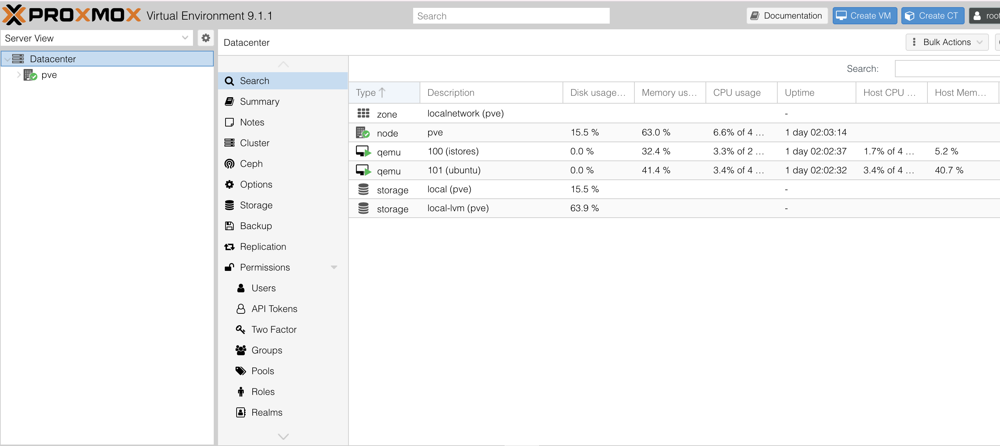
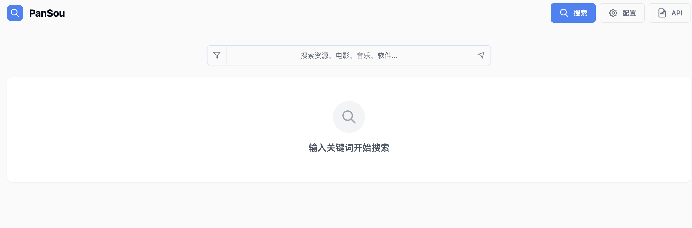
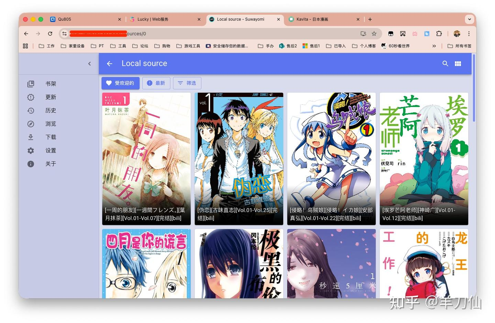
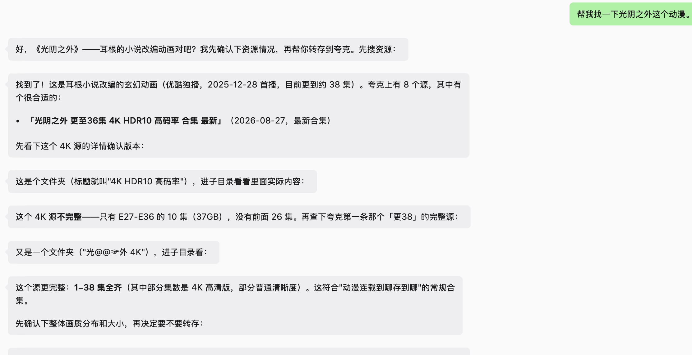
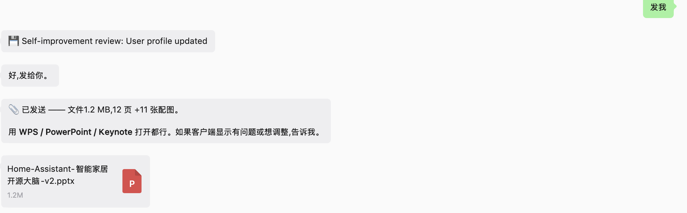
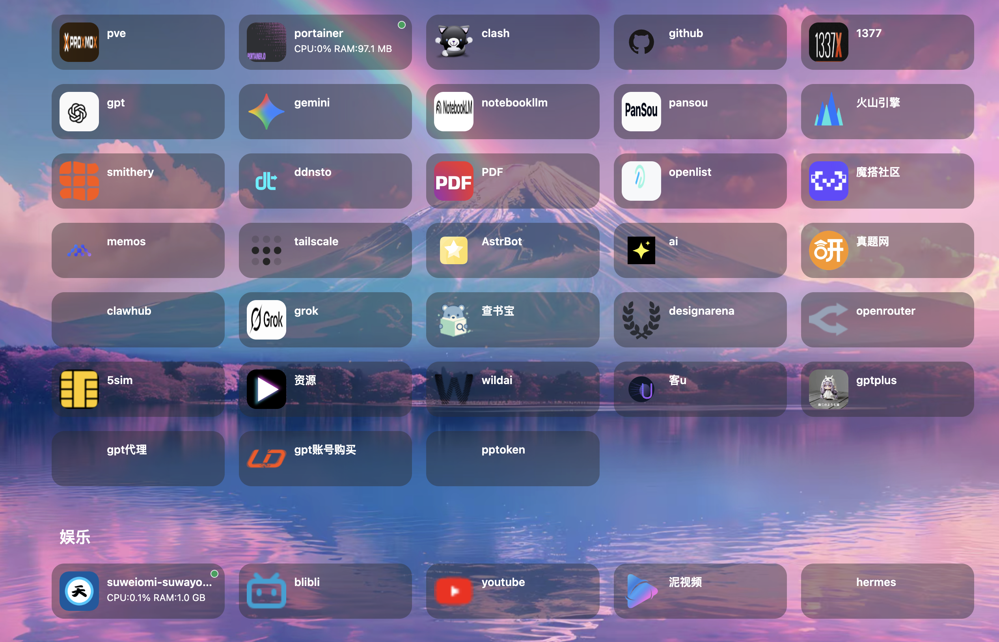

我的个人服务器使用我的老主机上刷了pve做成的，然后再pve上创建一个一个ubuntu-server的虚拟机和软路由：

我的大部分的功能是搭建在我的ubuntu-server中，我配置了pansou这个docker项目可以用来收集资料：

用suweiomi这个docker项目用来看漫画：

用hermes（用docker）部署作为我的个人助手，配置了网盘skill，收集资源skills和写ppt的skills
可以帮我收集影视并且配置到网盘中：

帮我做ppt：

等

做了一个导航页面，帮我把有用的网站放在一起：

通过配置tailscale可以