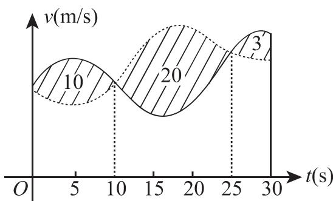
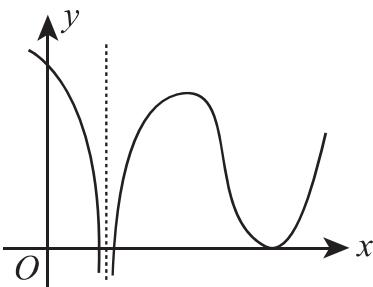
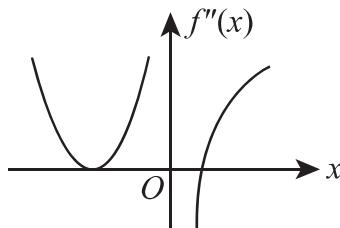
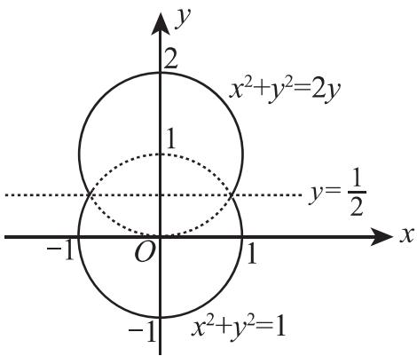
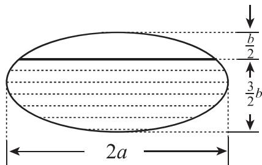

# 历年考研数学 真题汇总

(数学二)

(2010 - 2019)

# 2019 年全国硕士研究生招生考试试题

## 一、选择题(本题共8小题,每小题4分,共32分.在每小题给出的四个选项中,只有一项符合题目要求,把所选项前的字母填在题后的括号内.)

(1) 当 $x \to 0$ 时, 若 $x - \tan x$ 与 $x^{k}$ 是同阶无穷小, 则 $k = (\quad)$ (A)1. (B)2. (C)3. (D)4.

(2) 曲线 $y = x \sin x + 2 \cos x \left(-\frac{\pi}{2} < x < 2\pi\right)$ 的拐点坐标为 ( )
(A) $(0,2)$ . (B) $(\pi,-2)$ . (C) $\left(\frac{\pi}{2},\frac{\pi}{2}\right)$ . (D) $\left(\frac{3\pi}{2},-\frac{3\pi}{2}\right)$ .

(3) 下列反常积分发散的是( )
(A) $\int_{0}^{+\infty}xe^{-x}dx.$ (B) $\int_{0}^{+\infty}xe^{-x^{2}}dx.$ (C) $\int_{0}^{+\infty}\frac{\arctan x}{1+x^{2}}dx.$ (D) $\int_{0}^{+\infty}\frac{x}{1+x^{2}}dx.$

(4) 已知微分方程 $y'' + ay' + by = ce^{x}$ 的通解为 $y = (C_{1} + C_{2}x)e^{-x} + e^{x}$ ，则 a、b、c 依次为（）
(A)1,0,1.
(B)1,0,2.
(C)2,1,3.
(D)2,1,4.

(5) 已知平面区域 $D = \left\{(x, y) \mid |x| + |y| \leqslant \frac{\pi}{2}\right\}$ , $I_1 = \iint_{D} \sqrt{x^2 + y^2} \mathrm{d}x \mathrm{d}y$ , $I_2 = \iint_{D} \sin \sqrt{x^2 + y^2} \mathrm{d}x \mathrm{d}y$ , $I_3 = \iint_{D} (1 - \cos \sqrt{x^2 + y^2}) \mathrm{d}x \mathrm{d}y$ , 则（ ）  
(A) $I_3 < I_2 < I_1$ . (B) $I_2 < I_1 < I_3$ .  
(C) $I_1 < I_2 < I_3$ . (D) $I_2 < I_3 < I_1$ .

(6) 已知 $f(x)$ ， $g(x)$ 2 阶可导且 2 阶导函数在 x = a 处连续，则 $\lim_{x \to a} \frac{f(x) - g(x)}{(x - a)^2} = 0$ 是曲线 $y = f(x)$ 和 $y = g(x)$ 在 x = a 对应的点处相切且曲率相等的（）

(A) 充分非必要条件.

(B) 充分必要条件.

(C) 必要非充分条件.

(D) 既非充分又非必要条件.

(7) 设 A 是 4 阶矩阵, $A^{*}$ 是 A 的伴随矩阵, 若线性方程组 Ax = 0 的基础解系中只有 2 个向量, 则 $r(A^{*}) = (\quad)$ (A)0. (B)1. (C)2. (D)3.

(8) 设 A 是 3 阶实对称矩阵, E 是 3 阶单位矩阵. 若 $A^{2} + A = 2E$ , 且 $|A| = 4$ , 则二次型 $x^{T}Ax$ 的规范形为 ( )
(A) $y_{1}^{2}+y_{2}^{2}+y_{3}^{2}.$ (B) $y_{1}^{2}+y_{2}^{2}-y_{3}^{2}.$ (C) $y_{1}^{2}-y_{2}^{2}-y_{3}^{2}.$ (D) $-y_{1}^{2}-y_{2}^{2}-y_{3}^{2}.$

## 二、填空题(本题共6小题,每小题4分,共24分,把答案填在题中横线上.)

(9) $\lim_{x\to 0}(x + 2^x)^{\frac{2}{x}} =$

(10) 曲线 $\left\{\begin{aligned}x &= t - \sin t, \\ y &= 1 - \cos t\end{aligned}\right.$ 在 $t = \frac{3\pi}{2}$ 对应点处的切线在 y 轴上的截距为 \_\_\_\_.

(11) 设函数 $f(u)$ 可导， $z = yf\left(\frac{y^{2}}{x}\right)$ ，则 $2x \frac{\partial z}{\partial x} + y \frac{\partial z}{\partial y} =$ \_\_\_\_ .

(12) 曲线 $y = \ln \cos x \left(0 \leqslant x \leqslant \frac{\pi}{6}\right)$ 的弧长为 \_\_\_\_.

(13) 已知函数 $f(x) = x \int_{1}^{x} \frac{\sin t^2}{t} \, \mathrm{d}t$ ，则 $\int_{0}^{1} f(x) \, \mathrm{d}x = \underline{\quad}$ .

(14) 已知矩阵 $A = \begin{pmatrix} 1 & -1 & 0 & 0 \\ -2 & 1 & -1 & 1 \\ 3 & -2 & 2 & -1 \\ 0 & 0 & 3 & 4 \end{pmatrix}$ ， $A_{ij}$ 表示 $|A|$ 中 $(i, j)$ 元的代数余子式，则 $A_{11} - A_{12} =$ \_\_\_\_.

## 三、解答题(本题共9小题,共94分,解答应写出文字说明、证明过程或演算步骤.)

(15) (本题满分 10 分)

已知函数 $f(x) = \begin{cases} x^{2x}, & x > 0, \\ x\mathrm{e}^x + 1, & x \leqslant 0. \end{cases}$ 求 $f'(x)$ ，并求 $f(x)$ 的极值.

## (16) (本题满分 10 分)

求不定积分 $\int \frac{3x + 6}{(x - 1)^2(x^2 + x + 1)}\mathrm{d}x.$

## (17) (本题满分 10 分)

设函数 $y(x)$ 是微分方程 $y' - xy = \frac{1}{2\sqrt{x}}\mathrm{e}^{\frac{x^2}{2}}$ 满足条件 $y(1) = \sqrt{\mathrm{e}}$ 的特解.

( I ) 求 $y(x)$ ;

（Ⅱ）设平面区域 $D = \{(x, y) \mid 1 \leqslant x \leqslant 2, 0 \leqslant y \leqslant y(x)\}$ ，求 $D$ 绕 $x$ 轴旋转所得旋转体的体积.

## (18) (本题满分 10 分)

已知平面区域 $D = \{(x, y) | | x| \leqslant y, (x^2 + y^2)^3 \leqslant y^4\}$ ，计算二重积分 $\iint_{D} \frac{x + y}{\sqrt{x^2 + y^2}} \mathrm{d}x \mathrm{d}y.$

## (19) (本题满分 10 分)

设 n 为正整数, 记 $S_{n}$ 为曲线 $y = e^{-x} \sin x (0 \leqslant x \leqslant n\pi)$ 与 x 轴所围图形的面积, 求 $S_{n}$ , 并求 $\lim_{n \to \infty} S_{n}$ .

## (20) (本题满分 11 分)

已知函数 $u(x,y)$ 满足 $2\frac{\partial^2u}{\partial x^2} - 2\frac{\partial^2u}{\partial y^2} + 3\frac{\partial u}{\partial x} + 3\frac{\partial u}{\partial y} = 0$ ，求 $a,b$ 的值，使得在变换 $u(x,y) = v(x,y)\mathrm{e}^{ax + by}$ 下，上述等式可化为 $v(x,y)$ 不含一阶偏导数的等式.

## (21) (本题满分 11 分)

已知函数 $f(x)$ 在 $[0,1]$ 上具有2阶导数，且 $f(0) = 0, f(1) = 1, \int_{0}^{1} f(x) \, \mathrm{d}x = 1$ ，证明：

( I ) 存在 $\xi \in (0,1)$ ，使得 $f'(\xi) = 0$ ;

(Ⅱ) 存在 $\eta \in (0,1)$ ，使得 $f''(\eta) < -2$ .

## (22) (本题满分 11 分)

已知向量组 $\mathbf{I}:\pmb{\alpha}_{1} = \begin{pmatrix} 1\\ 1\\ 4 \end{pmatrix},\pmb{\alpha}_{2} = \begin{pmatrix} 1\\ 0\\ 4 \end{pmatrix},\pmb{\alpha}_{3} = \begin{pmatrix} 1\\ 2\\ a^{2} + 3 \end{pmatrix}$ 与 $\mathrm{II}:\pmb{\beta}_{1} = \begin{pmatrix} 1\\ 1\\ a + 3 \end{pmatrix},\pmb{\beta}_{2} = \begin{pmatrix} 0\\ 2\\ 1 - a \end{pmatrix},$ $\pmb{\beta}_{3} = \begin{pmatrix} 1\\ 3\\ a^{2} + 3 \end{pmatrix}$ . 若向量组 $\mathbf{I}$ 与 $\mathrm{II}$ 等价，求 $a$ 的取值，并将 $\pmb{\beta}_{3}$ 用 $\alpha_{1},\alpha_{2},\alpha_{3}$ 线性表示.

## (23) (本题满分11分)

( I ) 求 x, y;

已知矩阵 $\mathbf{A} = \begin{pmatrix} -2 & -2 & 1 \\ 2 & x & -2 \\ 0 & 0 & -2 \end{pmatrix}$ 与 $\mathbf{B} = \begin{pmatrix} 2 & 1 & 0 \\ 0 & -1 & 0 \\ 0 & 0 & y \end{pmatrix}$ 相似.

(Ⅱ) 求可逆矩阵 P, 使得 $P^{-1}AP = B$ .

# 2018年全国硕士研究生招生考试试题

## 一、选择题(本题共8小题,每小题4分,共32分.在每小题给出的四个选项中,只有一项符合题目要求,把所选项前的字母填在题后的括号内.)

(1) 若 $\lim_{x\to0}\left(\mathrm{e}^{x}+ax^{2}+bx\right)^{\frac{1}{x^{2}}}=1$ , 则 ( )
(A) $a=\frac{1}{2},b=-1.$ (B) $a=-\frac{1}{2},b=-1.$ (C) $a=\frac{1}{2},b=1.$ (D) $a=-\frac{1}{2},b=1.$

(2) 下列函数中, 在 $x = 0$ 处不可导的是 ( )
(A) $f(x) = |x|\sin |x|$ . (B) $f(x) = |x|\sin \sqrt{|x|}$ .
(C) $f(x) = \cos |x|$ . (D) $f(x) = \cos \sqrt{|x|}$ .

(3) 设函数 $f(x) = \begin{cases} -1, & x < 0, \\ 1, & x \geqslant 0, \end{cases}$ $g(x) = \begin{cases} 2 - ax, & x \leqslant -1, \\ x, & -1 < x < 0, \\ x - b, & x \geqslant 0. \end{cases}$ 若 $f(x) + g(x)$ 在 $\mathbf{R}$ 上连续，
则（）
(A) a = 3, b = 1.
(B) a = 3, b = 2.
(C) a = -3, b = 1.
(D) a = -3, b = 2.

(4) 设函数 $f(x)$ 在 $[0,1]$ 上二阶可导，且 $\int_0^1 f(x)\mathrm{d}x = 0$ ，则（A）当 $f'(x) < 0$ 时， $f\left(\frac{1}{2}\right) < 0.$ （B）当 $f''(x) < 0$ 时， $f\left(\frac{1}{2}\right) < 0.$ （C）当 $f'(x) > 0$ 时， $f\left(\frac{1}{2}\right) < 0.$ （D）当 $f''(x) > 0$ 时， $f\left(\frac{1}{2}\right) < 0.$

(5) 设 $M = \int_{-\frac{\pi}{2}}^{\frac{\pi}{2}} \frac{(1 + x)^{2}}{1 + x^{2}} \, dx$ , $N = \int_{-\frac{\pi}{2}}^{\frac{\pi}{2}} \frac{1 + x}{\mathrm{e}^{x}} \, dx$ , $K = \int_{-\frac{\pi}{2}}^{\frac{\pi}{2}} (1 + \sqrt{\cos x}) \, dx$ , 则 (A) M > N > K.
(B) M > K > N.
(C) K > M > N.
(D) K > N > M.

(6) $\int_{-1}^{0}\mathrm{d}x\int_{-x}^{2 - x^2}(1 - xy)\mathrm{d}y + \int_0^1\mathrm{d}x\int_x^{2 - x^2}(1 - xy)\mathrm{d}y = (\quad)$ (A) $\frac{5}{3}$ . (B) $\frac{5}{6}$ . (C) $\frac{7}{3}$ . (D) $\frac{7}{6}$ .

(7) 下列矩阵中, 与矩阵 $\begin{pmatrix}1 & 1 & 0 \\ 0 & 1 & 1 \\ 0 & 0 & 1\end{pmatrix}$ 相似的为 ( )

(A) $\begin{pmatrix}1 & 1 & -1 \\ 0 & 1 & 1 \\ 0 & 0 & 1\end{pmatrix}$ .

(B) $\begin{pmatrix}1 & 0 & -1 \\ 0 & 1 & 1 \\ 0 & 0 & 1\end{pmatrix}$ .

(C) $\begin{pmatrix} 1 & 1 & -1 \\ 0 & 1 & 0 \\ 0 & 0 & 1 \end{pmatrix}$ . (D) $\begin{pmatrix} 1 & 0 & -1 \\ 0 & 1 & 0 \\ 0 & 0 & 1 \end{pmatrix}$ .

(8) 设 A, B 为 n 阶矩阵, 记 $r(X)$ 为矩阵 X 的秩, $(X, Y)$ 表示分块矩阵, 则 ( )
(A) $r(A, AB) = r(A)$ . (B) $r(A, BA) = r(A)$ .
(C) $r(A,B)=\max\{r(A),r(B)\}$ . (D) $r(A,B)=r(A^{T},B^{T})$ .

## 二、填空题(本题共6小题,每小题4分,共24分,把答案填在题中横线上.)

(9) $\lim_{x\to +\infty}x^2 [\arctan (x + 1) - \arctan x] = \underline{\quad}$ .

(10) 曲线 $y = x^{2} + 2\ln x$ 在其拐点处的切线方程是 \_\_\_\_.

(11) $\int_{5}^{+\infty}\frac{1}{x^2 - 4x + 3}\mathrm{d}x =$

(12) 曲线 $\left\{\begin{aligned} x &= \cos^{3}t, \\ y &= \sin^{3}t \end{aligned}\right.$ 在 $t = \frac{\pi}{4}$ 对应点处的曲率为 \_\_\_\_.

(13) 设函数 $z = z(x, y)$ 由方程 $\ln z + e^{z-1} = xy$ 确定，则 $\frac{\partial z}{\partial x}\bigg|_{(2, \frac{1}{2})} =$ \_\_\_\_ .

(14) 设 A 为 3 阶矩阵, $\alpha_{1}, \alpha_{2}, \alpha_{3}$ 为线性无关的向量组. 若 $A\alpha_{1} = 2\alpha_{1} + \alpha_{2} + \alpha_{3}, A\alpha_{2} = \alpha_{2} + 2\alpha_{3}$ , $A\alpha_{3} = -\alpha_{2} + \alpha_{3}$ , 则 A 的实特征值为 \_\_\_\_.

## 三、解答题(本题共9小题,共94分,解答应写出文字说明、证明过程或演算步骤.)

(15) (本题满分 10 分)

求不定积分 $\int \mathrm{e}^{2x}\arctan \sqrt{\mathrm{e}^x - 1}\mathrm{d}x.$

(16) (本题满分 10 分)

已知连续函数 $f(x)$ 满足 $\int_{0}^{x}f(t)\mathrm{d}t + \int_{0}^{x}tf(x - t)\mathrm{d}t = ax^{2}$ .

( I ) 求 $f(x)$ ;

(Ⅱ) 若 $f(x)$ 在区间 $[0,1]$ 上的平均值为 1, 求 a 的值.

## (17) (本题满分 10 分)

设平面区域 $D$ 由曲线 $\left\{ \begin{array}{l}x = t - \sin t,\\ y = 1 - \cos t \end{array} \right.$ （ $0\leqslant t\leqslant 2\pi$ ）与 $x$ 轴围成，计算二重积分 $\iint_{D}(x + 2y)\mathrm{d}x\mathrm{d}y.$

## (18) (本题满分 10 分)

已知常数 $k \geqslant \ln 2 - 1$ . 证明: $(x - 1)(x - \ln^2 x + 2k\ln x - 1) \geqslant 0$ .

## (19) (本题满分 10 分)

将长为 $2\mathrm{m}$ 的铁丝分成三段，依次围成圆、正方形与正三角形.三个图形的面积之和是否存在最小值?若存在，求出最小值

## (20) (本题满分 11 分)

已知曲线 $L: y = \frac{4}{9}x^{2}(x \geqslant 0)$ ，点 $O(0,0)$ ，点 $A(0,1)$ 。设 P 是 L 上的动点，S 是直线 OA 与直线 AP 及曲线 L 所围图形的面积。若 P 运动到点 $(3,4)$ 时沿 x 轴正向的速度是 4，求此时 S 关于时间 t 的变化率。

## (21) (本题满分 11 分)

设数列 $\{x_{n}\}$ 满足: $x_{1} > 0, x_{n}e^{x_{n+1}} = e^{x_{n}} - 1 (n = 1, 2, \cdots)$ . 证明 $\{x_{n}\}$ 收敛, 并求 $\lim_{n \to \infty} x_{n}$ .

## (22) (本题满分11分)

设实二次型 $f(x_{1},x_{2},x_{3})=(x_{1}-x_{2}+x_{3})^{2}+(x_{2}+x_{3})^{2}+(x_{1}+ax_{3})^{2}$ ，其中a是参数.

( I ) 求 $f(x_{1}, x_{2}, x_{3}) = 0$ 的解;

(Ⅱ) 求 $f(x_{1}, x_{2}, x_{3})$ 的规范形.

## (23) (本题满分 11 分)

已知 $a$ 是常数，且矩阵 $\mathbf{A} = \begin{pmatrix} 1 & 2 & a \\ 1 & 3 & 0 \\ 2 & 7 & -a \end{pmatrix}$ 可经初等列变换化为矩阵 $\mathbf{B} = \begin{pmatrix} 1 & a & 2 \\ 0 & 1 & 1 \\ -1 & 1 & 1 \end{pmatrix}$ .

( I ) 求 a;

(Ⅱ) 求满足 AP = B 的可逆矩阵 P.

# 2017 年全国硕士研究生招生考试试题

## 一、选择题(本题共8小题,每小题4分,共32分.在每小题给出的四个选项中,只有一项符合题目要求,把所选项前的字母填在题后的括号内.)

(1) 若函数 $f(x)=\left\{\begin{aligned}&\frac{1-\cos\sqrt{x}}{ax},&x>0,\\&b,&x\leqslant0\end{aligned}\right.$ 在 x=0 处连续，则（） (A) $ab=\frac{1}{2}.$ (B) $ab=-\frac{1}{2}.$ (C) ab=0. (D) ab=2.

(2) 设二阶可导函数 $f(x)$ 满足 $f(1) = f(-1) = 1$ , $f(0) = -1$ 且 $f''(x) > 0$ , 则 (A) $\int_{-1}^{1} f(x) \, dx > 0.$ (B) $\int_{-1}^{1} f(x) \, dx < 0.$ (C) $\int_{-1}^{0} f(x) \, dx > \int_{0}^{1} f(x) \, dx.$ (D) $\int_{-1}^{0} f(x) \, dx < \int_{0}^{1} f(x) \, dx.$

(3) 设数列 $\{x_{n}\}$ 收敛, 则 ( )
(A) 当 $\lim_{n\to \infty}\sin x_n = 0$ 时, $\lim_{n\to \infty}x_n = 0$ .
(B) 当 $\lim_{n\to \infty}(x_n + \sqrt{|x_n|}) = 0$ 时, $\lim_{n\to \infty}x_n = 0$ .
(C) 当 $\lim_{n\to \infty}(x_n + x_n^2) = 0$ 时, $\lim_{n\to \infty}x_n = 0$ .
(D) 当 $\lim_{n\to \infty}(x_n + \sin x_n) = 0$ 时, $\lim_{n\to \infty}x_n = 0$ .

(4) 微分方程 $y'' - 4y' + 8y = e^{2x}(1 + \cos 2x)$ 的特解可设为 $y^{*} = (\quad)$ (A) $Ae^{2x}+e^{2x}(B\cos 2x+C\sin 2x).$ (B) $Axe^{2x}+e^{2x}(B\cos 2x+C\sin 2x).$ (C) $Ae^{2x}+xe^{2x}(B\cos 2x+C\sin 2x).$ (D) $Axe^{2x}+xe^{2x}(B\cos 2x+C\sin 2x).$

(5) 设 $f(x,y)$ 具有一阶偏导数, 且对任意的 $(x,y)$ , 都有 $\frac{\partial f(x,y)}{\partial x} > 0, \frac{\partial f(x,y)}{\partial y} < 0$ , 则 ( )  
(A) $f(0,0) > f(1,1)$ . (B) $f(0,0) < f(1,1)$ .
(C) $f(0,1)>f(1,0).$ (D) $f(0,1)<f(1,0).$

(6) 甲, 乙两人赛跑, 计时开始时, 甲在乙前方 10 (单位: m) 处, 图中, 实线表示甲的速度曲线 $v = v_{1}(t)$ (单位: m/s), 虚线表示乙的速度曲线 $v = v_{2}(t)$ ,

$v = v_{1}(t)$ （单位：m/s），虚线表示乙的速度曲线 $v = v_{2}(t)$ ，三块阴影部分面积的数值依次为 10,20,3. 计时开始后乙追上甲的时刻记为 $t_{0}$ （单位：s），则（）
(A) $t_{0} = 10$ .
(B) $15 < t_{0} < 20$ .
(C) $t_{0} = 25$ .
(D) $t_{0} > 25$ .

(7) 设 A 为 3 阶矩阵, $P = (\alpha_{1}, \alpha_{2}, \alpha_{3})$ 为可逆矩阵, 使得 $P^{-1}AP = \begin{pmatrix} 0 & 0 & 0 \\ 0 & 1 & 0 \\ 0 & 0 & 2 \end{pmatrix}$ , 则

$A(\alpha_{1} + \alpha_{2} + \alpha_{3}) = (\quad)$ (A) $\pmb{\alpha}_{1} + \pmb{\alpha}_{2}$ . (B) $\pmb{\alpha}_{2} + 2\pmb{\alpha}_{3}$ . (C) $\pmb{\alpha}_{2} + \pmb{\alpha}_{3}$ . (D) $\pmb{\alpha}_{1} + 2\pmb{\alpha}_{2}$ .

(8) 已知矩阵 $A = \begin{pmatrix} 2 & 0 & 0 \\ 0 & 2 & 1 \\ 0 & 0 & 1 \end{pmatrix}$ ， $B = \begin{pmatrix} 2 & 1 & 0 \\ 0 & 2 & 0 \\ 0 & 0 & 1 \end{pmatrix}$ ， $C = \begin{pmatrix} 1 & 0 & 0 \\ 0 & 2 & 0 \\ 0 & 0 & 2 \end{pmatrix}$ ，则（）
(A) A 与 C 相似, B 与 C 相似.
(B) A 与 C 相似, B 与 C 不相似.
(C) A 与 C 不相似, B 与 C 相似.
(D) A 与 C 不相似, B 与 C 不相似.

## 二、填空题(本题共6小题,每小题4分,共24分,把答案填在题中横线上.)

(9) 曲线 $y = x \left(1 + \arcsin \frac{2}{x}\right)$ 的斜渐近线方程为 \_\_\_\_.

(10) 设函数 $y = y(x)$ 由参数方程 $\left\{\begin{aligned} x &= t + e^{t}, \\ y &= \sin t \end{aligned}\right.$ 确定，则 $\frac{d^{2}y}{dx^{2}}\bigg|_{t=0} =$ \_\_\_\_.

(11) $\int_0^{+\infty}\frac{\ln(1 + x)}{(1 + x)^2}\mathrm{d}x = \underline{\quad}$ .

(12) 设函数 $f(x,y)$ 具有一阶连续偏导数，且 $\mathrm{d}f(x,y)=y\mathrm{e}^{y}\mathrm{d}x+x(1+y)\mathrm{e}^{y}\mathrm{d}y,f(0,0)=0$ ，则 $f(x,y)=$ \_\_\_\_.

(13) $\int_0^1\mathrm{d}y\int_y^1\frac{\tan x}{x}\mathrm{d}x = \underline{\quad}$ .

(14) 设矩阵 $A = \begin{pmatrix} 4 & 1 & -2 \\ 1 & 2 & a \\ 3 & 1 & -1 \end{pmatrix}$ 的一个特征向量为 $\begin{pmatrix} 1 \\ 1 \\ 2 \end{pmatrix}$ ，则 $a =$ \_\_\_\_ .

## 三、解答题(本题共9小题,共94分,解答应写出文字说明、证明过程或演算步骤.)

(15) (本题满分 10 分)

求 $\lim_{x\to 0^{+}}\frac{\int_0^x\sqrt{x - t}\mathrm{e}^t\mathrm{d}t}{\sqrt{x^3}}.$

(16) (本题满分 10 分)

设函数 $f(u,v)$ 具有2阶连续偏导数, $y=f(\mathrm{e}^{x},\cos x)$ ,求 $\frac{\mathrm{d}y}{\mathrm{d}x}\bigg|_{x=0},\frac{\mathrm{d}^{2}y}{\mathrm{d}x^{2}}\bigg|_{x=0}$ .

## (17) (本题满分 10 分)

求 $\lim_{n\to\infty}\sum_{k=1}^{n}\frac{k}{n^{2}}\ln\left(1+\frac{k}{n}\right)$ .

## (18) (本题满分 10 分)

已知函数 $y(x)$ 由方程 $x^{3} + y^{3} - 3x + 3y - 2 = 0$ 确定, 求 $y(x)$ 的极值.

## (19) (本题满分 10 分)

设函数 $f(x)$ 在区间 $[0,1]$ 上具有2阶导数，且 $f(1) > 0$ ， $\lim_{x \to 0^{+}} \frac{f(x)}{x} < 0$ 。证明：

（Ⅰ）方程 $f(x)=0$ 在区间 $(0,1)$ 内至少存在一个实根；

(Ⅱ) 方程 $f(x)f''(x) + [f'(x)]^{2} = 0$ 在区间 $(0,1)$ 内至少存在两个不同实根.

## (20) (本题满分 11 分)

已知平面区域 $D = \{(x, y) \mid x^2 + y^2 \leqslant 2y\}$ ，计算二重积分 $\iint_{D} (x + 1)^2 \mathrm{d}x \mathrm{d}y$ .

## (21) (本题满分 11 分)

设 $y(x)$ 是区间 $\left(0, \frac{3}{2}\right)$ 内的可导函数，且 $y(1) = 0$ 。点 P 是曲线 $l: y = y(x)$ 上的任意一点，l 在点 P 处的切线与 y 轴相交于点 $(0, Y_{P})$ ，法线与 x 轴相交于点 $(X_{P}, 0)$ ，若 $X_{P} = Y_{P}$ ，求 l 上点的坐标 $(x, y)$ 满足的方程。

## (22) (本题满分 11 分)

设3阶矩阵 $A = (\alpha_{1},\alpha_{2},\alpha_{3})$ 有3个不同的特征值，且 $\alpha_{3} = \alpha_{1} + 2\alpha_{2}$

( I ) 证明 $r(A) = 2$ ;

(Ⅱ) 若 $\beta = \alpha_{1} + \alpha_{2} + \alpha_{3}$ ，求方程组 Ax = $\beta$ 的通解.

## (23) (本题满分11分)

设二次型 $f(x_{1},x_{2},x_{3})=2x_{1}^{2}-x_{2}^{2}+ax_{3}^{2}+2x_{1}x_{2}-8x_{1}x_{3}+2x_{2}x_{3}$ 在正交变换x=Qy下的标准形为 $\lambda_{1}y_{1}^{2}+\lambda_{2}y_{2}^{2}$ ，求a的值及一个正交矩阵Q.

# 2016 年全国硕士研究生招生考试试题

## 一、选择题(本题共8小题,每小题4分,共32分.在每小题给出的四个选项中,只有一项符合题目要求,把所选项前的字母填在题后的括号内.)

(1) 设 $\alpha_{1}=x(\cos\sqrt{x}-1)$ , $\alpha_{2}=\sqrt{x}\ln(1+\sqrt[3]{x})$ , $\alpha_{3}=\sqrt[3]{x+1}-1$ . 当 $x\to0^{+}$ 时, 以上 3 个无穷小量按照从低阶到高阶的排序是( )
(A) $\alpha_{1},\alpha_{2},\alpha_{3}.$ (B) $\alpha_{2},\alpha_{3},\alpha_{1}.$ (C) $\alpha_{2},\alpha_{1},\alpha_{3}.$ (D) $\alpha_{3},\alpha_{2},\alpha_{1}.$

(2) 已知函数 $f(x) = \begin{cases} 2(x - 1), & x < 1, \\ \ln x, & x \geqslant 1, \end{cases}$ 则 $f(x)$ 的一个原函数是（）  
(A) $F(x) = \begin{cases} (x - 1)^2, & x < 1, \\ x(\ln x - 1), & x \geqslant 1. \end{cases}$ (B) $F(x) = \begin{cases} (x - 1)^2, & x < 1, \\ x(\ln x + 1) - 1, & x \geqslant 1. \end{cases}$ (C) $F(x) = \begin{cases} (x - 1)^2, & x < 1, \\ x(\ln x + 1) + 1, & x \geqslant 1. \end{cases}$ (D) $F(x) = \begin{cases} (x - 1)^2, & x < 1, \\ x(\ln x - 1) + 1, & x \geqslant 1. \end{cases}$

(3) 反常积分 ① $\int_{-\infty}^{0} \frac{1}{x^2} \mathrm{e}^{\frac{1}{x}} \mathrm{d}x$ , ② $\int_{0}^{+\infty} \frac{1}{x^2} \mathrm{e}^{\frac{1}{x}} \mathrm{d}x$ 的敛散性为 ( )

(A) ① 收敛, ② 收敛. (B) ① 收敛, ② 发散.

(C) ① 发散, ② 收敛. (D) ① 发散, ② 发散.

(4) 设函数 $f(x)$ 在 $(-∞, +∞)$ 内连续, 其导函数的图形如图所示, 则( )

(A) 函数 $f(x)$ 有 2 个极值点, 曲线 $y = f(x)$ 有 2 个拐点.

(B) 函数 $f(x)$ 有 2 个极值点, 曲线 $y = f(x)$ 有 3 个拐点.

(C) 函数 $f(x)$ 有 3 个极值点, 曲线 $y = f(x)$ 有 1 个拐点.

(D) 函数 $f(x)$ 有 3 个极值点, 曲线 $y = f(x)$ 有 2 个拐点.

(5) 设函数 $f_{i}(x) (i = 1, 2)$ 具有二阶连续导数，且 $f_{i}''(x_0) < 0 (i = 1, 2)$ . 若两条曲线 $y = f_{i}(x) (i = 1, 2)$ 在点 $(x_0, y_0)$ 处具有公切线 $y = g(x)$ ，且在该点处曲线 $y = f_{1}(x)$ 的曲率大于曲线 $y = f_{2}(x)$ 的曲率，则在 $x_0$ 的某个邻域内，有（）  
(A) $f_{1}(x) \leqslant f_{2}(x) \leqslant g(x)$ . (B) $f_{2}(x) \leqslant f_{1}(x) \leqslant g(x)$ .  
(C) $f_{1}(x) \leqslant g(x) \leqslant f_{2}(x)$ . (D) $f_{2}(x) \leqslant g(x) \leqslant f_{1}(x)$ .

(6) 已知函数 $f(x, y) = \frac{\mathrm{e}^{x}}{x - y}$ ，则（）
(A) $f_{x}^{\prime}-f_{y}^{\prime}=0.$ (B) $f_{x}^{\prime}+f_{y}^{\prime}=0.$ (C) $f_{x}^{\prime}-f_{y}^{\prime}=f.$ (D) $f_{x}^{\prime}+f_{y}^{\prime}=f.$

(7) 设 A, B 是可逆矩阵, 且 A 与 B 相似, 则下列结论错误的是 ( )
(A) $A^{T}$ 与 $B^{T}$ 相似. (B) $A^{-1}$ 与 $B^{-1}$ 相似.
(C) $A + A^{T}$ 与 $B + B^{T}$ 相似. (D) $A + A^{-1}$ 与 $B + B^{-1}$ 相似.

(8) 设二次型 $f(x_{1}, x_{2}, x_{3}) = a(x_{1}^{2} + x_{2}^{2} + x_{3}^{2}) + 2x_{1}x_{2} + 2x_{2}x_{3} + 2x_{1}x_{3}$ 的正、负惯性指数分别为1, 2，则( )
(A) $a > 1.$ (B) $a < -2.$ (C) $-2 < a < 1.$ (D) $a = 1$ 或 $a = -2.$

## 二、填空题(本题共6小题,每小题4分,共24分,把答案填在题中横线上.)

(9) 曲线 $y = \frac{x^{3}}{1 + x^{2}} + \arctan(1 + x^{2})$ 的斜渐近线方程为 \_\_\_\_.

(10) 极限 $\lim_{n\to\infty}\frac{1}{n^{2}}\left(\sin\frac{1}{n}+2\sin\frac{2}{n}+\cdots+n\sin\frac{n}{n}\right)=$ \_\_\_\_.

(11) 以 $y = x^2 - \mathrm{e}^x$ 和 $y = x^2$ 为特解的一阶非齐次线性微分方程为 \_\_\_\_.

(12) 已知函数 $f(x)$ 在 $(-∞, +∞)$ 上连续，且 $f(x) = (x + 1)^{2} + 2\int_{0}^{x}f(t)\mathrm{d}t$ ，则当 $n \geqslant 2$ 时， $f^{(n)}(0) =$ \_\_\_\_.

(13) 已知动点 P 在曲线 $y = x^{3}$ 上运动, 记坐标原点与点 P 间的距离为 l. 若点 P 的横坐标对时间的变化率为常数 $v_{0}$ , 则当点 P 运动到点 $(1, 1)$ 时, l 对时间的变化率是 \_\_\_\_.

(14) 设矩阵 $\begin{pmatrix} a & -1 & -1 \\ -1 & a & -1 \\ -1 & -1 & a \end{pmatrix}$ 与矩阵 $\begin{pmatrix} 1 & 1 & 0 \\ 0 & -1 & 1 \\ 1 & 0 & 1 \end{pmatrix}$ 等价, 则 a = \_\_\_\_.

## 三、解答题(本题共9小题,共94分,解答应写出文字说明、证明过程或演算步骤.)

(15) (本题满分 10 分)

求极限 $\lim_{x\to0}(\cos2x+2x\sin x)^{\frac{1}{x^{4}}}$ .

(16) (本题满分 10 分)

设函数 $f(x) = \int_{0}^{1} |t^{2} - x^{2}| \, \mathrm{d}t (x > 0)$ ，求 $f'(x)$ ，并求 $f(x)$ 的最小值.

(17) (本题满分 10 分)

已知函数 $z = z(x, y)$ 由方程 $(x^{2} + y^{2})z + \ln z + 2(x + y + 1) = 0$ 确定，求 $z = z(x, y)$ 的极值.

## (18) (本题满分 10 分)

设 $D$ 是由直线 $y = 1, y = x, y = -x$ 围成的有界区域，计算二重积分 $\iint_{D} \frac{x^2 - xy - y^2}{x^2 + y^2} \mathrm{d}x \mathrm{d}y.$

## (19) (本题满分 10 分)

已知 $y_{1}(x) = \mathrm{e}^{x}$ ， $y_{2}(x) = u(x)\mathrm{e}^{x}$ 是二阶微分方程 $(2x - 1)y'' - (2x + 1)y' + 2y = 0$ 的两个解。若 $u(-1) = \mathrm{e}$ ， $u(0) = -1$ ，求 $u(x)$ ，并写出该微分方程的通解。

## (20) (本题满分 11 分)

设 D 是由曲线 $y = \sqrt{1 - x^{2}} (0 \leqslant x \leqslant 1)$ 与 $\left\{\begin{aligned} x &= \cos^{3} t, \\ y &= \sin^{3} t \end{aligned}\right.$ $\left(0 \leqslant t \leqslant \frac{\pi}{2}\right)$ 围成的平面区域, 求 D 绕 x 轴旋转一周所得旋转体的体积和表面积.

## (21) (本题满分 11 分)

已知函数 $f(x)$ 在 $\left[0, \frac{3\pi}{2}\right]$ 上连续，在 $\left(0, \frac{3\pi}{2}\right)$ 内是函数 $\frac{\cos x}{2x - 3\pi}$ 的一个原函数，且 $f(0) = 0$ .

（I）求 $f(x)$ 在区间 $\left[0, \frac{3\pi}{2}\right]$ 上的平均值；

（Ⅱ）证明 $f(x)$ 在区间 $\left(0, \frac{3\pi}{2}\right)$ 内存在唯一零点.

## (22) (本题满分11分)

设矩阵 $\mathbf{A} = \begin{pmatrix} 1 & 1 & 1 - a \\ 1 & 0 & a \\ a + 1 & 1 & a + 1 \end{pmatrix}, \boldsymbol{\beta} = \begin{pmatrix} 0 \\ 1 \\ 2a - 2 \end{pmatrix}$ , 且方程组 $Ax = \boldsymbol{\beta}$ 无解.

(Ⅰ) 求 a 的值;

(Ⅱ) 求方程组 $A^{T}Ax = A^{T}\beta$ 的通解.

## (23) (本题满分11分)

已知矩阵 $\mathbf{A} = \begin{pmatrix} 0 & -1 & 1 \\ 2 & -3 & 0 \\ 0 & 0 & 0 \end{pmatrix}$ .

( I ) 求 $A^{99}$ ;

（Ⅱ）设3阶矩阵 $B=(\alpha_{1},\alpha_{2},\alpha_{3})$ 满足 $B^{2}=BA.$ 记 $B^{100}=(\beta_{1},\beta_{2},\beta_{3})$ ，将 $\beta_{1},\beta_{2},\beta_{3}$ 分别表示为 $\alpha_{1},\alpha_{2},\alpha_{3}$ 的线性组合.

# 2015 年全国硕士研究生招生考试试题

## 一、选择题(本题共8小题,每小题4分,共32分.在每小题给出的四个选项中,只有一项符合题目要求,把所选项前的字母填在题后的括号内.)

(1) 下列反常积分中收敛的是( )
(A) $\int_{2}^{+\infty}\frac{1}{\sqrt{x}}dx.$ (B) $\int_{2}^{+\infty}\frac{\ln x}{x}dx.$ (C) $\int_{2}^{+\infty}\frac{1}{x\ln x}dx.$ (D) $\int_{2}^{+\infty}\frac{x}{e^{x}}dx.$

(2) 函数 $f(x) = \lim_{t \to 0} \left(1 + \frac{\sin t}{x}\right)^{\frac{x^2}{t}}$ 在 $(-∞, +∞)$ 内 ( )
(A) 连续. (B) 有可去间断点. (C) 有跳跃间断点. (D) 有无穷间断点.

(3) 设函数 $f(x) = \begin{cases} x^{\alpha} \cos \frac{1}{x^{\beta}}, & x > 0, \\ 0, & x \leqslant 0 \end{cases} (\alpha > 0, \beta > 0)$ . 若 $f'(x)$ 在 $x = 0$ 处连续，则 ( ) (A) $\alpha - \beta > 1$ . (B) $0 < \alpha - \beta \leqslant 1$ . (C) $\alpha - \beta > 2$ . (D) $0 < \alpha - \beta \leqslant 2$ .

(4) 设函数在 $(-\infty, +\infty)$ 内连续, 其 2 阶导函数 $f''(x)$ 的图形如右图所示, 则曲线 $y = f(x)$ 的拐点个数为 ( )
(A)0.
(B)1.
(C)2.
(D)3.

(5) 设函数 $f(u, v)$ 满足 $f\left(x + y, \frac{y}{x}\right) = x^{2} - y^{2}$ ，则 $\left.\frac{\partial f}{\partial u}\right|_{\substack{u=1 \\ v=1}}$ ， $\left.\frac{\partial f}{\partial v}\right|_{\substack{u=1 \\ v=1}}$ 依次是（）
(A) $\frac{1}{2},0.$ (B) $0,\frac{1}{2}.$ (C) $-\frac{1}{2},0.$ (D) $0,-\frac{1}{2}.$

(6) 设 D 是第一象限中由曲线 2xy = 1, 4xy = 1 与直线 y = x, $y = \sqrt{3}x$ 围成的平面区域，函数 $f(x, y)$ 在 D 上连续，则 $\iint_{D} f(x, y) \, \mathrm{d}x \, \mathrm{d}y = (\quad)$ (A) $\int_{\frac{\pi}{4}}^{\frac{\pi}{3}}\mathrm{d}\theta\int_{\frac{1}{2\sin2\theta}}^{\frac{1}{\sin2\theta}}f(r\cos\theta,r\sin\theta)r\mathrm{d}r.$ (B) $\int_{\frac{\pi}{4}}^{\frac{\pi}{3}}\mathrm{d}\theta\int_{\frac{1}{\sqrt{2\sin2\theta}}}^{\frac{1}{\sqrt{\sin2\theta}}}f(r\cos\theta,r\sin\theta)r\mathrm{d}r.$ (C) $\int_{\frac{\pi}{4}}^{\frac{\pi}{3}}\mathrm{d}\theta\int_{\frac{1}{2\sin2\theta}}^{\frac{1}{\sin2\theta}}f(r\cos\theta,r\sin\theta)\mathrm{d}r.$ (D) $\int_{\frac{\pi}{4}}^{\frac{\pi}{3}}\mathrm{d}\theta\int_{\frac{1}{\sqrt{2\sin2\theta}}}^{\frac{1}{\sqrt{\sin2\theta}}}f(r\cos\theta,r\sin\theta)\mathrm{d}r.$

(7) 设矩阵 $A = \begin{pmatrix} 1 & 1 & 1 \\ 1 & 2 & a \\ 1 & 4 & a^{2} \end{pmatrix}$ ， $b = \begin{pmatrix} 1 \\ d \\ d^{2} \end{pmatrix}$ . 若集合 $\Omega = \{1, 2\}$ ，则线性方程组 Ax = b 有无穷多解的充分必要条件为（）

(A) $a \notin \Omega, d \notin \Omega.$ (B) $a \notin \Omega, d \in \Omega.$ (C) $a \in \Omega, d \notin \Omega.$ (D) $a \in \Omega, d \in \Omega.$

(8) 设二次型 $f(x_{1}, x_{2}, x_{3})$ 在正交变换 $x = Py$ 下的标准形为 $2y_{1}^{2} + y_{2}^{2} - y_{3}^{2}$ ，其中 $P = (e_{1}, e_{2}, e_{3})$ . 若 $Q = (e_{1}, -e_{3}, e_{2})$ ，则 $f(x_{1}, x_{2}, x_{3})$ 在正交变换 $x = Qy$ 下的标准形为（）

(A) $2y_{1}^{2} - y_{2}^{2} + y_{3}^{2}$ . (B) $2y_{1}^{2} + y_{2}^{2} - y_{3}^{2}$ . (C) $2y_{1}^{2} - y_{2}^{2} - y_{3}^{2}$ . (D) $2y_{1}^{2} + y_{2}^{2} + y_{3}^{2}$ .

## 二、填空题(本题共6小题,每小题4分,共24分,把答案填在题中横线上.)

(9) 设 $\left\{\begin{aligned}x &= \arctan t, \\ y &= 3t + t^{3},\end{aligned}\right.$ 则 $\frac{d^{2}y}{dx^{2}}\bigg|_{t=1}=$ \_\_\_\_.

(10) 函数 $f(x) = x^{2}2^{x}$ 在 x = 0 处的 n 阶导数 $f^{(n)}(0) =$ \_\_\_\_.

(11) 设函数 $f(x)$ 连续, $\varphi(x)=\int_{0}^{x^{2}}xf(t)\mathrm{d}t.$ 若 $\varphi(1)=1,\varphi'(1)=5$ , 则 $f(1)=$ \_\_\_\_.

（12）设函数 $y = y(x)$ 是微分方程 $y'' + y' - 2y = 0$ 的解，且在 x = 0 处 $y(x)$ 取得极值 3，则 $y(x) =$ \_\_\_\_.

(13) 若函数 $z = z(x, y)$ 由方程 $e^{x+2y+3z} + xyz = 1$ 确定，则 $dz\bigg|_{(0,0)} =$ \_\_\_\_.

（14）设3阶矩阵A的特征值为2，-2,1， $B=A^{2}-A+E$ ，其中E为3阶单位矩阵，则行列式 $|B|=$ \_\_\_\_.

## 三、解答题(本题共9小题,共94分,解答应写出文字说明、证明过程或演算步骤.)

(15) (本题满分 10 分)

设函数 $f(x) = x + a\ln (1 + x) + bx\sin x, g(x) = kx^3$ . 若 $f(x)$ 与 $g(x)$ 在 $x \to 0$ 时是等价无穷小, 求 $a, b, k$ 的值.

## (16) (本题满分 10 分)

设 A > 0, D 是由曲线段 $y = A \sin x \left(0 \leqslant x \leqslant \frac{\pi}{2}\right)$ 及直线 y = 0, $x = \frac{\pi}{2}$ 所围成的平面区域， $V_{1}, V_{2}$ 分别表示 D 绕 x 轴与绕 y 轴旋转所成旋转体的体积. 若 $V_{1} = V_{2}$ ，求 A 的值.

(17) (本题满分 11 分)

已知函数 $f(x, y)$ 满足 $f_{xy}''(x, y) = 2(y + 1)\mathrm{e}^x$ , $f_x'(x, 0) = (x + 1)\mathrm{e}^x$ , $f(0, y) = y^2 + 2y$ , 求 $f(x, y)$ 的极值.

## (18) (本题满分 10 分)

计算二重积分 $\iint_{D} x(x + y) \, \mathrm{d}x \, \mathrm{d}y$ ，其中 $D = \{(x, y) \mid x^2 + y^2 \leqslant 2, y \geqslant x^2\}$ .

(19) (本题满分 11 分)

已知函数 $f(x) = \int_{x}^{1}\sqrt{1 + t^{2}}\mathrm{d}t + \int_{1}^{x^{2}}\sqrt{1 + t}\mathrm{d}t$ ，求 $f(x)$ 零点的个数.

(20) (本题满分 10 分)

已知高温物体置于低温介质中,任一时刻该物体温度对时间的变化率与该时刻物体和介质的温差成正比.现将一初始温度为 $120^{\circ}$ C 的物体在 $20^{\circ}$ C 的恒温介质中冷却,30min 后该物体温度降至 $30^{\circ}$ C,若要将该物体的温度继续降至 $21^{\circ}$ C,还需冷却多长时间?

## (21) (本题满分 10 分)

已知函数 $f(x)$ 在区间 $[a, +\infty)$ 上具有2阶导数， $f(a) = 0, f'(x) > 0, f''(x) > 0.$ 设 $b > a$ ，曲线 $y = f(x)$ 在点 $(b, f(b))$ 处的切线与 $x$ 轴的交点是 $(x_0, 0)$ ，证明 $a < x_0 < b$ .

## (22) (本题满分11分)

设矩阵 $\mathbf{A} = \begin{pmatrix} a & 1 & 0 \\ 1 & a & -1 \\ 0 & 1 & a \end{pmatrix}$ , 且 $A^3 = O$ .

(I) 求 a 的值;

(Ⅱ) 若矩阵 X 满足 $X - X A^{2} - A X + A X A^{2} = E$ ，其中 E 为 3 阶单位矩阵，求 X.

## (23) (本题满分 11 分)

设矩阵 $\mathbf{A} = \begin{pmatrix} 0 & 2 & -3 \\ -1 & 3 & -3 \\ 1 & -2 & a \end{pmatrix}$ 相似于矩阵 $\mathbf{B} = \begin{pmatrix} 1 & -2 & 0 \\ 0 & b & 0 \\ 0 & 3 & 1 \end{pmatrix}$ .

(Ⅰ) 求 a, b 的值;

(Ⅱ) 求可逆矩阵 P, 使 $P^{-1}AP$ 为对角矩阵.

# 2014 年全国硕士研究生招生考试试题

## 一、选择题(本题共8小题,每小题4分,共32分.在每小题给出的四个选项中,只有一项符合题目要求,把所选项前的字母填在题后的括号内.)

(1) 当 $x \to 0^{+}$ 时, 若 $\ln^{\alpha}(1 + 2x), (1 - \cos x)^{\frac{1}{\alpha}}$ 均是比 $x$ 高阶的无穷小量, 则 $\alpha$ 的取值范围是 ( ) (A) $(2, +\infty)$ . (B) $(1, 2)$ . (C) $\left(\frac{1}{2}, 1\right)$ . (D) $\left(0, \frac{1}{2}\right)$ .

(2) 下列曲线中有渐近线的是( )
(A) $y = x + \sin x.$ (B) $y = x^{2} + \sin x.$ (C) $y = x + \sin \frac{1}{x}.$ (D) $y = x^{2} + \sin \frac{1}{x}.$

(3) 设函数 $f(x)$ 具有 2 阶导数， $g(x) = f(0)(1 - x) + f(1)x$ ，则在区间 $[0, 1]$ 上，( )

(A) 当 $f'(x) \geqslant 0$ 时， $f(x) \geqslant g(x)$ .

(B) 当 $f'(x) \geqslant 0$ 时， $f(x) \leqslant g(x)$ .

(C) 当 $f''(x) \geqslant 0$ 时， $f(x) \geqslant g(x)$ .

(D) 当 $f''(x) \geqslant 0$ 时， $f(x) \leqslant g(x)$ .

(4) 曲线 $\left\{\begin{aligned}x &=t^{2} + 7, \\ y &=t^{2} + 4t + 1\end{aligned}\right.$ 上对应于 t = 1 的点处的曲率半径是（）
(A) $\frac{\sqrt{10}}{50}.$ (B) $\frac{\sqrt{10}}{100}.$ (C) $10\sqrt{10}.$ (D) $5\sqrt{10}.$

(5) 设函数 $f(x) = \arctan x$ . 若 $f(x) = xf'(\xi)$ , 则 $\lim_{x \to 0} \frac{\xi^{2}}{x^{2}} = (\quad)$ (A)1.
(B) $\frac{2}{3}.$ (C) $\frac{1}{2}.$ (D) $\frac{1}{3}.$

(6) 设函数 $u(x, y)$ 在有界闭区域 $D$ 上连续，在 $D$ 的内部具有 2 阶连续偏导数，且满足 $\frac{\partial^2 u}{\partial x \partial y} \neq 0$ 及 $\frac{\partial^2 u}{\partial x^2} + \frac{\partial^2 u}{\partial y^2} = 0$ ，则（ ）  
(A) $u(x, y)$ 的最大值和最小值都在 $D$ 的边界上取得.  
(B) $u(x, y)$ 的最大值和最小值都在 $D$ 的内部取得.  
(C) $u(x, y)$ 的最大值在 $D$ 的内部取得，最小值在 $D$ 的边界上取得.  
(D) $u(x, y)$ 的最小值在 $D$ 的内部取得，最大值在 $D$ 的边界上取得.

(7) 行列式 $\begin{vmatrix}0 & a & b & 0 \\ a & 0 & 0 & b \\ 0 & c & d & 0 \\ c & 0 & 0 & d\end{vmatrix}=()$ (A) $(ad-bc)^{2}.$ (B) $-(ad-bc)^{2}.$ (C) $a^{2}d^{2}-b^{2}c^{2}.$ (D) $b^{2}c^{2}-a^{2}d^{2}.$

(8) 设 $\alpha_{1}, \alpha_{2}, \alpha_{3}$ 均为 3 维向量，则对任意常数 k, l，向量组 $\alpha_{1} + k\alpha_{3}, \alpha_{2} + l\alpha_{3}$ 线性无关是向量组 $\alpha_{1}$ ， $\alpha_{2}, \alpha_{3}$ 线性无关的（）
(A) 必要非充分条件. (B) 充分非必要条件.
(C) 充分必要条件. (D) 既非充分也非必要条件.

## 二、填空题(本题共6小题,每小题4分,共24分,把答案填在题中横线上.)

(9) $\int_{-\infty}^{1}\frac{1}{x^2 + 2x + 5}\mathrm{d}x = \underline{\quad}$ .

(10) 设 $f(x)$ 是周期为 4 的可导奇函数, 且 $f'(x) = 2(x - 1), x \in [0, 2]$ , 则 $f(7) = \_\_\_\_$ .

(11) 设 $z = z(x, y)$ 是由方程 $\mathrm{e}^{2yz} + x + y^2 + z = \frac{7}{4}$ 确定的函数, 则 $\mathrm{dz}\Big|_{\left(\frac{1}{2}, \frac{1}{2}\right)} = \_$ .

(12) 曲线 L 的极坐标方程是 $r = \theta$ ，则 L 在点 $(r, \theta) = \left(\frac{\pi}{2}, \frac{\pi}{2}\right)$ 处的切线的直角坐标方程是 \_\_\_\_.

(13) 一根长度为 1 的细棒位于 $x$ 轴的区间 $[0, 1]$ 上, 若其线密度 $\rho(x) = -x^2 + 2x + 1$ , 则该细棒的质心坐标 $\bar{x} = \_$ .

(14) 设二次型 $f(x_{1}, x_{2}, x_{3}) = x_{1}^{2} - x_{2}^{2} + 2ax_{1}x_{3} + 4x_{2}x_{3}$ 的负惯性指数为 1，则 a 的取值范围是 \_\_\_\_.

## 三、解答题(本题共9小题,共94分,解答应写出文字说明、证明过程或演算步骤.)

(15) (本题满分 10 分)

求极限 $\lim_{x\to+\infty}\frac{\int_{1}^{x}\left[t^{2}\left(\mathrm{e}^{\frac{1}{t}}-1\right)-t\right]\mathrm{d}t}{x^{2}\ln\left(1+\frac{1}{x}\right)}$ .

(16) (本题满分 10 分)

已知函数 $y = y(x)$ 满足微分方程 $x^{2} + y^{2}y' = 1 - y'$ ，且 $y(2) = 0$ ，求 $y(x)$ 的极大值与极小值.

## (17) (本题满分 10 分)

设平面区域 $D = \{(x, y) \mid 1 \leqslant x^2 + y^2 \leqslant 4, x \geqslant 0, y \geqslant 0\}$ . 计算 $\iint_{D} \frac{x \sin(\pi \sqrt{x^2 + y^2})}{x + y} \mathrm{d}x \mathrm{d}y$ .

## (18) (本题满分 10 分)

设函数 $f(u)$ 具有2阶连续导数, $z = f(\mathrm{e}^{x}\cos y)$ 满足

$$
\frac {\partial^ {2} z}{\partial x ^ {2}} + \frac {\partial^ {2} z}{\partial y ^ {2}} = (4 z + \mathrm{e} ^ {x} \cos y) \mathrm{e} ^ {2 x}.
$$

若 $f(0)=0,f'(0)=0$ ,求 $f(u)$ 的表达式.

## (19) (本题满分 10 分)

设函数 $f(x)$ ， $g(x)$ 在区间 $[a, b]$ 上连续，且 $f(x)$ 单调增加， $0 \leqslant g(x) \leqslant 1$ . 证明：

( I ) $0 \leqslant \int_{a}^{x} g(t) \, dt \leqslant x - a, x \in [a, b]$ ;

(Ⅲ) $\int_{a}^{a + \int_{a}^{b}g(t)\mathrm{d}t}f(x)\mathrm{d}x\leqslant \int_{a}^{b}f(x)g(x)\mathrm{d}x.$

## (20) (本题满分 11 分)

设函数 $f(x) = \frac{x}{1 + x}, x \in [0, 1]$ . 定义函数列：

$$
f _ {1} (x) = f (x), \quad f _ {2} (x) = f \left(f _ {1} (x)\right), \quad \dots , \quad f _ {n} (x) = f \left(f _ {n - 1} (x)\right), \quad \dots .
$$

记 $S_{n}$ 是由曲线 $y = f_{n}(x)$ ，直线 $x = 1$ 及 $x$ 轴所围平面图形的面积. 求极限 $\lim_{n\to \infty}nS_n$

## (21) (本题满分 11 分)

已知函数 $f(x, y)$ 满足 $\frac{\partial f}{\partial y} = 2(y + 1)$ ，且 $f(y, y) = (y + 1)^2 - (2 - y)\ln y$ ，求曲线 $f(x, y) = 0$ 所围图形绕直线 $y = -1$ 旋转所成旋转体的体积.

(22) (本题满分11分)

设矩阵 $\mathbf{A} = \begin{pmatrix} 1 & -2 & 3 & -4 \\ 0 & 1 & -1 & 1 \\ 1 & 2 & 0 & -3 \end{pmatrix}$ , $\mathbf{E}$ 为3阶单位矩阵.

（Ⅰ）求方程组 Ax = 0 的一个基础解系；

（Ⅱ）求满足 AB = E 的所有矩阵 B.

(23) (本题满分11分)

证明 n 阶矩阵 $\begin{pmatrix}1&1&\cdots&1\\1&1&\cdots&1\\\vdots&\vdots&&\vdots\\1&1&\cdots&1\end{pmatrix}$ 与 $\begin{pmatrix}0&\cdots&0&1\\0&\cdots&0&2\\\vdots&&\vdots&\vdots\\0&\cdots&0&n\end{pmatrix}$ 相似.

# 2013 年全国硕士研究生招生考试试题

## 一、选择题(本题共8小题,每小题4分,共32分.在每小题给出的四个选项中,只有一项符合题目要求,把所选项前的字母填在题后的括号内.)

(1) 设 $\cos x - 1 = x \sin \alpha(x)$ ，其中 $\left|\alpha(x)\right| < \frac{\pi}{2}$ ，则当 $x \to 0$ 时， $\alpha(x)$ 是（）
(A) 比 x 高阶的无穷小量. (B) 比 x 低阶的无穷小量.
(C) 与 x 同阶但不等价的无穷小量. (D) 与 x 等价的无穷小量.

(2) 设函数 $y = f(x)$ 由方程 $\cos(xy) + \ln y - x = 1$ 确定，则 $\lim_{n \to \infty} n\left[f\left(\frac{2}{n}\right) - 1\right] = (\quad)$ (A)2.
(B)1.
(C)-1.
(D)-2.

$$
f (x) = \left\{ \begin{array}{l l} \sin x, & 0 \leqslant x <   \pi , \\ 2, & \pi \leqslant x \leqslant 2 \pi , \end{array} F (x) = \int_ {0} ^ {x} f (t) \mathrm{d} t \right.
$$

(4) 设函数 $f(x) = \begin{cases} \frac{1}{(x - 1)^{\alpha - 1}}, & 1 < x < \mathrm{e}, \\ \frac{1}{x\ln^{\alpha + 1}x}, & x \geqslant \mathrm{e}. \end{cases}$ 若反常积分 $\int_{1}^{+\infty} f(x) \, \mathrm{d}x$ 收敛，则（）(A) $\alpha < -2.$ (B) $\alpha > 2.$ (C) $-2 < \alpha < 0.$ (D) $0 < \alpha < 2.$

(5) 设 $z = \frac{y}{x} f(xy)$ ，其中函数 f 可微，则 $\frac{x}{y} \frac{\partial z}{\partial x} + \frac{\partial z}{\partial y} = (\quad)$ (A) $2yf'(xy)$ . (B) $-2yf'(xy)$ . (C) $\frac{2}{x}f(xy)$ . (D) $-\frac{2}{x}f(xy)$ .

(6) 设 $D_{k}$ 是圆域 $D = \{(x, y) \mid x^{2} + y^{2} \leqslant 1\}$ 在第 k 象限的部分. 记 $I_{k} = \iint_{D_{k}} (y - x) \, \mathrm{d}x \, \mathrm{d}y \, (k = 1, 2, 3, 4)$ , 则 ( )  
(A) $I_{1} > 0.$ (B) $I_{2} > 0.$ (C) $I_{3} > 0.$ (D) $I_{4} > 0.$

(7) 设 A, B, C 均为 n 阶矩阵. 若 AB = C, 且 B 可逆, 则 ( )
(A) 矩阵 C 的行向量组与矩阵 A 的行向量组等价.
(B) 矩阵 C 的列向量组与矩阵 A 的列向量组等价.
(C) 矩阵 C 的行向量组与矩阵 B 的行向量组等价.
(D) 矩阵 C 的列向量组与矩阵 B 的列向量组等价.

(8) 矩阵 $\begin{pmatrix}1 & a & 1 \\ a & b & a \\ 1 & a & 1\end{pmatrix}$ 与 $\begin{pmatrix}2 & 0 & 0 \\ 0 & b & 0 \\ 0 & 0 & 0\end{pmatrix}$ 相似的充分必要条件为（）  
(A) a = 0, b = 2. (B) a = 0, b 为任意常数.  
(C) a = 2, b = 0. (D) a = 2, b 为任意常数.

## 二、填空题(本题共6小题,每小题4分,共24分,把答案填在题中横线上.)

(9) $\lim_{x\to 0}\left[2 - \frac{\ln(1 + x)}{x}\right]^{\frac{1}{x}} = \underline{\quad}.$

(10) 设函数 $f(x) = \int_{-1}^{x} \sqrt{1 - e^{t}} dt$ ，则 $y = f(x)$ 的反函数 $x = f^{-1}(y)$ 在 y = 0 处的导数 $\frac{dx}{dy} \bigg|_{y=0} =$ \_\_\_\_.

(11) 设封闭曲线 L 的极坐标方程为 $r = \cos 3\theta \left( -\frac{\pi}{6} \leqslant \theta \leqslant \frac{\pi}{6} \right)$ ，则 L 所围平面图形的面积是 \_\_\_\_.

(12) 曲线 $\left\{\begin{aligned}x &= \arctan t, \\ y &= \ln \sqrt{1 + t^{2}}\end{aligned}\right.$ 上对应于 t = 1 的点处的法线方程为 \_\_\_\_.

(13) 已知 $y_{1} = \mathrm{e}^{3x} - x\mathrm{e}^{2x}, y_{2} = \mathrm{e}^{x} - x\mathrm{e}^{2x}, y_{3} = -x\mathrm{e}^{2x}$ 是某二阶常系数非齐次线性微分方程的3个解，则该方程满足条件 $y|_{x=0} = 0, y' |_{x=0} = 1$ 的解为 $y =$ \_\_\_\_.

(14) 设 $A = (a_{ij})$ 是 3 阶非零矩阵， $|A|$ 为 A 的行列式， $A_{ij}$ 为 $a_{ij}$ 的代数余子式。若 $a_{ij} + A_{ij} = 0$ $(i, j = 1, 2, 3)$ ，则 $|A| =$ \_\_\_\_ 。

## 三、解答题(本题共9小题,共94分,解答应写出文字说明、证明过程或演算步骤.)

(15) (本题满分 10 分)

当 $x \to 0$ 时, $1 - \cos x \cdot \cos 2x \cdot \cos 3x$ 与 $ax^{n}$ 为等价无穷小量, 求 n 与 a 的值.

## (16) (本题满分 10 分)

设 D 是由曲线 $y = x^{\frac{1}{3}}$ ，直线 $x = a (a > 0)$ 及 x 轴所围成的平面图形， $V_{x}$ ， $V_{y}$ 分别是 D 绕 x 轴，y 轴旋转一周所得旋转体的体积。若 $V_{y} = 10V_{x}$ ，求 a 的值。

## (17) (本题满分 10 分)

设平面区域 D 由直线 x = 3y, y = 3x 及 $x + y = 8$ 围成, 计算 $\iint_{D} x^{2} dx dy$ .

## (18) (本题满分 10 分)

设奇函数 $f(x)$ 在 $[-1, 1]$ 上具有2阶导数，且 $f(1) = 1$ . 证明：

( I ) 存在 $\xi \in (0, 1)$ ，使得 $f'(\xi) = 1$ ;

(Ⅱ) 存在 $\eta \in (-1, 1)$ ，使得 $f''(\eta) + f'(\eta) = 1$ .

## (19) (本题满分 10 分)

求曲线 $x^{3} - xy + y^{3} = 1 (x \geqslant 0, y \geqslant 0)$ 上的点到坐标原点的最长距离和最短距离.

## (20) (本题满分 11 分)

设函数 $f(x) = \ln x + \frac{1}{x}$ ,

( I ) 求 $f(x)$ 的最小值;

（Ⅱ）设数列 $\{x_{n}\}$ 满足 $\ln x_{n} + \frac{1}{x_{n + 1}} < 1$ ，证明 $\lim_{n\to \infty}x_n$ 存在，并求此极限.

## (21) (本题满分 11 分)

设曲线 $L$ 的方程为 $y = \frac{1}{4} x^2 -\frac{1}{2}\ln x(1\leqslant x\leqslant \mathrm{e})$

(Ⅰ) 求 L 的弧长;

（Ⅱ）设 D 是由曲线 L，直线 x = 1, x = e 及 x 轴所围平面图形，求 D 的形心的横坐标.

## (22) (本题满分11分)

设 $A = \begin{pmatrix} 1 & a \\ 1 & 0 \end{pmatrix}, B = \begin{pmatrix} 0 & 1 \\ 1 & b \end{pmatrix}$ . 当 a, b 为何值时, 存在矩阵 C 使得 AC - CA = B, 并求所有矩阵 C.

## (23) (本题满分 11 分)

设二次型 $f(x_{1},x_{2},x_{3}) = 2(a_{1}x_{1} + a_{2}x_{2} + a_{3}x_{3})^{2} + (b_{1}x_{1} + b_{2}x_{2} + b_{3}x_{3})^{2}$ ，记

$$
\boldsymbol {\alpha} = \left( \begin{array}{c} a _ {1} \\ a _ {2} \\ a _ {3} \end{array} \right), \qquad \boldsymbol {\beta} = \left( \begin{array}{c} b _ {1} \\ b _ {2} \\ b _ {3} \end{array} \right).
$$

（Ⅰ）证明二次型f对应的矩阵为 $2\alpha\alpha^{T}+\beta\beta^{T}$ ;

(Ⅱ) 若 $\alpha, \beta$ 正交且均为单位向量, 证明 f 在正交变换下的标准形为 $2y_{1}^{2} + y_{2}^{2}$ .

# 2012 年全国硕士研究生招生考试试题

## 一、选择题(本题共8小题,每小题4分,共32分.在每小题给出的四个选项中,只有一项符合题目要求,把所选项前的字母填在题后的括号内.)

(1) 曲线 $y = \frac{x^{2} + x}{x^{2} - 1}$ 的渐近线的条数为( )
(A)0.
(B)1.
(C)2.
(D)3.

(2) 设函数 $f(x) = (\mathrm{e}^{x} - 1)(\mathrm{e}^{2x} - 2) \cdots (\mathrm{e}^{nx} - n)$ ，其中 n 为正整数，则 $f'(0) = (\quad)$ (A) $(-1)^{n-1}(n-1)!$ . (B) $(-1)^{n}(n-1)!$ .
(C) $(-1)^{n-1}n!$ . (D) $(-1)^{n}n!$ .

(3) 设 $a_{n} > 0 (n = 1, 2, \cdots)$ , $S_{n} = a_{1} + a_{2} + \cdots + a_{n}$ ，则数列 $\{S_{n}\}$ 有界是数列 $\{a_{n}\}$ 收敛的（）
(A) 充分必要条件. (B) 充分非必要条件.
(C) 必要非充分条件. (D) 既非充分也非必要条件.

(4) 设 $I_{k} = \int_{0}^{k\pi} e^{x^{2}} \sin x \, dx (k = 1, 2, 3)$ ，则有（）
(A) $I_{1}<I_{2}<I_{3}.$ (B) $I_{3}<I_{2}<I_{1}.$ (C) $I_{2}<I_{3}<I_{1}.$ (D) $I_{2}<I_{1}<I_{3}.$

(5) 设函数 $f(x, y)$ 可微，且对任意的 $x, y$ 都有 $\frac{\partial f(x, y)}{\partial x} > 0, \frac{\partial f(x, y)}{\partial y} < 0$ ，则使不等式 $f(x_1, y_1) < f(x_2, y_2)$ 成立的一个充分条件是（）  
(A) $x_1 > x_2, y_1 < y_2.$ (B) $x_1 > x_2, y_1 > y_2.$ (C) $x_1 < x_2, y_1 < y_2.$ (D) $x_1 < x_2, y_1 > y_2.$

(6) 设区域 D 由曲线 $y = \sin x, x = \pm \frac{\pi}{2}, y = 1$ 围成，则 $\iint_{D} (xy^{5} - 1) \, \mathrm{d}x \, \mathrm{d}y = (\quad)$ (A) $\pi.$ (B)2. (C)-2. (D)- $\pi.$

(7) 设 $\alpha_{1}=\begin{pmatrix}0\\0\\c_{1}\end{pmatrix},\alpha_{2}=\begin{pmatrix}0\\1\\c_{2}\end{pmatrix},\alpha_{3}=\begin{pmatrix}1\\-1\\c_{3}\end{pmatrix},\alpha_{4}=\begin{pmatrix}-1\\1\\c_{4}\end{pmatrix}$ ，其中 $c_{1},c_{2},c_{3},c_{4}$ 为任意常数，则下列向量
组线性相关的为( )
(A) $\alpha_{1},\alpha_{2},\alpha_{3}.$ (B) $\alpha_{1},\alpha_{2},\alpha_{4}.$ (C) $\alpha_{1},\alpha_{3},\alpha_{4}.$ (D) $\alpha_{2},\alpha_{3},\alpha_{4}.$

(8) 设 A 为 3 阶矩阵，P 为 3 阶可逆矩阵，且 $P^{-1}AP = \begin{pmatrix} 1 & 0 & 0 \\ 0 & 1 & 0 \\ 0 & 0 & 2 \end{pmatrix}$ . 若 $P = (\alpha_{1}, \alpha_{2}, \alpha_{3})$ ， $Q = (\alpha_{1} + \alpha_{2}, \alpha_{2}, \alpha_{3})$ ，则 $Q^{-1}AQ = (\quad)$ (A) $\begin{pmatrix} 1 & 0 & 0 \\ 0 & 2 & 0 \\ 0 & 0 & 1 \end{pmatrix}$ .

(B) $\begin{pmatrix} 1 & 0 & 0 \\ 0 & 1 & 0 \\ 0 & 0 & 2 \end{pmatrix}$ .

(C) $\begin{pmatrix} 2 & 0 & 0 \\ 0 & 1 & 0 \\ 0 & 0 & 2 \end{pmatrix}$ .

(D) $\begin{pmatrix} 2 & 0 & 0 \\ 0 & 2 & 0 \\ 0 & 0 & 1 \end{pmatrix}$ .

## 二、填空题(本题共6小题,每小题4分,共24分,把答案填在题中横线上.)

(9) 设 $y = y(x)$ 是由方程 $x^2 - y + 1 = \mathrm{e}^y$ 所确定的隐函数, 则 $\frac{\mathrm{d}^2y}{\mathrm{d}x^2}\bigg|_{x=0} =$ \_\_\_\_.

(10) $\lim_{n\to \infty}n\left(\frac{1}{1 + n^2} +\frac{1}{2^2 + n^2} +\dots +\frac{1}{n^2 + n^2}\right) = \_$ .

(11) 设 $z = f\left(\ln x + \frac{1}{\gamma}\right)$ , 其中函数 $f(u)$ 可微, 则 $x\frac{\partial z}{\partial x} + y^2\frac{\partial z}{\partial y} = \underline{\quad}$ .

(12) 微分方程 $y \, dx + (x - 3y^{2}) \, dy = 0$ 满足条件 $y \mid_{x=1} = 1$ 的解为 $y =$ \_\_\_\_ .

(13) 曲线 $y = x^{2} + x (x < 0)$ 上曲率为 $\frac{\sqrt{2}}{2}$ 的点的坐标是 \_\_\_\_.

(14) 设 A 为 3 阶矩阵, $\left|A\right|=3$ , $A^{*}$ 为 A 的伴随矩阵, 若交换 A 的第 1 行与第 2 行得矩阵 B, 则 $\left|BA^{*}\right|=$ \_\_\_\_.

## 三、解答题(本题共9小题,共94分,解答应写出文字说明、证明过程或演算步骤.)

(15) (本题满分 10 分)

已知函数 $f(x) = \frac{1 + x}{\sin x} - \frac{1}{x}$ ，记 $a = \lim_{x \to 0} f(x)$ .

( I ) 求 a 的值;

(Ⅱ) 若当 $x \to 0$ 时, $f(x) - a$ 与 $x^{k}$ 是同阶无穷小量, 求常数 k 的值.

## (16) (本题满分 10 分)

求函数 $f(x, y) = x\mathrm{e}^{-\frac{x^2 + y^2}{2}}$ 的极值.

(17) (本题满分 12 分)

过点(0, 1)作曲线 $L: y = \ln x$ 的切线, 切点为 $A$ , 又 $L$ 与 $x$ 轴交于 $B$ 点, 区域 $D$ 由 $L$ 与直线 $AB$ 围成. 求区域 $D$ 的面积及 $D$ 绕 $x$ 轴旋转一周所得旋转体的体积.

## (18) (本题满分 10 分)

计算二重积分 $\iint_{D} xy \, \mathrm{d}\sigma$ ，其中区域 $D$ 由曲线 $r = 1 + \cos \theta (0 \leqslant \theta \leqslant \pi)$ 与极轴围成.

(19) (本题满分 10 分)

已知函数 $f(x)$ 满足方程 $f''(x) + f'(x) - 2f(x) = 0$ 及 $f''(x) + f(x) = 2\mathrm{e}^x$ .

( I ) 求 $f(x)$ 的表达式;

(Ⅱ) 求曲线 $y = f(x^{2}) \int_{0}^{x} f(-t^{2}) \, dt$ 的拐点.

(20) (本题满分 10 分)

证明: $x\ln\frac{1+x}{1-x}+\cos x\geqslant1+\frac{x^{2}}{2}(-1<x<1)$ .

## (21) (本题满分 10 分)

（Ⅰ）证明方程 $x^{n} + x^{n-1} + \cdots + x = 1$ (n 为大于 1 的整数) 在区间 $\left(\frac{1}{2}, 1\right)$ 内有且仅有一个实根；

（Ⅱ）记（Ⅰ）中的实根为 $x_{n}$ ，证明 $\lim_{n\to \infty}x_n$ 存在，并求此极限.

## (22) (本题满分11分)

设 $\mathbf{A} = \begin{pmatrix} 1 & a & 0 & 0 \\ 0 & 1 & a & 0 \\ 0 & 0 & 1 & a \\ a & 0 & 0 & 1 \end{pmatrix}, \boldsymbol{\beta} = \begin{pmatrix} 1 \\ -1 \\ 0 \\ 0 \end{pmatrix}$ .

（I）计算行列式 $|\mathbf{A}|$ ；

(Ⅱ) 当实数 a 为何值时, 方程组 Ax = $\beta$ 有无穷多解, 并求其通解.

(23) (本题满分11分)

已知 $\mathbf{A} = \begin{pmatrix} 1 & 0 & 1 \\ 0 & 1 & 1 \\ -1 & 0 & a \\ 0 & a & -1 \end{pmatrix}$ , 二次型 $f(x_{1}, x_{2}, x_{3}) = \mathbf{x}^{\mathrm{T}}(\mathbf{A}^{\mathrm{T}}\mathbf{A})\mathbf{x}$ 的秩为2.

（Ⅰ）求实数 $a$ 的值；

（Ⅱ）求正交变换 x = Qy 将 f 化为标准形.

# 2011 年全国硕士研究生招生考试试题

## 一、选择题(本题共8小题,每小题4分,共32分.在每小题给出的四个选项中,只有一项符合题目要求,把所选项前的字母填在题后的括号内.)

(1) 已知当 $x \to 0$ 时, 函数 $f(x) = 3\sin x - \sin 3x$ 与 $cx^k$ 是等价无穷小量, 则 ( ) (A) $k = 1$ , $c = 4$ . (B) $k = 1$ , $c = -4$ . (C) $k = 3$ , $c = 4$ . (D) $k = 3$ , $c = -4$ .

(2) 设函数 $f(x)$ 在 x = 0 处可导，且 $f(0) = 0$ ，则 $\lim_{x \to 0} \frac{x^{2}f(x) - 2f(x^{3})}{x^{3}} = (\quad)$ (A) $-2f'(0)$ . (B) $-f'(0)$ . (C) $f'(0)$ . (D)0.

(3) 函数 $f(x) = \ln |(x - 1)(x - 2)(x - 3)|$ 的驻点个数为 ( )
(A)0.
(B)1.
(C)2.
(D)3.

(4) 微分方程 $y'' - \lambda^{2}y = e^{\lambda x} + e^{-\lambda x} (\lambda > 0)$ 的特解形式为( )
(A) $a(e^{\lambda x}+e^{-\lambda x}).$ (B) $ax(e^{\lambda x}+e^{-\lambda x}).$ (C) $x(ae^{\lambda x}+be^{-\lambda x}).$ (D) $x^{2}(ae^{\lambda x}+be^{-\lambda x}).$

(5) 设函数 $f(x)$ , $g(x)$ 均有二阶连续导数, 满足 $f(0) > 0$ , $g(0) < 0$ , 且 $f'(0) = g'(0) = 0$ , 则函数 $z = f(x)g(y)$ 在点 $(0, 0)$ 处取得极小值的一个充分条件是 ( )
(A) $f''(0)<0$ , $g''(0)>0.$ (B) $f''(0)<0$ , $g''(0)<0.$ (C) $f''(0)>0$ , $g''(0)>0.$ (D) $f''(0)>0$ , $g''(0)<0.$

(6) 设 $I = \int_{0}^{\frac{\pi}{4}} \ln(\sin x) \, dx$ , $J = \int_{0}^{\frac{\pi}{4}} \ln(\cot x) \, dx$ , $K = \int_{0}^{\frac{\pi}{4}} \ln(\cos x) \, dx$ , 则 I, J, K 的大小关系为 ( ) (A) I < J < K. (B) I < K < J. (C) J < I < K. (D) K < J < I.

(7) 设 A 为 3 阶矩阵, 将 A 的第 2 列加到第 1 列得矩阵 B, 再交换 B 的第 2 行与第 3 行得单位矩阵.

记 $P_{1} = \begin{pmatrix} 1 & 0 & 0 \\ 1 & 1 & 0 \\ 0 & 0 & 1 \end{pmatrix}, P_{2} = \begin{pmatrix} 1 & 0 & 0 \\ 0 & 0 & 1 \\ 0 & 1 & 0 \end{pmatrix}$ , 则 A = ( )

(A) $P_{1}P_{2}$ .

(B) $P_{1}^{-1}P_{2}$ .

(C) $P_{2}P_{1}$ .

(D) $P_{2}P_{1}^{-1}$ .

(8) 设 $A = (\alpha_{1}, \alpha_{2}, \alpha_{3}, \alpha_{4})$ 是 4 阶矩阵, $A^{*}$ 为 A 的伴随矩阵. 若 $(1, 0, 1, 0)^{\mathrm{T}}$ 是方程组 Ax = 0 的一个基础解系, 则 $A^{*}x = 0$ 的基础解系可为 ( )  
(A) $\alpha_{1}, \alpha_{3}.$ (B) $\alpha_{1}, \alpha_{2}.$ (C) $\alpha_{1}, \alpha_{2}, \alpha_{3}.$ (D) $\alpha_{2}, \alpha_{3}, \alpha_{4}.$

## 二、填空题(本题共6小题,每小题4分,共24分,把答案填在题中横线上.)

(9) $\lim_{x\to 0}\left(\frac{1 + 2^x}{2}\right)^{\frac{1}{x}} = \underline{\quad}.$

(10) 微分方程 $y' + y = e^{-x} \cos x$ 满足条件 $y(0) = 0$ 的解为 y = \_\_\_\_.

(11) 曲线 $y = \int_{0}^{x} \tan t \, dt \left(0 \leqslant x \leqslant \frac{\pi}{4}\right)$ 的弧长 s = \_\_\_\_.

(12) 设函数 $f(x) = \begin{cases} \lambda e^{-\lambda x} & x > 0, \\ 0, & x \leqslant 0, \end{cases}$ $\lambda > 0$ ，则 $\int_{-\infty}^{+\infty} xf(x) \, dx =$ \_\_\_\_ .

(13) 设平面区域 D 由直线 y = x，圆 $x^{2} + y^{2} = 2y$ 及 y 轴所围成，则二重积分 $\iint_{D} xy \, d\sigma =$ \_\_\_\_ .

(14) 二次型 $f(x_{1}, x_{2}, x_{3}) = x_{1}^{2} + 3x_{2}^{2} + x_{3}^{2} + 2x_{1}x_{2} + 2x_{1}x_{3} + 2x_{2}x_{3}$ ，则 $f$ 的正惯性指数为 \_\_\_\_.

## 三、解答题(本题共9小题,共94分,解答应写出文字说明、证明过程或演算步骤.)

(15) (本题满分 10 分)

已知函数 $F(x) = \frac{\int_0^x\ln(1 + t^2)\mathrm{d}t}{x^\alpha}$ . 设 $\lim_{x\to +\infty}F(x) = \lim_{x\to 0^{+}}F(x) = 0$ ，试求 $\alpha$ 的取值范围.

## (16) (本题满分 11 分)

设函数 $y = y(x)$ 由参数方程 $\left\{\begin{aligned}x & = \frac{1}{3}t^{3} + t + \frac{1}{3},\\ y & = \frac{1}{3}t^{3} - t + \frac{1}{3}\end{aligned}\right.$ 确定，求 $y = y(x)$ 的极值和曲线 $y = y(x)$ 的凹凸区间及拐点.

## (17) (本题满分9分)

设函数 $z = f(xy, yg(x))$ ，其中函数 $f$ 具有二阶连续偏导数，函数 $g(x)$ 可导且在 $x = 1$ 处取得极值 $g(1) = 1$ ，求 $\frac{\partial^2 z}{\partial x \partial y} \bigg|_{\substack{x=1 \\ y=1}}$ .

## (18) (本题满分 10 分)

设函数 $y(x)$ 具有二阶导数,且曲线 $l: y = y(x)$ 与直线 y = x 相切于原点.记 $\alpha$ 为曲线 l 在点 $(x, y)$ 处切线的倾角,若 $\frac{d\alpha}{dx} = \frac{dy}{dx}$ ,求 $y(x)$ 的表达式.

## (19) (本题满分 10 分)

（Ⅰ）证明：对任意的正整数 n，都有 $\frac{1}{n+1} < \ln\left(1 + \frac{1}{n}\right) < \frac{1}{n}$ 成立；

(Ⅱ) 设 $a_{n} = 1 + \frac{1}{2} + \cdots + \frac{1}{n} - \ln n (n = 1, 2, \cdots)$ ，证明数列 $\{a_{n}\}$ 收敛.

(20) (本题满分 11 分)

一容器的内侧是由图中曲线绕 y 轴旋转一周而成的曲面, 该曲线由 $x^{2} + y^{2} = 2y \left( y \geqslant \frac{1}{2} \right)$ 与 $x^{2} + y^{2} = 1 \left( y \leqslant \frac{1}{2} \right)$ 连接而成.

(Ⅰ) 求容器的容积;

(Ⅱ) 若将容器内盛满的水从容器顶部全部抽出, 至少需要做多少功?

(长度单位: m, 重力加速度为 $g \, m/s^{2}$ , 水的密度为 $10^{3} \, kg/m^{3}$ )

## (21) (本题满分 11 分)

已知函数 $f(x, y)$ 具有二阶连续偏导数，且 $f(1, y) = f(x, 1) = 0, \iint_{D} f(x, y) \, \mathrm{d}x \, \mathrm{d}y = a$ ，其中 $D = \{(x, y) | 0 \leqslant x \leqslant 1, 0 \leqslant y \leqslant 1\}$ ，计算二重积分 $I = \iint_{D} xy f_{xy}''(x, y) \, \mathrm{d}x \, \mathrm{d}y$ .

## (22) (本题满分 11 分)

设向量组 $\boldsymbol{\alpha}_{1}=(1,0,1)^{\mathrm{T}},\boldsymbol{\alpha}_{2}=(0,1,1)^{\mathrm{T}},\boldsymbol{\alpha}_{3}=(1,3,5)^{\mathrm{T}}$ 不能由向量组 $\boldsymbol{\beta}_{1}=(1,1,1)^{\mathrm{T}}$ $\boldsymbol{\beta}_{2}=(1,2,3)^{\mathrm{T}},\boldsymbol{\beta}_{3}=(3,4,a)^{\mathrm{T}}$ 线性表示.

( I ) 求 a 的值;

(Ⅱ) 将 $\beta_{1}, \beta_{2}, \beta_{3}$ 用 $\alpha_{1}, \alpha_{2}, \alpha_{3}$ 线性表示.

## (23) (本题满分 11 分)

设 A 为 3 阶实对称矩阵, A 的秩为 2, 且

$$
\boldsymbol {A} \left( \begin{array}{c c} 1 & 1 \\ 0 & 0 \\ - 1 & 1 \end{array} \right) = \left( \begin{array}{c c} - 1 & 1 \\ 0 & 0 \\ 1 & 1 \end{array} \right).
$$

（Ⅰ）求 A 的所有特征值与特征向量；

(Ⅱ) 求矩阵 A.

# 2010 年全国硕士研究生招生考试试题

## 一、选择题(本题共8小题,每小题4分,共32分.在每小题给出的四个选项中,只有一项符合题目要求,把所选项前的字母填在题后的括号内.)

(1) 函数 $f(x) = \frac{x^{2} - x}{x^{2} - 1} \sqrt{1 + \frac{1}{x^{2}}}$ 的无穷间断点的个数为 ( )
(A)0.
(B)1.
(C)2.
(D)3.

(2) 设 $y_{1}, y_{2}$ 是一阶线性非齐次微分方程 $y' + p(x)y = q(x)$ 的两个特解, 若常数 $\lambda, \mu$ 使 $\lambda y_{1} + \mu y_{2}$ 是该方程的解, $\lambda y_{1} - \mu y_{2}$ 是该方程对应的齐次方程的解, 则 ( )
(A) $\lambda=\frac{1}{2},\mu=\frac{1}{2}.$ (B) $\lambda=-\frac{1}{2},\mu=-\frac{1}{2}.$ (C) $\lambda=\frac{2}{3},\mu=\frac{1}{3}.$ (D) $\lambda=\frac{2}{3},\mu=\frac{2}{3}.$

(3) 曲线 $y = x^{2}$ 与曲线 $y = a \ln x (a \neq 0)$ 相切，则 $a = (\quad)$ (A)4e. (B)3e. (C)2e. (D)e.

(4) 设 m, n 均是正整数, 则反常积分 $\int_{0}^{1}\frac{\sqrt[m]{\ln^{2}(1-x)}}{\sqrt[n]{x}}dx$ 的收敛性 ( )
(A) 仅与 m 的取值有关. (B) 仅与 n 的取值有关.
(C) 与 m, n 的取值都有关. (D) 与 m, n 的取值都无关.

(5) 设函数 $z = z(x, y)$ 由方程 $F\left(\frac{y}{x}, \frac{z}{x}\right) = 0$ 确定，其中 F 为可微函数，且 $F_{2}' \neq 0$ ，则 $x \frac{\partial z}{\partial x} + y \frac{\partial z}{\partial y} =$ ( ) ( A ) x. ( B ) z. ( C ) - x. ( D ) - z.

(6) $\lim_{n\to \infty}\sum_{i = 1}^{n}\sum_{j = 1}^{n}\frac{n}{(n + i)(n^2 + j^2)} = (\quad)$ (A) $\int_0^1\mathrm{d}x\int_0^x\frac{1}{(1 + x)(1 + y^2)}\mathrm{d}y.$ (B) $\int_0^1\mathrm{d}x\int_0^x\frac{1}{(1 + x)(1 + y)}\mathrm{d}y.$ (C) $\int_0^1\mathrm{d}x\int_0^1\frac{1}{(1 + x)(1 + y)}\mathrm{d}y.$ (D) $\int_0^1\mathrm{d}x\int_0^1\frac{1}{(1 + x)(1 + y^2)}\mathrm{d}y.$

(7) 设向量组 I: $\alpha_{1}, \alpha_{2}, \cdots, \alpha_{r}$ 可由向量组 II: $\beta_{1}, \beta_{2}, \cdots, \beta_{s}$ 线性表示. 下列命题正确的是( )
(A) 若向量组 I 线性无关, 则 $r \leqslant s.$ (B) 若向量组 I 线性相关, 则 r > s.
(C) 若向量组 II 线性无关, 则 $r \leqslant s.$ (D) 若向量组 II 线性相关, 则 r > s.

(8) 设 A 为 4 阶实对称矩阵, 则 $A^{2} + A = O$ . 若 A 的秩为 3, 则 A 相似于 ( )

(A) $\begin{pmatrix}1 & & & \\ & 1 & & \\ & & 1 & \\ & & & 0\end{pmatrix}$ .

(B) $\begin{pmatrix}1 & & & \\ & 1 & & \\ & & -1 & \\ & & & 0\end{pmatrix}$ .

(C) $\left( \begin{array}{cccc}1 &  &  &  &  \\  & -1 &  &  &  \\  &  & -1 &  &  \\  &  &  & 0 \end{array} \right).$ (D) $\left( \begin{array}{cccc} - 1 &  &  &  \\  & -1 &  &  \\  &  & -1 &  \\  &  &  & 0 \end{array} \right)$ .

## 二、填空题(本题共6小题,每小题4分,共24分,把答案填在题中横线上.)

(9) 3 阶常系数线性齐次微分方程 $y''' - 2y'' + y' - 2y = 0$ 的通解为 $y =$ \_\_\_\_.

(10) 曲线 $y = \frac{2x^{3}}{x^{2} + 1}$ 的渐近线方程为 \_\_\_\_.

(11) 函数 $y = \ln(1 - 2x)$ 在 x = 0 处的 n 阶导数 $y^{(n)}(0) =$ \_\_\_\_.

(12) 当 $0 \leqslant \theta \leqslant \pi$ 时, 对数螺线 $r = e^{\theta}$ 的弧长为 \_\_\_\_.

(13) 已知一个长方形的长 l 以 2 cm/s 的速率增加, 宽 w 以 3 cm/s 的速率增加, 则当 l = 12 cm, w = 5 cm 时, 它的对角线增加的速率为 \_\_\_\_.

(14) 设 A, B 为 3 阶矩阵, 且 $\left|A\right|=3,\left|B\right|=2,\left|A^{-1}+B\right|=2$ , 则 $\left|A+B^{-1}\right|=$ \_\_\_\_.

## 三、解答题(本题共9小题,共94分,解答应写出文字说明、证明过程或演算步骤.)

(15) (本题满分 10 分)

求函数 $f(x) = \int_{1}^{x^2}(x^2 - t)\mathrm{e}^{-t^2}\mathrm{d}t$ 的单调区间与极值.

(16) (本题满分 10 分)

（Ⅰ）比较 $\int_{0}^{1}\left|\ln t\right|\left[\ln(1+t)\right]^{n}dt$ 与 $\int_{0}^{1}t^{n}\left|\ln t\right|dt(n=1,2,\cdots)$ 的大小，说明理由；

(Ⅱ) 记 $u_{n} = \int_{0}^{1} |\ln t| [\ln(1 + t)]^{n} dt (n = 1, 2, \cdots)$ ，求极限 $\lim_{n \to \infty} u_{n}$ .

## (17) (本题满分 11 分)

设函数 $y = f(x)$ 由参数方程 $\left\{\begin{aligned}x &= 2t + t^{2}, \\ y &= \psi(t)\end{aligned}\right.$ (t > -1) 所确定, 其中 $\psi(t)$ 具有 2 阶导数, 且 $\psi(1) = \frac{5}{2}, \psi'(1) = 6$ , 已知 $\frac{d^{2}y}{dx^{2}} = \frac{3}{4(1 + t)}$ , 求函数 $\psi(t)$ .

## (18) (本题满分 10 分)

一个高为 l 的柱体形贮油罐, 底面是长轴为 2a, 短轴为 2b 的椭圆. 现将贮油罐平放, 当油罐中油面高度为 $\frac{3}{2}b$ 时(如图), 计算油的质量. (长度单位为 m, 质量单位为 kg, 油的密度为常量 $\rho$ , 单位为 $kg/m^{3}$ ).

## (19) (本题满分 11 分)

设函数 $u = f(x, y)$ 具有二阶连续偏导数，且满足等式 $4\frac{\partial^2 u}{\partial x^2} + 12\frac{\partial^2 u}{\partial x \partial y} + 5\frac{\partial^2 u}{\partial y^2} = 0.$ 确定 $a, b$ 的值，使等式在变换 $\xi = x + ay, \eta = x + by$ 下简化为 $\frac{\partial^2 u}{\partial\xi \partial \eta} = 0.$

## (20) (本题满分 10 分)

计算二重积分 $I = \iint_{D} r^{2} \sin \theta \sqrt{1 - r^{2} \cos 2\theta} \, dr \, d\theta$ ，其中 $D = \left\{(r, \theta) \mid 0 \leqslant r \leqslant \sec \theta, \right.$ $0 \leqslant \theta \leqslant \frac{\pi}{4} \bigg\}.$

## (21) (本题满分 10 分)

设函数 $f(x)$ 在闭区间 $[0, 1]$ 上连续，在开区间 $(0, 1)$ 内可导，且 $f(0) = 0, f(1) = \frac{1}{3}$ . 证明：存在 $\xi \in \left(0, \frac{1}{2}\right), \eta \in \left(\frac{1}{2}, 1\right)$ ，使得： $f'(\xi) + f'(\eta) = \xi^2 + \eta^2$ .

(22) (本题满分 11 分)

设 $\mathbf{A} = \begin{pmatrix} \lambda & 1 & 1 \\ 0 & \lambda - 1 & 0 \\ 1 & 1 & \lambda \end{pmatrix}, \mathbf{b} = \begin{pmatrix} a \\ 1 \\ 1 \end{pmatrix}$ . 已知线性方程组 $Ax = b$ 存在两个不同的解.

( I ) 求 $\lambda$ , a;

(Ⅱ) 求方程组 Ax = b 的通解.

(23) (本题满分11分)

设 $A = \begin{pmatrix} 0 & -1 & 4 \\ -1 & 3 & a \\ 4 & a & 0 \end{pmatrix}$ ，正交矩阵 Q 使 $Q^{T}AQ$ 为对角矩阵，若 Q 的第 1 列为 $\frac{1}{\sqrt{6}}(1, 2, 1)^{\mathrm{T}}$ ，求 a, Q.